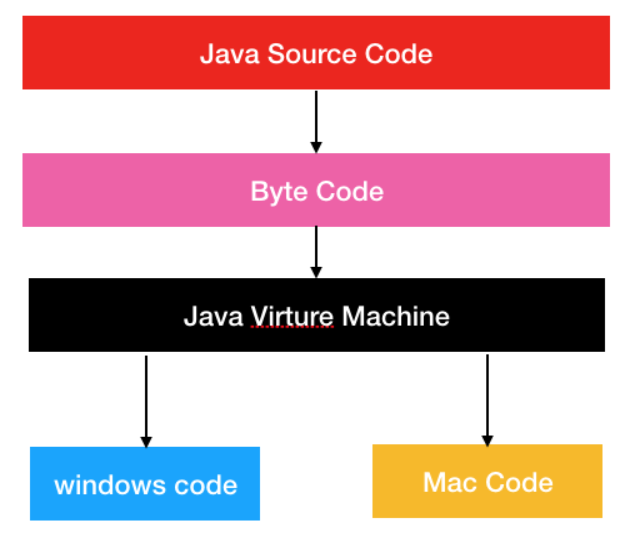
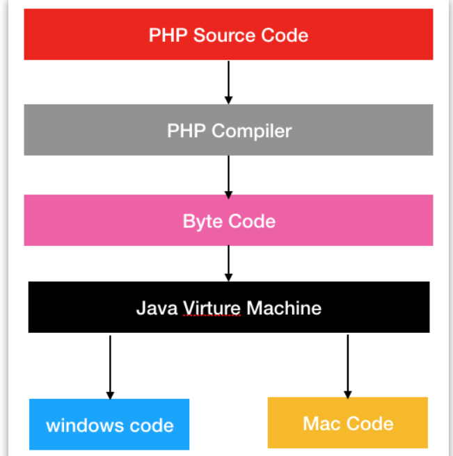
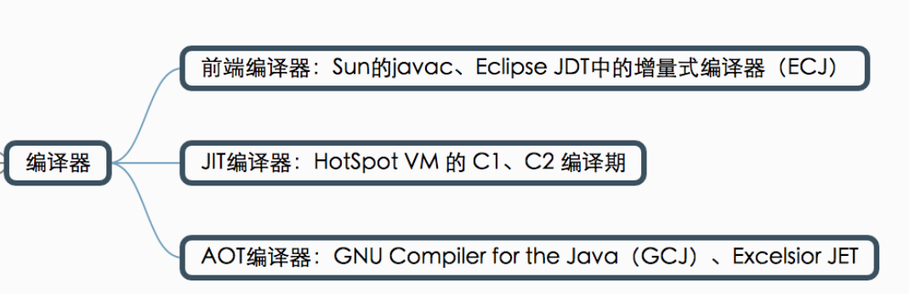
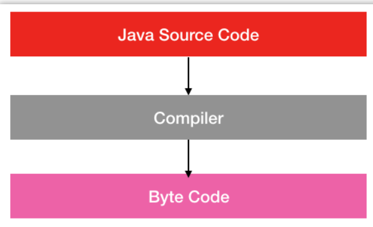
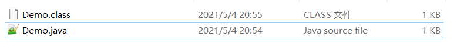
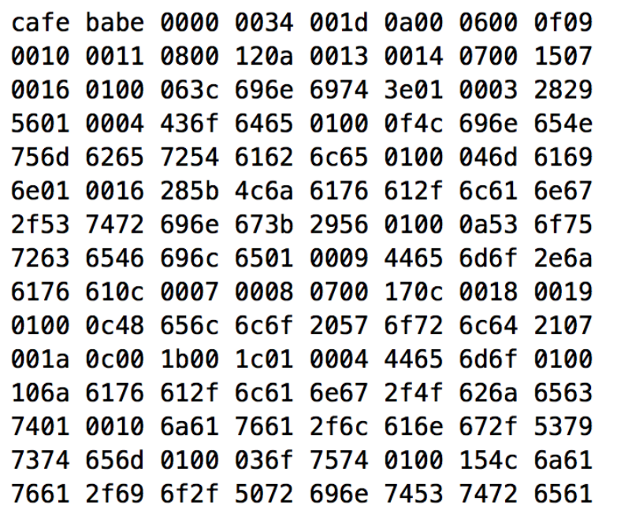
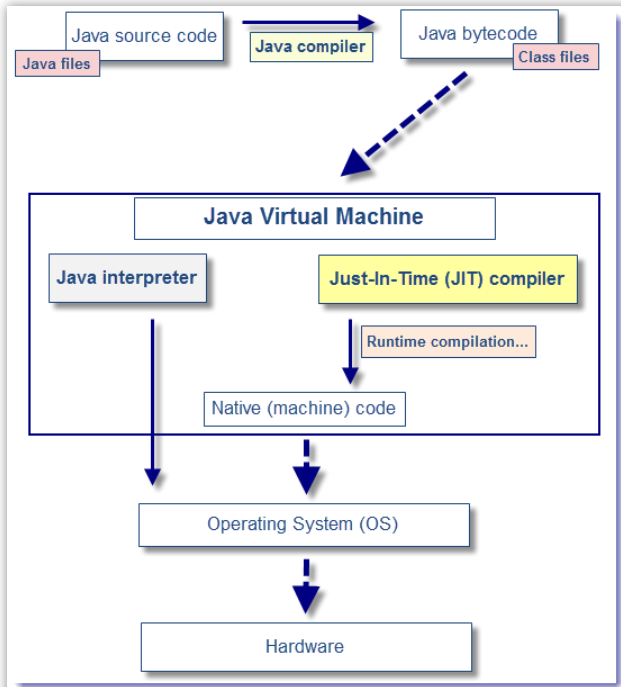
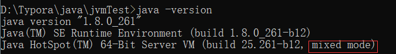

# JVM基础

## 为什么要学虚拟机

* **学习Java 虚拟机能深入地理解 Java 这门语言**
* **学习虚拟机是为线上排查问题打下基础**

## Java语言的前世今生

* 先来把那些我们经常混淆的概念弄清楚。

### JDK 与 JRE

* 简单地说 **JRE**（Java Runtime Environment）仅包含**运行 Java 程序的必需组件**，包括 Java 虚拟机以及 Java 核心类库等。而 **JDK**（Java Development Kit）除了包含 JRE外，还**附带了一系列开发、诊断工具。**
* 一般来说，如果只需要运行 Java 程序，那么你安装 JRE 即可。但如果你要进行 Java 程序的开发，那么你就需要安装 JDK。

### JDK 与 J2SE

* JDK 与 Java SE 是我们经常混淆的东西，其实 **JDK 是指包含了开发、诊断工具的一个组件，Java SE 则是 Java 三大技术体系的一个，用来开发java程序的技术体系。**
* 在 1998 年，JDK 1.2 发布，**Java 技术体系被拆分为 J2SE、J2EE、J2ME 三大体系。**
* J2SE 称之为**标准版技术体系**（Java 2 Standard Edition），它包含了构成 Java 语言核心的类，例如：数据库连接、网络编程、接口定义等。J2SE 技术体系主要用于桌面应用软件的编程。正因为 J2SE 包含了 JDK 核心类，所以在我们下载 JDK 时，你会看到其实下载处的文字说明是「Java SE 11.0.1 is the latest release for JDK 11」。
* J2EE 称之为**企业版技术体系**（Java 2 Enterprise Edition），它除了包含 J2SE 中的类，还包含用于开发企业级应用的类，比如：Servlet、JSP、EJB 等。**J2EE 技术体系主要用于分布式的网络程序的开发，如电子商务网站等。**
* J2ME 称之为**嵌入式技术体系**（Java 2 Micro Edition），它包含 J2SE 中的一部分类。J2ME 技术体系主要用于消费类电子产品的软件开发，例如：手机、PDA、寻呼机等。
* **简单地说，JDK 是一个核心库、开发工具、诊断工具的合集，而 Java SE 则是一个技术体系。**

### J2SE 与 Java SE2

* 其实它们指的是**同一个东西**，只不过在 2006 年 JDK 1.6 发布的时候，其将 J2SE、J2EE、J2ME 的命名方式改为 Java SE 6、Java EE 6、Java ME 6。
* 所以在下一次 JDK 1.7 发布的时候，其对应的三个技术体系就叫做：Java SE 7、Java EE 7、Java ME 7。**比起之前的命名方式，其增加了 JDK 的版本号，能够更加清晰地表明技术体系所属的 JDK 版本。**

### Java 语言的历史

在 1991 年，James Gosling 博士发布了 Oak，这个是 Java 语言的前身。但一直到 1995 年的时候，Oak 语言才改名为 Java。

- 1991 年，James Gosling 博士发布产品 Oak，这是 Java 语言的前身。
- 1995 年，Oak 语言改名为 Java。
- 1996 年，JDK1.0 发布，提供了纯解释执行的 Java 虚拟机实现：Sun Classic VM。
- 1997 年，JDK1.1 发布，代表技术有：JDBC、JavaBeans、内部类、反射。
- 1998 年，JDK1.2 发布，Java 技术体系被拆分为 J2SE、J2EE、J2ME 三大体系。
- 2000 年，JDK1.3 发布，默认的 Java 虚拟机由 Sun Classic VM 改为 HotSopt。
- 2002 年，JDK1.4 发布，Java 真正走向成熟，代表技术有：正则表达式、NIO等。
- 2004 年，JDK1.5 发布，对语法易用性做了很大改进，新增了泛型、枚举等，代表技术有：并发包等。
- 2006 年，JDK1.6 发布，将 J2EE/J2SE/J2ME 的命名方式改为 Java SE 6、Java EE 6、Java ME 6。
- 2009 年，Sun 公司因为经营不善被 Oracle 公司收购。
- 2011 年，JDK1.7 发布。
- 2013 年，JDK1.8 发布。

从上面的历史我们可以知道 Java 语言具有众多的特性，但是其众多特性并不是一蹴而就的，而是一点点迭代而来的。JDK 每个版本新增的语言特性如下：

- 1997 年，JDK1.1 发布，新增了JDBC、JavaBeans、内部类、反射。
- 2002 年，JDK1.4 发布，新增了正则表达式、NIO等。
- 2004 年，JDK1.5 发布，新增了泛型、枚举、并发包等。

### 总结

* 我们这一节简单地介绍了一些常见概念上的区别，以及 Java 语言的历史。通过这一节的内容，我们能对 Java 语言的发展有一个大致的理解，便于我们后续进行更加深入的学习。

## Java 虚拟机历史

**JDK 版本升级不仅仅体现在语言和功能特性上，还包括了其编译和执行的 Java 虚拟机的升级。**

- 1996 年，JDK 1.0 发布时，提供了纯解释执行的 Java 虚拟机实现：Sun Classic VM。
- 1997 年，JDK 1.1 发布时，虚拟机没有做变更，依然使用 Sun Classic VM 作为默认的虚拟机。
- 1998 年，JDK 1.2 发布时，提供了运行在 Solaris 平台的 Exact VM 虚拟机，但此时还是用 Sun Classic VM 作为默认的 Java 虚拟机。
- 2000 年，JDK1.3 发布，默认的 Java 虚拟机由 Sun Classic VM 改为 Sun HotSopt VM，而 Sun Classic VM 则作为备用虚拟机。
- 2002 年，JDK 1.4 发布，Sun Classic VM 退出商用虚拟机舞台，直接使用 Sun HotSpot VM 作为默认虚拟机一直到现在。

## 到底什么是虚拟机

* 与其他语言不同，**Java 语言并不直接将代码编译成与系统有关的机器码，而是编译成一种特定的语言规范，这种语言规范我们称之为字节码。**无论 Java 程序要在 Windows 系统，还是 Mac OSX 系统，亦或是 Linux 系统，它首先都得编译成字节码文件，之后才能运行。
* 但即使编译成字节码文件了，各个系统还是无法明白字节码文件的内容，这时候就需要 Java 虚拟机的帮助了。**Java 虚拟机会解析字节码文件的内容，并将其翻译为各操作系统能理解的机器码。**

*  Java 虚拟机出现之后，你只需要按照特定规范编译书写，编译器编译成字节码文件后，虚拟机会帮你将字节码生成对应的 Windows Code 和 Mac Code。本质上最终还是会生成 Windows Code 和 Mac Code 两份机器代码，但对于开发人员来说，却只需要写一次代码了。Java 虚拟机帮开发人员承担了重复的工作，让开发效率更高了。
* 很多初学者关于 Java 虚拟机有一个误区，他们会觉得 Java 虚拟机只能运行 Java 代码。*但实际上 **Java 虚拟机运行的是字节码文件**。*如果你用 php 语言写一段代码，并自己用特定编译器能生成符合字节码规范的字节码文件，那么 Java 虚拟机也是可以运行的。

* 所以虽然名字是 Java 虚拟机，**但 Java 虚拟机与 Java 语言没有直接关系，它只按照 Java 虚拟机规范去读取 Class 文件，并按照规定去解析、执行字节码指令**，仅此而已。准确地说，Java 虚拟机与字节码文件（Class文件）绑定。
* **其实 Java 虚拟机就是一个字节码翻译器，它将字节码文件翻译成各个系统对应的机器码，确保字节码文件能在各个系统正确运行。**

## 从源代码到机器码，发生了什么？

无论什么语言写的代码，其到**最后都是通过机器码运行**的，无一例外。那么对于 Java 语言来说，其从源代码到机器码，这中间到底发生了什么呢？这就是今天我们要聊的。

如下图所示，编译器可以分为：**前端编译器、JIT 编译器和AOT编译器**。下面我们逐个讲解。

### 前端编译器：源代码到字节码

* 对于 Java 虚拟机来说，其实际输入的是字节码文件，而不是 Java 文件。那么对于 Java 语言而言，其实怎**么将 Java 代码转化成字节码文件**的呢？我们知道在 JDK 的安装目录里有一个 javac 工具，就是它**将 Java 代码翻译成字节码，这个工具我们叫做编译器**。相对于后面要讲的其他编译器，其因为处于**编译的前期，因此又被成为前端编译器。**

* 通过 javac 编译器，我们可以很方便地**将 java 源文件翻译成字节码文件。**

* 使用纯文本编辑器打开 Demo.class 文件，我们会发现是一连串的 16 进制二进制流。

* 我们运行 javac 命令的过程，其实就是 **javac 编译器解析 Java 源代码，并生成字节码文件的过程。**说白了，其实就是使用 javac 编译器把 Java 语言规范转化为字节码语言规范。javac 编译器的处理过程可以分为下面四个阶段：
  * 第一个阶段：**词法、语法分析。**在这个阶段，JVM 会对源代码的字符进行一次扫描，最终生成一个抽象的语法树。简单地说，在这个阶段 JVM 会搞懂我们的代码到底想要干嘛。就像我们分析一个句子一样，我们会对句子划分主谓宾，弄清楚这个句子要表达的意思一样。
  * 第二个阶段：**填充符号表**。我们知道类之间是会互相引用的，但在编译阶段，我们无法确定其具体的地址，所以我们会使用一个符号来替代。在这个阶段做的就是类似的事情，即对抽象的类或接口进行符号填充。等到类加载阶段，**JVM 会将符号替换成具体的内存地址。**
  * 第三个阶段：**注解处理**。我们知道 Java 是支持注解的，因此在这个阶段会对注解进行分析，**根据注解的作用将其还原成具体的指令集。**
  * 第四个阶段：**分析与字节码生成。**到了这个阶段，JVM 便会根据上面几个阶段分析出来的结果，进行字节码的生成，最终输出为 class 文件。
* 我们一般称 javac 编译器为前端编译器，因为其发生在整个编译的前期。常见的前端编译器有 Sun 的 javac，Eclipse JDT 的增量式编译器（ECJ）。

### JIT 编译器：从字节码到机器码

* 当源代码转化为字节码之后，其实要运行程序，有两种选择。**一种是使用 Java 解释器解释执行字节码**，另一种则是**使用 JIT 编译器将字节码转化为本地机器代码。**
* 这两种方式的区别在于，**前者启动速度快但运行速度慢，而后者启动速度慢但运行速度快。**至于为什么会这样，其原因很简单。因为解释器不需要像 JIT 编译器一样，将所有字节码都转化为机器码，自然就少去了优化的时间。
* 当 JIT 编译器完成第一次编译后，其会将字节码对应的机器码保存下来，下次可以直接使用。而我们知道，机器码的运行效率肯定是高于 Java 解释器的。**所以在实际情况中，为了运行速度以及效率，我们通常采用两者相结合的方式进行 Java 代码的编译执行。**

图例：

* 在 **HotSpot 虚拟机内置了两个即时(JIT)编译器**，分别称为 Client Compiler 和Server Compiler。**这两种不同的编译器衍生出两种不同的编译模式**，我们分别称之为：C1 编译模式，C2 编译模式。
* 注意：现在许多人习惯上将 Client Compiler 称为 C1 编译器，将 Server Compiler 称为 C2 编译器，但在 Oracle 官方文档中将其描述为 compiler mode（编译模式）。**所以说 C1 编译器、C2 编译器只是我们自己的习惯性称呼，并不是官方的说法。这点需要特别注意。**

**那么 C1 编译模式和 C2 编译模式有什么区别呢？**

* C1 编译模式会将字节码编译为本地机器码，进行简单、可靠的优化，如有必要将加入性能监控的逻辑。而 C2 编译模式，也是将字节码编译为本地机器码，但是会启用一些编译耗时较长的优化，甚至会根据性能监控信息进行一些不可靠的激进优化。

* 简单地说 C1 编译模式做的优化相对比较保守，其编译速度相比 C2 较快。而 C2 编译模式会做一些激进的优化，并且会根据性能监控做针对性优化，所以其编译质量相对较好，但是耗时更长。

**那么到底应该选择 C1 编译模式还是 C2 编译模式呢？**

实际上对于 HotSpot 虚拟机来说，**其一共有三种运行模式可选**，分别是：

- 混合模式（Mixed Mode） 。即 C1 和 C2 两种模式加上解释器混合起来使用，**这是默认的运行模式**。如果你想单独使用 C1 模式或 C2 模式，使用 `-client` 或 `-server` 打开即可。
- 解释模式（Interpreted Mode）。即所有代码都解释执行，使用 `-Xint` 参数可以打开这个模式。
- 编译模式（Compiled Mode）。 此模式优先采用编译，但是无法编译时也会解释执行，使用 `-Xcomp` 打开这种模式。
- 在命令行中输入 `java -version` 可以看到，我机器上的虚拟机使用 Mixed Mode 运行模式。

* 写到这里，**我们了解了从 Java 源代码到字节码，再从字节码到机器码的全过程。**本来到这里就应该结束了，但在我们 **Java 中还有一个 AOT 编译器，它能直接将源代码转化为机器码。**

### AOT 编译器：源代码到机器码

* AOT 编译器的基本思想是：**在程序执行前生成 Java 方法的本地代码(机器码)，以便在程序运行时直接使用本地代码。**
* 但是 Java 语言本身的动态特性带来了额外的复杂性，影响了 Java 程序静态编译代码的质量。例如 Java 语言中的动态类加载，因为 AOT 是在程序运行前编译的，所以无法获知这一信息，所以会导致一些问题的产生。类似的问题还有很多，这里就不一一举例了。
* 总的来说，AOT 编译器从编译质量上来看，肯定比不上 JIT 编译器。**其存在的目的在于避免 JIT 编译器的运行时性能消耗或内存消耗，或者避免解释程序的早期性能开销。**
* 在运行速度上来说，AOT 编译器编译出来的代码比 JIT 编译出来的慢，但是比解释执行的快。而编译时间上，AOT 也是一个始终的速度。所以说，**AOT 编译器的存在是 JVM 牺牲质量换取性能的一种策略**。就如 JVM 其运行模式中选择 Mixed 混合模式一样，使用 C1 编译模式只进行简单的优化，而 C2 编译模式则进行较为激进的优化。充分利用两种模式的优点，从而达到最优的运行效率。

### 总结

* 在 JVM 中有三个非常重要的编译器，它们分别是：**前端编译器、JIT 编译器、AOT 编译器。**
* **前端编译器**，最常见的就是我们的 javac 编译器，其将 **Java 源代码编译为 Java 字节码文件。**
* **JIT 即时编译器**，最常见的是 HotSpot 虚拟机中的 Client Compiler 和 Server Compiler，其**将 Java 字节码编译为本地机器代码。**
* 而 **AOT 编译器**则能**将源代码直接编译为本地机器码。**

**这三种编译器的编译速度和编译质量如下：**前端编译器并不会编译为本地机器码，故不进行比较，解释器解释执行字节码文件，但不会将其全部转换为本地机器码。

- 编译速度上，解释执行 > AOT 编译器 > JIT 编译器。
- 编译质量上，JIT 编译器 > AOT 编译器 > 解释执行。

**而在 JVM 中，通过这几种不同方式的配合，使得 JVM 的编译质量和运行速度达到最优的状态。**

## 字节码文件结构

* 其实字节码是有一套规范的，而规定字节码格式的就是《Java 虚拟机规范》。**《Java 虚拟机规范》规定了 Java 虚拟机结构、Class 类文件结构、字节码指令等内容。**其中类文件结构是有必要了解的一个内容。
* 字节码文件结构是一组以 8 位字节为基础的二进制流，各数据项目严格按照顺序紧凑地排列在 Class 文件之中，中间没有添加任何分隔符。**在字节码结构中，有两种最基本的数据类型来表示字节码文件格式，分别是：无符号数和表。**
* 高版本的 JDK 能向下兼容以前笨笨的 Class 文件，但不能运行新版本的 Class 文件。**例如一个 Class 文件是使用 JDK 1.5 编译的，那么我们可以用 JDK 1.7 虚拟机运行它，但不能用 JDK 1.4 虚拟机运行它。**

* 在字节码结构中，有两种最基本的数据类型来表示字节码文件格式，分别是：无符号数和表。
* **无符号数属于最基本的数据类型。**它以 u1、u2、u4、u8 六七分别代表 1 个字节、2 个字节、4 个字节、8 个字节的无符号数。无符号数可以用来描述数字、索引引用、数量值或者按照 UTF-8 编码构成的字符串值。 
* **表是由多个无符号数或者其他表作为数据项构成的复合数据类型。**表都习惯性地以`_info`结尾。表用于描述有层次关系的复合结构的数据。

* 首先我们要清楚，**字节码文件是使用十六进制进行编码的**

### 常量池

* 紧跟版本信息之后的是常量池信息，其中前 2 个字节表示常量池个数，其后的不定长数据则表示常量池的具体信息。
* 常量池的常量都是由`cp_info`这种表结构组成的，而且表结构不同其大小也不同。在 Java 虚拟机规范中一共有 14 种 `cp_info` 类型的表结构。

### 访问标志

* 在常量池结束之后，紧接着的两个字节代表类或接口的访问标记（access_flags）.
* 这个标志用于识别一些类或者接口层次的访问信息，包括：这个Class是类还是接口、是否定义为public类型、是否定义为abstract类型等。
* 访问标志可能是由多个标志名称组成的，**所以字节码文件中的标志值其实是多个值进行或运算的结果。**

### 类索引、父类索引、接口索引

* 在访问标记后，则是类索引、父类索引、接口索引的数据。**索引即对应着常量池中的第几个常量。**
* 类索引和父类索引都是一个u2类型的数据，而接口索引集合是一组u2类型的数据的集合，Class 文件中由这三项数据来确定这个类的继承关系。
* 

### 字段表集合

* 字段表集合用于描述接口或者类中声明的变量
* 这里说的字段包括类级变量和实例级变量，但不包括在方法内部声明的局部变量。在类接口集合后的2个字节是一个字段计数器，表示总有有几个属性字段。在字段计数器后，才是具体的属性数据。

* 字段表的每个字段用一个名为 field_info 的表来表示，field_info 表的数据结构如下所示：

### 方法表集合

* 在字段表后的 2 个字节是一个方法计数器，表示类中总有有几个方法，在字段计数器后，才是具体的方法数据。

* 方法表中的**每个方法都用一个 method_info** 表示，其数据结构如下：

* 紧接着 2 个字节表示属性表计数器（字节码文件中方法中对应属性），这里是 00 01 表示该方法的属性表一共有 1 个属性。属性表的**模板表**结构如下：

  

* 属性可为多种Code、SourceFile、LineNumberTable等，通过属性名找出具体的属性，Code属性是方法的字节码描述。 Code 属性的表结构如下：

* LineNumberTable属性描述方法中字节码行号和源码行号的对应。LineNumberTable 表的表结构如下图所示。

  下面是 line_number_info 表的结构，其包含了 start_pc 和 line_number 两个 u2 类型的数据项。前者是字节码行号，后者是 Java 源码行号。

### 属性表集合

* **上面分析的是方法中的属性，而这个是类中的属性。**

* 后面紧跟着 1 个表结构为 attribute_info 的属性数据。attribute_info 表的结构如下图所示。

  SourceFile 属性的表结构如下图所示。

* 但在实际使用或分析问题的时候，我们通常用 `javap` 工具帮助我们完成这个过程，这样能提高效率。使用 `javap` 工具很简单，只需要这样使用：`javap -verbose Demo.class` 就可以将字节码文件全部分析出来。下面给出此次 Demo.class 文件的反编译完整截图。

### 总结

*  最后用一张图来总结一下:


## Java虚拟机内存结构

* **字节码数据**在 Java 虚拟机内存中是如何存放的 ？Java 虚拟机在为类实例或成员变量分配内存是如何分配的 ？

* 根据《Java 虚拟机规范》中的说法，Java 虚拟机的内存结构可以分为公有和私有两部分。**公有指的是所有线程都共享的部分，指的是 Java 堆、方法区、常量池。私有指的是每个线程的私有数据，包括：PC寄存器、Java 虚拟机栈、本地方法栈。**

### 公有部分：Java堆、方法区、常量池

* 在 Java 虚拟机中，线程共享部分包括 Java 堆、方法区及常量池。
* Java 堆指的是从 JVM 划分出来的一块区域，这块区域专门用于 Java 实例对象的内存分配，**几乎所有实例对象都在会这里进行内存的分配。**
* 之所以说几乎是因为有特殊情况，有些时候小对象会直接在栈上进行分配，这种现象我们称之为「栈上分配」。
* 方法区指的是**存储 Java 类字节码数据**的一块区域，它**存储了每一个类的结构信息**，例如运行时常量池、字段和方法数据、构造方法等。可以看到**常量池其实是存放在方法区中**的，但《Java 虚拟机规范》将常量池和方法区放在同一个等级上，这点我们知晓即可。
* 方法区在不同版本的虚拟机有不同的表现形式，例如在 1.7 版本的 HotSpot 虚拟机中，方法区被称为永久代（Permanent Space），而在 JDK 1.8 中则被称之为 MetaSpace。

* Java 堆根据对象存活时间的不同，Java 堆还被分为年轻代、老年代两个区域，年轻代还被进一步划分为 Eden 区、From Survivor 0、To Survivor 1 区。如下图所示。

* 当有对象需要分配时，**一个对象永远优先被分配在年轻代的 Eden 区，等到 Eden 区域内存不够时，Java 虚拟机会启动垃圾回收。**此时 Eden 区中没有被引用的对象的内存就会被回收，而**一些存活时间较长的对象则会进入到老年代。**
* 为什么默认的虚拟机配置，Eden：from ：to = 8:1:1 呢？根据 IBM 公司对对象存活时间的统计，他们发现 80% 的对象存活时间都很短。于是他们将 Eden 区设置为年轻代的 80%，这样可以减少内存空间的浪费，提高内存空间利用率。

### 私有部分：PC寄存器、Java 虚拟机栈、本地方法栈

* PC 寄存器，顾名思义 Program Counter 寄存器，指的是保存线程当前正在执行的方法。**如果这个方法不是 native 方法，那么 PC 寄存器就保存 Java 虚拟机正在执行的字节码指令地址**。**如果是 native 方法，那么 PC 寄存器保存的值是 undefined**。任意时刻，一条 Java 虚拟机线程只会执行一个方法的代码，而这个被线程执行的方法称为该线程的当前方法，其地址被存在 PC 寄存器中。
* Java 虚拟机栈，这个栈与线程同时创建，用来存储栈帧，**即存储局部变量与一些过程结果的地方。**栈帧存储的数据包括：局部变量表、操作数栈。
* 当 Java 虚拟机**使用其他语言**（例如 C 语言）来实现指令集解释器时，也**会使用到本地方法栈**。如果 Java 虚拟机不支持 natvie 方法，并且自己也不依赖传统栈的话，可以无需支持本地方法栈。

### 总结

* 学到这里，一个 Java 文件就加载到内存中了，并且 Java 类信息就会存储在我们的方法区中。如果创建对象，那么对象数据就会存放在 Java 堆中。如果调用方法，就会用到 PC 寄存器、Java 虚拟机栈、本地方法栈等结构。

## JVM类加载机制

* 面对如此之多的 Java 类，JVM 是如何决定这些类的加载顺序，又是如此控制它们的加载的呢？
* 当编译器将 Java 源码编译为字节码之后，**虚拟机便可以将字节码读取进内存，从而进行解析、运行等整个过程，这个过程我们叫：Java 虚拟机的类加载机制。**JVM 虚拟机执行 class 字节码的过程可以分为七个阶段：**加载、验证、准备、解析、初始化、使用、卸载。**

### 加载

官方解释：

* 加载阶段是类加载过程的第一个阶段。在这个阶段，JVM 的主要目的是将字节码从各个位置（网络、磁盘等）转化为二进制字节流加载到内存中，接着会为这个类在 JVM 的方法区创建一个对应的 Class 对象，这个 Class 对象就是这个类各种数据的访问入口。
* 其实加载阶段用一句话来说就是：**把代码数据加载到内存中。**这个过程对于我们解答这道问题没有直接的关系，但这是类加载机制的一个过程，所以必须要提一下。

### 验证

* 当 JVM 加载完 Class 字节码文件并在方法区创建对应的 Class 对象之后，JVM 便会启动**对该字节码流的校验**，只有符合 JVM 字节码规范的文件才能被 JVM 正确执行。这个校验过程大致可以分为下面几个类型
  * **JVM规范校验。**
  * **代码逻辑校验。**
* 当代码数据被加载到内存中后，虚拟机就会对代码数据进行校验，看看这份代码是不是真的按照JVM规范去写的。这个过程对于我们解答问题也没有直接的关系，但是了解类加载机制必须要知道有这个过程。

### 准备（重点）

* 当完成字节码文件的校验之后，JVM 便会开始为类变量分配内存并初始化。这里需要注意两个关键点，即**内存分配的对象以及初始化的类型。**
  * **内存分配的对象。**Java 中的变量有「类变量」和「类成员变量」两种类型，「类变量」指的是**被 static 修饰的变量**，而其他所有类型的变量都属于「类成员变量」。**在准备阶段，JVM 只会为「类变量」分配内存，而不会为「类成员变量」分配内存。「类成员变量」的内存分配需要等到初始化阶段才开始。**
  * **初始化的类型。** **在准备阶段，JVM 会为类变量分配内存，并为其初始化。但是这里的初始化指的是为变量赋予 Java 语言中该数据类型的零值**，而不是用户代码里初始化的值。
  * 但**如果一个变量是常量（被 static final 修饰）的话，那么在准备阶段，属性便会被赋予用户希望的值。**(final：一旦赋值就不可改变)。

### 解析

* 当通过准备阶段之后，JVM 针对类或接口、字段、类方法、接口方法、方法类型、方法句柄和调用点限定符 **7 类引用进行解析**。这个阶段的主要任务是**将其在常量池中的符号引用替换成直接其在内存中的直接引用。**
* 其实这个阶段对于我们来说也是几乎透明的，了解一下就好。

### 初始化（重点）

* 这里的初始化指的是类在虚拟机中的初始化，与代码中的初始化/实例化不同，这里的初始化是对类进行，相当于先构建一个模板，不会执行构造器。类初始化只执行一次。

* 到了初始化阶段，用户定义的 Java 程序代码才真正开始执行。在这个阶段**，JVM 会根据语句执行顺序对类对象进行初始化**，一般来说当 JVM 遇到下面 5 种情况的时候会触发初始化：

  * 遇到 new、getstatic、putstatic、invokestatic 这四条字节码指令时，如果类没有进行过初始化，则需要先触发其初始化。生成这4条指令的最常见的Java代码场景是：使用new关键字实例化对象的时候、读取或设置一个类的静态字段（被final修饰、已在编译器把结果放入常量池的静态字段除外）的时候，以及调用一个类的静态方法的时候。
  * 使用 java.lang.reflect 包的方法对类进行反射调用的时候，如果类没有进行过初始化，则需要先触发其初始化。
  * 当初始化一个类的时候，如果发现其父类还没有进行过初始化，则需要先触发其父类的初始化。
  * 当虚拟机启动时，用户需要指定一个要执行的主类（包含main()方法的那个类），虚拟机会先初始化这个主类。
  * 当使用 JDK1.7 动态语言支持时，如果一个 java.lang.invoke.MethodHandle实例最后的解析结果 REF_getstatic,REF_putstatic,REF_invokeStatic 的方法句柄，并且这个方法句柄所对应的类没有进行初始化，则需要先出触发其初始化。

  看到上面几个条件你可能会晕了，但是不要紧，不需要背，知道一下就好，后面用到的时候回到找一下就可以了。

### 使用

* 当 JVM 完成初始化阶段之后，JVM 便开始**从入口方法开始执行用户的程序代码**。这个阶段也只是了解一下就可以。

### 卸载

* 当用户程序代码执行完毕后，JVM 便开始销毁创建的 Class 对象，最后负责运行的 JVM 也退出内存。这个阶段也只是了解一下就可以。

### 类的初始化顺序

* 在我们代码中，我们只知道有一个构造方法，但实际上Java代码编译成字节码之后，是没有构造方法的概念的，**只有类初始化方法 和 对象初始化方法 。**
  * 类初始化方法（类构造器方法）。类初始化时执行，编译器会按照其出现顺序，收集**类变量的赋值语句、静态代码块，最终组成类初始化方法**。**类初始化方法一般在类初始化的时候执行。**不包含静态方法
  * 对象初始化方法（对象构造器方法）。对象实例化时执行，编译器会按照其出现顺序，收集**成员变量的赋值语句、普通代码块，最后收集构造函数的代码，最终组成对象初始化方法**。**对象初始化方法一般在实例化类对象的时候执行。** 构造方法最后执行

### 例子

```java
public class Book {
    public static void main(String[] args)
    {
        staticFunction();
    }

    static Book book = new Book();

    static
    {
        System.out.println("书的静态代码块");
    }

    {
        System.out.println("书的普通代码块");
    }

    Book()
    {
        System.out.println("书的构造方法");
        System.out.println("price=" + price +",amount=" + amount);
    }

    public static void staticFunction(){
        System.out.println("书的静态方法");
    }

    int price = 110;
    static int amount = 112;
}
```

上面这个例子的输出结果是：

```java
书的普通代码块
书的构造方法
price=110,amount=0
书的静态代码块
书的静态方法
```

* 当 JVM 在**准备**阶段的时候，便会为类变量分配内存和进行初始化。此时，我们的 book 实例变量被初始化为 null，amount 变量被初始化为 0。
* 当进入**初始化**阶段后，因为 Book 方法是程序的入口，根据我们上面说到的类初始化的五种情况的第四种（当虚拟机启动时，用户需要指定一个要执行的主类（包含main()方法的那个类），虚拟机会先初始化这个主类）。所以JVM 会初始化 Book 类，即执行类构造器方法 。
* JVM 对 Book 类进行初始化首先是执行类构造器（按顺序收集类中所有静态代码块和类变量赋值语句就组成了类构造器 ），因为static Book book = new Book();所以执行对象的构造器（按顺序收集成员变量赋值和普通代码块，最后收集对象构造器，最终组成对象构造器 ）,接着执行剩下的类构造器方法。

### 方法论

* 从上面几个例子可以看出，分析一个类的执行顺序大概可以按照如下步骤：
  * **确定类变量的初始值。**在类加载的准备阶段，JVM 会为类变量初始化零值，这时候类变量会有一个初始的零值。如果是被 final 修饰的类变量，则直接会被初始成用户想要的值。
  * **初始化入口方法。**当进入类加载的初始化阶段后，JVM 会寻找整个 main 方法入口，从而初始化 main 方法所在的整个类。当需要对一个类进行实例化时，会首先初始化类构造器（），之后初始化对象构造器（）。
  * **初始化类构造器。**JVM 会按顺序收集类变量的赋值语句、静态代码块，最终组成类构造器由 JVM 执行。
  * **初始化对象构造器。**JVM 会按照收集成员变量的赋值语句、普通代码块，最后收集构造方法，将它们组成对象构造器，最终由 JVM 执行。
* 如果在初始化 main 方法所在类的时候遇到了其他类的初始化，那么就**先加载对应的类，加载完成之后返回**。如此反复循环，最终返回 main 方法所在类。

## JVM 垃圾回收机制

* 因为内存总是有限的，我们需要一个机制来不断地回收废弃的内存，从而实现内存的循环利用，这样程序才能正常地运转下去。
* 比起 Java 虚拟机的内存结构有《Java 虚拟机规范》规定，垃圾回收机制并没有具体的规范约束。所以很多时候不同的虚拟机有不同的实现方式，**下面所说的垃圾回收都是以 HotSpot 虚拟机为例。**

### 到底谁是垃圾？

* 在 Java 中也是如此，如果一个对象不可能再被引用，那么这个对象就是垃圾，应该被回收。
* 现今的 Java 虚拟机**判断垃圾对象**使用的是：GC Root Tracing 算法。其大概的过程是这样：从 GC Root 出发，所有**可达的对象都是存活的对象，而所有不可达的对象都是垃圾。**
* 可以看到这里最重要的就是 GC Root 这个集合了，其实 GC Root 就是一组活跃引用的集合。但是这个集合又与一般的对象集合不太一样，这些集合是经过特意筛选出来的，通常包括：
  * 所有当前被加载的 Java 类
  * Java 类的引用类型静态变量
  * Java类的运行时常量池里的引用类型常量
  * VM的一些静态数据结构里指向GC堆里的对象的引用
  * 等等
* 简单地说**，GC Root 就是经过精心挑选的一组活跃引用**，这些引用是肯定存活的。那么通过这些引用延伸到的对象，自然也是存活的。

### 如何进行垃圾回收？

* 垃圾回收算法简单地说有三种算法：标记清除算法、复制算法、标记压缩算法。
* **标记清除算法。**从名字可以看到其分为两个阶段：标记阶段和清除阶段。一种可行的实现方式是，在标记阶段，标记所有由 GC Root 触发的可达对象。此时，所有未被标记的对象就是垃圾对象。之后在清除阶段，清除所有未被标记的对象。标记清除算法最大的问题就是空间碎片问题。如果空间碎片过多，则会导致内存空间的不连续。虽说大对象也可以分配在不连续的空间中，但是效率要低于连续的内存空间。
* **复制算法。**复制算法的核心思想是将原有的内存空间分为两块，每次只使用一块，在垃圾回收时，将正在使用的内存中的存活对象复制到未使用的内存块中。之后清除正在使用的内存块中的所有对象，之后交换两个内存块的角色（一块使用，一块不使用，具体实现方式依情况有不同），完成垃圾回收。该算法的缺点是要将内存空间折半，极大地浪费了内存空间。
* **标记压缩算法。**标记压缩算法可以说是标记清除算法的优化版，其同样需要经历两个阶段，分别是：标记结算、压缩阶段。在标记阶段，从 GC Root 引用集合触发去标记所有对象。在压缩阶段，其则是将所有存活的对象压缩在内存的一边，之后清理边界外的所有空间。
* 标记压缩算法。标记压缩算法可以说是标记清除算法的优化版，其同样需要经历两个阶段，分别是：标记结算、压缩阶段。在标记阶段，从 GC Root 引用集合触发去标记所有对象。在压缩阶段，其则是将所有存活的对象压缩在内存的一边，之后清理边界外的所有空间。

### 分代思想

* 试想一下，如果我们单独采用任何一种算法，那么最终的垃圾回收效率都不会很好。
* 所谓分代算法，就是根据 JVM 内存的**不同内存区域，采用不同的垃圾回收算法**。例如对于**存活对象少的新生代区域，比较适合采用复制算法**。这样只需要复制少量对象，便可完成垃圾回收，并且还不会有内存碎片。而对于**老年代这种存活对象多的区域，比较适合采用标记压缩算法或标记清除算法**，这样不需要移动太多的内存对象。

再深入地聊一聊新生代里采取的垃圾回收算法。如我们上面所说，**新生代的特点是存活对象少，适合采用复制算法。**而复制算法的一种最简单实现便是折半内存使用，另一半备用。但实际上我们知道，在**实际的 JVM 新生代划分中，却不是采用等分为两块内存的形式。而是分为：Eden 区域、from 区域、to 区域 这三个区域。**那么为什么 JVM 最终要采用这种形式，而不用 50% 等分为两个内存块的方式？

* 要解答这个问题，我们就需要先深入了解新生代对象的特点。根据IBM公司的研究表明，在新生代中的对象 98% 是朝生夕死的，所以并不需要按照1:1的比例来划分内存空间。
* 所以在HotSpot虚拟机中，JVM 将内存划分为一块较大的Eden空间和两块较小的Survivor空间，其大小占比是8:1:1。**当回收时，将Eden和Survivor中还存活的对象一次性复制到另外一块Survivor空间上，最后清理掉Eden和刚才用过的Eden空间。（也清除掉survivor的）**
* 通过这种方式，**内存的空间利用率达到了90%，只有10%的空间是浪费掉了**。而如果通过均分为两块内存，则其内存利用率只有 50%，两者利用率相差了将近一倍。
* 对象保存在Eden和from survivor区，minor GC运行时，Eden中的幸存对象会被复制到to Survivor（同时对象年龄会增加1）。而from survivor区中的幸存对象会考虑对象年龄，如果年龄没达到阈值，对象依然复制到to survivor中。如果对象达到阈值那么将被移到老年代。复制阶段完成后，Eden和From幸存区中只保存死对象，可以视为清空。如果在复制过程中to幸存区被填满了，剩余的对象将被放到老年代。最后，From survivor和to survivor会调换一下名字，下次Minor GC时，To survivor变为From Survivor。


### 分区思想

* **分代**思想按照**对象的生命周期长短**将其分为了两个部分（新生代、老年代），但 JVM 中其实还有一个分区思想，即将**整个堆空间划分成连续的不同小区间。**
* 每一个**小区间都独立使用，独立回收**，这种算法的好处是可以控制一次回收多少个区间，可以较好地控制 GC 时间。
* 到这里我们基本上把 JVM 的垃圾回收都将清除了，从一开始什么是垃圾，到之后如何判断垃圾，到如何回收垃圾，到垃圾回收的两个重要思想：分代思想、分区思想。通过这么一个脉络，我们了解了垃圾回收的整体概括。在下面的章节中，我们将深入介绍这其中的细节。

## JVM垃圾回收器

* 说说具体执行垃圾回收的垃圾回收器。
* 总的来说，Java 虚拟机的垃圾回收器可以分为四大类别：**串行回收器、并行回收器、CMS 回收器、G1 回收器。**

### 串行回收器

* 串行回收器是指使用**单线程进行垃圾回收的回收器**。因为每次回收时只有一个线程，因此串行回收器在并发能力较弱的计算机上，其专注性和独占性的特点往往能让其有更好的性能表现。
* 根据作用于不同的堆空间，分为新生代串行回收器和老年代串行回收器。

#### **新生代串行回收器**

* 在新生代串行回收器中使用的是复制算法。在串行回收器进行垃圾回收时，会触发 Stop-The-World 现象，即其他线程都需要暂停，等待垃圾回收完成。因此在某些情况下，其会造成较为糟糕的用户体验。

#### **老年代串行回收器**

* 在老年代串行回收器中使用的是标记压缩算法。其与新生代串行收集器一样，只能串行、独占式地进行垃圾回收，因此也经常会有较长时间的 Stop-The-World 发生。

## 并行回收器

* 并行回收器在串行回收器的基础上做了改进，**其使用多线程进行垃圾回收**。对于并行能力强的机器，可以有效缩短垃圾回收所使用的时间。

  根据作用内存区域的不同，并行回收器也有三个不同的回收器：新生代 ParNew 回收器、新生代 ParallelGC 回收器、老年代 ParallelGC 回收器。

#### **新生代 ParNew 回收器**

* 新生代 ParNew 回收器工作在新生代，其**只是简单地将串行回收器多线程化**，其回收策略、算法以及参数和新生代串行回收器一样。

#### **新生代 Parallel GC 回收器**

* 新生代 Parallel GC 回收器与新生代 ParNew 回收器非常类似，其也是使用复制算法，都是多线程、独占式的收集器，也会导致 Stop-The-World。但其余 ParNew 回收器的一个重大不同是：其非常注重系统的吞吐量。
* Parallel GC 回收器提供了两个重要参数用于控制系统的吞吐量。

#### **老年代 ParallelOldGC 回收器**

* 老年代 ParallelOldGC 回收器也是一种多线程并发的回收器，与新生代 ParallelGC 收集器一样，其也是注重吞吐量的收集器，只不过其是作用于老年代。
* ParallelOldGC 回收器使用的是**标记压缩算法**，只有在 JDK 1.6 中才可以使用。

## CMS 回收器

* 与 ParallelGC 和 ParallelOldGC 不同，CMS 回收器主要关注系统停顿时间。CMS 回收器全称为 Concurrent Mark Sweep，意为标记清除算法，其是一个使用多线程并行回收的垃圾回收器。

#### **工作步骤**

* CMS 的主要工作步骤有：初始标记、并发标记、预清理、重新标记、并发清除和并发充值。其中初始标记和重新标记是独占系统资源的，而其他阶段则可以和用户线程一起执行。

#### **主要参数**

## G1 回收器

* G1 回收器是 JDK 1.7 中使用的全新垃圾回收器，从长期目标来看，其是为了取代 CMS 回收器。

  G1 回收器拥有独特的垃圾回收策略，和之前所有垃圾回收器采用的垃圾回收策略不同。**从分代看，G1 依然属于分代垃圾回收器。但它最大的改变是使用了分区算法，从而使得 Eden 区、From 区、Survivor 区和老年代等各块内存不必连续**

* 在 G1 回收器之前，所有的垃圾回收器其内存分配都是连续的一块内存，如下图所示。


而在 G1 回收器中，其将一大块的内存分为许多细小的区块，从而不要求内存是连续的。


从上图我们还可以看到 H 是以往算法中没有的，它代表 Humongous。这表示这些 Region 存储的是**巨型对象**（humongous object，H-obj），当新建对象大小超过 Region 大小一半时，直接在新的一个或多个连续 Region 中分配，并标记为 H。

* 堆内存中一个 Region 的大小可以通过 `-XX:G1HeapRegionSize` 参数指定，大小区间只能是1M、2M、4M、8M、16M 和 32M，总之是2的幂次方。如果G1HeapRegionSize 为默认值，即把设置的最小堆内存按照2048份均分，最后得到一个合理的大小。

#### 工作步骤

G1 收集器的收集过程主要有四个阶段：

- 新生代 GC
- 并发标记周期
- 混合收集
- 如果需要，可能进行 FullGC

并发标记周期则分为：初始标记、根区域扫描、并发标记、重新标记、独占清理、并发清理阶段。其中初始标记、重新标记、独占清理是独占式的，会引起停顿。并且初始标记会引发一次新生代 GC。在这个阶段，所有将要被回收的区域会被 G1 记录在一个称之为 Collection Set 的集合中。

### 总结

* 从一开始的串行回收器，到后来的并行回收器、CMS回收器，到最后的 G1 回收器，垃圾回收器不断改进，使得垃圾回收效率不断提升。特别是分区思想诞生后，对于垃圾回收停顿时间的控制更加细腻，可以让应用有更完美的延时控制，从而呈现更好的用户体验。

## 垃圾回收的几种类型

* 我们经常会听到许多垃圾回收的术语，例如：**Minor GC、Major GC、Young GC、Old GC、Full GC、Stop-The-World** 等。但这些 GC 术语到底指的是什么，它们之间的区别到底是什么？今天我们就来详细说说。

### Minor GC

从**年轻代空间回收内存被称为 Minor GC**，有时候也称之为 Young GC。对于 Minor GC，你需要知道的一些点：

* 当 JVM 无法为一个新的对象分配空间时会触发 Minor GC，比如当 Eden 区满了。所以 Eden 区越小，越频繁执行 Minor GC。
* 当年轻代中的 Eden 区分配满的时候，年轻代中的部分对象会晋升到老年代，所以 Minor GC 后老年代的占用量通常会有所升高。
* 质疑常规的认知，所有的 Minor GC 都会触发 Stop-The-World，停止应用程序的线程。对于大部分应用程序，**停顿导致的延迟都是可以忽略不计的**，**因为大部分 Eden 区中的对象都能被认为是垃圾，永远也不会被复制到 Survivor 区或者老年代空间。**如果情况相反，即 Eden 区大部分新生对象不符合 GC 条件（即他们不被垃圾回收器收集），那么 Minor GC 执行时暂停的时间将会长很多（因为他们要JVM要将他们复制到 Survivor 区或老年代）。

### Major GC

* 从老年代空间回收内存被称为 Major GC，有时候也称之为 Old GC。
* 许多 Major GC 是由 Minor GC 触发的，所以很多情况下将这两种 GC 分离是不太可能的。
* Minor GC 作用于年轻代，Major GC 作用于老年代。 **分配对象内存时发现内存不够，触发 Minor GC。Minor GC 会将对象移到老年代中，如果此时老年代空间不够，那么触发 Major GC。**因此才会说，许多 Major GC 是由 Minor GC 引起的。

### Full GC

* Full GC 是清理整个堆空间 —— 包括年轻代、老年代和永久代（如果有的话）。因此 Full GC 可以说是 Minor GC 和 Major GC 的结合。
* 当准备要触发一次 Minor GC 时，**如果发现年轻代的剩余空间比以往晋升的空间小，则不会触发 Minor GC 而是转为触发 Full GC**。因为JVM此时认为：之前这么大空间的时候已经发生对象晋升了，那现在剩余空间更小了，那么很大概率上也会发生对象晋升。既然如此，那么我就直接帮你把事情给做了吧，直接来一次 Full GC，整理一下老年代和年轻代的空间。
* 另外，即**在永久代分配空间但已经没有足够空间时，也会触发 Full GC。**

### Stop-The-World

* Stop-The-World，中文一般翻译为全世界暂停，是指在进行**垃圾回收时因为标记或清理的需要，必须让所有执行任务的线程停止执行任务，从而让垃圾回收线程回收垃圾的时间间隔。**
* 在 Stop-The-World 这段时间里，**所有非垃圾回收线程都无法工作，都暂停下来。只有等到垃圾回收线程工作完成才可以继续工作**。可以看出，**Stop-The-World 时间的长短将关系到应用程序的响应时间**，因此在 GC 过程中，Stop-The-World 的时间是一个非常重要的指标。

## JVM参数之堆栈空间配置

* JVM 中最重要的一部分就是堆空间了，基本上大多数的线上 JVM 问题都是因为堆空间造成的 OutOfMemoryError。因此掌握 JVM 关于堆空间的参数配置对于排查线上问题非常重要。
* ***tips：本文所有配置，如无特别说明，均基于JDK1.8。***

### 堆配置

我们使用 **-Xms 设置堆的初始空间大小，使用 -Xmx 设置堆的最大空间大小。**

```
java -Xms20m -Xmx30m GCDemo
```

在上面的命令中，我们设置 JVM 的初始堆大小为 20M，最大堆空间为 30M。

### 年轻代

在 JDK1.8 中，堆分为年轻代和老年代。JVM 提供了参数 -Xmn 来设置年轻代内存的大小，但没有提供参数设置老年代的大小。但其实**老年代的大小就等于堆大小减去年轻代大小。**

```java
java -Xms20m -Xmn10M GCDemo//-Xms20m指定堆初始空间大小，-Xms10m新生代大小
```

上面的命令中，我们设置 JVM 堆初始大小为20M。其中年轻代的大小为 10M，那么剩下的就是老年代的大小，有 10M了。 我们可以给上述命令加上`-XX:+PrintGCDetails` 参数来**查看内存区域的分配信息。**

### Eden区

* 在年轻代中，分为三个区域，分别是：eden 空间、from 空间、to 空间。如果要设置这部分的大小，那么就使用 -XX:SurvivorRatio 这个参数，**该参数设置 eden / from 空间的比例**关系，该参数的公式如下：

```java
-XX:SurvivorRatio = eden/from = eden/to
```

例如我们的年轻代有 10 M，而我们设置 -XX:SurvivorRatio 参数为 2。也就是说 `eden / from = eden / to = 2`。这里教一个快速计算的方法，我们假设 eden = 2，那么 from = 1，to = 1，那么 eden + from + to = 10M。这样就可以算出每一份大小是 10/4 = 2.5M。所以 Eden 区 = 2.5 * 2 = 5M，from 区是 2.5 M，to 区是 2.5 M。

* ```java
  java -Xms20m -Xmn10M -XX:SurvivorRatio=2 -XX:+PrintGCDetails GCDemo
  ```

* 在上面的启动参数中，我们设置堆初始大小为 20M，年轻代大小为 10M，年轻代的 SurvivorRatio 比例为 2。那么最终分配的结果将会是：年轻代 10M，其中 Eden 区 5M、From 区 2.5M、To 区 2.5 M，老年代 10M。

  上图还有一个细节，即 PSYoungGen 这里的 total 只有 7680K，难道年轻代只有 7.5M 的内存吗？为什么不是 10M 呢？其实是因为**这里的 total 指的是可用内存**，**from space 和 to space 两个区域，同一时间只有一个区域是可以用的**。所以可用内存是 5120 + 2560 = 7680。

### 永久代（JDK1.7）

* 在 JDK 1.8 之前，所**加载的类信息都放在永久代**中。我们用 -XX:PermSize 设置永久代初始大小，用 -XX:MaxPermSize 设置永久代最大大小。

```java
java -XX:PermSize10m -XX:MaxPermSize50m -XX:+PrintGCDetails GCDemo
```

在上面的启动参数中，我们设置永久代初始大小为 10M，最大大小为 50M。我们在 JDK1.7 的环境下运行上面的命令，会看到如下的 GC 日志。

### 元空间（JDK1.8）

* 在 JDK1.8 之时，永久代被移除，取而代之的是元空间（Metaspace）。在元空间这块内存中，有两个参数很相似，它们是： -XX:MetaspaceSize 和 -XX:MaxMetaspaceSize。

```java
java -XX:MetaspaceSize=10m -XX:MaxMetaspaceSize=50m -XX:+PrintGCDetails GCDemo
```

* 上面的命令中，我们设置 MetaspaceSize 为 10M，MaxMetaspaceSize 为 50M。但其实**MetaspaceSize 并不是设置初始大小**的。

* 从上面的执行结果可以看到，Metaspace 空间的大小为 2.6M 左右，并不是我们设置的 10M。**那是因为 MetaspaceSize 设置的是元空间发生 GC 的初始阈值。当达到这个值时，元空间发生 GC 操作，这个值默认是 20.8M。**而 MaxMetaspaceSize 则是设置元空间的最大大小，默认基本是机器的物理内存大小。虽然可以不设置，但还是建议设置一下，因为如果一直不断膨胀，那么 JVM 进程可能会被 OS kill 掉。

### 栈空间

* **栈空间是每个线程各自有的一块区域**，如果栈空间太小，也会导致 StackOverFlow 异常。而要**设置栈空间大小，只需要使用 -Xss 参数就可以。**

  ```java
  java -Xss2m GCDemo//设置栈空间大小
  ```

  上面的启动命令设置最大栈空间为 2M。

### 直接内存

* 在 JVM 中还有一块内存，它**独立于 JVM 的堆内存**，它就是：直接内存。我们可以使用 -XX:MaxDirectMemorySize **设置最大直接内存**。如果不设置，**默认为最大堆空间**，即 -Xmx。

* ```java
  java -XX:MaxDirectMemorySize=50m GCDemo
  ```

* 上面的启动命令设置**直接内存最大值为 50M。**

* 当**直接内存使用达到设置值**时，就会**触发垃圾回收。如果不能有效释放足够空间，就会引发直接内存溢出导致系统的 OOM。**

### 总结

|          参数           |                   含义                    |
| :---------------------: | :---------------------------------------: |
|          -Xms           |                初始堆大小                 |
|          -Xmx           |                最大堆空间                 |
|          -Xmn           |              设置新生代大小               |
|    -XX:SurvivorRatio    | 设置新生代eden空间和from/to空间的比例关系 |
|   -XX:PermSize (1.7)    |              方法区初始大小               |
|  -XX:MaxPermSize(1.7)   |              方法区最大大小               |
|    -XX:MetaspaceSize    |          元空间GC阈值（JDK1.8）           |
|  -XX:MaxMetaspaceSize   |         最大元空间大小（JDK1.8）          |
|          -Xss           |                  栈大小                   |
| -XX:MaxDirectMemorySize |      直接内存大小，默认为最大堆空间       |
|   -XX:+PrintGCDetails   |          查看内存区域的分配信息           |

## JVM参数之查看JVM参数

* 今天要说的是**如何查看 JVM 中已经设置的参数，包括显示参数和隐式参数。**

### 打印显式参数 -XX:+PrintVMOptions

* 该参数表示程序运行时，打印虚拟机接受到的**命令行显式参数**。我们用下面的命令运行程序：

```java
java  -XX:+UseSerialGC -XX:+PrintVMOptions com.chenshuyi.ClassLoadDemo
```

​	输出结果：

```java
VM option '+UseSerialGC'
VM option '+PrintVMOptions'
Hello, I'm chenshuyi
```

* 可以看到我们设置了`+UseSerialGC`和`+PrintVMOptions`两个参数，最后运行时也将这两个参数打印出来了。

### 打印显式隐式参数 -XX:+PrintCommandLineFlags

* 该参数打印传递给虚拟机的**显式和隐式参数**。我们用下面的命令运行程序：

```java
java  -XX:+UseSerialGC -XX:+PrintCommandLineFlags com.chenshuyi.ClassLoadDemo
```

 输出结果：

```java
-XX:InitialHeapSize=134217728 -XX:MaxHeapSize=2147483648 -XX:+PrintCommandLineFlags -XX:+UseCompressedClassPointers -XX:+UseCompressedOops -XX:+UseSerialGC
Hello, I'm chenshuyi
```

可以看到程序**不仅输出了我们显式设置的参数，还将虚拟机默认的参数打印了出来**，包括初始堆大小（134217728），最大堆大小（2147483648）等。

### 打印所有系统参数 -XX:+PrintFlagsFinal

* 该命令会**打印所有的系统参数的值**。我们用下面的命令运行程序：

```java
java  -XX:+UseSerialGC -XX:+PrintFlagsFinal com.chenshuyi.ClassLoadDemo  > jvm_flag_final.txt
//> 表示向某个文件打印
```

* 之后打开 jvm_flag_final.txt 文件，可以看到有 800 多行，这是因为**程序将虚拟机的所有参数都打印了出来**。下面列几个我们常用的参数看看就可以：

```java
...
uintx InitialHeapSize := 134217728 {product}
...
uintx MaxMetaspaceSize = 18446744073709547520 {product}
...
uintx MetaspaceSize = 21807104 {pd product}
```

从上面我们列出的部分参数可以看到，上面三个参数分别是设置初始堆大小、元空间最大大小、初始元空间大小。

### 总结

最后，让我们来总结一下，加强记忆。

- -XX:+PrintVMOptions 程序运行时，打印虚拟机接受到的命令行显式参数。
- -XX:+PrintCommandLineFlags 打印传递给虚拟机的显式和隐式参数。
- -XX:+PrintFlagsFinal 打印所有的系统参数的值

## JVM参数之追踪类信息

* 我们都知道 JVM 在**启动的时候会去加载类信息**，那么我们怎么得知他加载了哪些类，又卸载了哪些类呢？我们这一节就来介绍四个 JVM 参数，使用它们我们就可以清晰地**知道 JVM 的类加载信息。**

### 跟踪类的加载和卸载 -verbose:class

* 我们使用下面的参数运行程序：

```JAVA
java -verbose:class com.chenshuyi.ClassLoadDemo > class_load_info.txt
```

* 之后我们打开 class_load_info.txt 文件。因为该文件太大，所以我们节选一部分：

```java
...省略...
[Loaded java.util.ArrayList from /Library/Java/JavaVirtualMachines/jdk1.8.0_181.jdk/Contents/Home/jre/lib/rt.jar]
...省略...
[Loaded java.util.HashMap from /Library/Java/JavaVirtualMachines/jdk1.8.0_181.jdk/Contents/Home/jre/lib/rt.jar]
...省略...	
[Loaded com.chenshuyi.ClassLoadDemo from file:/Users/yurongchan/Yosemite/Code/practice/target/classes/]
...省略...	
```

* 从上面可以看到 JVM 分别加载了 ArrayList、HashMap 类，以及我们自己定义的 ClassLoadDemo 类。

### 跟踪类的加载 -XX:+TraceClassLoading

* 该参数与可以显示类的加载信息，输出的结果和 `-verbose:class` 一样，但**比起它少了类的卸载信息。**

### 跟踪类的卸载 -XX:+TraceClassUnloading

* 该参数与可以显示类的加载信息，输出的结果和 `-verbose:class` 一样，但**比起它少了类的加载信息。**
* 但实际上我们通过上面这个简单的例子，**没有发现类的卸载信息，或许是例子太简单了，所以没有这个。**

### -XX:+PrintClassHistogram

* 该参数表示**按下 Ctrl-Break 后打印类实例的柱状信息**，与 jmap -histo 功能相同。

### 总结

了解了这些参数，能够让我们**更好地了解哪些类已经被加载到 JVM 中，从而更好地排查问题。**最后来个总结，加强记忆：

|           参数           |        含义        |
| :----------------------: | :----------------: |
|      -verbose:class      | 跟踪类的加载和卸载 |
|  -XX:+TraceClassLoading  |    跟踪类的加载    |
| -XX:+TraceClassUnloading |    跟踪类的卸载    |
| -XX:+PrintClassHistogram |  显示类信息柱状图  |

## JVM参数之GC日志配置

* 对于 GC 日志，我们不仅要学会看懂，而且要**学会如何设置对应的 GC 日志参数**。今天就让我们来学习一下 Java 虚拟机中所有与 GC 日志有关的参数。相信掌握了这些参数之后，对于大家线上打印 GC 日志是有不少帮助的。

下面的 Demo 为例子去设置 GC 日志参数。

```java
public class GCDemo {
    public static void main(String[] args) {
        // allocate 4M space
        byte[] b = new byte[4 * 1024 * 1024];
        System.out.println("first allocate");
        // allocate 4M space
        b = new byte[4 * 1024 * 1024];
        System.out.println("second allocate");
    }
}
```

* 在上面的程序中，我们两次分配了 4M 的内存空间。为了认为制造 GC，**我们启动时的 JVM 参数固定加上下面几个参数：**

```java
-XX:+UseSerialGC -Xms20M -Xmx20M -Xmn10M -XX:SurvivorRatio=8
```

- -XX:+UseSerialGC 表示强制使用Serial+SerialOld收集器组合
- -Xms20m 表示堆空间初始大小为 20 M。
- -Xmx20m 表示堆空间最大大小为 20 M。
- -Xmn10m 表示新生代大小为 10M。
- -XX:SurvivorRatio=8 表示Eden:Survivor=8:1

经过上面这个设置，此时我们的堆空间的内存比例情况如下：Eden区 8M，FromSurvivor 1M，ToSurvivor 1M，老年代 10M。

### 打印GC日志

* 在 GC 日志参数中，**最简单的一个参数就是打印 GC 日志：-XX:+PrintGC**。我们用下面的命令运行程序：

  ```java
  java -XX:+UseSerialGC -Xms20M -Xmx20M -Xmn10M -XX:SurvivorRatio=8 -XX:+PrintGC com.chenshuyi.GCDemo
  ```

  输出结果：

```java
first allocate
[GC (Allocation Failure)  4767K->4374K(19456K), 0.0045179 secs]
second allocate
```

* 可以看到程序在第一次分配数组空间的时候发生了 GC，并且把 **GC 前后以及堆空间大小都打印了出来**。该日志显示 **GC 前堆空间使用量**为 4767K（4M左右）。**GC 后堆空间**为 4374K，当前**堆大小**为 19456K。
* 但你会发现使用 PrintGC 参数打印出来的日志比较简单，无法查看更详细的信息。如果你要查看更详细的信息，那么就需要下面这个参数。

### 打印详细GC日志

* 如果要**查看更加详细的 GC 日志**，那么就要使用 **-XX:+PrintGCDetails 参数**。下面我们使用该参数运行程序：

```java
java -XX:+UseSerialGC -Xms20M -Xmx20M -Xmn10M -XX:SurvivorRatio=8 -XX:+PrintGCDetails com.chenshuyi.GCDemo
```

程序输出：

```java
first allocate
second allocate
[GC (Allocation Failure) [DefNew: 4603K->278K(9216K), 0.0036744 secs] 4603K->4374K(19456K), 0.0037100 secs] [Times: user=0.00 sys=0.00, real=0.00 secs]
Heap
 def new generation   total 9216K, used 4538K [0x00000007bec00000, 0x00000007bf600000, 0x00000007bf600000)
  eden space 8192K,  52% used [0x00000007bec00000, 0x00000007bf0290e0, 0x00000007bf400000)
  from space 1024K,  27% used [0x00000007bf500000, 0x00000007bf545920, 0x00000007bf600000)
  to   space 1024K,   0% used [0x00000007bf400000, 0x00000007bf400000, 0x00000007bf500000)
 tenured generation   total 10240K, used 4096K [0x00000007bf600000, 0x00000007c0000000, 0x00000007c0000000)
   the space 10240K,  40% used [0x00000007bf600000, 0x00000007bfa00010, 0x00000007bfa00200, 0x00000007c0000000)
 Metaspace       used 2649K, capacity 4486K, committed 4864K, reserved 1056768K
  class space    used 286K, capacity 386K, committed 512K, reserved 1048576K
```

从上面的日志可以看出，**该参数能打印出更加详细的 GC 信息，包括：年轻代的信息、永久代的信息**

```java
[GC (Allocation Failure) [DefNew: 4603K->278K(9216K), 0.0036744 secs] 4603K->4374K(19456K), 0.0037100 secs] [Times: user=0.00 sys=0.00, real=0.00 secs]
```

该参数还会在**退出之前打印出整个堆的详细信息：**

```java
Heap
 def new generation   total 9216K, used 4538K [0x00000007bec00000, 0x00000007bf600000, 0x00000007bf600000)
  eden space 8192K,  52% used [0x00000007bec00000, 0x00000007bf0290e0, 0x00000007bf400000)
  from space 1024K,  27% used [0x00000007bf500000, 0x00000007bf545920, 0x00000007bf600000)
  to   space 1024K,   0% used [0x00000007bf400000, 0x00000007bf400000, 0x00000007bf500000)
 tenured generation   total 10240K, used 4096K [0x00000007bf600000, 0x00000007c0000000, 0x00000007c0000000)
   the space 10240K,  40% used [0x00000007bf600000, 0x00000007bfa00010, 0x00000007bfa00200, 0x00000007c0000000)
 Metaspace       used 2649K, capacity 4486K, committed 4864K, reserved 1056768K
  class space    used 286K, capacity 386K, committed 512K, reserved 1048576K
```

### GC前后打印堆信息

* 上面两个命令基本上可以应付 90% 的使用场景了，但有时候我们在 **GC 前后**还想获取更加详细的信息。

* 那么我们可以使用 **PrintHeapAtGC 参数**，该参数会在 GC 前后打印堆信息。

* 使用下面的命令运行程序：

* ```java
  java -XX:+UseSerialGC -Xms20M -Xmx20M -Xmn10M -XX:SurvivorRatio=8 -XX:+PrintHeapAtGC com.chenshuyi.GCDemo
  ```

* 通过这个参数，我们可以详细了解**每次 GC 时堆空间的详细信息。**

### 打印GC发生的时间 -XX:+PrintGCTimeStamps

* 这个参数非常简单，就是在**每次 GC 日志的前面加上一个时间戳。这个时间戳表示 JVM 启动后到现在所逝去的时间。**(该参数只是加上时间戳，如果无打印GC日志的参数，该参数不起作用)

* 使用下面的参数运行程序：

* ```java
  java -XX:+UseSerialGC -Xms20M -Xmx20M -Xmn10M -XX:SurvivorRatio=8 -XX:+PrintGC -XX:+PrintGCTimeStamps com.chenshuyi.GCDemo
  ```

* 输出结果：

  ```java
  first allocate
  second allocate
  0.130: [GC (Allocation Failure)  4767K->4374K(19456K), 0.0051351 secs]
  ```

  上面日志第 3 行中的「0.130」就是该 **GC 发生的时间。**

### -XX:+PrintGCApplicationConcurrentTime 打印应用程序的执行时间

* 打印每次垃圾回收前,程序未中断的执行时间，

* 使用下面的命令运行程序：

* ```java
  java -XX:+UseSerialGC -Xms20M -Xmx20M -Xmn10M -XX:SurvivorRatio=8 -XX:+PrintGC -XX:+PrintGCApplicationConcurrentTime com.chenshuyi.GCDemo
  ```

* 运行结果：

  ```java
  first allocate
  second allocate
  Application time: 0.0371892 seconds//垃圾回收前程序执行时间
  [GC (Allocation Failure)  4767K->4374K(19456K), 0.0040074 secs]
  Application time: 0.0010712 secondss//程序结束前 程序执行时间
  ```

### -XX:+PrintGCApplicationStoppedTime 打印应用由于GC而产生的停顿时间

* 使用下面的命令运行程序：

* ```java
  java -XX:+UseSerialGC -Xms20M -Xmx20M -Xmn10M -XX:SurvivorRatio=8 -XX:+PrintGC -XX:+PrintGCApplicationStoppedTime com.chenshuyi.GCDemo
  ```

* 运行结果：

* ```java
  first allocate
  second allocate
  [GC (Allocation Failure)  4767K->4374K(19456K), 0.0045644 secs]
  Total time for which application threads were stopped: 0.0047873 seconds, Stopping threads took: 0.0000329 seconds
  ```

* 可以看到最后一行**打印出了因为 GC 而暂停的时间。**

### 保存GC日志 -Xloggc

* 这个参数可以将 **GC 日志输出到文件中保存起来。**

  使用下面的参数运行程序：

* ```java
  java -XX:+UseSerialGC -Xms20M -Xmx20M -Xmn10M -XX:SurvivorRatio=8 -XX:+PrintGC -XX:+PrintReferenceGC -Xloggc:gc.log com.chenshuyi.GCDemo
  ```

* 运行之后在**本目录会生成一个 gc.log 文件**，打开该文件：

  ```java
  Java HotSpot(TM) 64-Bit Server VM (25.181-b13) for bsd-amd64 JRE (1.8.0_181-b13), built on Jul  7 2018 01:02:31 by "java_re" with gcc 4.2.1 (Based on Apple Inc. build 5658) (LLVM build 2336.11.00)
  Memory: 4k page, physical 8388608k(45132k free)
  
  /proc/meminfo:
  
  CommandLine flags: -XX:InitialHeapSize=20971520 -XX:MaxHeapSize=20971520 -XX:MaxNewSize=10485760 -XX:NewSize=10485760 -XX:+PrintGC -XX:+PrintGCTimeStamps -XX:+PrintReferenceGC -XX:SurvivorRatio=8 -XX:+UseCompressedClassPointers -XX:+UseCompressedOops -XX:+UseSerialGC 
  0.124: [GC (Allocation Failure)  4767K->4374K(19456K), 0.0047748 secs]
  ```

  可以看到**堆的相关信息、显式隐式参数以及 GC 的信息。**

### 总结

* 除了上面这些参数，还有可以**查看弱引用的参数：-XX:+PrintReferenceGC。它跟踪软引用、弱引用、虚引用和Finallize队列的信息**，但是使用场景较为狭窄。基本上掌握上面的几个常用的 GC 日志参数就足够排查使用，最重要的是**弄清楚每个参数的作用和用法。**

* 最后用列表的形式总结一下，加深一下印象。

* |                 参数                  |                       含义                       |
  | :-----------------------------------: | :----------------------------------------------: |
  |              -XX:PrintGC              |                    打印GC日志                    |
  |          -XX:+PrintGCDetails          | 打印详细的GC日志。还会在退出前打印堆的详细信息。 |
  |          -XX:+PrintHeapAtGC           |              每次GC前后打印堆信息。              |
  |        -XX:+PrintGCTimeStamps         |                打印GC发生的时间。                |
  | -XX:+PrintGCApplicationConcurrentTime |              打印应用程序的执行时间              |
  |  -XX:+PrintGCApplicationStoppedTime   |          打印应用由于GC而产生的停顿时间          |
  |         -XX:+PrintReferenceGC         |   跟踪软引用、弱引用、虚引用和Finallize队列。    |
  |                -XLoggc                |             将GC日志以文件形式输出。             |

## JDK性能监控命令

### 查看虚拟机进程：jps 命令

* jps 命令可以**列出所有的 Java 进程**。如果 jps 不加任何参数，可以列出 Java 程序的进程 ID 以及 Main 函数短名称，如下所示。

  ```shell
  $ jps
  6540 Jps
  64447 Main
  ```

* 除此之外，还可以指定**下面的参数自定义输出信息：**

* | 参数 |             含义             |
  | :--: | :--------------------------: |
  |  -q  |     指定jps只输出进程ID      |
  |  -m  | 输出传递给Java进程的显示参数 |
  |  -l  |     输出主函数的完整路径     |
  |  -v  |  显示传递给Java虚拟机的参数  |

### 虚拟机统计信息：jstat 命令

* jstat 用于**观察 Java 堆信息的详细情况**，其基本使用语法位：

```shell
jstat -<option> [-t] [-h<lines>] <vmid> [<interval>] [<count>]]
//<xxx> xxx必须填写 [xxx] xx为可选项
```

其中 option 可以由以下值构成

|       参数        |                             含义                             |
| :---------------: | :----------------------------------------------------------: |
|      -class       |      监视类装载、卸载数量、总空间以及类装载所耗费的时间      |
|        -gc        | 监视Java堆状况，包括Eden区、两个Survivor区、老年代、永久代等的容量、已用空间、GC时间合计等信息 |
|    -gccapacity    | 监视内容与-gc基本相同，但输出主要关注Java堆各个区域使用到的最大、最小空间 |
|      -gcutil      | 监视内容与-gc基本相同，但输出主要关注已使用空间占总空间的百分比 |
|     -gccause      |   与-gcutil功能一样，但是会额外输出导致上一次GC产生的原因    |
|      -gcnew       |                       监视新生代GC状况                       |
|  -gcnewcapacity   | 监视内容与-gcnew基本相同，输出主要关注使用到的最大、最小空间 |
|      -gcold       |                       监视老年代GC状况                       |
|  -gcoldcapacity   | 监视内容与-gcold基本相同，输出主要关注使用到的最大、最小空间 |
|  -gcpermcapacity  |               输出永久代使用到的最大、最小空间               |
|     -compiler     |             输出JIT编译器编译过的方法、耗时信息              |
| -printcompilation |                   输出已经被JIT编译的方法                    |

* -t 参数表示输出时间戳、-h 参数表示在多少行后输出一个表头、**vmid 则是虚拟机的进程ID**、interval 和 count 表示输出间隔以及输出次数。

* 例如：我们用jstat命令来监视一个LVMID为2365的JVM进程。

* ```shell
  $ jstat -gcutil 2365 
    S0     S1     E      O      P     YGC     YGCT    FGC    FGCT     GCT   
    0.00   0.00  12.05   0.00  14.17      0    0.000     0    0.000    0.000
  ```

其中每个选项的意义如下：

|   参数    |                             含义                             |
| :-------: | :----------------------------------------------------------: |
|  S0、S1   |             表示Survivor0、Survivor1，还未使用。             |
|     E     |                表示Eden区使用了12.05%的空间。                |
|     O     |                     表示老年代还未使用。                     |
|     P     |                 表示永久代使用了14.17%的空间                 |
| YUC、YGCT | 表示从程序运行以来一共发生了0次Minor GC（YGC，Young GC），总共耗时0秒。 |
| FGC、FGCT | 表示从程序运行以来一共发生了0次Full GC（FGC，Full GC），总共耗时0秒。 |

### 查看虚拟机参数：jinfo 命令

* jinfo 可以用来查**看正在运行的 Java 应用程序的扩展参数，甚至支持在运行时，修改部分参数**。它的基本语法是：

* ```shell
  jinfo <option> <pid>
  ```

* 执行例子，查询 CMSInitiatingOccupancyFraction 参数值

* ```shell
  $ jinfo -flag CMSInitiatingOccupancyFraction 2618
  -XX:CMSInitiatingOccupancyFraction=-1
  ```

  

### 导出堆到文件：jmap 命令

* jmap 是一个多功能命令，**可以生成 Java 程序的 Dump 文件，也可以查看堆内对象实例的统计信息、查看 ClassLoader 的信息以及 finalizer 队列。**

  ```java
  jmap [option] vmid
  ```

* 执行样例，使用 jmap 生成一个正在运行的 Eclipse 的 dump 快照文件的例子。例子中的2618是通过jps名称查询到的LVMID。

* ```shell
  $ jmap -dump:format=b,file=Desktop/dump.bin 2618
  Dumping heap to /Users/yurongchan/Desktop/dump.bin ...
  Heap dump file created
  ```

### 堆分析工具：jhat 命令

* **jhat 命令用于分析 Java 应用的对快照内存**。Sun JDK 提供了 jhat 命令与 jmap 搭配使用，来**分析 jmap 生成的堆转储快照**。jhat 内置了一个微型的 HTTP/HTML 服务器，生成 dump 文件的分析结果后，可以在浏览器中查看。下面我们用 jhat 来分析上面生成的 dump.bin 文件：

```shell
$ jhat dump.bin 
Reading from dump.bin...
Dump file created Sun May 15 23:04:19 CST 2016
Snapshot read, resolving...
Resolving 13822 objects...
Chasing references, expect 2 dots..
Eliminating duplicate references..
Snapshot resolved.
Started HTTP server on port 7000
Server is ready.
```

* 之后在浏览器输入 [http://localhost:7000](http://localhost:7000/) 就可以看到分析结果，如下图所示：

* 不过**一般情况下不用 jhat 命令来分析 dump 文件**，主要有以下两个原因：一是一般不会再部署应用的服务器上分析 dump 文件，因为分析工作是一个耗时而且消耗硬件资源的过程。另一个原因是 jhat 的分析功能还比较简陋，比起后面介绍的 VisualVM 等工具还差得很多。

### 查看线程堆栈：jstack 命令

* jstack 命令用于**导出 Java 应用程序的线程堆栈**。jstack命令格式：

* ```shell
  jstack [option] vmid
  ```

* 下面使用jstack查看一个线程对战的例子：

* ```shell
  nobody $ jstack -l 2618
  2016-05-15 23:39:04
  Full thread dump Java HotSpot(TM) 64-Bit Server VM (24.79-b02 mixed mode):
  "Attach Listener" daemon prio=5 tid=0x00007f83228e6000 nid=0x280b waiting on condition [0x0000000000000000]
     java.lang.Thread.State: RUNNABLE
     Locked ownable synchronizers:
      - None
  "DestroyJavaVM" prio=5 tid=0x00007f832387e800 nid=0x1303 waiting on condition [0x0000000000000000]
     java.lang.Thread.State: RUNNABLE
     Locked ownable synchronizers:
      - None
  ```

### 远程主机信息收集：jstatd 命令

* jstad 命令用于**收集远程主机信息。**

### 多功能命令行：jcmd 命令

* jcmd 命令可以针对**给定的 Java 虚拟机执行一条命令。**

### 性能统计工具：hprofs
