# juc总结

## **三种方式新建线程**

* 继承Thread类并**重写run方法**
  * 一个类只能继承一个父类，是这个方法的局限。
* 实现runnable接口
  * runnable接口**没有start方法**【Thread类中才有】，**只有run方法**。
  * Thread中的一个构造方法public Thread(Runnable target)此构造方法接受Runnable对象，即可以通过Thread类来启动该Runnable对象实现的多线程
  * 优势
    * 避免了单继承的局限，一个类可以实现多个接口
    * 适合于资源的共享
* 实现Callable接口，其常提交给线程池异步执行或者用FutureTask进行封装开启一个线程执行，也可通过Executors的Callable方法将Runnable转换为Callable 
  * Callable 和 Runnable的使用方法大同小异，区别在于：
    * Callable使用call()方法，Runnable使用run()方法
    * call()可以返回值，而run()方法不能返回
    * call()可以抛出受检查的异常，比如ClassNotFoundException， 而run()不能抛出受检查的异常。


## 线程与进程

* **一个进程往往可以包含多个线程**，至少包含一个

* java默认有**两个线程**

  * main(**主线程**)
  * GC(**垃圾回收线程**)

* 对java而言有三种线程：Thread、Runnable、Callable

* java不可以直接开启线程（因为Java是运行在虚拟机系统上的，**不能直接与硬件进行交互**），需要底层的本地c++方法开启。

  ```java
  public synchronized void start() {
          if (threadStatus != 0)
              throw new IllegalThreadStateException();
  
          group.add(this);
  
          boolean started = false;
          try {
              // private native void start0(); 这是一个本地方法，底层的C++
              start0();
              started = true;
          } finally {
              try {
                  if (!started) {
                      group.threadStartFailed(this);
                  }
              } catch (Throwable ignore) {
                  /* do nothing. If start0 threw a Throwable then
                    it will be passed up the call stack */
              }
          }
      }
  ```


## 线程协作

### 等待线程结束（join）和谦让（yield） 

* 用于线程之间的协作，分工合作。

* join()：当前线程**等待依赖的线程执行完毕才能继续执行**。调用者为所依赖的线程，可给最大等待时间参数。

* join的本质：**让当前线程在依赖线程对象上进行等待**。依赖线程执行完后会在退出前调用notifyAll方法通知所有等待线程继续执行。

  ```java
  // 锁住所依赖的线程对象
  public final synchronized void join()
      throws InterruptedException {
      	// 如果所依赖线程的线程对象存活
         while (isAlive()) {
             // 当前线程会处于对所依赖线程的wait状态 
                  wait(0); // thread.wait(0) 对所依赖线程的等待状态 因为执行这段语句的是当前线程，所以其会从执行态转为等待态。
              }
  }
  ```

  ````java
  // 所依赖线程销毁操作会唤醒 所有的等待线程
  void threadTerminated(Thread t) {
      synchronized (this) {
          remove(t);
  
          if (nthreads == 0) {
              // 唤醒所有的等待线程。
              notifyAll();
          }
          if (daemon && (nthreads == 0) &&
              (nUnstartedThreads == 0) && (ngroups == 0))
          {
              destroy();
          }
      }
  }
  ````

* Thread.yield() : 静态方法，会**使当前线程让出cpu**，给其他线程工作机会。

  * sleep()和yield()方法，**同样都是当前线程会交出处理器资源**，而它们不同的是，sleep()交出来的时间片其他线程都可以去竞争，也就是说都有机会获得当前线程让出的时间片。而yield()方法**只允许与当前线程具有相同优先级的线程能够获得释放出来的CPU时间片。**


### 等待（wait）和通知（notify） 

* Object类中提供了**多线程间协作**的wait()方法和notify()方法，即任何对象都可以调用这两个方法。
* wait方法会让当前线程在这个对象上等待【停止执行转为等待状态】，直到其他线程调用相应的notify方法为止。

- wait会让当前线程进入object对象的**等待队列**，notify会从相应的等待队列中随机选择一个线程唤醒，随机选择即不公平。

- notifyAll方法则会唤醒等待队列中的所有线程。

- wait和notify方法都不是可以随便调用的，必须包含在相应的synchronzied语句中，即首**先获得目标对象的监视器**。wait方法执行后会释放这个监视器【synchronzied锁住的对象，对象即wait的调用者】，**notify方法执行前必须获得监视器，执行完后只是唤醒一个等待进程，并不会释放监视器**，原先的等待进程必须重新获得监视器才是真正意义上的继续执行。


### sleep() vs wait()

- **共同的作用**，**wait和sleep都可以让线程进入等待状态**[wait]

- **来自不同的类**，sleep()方法是Thread的静态方法，而wait是Object实例方法

- **使用的范围不同**，wait()方法必须要在**同步方法或者同步块中调用**，也就是必须已经获得对象锁。而sleep()方法没有这个限制可以在任何地方种使用。

- **关于资源的释放**，wait()方法会**释放占有的对象锁**，使得该线程进入等待状态中，等待下一次获取资源。而**sleep()方法只是会让出CPU并不会释放掉对象锁；**

- **是否可被唤醒**，sleep()方法在休眠时间达到后如果再次获得CPU时间片就会继续执行，而wait()方法必须等待Object.notift/Object.notifyAll通知后，才会变为就绪态，并且再次获得CPU时间片才会继续执行。


### await()、signal()、signalAll()

* Condition类可用于实现线程间的协调，wait和notify是和synchronized合作使用的，**condition是和重入锁相关联的。**

- Condition和wait、notify的作用大致相同，其基本方法如下【通过lock.newCondition获取与当前重入锁绑定的condition】
- 线程使用condition.await时，**要求线程持有相关的重入锁，await调用后，这个线程会释放这把锁**。
- condition.signal调用时，也**要求线程先获得相关的锁。**


## 线程同步的几种方式

* 同步控制为并发程序并不可少的重要手段。

* 同步是为了在多线程环境下**安全访问临界区**（共享区域），程序不会产生设计之外的错误结果，


### synchronized

* 在Lock接口出现之前，Java程序是靠synchronized关键字实现锁功能的
* 使用synchronized关键字将会**隐式地获取锁**，但是它**将锁的获取和释放固化了，也就是先获取再释放。**这种方式简化了同步的管理，可是扩展性没有显示的锁获取和释放来的好。
* synchronized作用是实现线程间的同步【可保证线程安全，让执行结果正确性得到保证】，其对同步的代码加锁，使得每一次只能有一个线程进入同步块，从而保证线程间的安全性。
* synchronized**作用范围越小并发能力越强**
* 使用方法https://blog.csdn.net/fuyuwei2015/article/details/71656266

* 如果synchronized（常量对象）【该对象为全局变量的情况下】，无论new多少个常量对象都会阻塞不会并发执行，**因为JVM维护了一个String,Integer【只能是-128到127范围】等常量池，new新的对象他不会创建新的字符串，而是引用字符串常量池中已经存在的字符串。**【new Integer还是还创建对象的】

**注：synchronized(obj) obj不能是基本数据类型，可以包装数据类型**

* **jvm会为每个线程分配一个私有空间**，表现为run方法中的代码都与某个线程一一对应。
* **锁的重入性**，即在同一锁程中，线程不需要再次获取同一把锁。Synchronized先天具有重入性。**每个锁对象拥有一个计数器，当线程获取该对象锁后，计数器就会加一，释放锁后就会将计数器减一**。
* 任意一个对象都拥有自己的**监视器**，当这个对象由同步块或者这个对象的同步方法调用时，执行方法的线程必须先获取该对象的监视器才能进入同步块和同步方法，如果没有获取到监视器的线程将会被阻塞在同步块和同步方法的入口处，进入到BLOCKED状态
* 下图表现了对象，对象监视器，同步队列以及执行线程状态之间的关系： 
* 该图可以看出，任意线程对Object的访问，首先要获得Object的监视器，如果获取失败，该线程就进入同步状态，线程状态变为BLOCKED，**当Object的监视器占有者释放后**，在同步队列中得线程就会有机会重新获取该监视器。
* **jdk1.6以前，synchronized属于重量级锁**，效率低下，因为监视器（monitor）是依赖于底层的操作系统的Mutex Lock来实现的，**java的线程是映射到操作系统的原生线程之上的**。如果**需要挂起或者唤醒一个线程，都需要操作系统帮忙完成**，而**操作系统实现线程之间的切换时需要从用户态切换到内核态**，这个状态之间的转换需要相对比较长的时间，**时间成本比较高**，这也是为什么早期的synchronized效率低的原因。
* jdk1.6及以后，java从jvm层面对synchronized进行了较大优化，所以现在synchronized锁效率也优化得很不错了。**jdk1.6对锁得实现引入了大量的优化，如自旋锁、适应性自旋锁、锁消除、锁粗化、偏向锁、轻量级锁等技术来减少锁操作的开销。**

### 场景题

* 多线程环境下，有一个bean，内有一个共享变量，封装了

  get、set方法，保证多线程环境下的安全问题，有两种方法，

  * 为变量添加volatile关键字，因为set方法只需要一条指令store，可保证原子性，适用于读多写少的环境，直接从缓存行中读取即可，不适用于读少写多的环境，因为缓存行的数据容易失效，需要频繁通过总线从内存读取数据，占用总线资源。
  * get、set方法添加synchronized，使用于写多读少场景，重量级锁提高吞吐量。


### ReentrantLocks

- 可重入锁代表着**一个线程可以多次获得同一把锁**
- 与synchronized相比，**重入锁有着显式的操作过程，必须手动指定何时加锁，何时释放锁**。
- 重入锁支持中断响应，[IntLock](https://hub.fastgit.org/guanpengchn/java-concurrent-programming/blob/master/src/main/java/ch3/s1/IntLock.java)，**线程等待锁的过程中可以根据需要取消对锁的请求【中断会抛出中断异常】，通过捕获异常进行响应。**
- 锁申请等待限时，[TimeLock](https://hub.fastgit.org/guanpengchn/java-concurrent-programming/blob/master/src/main/java/ch3/s1/TimeLock.java)，一种避免死锁的方法，**时限内获得锁则返回true，否则返回false**
- 不带参数的[TryLock](https://hub.fastgit.org/guanpengchn/java-concurrent-programming/blob/master/src/main/java/ch3/s1/TryLock.java)，线程不会傻傻等待，**只尝试一次。**
- 公平锁【不会产生饥饿现象】需要维护一个有序队列，成本高，默认是非公平锁【获取锁时会从锁等待队列中随机挑选一个】，[FairLock](https://hub.fastgit.org/guanpengchn/java-concurrent-programming/blob/master/src/main/java/ch3/s1/FairLock.java)
  - 根据系统的调度，一个线程会倾向于再次获取已经持有的锁，其高效但不公平。


**重入锁的实现**主要包含三个要素：

- 原子状态，CAS
- 等待队列
- **阻塞原语park()和unpark()**


### 使用ThreadLocal管理变量

* ThreadLocal是**一个线程的局部变量**，是只有当前线程可以访问的数据，自然是线程安全的。
* 每个Thread对象都有一个ThreadLocalMap对象，这个ThreadLocalMap**持有对象的引用**
* ThreadLocalMap以当前的ThreadLocal对象为key，以真正的存储对象为value。

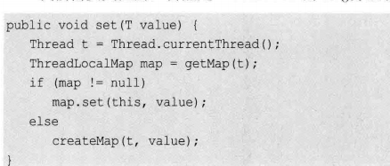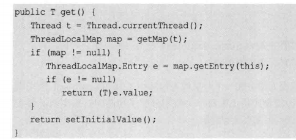

* **线程退出**时，Thread类会进行一些清理工作，其中包括清理ThreadLocalMap。**手动回收可以使用ThreadLocal.remove()方法。**


### volatile关键字

- volatile关键字会让编译器不要优化目标指令。
- volatile关键字声明一个变量，即表示该变量可能会被某些线程修改。
- volatile**保证了可见性**，即**变量修改后其他线程可见修改。**
- volatile**无法保证复合操作【i++】的原子性。**
- volatile并不能真正的保证线程安全。它只能确保一个线程修改了数据后，其他线程能看到这个改动。但当两个线程同时修改某一个数据时，却依然会产生冲突。


### 并发包中的锁

#### 读写锁

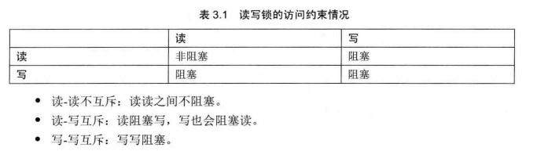

* 如果在系统中，读操作次数远远大于写操作，则读写锁就可以发挥最大的功效。提升系统的性能。


#### CountDownLatch

* 实用的多线程控制工具类。【倒计时器】
* 用来控制线程等待，可以让某个线程等待直到倒计时结束，再开始执行。


#### 信号量

* 信号量是对锁的扩展。信号量可以指定多个线程，同时访问某一个资源。
* 注意应尽量避免信号量泄露【申请了但没有释放，这样可以进入临界区的线程数量就会越来越少，直到所有的线程均不可访问。】
* 相关操作：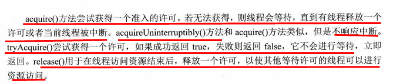


#### 并发集合ConcurrentHashMap


#### 原子类Atomic


#### 阻塞队列


## java各种锁


## 并发与并行

并发编程的本质：充分利用cpu资源

* 并发（多线程操作同一资源）
  * cpu只有一个核心，模拟出多个线程，其实是线程间轮流占用cpu资源
* 并行
  * cpu多核，同一时刻多个线程正在执行，一般利用线程池。
  * 可用System.out.println(Runtime.getRuntime().availableProcessors()); // 获取cpu的核数


### 并发级别 

* 由于临界区的存在，多线程之间的并发必须收到控制。
* 对控制并发的级别进行以下分类。


**阻塞（Blocking）** 

* 一个线程是阻塞的，在其他线程释放资源之前，当前线程无法继续执行，使用synchronized关键字或重入锁得到阻塞线程。
* synchronized或者重入锁，都会视图执行后续代码前，得到临界区的锁，如果得不到，线程就会被挂起等待，直到占有了所需资源为止。


**无饥饿（Starvation-Free）** 

* 通过公平锁实现，满足先来后到分配，饥饿不会产生。


**无障碍（Obstruction-Free）** 

* 最弱的非阻塞调度。如果两个线程是无障碍执行，那么他们不会因为临界区的问题导致一方被挂起。
* 非阻塞调度是一种乐观策略，它认为多个线程之间很可能不会发生冲突，或者说冲突概率不大。因此线程都应该无障碍的执行，但是一旦检测到冲突，就应该进行回滚。


**无锁（Lock-Free）** 

* 无锁的并行都是无障碍的。所有线程都能尝试对临界区进行访问，不同的是，无锁的并发保证必然有一个线程能够在有限步内完成操作离开临界区。


**无等待（Wait-Free）** 

* 无等待在无锁的基础上，要求所有线程都必须在有限步内完成，这样就不会引起饥饿问题。


## 锁

* 锁是用来控制多个线程访问共享资源的方式，一般来说，一个锁能够防止多个线程同时访问共享资源（但是有些锁可以允许多个线程并发的访问共享资源，比如读写锁）。


### synchronized原理

https://blog.csdn.net/tongdanping/article/details/79647337

* Synchronized不论是修饰方法还是代码块，都是通过**持有修饰对象的锁（monitor）来实现同步**，那么Synchronized锁对象是存在哪里的呢？答案是存在**对象的对象头的MarkWord中**。【对象布局可看博客或jvm】

* MarkWord在对象头中的格式

  在32位的虚拟机中：

  

  在64位的虚拟机中：

  

* 上图中的偏向锁和轻量级锁都是在java6以后对锁机制进行优化时引进的，下文的锁升级部分会具体讲解，**Synchronized关键字对应的是重量级锁，接下来对重量级锁在Hotspot JVM中的实现锁讲解。**


#### Synchronized在JVM中的实现原理

##### 加锁和释放锁的原理

###### **Synchronized修饰代码块：**

```JAVA
public class SyncCodeBlock {
   public int i;
   public void syncTask(){
       synchronized (this){
           i++;
       }
   }
}
```

对同步代码块编译后的class字节码文件反编译，结果如下（仅保留方法部分的反编译内容）：

```java
  public void syncTask();
    descriptor: ()V
    flags: ACC_PUBLIC
    Code:
      stack=3, locals=3, args_size=1
         0: aload_0
         1: dup
         2: astore_1
         3: monitorenter  //注意此处，进入同步方法
         4: aload_0
         5: dup
         6: getfield      #2             // Field i:I
         9: iconst_1
        10: iadd
        11: putfield      #2            // Field i:I
        14: aload_1
        15: monitorexit   //注意此处，退出同步方法
        16: goto          24
        19: astore_2
        20: aload_1
        21: monitorexit //注意此处，退出同步方法
        22: aload_2
        23: athrow
        24: return
      Exception table:
      //省略其他字节码.......
```

* 看到同步代码块在进入代码块时插入了**monitorenter 语句**，在退出代码块时插入了monitorexit语句，为了**保证**不论是**正常执行完毕**（第15行）还是**异常跳出代码块**（第21行）都能执行monitorexit语句，因此会出现两句monitorexit语句。

* 每个对象都和一个监视器关联(monitor)，当monitor被某个线程占用的时候就代表该对象处于锁定状态，而monitorenter指令的作用就是**线程尝试获取对于该monitor的所有权**，monitorexit的作用是**线程释放monitor的所有权**。

  https://docs.oracle.com/javase/specs/jvms/se16/html/jvms-6.html#jvms-6.5.monitorexit

* monitorenter指令的三种情况：

  * monitor计数器为0，意味着目前还没有被获得，当前线程会立刻获得然后把锁计数器+1，一旦+1，别的线程再想获取，就需要等待。
  * 如果当前线程已经获取了监视器，它将重新进入监视器，并递增计数器。
  * 如果另一个线程已经获取了监视器，则该线程进入该监视器的**同步队列**中，**变为阻塞状态**，直到监视器的计数为零，然后再次尝试获得所有权。

* monitorexit指令：

  * 执行 monitorexit 的线程必须获取了该monitor
  * 线程将监视器的计数器递减，如果计数器值为零，则线程退出监视器，不再是其所有者。


###### **Synchronized修饰方法：**

Synchronized方法同步**不再是通过插入monitorenter和monitorexit指令实现**，而是**由方法调用指令来读取运行时常量池中的ACC_SYNCHRONIZED标志隐式实现的**，如果方法表结构（method_info Structure）中的ACC_SYNCHRONIZED标志被设置，那么线程在执行方法前会先去获取对象的monitor对象，如果获取成功则执行方法代码，执行完毕后释放monitor对象，如果monitor对象已经被其它线程获取，那么当前线程被阻塞。

同步方法代码如下：

```java
public class SyncMethod {
   public int i;
   public synchronized void syncTask(){
           i++;
   }
}
```

对同步方法编译后的class字节码反编译，结果如下（仅保留方法部分的反编译内容）：

```java
public synchronized void syncTask();
    descriptor: ()V
    // 方法标识 ACC_PUBLIC代表public修饰，ACC_SYNCHRONIZED指明该方法为同步方法
    flags: ACC_PUBLIC, ACC_SYNCHRONIZED
    Code:
      stack=3, locals=1, args_size=1
         0: aload_0
         1: dup
         2: getfield      #2                  // Field i:I
         5: iconst_1
         6: iadd
         7: putfield      #2                  // Field i:I
        10: return
      LineNumberTable:
        line 12: 0
        line 13: 10
}
```

* 可以看出方法开始和结束的地方都没有出现monitorentry和monitorexit指令，但是出现的ACC_SYNCHRONIZED标志位。


##### 可重入性的原理

* **每一个锁对象关联一个线程持有者和计数器**，计数器表示该锁被持有次数。当某一线程请求成功后，jvm会记下锁的持有线程，并且将计数器置为1；此时其他线程请求该锁，则必须等待；而该持有锁的线程如果再次请求这个锁，就可以再次拿到这个锁，同时计数器会递增；当线程退出同步代码块时，计数器会递减，如果计数器为0，则释放该锁。
* 已获取monitor的线程，再次执行同步方法并没有monitorenter获取锁的指令，线程会将monitor的计数器递增来实现可重入性。

```c++
// 锁对象的结构
ObjectMonitor() {
    _count        = 0; //用来记录该对象被线程获取锁的次数
    _waiters      = 0;
    _recursions   = 0; //锁的重入次数
    _owner        = NULL; //指向持有ObjectMonitor对象的线程 
    _WaitSet      = NULL; //处于wait状态的线程，会被加入到_WaitSet
    _WaitSetLock  = 0 ;
    _EntryList    = NULL ; //处于等待锁block状态的线程，会被加入到该列表
  }
```


#####  保证可见性的原理：内存模型和happens-before规则

* Synchronized的happens-before规则，即监视器锁规则：对同一个监视器的解锁，happens-before于对该监视器的加锁。

  通过传递性保证了**先获取锁的线程的执行结果对于后获取锁的线程是可见的**。


### Lock

* Java SE 5之后，并发包中新增了Lock接口（以及相关实现类）用来实现锁功能，它提供了与synchronized关键字类似的同步功能，只是**在使用时需要显式地获取和释放锁。**
* 虽然它缺少了（通过synchronized块或者方法所提供的）隐式获取释放锁的便捷性，但是却拥有了**锁获取与释放的可操作性**、**可中断的获取锁**以及**超时获取锁**等多种synchronized关键字所**不具备的同步特性**。
* 相关使用https://blog.csdn.net/fuyuwei2015/article/details/72551720


### synchronized & Lock

相同点

* 都是**可重入锁。**

不同点

* 使用层面上：synchronized是一个关键字，Lock是一个接口，使用Lock我们需要使用它的实现类，如ReentrantLock。

* synchronized是一个隐式的加锁，而Lock是显示加锁。

* 作用区域不同：synchronized可以**修饰方法和代码块**，而Lock一般直接**加在所要同步的代码块前后。**
  * synchronized加在静态方法和普通方法上的区别？
    * 加在静态方法上锁的是当前类的class对象。
    * 加在普通方法上锁的是当前类的对象。
  * synchronized加在代码块上，锁的对象需要手动提供。
  * synchronized加在方法上和加在代码块上有什么区别？
    * 主要在编译后，形成的class文件不同即进行锁控制的方式不同。
      * 加在代码块上时，代码块进入点会有一个monitor enter，代码块出的点有一个monitor exit，同时还有一个monitor exit表示**异常出口**即为了异常情况考虑。
      * 加在方法上时，class文件方法的标志位上会有个ACC_Sychronized标识这是一个同步方法。
  * Lock中的lock方法则摒弃了monitor这个概念。
  
* 加锁方式上：Lock支持非阻塞加锁和超时加锁，还支持中断式加锁。
  * **非阻塞性加锁**，减少了线程的上下文切换，减少消耗。
  * **超时加锁**也可以避免死锁的发生，更加具有灵活性。
  * **可中断获取锁**，线程可响应中断信号，synchronized不支持。
  
* 底层原理上：synchronized采用的是对象的监视器即Monitor，Lock底层采用的是AQS。

  * 细致的说，Monitor有两条队列，对于获取锁失败而被阻塞的线程会进入Monitor的同步队列即Entry List，还有一条等待队列叫wait set，**线程执行wait方法释放锁后会进入该队列中**。cxq和qmode下次补。
  * AQS相当于**自己实现同步队列**，AQS通过一个state类型的变量，判断锁是否已被持有，如果被持有，线程会被加入双端队列的尾部，多个线程进入同步队列的尾部的情况会产生线程安全问题，所以AQS会采用**CAS方式**将线程同步添加到队列尾部。获取到锁的线程释放锁后会通知后继节点进行锁的竞争。【todo看源码，谁激发同步队列首节点？】

* synchronized只有一个等待队列和一个同步队列，而Lock有一个同步队列，可以有多个等待队列。

  * Lock创建的**每个Condition都有一个等待队列。**

* 锁竞争公平性方面，synchronized只支持非公平锁，Lock支持公平锁和非公平锁两种。

  * 是否公平现象：获取锁的线程释放锁了，同步队列头部的线程可以竞争锁了，这时又来其他线程获取锁，如果头部线程需要和其他线程竞争，则为非公平锁，如果还是先通过CAS加入到同步队列尾部则为公平锁。
  * 公平锁的实现：公平锁时，AQS会判断要竞争锁的线程是否在同步队列中，如果不在则会将加入队列尾部，对于非公平锁则不会进行判断。

* 在等待唤醒机制方面，synchronized与object的wait、notify方法进行配合，Lock则是与Condition的await、signal方法配合。

  * 线程调用await方法，则会加入condition的等待队列中，这里是**不需要进行CAS操作的**，因为线程在调用await方法时，还持有锁，加入等待队列时是没有其他线程参与竞争的，加入完成后才会释放锁。
  * 线程执行await方法到被signal方法唤醒过程发生什么
    * 线程先被加入到Condition队列的尾部，直到线程到达队列的首部时，它才会被唤醒，然后和其他线程竞争锁，竞争失败会使用cas操作加入到同步队列的尾部，当线程排队到同步队列头部时，对于公平锁，其是可以获取锁的，对于非公平锁，它可能会获取不到锁，因为可能需要和其他线程竞争，造成饥饿现象。获取到锁后，其会执行后续代码。

* 个性化定制方面：Lock底层的AQS使用了模板方法设计模式，我们可以进行一些个性化开发实现自己的Lock锁，同时Lock提供读写锁WriteLock和ReadLock，它能够支持并发读。

  * 读写锁：读读可以并发执行，其他都不可以。

  * 读写锁并发时读写权限如何控制：通过一个int的state变量，高16位做读，低16位做写，读线程会检查低16位如果为0说明没有写线程可以直接在高16位加1并进行读操作，写线程则会对高低16位数字都进行检测，只有都为0时才会进行写操作，如果已经有写操作进行则会加入到同步队列，如果**有读操作则会等待读锁释放。**

  * AQS即AbstractQueuedSynchronizer，同步器，相应的**模板方法**有

    * acquire方法用来获取锁，acquireShared方法用来获取共享锁
    * acquireInterruptibly方法表示可中断获取锁，acquireSharedInterruptibly方法表示可中断获取共享锁
    * tryAcquireNanos方法表示超时加锁，tryAcquireSharedNanos方法表示超时获取共享锁
    * release方法表示释放锁，releaseShared方法表示共享锁的释放。

  * AQS提供的可复写的方法：

    * tryAcquire

    * tryAcquireShared

    * tryRelease

    * tryReleaseShared

      


#### Lock接口中的方法

* lock方法，普通加锁
* unlock方法，解锁
* tryLock方法，非阻塞加锁
* tryLock中有一个时间参数，超时性的非阻塞进行加锁
* lockInterruptibly方法，可中断式加锁
* newCondition方法，获取对应条件

#### **lock种类**

* ReentrantLock：常用的可重入锁
* ReentrantReadWriteLock.ReadLock：读锁
* ReentrantReadWriteLock.WriteLock：写锁

- 公平锁：【不会产生饥饿现象】需要维护一个有序队列，成本高，
- 非公平锁：不公平，可以插队【获取锁时会从锁等待队列中随机挑选一个】 （默认）
- 在finally块中释放锁，目的是保证在获取到锁之后，最终能够被释放。
- 不要将获取锁的过程写在try块中，因为如果在获取锁（自定义锁的实现）时发生了异常，异常抛出的同时，也会导致锁无故释放。


### synchronized & volatile

https://blog.csdn.net/suifeng3051/article/details/52611233

* 两者针对的问题不同
  * volatile：jvm为了加快程序运行的速度，对一些变量的写操作会先在寄存器或者是cpu缓存上进行，最后才写入内存，**这个过程中，变量的新值对其他线程是不可见的**，`volatile`关键字解决的是**内存可见性的问题**，会使得所有对`volatile`变量的读写都会直接刷到主存，即保证了变量的可见性。
  * synchronized：解决的是多个线程之间访问资源的同步性，synchronized关键字可以保证被它修饰的方法或代码块在任意时刻只能有一个线程执行。

* 主要有以下几点区别
  * volatile本质是在**告诉jvm当前变量在寄存器（工作内存）中的值是不确定的，需要从主存中读取**；synchronized则是**锁定当前变量，只有当前线程可以访问该变量，其他线程被阻塞住。**
  * **volatile仅能使用在变量级别**；synchronized则可以使用在变量、方法、和类级别的。
  * volatile**仅能实现变量的修改可见性，不能保证原子性。**；而synchronized则可以**保证变量的修改可见性和原子性**。
  * volatile不会造成线程的阻塞；synchronized可能会造成线程的阻塞。
  * volatile**标记的变量不会被编译器优化**；synchronized标记的变量可以被编译器优化


#### 生产者和消费者

**Synchronized 版**

```java
package chr2;

public class ProducerAndConsumer {
    //资源类
    static class Data{
        //生产资源，生产者对其加1，消费者对其减1
        private int num = 0;

        public synchronized void increment() throws InterruptedException {
            //对增加进行判断
            if(num > 0){
                this.wait();
            }
            num++;
            System.out.println(Thread.currentThread().getName()+"->"+num);
            //通知其他线程对其操作
            this.notifyAll();
        }

        public synchronized void decrement() throws InterruptedException {
            //对减少进行判断 表示只有num==0 才能向下执行
            if(num == 0){
                this.wait();
            }
            num--;
            System.out.println(Thread.currentThread().getName()+"->"+num);
            //通知其他线程对其操作
            this.notifyAll();
        }
    }

    public static void main(String[] args) {
        Data data = new Data();

        // 两个线程进行资源争抢时 将不会出现虚假唤醒问题
        new Thread(()->{
            for (int i = 0; i < 10; i++) {
                try {
                    data.increment();
                } catch (InterruptedException e) {
                    e.printStackTrace();
                }
            }
        },"A").start();

        new Thread(()->{
            for (int i = 0; i < 10; i++) {
                try {
                    data.decrement();
                } catch (InterruptedException e) {
                    e.printStackTrace();
                }
            }
        },"B").start();


        // 四个线程竞争资源时 将会出现虚假唤醒问题
        new Thread(()->{
            for (int i = 0; i < 10; i++) {
                try {
                    data.increment();
                } catch (InterruptedException e) {
                    e.printStackTrace();
                }
            }
        },"C").start();

        new Thread(()->{
            for (int i = 0; i < 10; i++) {
                try {
                    data.decrement();
                } catch (InterruptedException e) {
                    e.printStackTrace();
                }
            }
        },"D").start();
    }
}

```

* 存在**虚假唤醒**问题。【在线程的 等待/唤醒 的过程中，等待的线程被唤醒后，在**条件不满足**的情况依然继续向下运行了。】
* **为什么 if会出现虚假唤醒**
  * 因为if只会执行一次，线程被唤醒后，会**从 wait() 处开始继续往下执行**;
  * 而while不会，直到条件满足才会向下执行while（）外边的
* 官方文档要求**等待总是出现在循环中以避免虚假唤醒问题。**
  * if 和 while 不同的判断逻辑让使用 while 可以避免虚假唤醒，因为唤醒后继续向下运行，还是需要再次判断条件。而 if 就 直接运行下去了
  * 如果要使用 if 避免虚假唤醒，需要与else搭配使用


#### JUC版

Condition精准控制和唤醒线程，Condition使用https://blog.csdn.net/chenchaofuck1/article/details/51592429

```java
// lock 多条件方式[Condition精准控制和唤醒线程]实现生产者消费者模式
public class ProductConsume2 {
    public static void main(String[] args) {
        Data data = new Data();

        new Thread(()->{
            for (int i = 0;i<5;i++){
                data.printA();
            }
        },"A").start();

        new Thread(()->{
            for (int i = 0;i<5;i++){
                data.printB();
            }
        },"B").start();

        new Thread(()->{
            for (int i = 0;i<5;i++){
                data.printC();
            }
        },"C").start();
    }
}
class Data{
    private Lock lock = new ReentrantLock();
    // 为锁绑定多个condition
    private Condition condition1 = lock.newCondition();
    private Condition condition2 = lock.newCondition();
    private Condition condition3 = lock.newCondition();
    // 共享资源
    private int num = 0;

    public void printA(){
        lock.lock();

        try {
            // num不为0 才往下走
            while(num != 0){
                // 在condition1对应的阻塞队列下阻塞
                condition1.await();
            }
            System.out.println(Thread.currentThread().getName()+"=>AAAAA");
            num = 1;
            // 通知下一个 唤醒condition2阻塞队列下的某个线程
            condition2.signal();
        }catch (InterruptedException e){
            e.printStackTrace();
        }finally {
            lock.unlock();
        }
    }

    public void printB(){
        lock.lock();

        try {
            // num不为1 才往下走
            while(num != 1){
                // 在condition2对应的阻塞队列下阻塞
                condition2.await();
            }
            System.out.println(Thread.currentThread().getName()+"=>BBBBB");
            num = 2;
            // 通知下一个 唤醒condition2阻塞队列下的某个线程
            condition3.signal();
        }catch (InterruptedException e){
            e.printStackTrace();
        }finally {
            lock.unlock();
        }
    }

    public void printC(){
        lock.lock();

        try {
            // num不为2 才往下走
            while(num != 2){
                // 在condition3对应的阻塞队列下阻塞
                condition3.await();
            }
            System.out.println(Thread.currentThread().getName()+"=>CCCCC");
            num = 3;
            // 通知下一个 唤醒condition1阻塞队列下的某个线程
            condition1.signal();
        }catch (InterruptedException e){
            e.printStackTrace();
        }finally {
            lock.unlock();
        }
    }


}
```

* 在java5之前要实现**线程同步(等待/通知)**就只能使用定义在`java.lang.Object`类上的以下方法和`synchronized`配合使用了:

  - `java.lang.Object.wait()`
  - `java.lang.Object.wait(long)`
  - `java.lang.Object.wait(long, int)`
  - `java.lang.Object.notify()`
  - `java.lang.Object.notifyAll()`

  在java5中提供了`java.util.concurrent.locks.Condition`来实现类似的功能

  


* Condition的强大之处在于它可以为多个线程间建立不同的Condition， 使用synchronized/wait()只有一个阻塞队列，notifyAll会唤起所有阻塞队列下的线程，而使用lock/condition，可以实现多个阻塞队列，signalAll只会唤起某个阻塞队列下的阻塞线程。


## 8个锁现象

https://blog.csdn.net/Hi_alan/article/details/104674995

* **锁是一种竞争机制**，一个方法加锁，一个方法没有加锁，那么**普通方法就会先运行**，因为它不要去竞争！
* 被synchornized修饰的同步方法，**锁的对象是方法的调用者。谁先调用，谁先执行！**
* 被synchronized修饰和static修饰的方法，**锁的对象是类的class对象,唯一的！**


## 集合类的安全性


### 快速失败和安全失败

https://juejin.cn/post/6844904046617182215

#### 快速失败

* 系统运行中，如果有错误发生，那么系统立即结束，这种设计就是快速失败。

* 迭代器遍历一个集合对象时，如果遍历过程中对集合对象的内容进行了修改【增删改】，则会抛出Concurrent Modification Exception。
* 场景：**java.util包下的集合都是快速失败的**，不能在多线程下发生并发修改（迭代过程中被修改）
* 原因：迭代器直接在集合内容上访问，并且在遍历过程中使用一个 modCount 变量【记录着修改次数】。集合在被遍历期间如果内容发生变化，就会改变 modCount 的值。每当迭代器使用 hashNext()/next() 遍历下一个元素之前，都会检测 modCount 变量是否为 expectedModCount 值，是的话就返回遍历；否则抛出异常，终止遍历。


#### 安全失败

* 系统运行中，如果有错误发生，系统不会停止运行，它忽略错误（但是会有地方记录下来），继续运行，这种设计就是失败安全。

* 现象：采用安全失败的集合容器，在遍历时不是直接在集合内容上访问的，而是**先复制原有集合内容，在拷贝的集合上进行遍历。**
* 原理：由于**迭代时是对原集合的拷贝进行遍历**，所以在遍历过程中**对原集合所作的修改并不能被迭代器检测到**，故不会抛 ConcurrentModificationException 异常
* 缺点：基于拷贝内容的优点是避免了ConcurrentModificationException，但同样地，迭代器并不能访问到修改后的内容，即：**迭代器遍历的是开始遍历那一刻拿到的集合拷贝，在遍历期间原集合发生的修改迭代器是不知道的**。这也就是他的缺点，同时，由于是需要拷贝的，所以比较**吃内存**。
* **场景**：java.util.concurrent包下的容器都是**安全失败**，可以在多线程下并发使用，并发修改。


### ArrayList & Vector & CopyOnWriteArrayList

#### 直接使用ArrayList

```java
public class UnSafeArrayList {
    public static void main(String[] args) {
        // 线程不安全的集合 多线程并发修改时 可能出现并发修改异常
        ArrayList<String> list = new ArrayList<>();
        for (int i = 0; i < 40; i++) {
            new Thread(()->{
                list.add(UUID.randomUUID().toString().substring(0,8));
                System.out.println(list);
            },String.valueOf(i)).start();
        }
    }
}

```

* 可能会导致java.util.ConcurrentModificationException并发修改异常

* **原因:多个线程争抢修改信息时候,当一个线程正在修改却被其他线程抢占去同一个位置的修改权造成修改错误,丢数据**

* 解决方法:

  * 不用ArrayList 改用**vector**集合(原因vertor里的add方法加了synchronized,同一时刻只允许一个线程访问和修改)

    ```java
    public class SafeArrayList {
        public static void main(String[] args) {
            // 线程安全的集合 几乎所有方法都加synchronized关键字
            Vector<String> vector = new Vector<>();
            for (int i = 0; i < 40; i++) {
                new Thread(()->{
                    vector.add(UUID.randomUUID().toString().substring(0,8));
                    System.out.println(vector);
                },String.valueOf(i)).start();
            }
        }
    }
    
    ```

  * 使用java.util.Collections工具类,它提供了对List Map Set的封装,使其安全
     List<Object> list = Collections.synchronizedList(new ArrayList<>());

    ```java
            // 集合工具类的线程安全集合  几乎方法内部都有同步代码块【类似Vector】
            List<String> list = Collections.synchronizedList(new ArrayList<>());
    ```

  * 使用java.util.Concurrent里有一些如**CopyOnWriteArrayList,CopyOnWriteSet**的包装型ArrayList();(可以并发的读，**写时复制-读写分离**)

    * 原理：**写时不是直接往当前容器写，而是先将当前容器进行copy，复制出一份新的容器，然后在新的容器写，写完后再将旧容器引用指向新容器。**
    * 适用于读多写少的并发场景。
    * 好处：可以对CopyOnWrite容器进行**并发的读，不需要加锁**，因为当前容器不会添加任何元素，不会出现脏读、幻读等，所以其也是一种**读写分离**的思想，读和写不同的容器。
    * 缺点：由于容器复制导致的**内存占用**问题，且数据**不能保证实时一致性**，只能保证最终一致性。
    
    ```java
    public class CopyOnWriteArrayList<E>
        implements List<E>, RandomAccess, Cloneable, java.io.Serializable {
        // volatile 保证数据的可见性
    	 /** The array, accessed only via getArray/setArray. */
        private transient volatile Object[] array;
        
        // 读取将不会限制
        private E get(Object[] a, int index) {
            return (E) a[index];
        }
        
        public boolean add(E e) {
        final ReentrantLock lock = this.lock;
        // 使用可重入锁 写写将阻塞 读写并不会阻塞 
        lock.lock();
        try {
            Object[] elements = getArray();
            int len = elements.length;
            // 先复制一份
            Object[] newElements = Arrays.copyOf(elements, len + 1);
            // 写入
            newElements[len] = e;
            // 再从新设置回去
            setArray(newElements);
            return true;
        } finally {
            lock.unlock();
        }
    }
    }
    ```
    
    

### HashSet & CopyOnWriteHashSet

HashSet也是会导致并发修改异常，可以使用以下两种方式解决： 【与ArrayList类似】

* Collections.synchronizedList(new HashSet<>()) 
* CopyOnWriteHashSet


### HashMap & ConcurrentHashMap

HashMap也是线程不安全的，而且还要明白：

- 工作中一般不用 HashMap
- 默认等价于 new HashMap<>(16,0.75)

解决方法

* Collections.synchronizedMap(new HashMap<>()) 
* ConcurrentHashMap


## Callable ( 简单 )

Callable 和 Runnable 的使用方法大同小异， 区别在于：

- Callable 使用 call（） 方法， Runnable 使用 run() 方法
- call() 可以返回值， 而 run()方法不能返回。
- call() 可以抛出受检查的异常，比如ClassNotFoundException， 而run()不能抛出受检查的异常。

Callable使用

- 我们比较好的启动线程的方式new Thread().start();
- 但是Thread类只能传入Runnable接口，而无法传入Callable
- 所以我们**应该要借助FutureTask，使得Runnable和Callable可以建立联系**
- **FutureTask是Runnable的实现类，在它的构造方法中可以传入Callable**

具体使用:

```java
// Callable:作为实现线程的第三种方式..
public class CallableDemo {
    // 有两种执行方式 泛型即返回值类型
    static class MyCallableTask implements Callable<Integer>{

        // 对应的任务
        @Override
        public Integer call() throws Exception {
            return 9;
        }
    }

    public static void main(String[] args) throws ExecutionException, InterruptedException {
        // 方式一：借助FutureTask执行
        Callable<Integer> myCallableTask = new MyCallableTask();

        // FutureTask类同时实现了两个接口，Future和Runnable接口， 即作为适配器
        // 所以它既可以作为Runnable被线程执行，又可以作为Future得到Callable的返回值。
        // 开启线程
        FutureTask<Integer> futureTask = new FutureTask<>(myCallableTask);

        new Thread(futureTask).start();

        // 通过futuretask可以得到MyCallableTask的call的运行结果
        futureTask.get();

        // 方式二：借助线程池来运行
        ExecutorService exec = Executors.newCachedThreadPool();
        Future<Integer> future = exec.submit(new MyCallableTask());
        future.get();
    }
}
```

- futureTask里面用的是一个state存放线程状态，outcome存放线程结果。所以只会打印一次call。
- 结果会被阻塞，可能会需要等待。


## JUC同步器工具

### 倒计时器:CountDownLatch

#### 概念：

* 同步工具类，用于协调多个线程之间的同步，或者说起到线程之间的通信作用【不是用作互斥】
* 能使一个线程等待其他一些线程完成各自工作后，再继续执行。通过计数器实现，每当一个线程完成自己的任务后，计数器的值就会减一。当计数器的值变为0时，表示所有任务已经完成，这时在CountDownLatch上await()的线程就会被唤醒。

#### 用法：

* 1、用于某一线程在开始运行前等待n个线程执行完毕，一个典型的应用场景就是启动一个服务时，主线程需要等待多个组件加载完毕，之后继续执行。
* 2、实现多个线程开始执行任务的最大并行性。【让多个线程在某个时刻同时开始执行】

#### 不足：

* CountDownLatch是**一次性**的，计算器的值只能在构造方法中初始化一次，之后没有任何机制再次对其设置值，当CountDownLatch使用完毕后，它不能再次被使用。

```java
public class CountDownLatchDemo implements Runnable{
    // 倒计数器 await控制线程等待 参数为计数个数
    static final CountDownLatch end = new CountDownLatch(10);
    static final CountDownLatchDemo demo = new CountDownLatchDemo();

    @Override
    public void run() {

        try {
            Thread.sleep(new Random().nextInt(10)*1000);
            System.out.println("check complete");

            // 通知CountDownLatch计数减一
            end.countDown();
        } catch (InterruptedException e) {
            e.printStackTrace();
        }
    }

    public static void main(String[] args) throws InterruptedException {
        ExecutorService exec = Executors.newFixedThreadPool(10);

        for(int i = 0;i<10;i++){
            exec.submit(demo);
        }

        //等待计数完成，才继续下面的操作
        end.await();

        // 发射火箭
        System.out.println("Fire!");
        exec.shutdown();
    }
}
```

**每次有线程调用 countDown() 数量-1，假设计数器变为0，countDownLatch.await() 就会被唤醒，继续执行！**


### 循环栅栏:CyclicBarrier


#### 概念：

* 另外一种多线程并发控制实用工具，允许一组线程相互等待，直到到达某个公共屏障点，且该**barrier在释放等待线程后，可以重用，所以称它为循环barrier。**

* 其实这是**一个加法计数器，到达一定数量之后才可以继续进行。**

```java
public class CyclicBarrierTest {

    public static void main(String[] args) {
        // 到达七个线程才可以继续【可循环计数】  参数1为所需等待线程个数 参数2为Runnable接口 等待线程达到相应个数后即会执行该任务
        CyclicBarrier cyclicBarrier = new CyclicBarrier(7, ()->{
            System.out.println("到达计数器之后的操作！");
        });

        for (int i = 1; i <= 10 ; i++) {
            new Thread(()->{
                System.out.println("This is Thread-" + Thread.currentThread().getName());
                try{
                    // 等待
                   cyclicBarrier.await();
                   System.out.println("第一次任务完成，开启最终任务！");
                   cyclicBarrier.await();
                   System.out.println("最终任务完成！");
                    
                }catch(InterruptedException e){
                    e.printStackTrace();
                }catch (BrokenBarrierException e){
                    e.printStackTrace();
                }
            }, String.valueOf(i)).start();
        }
    }
}
```

* 就是在**线程内部设置一个屏障，阻隔这些线程的下一步操作**，然后**当达到计数标准后，统一放行。**


#### 与CountDownLatch的区别

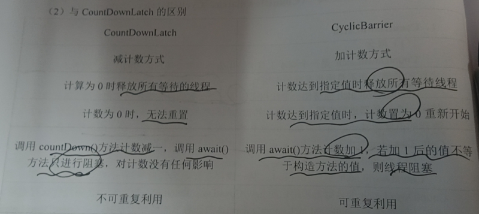


### 允许多个线程同时访问:Semaphore 信号量

* 一般使用**在多个共享资源互斥的使用**！并发限流，**控制最大的线程数！**

  #### 概念：

* Semaphore也是一个多线程协作的工具类，可以**维护当前访问自身的线程个数**，并提供了同步机制，使用Semaphore可以控制**同时访问资源的线程个数。**

```java
public class SemapDemo implements Runnable{
    final Semaphore semp = new Semaphore(5);

    @Override
    public void run() {
        try {
            // 尝试获取信号量，假设如果已经满了，等待，等待被释放为止
            semp.acquire();
            // 模拟耗时操作
            Thread.sleep(2000);
            System.out.println(Thread.currentThread().getId()+":done!");
        }catch (InterruptedException e){
            e.printStackTrace();
        }finally {
            // 释放信号量，会将当前的信号量释放 + 1，然后唤醒等待的线程
            semp.release();
        }
    }

    public static void main(String[] args) {
        // 创建线程池
        ExecutorService exec = Executors.newFixedThreadPool(20);
        final SemapDemo demo = new SemapDemo();
        for(int i = 0 ; i<20;i++){
            exec.submit(demo);
        }

        // 结果将5个一组输出
    }
}
```

#### 主要方法

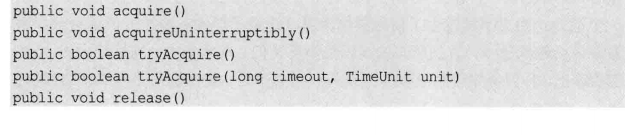

* ```java
  boolean hasQueuedThreads(); // 查询是否由线程正在等待获取许可
  ```

* ```java
  int availablePermits(); // 返回此信号量中当前可用的许可数
  ```


## 读写锁

```java
public class ReadWriteLockDemo {
    // 可重入锁【获取锁后可重复获取】
    private static Lock lock = new ReentrantLock();

    /**
     * ReadWriteLock
     * 读-读 可以共存！
     * 读-写 不能共存！
     * 写-写 不能共存！
     */
    private static ReentrantReadWriteLock readWriteLock = new ReentrantReadWriteLock();

    // 共享锁（读锁） 多个线程可以同时占有
    private static Lock readLock = readWriteLock.readLock();

    // 独占锁（写锁） 一次只能被一个线程占有
    private static Lock writeLock = readWriteLock.writeLock();

    private int value ;

    public Object handleRead(Lock lock) throws InterruptedException{
        try{
            lock.lock(); // 模拟读操作
            Thread.sleep(1000);
            return value;
        }finally {
            lock.unlock();
        }
    }

    public void handleWrite(Lock lock,int index) throws InterruptedException{
        try{
            lock.lock(); // 模拟写操作
            Thread.sleep(1000);
            value = index;
        }finally {
            lock.unlock();
        }
    }

    public static void main(String[] args) {
        final ReadWriteLockDemo demo = new ReadWriteLockDemo();
        Runnable readRunnable = new Runnable() {
            @Override
            public void run() {
                try {
                    // 使用读锁
//                    demo.handleRead(readLock);

                    // 使用普通的重入锁 读线程 间也会互斥
                    demo.handleRead(lock);
                } catch (InterruptedException e) {
                    e.printStackTrace();
                }
            }
        };

        Runnable writeRunnable = new Runnable() {
            @Override
            public void run() {
                try{
                    // 使用写锁
//                    demo.handleWrite(writeLock,new Random().nextInt());

                    // 使用普通的重入锁
                    demo.handleWrite(writeLock,new Random().nextInt());
                }catch (InterruptedException e){
                    e.printStackTrace();
                }
            }
        };

        for( int i = 0;i<18;i++){
            new Thread(readRunnable).start();
        }

        for(int i = 18;i<20;i++){
            new Thread(writeRunnable).start();
        }
    }
```


## 线程池

* 线程池中，总有那么几个活跃的线程。当你需要使用线程时，可以从池子中随便拿一个空闲线程，当完成工作时，并不急着关闭线程，而是将这个线程退回到池子，方便其他人使用。【创建销毁开销大】


###  线程池的好处

1. **降低资源的消耗。**可以重复利用已创建的线程，减少大量的线程池创建和销毁的消耗。
2. **提高响应速度。**不需要等待线程创建完成，**任务到达可以直接立即执行**。
3. **提高线程的可管理性。**线程是稀缺资源，如果无限制的创建，不仅会消耗系统资源，还会降低系统的稳定性，使用线程池可以进**行统一的分配，调优和监控**。
   1. 创建和销毁线程由线程池管理，能设置非核心线程的存活时间。
   2. 能够控制最大线程数。
   3. 提供定时执行的功能。


###  线程池的体系

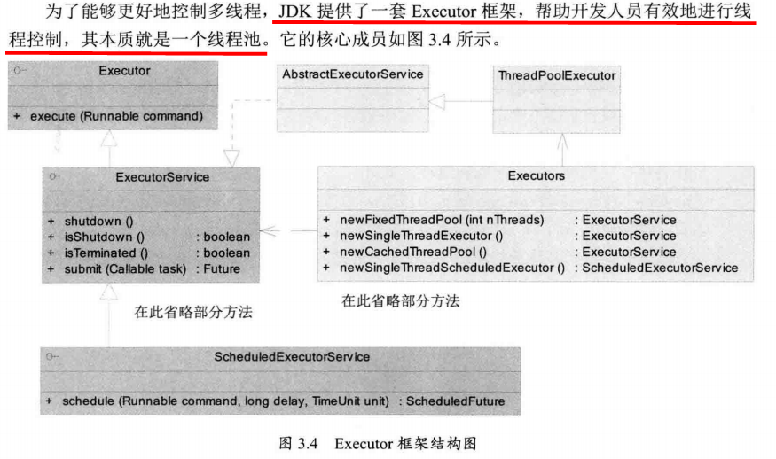

* Executors类扮演着线程池工厂的角色，通过Executors可以取得一个拥有特定功能的线程池。从UML图中亦可知，ThreadPoolExecutor类实现了Executor接口，通过此接口，任何Runnable的对象都可以被ThreadPoolExecutor线程池调度。【ExecutorService接口继承Executor接口，AbstractExecutorService类实现ExecutorService接口，ThreadPoolExecutor类继承AbstractExecutorService类】
* 
* Executor，线程池顶级接口
  ExecutorService，线程池次级接口，对Executor的补充，做了一下扩展
  ScheduleExecutorService，对ExecutorService做了一些扩展，增加一些定时任务相关的功能；
  AbstractExecutorService，抽象类，运用模板方法设计模式实现了一部分方法；
  ThreadPoolExecutor，**普通线程池类，这也是我们通常所说的线程池，包含最基本的一些线程池相关操作的实现；**
  ScheduleThreadPoolExecutor，定时任务实现类，用于实现定时任务相关功能；
  ForkJoinPool，新型线程池类，java7中新增的线程池类，基于工作窃取理论实现，运用于大任务拆分小任务，任务无限多的场景；
  Executors，线程池工具类，定义了一些快速实现线程池的方法（谨慎使用）；
* Executors类提供了各种类型的线程池，主要有以下几种工厂方法：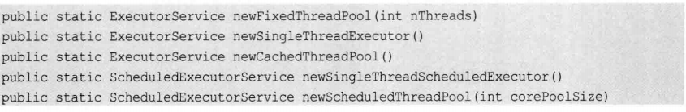

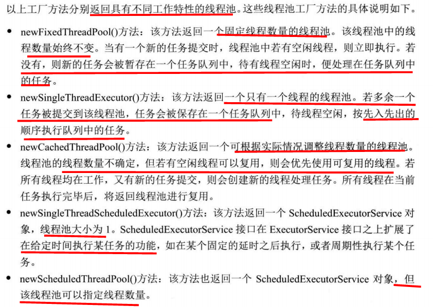

1、构造一个固定线程数目的线程池，配置的corePoolSize与maximumPoolSize大小相同，同时使用了一个**无界**LinkedBlockingQueue存放阻塞任务【多于核心线程数目的任务将存放在该无界队列中】，因此多余的任务将存在再阻塞队列，不会由RejectedExecutionHandler处理【处理策略处理队列放不进的任务】， keepAliveTime为0，意味着一旦有多余的空闲线程，就会被立即停止掉；但这里无效【只有多于核心线程数量的线程才会被停止掉】

**缺点：无界阻塞队列可能会堆积大量任务，引起OOM（内存溢出）异常。**

```java
public static ExecutorService newFixedThreadPool(int nThreads) {  
        return new ThreadPoolExecutor(nThreads, nThreads,  
                                      0L, TimeUnit.MILLISECONDS,  
                                      // 初始化没有指定容量 默认使用int的最大值作为队列容量。
                                      new LinkedBlockingQueue<Runnable>());  
    }  
```


2、构造一个缓冲功能的线程池【**可以无限扩大，但线程只是暂时存在(缓冲)，如果60s未执行则会销毁**】，配置corePoolSize=0，maximumPoolSize=Integer.MAX_VALUE，keepAliveTime=60s,以及一个**无容量**的阻塞队列 SynchronousQueue，因此任务提交之后，如果没有空闲线程，则将会创建新的线程执行；多于核心线程数量的线程空闲超过60s将会销毁。 

**比较适合处理执行时间比较小的任务。**

**缺点：运行创建的线程数为Integer.MAX_VALUE，可能会创建大量线程，引起OOM（内存溢出）异常。**

 ```java
 public static ExecutorService newCachedThreadPool() {  
         return new ThreadPoolExecutor(0, Integer.MAX_VALUE,  
                                       60L, TimeUnit.SECONDS,  
                                       new SynchronousQueue<Runnable>());  
     }  
 ```


3、构造一个**只支持一个线程**的线程池，配置corePoolSize=maximumPoolSize=1，**无界阻塞队列**LinkedBlockingQueue；**保证任务由一个线程串行执行** 

**缺点：无界阻塞队列可能会堆积大量任务，引起OOM（内存溢出）异常。**

```java
public static ExecutorService newSingleThreadExecutor() {  
        return new FinalizableDelegatedExecutorService  
            (new ThreadPoolExecutor(1, 1,  
                                    0L, TimeUnit.MILLISECONDS,  
                                    new LinkedBlockingQueue<Runnable>()));  
    } 
```


4、构造有**定时功能**的线程池，配置corePoolSize，**无界延迟阻塞队列DelayedWorkQueue**；有意思的是：maximumPoolSize=Integer.MAX_VALUE，由于DelayedWorkQueue是无界队列，所以这个值是没有意义的 

```java
public static ScheduledExecutorService newScheduledThreadPool(int corePoolSize) {  
        return new ScheduledThreadPoolExecutor(corePoolSize);  
    }  
  
public static ScheduledExecutorService newScheduledThreadPool(  
            int corePoolSize, ThreadFactory threadFactory) {  
        return new ScheduledThreadPoolExecutor(corePoolSize, threadFactory);  
    }  
  
public ScheduledThreadPoolExecutor(int corePoolSize,  
                             ThreadFactory threadFactory) {  
        super(corePoolSize, Integer.MAX_VALUE, 0, TimeUnit.NANOSECONDS,  
              new DelayedWorkQueue(), threadFactory);  
    } 
	// 固定频率执行任务，以任务开始为起点【如果当前任务耗时过多，超过定时周期period，则当前任务结束后会立即执行】
    public ScheduledFuture<?> scheduleAtFixedRate(Runnable command,
                                                  long initialDelay,
                                                  long period,
                                                  TimeUnit unit);
	// 固定延时执行任务 以任务结束为起点
    public ScheduledFuture<?> scheduleWithFixedDelay(Runnable command,
                                                     long initialDelay,
                                                     long delay,
                                                     TimeUnit unit);
```


###  ThreadPoolExecutor七大参数

**阿里巴巴的规范**


**三大方法源码分析：**

**其实都是调用了**ThreadPoolExecutor**创建的线程池**

```java
public static ExecutorService newSingleThreadExecutor() {
    return new FinalizableDelegatedExecutorService
        (new ThreadPoolExecutor(1, 1,
                                 0L, TimeUnit.MILLISECONDS,
                                new LinkedBlockingQueue<Runnable>()));
}
public static ExecutorService newFixedThreadPool(int nThreads) {
    return new ThreadPoolExecutor(5, 5,
                                    0L, TimeUnit.MILLISECONDS,
                                    new LinkedBlockingQueue<Runnable>());
}
public static ExecutorService newCachedThreadPool() {
    return new ThreadPoolExecutor(0, Integer.MAX_VALUE,
                                    60L, TimeUnit.SECONDS,
                                    new SynchronousQueue<Runnable>());
```

```java
// 本质ThreadPoolExecutor（），使用七大参数进行控制
public ThreadPoolExecutor(int corePoolSize, // 核心线程数量
                          int maximumPoolSize, // 最大线程数量
                          long keepAliveTime, // 当线程数量超过corePoolSize时，多余的空闲线程的存活时间
                          TimeUnit unit, // 超时单位
                          BlockingQueue<Runnable> workQueue, // 阻塞队列，装填被提交但尚未被执行的任务
                          ThreadFactory threadFactory, // 线程工厂，用于创建线程，一般用默认的即可
                          RejectedExecutionHandler handler // 拒绝策略，当线程用完了，阻塞队列也满了，对于新任务的处理策略) {
    if (corePoolSize < 0 ||
        maximumPoolSize <= 0 ||
        maximumPoolSize < corePoolSize ||
        keepAliveTime < 0)
        throw new IllegalArgumentException();
    if (workQueue == null || threadFactory == null || handler == null)
        throw new NullPointerException();
    this.acc = System.getSecurityManager() == null ?
            null :
            AccessController.getContext();
    this.corePoolSize = corePoolSize;
    this.maximumPoolSize = maximumPoolSize;
    this.workQueue = workQueue;
    this.keepAliveTime = unit.toNanos(keepAliveTime);
    this.threadFactory = threadFactory;
    this.handler = handler;
}
```


### 阻塞队列

* **支持两个附加的阻塞操作的队列。**

* 支持阻塞的插入方法【即put方法】：意思是当队列满时，队列会阻塞存储元素的线程，直到队列不满。
* 支持阻塞的移除方法【即take方法】：意思是在队列为空时，获取元素的线程会等待队列变为非空。
* 阻塞队列常用于生产者和消费者的场景，生产者是向队列里添加元素的线程，消费者是从队列里取元素的线程。阻塞队列就是生产者用来存放元素、消费者用来获取元素的容器。
* 使用场景：多线程并发处理，线程池
* 队列满时，再往队列插入元素，会抛出 IllegalStateException: Queue full 异常【add方法】
* 队列为空时，从队列获取元素会抛出NoSuchElementException异常。【remove方法】
* 返回值，插入方法成功返回true，失败返回false，移除方法从队列里拿出一个元素，如果没有则返回null
* 阻塞等待：put元素时，如果队列满了，队列会一直阻塞生产者线程，**直到拿到数据，或者响应中断退出**。队列为空时，同理。
* 超时等待：队列阻塞线程一段时间。
* **需要注意的是，我们不能向BlockingQueue中插入`null`，否则会报`NullPointerException`。**
* BlockingQueue只是`java.util.concurrent`包中的一个**接口**，而在具体使用时，我们用到的是它的实现类。

**四组API**

```java
方式    抛出异常   有返回值，不抛出异常  阻塞 等待    超时等待 
添加    add(o) 	offer(o)  		 	put(o)   offer(,,)
移除   remove(o)   poll()   			take()   poll(,)
检查   element()  peek()  
```

```java
    /**
     * 抛出异常的api
     */
    public static void test1(){
        // 队列的大小
        ArrayBlockingQueue<String> blockingQueue = new ArrayBlockingQueue<>(3);
        System.out.println(blockingQueue.add("a"));
        System.out.println(blockingQueue.add("b"));
        System.out.println(blockingQueue.add("c"));
        // IllegalStateException: Queue full 抛出异常！
        // System.out.println(blockingQueue.add("d"));

        System.out.println("---------");
        System.out.println(blockingQueue.remove());
        System.out.println(blockingQueue.remove());
        System.out.println(blockingQueue.remove());
        // java.util.NoSuchElementException 抛出异常！
//        System.out.println(blockingQueue.remove());

    }

    /**
     * 有返回值，没有异常 的api
     */
    public static void test2(){
        // 队列的大小
        ArrayBlockingQueue<String> blockingQueue = new ArrayBlockingQueue<>(3);

        // true 表示插入成功 false 失败
        System.out.println(blockingQueue.offer("a"));
        System.out.println(blockingQueue.offer("b"));
        System.out.println(blockingQueue.offer("c"));
        // false 不抛出异常！
         System.out.println(blockingQueue.offer("d"));

        System.out.println("---------");
        // 非null表示取出成功 null表示失败
        System.out.println(blockingQueue.poll());
        System.out.println(blockingQueue.poll());
        System.out.println(blockingQueue.poll());
        // null 不抛出异常！
        System.out.println(blockingQueue.poll());
    }

    /**
     * 等待，阻塞（一直阻塞）
     */
    public static void test3() throws InterruptedException {
        // 队列的大小
        ArrayBlockingQueue<String> blockingQueue = new ArrayBlockingQueue<>(3);
        blockingQueue.put("a");
        blockingQueue.put("b");
        blockingQueue.put("c");
         blockingQueue.put("d"); // 队列没有位置了，一直阻塞

        System.out.println("---------");
        System.out.println(blockingQueue.take());
        System.out.println(blockingQueue.take());
        System.out.println(blockingQueue.take());
        System.out.println(blockingQueue.take()); // 没有这个元素，一直阻塞

    }

    /**
     * 等待，阻塞（等待超时）
     */
    public static void test4() throws InterruptedException {
        // 队列的大小
        ArrayBlockingQueue<String> blockingQueue = new ArrayBlockingQueue<>(3);
        blockingQueue.offer("a");
        blockingQueue.offer("b");
        blockingQueue.offer("c");
        // blockingQueue.offer("d",2,TimeUnit.SECONDS); // 等待超过2秒就退出
        System.out.println("===============");
        System.out.println(blockingQueue.poll());
        System.out.println(blockingQueue.poll());
        System.out.println(blockingQueue.poll());
        blockingQueue.poll(2, TimeUnit.SECONDS); // 等待超过2秒就退出
    }
```


#### ArrayBlockingQueue

* **ArrayBlockingQueue**是一个**有边界的阻塞队列**【基于ReentrantLock实现阻塞】，它的**内部实现是一个数组**。有边界的意思是它的**容量是有限的**，我们必须在其**初始化的时候指定它的容量大小**，**容量大小一旦指定就不可改变**。
* ArrayBlockingQueue是以**先进先出**【FIFO】的方式存储数据，最新插入的对象是尾部，最新移出的对象是头部。

**成员变量**

```java
 /** The queued items */
    final Object[] items; // 用于保存阻塞队列中的元素

    /** items index for next take, poll, peek or remove */
    int takeIndex; // 从队列中获取元素的位置

    /** items index for next put, offer, or add */
    int putIndex; // 往队列里存放元素的位置

    /** Number of elements in the queue */
    int count; // 队列中元素的个数
 
    /*
     * Concurrency control uses the classic two-condition algorithm
     * found in any textbook.
     */

    /** Main lock guarding all access */
    final ReentrantLock lock; // 可重入锁

    /** Condition for waiting takes */
    private final Condition notEmpty; // 和锁绑定的条件

    /** Condition for waiting puts */
    private final Condition notFull; // 和锁绑定的条件
```

**构造函数**

```java
// fair 表示是否为公平锁    
public ArrayBlockingQueue(int capacity, boolean fair) {
        if (capacity <= 0)
            throw new IllegalArgumentException();
        this.items = new Object[capacity];
        lock = new ReentrantLock(fair);
        notEmpty = lock.newCondition();
        notFull =  lock.newCondition();
    }
```

**入队方法：put 入队，满则等待；offer入队，满则返回**

```java
    /**
     * Inserts the specified element at the tail of this queue, waiting
     * for space to become available if the queue is full.
     *
     * @throws InterruptedException {@inheritDoc}
     * @throws NullPointerException {@inheritDoc}
     */
    public void put(E e) throws InterruptedException {
        checkNotNull(e);
        final ReentrantLock lock = this.lock;
        // 可响应中断式加锁
        lock.lockInterruptibly();
        try {
            while (count == items.length)
                // 不满条件 阻塞 需要不满条件 唤醒
                notFull.await();
            enqueue(e);
        } finally {
            lock.unlock();
        }
    }

    private void enqueue(E x) {
        // assert lock.getHoldCount() == 1;
        // assert items[putIndex] == null;
        final Object[] items = this.items;
        items[putIndex] = x;
        if (++putIndex == items.length)
            putIndex = 0;
        count++;
        // 非空条件唤醒 【唤醒因非空条件阻塞的消费者线程】
        notEmpty.signal();
    }

    public boolean offer(E e) {
        checkNotNull(e);
        final ReentrantLock lock = this.lock;
        // 不可响应中断
        lock.lock();
        try {
            // 并不会阻塞。。
            if (count == items.length)
                return false;
            else {
                enqueue(e);
                return true;
            }
        } finally {
            lock.unlock();
        }
    }
```

* ReentrantLock的中断和非中断加锁模式的**区别在于：线程尝试获取锁操作失败后，在等待过程中，如果该线程被其他线程中断了，它是如何响应中断请求的。**
* lock方法会忽略中断请求，继续获取锁直到成功；
* 而lockInterruptibly则直接抛出中断异常来立即响应中断，由上层调用者处理中断。


**出队：take与put相对应，offer和poll相对应**

```java
public E poll() {
    final ReentrantLock lock = this.lock;
    lock.lock();
    try {
        // 并不会阻塞。。
        return (count == 0) ? null : dequeue();
    } finally {
        lock.unlock();
    }
}

public E take() throws InterruptedException {
    final ReentrantLock lock = this.lock;
    // 响应中断
    lock.lockInterruptibly();
    try {
        // 阻塞
        while (count == 0)
            // 非空条件阻塞
            notEmpty.await();
        return dequeue();
    } finally {
        lock.unlock();
    }
}

    private E dequeue() {
        // assert lock.getHoldCount() == 1;
        // assert items[takeIndex] != null;
        final Object[] items = this.items;
        @SuppressWarnings("unchecked")
        E x = (E) items[takeIndex];
        items[takeIndex] = null;
        if (++takeIndex == items.length)
            takeIndex = 0;
        count--;
        if (itrs != null)
            itrs.elementDequeued();
        /// 不满条件 唤醒
        notFull.signal();
        return x;
    }
```


#### LinkedBlockingQueue

* LinkedBlockingQueue是一个基于**链表**实现的**可选容量的阻塞队列**。队头的元素是插入时间最长的，队尾的元素是最新插入的。新的元素将会被插入到队列的尾部。 
* LinkedBlockingQueue的容量限制是可选的，如果在初始化时没有指定容量，那么**默认使用int的最大值作为队列容量。**
* LinkedBlockingQueue内部是使用链表实现一个队列的，但是却有别于一般的队列，在于**该队列至少有一个节点，头节点不含有元素**。结构图如下：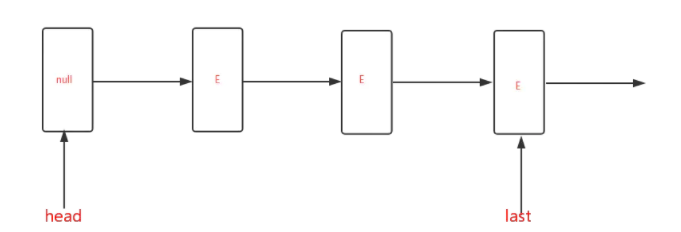

* LinkedBlockingQueue中**维持两把锁，一把锁用于入队，一把锁用于出队**【锁分离】，这也就意味着，同一时刻，只能有一个线程执行入队，其余执行入队的线程将会被阻塞；同时，可以有另一个线程执行出队，其余执行出队的线程将会被阻塞。

* 虽然入队和出队两个操作同时均只能有一个线程操作，但是可以一个入队线程和一个出队线程共同执行，也就意味着**可能同时有两个线程在操作队列**，那么为了维持**线程安全**，LinkedBlockingQueue使用一个**AtomicInterger类型的变量表示当前队列中含有的元素个数**，所以可以**确保两个线程之间操作底层队列是线程安全的**。

* LinkedBlockingQueue是允许两个线程**同时在两端进行入队或出队的操作**的，**但一端同时只能有一个线程进行操作，这是通过两把锁来区分的；**

  为了**维持底部数据的统一**，引入了AtomicInteger的一个count变量，表示队列中元素的个数。count只能在两个地方变化，一个是入队的方法（可以+1），另一个是出队的方法（可以-1），而AtomicInteger是原子安全的，所以也就**确保了底层队列的数据同步。** 

  https://www.jianshu.com/p/7b2f1fa616c6

**成员变量**

```java
   /** The capacity bound, or Integer.MAX_VALUE if none */
  //容量，如果没有指定，该值为Integer.MAX_VALUE;
    private final int capacity;

    /** Current number of elements */ // 原子类记录元素个数 读写都会操作
    private final AtomicInteger count = new AtomicInteger();

    /**
     * Head of linked list.
     * Invariant: head.item == null //队列头节点，始终满足head.item==null
     */
    transient Node<E> head;

    /**
     * Tail of linked list.
     * Invariant: last.next == null //队列的尾节点，始终满足last.next==null
     */
    private transient Node<E> last;

    /** Lock held by take, poll, etc */ // 出队锁
    private final ReentrantLock takeLock = new ReentrantLock();

    /** Wait queue for waiting takes */ //当队列为空时，保存执行出队的线程【阻塞】
    private final Condition notEmpty = takeLock.newCondition();

    /** Lock held by put, offer, etc */ // 入队锁
    private final ReentrantLock putLock = new ReentrantLock();

    /** Wait queue for waiting puts */ //当队列满时，保存执行入队的线程
    private final Condition notFull = putLock.newCondition();
```


#### ArrayBlockingQueue & LinkedBlockingQueue

* 队列大小有所不同：ArrayBlockingQueue 是有界的，初始化必须指定大小。而LinkedBlockingQueue可以是有界的也可以是无界的（Integer.MAX_VALUE），当**添加速度大于移除速度时，在无界的情况下，可能会造成内存溢出的问题。**
* 数据存储容器不同：ArrayBlockingQueue 采用的是**数组**作为数据存储容器，而LinkedBlockingQueue采用的是以Node节点作为连接对象的**链表**。
* ArrayBlockingQueue 采用的是数组的存储容器，因此在**插入数据或删除元素时不会产生或销毁任何额外的对象实例，**而LinkedBlockingQueue则会生成一个**额外的Node对象**，空间消耗较多。
* 两者**实现队列添加或移除的锁不一样**，**ArrayBlockingQueue实现的队列中的锁是没有分离的**，即添加操作和移除操作采用的锁是同一个，而**LinkedBlockingQueue实现的队列中的锁是分离的**，添加采用putLock，移除采用takeLock，这样能**大大提高队列的吞吐量**，**高并发的情况下生产者和消费者可以并行地操作队列中的数据，以此来提高整个队列的并发性能。**


#### SynchronousQueue 同步队列

* 没有容量，进去一个元素，必须等待取出来之后，才能再往里面放一个元素！【否则将会阻塞！】
* 它支持公平访问队列。默认情况下线程采用非公平性策略访问队列。
* SynchronousQueue可以看成是一个传球手，负责把生产者线程处理的数据直接传递给消费者线程。**队列本身并不存储任何元素**，非常适合**传递性**场景。
* SynchronousQueue的吞吐量高于LinkedBlockingQueue和ArrayBlockingQueue。

```java
/**
 * 同步队列
 * 和其他的BlockingQueue 不一样， SynchronousQueue 不存储元素
 * put了一个元素，必须从里面先take取出来，否则不能在put进去值！ 将会阻塞
 */
public class SynchronousQueueDemo {
    public static void main(String[] args) {
        SynchronousQueue<String> blockingQueue = new SynchronousQueue<>();

        new Thread(()->{
            try{
                System.out.println(Thread.currentThread().getName()+" put 1");
                blockingQueue.put("1");
                System.out.println(Thread.currentThread().getName()+" put 2");
                blockingQueue.put("2");
                System.out.println(Thread.currentThread().getName()+" put 3");
                blockingQueue.put("3");
            }catch (InterruptedException e){
                e.printStackTrace();
            }
        },"t1").start();

        new Thread(()->{
            try {
                TimeUnit.SECONDS.sleep(3);
                System.out.println(Thread.currentThread().getName()+"=>"+blockingQueue.take());
                TimeUnit.SECONDS.sleep(3);
                System.out.println(Thread.currentThread().getName()+"=>"+blockingQueue.take());
                TimeUnit.SECONDS.sleep(3);
                System.out.println(Thread.currentThread().getName()+"=>"+blockingQueue.take());
            } catch (InterruptedException e) {
                e.printStackTrace();
            }
        },"T2").start();
    }
}

```


### 生产者和消费者模式【本质还是使用阻塞队列】

**实现方式** TODO 代码实现

* 用synchronized对存储加锁，然后用object原生的wait()和notify()做同步
* 用concurrent.locks.Lock，然后用condition的await()和signal()做同步 【面试书】
* 直接使用concurrent.BlockingQueue 【实战java】
* 使用PipedInputStream/PipedOutputStream
* 使用信号量Semaphore


### 线程池中使用的BlockingQueue

* 直接提交队列：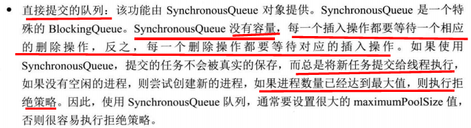

* 有界的任务队列：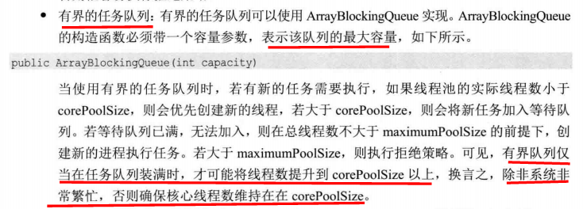

* 无界的任务队列：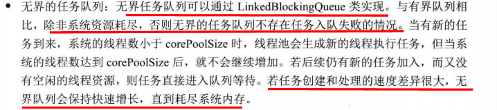

  这种情况下**maximumPoolSize**无效，同时使用这种任务队列模式时，一定要**注意任务提交与处理之间的协调与控制**，不然会出现队列中的任务无法及时处理导致一直增长，直到最后资源耗尽的问题。

* 优先任务队列：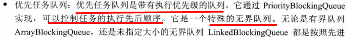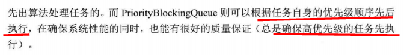


```java
/**
 * 1.创建一个可缓存的线程池。如果线程池的大小超过了处理任务所需要的线程，那么就会回收部分空闲（60秒不执行任务）的线程
 * 2.当任务数增加时，如果没有空闲线程可以复用，此线程池又可以智能的添加新线程来处理任务
 * 3.此线程池不会对线程池大小做限制，线程池大小完全依赖于操作系统（或者说JVM）能够创建的最大线程大小
 * 4.适用：执行很多短期异步的小程序或者负载较轻的服务器
 */
public static void testCacheThreadPool(){
    ExecutorService es = Executors.newCachedThreadPool();
    for (int i = 0; i < 10; i++) {
        final int ii = i;
        try {
            Thread.sleep(ii*i);
        } catch (InterruptedException e) {
            e.printStackTrace();
        }
        // 匿名内部类只能使用 final变量
        es.execute(()-> System.out.println("线程名称："+Thread.currentThread().getName()+"执行，"+ii));
    }
}


/**
 * 1.创建固定大小的线程池。每次提交一个任务就创建一个线程，直到线程达到线程池的最大大小
 * 2.线程池的大小一旦达到最大值就会保持不变，如果某个线程因为执行异常而结束，那么线程池会补充一个新线程
 * 3.若没有空闲线程，则新任务会被暂存在一个无界任务队列中，待有线程空闲时，便处理在任务队列中的任务
 * 4.适用：执行长期的任务，性能好很多
 */
public static void testFixedThreadPool(){
    ExecutorService fixedThreadPool = Executors.newFixedThreadPool(3);
    for (int i = 0; i < 10; i++) {
        final int ii = i;
        fixedThreadPool.execute(()-> System.out.println("线程名称：" + Thread.currentThread().getName() + "，执行" + ii));
        try {
            Thread.sleep(ii);
        } catch (InterruptedException e) {
            e.printStackTrace();
        }
    }
}


/**
 * 创建一个单线程化的线程池，它只会用唯一的工作线程来执行任务，保证所有任务按照指定顺序(FIFO, LIFO, 优先级)执行，默认先进先出
 * 没有空闲线程可以复用时，任务会被保存到一个任务队列中
 * 适用：一个任务一个任务执行的场景
 */
public static void testSingleThreadExecutor() {
    ExecutorService singleThreadExecutor = Executors.newSingleThreadExecutor();
    for (int i = 0; i < 10; i++) {
        final int ii = i;
        try {
            Thread.sleep(ii);
        } catch (InterruptedException e) {
            e.printStackTrace();
        }
        singleThreadExecutor.execute(() -> System.out.println("线程名称：" + Thread.currentThread().getName() + "，执行" + ii));
    }
}

/**
 * 创建一个定长线程池，支持定时和周期性任务执行。延迟执行
 * 这是一种按照超时时间排序的队列结构
 * 适用：周期性执行任务的场景
 * 注意：如果任务遇到异常，那么后续的所有子任务都会停止调度，因此，必须保证异常被及时处理，为周期性任务的稳定调度提供条件
 */
public static void testScheduledThreadPool(){
    ScheduledExecutorService scheduledThreadPool = Executors.newScheduledThreadPool(5);

    Runnable r1 = ()-> System.out.println("线程名称："+Thread.currentThread().getName()+"，执行：3秒后执行");
    scheduledThreadPool.schedule(r1,3, TimeUnit.SECONDS);

    Runnable r2 = ()-> System.out.println("线程名称："+Thread.currentThread().getName() + "，执行:延迟2秒后开始执行且每3秒执行一次");
    scheduledThreadPool.scheduleAtFixedRate(r2,2,3,TimeUnit.SECONDS);

    Runnable r3 = ()-> System.out.println("线程名称："+Thread.currentThread().getName() + "，执行:延迟2秒后开始执行且每次执行完成后延迟3秒再次执行");
    scheduledThreadPool.scheduleWithFixedDelay(r3,2,3, TimeUnit.SECONDS);

    Runnable r4 = () -> System.out.println("线程名称：" + Thread.currentThread().getName() + "，执行:普通任务");
    for (int i = 0; i < 5; i++) {
        scheduledThreadPool.execute(r4);
    }
}
```


### 线程池的线程增长策略（任务调度）

理清corePoolSize，maximumPoolSize，workQueue之间关系即可。 

1.当线程池小于corePoolSize时，新提交任务将创建一个新线程执行任务，即使此时线程池中存在空闲线程。 【**除了利用提交新任务来创建和启动线程（按需构造），也可以通过prestartCoreThread()或prestartAllCoreThreads()方法来提前启动线程池中的核心线程**】。
2.当线程池线程数量等于corePoolSize时，如果workQueue未满，新提交任务将被放入workQueue中，等待线程池中任务调度执行 
3.当线程池线程数量大于等于corePoolSize时，workQueue已满，且maximumPoolSize>线程池线程数量时，新提交任务会创建新线程执行任务 
4.当线程池线程数量大于corePoolSize且等于maximumPoolSize时，缓冲队列已满，新提交任务由RejectedExecutionHandler处理 
5.当线程池中超过corePoolSize线程，空闲时间达到keepAliveTime时，关闭空闲线程 
6.当设置allowCoreThreadTimeOut(true)时，线程池中corePoolSize线程空闲时间达到keepAliveTime也将关闭  


* 任务的优先级为：核心线程corePoolSize、任务队列workQueue、最大线程maximumPoolSize，如果三者都满了，使用handler处理被拒绝的任务。


**自定义线程池（推荐）** https://blog.csdn.net/zhongxiangbo/article/details/70882309

```java
package com.tongbanjie.trade.test.commons;  
  
import java.util.concurrent.ArrayBlockingQueue;  
import java.util.concurrent.ExecutorService;  
import java.util.concurrent.RejectedExecutionHandler;  
import java.util.concurrent.ThreadFactory;  
import java.util.concurrent.ThreadPoolExecutor;  
import java.util.concurrent.TimeUnit;  
import java.util.concurrent.atomic.AtomicInteger;  
  
public class CustomThreadPoolExecutor {    
        
        
    private ThreadPoolExecutor pool = null;    
        
        
    /**  
     * 线程池初始化方法  
     *   
     * corePoolSize 核心线程池大小----1  
     * maximumPoolSize 最大线程池大小----3  
     * keepAliveTime 线程池中超过corePoolSize数目的空闲线程最大存活时间----30+单位TimeUnit  
     * TimeUnit keepAliveTime时间单位----TimeUnit.MINUTES  
     * workQueue 阻塞队列----new ArrayBlockingQueue<Runnable>(5)====5容量的阻塞队列  
     * threadFactory 新建线程工厂----new CustomThreadFactory()====定制的线程工厂  
     * rejectedExecutionHandler 当提交任务数超过maxmumPoolSize+workQueue之和时,  
     *                          即当提交第41个任务时(前面线程都没有执行完,此测试方法中用sleep(100)),  
     *                                任务会交给RejectedExecutionHandler来处理  
     */    
    public void init() {    
        pool = new ThreadPoolExecutor(    
                1,    
                3,    
                30,    
                TimeUnit.MINUTES,    
                new ArrayBlockingQueue<Runnable>(5),    
                new CustomThreadFactory(),    
                new CustomRejectedExecutionHandler());    
    }    
    
        
    public void destory() {    
        if(pool != null) {    
            pool.shutdownNow();    
        }    
    }    
        
        
    public ExecutorService getCustomThreadPoolExecutor() {    
        return this.pool;    
    }    
        
    private class CustomThreadFactory implements ThreadFactory {    
    
        private AtomicInteger count = new AtomicInteger(0);    
            
        @Override    
        public Thread newThread(Runnable r) {    
            Thread t = new Thread(r);    
            String threadName = CustomThreadPoolExecutor.class.getSimpleName() + count.addAndGet(1);    
            System.out.println(threadName);    
            t.setName(threadName);    
            return t;    
        }    
    }    
        
        
    private class CustomRejectedExecutionHandler implements RejectedExecutionHandler {    
    
        @Override    
        public void rejectedExecution(Runnable r, ThreadPoolExecutor executor) {    
            try {  
                                // 核心改造点，由blockingqueue的offer改成put阻塞方法  
                executor.getQueue().put(r);  
            } catch (InterruptedException e) {  
                e.printStackTrace();  
            }  
        }    
    }    
        
        
        
    // 测试构造的线程池    
    public static void main(String[] args) {    
          
        CustomThreadPoolExecutor exec = new CustomThreadPoolExecutor();    
        // 1.初始化    
        exec.init();    
            
        ExecutorService pool = exec.getCustomThreadPoolExecutor();    
        for(int i=1; i<100; i++) {    
            System.out.println("提交第" + i + "个任务!");    
            pool.execute(new Runnable() {    
                @Override    
                public void run() {    
                    try {    
                        System.out.println(">>>task is running=====");   
                        TimeUnit.SECONDS.sleep(10);  
                    } catch (InterruptedException e) {    
                        e.printStackTrace();    
                    }    
                }    
            });    
        }    
            
            
        // 2.销毁----此处不能销毁,因为任务没有提交执行完,如果销毁线程池,任务也就无法执行了    
        // exec.destory();    
            
        try {    
            Thread.sleep(10000);    
        } catch (InterruptedException e) {    
            e.printStackTrace();    
        }    
    }    
}    
```

###  

### 线程池的工作原理

####  先看一个例子帮忙理解：

- 一家银行总共有5个前台服务（**模拟线程池最大线程数**），但是一开始只开启2个（**模拟核心线程数**）。
- 人来了，如果开放的前台服务有空闲，直接去前台办理业务。
- 如果前台已经满了，就到候客区进行等待（**模拟阻塞队列**）。
- 如果阻塞队列也满了，那么就要开放其他的前台服务，不然不够用。
- 如果所有的5个前台服务都已经开放，且已经有人在办理业务，那么你就只能是在门口等，或者直接回家，或者去其他银行办理（**模拟拒绝策略**）。


####  线程池工作流程:


1. 一个线程进入线程池，先判断核心线程线程池里的线程是否都在执行状态，如果还没满，那么久建立一个新的工作线程来执行，如果已满就执行下一步。
2. 查看工作队列是否已经满了，如果还没满，那么就加入工作队列，如果已经满了，那么只能执行第三步。
3. 查看线程池是否所有线程都在工作状态，如果不是，创建一个新线程执行，如果已满，执行饱和策略。


####  线程池拒绝策略

- **【默认】AbortPolicy：为java线程池默认的阻塞策略，不执行此任务，而且直接抛出一个运行时异常**，切记`ThreadPoolExecutor.execute`需要try catch，否则程序会直接退出。
- **DiscardPolicy：**直接抛弃，**任务不执行**，空方法，不抛出异常
- **DiscardOldestPolicy：**从队列里面抛弃**最旧的未处理任务**【头部】，并再次execute此task。
- **CallerRunsPolicy** 在调用execute的线程里面执行此command，很有可能造成当前线程也被阻塞
- 用户自定义拒绝策略（最常用）实现**RejectedExecutionHandler**，并自己定义策略模式


### 线程池参数设置

> 其实就是两种调整**最大线程数量**的方向

- 任务为**CPU密集型**：大量计算、解压、压缩等操作都会**占据大量的cpu，这种情况一般设置线程数为：1倍cpu+1。+1是为了备份线程**
- 任务**IO密集型**：读取数据库、文件读写以及网络通信这些任务**不会占用很多cpu资源但是会比较耗时：线程数量设置为2倍cpu以上，充分的利用cpu资源。**
- 既有io密集型任务，又有cpu密集型任务：分开用线程池处理。
- 以上都是理想估算，真正的合理参数还是需要看实际生产运行的效果来合理调整。


## 四大函数式接口

*函数式接口： **只有一个方法**的接口*

- **Function**：函数型接口
- **Predicate**：断定型接口
- **Consumer**：消费型接口
- **Supplier**：供给型接口


###  Function函数式接口

```java
// 泛型参数 T 参数类型 R 返回类型
@FunctionalInterface
public interface Function<T, R> {

    /**
     * Applies this function to the given argument.
     *
     * @param t the function argument
     * @return the function result
     */
    R apply(T t);
    }
```


###  Predicate断定型接口

```java
// 有一个输入参数，返回值只能是 布尔值！
@FunctionalInterface
public interface Predicate<T> {

    /**
     * Evaluates this predicate on the given argument.
     *
     * @param t the input argument
     * @return {@code true} if the input argument matches the predicate,
     * otherwise {@code false}
     */
    boolean test(T t);
}
```


###  Consumer 消费型接口

```java
// 只有输入值，没有返回值
@FunctionalInterface
public interface Consumer<T> {

    /**
     * Performs this operation on the given argument.
     *
     * @param t the input argument
     */
    void accept(T t);
}
```


### Supplier 供给型接口

```java
// 没有参数，只有返回值
@FunctionalInterface
public interface Supplier<T> {

    /**
     * Gets a result.
     *
     * @return a result
     */
    T get();
}
```


## Stream流式计算

> 大数据：**存储 + 计算** 集合、MySQL 本质就是存储东西的。 计算都应该交给流来操作。

```java
   /**
     * 题目要求：一分钟内完成此题，只能用一行代码实现！
     * 现在有5个用户！筛选：
     * 1、ID 必须是偶数
     * 2、年龄必须大于23岁
     * 3、用户名转为大写字母
     * 4、用户名字母倒着排序
     * 5、只输出一个用户！
     */
    public static void main(String[] args) {
        User u1 = new User(1,"a",21);
        User u2 = new User(2,"b",22);
        User u3 = new User(3,"c",23);
        User u4 = new User(4,"d",24);
        User u5 = new User(6,"e",25);

        // 集合就是存储
        List<User> list = Arrays.asList(u1, u2, u3, u4, u5);

        list.stream().filter(item->{return (item.getId()%2 == 0)&&(item.getAge() > 23);})
                .map(item->{item.setName(item.getName().toUpperCase()); return item;})
                .sorted((a,b)->{
                   return b.getName().compareTo(a.getName());
                })
                .limit(1)
                .forEach(System.out::println);


    }
```


## ForkJoin 分支合并

> ForkJoin 在 JDK 1.7 ， 并行执行任务！提高效率。大数据量！ 大数据：Map Reduce （把大任务拆分为小任务）


* 本质就是一种递归的调用，然后不断缩小规模直到可以计算，最后将结果加起来


### 工作窃取

- 线程里面维护的都是**双端队列**
- 当一个线程执行完之后，可以窃取其他线程未完成的任务进行完成


###  ForkJoin使用

- 执行传入**ForkJoinTask**，有点像之前说的那个FutureTask

- **ForkJoinTask**的常用实现类

  

```java
public class CountTask extends RecursiveTask<Long> {
    private static final int THRESHOLD = 10000;
    private long start;
    private long end;

    public CountTask(long start, long end) {
        this.start = start;
        this.end = end;
    }

    // 实质就是递归思想
    @Override
    protected Long compute() {
        long sum = 0;
        boolean canCompute = (end - start) < THRESHOLD;
        if (canCompute) {
            // 无需分解出子任务的情况
            for (long i = start; i <= end; i++) {
                sum += i;
            }
        } else {
            // 分成100个小任务
            long step = (start + end) / 100;
            ArrayList<CountTask> countTasks = new ArrayList<>();
            long pos = start;
            for (int i = 0; i < 100; i++) {
                long lastOne = pos + step;
                if (lastOne > end) lastOne = end;
                CountTask subTask = new CountTask(pos, lastOne);
                pos += step + 1;
                countTasks.add(subTask);
                // 分解子任务开始执行
                subTask.fork();
            }

            for (CountTask countTask : countTasks) {
                // 等待子任务完成 且合并结果
                sum+=countTask.join();
            }
        }
        return sum;
    }

    public static void main(String[] args) {
        ForkJoinPool forkJoinPool = new ForkJoinPool();
        CountTask task = new CountTask(0,200000L);

        // 将任务提交给线程池 线程池会返回一个携带结果的任务
        ForkJoinTask<Long> result = forkJoinPool.submit(task);

        try {
            // get()方法可以得到最终结果 任务如果还没结束 主线程就会在get方法时等待
            Long res = result.get();
        } catch (InterruptedException e) {
            e.printStackTrace();
        } catch (ExecutionException e) {
            e.printStackTrace();
        }
    }
}
```


## 异步回调

> Future 设计的初衷： 对将来的某个事件的结果进行建模

- 用下面这个类进行异步回调

```java
public class CompletableFutureTest {

    public static void main(String[] args) throws ExecutionException, InterruptedException {
        // 没有返回值的 runAsync 异步回调
//        CompletableFuture<Void> completableFuture = CompletableFuture.runAsync(()->{
//            try {
//                TimeUnit.SECONDS.sleep(2);
//            } catch (InterruptedException e) {
//                e.printStackTrace();
//            }
//            System.out.println(Thread.currentThread().getName()+"runAsync=>Void");
//        });
//
//        System.out.println("1111");
//        completableFuture.get(); // 获取阻塞执行结果

        // 有返回值的 supplyAsync 异步回调
        CompletableFuture<Integer> completableFuture = CompletableFuture.supplyAsync(()->{
            System.out.println(Thread.currentThread().getName()+"supplyAsync=>Integer");
            int i = 10/0;
            return 1024;
        });

        System.out.println(completableFuture.whenComplete((t, u)->{
            System.out.println("t=>" + t); // 正常的返回结果
            System.out.println("u=>" + u); // 错误信息：
        }).exceptionally((e)->{
            // java.util.concurrent.CompletionException: java.lang.ArithmeticException: / by zero
            System.out.println(e.getMessage());
            return 233; // 可以获取到错误的返回结果
        }).get());
    }
}
```


## JMM - Java内存模型

> Java的并发采用的是**共享内存模型**

* **Java内存模型（Java Memory Model ,JMM）就是一种符合内存模型规范的，屏蔽了各种硬件和操作系统的访问差异的，保证了Java程序在各种平台下对内存的访问都能保证效果一致的机制及规范。**
* **JMM是一种规范，目的是解决由于多线程通过共享内存进行通信时，存在的本地内存数据不一致、编译器会对代码指令重排序、处理器会对代码乱序执行等带来的问题。**
* **Java内存模型，除了定义了一套规范，还提供了一系列原语，封装了底层实现后，供开发者直接使用。**【在Java中提供了一系列和并发处理相关的关键字，比如`volatile`、`synchronized`、`final`、`concurren`包等。】


* Java内存模型（Java Memory Model）简称JMM。java内存模型是为了解决物理机的并发问题【缓存一致性问题、代码乱序执行问题】而被总结提出的。对应物理机的问题，java内存模型需要解决**工作内存数据一致性**、**指令重排序优化**的问题

* 我们可以把内存模型理解为在**特定操作协议**下，对**特定的内存或高速缓存进行读写访问的过程抽象**。【JMM控制何时将工作内存中变量同步到主存或主存中的变量同步到工作内存】

* 不同架构的物理计算机可以有不一样的内存模型，Java 虚拟机也有自己的内存模型。

  Java 虚拟机规范中试图定义一种 Java 内存模型（Java Memory Model，简称 JMM）来**屏蔽掉各种硬件和操作系统的内存访问差异，以实现让 Java 程序在各种平台下都能达到一致的内存访问效果**，不必因为不同平台上的物理机的内存模型的差异，对各平台定制化开发程序。

* **Java 内存模型提出目标在于，定义程序中各个变量的访问规则，即在虚拟机中将变量存储到内存和从内存中取出变量这样的底层细节。**

* 此处的变量(Variables)与 Java 编程中所说的变量有所区别，它包括了实例字段、静态字段和构成数值对象的元素，但不包括**局部变量与方法参数，因为后者是线程私有的。**

* 注：如果局部变量是一个 reference 类型，它引用的对象在 Java 堆中可被各个线程共享，但是 reference 本身在 Java 栈的局部变量表中，它是线程私有的。

* java中所有变量都是存在主存中的，对于所有线程进行共享，（此处的主内存与介绍物理硬件的主内存名字一样，两者可以互相类比，但此处仅是虚拟机内存的一部分）
* 而每个线程又存在自己的工作内存，工作内存中保存的是主存中某些变量的拷贝，线程对所有变量的操作并非发生在主存区，而是发生在工作内存中，而线程之间是不能直接相互访问的，变量在程序中的传递是依赖主存来完成的。【工作内存是 JMM 的一个抽象概念，并不真实存在。它涵盖了缓存，写缓冲区，寄存器以及其他的硬件和编译器优化。】

https://zhuanlan.zhihu.com/p/51613784

流水线：https://www.cnblogs.com/Finley/p/5631360.html

### **Java 内存模型的组成**

**主内存**

Java 内存模型规定了所有变量都存储在主内存(Main Memory)中（此处的主内存与介绍物理硬件的主内存名字一样，两者可以互相类比，但此处仅是虚拟机内存的一部分）。


**工作内存**

每条线程都有自己的工作内存(Working Memory，又称本地内存，可与前面介绍的处理器高速缓存类比)，线程的工作内存中保存了该线程使用到的变量的主内存中的共享变量的副本拷贝。

工作内存是 JMM 的一个抽象概念，并不真实存在。它涵盖了缓存，写缓冲区，寄存器以及其他的硬件和编译器优化。


Java 内存模型抽象示意图如下：


### **JVM 内存操作的并发问题**

#### **工作内存数据一致性【可见性】**

各个线程操作数据时会保存使用到的主内存中的共享变量副本，当多个线程的运算任务都涉及同一个共享变量时，将**导致各自的共享变量副本不一致，如果真的发生这种情况，数据同步回主内存以谁的副本数据为准？**

Java 内存模型主要通过一系列的**数据同步协议、规则来保证数据的一致性**，后面再详细介绍。

* Java内存模型是通过**在变量修改后将新值同步回主内存，在变量读取前从主内存刷新变量值的这种依赖主内存作为传递媒介的方式**来实现的。

* Java中的`volatile`关键字提供了一个功能，那就是被其修饰的变量在被修改后可以立即同步到主内存，被其修饰的变量在每次是用之前都从主内存刷新。因此，可以使用`volatile`来保证多线程操作时变量的可见性。

  除了`volatile`，Java中的`synchronized`和`final`两个关键字也可以实现可见性。只不过实现方式不同，这里不再展开了。


#### **指令重排序优化【有序性】**

Java 中重排序通常是**编译器或运行时环境为了优化程序性能而采取的对指令进行重新排序执行的一种手段。**

**重排序分为两类：** **编译期重排序和运行期重排序**，分别对应编译时和运行时环境。

同样的，指令重排序不是随意重排序，它需要满足以下两个条件：

- **在单线程环境下不能改变程序运行的结果。**即时编译器（和处理器）需要保证程序能够遵守 as-if-serial 属性。
  通俗地说，就是在单线程情况下，要给程序一个顺序执行的假象。即经过重排序的执行结果要与顺序执行的结果保持一致。
- **存在数据依赖关系的不允许重排序。**

多线程环境下，如果线程处理逻辑之间存在依赖关系，有可能因为指令重排序导致运行结果与预期不同，后面再展开 Java 内存模型如何解决这种情况。


### Java 内存间的交互操作

在理解 Java 内存模型的系列协议、特殊规则之前，我们先理解 Java 中内存间的交互操作。


**1、交互操作流程**

为了更好理解内存的交互操作，以线程通信为例，我们看看具体**如何进行线程间值的同步**：


线程 1 和线程 2 都有主内存中共享变量 x 的副本，初始时，这 3 个内存中 x 的值都为 0。

线程 1 中更新 x 的值为 1 之后同步到线程 2 主要涉及两个步骤：

- 线程 1 把线程工作内存中更新过的 x 的值刷新到主内存中。
- 线程 2 到主内存中读取线程 1 之前已更新过的 x 变量。

从整体上看，这两个步骤是**线程 1 在向线程 2 发消息，这个通信过程必须经过主内存。**


JMM 通过**控制主内存与每个线程本地内存之间的交互，来为各个线程提供共享变量的可见性。**


**内存交互的基本操作**

关于**主内存与工作内存之间的具体交互协议**，即**一个变量如何从主内存拷贝到工作内存、如何从工作内存同步回主内存之类的实现细节**，Java 内存模型中定义了下面 8 种操作来完成。

**虚拟机实现时必须保证下面介绍的每种操作都是原子**的，不可再分的(对于 double 和 long 型的变量来说，load、store、read、和 write 操作在某些平台【32位虚拟机】上允许有例外）。


**8 种基本操作，如下图：**

- **lock (锁定) ，**作用于主内存的变量，它把一个变量标识为一条线程独占的状态。
- **unlock (解锁) ，**作用于主内存的变量，它把一个处于锁定状态的变量释放出来，释放后的变量才可以被其他线程锁定。
- **read (读取) ，**作用于主内存的变量，它把一个变量的值从主内存传输到线程的工作内存中，以便随后的 load 动作使用。
- **load (载入) ，**作用于工作内存的变量，它把 read 操作从主内存中得到的变量值放入工作内存的变量副本中。
- **use (使用) ，**作用于工作内存的变量，它把工作内存中一个变量的值传递给执行引擎，每当虚拟机遇到一个需要使用到变量的值的字节码指令时就会执行这个操作。
- **assign (赋值) ，**作用于工作内存的变量，它把一个从执行引擎接收到的值赋给工作内存的变量，每当虚拟机遇到一个给变量赋值的字节码指令时执行这个操作。
- **store (存储) ，**作用于工作内存的变量，它把工作内存中一个变量的值传送到主内存中，以便随后 write 操作使用。
- **write (写入) ，**作用于主内存的变量，它把 Store 操作从工作内存中得到的变量的值放入主内存的变量中。


### **Java 内存模型运行规则**

#### **内存交互基本操作的 3 个特性**

**Java 内存模型是围绕着在并发过程中如何处理这 3 个特性来建立的**

**原子性(Atomicity)**

原子性，即一个操作或者多个操作要么全部执行并且执行的过程不会被任何因素打断，要么就都不执行。

即使在多个线程一起执行的时候，一个操作一旦开始，就不会被其他线程所干扰。


**可见性(Visibility)**

可见性是指当多个线程访问同一个变量时，一个线程修改了这个变量的值，其他线程能够立即看得到修改的值。

正如上面“交互操作流程”中所说明的一样，JMM 是通过在线程 1 变量工作内存修改后将新值同步回主内存，线程 2 在变量读取前从主内存刷新变量值，这种**依赖主内存作为传递媒介的方式来实现可见性**。


**有序性(Ordering)**

有序性规则表现在以下两种场景：

- **线程内，**从某个线程的角度看方法的执行，指令会按照一种叫“串行”（as-if-serial）的方式执行，此种方式已经应用于顺序编程语言。
- **线程间，**这个线程“观察”到其他线程并发地执行非同步的代码时，由于**指令重排序优化，任何代码都有可能交叉执行。**
  唯一起作用的约束是：对于同步方法，同步块(synchronized 关键字修饰)以及 volatile 字段的操作仍维持相对有序。


**Java 内存模型的一系列运行规则看起来有点繁琐，但总结起来，是围绕原子性、可见性、有序性特征建立。**

归根究底，是**为实现共享变量的在多个线程的工作内存的数据一致性，多线程并发，指令重排序优化的环境中程序能如预期运行。**


### **happens-before 关系**

介绍系列规则之前，首先了解一下 happens-before 关系：用于描述下 2 个操作的内存可见性。如果操作 A happens-before 操作 B，那么 A 的结果对 B 可见。

happens-before 关系的分析需要分为单线程和多线程的情况：

- **单线程下的 happens-before，**字节码的先后顺序天然包含 happens-before 关系：因为**单线程内共享一份工作内存，不存在数据一致性的问题。**
  在程序控制流路径中靠前的字节码 happens-before 靠后的字节码，即靠前的字节码执行完之后操作结果对靠后的字节码可见。
  然而，这并不意味着前者一定在后者之前执行。**实际上，如果后者不依赖前者的运行结果，那么它们可能会被重排序。**
- **多线程下的 happens-before，**多线程由于每个线程有共享变量的副本，如果没有对共享变量做同步处理，线程 1 更新执行操作 A 共享变量的值之后，线程 2 开始执行操作 B，此时操作 A 产生的结果对操作 B 不一定可见。


为了方便程序开发，**Java 内存模型实现了下述支持 happens-before 关系的操作：**

- **程序次序规则，**一个线程内，按照代码顺序，书写在前面的操作 happens-before 书写在后面的操作。
- **锁定规则，**一个 unLock 操作 happens-before 后面对同一个锁的 lock 操作。
- **volatile 变量规则，**对一个变量的写操作 happens-before 后面对这个变量的读操作。
- **传递规则，**如果操作 A happens-before 操作 B，而操作 B 又 happens-before 操作 C，则可以得出操作 A happens-before 操作 C。
- **线程启动规则，**Thread 对象的 start() 方法 happens-before 此线程的每个一个动作。
- **线程中断规则，**对线程 interrupt() 方法的调用 happens-before 被中断线程的代码检测到中断事件的发生。
- **线程终结规则，**线程中所有的操作都 happens-before 线程的终止检测，我们可以通过 Thread.join() 方法结束、Thread.isAlive() 的返回值手段检测到线程已经终止执行。
- **对象终结规则，**一个对象的初始化完成 happens-before 它的 finalize() 方法的开始。


### **内存屏障**

**Java 中如何保证底层操作的有序性和可见性？可以通过内存屏障。**

内存屏障是被插入两个 CPU 指令之间的一种指令，用来禁止处理器指令发生重排序（像屏障一样），从而保障**有序性**的。


另外，为了达到屏障的效果，它也会使处理器写入、读取值之前，将主内存的值写入高速缓存，清空无效队列，从而保障**可见性**。

举个例子说明：

```text
Store1; 
Store2;   
Load1;   
StoreLoad;  //内存屏障
Store3;   
Load2;   
Load3;
```

对于上面的一组 CPU 指令（Store 表示写入指令，Load 表示读取指令，StoreLoad 代表写读内存屏障），**StoreLoad 屏障之前的 Store 指令无法与 StoreLoad 屏障之后的 Load 指令进行交换位置，即重排序。**

但是 StoreLoad 屏障之前和之后的指令是可以互换位置的，即 Store1 可以和 Store2 互换，Load2 可以和 Load3 互换。

**常见有 4 种屏障：**

- **LoadLoad 屏障：**对于这样的语句 Load1；LoadLoad；Load2，在 Load2 及后续读取操作要读取的数据被访问前，保证 Load1 要读取的数据被读取完毕。
- **StoreStore 屏障：**对于这样的语句 Store1；StoreStore；Store2，在 Store2 及后续写入操作执行前，保证 Store1 的写入操作对其他处理器可见。
- **LoadStore 屏障：**对于这样的语句 Load1；LoadStore；Store2，在 Store2 及后续写入操作被执行前，保证 Load1 要读取的数据被读取完毕。
- **StoreLoad 屏障：**对于这样的语句 Store1；StoreLoad；Load2，在 Load2 及后续所有读取操作执行前，保证 Store1 的写入对所有处理器可见。它的开销是四种屏障中最大的（冲刷写缓冲器，清空无效化队列）。
  在大多数处理器的实现中，**这个屏障是个万能屏障，兼具其他三种内存屏障的功能。**

Java 中对内存屏障的使用在一般的代码中不太容易见到，**常见的有 volatile 和 synchronized 关键字修饰的代码块(后面再展开介绍)，还可以通过 Unsafe 这个类来使用内存屏障。**


### **8 种操作同步的规则**

JMM 在执行前面介绍 8 种基本操作时，为了保证**工作内存和主存间数据一致性，JMM 中规定需要满足以下规则：**

- **规则 1：**如果要把一个变量从主内存中复制到工作内存，就需要按顺序的执行 read 和 load 操作，如果把变量从工作内存中同步回主内存中，就要按顺序的执行 store 和 write 操作。
  但 Java 内存模型只要求上述操作必须按顺序执行，而没有保证必须是连续执行。
- **规则 2：**不允许 read 和 load、store 和 write 操作之一单独出现。
- **规则 3：**不允许一个线程丢弃它的最近 assign 的操作，即变量在工作内存中改变了之后必须同步到主内存中。
- **规则 4：**不允许一个线程无原因的（没有发生过任何 assign 操作）把数据从工作内存同步回主内存中。
- **规则 5：**一个新的变量只能在主内存中诞生，不允许在工作内存中直接使用一个未被初始化（load 或 assign ）的变量。
  即对一个变量实施 use 和 store 操作之前，必须先执行过了 load 或 assign 操作。
- **规则 6：**一个变量在同一个时刻只允许一条线程对其进行 lock 操作，但 lock 操作可以被同一条线程重复执行多次，多次执行 lock 后，只有执行相同次数的 unlock 操作，变量才会被解锁。所以 lock 和 unlock 必须成对出现。
- **规则 7：**如果对一个变量执行 lock 操作，将会清空工作内存中此变量的值，在执行引擎使用这个变量前需要重新执行 load 或 assign 操作初始化变量的值。
- **规则 8：**如果一个变量事先没有被 lock 操作锁定，则不允许对它执行 unlock 操作；也不允许去 unlock 一个被其他线程锁定的变量。
- **规则 9：**对一个变量执行 unlock 操作之前，必须先把此变量同步到主内存中（执行 store 和 write 操作）。

看起来这些规则有些繁琐，其实也不难理解：

- **规则 1、规则 2，**工作内存中的共享变量作为主内存的副本，主内存变量的值同步到工作内存需要 read 和 load 一起使用。
  工作内存中的变量的值同步回主内存需要 store 和 write 一起使用，这 2 组操作各自都是一个固定的有序搭配，不允许单独出现。
- **规则 3、规则 4，**由于工作内存中的共享变量是主内存的副本，为保证数据一致性，当工作内存中的变量被字节码引擎重新赋值，必须同步回主内存。如果工作内存的变量没有被更新，不允许无原因同步回主内存。
- **规则 5，**由于工作内存中的共享变量是主内存的副本，必须从主内存诞生。
- **规则 6、7、8、9，**为了并发情况下安全使用变量，线程可以基于 lock 操作独占主内存中的变量，其他线程不允许使用或 unlock 该变量，直到变量被线程 unlock。


### **volatile 型变量的特殊规则**

volatile 的中文意思是**不稳定的，易变**的，用 volatile 修饰变量是为了保证变量的可见性。

**volatile 的语义**

volatile 主要有下面 2 种语义：

- **保证可见性**
- **禁止进行指令重排序**【有序性】

保证可见性，保证了不同线程对该变量操作的内存可见性。这里保证可见性不等同于 volatile 变量并发操作的安全性，保证可见性具体一点解释：

- **线程对变量进行修改之后，要立刻回写到主内存。**
- **线程对变量读取的时候，要从主内存中读，而不是从线程的工作内存。**

**但是如果多个线程同时把更新后的变量值同时刷新回主内存，可能导致得到的值不是预期结果。**

**举个例子：**定义 volatile int count = 0，2 个线程同时执行 count++ 操作，每个线程都执行 500 次，最终结果小于 1000。

原因是每个线程执行 count++ 需要以下 3 个步骤：

- 线程从主内存读取最新的 count 的值。
- 执行引擎把 count 值加 1，并赋值给线程工作内存。
- 线程工作内存把 count 值保存到主内存。

有可能某一时刻 2 个线程在步骤 1 读取到的值都是 100，执行完步骤 2 得到的值都是 101，最后刷新了 2 次 101 保存到主内存。

**禁止进行指令重排序，具体一点解释，禁止重排序的规则如下：**

- **当程序执行到 volatile 变量的读操作或者写操作时，**在其前面的操作的更改肯定全部已经进行，且结果已经对后面的操作可见；在其后面的操作肯定还没有进行。
- **在进行指令优化时，**不能将在对 volatile 变量访问的语句放在其后面执行，也不能把 volatile 变量后面的语句放到其前面执行。

普通的变量仅仅会保证该方法的执行过程中所有依赖赋值结果的地方都能获取到正确的结果，而不能保证赋值操作的顺序与程序代码中的执行顺序一致。

举个例子：

```text
volatile boolean initialized = false;

// 下面代码线程A中执行
// 读取配置信息，当读取完成后将initialized设置为true以通知其他线程配置可用
doSomethingReadConfg();
initialized = true;

// 下面代码线程B中执行
// 等待initialized 为true，代表线程A已经把配置信息初始化完成
while (!initialized) {
     sleep();
}
// 使用线程A初始化好的配置信息
doSomethingWithConfig();
```

上面代码中如果定义 initialized 变量时没有使用 volatile 修饰，就有可能会由于指令重排序的优化，导致线程 A 中最后一句代码 "initialized = true" 在 “doSomethingReadConfg()” 之前被执行。

这样会导致线程 B 中使用配置信息的代码可能出现错误，而 volatile 关键字就禁止重排序的语义可以避免此类情况发生。

**volatile 型变量实现原理**


具体实现方式是在编译期生成字节码时，会在指令序列中增加内存屏障来保证，下面是**基于保守策略的 JMM 内存屏障插入策略：**

- **在每个 volatile 写操作的前面插入一个 StoreStore 屏障。**该屏障除了保证了屏障之前的写操作和该屏障之后的写操作不能重排序，还会保证了 volatile 写操作之前，任何的读写操作都会先于 volatile 被提交。
- **在每个****volatile 写操作的后面插入一个 StoreLoad 屏障。**该屏障除了使 volatile 写操作不会与之后的读操作重排序外，还会刷新处理器缓存，使 volatile 变量的写更新对其他线程可见。
- **在每个 volatile 读操作的后面插入一个 LoadLoad 屏障。**该屏障除了使 volatile 读操作不会与之前的写操作发生重排序外，还会刷新处理器缓存，使 volatile 变量读取的为最新值。
- **在每个 volatile 读操作的后面插入一个 LoadStore 屏障。**该屏障除了禁止了 volatile 读操作与其之后的任何写操作进行重排序，还会刷新处理器缓存，使其他线程 volatile 变量的写更新对 volatile 读操作的线程可见。

**volatile 型变量使用场景**

总结起来，就是“一次写入，到处读取”，某一线程负责更新变量，其他线程只读取变量(不更新变量)，并根据变量的新值执行相应逻辑。例如状态标志位更新，观察者模型变量值发布。


### **final 型变量的特殊规则**

我们知道，final 成员变量必须在声明的时候初始化或者在构造器中初始化，否则就会报编译错误。

**final 关键字的可见性是指：**被 final 修饰的字段在声明时或者构造器中，一旦初始化完成，那么在其他线程无须同步就能正确看见 final 字段的值。这是因为一旦初始化完成，final 变量的值立刻回写到主内存。

**synchronized 的特殊规则**

通过 synchronized 关键字包住的代码区域，对数据的读写进行控制：

- **读数据，**当线程进入到该区域读取变量信息时，对数据的读取也不能从工作内存读取，只能从内存中读取，保证读到的是最新的值。
- **写数据，**在同步区内对变量的写入操作，在离开同步区时就将当前线程内的数据刷新到内存中，保证更新的数据对其他线程的可见性。


**long 和 double 型变量的特殊规则**

Java 内存模型要求 lock、unlock、read、load、assign、use、store、write 这 8 种操作都具有原子性。

但是对于 64 位的数据类型(long 和 double)，在模型中特别定义相对宽松的规定：允许虚拟机将没有被 volatile 修饰的 64 位数据的读写操作分为 2 次 32 位的操作来进行。

也就是说虚拟机可选择不保证 64 位数据类型的 load、store、read 和 write 这 4 个操作的原子性。

由于这种非原子性，有可能导致其他线程读到同步未完成的“32 位的半个变量”的值。

不过实际开发中，Java 内存模型强烈建议虚拟机把 64 位数据的读写实现为具有原子性。

目前各种平台下的商用虚拟机都选择把 64 位数据的读写操作作为原子操作来对待，因此我们在编写代码时一般不需要把用到的 long 和 double 变量专门声明为 volatile。


### 重排序

* 代码的执行顺序和代码在文件中的**顺序不一致**，代码指令**并没有严格按照代码语句顺序执行，而是根据自己的规则进行调整**了，这就是`重排序`。
* 例子，出现四种情况 x=0,y=1  x=1,y=0  x=1,y=1  x=0,y=0

```java
private static int x = 0, y = 0;
private static int a = 0, b = 0;

Thread one = new Thread(new Runnable() {
    @Override
    public void run() {
        a = 1;
        x = b;
    }
});
Thread two = new Thread(new Runnable() {
    @Override
    public void run() {
        b = 1;
        y = a;
    }
});
two.start();
one.start();
one.join();
two.join();
System.out.println("x = "+x+", y = "+y);

// 第四种情况出现是因为重排序 x=b;a=1;  y=a;b=1;
```


### **可见性**

```java
public class Visibility {
   int a = 1;
   int b = 2;

   private void change() {
      a = 3;
      b = a;
   }


   private void print() {
      System.out.println("b=" + b + ";a=" + a);
   }

   public static void main(String[] args) {
      while (true) {
         Visibility visibility = new Visibility();
         // 线程1
         new Thread(() -> {
            try {
               Thread.sleep(1);
            } catch (InterruptedException e) {
               e.printStackTrace();
            }
            visibility.change();
         }).start();
		// 线程2
         new Thread(() -> {
            try {
               Thread.sleep(1);
            } catch (InterruptedException e) {
               e.printStackTrace();
            }
            visibility.print();
         }).start();
      }
   }
}

// 一般能想到的3种情况
a=1，b=2 :线程1未执行到change()，此时线程2已执行print()
a=3，b=2:线程1执行到change()的a = 3，然后线程2正好执行print()
a=3，b=3：线程1执行完change()，然后线程2执行print()
```

- b=3，a=1 【第四种情况】

* 这里我们假如线程1执行完`change()`方法后，此时`a=3且b=3`，但是这时只是`线程1`自己知道这个结果值，对于`线程2`来说，他可能只看到了一部分，出现这种情况的原因，是因为**线程之间通信是有延时的，而且多个线程之间不会进行实时同步**，所以`线程2`只看到了b的最新值，并没有看到a的改变。

**变量的传递**


图中我们分析出以下4个步骤。

- 每个线程都会从主内存中获取变量，保存在自己的工作内存（线程私有）中，图1是`线程1`、`线程2`初始化状态；
- 图2是线程1执行完`change()`方法后，先将`b=3`写回主内存（此时`a=3`还尚未写回主内存）
- 线程2从主内存获取最新数据`a = 1，b = 3`，并写到自己的工作线程
- 线程2最终打印出`a=1,b=3`


#### **出现可见性的原因**

* 造成可见性的原因，主要是因为`CPU有多级缓存`，而每个线程会将自己需要的数据读取到独占缓存中，在数据修改后也是写入到缓存中，然后等待刷回主内存，这就导致了有些线程读写的值是一个过期的值。


## Volatile

**Volatile** 是 Java 虚拟机提供**轻量级的同步机制**


### **保证可见性**

* **volatile**修饰的变量，如果改变的话，会通知所有的线程，然后进行更新。
* 原理：通过总线实现，总线上有MESI协议保障缓存一致性，CPU缓存中数据变动，这个协议就会保证数据通过总线推到内存，其他CPU核心会嗅探总线上数据的变动，如果CPU核心存有该数据的缓存，就会置这个数据为不可用，下次使用时需从内存中读取。
* ??lock前缀


### **不保证复合操作的原子性**

* 原子性 : 不可分割 线程A在执行任务的时候，不能被打扰的，也不能被分割。要么同时成功，要么同时失败。
* 如i++。分三条指令 i load ，i add 1 ，i store
* 对于volatile变量操作为单条指令字节码的话，可以保证原子性，多条则不行。【不要回答】


### **禁止指令重排**

**指令重排：你写的程序，计算机并不是按照你写的那样去执行的。 源代码-->编译器优化的重排--> 指令并行也可能会重排--> 内存系统也会重排---> 执行**

* **在编译阶段，禁止指令重排序**，指令在编译后放到class文件方法表的方法的code属性中。

* 处理器在进行指令重排的时候，考虑：**数据之间的依赖性！**

  但是在**多线程下**，可能会由于**指令重排导致异常结果**。可能每个线程中数据无依赖性，但是**不同线程中会操作同个变量。**

**实现：** volatile使用**内存屏障**禁止指令重排。

volatile变量**写操作前**加一个StoreStore屏障，保证让前面的写操作对当前volatile变量的写操作可见。写写

volatile变量**写操作后**加一个StoreLoad屏障，保证当前volatile变量的写操作对后面的读操作可见。写读

volatile变量**读操作前**加一个LoadLoad屏障，保证前面的读操作对当前volatile变量的读操作可见。读读

volatile变量**读操作后**加一个LoadStore屏障，保证当前volatile变量的读对后面的写操作可见。读写

全能型屏障，开销较大，会进行全功能指令重排序。


## 单例模式

###  饿汉式

> 一上来就先创建对象，这样可能会导致空间上的浪费。
>
> 无线程安全问题。

```java
public class HungrySingleton {
    // 标准的单例模式 但不能保证其什么时候被创建，类只要被使用就会创建 类初始化只有一次
    public static int STATUS = 1;

    private HungrySingleton() {
        System.out.println("Singleton is create");
    }

    private static HungrySingleton instance = new HungrySingleton();

    public static HungrySingleton getInstance() {
        return instance;
    }
}

```

* 饿汉模式在**类加载的时候就完成了实例化**，避免了多线程的同步问题。
* 缺点是：因为类加载时就实例化了，没有达到Lazy Loading (懒加载) 的效果，如果该实例没被使用，内存就浪费了。


###  懒汉式 

> 同步方法实现，效率较低 能够延迟加载

```java
public class LazySingleton {
    // 懒汉式单例模式 需要对象时才会创建 为了避免多次创建对象加入synchronized进行方法同步
    private LazySingleton(){
        System.out.println("LazySingleton is create");
    }
    private static LazySingleton instance = null;

    public static synchronized LazySingleton getInstance(){
        if(instance == null){
            instance = new LazySingleton();
        }
        return instance;
    }
}
```

* 懒汉模式只有在方法第一次被访问时才会实例化，达到了懒加载的效果。
* 缺点：并发环境下由于方法同步，竞争激烈的场合对性能可能产生一定的影响。


### 双重校验锁

https://blog.csdn.net/weixin_42214038/article/details/109577810

```java
public class Singleton {

    private volatile static Singleton uniqueInstance;

    private Singleton() {
    }

    public static Singleton getUniqueInstance() {
        //先判断对象是否已经实例过，没有实例化过才进⼊加锁代码
        if (uniqueInstance == null){
            //类对象加锁
            synchronized (Singleton.class) {
                if (uniqueInstance == null){
                    uniqueInstance = new Singleton();
                }
            }
        }
        return uniqueInstance;
    }
}

```

可看到进行了两次校验

* 第一次判断是在Synchronized同步代码块外，理由是单例模式只会创建一个实例，并通过 getUniqueInstance 方法返回 Singleton 对象，所以**如果已经创建了 Singleton 对象，就不用进入同步代码块，不用竞争锁，直接返回前面创建的实例即可**，这样大大提升效率。
* 第二次判断原因是为了保证同步；假若线程A通过了第一次判断，进入了同步代码块，但是还未执行，线程B就进来了（线程B获得CPU时间片），线程B也通过了第一次判断（线程A并未创建实例，所以B通过了第一次判断），准备进入同步代码块**，假若这个时候不判断，就会存在这种情况：线程B创建了实例，此时恰好A也获得执行时间片，如果不加以判断，那么线程A也会创建一个实例，就会造成多实例的情况。**
* 所以，为了满足单例模式的要求，双重校验是必不可少的。


#### 声明变量时为什么要用volatile关键字进行修饰？

```java
private volatile static Singleton uniqueInstance;
```

volatile关键字可以**防止JVM指令重排优化**，使用了volatile关键字可用来保证其线程间的**可见性和有序性**

因为 uniqueInstance = new Singleton(); 这句话可以分为三步：

```text
 1. 为 uniqueInstance 分配内存空间；
 2. 初始化 uniqueInstance ；
 3. 将 uniqueInstance 指向分配的内存空间。

 但是由于JVM具有指令重排的特性，执行顺序有可能变成 1-3-2。 指令重排在单线程下不会出现问题，但是在多线程下会导致一个线程获得
 一个未初始化的实例。例如：线程T1执行了1和3，此时T2调用 getInstance() 后发现 singleton 不为空，因此返回 singleton，
  但是此时 的 singleton 还没有被初始化。
 使用 volatile 会禁止JVM指令重排，从而保证在多线程下也能正常执行。

```

volatile关键字的第二个作用，保证变量在多线程运行时的可见性：

```text
在 JDK1.2 之前，Java的内存模型实现总是从主存（即共享内存）读取变量，是不需要进行特别的注意的。而在当前的 Java 内存模型下，
线程可以把变量保存本地内存（比如机器的寄存器）中，而不是直接在主存中进行读写。这就可能造成一个线程在主存中修改了一个变量的值，
而另外一个线程还继续使用它在寄存器中的变量值的拷贝，造成数据的不一致。要解决这个问题，就需要把变量声明为 volatile，
这就告诉 JVM，这个变量是不稳定的，每次使用它都到主存中进行读取。

```


### 静态内部类实现

* 静态内部类只有在创建的时候再加载，巧妙地使用了内部类和类的初始化方式。

* 线程安全

```java
public class StaticSingleton {
    // 同时有前两种方式的优点
    private StaticSingleton(){
        System.out.println("StaticSingleton is create");
    }
	
    // 声明为private 避免外部访问并初始化它
    private static class SingletonHolder{
        private static StaticSingleton instance = new StaticSingleton();
    }

    public static StaticSingleton getInstance(){
        return SingletonHolder.instance;
    }
}
```


###  枚举

* 进入**newInstance**方法，我们看到，当**类是枚举类型的时候，就会提醒不能使用反射破坏枚举，也就是枚举类型是自带单例模式的。**

```java
public enum EnumSingle {
    INSTANCE;

    public EnumSingle getInstance(){
        return INSTANCE;
    }
}
class Test{
    public static void main(String[] args) throws NoSuchMethodException, IllegalAccessException, InvocationTargetException, InstantiationException {
        EnumSingle instance1 = EnumSingle.INSTANCE;
        // NoSuchMethodException: chr5.EnumSingle.<init>()
//        Constructor<EnumSingle> declaredConstructor1 = EnumSingle.class.getDeclaredConstructor();
        Constructor<EnumSingle> declaredConstructor2 = EnumSingle.class.getDeclaredConstructor(String.class, int.class);
        declaredConstructor2.setAccessible(true);

        // IllegalArgumentException: Cannot reflectively create enum objects
        EnumSingle instance2 = declaredConstructor2.newInstance();

        System.out.println(instance1);
        System.out.println(instance2);
    }
}

```

直接使用javap反编译会发现也是有一个空参构造器，但是其实是没有的，我们用jad进行反编译，最后发现它是有两个参数的：【一个是对象名，一个是位置】

```java
public final class EnumSingle extends Enum
{
    public static EnumSingle[] values()
    {
        return (EnumSingle[])$VALUES.clone();
    }
    public static EnumSingle valueOf(String name)
    {
        return (EnumSingle)Enum.valueOf(com/kuang/single/EnumSingle, name);
    }
    private EnumSingle(String s, int i)
    {
        super(s, i);
    }
    public EnumSingle getInstance()
    {
        return INSTANCE;
    }
    public static final EnumSingle INSTANCE;
    private static final EnumSingle $VALUES[];
    static
    {
        INSTANCE = new EnumSingle("INSTANCE", 0);
        $VALUES = (new EnumSingle[] {
            INSTANCE
        });
    }
}
```

* 以上几种实现方式，除了双重校验锁，都是借助了`ClassLoader`的线程安全机制。`ClassLoader`的`loadClass`方法在加载类的时候使用了`synchronized`关键字。

  也即都通过使用synchronized实现线程安全。


### CAS实现

* **用CAS的好处在于不需要使用传统的锁机制来保证线程安全,CAS是一种基于忙等待的算法,依赖底层硬件的实现,相对于锁它没有线程切换和阻塞的额外消耗,可以支持较大的并行度。**

* ```java
  public class Singleton {
      private static final AtomicReference<Singleton> INSTANCE = new AtomicReference<Singleton>(); 
  
      private Singleton() {}
  
      public static Singleton getInstance() {
          for (;;) {
              Singleton singleton = INSTANCE.get();
              if (null != singleton) {
                  return singleton;
              }
  
              singleton = new Singleton();
              if (INSTANCE.compareAndSet(null, singleton)) {
                  return singleton;
              }
          }
      }
  }
  ```


## CAS

CAS：是CPU的并发原语，compareAndSet，比较并设置

```java
public class CASDemo {
    public static void main(String[] args) {
        AtomicInteger atomicInteger = new AtomicInteger(2020);

        // 期望、更新
        // public final boolean compareAndSet(int expect, int update)
        // 如果我期望的值达到了，那么就更新，否则，就不更新, CAS 是CPU的并发原语！
        System.out.println(atomicInteger.compareAndSet(2020, 2021));
        System.out.println(atomicInteger.get());

        System.out.println(atomicInteger.compareAndSet(2020, 2021));
        System.out.println(atomicInteger.get());
    }
}

------------------------------------------------------
true
2021
false
2021
```


###  Unsafe类

> Java无法直接操作内存，但是可以调用C++的native本地方法操作内存
>
> unsafe相当于是一个后门，里面的方法大多数都是本地native方法

**解读源码：**`atomicInteger.getAndIncrement()`

```java
public final int getAndIncrement() {
    // 对应三个参数，一个是自身的对象，一个是偏移值，还有一个是自增的数
    return unsafe.getAndAddInt(this, valueOffset, 1);
} 
public final int getAndAddInt(Object var1, long var2, int var4) {
    int var5;
    do {
        // 通过对象和偏移量获取内存中的值
        var5 = this.getIntVolatile(var1, var2);
        // 用一个while循环来实现自旋锁
        // 通过var1和var2获取值与var5做比较，如果相等，把值设置为var5+var4，也就是加一
    } while(!this.compareAndSwapInt(var1, var2, var5, var5 + var4));

    return var5;
}
```

CAS ： 比较当前工作内存中的值和主内存中的值，如果这个值是期望的，那么则执行操作！如果不是就一直循环！ **缺点：**

1. 循环会耗时
2. 一次性只能保证一个共享变量的原子性
3. **ABA问题**


## 原子引用

> 带版本号 的原子操作！

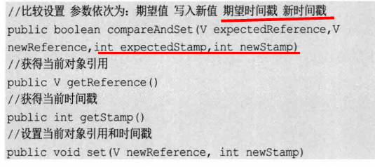


```java
public class AtomicStampedReferenceDemo {
    // 初始化 参数1：初始值【自动包装】 初始版本号
    static AtomicStampedReference<Integer> money = new AtomicStampedReference<>(19,0);

    public static void main(String[] args) {
        for (int i = 0; i < 3; i++) {

            new Thread(){
                @Override
                public void run() {
                    while(true){
                        int timeStamp = money.getStamp();
                        while (true){
                            Integer m = money.getReference();
                            if(m<80){
                                if(money.compareAndSet(m,m+20,timeStamp,timeStamp+1)){
                                    System.out.println("余额小于20元，充值成功，余额："+money.getReference()+" 元");
                                    break;
                                }
                            }
                        }
                    }
                }
            }.start();
        }
    }
}
```

* **注意：** **Integer 使用了对象缓存机制，默认范围是 -128 ~ 127 ，推荐使用静态工厂方法valueOf 【自动包装】获取对象实** **例，而不是 new，因为 valueOf 使用缓存，而 new 一定会创建新的对象分配新的内存空间；**


## 各种锁的理解


### 悲观锁、乐观锁

* 悲观锁和乐观锁**并不是特指某个锁**，而是在并发情况下的两种不同策略，是一种宏观的描述。

* 悲观锁

  * 总是假设最坏的情况，每次去拿数据的时候都认为别人会修改，所以每次在拿数据的时候都会上锁，这样别人想拿这个数据就会阻塞直到它拿到锁。
  * 比较适用于写多读少场景
  * Java中synchronized和ReentrantLock等独占锁就是悲观锁思想的实现。
  * 传统的关系型数据库使用这种锁机制，比如行锁，表锁等，读锁，写锁等，都是在做操作之前先上锁；

* 乐观锁

  * 乐观锁，总是乐观地假设最好的情况，每次去拿数据的时候都认为别人不会修改这个数据，所以**不会上锁**，只会要对数据进行更新时判断一下在此期间(拿到数据到更新的期间)别人有没有去更改这个数据，如果修改过，则重新读取，再次重新更新，循环上述步骤直到更新成功，(当然也允许更新失败的线程放弃)。可以使用版本号机制和**CAS**算法实现。【JUC包里面的原子类都是利用乐观锁实现的】

  * CAS实现：Java中java.util.concurrent.atomic包下面的原子变量使用了乐观锁的一种CAS实现方式，CAS分析看下节。

    版本号控制：一般是在数据表中加上一个数据版本号version字段，表示数据被修改的次数，当数据被修改时，version值会加一。当线程A要更新数据值时，在读取数据的同时也会读取version值，在提交更新时，若刚才读取到的version值为当前数据库中的version值相等时才更新，否则重试更新操作，直到更新成功

  * 适用于写比较少的情况，即冲突很少发生的时候，可以省去锁的开销，**加大了系统的吞吐量。**

    但如果系统经常发生冲突，上层应用会不断的进行重试，这样反倒是降低了性能，这种情况还是用悲观锁比较合适。

* **悲观锁阻塞事务，乐观锁回滚重试**，各有优缺点。


#### 乐观锁实现方式-CAS 

https://juejin.cn/post/6866795970274394126

##### 背景

在jdk1.5之前都是使用`synchronized`关键字保证同步，`synchronized`保证了无论哪个线程持有共享变量的锁，都会采用独占的方式来访问这些变量,导致会存在这些问题：

- 在多线程竞争下，**加锁、释放锁会导致较多的上下文切换和调度延时，引起性能问题**
- 如果一个线程持有锁，其他的线程就都会挂起，等待持有锁的线程释放锁。
- 如果一个优先级高的线程等待一个优先级低的线程释放锁，会导致优先级倒置，引起性能风险

为了**优化悲观锁这些问题，就出现了乐观锁：**

**假设没有并发冲突，每次不加锁操作同一变量，如果有并发冲突导致失败，则重试直至成功。**


##### CAS（Compare and Swap）原理

* CAS 全称是 compare and swap(比较并且交换)，是一种用于在**多线程环境下实现同步功能的机制**，其也是**无锁优化，或者叫自旋，还有自适应自旋。**
* 在jdk中，**`CAS`加`volatile`关键字作为实现并发包的基石。没有CAS就不会有并发包，**java.util.concurrent中借助了CAS指令实现了一种区别于synchronized的一种乐观锁。


##### **乐观锁的一种典型实现机制（CAS）:**

乐观锁主要就是两个步骤：

- 冲突检测
- 数据更新

当多个线程尝试使用CAS同时更新同一个变量时，只有一个线程可以更新变量的值，其他的线程都会失败，失败的线程并不会挂起，而是告知这次竞争中失败了，并可以再次尝试。

- **需要读写的内存位置(V)**
- **预期原值(A)**
- **新值(B)**

首先先读取需要读写的内存位置(V)，然后比较需要读写的内存位置(V)和预期原值(A)，如果内存位置与预期原值的A相匹配，那么将内存位置的值更新为新值B。如果内存位置与预期原值的值不匹配，那么处理器不会做任何操作。无论哪种情况，它都会在 CAS 指令之前返回该位置的值。具体可以分成三个步骤：

- **读取（需要读写的内存位置(V)）**
- **比较（需要读写的内存位置(V)和预期原值(A)）**
- **写回（新值(B)）**


### synchronized锁升级

**无锁 -》偏向锁 -》轻量级锁 -》重量级锁** 【过程叫做**锁膨胀**】

* 锁对象的对象头存储了哪个线程占有了锁对象。
* 线程通过修改锁对象的对象头信息来占有锁对象
* 线程通过修改锁对象的对象头信息来对锁对象进行升级

https://blog.csdn.net/tongdanping/article/details/79647337

源码分析：https://www.cnblogs.com/kundeg/p/8422557.html


* 锁升级过程同时伴随着mark word信息的变化过程

#### 无锁状态

* 新创建一个对象时，其对象头中存放hashcode的位置是没有存值的，只有显示或隐式调用**父类object的hashcode方法**后对象头才会有hashcode，没调用时该位置为0，隐式调用一般是将对象存放到类哈希结构时进行的调用
* 在对象头中对于锁标志位，无锁和偏向锁都是01表示，区别在无锁时，偏向锁标志位是0，偏向锁时，偏向锁标志位是1
* 升级为偏向锁的过程：只有无锁对象头里没有存储hashcode才能升级，为啥：因为升级为偏向锁后其将会覆盖hashcode，而jvm是不允许我们覆盖hashcode的。无锁升级为偏向锁时直接讲线程放到23位中，用2位记录Epoch和4位记录对象分代年龄，同时偏向锁标志位置1。
* 无锁和偏向锁的区别
  * 无锁状态markword前25位为hashcode，偏向锁23位是偏向线程的id，以及两位的epoch。
  * 无锁状态下偏向锁标记位是0，偏向锁状态下偏向锁标记位是1。


#### 偏向锁

* 引入偏向锁的原因：因为经过HotSpot的作者大量的研究发现，**大多数时候是不存在锁竞争的，常常是一个线程多次获得同一个锁**，因此如果每次都要**竞争锁会增大很多没有必要付出的代价，为了降低获取锁的代价，才引入的偏向锁，只需简单判断锁是否偏向当前线程即可**。

* **初次执行到synchronized代码块时，锁对象从无锁变成偏向锁。**

* 字面意思是”**偏向于第一个获得它的线程**“的锁。当线程1访问代码块并获取锁对象时，会在java对象头和栈帧中记录偏向的锁的threadID，因为**偏向锁不会主动释放锁**，因此以后线程1**再次获取锁**的时候，需要**比较当前线程的threadID和Java对象头中的threadID是否一致**，如果一致（还是线程1获取锁对象），则无需使用CAS来加锁、解锁；如果不一致（其他线程，如线程2要竞争锁对象，而偏向锁不会主动释放因此还是存储的线程1的threadID），那么需要查看Java对象头中记录的线程1是否存活，如果没有存活，那么锁对象被重置为无锁状态，其它线程（线程2）可以竞争将其设置为偏向锁；如果**存活**，那么立刻查找该线程（线程1）的栈帧信息，**如果还是需要继续持有这个锁对象，那么暂停当前线程1，撤销偏向锁，升级为轻量级锁**，如果线程1 不再使用该锁对象，那么将锁对象状态设为无锁状态，重新偏向新的线程。

* 对于几乎没有锁竞争的场合，偏向锁有比较好的优化效果，因为连续多次极有可能是同一个线程请求相同的锁。

* 偏向锁是默认开启的，而且开始时间一般是比应用程序启动慢几秒，如果不想有这个延迟，那么可以使用-XX:BiasedLockingStartUpDelay=0；

  如果不想要偏向锁，那么可以通过-XX:-UseBiasedLocking = false来设置；

* 偏向锁升级过程：锁竞争是必要条件不是充分条件，偏向锁状态下，另一线程过来todo


#### 轻量级锁（自旋锁）

* 一旦有第二个线程加入锁竞争，且**原先持有锁对象的线程仍然需要锁对象**，偏向锁就升级为轻量级锁（自旋锁）。

* 引入轻量级锁的原因：轻量级锁考虑的是**竞争锁对象的线程不多，而且线程持有锁的时间也不长**的情景。**因为阻塞线程需要CPU从用户态转到内核态，代价较大，如果刚刚阻塞不久这个锁就被释放了，那这个代价就有点得不偿失了**，因此这个时候就干脆不阻塞这个线程，让它自旋这等待锁释放。

* 轻量级锁什么时候升级为重量级锁？

  * 线程1获取轻量级锁时会先把锁对象的对象头中的MarkWord复制一份到线程1的栈帧中创建的用于存储锁记录的空间（称为DisplacedMarkWord），然后**使用CAS把锁对象对象头中的锁记录指针替换为线程1存储的锁记录（DisplacedMarkWord）的地址；**

    如果在线程1复制对象头的同时（在线程1CAS之前），线程2也准备获取锁，复制了对象头到线程2的锁记录空间中，但是在线程2CAS的时候，发现线程1已经把对象头换了，线程2的CAS失败，那么线程2就尝试**使用自旋操作来等待线程1释放锁。**【升级为自旋锁，长时间的自旋操作非常消耗资源，一个线程持有锁，其他线程只能在**原地空耗cpu**，执行不了任何有效的任务，这种现象叫做**忙等**。】

    但是如果自旋的时间太长也不行，因为自旋是要消耗CPU的，因此**自旋的次数是有限制的**，比如10次或者100次，如果**自旋次数到了线程1还没有释放锁**，或者**线程1还在执行，线程2还在自旋等待，这时又有一个线程3过来竞争这个锁对象**，那么这个时候轻量级锁就会膨胀为重量级锁。**重量级锁把除了拥有锁的线程都阻塞【真实地将线程在操作系统层面挂起】，防止CPU空转。**

* **注意：**为了避免无用的自旋，轻量级锁一旦膨胀为重量级锁就**不会再降级为轻量级锁了**；偏向锁升级为轻量级锁也不能再降级为偏向锁。一句话就是锁可以升级不可以降级，但是偏向锁状态可以被重置为无锁状态。


#### 这几种锁的优缺点（偏向锁、轻量级锁、重量级锁）


### 锁的优化

这里说的锁是synchronized，因为其他其实是通过AQS实现，并不涉及操作系统层面的锁。

简单来说在JVM中monitorenter和monitorexit字节码依赖于底层的操作系统的Mutex Lock来实现的，但是由于使用Mutex Lock需要将当前线程挂起并从用户态切换到内核态来执行，这种切换的代价是非常昂贵的；然而在现实中的大部分情况下，同步方法是运行在单线程环境(无锁竞争环境)如果每次都调用Mutex Lock那么将严重的影响程序的性能。**不过在jdk1.6中对锁的实现引入了大量的优化，如锁粗化(Lock Coarsening)、锁消除(Lock Elimination)、轻量级锁(Lightweight Locking)、偏向锁(Biased Locking)、适应性自旋(Adaptive Spinning)等技术来减少锁操作的开销**。

* 减少持有锁的时间：**尽可能地减少对某个锁的占有时间**，以减少线程间互斥的可能。
* 减少锁的粒度：**缩小锁定对象的范围**，从而减少锁冲突的可能性，进而提高系统的并发能力。【ConcurrentHashMap的分段锁】
* jvm对锁的优化：锁的4种状态：无锁状态、偏向锁状态、轻量级锁状态、重量级锁状态（级别从低到高）【上面就是】
* **锁粗化**【实战java144】：按理来说，同步块的作用范围应该尽可能小，仅在共享数据的实际作用域中才进行同步，这样做的目的是为了**使需要同步的操作数量尽可能缩小，缩短阻塞时间**，如果存在锁竞争，那么等待锁的线程也能尽快拿到锁。 
  但是**加锁解锁也需要消耗资源**，如果存在一系列的连续加锁解锁操作，可能会导致不必要的性能损耗。 
  **锁粗化就是将多个连续的加锁、解锁操作连接在一起，扩展成一个范围更大的锁，避免频繁的加锁解锁操作。**
* **锁消除**：Java虚拟机在JIT编译时(可以简单理解为当某段代码即将第一次被执行时进行编译，又称即时编译)，通过对运行上下文的扫描，经过逃逸分析，**去除不可能存在共享资源竞争的锁**，通过这种方式**消除没有必要的锁，可以节省毫无意义的请求锁时间** 
* `偏向锁(Biased Locking)`：是为了在**无锁竞争的情况下避免在锁获取过程中执行不必要的CAS原子指令**，因为CAS原子指令虽然相对于重量级锁来说开销比较小但还是存在非常可观的本地延迟。
* `轻量级锁(Lightweight Locking)`：**使用CAS原子指令代替操作系统下的重量级锁完成加解锁操作**。当存在锁竞争的情况下，执行CAS指令失败的线程将调用操作系统互斥锁进入到阻塞状态，当锁被释放的时候被唤醒
* `适应性自旋(Adaptive Spinning)`：当线程在获取轻量级锁的过程中执行CAS操作失败时，在进入与monitor相关联的操作系统重量级锁(mutex semaphore)前会进入忙等待(Spinning)然后再次尝试，**当尝试一定的次数后如果仍然没有成功则调用与该monitor关联的semaphore(即互斥锁)进入到阻塞状态。**


###  公平锁、非公平锁

* **公平锁：** 非常公平， 不能够插队，必须先来后到！ 

* **非公平锁：**非常不公平，可以插队 （默认都是非公平）

* 公平锁【不会产生饥饿现象】需要维护一个有序队列，成本高，默认是非公平锁【获取锁时会从锁等待队列中随机挑选一个】
* ReentrantLock可通过构造函数传参指定该锁是否是公平锁，默认是非公平锁。
* synchronized，是非公平锁，没有任何方法使其变成公平锁。
* 一般情况下，非公平锁的吞吐量比公平锁大，如果没有特殊要求，优先使用非公平锁。

```java
public ReentrantLock() {
	sync = new NonfairSync();
}
public ReentrantLock(boolean fair) {
	sync = fair ? new FairSync() : new NonfairSync();
}
```


### 读写锁、共享锁、互斥锁

* 读写锁是一堆所，一个读锁（共享锁）和一个写锁（互斥锁、排他锁）。

* 如果读取值是为了更新它，则加写锁，持有写锁的时候其他线程无论读还是写都需要等待；

* 如果读取数据仅为了查询，则加读锁，其他线程如果也要加读锁读取数据，不需要等待，可以直接获取（读锁计数器+1//TODO ?)。

* jdk提供的唯一一个ReadWriteLock接口的实现类是ReentrantReadWriteLock

* 可通过以下的方式获得锁实例

  ```java
  Lock lock=reentrantReadWriteLock.readLock();
  Lock lock=reentrantReadWriteLock.writeLock();
  ```


### 可重入锁和不可重入锁

* 可重入锁：当线程获取某个锁后，**还可以继续获取它，可以递归调用，而不会发生死锁；**
  * ReentrantLock和synchronized都是可重入锁。
* 不可重入锁：与可重入相反，**获取锁后不能重复获取，否则会死锁（自己锁自己）。**
* 实现代码：https://cloud.tencent.com/developer/article/1493305

* 可重入锁的例子

> Synchronized

```java
// Synchronized
public class Demo01 {
    public static void main(String[] args) {
        Phone phone = new Phone();
        new Thread(()->{
            phone.sms();
        },"A").start();
        new Thread(()->{
            phone.sms();
        },"B").start();
    }
}
class Phone{
    public synchronized void sms(){
        System.out.println(Thread.currentThread().getName() + "sms");
        call(); // 这里也有锁
    }
    public synchronized void call(){
        System.out.println(Thread.currentThread().getName() + "call");
    }
}
```


> Lock 版（需要手动加锁释放锁）

```java
public class Demo02 {
    public static void main(String[] args) {
        Phone2 phone = new Phone2();
        new Thread(()->{
            phone.sms();
        },"A").start();
        new Thread(()->{
            phone.sms();
        },"B").start();
    }
}
class Phone2{
    Lock lock = new ReentrantLock();
    public void sms(){
        lock.lock(); // 细节问题：lock.lock(); lock.unlock(); // lock 锁必须配对，否则就会死在里面
        lock.lock();
        try {
            System.out.println(Thread.currentThread().getName() + "sms");
            call(); // 这里也有锁
        } catch (Exception e) {
            e.printStackTrace();
        } finally {
            lock.unlock();
            lock.unlock();
        }
    }
    public void call(){
        lock.lock();
        try {
            System.out.println(Thread.currentThread().getName() + "call");
        } catch (Exception e) {
            e.printStackTrace();
        } finally {
            lock.unlock();
        }
    }
}
```


###  自旋锁

> 自定义一个锁测试

```java
/**
* 自旋锁
*/
public class SpinlockDemo {
    // int 0
    // Thread null
    AtomicReference<Thread> atomicReference = new AtomicReference<>();
    // 加锁
    public void myLock(){
        Thread thread = Thread.currentThread();
        System.out.println(Thread.currentThread().getName() + "==> mylock");
        // 自旋锁
        while (!atomicReference.compareAndSet(null,thread)){
        }
    }
    // 解锁
    // 加锁
    public void myUnLock(){
        Thread thread = Thread.currentThread();
        System.out.println(Thread.currentThread().getName() + "==> myUnlock");
        atomicReference.compareAndSet(thread,null);
    }
}
public class TestSpinLock {
    public static void main(String[] args) throws InterruptedException {
        // 底层使用的自旋锁CAS
        SpinlockDemo lock = new SpinlockDemo();
        new Thread(()-> {
            lock.myLock();
            try {
                TimeUnit.SECONDS.sleep(5);
            } catch (Exception e) {
                e.printStackTrace();
            } finally {
                lock.myUnLock();
            }
        },"T1").start();
        TimeUnit.SECONDS.sleep(1);
        new Thread(()-> {
            lock.myLock();
            try {
                TimeUnit.SECONDS.sleep(1);
            } catch (Exception e) {
                e.printStackTrace();
            } finally {
                lock.myUnLock();
            }
        },"T2").start();
    }
}
```


###  死锁

* 概念：
* 发生条件：
  * **互斥**，共享资源只能被一个线程占用
  * **占有且等待**，线程 t1 已经取得共享资源 s1，尝试获取共享资源 s2 的时候，不释放共享资源 s1
  * **不可抢占**，其他线程不能强行抢占线程 t1 占有的资源 s1
  * **循环等待**，线程 t1 等待线程 t2 占有的资源，线程 t2 等待线程 t1 占有的资源

```java
public class DeadLockDemo {
    public static void main(String[] args) {
        String lockA = "lockA";
        String lockB = "lockB";
        new Thread(new MyThread(lockA, lockB), "T1").start();
        new Thread(new MyThread(lockB, lockA), "T2").start();
    }
}

class MyThread implements Runnable{
    private String lockA;
    private String lockB;
    public MyThread(String lockA, String lockB) {
        this.lockA = lockA;
        this.lockB = lockB;
    }
    @Override
    public void run() {
        synchronized (lockA){
            System.out.println(Thread.currentThread().getName() +
                               "lock:"+lockA+"=>get"+lockB);
            try {
                TimeUnit.SECONDS.sleep(2);
            } catch (InterruptedException e) {
                e.printStackTrace();
            }
            synchronized (lockB){
                System.out.println(Thread.currentThread().getName() +
                                   "lock:"+lockB+"=>get"+lockA);
            }
        }
    }
}
```

**解决问题：**

1. 使用 jps -l 定位进程号

   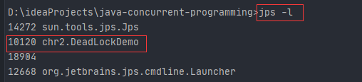

2. 使用 jstack 进程号 找到死锁问题

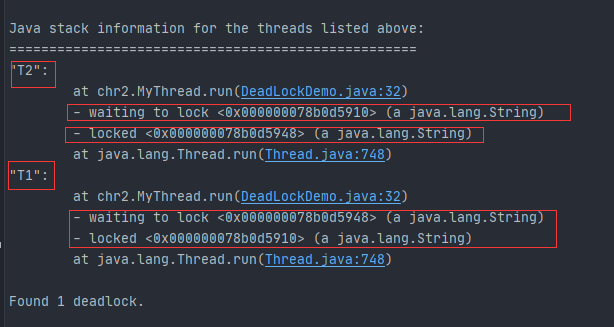


* 避免死锁：

  对于以上 4 个条件，只要破坏其中一个条件，就可以避免死锁的发生。

  其他三个条件，我们可以尝试

  - **一次性申请所有的资源**，破坏 "占有且等待" 条件
  - **占有部分资源的线程进一步申请其他资源时，如果申请不到，主动释放它占有的资源**，破坏 "不可抢占" 条件
  - **按序申请资源**，破坏 "循环等待" 条件

  

  **编程实现**

  * 使用无锁函数、无锁的并发工具类代替加锁
  * 使用可重入锁，通过重入锁的中断或者限时等待
  * 降低锁的使用粒度
  * 减少同步代码块


##  锁相关


### 从Atomic到CAS

> Java内存模型要保证可见性、原子性和有序性。
>
> Java 虚拟机又提供了一个轻量级的同步机制——volatile
>
> 但是 volatile 算是乞丐版的 synchronized，并不能保证原子性 ，所以，又增加了`java.util.concurrent.atomic`包， 这个包下提供了一系列原子类。


#### Atomic原子类

**Atomic原子类**可以保证在多线程的环境下，当某个线程在执行atomic的方法时，其他的线程不会打断它，只会像自选算**自旋锁**一样，等到该方法完成之后才等分配线程。Atomic 类在软件层面上是**非阻塞**的，它的原子性其实是在**硬件层面**上借助**相关的指令**来保证的。

Atomic类可以**分成四组**：

1. 基本类型：AtomicBoolean，AtomicInteger，AtomicLong
2. 数组类型：tomicIntegerArray，AtomicLongArray，AtomicReferenceArray
3. 引用类型：AtomicReference，AtomicMarkableReference，AtomicStampedReference
4. 对象的属性修改类型 ：AtomicIntegerFieldUpdater，AtomicLongFieldUpdater，AtomicReferenceFieldUpdater
5. JDK1.8新增：DoubleAccumulator、LongAccumulator、DoubleAdder、LongAdder、Striped64

以 **AtomicInteger** 为例了解常用方法

| 方法                    | 描述                                                         |
| ----------------------- | ------------------------------------------------------------ |
| get()                   | 直接返回值                                                   |
| addAndGet(int)          | 增加指定的数据后返回增加后的数据，相当于 i++                 |
| getAndAdd(int)          | 增加指定的数据，返回变化前的数据，相当于 ++i                 |
| getAndIncrement()       | 增加1，返回增加前的数据                                      |
| getAndDecrement()       | 减少1，返回减少前的数据                                      |
| getAndSet(int)          | 设置指定的数据，返回设置前的数据                             |
| decrementAndGet()       | 减少1，返回减少后的值                                        |
| incrementAndGet()       | 增加1，返回增加后的值                                        |
| floatValue()            | 转化为浮点数返回                                             |
| intValue()              | 转化为int 类型返回                                           |
| set(int)                | 设置为给定值                                                 |
| lazySet(int)            | 仅仅当get时才会set http://ifeve.com/juc-atomic-class-lazyset-que/ |
| compareAndSet(int, int) | 尝试新增后对比，若增加成功则返回true否则返回false            |

```java
/*
	compareAndSet() 尝试新增前对比，若增加成功则返回true否则返回false。其实就是比较并交换，判断用当前值和期望值	（第一个参数），是否一致，如果一致，修改为更新值（第二个参数），这就是大名鼎鼎的 CAS。
*/
public class CASDemo {
    public static void main(String[] args) {
        System.out.println(num.compareAndSet(6, 7) + "\t + current num:" + num);
        System.out.println(num.compareAndSet(6, 7) + "\t current num:" + num);
    }
}

------------------------------------------------------
true	 + current num:7
false	 current num:7
```


#### CAS

- CAS：全称 `Compare and swap`，即**比较并交换**，它是一条 **CPU 同步原语**。是一种硬件对并发的支持，针对多处理器操作而设计的一种特殊指令，用于管理对共享数据的并发访问。
- CAS 是一种**非阻塞**算法的实现。
- CAS 包含了 3 个操作数：
- - 需要读写的内存值 V
  - 旧的预期值 A
  - 要修改的更新值 B
- 当且仅当 V 的值等于 A 时，CAS 通过原子方式用新值 B 来更新 V 的 值，否则不会执行任何操作（他的功能是判断内存某个位置的值是否为预期值，如果是则更改为新的值，这个过程是原子的。）

CAS 并发原语体现在 Java 语言中的 `sum.misc.Unsafe` 类中的各个方法。调用 Unsafe 类中的 CAS 方法， JVM 会帮助我们实现出 CAS 汇编指令。这是一种完全依赖于硬件的功能，通过它实现了原子操作。再次强调，由于 CAS是一种系统原语，**原语属于操作系统用于范畴，是由若干条指令组成的，用于完成某个功能的一个过程，并且原语的执行必须是连续的**，**在执行过程中不允许被中断**，CAS 是一条 CPU 的原子指令，不会造成数据不一致问题。

> 我们常用的 `java.util.concurrent` 包就建立在CAS之上。


**用 CAS 分析 AtomicInteger 类：**

```java
public class AtomicInteger extends Number implements java.io.Serializable {
    private static final long serialVersionUID = 6214790243416807050L;

    // setup to use Unsafe.compareAndSwapInt for updates
    // 该类下的方法大部分是 调用了 Unsafe 类
    private static final Unsafe unsafe = Unsafe.getUnsafe();
    // valueOffset 表示该变量值在内存中的偏移地址，因为 UnSafe 就是根据内存偏移地址获取数据。
    private static final long valueOffset;

    static {
        try {
            valueOffset = unsafe.objectFieldOffset
                (AtomicInteger.class.getDeclaredField("value"));
        } catch (Exception ex) { throw new Error(ex); }
    }
	
    //增加1
public final int getAndIncrement() {
        return unsafe.getAndAddInt(this, valueOffset, 1);
    }
    
    // volatile保证了多线程之间的内存可见性和相关指令的有序性。 实际值
    private volatile int value;
    
    // ... (methods) ...
}
```


**UnSafe类：**

是 CAS 的核心类，由于 Java 方法无法直接访问底层系统，需要通过本地（native）方法来访问，UnSafe 相当于一个后门，基于该类可以直接操作特定内存的数据。UnSafe 类存在与 `sum.misc` 包中，其内部方法可以像 C 语言的指针一样直接操作内存，因为 Java 中 CAS 操作的执行依赖于 UnSafe 类的方法。

UnSafe 类中的所有方法都是 **native 修饰**的，也就是说该类中的方法都是**直接调用操作系统底层资源**执行相应任务。

* JAVA实现CAS的原理，unsafe::compareAndSwapInt是借助C来**调用CPU底层指令实现**的。下面是sun.misc.Unsafe::compareAndSwapInt()方法的源代码：

```java
// Unsafe 类为一单例实现，提供静态方法 getUnsafe 获取 Unsafe 实例，当且仅当调用 getUnsafe 方法的类为引导类加载器所加载时才合法，否则抛出 SecurityException 异常
public final class Unsafe {
    private static final Unsafe theUnsafe;
	// ......
    @CallerSensitive
    public static Unsafe getUnsafe() {
        Class var0 = Reflection.getCallerClass();
        if (!VM.isSystemDomainLoader(var0.getClassLoader())) {
            throw new SecurityException("Unsafe");
        } else {
            return theUnsafe;
        }
    }

    public native int getInt(Object var1, long var2);

    public native void putInt(Object var1, long var2, int var4);

    public native Object getObject(Object var1, long var2);

    public native void putObject(Object var1, long var2, Object var4);
    
    public final native boolean compareAndSwapObject(Object var1, long var2, Object var4, Object var5);
    
    public final native boolean compareAndSwapInt(Object var1, long var2, int var4, int var5);
    // ......
}
```

**逐层看 Unsafe 类中的 getAndAdd() 的源码如下：**

```java
// val1：AtomicInteger 对象本身
// var2：该对象值的引用地址，内存偏移量
// var4：需要变动的数量，即 ++i 的 i
public final int getAndAddInt(Object var1, long var2, int var4) {
    // 用var1， var2 找出的主内存中真实的值（通过内存偏移量）
    int var5;
    do {
        // 使用偏移量获取内存中的value
        var5 = this.getIntVolatile(var1, var2);
     // this.compareAndSwapInt  用该对象当前的值与 var5 比较，如果相同，更新 var5 + var4 并且返回 true，如果不同，继续取值然后再比较，直到更新完成。
    } while(!this.compareAndSwapInt(var1, var2, var5, var5 + var4));

    return var5;
}
```

> 这一操作没有加锁，反复执行，既保证了一致性，又保证了并发性。

假设线程A和线程B两个线程同时执行 getAndAddInt 操作（分别跑在不同CPU上）：

1. AtomicInteger 里面的 value 原始值为 3，即主内存中 AtomicInteger 的 value 为 3，根据 JMM 模型，线程A和线程B各自持有一份值为 3 的 value 的副本分别到各自的工作内存；
2. 线程A通过 getIntVolatile(var1,var2) 拿到 value 值3，这时线程A被挂起；
3. 线程B也通过 getIntVolatile(var1,var2) 方法获取到 value 值 3，此时刚好线程B没有被挂起并执行compareAndSwapInt 方法比较内存值为 3，成功修改内存值为 4，线程B结束，一切正常
4. 这时线程A恢复，执行compareAndSwapInt() 方法比较，发现自己手里的3和主内存的值4不一致，说明该值已经被其他线程抢先一步修改过了，那线程A本次修改失败，重新读取；
5. 线程A重新获取value值，因为变量value 被 volatile 修饰，所以其他线程对它的修改，线程A总是能够看到，线程A继续执行compareAndSwapInt进行比较替换，直到成功


**获取UnSafe类**

1. 从`getUnsafe` 方法的使用限制条件出发，通过Java命令行命令 `-Xbootclasspath/a` 把调用 Unsafe 相关方法的类A所在 jar 包路径追加到默认的 bootstrap 路径中，使得A被引导类加载器加载，从而通过`Unsafe.getUnsafe`方法安全的获取 Unsafe 实例。

```
java -Xbootclasspath/a: ${path}   // 其中path为调用Unsafe相关方法的类所在jar包路径
```

1. 通过反射技术暴力获取 Unsafe 对象

```java
   private static Unsafe reflectGetUnsafe() {
       try {
         Field field = Unsafe.class.getDeclaredField("theUnsafe");
         field.setAccessible(true);
         return (Unsafe) field.get(null);
       } catch (Exception e) {
         log.error(e.getMessage(), e);
         return null;
       }
   }
```

https://juejin.cn/post/6866795970274394126

#### 优点

* 线程不会转为阻塞状态，因为线程状态转换需要CPU从用户态转到内核态，减低开销。

#### 缺点

- **循环时间长，CPU开销很大**。CAS算法需要不断地自旋来读取最新的内存值，长时间读取不到就会造成**不必要的CPU开销**。do while 如果CAS失败，会一直进行尝试，如果CAS长时间一直不成功，可能会给CPU带来很大的开销

  - 解决方法：
  - **限制自旋次数，防止进入死循环**
  - JVM能支持处理器提供的pause指令那么效率会有一定的提升，

- **只能保证一个共享变量的原子操作**。当对一个共享变量执行操作时，我们可以使用循环CAS的方式来保证原子操作，但是，**对多个共享变量操作时，循环CAS就无法保证操作的原子性。**

  - 解决方法：
  - 如果需要对**多个共享变量进行操作**，可以使用**加锁方式(悲观锁)保证原子性，**
  - 可以把**多个共享变量合并成一个共享变量进行CAS操作。**

- ABA 问题

  比如线程1从内存位置 V 中取出A，这时线程2也从内存中取出A，并且线程2进行了一些操作将值变成了B，然后线程2又将V位置的数据变成A，这个时候线程1进行CAS操作发现内存中仍然是A，线程1就会**误认为它没有被修改过**，**这个漏洞就是CAS操作的"ABA"问题。**

  **解决：**

  各种乐观锁的实现中通常都会用版本戳 version 来对记录或对象标记，避免并发操作带来的问题

  在Java中，AtomicStampedReference 也实现了这个作用，它通过包装**[E,int]的元组来对对象标记版本戳stamp，从而避免ABA问题**【改用传统的互斥同步（典型就是synchronized和Lock）可能会**比原子类更高效**】
  
  ```java
  // 首先检查当前引用是否等于预期引用，并且当前标志是否等于预期标志，如果全部相等，则以原子方式将该引用和该标志的值设置为给定的更新值。
  public boolean compareAndSet(
                 V      expectedReference,//预期引用
                 V      newReference,//更新后的引用
                int    expectedStamp, //预期标志
                int    newStamp //更新后的标志
  
  )
  
  ```
  
  

## AQS(AbstractQueuedSynchronizer)原理

https://www.cnblogs.com/waterystone/p/4920797.html

https://juejin.cn/post/6844903997438951437


* 类如其名，**抽象的队列式的同步器**，**AQS定义了一套多线程访问共享资源的同步器框架，许多同步类实现都依赖于它**，**基于AQS构建同步器：**【底层通过CAS实现，除了synchronized和volatile以外的并发工具都基于它实现，模板方法设计模式】
  - ReentrantLock
  - Semaphore
  - CountDownLatch
  - ReentrantReadWriteLock
  - SynchronusQueue
  - FutureTask
* **优势：**
  - AQS 解决了在实现同步器时涉及的大量细节问题，例如自定义标准同步状态、FIFO 同步队列。
  - 基于 AQS 来构建同步器可以带来很多好处。它不仅能够极大地减少实现工作，而且也不必处理在多个位置上发生的竞争问题。
* 核心思想
  * 如果被请求的共享资源空闲，则将当前请求资源的线程设置为有效的工作线程，并且将共享资源设置为锁定状态。如果被请求的共享资源被占用，那么就需要一套线程阻塞等待以及被唤醒时锁分配的机制，这个机制AQS是用CLH队列锁【同步队列】实现的，即将暂时获取不到锁的线程加入到队列中。如图所示：
  * 该队列由一个一个的Node结点组成，每个Node结点维护一个prev引用和next引用，分别指向自己的前驱和后继结点。AQS维护两个指针，分别指向队列头部head和尾部tail。【本质就是双端双向链表】


**Sync queue：** 同步队列，是一个双向列表。包括head节点和tail节点。head节点主要用作后续的调度。


* 其内部维护了一个volatile int state（代表共享资源，表示同步状态）和一个FIFO线程等待队列（多线程争用资源被阻塞时会进入此队列，用于构建锁或者其他同步装置）。
  * state的访问方式有三种:
    - getState()
    - setState()
    - compareAndSetState()【原子方式地将同步状态值设置为给定值】

* AQS定义两种资源共享方式：Exclusive（**独占**，只有一个线程能执行，如ReentrantLock）和Share（**共享**，多个线程可同时执行，如Semaphore/CountDownLatch）。
  * AQS它的所有子类中，**要么实现并使用了它的独占功能的api，要么使用了共享锁的功能**，而不会同时使用两套api，即便是最有名的子类ReentrantReadWriteLock也是通过两个内部类读锁和写锁分别实现了两套api来实现的
* 不同的自定义同步器争用共享资源的方式也不同。**自定义同步器在实现时只需要实现共享资源state的获取与释放方式即可**，至于具体线程等待队列的维护（如获取资源失败入队/唤醒出队等），AQS已经在顶层实现好了。AQS使用了**模板设计模式**，**自定义同步器实现时主要实现以下几种方法：**
  * isHeldExclusively()：该线程是否正在独占资源。只有用到condition才需要去实现它。
  * tryAcquire(int)：独占方式。尝试获取资源，成功则返回true，失败则返回false。
  * tryRelease(int)：独占方式。尝试释放资源，成功则返回true，失败则返回false。
  * tryAcquireShared(int)：共享方式。尝试获取资源。负数表示失败；0表示成功，但没有剩余可用资源；正数表示成功，且有剩余资源。
  * tryReleaseShared(int)：共享方式。尝试释放资源，如果释放后允许唤醒后续等待结点返回true，否则返回false。
* 例子：以ReentrantLock为例，state初始化为0，表示未锁定状态。A线程lock()时，会调用tryAcquire()独占该锁并将state+1。此后，其他线程再tryAcquire()时就会失败，直到A线程unlock()到state=0（即释放锁）为止，其它线程才有机会获取该锁。当然，释放锁之前，A线程自己是可以重复获取此锁的（state会累加），这就是可重入的概念。但要注意，获取多少次就要释放多么次，这样才能保证state是能回到零态的。


### 同步队列为什么称为FIFO呢？

* **因为只有前驱节点是head节点的节点才能被首先唤醒去进行同步状态的获取。**当该节点获取到同步状态时，它会清除自己的值，将自己作为head节点，以便唤醒下一个节点。
* **头结点是当前获取到同步状态的结点**，获取同步状态state失败的线程，会被构造成一个结点【共享式或独占式】加入到同步队列尾部【采用自旋cas来保证此操作的线程安全】，随后线程会阻塞；而当持有锁的线程释放锁的时候，会唤醒头结点的后续结点，使其加入对同步状态的争夺中。


### Condition队列

**Condition queue：** 非必须，单向列表。当程序中存在Condition 的时候才会存在此列表。


除了同步队列之外，AQS中还存在Condition队列，这是一个单向队列。调用ConditionObject.await()方法，能够将当前线程封装成Node加入到Condition队列的末尾，然后将获取的同步状态释放（即修改同步状态的值，唤醒在同步队列中的线程）。

> Condition队列也是FIFO。调用ConditionObject.signal()方法，能够唤醒firstWaiter节点，将其添加到同步队列末尾。


## 面试相关


### gc线程

* 当程序运行时，至少会有两个线程开启启动，一个是我们的主线程，一个时垃圾回收线程，垃圾回收线程的priority（优先级）较低

  垃圾回收器会对我们使用的对象进行监视，当一个对象长时间不使用时，垃圾回收器会在空闲的时候（不定时）对对象进行回收，释放内存空间，程序员是不可以显示的调用垃圾回收器回收内存的，但是可以使用System.gc()方法建议垃圾回收器进行回收，但是垃圾回收器不一定会执行。

  Java的垃圾回收机制可以有效的防止内存溢出问题，但是它并不能完全保证不会出现内存溢出。例如当程序出现严重的问题时，也可能出现内存溢出问题。
