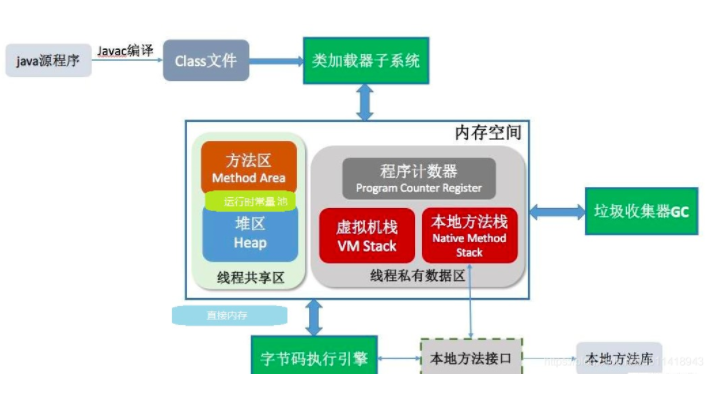
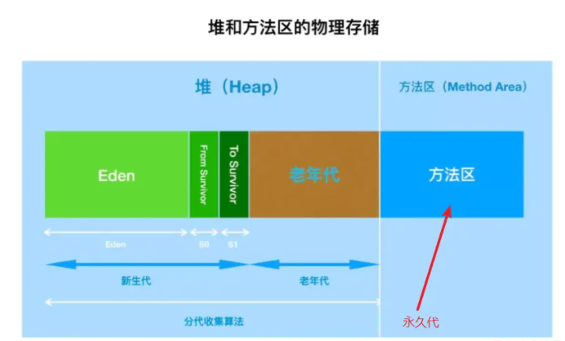
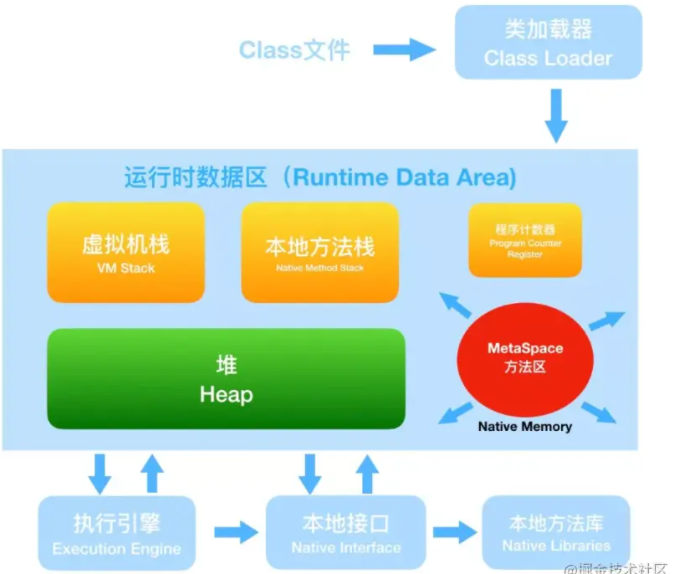
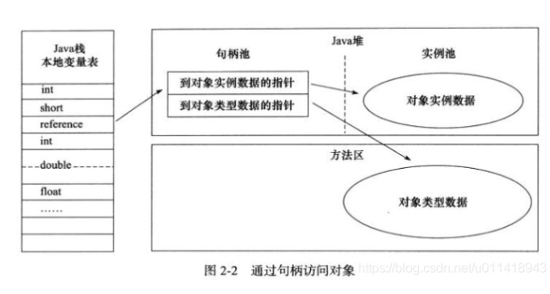
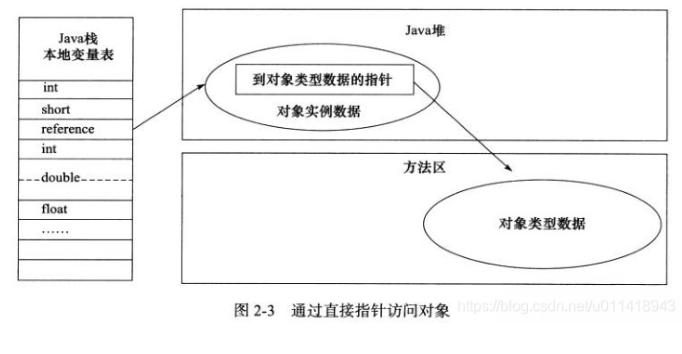

---
title: jvm chr02 java内存区域与内存溢出异常
date: 2021-12-22 18:33:37
categories:	jvm基础
tags: jvm
---

## 认识Java环境

在讲 JVM 之前，先讲讲 JDK、JRE和 JVM 的关系，如下面这张图

可以看到他们的包含关系是 JDK>JRE>JVM

* JDK：jdk是支持 JAVA程序**开发的最小环境**，集成了JRE和一些工具包，如 javac，jar等；比如一个可运行jar，你就需要安装了jdk，才能运行起来
* JRE：是Java**运行时的标准环境**，除了JVM的环境还有一些基本的JAVA库，比如界面的 swing、I/O等
* **JVM**：熟称Java虚拟机，是保证跨平台的基本，用于**加载字节码文件**因为 jvm 只认识字节码，只要linux、window、mac 有jvm 都是可以编译执行的；

而这里，我们就需要讲解 **JVM 这个 运行时数据区域的分布**了

上面解释了一个java程序是怎么运行的，其中 内存空间这里，就是 JVM的内存区域 了；

- **线程共享区**：即程序运行时，**数据在各个线程之间是共享的**，比如某个方法，某个类，还有一些运行时常量
- **线程私有区**：**各个线程之间的数据是独立的**，比如多线程的数据

## java内存区域

### 线程私有区

#### 程序计数器

* 作用：**记录着当前线程所执行的字节码的行号。**就是**控制代码执行的位置。**
* **字节码解释器**工作时就是通过**改变这个计数器的值来选取下一条需要执行的字节码指令**。
* **为了线程切换后能恢复到正确的执行位置**，每条线程都需要一个**独立的程序计数器**，各条线程之间计数器互不影响，独立存储，这类内存区域为“**线程私有**”的内存。
* 线程执行的是java方法，**计数器记录的是正在执行的虚拟机字节码指令的地址【行号】，执行引擎通过该地址找到对应的操作指令处理成机器语言**；执行的是本地（native）方法，**这个计数器值则应为空。**
* **此内存区域是唯一一个没有OutOfMemoryError情况的区域。**
* **使用PC寄存器存储字节码指令地址有什么用呢？为什么使用PC寄存器记录当前线程的执行地址呢？**
  * 因为CPU需要不停的切换各个线程，这时候切换回来以后，就得知道接着从哪开始继续执行。**JVM的字节码解释器就需要通过改变程序计数器的值来明确下一条应该执行什么样的字节码指令。**

* **程序计数器为什么会被设定为线程私有的？**
  * 多线程在一个特定的时间段内只会执行其中某一个线程方法，CPU会不停的做任务切换，这样必然会导致经常中断或恢复。**为了能够准确的记录各个线程正在执行的当前字节码指令地址**，所以为每个线程都分配了一个PC寄存器，每个线程都独立计算，不会互相影响。

* **字节码解释器工作时就是通过改变这个计数器的值来选取下一条需要执行的字节码指令**

#### java虚拟机栈

* Java 虚拟机栈(Java Virtual Machine Stacks)，早期也叫 Java 栈。**每个线程在创建的时候都会创建一个虚拟机栈，其内部保存一个个的栈帧(Stack Frame），对应着一次次 Java 方法调用**，是线程私有的，生命周期和线程相同。
* 描述的是**java方法执行的线程内存模型**，**每个方法执行都会创建一个栈帧，栈帧是一个内存区块，是一个数据集，维系着方法执行过程中的各种数据信息**，用于存储**局部变量表、操作数栈、动态链接、方法出口**等信息，**每一个方法被调用直至执行完毕的过程，就对应着一个栈帧在虚拟机栈中从入栈到出栈的过程。**
  * 局部变量表：存放方法内的一些局部变量和方法参数【可能指向对象的起始地址，也可能是指向代表对象的句柄或者其他与此对象相关的位置】和returnAddress类型【指向了一条字节码指令的地址】，这些数据类型在局部变量表中的存储空间**以局部变量槽来表示**，局部变量表所需的内存空间在**编译期间完成分配**且**其大小是完全确定的**，这里的“大小”是指**变量槽**的数量。
  * 操作数栈：这个方法的操作数栈的最大深度在Code属性的max_stack中。？？
  * 动态链接：**运行时将方法区的符号引用转化为直接引用。**
  * 方法出口：方法退出时的地址信息。
* 如果**线程请求的栈深度大于虚拟机所允许的深度**，将抛出StackOverflowError异常。
* 如果java虚拟机栈容量可以动态扩展，当栈扩展时无法申请到足够的内存会抛出OutOfMemoryError异常。

#### 本地方法栈

* 虚拟机栈为虚拟机执行java方法（即字节码）服务。
* **本地方法栈则是为虚拟机用到的本地（native）方法服务。**且同样是线程私有的。

### 线程共享区

#### java堆

* 虚拟机所管理的一块最大内存区域。其被所有**线程共享**。

* 此区域唯一目的是用来**存放对象实例**，**几乎所有的对象实例以及数组对象**都在堆上分配。由于存在**逃逸分析技术**（分析这个对象不会被其他方法或者线程调用），**也可以分布在栈上，随着出栈而销毁。**

* java堆也是垃圾回收的主要区域。

* java堆可以处于物理上不连续的内存空间中，但在逻辑上它应该是连续的。

* java堆可被实现为固定大小的，也可以是可扩展的。

* 如果java堆中**没有内存完成实例分配，并且堆也无法再扩展时**，java虚拟机将会抛出OutOfMemoryError异常。

* 其内存结构需要与垃圾收集器结合着来说，

  对于标记复制算法，划分新生代和老年代，新生代分Eden区和s0、s1区，比例为8：1：1。

#### 方法区

* 也是各个线程共享的内存区域，用于存储**已被虚拟机加载的类型信息、常量、静态变量、即时编译器编译后的代码缓存**等数据。

  加载进方法区后Class文件常量池变为运行时常量池。

* 对于方法区的垃圾回收目标主要是**针对常量池的回收和对类型的卸载。**

* 常量池表：用于存放编译期生成的各种字面量与符号引用。【类加载后放入运行时常量池中】

  * 字面量：1、文本字符串  2、八种基本数据类型的值 3、被final修饰的常量等。
  * 符号引用：1、类和方法的全限定类名 2、字段的名称和描述 3、方法的名称和描述等。

  运行时常量池相对于class文件常量池【类加载时加载到了方法区中】具有动态性，运行期间可以使用intern方法将新的常量放入池中，运行时常量池会受到方法区内存的限制，当常量池无法再申请到内存时会抛出OutOfMemoryError异常。

##### 永久代与方法区

https://blog.nowcoder.net/n/af2cb134489b44a785c305e543263b49

* 两者并不是等价的，只是使用**永久代来实现方法区**而已，**使得HotSpot的垃圾收集器能够像管理java堆一样管理这部分内存，省去专门为方法区编写内存管理代码的工作**，原则上如何实现方法区属于虚拟机实现细节。

* 在JDK8之前，类的元数据和常量都存放在一个**与堆内存相邻的数据区，即永久代**【永久代和堆是相互隔离的，但它们使用的物理内存是连续的。】。但是在这种情况下有一个问题，如果类的元数据大小超过了永久代的最大可分配内存，那么就会出现内存溢出问题。

  

  * 在JVM启动之前可以通过设置**-XX:MaxPermSize的值来控制永久代的大小，32位机器默认的永久代的大小为64M，64位的机器则为85M。永久代的垃圾回收和老年代的垃圾回收是绑定的**，一旦其中一个区域被占满，这两个区都要进行垃圾回收。但是有一个明显的问题，由于我们可以通过‑XX:MaxPermSize 设置永久代的大小，一旦类的元数据超过了设定的大小，程序就会耗尽内存，并出现内存溢出错误(OOM)。
  * 为什么类的元数据占用内存会那么大？因为在 JDK7 之前的 HotSpot 虚拟机中，**纳入字符串常量池的字符串被存储在永久代中，因此导致了一系列的性能问题和内存溢出错误。**

* jdk6HotSpot开发团队就有放弃永久代，逐步改为**采用本地内存来实现方法区**的计划了，到了jdk7的HotSpot，已经把**原本放在永久代的字符串常量池、静态变量等移出，【符号引用转移到本地内存、字符串常量池和类变量转移到堆中】**，而到了jdk8，终于完全废弃了永久代的概念，**改用**与JRockit、J9一样**在本地内存中实现的元空间**。

* 默认情况下，元空间的大小仅受本地内存限制，元空间的最大可分配空间就是系统可用内存空间。因此，**元空间存在于本地内存，意味着只要本地内存足够，它不会出现像永久代中的内存溢出错误**。但为了不让无限制扩展，jvm同样提供了参数来限制大小。

  * XX:MetaspaceSize　

    \>初始空间大小，达到该值就会触发垃圾收集进行类型卸载，同时GC会对该值进行调整：如果释放了大量的空间，就适当降低该值；如果释放了很少的空间，那么在不超过MaxMetaspaceSize时，适当提高该值。

  * -XX:MaxMetaspaceSize

    \>最大空间，默认是没有限制的。

  * 除了上面两个指定大小的选项以外，还有两个与 GC 相关的属性：

    -XX:MinMetaspaceFreeRatio

    \>在GC之后，最小的Metaspace剩余空间容量的百分比，减少为分配空间所导致的垃圾收集

    -XX:MaxMetaspaceFreeRatio

    \>在GC之后，最大的Metaspace剩余空间容量的百分比，减少为释放空间所导致的垃圾收集

###### 为什么使用元空间替换永久代

* 字符串常量池存在于永久代中，在大量使用字符串的情况下，非常容易出现OOM的异常。
* 优势：直接使用服务器的内存资源，不会限制
* 此外，**JVM加载的class的总数，方法的大小**等都很难确定，因此**对永久代大小的指定难以确定**。太小的永久代容易导致永久代内存溢出，太大的永久代则容易导致虚拟机内存紧张。
* 永久代会为GC带来不必要的复杂度，并且回收效率偏低。
* 更深层的原因还是要合并HotSpot和JRockit的代码，JRockit从来没有所谓的永久代，也不需要开发运维人员设置永久代的大小，但是运行良好。同时也不用担心运行性能问题了,在覆盖到的测试中, 程序启动和运行速度降低不超过1%，但是这点性能损失换来了更大的安全保障。

### 直接内存

* 直接内存并不是虚拟机运行时数据区的一部分，也不是jvm中的内存区域。**但既然是内存，如果 超过了 RAM 和 SWAP 寻址空间限制，还是会报OutOfMemoryError的**。

* 在JDK1.4中，新增加了一个 NIO（New Inout/Outinput）类，引入了一种基于通道(channel)与缓冲区（buffer）的I/O方式，它可以使用 Native 函数库**直接分配堆外内存**，然后通过一个存储在**Java 堆中的 DirectByteBuffer 对象作为这块内存的引用进行操作**。这样在一些场景中能够显著提升技能，**避免了数据再 Java 堆和 Native 堆中来回复制数据**，常见的通道类型有：

  FileChannel：从文件中读写数据
  DatagramChannel：从UDP中读写数据
  SocketChannel：从TCP中读写数据
  ServerSocketChannel：用来监听 websocket 的连接

## 对象创建过程

* 对象的创建，可以分为以下几个步骤

**类加载**

* jvm遇到一个new指令的时候，会**先去检测这个指令的参数是否能定位到这个类的符号引用【符号引用1.7前在方法区中，后在堆中】**，并检查这个类是否被加载、解析或初始化过。**如果没有，则执行类加载**。【第七章】

**内存分配**

* 在类加载通过之后，**虚拟机将为新生对象分配内存**，**对象所需内存的大小在类加载完成后便可完全确定**，相当于从Java堆中抽取一块内存出来；而根据内存的是否绝对规整，分为 **指针碰撞** 和 **空闲列表** 两种分配方式：
  * 指针碰撞：假设Java堆中的内存只**绝对规整**的，分为空闲和非空闲两种，中间用一个指针当做划分界限的指示器；当一个新对象需要分配对象时，相当于**把指针向空闲区域移动一段与对象大小相等的距离**
  * 空闲列表：假设Java堆的内存**不是绝对规整**的，空闲和非空闲是**相互交错**的，那就需要一个OopMap列表，用来**记录哪些内存块是可以用**的，**在对象分配内存时，划分一块大小相等的区域给对象，并更新这个列表**
* 从上面的解释看，用哪种分配方式，是**通过Java堆的内存块是否绝对规整决定的。**而**java堆是否规整**又由所采用的**垃圾收集器是否带有空间压缩整理的能力**决定的。
  * 带有压缩整理过程的收集器：Serial、ParNew等，将采用指针碰撞的内存分配算法。
  * 基于清除算法的收集器：CMS等，理论上只能采用较为复杂的空闲列表来分配内存。
* **但对象的创建是频繁的，在并发的情况，多线程不一定是安全的**，即存在A对象在分配内存，指针还未来得及修改，B对象也同时使用了原来的指针来分配对象。所以又衍生了两种解决办法，**CAS+失败重试** 和 **TLAB**两种方式
  * **对分配内存空间的动作进行同步处理**：虚拟机**采用CAS配上失败重试的方式保证更新操作的原子性** 。
  * TLAB：**本地线程分配缓冲**，**把内存分配的动作按照线程分配划分在不同的空间中进行，即每个线程在Java堆中预先分配一小块内存**，哪个线程需要分配内存，**先在 TLAB 中分配，只有本地缓冲区用完了，分配新的缓存区才需要同步锁定。**

**初始值为零**

* 在内存分配完成之后，虚拟机需要**将分配到的内存空间初始化为零值 (除对象头外)**，这一步操作也**保证了对象的实例字段在java代码中可以不赋初始值就可以使用，因为程序能访问这些字段的数据类型所对应的零值**。

**设置对象头**

* 初始值设置之后，怎么知道对象是哪个类的实例，如何才能找到类的元数据信息、哈希码、GC分代年龄等信息呢？**这些信息存放在对象头中**。根据虚拟机当前运行状态的不同，如是否启用偏向锁等，**对象头会有不同的设置方式。**

**入栈，执行init指令**：

* 从虚拟机来看，对象已经分配产生完成了，且入栈了；但 Java 程序来看，对象的创建才刚开始，所以，new 之后，则**执行 init 方法，进行初始化。**

## 对象的内存布局

* 对象在**堆内存**中的**存储布局**可以划分为三个部分：**对象头、实例数据和对齐填充。**

**对象头**

其中，对象头可以再细分为两部分：

- **存储对象自身的运行时数据**：如哈希码、GC分代年龄、锁状态标志、线程持有的、偏向线程ID等信息。
  - 这部分数据的长度**在32位和64位的虚拟机中分别为32个bit和64个bit**，官方称它为“Mark Word”，其被设计成有着**动态定义**的数据结构，以便**在极小的空间内存储尽量多的数据，根据对象的状态复用自己的存储空间。**
- **类型指针**：即**对象指向它的类元数据的指针**，虚拟机通过这个来**确定这个对象是哪个类的实例**
  - 并**不是所有的虚拟机实现都必须在对象数据上保留类型指针。**即查找对象的元数据信息并不一定要经过对象本身。
- **此外如果对象是java数组，那么对象头中还必须有一块用于记录数组长度的数据。**【避免元数据信息未记录数组的长度】

**实例数据**

是对象真正储存的有效信息，比如程序中定义的各种类型的字段内容，无论父类和子类都会记录下来；在分配时，**相同宽度的字段会被分配到一起**，这也是父类定义的变量会出现在子类之前的原因。

**对齐填充**

没啥实际意义，只是为了**保证对象是8字节的整数倍，没对齐时，用来补全而已。**

## 对象的访问定位

建立对象是为了使用对象，Java 程序需要**通过栈上的 reference 数据来操作堆上的具体对象**；但这些**访问方式取决于虚拟机实现而定，目前主流有句柄和直接指针两种:**

* **句柄**：从Java **堆中划分出一块内存用来作为句柄池**，**reference 中存储的就是对象的句柄地址**，而句柄包含了**对象实例数据**与**类型数据**各自的具体地址信息，如下图(图片来自Java虚拟机第三版)

* **直接指针**：在直接指针中，**reference 储存的就是对象地址**，所以，**需要考虑的是如何防止访问类型数据的相关信息**(图片来自Java虚拟机第三版)【对象头类型指针访问类型数据】

优点介绍：

* **句柄**：使用句柄好处是，**reference中存放的是稳定句柄地址**，**对象被移动时**，**只改变句柄的实例数据指针**，而**reference 本身不需要修改**

* **直接指针**：使用直接指针的最大好处就是**速度更快**，**节省了一次指针定位的时间开销**；【一次寻址】

* **对于虚拟机HotSpot而言，它主要使用第二种方式进行对象访问。**【例外情况：如果使用Shenandoah收集器的话也会有一次额外的转发】

## String、StringBuilder、StringBuffer 有什么不同

String 是用 final 修饰的类，由于它的不可变性，类似拼接、裁剪字符串等，都会产生新的对象。 StringBuffer 解决上面拼接会创建新对象而提供一个类，可以通过 append等方法拼接，是线程安全的，由于线程安全，效率也下降 StringBuilder 跟StringBuffer 差不多，只是去掉了线程安全，所以优先使用 StringBuilder

说说String 为什么会产生新的对象？比如 String a = "1" String b = a + "2"，当执行这条指令时，会在常量池中产生一个对象指向a，而**创建b时也会重新在常量池中生成b的对象**；**多次创建容易触发 GC**，这也是为什么不建议使用 String 类去拼接的问题。

## 三种常量池

https://cloud.tencent.com/developer/article/1450501

Class文件常量池：

* java文件编译后，里面的常量就确定了，主要存储**字面量**和**符号引用**。
* class文件中。

运行时常量池：

* 类加载阶段时将class文件字节流转为方法区运行时的结构时，对应的class文件常量池会加入运行时常量池，**不同的类共用一个运行时常量池**，解析阶段后对应符号引用会转为直接引用。其具有动态性，java规范并不要求常量只能在运行时才产生，也就是说运行时常量池的内容并不全部来自class常量池，**在运行时可以通过代码生成常量并将其放入运行时常量池中**，这种特性被用的最多的就是String.intern()。
* 存储在方法区中。

字符串常量池：

* java7之前其被包含在运行时常量池中，java7及以后其存储在堆中，本质是一个hash表，存储着字符串的**引用**。

* 在通过字面量为字符串赋值时，如果字符串常量池中无此字符串，则会获取对应指向的运行时常量池中的字符串，**并在堆中创建对象**【创建时是根据运行时常量池中的UTF-8常量表的值创建，且为使用时才创建，即懒加载】，然后将堆中对象的引用存储到字符串常量池中，如果有此字符串则直接返回引用。

* 在通过new关键字且方法参数为字面量【无论是否拼接】时，其构造类似于直接字面量赋值。

* new关键字构造且方法参数只要有一个为变量时，只会在堆中创建字符串对象。

* String.intern()方法：如果字符串常量池中无此字符串，则会记录此字符串在堆的引用，并返回，否则直接返回引用。

  

