---
title: jvm chr03  垃圾收集器与内存分配策略
date: 2021-12-22 18:33:37
categories:	jvm基础
tags: jvm
---

## 一、概念

这里说的GC回收，指的是 Java 堆的地方，我们知道了程序计算器，虚拟机栈和本地方法栈都是随线程开启，随线程关闭的，当方法结束或者线程结束时，内存自然就跟随着回收了，因此这几块区域的内存分配和回收都具备**确定性**。

而Java 堆和方法区则不一样，一个接口中的多个实现类需要的内存可能不一样，一个方法中的多个分支需要的内存也可能不一样，只有程序在运行时，才知道创建了哪些对象，**这部分内存的分配和回收都是动态的**，垃圾收集器所关注的就是这部分内存。

而 GC 关注的也就3个点

- 哪些对象需要回收
- 什么时候回收
- 如何回收


## 二、哪些对象需要回收

**怎么判断对象是“存活” 的，还是已经"死亡"呢？**主要有以下方法：


### 2.1 引用计算算法

给对象添加一个引用计算器，**每当有一个地方引用它，则加1，当引用失效，则减1；任何时刻计算器为0的对象就是不可能再被使用的**。但它很难解决对象之间**相互循环引用**的问题，所以主流的Java虚拟机都没有采用这种算法。


### 2.2 可达性分析算法

通过一系列的 “GC Roots” 的对象作为起始点，从这些起始点开始向下搜索，搜索走过的路径被称为引用链(Reference Chain)，**当一个对象到GC Roots 没有任何引用链相连，即GC Roots 不可达，则证明此对象是不可能再被使用**，如下图

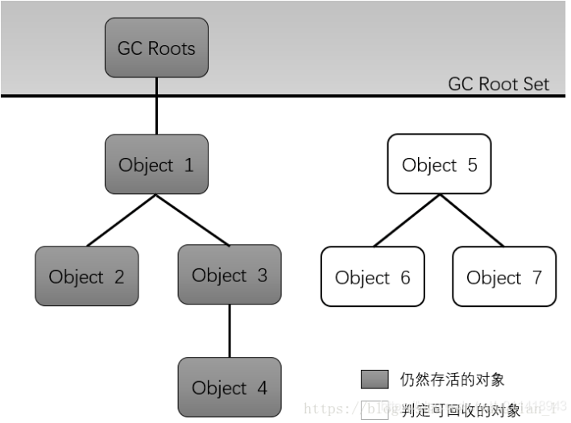

在 Java 虚拟机中，可作为 GC Roots 的对象包含以下几种

- **虚拟机栈**（栈帧中的本地变量表）中**引用的对象**
- **方法区**中的**类静态属性引用的对象**
- **方法区**中**常量引用的对象**
- **本地方法栈**中 JNI (Native方法)引用的对象
- **java虚拟机内部的引用**，如基本数据类型对应的Class对象，一些常驻的异常对象（比如NullPointException、OutOfMemoryError）等，还有系统类加载器。
- 所有**被同步锁（synchronized关键字）持有的对象**。
- 反映java虚拟机内部情况的JMXBean、JVMT1中注册的回调、本地代码缓存等。

除了这些固定的GC Roots集合以外，根据用户所选用的**垃圾收集器以及当前回收的内存区域不同**，还可以有其他对象“临时性“地加入，共同构成完整GC Roots集合。

* **如果只针对堆中某一块区域发起垃圾收集时，该区域里的对象完全有可能被位于堆中其他区域的对象所引用，这时候就需要将这些关联区域的对象也一并加入GC Roots集合中去，才能保证可达性分析的正确性。**

#### GC Roots是什么

* 可达性分析的起点
* 组成【**全局性引用**(例如常量或类静态属性)与**执行上下文**(例如栈帧中的本地变量表)】
  * **虚拟机栈**（栈帧中的本地变量表）中**引用的对象**
  * **方法区**中的**类静态属性引用的对象**
  * **方法区**中**常量引用的对象**
  * **本地方法栈**中 JNI (Native方法)引用的对象
  * **java虚拟机内部的引用**，如基本数据类型对应的Class对象，一些常驻的异常对象（比如NullPointException、OutOfMemoryError）等，还有系统类加载器。
  * 所有**被同步锁（synchronized关键字）持有的对象**。

#### 什么是引用链

* 对象到GC Roots有引用链相连，即表示对象可达，不可被回收
* 提出四种引用类型
  * 强引用：直接的引用赋值 ，如 Object obj = new Object(); 只要这类强引用还在，对象就**不会被垃圾收集器回收**。
  * 软引用：(SoftReference类)用来描述一些**还有用但非必需的对象**；**在将要发生内存溢出异常前，系统会把这些有软引用的对象列入回收范围中进行二次回收，如果这次回收还没有足够的内存，才内存溢出报异常；**
  * 弱引用：(WakeReference类) 也用来描述非必须对象，但强度更弱一些，**被弱引用的对象只能生存到下一次垃圾收集发生之前，当垃圾收集器开始工作时，无论内存是否足够，都会对这些对象进行回收。**
  * 虚引用(幽灵引用/幻影引用)：(PhantomReference类) 一个虚引用的对象，它的**唯一目的就是能在这个对象被收集器回收时收到一个系统通知**，即**一个对象是否有虚引用，完全不会对其生存时间构成影响。**

#### 对象不可达意味着什么

* 意味着该对象可被回收
* 不可达对象会被放入F_Q队列中，系统开启一条低优先级的finalize线程来调用队列中对象的finalize方法，如果finalize方法中对象又建立了引用关系，则对象可避免被回收，否则需要回收。


### HotSpot的算法细节实现

* 根节点枚举：
  * 定义：选取GC Roots。
  * 可作为GC Roots的节点主要是全局性引用(例如常量或类静态属性)与执行上下文(例如栈帧中的本地变量表)。
  * 根节点枚举需要暂停用户线程。
  * 如何枚举：
    * 不可能一个一个遍历。
    * 在HotSpot的解决方案里， 是使用一组称为**OopMap**的数据结构来达到这个目的。 一旦类加载动作完成的时候， **HotSpot就会把对象内什么偏移量上是什么类型的数据计算出来**， 在**即时编译过程中， 也会在特定的位置记录下栈里和寄存器里哪些位置是引用**。这样收集器在扫描时就可以直接得知这些信息了， 并不需要真正一个不漏地从方法区等GC Roots开始查找。  
  
* 安全点：

  * 定义：生成OopMap的位置，用户线程需要到达安全点才能开始gc。

  * 常见安全点：异常、跳出、方法调用以及循环。

  * 如何让用户线程跑到最近的安全点？

    * **抢先式中断** ：系统**首先把所有用户线程全部中断**， 如果发现有用户线程**中断的地方不在安全点上**， **就恢复这条线程执行**， 让它跑到安全点上再重新中断。  

      几乎没有虚拟机实现采用抢先式中断来暂停线程响应GC事件  

    * **主动式中断**   ：不直接对线程操作， 仅仅简单地设置一个**标志位**， 各个线程执行过程时**会不停地主动去轮询这个标志**， 一旦发现**中断标志为真时就自己在最近的安全点上主动中断挂起**。**轮询标志的地方和安全点是重合**的， 另外还要加上所有创建对象和其他需要在Java堆上分配内存的地方， 这是为了检查是否即将要发生垃圾收集， 避免没有足够内存分配新对象 。

  * 程序“不执行”的时候线程如何达到安全点？

    * 引入安全区域（Safe Region)的概念：安全区域是指能够确保在某一段代码片段之中， 引用关系不会发生变化  。
    * 当用户线程执行到安全区域里面的代码时，首先会标识自己已经进入了安全区域，那样当这段时 间里虚拟机要发起垃圾收集时就**不必去管这些已声明自己在安全区域内的线程了**。当线程要离开安全 区域时，**它要检查虚拟机是否已经完成了根节点枚举（**或者垃圾收集过程中其他需要暂停用户线程的 阶段），如果完成了，那线程就当作没事发生过，继续执行；否则它就必须一直等待，直到收到可以 离开安全区域的信号为止。
    * 线程不执行时，都会处在安全区域内。

#### 有没有跨代引用问题，如何处理

* minor gc时，对象可能被老年代对象引用，不能遍历老年代对象，消耗太大了，引入了**记忆集**，记录了从非收集区域指向收集区域的指针集合**即记录了非收集区域含有跨代指针位置**。

* 记忆集有三种记录粒度：
  * 字长精度：精确到字，某个字包含跨代指针。
  * 对象精度：精确到对象，某个对象包含跨代指针。
  * 卡精度：精确到一块内存区域，该区域含有跨代指针。

* 卡精度的记忆集实现称为：**卡表**，卡表内由多个内存块组成，内存块即卡页，卡页有一个标识，指针这个内存块中是否含有跨代指针。
* 对于含有跨代指针的内存块，把其中的对象加入GC Roots中一起扫描。
* 卡表的维护是通过写屏障实现的，即赋值操作后加入写后屏障完成卡表状态的更新。

#### 写屏障

* 这里的写屏障和我们常说的为了解决并发乱序执行问题的"内存屏障"不是一码事，需要区分开来。
* 写屏障可以看作虚拟机层面对"引用类型字段赋值"这个动作的AOP切面，**在引用对象赋值时会产生一个环形通知，供程序执行额外的动作**，也就是说赋值的前后都在写屏障的覆盖范畴内。在赋值前的部分的写屏障叫做写前屏障(Pre-Write Barrier)，在赋值后的则叫作写后屏障(Post-Write Barrier)。


#### 并发可达性分析

https://juejin.cn/post/7001873707681464334#heading-4

* 可达性分析算法理论上要求：**全过程都需要基于一个能保障一致性的快照中才能够分析**。
* 而该理论的缺点就是可能带来过多的停顿时间。
* **为了降低停顿时间**而**引入并发标记过程**。

* 先引入三色标记法：

  把访问都的对象**按照"是否访问过"这个条件**标记成以下三种颜色：

  * **白色：表示对象尚未被垃圾回收器访问过**。
  * **黑色：表示对象已经被垃圾回收器访问过，且这个对象的所有引用都已经扫描过**。
  * **灰色：表示对象已经被垃圾回收器访问过，但这个对象至少存在一个引用还没有被扫描过**。

* 并发标记过程中可能出现的问题：

  * **一种是把原本消亡的对象错误的标记为存活，这不是好事，但是其实是可以容忍的，只不过产生了一点逃过本次回收的浮动垃圾而已，下次清理就可以。**

  * **一种是把原本存活的对象错误的标记为已消亡，这就是非常严重的后果了，一个程序还需要使用的对象被回收了，那程序肯定会因此发生错误。**

    * **当且仅当以下两个条件同时满足时**，会产生"对象消失"的问题，原来应该是黑色的对象被误标为了白色：

    * 条件一：赋值器插入了一条或者多条从黑色对象到白色对象的新引用。

      条件二：赋值器删除了全部从灰色对象到该白色对象的直接或间接引用。

* 对于对象消失问题，产生了两种解决方案：**增量更新（Incremental Update）和原始快照（Snapshot At The Beginning，SATB）。**

  在HotSpot虚拟机中，**CMS是基于增量更新来做并发标记的，G1则采用的是原始快照的方式。**

  * 增量更新【Incremental Update】：破坏的是第一个条件，当黑色对象插入新的指向白色对象的引用关系时，就**将这个新插入的引用关系记录下来**，等并发扫描结束之后，再**将这些记录过的引用关系中的黑色对象为根，重新扫描一次。**可以简化的理解为：**黑色对象一旦插入了指向白色对象的引用之后，它就变回了灰色对象。**
  * 原始快照【Snapshot At The Beginning，SATB】：破坏的是第二个条件，当灰色对象要删除指向白色对象的引用关系时，就**将这个要删除的引用记录下来**，在并发扫描结束之后，再**将这些记录过的引用重新扫描一次**。

* **增量更新用的是写后屏障(Post-Write Barrier)，记录了所有新增的引用关系。**

  **原始快照用的是写前屏障(Pre-Write Barrier)，将所有即将被删除的引用关系的旧引用记录下来。**


## **引用判断**

* 无论是引用计数算法，还是可达性分析算法，对象是否存活都跟 “引用” (reference)有关，在JDK1.2 之后，java对引用的概念进行了扩展，引用可分为以下4个
  * 强引用：直接的引用赋值 ，如 Object obj = new Object(); 只要这类强引用还在，对象就不会被垃圾收集器回收。
  * 软引用：(SoftReference类)用来描述一些**还有用但非必需的对象**；**在将要发生内存溢出异常前，系统会把这些有软引用的对象列入回收范围中进行二次回收，如果这次回收还没有足够的内存，才内存溢出报异常；**
  * 弱引用：(WakeReference类) 也用来描述非必须对象，但强度更弱一些，**被弱引用的对象只能生存到下一次垃圾收集发生之前，当垃圾收集器开始工作时，无论内存是否足够，都会对这些对象进行回收。**
  * 虚引用(幽灵引用/幻影引用)：(PhantomReference类) 一个虚引用的对象，它的**唯一目的就是能在这个对象被收集器回收时收到一个系统通知**，即**一个对象是否有虚引用，完全不会对其生存时间构成影响。**


## 三、什么时候回收

**在可达性分析算法不可达的对象，也不一定"非死不可’，要宣告一个对象死亡，它至少会经历两次标记**，一是当不可达 GC Roots 时，标记一次并筛选，**筛选的条件是该对象是否有必要执行 finalize 方法**。当对象没有覆盖 finalize 方法，或者已经执行过 finalize 方法时，那么虚拟机将这两种情形视为”没有必要执行“，即认为此对象会被回收。如下图
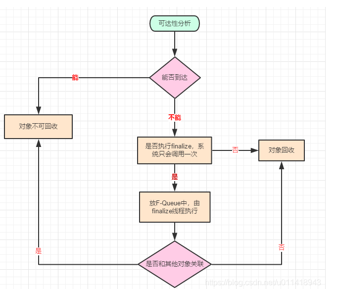

* 如果此对象被判定为有必要执行finalize()方法，那么该对象就会被放置在一个名为F-Queue的队列中，并且之后由一条由虚拟机**自动建立的、低调度优先级的Finalizer线程去执行它们的finalize()方法。**
* 这里的执行，是指虚拟机会触发这个 finalize 方法，但并不会等待它结束，这是因为 finalize 方法执行缓慢，可能会导致 F-Queue其他对象处于等待，甚至导致内存回收子系统的崩溃。
* finalize()方法是对象逃脱死亡命运的最后一次机会，稍后收集器将对F-Queue中的对象进行第二次小规模的标记，**如果在执行 finalize 时，对象重新和其他对象关联上了，第二次标记时它将被移出”即将回收“的集合，成功拯救了自己。**
* 注意：**任何一个对象的 finalize() 只会被系统调用一次，下次不会再执行**。
* 不建议使用这个方法来拯救对象，它的**运行代价高昂，不确定性大。**


## 3.2 回收方法区

Java 堆 可以回收70%~95%的空间，方法区同样可以回收一些资源，但由于方法区回收需要严苛的判定条件，方法区的回收成果往往远低于此，方法区主要回收两个部分**废弃常量**和**不再使用的类型**。

**废弃常量：**
当前系统没有任何一个 String 对象引用这个 “abc” 的常量池，也没有其他地方引用了这个字面量，这时可以判断这个常量是可以废弃回收的；常量池中的其他类（接口）、方法、字段的符号引用也以此类似

**无用的类型：**

无用类的回收比较严苛，需要满足三个条件

* 该类所有的实例都已经被回收，也就是Java堆中**不存在该类及其任何派生子类的实例。**

* 加载该类的 ClassLoader 已经被回收，很难达成。

* 对应的 java.lang.class 对象没有再任何地方被引用，也无法通过反射拿到该类

  当然，**这里跟Java堆一样，也只是 "可以回收"了，是否对类进行回收，可以对虚拟机的参数进行设置**，这里就不细讲了。


## 四、如何回收【垃圾收集算法】


### 分代收集理论

* 当前商用虚拟机的垃圾收集器，大多数都遵循了**”分代收集“的理论**进行设计，实质是一套符合大多数程序运行实际情况的经验法则，建立在两个**分代假说**之上：
  * **弱分代假说**：绝大多数对象都是朝生夕灭。
  * **强分代假说**：熬过越多次垃圾收集过程的对象就越难消亡。
  * 这两个假说奠定了多款垃圾收集器的一致设计原则：收集器应该将堆划分出不同的区域，然后将回收对象依据其年龄分配到不同的区域之中存储。**这样同时兼顾了垃圾收集的时间开销和内存空间的有效利用。**java堆**划分出不同的区域后，垃圾收集器才可以每次回收其中某一个或者某些部分的区域—因而才有”minor gc“ ”major gc“ ”full gc“**，这样能**针对不同的区域安排与里面存储对象存亡相匹配的垃圾收集算法。**
  * 现在商用虚拟机里，设计者一般至少会把java堆划分为**新生代**和**老年代**两个区域。即，**在新生代中，每次垃圾收集时都发现有大批对象死去，而每次回收后存活的少量对象，将会逐步晋升到老年代中存放。**
  * 分代收集存在一个明显的难题：**对象不是孤立的，对象之间会存在跨代引用。**如进行一次**只局限于新生代区域内的收集**，但**新生代中的对象是完全有可能被老年代所引用的**。此时有两种解决方案：
    * 再额外**遍历整个老年代中的所有对象**来确保可达性分析结果的正确性，但无疑会为**内存回收带来很大的性能负担。**
    * 根据【**跨代引用假说**：跨代引用相对于同代引用来说仅占极少数。】推出的另一方案
      * 假说的隐含推论：**存在互相引用关系的两个对象应该倾向于同时生存或者同时消亡的。**
      * 所以我们只需**在新生代上建立一个全局的数据结构【记忆集】，其把老年代划分若小块，标识出老年代的哪一块内存会存在跨代引用。此后发生minor gc时，只有包含了跨代引用的小块内存里的对象才会被加入到GC Roots进行扫描。**


### 4.1 标记-清除算法

这里的**标记**指的是对象进过前面第三章我们介绍的那样，已经可以判定就是**可以回收的意思**；这个算法**首先标记出所有需要回收的对象**，在**标记完成之后统一回收所有被标记的对象**。**标记过程就是判断对象是否属于垃圾的判定过程。**
看似美好，实则不然，主要有以下两个缺点：

1. **效率问题**：标记和清除两个效率都不高。【堆中大部分对象需要回收，必须进行大量标记和清除的动作。】
2. **空间问题**：标记清除后，会产生大量**空间碎片**，大的连续空间稀少，在大对象需要分配空间时，找不到内存，从而又触发 GC 操作。

标记和清除的执行过程如下图：

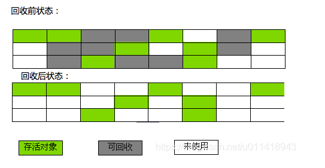

**标记-清除算法是GC回收算法的基础，后面产生的算法都是基于它的缺点改进的**。


### 4.2 复制算法

* **针对新生代**的收集算法

复制算法可以分为**等比例**的和**8:2**两种

缺点：空间浪费。

优点：有足够的连续空间。

#### 4.2.1  1:1 比例

是基于 标记-清除算法的低效率问题，复制算法出现的。
这种算法是把内存分为相等的两块，每次只使用其中一块用于存储对象，当GC操作后，把还存留的对象移动到未存对象的那块内存区域，再把使用过的内存清掉【对于多数对象是可回收的情况，算法需要复制的就是占少数的存活对象】。这样每次都对整个半区进行内存回收，就**不用担心内存碎片**的问题了，只要移动堆顶指针，按顺序分配即可。执行过程如下图：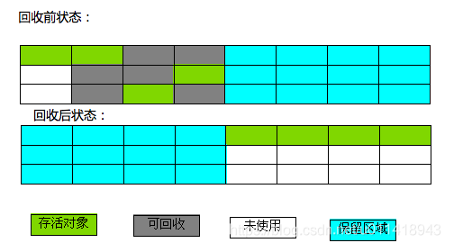

从执行过程来看，**可用内存缩小为原来的一半，空间浪费太多了，在对象多时，会频繁触发GC**。


#### 4.2.2  8:1 比例

上面的 1:1 的铺张浪费，因为新生代的对象 98% 都是"朝生夕死"的，一种更优化的复制分代策略出现了，“Appel式回收”。

具体做法是：

* 把**新生代分为一块较大的Eden空间和两块较小的Survivor 空间**，**每次分配内存只使用Eden和其中一块Survivor。**
* 发生垃圾收集时，将Eden和Survivor中仍存活的对象一次性复制到另一块Survivor空间上。
* 然后直接清掉 Eden 和刚才用过的 Survivor 空间。
* **当Survivor 空间不够存放仍存活的对象时，还得依赖其他内存区域(大多是老年代)，进行分配担保。**只有移动到老年代的内存空间上。
* 对象在Survivor 区中“熬过”垃圾回收一次，年龄增加1，当增加到 15 岁(默认，这个阈值可以通过 -XX:MaxTenuringThreshold 设置)，就会**晋升成老年代**的对象。

举个简单例子：假如虚拟机中设置了新生代的内存大小为10M，老年代的也为10M，Eden 和 Survivor 为 8:1 的关系，那么Eden就只有8M，Survivor 为1M；下面创建4个对象

```java
public static void test(){
	// 假设 _1MB 字符创为 1MB 
	byte[] b1 = new byte[2*_1MB];
	byte[] b2 = new byte[2*_1MB];
	byte[] b3 = new byte[2*_1MB];
	byte[] b4 = new byte[4*_1MB];
}

```

执行 test() ，当要分配 b4 对象时，会执行一次 Minor GC，原因是 Eden 最大才 8M，被b1,b2,b3填充之后，已经没有空间去填充 b4了，就会触发 GC，此时b1、b2、b3会移动入survivor，但其空间不够【1M】，所以b1、b2、b3会移入老年代，而b4会填充到Eden中。

**缺点**

*  **对象存活率较高的情况下，需要进行较多的复制操作，效率就会降低。**
* 需要有额外的空间进行分配担保，以应对**被使用的内存**中所有对象都100%存活的极端情况，所以在老年代一般不能直接使用这种算法。【存活对象跑到老年代中】

##### 为什么需要survivor区

* 主要是**用来接收新生代垃圾回收后存活的对象**。接收对象后，可以清空Eden区，为下一次分配对象做准备。

##### 为什么需要两个s区

* 至少需要一个s区为空的，确保能接收s0区和Eden区存活下来的对象。

​	


### 4.3 标记-整理算法

* **针对老年代**的收集算法

它与标记-清除算法一样，但不是直接对可回收进行清除【标记清除算法与标记整理算法的本质差异在于**前者是非移动式的回收算法，而后者是移动式的**】，而是**让所有存活的对象都向内存空间一端移动，然后直接清理掉边界以外的内存**，分两个步骤

* 标记那些被引用的对象
* 将被标记的对象移动按顺序移动到一端，然后清除掉可回收的对象。【**先标记清除，再进行整理**】

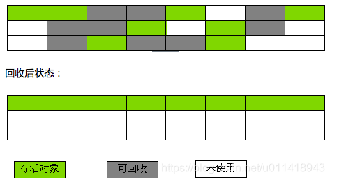

​	**缺点**

* 如果移动存活对象，尤其是在老年代这种每次回收都有大量对象存活的区域，**移动存活对象并更新所有引用这些对象的地方将会是一种一位负重的操作**，而且这种对象移动操作必须全程暂停用户应用程序才能进行【stop the world】，延迟了垃圾收集的停顿时间。


### 4.4 分代收集算法

* **是否移动对象都存在弊端，移动则内存回收时会更复杂【移动对象，影响停顿时间】，不移动则内存分配时更复杂【空间碎片，影响吞吐量】。**
* 所以一般关注吞吐量的Parallel Scavenge收集器是基于标记-整理算法的，而关注延迟的CMS收集器则是基于标记-清除算法的。

在商业的虚拟机中，都采用 分代收集算法，根据对象存活周期将内存划分为几块，把Java堆分为新生代和老年代，这样就可以根据各个年代的特点采用最适当的收集算法；
**在新生代中，每次都有大量对象死去，只有少量活着，就选用复制算法；而老年代的对象存活率比较高，没有额外空间对它进行分配担保，就必须使用 “标记-整理”或者“标记-清除” 进行回收**。

多数时间采用标记-清除算法，暂时容忍内存碎片的存在，直到内存空间的碎片化程度已经大到影响对象分配时，再采用标记-整理算法收集一次，以获得规整的内存空间。


## 五、经典垃圾收集器

**如果说收集算法是内存回收的方法论，那垃圾收集器就是内存回收的实践者。**

**并行与并发**是并发编程中的专有名词，在**谈论垃圾收集器的上下文语境**中，它们的含义如下：

**并行 (Parallel)**：并行描述的是**多条垃圾收集器线程之间**的关系，说明同一时间有多条这样的线程在协同工作，此时通常默认用户线程是处于等待状态。

**并发 (Concurrent)**：并发描述的是**垃圾收集器线程与用户线程之间**的关系，说明同一时间垃圾收集器线程与用户线程都在运行。但由于垃圾收集器线程会占用一部分系统资源，所以程序的吞吐量依然会受到一定影响。

HotSpot 虚拟机中一共存在**七款经典的垃圾收集器**：

* Serial、Serial Old、ParNew、Paralllel Scavenge、Paraller Old、CMS、G1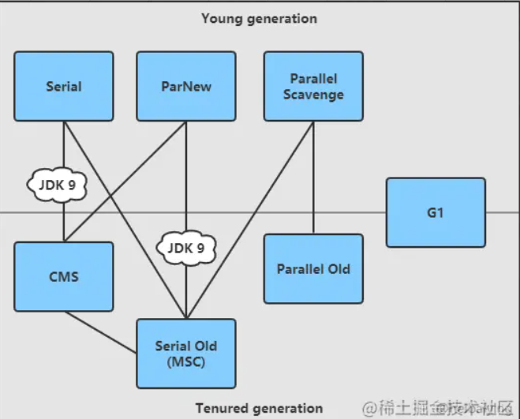

注：收集器之间**存在连线**，则代表**它们可以搭配使用**。【jdk9取消了一些组合的使用】

* 新生代都是复制算法
* 老年代中Serial Old和Parallel Old是整理算法，CMS是清除算法。

### 5.1 Serial 收集器

* **单线程收集器**，不仅仅说明它**只会使用一条垃圾收集线程去完成垃圾收集工作**，重要的是它**在进行垃圾收集工作的时候必须暂停其他所有的工作线程（“stop the world”），直到它收集结束，这是其主要缺点。**
* 常用在单核服务器上。
* 它的优点在于单线程**避免了多线程复杂的上下文切换**，因此在**单线程环境下收集效率非常高**，由于这个优点，迄今为止，其仍然是 HotSpot 虚拟机在**客户端模式下默认的新生代收集器：**
* 另一优点：它是所有收集器里**额外内存消耗最小的**【保证垃圾收集能够顺利高效地进行而存储的额外信息】。
* 缺点：需暂停用户线程。

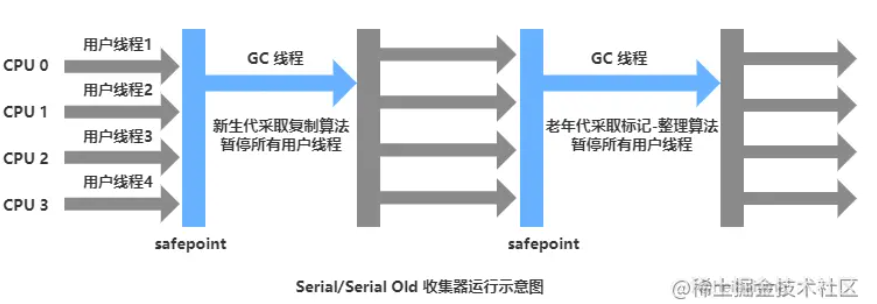


### 5.2 ParNew 收集器

他是 **Serial 收集器的多线程并行版本**，可以使用多条线程进行垃圾回收，但**同样会暂停用户线程**：

* 除了使用多条线程外，其他完全和ParNew一样。
* 相比ParNew发挥多核优势

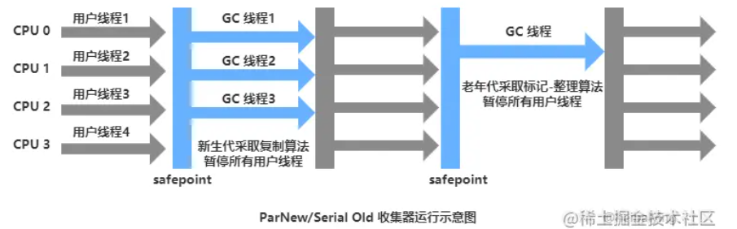


### 5.3 Parallel Scavenge 收集器

* 多线程收集提升速度，且能够关注吞吐量
* 基于ParNew加入关注吞吐量的设计。

Parallel Scavenge 也是**新生代**收集器，基于 **标记-复制** 算法进行实现，也是能够**并行收集**的多线程收集器，与ParNew类似，但它的**目标**是达到一个可控的**吞吐量**。这里的**吞吐量指的是处理器运行用户代码的时间与处理器总消耗时间的比值：**

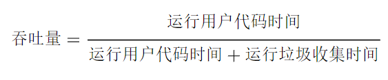

Parallel Scavenge 收集器提供两个参数**用于精确控制吞吐量**：

- **-XX:MaxGCPauseMillis**：控制**最大垃圾收集时间**，假设需要回收的垃圾总量不变，那么降低垃圾收集的时间就会导致收集频率变高，所以需要将其设置为合适的值，不能一味减小。
- **-XX:MaxGCTimeRatio**：直接用**于设置吞吐量大小**，它是一个大于 0 小于 100 的整数。假设把它设置为 19，表示此时允许的最大垃圾收集时间占总时间的 5%（即 1/(1+19) ）；默认值为 99 ，即允许最大 1%（ 1/(1+99) ）的垃圾收集时间。

##### 如何控制吞吐量

* 首先用户代码运行时间是不变的，需要调整的是运行垃圾收集的时间
* 如何调整运行垃圾收集的时间：**在单位时间内，调整垃圾回收次数**。
* 可能带来的问题：
  * 内存溢出，垃圾收集不及时。


### 5.4 Serial Old 收集器

它是 **Serial 收集器的老年代版本**，同样是一个**单线程收集器，采用 标记-整理 算法，主要用于给客户端模式下的 HotSpot 虚拟机使用：**

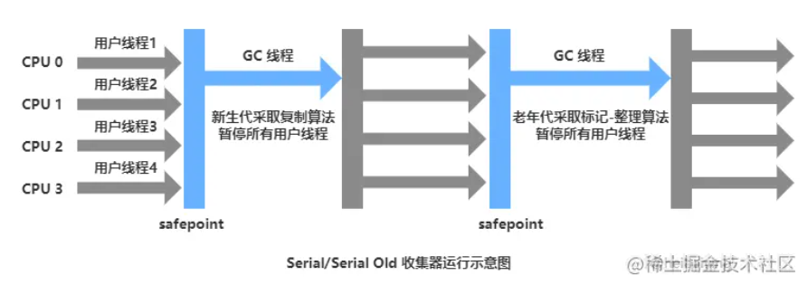

可能有两种用途

* 在jdk5以及以前的版本中**与Parallel Scavenge收集器搭配使用**
* 作为**CMS收集器发生失败时的后备预案**，在并发收集发生Concurrrent Mode Failure时使用。
* **单核服务器下适用。**


### 5.5 Paralled Old 收集器

Paralled Old **是 Parallel Scavenge 收集器的老年代版本**，支持**多线程并发收集，采用 标记-整理 算法实现：**

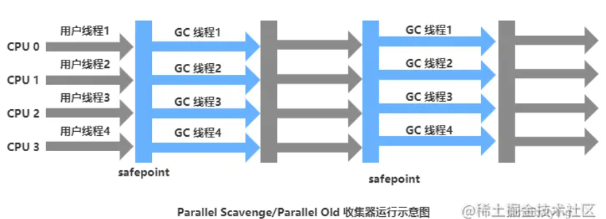

* 在**注重吞吐量以及CPU资源配合的场合，都可以优先考虑Parallel Scavenge收集器和Parallel Old收集器。**
* jdk1.6才开始提供。


### 5.6 CMS 收集器

CMS（Concurrent Mark Sweep）收集器是一种以获取**最短回收停顿时间为目标的收集器**，基于 **标记-清除 算法**实现，它**非常符合在注重用户体验的应用上使用**，整个**收集过程**分为以下四个阶段：

三个mark一清除

1. **初始标记 (inital mark)**：**标记 `GC Roots` 能直接关联到的对象**，耗时短但**需要暂停用户线程**【内核态，挂起】；
2. **并发标记 (concurrent mark)**：从 `GC Roots` 能直接关联到的对象**开始遍历整个对象图**，耗时长**但不需要暂停用户线程**，**期间用户线程可能更新对象的引用域**；
3. **重新标记 (remark)**：重新标记阶段是为了修正并发标记期间因为用户线程继续运行而导致标记产生变动的那一部分对象的标记记录，这个阶段的停顿时间一般会比初始标记阶段的时间稍长，但远远比并发标记阶段时间短，同时也需要**暂停用户线程**。
4. **并发清除 (inital sweep)**：并发清除掉标记阶段判定的已经死亡的对象，耗时长但不需要暂停用户线程。

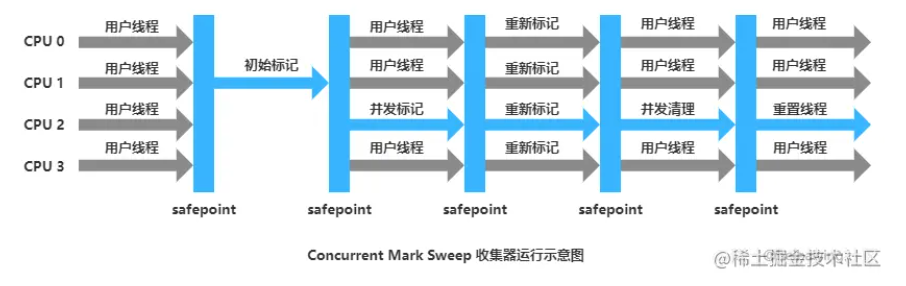

其优点在于**耗时长的 并发标记 和 并发清除 阶段都不需要暂停用户线程**，因此其停顿时间较短，即**并发收集、低延迟**，其主要**缺点**如下：

* **对处理器资源比较敏感**，由于并发标记和并发清除是和**用户线程并发执行的**，所以**会导致用户程序变慢**，总的吞吐量降低。
* 由于是基于 **标记-清除** 算法实现的，因此会产生大量**空间碎片**。
* **无法处理浮动垃圾**（Floating Garbage）：由于**并发清除时用户线程还是在继续，所以此时仍然会产生垃圾，这些垃圾就被称为浮动垃圾**，只能**等到下一次垃圾收集时再进行清理。**该过程可能会产生大量垃圾，进而导致full gc。


### 5.7 Garbage First 收集器

Garbage First（简称 G1）是一款面向**服务端**的垃圾收集器，也是 **JDK 9 服务端模式下默认的垃圾收集器**，它的诞生具有里程碑式的意义。G1 虽然**也遵循分代收集理论，但不再以固定大小和固定数量来划分分代区域**，而是**把连续的 Java 堆划分为多个大小相等的独立区域（Region）**。每一个 Region 都可以**根据不同的需求来扮演新生代的 `Eden` 空间、`Survivor` 空间或者老年代空间**，**收集器会根据其扮演角色的不同而采用不同的收集策略。**

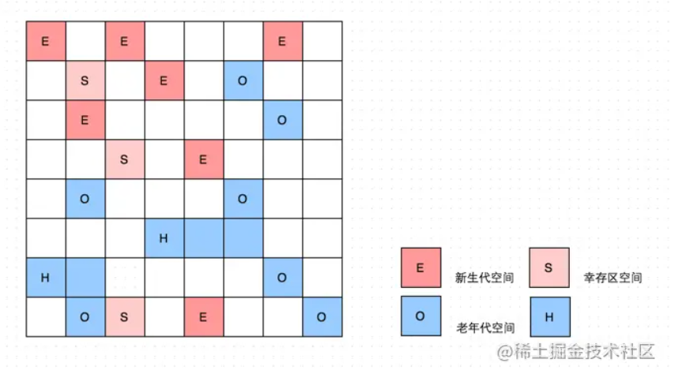

上面还有一些 Region 使用 H 进行标注，它代表 **Humongous**，表示这些 **Region 用于存储大对象**（humongous object，H-obj），即**大小大于等于 region 一半的对象**。【H是O的一种，如果对**象大于整个region 则用连续的Region分配**】

Region容量可通过jvm参数进行设置。【1-32MB】

G1收集器通过**将Region作为单位回收的最小单元**建立了**可预测的停顿时间模型**，且维护了一个**优先级列表**，**每次根据用户允许的收集停顿时间，优先选择回收价值最大的Region**，但由于引用关系的存在，仍然存在**如何避免全局扫描的问题**，这里采用**每一个region用一个记忆集进行记录引用关系，避免可达性分析阶段的全区域垃圾扫描。**

#### 如何处理跨代引用问题

* 也是使用记忆集，更加复杂，因为有多个Region

**Rset记忆集：记录哪些region引用当前region**

**Cset：本次GC需清理的Region集合**


G1 收集器的运行大致可以分为以下四个步骤：

**初始标记 (Inital Marking)**：标记 `GC Roots` 能直接关联到的对象，并且修改 TAMS（Top at Mark Start）指针的值，让下一阶段用户线程并发运行时，能够正确的在 Reigin 中分配新对象。G1 为每一个 Reigin 都设计了两个名为 TAMS 的指针，新分配的对象必须位于这两个指针位置以上，位于这两个指针位置以上的对象默认被隐式标记为存活的，不会纳入回收范围；【这个阶段是停顿的(Stop the World Event)，并且会触发一次普通Mintor GC。需要进行根节点枚举】

**并发标记 (Concurrent Marking)**：从 `GC Roots` 能直接关联到的对象开始遍历整个对象图。遍历完成后，还需要处理 SATB 记录中变动的对象。SATB（snapshot-at-the-beginning，开始阶段快照）能够有效的解决并发标记阶段因为用户线程运行而导致的对象变动，其效率比 CMS 重新标记阶段所使用的增量更新算法效率更高；

**最终标记 (Final Marking)**：对用户线程做一个**短暂的暂停**，用于处理并发阶段结束后仍遗留下来的少量的 STAB 记录。虽然并发标记阶段会处理 SATB 记录，但由于处理时用户线程依然是运行中的，因此依然会有少量的变动，所以需要最终标记来处理；

**筛选回收 (Live Data Counting and Evacuation)**：负责更新 Regin 统计数据，按照各个 Regin 的回收价值和成本进行排序，在**根据用户期望的停顿时间进行来指定回收计划**，可以选择任意多个 Regin 构成回收集。然后将回收集中 Regin 的存活对象复制到空的 Regin 中，再清理掉整个旧的 Regin 。此时因为涉及到存活对象的移动，所以需要暂停用户线程，并由多个收集线程并行执行。

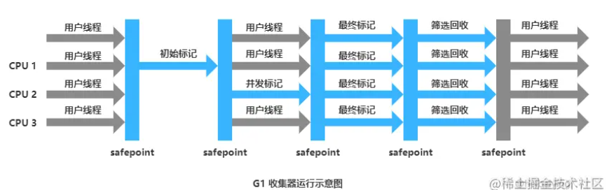


G1的**新生代收集跟ParNew类似【采用复制算法】**，当新生代占用达到一定比例的时候，开始出发收集。和CMS类似，G1收集器收集**老年代对象会有短暂停顿【标记整理】。**


## 内存分配与回收策略

* Java技术体系的自动内存管理，最根本的目标是自动化地解决两个问题：**自动给对象分配内存以及自动回收分配给对象的内存**。
* 在经典分代的设计下，**新生对象通常会分配在新生代中，少数情况下（例如对象大小超过一定阈值）也可能会直接分配在老年代。对象分配的规则并不是固定的**，《Java虚拟机规范》并未规定新对象的创建和存储细节，这取决于虚拟机当前使用的是哪一种垃圾收集器，以及虚拟机中与内存相关的参数的设定。


### Minor Gc 、Major Gc、 Full Gc

* Minor Gc ：指发生在新生代的垃圾收集动作，Minor GC非常频繁，回收速度一般也比较快。
* Major Gc：指发生在老年代的GC。【不会有单独发生在老年代的gc，需要老年代gc时，是直接full gc的】
* Full Gc：清理整个空间包括年轻代和老年代。老年代满时会进行。


### 对象优先在Eden分配

* 大多数情况下，对象在新生代Eden区中分配。**当Eden区没有足够空间进行分配时，虚拟机将发起一次Minor GC。**


## 对象何时进入老年代

### 大对象直接进入老年代

* **大对象就是指需要大量连续内存空间的Java对象**，最典型的大对象便是那种很长的字符串，或者元素数量很庞大的数组。这样做的目的是避免在Eden区和两个Survivor区之间发生大量的内存拷贝（**新生代采用复制算法收集内存**）。
* 大对象对虚拟机的内存分配来说就是一个不折不扣的坏消息，比遇到一个大对象更加坏的消息就是遇到一群“朝生夕灭”的“短命大对象”，我们写程序的时候应注意避免。在Java虚拟机中要避免大对象的原因是，在分配空间时，它**容易导致内存明明还有不少空间时就提前触发垃圾收集，以获取足够的连续空间才能安置好它们，而当复制对象时，大对象就意味着高额的内存复制开销。**
* HotSpot虚拟机提供了 `-XX：PretenureSizeThreshold` 参数，**指定大于该设置值的对象直接在老年代分配**，这样做的目的就是**避免在Eden区及两个Survivor区之间来回复制，产生大量的内存复制操作。**

### 新生代空间不够时

* Eden区和S0区存活的对象，比一个Survivor区还大时，会将存活对象移动到老年代。


### 长期存活的对象将进入老年代

* HotSpot虚拟机中多数收集器都采用了分代收集来管理堆内存，为了便于虚拟机决策**哪些存活对象应当放在新生代，哪些存活对象放在老年代中**，虚拟机**给每个对象定义了一个对象年龄（Age）计数器，存储在对象头中。**
* 对象通常在Eden区里诞生，如果经过第一次Minor GC后仍然存活，并且能被Survivor容纳的话，该对象会被移动到Survivor空间中，并且将其对象年龄设为1岁。对象在Survivor区中每熬过一次Minor GC，年龄就增加1岁，当**它的年龄增加到一定程度（默认为15），就会被晋升到老年代中**。对象晋升老年代的年龄阈值，可以通过参数 -XX：MaxTenuringThreshold 设置。


### 动态对象年龄判定

为了能更好地适应不同程序的内存状况，HotSpot虚拟机并不是永远要求对象的年龄必须达到 -XX：MaxTenuringThreshold 才能晋升老年代，**如果在Survivor空间中相同年龄所有对象大小的总和大于Survivor空间的一半，大于或等于该年龄的对象就可以直接进入老年代**，无须等到 -XX：MaxTenuringThreshold 中要求的年龄。


## 空间分配担保

* **在发生Minor GC之前**，虚拟机必须先检查**老年代最大可用的连续空间是否大于新生代所有对象总空间**，如果这个条件成立，那**这一次Minor GC可以确保是安全的**。
* 如果不成立，则虚拟机会先查看 `-XX：HandlePromotionFailure` 参数的设置值**是否允许担保失败**（Handle Promotion Failure）；
* 如果允许，那会继续检查**老年代最大可用的连续空间是否大于历次晋升到老年代对象的平均大小**，如果大于，**将尝试进行一次Minor GC，尽管这次Minor GC是有风险的【老年代担保失败】**；
* 如果小于，或者 `-XX：HandlePromotionFailure` 设置不允许冒险，那这时就要**改为进行一次Full GC。**

总结：

**安全的minor gc：老年代中最大可用的连续空间大于新生代gc前新生代所有对象总空间。**

**冒险的minor gc：老年代最大可用的连续空间大于历次晋升到老年代对象的平均大小且允许担保失败；如果小于平均值，则直接进行full gc，让老年代腾出空间。**

**解释一下“冒险”是冒了什么风险：**

老年代要进行这样的担保，前提是老年代**本身还有容纳这些对象的剩余空间**，但一共有多少对象会在这次回收中活下来在实际完成内存回收之前是无法明确知道的，所以只能取之前每一次回收晋升到老年代对象容量的平均大小作为经验值，与老年代的剩余空间进行比较，决定是否进行Full GC来让老年代腾出更多空间。

**取历史平均值来比较其实仍然是一种赌概率的解决办法**，也就是说如果尝试Minor GC后，存活后的对象突增，**远远高于历史平均值的话，依然会导致担保失败**。如果出现了担保失败，那就只好老老实实地重新发起一次Full GC，这样停顿时间就很长了。

虽然**担保失败时绕的圈子是最大的，但通常情况下都还是会将 -XX：HandlePromotionFailure 开关打开，避免Full GC过于频繁。**

