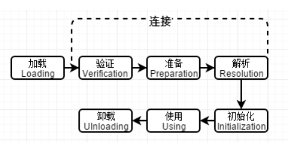
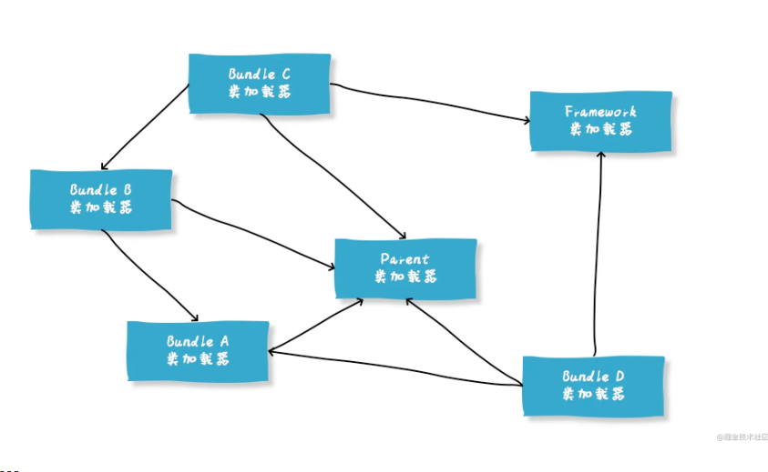

---
title: 深入jvm chr 07虚拟机类加载机制
date: 2021-12-22 18:33:37
categories:	jvm基础
tags: jvm
---

## 简述java类加载机制

* java虚拟机把描述**类的数据从Class文件加载到内存**，并对数据进行**校验、转换解析和初始化**，最终形成可以被虚拟机直接使用的**java类型**，这个过程被称作虚拟机的**类加载机制**。
* 在java语言里面，类型的**加载、连接和初始化过程**都是在程序运行期间完成的。


## 类加载的时机

* 类从加载到虚拟机的内存开始，到卸载出内存结束，中间会经历7个阶段，即**加载、验证、准备、解析、初始化、使用和卸载**；其中 **验证、准备和解析**也被称为连接，如下图：

* 其中，加载、验证、准备、初始化和卸载这五个顺序是固定的，类型的加载过程必须按照这种顺序**按部就班地开始**，而解析则不一定，因为Java是动态语言，它支持动态绑定，或在初始化后开始；现在对这些状态进行解释分析。
* **程序主动使用某个类时，如果该类还未被加载到内存中，则JVM会通过加载、连接、初始化3个步骤来对该类进行初始化。**如果没有意外，JVM将会连续完成3个步骤，所以有时也把这个3个步骤统称为类加载或类初始化。


## 类加载的过程

* 类加载的全过程：**加载、验证、准备、解析和初始化这个五个阶段**所执行的具体动作。


### 加载

* “加载”阶段是整个“类加载”过程中的一个阶段。

**加载过程主要完成以下3件事**

1. 通过一个类的全限名来获取定义**此类的二进制字节流**
2. 将这个字节流所代表的静态存储结构**转换为方法区的运行时数据结构**
3. 在内存中**生成一个代表这个类的 java.lang.Class对象**，作为方法区这个类的各种数据和访问入口

而获取二进制字节流的方式可以有很多种，不一定是通过类的全限名；比如从 ZIP 读取，网络中读取或者动态代理读取等等。

* **加载阶段结束后，java虚拟机外部的二进制字节流就按照虚拟机所设定的格式存储在方法区中了**，方法区中的数据存储格式完全由虚拟机实现自行定义。且类型数据安置在方法区之后，会在java堆内存中实例化一个java.lang.Class类的对象，这个对象将作为程序访问方法区中的类型数据的外部接口。

过程：

* 1先获取Class文件对应的**二进制字节流。**
* 3文件格式验证后，该文件符合当前jvm要求，将二进制字节流转换为方法区的**运行时数据结构**。
* 4在**堆内存**中**生成一个代表这个类的 java.lang.Class对象**，作为方法区这个类的各种数据和访问入口。


### 验证

* 这一阶段的目的是为了确保Class文件中的字节流中包含的信**息符合当前虚拟机的要求**，且保证这些信息运行后**不会危害虚拟机自身的安全。**

验证阶段大致上会完成下面四个阶段的检验动作：文件格式检验、元数据验证、字节码验证和符号引用验证。

#### 文件格式验证

* 主要是验证字节流是否符合**Class文件格式的规范**，保证输入的字节流能正确地解析并存储于方法区之内，格式上符合描述一个java类型信息的要求。

* 这个阶段的验证是基于二进制字节流进行的，通过这个阶段的验证后，这段字节流才被允许进入Java虚拟机内存方法区中进行存储。

* 后面三个验证阶段都是基于方法区的存储结构上进行的，不会直接读取、操作字节流了。

* 这一阶段可能包括下面这些验证点：

  是否以魔数0xCAFEBABE开头。
  主、次版本号是否在当前Java虚拟机接受范围之内。
  常量池的常量中是否有不被支持的常量类型（检查常量tag标志）。
  指向常量的各种索引值中是否有指向不存在的常量或不符合类型的常量。
  Class文件中各个部分及文件本身是否有被删除的或附加的其他信息。
  
* 2**作用验证点：验证魔数和主次版本号。**

* 又回到加载

#### 5元数据验证

* 主要是对字节码描述的信息进行**语义分析**，保证**其描述的信息符合当前虚拟机的要求**。

* 这个阶段可能包括的验证点如下：

  这个类**是否有父类**（除了java.lang.Object之外，所有的类都应当有父类）。
  这个类的父类**是否继承了不允许被继承的类**（被final修饰的类）。
  如果这个类不是抽象类，是否实现了其父类或接口之中要求实现的所有方法。
  类中的字段、方法是否与父类产生矛盾（例如覆盖了父类的final字段，或者出现不符合规则的方法重载，例如方法参数都一致，但返回值类型却不同等）。

#### 6字节码验证

* 第三阶段是整个验证过程中最复杂的一个阶段，主要目的是通过数据流分析和控制流分析，**确定程序语义是合法的、符合逻辑的。**

* 在第二阶段对元数据信息中的数据类型校验完毕以后，这阶段就要对类的方法体（Class文件中的Code属性）进行校验分析，**保证被校验类的方法在运行时不会做出危害虚拟机安全的行为**，例如：

  保证任意时刻操作数栈的数据类型与指令代码序列都能配合工作，例如不会出现类似于“在操作栈放置了一个int类型的数据，使用时却按long类型来加载入本地变量表中”这样的情况。
  保证任何跳转指令都不会跳转到方法体以外的字节码指令上。
  保证方法体中的类型转换总是有效的，例如可以把一个子类对象赋值给父类数据类型，这是安全的，但是把父类对象赋值给子类数据类型，甚至把对象赋值给与它毫无继承关系、完全不相干的一个数据类型，则是危险和不合法的。

* 即时方法体通过了字节码验证，也不能保证其一定就是安全的。因为**通过程序去校验程序逻辑是无法做到绝对准确的。**


#### 符号引用验证

* 最后一个阶段的校验行为**发生在虚拟机将符号引用转化为直接引用的时候，这个转化动作将在连接的第三阶段——解析阶段中发生。**符号引用验证可以看作是对类自身以外（常量池中的各种符号引用）的各类信息进行匹配性校验，通俗来说就是，该类是否缺少或者被禁止访问它依赖的某些外部类、方法、字段等资源。
* 本阶段通常需要校验下列内容：
  * 符号引用中通过字符串描述的全限定名是否能找到对应的类。
  * 在指定类中是否存在符合方法的字段描述符及简单名称所描述的方法和字段。
  * 符号引用中的类、字段、方法的可访问性（private、protected、public、< package>）是否可被当前类访问。
* 符号引用验证阶段主要目的是确保解析行为能正常执行。


### 7准备

* 准备阶段是正式为**类中定义的变量**（即静态变量，被static修饰的变量）**分配内存并设置类变量初始值**的阶段（是这里所说的初始值“通常情况”下是数据类型的**零值**）。
* 从概念上讲，这些变**量所使用的内存都应当在方法区中进行分配**【字节码转换为方法区中的数据结构】。**但方法区是一个逻辑上的区域，jdk7及之前，HotSpot使用永久代来实现方法区，而在jdk8及以后，类变量则会随着Class对象一起存放在java堆中。**

* 假设一个类变量的定义为：

  ```java
  public static int value = 123;
  ```

  那变量value在准备阶段过后的初始值为0而不是123。【类变量为常量】

  基本数据类型的零值表：

  


### 解析【具体解析阶段不知道】

* **解析阶段是Java虚拟机将常量池内的符号引用替换为直接引用的过程。**
  * 符号引用（Symbolic References）：符号引用以一组符号来描述所引用的目标，符号可以是任何形式的字面量，只要使用时能无歧义地定位到目标即可。
  * 直接引用（Direct References）：直接引用是可以直接指向目标的指针、相对偏移量或者是一个能间接定位到目标的句柄。
    * 直接引用是和虚拟机实现的内存布局直接相关的，不同虚拟机的内存布局一般不同。
    * 如果有了直接引用，则引用的目标必定在虚拟机的内存中存在。

解析的具体流程分为如下几个阶段：

- 1.类或接口的解析
- 2.字段解析
- 3.方法解析
- 4.接口方法解析


### 初始化

* 初始化是类加载的最后一步，也是**真正开始执行类中编写的 Java 程序代码**，将主导权移交给应用程序。
* 初始化阶段，会根据程序员通过程序编码制定的主观计划去初始化变量和其他资源。即初始化阶段是执行类构造器 `<client>()`方法的过程。
  * **<client>()方法是由编译器自动收集类中的所有类变量的赋值动作和静态语句块(static{}块)中的语句合并产生的。**【编译为class文件时生成】即**初始化。**
  * <client>()方法与类的构造函数（<init>()方法）不同，它不需要显式地调用父类构造器，java虚拟机会保证在子类的<client>()方法执行前，父类的<client>()方法已经执行完毕。
  * <client>()方法对于类或接口来说并不是必须的，如果一个类中没有静态语句块，没有对类变量的赋值操作，那么编译器可以不为这个类生成<client>()方法。
* **静态语句块只能访问到定义在它之前的变量，在它之后的，能赋值，但不能访问**，如：

```java
static {
	i = 0;
	System.out.println(i); //编译器报错，
}
static int  i = 1;
```

#### 何时立即执行初始化

对于初始化阶段，虚拟机严格规范了有且只有5中情况下，**必须对类进行初始化：**

* 当遇到 new 、 getstatic、putstatic或invokestatic **这4条字节码指令时**，比如 new 一个类，读取一个静态字段(未被 final 修饰)、或调用一个类的静态方法时。数组指令new Array不会初始化
* 使用 reflect **反射**时，如果类没初始化，需要触发其初始化
* 初始化一个类，如果其父类还未初始化，则先触发该父类的初始化
* 当虚拟机启动时，用户需要**定义一个要执行的主类** (包含 main 方法的那个类)，虚拟机会先**初始化这个类**。
* 当使用动态语言时，如果一个 MethodHandle 实例的最后解析结构为 REF_getStatic、REF_putStatic、REF_invokeStatic、的方法句柄，并且这个句柄没有初始化，则需要先触发器初始化


## 类加载器

* 类加载阶段中，是通过一个 **类的全限定名来获取描述此类的二进制字节流** 的，这个动作如果放到外部去做，以便程序自己决定如何去获取所需要的类。实现这个动作的代码叫做 **“类加载器”**


### 类与类加载器

* 类加载器虽然**只用于实现类的加载动作**，但它在Java程序中起到的作用却远超类加载阶段。**对于任意一个类，都必须由加载它的类加载器和这个类本身一起共同确立其在Java虚拟机中的唯一性，每一个类加载器，都拥有一个独立的类名称空间**。

  instanceOf就是**基于类名称和加载该类的加载器来定位**，保证类的唯一性和安全。

* 这句话可以表达得更通俗一些：**比较两个类是否“相等”，只有在这两个类是由同一个类加载器加载的前提下才有意义，否则，即使这两个类来源于同一个Class文件，被同一个Java虚拟机加载，只要加载它们的类加载器不同，那这两个类就必定不相等**。


### 双亲委派模型

https://juejin.cn/post/6916314841472991239

* 站在Java虚拟机的角度来看，只存在两种不同的类加载器：
  * 一种是**启动类加载器**（Bootstrap ClassLoader），这个类加载器使用C++语言实现[1]，是虚拟机自身的一部分；
  * 另外一种就是**其他所有的类加载器，**这些类加载器都由Java语言实现，独立存在于虚拟机外部，并且全都继承自抽象类 java.lang.ClassLoader。
* 自jdk1.2以来，java一直保持着三层类加载器、双亲委派的类加载结构。
* 3个系统提供的类加载器：
  * Bootstrap ClassLoader(启动类加载器)
    * 负责加载存放在**JAVA_HOME/jre/lib目录**，或者被-Xbootclasspath参数所指定的路径中存放的，并且是java虚拟机能够识别的（仅按照文件名识别，如rt.jar，名字不符合的类库即时放在lib目录中也不会被加载）类库加载虚拟机的内存中。
    * 启动类加载器无法被直接访问。
  * Extension ClassLoader(扩展类加载器)
    * 这个加载器由sun.misc.Laucher$ExtClassLoader实现，它负责加载**JAVA_HOME/jre/lib/ext目录**中的，或者被java.ext.dirs系统变量所指定的路径中的所有类库，开发者可以直接使用扩展类加载器。
  * Application ClassLoader(应用程序类加载器)
    * 该类加载器由 `sun.misc.Launcher$AppClassLoader`来实现，它负责**加载项目代母**（ClassPath）所指定的类，开发者可以直接使用该类加载器，如果应用程序中没有自定义过自己的类加载器，一般情况下这个就是程序中默认的类加载器。
  * UserClassLoader
    * 用户**自定义的类加载器**,可**加载指定路径的class文件**
* 应用程序都是**由这三种类加载器互相配合进行加载的**，如果有必要，我们还可以加入自定义的类加载器。因为JVM自带的ClassLoader只是懂得从本地文件系统加载标准的java class文件，因此如果编写了自己的ClassLoader，便可以做到如下几点：
  - 1、在执行非置信代码之前，自动验证数字签名。
  - 2、动态地创建符合用户特定需要的定制化构建类。
  - 3、从特定的场所取得java class，例如数据库中和网络中。

**JVM类加载机制**

* 即**向上委托，向下委派。**

* 好处：顺序加载，安全性/唯一性。

* 加载数组和类的区别：

  数组的类型由加载器加载，数组空间由jvm分配

  加载器如何标记唯一数组：

  数组对应的类型被加载时，该数组会被标志在对应加载器的类名空间上。

  基本数据类型数组被标记到启动类加载器上。

- **全盘负责**，当一个类加载器负责加载某个Class时，该Class所依赖的和引用的其他Class也将由该类加载器负责载入，除非显示使用另外一个类加载器来载入
- **父类委托**，先让父类加载器试图加载该类，**只有在父类加载器无法加载该类时才尝试从自己的类路径中加载该类**
- **缓存机制**，缓存机制将会保证**所有加载过的Class都会被缓存**，当程序中需要使用某个Class时，类加载器先从缓存区寻找该Class，只有缓存区不存在，系统才会读取该类对应的二进制数据，并将其转换成Class对象，存入缓存区。这就是为什么修改了Class后，必须重启JVM，程序的修改才会生效


* 上图展示的各种类加载器之间的层次关系被称为类加载器的 ” 双亲委派模型“。
* 双亲委派模型除了顶层的启动类加载器外，其余的类加载器都应有自己的父类加载器。且**类加载器之间的父子关系不是继承关系来实现的，而是使用组合关系来复用父加载器的代码。**

* 工作流程：如果一个类加载器收到了类加载的请求，它首先不会自己去尝试加载这个类，而是**把这个请求委派给父类加载器去完成**，每一个层次的类加载器都是如此，因此所有的加载请求最终**都应该传送到顶层的启动类加载器中，只有当父加载器反馈自己无法完成这个加载请求**（它的搜索范围中没有找到所需的类）时，**子加载器才会尝试自己去加载。**


#### 使用双亲委派模型自定义类加载器

* **实现双亲委派的代码都集中在java.lang.ClassLoader的loadClass()方法之中：**

```java
protected Class<?> loadClass(String name, boolean resolve)
        throws ClassNotFoundException
    {
        synchronized (getClassLoadingLock(name)) {
            // First, check if the class has already been loaded
            Class<?> c = findLoadedClass(name);
            if (c == null) {
                long t0 = System.nanoTime();
                try {
                    if (parent != null) {
                        c = parent.loadClass(name, false);
                    } else {
                        c = findBootstrapClassOrNull(name);
                    }
                } catch (ClassNotFoundException e) {
                    // ClassNotFoundException thrown if class not found
                    // from the non-null parent class loader
                }

                if (c == null) {
                    // If still not found, then invoke findClass in order
                    // to find the class.
                    long t1 = System.nanoTime();
                    c = findClass(name);

                    // this is the defining class loader; record the stats
                    sun.misc.PerfCounter.getParentDelegationTime().addTime(t1 - t0);
                    sun.misc.PerfCounter.getFindClassTime().addElapsedTimeFrom(t1);
                    sun.misc.PerfCounter.getFindClasses().increment();
                }
            }
            if (resolve) {
                resolveClass(c);
            }
            return c;
        }
    }

```

* 1、先检查类是否已经被加载过 2、若没有加载则调用父加载器的loadClass()方法进行加载 3、若父加载器为空则默认使用启动类加载器作为父加载器。 4、如果父类加载失败，抛出ClassNotFoundException异常后，再调用自己的findClass()方法进行加载。
* **如果你想定义一个自己的类加载器，并且要遵守双亲委派模型，那么可以继承ClassLoader，并且在findClass中实现你自己的加载逻辑即可。**
* findClass()方法是JDK1.2之后的ClassLoader新添加的一个方法。

```java
 /**
 * @since  1.2
 */
protected Class<?> findClass(String name) throws ClassNotFoundException {
    throw new ClassNotFoundException(name);
}

```


#### 如何主动破坏双亲委派机制？

* 因为他的双亲委派过程都是在loadClass方法中实现的，那么**想要破坏这种机制，那么就自定义一个类加载器，重写其中的loadClass方法，使其不进行双亲委派即可。**


#### 为什么要使用双亲委派模型呢？（好处）

**避免重复加载 + 避免核心类篡改**：

* 采用双亲委派模式的是好处是Java类随着它的类加载器一起具备了一种带有优先级的层次关系，通过这种层级关可以避免类的重复加载，**当父加载器已经加载了该类时，就没有必要子加载器再加载一次。**
* 其次是考虑到安全因素，java 核心 api 中定义类型不会被随意替换，假设通过网络传递一个名为 java.lang.Integer 的类，通过双亲委托模式传递到启动类加载器，而启动类加载器在核心Java API发现这个名字的类，发现该类已被加载，**并不会重新加载网络传递的过来的 java.lang.Integer，而直接返回已加载过的 Integer.class，这样便可以防止核心API库被随意篡改。**


#### 破坏双亲委派模型

* 双亲委派模型并不是一个具有强制性约束的模型，而是java设计者**推荐给开发者们的类加载器实现方式。**


##### 第一次破坏：历史原因

* jdk1.2之后才引入双亲委派模型，而类加载器和抽象类Java.lang.ClassLoader则在jdk1.0时代已经存在，双亲委派模型出现前，用户去继承Java.lang.ClassLoader的唯一目的就是为了重写loadClass()方法，因为虚拟机在进行类加载时会调用加载器的私有方法loadClassInternal()，而这个方法唯一逻辑就是去调用自己的loadClass()；面对已经存在的用户自定义类加载器的实现代码，引入双亲委派模型时不得不做出一些妥协，即这些自定义类加载器的loadClass()方法已经被重写过了，不符合双亲委派模型。


##### 第二次破坏：反向加载

* 第二次被破坏是由这个模型自身的缺陷导致的，双亲委派模型很好地解决了各个类加载器的基础类的一致性问题（越基础的类由越上层的加载器进行加载），如果基础类又要调用回用户的代码，怎么办？（**调用非基础类，而启动类不可能加载该类**）
* 为解决这个问题，只好引入一个不太优雅的设计：线程上下文类加载器(Thread context ClassLoader)。这个类加载器可以通过java.lang.Thread类的setContextClassLoader()方法进行设置，如果创建线程时还未设置，它将会从父类加载器中继承一个，如果在应用程序的全局范围内都没有设置过的化，默认是应用程序类加载器。
* 举例：原生的jdbc中Driver驱动本身只是一个接口，并没有具体的实现，具体的实现是由不同数据库类型去实现的。例如，mysql的mysql-connector-.jar是Driver的具体实现。原生的JDBC中的类是放在rt.jar包的，是由启动类加载器进行记载的，在JDBC中的Driver类需要动态地去加载不同数据库类型的Driver类**，而mysql-connector-.jar中的Driver类是用户自己写的代码，那就需要由用户程序类加载器去进行类加载**。于是，这个时候就引入线程上下文类加载器，程序就可以**把原本需要由启动类去进行加载的类，由线程上下文类加载器去进行加载了。**
* 这是一种**父类加载器去请求子类加载器完成类加载的行为**，这种行为实际上是打通了双亲委派模型的层次结构来逆向使用类加载器【原本是自能子类请求父类加载器完成类加载】


##### 第三次破坏：结构复杂化

* 是由于用户对程序动态性的追求导致的，比如代码热替换、模块热部署等，即机器不用重启，主要部署上就能用。OSGi实现模块化热部署的关键是它自定义的类加载器机制，每一程序模块(Bundle)都有一个自己的类加载器，当需要更换一个Bundle时，就**把Bundle连同类加载器一起换掉一以实现代码的热替换**。在OSGi环境下，类加载器不再是双亲委派模型中的树状结构，而是进一步发展为更加复杂的网状结构。




##### **第四种破坏：tomcat等web容器的出现。**

###### 为什么Tomcat要破坏双亲委派

我们知道，Tomcat是web容器，那么一个web容器可能需要部署多个应用程序。

不同的应用程序可能会依赖同一个第三方类库的不同版本，但是不同版本的类库中某一个类的全路径名可能是一样的。

如多个应用都要依赖hollis.jar，但是A应用需要依赖1.0.0版本，但是B应用需要依赖1.0.1版本。这两个版本中都有一个类是com.hollis.Test.class。

**如果采用默认的双亲委派类加载机制，那么是无法加载多个相同的类。**

所以，**Tomcat破坏双亲委派原则，提供隔离的机制，为每个web应用单独提供一个WebAppClassLoader加载器。**

Tomcat的类加载机制：为了实现隔离性，优先加载 Web 应用自己定义的类，所以没有遵照双亲委派的约定，每一个应用自己的类加载器——WebAppClassLoader负责加载本身的目录下的class文件，加载不到时再交给CommonClassLoader加载，这和双亲委派刚好相反。

