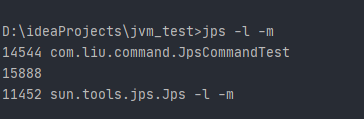
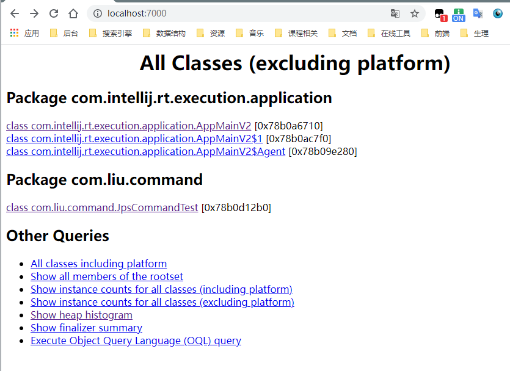

# jvm 其他知识

## jvm中静态分配和动态分配

https://developer.aliyun.com/article/14517

### 分配

* 这里所谓的**分派**指的是在Java中对方法的调用。Java中有三大特性：封装、继承和多态。分派是多态性的体现，Java虚拟机底层提供了我们开发中“重写”和“重载”的底层实现。
* **其中重载属于静态分派，而重写则是动态分派的过程。**
* **除了使用分派的方式对方法进行调用之外，还可以使用解析调用**，解析调用是在编译期间就已经确定了，在类装载的解析阶段就会把符号引用转化为直接引用，不会延迟到运行期间再去完成。
* 而分派调用则既可以是静态的也可以是动态（就是这里的静态分派和动态分派）的。


### 静态分配

* **依赖静态类型定位方法的分派，发生在编译时期，典型应用为方法的重载，（重载的参数是通过静态类型确定的，引用变量的类型）**


**动态分派**

* **在运行时期根据方法调用者的实际类型来确定方法的分派，发生在程序运行时，典型应用就是方法的重写，也是多态的一种体现。**根据实际类型来确定是否调用父类还是子类的方法。

#### 虚方法和非虚方法

* 非虚方法（所有的static、final、private方法），只能通过invokespecial指令调用，它们在**类加载的时候就会把符号引用解析为该方法的直接引用，即转为直接引用方法，在编译完成时就确定唯一的调用方法。**
* 虚方法是通过invokevirtual指令调用，且会有静态或者动态分派。具体**先根据编译期时方法调用者和方法参数的静态类型来分派**，再**在运行期根据方法调用者的实例类型来分派**。（多态实现原理，可理解为可被重写，一般指实例方法）。


## jvm启动模式之client与server

### 1.指定jvm启动模式

jvm启动时，通过-server或-client参数指定启动模式。

### 2.cilent模式与server模式的区别

1）编译器方面：
当虚拟机运行在client模式时，使用的是一个代号为c1的轻量级编译器，而server模式启动时，虚拟机采用的是相对重量级，代号为c2的编译器；c2编译器比c1编译器编译的相对彻底，服务起来之后，性能更高，但相对的编译时间更长。

2）gc方面：
cilent模式下的新生代（Serial收集器）和老年代（Serial Old）选择的是串行gc
server模式下的新生代选择并行回收gc，老年代选择并行gc。【具体收集器看对应选择】

3）启动方面：
client模式启动快，编译快，内存占用少，针对桌面应用程序设计，**优化客户端环境的**启动时间
server模式启动慢，编译更完全，编译器是自适应编译器，效率高，针对服务端应用设计，**优化服务器环境的最大化程序执行速度**

注：一般来说**系统应用**选择有两种方式：**吞吐量优先和停顿时间优先**，对于吞吐量优先的采用server默认的并行gc（Parallel Scavenge+Paralled Old）,对于暂停时间优先的选择并发gc（ParNew+CMS）。


## jvm进程有哪些线程启动

* JVM本身是一个多线程的程序，和我们编写的java应用程序一样，当JVM启动执行时就是在操作系统中启动了一个JVM进程。我们编写的java单线程或多线程应用进程都是在JVM这个程序中作为一个或多个线程运行。

* 每当使用java命令执行一个带main方法的类时，就会启动JVM（应用程序），实际上就是在操作系统中启动一个JVM进程，JVM启动时，必然会创建以下5个线程：

  1-main                  主线程，执行我们指定的启动类的main方法

  2-Reference Handler       处理引用的线程　

  3-Finalizer               调用对象的finalize方法的线程，就是垃圾回收的线程　

  4-Signal Dispatcher        分发处理发送给JVM的信号的线程　　

  5-Attach Listener          负责接收外部的命令的线程

https://www.cnblogs.com/jiangwangxiang/p/9094006.html


## 虚拟机性能监控和故障处理工具

https://www.cnblogs.com/kexianting/p/8530636.html

* 运用jvm自带的命令可以方便的在生产监控和打印堆栈的日志信息帮忙我们来定位问题！
* 研究这些命令的使用也让我们更能了解jvm构成和特性。
* Sun JDK监控和故障处理命令有jps jstat jmap jhat jstack jinfo下面做一一介绍

| **名称** | **主要作用**                                                 |
| -------- | ------------------------------------------------------------ |
| jps      | JVM Process Status Tool，显示指定系统内所有的HotSpot虚拟机进程 |
| jstat    | JVM Statistics Monitoring Tool，用于收集HotSpot虚拟机各方面的运行数据 |
| jinfo    | Configuration Info for Java，显示虚拟机配置信息              |
| jmap     | Memory Map for Java，生成虚拟机的内存转存储快照（heapdump文件） |
| jhat     | JVM Heap Dump Browser，用于分析heapdump文件，它会建立一个HTTP/HTML服务器，让用户可以在浏览器上查看分析结果 |
| jstack   | Stack Trace for Java，显示虚拟机的线程快照                   |


### jps

JVM Process Status Tool,显示**指定系统内所有的HotSpot虚拟机进程。**

#### 命令格式

```
jps [options] [hostid]
```

#### option参数

> - -l : 输出主类全名或jar路径
> - -q : 只输出LVMID
> - -m : 输出JVM启动时传递给main()的参数
> - -v : 输出JVM启动时显示指定的JVM参数

其中[option]、[hostid]参数也可以不写。

#### 示例




### jstat

jstat(JVM statistics Monitoring)是用于**监视虚拟机运行时状态信息**的命令，它可以**显示出虚拟机进程中的类装载、内存、垃圾收集、JIT编译等运行数据。**

https://www.cnblogs.com/wx170119/p/10445793.html

#### 命令格式

```
jstat [option] LVMID [interval] [count]
```

#### 参数

> - [option] : 操作参数
> - LVMID : 本地虚拟机进程ID
> - [interval] : 连续输出的时间间隔
> - [count] : 连续输出的次数

##### option 参数总览

| **选项**          | **作用**                                                     |
| :---------------- | :----------------------------------------------------------- |
| -class            | 监视类装载，卸载数量、总空间以及类装载所耗费的时间           |
| -gc               | 监视Java堆情况，包括Eden区、两个survivor区、老年代、永久代等的容量、已用空间、GC时间合计等信息 |
| -gccapacity       | 监视内容与-gc基本相同，但输出主要关注Java堆各个区域使用到的最大、最小空间 |
| -gcutil           | 监视内容与-gc基本相同，但输出主要关注已使用空间占总空间的百分比 |
| -gccause          | 与-gcutil功能一样，但是会额外输出导致上一次GC产生的原因      |
| -gcnew            | 监视新生代GC情况                                             |
| -gcnewcapacity    | 监视内容与-gcnew基本相同，输出主要关注使用到的最大、最小空间 |
| -gcold            | 监视老年代GC状况                                             |
| -gcoldcapacity    | 监视内容与-gcold基本相同，输出主要关注使用到的最大、最小空间 |
| -gcpermcapacity   | 输出永久代使用到的最大、最小空间，jdk8及之后就抛弃，因为方法区改为元空间实现了-gcmetacapacity |
| -compiler         | 输出JIT编译器编译过的方法、耗时等信息                        |
| -printcompilation | 输出已经被JIT编译的方法                                      |
|                   |                                                              |

样例：

```java
D:\ideaProjects\jvm_test>jstat -gcutil 16044
  S0     S1     E      O      M     CCS    YGC     YGCT    FGC    FGCT     GCT
  0.00   0.00  12.06   0.00  17.33  19.94      0    0.000     0    0.000    0.000

```

S0、S1表示Survivor1、Survivor2，分别使用了0%和0%的空间；

E表示Eden区，使用了12.06%的空间；

O表示老年代Old区，使用了0.00%的空间；

M表示元空间Meta区，使用了17.33的空间；

CCS：压缩使用比例 19.94

YGC表示执行Minor GC的次数，一共执行了0次；

YGCT表示执行Minor GC的总耗时为0.000秒

FGC表示执行Full GC的次数，一共执行了0次；

FGCT表示执行Full GC的总耗时为0.000秒；

GCT表示所有GC总耗时为0.000秒。


### jinfo：java配置信息工具

jinfo（Configuration Info for Java）的作用是**实时地查看和调整虚拟机各项参数。**

*jinfo**命令格式：jinfo [option] pid*

 

其中option选项可参考一下描述：

| **选项**         | **作用**                                          |
| ---------------- | ------------------------------------------------- |
| -flag            | 输出指定虚拟机参数，如jinfo -flag MaxHeapSize pid |
| -sysprops        | 输出虚拟机进程的System.getProperties()的内容      |
| -flag[+\|-] name | 修改虚拟机参数值                                  |
| -flag nam=value  | 同上                                              |

注：JDK1.6中，jinfo对于Windows平台功能仍然有较大的限制，只提供最基本的-flag选择。

```java
D:\ideaProjects\jvm_test>jinfo -flag MaxHeapSize 16044
-XX:MaxHeapSize=2669674496

```


### jmap：生成虚拟机的内存存储快照（heapdump文件）

jmap（Memory Map for Java）命令用于生成堆转储快照（一般称为heapdump或dump文件）。如果不使用jmap命令，要想获得Java堆转储快照，还有一些比较“暴力”的手段；

1、通过-XX:+HeapDumpOnOutOfMemoryError参数，可以让虚拟机在OOM异常出现之后自动生成dump文件；

2、通过-XX:HeapDumpOnCtrlBreak参数则可以使用[Ctrl]+[Break]键让虚拟机生成dump文件；

3、可在Linux系统下通过kill -3命令发送进程退出信号“吓唬”一下虚拟机，也能拿到dump文件。

*jmap**命令格式：jmap [option] vmid*

 

jmap的作用并不仅仅是为了获取dump文件，它还可以查询finalize执行队列、Java堆和永久代的详细信息，如果空间使用率、当前用的是哪种收集器等。请参考以下选项参数描述：

| **选项**       | **作用**                                                     |
| -------------- | ------------------------------------------------------------ |
| -dump          | 生成Java堆转储快照。格式为：-dump:[live, ]format=b, file=<filename>，其中live子参数说明是否只dump出存活的对象 |
| -finalizerinfo | 显示在F-Queue中等待Finalizer线程执行finalize方法的对象。只在Linux/Solaris平台下有效 |
| -heap          | 显示Java堆详细信息，如使用哪种回收器、参数配置、分代状况等。只在Linux/Solaris平台下有效 |
| -histo         | 显示堆中对象统计信息，包括类、实例数量、合计容量             |
| -permstat      | 以ClassLoader为统计口径显示永久代内存状态。只在Linux/Solaris平台下有效 |
| -F             | 当虚拟机进程对-dump选项没有响应时，可使用这个选项强制生成dump快照。只在Linux/Solaris平台下有效 |

 

jmap执行样例：

```bash
D:\ideaProjects\jvm_test>jmap -dump:format=b,file=test.bin 16044
Dumping heap to D:\ideaProjects\jvm_test\test.bin ...
Heap dump file created

```


### jhat：虚拟机存储快照分析工具

Sun JDK提供jhat（JVM Heap Analysis Tool）命令与jmap搭配使用，来分析jmap生成的堆转储快照。Jhat内置了一个微型的HTTP/HTML服务器。生产dump文件的分析结果后，可以在浏览器中查看。

```bash
D:\ideaProjects\jvm_test>jhat test.bin
Reading from test.bin...
Dump file created Fri Oct 08 21:26:32 CST 2021
Snapshot read, resolving...
Resolving 23906 objects...
Chasing references, expect 4 dots....
Eliminating duplicate references....
Snapshot resolved.
Bad level value for property: com.liu.logger.level
Started HTTP server on port 7000
Server is ready.


```

用户在浏览器中输入http://localhost:7000/就可以看到分析结果了，如下图所示：



注意：如果有其它工具可以分析，否则不建议使用jhat。首先，一般不会直接在生产环境直接分析dump文件，因为**分析dump文件是一件耗时耗资源的事情，条件允许的话首选图形分析工具（后面会介绍）；其次是jhat的分析功能过于简陋。**


### jstack：java堆栈跟踪工具

* jstack（Stack Trace for Java）命令用于生产虚拟机**当前时刻的线程快照**（一般称为threaddump或者javacore文件）。
* **线程快照就是当虚拟机内每一条线程正在执行的方法堆栈集合**，生产线程快照的主要目的是定位线程出现长时间停顿的原因，如线程间死锁、死循环、请求外部资源导致长时间等待等都是导致线程长时间停顿的常见原因。
* 线程出现停顿的时候通过jstack来查看各个线程的调用堆栈，就可以知道没有响应的线程到底在后台做些什么事情，或者等待着什么资源。

jstack命令格式：jstack [option] vmid

option选择的合法值域具有含有请看下表：

| **选项** | **作用**                                     |
| -------- | -------------------------------------------- |
| -F       | 当正常输出的请求不被响应时，强制输出线程堆栈 |
| -l       | 除堆栈外，显示关于锁的附加信息               |
| -m       | 如果调用到本地方法的话，可以显示C/C++的堆栈  |

jstack执行样例：

```bash
D:\ideaProjects\jvm_test>jstack -l 16044
2021-10-08 21:35:08
Full thread dump Java HotSpot(TM) 64-Bit Server VM (25.261-b12 mixed mode):

"Service Thread" #11 daemon prio=9 os_prio=0 tid=0x0000026dc9c77800 nid=0x419c runnable [0x00000000000
00000]
   java.lang.Thread.State: RUNNABLE

   Locked ownable synchronizers:
        - None

"C1 CompilerThread3" #10 daemon prio=9 os_prio=2 tid=0x0000026dc9bdf000 nid=0x4114 waiting on conditio
n [0x0000000000000000]
   java.lang.Thread.State: RUNNABLE

   Locked ownable synchronizers:
        - None

"C2 CompilerThread2" #9 daemon prio=9 os_prio=2 tid=0x0000026dc9bc9000 nid=0x2274 waiting on condition
 [0x0000000000000000]
   java.lang.Thread.State: RUNNABLE

   Locked ownable synchronizers:
        - None

"C2 CompilerThread1" #8 daemon prio=9 os_prio=2 tid=0x0000026dc9bc3800 nid=0x12dc waiting on condition
 [0x0000000000000000]
   java.lang.Thread.State: RUNNABLE

   Locked ownable synchronizers:
        - None

"C2 CompilerThread0" #7 daemon prio=9 os_prio=2 tid=0x0000026dc9bbd000 nid=0x808 waiting on condition
[0x0000000000000000]
   java.lang.Thread.State: RUNNABLE

   Locked ownable synchronizers:
        - None

"Monitor Ctrl-Break" #6 daemon prio=5 os_prio=0 tid=0x0000026dc9bbb800 nid=0x41d4 runnable [0x00000079
d0efe000]
   java.lang.Thread.State: RUNNABLE
        at java.net.SocketInputStream.socketRead0(Native Method)
        at java.net.SocketInputStream.socketRead(SocketInputStream.java:116)
        at java.net.SocketInputStream.read(SocketInputStream.java:171)
        at java.net.SocketInputStream.read(SocketInputStream.java:141)
        at sun.nio.cs.StreamDecoder.readBytes(StreamDecoder.java:284)
        at sun.nio.cs.StreamDecoder.implRead(StreamDecoder.java:326)
        at sun.nio.cs.StreamDecoder.read(StreamDecoder.java:178)
        - locked <0x000000078b166268> (a java.io.InputStreamReader)
        at java.io.InputStreamReader.read(InputStreamReader.java:184)
        at java.io.BufferedReader.fill(BufferedReader.java:161)
        at java.io.BufferedReader.readLine(BufferedReader.java:324)
        - locked <0x000000078b166268> (a java.io.InputStreamReader)
        at java.io.BufferedReader.readLine(BufferedReader.java:389)
        at com.intellij.rt.execution.application.AppMainV2$1.run(AppMainV2.java:61)

   Locked ownable synchronizers:
        - None

"Attach Listener" #5 daemon prio=5 os_prio=2 tid=0x0000026dc7de4800 nid=0x2c8c waiting on condition [0
x0000000000000000]
   java.lang.Thread.State: RUNNABLE

   Locked ownable synchronizers:
        - None

"Signal Dispatcher" #4 daemon prio=9 os_prio=2 tid=0x0000026dc7e38000 nid=0x1f60 runnable [0x000000000
0000000]
   java.lang.Thread.State: RUNNABLE

   Locked ownable synchronizers:
        - None

"Finalizer" #3 daemon prio=8 os_prio=1 tid=0x0000026dc7db5000 nid=0x13d4 in Object.wait() [0x00000079d
0bfe000]
   java.lang.Thread.State: WAITING (on object monitor)
        at java.lang.Object.wait(Native Method)
        - waiting on <0x000000078af88ee0> (a java.lang.ref.ReferenceQueue$Lock)
        at java.lang.ref.ReferenceQueue.remove(ReferenceQueue.java:144)
        - locked <0x000000078af88ee0> (a java.lang.ref.ReferenceQueue$Lock)
        at java.lang.ref.ReferenceQueue.remove(ReferenceQueue.java:165)
        at java.lang.ref.Finalizer$FinalizerThread.run(Finalizer.java:216)

   Locked ownable synchronizers:
        - None

"Reference Handler" #2 daemon prio=10 os_prio=2 tid=0x0000026dc7dad800 nid=0x2d0 in Object.wait() [0x0
0000079d0aff000]
   java.lang.Thread.State: WAITING (on object monitor)
        at java.lang.Object.wait(Native Method)
        - waiting on <0x000000078af86c00> (a java.lang.ref.Reference$Lock)
        at java.lang.Object.wait(Object.java:502)
        at java.lang.ref.Reference.tryHandlePending(Reference.java:191)
        - locked <0x000000078af86c00> (a java.lang.ref.Reference$Lock)
        at java.lang.ref.Reference$ReferenceHandler.run(Reference.java:153)

   Locked ownable synchronizers:
        - None

"main" #1 prio=5 os_prio=0 tid=0x0000026db0858800 nid=0x199c runnable [0x00000079d00ff000]
   java.lang.Thread.State: RUNNABLE
        at com.liu.command.JpsCommandTest.main(JpsCommandTest.java:5)

   Locked ownable synchronizers:
        - None

"VM Thread" os_prio=2 tid=0x0000026dc7d84000 nid=0x4348 runnable

"GC task thread#0 (ParallelGC)" os_prio=0 tid=0x0000026db0873800 nid=0x384c runnable

"GC task thread#1 (ParallelGC)" os_prio=0 tid=0x0000026db0874800 nid=0x39c0 runnable

"GC task thread#2 (ParallelGC)" os_prio=0 tid=0x0000026db0876000 nid=0x40e8 runnable

"GC task thread#3 (ParallelGC)" os_prio=0 tid=0x0000026db0877000 nid=0x1eec runnable

"GC task thread#4 (ParallelGC)" os_prio=0 tid=0x0000026db0879000 nid=0x29c runnable

"GC task thread#5 (ParallelGC)" os_prio=0 tid=0x0000026db087a000 nid=0x4124 runnable

"GC task thread#6 (ParallelGC)" os_prio=0 tid=0x0000026db087d000 nid=0x434c runnable

"GC task thread#7 (ParallelGC)" os_prio=0 tid=0x0000026db087d800 nid=0x47ac runnable

"VM Periodic Task Thread" os_prio=2 tid=0x0000026dc9c9a800 nid=0x43f0 waiting on condition

JNI global references: 12
```


**虚拟机性能监控工具：JDK的可视化工具**

JDK中除了提供大量的命令行工具外，还有两个功能强大的可视化工具：**JConsole和VisualVM，这两个工具是JDK的正式成员。**

#### JConsole：java监视与管理控制台

#### **VisualVM：多合一故障处理工具**

https://mp.weixin.qq.com/s?__biz=MzI4NDY5Mjc1Mg==&mid=2247484023&idx=1&sn=39be119fdf3132240adc84a85bf8a054&chksm=ebf6da08dc81531e3719389555150f2d0237554b6b6c07a123efdea7c78c0ae2f064cc577bd4&scene=178&cur_album_id=1326602114365276164#rd

//TODO 实际操纵


## 如何进行GC调优

https://www.cnblogs.com/ityouknow/p/7653129.html
