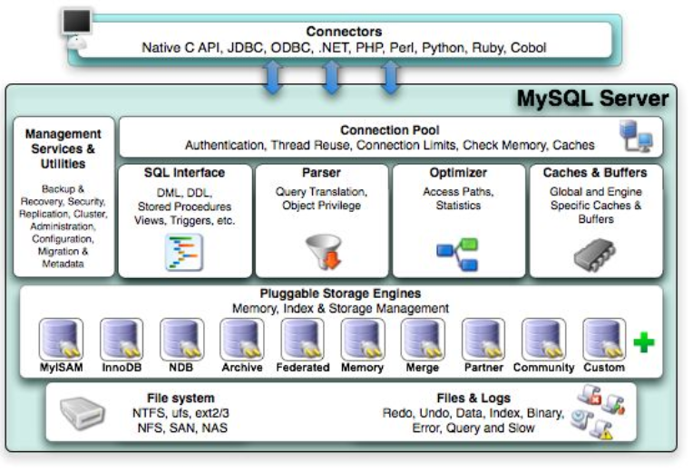

# mysql 技术内幕 chr01 mysql体系结构和存储引擎

* mysql基本能保证在各平台上的物理体系结构的一致性。

## 定义数据库和实例

* 数据库：**物理操作系统文件或其他形式文件类型的集合。**在MYSQL数据库中，数据库文件可以是frm、MYD、MYI、ibd结尾的文件。当使用NDB引擎时，数据库的文件可能不是操作系统上的文件，而是存放在内存之中的文件，但是定义仍然不变。
  * 概念上讲：数据库是文件的集合，是依照某种数据模型组织起来并存放于二级存储器中的数据集合。
* 实例：MYSQL数据库进程由后台线程以及一个共享内存区组成。共享内存可以被运行的后台线程所共享。需要牢记的是，**数据库实例才是真正用于操作数据库文件的。**【mysql数据库实例在系统上的表现就是一个进程】
  * 概念上讲：数据库实例是程序，是位于用户与操作系统之间的一层数据管理软件，**用户对数据库数据的任何操作，包括数据库定义、数据查询、数据维护、数据库运行控制等都是在数据库实例下进行的**，应用程序只有通过数据库实例才能和数据库打交道。

* **实例和数据库关系通常时一一对应的。但是，在集群的情况下可能存在一个数据库【文件集合】被多个数据实例【进程】使用的情况。**

MYSQL被设计为一个**单进程多线程架构**的数据库。

* 在**mysql数据库中，可以没有配置文件**，在这种情况下，mysql会按照编译时的默认参数设置启动实例。
  * \# 可以查看当MYSQL数据库实例启动时，会在哪些位置查找配置文件。 mysql --help | grep my.cnf
  * **mysql数据库会以读取到的最后一个配置文件中的参数为准。**
  * 在配置文件中有一个参数是datadir，**该参数指定了数据库所在的路径**。在LINUX操作系统下默认是`/user/local/mysql/data`，这个默认路径只是一个链接，实际指向`/opt/mysql_data`。所以用户必须保证`/opt/mysql_data`的用户和权限

## MYSQL体系结构

 MYSQL由一下几部分组成：

- 连接池组件
- 管理服务和工具组件
- SQL接口组件
- 查询分析器组件
- 优化器组件
- 缓冲组件
- 插件式储存引擎
- 物理文件

**mysql数据库区别于其他数据库的最重要的一个特点就是其插件式的表存储引擎。**

**需要特别注意的是：存储引擎是基于表的，而不是数据库。**

## MYSQL存储引擎

* 存储引擎是MYSQL区别与其他数据库的一个最重要特性。用户可以根据MYSQL预定的存储引擎接口编写自己的存储引擎。每个存储引擎都有各自的特点，能够根据具体的应用建立不同的存储引擎表。
* 若用户对某一种存储引擎的性能或功能不满意。可以通过修改源码来得到想要的特性，这就是开源带给我们的方便与力量。

### InnoDB存储引擎

* 支持事务，主要面向在线事务处理（OLTP）应用，mysql5.5.8版本开始，其作为默认的存储引擎，特点是
  * 行锁设计
  * 支持外键
  * 支持类似于Oracle的**非锁定读**，即默认读取操作不会产生锁。
  * 被设计用来最有效地利用以及使用内存和CPU。
  * 高性能、高可用、高可扩展。
* 数据放在一个逻辑的表空间，这个表空间像黑盒一样由INNODB存储引擎自身进行管理。它可以将每个INNODB存储引擎的表单独存放到一个独立的ibd文件中【4.1开始】。
* **通过使用多版本并发控制(MVCC)来获得高并发性**
* **实现了SQL标准的四种隔离级别。默认为REPEATABLE级别。使用多版本并发控制(MVCC)+间隙锁(next-keylocking)策略来避免幻读现象的产生。**
* 提供**插入缓冲、二次写、自适应哈希索引、预读**等高性能和高可用功能。
* 主索引是聚簇索引，在索引中保存了数据，从而避免直接读取磁盘，因此对查询性能有很大的提升。
* 表中数据采用**聚集**的方式存放，因此每场表的储存都是按主键的顺序进行存放，**如果没有显式指定主键，则会为每一行生成一个6字节的ROWID，并作为主键。**

### MyISAM存储引擎

* 不支持事务、表锁设计，支持全文索引，主要面向一些OLAP数据库应用。【5.5.8版本之前为默认的存储引擎】
* 缓冲池只缓冲索引文件，不缓冲数据文件。
* 存储引擎表由MYD和MYI组成，MYD用来存放数据文件，MYI用来存放索引文件。

\# 查看数据库所支持的存储引擎 SHOW ENGINES\G

### InnoDB 和 MyISAM的区别 TODO

## 连接mysql

* 连接mysql操作是一个连接进程和mysql数据库实例进行通信。从程序设计的角度来说，本质上是进程通信。
