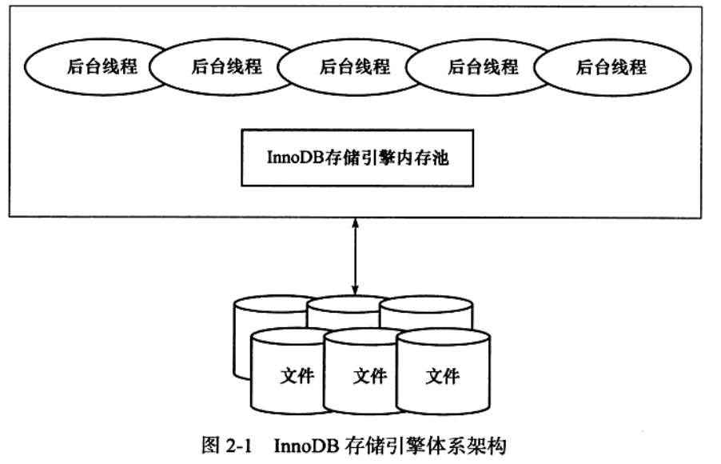
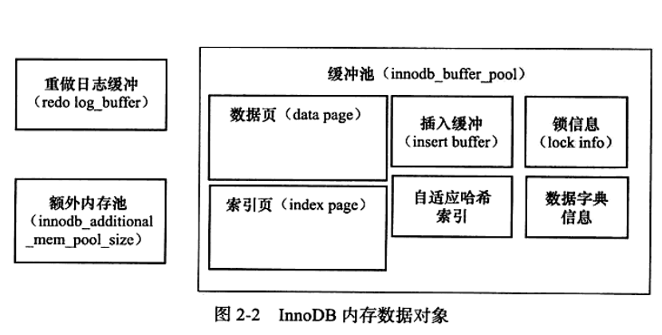
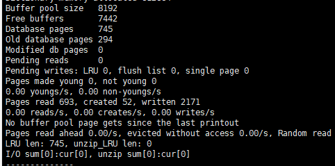
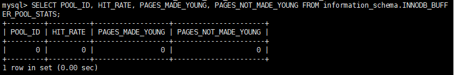
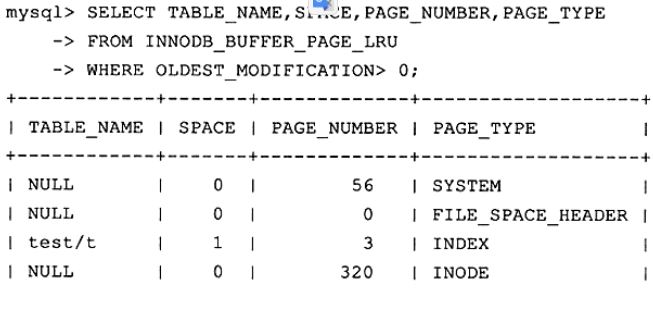
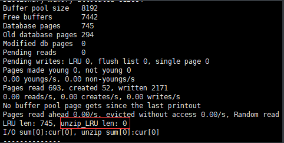
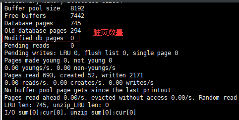
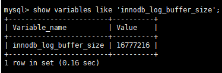
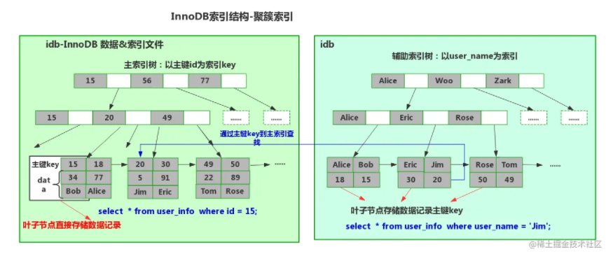
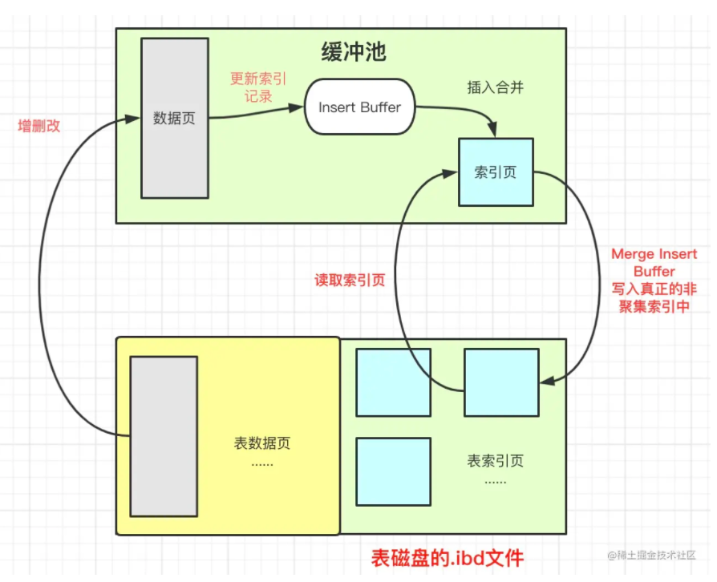

# mysql 技术内幕 chr02 InnoDB存储引擎


# InnoDB存储引擎

## InnoDB存储架构



 InnoDB存储引擎有多个内存块，可以认为**这些内存块组成了一个大的内存池**，负责如下工作：

- 维护所有进程/线程需要访问的多个内部数据结构
- 缓存磁盘上的数据，方便快速的读取，同时在对磁盘文件的数据修改之前在这里缓存。
- 重做日志(redo log)缓冲
- 。。。

后台线程的主要作用【在内存池和文件间来回操作】

- 刷新内存池中的数据，保证缓冲池中的内存缓存是最新的数据
- 将已经修改的数据文件刷新到磁盘文件，同时保障在数据库发生异常的情况下InnoDB能恢复到正常运行状态。


### 后台线程

* **InnoDB存储引擎是多线程模型，因此其后台有多个不同的后台线程，负责处理不同的任务。**


#### Master Thread

* 核心线程，主要负责将缓冲池中的数据**异步**刷新到磁盘，保证数据的一致性，包括脏页的刷新，合并插入缓冲，UNDO页的回收等。

#### IO Thread

* 在INNODB存储引擎中大量使用了AIO（Async IO）【异步IO】来处理写IO请求，这样可以极大提高数据库的性能。而**IO Thread的工作主要是负责这些IO请求的回调（call back）处理。**
* 有四种IO Thread 分别是（1.0.x开始）：
  - wrtie thread：4个
  - read thread：4个
  - insert buffer thread：1个
  - buffer log IO：1个
* 可以使用innodb_read_io_threads 和 innodb_write_io_threads参数进行设置。
* 读线程的id一定小于写线程

\# INNODB版本查询 

SHOW VARIABLES LIKE 'INNODB_VERSION'\G; 

\# INNODB IO 读写回调处理THREAD 数量查询 

SHOW VARIABLES LIKE 'innodb_%io_threads'\G;

\# 查询IO THREAD 

SHOW ENGINE INNODB STATUS\G；


#### Purge Thread

* **事务被提交后，其所使用的undolog【撤销日志：用于回滚操作】可能不再需要，因此需要PurgeThread来回收已经使用并分配的undo页。**

* **purge操作默认为Master Thread负责**，从INNODB 1.1版本开始，可以将purge操作从MASTER THREAD中抽离出来，来减轻MASTER THEAD的工作。

  * 配置文件中添加如下命令启用独立的Purge Thread

    [mysqld] innodb_purge_threads=1

*  从INNODB 1.2版本开始，可以支持多个purge Thread，这样做的目的是为了进行加快undo页的回收，进一步利用磁盘的随机读取性能。例如可以设置4个

  ```mysql
  SELECT VERSION() \G;
  SHOW VARIABLES LIKE 'innodb_purge_threads'\G;
  ```


#### Page Cleaner Thread

*  是在INNODB 1.2.x版本中引入的。起作用是将之前版本中**脏页的刷新操作都放入到单独的线程中来完成【缓冲池中的最新数据刷新会磁盘】**。其目的是为减轻MASTER THREAD的工作以及对用于查询线程的堵塞，进一步提高性能。


### 内存

* InnoDB的内存架构主要分为三大块，**缓冲池**（Buffer Pool）、**重做缓冲池**（Redo Log Buffer）和**额外内存池**

#### 缓冲池 

* **InnoDB存储引擎是基于磁盘存储的【数据库对应的文件集合存储在磁盘上】**，并将其中的记录按照页的方式进行管理，因此可将其视为基于磁盘的数据库系统。且在数据库系统中，由于cpu速度和磁盘速度之间的鸿沟，**基于磁盘的数据库系统通常需要使用缓冲池技术来提高数据库的整体性能。**
* 缓冲池就是一块内存区域，读取页时先在缓存池中找，找不到再去磁盘读取并将页放入缓存池中。修改操作是首先修改在缓冲池中的页，然后再以一定频率刷新回磁盘上。不是每次页发生更改时触发刷新回磁盘，而是**通过一种称为Checkpoint的机制刷新回磁盘**。同样也是为了提高数据库的整体性能。
* MySQL采用**日志先行**，在真正写数据之前，会首先记录一个日志，叫**Redo Log**，会定期的使用CheckPoint技术将新的Redo Log刷入磁盘。
* 可知缓冲池的大小直接影响着数据库的整体性能。
  * 可通过配置innodb_buffer_pool_size的大小配置缓冲池大小
  * SHOW VARIABLES LIKE 'innodb_buffer_pool_size'\G; 查看缓冲池大小
* 缓冲池中缓存的数据页类型有：索引页、数据页、undo页、插入缓冲、自适应哈希索引、InnoDB存储的锁信息、数据字典信息等，**不能只认为缓冲池只是缓存索引页和数据页，它们只是占缓冲池很大的一部分而已。**



* 从1.0.X版本开始，**允许有多个缓冲池实例。每个页根据哈希值平均分配到不同缓冲池实例中。好处是减少数据库内部的资源竞争，增加数据库的并发处理能力。**

  * 可以通过innodb_buffer_pool_instances设置缓冲池实例个数

  * SHOW ENGINE INNODB STATUS\G;  //查看每个缓冲池实例状态。【**过去某个时间范围内存储引擎的状态。**】

  * mysql 5.6开始， 可通过**information_schema架构下**的表INNODB_BUFFER_POOL_STATS查看缓冲的状态，

    SELECT POOL_ID, POOL_SIZE, FREE_BUFFERS, DATABASES_PAGES FROM INNODB_BUFFER_POOL_STATUS\G;


##### INNODB内存管理模式——LRU List、Free List（空闲页列表） 和 Flush List（脏页列表）

* 缓冲池是一个很大的内存区域，存放各种类型的页，InnoDB存储引擎需要对这个内存区域进行管理，页读取，页刷新，页置换等。。

* 缓冲池中页的大小默认为16KB，InnoDB存储引擎使用LRU算法进行内存管理，不同的是，他最新读取的页不是放在列表的首部，而是放在midpoint的位置。midpoint默认位置在LRU列表长度的5/8处。

  * midpoint位置可由参数`innodb_old_blocks_pct`控制【距离尾端的比例】，例如

  ```mysql
  SHOW VARIABLES LIKE 'innodb_old_blocks_pct'\G;
  ```

* InnoDB存储引擎中，midpoint及之后的列表称为old列表，之前的列表称为new列表。new表中的页都是最为活跃的数据。 

* **为什么要这样优化？如果直接讲读取的页放入到 LRU 列表的首部会有什么问题？**

  如果将直接读取的页放入到 LRU 的首部，那么某些 SQL 操作可能会使缓冲池中的页被刷新出来，从而影响缓冲池的效率。常见的这类操作作为索引或数据的扫描操作。这类操作需要访问表中的许多页，甚至全部的页，而这些页通常来说又仅在这次查询操作中需要，并不是活跃的热点数据。如果页被放入 LRU 列表的首部，那么非常可能**将所需要的热点数据页从 LRU 列表中移除，而在下一次需要读取改页时，InnoDB 存储引擎需要再次访问磁盘。**【缓冲池污染】

* 为了更进一步优化这个问题，引入一个新的参数`innodb_old_blocks_time`，表示**页读取到mid位置后需要等待多久才会被加入到LRU列表的热端【在old列表中等待innodb_old_blocks_time这么久之后，下一次对该页的访问才能使其移动到new列表中】。**所以在执行上述类型的SQL时候，可以先设置这个参数保证原来的LRU列表热点数据不被刷出。**【大量的非热点数据加入到LRU列表中时，避免它们填充new列表】**

  ```mysql
  SET GLOBAL innodb_old_blocks_time = 1000;
  ```

* ```mysql
  # 一些操作
  .....
  
  SET GLOBAL innodb_old_blocks_time = 0; # 默认值
  ```

   如果用户预估自己热点数据不止63%，可以在执行SQL前改变`innodb_old_blocks_pct`参数

  ```mysql
  SET GLOBAL innodb_old_blocks_pct=20; # 距离尾端的比例
  ```


 InnoDB开始启动时，**LRU加载过程：**

- 数据库刚启动时，LRU列表是空的，即没有任何的页。所有页都放在Free列表中。
- 当需要从缓冲池分页时，首先从Free列表中查找是否有可用的空闲页，若有则将该页从Free列表中删除，放入到LRU列表中。否则，根据LRU算法，淘汰LRU列表末尾的页，将该内存空间分配给新的页。
- 页从LRU列表的old部分加入到new部分时，称此时发生的操作为page made young
- 因为`innodb_old_blocks_time`的设置而导致页没有从old部分移动到new部分的操作称为page not made young。
- **通过命令SHOW ENGINE INNODB STATUS观察LRU列表以及FREE列表的使用情况和运行状态。**



* Buffer pool size ：当前缓冲池页的数量
* Free buffers：Free列表中页的数量
* Database pages：LRU列表中页的数量
* Free buffers与Database pages的数量之和可能不等于Buffer pool size，因为缓冲池中的页还可能被分配给自适应哈希索引、Lock信息、Insert Buffer等页，而这部分页不需要LRU算法进行维护，因此不存在于LRU列表中。
* pages made young 显式了LRU列表中页移动到new部分的次数，因为innodb_old_blocks_time为0，所以not young为0。
* Buffer pool hit rate：表示缓冲池的命中率。【**客户端请求的数据直接在缓冲池中获取而不是在磁盘读取的比例**】，通常该值应该不小于95%，如果小于，需要观察是否是由于全表扫描引起的LRU列表被污染的问题。


\# INNODB1.2版本开始，还可以**通过表INNODB_BUFFER_POOL_STATUS来观察缓冲池的运行状态** SELECT POOL_ID, HIT_RATE, PAGES_MADE_YOUNG, PAGES_NOT_MADE_YOUNG FROM information_schema.INNODB_BUFFER_POOL_STATS\G;



\# 通过**表INNODB_BUFFER_PAGE_LRU来观察每个LRU列表中每个页的具体信息** SELECT TABLE_NAME, SPACE, PAGE_NUMBER, PAGE_TYPE FROM INNODB_BUFFER_PAGE_LRU WHERE SPACE = 1;



​		**TABLE_NAME为NULL表示该页属于系统表空间。**

*  INNODB存储引擎从1.0.X版本开始支持压缩页的功能，即将原来16KB的页压缩为1KB、2KB、4KB和8KB。由于页的大小发生了变化，所以LRU列表也有了些许的变化，**对于非16KB的页，是通过unzip_LRU列表进行管理的。通过命令观察得到:**

  ```mysql
  SHOW ENGINE INNODB STATUS\G;
  ```

  

  ​	**这里需要注意的是LRU列表长度包括unzip_LRU列表长度。**

* 对于压缩页的表，每个表的压缩比率可能各不相同。可**能存在有的表页大小为8KB，有的表页大小为2KB的情况。 unzip_LRU是怎样从缓冲池中分配内存的呢？**

   首先，**在unzip_LRU列表中对不同压缩页大小的页进行分别管理**。其次通过伙伴算法进行内存的分配。例如对需要从缓冲池中申请页为4KB的大小【压缩的页需要放到缓存中】，其过程如下：

  * 检查4KB的unzip_LRU的列表，检查是否有可用的空闲页；

  * 若有，则直接使用

  * 否则，检查8KB的unzip_LRU列表

  * 若能够得到空闲页，**将页分成2个4KB的页，存放到4KB的unzip_LRU列表汇总**；

  * 若不能得到空闲页，**从LRU列表中申请一个16KB的页**，分为1个8K的页还有2个4KB的页，分别存放到对应的unzip_LRU列表中。

    同样可通过**表INNODB_BUFFER_PAGE_LRU来观察unzip_LRU列表中的页**

```mysql
SELECT  TABLE_NAME, SPACE, PAGE_NUMBER, COMPERSSID_SIZE FROM INNODB_BUFFER_PAGE_LRU WHERE COMPRESSED_SIZE <> 0;  # 压缩大小不为0
```


*  在LRU列表中的页被修改后，该页成为脏页，**即缓冲池中的页和磁盘上的页的数据产生了不一致。这时数据库会通过CHECKPOINT机制将脏页刷新会磁盘。 Flush列表中的页即为脏页列表。**

* 需要注意的是，**脏页既存在于LRU列表中，也存在与Flush列表中。LRU列表用来管理缓冲池中的页的可用性，Flush列表用来管理将页刷新回磁盘，二者互不影响。**

  同样可通过**SHOW ENGINE INNODB STATUS来观察Flush列表**

  

  同样可通过表INNODB_BUFFER_PAGE_LRU来观察脏页，唯一不同的是需要加入OLDEST_MODIFICATION > 0 的查询条件，用于查找LRU列表中被修改过的页

  ```mysql
  * SELECT TABLE_NAME, SPACE, PAGE_NUMBER, PAGE_TYPE FROM INNODB_BUFFER_PAGE_LRU WHERE OLDEST_MODIFICATION > 0;
  ```

  

#### 重做日志缓冲

* InnoDB存储引擎的内存区域除了有缓冲池外，还有重做日志缓冲（redo log buffer）。

* **INNODB存储引擎首先将重做日志信息放在这个缓冲区中，然后按照一定的频率刷新到重做日志文件。**

* 重做日志缓冲一般不用设置的很大，因为一般情况下每一秒钟会将重做日志缓冲刷新到日志文件，因此用户只需要保证每秒产生的事务量在这个缓冲大小之内即可。**可通过`innodb_log_buffer_size`控制，默认8MB**

  

   **刷新到磁盘的策略**

  - MASTER THREAD每一秒将重做日志缓冲刷新到重做日志文件中
  - 每个事务提交时会将重做日志缓冲刷新到重做日志文件中
  - 当重做日志缓冲池剩余空间小于一半时，重做日志缓冲刷新到重做日志文件中。


#### 额外的内存池

* 额外的内存池用来对一些数据结构本身的内存进行分配，例如缓冲控制对象(buffer control block)记录的LRU，锁，等待等信息。**这些额外的内存池不够时才会从缓冲池中进行申请**。因此，在申请了很大的InnoDB缓冲池时，额外的内存池也要适当的调大。通过参数innodb_additional_mem_pool_size来设置大小。查看通过如下命令：

```mysql
mysql> show variables like ``'%pool_size'``;
+---------------------------------+------------+
| Variable_name          | Value   |
+---------------------------------+------------+
| innodb_additional_mem_pool_size | 67108864  |
| innodb_buffer_pool_size     | 4294967296 |
+---------------------------------+------------+
```


## Checkpoint技术

https://juejin.cn/post/6887842330175832072

*  一条DML语句会使得产生脏页时（内存的数据比磁盘新），需要将新版本的页刷新到磁盘中。

* 为了避免发生数据丢失的问题，当前事务数据库系统普遍都采用了Write Ahead Log【预写式日志】策略，**即当事务提交时，先写重做日志，再修改页**。**当由于发生宕机而导致数据丢失时，通过重做日志来完成数据的恢复。**体现事务ACID中的持久性（D）

  * WAL策略解决了刷新页数据到磁盘时发生宕机而导致数据丢失的问题

  * #### WAL策略机制原理：InnoDB为了保证数据不丢失，维护了redo log。在缓冲池的数据页修改之前，需要先将修改的内容记录到redo log中，并保证redo log早于对应的数据页落盘，这就是WAL策略。

    **当故障发生而导致内存数据丢失后，InnoDB会在重启时，通过重做redo log，将缓冲池数据页恢复到崩溃前的状态。**


### checkpoint 出现原因

按理说有了WAL策略，我们就可以高枕无忧了。但其问题点又出现在redo log上面：

- **redo log 不可能是无限大的**，不能没完没了的存储我们的数据等待一起刷新到磁盘
- 在数据库怠机恢复时，如果redo log 太大的话**恢复的代价也是非常大的**

所以为了解决**脏页的刷新性能，脏页应该在什么时间、什么情况下进行脏页的刷新**就用到了Checkpoint技术。

**Checkpoint技术是为了解决以下几个问题：**

**1、缩短数据库的恢复时间**

当数据库怠机恢复时，不需要重做所有的日志信息。因为Checkpoint前的数据页已经刷回到磁盘了。只需要Checkpoint后的redo log进行恢复就好了。

**2、缓冲池不够用时，将脏页刷新到磁盘**

当缓冲池空间不足时，根据LRU算法会溢出最近最少使用的页，若此页为脏页，那么需要强制执行Checkpoint，将脏页也就是页的新版本刷回磁盘。

**3、redo log不可用时，刷新脏页**

所谓 redo log 不可用就是所有的 redo log file 都写满了。但事实上，其实 redo log 中的数据并不是时时刻刻都是有用的，**那些已经不再需要的部分就称为 ”可以被重用的部分“，即当数据库发生宕机时，数据库恢复操作不需要这部分的 redo log，因此这部分就可以被覆盖重用（或者说被擦除）。**

举个例子来具体解释下：一组 4 个文件，每个文件的大小是 1GB，那么总共就有 4GB 的 redo log file 空间。**write pos 是当前 redo log 记录的位置，随着不断地写入磁盘，write pos 也不断地往后移，就像我们上文说的，写到 file 3 末尾后就回到 file 0 开头。CheckPoint 是当前要擦除的位置（将 Checkpoint 之前的页刷新回磁盘），也是往后推移并且循环的：**


**write pos 和 CheckPoint 之间的就是 redo log file 上还空着的部分，可以用来记录新的操作**。如果 write pos 追上 CheckPoint，就表示 redo log file 满了，这时候不能再执行新的更新，得停下来先覆盖（擦掉）一些 redo log，把 CheckPoint 推进一下。


### checkpoint发生的时机

在InnoDB存储引擎中，通过LSN（Log Sequence Number)来标记版本的。LSN是8字节的数字。每个页、重做日志、Checkpoint都有LSN。可以通过命令来查看

```mysql
SHOW ENGINE INNODB STATUS\G;
```


综上所述，**Checkpoint 所做的事情无外乎是将缓冲池中的脏页刷新到磁盘。不同之处在于每次刷新多少页到磁盘，每次从哪里取脏页，以及什么时间触发 Checkpoint。**在 InnoDB 存储引擎内部，有两种 Checkpoint，分别为：

- **Sharp Checkpoint**：**发生在数据库关闭时**将所有的脏页都刷新回磁盘，这是默认的工作方式，参数 `innodb_fast_shutdown=1`

- **Fuzzy Checkpoin**：InnoDB 存储引擎内部使用这种模式，**只刷新一部分脏页，而不是刷新所有的脏页回磁盘。**

  - Master Thread Checkpoint

    差不多以每秒或每十秒的速度从缓冲池的脏页列表中刷新一定比例的页回磁盘。这个过程是**异步**的，即此时InnoDB存储引擎可以进行其他的操作，用户查询线程不会阻塞。

    

  - FLUSH_LRU_LIST Checkpoint

    是因为InnoDB存储引擎需要**保障LRU列表中需要有足够多的空闲页可使用**而提出。

     在InnoDB 1.1.x版本之前，**检查LRU列表空间是否足够的操作是发生在用户查询线程中，会堵塞用户的查询操作**。而且如果查询空间不足，会将LRU尾端的页移除，如果有脏页就进行Checkpoint。

     在InnoDB1.2.x版本开始，这个操作会放在Page Cleaner 线程中进行。并且可以通过参数进行设置预留的空间大小，设置LRU列表需要保留多少个空闲页的空间

    ```mysql
    SHOW VARIABLES LIKE 'innodb_lru_sacn_depth'\G;
    ```

    (bf的LRU列表没有足够空间引发的checkpoint： 之前版本的mysql将LRU LIST Checkpoint 放在用户查询线程中会导致一定的阻塞，后续版本将之拎出来放在 Page Cleaner线程，LRU列表中可用空闲页少于innodb_lru_scan_depth 1024个页时 Page Cleaner线程会将LRU列表尾端的页移除，如果这些页中有脏页,那么需要进行FLUSH LRU LIST Checkpoint  )

  

  - Async/Sync Flush Checkpoint【异步/同步刷新】
  
    **Async/Sync Flush Checkpoint指的是重做日志文件不可用【空间快用完】的情况,这时需要强制将一些页刷新回磁盘,而此时脏页是从脏页列表中选取的。**若将已经写入到重做日志的LSN 记为 redo_lsn ,将已经刷新回磁盘最新页的LSN记为 checkpoint_lsn ,则可定义:
     checkpoint_age=  redo_lsn -  checkpoint_lsn （checkpoint_age代表 redo log + bp中的脏页 = 需要写入磁盘的页总量）
     再定义以下的变量:
     async_water_mark=75%* total_redo_ log_file_size
     sync_water_mark = 90% * total_redo_log_file_size

    若每个重做日志文件的大小为1GB,并且定义了两个重做日志文件,则重做日志文件的总大小为2GB。那么 async_water_mark=1.5gb,sync_water_mark=1.8gb.则:
  
    1、当 checkpoint_age<async_water_mark时,不需要刷新任何脏页到磁盘;
     2、当 async_water_mark<checkpoint_age<sync_water_mark时触发 Async Flush,从 Flush 列表中刷新足够的脏页回磁盘,使得刷新后满足 checkpoint_age<sync_water_mark;
     3、 checkpoint_age>sync_water_mark 这种情况一般很少发生,除非设置的重做日志文件太小,并且在进行类似 LOAD DATA的 BULK INSERT操作此时触 发 Sync Flush操作,从 Flush列表中刷新足够的脏页回磁盘,使得刷新后满足 checkpoint_age<async_water_mark. 可见, Async/Sync Flush Checkpoint是为了保证重做日志的循环使用的可用性。**在 InnoDB1.2.x版本之前, Async Flush Checkpoint会阻塞发现问题的用户查询线程,而 Sync Flush Checkpoint会阻塞所有的用户查询线程,并且等待脏页刷新完成。从 InnoDB 1.2.x版本开始也就是5.6版本,这部分的刷新操作同样放入到了单独的Page Cleaner Thread中,故不会阻塞用户查询线程。** MySQL官方版本并不能查看刷新页是从 Flush列表中还是从LRU列表中进行 Checkpoint的,也不知道因为重做日志而产生的 Async/Sync Flush的次数。但是InnoSQL 版本提供了方法,可以通过命令 SHOW ENGINE INNODB STATUS来观察,如:

    (redo log file 满了引发的checkpoin）

    

  - Dirty Page too much Checkpoint

    最后一种 Checkpoint的情况是 Dirty Page too much，即**缓冲池中脏页的数量**太多，导致InnoDB存储引擎强制进行Checkpoint。**其目的总的来说还是为了保证缓冲池中有足够可用的页。**

    其可由参数innodb_max_dirty_pages_pct控制,比如该值为75，表示当缓冲池中脏页占据75%时，强制进行CheckPoint。在 InnoDB1.0.版本之前,该参数默认 值为90,之后的版本都为75。
  
    SHOW VARIABLES LIKE 'innodb_max_dirty_pages_pct'\G;
  
    (bp中脏页占比超过innodb_max_dirty_pages_pct 会触发一个Dirty Page too much Checkpoint )
  
  
  
  #### 总结

1、主线程每秒或每10秒触发
 2、mysql停止时触发全量的脏页回收checkpoint
 3、buffer pool 中LRU列表剩余空间低于 innodb_lru_scan_depth，移除列表尾端页时，若是脏页则触发checkpoint
 4、redo log file 不可用，剩余容量少于一定值后触发 checkpoint。
 5、buffer pool中脏页超过百分值 innodb_max_dirty_pages_pct 触发checkpoint，保证bp中有足够多可用页


## Master Thread工作方式

* InnoDB存储引擎的主要工作都是在一个单独的后台线程Master Thread中完成的。


## InnoDB关键特性

* InnoDB存储引擎的关键特性包括：
  * 插入缓冲（Insert Buffer）
  * 两次写（Double Write）
  * 自适应哈希索引（Adaptive Hash Index）
  * 异步IO（Async IO）
  * 刷新邻接页（Flush Neighbor Page)
* **上述这些特性为InnoDB存储引擎带来更好的性能以及更高的可靠性。**


### 插入缓冲

* InnoDB缓冲池中有Insert Buffer信息固然不错，但是**Insert Buffer和数据页一样，也是物理页的一个组成部分。**

先说几个点：

- 一张表只能有一个主键索引，那是因为其物理存储是一个B+树。（别忘了聚集索引叶子节点存储的数据，而数据只有一份）
- **非聚集索引叶子节点存的是聚集索引的主键**


#### **聚集索引的插入**

* 主键是行唯一的标识符（也就是我们常叨叨的聚集索引）。我们平时插入数据一般都是按照主键递增插入，因此**聚集索引的插入都是顺序写入的，不需要磁盘的随机读取。**
  * 聚集索引的特性：
    * 自增长的
    * 插入NULL值时，**由于AUTO_INCREMENT的原因，其值会递增**【页中的行记录顺序存放】
    * 同时数据页中的行记录按id的值进行顺序存放
* 一般情况下由于聚集索引的有序性，不需要随机读取页中的数据，因为此类的顺序插入速度是非常快的。
* 但如果你把列 Id 插入UUID这种数据，**那你插入就是和非聚集索引一样都是随机的了【不再是顺序插入了】。会导致你的B+ tree结构不停地变化，那性能必然会受到影响。**


#### **非聚集索引的插入**

* 非聚集索引也是一颗B+树，只是叶子节点存的是聚集索引的主键和对应索引字段的值。
* 因为不能保证非聚集索引字段的数据是顺序的，所以需要离散地访问非聚集索引页【找到合适地插入位置】，**由于随机读取的存在而导致了插入操作性能下降。**


#### **Insert Buffer 的到来**

* 可以看出非聚集索引插入的离散性导致了插入性能的下降，因此**InnoDB引擎设计了 Insert Buffer来提高插入性能 。**


#### Insert Buffer对于非聚集索引的插入或更新操作时如何进行的



* 首先对于非聚集索引的插入或更新操作，**不是每一次直接插入到索引页中，而是先判断插入的非聚集索引页是否在缓冲池中。**
* 若在，则直接插入；若不在，则先放入到一个Insert Buffer对象中。
* 给外部的感觉好像是新的非聚集索引已经插入到非聚集索引的叶子节点，而其实是存放在其他位置了
* 以一定的频率和情况进行Insert Buffer和辅助索引页子节点的merge（合并）操作，通常**会将多个插入操作一起进行merge**（因为在一个索引页中），这就大大的提升了非聚集索引的插入性能。【配合上**redoLog**可以实现一致性和持久化】


#### **Insert Buffer的使用要求**：

- **索引是非聚集索引**
- **索引不是唯一（unique）的**

只有满足上面两个必要条件时，InnoDB存储引擎才会使用Insert Buffer来提高插入性能。


**那为什么必须满足上面两个条件呢？**

第一点索引是非聚集索引就不用说了，人家聚集索引本来就是顺序的也不需要你

第二点必须不是唯一（unique）的，因为在写入Insert Buffer时，**数据库并不会去判断插入记录的唯一性。如果再去查找肯定又是离散读取的情况了，这样InsertBuffer就失去了意义。**


#### **Insert Buffer信息查看**

我们可以使用命令SHOW ENGINE INNODB STATUS来查看Insert Buffer的信息：

```bash
-------------------------------------
INSERT BUFFER AND ADAPTIVE HASH INDEX
-------------------------------------
Ibuf: size 7545, free list len 3790, seg size 11336, 
8075308 inserts,7540969 merged sec, 2246304 merges
...
```

使用命令后，我们会看到很多信息，这里我们只看下INSERT BUFFER 的:

- seg size 代表当前Insert Buffer的大小  11336*16KB
- free listlen 代表了空闲列表的长度
- size 代表了已经合并记录页的数量
- Inserts 代表了插入的记录数
- merged recs 代表了合并的插入记录数量
- merges 代表合并的次数，也就是实际读取页的次数

merges：merged recs大约为1∶3，代表了Insert Buffer 将对于非聚集索引页的离散IO逻辑请求大约降低了2/3


#### **Insert Buffer的问题**

说了这么多针对于Insert Buffer的好处，但目前Insert Buffer也存在一个问题：

**即在写密集的情况下，插入缓冲会占用过多的缓冲池内存（innodb_buffer_pool），默认最大可以占用到1/2的缓冲池内存。**

**占用了过大的缓冲池必然会对缓冲池其他操作带来影响**


#### **Insert Buffer的优化**

MySQL5.5之前的版本中其实都叫做Insert Buffer，之后优化为 `Change Buffer `可以看做是 Insert Buffer 的升级版。

插入缓冲（ Insert Buffer）这个其实只针对 INSERT 操作做了缓冲，而Change Buffer 对INSERT、DELETE、UPDATE都进行了缓冲，所以可以统称为写缓冲，其可以分为：

- Insert Buffer
- Delete Buffer
- Purgebuffer


### 两次写

https://www.jianshu.com/p/7d87e2603cdd

**认识脏页刷盘风险**

关于IO的最小单位：

1、数据库IO的最小单位是16K（MySQL默认，oracle是8K）【这里说的是页】

2、文件系统IO的最小单位是4K（也有1K的）

3、磁盘IO的最小单位是512字节

因此，存在IO写入导致**page损坏**的风险：


* 如果说插入缓冲是为了提高写性能的话，那么**两次写是为了提高可靠性**，**用来解决部分写失败(partial page write页断裂)。**

1、Double write解决了什么问题

一个数据页的大小是16K，假设在把内存中的脏页写到数据库的时候，写了2K突然掉电，也就是说前2K数据是新的，后14K是旧的，那么磁盘数据库这个数据页就是不完整的，是一个坏掉的数据页。**redo只能加上旧、校检完整的数据页恢复一个脏块，不能修复坏掉的数据页，所以这个数据就丢失了，可能会造成数据不一致，所以需要double write。**

2、使用情景

当数据库正在从内存想磁盘写一个数据页是，数据库宕机，从而导致这个页只写了部分数据，这就是**部分写失效**，它会导致数据丢失。这时是无法通过重做日志恢复的，**因为重做日志记录的是对页的物理修改【相对于之前的页的修改】，如果页本身已经损坏，重做日志也无能为力。**

3、double write工作流程

doublewrite由两部分组成

* 一部分为内存中的doublewrite buffer，其大小为2MB
* 另一部分是磁盘上共享表空间(ibdata x)中连续的128个页，即2个区(extent)，大小也是2M。

1、当一系列机制触发数据缓冲池中的脏页刷新时，并不直接写入磁盘数据文件中，而是先拷贝至内存中的doublewrite buffer中；

2、接着从两次写缓冲区分两次写入磁盘共享表空间中**(连续存储，顺序写，性能很高**)，每次写1MB；

3、待第二步完成后，再将doublewrite buffer中的脏页数据写入实际的各个表空间文件(**离散写)**；(脏页数据固化后，即进行标记对应doublewrite数据可覆盖)

4、doublewrite的崩溃恢复

**如果操作系统在将页写入磁盘的过程中发生崩溃，在恢复过程中，innodb存储引擎可以从共享表空间的doublewrite中找到该页的一个最近的副本，将其复制到表空间文件，再应用redo log，就完成了恢复过程。**

**因为有副本所以也不担心表空间中数据页是否损坏。**


Q：为什么log write不需要doublewrite的支持？

A：因为redolog写入的单位就是512字节，也就是磁盘IO的最小单位，所以无所谓数据损坏。


### 自适应哈希索引

* InnoDB存储引擎会监控对表上各索引页的查询。如果观察到建立哈希索引可以带来速度提升，则建立哈希索引，称之为自适应哈希索引（Adaptive Hash index，AHI）
* AHI是通过**缓冲池的B+树页**构造而来，因此建立的速度很快，而且不需要对整张表构建哈希索引。
* InnoDB存储引擎会自动根据访问的频率和模式来**自动地为某些热点页建立哈希索引。**
* AHI的要求：
  * **对这个页的连续访问模式必须是一样的**。
    * 访问模式一样指的是查询的条件一样。
    * 且以该模式访问了100次
    * 页通过该模式访问了N次，其中N=页中记录*1/16。
* **值得注意的是：哈希索引只能用来搜索等值的查询。**
* 默认AHI为开启状态。


### 异步IO

* 当前数据库系统都采用异步IO（AIO)的方式来**处理磁盘操作。**
* AIO的另一个优势就是可以进行IO Merge操作，也就是将多个IO合并为1个IO，这样可以提高IOPS的性能。


### 刷新邻接页

* InnoDB存储引擎还提供了Flush Neighbor Page（刷新邻接页）的特性。
* 其工作原理为：当刷新一个脏页时，InnoDB存储引擎会检测该页所在区的所有页，如果是脏页，那么一起进行刷新。这样做可通过AIO将多个IO操作合并为一个IO操作。
* 该工作机制在传统机械盘上有着显著的优势，但需要考虑下面两个问题：
  * 如果邻接脏页写入后，该页之后是否很快又变成脏页
  * 固态硬盘有着较高的IOPS，是否还需要这个特性。


## 最小单位：页

* 
