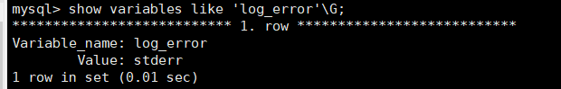

# mysql 技术内幕 chr03 文件

有以下类型文件：

* 参数文件：告诉MYSQL实例启动时**在哪里找到数据库文件，并且制定某些初始化参数。**
* 日志文件：用来记录MYSQL实例对某种条件作出响应时写入的文件，如错误日志文件、二进制日志文件、慢查询文件、查询日志文件等。
* socket文件：当用UNIX域套接字方式进行连接时需要的文件。
* pid文件：MYSQL实例的进程ID文件
* MySQL表结构文件：用来存放MYSQL表结构定义文件。
* 存储引擎文件：因为MYSQL表存储引擎的关系，每个存储引擎都有自己的文件来保存各种数据。这些存储引擎文件真正存储了记录和索引等数据。


## 参数文件

* MySQL实例可以不需要参数文件，这时所有的参数值取决于编译MySQL时指定的默认值和源代码中指定参数的默认值。
* 但是mysql实例一定需要在默认的数据库目录下的mysql架构。mysql架构中记录了访问该实例的权限，当找不到这个架构时，MySQL实例不会成功启动。
* 参数文件是以文本方式进行存储的，可以通过文本编辑软件进行修改。

 查找参数文件命令

```mysql
mysql --help | grep my.cnf
```


### 参数

* 数据库参数可看成一个键值对。

*  查找参数值命令

  ```mysql
  SELECT * FROM GLOBAL_VARIABLES WHERE VARIABLE_NAME LIKE 'innodb_buffer%'\G;
  
  # 推荐使用
  SHOW VARIABLES LIKE 'innodb_buffer%'\G;
  ```

* MySQL中没有所谓的隐藏参数。


### 参数类型

分为两类

* 动态参数

  *  动态参数可以在MYSQL实例运行进行更改

  * 更改动态参数的语法如下：

    SET 

    | [global | session] system_var_name=expr

     | [@@global. | @@session. | @@] system_var_name = expr

    `global`：全局的，`session`：当前会话。说明参数的作用域是不通的。一些demo

    ```mysql
    # 改变当前会话，不会改变全局 
    SET read_buffer_size = 524288 
    # 改变全局会话参数，不会改变当前 
    SET @@global.read_buffer_size = 1048576; 
    # 查询当前会话参数 
    SELECT @@session.read_buffer_size\G; 
    # 查询全局会话参数 
    SELECT @@global.read_buffer_size\G;
    ```

    需要注意的是，对变量的全局值进行了修改，在这次的实例生命期都有效，但并不最终修改配置文件my.cnf的参数值，所以下次MySQL实例启动后，参数还是按照配置文件中的加载。

* 静态参数

  * 静态参数则是不可更改的


## 日志文件

* 日志文件记录了影响MySQL数据库的各种类型活动。

* 日志文件可以帮助DBA对MySQL数据库的运行状态进行诊断，从而更好地进行数据库层面的优化。

### 错误日志

* 错误日志文件对MySQL的启动、运行、关闭过程进行了记录。

* 该文件不仅记录了所有的错误信息，也记录了一些警告信息或正确信息。

* 查找错误日志文件位置【在mysql数据库中，错误日志功能是默认开启的。并且，错误日志无法被禁止。默认情况下，错误日志存储在mysql数据库的数据文件中。错误日志文件通常的名称为hostname.err。其中，hostname表示[服务器](https://www.yisu.com/)主机名】

  SHOW VARIABLES LIKE 'log_error'\G;

  

* 在默认情况下错误文件的文件名为服务器的主机名。

* 在MySQL数据库遇到问题时应该首先查看该文件以便定位问题。


### 慢查询日志

* slow log 可帮助定位可能存在问题的SQL语句，从而进行SQL语句层面的优化。

* 可设置SQL语句运行时间的阈值，超过该运行时间的SQL语句将记录到该慢查询日志文件中。【默认值为10 ，代表10秒，5.1开始以微妙为单位】

  ```mysql
  SHOW VARIABLES LIKE 'long_query_time'\G;
  ```

* 默认情况下，MySQL数据库并不启动慢查询日志，需要手工将这个参数设为ON

  ```mysql
  SHOW VARIABLES LIKE 'long_slow_queries'\G;
  ```

*  还有一个参数，如果SQL语句没有使用索引，就会加入到慢查询日志文件（slow log)中。

  ```mysql
  SHOW VARIABLES LIKE 'log_queries_not_using_indeces'\G;
  ```

* 5.6.6开始，设置每分钟允许记录到slow log的且未使用索引的SQL语句次数，默认为0，表示没有限制。【避免因未使用SQL语句过多而导致slow log文件大小不断增加】

  ```mysql
  SHOW VARIABLES LIKE 'log_throttle_queries_not_using_indexs'
  ```

* 但是如果**数据量比较大的话，不好分析分件**的话，可以使用MYSQL提供的`mysqldumpslow`命令

  ```mysql
  # 从指定文件读取日志
  mysqldumpslow nh122-190-slow.log
  
  # 得到执行时间最长的10条SQL语句
  mysqldumpslow -s al -n 10 david.log
  ```

* 还可以经过配置，在slow_log中查询慢日志,，参数log_output指定了慢查询输出的格式，默认慢查询输出格式是FILE，则可以设为TABLE

  ```mysql
  SHOW VARIABLES LIKE 'log_output'\G;
  SET GLOBAL log_output='TABLE';
  SHOW VARIABLES LIKE 'log_output'\G;
  ```

  参数log_output是动态的，并且是全局的。

  table格式下，可在mysql架构下的slow_log表中查询慢日志

  ```mysql
  # 慢日志表名
  SHOW CREATE TABLE mysql.show_log\G;
  ```

  但是slow_log默认是用的CSV引擎，可改为MyISAM引擎【需先关闭慢查询】，提升查询效率（大数据量下）

  ```mysql
  ALTER TABLE mysql.slow_log ENGINE=MyISM;
  SET GLOBAL slow_query_log=off;
  ALTER TABLE mysql.slow_log ENGINE=MyISM;
  ```

* 通过额外的参数记录相关信息到慢日志表中

   通过参数`long_query_io`将超过指定逻辑IO次数的SQL语句记录到`slow log`中。默认值是100.【物理IO：从磁盘进行IO读取的次数，逻辑IO：包含所有的读取，不管是磁盘还是缓冲池。】

   通过参数`slow_query_type`表示启动slow log的方式

  - 0：不将SQL记录到`slow log`
  - 1：根据运行时间将SQL语句记录到`slow log`
  - 2：根据逻辑IO次数将SQL语句记录到`slow log`
  - 3：根据运行时间以逻辑IO次数将SQL语句记录到`slow log`


### 查询日志

* 记录了**所有对MySQL数据请求的信息**，无论这些请求是否得到了正确的执行。默认的文件名：主机名.log。
* 5.1开始，可以将查询日志的记录放入mysql架构下的general_log表中，使用方法和前面的slow_log基本一样。


### 二进制日志

* 记录了对MYSQL数据库执行更改的所有操作【不包括select和show这类操作】。只要操作使得数据库发生变化，就会写入二进制日志。但操作若果未导致数据库发生变化，也有可能写入二进制日志
