# mysql高级

## mysql配置

* MySQL是关系型数据库
* mysq优化需要很深的功底。
* 高级mysql可分为：
  * mysql内核
  * sql优化工程师
  * mysql服务器的优化
  * 各种参数数量设定
  * 查询语句优化
  * 主从复制
  * 软硬件升级
  * 容灾备份
  * sql编程


### 配置文件

* 主要配置文件

  * 二进制日志log-bin

    * 用于主从复制

      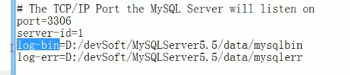

  * log-error

    * 默认是关闭的，记录严重的警告和错误信息，每次启动和关闭的详细信息等。

  * 查询日志log

    * 默认是关闭的，记录查询的sql语句，如果开启会降低mysql的整体性能，因为记录日志会耗费数据库资源。

    * ```mysql
      # my,cnf
      # 慢查询sql日志设置
      slow_query_log = 1
      slow_query_log_file = slow.log
      ```

  * 数据文件

    * 

    * ```bash
      # mysql5.7 使用.frm文件来存储表结构
      # 使用 .ibd文件来存储表索引和表数据
      -rw-r-----  1 mysql mysql   8988 Jun 25 09:31 pms_category.frm
      -rw-r-----  1 mysql mysql 245760 Jul 21 10:01 pms_category.ibd
      ```

    * `MySQL5.7`的`Innodb`存储引擎可将所有数据存放于`ibdata*`的共享表空间，也可将每张表存放于独立的`.ibd`文件的独立表空间。 **共享表空间以及独立表空间都是针对数据的存储方式而言的。**

      - 共享表空间: 某一个数据库的所有的表数据，索引文件全部放在一个文件中，默认这个共享表空间的文件路径在`data`目录下。 默认的文件名为`:ibdata1` 初始化为`10M`。
      - 独立表空间: 每一个表都将会生成以独立的文件方式来进行存储，每一个表都有一个`.frm`表描述文件，还有一个`.ibd`文件。 其中这个文件包括了单独一个表的数据内容以及索引内容，默认情况下它的存储位置也是在表的位置之中。在配置文件`my.cnf`中设置： `innodb_file_per_table`。

### 修改字符集

* mysql字符集

* 如果在建库建表的时候， 没有明确指定字符集， 则采用默认的字符集 latin1,其中是不包含中文字符的。 查看默认字符集

  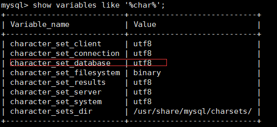

* 1、修改配置文件：【注意： **已经创建的数据库的设定不会发生变化， 参数修改只对新建的数据库有效！** 】（`MySQL5.7`配置文件位置是`/etc/my.cnf`或者`/etc/mysql/my.cnf`，如果字符集不是`utf-8`直接进入配置文件修改即可。）

  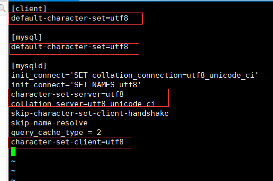

* 2、修改已创建库、 表字符集  
  * 修改数据库的字符集
    mysql> alter database mydb character set 'utf8';
    修改数据表的字符集
    mysql> alter table mytbl convert to character set 'utf8'  
* 3、修改已经乱码数据  
  * 无论是修改 mysql 配置文件或是修改库、 表字符集， 都无法改变已经变成乱码的数据。
    只能删除数据重新插入或更新数据才可以完全解决  


## mysql逻辑结构简介

* 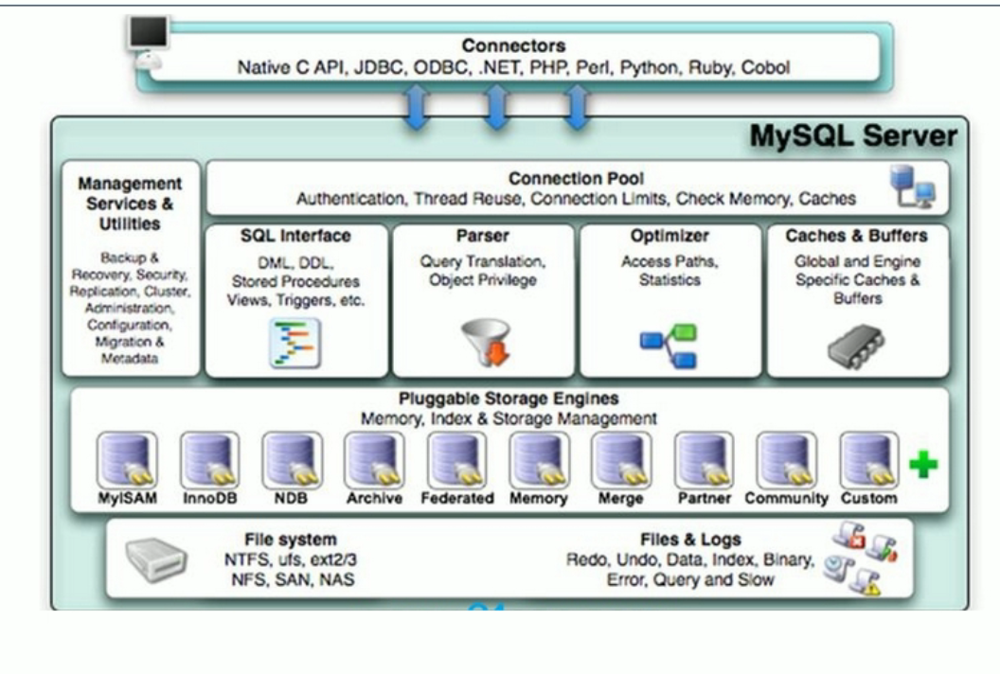

* 和其它数据库相比， MySQL 有点与众不同， 它的架构可以在多种不同场景中应用并发挥良好作用。 主要体现在存储引擎的架构上， **插件式的存储引擎架构将查询处理和其它的系统任务以及数据的存储提取相分离**。 这种架构可以根据业务的需求和实际需要选择合适的存储引擎  。
* `Connectors`：指的是不同语言中与sql的交互
* `Connection Pool`：管理缓冲用户连接，线程处理等需要缓存的需求。**MySQL数据库的连接层。**
* `Management Serveices & Utilities`：系统管理和控制工具。备份、安全、复制、集群等等。。
* `SQL Interface`：接受用户的SQL命令，并且返回用户需要查询的结果。
* `Parser`：SQL语句解析器。
* `Optimizer`：查询优化器，SQL语句在查询之前会使用查询优化器对查询进行优化。**就是优化客户端请求query**，根据客户端请求的 query 语句，和数据库中的一些统计信息，在一系列算法的基础上进行分析，得出一个最优的策略，告诉后面的程序如何取得这个 query 语句的结果。**For Example**： `select uid,name from user where gender = 1;`这个`select `查询先根据`where `语句进行选取，而不是先将表全部查询出来以后再进行`gender`过滤；然后根据`uid`和`name`进行属性投影，而不是将属性全部取出以后再进行过滤。最后将这两个查询条件联接起来生成最终查询结果。
* `Caches & Buffers`：查询缓存。
* `Pluggable Storage Engines`：**存储引擎接口。MySQL区别于其他数据库的最重要的特点就是其插件式的表存储引擎(注意：存储引擎是基于表的，而不是数据库)。**
* `File System`：数据落地到磁盘上，就是文件的存储。


### 逻辑架构分层

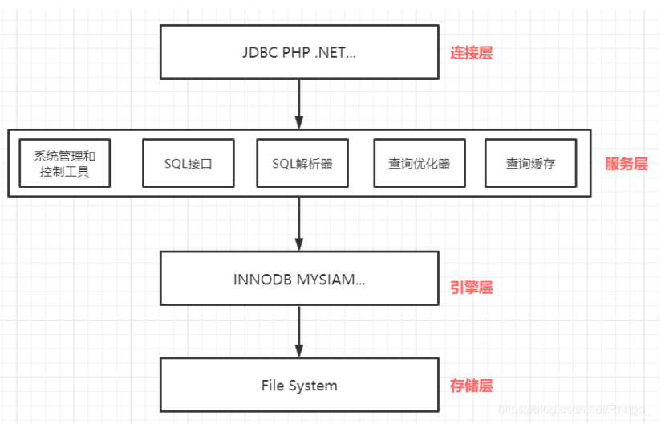

- 连接层：最上层是一些客户端和连接服务，包含本地sock通信和大多数基于客户端/服务端工具实现的类似于`tcp/ip`的通信。主要完成一些类似于连接处理、授权认证、及相关的安全方案。在该层上引入了线程池的概念，为通过认证安全接入的客户端提供线程。同样在该层上可以实现基于`SSL`的安全链接。服务器也会为安全接入的每个客户端验证它所具有的操作权限。
- 服务层：MySQL的核心服务功能层，该层是MySQL的核心，包括查询缓存，解析器，解析树，预处理器，查询优化器。主要进行查询解析、分析、查询缓存、内置函数、存储过程、触发器、视图等，select操作会先检查是否命中查询缓存，命中则直接返回缓存数据，否则解析查询并创建对应的解析树。
- 引擎层：存储引擎层，存储引擎真正的负责了MySQL中数据的存储和提取，服务器通过API与存储引擎进行通信。不同的存储引擎具有的功能不同，这样我们可以根据自己的实际需要进行选取。
- 存储层：数据存储层，主要是将数据存储在运行于裸设备的文件系统之上，并完成与存储引擎的交互。


## 存储引擎

### 查看命令

* `show engines;`命令查看MySQL5.7**支持的存储引擎**。

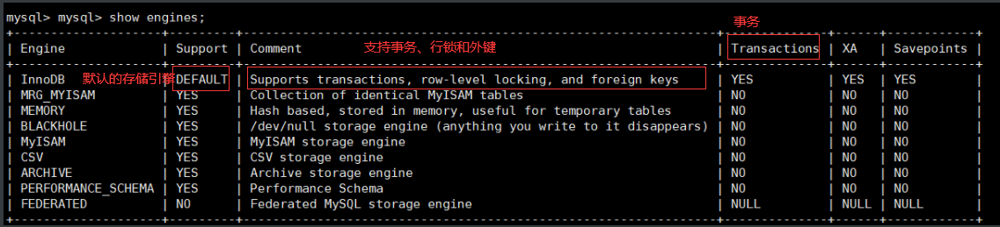

* `show variables like 'default_storage_engine%';`查看当前数据库**正在使用的存储引擎**。

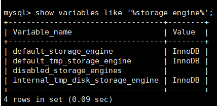


### InnoDB和MyISAM对比

| 对比项   | MyISAM                                                     | InnoDB                                                       |
| -------- | ---------------------------------------------------------- | ------------------------------------------------------------ |
| 主外键   | 不支持                                                     | 支持                                                         |
| 事务     | 不支持                                                     | 支持                                                         |
| 行表锁   | 表锁，即使操作一条记录也会锁住整张表，**不适合高并发操作** | 行锁，操作时只锁某一行，不对其他行有影响，**适合高并发操作** |
| 缓存     | 只缓存索引，不缓存真实数据                                 | 不仅缓存索引还要缓存真实数据，対内存要求较高，而且内存大小対性能有决定性影响 |
| 表空间   | 小                                                         | 大                                                           |
| 关注点   | 性能                                                       | 事务                                                         |
| 默认安装 | Y                                                          | Y                                                            |


## 索引优化分析

### SQL性能下降的原因

* 现象：执行时间长、等待时间长。
* 原因：
  * 查询语句写的烂：各种连接、子查询或者没用索引
  * 索引失效：索引建了但没用上。
  * 关联查询太多join（设计缺陷或不得已的需求）
  * 服务器调优及各个参数设置的不合理（缓冲、线程数等）。


### SQL执行顺序

* ```mysql
  1、FROM <left_table> <join_type> JOIN <right_table>  ON <join_condition> ## 操作哪些表
  2、WHERE <where_condition>
  3、GROUP_BY <group_by_list>
  4、HAVING <having_condition>
  5、SELECT DISTINCT <select_list>
  6、ORDER BY <order_by_condition>
  7、LIMIT <limit_number>
  ```

* 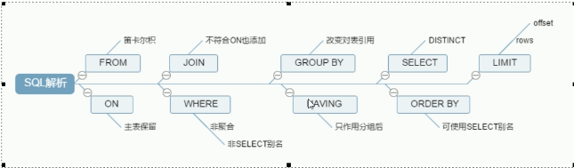


### 七种JOIN理论

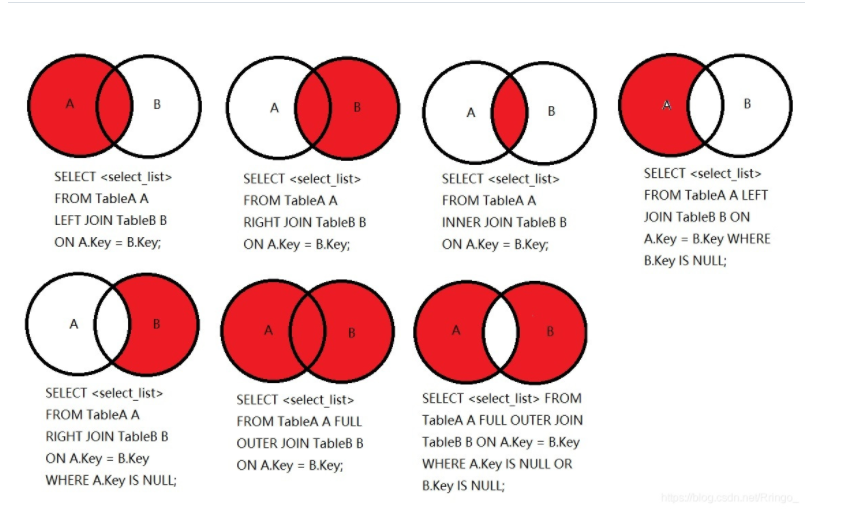

```mysql
## 1
select <select_list> from tablea a left join tableb b on a.key = b.key;
## 2
select <select_list> from tablea a right join tableb b on a.key = b.key;
## 3
select <select_list> from tablea a inner join tableb b on a.key = b.key;
## 4
select <select_list> from tablea a left join tableb b on a.key = b.key where b.key is null;
## 5
select <select_list> from tablea a right join tableb b on a.key = b.key where a.key is null;

## 6
select <select_list> from tablea a full outer join tableb on a.key = b.key;
/* MySQL不支持FULL OUTER JOIN这种语法 可以改成 1+2 */
select <select_list> from tablea a left join tableb b on a.key = b.key
union # 这里有个知识点，就是union 是默认并集去重， union all 是默认并集不去重
select <select_list> from tablea a right join tableb b on a.key = b.key;

## 7
SELECT <select_list> FROM TableA A FULL OUTER JOIN TableB B ON A.Key = B.Key WHERE A.Key IS NULL OR B.Key IS NULL;
/* MySQL不支持FULL OUTER JOIN这种语法 可以改成 4+5 */
select <select_list> from tablea a left join tableb b on a.key = b.key where b.key is null
union
select <select_list> from tablea a right join tableb b on a.key = b.key where a.key is null;
```


### 索引简介

* mysql官方定义：索引是帮助mysql高效获取数据的数据结构。**索引的本质：索引是数据结构。**【简单理解：**排好序的快速查找数据结构**】
* 索引的目的在于提高查询效率，可以类比字典。 
* **重点：索引会影响到MySQL查找(WHERE的查询条件)和排序(ORDER BY)两大功能！**
* **在数据之外，数据库系统还维护着满足特定查找算法的数据结构，这些数据结构以某种方式引用数据，这样就可以再这些数据结构的基础上实现高级查找算法。这种数据结构就是索引。**下图就是一种可能的索引方式示例：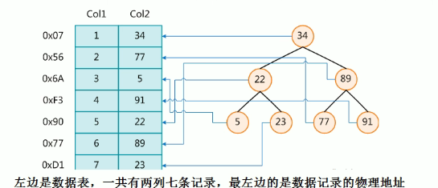

为了加快Col2的查找，可以维护一个右边所示的二叉查找树，每个结点分别包含索引键值和一个指向对应数据记录物理地址的指针，这样就可以运用二叉查找在一定的复杂度内获取到相应数据，从而快速的检索出符合条件的记录。

* 一般来说，索引本身也很大，不可能全部存储在内存中，因此索引往往以索引文件的形式存储在磁盘上。
* **我们平时所说的索引，如果没有特别指明，都是指B树（多路搜索树，并不一定是二叉的）结构组织的索引。**其中聚集索引，次要索引，覆盖索引，复合索引，前缀索引，唯一索引默认都是使用B+树索引，统称索引。当然，除了B+树这种数据结构的索引之外，还有哈希索引（Hash Index）等。

#### 索引优势和劣势

* 优势：
  * 类似大学图书馆建书目索引，提高数据检索的效率，**降低数据库的IO成本**【IO读取次数降低】
  * 通过索引列对数据进行排序，降低数据排序的成本，降低了CPU的消耗。【索引已经对数据进行了排序】
* 劣势：
  * 实际上索引也是一张表，该表保存了主键与索引字段，并指向实体表的记录，所以索引列也是要占用空间的。
  * 虽然索引大大提高了查询速度，但同时会降低更新表的速度，如对表进行INSERT、UPDATE和DELETE。因为更新表时，MYSQL不仅要保存数据，还要让索引文件保存每次更新或添加的索引列数据，都会调整因为更新所带来的键值变化后的索引信息。
  * 索引只是提高效率的一个因素，如果mysql中有大数据量的表，就需要花时间研究建立最优秀的索引，或优化查询条件。


#### 索引分类

* 单值索引：即一个索引只包含单个列，一个表可以有多个单列索引

* 唯一索引：索引列的值必须唯一，但允许有空值。

* 复合索引：即一个索引包含多个列。

* 基本语法：

  * 创建

    * create [unique] index indexname on mytable(columnname(type));
    * alter mytable add [unique] index [indexname] on (columnname(type))

  * 删除

    * drop index [indexname] on mytable

  * 查看

    * show index from table_name\G

  * 使用ALTER命令

    

**建议：一张表建的索引最好不要超过5个！**


#### 索引的数据结构

* BTree索引
* Hash索引
* full-text全文索引
* R-tree索引

**B+-Tree的结构**

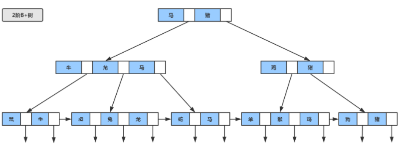

* 每个树节点可以看成一个磁盘块，每个磁盘块包含几个数据项和指针。
* 非叶子结点不存储真实的数据，只存储指引搜索方向的数据项【非叶子节点相当于叶子节点的索引，叶子节点相当于是存储（关键字）数据的数据层。】
* 所有关键字都存储在叶子节上，且链表中的关键字恰好是有序的。

B+树的查找过程，与B树类似，只不过查找时，**如果在非叶子节点上的关键字等于给定值，并不终止，而是继续沿着指针直到叶子节点位置。因此在B+树，不管查找成功与否，每次查找都是走了一条从根到叶子节点的路径。**

真实的情况下，3层的b+树可以表示上百万的数据，如果上百万的数据查找只需要三次IO，性能提高将是巨大的，如果没有索引，每个数据项都要发生一次IO，那么总共需要百万次的IO，显然成本非常高。


#### 哪些情况下建立索引

* 主键自动建立主键索引（唯一 + 非空）。
* 频繁作为查询条件的字段应该创建索引
* 查询中与其他表关联的字段，外键关系建立索引
* 单键/组合索引的选择问题，who？
  * 高并发下倾向创建组合索引
* 查询中排序的字段，排序字段若通过索引去访问将大大提高排序速度
* 查询中统计或者分组字段（group by也和索引有关）。


#### 哪些情况下不要建立索引

* 表记录太小，表记录3百万往上mysql速度才会开始降低

* 经常增删改的表

* 频繁更新的字段不适合建立索引

  * 因为每次更新不单单是更新记录还会更新索引

* where条件里用不到的字段不创建索引

* 数据重复且分布平均的表字段不应建，因此应该只为最经常查询和最经常排序的数据列建立索引。

  注意：**如果某个数据列包含许多重复的内容，为它建立索引就没有太大的实际效果。**


### 性能分析

* MySql Query Optimizer
  * 1 Mysql中有专门负责优化SELECT语句的优化器模块，主要功能:通过计算分析系统中收集到的统计信息，为客户端请求的Query提供他认为最优的执行计划（他认为最优的数据检索方式，但不见得是DBA认为是最优的，这部分最耗费时间)
  * 2当客户端向MySQL请求一条Query，命令解析器模块完成请求分类，区别出是SELECT并转发给MySQLQuery Optimizer时，MySQL Query Optimizer首先会对整条Query进行优化，处理掉一些常量表达式的预算，直接换算成常量值。并对Query中的查询条件进行简化和转换，如去掉一些无用或显而易见的条件、结构调整等。然后分析Query中的 Hint 信息(如果有)，看显示Hint信息是否可以完全确定该Query的执行计划。如果没有Hint或Hint 信息还不足以完全确定执行计划，则会读取所涉及对象的统计信息，根据Query进行写相应的计算分析，然后再得出最后的执行计划。
* MySQL常见瓶颈
  * cpu：cpu饱和一般发生在数据装入内存或从磁盘上读取数据时候
  * io：磁盘i/o瓶颈发生在装入数据远大于内存容量的时候
  * 服务器硬件的性能瓶颈：top,free,iostat和vmstat来查看系统的性能状态。

#### Explain【查看执行计划】

* 定义：使用EXPLAIN关键字可以模拟优化器执行SQL查询语句，从而知道MYSQL是如何处理你的SQL语句的。分析你的查询语句或是表结构的性能瓶颈。
* EXPLAIN怎么使用？：语法：`explain` + `SQL`。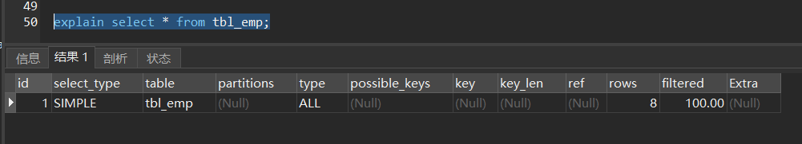

* EXPLAIN能干嘛？
* 可以查看以下信息：
  - `id`：**表的读取顺序**。【id大的先执行】
  - `select_type`：数据读取操作的**操作类型**。
  - `possible_keys`：哪些索引可以使用。
  - `key`：哪些索引被实际使用。
  - `ref`：表之间的引用。
  - `rows`：每张表有多少行被优化器查询。

##### Explain字段

* **id：表的读取和加载顺序。**
  * 有三种情况 id值都相同，id值都不同，id值既有相同的又有不同的。
  * `id`相同，执行顺序由上至下。
  * `id`不同，如果是子查询，id的序号会递增，**id值越大优先级越高，越先被执行。**
  * `id`相同不同，同时存在。**永远是id大的优先级最高，id相等的时候顺序执行。**
    - 可能存在衍生表的情况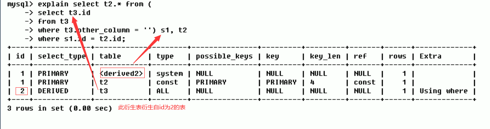

* **select_type：数据查询的类型，主要是用于区别，普通查询、联合查询、子查询等的复杂查询。**
  * `SIMPLE`：简单的`SELECT`查询，查询中不包含子查询或者`UNION `。
  * `PRIMARY`：查询中如果包含任何复杂的子部分，最外层查询则被标记为`PRIMARY`。
  * `SUBQUERY`：在`SELECT`或者`WHERE`子句中包含的子查询。
  * `DERIVED`：在`FROM`子句中包含的子查询被标记为`DERIVED(衍生)`，MySQL会递归执行这些子查询，把结果放在临时表中。
  * `UNION`：如果第二个`SELECT`出现在`UNION`之后，则被标记为`UNION`；若`UNION`包含在`FROM`子句的子查询中，外层`SELECT`将被标记为`DERIVED`。
  * `UNION RESULT`：从`UNION`最终合并结果表获取结果的`SELECT`。

* `type`：访问类型排列。

**从最好到最差依次是**：`System`>`const`>`eq_ref`>`ref`>`range`>`index`>`ALL`

**一般来说，得保证查询至少达到`range`级别，最好达到`ref`。**

- `system`：表只有一行记录（等于系统表），这是`const`类型的特例，平时不会出现，这个也可以忽略不计。
- `const`：表示通过索引一次就找到了，`const`用于比较`primary key`或者`unique`索引。因为只匹配一行数据，所以很快。如将主键置于`where`列表中，MySQL就能将该查询转化为一个常量。
- `eq_ref`：唯一性索引扫描，读取本表中和关联表表中的每行组合成的一行，查出来只有一条记录。除 了 `system` 和` const` 类型之外, 这是最好的联接类型。【const相当于单表中的主键id，一个条件，ref——eq是联表唯一】
- `ref`：非唯一性索引扫描，返回本表和关联表某个值匹配的所有行，查出来有多条记录。
- `range`：只检索给定范围的行，一般就是在`WHERE`语句中出现了`BETWEEN`、`< >`、`in`等的查询。这种范围扫描索引比全表扫描要好，因为它只需要开始于索引树的某一点，而结束于另一点，不用扫描全部索引。
- `index`：`Full Index Scan`，全索引扫描，`index`和`ALL`的区别为`index`类型只遍历索引树。**也就是说虽然`ALL`和`index`都是读全表，但是`index`是从索引中读的，`ALL`是从磁盘中读取的。**
- `ALL`：`Full Table Scan`，没有用到索引，全表扫描。


* possible_keys 和 key
  * `possible_keys`：显示可能应用在这条SQL中的索引，一个或者多个。查询涉及到的字段上若存在索引，则该索引将被列出，**但不一定被查询实际使用。**
  * `key`：实际使用的索引。如果为`NULL`，则没有使用索引。**查询中如果使用了覆盖索引，则该索引仅仅出现在`key`列表中。**【直接由索引查询到数据 不用回表过程 查询结果受索引覆盖】

* key_len：
  * 表示**SQL语句所用索引的字节数**，可通过该列计算查询中使用的索引的长度。`key_len`显示的值为索引字段的最大可能长度，**并非实际使用长度**，即`key_len`是根据表定义计算而得，不是通过表内检索出的。在不损失精度的情况下，长度越短越好。【**key_len:查询用到的索引长度（字节数）。key_len只计算where条件用到的索引长度，而排序和分组就算用到了索引，也不会计算到key_len中**。】
  * `key_len`计算规则：**https://blog.csdn.net/qq_34930488/article/details/102931490**

* ref：
  * 显示索引的哪一列被使用了，如果可能的话，是一个常数。哪些列或常量被用于查找索引列上的值。

//TODO 感觉讲的不好就不往下看了 尚硅谷mysql高级

## 查询截取分析

## mysql锁机制

## 主从复制

