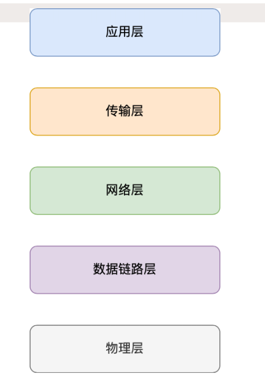

# 图解网络 基础篇

## TCP/IP 网络模型

* 不同设备间的进程需要通信，要兼容多种多样的设备，就协商出了⼀套通⽤的⽹络协议。  
* 且这个⽹络协议是分层的，每⼀层都有各⾃的作⽤和职责  
* 应用层
  * 应⽤层只需要专注于为⽤户提供应⽤功能，不⽤去关⼼数据是如何传输的  
* 传输层
  * 为应用层提供网络支持。作为应⽤间数据传输的媒介，帮助实现应⽤到应⽤的通信  。
  * 传输层会有两个传输协议，分别是 TCP 和 UDP  
  * TCP 的全称叫传输层控制协议（Transmission Control Protocol），⼤部分应⽤使⽤的正是 TCP 传输层协议，⽐如 HTTP 应⽤层协议。 TCP 相⽐ UDP 多了很多特性，**⽐如流量控制、超时重传、拥塞控制等，这些都是为了保证数据包能可靠地传输给对⽅。**  
  * UDP 就相对很简单，简单到**只负责发送数据包，不保证数据包是否能抵达对⽅，但它实时性相对更好，传输效率也⾼。**  
  * 当传输层的数据包⼤⼩超过 MSS（TCP 最⼤报⽂段⻓度） ，就要将数据包分块 ，把每个分块称为⼀个 TCP 段（TCP Segment）。
  * 端口用于将同一台设备上的不同应用区分开来，**传输层报文的会携带端口号，因此接收方可以识别出报文是发送给哪个应用。**
* 网络层
  * ⽹络层负责将数据从⼀个设备传输到另⼀个设备
  * 通过ip地址区分不同设备
    * IP 地址分成两种意义：  
      * 网络号：表示ip地址属于哪个子网
      * 主机号：表示同一子网下的某个主机
    * 配合子网掩码才能算出IP地址的网络号和主机号。
    * 除了寻址能⼒， IP 协议还有另⼀个重要的能⼒就是路由 
    *  IP 协议的寻址作⽤是告诉我们去往下⼀个⽬的地该朝哪个⽅向⾛，路由则是根据「下⼀个⽬的地」选择路
      径。寻址更像在导航，路由更像在操作⽅向盘  
  * ⽹络层最常使⽤的是 IP 协议（Internet Protocol）， **IP 协议会将传输层的报⽂作为数据部分，再加上 IP 包头组装成 IP 报⽂**，如果 IP 报⽂⼤⼩超过 MTU（以太⽹中⼀般为 1500 字节）就会再次进⾏分⽚，得到⼀个即将发送到⽹络的 IP 报⽂。  
* 数据链路层
  * 专⻔的层来**标识⽹络中的设备**，让数据在⼀个链路中传输，这就是数据链路层（Data LinkLayer），它主要为⽹络层提供链路级别传输的服务。  
  * **每⼀台设备的⽹卡都会有⼀个 MAC 地址，它就是⽤来唯⼀标识设备的。**
  * 路由器计算出了下⼀个⽬的地 IP 地址，再通过 ARP 协议找到该⽬的地的 MAC 地址，这样就知道这个 IP 地址是哪个设备的了。 
* 物理层
  * 将数据链路层的传下来的数据包转化为电信号，再让其可以在物理介质中传输。
  * 这⼀层就是物理层（Physical Layer），它主要是为数据链路层提供⼆进制传输的服务。  
* 总结：
  * 综上所述，⽹络协议通常是由上到下，分成 5 层没，分别是应⽤层，传输层，⽹络层，数据链路层和物理层  

