# 多线程

## 1.0本章核心概念

- **线程就是独立的执行路径；**

- 在线程运行时，即使没有自己创建线程，后台也会有多个线程，如**主线程，gc线程**；

- main()称之为主线程，为系统的入口，用于执行整个程序；

- 在一个进程中，如果开辟了多个线程，**线程的运行由调度器安排调度**，调度器是与操作系统紧密相关的，先后顺序是不能人为的干预的。

- 对同一份资源操作时，会存在资源抢夺的问题，需要加入并发控制；

- 线程会带来额外的开销，**如cpu调度时间，并发控制开销**。

- 每个线程在自己的工作内存交互，内存控制不当会造成数据不一致

  ## 创建线程对象方法

  ## 1.Thread

  - 自定义线程类继承Thread类
  - 重写run（）方法，编写线程执行体
  - 创建线程对象，调用start（）方法启动线程

```
//创建线程方式一：继承thread类，重写run（）方法，调用start开启线程  调用run方法则不开启
    //总结：注意，线程开启不一定立即执行，由CPU调度执行
public class ThreadDemo01 extends Thread {
    @Override
    public void run() {//run方法线程体
        for (int i = 0; i <100; i++) {
            System.out.println("多线程被执行了");
        }
    }

    public static void main(String[] args) {
        //main线程，主线程
        //创建一个线程对象
        ThreadDemo01 td1 = new ThreadDemo01();
        td1.start();//调用start方法开启线程
        for (int i = 0; i <1000 ; i++) {
            System.out.println("每天都在学习java");
        }
    }
}
```

## 2.Runnable接口

```
public class ThreadDemo03 implements Runnable{
    @Override
    public void run() {
        for (int i = 0; i <200 ; i++) {
            System.out.println("多线程被执行了");
        }
    }

    public static void main(String[] args) {
        new Thread(new ThreadDemo03()).start();
        for (int i = 0; i <1000 ; i++) {
            System.out.println("每天都在学习java");
        }
    }
}
```

### 小结

- **继承Thread类**
  - 子类继承Thread类具备多线程能力
  - 启动线程：子类对象.start（）
  - 不建议使用：避免OOP**单继承局限性**
- **实现Runnable接口**

实现接口Runnable具有多线程能力

启动线程：传入目标对象+Thread对象.start ()

-推荐使用：避免单继承局限性，灵活方便，方便同一对象被多个线程使用

### 实例

```java
public class ThreadDemo04 implements Runnable{
    private static String winner;//胜利者
    @Override
    public void run() {
        for (int i = 0; i <=100 ; i++) {
            //模拟兔子休息
            if(Thread.currentThread().getName().equals("兔子")&& i%20==0){
                try {
                    Thread.sleep(10);
                } catch (InterruptedException e) {
                    e.printStackTrace();
                }
            }

            //判断是否结束比赛
                boolean flag=gameOver(i);
            //如果比赛结束了，停止程序
            if(flag){
                break;
            }
            System.out.println(Thread.currentThread().getName()+"-->跑了"+i+"步");
        }
    }
    //判断是否完成比赛
    private boolean gameOver(int steps){
      //判断是否有胜利者
      if(winner!=null){
          return true;
      }  {
          if (steps>=100){
              winner=Thread.currentThread().getName();
              System.out.println("winner is:"+winner);
              return true;
          }
        }
      return false;
    }
    public static void main(String[] args) {
        new Thread(new ThreadDemo04(),"兔子").start();
        new Thread(new ThreadDemo04(),"乌龟").start();
    }
}
```

## 3.实现Callable接口

1. 实现Callable接口，需要返回值类型
2. 重写call方法，需要抛出异常
3. 创建目标对象
4. 创建执行服务：ExecutorService ser =Executor.newFixedThreadPool(1);
5. 提交执行：Future< Boolean >result1=ser.submit(t1); //开始执行线程  //Boolean为对应call方法返回的类型
6. 获取结果：boolean r1=result.get()//线程执行完毕返回的结果
7. 关闭服务：ser.shutdownNow();

Callable接口好处：定义返回类型、可以抛出异常

## 静态代理模式总结

真实对象和代理对象都要实现同一个接口

代理对象要代理真实角色

好处：

代理对象可以做很多真实对象做不了的事情

真实对象专注做自己的事情

线程也使用了代理模式 如实现Runnable接口方式中，真实对象为Runnable的实现类，代理对象为Thread

示例 new Thread(new Runnable{run()}).start();

## Lambda表达式

**注：对应接口应为函数时接口**

避免匿名内部类定义过多

其实质属于函数式编程的概念

可以让代码看起来很简洁

去掉了一堆没有意义的代码，只留下核心的逻辑

## 函数式接口

Functional Interface（函数式接口）

定义：

**任何接口，如果只包含唯一一个抽象方法，那么它就是一个函数式接口。**

对于函数式接口，可以通过lambda表达式来创建该接口的对象。

```java
//定义一个接口,只有一个方法，函数式接口
interface ILove{
    void ILove(int a);
}
    //1.普通实现
class Love implements ILove {
        @Override
    public void ILove(int a) {
        System.out.println("i like lambda" + a);
    }
}
public class TestLambda2 {
    public static void main(String[] args) {
        //lambda表达式方式 函数式接口只有一个方法
        YouLove youLove=(a,b)->{
            System.out.println("一句话你说:"+a+b);
        };
        youLove.youLove(10,20);
    }
}

interface YouLove{
    void youLove(int a,int b);
}
```

总结：

1. **lambda表达式只能有一行代码的情况下才能简化为一行，如果有多行，那么就用代码块包裹**
2. **前提是接口为函数式接口**
3. **多个参数也可以去掉参数类型，要去掉就都去掉，必须加上括号。**

## 多线程详解

### 线程状态

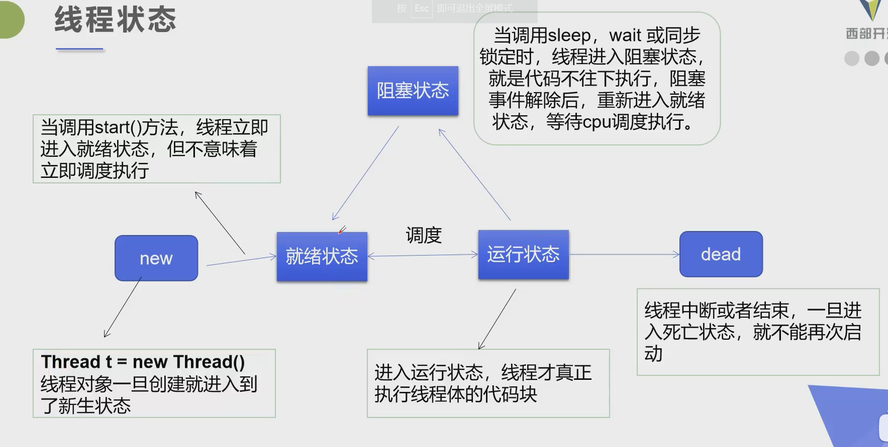

### 线程方法

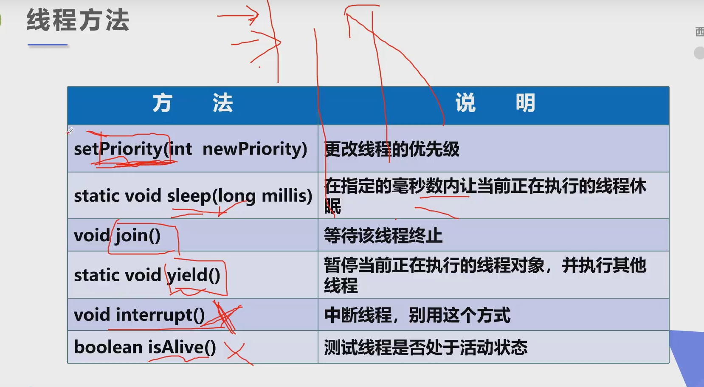

### 线程停止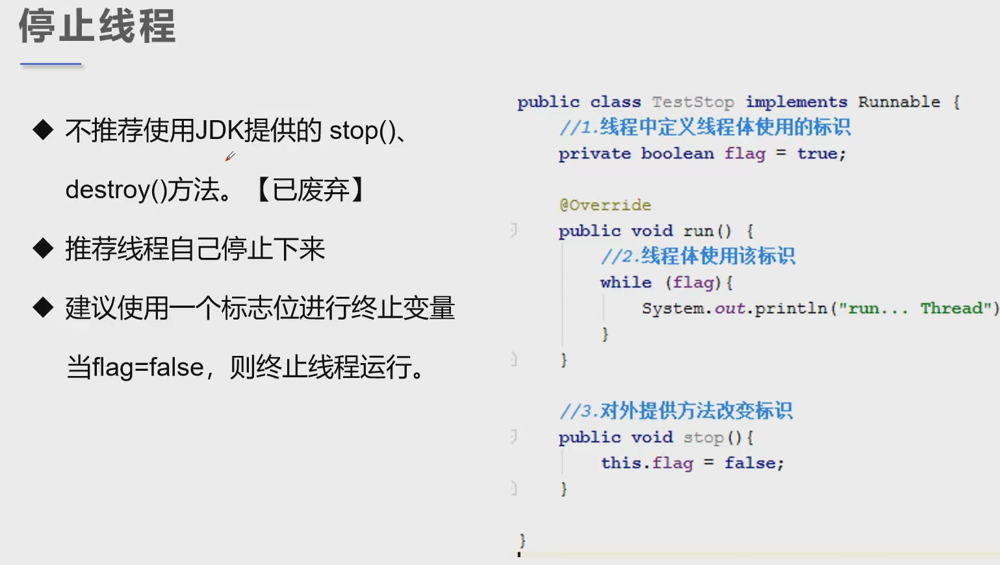

示例代码

```java
线程停止
public class TestStop implements Runnable {
    //标志位
    private boolean flag=true;
    @Override
    public void run() {
        int i=0;
        while (flag){
            System.out.println("run.....Thread"+(i++));
        }
    }
    //手动设置线程停止
    public void stop(){
        this.flag=false;
    }
​
    public static void main(String[] args) {
        TestStop testStop = new TestStop();
        new Thread(testStop).start();
    //1000.for 回车
        for (int i = 0; i <1000 ; i++) {
            //主线程运行
            System.out.println("main"+i);
            if (i==900){
                //设置线程停止时间
                testStop.stop();
                System.out.println("线程停止了！");
            }
        }
    }
}
```

### 线程休眠

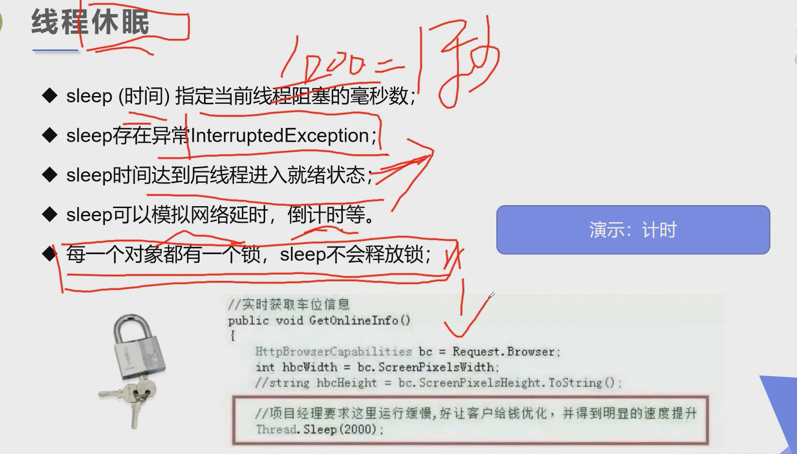

代码示例：

```java
public class TestSleep1 {
    public static void main(String[] args) {
    tenDown();
    //打印当前系统时间
        Date startTime=new Date(System.currentTimeMillis());//获取当前系统时间
        while (true){
            try {
                Thread.sleep(1000);
                System.out.println(new SimpleDateFormat("HH:mm:ss").format(startTime));
                startTime=new Date(System.currentTimeMillis());//更新时间
            } catch (InterruptedException e) {
                e.printStackTrace();
            }
        }
    }
    //模拟倒计时
    public static void tenDown(){
        int num=10;
        while (true){
            try {
                Thread.sleep(1000);
                if (num<=0){
                    break;
                }else{
                    System.out.println("倒计时！！！"+num--+"秒");
                }
            } catch (InterruptedException e) {
                e.printStackTrace();
            }
        }
    }
}
```

### 线程礼让

**礼让线程，让当前正在执行的线程暂停，但不阻塞**

**将线程从运行状态转为就绪状态，准备被cpu调用**

**让cpu重新调度，礼让不一定成功！看CPU心情。cpu可能调用到刚礼让的线程**

代码示例

```java
public class TestYield implements Runnable {
    public static void main(String[] args) {
        TestYield yield=new TestYield();
        new Thread(yield,"a").start();
        new Thread(yield,"b").start();
    }
    @Override
    public void run() {
        System.out.println(Thread.currentThread().getName()+"线程开始执行");
        Thread.yield();//礼让 此时当前正在运行的线程转为就绪状态
        System.out.println(Thread.currentThread().getName()+"线程停止执行");
    }
}
```

### join

join合并线程，**待此线程执行完成后，再执行其他线程，其他线程阻塞**

可以想象成插队

示例代码

```java
public class TestJoin implements Runnable {
    @Override
    public void run() {
        for (int i = 0; i <100 ; i++) {
            System.out.println("VIP线程来插队了！！！"+i);
        }
    }


        public static void main(String[] args) throws InterruptedException {
           Thread thread= new Thread(new TestJoin());

            for (int i = 0; i <400 ; i++) {
                System.out.println("主线程在排队！！！"+i);
                if (i==100){
                    thread.start();//开启另一个线程 让其能被cpu调度
                    thread.join();//插队进行且主线程阻塞
即cpu一直调用该线程直至该线程运行完毕
            }
        }
    }
}
```

### 线程状态观测

Thread.State

线程状态，线程可以处于一下状态之一：

- new 尚未启动的线程处于此状态
- Runnable 在java虚拟机中执行的线程处于此状态
- Blocked 被阻塞等待监视器锁定的线程处于此状态。
- Waiting 正在等待另一个线程执行特定动作的线程处于此状态。
- **Timed Waiting 正在等待另一个线程执行动作达到指定等待时间的线程处于此状态。 示例代码中为子线程等待父线程执行动作达到指定的等待时间**
- **Terminated 已退出的线程处于此状态。**

一个线程可以给定时间点处于一个状态。这些状态是不反映任何操作系统线程状态的虚拟机状态

```java
public class TestState {
    public static void main(String[] args) throws InterruptedException {
        //对应的Lambda表达式为Runnable的实现类
        //与new Thread(new Runnable(){
      //  void run(){
   //         for(){ ....}
   //     }
  //  });相同
        Thread thread=new Thread(()->{
            for (int i = 0; i <5 ; i++) {
                try {
                    Thread.sleep(1000);

                } catch (InterruptedException e) {
                    e.printStackTrace();
                }
            }
            System.out.println("////////////////");
        });
        Thread.State state = thread.getState();
        System.out.println(state);//new
        thread.start();//启动线程
        state=thread.getState();//runnable
        System.out.println(state);
        while (state!= Thread.State.TERMINATED){//只要线程不终止就输入线程状态
            Thread.sleep(100);//主线程休眠
            state=thread.getState();
            System.out.println(state);
        }
    }
}
```

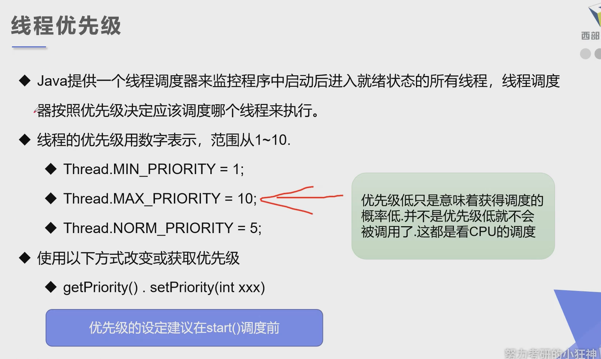

### 线程优先级

java提供一个线程调度器来监控程序中启动后进入就绪状态的所有线程，线程调度器按照优先级决定应该调度哪个线程来执行。

线程的优先级用数字表示，范围从1~10。

使用以下方式改变或获取优先级

getPriority().setPriority(int xxx)

```
public class TestPriority {
    public static void main(String[] args) {
        MyPriority myPriority = new MyPriority();
        Thread t1 = new Thread(myPriority);
        Thread t2 = new Thread(myPriority);
        Thread t3 = new Thread(myPriority);
        Thread t4 = new Thread(myPriority);
        Thread t5 = new Thread(myPriority);
        Thread t6 = new Thread(myPriority);
        //先设置线程优先级
        t1.setPriority(1);
        t1.start();
        t2.setPriority(3);
        t2.start();
        t3.setPriority(6);
        t3.start();
        t4.setPriority(Thread.MAX_PRIORITY);//  优先级=10
        t4.start();
        t5.setPriority(Thread.MIN_PRIORITY);// 优先级=1
        t6.setPriority(9);
        t6.start();

        System.out.println("main");
    }
}
class MyPriority implements Runnable{

    @Override
    public void run() {
        System.out.println(Thread.currentThread().getName()+"---线程被执行了！---"+Thread.currentThread().getPriority());
    }
}
```

**注意：先设置优先级，再start线程！！！优先级不一定先执行，只是被cpu执行的概率上升了**


### 守护（daemon）线程

- 线程分为用户线程和守护线程

- 虚拟机必须确保用户线程执行完毕

- 虚拟机不用等待守护线程执行完毕 **用户线程执行完毕后虚拟机关闭 守护线程也就关闭了**

- 如，后台记录操作日志，监控内存，垃圾回收等待。。。

- ```java
  public class TestDaemon {
      public static void main(String[] args) {
          God god = new God();
          You you=new You();
          Thread thread = new Thread(god);
          thread.setDaemon(true);//默认为flase 为用户线程，  true为守护线程
          thread.start();//开启守护线程 
          new Thread(you).start();
      }
  }
  class God implements Runnable{
  
      @Override
      public void run() {
          while (true){
              System.out.println("上帝守护着你-------");
          }
      }
  }
  class You implements Runnable{
  
      @Override
      public void run() {
          for (int i = 0; i <36500 ; i++) {
              System.out.println("开心着活着每一天------");
          }
          System.out.println("----goodbye!Beautiful World!!!------");
  
      }
  }
  ```

### 线程同步机制

线程同步

- 由于同一进城的多个线程共享同一块存储空间，在带来方便的同事，也带来了访问冲突问题，为了保证数据在方法中被访问时的正确性，在访问时加入锁机制synchronized，当一个线程获得对象的排它锁，独占资源，其他线程必须等待，使用后释放锁即可，存在以下问题：

- 一个线程持有锁会导致其它所有需要此锁的线程挂起；
- 在多线程竞争下，加锁，释放锁会导致比较多的上下文切换和调度延时，引起性能问题；
- 如果一个优先级高的线程等待一个优先级低的线程释放锁，会导致优先级倒置，引起性能问题。

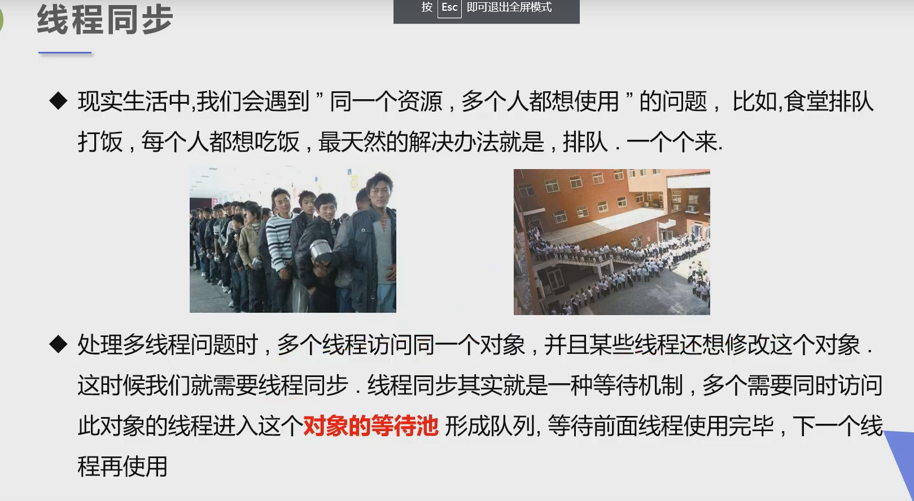

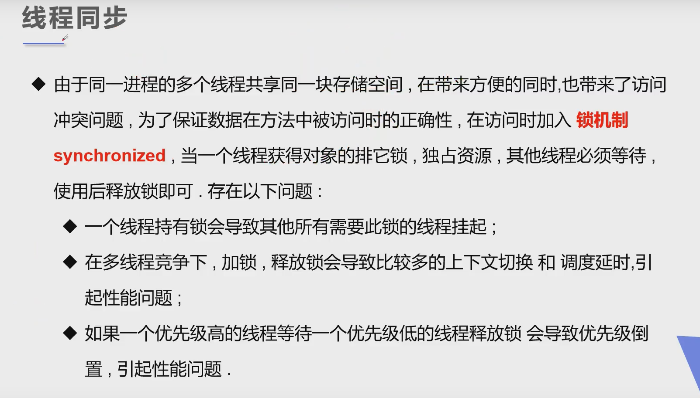

### 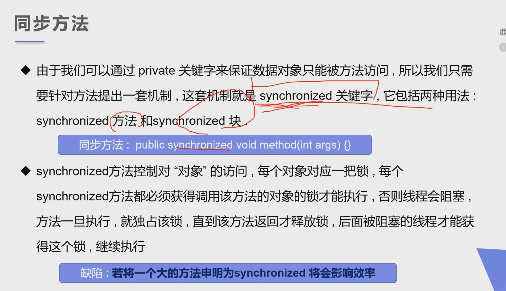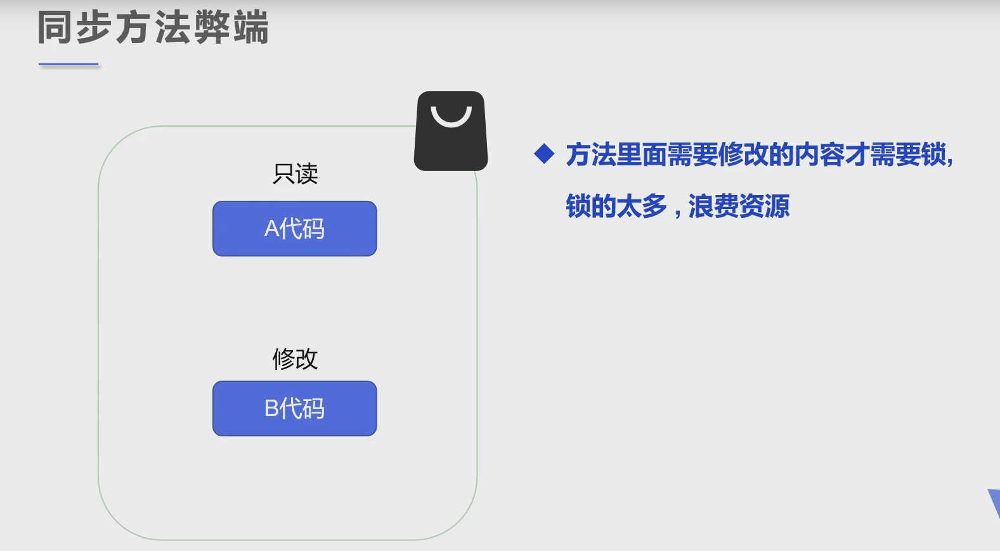线程锁


同步块

Synchronized(Obj){}

Obj称之为同步监视器

- Obj可以是任何对象，但是推荐使用共享资源作为同步监视器
- 同步方法中无需指定同步监视器，因为同步方法的同步监视器就是this,就是这个对象本身，或者是class【反射中讲解】
- **synchronized可以保证在同一个时刻，只有一个线程可以执行某个方法或者某个代码块(主要是对方法或者代码块中存在共享数据的操作)**

同步监视器的执行过程：

1. 第一个线程访问，锁定同步监视器，执行其中代码
2. 第二个线程访问，发现同步监视器被锁定，无法访问
3. 第一个线程访问完毕，皆出同步监视器
4. 第二个线程访问，发现同步监视器没有锁

```java
//不安全的买票 票可能为负数
public class UnsafeButTicket {
    public static void main(String[] args) {
        BuyTicket bt=new BuyTicket();
        new Thread(bt,"我").start();
        new Thread(bt,"你").start();
        new Thread(bt,"黄牛党").start();
    }
}

class BuyTicket implements Runnable{
    //票
    private int ticketNums=10;
     boolean flag=true;//外部停止方式
    @Override
    public void run() {
        //买票
        while (flag){
            buy();
        }
    }


    public synchronized void buy(){//锁了方法，相当于this   把当前类实例给锁住 执行完该方法才会解锁 其他线程不可访问当前类实例 操作完后解锁 更新后的类实例刷新到主存中，其他线程运行时会从主存中调用最新的类实例并重复锁和解锁操作
 //一旦对象被锁住 如果线程已进入那个对象则线程会在对应对象的某个位置暂停执行等待对象解锁继续执行

        //判断是否有票
        if(ticketNums<=0){
            System.out.println("票没了");
            flag=false;
            return ;
        }
        //模拟延时 放大问题发生概率 sleep不会释放锁 wait会
        try {
            Thread.sleep(100);
        } catch (InterruptedException e) {
            e.printStackTrace();
        }
        System.out.println(Thread.currentThread().getName()+ticketNums--);
    }
}
//不安全取钱
    //两个人去银行取钱，账户
public class UnsafeBank {
    public static void main(String[] args) {
        //账户
        Account account=new Account(100,"结婚基金");
        Drawing you=new Drawing(account,50,"你");
        Drawing girlFriend=new Drawing(account,100,"女朋友");
        you.start();
        girlFriend.start();
    }
}
//账户
class Account{
    int money;//余额
    String name;//卡名

    public Account(int money, String name) {
        this.money = money;
        this.name = name;
    }
}
//银行：模拟取款
class Drawing extends Thread{
    Account account;//账户
    //取了多少钱；
    int drawingMoney;
    //现在手里又多少钱
    int nowMoney;
    public Drawing(Account account,int drawingMoney,String name){
        super(name);//调用父类的构造函数 设置线程名
        this.account=account;
        this.drawingMoney=drawingMoney;

    }
    //取钱

    @Override
    public void run() {
        synchronized (account) {//锁的对象是变化的量，锁需要增删改的对象
            //判断有没有钱
            if (account.money - drawingMoney <= 0) {
                System.out.println(Thread.currentThread().getName() + "钱不够");
                return;
            }
            //卡内余额
            account.money -= drawingMoney;
            //手里的钱
            nowMoney += drawingMoney;
            System.out.println(account.name + "余额为:" + account.money);
            System.out.println(this.getName() + "手里的钱:" + nowMoney);
        }
    }
}
public class UnsafeList {
    public static void main(String[] args) {
        ArrayList<String> list=new ArrayList<String>();
        for (int i = 0; i <1000 ; i++) {
            new Thread(()->{
                synchronized (list){
                    list.add(Thread.currentThread().getName());
                }
            }).start();
            try {
                //主线程休眠 确保其他线程执行完毕即写入集合数据
                Thread.sleep(30);
            } catch (InterruptedException e) {
                e.printStackTrace();
            }
        }
        System.out.println(list.size());
    }
}
```


### 死锁避免方法

产生死锁的四个必要条件：

1.互斥条件：一个资源每次只能被一个进程使用。

2.请求与保持条件：一个进程因请求资源而阻塞时，对已获得的资源保持不妨。

3.不剥夺条件：进程已获得的资源，在未使用完之前，不能强行剥夺。

4.循环等待条件：若干进程之间形成一种头尾相接的循环等待资源关系。

**只要破除任意一个就能避免死锁**

### Lock锁

- JDK5.0开始，java提供了更强大的线程同步机制——通过显式定义同步锁对象来实现同步。**同步锁使用Lock对象充当**

- java.util.concurrent.locks.Lock接口是控制多个线程对共享资源进行访问的工具。锁提供了对共享资源的独占访问，每次只能有一个线程对Lock对象加锁，线程开始访问共享资源之前应先获得Lock对象

- ReentrantLock类(可重入锁)实现了Lock，它拥有与synchronized相同的并发性和内存语义，在实现线程安全的控制中，比较常用的是ReentrantLock，可以显式加锁、释放锁。

- 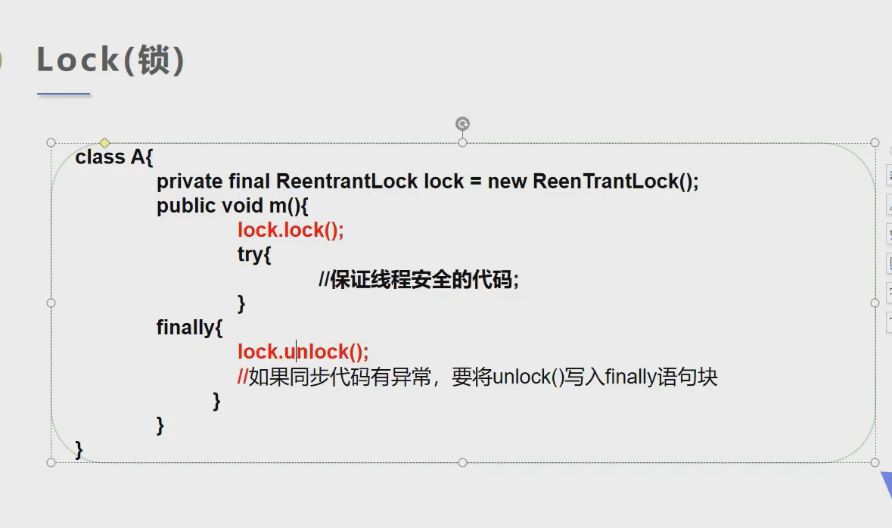

  ### synchronized与Lock的对比

  - **Lock是显式锁（手动开启和关闭锁，别忘记关闭锁）synchronized是隐式锁，出了作用域自动释放**
  - Lock只有代码块加锁，synchronized有代码块锁和方法锁
  - 使用Lock锁，JVM将花费较少的时间来调度线程，性能更好。并且具有更好的扩展性（提供更多的子类）
  - 优先使用顺序：
  - Lock》同步代码块（已经进入了方法体，分配了相应资源）》同步方法（在方法体之外）

```java
public class TestLock {
    public static void main(String[] args) {
        Ticket ticket = new Ticket();
        new Thread(ticket).start();
        new Thread(ticket).start();
        new Thread(ticket).start();
    }

}
class Ticket extends Thread{
    private int ticketNums=10;
    //定义lock锁
    private final ReentrantLock lock=new ReentrantLock();

    @Override
    public void run() {
        while (true){
            try {
                lock.lock();//加锁
                if (ticketNums > 0) {
                    try {
                        Thread.sleep(1000);
                    } catch (InterruptedException e) {
                        e.printStackTrace();
                    }
                    System.out.println(ticketNums--);
                } else {
                    break;
                }
            }finally {
                lock.unlock();//减锁
            }
        }
    }
}
```

### 线程通信

应用场景：生产者和消费者问题

- 假设仓库中只能存放一件产品，生产者将生产出来的产品放入仓库，消费者将仓库中产品取走消费。
- 如果仓库中没有产品，则生产者将产品放入仓库，否则停止生产并等待，直到仓库中的产品被消费者取走为止。
- 如果仓库中放有产品，则消费者可以将产品取走消费，否则停止消费并等待，直到仓库中再次放入产品为止。


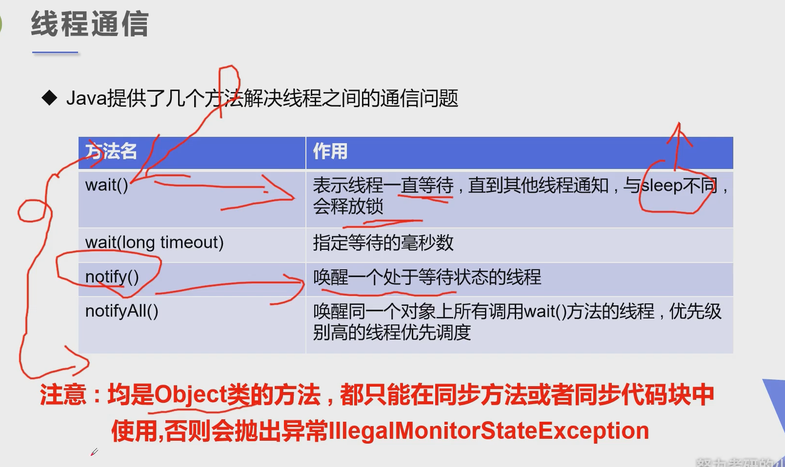

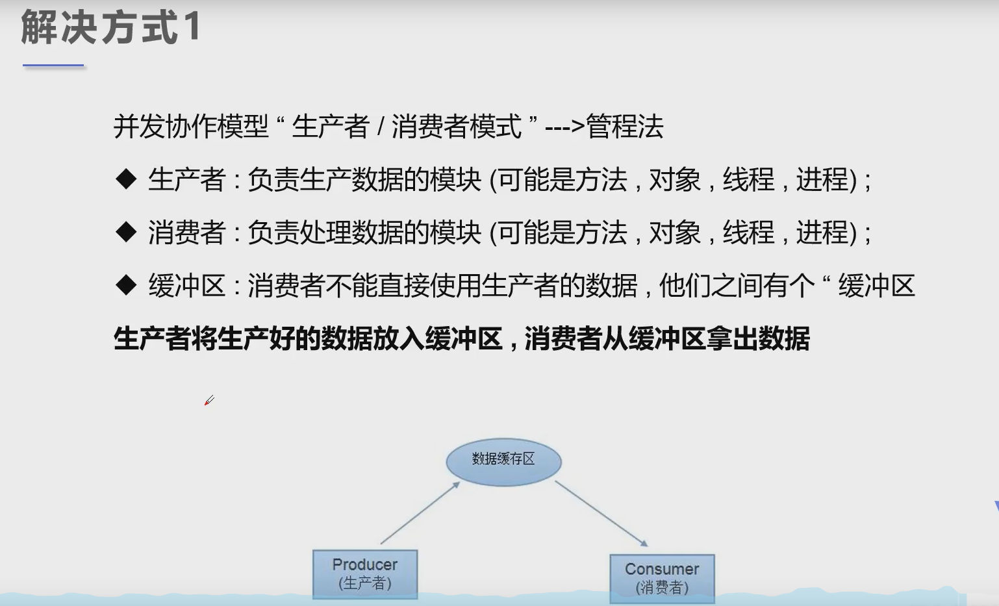


管程法

设置一个缓冲区，用于暂存数据

代码示例：

```java
package cn.livorth.gaoji;

import java.util.LinkedList;
import java.util.Queue;

//管程法解决
public class TestPC {
    public static void main(String[] args) {
        //创建缓冲区
        SynContainer container = new  SynContainer();

        //双线程开启
        new Producer(container).start();
        new Consumer(container).start();
    }
}

//生产者
class Producer extends Thread{
    SynContainer container;

    public Producer(SynContainer container) {
        this.container = container;
    }

    @Override
    public void run() {
        for (int i = 0; i < 100; i++) {
            System.out.println("生产了第" + i + "件产品");
            container.push(new Products(i));
        }
    }
}

//消费者
class Consumer extends Thread{
    SynContainer container;

    public Consumer(SynContainer container) {
        this.container = container;
    }

    @Override
    public void run() {
        for (int i = 0; i < 100; i++) {
            System.out.println("消费了第" + container.pop().id + "件产品");
        }
    }
}

//产品
class Products{
    int id;

    public Products(int id) {
        this.id = id;
    }
}

//缓冲区
class SynContainer{
    Queue<Products> queue = new LinkedList<Products>();
    int count = 0;
    int size = 10;

    //生产者放入产品 生产者和消费者锁的是同一个实例对象
    public synchronized void push(Products product)
    {
        //容器满，等待消费者消费
        if(count == size)
        {
            try {
                this.wait();//释放锁进行等待 另一线程开始执行
            } catch (InterruptedException e) {
                e.printStackTrace();
            }
        }

        //没满，我们则需要存入成品,并唤醒消费者
        count++;
        queue.offer(product);
        this.notifyAll();
    }

    //消费者消费产品
    public synchronized Products pop()
    {
        //容器为空，等待生产者生产
        if (count == 0) {
            try {
                this.wait();//释放锁进行等待 另一线程开始执行
            } catch (InterruptedException e) {
                e.printStackTrace();
            }
        }

        //容器有剩，取出物品，并告诉生产者可以生产了
        count--;
        Products productPoll = queue.poll();
        this.notifyAll();//唤醒对同一对象有锁的等待线程
        return productPoll;
    }
}
```

信号灯法

设置一个标记位（类似于容量为1的管程法）

```java
package cn.livorth.gaoji;

//信号灯法解决
public class TestPC2 {
    public static void main(String[] args) {
        //创建缓冲区
        TheProduct theProduct = new  TheProduct();

        //双线程
        new Producers(theProduct).start();
        new Consumers(theProduct).start();
    }
}

//生产者
class Producers extends Thread{
    TheProduct theProduct;

    public Producers(TheProduct theProduct) {
        this.theProduct = theProduct;
    }

    @Override
    public void run() {
        for (int i = 0; i < 10; i++) {
            theProduct.push("产品" + i);
        }
    }
}

//消费者
class Consumers extends Thread{
    TheProduct theProduct;

    public Consumers(TheProduct container) {
        this.theProduct = container;
    }

    @Override
    public void run() {
        for (int i = 0; i < 10; i++) {
            theProduct.pop();
        }
    }
}

//产品
class TheProduct{
    boolean flag = false;//true 表示已有产品且未被消费
    String product;
    //生产者生产，消费者等待
    public synchronized void push(String product)
    {
        if(flag)
        {
            try {
                //已有产品等待消费
                this.wait();
            } catch (InterruptedException e) {
                e.printStackTrace();
            }
        }

        System.out.println("生产者生产了" + product);
        this.product = product;
        this.flag = !this.flag;
        //生成了产品 唤醒消费
        this.notifyAll();

    }

    //消费者消费，生产者等待
    public synchronized void pop()
    {
        if(!flag)
        {
            try {
                this.wait();//未有产品等待生产者生产
            } catch (InterruptedException e) {
                e.printStackTrace();
            }
        }

        System.out.println("消费者消费了" + product);
        this.flag = !this.flag;
        //消费完产品 唤醒生产者生产
        this.notifyAll();
    }
}
```

### 线程池

- 背景：经常创建和销毁、使用量特别大的资源，比如并发情况下的线程，对性能影响很大。

- 思路：提前创建好多个线程，放入线程池中，使用时直接获取，使用完放回池中。可以避免频繁创建销毁、实现重复利用。类似生活中的公共交通工具。

- 好处：

  - 提高响应速度（减少了创建新线程的时间）

  - 降低资源消耗（重复利用线程池中线程，不需要每次都创建）

  - 便于线程管理（。。。）

    - corePoolSize:核心池的大小

    - maximumPoolSize：最大线程数

    - keepAliveTime：线程没有任务时最多保持多长时间后会终止

       

      ```java
      public class TestPool {
          public static void main(String[] args) {
              //1.创建服务，创建线程池
              ExecutorService service= Executors.newFixedThreadPool(10);
              //newFixedThreadPool 参数为：线程池大小
              //执行
              service.execute(new MyThread());
              service.execute(new MyThread());
              service.execute(new MyThread());
              service.execute(new MyThread());
              //2.关闭连接
              service.shutdown();
          }
      }
      class MyThread implements Runnable{
      
          @Override
          public void run() {
              System.out.println(Thread.currentThread().getName());
          }
      }
      ```

# JUC并发编程

## 1、什么是JUC

**源码+官方文档**

JUC是 java util concurrent

**面试高频问JUC~！**


java.util 是Java的一个工具包~

**业务：普通的线程代码 Thread**

**Runnable：** 没有返回值、效率相比于**Callable** 相对较低！


## 2、线程和进程

**进程：一个程序，QQ.EXE Music.EXE；数据+代码+pcb**

一个进程可以包含多个线程，至少包含一个线程！

Java默认有几个线程？**2个线程！** main线程、GC线程

**线程：开了一个进程Typora，写字，等待几分钟会进行自动保存(线程负责的)**

对于Java而言：Thread、Runable、Callable进行开启线程的，我们之前。

**提问？JAVA真的可以开启线程吗？ 开不了的！**

```java
    public synchronized void start() {
        /**
         * This method is not invoked for the main method thread or "system"
         * group threads created/set up by the VM. Any new functionality added
         * to this method in the future may have to also be added to the VM.
         *
         * A zero status value corresponds to state "NEW".
         */
        if (threadStatus != 0)
            throw new IllegalThreadStateException();

        /* Notify the group that this thread is about to be started
         * so that it can be added to the group's list of threads
         * and the group's unstarted count can be decremented. */
        group.add(this);

        boolean started = false;
        try {
            start0();
            started = true;
        } finally {
            try {
                if (!started) {
                    group.threadStartFailed(this);
                }
            } catch (Throwable ignore) {
                /* do nothing. If start0 threw a Throwable then
                  it will be passed up the call stack */
            }
        }
    }
	//这是一个C++底层，Java是没有权限操作底层硬件的
    private native void start0();
```

Java是没有权限去开启线程、操作硬件的，这是一个native的一个本地方法，它调用的底层的C++代码。

> 并发、并行

**并发：** 多线程操作同一个资源。

- CPU 只有一核，模拟出来多条线程，天下武功，唯快不破。那么我们就可以使用CPU快速交替，来模拟多线程。

**并行：** 多个人一起行走

- CPU多核，多个线程可以同时执行。 我们可以使用线程池！

```java
public class Test1 {
    public static void main(String[] args) {
        //获取cpu的核数
        System.out.println(Runtime.getRuntime().availableProcessors());
    }
}
```

并发编程的本质：**充分利用CPU的资源！**

> 线程有几个状态？

线程的状态：6个状态

```java
public enum State {
        /**
         * Thread state for a thread which has not yet started.
         */
    	//运行
        NEW,

        /**
         * Thread state for a runnable thread.  A thread in the runnable
         * state is executing in the Java virtual machine but it may
         * be waiting for other resources from the operating system
         * such as processor.
         */
    	//运行
        RUNNABLE,

        /**
         * Thread state for a thread blocked waiting for a monitor lock.
         * A thread in the blocked state is waiting for a monitor lock
         * to enter a synchronized block/method or
         * reenter a synchronized block/method after calling
         * {@link Object#wait() Object.wait}.
         */
    	//阻塞
        BLOCKED,

        /**
         * Thread state for a waiting thread.
         * A thread is in the waiting state due to calling one of the
         * following methods:
         * <ul>
         *   <li>{@link Object#wait() Object.wait} with no timeout</li>
         *   <li>{@link #join() Thread.join} with no timeout</li>
         *   <li>{@link LockSupport#park() LockSupport.park}</li>
         * </ul>
         *
         * <p>A thread in the waiting state is waiting for another thread to
         * perform a particular action.
         *
         * For example, a thread that has called <tt>Object.wait()</tt>
         * on an object is waiting for another thread to call
         * <tt>Object.notify()</tt> or <tt>Object.notifyAll()</tt> on
         * that object. A thread that has called <tt>Thread.join()</tt>
         * is waiting for a specified thread to terminate.
         */
    	//等待
        WAITING,

        /**
         * Thread state for a waiting thread with a specified waiting time.
         * A thread is in the timed waiting state due to calling one of
         * the following methods with a specified positive waiting time:
         * <ul>
         *   <li>{@link #sleep Thread.sleep}</li>
         *   <li>{@link Object#wait(long) Object.wait} with timeout</li>
         *   <li>{@link #join(long) Thread.join} with timeout</li>
         *   <li>{@link LockSupport#parkNanos LockSupport.parkNanos}</li>
         *   <li>{@link LockSupport#parkUntil LockSupport.parkUntil}</li>
         * </ul>
         */
    	//超时等待
        TIMED_WAITING,

        /**
         * Thread state for a terminated thread.
         * The thread has completed execution.
         */
    	//终止
        TERMINATED;
    }
```

> wait/sleep的区别

**1、来自不同的类**

wait => Object

sleep => Thread

一般情况企业中使用休眠是：

```java
TimeUnit.DAYS.sleep(1); //休眠1天
TimeUnit.SECONDS.sleep(1); //休眠1s
```

**2、关于锁的释放**

wait 会释放锁；

sleep睡觉了，不会释放锁；

**3、使用的范围是不同的**

wait 必须在同步代码块中；

sleep 可以在任何地方睡；

**4、是否需要捕获异常**

wait是不需要捕获异常；

sleep必须要捕获异常；

## 3、Lock锁（重点）

> 传统的Synchronized

```java
/**
 * 真正的多线程开发
 * 线程就是一个单独的资源类，没有任何的附属操作！
 */
public class SaleTicketDemo01 {
    public static void main(String[] args) {
        //多线程操作
        //并发：多线程操作同一个资源类，把资源类丢入线程
        Ticket ticket = new Ticket();

        //@FunctionalInterface 函数式接口 jdk1.8之后 lambda表达式
        new Thread(()->{
            for(int i=0;i<40;i++){
                ticket.sale();
            }
        },"A").start();
        new Thread(()->{
            for(int i=0;i<40;i++){
                ticket.sale();
            }
        },"B").start();
        new Thread(()->{
            for(int i=0;i<40;i++){
                ticket.sale();
            }
        },"C").start();
    }
}
//资源类
//属性+方法
//oop
class Ticket{
    private int number=50;


    //卖票的方式
    // synchronized 本质：队列，锁
    public synchronized void sale(){
        if(number>0){
            System.out.println(Thread.currentThread().getName()+" 卖出了第"+number+" 张票,剩余："+number+" 张票");
            number--;
        }
    }
}
```

> Lock接口


**公平锁：** 十分公平，必须先来后到~；

**非公平锁：** 十分不公平，可以插队；**(默认为非公平锁)**

```java
public class SaleTicketDemo02 {
    public static void main(String[] args) {
        //多线程操作
        //并发：多线程操作同一个资源类，把资源类丢入线程
        Ticket2 ticket = new Ticket2();
        new Thread(()->{for(int i=0;i<40;i++) ticket.sale(); },"A").start();
        new Thread(()->{for(int i=0;i<40;i++) ticket.sale(); },"B").start();
        new Thread(()->{for(int i=0;i<40;i++) ticket.sale(); },"C").start();
    }
}

//lock三部曲
//1、    Lock lock=new ReentrantLock();
//2、    lock.lock() 加锁
//3、    finally=> 解锁：lock.unlock();
class Ticket2{
    private int number=50;

    Lock lock=new ReentrantLock();

    //卖票的方式
    // 使用Lock 锁
    public void sale(){
        //加锁
        lock.lock();
        try {
            //业务代码
            if(number>=0){
                System.out.println(Thread.currentThread().getName()+" 卖出了第"+number+" 张票,剩余："+number+" 张票");
                number--;
            }
        }catch (Exception e) {
            e.printStackTrace();
        }
        finally {
            //解锁
            lock.unlock();
        }
    }
}
```

> Synchronized 和 Lock区别

- 1、Synchronized 内置的Java关键字，Lock是一个Java类

- 2、Synchronized 无法判断获取锁的状态，Lock可以判断**(java.lang.Thread中有一个方法叫holdsLock()，它返回true如果当且仅当当前线程拥有某个具体对象的锁)**

- 3、Synchronized 会自动释放锁，lock必须要手动加锁和手动释放锁！**可能会遇到死锁**

- 4、Synchronized 线程1(获得锁->阻塞)、线程2(等待)；

  lock就不一定会一直等待下去，**lock会有一个trylock去尝试获取锁**，不会造成长久的等待。

- 5、Synchronized 是可重入锁，不可以中断的，非公平的；Lock，可重入的，可以判断锁，可以自己设置公平锁和非公平锁；

- 6、Synchronized 适合锁少量的代码同步问题，Lock适合锁大量的同步代码；

## 4、生产者和消费者问题！

**Synchronized wait notify**可以实现，该方法是传统版本；

我们这次使用lock版本

> Synchronized版本

```java
public class A {
    public static void main(String[] args) {
        Data data = new Data();

        new Thread(()->{for(int i=0;i<10;i++) {
            try {
                data.increment();
            } catch (InterruptedException e) {
                e.printStackTrace();
            }
        }
        },"A").start();
        new Thread(()->{for(int i=0;i<10;i++) {
            try {
                data.decrement();
            } catch (InterruptedException e) {
                e.printStackTrace();
            }
        }},"B").start();
    }
}
class Data{
    //数字  资源类
    private int number = 0;

    //+1
    public synchronized void increment() throws InterruptedException {
        if(number!=0){
            //等待操作
            this.wait();
        }
        number++;
        System.out.println(Thread.currentThread().getName()+"=>"+number);
        //通知其他线程 我+1完毕了
        this.notifyAll();
    }

    //-1
    public synchronized void decrement() throws InterruptedException {
        if(number==0){
            //等待操作
            this.wait();
        }
        number--;
        System.out.println(Thread.currentThread().getName()+"=>"+number);
        //通知其他线程  我-1完毕了
        this.notifyAll();
    }

}
```

> **问题存在，A线程B线程，现在如果我有四个线程A B C D！**


**解决方案**： **if 改为while即可，防止虚假唤醒（因为线程被唤醒后，执行开始的地方是wait之后）**

这样就不存在问题了：


> **JUC版本的生产者和消费者问题**

**await、signal 替换 wait、notify**


通过Lock找到Condition


```java
public class B {
    public static void main(String[] args) {
        Data2 data = new Data2();

        new Thread(()->{for(int i=0;i<10;i++) {
            data.increment();
        }
        },"A").start();
        new Thread(()->{for(int i=0;i<10;i++) {
            data.decrement();
        }},"B").start();
        new Thread(()->{for(int i=0;i<10;i++) {
            data.increment();
        }
        },"C").start();
        new Thread(()->{for(int i=0;i<10;i++) {
            data.decrement();
        }
        },"D").start();
    }
}
class Data2{
    //数字  资源类
    private int number = 0;

    //lock锁
    Lock lock = new ReentrantLock();
    Condition condition = lock.newCondition();

    //+1
    public void increment()  {
        lock.lock();
        try{

            //业务
            while (number!=0){
                //等待操作
                condition.await();
            }
            number++;
            System.out.println(Thread.currentThread().getName()+"=>"+number);
            //通知其他线程 我+1完毕了
            condition.signalAll();
        } catch (Exception e) {
            e.printStackTrace();
        } finally {
            lock.unlock();
        }
    }

    //-1
    public void decrement()  {
        lock.lock();
        try{
            //业务
            while (number==0){
                //等待操作
                condition.await();
            }
            number--;
            System.out.println(Thread.currentThread().getName()+"=>"+number);
            //通知其他线程 我+1完毕了
            condition.signalAll();
        } catch (Exception e) {
            e.printStackTrace();
        } finally {
            lock.unlock();
        }
    }
}
```

> **Condition的优势**：精准的通知和唤醒的线程！

**如果我们要指定通知的下一个进行顺序怎么办呢？ 我们可以使用Condition来指定通知进程~**

```java
/**
 * A 执行完 调用B
 * B 执行完 调用C
 * C 执行完 调用A
 */

public class C {

    public static void main(String[] args) {
        Data3 data3 = new Data3();
        new Thread(()->{
            for(int i=0;i<10;i++){
                data3.printA();
            }
        },"A").start();
        new Thread(()->{
            for(int i=0;i<10;i++){
                data3.printB();
            }
        },"B").start();
        new Thread(()->{
            for(int i=0;i<10;i++){
                data3.printC();
            }
        },"C").start();
    }
}

class Data3{
    //资源类
    private Lock lock=new ReentrantLock();
    private Condition condition1 = lock.newCondition();
    private Condition condition2 = lock.newCondition();
    private Condition condition3 = lock.newCondition();
    private int number = 1; //1A 2B 3C

    public void printA(){
        lock.lock();
        try {
            //业务 判断 -> 执行 -> 通知
            while(number!=1){
                //等待
                condition1.await();
            }
            //操作
            System.out.println(Thread.currentThread().getName()+",AAAAA");
            //唤醒指定的线程
            number=2;
            condition2.signal(); // 唤醒2

        } catch (Exception e) {
            e.printStackTrace();
        } finally {
            lock.unlock();
        }
    }
    public void printB(){
        lock.lock();
        try {
            //业务 判断 -> 执行 -> 通知
            while (number!=2){
                condition2.await();
            }
            System.out.println(Thread.currentThread().getName()+",BBBBB");
            //唤醒3
            number=3;
            condition3.signal();
        } catch (Exception e) {
            e.printStackTrace();
        } finally {
            lock.unlock();
        }
    }
    public void printC(){
        lock.lock();
        try {
            //业务 判断 -> 执行 -> 通知
            while(number!=3){
                condition3.await();
            }
            System.out.println(Thread.currentThread().getName()+",CCCCC");
            //唤醒1
            number=1;
            condition1.signal();
        } catch (Exception e) {
            e.printStackTrace();
        } finally {
            lock.unlock();
        }
    }
}

```


## 5、8锁现象

**如何判断锁的是谁！锁到底锁的是谁？**

锁会锁住：**对象、Class**

**深刻理解我们的锁**

```java
package com.kuang.lock8;
import java.util.concurrent.TimeUnit;
/**
* 8锁，就是关于锁的8个问题
* 1、标准情况下，两个线程先打印 发短信还是 打电话？ 1/发短信 2/打电话
* 2、sendSms延迟4秒，两个线程先打印 发短信还是 打电话？ 1/发短信 2/打电话
*/
public class Test1 {
public static void main(String[] args) {
Phone phone = new Phone();
//锁的存在
new Thread(()->{
phone.sendSms();
},"A").start();
// 捕获
try {
TimeUnit.SECONDS.sleep(1);
} catch (InterruptedException e) {e.printStackTrace();
}
new Thread(()->{
phone.call();
},"B").start();
}
}
class Phone{
// synchronized 锁的对象是方法的调用者！、
// 两个方法用的是同一个锁，谁先拿到谁执行！
public synchronized void sendSms(){
try {
TimeUnit.SECONDS.sleep(4);
} catch (InterruptedException e) {
e.printStackTrace();
}
System.out.println("发短信");
}
public synchronized void call(){
System.out.println("打电话");
}
}
package com.kuang.lock8;
import java.util.concurrent.TimeUnit;
/**
* 3、 增加了一个普通方法后！先执行发短信还是Hello？ 普通方法
* 4、 两个对象，两个同步方法， 发短信还是 打电话？ // 打电话
*/
public class Test2 {
public static void main(String[] args) {
// 两个对象，两个调用者，两把锁！
Phone2 phone1 = new Phone2();
Phone2 phone2 = new Phone2();
//锁的存在
new Thread(()->{
phone1.sendSms();
},"A").start();
// 捕获
try {
TimeUnit.SECONDS.sleep(1);
} catch (InterruptedException e) {
e.printStackTrace();
}
new Thread(()->{
phone2.call();
},"B").start();
}}
class Phone2{
// synchronized 锁的对象是方法的调用者！
public synchronized void sendSms(){
try {
TimeUnit.SECONDS.sleep(4);
} catch (InterruptedException e) {
e.printStackTrace();
}
System.out.println("发短信");
}
public synchronized void call(){
System.out.println("打电话");
}
// 这里没有锁！不是同步方法，不受锁的影响
public void hello(){
System.out.println("hello");
}
}
package com.kuang.lock8;
import java.util.concurrent.TimeUnit;
/**
* 5、增加两个静态的同步方法，只有一个对象，先打印 发短信？打电话？
* 6、两个对象！增加两个静态的同步方法， 先打印 发短信？打电话？
*/
public class Test3 {
public static void main(String[] args) {
// 两个对象的Class类模板只有一个，static，锁的是Class
Phone3 phone1 = new Phone3();
Phone3 phone2 = new Phone3();
//锁的存在
new Thread(()->{
phone1.sendSms();
},"A").start();
// 捕获
try {
TimeUnit.SECONDS.sleep(1);
} catch (InterruptedException e) {
e.printStackTrace();
}
new Thread(()->{
phone2.call();
},"B").start();
}
}
// Phone3唯一的一个 Class 对象class Phone3{
// synchronized 锁的对象是方法的调用者！
// static 静态方法
// 类一加载就有了！锁的是Class
public static synchronized void sendSms(){
try {
TimeUnit.SECONDS.sleep(4);
} catch (InterruptedException e) {
e.printStackTrace();
}
System.out.println("发短信");
}
public static synchronized void call(){
System.out.println("打电话");
}
}
package com.kuang.lock8;
import java.util.concurrent.TimeUnit;
/**
* 1、1个静态的同步方法，1个普通的同步方法 ，一个对象，先打印 发短信？打电话？
* 2、1个静态的同步方法，1个普通的同步方法 ，两个对象，先打印 发短信？打电话？
*/
public class Test4 {
public static void main(String[] args) {
// 两个对象的Class类模板只有一个，static，锁的是Class
Phone4 phone1 = new Phone4();
Phone4 phone2 = new Phone4();
//锁的存在
new Thread(()->{
phone1.sendSms();
},"A").start();
// 捕获
try {
TimeUnit.SECONDS.sleep(1);
} catch (InterruptedException e) {
e.printStackTrace();
}
new Thread(()->{
phone2.call();
},"B").start();
}
}
// Phone3唯一的一个 Class 对象
class Phone4{
// 静态的同步方法 锁的是 Class 类模板
public static synchronized void sendSms(){
try {小结
new this 具体的一个手机
static Class 唯一的一个模板
6、集合类不安全
List 不安全
TimeUnit.SECONDS.sleep(4);
} catch (InterruptedException e) {
e.printStackTrace();
}
System.out.println("发短信");
}
// 普通的同步方法 锁的调用者
public synchronized void call(){
System.out.println("打电话");
}
}
```

> 小结

**new** 出来的 this 是具体的一个对象

**static Class** 是唯一的一个模板

## 6、集合类不安全

> List不安全

我们来看一下List这个集合类：

```java
//java.util.ConcurrentModificationException 并发修改异常！
public class ListTest {
    public static void main(String[] args) {

        List<Object> arrayList = new ArrayList<>();

        for(int i=1;i<=10;i++){
            new Thread(()->{
                arrayList.add(UUID.randomUUID().toString().substring(0,5));
                System.out.println(arrayList);
            },String.valueOf(i)).start();
        }

    }
}
```

会造成：


**ArrayList 在并发情况下是不安全的！**

解决方案：

**1、切换成Vector就是线程安全的啦！**


**2、使用Collections.synchronizedList(new ArrayList<>());**

```java
public class ListTest {
    public static void main(String[] args) {

        List<Object> arrayList = Collections.synchronizedList(new ArrayList<>());

        for(int i=1;i<=10;i++){
            new Thread(()->{
                arrayList.add(UUID.randomUUID().toString().substring(0,5));
                System.out.println(arrayList);
            },String.valueOf(i)).start();
        }

    }
}
```

**3、使用JUC中的包：List arrayList = new CopyOnWriteArrayList<>();**

```java
public class ListTest {
    public static void main(String[] args) {

        List<Object> arrayList = new CopyOnWriteArrayList<>();

        for(int i=1;i<=10;i++){
            new Thread(()->{
                arrayList.add(UUID.randomUUID().toString().substring(0,5));
                System.out.println(arrayList);
            },String.valueOf(i)).start();
        }

    }
}
```

**CopyOnWriteArrayList**：写入时复制！ **COW 计算机程序设计领域的一种优化策略**

多个线程调用的时候，list，读取的时候，固定的，写入（存在覆盖操作）；在写入的时候避免覆盖，造成数据错乱的问题；

> **CopyOnWriteArrayList**比**Vector**厉害在哪里？

**Vector**底层是使用**synchronized**关键字来实现的：效率特别低下。


**CopyOnWriteArrayList**使用的是Lock锁，效率会更加高效！


> Set不安全


和List、Set同级的还有一个BlockingQueue 阻塞队列；

**Set和List同理可得:** 多线程情况下，普通的Set集合是线程不安全的；

解决方案还是两种：

- 使用Collections工具类的**synchronized**包装的Set类
- 使用CopyOnWriteArraySet 写入复制的**JUC**解决方案

```java
//同理：java.util.ConcurrentModificationException
// 解决方案：
public class SetTest {
    public static void main(String[] args) {
//        Set<String> hashSet = Collections.synchronizedSet(new HashSet<>()); //解决方案1
        Set<String> hashSet = new CopyOnWriteArraySet<>();//解决方案2
        for (int i = 1; i < 100; i++) {
            new Thread(()->{
                hashSet.add(UUID.randomUUID().toString().substring(0,5));
                System.out.println(hashSet);
            },String.valueOf(i)).start();
        }
    }
}
1234567891011121314
```

#### HashSet底层是什么？

hashSet底层就是一个**HashMap**；

```java
public HashSet() {
        map = new HashMap<>();
}

//add 本质其实就是一个map的key，map的key是无法重复的，所以使用的就是map存储
//hashSet就是使用了hashmap key不能重复的原理
public boolean add(E e) {
        return map.put(e, PRESENT)==null;
}
//PRESENT是什么？ 是一个常量  不会改变的常量  无用的占位
private static final Object PRESENT = new Object();
1234567891011
```

> Map不安全

回顾map的基本操作：

```java
//map 是这样用的吗？  不是，工作中不使用这个
//默认等价什么？ new HashMap<>(16,0.75);
Map<String, String> map = new HashMap<>();
//加载因子、初始化容量
```

默认**加载因子是0.75**,默认的**初始容量是16**


同样的HashMap基础类也存在**并发修改异常**！

```java
public static void main(String[] args) {
        //map 是这样用的吗？  不是，工作中不使用这个
        //默认等价什么？ new HashMap<>(16,0.75);
        //Map<String, String> map = new HashMap<>();
    //        Map<String,String> list = Collections.synchronizedMap(new HashMap<>());
        Map<String,String> map =new ConcurrentHashMap<>();
        //加载因子、初始化容量
        for (int i = 1; i < 100; i++) {
            new Thread(()->{
                map.put(Thread.currentThread().getName(),UUID.randomUUID().toString().substring(0,5));
                System.out.println(map);
            },String.valueOf(i)).start();
        }
    }
```

结果同样的出现了：**异常java.util.ConcurrentModificationException 并发修改异常**

**解决方案：**

- **使用Collections.synchronizedMap(new HashMap<>());处理**；
- **使用ConcurrentHashMap进行并发处理**

#### TODO:研究ConcurrentHashMap底层原理：

这里我们可以直接去研究一下，这个也是相当重要的。

##底层未用 lock 用synchronized实现

## 7、Callable(简单)


**1、可以有返回值；
2、可以抛出异常；
3、方法不同，run()/call()**

> 代码测试

传统使用线程方式：

```java
public class CallableTest {
    public static void main(String[] args) {
        for (int i = 1; i < 10; i++) {
            new Thread(new MyThread()).start();
        }
    }
}

class MyThread implements Runnable{

    @Override
    public void run() {
        System.out.println(Thread.currentThread().getName());
    }
}
```

使用**Callable**进行多线程操作：


Calleable 泛型T就是**call运行方法的返回值类型**；

但是**如何使用**呢？

**Callable怎么放入到Thread里面呢？**

源码分析：


对于Thread运行，只能传入Runnable类型的参数；

我们这是Callable 怎么办呢？

看JDK api文档：

在Runnable里面有一个叫做FutureTask的实现类，我们进去看一下。


FutureTask中可以接受Callable参数；


这样我们就可以先把Callable 放入到FutureTask中， 如何再把FutureTask 放入到Thread就可以了。

```java
public class CallableTest {
    public static void main(String[] args) throws ExecutionException, InterruptedException {
        for (int i = 1; i < 10; i++) {
//            new Thread(new Runnable()).start();
//            new Thread(new FutureTask<>( Callable)).start();
            MyThread thread= new MyThread();
            //适配类：FutureTask
            FutureTask<String> futureTask = new FutureTask<>(thread);
            //放入Thread使用 注意线程启动方式有且只有一个 new Thread(..).start()
            new Thread(futureTask,String.valueOf(i)).start();
            //获取返回值 这个get方法可能会产生阻塞 把它放到最后一行 或者使用异步通信
            String s = futureTask.get();
            System.out.println("返回值："+ s);
        }
    }
}

class MyThread implements Callable<String> {

    @Override
    public String call() throws Exception {
        System.out.println("Call:"+Thread.currentThread().getName());
        return "String"+Thread.currentThread().getName();
    }
}
```

这样我们就可以使用Callable来进行多线程编程了，并且我们发现可以有返回值，并且可以抛出异常。


注意两个重点：


**阻塞：futureTask.get方法获取不到返回值是会一直等待**

```java
FutureTask<Integer> futureTask = new FutureTask<>(myThread1);
            // 放入Thread中使用，第一次调用结果会被缓存  后面调用会直接从缓存中获取结果不再运行call 只有当构造方法中FutureTask的实例对象相同时 如果缓存中有对应call方法的运行结果 下次调用时不再调用方法 直接从缓存中取出结果 
            new Thread(futureTask,String.valueOf(i)).start();
```


##怎么缓存

## 8、常用的辅助类(必会！)

### 8.1 CountDownLatch


**其实就是一个减法计数器，对于计数器归零之后再进行后面的操作，这是一个计数器！**

```java
//这是一个计数器  减法
public class CountDownLatchDemo {

    public static void main(String[] args) throws InterruptedException {
        //总数是6
        CountDownLatch countDownLatch = new CountDownLatch(6);

        for (int i = 1; i <= 6 ; i++) {
            new Thread(()->{
                System.out.println(Thread.currentThread().getName()+" Go out");
                countDownLatch.countDown(); //每个线程都数量-1
            },String.valueOf(i)).start();
        }
        countDownLatch.await();  //等待计数器归零  然后向下执行

        System.out.println("close door");

    }

}
```

主要方法：

- countDown 减一操作；
- await 等待计数器归零。

await等待计数器为0，就唤醒，再继续向下运行。

### 8.2 CyclickBarrier


其实就是一个加法计数器；

```java
public class CyclicBarrierDemo {
    public static void main(String[] args) {

        //主线程
        CyclicBarrier cyclicBarrier = new CyclicBarrier(7,()->{//计数到7后执行的方法
            System.out.println("召唤神龙~");
        });

        for (int i = 1; i <= 7; i++) {
            //子线程
           finial int finalI = i;
            new Thread(()->{
                System.out.println(Thread.currentThread().getName()+" 收集了第 {"+ finalI+"} 颗龙珠");
                try {
                    cyclicBarrier.await(); //会自行加法计数1次然后停止 到7才向下执行
                } catch (InterruptedException e) {
                    e.printStackTrace();
                } catch (BrokenBarrierException e) {
                    e.printStackTrace();
                }
            }).start();
        }

    }
}
```

### 8.3 Semaphore

Semaphore：信号量

抢车位：

3个车位 6辆车：

```java
public class SemaphoreDemo {
    public static void main(String[] args) {
        //停车位为3个 只有3个都离开后其他车才能进
        Semaphore semaphore = new Semaphore(3);
        for (int i = 1; i <= 6; i++) {
            int finalI = i;
            new Thread(()->{
                try {
                    semaphore.acquire(); //得到
                    //抢到车位
                    System.out.println(Thread.currentThread().getName()+" 抢到了车位{"+ finalI +"}");
                    TimeUnit.SECONDS.sleep(2); //停车2s
                    System.out.println(Thread.currentThread().getName()+" 离开车位");
                } catch (InterruptedException e) {
                    e.printStackTrace();
                }finally {
                    semaphore.release();//释放 方法运行完毕 该线程死亡
                }
            },String.valueOf(i)).start();
        }
    }
}
```

原理：

**semaphore.acquire()获得资源，如果资源已经使用完了，就等待资源释放后再进行使用！**

**semaphore.release()释放，会将当前的信号量释放+1，然后唤醒等待的线程！**

作用： 多个共享资源互斥的使用！ 并发限流，控制最大的线程数！

## 9、读写锁

先对于不加锁的情况：

如果我们做一个我们自己的cache缓存。分别有写入操作、读取操作；

我们采用五个线程去写入，使用十个线程去读取。

我们来看一下这个的效果，如果我们不加锁的情况！

```java
package com.ogj.rw;

import java.util.HashMap;
import java.util.Map;
import java.util.concurrent.locks.Lock;
import java.util.concurrent.locks.ReadWriteLock;
import java.util.concurrent.locks.ReentrantLock;
import java.util.concurrent.locks.ReentrantReadWriteLock;

public class ReadWriteLockDemo {
    public static void main(String[] args) {
        MyCache_ReadWriteLock mycache = new MyCache_ReadWriteLock();
        //开启5个线程 写入数据
        for (int i = 1; i <=5 ; i++) {
            int finalI = i;
            new Thread(()->{
                mycache.put(String.valueOf(finalI),String.valueOf(finalI));
            }).start();
        }
        //开启10个线程去读取数据
        for (int i = 1; i <=10 ; i++) {
            int finalI = i;
            new Thread(()->{
                String o = mycache.get(String.valueOf(finalI));
            }).start();
        }
    }
}

class MyCache_ReadWriteLock{
    private volatile Map<String,String> map=new HashMap<>();

    //使用读写锁
    private ReadWriteLock readWriteLock=new ReentrantReadWriteLock();
    //普通锁
    private Lock lock=new ReentrantLock();

    public void put(String key,String value){
        //写入
        System.out.println(Thread.currentThread().getName()+" 线程 开始写入");
        map.put(key, value);
        System.out.println(Thread.currentThread().getName()+" 线程 写入OK");
    }

    public String get(String key){
        //得到
        System.out.println(Thread.currentThread().getName()+" 线程 开始读取");
        String o = map.get(key);
        System.out.println(Thread.currentThread().getName()+" 线程 读取OK");
        return o;
    }
}
```

运行效果如下：

```bash
Thread-0 线程 开始写入
Thread-4 线程 开始写入  # 插入了其他的线程进行写入
Thread-4 线程 写入OK
Thread-3 线程 开始写入
Thread-1 线程 开始写入
Thread-2 线程 开始写入
Thread-1 线程 写入OK
Thread-3 线程 写入OK
Thread-0 线程 写入OK   # 对于这种情况会出现 数据不一致等情况
Thread-2 线程 写入OK
Thread-5 线程 开始读取
Thread-6 线程 开始读取
Thread-6 线程 读取OK
Thread-7 线程 开始读取
Thread-7 线程 读取OK
Thread-5 线程 读取OK
Thread-8 线程 开始读取
Thread-8 线程 读取OK
Thread-9 线程 开始读取
Thread-9 线程 读取OK
Thread-10 线程 开始读取
Thread-11 线程 开始读取
Thread-12 线程 开始读取
Thread-12 线程 读取OK
Thread-10 线程 读取OK
Thread-14 线程 开始读取
Thread-13 线程 开始读取
Thread-13 线程 读取OK
Thread-11 线程 读取OK
Thread-14 线程 读取OK

Process finished with exit code 0

```

所以如果我们不加锁的情况，多线程的读写会造成数据不可靠的问题。

我们也可以采用**synchronized**这种重量锁和轻量锁 **lock**去保证数据的可靠。

但是这次我们采用更细粒度的锁：**ReadWriteLock** 读写锁来保证


```java
package com.ogj.rw;

import java.util.HashMap;
import java.util.Map;
import java.util.concurrent.locks.Lock;
import java.util.concurrent.locks.ReadWriteLock;
import java.util.concurrent.locks.ReentrantLock;
import java.util.concurrent.locks.ReentrantReadWriteLock;

public class ReadWriteLockDemo {
    public static void main(String[] args) {
        MyCache_ReadWriteLock mycache = new MyCache_ReadWriteLock();
        //开启5个线程 写入数据
        for (int i = 1; i <=5 ; i++) {
            int finalI = i;
            new Thread(()->{
                mycache.put(String.valueOf(finalI),String.valueOf(finalI));
            }).start();
        }
        //开启10个线程去读取数据
        for (int i = 1; i <=10 ; i++) {
            int finalI = i;
            new Thread(()->{
                String o = mycache.get(String.valueOf(finalI));
            }).start();
        }
    }
}

class MyCache_ReadWriteLock{
    private volatile Map<String,String> map=new HashMap<>();

    //使用读写锁
    private ReadWriteLock readWriteLock=new ReentrantReadWriteLock();
    //普通锁
    private Lock lock=new ReentrantLock();

    public void put(String key,String value){
        //加锁
        readWriteLock.writeLock().lock();
        try {
            //写入
            //业务流程
            System.out.println(Thread.currentThread().getName()+" 线程 开始写入");
            map.put(key, value);
            System.out.println(Thread.currentThread().getName()+" 线程 写入OK");
        } catch (Exception e) {
            e.printStackTrace();
        } finally {
            readWriteLock.writeLock().unlock(); //解锁
        }
    }

    public String get(String key){
        //加锁
        String o="";
        readWriteLock.readLock().lock();
        try {
            //得到
            System.out.println(Thread.currentThread().getName()+" 线程 开始读取");
            o = map.get(key);
            System.out.println(Thread.currentThread().getName()+" 线程 读取OK");
        } catch (Exception e) {
            e.printStackTrace();
        } finally {
            readWriteLock.readLock().unlock();
        }
        return o;
    }
}
```

运行结果如下：

```bash
Thread-0 线程 开始写入
Thread-0 线程 写入OK
Thread-1 线程 开始写入
Thread-1 线程 写入OK
Thread-2 线程 开始写入
Thread-2 线程 写入OK
Thread-3 线程 开始写入
Thread-3 线程 写入OK
Thread-4 线程 开始写入
Thread-4 线程 写入OK

# 以上 整个过程没有再出现错乱的情况，对于读取，我们运行多个线程同时读取，
# 因为这样不会造成数据不一致问题，也能在一定程度上提高效率
Thread-9 线程 开始读取
Thread-9 线程 读取OK
Thread-10 线程 开始读取
Thread-5 线程 开始读取
Thread-11 线程 开始读取
Thread-11 线程 读取OK
Thread-10 线程 读取OK
Thread-7 线程 开始读取
Thread-7 线程 读取OK
Thread-6 线程 开始读取
Thread-5 线程 读取OK
Thread-14 线程 开始读取
Thread-8 线程 开始读取
Thread-14 线程 读取OK
Thread-6 线程 读取OK
Thread-13 线程 开始读取
Thread-12 线程 开始读取
Thread-13 线程 读取OK
Thread-8 线程 读取OK
Thread-12 线程 读取OK
```

## 10、阻塞队列

阻塞

队列


阻塞队列jdk1.8文档解释：


### BlockingQueue

blockingQueue 是Collection的一个子类；

什么情况我们会使用 阻塞队列呢？

```
多线程并发处理、线程池！
```


整个阻塞队列的家族如下：Queue以下实现的有Deque（双端队列）、AbstaractQueue（非阻塞队列）、BlockingQueue；

BlockingQueue以下有Link链表实现的阻塞队列、也有Array数组实现的阻塞队列

### 如何使用阻塞队列呢？

------

操作：添加、移除

但是实际我们要学的有：

**四组API**

| 方式       | 抛出异常 | 不会抛出异常，有返回值 | 阻塞 等待 | 超时 等待                |
| ---------- | -------- | ---------------------- | --------- | ------------------------ |
| 添加       | add      | offer                  | put       | offer(timenum，timeUnit) |
| 移除       | remove   | poll                   | take      | poll(timenum，timeUnit)  |
| 判断队列首 | element  | peek                   | -         | -                        |

```java
/**
     * 抛出异常
     */
    public static void test1(){
        //需要初始化队列的大小
        ArrayBlockingQueue blockingQueue = new ArrayBlockingQueue<>(3);

        System.out.println(blockingQueue.add("a"));
        System.out.println(blockingQueue.add("b"));
        System.out.println(blockingQueue.add("c"));
        //抛出异常：java.lang.IllegalStateException: Queue full
//        System.out.println(blockingQueue.add("d"));
        System.out.println(blockingQueue.remove());
        System.out.println(blockingQueue.remove());
        System.out.println(blockingQueue.remove());
        //如果多移除一个
        //这也会造成 java.util.NoSuchElementException 抛出异常
        System.out.println(blockingQueue.remove());
    }
=======================================================================================
/**
     * 不抛出异常，有返回值
     */
    public static void test2(){
        ArrayBlockingQueue blockingQueue = new ArrayBlockingQueue<>(3);
        System.out.println(blockingQueue.offer("a"));
        System.out.println(blockingQueue.offer("b"));
        System.out.println(blockingQueue.offer("c"));
        //添加 一个不能添加的元素 使用offer只会返回false 不会抛出异常
        System.out.println(blockingQueue.offer("d"));

        System.out.println(blockingQueue.poll());
        System.out.println(blockingQueue.poll());
        System.out.println(blockingQueue.poll());
        //弹出 如果没有元素 只会返回null 不会抛出异常
        System.out.println(blockingQueue.poll());
    }
=======================================================================================
/**
     * 等待 一直阻塞
     */
    public static void test3() throws InterruptedException {
        ArrayBlockingQueue blockingQueue = new ArrayBlockingQueue<>(3);

        //一直阻塞 不会返回
        blockingQueue.put("a");
        blockingQueue.put("b");
        blockingQueue.put("c");

        //如果队列已经满了， 再进去一个元素  这种情况会一直等待这个队列 什么时候有了位置再进去，程序不会停止
//        blockingQueue.put("d");

        System.out.println(blockingQueue.take());
        System.out.println(blockingQueue.take());
        System.out.println(blockingQueue.take());
        //如果我们再来一个  这种情况也会等待，程序会一直运行 阻塞
        System.out.println(blockingQueue.take());
    }
=======================================================================================
/**
     * 等待 超时阻塞
     *  这种情况也会等待队列有位置 或者有产品 但是会超时结束
     */
    public static void test4() throws InterruptedException {
        ArrayBlockingQueue blockingQueue = new ArrayBlockingQueue<>(3);
        blockingQueue.offer("a");
        blockingQueue.offer("b");
        blockingQueue.offer("c");
        System.out.println("开始等待");
        blockingQueue.offer("d",2, TimeUnit.SECONDS);  //超时时间2s 等待如果超过2s就结束等待并放回false
        System.out.println("结束等待");
        System.out.println("===========取值==================");
        System.out.println(blockingQueue.poll());
        System.out.println(blockingQueue.poll());
        System.out.println(blockingQueue.poll());
        System.out.println("开始等待");
        blockingQueue.poll(2,TimeUnit.SECONDS); //超过两秒 我们就不要等待了并放回false
        System.out.println("结束等待");
    }
```

### SynchronousQueue同步队列

同步队列 没有容量，也可以视为**容量为1的队列**；

进去一个元素，必须等待取出来之后，才能再往里面放入一个元素；

**put**方法 和 **take**方法；

**Synchronized** 和 其他的**BlockingQueue** 不一样 它不存储元素；

put了一个元素，就必须从里面先take出来，否则不能再put进去值！

并且SynchronousQueue 的take是使用了**lock锁保证线程安全**的。

```java
/**
 * 同步队列
 */
public class SynchronousQueueDemo {
    public static void main(String[] args) {
        BlockingQueue<String> synchronousQueue = new SynchronousQueue<>();
        //研究一下 如果判断这是一个同步队列

        //使用两个进程
        // 一个进程 放进去
        // 一个进程 拿出来
        new Thread(()->{
            try {	//该业务有错 put完后可能会再为打印出take当前的就接下打印出put下一个 即打印语句先调用 这里是因为 put 和输出语句不是一个原子操作，所以当put以后可能取线程会抢到执行权
                System.out.println(Thread.currentThread().getName()+" Put 1");
                synchronousQueue.put("1");
                System.out.println(Thread.currentThread().getName()+" Put 2");
                synchronousQueue.put("2");
                System.out.println(Thread.currentThread().getName()+" Put 3");
                synchronousQueue.put("3");
            } catch (InterruptedException e) {
                e.printStackTrace();
            }
        },"T1").start();

        new Thread(()->{
            try {//put后包含take的打印语句才会执行
                System.out.println(Thread.currentThread().getName()+" Take "+synchronousQueue.take());
                TimeUnit.SECONDS.sleep(3);
                System.out.println(Thread.currentThread().getName()+" Take "+synchronousQueue.take());
               TimeUnit.SECONDS.sleep(3);
                System.out.println(Thread.currentThread().getName()+" Take "+synchronousQueue.take());

            } catch (InterruptedException e) {
                e.printStackTrace();
            }
        },"T2").start();
    }
}
```


## 11、线程池(重点)

线程池：**三大方法、7大参数、4种拒绝策略**

> 池化技术

程序的运行，本质：占用系统的资源！我们需要去优化资源的使用 ===> 池化技术

线程池、JDBC的连接池、内存池、对象池 等等。。。。

资源的创建、销毁十分消耗资源

**池化技术**：事先准备好一些资源，如果有人要用，就来我这里拿，用完之后还给我，以此来提高效率。

**线程池的好处：**

1、降低资源的消耗；

2、提高响应的速度；

3、方便管理；

**线程复用、可以控制最大并发数、管理线程；**

> 线程池：三大方法

- **ExecutorService threadPool = Executors.newSingleThreadExecutor();//单个线程**
- **ExecutorService threadPool2 = Executors.newFixedThreadPool(5); //创建一个固定的线程池的大小**
- **ExecutorService threadPool3 = Executors.newCachedThreadPool(); //可伸缩的**

```java
//工具类 Executors 三大方法；
public class Demo01 {
    public static void main(String[] args) {

        ExecutorService threadPool = Executors.newSingleThreadExecutor();//单个线程
        ExecutorService threadPool2 = Executors.newFixedThreadPool(5); //创建一个固定的线程池的大小
        ExecutorService threadPool3 = Executors.newCachedThreadPool(); //可伸缩的

        //线程池用完必须要关闭线程池
        try {

            for (int i = 1; i <=100 ; i++) {
                //通过线程池创建线程
                threadPool.execute(()->{
                    System.out.println(Thread.currentThread().getName()+ " ok");
                });
            }
        } catch (Exception e) {
            e.printStackTrace();
        } finally {
            threadPool.shutdown();
        }
    }
}
```

> 7大参数

源码分析

```java
public static ExecutorService newSingleThreadExecutor() {
    return new FinalizableDelegatedExecutorService
        (new ThreadPoolExecutor(1, 1,
                                0L, TimeUnit.MILLISECONDS,
                                new LinkedBlockingQueue<Runnable>()));
}
123456
public static ExecutorService newFixedThreadPool(int nThreads) {
    return new ThreadPoolExecutor(nThreads, nThreads,
                                  0L, TimeUnit.MILLISECONDS,
                                  new LinkedBlockingQueue<Runnable>());
}
12345
public static ExecutorService newCachedThreadPool() {
    return new ThreadPoolExecutor(0, Integer.MAX_VALUE,
                                  60L, TimeUnit.SECONDS,
                                  new SynchronousQueue<Runnable>());
}
12345
```

本质：三种方法都是开启的**ThreadPoolExecutor**

```java
public ThreadPoolExecutor(int corePoolSize,  //核心线程池大小
                          int maximumPoolSize, //最大的线程池大小
                          long keepAliveTime,  //除核心线程的其他线程超时了没有人调用就会释放
                          TimeUnit unit, //超时单位
                          BlockingQueue<Runnable> workQueue, //阻塞队列
                          ThreadFactory threadFactory, //线程工厂 创建线程的 一般不用动
                          RejectedExecutionHandler handler //拒绝策略
                         ) {
    if (corePoolSize < 0 ||
        maximumPoolSize <= 0 ||
        maximumPoolSize < corePoolSize ||
        keepAliveTime < 0)
        throw new IllegalArgumentException();
    if (workQueue == null || threadFactory == null || handler == null)
        throw new NullPointerException();
    this.corePoolSize = corePoolSize;
    this.maximumPoolSize = maximumPoolSize;
    this.workQueue = workQueue;
    this.keepAliveTime = unit.toNanos(keepAliveTime);
    this.threadFactory = threadFactory;
    this.handler = handler;
}
```


```java
  public static ExecutorService newSingleThreadExecutor() {
        return new FinalizableDelegatedExecutorService
            (new ThreadPoolExecutor(1, 1,
                                    0L, TimeUnit.MILLISECONDS,
                                    new LinkedBlockingQueue<Runnable>()));
    }
   public LinkedBlockingQueue() {
        this(Integer.MAX_VALUE);
    }

```


阿里巴巴的Java操作手册中明确说明：对于Integer.MAX_VALUE初始值较大，所以一般情况我们要使用底层的**ThreadPoolExecutor**来创建线程池。

> 业务图


> 手动创建线程池

// todo

> 拒绝策略4种


**（1）new ThreadPoolExecutor.AbortPolicy()：** //该拒绝策略为：银行柜台和候客区满了，还有人进来，不处理这个人的，并抛出异常

超出最大承载，就会抛出异常：队列容量大小+maxPoolSize

```java
ExecutorService threadPool3 = new ThreadPoolExecutor(2, 5, 3,
        TimeUnit.SECONDS, new LinkedBlockingDeque<>(3),
        Executors.defaultThreadFactory(), new ThreadPoolExecutor.AbortPolicy());

for (int i = 1; i <=9;i++){
    threadPool3.execute(()->{
        System.out.println(Thread.currentThread().getName()+"---");
    });
}
```

**（2）new ThreadPoolExecutor.CallerRunsPolicy()：** //该拒绝策略为：哪来的去哪里处理 main线程进行处理

```java
ExecutorService threadPool3 = new ThreadPoolExecutor(2, 5, 3,
        TimeUnit.SECONDS, new LinkedBlockingDeque<>(3),
        Executors.defaultThreadFactory(), new ThreadPoolExecutor.CallerRunsPolicy());

for (int i = 1; i <=9;i++){
    threadPool3.execute(()->{
        System.out.println(Thread.currentThread().getName()+"---");
    });
}
```

**（3）new ThreadPoolExecutor.DiscardPolicy():** //该拒绝策略为：队列满了,丢掉异常，不会抛出异常。

```java
ExecutorService threadPool3 = new ThreadPoolExecutor(2, 5, 3,
        TimeUnit.SECONDS, new LinkedBlockingDeque<>(3),
        Executors.defaultThreadFactory(), new ThreadPoolExecutor.DiscardPolicy());

try {
    for (int i = 1; i <=9;i++){
        threadPool3.execute(()->{
            System.out.println(Thread.currentThread().getName()+"---");
        });
    }
} catch (Exception e) {
    e.printStackTrace();
} finally {
    threadPool3.shutdown();
}
```

**（4）new ThreadPoolExecutor.DiscardOldestPolicy()：** //该拒绝策略为：队列满了，尝试去和最早的进程竞争(如果最早线程还在执行则与第三个方法相同)，不会抛出异常

```java
ExecutorService threadPool3 = new ThreadPoolExecutor(2, 5, 3,
        TimeUnit.SECONDS, new LinkedBlockingDeque<>(3),
        Executors.defaultThreadFactory(), new ThreadPoolExecutor.DiscardOldestPolicy());

try {
    for (int i = 1; i <=9;i++){
        if(i==9) TimeUnit.SECONDS.sleep(3);//避免最早线程未执行完
        threadPool3.execute(()->{
            System.out.println(Thread.currentThread().getName()+"---");
        });
    }
} catch (Exception e) {
    e.printStackTrace();
} finally {
    threadPool3.shutdown();
}
```

> 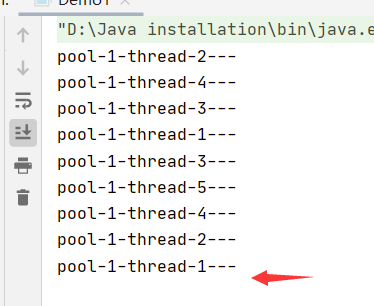
>
> 小结和拓展

#### 如何去设置线程池的最大大小如何去设置？

##### CPU密集型和IO密集型！

------

**1、CPU密集型：电脑的核数是几核就选择几；选择maximunPoolSize的大小**


我们可以使用代码来来获取逻辑处理器数量。

于是**cpu密集型**的写法如下：


**2、I/O密集型：**

在程序中有15个大型任务，io十分占用资源；I/O密集型就是判断我们程序中十分耗I/O的线程数量，大约是最大I/O数的一倍到两倍之间。

## 12、四大函数式接口（必需掌握）

新时代的程序员：**lambda表达式、链式编程、函数式接口、Stream流式计算**

> 函数式接口：只有一个方法的接口

```java
@FunctionalInterface
public interface Runnable {
    public abstract void run();
}
//超级多的@FunctionalInterface
//简化编程模型，在新版本的框架底层大量应用
//foreach()的参数也是一个函数式接口，消费者类的函数式接口
1234567
```


函数型接口可以使用lambda表达式；

**代码测试：**

> Function函数型接口


```java
/**
 * Function函数型接口
 */
public class Demo01 {
    public static void main(String[] args) {
        Function<String,String> function = (str) ->{return str;};//lambda表达式 等效于func的实现类的具体方法
        System.out.println(function.apply("starasdas"));
    }
}
123456789
```

> Predicate断定型接口


```java
/**
 * 断定型接口：有一个输入参数，返回值只能是 布尔值！
 */
public class Demo2 {
    public static void main(String[] args) {
        //判断字符串是否为空
        Predicate<String> predicate = (str)->{return str.isEmpty();};
        System.out.println(predicate.test("11"));
        System.out.println(predicate.test(""));
    }
}
```

> Consummer 消费型接口


```java
/**
 * 消费型接口 没有返回值！只有输入！
 */
public class Demo3 {
    public static void main(String[] args) {
        Consumer<String> consumer = (str)->{
            System.out.println(str);
        };
        consumer.accept("abc");
    }
}
1234567891011
```

> Supplier供给型接口


```java
/**
 * 供给型接口，只返回，不输入
 */
public class Demo4 {
    public static void main(String[] args) {
        Supplier<String> supplier = ()->{return "1024";};
        System.out.println(supplier.get());
    }
}
123456789
```

## 13、Stream流式计算

> 什么是Stream流式计算？

**存储+计算**！

**存储**：集合、MySQL

**计算**：流式计算~

##### === 链式编程 ===

```java
public class Test {
    public static void main(String[] args) {
        User user1 = new User(1,"a",21);
        User user2 = new User(2,"b",22);
        User user3 = new User(3,"c",23);
        User user4 = new User(4,"d",24);
        User user5 = new User(5,"e",25);
        User user6 = new User(6,"f",26);
        List<User> list = Arrays.asList(user1, user2, user3, user4, user5, user6);

        //计算交给流
        //链式编程！！！！
        list.stream()//将集合转化成流 流内为User对象
                .filter((u)->{ return u.getId()%2==0; })				//流内的方法返回类型都为流 参数类型大部分为函数式接口 可用来过滤、映射、排序等
                .filter((u)->{return u.getAge()>23;})
                .map((u)->{return u.getName().toUpperCase;})
                    //自动判断输入类型和返回类型
                .sorted((uu1,uu2)->{
                    return uu2.compareTo(uu1);
                })
                .limit(1)
                .forEach(System.out::println);
    }
}
```

## 14、ForkJoin

> 什么是ForkJoin？

ForkJoin 在JDK1.7，并行执行任务！提高效率~。在大数据量速率会更快！

大数据中：**MapReduce 核心思想->把大任务拆分为小任务！**


> **ForkJoin 特点： 工作窃取！**

实现原理是：**双端队列**！从上面和下面都可以去拿到任务进行执行！


> 如何使用ForkJoin?

- 1、通过**ForkJoinPool**来执行
- 2、计算任务ForkjoinPool. **execute(ForkJoinTask<?> task)**


- 3、计算类要去继承ForkJoinTask；

**ForkJoin的计算类！**

```java
package com.ogj.forkjoin;

import java.util.concurrent.RecursiveTask;

public class ForkJoinDemo extends RecursiveTask<Long> {

    private long star;
    private long end;

    //临界值
    private long temp=1000000L;

    public ForkJoinDemo(long star, long end) {
        this.star = star;
        this.end = end;
    }

    /**
     * 计算方法
     * @return Long
     */
    @Override
    protected Long compute() {
        if((end-star)<temp){
            Long sum = 0L;
            for (Long i = star; i < end; i++) {
                sum+=i;
            }
//            System.out.println(sum);
            return sum;
        }else {
            //使用forkJoin 分而治之 计算
            //计算平均值
            long middle = (star+ end)/2;
            ForkJoinDemo forkJoinDemoTask1 = new ForkJoinDemo(star, middle);
            forkJoinDemoTask1.fork();  //拆分任务，把线程任务压入线程队列
            ForkJoinDemo forkJoinDemoTask2 = new ForkJoinDemo(middle, end);
            forkJoinDemoTask2.fork();  //拆分任务，把线程任务压入线程队列
            long taskSum = forkJoinDemoTask1.join() + forkJoinDemoTask2.join(); //获取分任务的结果
            return taskSum;
        }
    }
}

```

**测试类！**

```java
package com.ogj.forkjoin;

import java.util.concurrent.ExecutionException;
import java.util.concurrent.ForkJoinPool;
import java.util.concurrent.ForkJoinTask;
import java.util.stream.LongStream;

public class Test {
    public static void main(String[] args) throws ExecutionException, InterruptedException {
        test1();
        test2();
        test3();
    }

    /**
     * 普通计算
     */
    public static void test1(){
        long star = System.currentTimeMillis();
        long sum = 0L;
        for (long i = 1; i < 20_0000_0000; i++) {
            sum+=i;
        }
        long end = System.currentTimeMillis();
        System.out.println("sum="+"时间："+(end-star));
        System.out.println(sum);
    }

    /**
     * 使用ForkJoin
     */
    public static void test2() throws ExecutionException, InterruptedException {
        long star = System.currentTimeMillis();
        ForkJoinPool forkJoinPool = new ForkJoinPool();
        ForkJoinTask<Long> task = new ForkJoinDemo(0L, 20_0000_0000L);
        ForkJoinTask<Long> submit = forkJoinPool.submit(task);//返回类型为ForkJoinTask
        Long aLong = submit.get();
        System.out.println(aLong);
        long end = System.currentTimeMillis();
        System.out.println("sum="+"时间："+(end-star));
    }


    /**
     * 使用Stream 并行流
     */
    public static void test3(){
        long star = System.currentTimeMillis();
        //Stream并行流()
        long sum = LongStream.range(0L, 20_0000_0000L).parallel().reduce(0, Long::sum);
        System.out.println(sum);
        long end = System.currentTimeMillis();
        System.out.println("sum="+"时间："+(end-star));
    }
}

##Long::sum表示引用了Long类的sum方法
```

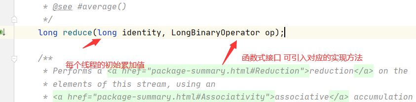

**.parallel().reduce(0, Long::sum)使用一个并行流去进行整个计算，提高效率。**


**reduce方法的优点：**

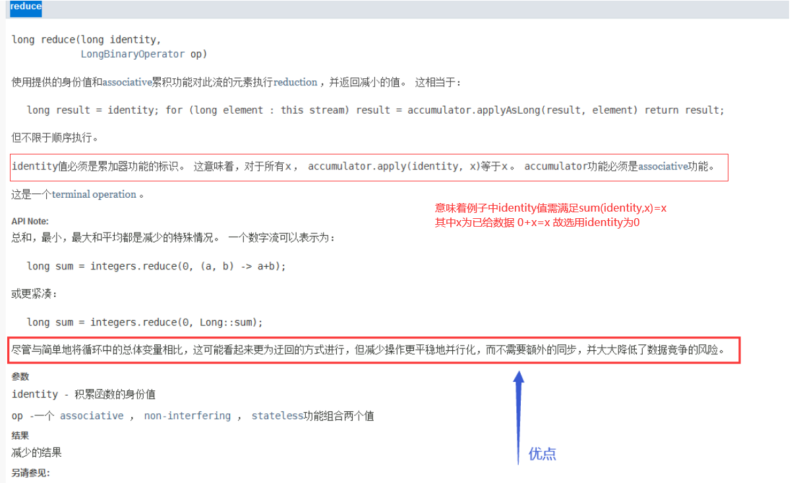

## 15、异步回调

> Future 设计的初衷：对将来的某个事件结果进行建模！

其实就是前端 --> 发送ajax异步请求给后端


但是我们平时都使用**CompletableFuture**

#### （1）没有返回值的runAsync异步回调

```java
public static void main(String[] args) throws ExecutionException, InterruptedException 
{
        // 发起 一个 请求

        System.out.println(System.currentTimeMillis());
        System.out.println("---------------------");
        CompletableFuture<Void> future = CompletableFuture.runAsync(()->{
            //发起一个异步任务
            try {
                TimeUnit.SECONDS.sleep(2);
            } catch (InterruptedException e) {
                e.printStackTrace();
            }
            System.out.println(Thread.currentThread().getName()+".....");
        });
        System.out.println(System.currentTimeMillis());
        System.out.println("------------------------------");
        //输出执行结果
        System.out.println(future.get());  //获取执行结果
 }
```

#### （2）有返回值的异步回调supplyAsync

```java
//有返回值的异步回调
CompletableFuture<Integer> completableFuture=CompletableFuture.supplyAsync(()->{
    System.out.println(Thread.currentThread().getName());
    try {
        TimeUnit.SECONDS.sleep(2);
        int i=1/0;
    } catch (InterruptedException e) {
        e.printStackTrace();
    }
    return 1024;
});
System.out.println(completableFuture.whenComplete((t, u) -> {
    // 回调
    System.out.println("t=>" + t); //正常的返回结果
    System.out.println("u=>" + u); //抛出异常的 错误信息
}).exceptionally((e) -> {
    //回调出错误信息
    System.out.println(e.getMessage());
    return 404;
}).get());
1234567891011121314151617181920
```

**whenComplete**: 有两个参数，一个是t 一个是u

T：是代表的 **正常返回的结果**；

U：是代表的 **抛出异常的错误信息**；

如果发生了异常，get可以获取到**exceptionally**返回的值；

## 16.JMM

> 请你谈谈你对Volatile 的理解

**Volatile** 是 Java 虚拟机提供 **轻量级的同步机制**

**1、保证可见性
2、不保证原子性
3、禁止指令重排**

> 什么是JMM？

JMM：JAVA内存模型，不存在的东西，是一个概念，也是一个约定！

**关于JMM的一些同步的约定：**

1、线程解锁前，必须把共享变量**立刻**刷回主存；

2、线程加锁前，必须**读取主存**中的最新值到工作内存中；

3、加锁和解锁是同一把锁；

线程中分为 **工作内存、主内存**

**8种操作**:

- **Read（读取）**：作用于主内存变量，它把一个变量的值从主内存传输到线程的工作内存中，以便随后的load动作使用；
- **load（载入）**：作用于工作内存的变量，它把read操作从主存中变量放入工作内存中；
- **Use（使用）**：作用于工作内存中的变量，它把工作内存中的变量传输给执行引擎，每当虚拟机遇到一个需要使用到变量的值，就会使用到这个指令；
- **assign（赋值）**：作用于工作内存中的变量，它把一个从执行引擎中接受到的值放入工作内存的变量副本中；
- **store（存储）**：作用于主内存中的变量，它把一个从工作内存中一个变量的值传送到主内存中，以便后续的write使用；
- **write（写入）**：作用于主内存中的变量，它把store操作从工作内存中得到的变量的值放入主内存的变量中；
- **lock（锁定）**：作用于主内存的变量，把一个变量标识为线程独占状态；
- **unlock（解锁）**：作用于主内存的变量，它把一个处于锁定状态的变量释放出来，释放后的变量才可以被其他线程锁定；


**JMM对这8种操作给了相应的规定**：

- 不允许read和load、store和write操作之一单独出现。即使用了read必须load，使用了store必须write
- 不允许线程丢弃他最近的assign操作，即工作变量的数据改变了之后，必须告知主存
- 不允许一个线程将没有assign的数据从工作内存同步回主内存
- 一个新的变量必须在主内存中诞生，不允许工作内存直接使用一个未被初始化的变量。就是对变量实施use、store操作之前，必须经过assign和load操作
- 一个变量同一时间只有一个线程能对其进行lock。多次lock后，必须执行相同次数的unlock才能解锁
- 如果对一个变量进行lock操作，会清空所有工作内存中此变量的值，在执行引擎使用这个变量前，必须重新load或assign操作初始化变量的值
- 如果一个变量没有被lock，就不能对其进行unlock操作。也不能unlock一个被其他线程锁住的变量
- 对一个变量进行unlock操作之前，必须把此变量同步回主内存


遇到问题：**程序不知道主存中的值已经被修改过了！；**

## 17.Volatile

> 1、保证可见性

```java
public class JMMDemo01 {

    // 如果不加volatile 程序会死循环
    // 加了volatile是可以保证可见性的
    private volatile static Integer number = 0;

    public static void main(String[] args) {
        //main线程
        //子线程1
        new Thread(()->{
            while (number==0){
            }
        }).start();
        try {
            TimeUnit.SECONDS.sleep(2);
        } catch (InterruptedException e) {
            e.printStackTrace();
        }
        //子线程2
        new Thread(()->{
            while (number==0){
            }

        }).start();
        try {
            TimeUnit.SECONDS.sleep(2);
        } catch (InterruptedException e) {
            e.printStackTrace();
        }
        number=1;//变量为volatile 变化值后 其他线程可见
        //主存变量发生改变 线程的工作内存中的这个副本变量还是未改之前的 则该线程需先回到主存中读取最新的值 立刻收到最新消息这个机制叫可见性。//加了volatile有了可见性 number值修改后 通知线程重新拷贝值到工作内存中
    
        System.out.println(number);
    }
```

> 2、不保证原子性

原子性：不可分割；Java中只有对基本类型变量的赋值和读取是原子操作，如i = 1的赋值操作，但是像j = i或者i++这样的操作都不是原子操作，因为他们都进行了多次原子操作，比如先读取i的值，再将i的值赋值给j，两个原子操作加起来就不是原子操作了。

线程A在执行任务的时候，不能被打扰的，也不能被分割的，要么同时成功，要么同时失败。

```java
/**
 * 不保证原子性
 * number <=2w
 * 
 */
public class VDemo02 {

    private static volatile int number = 0;

    public static void add(){
        number++; 
        //++ 不是一个原子性操作，是两个~3个操作
        //
    }

    public static void main(String[] args) {
        //理论上number  === 20000

        for (int i = 1; i <= 20; i++) {
            new Thread(()->{
                for (int j = 1; j <= 1000 ; j++) {
                    add();
                }
            }).start();
        }

        while (Thread.activeCount()>2){
            //main  gc
            Thread.yield();
        }
        System.out.println(Thread.currentThread().getName()+",num="+number);
    }
}
volatile不具有原子性的理解：1、线程读取i 2、temp=i+1 3、i=temp
    当i=5时 A B线程同时读入了 i 的值， 然后A线程执行了 temp = i + 1的操作， 要注意，此时的 i 的值还没有变化，然后B线程也执行了 temp = i + 1的操作，注意，此时A，B两个线程保存的 i 的值都是5，temp 的值都是6， 然后A线程执行了 i = temp （6）的操作，此时i的值会立即刷新到主存并通知其他线程保存的 i 值失效， 此时B线程需要重新读取 i 的值那么此时B线程保存的 i 就是6，同时B线程保存的 temp 还仍然是6， 然后B线程执行 i=temp （6），（缓存一致性原则将B中的i变为新值，但是这个 i 值的改变也不会影响它将之前执行完的 i+1 得到的值赋给 i这一步，只是重新读取而已后续操作并无影响） 所以导致了计算结果比预期少了1
```

**如果不加lock和synchronized ，怎么样保证原子性？**


解决方法：使用JUC下的原子包下的class；


代码如下：

```java
public class VDemo02 {

    private static volatile AtomicInteger number = new AtomicInteger();

    public static void add(){
//        number++;
        number.incrementAndGet();  //底层是CAS保证的原子性 已原子方式将当前值加1
    }

    public static void main(String[] args) {
        //理论上number  === 20000

        for (int i = 1; i <= 20; i++) {
            new Thread(()->{
                for (int j = 1; j <= 1000 ; j++) {
                    add();
                }
            }).start();
        }

        while (Thread.activeCount()>2){
            //main  gc
            Thread.yield();
        }
        System.out.println(Thread.currentThread().getName()+",num="+number);
    }
}
```

这些类的底层都直接和操作系统挂钩！是在内存中修改值。

Unsafe类是一个很特殊的存在；

> 原子类为什么这么高级？

> 3、禁止指令重排

**什么是指令重排？**

我们写的程序，计算机并不是按照我们自己写的那样去执行的

源代码–>编译器优化重排–>指令并行也可能会重排–>内存系统也会重排–>执行

**处理器在进行指令重排的时候，会考虑数据之间的依赖性！**

```java
int x=1; //1
int y=2; //2
x=x+5;   //3
y=x*x;   //4

//我们期望的执行顺序是 1_2_3_4  可能执行的顺序会变成2134 1324
//可不可能是 4123？ 不可能的
1234567
```

可能造成的影响结果：前提：a b x y这四个值 默认都是0

| 线程A | 线程B |
| ----- | ----- |
| x=a   | y=b   |
| b=1   | a=2   |

正常的结果： x = 0; y =0;

| 线程A | 线程B |
| ----- | ----- |
| x=a   | y=b   |
| b=1   | a=2   |

可能在线程A中会出现，先执行b=1,然后再执行x=a；

在B线程中可能会出现，先执行a=2，然后执行y=b；

那么就有可能结果如下：x=2; y=1.

**volatile可以避免指令重排：**

**volatile中会加一道内存的屏障，这个内存屏障可以保证在这个屏障中的指令顺序。**

内存屏障：CPU指令。作用：

1、保证特定的操作的执行顺序；

2、可以保证某些变量的内存可见性（利用这些特性，就可以保证volatile实现的可见性）


> 总结

- **volatile可以保证可见性；**
- **不能保证原子性**
- **由于内存屏障，可以保证避免指令重排的现象产生**

面试官：那么你知道在哪里用这个内存屏障用得最多呢？**单例模式**

## 18、玩转单例模式

饿汉式、DCL懒汉式

> 饿汉式

```java
/**
 * 饿汉式单例
 */
public class Hungry {

    /**
     * 可能会浪费空间
     */
    private byte[] data1=new byte[1024*1024];
    private byte[] data2=new byte[1024*1024];
    private byte[] data3=new byte[1024*1024];
    private byte[] data4=new byte[1024*1024];


    private Hungry(){

    }
    private final static Hungry hungry = new Hungry();

    public static Hungry getInstance(){
        return hungry;
    }

}
```

> DCL懒汉式

```java
//懒汉式单例模式
public class LazyMan {

    private static boolean key = false;//标志位

    private LazyMan(){
        synchronized (LazyMan.class){
            if (key==false){
                key=true;
            }
            else{
                throw new RuntimeException("不要试图使用反射破坏异常");
            }
        }
        System.out.println(Thread.currentThread().getName()+" ok");
    }
    private volatile static LazyMan lazyMan;

    //双重检测锁模式 简称DCL懒汉式
    public static LazyMan getInstance(){
        //需要加锁 保证原子性
        if(lazyMan==null){
            synchronized (LazyMan.class){
                if(lazyMan==null){
                    lazyMan=new LazyMan();
                    /**
                     * 1、分配内存空间
                     * 2、执行构造方法，初始化对象
                     * 3、把这个对象指向这个空间
                     *
                     *  就有可能出现指令重排问题
                     *  比如执行的顺序是1 3 2 等  如线程A先走了13 然后线程B发现lazyMan!=null不走同步代码块 直接返回对象而对象还没初始化此时出现问题
                     *  我们就可以添加volatile去除指令重排问题
                     */
                }
            }
        }
        return lazyMan;
    }
    //单线程下 是ok的
    //但是如果是并发的
    public static void main(String[] args) throws NoSuchMethodException, IllegalAccessException, InvocationTargetException, InstantiationException, NoSuchFieldException {
        //Java中有反射
//        LazyMan instance = LazyMan.getInstance();
        Field key = LazyMan.class.getDeclaredField("key");//获取对应类中指定的变量域
        key.setAccessible(true);
        Constructor<LazyMan> declaredConstructor = LazyMan.class.getDeclaredConstructor(null);//无参构造
        declaredConstructor.setAccessible(true); //无视了私有的构造器
        LazyMan lazyMan1 = declaredConstructor.newInstance();//不创建对象 通过反射new 通过构造器创建
        key.set(lazyMan1,false); ##key值从true改为false 可以再次创建
        LazyMan instance = declaredConstructor.newInstance();

        System.out.println(instance);
        System.out.println(lazyMan1);
        System.out.println(instance == lazyMan1);
    }
}
```

> 静态内部类

```java
//静态内部类
public class Holder {
    private Holder(){

    }
    public static Holder getInstance(){
        return InnerClass.holder;
    }
    public static class InnerClass{
        private static final Holder holder = new  ();
    }
}
```

> 单例不安全, 因为反射

> 枚举

```java
//enum 是什么？ enum本身就是一个Class 类
public enum EnumSingle {
    INSTANCE;
    public EnumSingle getInstance(){
        return INSTANCE;
    }
}

class Test{
    public static void main(String[] args) throws NoSuchMethodException, IllegalAccessException, InvocationTargetException, InstantiationException {
        EnumSingle instance1 = EnumSingle.INSTANCE;
        Constructor<EnumSingle> declaredConstructor = EnumSingle.class.getDeclaredConstructor(String.class,int.class);//没有无参构造器 但有new无参
        declaredConstructor.setAccessible(true);
        //java.lang.NoSuchMethodException: com.ogj.single.EnumSingle.<init>()

        EnumSingle instance2 = declaredConstructor.newInstance();
        System.out.println(instance1);
        System.out.println(instance2);
    }
}
```

使用枚举，我们就可以防止反射破坏了。


枚举类型使用JAD最终反编译后源码：

如果我们看idea 的文件：会发现idea骗了我们，居然告诉我们是无参构造的，我们使用jad进行反编译。


```java
public final class EnumSingle extends Enum
{

    public static EnumSingle[] values()
    {
        return (EnumSingle[])$VALUES.clone();
    }

    public static EnumSingle valueOf(String name)
    {
        return (EnumSingle)Enum.valueOf(com/ogj/single/EnumSingle, name);
    }

    private EnumSingle(String s, int i)
    {
        super(s, i);
    }

    public EnumSingle getInstance()
    {
        return INSTANCE;
    }

    public static final EnumSingle INSTANCE;
    private static final EnumSingle $VALUES[];

    static 
    {
        INSTANCE = new EnumSingle("INSTANCE", 0);
        $VALUES = (new EnumSingle[] {
            INSTANCE
        });
    }
}
```

## 19、深入理解CAS

> 什么是CAS？

大厂必须深入研究底层！！！！**修内功！操作系统、计算机网络原理、组成原理、数据结构**

```java
public class casDemo { ##CAS原理不懂
    //CAS : compareAndSet 比较并交换
    public static void main(String[] args) {
        AtomicInteger atomicInteger = new AtomicInteger(2020);

        //boolean compareAndSet(int expect, int update)
        //期望值、更新值
        //如果实际值 和 我的期望值相同，那么就更新
        //如果实际值 和 我的期望值不同，那么就不更新
        System.out.println(atomicInteger.compareAndSet(2020, 2021));
        System.out.println(atomicInteger.get());

        //因为期望值是2020  实际值却变成了2021  所以会修改失败
        //CAS 是CPU的并发原语
        atomicInteger.getAndIncrement(); //++操作
        System.out.println(atomicInteger.compareAndSet(2020, 2021));
        System.out.println(atomicInteger.get());
    }
}
```


> Unsafe类


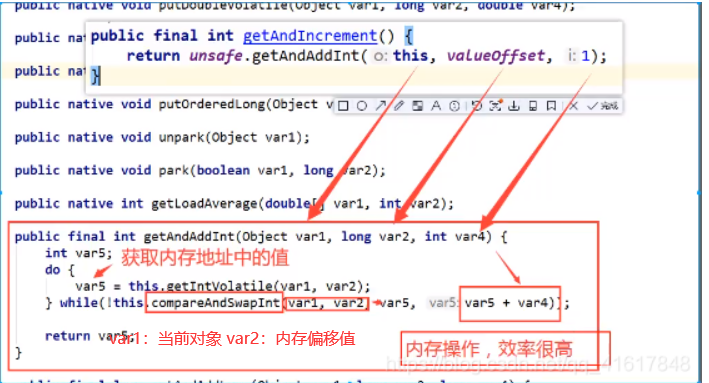

var1相当于数组对象a，var2相当于a中的角标i，因为var5==a[i] ，var5+1就是a[i]+1，即实现了getAndIncrement()

如果var1和var2所决定的值(内存值)等于var5(工作内存中的值)则进行内存操作

**总结：**

CAS：**比较当前工作内存中的值 和 主内存中的值，如果这个值是期望的，那么则执行操作！如果不是就一直循环，使用的是自旋锁。**

**缺点：**

- 循环会耗时；
- 一次性只能保证一个共享变量的原子性；
- 它会存在ABA问题

> CAS：ABA问题？(狸猫换太子)


线程1：期望值是1，要变成2；

线程2：两个操作：

- 1、期望值是1，变成3
- 2、期望是3，变成1

所以对于线程1来说，A的值还是1，所以就出现了问题，骗过了线程1；

```java
public class casDemo {##为什么有两个线程
    //CAS : compareAndSet 比较并交换
    public static void main(String[] args) {
        AtomicInteger atomicInteger = new AtomicInteger(2020);

        System.out.println(atomicInteger.compareAndSet(2020, 2021));
        System.out.println(atomicInteger.get());

        //boolean compareAndSet(int expect, int update)
        //期望值、更新值
        //如果实际值 和 我的期望值相同，那么就更新
        //如果实际值 和 我的期望值不同，那么就不更新
        System.out.println(atomicInteger.compareAndSet(2021, 2020));
        System.out.println(atomicInteger.get());

        //因为期望值是2020  实际值却变成了2021  所以会修改失败
        //CAS 是CPU的并发原语
//        atomicInteger.getAndIncrement(); //++操作
        System.out.println(atomicInteger.compareAndSet(2020, 2021));
        System.out.println(atomicInteger.get());
    }
}
```

## 20、原子引用

> 解决ABA问题，对应的思想：就是使用了**乐观锁~**

**带版本号的 原子操作**！

**Integer 使用了对象缓存机制，默认范围是-128~127，推荐使用静态工厂方法valueOf获取对象实例，而不是new，因为valueOf使用缓存，而new一定会创建新的对象分配新的内存空间。**


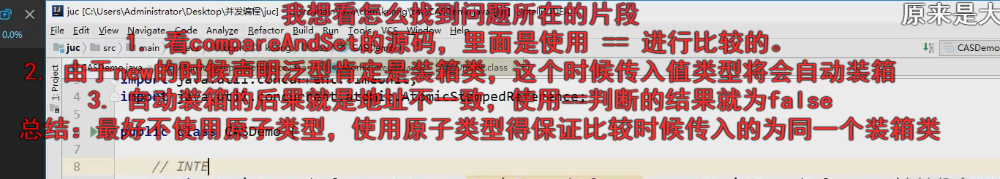

所以如果遇到，使用大于128的时候，**使用原子引用的时候，如果超过了这个值，那么就不会进行版本上升！**


那么如果我们使用小于128的时候：

```java
package com.marchsoft.lockdemo;

import java.util.concurrent.TimeUnit;
import java.util.concurrent.atomic.AtomicStampedReference;

/**
 * Description：
 *
 * @author jiaoqianjin
 * Date: 2020/8/12 22:07
 **/

public class CASDemo {
    /**AtomicStampedReference 注意，如果泛型是一个包装类，注意对象的引用问题
     * 正常在业务操作，这里面比较的都是一个个对象
     */
    static AtomicStampedReference<Integer> atomicStampedReference = new
            AtomicStampedReference<>(1, 1);

    // CAS compareAndSet : 比较并交换！
    public static void main(String[] args) {
        new Thread(() -> {
            int stamp = atomicStampedReference.getStamp(); // 获得版本号
            System.out.println("a1=>" + stamp);
            
            try {
                TimeUnit.SECONDS.sleep(1);
            } catch (InterruptedException e) {
                e.printStackTrace();
            }
            // 修改操作时，版本号更新 + 1
            atomicStampedReference.compareAndSet(1, 2,
                    atomicStampedReference.getStamp(),
                    atomicStampedReference.getStamp() + 1);
            
            System.out.println("a2=>" + atomicStampedReference.getStamp());
            // 重新把值改回去， 版本号更新 + 1
            System.out.println(atomicStampedReference.compareAndSet(2, 1,
                    atomicStampedReference.getStamp(),
                    atomicStampedReference.getStamp() + 1));
            System.out.println("a3=>" + atomicStampedReference.getStamp());
        }, "a").start();
        
        // 乐观锁的原理相同！
        new Thread(() -> {
            int stamp = atomicStampedReference.getStamp(); // 获得版本号
            System.out.println("b1=>" + stamp);
            try {
                TimeUnit.SECONDS.sleep(2);
            } catch (InterruptedException e) {
                e.printStackTrace();
            }
            System.out.println(atomicStampedReference.compareAndSet(1, 3,
                    stamp, stamp + 1));//期望版本号与所给版本号相符时才会执行 否则返回false
            System.out.println("b2=>" + atomicStampedReference.getStamp());
        }, "b").start();
    }
}
##乐观锁是什么
```


正常业务操作中，我们一般使用的是一个个对象，一般情况不会遇到这种情况。

## 21、各种锁的理解

------

#### 1、公平锁、非公平锁

**公平锁**：非常公平；不能插队的，必须先来后到；

```java
/**
 * Creates an instance of {@code ReentrantLock}.
 * This is equivalent to using {@code ReentrantLock(false)}.
 */
public ReentrantLock() {
    sync = new NonfairSync();
}
```

**非公平锁**：非常不公平，允许插队的，可以改变顺序。

```java
/**
 * Creates an instance of {@code ReentrantLock} with the
 * given fairness policy.
 *
 * @param fair {@code true} if this lock should use a fair ordering policy
 */
public ReentrantLock(boolean fair) {
    sync = fair ? new FairSync() : new NonfairSync();
}
```

#### 2、可重入锁

可重入锁(递归锁)


> Synchronized锁

```java
public class Demo01 {
    public static void main(String[] args) {
        Phone phone = new Phone();
        new Thread(()->{
            phone.sms();
        },"A").start();
        new Thread(()->{
            phone.sms();
        },"B").start();
    }

}

class Phone{
    public synchronized void sms(){
        System.out.println(Thread.currentThread().getName()+"=> sms");
        call();//这里也有一把锁
    }
    public synchronized void call(){
        System.out.println(Thread.currentThread().getName()+"=> call");
    }
```

> lock锁

```java
//lock
public class Demo02 {

    public static void main(String[] args) {
        Phone2 phone = new Phone2();
        new Thread(()->{
            phone.sms();
        },"A").start();
        new Thread(()->{
            phone.sms();
        },"B").start();
    }

}
class Phone2{

    Lock lock=new ReentrantLock();

    public void sms(){
        lock.lock(); //细节：这个是两把锁，两个钥匙
        //lock锁必须配对，否则就会死锁在里面
        try {
            System.out.println(Thread.currentThread().getName()+"=> sms");
            call();//这里也有一把锁
        } catch (Exception e) {
            e.printStackTrace();
        }finally {
            lock.unlock();
        }
    }
    public void call(){
        lock.lock();
        try {
            System.out.println(Thread.currentThread().getName() + "=> call");
        }catch (Exception e){
            e.printStackTrace();
        }
        finally {
            lock.unlock();
        }
    }
}
```

- lock锁必须配对，相当于lock和 unlock 必须数量相同；
- 在外面加的锁，也可以在里面解锁；在里面加的锁，在外面也可以解锁；

#### 3、自旋锁

spinlock

```java
public final int getAndAddInt(Object var1, long var2, int var4) {
    int var5;
    do {
        var5 = this.getIntVolatile(var1, var2);
    } while(!this.compareAndSwapInt(var1, var2, var5, var5 + var4));
    return var5;
}
```

**自我设计自旋锁：**

```java
public class SpinlockDemo {
##AtomicReference详解
    //int 0
    //thread null 原子引用对象默认初始值为null
    //T1进来是拿到锁，当前原子Thread对象是期望的null,变成thread，这时候线程T2拿到锁后是t2开始自旋，等待T1解锁变回null，T2才能走出自旋，我是这样理解的
    AtomicReference<Thread> atomicReference=new AtomicReference<>();
 
    //加锁
    public void myLock(){
        Thread thread = Thread.currentThread();
        System.out.println(thread.getName()+"===> mylock");

        //自旋锁
        while (!atomicReference.compareAndSet(null,thread)){
            System.out.println(Thread.currentThread().getName()+" ==> 自旋中~");
        }
    }


    //解锁
    public void myunlock(){
        Thread thread=Thread.currentThread();
        System.out.println(thread.getName()+"===> myUnlock");
        atomicReference.compareAndSet(thread,null);
    }

}
public class TestSpinLock {
    public static void main(String[] args) throws InterruptedException {
        ReentrantLock reentrantLock = new ReentrantLock();
        reentrantLock.lock();
        reentrantLock.unlock();


        //使用CAS实现自旋锁
        SpinlockDemo spinlockDemo=new SpinlockDemo();
        new Thread(()->{
            spinlockDemo.myLock();
            try {
                TimeUnit.SECONDS.sleep(3);
            } catch (Exception e) {
                e.printStackTrace();
            } finally {
                spinlockDemo.myunlock();
            }
        },"t1").start();

        TimeUnit.SECONDS.sleep(1);


        new Thread(()->{
            spinlockDemo.myLock();
            try {
                TimeUnit.SECONDS.sleep(3);
            } catch (Exception e) {
                e.printStackTrace();
            } finally {
                spinlockDemo.myunlock();
            }
        },"t2").start();
    }
}
```

运行结果：

**t2进程必须等待t1进程Unlock后，才能Unlock，在这之前进行自旋等待。。。。**


#### 4、死锁

> 死锁是什么？


死锁测试，怎么排除死锁：

```java
package com.ogj.lock;

import java.util.concurrent.TimeUnit;

public class DeadLock {
    public static void main(String[] args) {
        String lockA= "lockA";
        String lockB= "lockB";

        new Thread(new MyThread(lockA,lockB),"t1").start();
        new Thread(new MyThread(lockB,lockA),"t2").start();
    }
}

class MyThread implements Runnable{

    private String lockA;
    private String lockB;

    public MyThread(String lockA, String lockB) {
        this.lockA = lockA;
        this.lockB = lockB;
    }

    @Override
    public void run() {
        synchronized (lockA){//对t2线程来说需要的锁是lockB 因为t2的lockA是lockB
            System.out.println(Thread.currentThread().getName()+" lock"+lockA+"===>get"+lockB);
            try {
                TimeUnit.SECONDS.sleep(2);//确保t2线程拿到lockB锁
            } catch (InterruptedException e) {
                e.printStackTrace();
            }
            synchronized (lockB){
                System.out.println(Thread.currentThread().getName()+" lock"+lockB+"===>get"+lockA);
            }
        }
    }
}
```

> 解决问题

**1、使用jps定位进程号，jdk的bin目录下： 有一个jps**

命令：`jps -l`

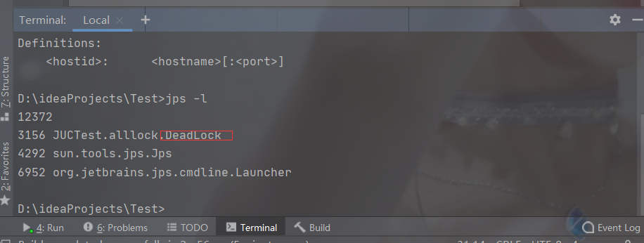

**2、使用`jstack` 进程进程号 找到死锁信息**


**一般情况信息在最后：**


**面试，工作中！排查问题！**

**1、日志**

**2、堆栈信息**

