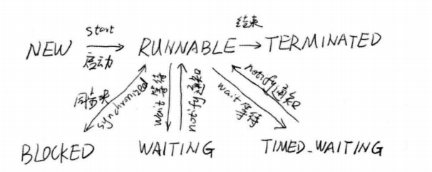
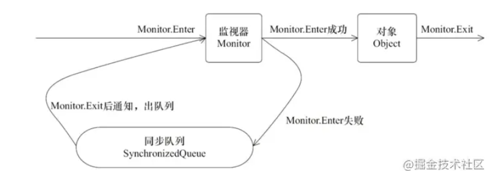

# chr2 java并行程序基础

### 2.1　有关线程你必须知道的事 29

* 线程是计算机中的程序关于某数据集合上的一次运行活动，进程是线程的容器。程序是指令、数据及其组织形式的描述，进程是程序的实体。
* 线程就是轻量级进程，是程序执行的最小单位。
* 线程的声明周期：

- 线程状态 面试点

```java
public enum State{
NEW, // 刚创建的线程，还没开始执行 通过start()方法执行
RUNNABLE, // 线程执行中，已获得所需的一切资源。
BLOCKED,// 执行线程遇到synchronized同步块，就会进入阻塞模式，这是线程会暂停执行，直到获得请求的锁。
WAITING,// 等待状态 无时间限制的等待 等待一些特殊事件 如 wait()等待notify()方法，通过join()方法等待的线程会等待目标线程的终止。一旦等待到期望事件，就会再次执行，进入Runnable状态
TIMED_WAITING,// 等待状态 有时间限制的等待，
TERMINATED // 结束状态 线程执行完毕后 会进入的状态
}
```

* 从NEW状态出发后，线程不能再回到NEW状态，同理，出于TERMINATED的线程也不能再回到RUNNABLE状态


### 2.2　初始线程：线程的基本操作 32

* 了解java中为线程操作所提供的一些API。比如，如何新建并且启动线程，如何终止线程、中断线程当。
* 一个java程序就是一个多线程程序，其包含了以下线程：1）分发处理发送给jvm信号的线程 ；2）调用对象的finalize方法的线程 ；3）清除Reference【引用】的线程；4）main线程，用户程序的入口。


#### 2.2.1　新建线程 32 面试点 哪几种方式

- Thread类和Runnable类，Thread中的构造方法`public Thread(Runnable target)`，其中run函数如下：

  【默认情况下Thread的run()方法什么都没做，必须重载run()方法(继承实现）或 提供Runnable（使用接口来定义Thread，最常用）】

```
public void run(){
    if(target != null){
        target.run();
    }
}
```

* 线程Thread有一个run方法，start()方法会创建一个线程并让这个线程执行run()方法。
* 不要用run()来开启新线程，它只会在当前线程中，串行执行run()中的代码。
* callable 、线程池等

**三种方式新建线程**

* 继承Thread类并重写run方法
  * 一个类只能继承一个父类，是这个方法的局限
* 实现runnable接口
  * runnable接口没有start方法【Thread类中才有】，只有run方法
  * Thread中的一个构造方法public Thread(Runnable target)此构造方法接受Runnable对象，即可以通过Thread类来启动该Runnable对象实现的多线程
  * 优势
    * 避免了单继承的局限，一个类可以实现多个接口
    * 适合于资源的共享
* 实现callable接口，其常提交给线程池异步执行或者用FutureTask进行封装开启一个线程执行，也可通过Executors的callable方法将Runnable转换为Callable 
  * Callable 和 Runnable的使用方法大同小异，区别在于：
    * Callable使用call()方法，Runnable使用run()方法
    * call()可以返回值，而run()方法不能返回
    * call()可以抛出受检查的异常，比如ClassNotFoundException， 而run()不能抛出受检查的异常。

#### 线程与进程

* 一个进程往往可以包含多个线程，至少包含一个

* java默认有两个线程

  * main(主线程)
  * GC(垃圾回收线程)

* 对java而言有三种线程：Thread、Runnable、Callable

* java不可以直接开启线程（因为Java是运行在虚拟机系统上的，不能直接与硬件进行交互），需要底层的本地c++方法开启。

  ```java
  public synchronized void start() {
          if (threadStatus != 0)
              throw new IllegalThreadStateException();
  
          group.add(this);
  
          boolean started = false;
          try {
              // private native void start0(); 这是一个本地方法，底层的C++
              start0();
              started = true;
          } finally {
              try {
                  if (!started) {
                      group.threadStartFailed(this);
                  }
              } catch (Throwable ignore) {
                  /* do nothing. If start0 threw a Throwable then
                    it will be passed up the call stack */
              }
          }
      }
  ```

  

#### 2.2.2　终止线程 34

* 一般线程在执行完毕后就会结束，无需手工关闭，但有些线程通常不会正常终结

* Thread.stop方法在结束线程时，会直接终止线程，并且会立即释放这个线程所持有的锁。

- 终止线程的stop方法不建议使用，其强行把执行到一半的线程终止，可能会导致**数据不一致**，可以使用内部设置函数来解决问题【自行决定线程何时退出】


#### 2.2.3　线程中断 38 

* 线程中断并不会使线程立即退出，而是给线程发送一个通知，告知目标线程，有人希望你退出，**目标线程自行决定接到通知后如何处理。**【通过判断是否中断来决定收到通知后如何处理】

```java
public void Thread.interrupt() //中断线程 通知线程中断，设置中断标志位
public boolean Thread.isInterrupted() //判断线程是否中断
public static boolean Thread.interrupted() //判断是否中断，并清除中断状态
```

* wait()或者sleep()这样的操作，任然可识别中断

* 在sleep时，如果来临中断，会抛出中断异常，**同时也会将中断标记位清空**，所以异常处理那里经常要再次中断自己【保证数据的一致性和完整性，如果不再此中断，数据可能还会被操作】


#### 2.2.4　等待（wait）和通知（notify） 41

* Object类中提供了多线程间协作的wait()方法和notify()方法，即任何对象都可以调用这两个方法。
* wait方法会让当前线程在这个对象上等待【停止执行转为等待状态】，直到其他线程调用相应的notify方法为止。

- wait会让当前线程进入object对象的等待队列，notify会从相应的等待队列中随机选择一个线程唤醒，随机选择即不公平。

- notify方法则会唤醒等待队列中的所有线程。

- wait和notify方法都不是可以随便调用的，必须包含在相应的synchronzied语句中，即首先获得目标对象的监视器。wait方法执行后会释放这个监视器【synchronzied锁住的对象，对象即wait的调用者】，**notify方法执行前必须获得监视器，执行完后只是唤醒一个等待进程，并不会释放监视器**，原先的等待进程必须重新获得监视器才是真正意义上的继续执行。

- [SimpleWN](https://hub.fastgit.org/guanpengchn/java-concurrent-programming/blob/master/src/main/java/ch2/SimpleWN.java)

  ### sleep() vs wait()

- 共同的作用，wait和sleep都可以让线程进入等待状态[wait]

- 来自不同的类，sleep()方法是Thread的静态方法，而wait是Object实例方法

- 使用的范围不同，wait()方法必须要在同步方法或者同步块中调用，也就是必须已经获得对象锁。而sleep()方法没有这个限制可以在任何地方种使用。

- 关于资源的释放，wait()方法会释放占有的对象锁，使得该线程进入等待池中，等待下一次获取资源。而sleep()方法只是会让出CPU并不会释放掉对象锁；

- 是否可被唤醒，sleep()方法在休眠时间达到后如果再次获得CPU时间片就会继续执行，而wait()方法必须等待Object.notift/Object.notifyAll通知后，才会离开等待池，并且再次获得CPU时间片才会继续执行。

  

#### 2.2.5　挂起（suspend）和继续执行（resume）线程 44

* 被挂起【suspend】的线程必须等到resume后，才能继续执行。

- suspend和resume不推荐使用，**因为不会释放锁资源**【其他线程想要访问它暂用的锁，都会被牵连】，查看jstack时可以使用jps查看pid
- 被挂起的线程状态还是Runnable..，会影响我们对系统当前状态的判断。
- resume操作可能意外地在suspend前执行，这样挂起地线程很难有机会继续执行...
- [BadSuspend](https://hub.fastgit.org/guanpengchn/java-concurrent-programming/blob/master/src/main/java/ch2/BadSuspend.java)


#### 2.2.6　等待线程结束（join）和谦让（yield） 48

* 用于线程之间的协作，分工合作。

* join():当前线程等待依赖的线程执行完毕才能继续执行。调用者为所依赖的线程，可给最大等待时间参数。

* join的本质：**让当前线程在依赖线程对象上进行等待**。依赖线程执行完后会在退出前调用notifyAll方法通知所有等待线程继续执行。

  ```java
  // 锁住所依赖的线程对象
  public final synchronized void join()
      throws InterruptedException {
      	// 如果所依赖线程的线程对象存活
         while (isAlive()) {
             // 当前线程会处于对所依赖线程的wait状态 
                  wait(0); // thread.wait(0) 对所依赖线程的等待状态 因为执行这段语句的是当前线程，所以其会从执行态转为等待态。
              }
  }
  ```

  ````java
  // 所依赖线程销毁操作会唤醒 所有的等待线程
  void threadTerminated(Thread t) {
      synchronized (this) {
          remove(t);
  
          if (nthreads == 0) {
              // 唤醒所有的等待线程。
              notifyAll();
          }
          if (daemon && (nthreads == 0) &&
              (nUnstartedThreads == 0) && (ngroups == 0))
          {
              destroy();
          }
      }
  }
  ````

* Thread.yield() : 静态方法，会使当前线程让出cpu，给其他线程工作机会。sleep()和yield()方法，同样都是当前线程会交出处理器资源，而它们不同的是，sleep()交出来的时间片其他线程都可以去竞争，也就是说都有机会获得当前线程让出的时间片。而yield()方法**只允许与当前线程具有相同优先级的线程能够获得释放出来的CPU时间片。**

  

- [JoinMain](https://hub.fastgit.org/guanpengchn/java-concurrent-programming/blob/master/src/main/java/ch2/JoinMain.java)


### 2.3　volatile与Java内存模型（JMM） 50 面试点

- volatile关键字会让编译器不要优化目标指令。
- volatile关键字声明一个变量，即表示该变量可能会被某些线程修改。
- volatile保证了可见性，即变量修改后其他线程可见修改。
- volatile无法保证复合操作【i++】的原子性。
- volatile并不能真正的保证线程安全。它只能确保一个线程修改了数据后，其他线程能看到这个改动。但当两个线程同时修改某一个数据时，却依然会产生冲突。
- [NoVisibility](https://hub.fastgit.org/guanpengchn/java-concurrent-programming/blob/master/src/main/java/ch2/NoVisibility.java)


//TODO 虚拟机 -client和-server启动的区别

### 2.4　分门别类的管理：线程组 52

* 可将多个线程放入线程组中进行分门别类的管理

- [ThreadGroupName](https://hub.fastgit.org/guanpengchn/java-concurrent-programming/blob/master/src/main/java/ch2/ThreadGroupName.java)


### 2.5　驻守后台：守护线程（Daemon） 54

* 守护线程：系统的守护者，后台默默完成系统性的服务。
* 用户线程：工作线程，完成程序的业务操作。
* 一个java应用内，只有守护线程时，没有有守护的对象了，jvm会自然退出。需要注意的是**守护线程在退出的时候并不会执行finnaly块中的代码，所以将释放资源等操作不要放在finnaly块中执行，这种操作是不安全的**
* 线程可以通过setDaemon(true)的方法将线程设置为守护线程。并且需要注意的是**设置守护线程要先于start()方法**，否则会报IllegalThreadStateException这样的异常，但是该线程还是会执行，只不过**会当做正常的用户线程执行。**

- [DaemonDemo](https://hub.fastgit.org/guanpengchn/java-concurrent-programming/blob/master/src/main/java/ch2/DaemonDemo.java)


### 2.6　先干重要的事：线程优先级 55

* 优先级高的线程在竞争资源时会更有优势，更有可能抢占资源。

* ```java
      /**
       * The minimum priority that a thread can have.
       */
      public final static int MIN_PRIORITY = 1;
  
     /**
       * The default priority that is assigned to a thread.
       */
      public final static int NORM_PRIORITY = 5;
  
      /**
       * The maximum priority that a thread can have.
       */
      public final static int MAX_PRIORITY = 10;
  ```

- [PriorityDemo](https://hub.fastgit.org/guanpengchn/java-concurrent-programming/blob/master/src/main/java/ch2/PriorityDemo.java)


### 2.7　线程安全的概念与synchronized 57 synchronized 面试点 和volatile的区别、底层原理

* synchronized作用是实现线程间的同步【可保证线程安全，让执行结果正确性得到保证】，其对同步的代码加锁，使得每一次只能有一个线程进入同步块，从而保证线程间的安全性。

- 使用Synchronized进行同步，其关键就是必须**要对对象的监视器monitor进行获取**，当线程获取monitor后才能继续往下执行，否则就只能等待。而这个获取的过程是**互斥**的，即同一时刻只有一个线程能够获取到monitor。
- **锁的重入性**，即在同一锁程中，线程不需要再次获取同一把锁。Synchronized先天具有重入性。**每个对象拥有一个计数器，当线程获取该对象锁后，计数器就会加一，释放锁后就会将计数器减一**。
- 任意一个对象都拥有自己的监视器，当这个对象由同步块或者这个对象的同步方法调用时，执行方法的线程必须先获取该对象的监视器才能进入同步块和同步方法，如果没有获取到监视器的线程将会被阻塞在同步块和同步方法的入口处，进入到BLOCKED状态
- 下图表现了对象，对象监视器，同步队列以及执行线程状态之间的关系：
- 该图可以看出，任意线程对Object的访问，首先要获得Object的监视器，如果获取失败，该线程就进入同步状态，线程状态变为BLOCKED，当Object的监视器占有者释放后，在同步队列中得线程就会有机会重新获取该监视器。
- [AccountingVol](https://hub.fastgit.org/guanpengchn/java-concurrent-programming/blob/master/src/main/java/ch2/AccountingVol.java)
- [AccountingSyncBad](https://hub.fastgit.org/guanpengchn/java-concurrent-programming/blob/master/src/main/java/ch2/AccountingSyncBad.java)

* 什么是线程安全问题？我的认识是，在多线程下代码执行的结果与预期正确的结果不一致，该代码就是线程不安全的，否则则是线程安全的。
* 出现线程安全的问题一般是因为**主内存和工作内存数据不一致性**和**重排序**导致的


### 2.8　程序中的幽灵：隐蔽的错误 61

#### 2.8.1　无提示的错误案例 61


#### 2.8.2　并发下的ArrayList 62

* ArrayList在扩容过程中，内部一致性会被破坏，由于没有锁的保护，另外一个线程访问到了不一致的内部状态，会出现越界问题。
* 可使用线程安全的Vector代替ArrayList


#### 2.8.3　并发下诡异的HashMap 63 【1.8解决】

* 可使用ConcurrentHashMap代替


#### 2.8.4　初学者常见问题：错误的加锁 66

* 当把锁加在不变的对象上，由与对象引用一直变化，线程每次加锁可能加在不同的对象实例上，从而导致对临界区代码控制出现问题。如Integer对象


### 2.9　参考文献 68

