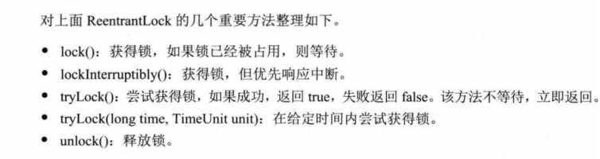

# chr3 jdk并发包

* 为了更好地支持并发程序，JDK内部提供了大量实用的API和框架。


### 3.1　多线程的团队协作：同步控制 70

* 同步控制为并发程序并不可少的重要手段。

  

#### 3.1.1　synchronized的功能扩展：重入锁 71 

- [ReenterLock](https://hub.fastgit.org/guanpengchn/java-concurrent-programming/blob/master/src/main/java/ch3/s1/ReenterLock.java) 面试点 和synchronized的区别
- 可重入锁代表着**一个线程可以多次获得同一把锁**
- 与synchronized相比，**重入锁有着显式的操作过程，必须手动指定何时加锁，何时释放锁**。
- 重入锁支持中断响应，[IntLock](https://hub.fastgit.org/guanpengchn/java-concurrent-programming/blob/master/src/main/java/ch3/s1/IntLock.java)，**线程等待锁的过程中可以根据需要取消对锁的请求【中断会抛出中断异常】，通过捕获异常进行响应**
- 锁申请等待限时，[TimeLock](https://hub.fastgit.org/guanpengchn/java-concurrent-programming/blob/master/src/main/java/ch3/s1/TimeLock.java)，一种避免死锁的方法，**时限内获得锁则返回true，否则返回false**
- 不带参数的[TryLock](https://hub.fastgit.org/guanpengchn/java-concurrent-programming/blob/master/src/main/java/ch3/s1/TryLock.java)，线程不会傻傻等待，**只尝试一次。**
- 公平锁【不会产生饥饿现象】需要维护一个有序队列，成本高，默认是非公平锁【获取锁时会从锁等待队列中随机挑选一个】，[FairLock](https://hub.fastgit.org/guanpengchn/java-concurrent-programming/blob/master/src/main/java/ch3/s1/FairLock.java)
  - 根据系统的调度，一个线程会倾向于再次获取已经持有的锁，其高效但不公平。



重入锁的实现主要包含三个要素：

- 原子状态，CAS
- 等待队列
- 阻塞原语park()和unpark()


#### 3.1.2　重入锁的好搭档：Condition条件 80

- wait和notify是和synchronize合作使用的，condition是和重入锁相关联的，[ReenterLockCondition](https://hub.fastgit.org/guanpengchn/java-concurrent-programming/blob/master/src/main/java/ch3/s1/ReenterLockCondition.java)
- Condition和wait、notify的作用大致相同，其基本方法如下【通过lock.newCondition获取与当前重入锁绑定的condition】
- 线程使用condition.await时，要求线程持有相关的重入锁，await调用后，这个线程会释放这把锁。
- condition.signal调用时，也要求线程先获得相关的锁。


#### 3.1.3　允许多个线程同时访问：信号量（Semaphore） 83

- [SemapDemo](https://hub.fastgit.org/guanpengchn/java-concurrent-programming/blob/master/src/main/java/ch3/s1/SemapDemo.java)

#### 3.1.4　ReadWriteLock读写锁 85

- 实践了一下果然速度差距相当大
- [ReadWriteLockDemo](https://hub.fastgit.org/guanpengchn/java-concurrent-programming/blob/master/src/main/java/ch3/s1/ReadWriteLockDemo.java)

#### 3.1.5　倒计时器：CountDownLatch 87

- [CountDownLatchDemo](https://hub.fastgit.org/guanpengchn/java-concurrent-programming/blob/master/src/main/java/ch3/s1/CountDownLatchDemo.java)

#### 3.1.6　循环栅栏：CyclicBarrier 89

- 这个理解起来难度大一些
- [CyclicBarrierDemo](https://hub.fastgit.org/guanpengchn/java-concurrent-programming/blob/master/src/main/java/ch3/s1/CyclicBarrierDemo.java)

#### 3.1.7　线程阻塞工具类：LockSupport 92

- LockSupport的park和unpark函数，和suspend和resume函数比，不存在先后顺序，也就不会由于先resume后suspend导致程序死掉
- 和信号量的区别是它只有一个许可，而信号量可以有多个
- [LockSupportDemo](https://hub.fastgit.org/guanpengchn/java-concurrent-programming/blob/master/src/main/java/ch3/s1/LockSupportDemo.java)
- [LockSupportIntDemo](https://hub.fastgit.org/guanpengchn/java-concurrent-programming/blob/master/src/main/java/ch3/s1/LockSupportIntDemo.java)

### 3.2　线程复用：线程池 95 面试点

#### 3.2.1　什么是线程池 96

#### 3.2.2　不要重复发明轮子：JDK对线程池的支持 97

- 类图要好好看看，建议阅读jdk源代码了解下关系，整理如下：
  - ExecutorService继承了Executor
  - AbstractExecutorService实现了ExecutorService接口
  - Executors生成了ThreadPoolExecutor
- Executors中包含的一部分线程池类型：
  - newFixedThreadPool，[ThreadPoolDemo](https://hub.fastgit.org/guanpengchn/java-concurrent-programming/blob/master/src/main/java/ch3/s2/ThreadPoolDemo.java)
  - newSingleThreadExecutor
  - newCachedThreadPool
  - newSingleThreadScheduledExecutor
  - newScheduledThreadPool
    - FixedRate是从上一个任务开始后计时，[ScheduledExecutorServiceDemo](https://hub.fastgit.org/guanpengchn/java-concurrent-programming/blob/master/src/main/java/ch3/s2/ScheduledExecutorServiceDemo.java)
    - FixedDelay是从上一个任务结束后计时

#### 3.2.3　刨根究底：核心线程池的内部实现 102

- 均使用ThreadPoolExecutor实现，最全的构造函数如下

```
public ThreadPoolExecutor(int corePoolSize,
                          int maximumPoolSize,
                          long keepAliveTime,
                          TimeUnit unit,
                          BlockingQueue<Runnable> workQueue,
                          RejectedExecutionHandler handler) {
    this(corePoolSize, maximumPoolSize, keepAliveTime, unit, workQueue,
         Executors.defaultThreadFactory(), handler);
}
```

workQueue和handler需要特别理解一下，核心执行代码如下：

```
public void execute(Runnable command) {
    if (command == null)
        throw new NullPointerException();
    int c = ctl.get();
    if (workerCountOf(c) < corePoolSize) {
        if (addWorker(command, true))
            return;
        c = ctl.get();
    }
    if (isRunning(c) && workQueue.offer(command)) {
        int recheck = ctl.get();
        if (! isRunning(recheck) && remove(command))
            reject(command);
        else if (workerCountOf(recheck) == 0)
            addWorker(null, false);
    }
    else if (!addWorker(command, false))
        reject(command);
}
```

#### 3.2.4　超负载了怎么办：拒绝策略 106

- 四种系统定义的拒绝策略代码

```
 public static class CallerRunsPolicy implements RejectedExecutionHandler {
    public CallerRunsPolicy() { }
    public void rejectedExecution(Runnable r, ThreadPoolExecutor e) {
        if (!e.isShutdown()) {
            r.run();
        }
    }
}

public static class AbortPolicy implements RejectedExecutionHandler {
    public AbortPolicy() { }
    public void rejectedExecution(Runnable r, ThreadPoolExecutor e) {
        throw new RejectedExecutionException("Task " + r.toString() +
                                             " rejected from " +
                                             e.toString());
    }
}

public static class DiscardPolicy implements RejectedExecutionHandler {
    public DiscardPolicy() { }
    public void rejectedExecution(Runnable r, ThreadPoolExecutor e) {
    }
}

public static class DiscardOldestPolicy implements RejectedExecutionHandler {
    public DiscardOldestPolicy() { }
    public void rejectedExecution(Runnable r, ThreadPoolExecutor e) {
        if (!e.isShutdown()) {
            e.getQueue().poll();
            e.execute(r);
        }
    }
}
```

- [RejectThreadPoolDemo](https://hub.fastgit.org/guanpengchn/java-concurrent-programming/blob/master/src/main/java/ch3/s2/RejectThreadPoolDemo.java)

-----分界线

#### 3.2.5　自定义线程创建：ThreadFactory 109 

- [MyThreadFactory](https://hub.fastgit.org/guanpengchn/java-concurrent-programming/blob/master/src/main/java/ch3/s2/MyThreadFactory.java)

#### 3.2.6　我的应用我做主：扩展线程池 110

- 比较了一下ExecuteService中submit和execute函数的区别，通过观察发现，sumit最终也会执行execute函数，具体分析可见这篇[文章](https://www.jianshu.com/p/e05b1d060d7d)
- 顺着execute函数的位置，列一下这几个类的关系，代码如下：

```java
//最上层Executor接口
public interface Executor {
    void execute(Runnable command);
}

//继承了Executor接口的ExecutorService接口
public interface ExecutorService extends Executor {
    //中间各种函数，但不包含execute函数
}

//实现了ExecutorService接口的AbstractExecutorService抽象类
public abstract class AbstractExecutorService implements ExecutorService {
    //省略其他函数...
    
    //submit函数内调用了execute，但该抽象类没有execute函数的具体实现
    public Future<?> submit(Runnable task) {
        if (task == null) throw new NullPointerException();
        RunnableFuture<Void> ftask = newTaskFor(task, null);
        execute(ftask);//调用了Executor的execute方法
        return ftask;
    }
}

//实现了AbstractExecutorService抽象类的ThreadPoolExecutor类
public class ThreadPoolExecutor extends AbstractExecutorService {
    //省略其他函数...
    
    //execute函数的具体实现
    public void execute(Runnable command) {
        if (command == null)
            throw new NullPointerException();
        int c = ctl.get();
        if (workerCountOf(c) < corePoolSize) {
            if (addWorker(command, true))
                return;
            c = ctl.get();
        }
        if (isRunning(c) && workQueue.offer(command)) {
            int recheck = ctl.get();
            if (! isRunning(recheck) && remove(command))
                reject(command);
            else if (workerCountOf(recheck) == 0)
                addWorker(null, false);
        }
        else if (!addWorker(command, false))
            reject(command);
    }
}
```

- [ExtThreadPool](https://hub.fastgit.org/guanpengchn/java-concurrent-programming/blob/master/src/main/java/ch3/s2/ExtThreadPool.java)

#### 3.2.7　合理的选择：优化线程池线程数量 112

请见书中公式

#### 3.2.8　堆栈去哪里了：在线程池中寻找堆栈 113

- 程序的本质意思就是写一个类重写execute和submit方法，加一个包装，让该包装可以抛出异常信息
- [TraceThreadPoolExecutor](https://hub.fastgit.org/guanpengchn/java-concurrent-programming/blob/master/src/main/java/ch3/s2/TraceThreadPoolExecutor.java)

#### 3.2.9　分而治之：Fork/Join框架 117

- 本质就是一种递归的调用，然后不断缩小规模直到可以计算，最后将结果加起来
- [CountTask](https://hub.fastgit.org/guanpengchn/java-concurrent-programming/blob/master/src/main/java/ch3/s2/CountTask.java)


// TODO 下面的基本都要重读...

### 3.3　不要重复发明轮子：JDK的并发容器 121

- 本节代码都是`java.util.concurrent;`包中的源代码，故而不修改每个文件的包引入行，保持代码原有的样子，方便读者观看

#### 3.3.1　超好用的工具类：并发集合简介 121

注：此处使用[JDK1.7](https://hub.fastgit.org/guanpengchn/JDK/tree/master/JDK1.7)的源代码

- [ConcurrentHashMap](https://hub.fastgit.org/guanpengchn/JDK/blob/master/JDK1.7/src/java/util/concurrent/ConcurrentHashMap.java)，线程安全的HahsMap 非常重要
- [CopyOnWriteArrayList](https://hub.fastgit.org/guanpengchn/JDK/blob/master/JDK1.7/src/java/util/concurrent/CopyOnWriteArrayList.java)，线程安全的ArrayList一族
- [ConcurrentLinkedQueue](https://hub.fastgit.org/guanpengchn/JDK/blob/master/JDK1.7/src/java/util/concurrent/ConcurrentLinkedQueue.java)，线程安全的LinkedList
- [BlockingQueue](https://hub.fastgit.org/guanpengchn/JDK/blob/master/JDK1.7/src/java/util/concurrent/BlockingQueue.java)，阻塞队列 非常重要
- [ConcurrentSkipListMap](https://hub.fastgit.org/guanpengchn/JDK/blob/master/JDK1.7/src/java/util/concurrent/ConcurrentSkipListMap.java)，跳表，用于快速查找 重要

#### 3.3.2　线程安全的HashMap 122

- 将HashMap变为线程安全的，可用以下方法，但并发级别不高

```
public static Map m=Collections.synchronizedMap(new HashMap());
```

- 更加专业的并发HashMao是ConcurrentHashMap

#### 3.3.3　有关List的线程安全 123

- 将List变为线程安全的，可用以下方法

```
public static List<String> l=Collections.synchronizedList(new LinkedList<String>());
```

- 更加专业的并发HashMap是[ConcurrentHashMap](https://hub.fastgit.org/guanpengchn/java-concurrent-programming/blob/master/src/main/java/ch3/s3/ConcurrentHashMap.java)  

#### 3.3.4　高效读写的队列：深度剖析ConcurrentLinkedQueue 123

- 这里很难，还要再读一遍再做笔记！！！！！

#### 3.3.5　高效读取：不变模式下的CopyOnWriteArrayList 129

- 读读不冲突，读写不冲突，只有写写冲突
- 在写的时候先做一次数据复制，将修改的内容写入副本中，再讲副本替换原来的数据
- [CopyOnWriteArrayList](https://hub.fastgit.org/guanpengchn/java-concurrent-programming/blob/master/src/main/java/ch3/s3/CopyOnWriteArrayList.java)

#### 3.3.6　数据共享通道：BlockingQueue 130

#### 3.3.7　随机数据结构：跳表（SkipList） 134 

### 3.4　参考资料 136
