# 容器分析

* 总体结构：


全面：https://www.nowcoder.com/tutorial/10001/a603c13352174ac1a3a2636d8dfaaaa7

AbstractXxx：抽象类，虚线..：接口

接口：Set, List, AbstractMap, AbstractCollection, AbstractList, AbstractSet


## TreeMap

* 通过红黑树实现

* 与普通二叉搜索树不同的是，红黑树的叶子结点的左右孩子也是单独的结点，记为NIL，即空结点。

* 红黑树的定义【二叉搜素树 树节点加了色域】

  * 每个结点或是红色的，或是黑色的。
  * 根节点是黑色的。
  * 每个叶节点（NIL）是黑色的。
  * 如果一个结点是红色的，则它的两个子结点都是黑色的。【即不能有连续的两个红色结点，而黑色结点随意】
  * 对每个结点，从该结点到其所有后代叶结点的简单路径上，均包含相同数目的黑色结点。【其和性质4确保了根到低的路径上黑结点数大于红结点数】

* 性质1-3为规定，性质4和性质5是红黑树的核心，性质4意味着不能有连续的两个红色结点，而黑色结点随意。性质5保证了**红黑树是近似平衡的二叉树**，也就保证了查找时间复杂度为 ![[公式]](https://www.zhihu.com/equation?tex=O%5Cleft%28lgn%5Cright%29) 。【树高】 算法导论给出了证明

* 其是2-3-4树实现

* 为了确保在修改红黑树时不破坏这两条性质，我们在修改时需要进行变色、旋转操作。

* 旋转（常数时间）：

  

  旋转前后，α始终是x的左孩子，γ始终是y的右孩子。可以发现，旋转前后，该结构始终满足 ![[公式]](https://www.zhihu.com/equation?tex=%5Calpha+%5Cle+x+%5Cle+%5Cbeta+%5Cle+y+%5Cle+%5Cgamma) 的大小关系，因而**不会破坏二叉排序树的有序性。**

  红黑树中，**使用旋转保证在有序性不变下调整红节点和黑节点的结构来修复被破坏的红黑树性质。**

* 先考虑加入结点的颜色，红还是黑？黑色一定破坏性质5【新结点所在路径黑更多了】，红色可能破坏性质4

  最终选择红色，因为只是可能破坏，如果破坏我们再补救：

  将性质4的破坏上移【期间需要重新上色、旋转操作】至某个结点且不再破坏红黑树的结构

  

  对于**不同的树结构有不同的补救措施**，有以下三种：

  

​		【深色结点是黑结点，浅色结点为红结点。】

* 难点在于更新操作，
  * 添加操作需要的步骤：
    * 二叉搜索树操作【搜索、插入】O(lgN)
    * 如果破坏性质4，从插入点向上进行重复的染色、旋转操作。O(lgN)【操作的前提是父节点为红色，此时爷爷结点必定为黑色】
    * 分父节点是左孩子还是右孩子的case，并有对应的上图三种情况【相似，只是旋转反向不同而已，且整个过程中z都为红色】
    * 情况1：如图(a)所示，**z的叔结点y是红色**。此时，我们将z的父节点和z的叔结点同时变为黑色，并让z的父节点的父节点变为红色，得到图(b)所示的结果。
    * 情况2：**z的叔结点y是黑色**
      * 2.1：z是右孩子，先对z左旋作为2.2
      * 2.2：z是左孩子，对爷爷结点右旋
    * 最后需对根结点染色
    * 总的来说就是将破坏性质4的结点通过染色操作和旋转操作不断上移直至不破坏性质4为止
  * 删除操作


## ArrayList与LinkedList

* ArrayList插入操作，默认为元素追加到末尾时间复杂度O(1)

```java
public boolean add(E e) {
    ensureCapacityInternal(size + 1);  // Increments modCount!!
    elementData[size++] = e;
    return true;
}
```

* 指定位置i插入或删除时间复杂度O(n-i)

```java
    public void add(int index, E element) {
        rangeCheckForAdd(index);

        ensureCapacityInternal(size + 1);  // Increments modCount!!
        System.arraycopy(elementData, index, elementData, index + 1,
                         size - index);//复制数组 将数组index..length-2位置上的元素复制到 index+1..length-1位置上 前面的元素保持位置不变 故时间复杂度为O(n-i);
        elementData[index] = element;
        size++;
    }
```

* LinkedListt插入和删除操作，首尾操作时间复杂度O(1)
* 指定位置i插入和删除时间复杂度O(n)【移动到相应位置再进行操作】


**扩容方法**

```java
    public boolean add(E e) {
        //size：实际元素数量
        ensureCapacityInternal(size + 1);  // Increments modCount!!
        elementData[size++] = e;
        return true;
    }

	//得到最小需要的容量 
	private static int calculateCapacity(Object[] elementData, int minCapacity) {
        if (elementData == DEFAULTCAPACITY_EMPTY_ELEMENTDATA) {
            //DEFAULT_CAPACITY 默认容量为 8  minCapacity为最小需要的容量
            return Math.max(DEFAULT_CAPACITY, minCapacity);
        }
        return minCapacity;
    }
	
	//添加元素前 确保数组容量足够
    private void ensureCapacityInternal(int minCapacity) {
        ensureExplicitCapacity(calculateCapacity(elementData, minCapacity));
    }
	
	//
    private void ensureExplicitCapacity(int minCapacity) {
        modCount++;//修改List结构的数次

        // overflow-conscious code
        // 数组长度小于所需容量 进行扩容
        if (minCapacity - elementData.length > 0)
            grow(minCapacity);
    }

	private void grow(int minCapacity) {
    // overflow-conscious code
    int oldCapacity = elementData.length;
    // 有符号右移* 新容量为旧容量1.5倍左右
    int newCapacity = oldCapacity + (oldCapacity >> 1);
        // 判断是否满足所需容量
    if (newCapacity - minCapacity < 0)
        newCapacity = minCapacity;
        // 判断是否已达最大容量
    if (newCapacity - MAX_ARRAY_SIZE > 0)
        newCapacity = hugeCapacity(minCapacity);
    // minCapacity is usually close to size, so this is a win:
       // 进行数组复制
    elementData = Arrays.copyOf(elementData, newCapacity);
}
	//大容量
    private static int hugeCapacity(int minCapacity) {
        if (minCapacity < 0) // overflow
            throw new OutOfMemoryError();
        return (minCapacity > MAX_ARRAY_SIZE) ?
            Integer.MAX_VALUE :
            MAX_ARRAY_SIZE;
    }

```

* 添加一个元素时会判断是否需要扩容，需要时才会扩容，每次扩容时，先得到最小需要容量，并和旧容量的1.5倍比较，新容量选为两者中较大者，再然后验证新容量是否超过数组最大长度，超过则用最小需要容量再判断一次，如果还是超过，则用整型最大值表示新容量，否则用数组最大长度表示，最后用Array.copyOf方法进行相应容量复制。无参构造函数，实际构建了一个空的数组，初次添加时容量会扩容为10。


## HashMap

https://www.nowcoder.com/discuss/781926?type=all&order=recall&pos=&page=1&ncTraceId=&channel=-1&source_id=search_all_nctrack&gio_id=7E44311E3CF828527BF15435531A0AC9-1638254299867【概括】

https://blog.nowcoder.net/n/5417d84697e2475aafabdf48f0201911【全面概括】

* 结构：HashMap是一种散列表，可键值对为一个节点的形式进行存储，键和值都可以为空，jdk1.7时是由数组+链表构成，jdk1.8是由数组+链表+红黑树构成，了解多的是jdk1.8下的hashMap，其默认的初始容量为16，默认的加载因子为0.75，其树化阈值为8和最小树化容量为64，即因哈希冲突而组成的链表节点个数大于8时且数组容量大与64时，链表红黑树化，因树退化阈值为6，故当红黑树上元素数量减少为6时，红黑树退化成链表。

* 补充以下，数组的查询效率是O(1),[链表](https://www.nowcoder.com/jump/super-jump/word?word=链表)的查询效率是O(N)，[红黑树](https://www.nowcoder.com/jump/super-jump/word?word=红黑树)的查询效率是O(logN)。

* 同时HashMap的容量必须是2的次幂，如果构造方法中传入的容量不是2的次幂，hashMap内部会调用tableSizeFor(int cap)方法来得到**一个最接近传入容量且大于传入容量的2的次幂的值**，比如传入的容量是17则tableSizeFor()会返回32。

* 空参构造创建的HashMap对象并不会初始化空间，当插入元素时，其内部会判断空间是否还未初始化，如果还未初始化，则使用resize()方法进行空间初始化，初始化后数组的长度为初始容量即16。

  ```java
  final V putVal(int hash, K key, V value, boolean onlyIfAbsent,
                     boolean evict) {
          Node<K,V>[] tab; Node<K,V> p; int n, i;
          if ((tab = table) == null || (n = tab.length) == 0)
              n = (tab = resize()).length;
  ```

* HashMap有两个重要方法，无序方式插入键值对的put方法，根据键在HashMap获取值的get方法。

* put方法主要流程是这样的：

  1、先计算key的hash值，键为空则哈希值固定为0，否则，为了确保节点更加分散，获取hash值后，HashMap会让hash值的高16位与hash进行异或。

  ```java
  return (key == null) ? 0 : (h = key.hashCode()) ^ (h >>> 16);
  ```

​		2、然后判断数组是否初始化，如果未初始化，则进行初始化

```java
if ((tab = table) == null || (n = tab.length) == 0)
    n = (tab = resize()).length;
```

​		3、让键的hash值和数组长度减一的值做与运算得到该键值对该在数组中存储的位置，如果位置上为空，表示没有哈希冲突，直接构造一个新结点插入即可

```java
if ((tab = table) == null || (n = tab.length) == 0)
    n = (tab = resize()).length;
```

如果位置上不为空，则先判断是否key和该位置上的key是否相同【key为null时位置一直都是0，且每次添加key为null的结点都是替换】，相同则将记录该位置上的节点，不相同则继续遍历该节点下的链表或红黑树

如果链表或红黑树上存在相同key的节点，则同样会记录下相同key的节点，然后用新值替换旧值。如果不存在相同key的节点，则构造一个新结点进行插入，

在链表中插入节点时，如果**插入前链表的结点个数已经大于树化阈值并且数组长度大于最小树化容量即64，那么在插入后链表将红黑树化。**

```java
if (p.hash == hash &&
    ((k = p.key) == key || (key != null && key.equals(k))))
    e = p;
if (e != null) { // existing mapping for key
                V oldValue = e.value;
                if (!onlyIfAbsent || oldValue == null)
                    e.value = value;
                afterNodeAccess(e);
                return oldValue;
            }
```


* get方法的主要流程是这样的

  * 首先计算键的hash值，然后根据hash值获取结点值，如果数组还未初始化或hash值所对应的位置上没有结点，则返回null，否则先判断该位置上结点的key是否一致，如果一致则返回，否则在该节点下的链表或红黑树下继续查找。

* 扩容：

  * 如果链表结点个数大于8但数组容量小于64时HashMap会使用扩容来代替红黑树化链表。
  * 当HashMap结点个数大于扩容阈值【负载因子*容量】时，HashMap会进行扩容
  * resize方法会包含了对数组初始化的处理，如果数组未初始化，则会先调用该方法进行初始化
  * resize方法的扩容流程：
    * 创建一个新数组，数组长度为旧数组的两倍，然后将旧数组上的结点迁移到新数组上
    * 其中如果数组的某个位置上只有一个结点，则将直接迁移，否则，将会创建分别表示结点新位置与原位置相同和结点新位置为原位置加上旧容量的两条链表，然后再将两条链表根据对应位置插入新数组即可。

* 为啥[链表](https://www.nowcoder.com/jump/super-jump/word?word=链表)转[红黑树](https://www.nowcoder.com/jump/super-jump/word?word=红黑树)的阈值是8

  * 使用分布良好的哈希值的情况下，树是很少被使用的。理想情况下，随机哈希码遵循**泊松分布**，从上面给出的数据看，一个[链表]()上有八个节点的概率为0.00000006 这个值要小于千万分之一。当这个阀值为8已经很小了，所以这就是阈值选8的原因。

* 如何判断结点是否一致的

  先判断hash值是否相等，相等在比较key，key相等则两结点一致。

  ```java
  if (p.hash == hash &&
                  ((k = p.key) == key || (key != null && key.equals(k))))
                  e = p;
  ```

* jdk1.7下，由于插入结点遇到hash碰撞时都是采用头插法，故在多线程环境下可能会造成链表死循环。

* 所以jdk1.8改用了尾插法。虽然避免了死循环，但是在多线程情况下，有数据覆盖或者多次扩容发生。

* 线程不安全的替代品：ConCurrentHashMap

* 负载因子默认0.75**，这个数是在时间和空间效率上的平衡选择**。如果内存很多，要求时间效率很高，可以降低负载因子（**让HashMap变得更稀疏，更难发生碰撞**），如果内存不多，对时间效率要求不高，则可增加负载因子。


https://juejin.cn/post/6844903518474600455

https://juejin.cn/post/6844903518927601671

### hashcode

* hashCode是一个**对象的标识**，Java中对象的hashCode是一个int类型值。通过hashCode来指定数组的索引可以快速定位到要找的对象在数组中的位置，之后再在该位置链表遍历找到对应值，理想情况下时间复杂度为O(1)并且**不同对象可以拥有相同的hashCode**。


### HashMap的时间复杂度

* HashMap的时间复杂度取决于hash算法，优秀的hash算法可以让时间复杂度趋于常数O(1)，糟糕的hash算法可以让时间复杂度趋于O(N)。【哈希冲突发生的概率较高，许多节点有相等的hashcode，链表长度较长。】
* 在HashMap内部会涉及到扩容、Java8中会将长度超过8的链表转化成红黑树


### 负载因子是什么

* 首先随着hashmap里的键值对越来越多，在数组数量不变的情况下，查找的效率会越来越低。【发生hash碰撞越来越容易】
* 这时候需要扩容增加数组的大小，**HashMap内部是原来的数组长度乘以2**，扩容需要**根据新数组的长度重新计算hashCode**，来保证在新数组的位置，所以**同一个键值对在旧数组里的索引和新数组中的索引通常是不一致的。**
* **负载因子其实就是规定什么时候扩容**，HashMap中并不是等数组满了才扩容，它会存在一个阀值(threshold)，**只要hashmap里的键值对大于这个阀值，那么就要进行扩容。 ** **阀值 = 当前数组长度✖负载因子**。【不指定初始容量时，阈值起始值为该式即16，指定后，会找最小的**大于指定初始容量**的2次幂作为阈值，阈值指定后往后都以2倍方式增长】
* hashmap中默认负载因子为**0.75**，默认情况下第一次扩容判断阀值是16 ✖ 0.75 = 12；所以第一次存键值对的时候，在存到第13个键值对时就需要扩容了【**存值前通过判断发现已到阀值**】；
* 小结
  * 在数组大小不变的情况下，存放键值对越多，查找的时间效率会降低，扩容可以解决该问题，而负载因子决定了什么时候扩容，负载因子是已存键值对的数量和总的数组长度的比值。默认情况下负载因子为0.75，我们可在初始化HashMap的时候自己修改。


### hash与Rehash

* **每次扩容后，转移旧表键值对到新表之前都要重新rehash，计算键值对在新表的索引。**
* 为什么要rehash？
  * 让原表占了同一个“桶”的多个节点，分布到新的桶位上，保证我们每次查找的时间复杂度O趋于O(1)。


* 当添加一个元素（key-value）时，就首先计算元素key的hash值，以此确定插入数组中的位置，但是可能存在同一hash值的元素已经被放在数组同一位置了，这时就添加到同一hash值的元素的后面，他们在数组的同一位置，但是形成了链表，所以说数组存放的是链表。而当链表长度太长时，链表就转换为红黑树，这样大大提高了查找的效率。

* HashMap 底层是基于 `数组 + 链表` 组成的，不过在 **jdk1.7 和 1.8 中具体实现稍有不同**。jdk8中链表长度超过8时链表会转化成红黑树。

* put操作分为3中情况
  * 对应位置的节点为null，直接存值
  * 节点非空，且其key与待插入的key相同，则进行覆盖
  * 节点非空，但没有key相同的，新的节点将插到链表头部【头插入】
  
  


### jdk1.7

1.7 中的数据结构图：

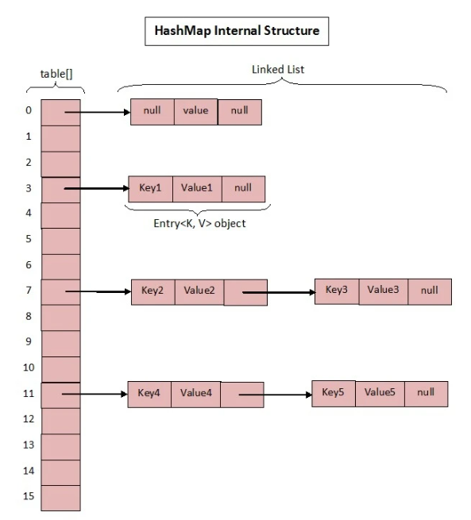


* 一些成员变量 、内部节点类、构造函数

```java
//HashMap里的数组
transient Entry<K,V>[] table = (Entry<K,V>[]) EMPTY_TABLE;
//Entry对象，存key、value、hash值以及下一个节点
static class Entry<K,V> implements Map.Entry<K,V> {
    final K key;
    V value;
    Entry<K,V> next;
    int hash;
}
//默认数组大小，二进制1左移4位为16
static final int DEFAULT_INITIAL_CAPACITY = 1 << 4；
//负载因子默认值
static final float DEFAULT_LOAD_FACTOR = 0.75f; 
//当前存的键值对数量
transient int size; 
//阀值 = 数组大小 * 负载因子
int threshold;
//负载因子变量
final float loadFactor;

//默认new HashMap数组大小16，负载因子0.75
public HashMap() {
    this(DEFAULT_INITIAL_CAPACITY, DEFAULT_LOAD_FACTOR);
}

public HashMap(int initialCapacity) {
    this(initialCapacity, DEFAULT_LOAD_FACTOR);
}
//可以指定数组大小和负载因子
public HashMap(int initialCapacity, float loadFactor) {
    //省略一些逻辑判断
    this.loadFactor = loadFactor;
    threshold = initialCapacity;
    //空方法
    init();
}

```

* put操作

```java
public V put(K key, V value) {
        //数组为空时创建数组
        if (table == EMPTY_TABLE) {
            inflateTable(threshold);
        }
    
        //key为空单独对待
        if (key == null)
            // 该方法会把键为NULL的键值对 放在table[0]上【该位置永远只有一个节点】
            return putForNullKey(value);
    
        //①根据key计算hash值
        int hash = hash(key);
        //②根据hash值和当前数组的长度计算在数组中的索引
        int i = indexFor(hash, table.length);
    
    
    static int indexFor(int h, int length) {
        //hash值和数组长度-1按位与操作，听着费劲？其实相当于h%length;取余数(取模运算)
        //如：h = 17，length = 16;那么算出就是1
        //&运算的效率比%要高
        return h & (length-1);
    }
    
        //遍历整条链表
        for (Entry<K,V> e = table[i]; e != null; e = e.next) {
            Object k;
            //③情况1.hash值和key值都相同的情况，替换之前的值
            if (e.hash == hash && ((k = e.key) == key || key.equals(k))) {
                V oldValue = e.value;
                e.value = value;
                e.recordAccess(this);
                //返回被替换的值
                return oldValue;
            }
        }

        modCount++;
        //③情况2.坑位没人,直接存值或发生hash碰撞但key不相同都走这
        addEntry(hash, key, value, i);
        return null;
    }


    void addEntry(int hash, K key, V value, int bucketIndex) {
        //当前hashmap中的键值对数量超过阀值
        if ((size >= threshold) && (null != table[bucketIndex])) {
            //扩容为原来的2倍
            resize(2 * table.length);
            hash = (null != key) ? hash(key) : 0;
            //计算在新表中的索引 【根据新表的长度】
            bucketIndex = indexFor(hash, table.length);
        }
        //创建节点
        createEntry(hash, key, value, bucketIndex);
    }

    void resize(int newCapacity) { //传入新的容量
        //获取旧数组的引用
        Entry[] oldTable = table;
        int oldCapacity = oldTable.length;
        //极端情况，当前键值对数量已经达到最大
        if (oldCapacity == MAXIMUM_CAPACITY) {
            //修改阀值为最大直接返回
            threshold = Integer.MAX_VALUE;
            return;
        }
        //步骤①根据容量创建新的数组
        Entry[] newTable = new Entry[newCapacity];
        //步骤②将键值对转移到新的数组中
        transfer(newTable, initHashSeedAsNeeded(newCapacity));
        //步骤③将新数组的引用赋给table
        table = newTable;
        //步骤④修改阀值
        threshold = (int)Math.min(newCapacity * loadFactor, MAXIMUM_CAPACITY + 1);
    }

	
    void transfer(Entry[] newTable, boolean rehash) {
        // 获取新数组的长度
        int newCapacity = newTable.length;
        // 遍历旧数组中的键值对
        // 会使得转移前后键值对的顺序颠倒(Java7和Java8的区别)【因为头插法，如果在新数组的索引还是相同】
        for (Entry<K,V> e : table) {
            while(null != e) {
                Entry<K,V> next = e.next;
                if (rehash) {
                    e.hash = null == e.key ? 0 : hash(e.key);
                }
                //计算在新表中的索引，并到新数组中 根据新的数组长度和要转移的键值对key值重新计算在新数组中的位置
                int i = indexFor(e.hash, newCapacity);
                
                // 头插法
                e.next = newTable[i];
                newTable[i] = e;
                e = next;
            }
        }
    }

    void createEntry(int hash, K key, V value, int bucketIndex) {
        Entry<K,V> e = table[bucketIndex];
        // next为e 头插法
        table[bucketIndex] = new Entry<>(hash, key, value, e);
        // 键值对个数增加
        size++;
    }


```

#### **多线程环境下的问题：**

* 当线程1和线程2同时对同一HashMap进行put操作且两个操作都会扩容时，并且某个桶上有两个结点且扩容后桶的位置不变，当线程1进入扩容方法并只是创建了个新数组，还没来得及转移就被挂起了，新数组没有内容，然后线程2进行扩容操作且在时间片轮换前转移工作也走完了。此时恢复到线程1对某个桶上有两个结点且**扩容后桶的位置不变上的结点进行转移操作时**，最终造成两个结点循环连接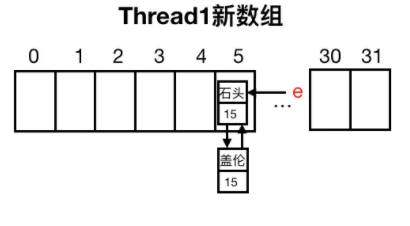

* 整个引起循环连接的流程

  * 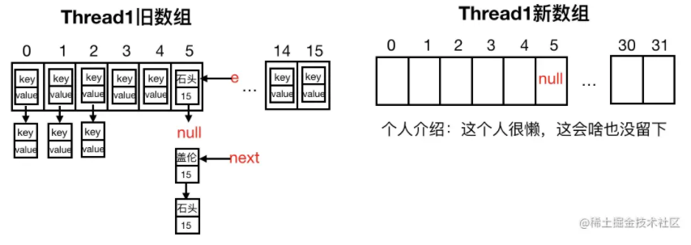
  * 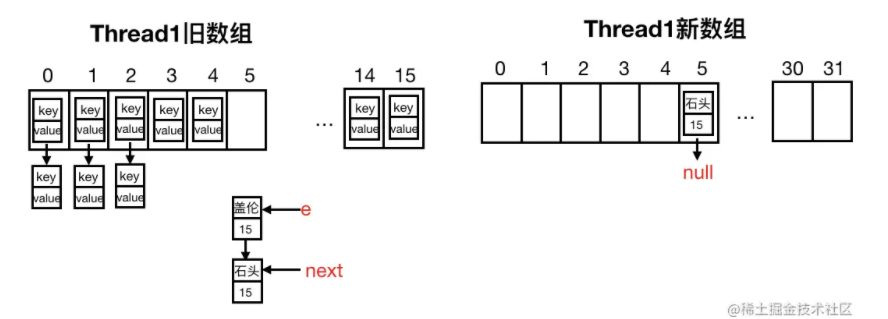
  * 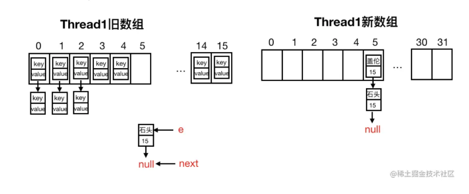
  * 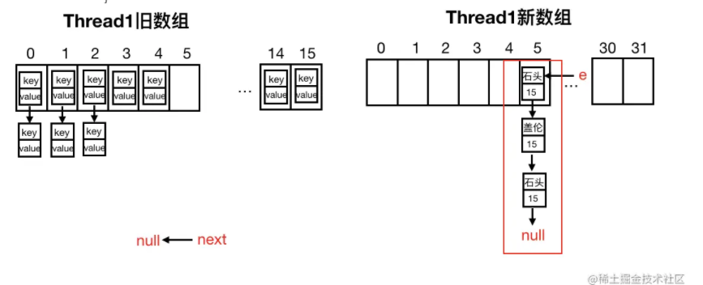

  

* ''在put操作或者get操作操作对应坑位将会进入死循环。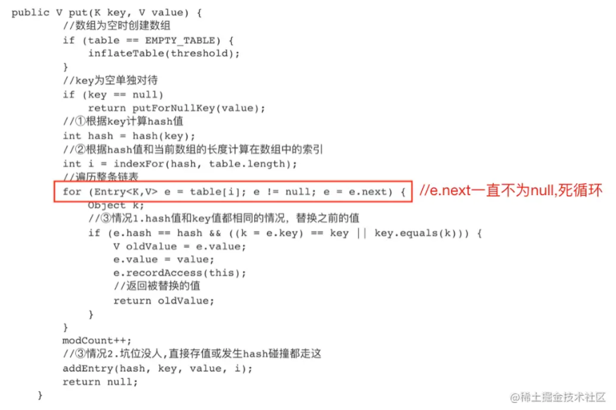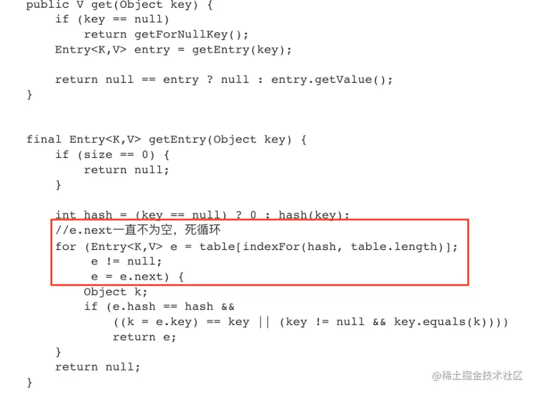

* Java7在多线程操作hashmap时可能引起死循环，原因是**扩容转移前后链表顺序倒置，在转移过程中修改了原来链表中节点的引用关系**


#### put流程图


* get操作
  * 只需要根据key值计算hash值，和数组长度取模，然后就可以找到在数组中的位置(key为空同样单独操作)，接着就是遍历链表

```java
public V get(Object key) {
    if (key == null)
        // 键位null 将从0号索引位置取value
        return getForNullKey();
    
    // 根据键获取对应的节点
    Entry<K,V> entry = getEntry(key);

    return null == entry ? null : entry.getValue();
}

final Entry<K,V> getEntry(Object key) {
    if (size == 0) {
        return null;
    }
	
    // 先根据 key 计算出 hashcode
    int hash = (key == null) ? 0 : hash(key);
    // 定位到具体的桶中。【根据hashcode和数组的长度计算出索引】
    for (Entry<K,V> e = table[indexFor(hash, table.length)];
         e != null;
         e = e.next) {
        Object k;
        // 键相等时直接返回节点
        if (e.hash == hash &&
            ((k = e.key) == key || (key != null && key.equals(k))))
            return e;
    }
    return null;
}
```


### jdk1.8

* 相比jdk1.7额外的成员变量

```java
//定义长度超过8的链表转化成红黑树
static final int TREEIFY_THRESHOLD = 8;

//换了个马甲还是认识你！！！
static class Node<K,V> implements Map.Entry<K,V> {
        final int hash;
        final K key;
        V value;
        Node<K,V> next;
}
```

* put操作
  * 对比和Java7的区别，Java8一视同仁，**管你key为不为空的统一处理，多了一步链表长度的判断以及转红黑树的操作，并且比较重要的一点，新增Node是插在尾部而不是头部！！！**。当然主角还是扩容resize操作【插入后通过判断键值对是否超过阀值来判断是否进行扩容】

```java
public V put(K key, V value) {
    //根据key计算hash值
    return putVal(hash(key), key, value, false, true);
}

final V putVal(int hash, K key, V value, boolean onlyIfAbsent,
                   boolean evict) {
        Node<K,V>[] tab; Node<K,V> p; int n, i;
        //步骤1.数组为空或数组长度为0，则扩容(咦，看到不一样咯)
        if ((tab = table) == null || (n = tab.length) == 0)
            n = (tab = resize()).length;
        //步骤2.根据hash值和数组长度计算在数组中的位置
        //如果"坑"里没人，直接创建Node并存值
        if ((p = tab[i = (n - 1) & hash]) == null)
            tab[i] = newNode(hash, key, value, null);
        else {
            Node<K,V> e; K k;
            //步骤3."坑"里有人，且hash值和key值都相等，先获取引用，后面会用来替换值 【这里为链表首节点就找到key相等的】
            if (p.hash == hash &&
                ((k = p.key) == key || (key != null && key.equals(k))))
                e = p;
            //步骤4.该链是红黑树
            else if (p instanceof TreeNode)
                e = ((TreeNode<K,V>)p).putTreeVal(this, tab, hash, key, value);
            //步骤5.该链是链表
            else {
                for (int binCount = 0; ; ++binCount) {
                    if ((e = p.next) == null) {
                        //步骤5.1注意这个地方跟Java7不一样，是插在链表尾部！！！ 这里的p是链表尾节点
                        p.next = newNode(hash, key, value, null);
                        //链表长度超过8，转化成红黑树
                        if (binCount >= TREEIFY_THRESHOLD - 1) // -1 for 1st
                            treeifyBin(tab, hash);
                        break;
                    }
                    //步骤5.2链表中已存在且hash值和key值都相等，先获取引用，后面用来替换值 【相同的key节点非链表首节点】
                    if (e.hash == hash &&
                        ((k = e.key) == key || (key != null && key.equals(k))))
                        break;
                    p = e;
                }
            }
            
            if (e != null) { // existing mapping for key
                // e存放同key的旧节点
                V oldValue = e.value;
                if (!onlyIfAbsent || oldValue == null)
                    //统一替换原来的值
                    e.value = value;
                afterNodeAccess(e);
                //返回原来的值
                return oldValue;
            }
        }
        ++modCount;
        //步骤6.键值对数量超过阀值，扩容
        if (++size > threshold)
            resize();
        afterNodeInsertion(evict);
        return null;
    }

```

* Java8把初始化数组和扩容全写在resize方法里了，但是思路还是一样的，扩容后要转移，转移要重新计算在新表中的位置。

```java
final Node<K,V>[] resize() {
    //旧数组的引用
    Node<K,V>[] oldTab = table;
    //旧数组长度
    int oldCap = (oldTab == null) ? 0 : oldTab.length;
    //旧数组阀值
    int oldThr = threshold;
    //新数组长度、新阀值
    int newCap, newThr = 0;
    if (oldCap > 0) {
        //极端情况，旧数组爆满了
        if (oldCap >= MAXIMUM_CAPACITY) {
            //阀值改成最大，放弃治疗直接返回旧数组
            threshold = Integer.MAX_VALUE;
            return oldTab;
        }
        //扩容咯，这里采用左移运算左移1位，也就是旧数组*2
        else if ((newCap = oldCap << 1) < MAXIMUM_CAPACITY &&
                 oldCap >= DEFAULT_INITIAL_CAPACITY)
            //同样新阀值也是旧阀值*2
            newThr = oldThr << 1; // double threshold
    }
    else if (oldThr > 0) // initial capacity was placed in threshold
        newCap = oldThr;
    //初始化在这里
    else {               // zero initial threshold signifies using defaults
        newCap = DEFAULT_INITIAL_CAPACITY;
        newThr = (int)(DEFAULT_LOAD_FACTOR * DEFAULT_INITIAL_CAPACITY);
    }
    if (newThr == 0) {
        float ft = (float)newCap * loadFactor;
        newThr = (newCap < MAXIMUM_CAPACITY && ft < (float)MAXIMUM_CAPACITY ?
                  (int)ft : Integer.MAX_VALUE);
    }
    //更新阀值
    threshold = newThr;
    @SuppressWarnings({"rawtypes","unchecked"})
        //创建新数组
        Node<K,V>[] newTab = (Node<K,V>[])new Node[newCap];
    table = newTab;
    if (oldTab != null) {
        for (int j = 0; j < oldCap; ++j) {
            Node<K,V> e;
            if ((e = oldTab[j]) != null) {
                //遍历旧数组，把原来的引用取消，方便垃圾回收
                oldTab[j] = null;
                //这个链只有一个节点，根据新数组长度计算在新表中的位置
                if (e.next == null)
                    newTab[e.hash & (newCap - 1)] = e;
                //红黑树的处理
                else if (e instanceof TreeNode)
                    ((TreeNode<K,V>)e).split(this, newTab, j, oldCap);
                //链表长度大于1，小于8的情况，下面高能，单独拿出来分析
                else { // preserve order
                    Node<K,V> loHead = null, loTail = null;
                    Node<K,V> hiHead = null, hiTail = null;
                    Node<K,V> next;
                    do {
                        next = e.next;
                        if ((e.hash & oldCap) == 0) {
                            if (loTail == null)
                                loHead = e;
                            else
                                loTail.next = e;
                            loTail = e;
                        }
                        else {
                            if (hiTail == null)
                                hiHead = e;
                            else
                                hiTail.next = e;
                            hiTail = e;
                        }
                    } while ((e = next) != null);
                    if (loTail != null) {
                        loTail.next = null;
                        newTab[j] = loHead;
                    }
                    if (hiTail != null) {
                        hiTail.next = null;
                        newTab[j + oldCap] = hiHead;
                    }
                }
            }
        }
    }
    return newTab;
}

```

n为table的长度，图（a）表示扩容前的key1和key2两种key确定索引位置的示例，图（b）表示扩容后key1和key2两种key确定索引位置的示例，其中**hash1是 key1对应的哈希值(也就是根据key1算出来的hashcode值) 与 高位与运算的结果**。


关键就在这个新增的bit这里，**如果是0，那么就跟原来的位置一致，如果是1，那么就是原位置加旧容量的位置**。

判断这个bit，就用`(e.hash & oldCap) == 0`，这个是**最大的精髓点**。

```java
else { // preserve order
    //定义两条链 【每个桶位上分出两条链】
    //原来的hash值新增的bit为0的链，头部和尾部
    Node<K,V> loHead = null, loTail = null;
    //原来的hash值新增的bit为1的链，头部和尾部
    Node<K,V> hiHead = null, hiTail = null;
    Node<K,V> next;
    //循环遍历出链条链
    do {
        next = e.next;
        if ((e.hash & oldCap) == 0) {
            if (loTail == null)
                loHead = e;
            else
                loTail.next = e;
            loTail = e;
        }
        else {
            if (hiTail == null)
                hiHead = e;
            else
                hiTail.next = e;
            hiTail = e;
        }
    } while ((e = next) != null);
    //扩容前后位置不变的链 【链表中的节点相对位置不变】
    if (loTail != null) {
        loTail.next = null;
        newTab[j] = loHead;
    }
    //扩容后位置加上原数组长度的链
    if (hiTail != null) {
        hiTail.next = null;
        newTab[j + oldCap] = hiHead;
    }
}

```


#### 多线程环境下的问题

* jdk1.8下HashMap在多线程环境下并不会引发死循环问题。原因是**扩容转移后前后链表顺序不变**，保持之前节点的引用关系。

* 那是不是意味着Java8就可以把HashMap用在多线程中呢？个人感觉即使不会出现死循环，但是通过源码看到put/get方法都没有加同步锁，多线程情况最容易出现的就是：**无法保证上一秒put的值，下一秒get的时候还是原值，建议使用ConcurrentHashMap。**

   

#### put流程图


### 对比

1.发生hash冲突时，Java7会在链表头部插入，Java8会在链表尾部插入，所以java7会出现死循环问题，而java8不会，java7和java8都无法保证上一秒put的值，下一秒get的时候还是原值。

2.扩容后转移数据，Java7转移前后链表顺序会倒置，Java8还是保持原来的顺序

3.关于性能对比可以参考[美团技术博客](https://link.juejin.cn?target=https%3A%2F%2Ftech.meituan.com%2Fjava-hashmap.html)，引入红黑树的Java8大程度得优化了HashMap的性能


## ConcurrentHashMap

* 多线程并发推荐使用 ConcurrentHashMap

* HashTable 给每个方法加锁(synchronized)，保证同一个时刻只允许一个线程拥有对 hashmap 有写的操作权限即可，但是效率太低，其他线程需要等待太久，严重影响用户体验。

* 1.7 ConcurrentHashMap 采用了分段锁技术，其中 Segment 继承于 ReentrantLock。不会像 HashTable 那样不管是 put 还是 get 操作都需要做同步处理，理论上 ConcurrentHashMap 支持 CurrencyLevel (Segment 数组数量)的线程并发。每当一个线程占用锁访问一个 Segment 时，不会影响到其他的 Segment。

  但是 `Segment` 的个数一旦**初始化就不能改变**，默认 `Segment` 的个数是 16 个，你也可以认为 `ConcurrentHashMap` 默认支持最多 16 个线程并发。

  https://juejin.cn/post/6844903641866846222

https://zhuanlan.zhihu.com/p/133923068

### Java7 源码分析

* 一些重要的成员

```java
//默认的数组大小16(HashMap里的那个数组) 容量大小  容量/并发标准=段内容量
static final int DEFAULT_INITIAL_CAPACITY = 16;

//扩容因子0.75
static final float DEFAULT_LOAD_FACTOR = 0.75f;
 
//ConcurrentHashMap中的数组
final Segment<K,V>[] segments

//默认并发标准16
static final int DEFAULT_CONCURRENCY_LEVEL = 16;

//Segment是ReentrantLock子类，因此拥有锁的操作
 static final class Segment<K,V> extends ReentrantLock implements Serializable {
  //HashMap的那一套，分别是数组、键值对数量、阈值、负载因子
  transient volatile HashEntry<K,V>[] table;
  transient int count;
  transient int threshold;
  final float loadFactor;

  Segment(float lf, int threshold, HashEntry<K,V>[] tab) {
            this.loadFactor = lf;
            this.threshold = threshold;
            this.table = tab;
        }
 }
 
 //换了马甲还是认识你！！！HashEntry对象，存key、value、hash值以及下一个节点
 static final class HashEntry<K,V> {
        final int hash;
        final K key;
        volatile V value;
        volatile HashEntry<K,V> next;
 }
//segment中HashEntry[]数组最小长度
static final int MIN_SEGMENT_TABLE_CAPACITY = 2;

//用于定位在segments数组中的位置，下面介绍
final int segmentMask;  // 分段长度-1
final int segmentShift;  // 取高n位【2^n=分段长度】和分段长度-1做与运算得出下标

```

* 构造函数

```java
    public ConcurrentHashMap() {
        this(DEFAULT_INITIAL_CAPACITY, DEFAULT_LOAD_FACTOR, DEFAULT_CONCURRENCY_LEVEL);
    }
	
// 一次默认创建
    public ConcurrentHashMap(int initialCapacity,
                             float loadFactor, int concurrencyLevel) {
        if (!(loadFactor > 0) || initialCapacity < 0 || concurrencyLevel <= 0)
            throw new IllegalArgumentException();
        if (concurrencyLevel > MAX_SEGMENTS)
            concurrencyLevel = MAX_SEGMENTS;
        // Find power-of-two sizes best matching arguments
        //步骤① start 
        int sshift = 0;
        int ssize = 1; // 表示分段数量
        // 可以计算出 sshift = 4，ssize = 16，
        while (ssize < concurrencyLevel) {
            ++sshift;
            ssize <<= 1;
        }
        // segmentShift = 28，segmentMask = 15；
        this.segmentShift = 32 - sshift;
        this.segmentMask = ssize - 1;
        //步骤① end
        //步骤② start
        if (initialCapacity > MAXIMUM_CAPACITY)
            initialCapacity = MAXIMUM_CAPACITY;
        // c = 16/16 = 1
        int c = initialCapacity / ssize;
        if (c * ssize < initialCapacity)
            ++c;
        // cap = 2
        int cap = MIN_SEGMENT_TABLE_CAPACITY; // 记录每个分段的实际桶数量
        while (cap < c)
            cap <<= 1;
        //步骤② end
        // create segments and segments[0] 初始化数组0号位置
        //步骤③ start
        // s0 初始化后数组长度为2，负载因子0.75，阈值为1；
        Segment<K,V> s0 =
            new Segment<K,V>(loadFactor, (int)(cap * loadFactor),
                             (HashEntry<K,V>[])new HashEntry[cap]);
        // ssize 此时为16，所以默认数组长度16
        Segment<K,V>[] ss = (Segment<K,V>[])new Segment[ssize];
        UNSAFE.putOrderedObject(ss, SBASE, s0); // ordered write of segments[0]
        this.segments = ss;
        //步骤③ end
    }


```

* ssize以2次幂方式增长，**即我们传 concurrencyLevel 不一定就是最后分段数组的长度，长度的计算公式：**

  > 长度 = 2的n次方(2的n次方 >= concurrencyLevel)

* 到这里只是创建了一个长度为16的Segment 数组，并初始化数组0号位置，segmentShift和segmentMask还没派上用场，画图存档: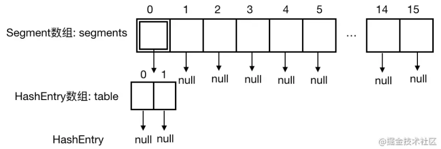


#### put方法

```java
public V put(K key, V value) {
    Segment<K,V> s;
    //步骤①注意value不能为空！！！
    if (value == null)
        throw new NullPointerException();
    //根据key计算hash值，key也不能为null，否则hash(key)报空指针
    int hash = hash(key);
    //步骤②派上用场了，根据hash值计算在segments数组中的位置
    // segmentShift:28 segmentMask:15
    int j = (hash >>> segmentShift) & segmentMask;
    //步骤③查看当前数组中指定位置Segment是否为空
    //若为空，先创建初始化Segment再put值，不为空，直接put值。
    if ((s = (Segment<K,V>)UNSAFE.getObject          // nonvolatile; recheck
         (segments, (j << SSHIFT) + SBASE)) == null) //  in ensureSegment
        s = ensureSegment(j);
    return s.put(key, hash, value, false);
}
```

​		步骤①可以看到和 HashMap 的区别，**这里的 key/value 为空会报空指针异常；**

​		步骤②先根据 key 值计算 hash 值，再和前面算出来的两个变量**计算出这个 key 应该放在哪个Segment中**(具体怎么计算的有兴趣可以去研究下，先高位运算再取与)

​		假设我们算出来该键值对应该放在5号，步骤③判断5号为空，看下 ensureSegment() 方法

```java
private Segment<K,V> ensureSegment(int k) {
        //获取segments
        final Segment<K,V>[] ss = this.segments;
        long u = (k << SSHIFT) + SBASE; // raw offset 第k个片段在内存中的偏移量
        Segment<K,V> seg;
        if ((seg = (Segment<K,V>)UNSAFE.getObjectVolatile(ss, u)) == null) {
            //拷贝一份和segment 0一样的segment
            Segment<K,V> proto = ss[0]; // use segment 0 as prototype
            //大小和segment 0一致，为2
            int cap = proto.table.length;
            //负载因子和segment 0一致，为0.75
            float lf = proto.loadFactor;
            //阈值和segment 0一致，为1
            int threshold = (int)(cap * lf);
            //根据大小创建HashEntry数组tab
            HashEntry<K,V>[] tab = (HashEntry<K,V>[])new HashEntry[cap];
            //再次检查
            if ((seg = (Segment<K,V>)UNSAFE.getObjectVolatile(ss, u))
                == null) { // recheck
                // 根据已有属性创建指定位置的Segment
                Segment<K,V> s = new Segment<K,V>(lf, threshold, tab);
                // 再次检查
                while ((seg = (Segment<K,V>)UNSAFE.getObjectVolatile(ss, u))
                       == null) {
                    // cas赋值
                    if (UNSAFE.compareAndSwapObject(ss, u, null, seg = s))
                        break;
                }
            }
        }
        return seg;
    }

```

* 该方法**重点在于拷贝了segments[0]**，因此**新创建的Segment与segment[0]的配置相同**，由于多个线程都会有可能执行该方法，因此这里**通过UNSAFE的一些原子性操作的方法做了多次的检查**，到目前为止画图存档：

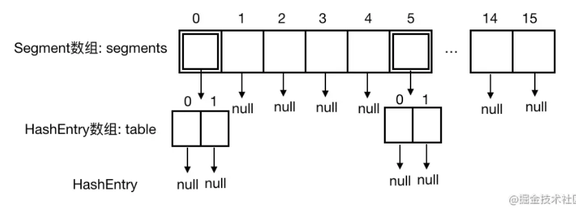


* Segment 的put方法

```java
    final V put(K key, int hash, V value, boolean onlyIfAbsent) {
        //步骤① start 加锁成功结点为null 失败则先在获取待操作的结点 如果结点不存在【无对应key的结点】则返回一个构造的结点【不存在的情况】 否则返回null【替换情况】
        HashEntry<K,V> node = tryLock() ? null :
            scanAndLockForPut(key, hash, value);
        //步骤① end
        V oldValue;
        try {
            //步骤② start
            //获取Segment中的HashEntry[]
            HashEntry<K,V>[] tab = table;
            //算出在HashEntry[]中的位置
            int index = (tab.length - 1) & hash;
            //找到HashEntry[]中的指定位置的第一个节点
            HashEntry<K,V> first = entryAt(tab, index);
            for (HashEntry<K,V> e = first;;) {
                //如果不为空，遍历这条链
                if (e != null) {
                    K k;
                    //情况① 之前已存过，则替换原值 【替换情况先用了】
                    if ((k = e.key) == key ||
                        (e.hash == hash && key.equals(k))) {
                        oldValue = e.value;
                        if (!onlyIfAbsent) {
                            e.value = value;
                            ++modCount;
                        }
                        break;
                    }
                    e = e.next;
                }
                else {
                    // 不存在相同key的结点时
                    //情况② 另一个线程的准备工作
                    if (node != null) // 之前尝试获取锁失败时事先构造的结点
                        //链表头插入方式
                        node.setNext(first);
                    else //情况③ 该位置为空，则新建一个节点(注意这里采用链表头插入方式)
                        // 没有获取锁失败
                        node = new HashEntry<K,V>(hash, key, value, first);
                    //键值对数量+1
                    int c = count + 1;
                    //如果键值对数量超过阈值
                    if (c > threshold && tab.length < MAXIMUM_CAPACITY)
                        //扩容
                        rehash(node);
                    else //未超过阈值，直接放在指定位置
                        setEntryAt(tab, index, node);
                    ++modCount;
                    count = c;
                    //插入成功返回null
                    oldValue = null;
                    break;
                }
            }
        //步骤② end
        } finally {
            //步骤③
            //解锁
            unlock();
        }
        //修改成功，返回原值
        return oldValue;
    }
```

* 步骤① 执行 tryLock 方法获取锁，拿到锁返回null，没拿到锁执行 scanAndLockForPut 方法；

  步骤② 和 1.7HashMap 里的那一套思路是一样的，不理解可以看下之前的文章介绍(情况②下面介绍)；

  步骤③   执行 unLock 方法解锁

* 假设现在Thread1进来存值，前面没人来过，它可以成功拿到锁，根据计算，得出它要存的键值对应该放在HashEntry[] 的0号位置，0号位置为空，于是新建一个 HashEntry，并通过 setEntryAt() 方法，放在0号位置，**然而还没等 Thread1 释放锁**，系统的时间片切到了 Thread2 ，先画图存档

  

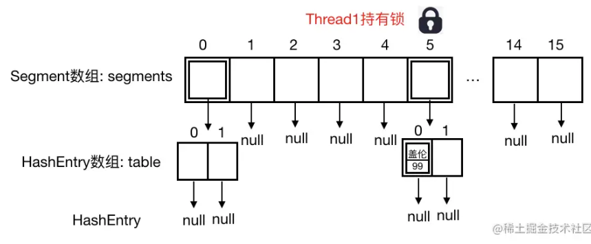

* Thread2 也来存值，通过前面的计算，恰好 Thread2 也被定位到 segments[5]，接下来 Thread2 **尝试获取锁，没有成功(Thread1 还未释放)，执行 scanAndLockForPut() 方法：**

  ```java
          private HashEntry<K,V> scanAndLockForPut(K key, int hash, V value) {
              //通过Segment和hash值寻找匹配的HashEntry
              HashEntry<K,V> first = entryForHash(this, hash);
              HashEntry<K,V> e = first;
              HashEntry<K,V> node = null;
              //重试次数
              int retries = -1; // negative while locating node
              //循环尝试获取锁
              while (!tryLock()) {
                  HashEntry<K,V> f; // to recheck first below
                  //步骤①
                  if (retries < 0) {
                      //情况① 没找到，之前表中不存在
                      if (e == null) {
                          if (node == null) // speculatively create node
                              //新建 HashEntry 备用,retries改成0
                              node = new HashEntry<K,V>(hash, key, value, null);
                          retries = 0;
                      }
                      //情况② 找到，刚好当前节点就是，retries改成0 【替换情况】
                      else if (key.equals(e.key))
                          retries = 0;
                      //情况③ 第一个节点不是，移到下一个，retries还是-1，继续找
                      else
                          e = e.next;
                  }
                  //步骤②
                  //构造节点或者找到了节点，但尝试了MAX_SCAN_RETRIES次还没拿到锁，
                  else if (++retries > MAX_SCAN_RETRIES) {
                      //泉水挂机 获取不到锁就等待 需要其他线程释放锁后唤醒
                      lock();
                      break;
                  }
                  //步骤③ 
                  //在MAX_SCAN_RETRIES次过程中，key对应的entry发生了变化，则从头开始
                  // 偶数次 且 对应的桶头节点改变了 可能键为key的节点从不存在变成存在了 需要重新操作
                  // 扩容操作会将圆桶位上链表上的节点移动到其他位置【位置+旧容量】，且为头插法，头结点也会改。
                  else if ((retries & 1) == 0 &&
                           (          = entryForHash(this, hash)) != first) {
                      e = first = f; // re-traverse if entry changed
                      retries = -1;
                  }
              }
              return node;
          }
  
  ```

  * Thread2 虽然此刻没有权限修改，但是它也没闲着，利用等锁的这个时间，把自己要放的键值对节点根据情况先构造出来【**不存在情况则返回构造的新节点，存在则返回null**】，这样当 Thread2 一拿到锁并找到对应位置后就可以直接设置节点的下一节点，免去了构造时间，节省时间。

    

* 假设 Thread2 put 值为("亚索"，“98”)，对应1号位置，那么在 scanAndLockForPut 方法中对应情况①，画图存档：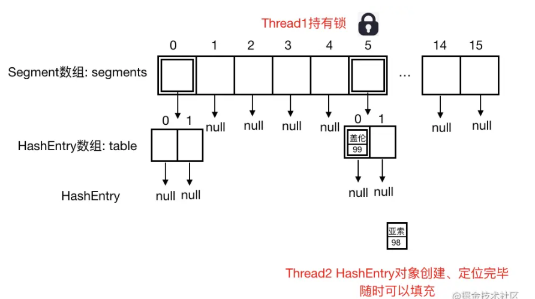

再回到 Segment put 方法中的情况②，当 Thread1 释放锁后，Thread2 持有锁，并准备把亚索放在1号位置，然而此时 Segment[5] 里的**键值对数量2 > 阈值1，所以调用 rehash() 方法扩容，**


```java
// node为新创建的结点    
private void rehash(HashEntry<K,V> node) {
        /*
         * Reclassify nodes in each list to new table.  Because we
         * are using power-of-two expansion, the elements from
         * each bin must either stay at same index, or move with a
         * power of two offset. We eliminate unnecessary node
         * creation by catching cases where old nodes can be
         * reused because their next fields won't change.
         * Statistically, at the default threshold, only about
         * one-sixth of them need cloning when a table
         * doubles. The nodes they replace will be garbage
         * collectable as soon as they are no longer referenced by
         * any reader thread that may be in the midst of
         * concurrently traversing table. Entry accesses use plain
         * array indexing because they are followed by volatile
         * table write.
         */
        //旧数组引用
        HashEntry<K,V>[] oldTable = table;
        //旧数组长度
        int oldCapacity = oldTable.length;
        //新数组长度为旧数组的2倍
        int newCapacity = oldCapacity << 1;
        //修改新的阈值
        threshold = (int)(newCapacity * loadFactor);
        //创建新表
        HashEntry<K,V>[] newTable =
            (HashEntry<K,V>[]) new HashEntry[newCapacity];
        int sizeMask = newCapacity - 1;
        //遍历旧表
        for (int i = 0; i < oldCapacity ; i++) {
            HashEntry<K,V> e = oldTable[i];
            // 当前链表不为空，对当前桶位的所有结点进行位置转移
            if (e != null) {
                HashEntry<K,V> next = e.next;
                //确定在新表中的位置
                int idx = e.hash & sizeMask;
                //情况① 链表只有一个节点，直接把这个节点放到新数组的对应下标位置即可
                if (next == null)   //  Single node on list
                    newTable[idx] = e;
                else { // Reuse consecutive sequence at same slot
                    //否则，处理当前链表的节点迁移操作
                    //记录上一次遍历到的节点
                    HashEntry<K,V> lastRun = e;
                    //对应上一次遍历到的节点在新数组中的新下标
                    int lastIdx = idx;
                    // 找到最后一个结点lastRun和其对应的新位置lastIdx
                    for (HashEntry<K,V> last = next;
                         last != null;
                         last = last.next) {
                        //情况② 扩容前后位置发生改变
                         //计算当前遍历到的节点的新下标
                        int k = last.hash & sizeMask;
                        //若 k 不等于 lastIdx，则说明此次遍历到的节点和上次遍历到的节点不在同一个下标位置
     //需要把 lastRun 和 lastIdx 更新为当前遍历到的节点和下标值。
     //若相同，则不处理，继续下一次 for 循环。
                        if (k != lastIdx) {
                            lastIdx = k;
                            lastRun = last;
                        }
                    }
                    //这里lastRun为某个在原来位置或原位置+旧数组长度上的结点 其后面的结点与其位置相同
                    //将改变的键值对放到新表的对应位置
                    newTable[lastIdx] = lastRun;
                    // Clone remaining nodes
                    //情况③ 把链表中剩下的节点拷到新表中 头插法
                    // //从旧数组的头结点开始遍历，直到 lastRun 节点，因为 lastRun节点后边的节点都已经迁移完成了。
                    for (HashEntry<K,V> p = e; p != lastRun; p = p.next) {
                        V v = p.value;
                        int h = p.hash;
                        int k = h & sizeMask;
                        HashEntry<K,V> n = newTable[k];
                        //用的是复制节点信息的方式，并不是把原来的节点直接迁移，区别于lastRun处理方式
                        newTable[k] = new HashEntry<K,V>(h, p.key, v, n);
                    }
                }
            }
        }
        //所有节点都迁移完成之后，再处理传进来的新的node节点，把它头插到对应的下标位置
        int nodeIndex = node.hash & sizeMask; // add the new node
    	//头插node结点
        node.setNext(newTable[nodeIndex]);
        newTable[nodeIndex] = node;
    	//更新当前Segment的table信息
        table = newTable;
    }
```

* 上边的迁移过程和 lastRun 和 lastIdx 变量可能不太好理解，我画个图就明白了。以其中一条链表处理方式为例。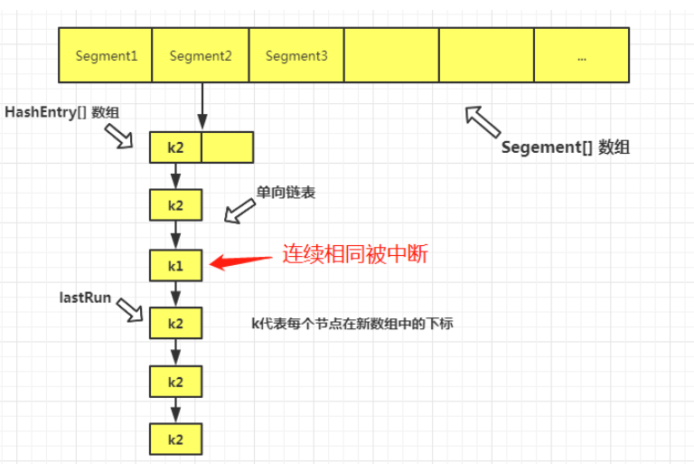

* 从lastRun节点到尾结点的这部分就可以整体迁移到新数组的对应下标位置了，因为它们的下标都是相同的，可以这样统一处理。
* 另外从头结点到 lastRun 之前的节点，无法统一处理，只能一个一个去复制了。且注意，这里不是直接迁移，而是复制节点到新的数组，旧的节点会在不久的将来，因为没有引用指向，被 JVM 垃圾回收处理掉。
* （不知道为啥这个方法名起为 rehash，其实**扩容时 hash 值并没有重新计算**，变化的只是它们所在的下标而已。我猜测，可能是，借用了 1.7 HashMap 中的说法吧。。。）


##### 流程

* 通过 key 定位到 Segment，之后在对应的 Segment 中进行具体的 put。

* 将当前 Segment 中的 table 通过 key 的 hashcode 定位到 HashEntry。

* 遍历该 HashEntry，如果不为空则判断传入的 key 和当前遍历的 key 是否相等，相等则覆盖旧的 value。

* 不为空则需要新建一个 HashEntry 并加入到 Segment 中，同时加入后如果键值对数量超过阈值则进行扩容。

* 最后会解除在 1 中所获取当前 Segment 的锁。

  


##### 流程图


* 相比之下，get 方法没有加锁/解锁的操作，代码比较简单就不分析了。
  * 也是先定位到 Segment，然后再定位到 HashEntry 。


### Java8 源码分析

* JDK 1.8 的 CHM（ConcurrentHashMap） 实现，完全重构了 1.7 。不再有 Segment 的概念，只是为了兼容 1.7 才申明了一下，并没有用到。
* 因此，**不再使用分段锁**，而是给数组中的**每一个头节点（为了方便，以后都叫桶）都加锁**，**锁的粒度降低了。并且，用的是 Synchronized 锁。**
* 为什么用同步锁：之前同步锁是一个重量级锁，但是在 JDK1.6 之后进行了各种优化之后，它已经不再那么重了。引入了偏向锁，轻量级锁，以及锁升级的概念，而且，据说在更细粒度的代码层面上，**同步锁已经可以媲美 Lock 锁，甚至是赶超了。** 
* 在 1.8 CHM 中，底层存储结构和 1.8 的 HashMap 是一样的，都是数组+链表+红黑树。不同的就是，多了一些并发的处理。
* 在 1.8 HashMap 中的线程安全问题，就是因为**在多个线程同时操作同一个桶的头结点时，会发生值的覆盖情况**。那么，顺着这个思路，我们看一下在 CHM 中它是怎么避免这种情况发生的吧。


先看下ConcurrentHashMap的初始化

```java
public ConcurrentHashMap() {
}

```

* 和Java7不一样，这里是个空方法


#### put方法

```java
public V put(K key, V value) {
    return putVal(key, value, false);
}

/** Implementation for put and putIfAbsent */
final V putVal(K key, V value, boolean onlyIfAbsent) {
    // key/value不能为空！！！
    if (key == null || value == null) throw new NullPointerException();
    //计算hash值
    int hash = spread(key.hashCode());
    int binCount = 0;
    for (Node<K,V>[] tab = table;;) {
        Node<K,V> f; int n, i, fh;
        //注释① 表为null则初始化
        if (tab == null || (n = tab.length) == 0)
            tab = initTable();
        //CAS方法判断指定位置是否为null，为空则通过创建新节点，通过CAS方法设置在指定位置
        else if ((f = tabAt(tab, i = (n - 1) & hash)) == null) {
            if (casTabAt(tab, i, null,
                         new Node<K,V>(hash, key, value, null)))
                break;                   // no lock when adding to empty bin
        }
        //当前节点正在扩容
        else if ((fh = f.hash) == MOVED)
            tab = helpTransfer(tab, f);
        //指定位置不为空
        else {
            V oldVal = null;
            //注释② 加锁
            synchronized (f) {
                if (tabAt(tab, i) == f) {
                    //节点是链表的情况
                    if (fh >= 0) {
                        binCount = 1;
                        //遍历整体链
                        for (Node<K,V> e = f;; ++binCount) {
                            K ek;
                            //如果已存在，替换原值
                            if (e.hash == hash &&
                                ((ek = e.key) == key ||
                                 (ek != null && key.equals(ek)))) {
                                oldVal = e.val;
                                if (!onlyIfAbsent)
                                    e.val = value;
                                break;
                            }
                            Node<K,V> pred = e;
                            //如果是新加节点，则以尾部插入实现添加
                            if ((e = e.next) == null) {
                                pred.next = new Node<K,V>(hash, key,
                                                          value, null);
                                break;
                            }
                        }
                    }
                    //节点是红黑树的情况
                    else if (f instanceof TreeBin) {
                        Node<K,V> p;
                        binCount = 2;
                        //遍历红黑树
                        if ((p = ((TreeBin<K,V>)f).putTreeVal(hash, key,
                                                       value)) != null) {
                            oldVal = p.val;
                            if (!onlyIfAbsent)
                                p.val = value;
                        }
                    }
                    else if (f instanceof ReservationNode)
                        throw new IllegalStateException("Recursive update");
                }
            }
            if (binCount != 0) {
                //链表中节点个数超过8转成红黑树
                if (binCount >= TREEIFY_THRESHOLD)
                    treeifyBin(tab, i);
                if (oldVal != null)
                    return oldVal;
                break;
            }
        }
    }
    //注释③ 添加节点
    addCount(1L, binCount);
    return null;
}

```

* 同样key/value 为空会报空指针异常，这也是和 HashMap 一个明显的区别。


##### 注释①

调用 initTable 初始化数组

```java
private final Node<K,V>[] initTable() {
    Node<K,V>[] tab; int sc;
    while ((tab = table) == null || tab.length == 0) {
         //sizeCtl 这个值有很多情况，默认值为0，
  //当为 -1 时，说明有其它线程正在对表进行初始化操作
  // 大于0时 为容量值
  //当表初始化成功后，又会把它设置为扩容阈值
  //当为一个小于 -1 的负数，用来表示当前有几个线程正在帮助扩容(后边细讲)
        if ((sc = sizeCtl) < 0)
               //若 sc 小于0，其实在这里就是-1，因为此时表是空的，不会发生扩容，sc只能为正数或者-1
   //因此，当前线程放弃 CPU 时间片，只是自旋。【while if】
            Thread.yield(); // lost initialization race; just spin
        //CAS 操作将 sizeCtl 值改为-1 表明当前线程正在进行表的初始化，其它失败的线程就会自旋
        else if (U.compareAndSwapInt(this, SIZECTL, sc, -1)) {
            try {
                //重新检查一下表是否为空
                if ((tab = table) == null || tab.length == 0) {
                    //如果sc大于0，则为sc，否则返回默认容量 16。【sc可由有参构造函数间接提供】
                    int n = (sc > 0) ? sc : DEFAULT_CAPACITY;
                    @SuppressWarnings("unchecked")
                    //创建数组
                    Node<K,V>[] nt = (Node<K,V>[])new Node<?,?>[n];
                    table = tab = nt;
                    //n减去 1/4 n ，即为 0.75n ，表示扩容阈值 
                    sc = n - (n >>> 2);
                }
            } finally {
                //更新 sizeCtl 为扩容阈值
                sizeCtl = sc;
            }
            //若当前线程初始化表成功，则跳出循环。其它自旋的线程因为判断数组不为空，也会停止自旋

            break;
        }
    }
    return tab;
}
```

* initTable方法并没有加锁，那么它是如何**保证创建新表的时候并发安全**呢？答案就是这里的 sizeCtl ，sizeCtl 默认值为0，当一个线程初始化数组时，会将 sizeCtl 改成 -1，由于被 **volatile 修饰**，对于其他线程来说这个变化是可见的，上面代码看到后续线程判断 sizeCtl 小于0 就会让出执行权。


##### 注释②

Java8 摒弃了Segment，而是**对数组中单个位置加锁**。当指定位置节点不为 null 时，情况与 Java8 HashMap 操作类似，新节点的添加还是尾部插入方式。


##### 注释③

不管是链表的还是红黑树，确定之后总的节点数会加1，可能会引起扩容，Java8 ConcunrrentHashMap 支持并发扩容，之前扩容总是由一个线程将旧数组中的键值对转移到新的数组中，支持并发的话，转移所需要的时间就可以缩短了，当然相应的并发处理控制逻辑也就更复杂了，扩容转移通过 transfer 方法完成，Java8中该方法很长，感兴趣的可以看下源码。。。


用一个图来表示 Java8 ConcurrentHashMap的样子

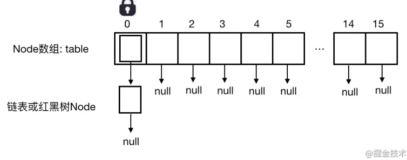


## 面试题

* HashMap的扩容原理？

  * 这里说的是jdk1.8下的，当HashMap中的键值对个数大于阈值时将进行扩容
  * 先将容量扩为原来的2倍，然后创建新的桶数组
  * 遍历旧数组中的每个桶位，通过rehash将桶位上的键值对转移到新数组对应的桶位上。
  * 其中，在新数组的位置，可为原位置或旧容量长度+原位置【通过键的hash值和旧容量进行与运算进行判断】

* HashMap初始有13个，要怎么new？

  * 指定初始容量方式实例化HashMap

    ```java
     public HashMap(int initialCapacity) {
            this(initialCapacity, DEFAULT_LOAD_FACTOR);
        }
    ```

* ConcurrentHashMap的size()怎么做的？

  * 这里说的是jdk1.7下的，先乐观认为不会有写，统计每个段的count变量和，统计完后如果modCount变量发生变化，则统计过程中count发生了变化，才采用加锁的方式进行统计。

