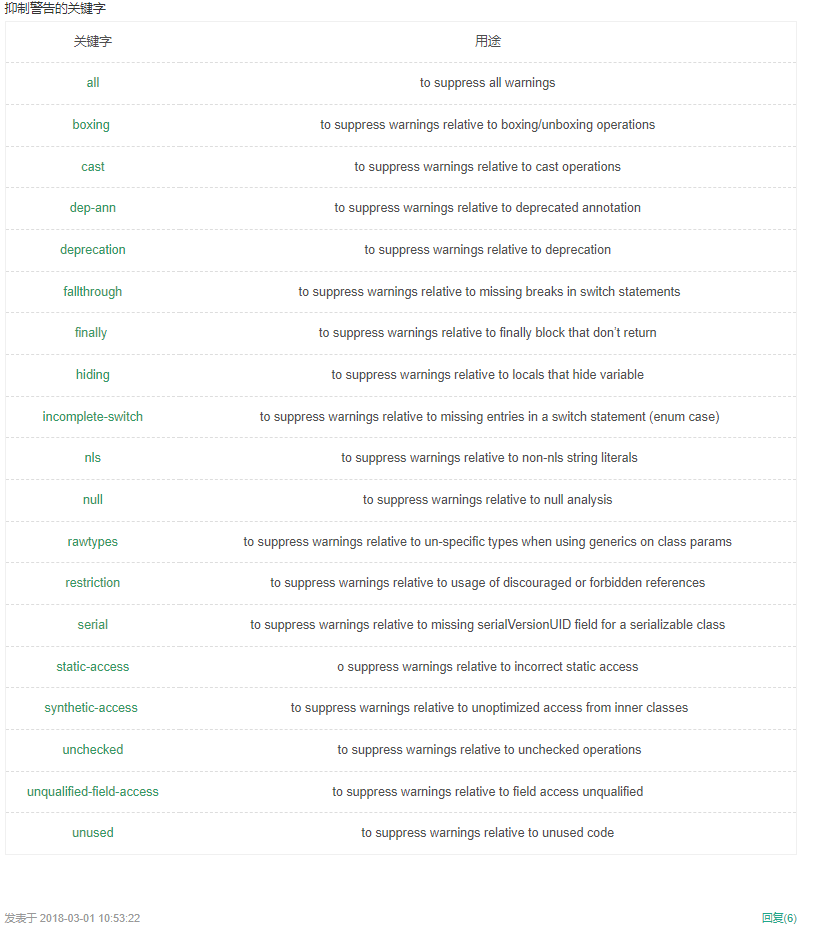
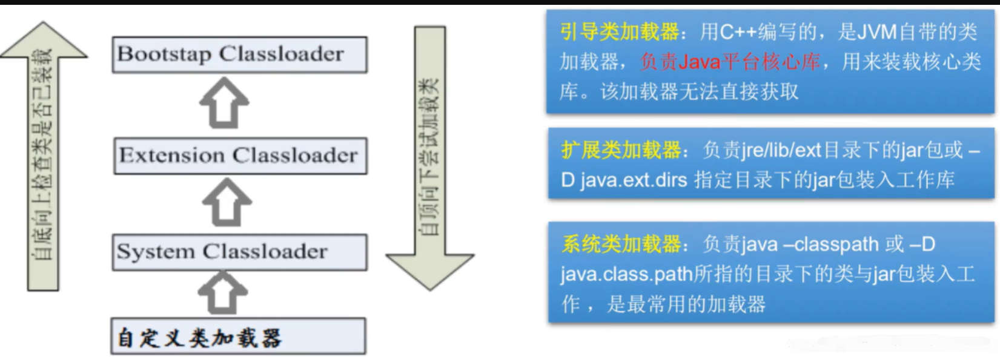

# 狂神说注解和反射笔记

## 什么是注解


## 内置注解


* **Suppresswarnings 注解**
  * 可以达到抑制编译器编译时产生警告的目的，但是**很不建议使用@SuppressWarnings注解**，使用此注解，编码人员**看不到编译时编译器提示的相应的警告**，不能选择更好、更新的类、方法或者不能编写更规范的编码。同时后期更新JDK、jar包等源码时，使用@SuppressWarnings注解的代码可能受新的JDK、jar包代码的支持，出现错误，仍然需要修改。




## 元注解

- 元注解的作用就**是负责注解其他注解**, Java定义了4个标准的meta -annotation类型,他们被用来提供对其他annotation类型作说明.

- 这些类型和它们所支持的类在java.lang.annotation包中可以找到.(

   

  @ Target , @Retention，@Documented , @Inherited

   

  )

  - **@Target** :用于描述**注解的使用范围(**即:被描述的注解可以用在什么地方)

  - @Retention

    :表示需要**在什么级别保存该注释信息**,用于描述注解的生命周期

    - (SOURCE < CLASS < **RUNTIME**) 越高级范围越大

  - @Document:说明该注解将被包含在javadoc中

  - @Inherited: 说明子类可以**继承**父类中的该注解
  
  - 所有注解都有一个共同父类Annotation

```java
import java.lang.annotation.*;
@MyAnnotation
public class Demo02 {
    void test(){
    }
}
//定义一个注解
//Target 表示我们的注解可以用在哪些地方.
@Target(value = {ElementType.METHOD, ElementType.TYPE})
//Retention表示我们的注解在什么地方还有效。
// runtime>class>sources
@Retention(value = RetentionPolicy.RUNTIME)
//Documented表示是否将我们的注解生成在Javadoc中
@Documented
//Inherited子类可以继承父类的注解
@Inherited
@interface MyAnnotation{ }
```


## 自定义注解

- **使用@interface自定义注解时,自动继承了java.lang .annotation.Annotation接口**
- 分析：
  - @ interface用来声明一个注解,格式: public @ interface注解名{定义内容}
  - 其中的**每一个方法实际 上是声明了一个配置参数**.
  - **方法的名称就是参数的名称**.
  - **返回值类型就是参数的类型(返回值只能是基本类型,Class , String , enum ).**
  - 可以通过**default来声明参数的默认值**
  - 如果只有**一个参数成员, 一般参数名为value** **只有一个参数时 运用注解时参数名可省**
  - 注解元素必须要有值，我们定义注解元素时,经常使用空字符串，0作为默认值.

```java
import java.lang.annotation.*;
@MyAnnotation("aaa")
public class Demo02 {
    void test(){
    }
}
//定义一个注解
//Target 表示我们的注解可以用在哪些地方.
@Target(value = {ElementType.METHOD, ElementType.TYPE})
//Retention表示我们的注解在什么地方还有效。
// runtime>class>sources
@Retention(value = RetentionPolicy.RUNTIME)
//Documented表示是否将我们的注解生成在Javadoc中
@Documented
//Inherited子类可以继承父类的注解
@Inherited
@interface MyAnnotation{
String value() default "";
}
```


## 静态VS动态语言

#### 动态语言

- 是一类在**运行时可以改变其结构的语言**:例如新的函数、对象、甚至代码可以被引进，已有的函数可以被删除或是其他结构上的变化。通俗点说就是在运行时代码可以根据某些条件改变自身结构。
- 主要动态语言: Object、C、C#、 JavaScript、 PHP、Python等。

#### 静态语言

- 与动态语言相对应的,运行时结构不可变的语言就是静态语言。如Java、 C、C++。
- Java不是动态语言，但Java可以称之为“准动态语言”。即Java有一 定的动态性,我们可以利用反射机制获得类似动态语言的特性。Java的动态性让编程的时候更加灵活!


## Java Reflection(反射)

- Reflection (反射)是Java被视为动态语言的关键，**反射机制允许程序在执行期借助于Reflection API取得任何类的内部信息**，并能**直接操作任意对象的内部属性及方法**。

```java
Class C= Class.forName("java.lang String");
```

- 加载完类之后,在堆内存的方法区中就产生了一个Class类型的对象(一个类只有一个Class对象)，**这个对象就包含了完整的类的结构信息。我们可以通过这个对象看到类的结构。这个对象就像一面镜子， 透过这个镜子看到类的结构，所以我们形象的称之为：反射。**
  


## Java反射机制研究及应用

#### Java反射机制提供的功能

- 在运行时判断任意一个对象所属的类
- 在运行时构造任意一个类的对象
- 在运行时判断任意一个类所具有的成员变量和方法
- 在运行时获取泛型信息
- 在运行时调用任意一个对象的成员变量和方法:
- 在运行时处理注解
- 生成动态代理 ##怎么生成


## Java反射优点和缺点

- 优点：可以实现动态创建对象和编译，体现出很大的灵活性
- 缺点：对性能有影响，使用反射基本上是一种解释操作，我们可以告诉JVM,我们希望做什么并且它满足我们的要求。这类操作总是慢于直接执行相同的操作。


## 反射相关的主要API

- java.lang.Class：代表一个类

- java.lang.reflect.Method :代表类的方法

- java.lang.reflect.Field :代表类的成员变量

- java.lang.reflect.Constructor :代表类的构造器

  **Class类的方法：**


**获取Class实例的三种方法：**


```java
public class Demo02 {
    public static void main(String[] args) throws ClassNotFoundException {
        Person s1 = new Student();
        System.out.println("这个人是"+s1.name);
        //方式一：通过对象获取
        Class c1 = s1.getClass();
        System.out.println(c1.hashCode());##hashCode原理
        //方式二：通过forname获取
        Class c2 = Class.forName("com.reflection.Student");
        System.out.println(c2.hashCode());
        //方式三：通过类名.class获得
        Class c3 = Student.class;
        System.out.println(c3.hashCode());
        //方式四：基本内置类型的包装类都有一个TYPE属性
        Class c4 = Integer.TYPE;
        System.out.println(c4);
        //方式四：通过获得父类类型
        Class c5 = c1.getSuperclass();
        System.out.println(c5);
    }
}
class Person{
    public String name;
    public Person(){}
    public Person(String name){
        this.name = name;
    }
    @Override
    public String toString() {
        return "Person{" +
                "name='" + name + '\'' +
                '}';
    }
}
class Student extends Person{
    public Student(){
        this.name = "Student";
    }
}
class Teacher extends Person{
    public Teacher(){
        this.name = "Teacher";
    }
}
```

**类名.class 的方式更加安全**，例如当你要获取一个接口的class时，可以使用 类名.class 的方式获取但此时就不能通过对象.class 的方式获取了，因为**接口是没有实例对象的，接口只有实现类对象，通过这种方式获取到的是接口的实现类的class**，而非是接口的class再者就是**对象声明的类型未必是对象本身真正的类型，通过对象获取class容易产生混乱** **(多态情况，对象.class的方式获取到的是内存中的实现类，而不是引用类)**，因此尽量使用更加安全的方式.

.class和getClass()区别

类名.class叫做“类字面量”，因class是关键字, 所以类名.class**编译时确定**。

getclass()**运行时根据实际实例确定**，getClass()是动态而且是final的。

String.class 是能对类名的引用 取得在内存中该类型class对象的引用，

new String().getClass() 是通过实例对象取得在内存中该**实际类型**class对象的引用。


**哪些类型可以有Class对象?**

- class: 外部类成员(成员内部类，静态内部类)，局部内部类，匿名内部类。
- interface: 接口
- []:数组
- enum:枚举
- annotation:注解@interface
- primitive type:基本数据类型
- void
- Class

```java
public class Demo03 {
    public static void main(String[] args) {
        Class c1 = Object.class; //类 .
        Class c2 = Comparable.class; //按口
        Class c3 = String[].class; //一维数组
        Class c4 = int[][].class; //二维数组
        Class c5 = Override.class; //注解
        Class c6 = ElementType.class; //枚举
        Class c7 = Integer.class; //基本数据类型
        Class c8 = void.class; //void
        Class c9 = Class.class; //Class
        System.out.println(c1);//class java.lang.Object
        System.out.println(c2);//interface java.lang.Comparable
        System.out.println(c3);//class [Ljava.lang.String;
        System.out.println(c4);//class [[I
        System.out.println(c5);//interface java.lang.Override
        System.out.println(c6);//class java.lang.annotation.ElementType
        System.out.println(c7);//class java.lang.Integer
        System.out.println(c8);//void
        System.out.println(c9);//class java.lang.Class
        //只要元素类型与维度一样，就是同一个Class.
        int[] a = new int[10];
        int[] b = new int[100];
        System.out.println(a.getClass().hashCode());//1163157884
        System.out.println(b.getClass().hashCode());//1163157884
    }
}
```


## 内存分析


## 类的加载过程（了解）

当程序主动使用某个类时，如果该类还未被加载到内存中，则系统会通过**如下三个步骤来对该类进行初始化。**


- 类的加载过程与ClassLoader的理解
  加载:将class文件字节码内容加载到内存中，并将这些静态数据转换成方法区的运行时数据结构,然后**生成一个代表这个类的java.lang.Class对象（未实例化）**.

**加载:**

- 将class文件字节码内容加载到内存中，并将这些静态数据转换成方法区的运行时数据结构，然后生成一个代表这个类的java.lang.Class对象.

**链接:** 将Java类的二进制代码合并到JVM的运行状态之中的过程。

- 验证:确保加载的类信息符合JVM规范，没有安全方面的问题

- 准备:**正式为类变量(static) 分配内存并设置类变量默认初始值(发生在初始化前，基本数据类型为0 引用类型为null)的阶段,类变量常量的初值即为代码中设置的值，final static tmp = 456， 那么该阶段tmp的初值就是456，这些内存都将在方法区中进行分配**。

- 解析:虚拟机常量池内的符号引用(常量名)替换为直接引用(地址)的过程。

  两个重点：

  - 符号引用。即一个字符串，但是这个字符串给出了一些能够唯一性识别一个方法，一个变量，一个类的相关信息。
  - 直接引用。可以理解为一个内存地址，或者一个偏移量。比如**类方法，类变量的直接引用是指向方法区的指针**；而实例方法，实例变量的直接引用则是**从实例的头指针开始算起到这个实例变量位置的偏移量**

  举个例子来说，现在调用方法hello()，这个方法的地址是1234567，那么hello就是符号引用，1234567就是直接引用。

  在解析阶段，虚拟机会把所有的类名，方法名，字段名这些符号引用替换为具体的内存地址或偏移量，也就是直接引用。

  

**初始化:**

这个阶段主要是对类变量初始化，是执行类构造器的过程。

换句话说，**只对static修饰的变量或语句进行初始化。**

- 执行类构造器< clinit> ()方法的过程。**类构造器< clinit> ()方法是由编译期自动收集类中所有类变量(静态变量)的赋值动作和静态代码块中的语句合并产生的(同时包含多个静态变量和静态代码块，则按照自上而下的顺序依次执行)**。(类构造器是构造类信息的，**不是构造该类对象的构造器**)。
- 当初始化一个类的时候，**如果发现其父类还没有进行初始化，则需要先触发其父类的初始化。**
- 虚拟机会保证一 个类的 ()方法在多线程环境中被正确加锁和同步。

```java
public class Demo04 {
    public static void main(String[] args) {
        A a=new A();
        System.out.println("初始化完打印的值"+A.m);//100
        /*
        1.加载到内存，产生一个类对应Class对象
        2.链接，链接结束后m=◎
        3.初始化
        <clinit>(){
        按顺序收集所有静态语句
            System. out . println( "A类静态代码块初始化") ;
            m = 300;
            m=100;
         }
         m=100
         */
        }
}
class A{
    static int m ;
    static{
        System.out.println("静态代码块初始化");
        System.out.println("类变量分配的初始值"+m);
        m=1000;
        System.out.println(m);
    }
    public A(){
        System.out.println("无参构造初始化");
    }
}
```


## 什么时候会发生类初始化?

- 类的主动引用(一定会发生类的初始化))
  - **当虚拟机启动，先初始化main方法所在的类**
  - new一个类的对象
  - 调用类的静态成员(除了final常量)和静态方法
  - 使用java.lang.reflect包的方法对类进行反射调用
  - 当初始化一个类, 如果其父类没有被初始化，则先会初始化它的父类
- 类的被动引用(不会发生类的初始化)
  - 当访问一个静态域时，只有真正声明这个域的类才会被初始化。如:当通过子类引用父类的静态变量，不会导致子类初始化**(因为所调数据为父类的，只要父类初始化即可)**
  - 通过数组定义类引用，不会触发此类的初始化**(new 数组的话只是声明其实还没有指向具体对象，所以没有初始化,即没有初始化这个类的实例，只是预先申请了空间)**
  - 引用**类变量常量不会触发此类的初始化** **(常量在准备阶段被赋值了,而不是因为在常量池)**

```java
public class Demo05 {
    static {
        System.out.println("main类被加载");
    }
    public static void main(String[] args) throws ClassNotFoundException {
        //1.主动引用
        //Son son = new Son();
        /*
        * main类被加载
        * 父类被加载
        * 子类被加载
        * */
        //反射也会产生主动引用
        //Class.forName ("com.reflection.Son");
        /*
         * main类被加载
         * 父类被加载
         * 子类被加载
         * */
        //不会产生类的引用的方法
        //System.out.println(Son.b);
        /*
        * main类被加载
        * 父类被加载
        * 2
        * */
        //Son[] array = new Son[5];
        /*main类被加载*/
        System.out.println(Son.M) ;
        /*
         * main类被加载
         * 1
         * */
    }
}
class Father {
    static int b = 2;
    static {
        System.out.println("父类被加载");
    }
}
class Son extends Father {
    static {
        System.out.println("子类被加载");
    }
    static int m = 100;
    static final int M = 1;
```


## 类加载器的作用

类加载器作用是用来把类（class）装载进内存的。

```java
   private Class(ClassLoader loader) {
        // Initialize final field for classLoader.  The initialization value of non-null
        // prevents future JIT optimizations from assuming this final field is null.
        classLoader = loader;
    }
//Class类中构造方法参数为类加载器 
```


JVM规范定义了如下类型的类的加载器。


- 类加载的作用:**将class文件字节码内容加载到内存中，并将这些静态数据转换成方法区的运行时数据结构，然后在堆中生成一个代表这个类的java.lang(Class对象)作为方法区中类数据的访问入口。**
- 类缓存:标准的JavaSE类加载器可以按要求查找类,但一旦某企类被加载到类加载器中，它将维持加载(缓存) 一段时间。不过JVM垃圾回收机制可以回收这些Class对象。

**双亲委派机制**：如果自己定义和jdk同名的类，运行时虚拟机会在系统的类加载器中寻找，再去扩展类加载器中寻找，再去根加载器中寻找，如果存在同名的类，**会使用根加载器中的类，而不使用自己定义的类**

```java
public class Demo06 {
    public static void main(String[] args) throws ClassNotFoundException {
        //获取系统的类加载器
        ClassLoader systemClassLoader = ClassLoader.getSystemClassLoader();
        System.out.println(systemClassLoader);//sun.misc.Launcher$AppClassLoader@18b4aac2
        //获取系统类加载器的父类加载器-->扩展类加载器
        ClassLoader parent = systemClassLoader.getParent();
        System.out.println(parent);//sun.misc.Launcher$ExtClassLoader@4554617c
        //获取扩展类加载器的父类加载器- ->根加载器(C/c++)
        ClassLoader grantparent = parent.getParent();
        System.out.println(grantparent);//null
        //测试当前类是哪个加载器加载的
        ClassLoader classLoader = Class.forName("com.reflection.Demo06").getClassLoader();
        System.out.println(classLoader);//sun.misc.Launcher$AppClassLoader@18b4aac2
        //测试JDK内置的类是谁加载的
        ClassLoader classLoader1 = Class.forName("java.lang.Object").getClassLoader();
        System.out.println(classLoader1);//null
        //如何获得系统类加载器可以加载的路径
        System.out.println(System.getProperty("java.class.path"));
        
        //类加载器存在双亲委派机制 双亲委派机制大概就创建对象后先向上(父类加载器)找包，找不到了在用自己的
        
       /*
       * D:\Environment\java\jre\lib\charsets.jar;
       * D:\Environment\java\jre\lib\deploy.jar;
       * D:\Environment\java\jre\lib\ext\access-bridge-64.jar;
       * D:\Environment\java\jre\lib\ext\cldrdata.jar;
       * D:\Environment\java\jre\lib\ext\dnsns.jar;
       * D:\Environment\java\jre\lib\ext\jaccess.jar;
       * D:\Environment\java\jre\lib\ext\jfxrt.jar;
       * D:\Environment\java\jre\lib\ext\localedata.jar;
       * D:\Environment\java\jre\lib\ext\nashorn.jar;
       * D:\Environment\java\jre\lib\ext\sunec.jar;
       * D:\Environment\java\jre\lib\ext\sunjce_provider.jar;
       * D:\Environment\java\jre\lib\ext\sunmscapi.jar;
       * D:\Environment\java\jre\lib\ext\sunpkcs11.jar;
       * D:\Environment\java\jre\lib\ext\zipfs.jar;
       * D:\Environment\java\jre\lib\javaws.jar;
       * D:\Environment\java\jre\lib\jce.jar;
       * D:\Environment\java\jre\lib\jfr.jar;
       * D:\Environment\java\jre\lib\jfxswt.jar;
       * D:\Environment\java\jre\lib\jsse.jar;
       * D:\Environment\java\jre\lib\management-agent.jar;
       * D:\Environment\java\jre\lib\plugin.jar;
       * D:\Environment\java\jre\lib\resources.jar;
       * D:\Environment\java\jre\lib\rt.jar;
       * D:\project\java-design\out\production\design02;
       * D:\IDEA\IntelliJ IDEA 2020.1.1\lib\idea_rt.jar
        */
    }
}
```


## 创建运行时类的对象

#### 获取运行时类的完整结构

- 通过反射获取运行时类的完整结构Field、Method, Constructor、 Superclass、 Interface、 Annotation
- 实现的全部接口
- 所继承的父类
- 全部的构造器
- 全部的方法
- 全部的Field
- 注解

```java
//获得类的信息
public class Demo07 {
    public static void main(String[] args) throws ClassNotFoundException, NoSuchFieldException, NoSuchMethodException {
        Class c1 = Class.forName("com.reflection.User");
        //获得包名+类名
        User user = new User();
        Class c2 = user.getClass();
        //获得类的信息
        System.out.println(c1.getName());//获得包名+类名
        System.out.println(c1.getSimpleName());//获得类名
        //获得类的属性
        System.out.println("=======================");
        Field[] fields = c1.getFields();//获取类的公开属性和父类的公开属性
        fields = c1.getDeclaredFields();//获取类的任何属性只能本类的无父类 
        for (Field field : fields) {
            System.out.println(field);
        }
        //获得指定属性 只能未本类的无父类 
        Field name = c1.getDeclaredField("name");
        System.out.println(name);
        //获得类的方法
        System.out.println("=========================");
        Method[] methods = c1.getMethods();//获得本类和父类的所有public方法 无构造方法
        for (Method method : methods) {
            System.out.println("methods " + method);
        }
        System.out.println("=========================");
        Method[] decmethods = c1.getDeclaredMethods();//获得本类的所有方法包括私有
        for (Method method : decmethods) {
            System.out.println("decmethods " + method);
        }
        //获得指定方法(不包含private)
        //需要传参数的原因：存在重载，参数可找到指定的方法
        System.out.println("=========================");
        Method getName = c1.getMethod("getName", null);
        Method setName = c1.getMethod("setName", String.class);
        System.out.println(getName);
        System.out.println(setName);
        //获得本类构造器
        System.out.println("=========================");
        //public
        Constructor[] constructors = c1.getConstructors();
        for (Constructor constructor : constructors) {
            System.out.println("getConstructors " + constructor);
        }
        System.out.println("=========================");
        //包含private
        Constructor[] constructors1 = c1.getDeclaredConstructors();
        for (Constructor constructor : constructors1) {
            System.out.println("getDeclaredConstructors " + constructors1);
        }
        //获得指定的构造器
        Constructor getDeclaredConstructor = c1.getDeclaredConstructor(String.class, int.class);
        System.out.println("指定构造器" + getDeclaredConstructor);
    }
}
```


## 小结

1. 在实际的操作中, (取得类的信息的操作代码并不会经常开发)
2. 一定要熟悉java.lang.reflect包的作用，反射机制。
3. 如何取得属性、方法、构造器的名称，修饰符等。


## 有了Class对象能做什么?

- 创建类的对象:调用Class对象的newInstance()方法
  - 类必须有一个无参数的构造器。
  - 类的构造器的访问权限需要足够思考?难道没有无参的构造器就不能创建对象了吗?
- 只有在操作的时候**明确的** **调用类中的构造器,并将参数传递进去之后，才可以实例化操作**。步骤如下:
  - 1)通过Class类的getDeclaredConstructor(Class … parameterTypes)取得本类的指定形参类型的构造器
  - 2)向构造器的形参中传递一一个对象数组进去，里面包含了构造器中所需的各个参数。
  - 3)通过Constructor实例化对象


## 调用指定的方法

通过反射，调用类中的方法，通过Method类完成。

①通过Class类的getMethod(String name,Clas…parameterTypes)方法取得一个Method对象，并设置此方法操作时所需要的参数类型。

②之后使用Object invoke(Object obj, Object[] args)进行调用，并向方法中传递要设置的obj对象的参数信息。


#### invoke

```java
Object invoke(Object obj, Object ... args)
1
```

- **Object对应原方法的返回值**，若原方法无返回值，此时返回null
- 若**原方法若为静态方法，此时形参0bject obj可为null**
- 若**原方法形参列表为空,则Object[] args为null**
- 若原方法声明为private,则需要在调用此invoke()方法前**(getDeclaredXxx只是可以获取对应私有的方法、属性、构造方法，要使用需setAccessible为true)**，显式调用**方法对象的setAccessible(true)方法，将可访问private的方法**。

#### setAccessible

- Method和Field、Constructor对象都有setAccessible()方法。
- setAccessible作用是启动和禁用访问安全检查的开关。
- 参数值为true则指示反射的对象在使用时应该取消Java语言访问检查。
- 提高反射的效率。如果代码中必须用反射，而该句代码需要频繁的被调用，那么请设置为true。
- 使得原本无法访问的私有成员也可以访问
- 参数值为false则指示反射的对象应该实施Java语言访问检查

```java
/动态创建对象，通过反射
public class Demo08 {
    public static void main(String[] args) throws ClassNotFoundException, IllegalAccessException, InstantiationException, NoSuchMethodException, InvocationTargetException, NoSuchFieldException {
        //获得class对象
        Class c1 = Class.forName("com.reflection.User");
        //创建一个对象
        System.out.println("============================");
        User user = (User)c1.newInstance();//本质是调用了类的无参构造器
        System.out.println(user);
        //通过构造器创建对象
        System.out.println("============================");
        Constructor constructor = c1.getDeclaredConstructor(String.class,int.class);
        User user2 = (User)constructor.newInstance("打爆",22);
        System.out.println(user2);
        //通过反射调用普通方法
        //通过反射获取一个方法
        System.out.println("============================");
        Method setName = c1.getDeclaredMethod("setName",String.class);
        //invoke:激活的意思
        //参数：对象，方法参数的值
        setName.invoke(user,"立良");
        System.out.println(user.getName());
        System.out.println("============================");
        //通过反射操作属性
        User user3 = (User)c1.newInstance();
        //通过Class对象获取对应属性信息
        Field name = c1.getDeclaredField("name");
        //不能直接操作私有属性，我们需要关闭程序的安全监测，属性或方法的setAccessible(true)
        name.setAccessible(true);
        name.set(user3,"小宝");//找到实例变量属性并设置值 静态属性时第一个参数Object为null
        System.out.println(user3.getName());
    }
}
```

```java
public class Demo09 {
    public static void main(String[] args) throws NoSuchMethodException, IllegalAccessException, InvocationTargetException {
        test1();//5ms
        test2();//4114ms
        test3();//1483ms
    }
    public static void test1(){
        User user = new User();
        long start = System.currentTimeMillis();
        for (int i = 0; i < 1000000000; i++) {
            user.getName();
        }
        long end = System.currentTimeMillis();
        System.out.println(end-start+"ms");
    }
    public static void test2() throws NoSuchMethodException, InvocationTargetException, IllegalAccessException {
        User user = new User();
        Class c1 = user.getClass();
        Method getName = c1.getDeclaredMethod("getName",null);

        long start = System.currentTimeMillis();
        for (int i = 0; i < 1000000000; i++) {
            getName.invoke(user,null);
        }
        long end = System.currentTimeMillis();
        System.out.println(end-start+"ms");
    }
    public static void test3() throws NoSuchMethodException, InvocationTargetException, IllegalAccessException {
        User user = new User();
        Class c1 = user.getClass();
        Method getName = c1.getDeclaredMethod("getName",null);
        getName.setAccessible(true);//使用了setAccessible(true)后速度会快很多
        long start = System.currentTimeMillis();
        for (int i = 0; i < 1000000000; i++) {
            getName.invoke(user,null);
        }
        long end = System.currentTimeMillis();
        System.out.println(end-start+"ms");
    }
}
```


## 反射操作泛型

- Java采用泛型擦除的机制来引入泛型, Java中的泛型仅仅是给编译器javac使用的，确保数据的安全性和免去强制类型转换问题,但是, **一旦编译完成,所有和泛型有关的类型全部擦除**

- ##[反射泛型相关理解](https://blog.csdn.net/kobejayandy/article/details/11709043?ops_request_misc=%257B%2522request%255Fid%2522%253A%2522160690868119724839535181%2522%252C%2522scm%2522%253A%252220140713.130102334..%2522%257D&request_id=160690868119724839535181&biz_id=0&utm_medium=distribute.pc_search_result.none-task-blog-2~all~top_click~default-1-11709043.pc_first_rank_v2_rank_v28p&utm_term=%E5%8F%8D%E5%B0%84%E6%93%8D%E4%BD%9C%E6%B3%9B%E5%9E%8B&spm=1018.2118.3001.4449)

- 为了通过反射操作这些类型, Java新增了ParameterizedType , GenericArrayType ，TypeVariable和WildcardType几种类型来代表不能被归一到Class类中的类型但是又和原始类型齐名的类型.
  - ParameterizedType :表示一种参数化类型,比如Collection<String> ,**具有<>符号的变量是参数化类型即泛型**
  - GenericArrayType :表示一种元素类型是参数化类型或者类型变量的数组类型
  - TypeVariable :是各种类型变量的公共父接口
  - WildcardType :代表一种通配符类型表达式
  - java.lang.reflect.**Type：**java语言中所有类型的**公共父接口** 
  
  **Type所有类型指代的有：**原始类型 (**raw types**)【对应Class】**，**参数化类型 (**parameterizedtypes**)【对应ParameterizedType】， 数组类型 (**array types**)【对应GenericArrayType】，类型变量 (**type variables**)【对应TypeVariable】，基本数据类型(**primitivetypes**)【仍然对应Class】**

例一：

```java
public class Demo10 {
    public void test01 (Map<String,User> map, List<User> list){
        System.out.println("test01");
    }
    public Map<String, User> test02(){
        System.out.println("test02");
        return null;
    }

    public static void main(String[] args) throws NoSuchMethodException {
        Method method = Demo10.class.getMethod("test01",Map.class,List.class);
        Type[] genericParameterTypes= method.getGenericParameterTypes();//获得方法中形参类型 返回Type类型的数组 Type[].
        for (Type genericParameterType : genericParameterTypes) {
            System.out.println("参数范型"+genericParameterType);
            if (genericParameterType instanceof ParameterizedType //如果是泛型){
                Type[] actualTypeAnguments=(ParameterizedType)genericParameterType.getActualTypeArguments();//getActualTypeArguments() 获取参数化类型<>中的实际类型
                for (Type actualTypeAngument : actualTypeAnguments) {
                    System.out.println("实际参数范型"+actualTypeAngument);
                }
            }
        }
        Method method1 = Demo10.class.getMethod("test02",null);
        Type getGenericReturnType= method1.getGenericReturnType();//获取返回值泛型
        if (getGenericReturnType instanceof  ParameterizedType) {
            Type[] actualTypeArguments = (ParameterizedType) getGenericReturnType.getActualTypeArguments();
            for (Type actualTypeArgument : actualTypeArguments) {
                System.out.println("返回值范型" + actualTypeArgument);
            }
        }
    }
}
```

Method中**获取方法形参类型**的方法：

getGenericParameterTypes:返回`Type`类型的数组 `Type[]`.

getParameterTypes:返回Class类型的数组： `Class<?>[]`.

①如果方法参数不是**参数化类型（泛型）**，那么`getParameterTypes`和`getGenericParameterTypes`返回的结果是一样的。
②如果方法参数是泛型，这时就有区别了，getGenericParameterTypes会返回**完整的信息（List<String>）**，而`getParameterTypes`只会返回**参数类型(List)**，参数化类型无法得到。


## 反射操作注解

**getAnnotations
getAnnotation**

```java
package reflect;

import java.lang.annotation.*;

public class Test10 {
    public static void main(String[] args) throws NoSuchFieldException {
        Class<Student1> student1Class = Student1.class;
        Annotation[] annotations = student1Class.getAnnotations();//Annotation为所有注解的父类 获取类上所有注解
        for (Annotation annotation : annotations) {
            System.out.println(annotation);//@reflect.Table(value=db_student)
        }
        Table annotation = student1Class.getAnnotation(Table.class);//获取class对象标注在类上指定的注解
        System.out.println(annotation);//@reflect.Table(value=db_student)
        String value = annotation.value();//获取class对象中指定的注解的值 即注解的值
        System.out.println(value);
        java.lang.reflect.Field name = student1Class.getDeclaredField("name");//获取class对象中的属性
        Field annotation1 = name.getAnnotation(Field.class);//获取class对象中的标注在属性上的注解
        System.out.println(annotation1.columnName());//获取class对象中的属性上注解的值
        System.out.println(annotation1.length());
        System.out.println(annotation1.type());
    }
}
//类上注解
@Table("db_student")
class Student1{
    //属性上注解
    @Field(columnName = "db_id",type = "int",length = 10)
    private int id;
    @Field(columnName = "db_age",type = "int",length = 10)
    private int age;
    @Field(columnName = "db_name",type = "varchar",length = 10)
    private String name;
    public Student1() {
    }

    public Student1(int id, int age, String name) {
        this.id = id;
        this.age = age;
        this.name = name;
    }

    public int getId() {
        return id;
    }

    public void setId(int id) {
        this.id = id;
    }

    public int getAge() {
        return age;
    }

    public void setAge(int age) {
        this.age = age;
    }

    public String getName() {
        return name;
    }

    public void setName(String name) {
        this.name = name;
    }
}
@Target(ElementType.TYPE)
@Retention(RetentionPolicy.RUNTIME)
@interface Table{
    String value();
}
@Target(ElementType.FIELD)
@Retention(RetentionPolicy.RUNTIME)
@interface Field{
    String columnName();
    String type();
    int length();
}
```
