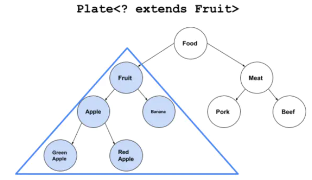
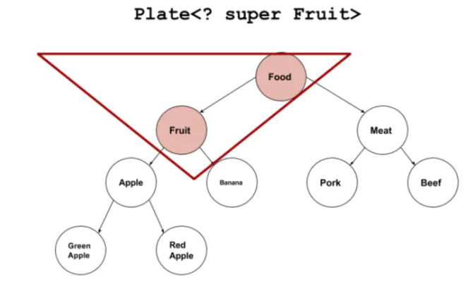

# 编程思想15泛型

## 提出泛型的原因

* 一般的类和方法，只能使用具体的类型，要么是基本类型，要么是自定义类型，如果要编写可以应用于多种类型的代码，这种刻板的限制对代码束缚就会很大。


## 定义

* 泛型即**参数化类型**，“使用于许多许多类型“
  * 参数化类型机制：容器知道自己保存的对象的类型，不需要向下转型以及消除犯错误的可能的解决方案。
  * 参数化类型就是**将类型由原来的具体的类型参数化，类似于方法中的变量参数，此时类型也定义成参数形式（可以称之为类型形参），然后在使用/调用时传入具体的类型（类型实参）。**
* 作用：泛型使**代码能够应用于不具体的类型，而不是一个具体的接口或类**
* 泛型的**本质是为了参数化类型（在不创建新的类型的情况下，通过泛型指定的不同类型来控制形参具体限制的类型）**。也就是说在泛型使用过程中，操作的数据类型被指定为一个参数，这种参数类型可以用在类、接口和方法中，分别被称为泛型类、泛型接口、泛型方法。


## 特性

* **泛型只在编译阶段有效**。看下面的代码：

```java
List<String> stringArrayList = new ArrayList<String>();
List<Integer> integerArrayList = new ArrayList<Integer>();

Class classStringArrayList = stringArrayList.getClass();
Class classIntegerArrayList = integerArrayList.getClass();

if(classStringArrayList.equals(classIntegerArrayList)){
    Log.d("泛型测试","类型相同");
}
```

输出结果：D/泛型测试: 类型相同。

通过上面的例子可以证明**，在编译之后程序会采取去泛型化的措施。也就是说Java中的泛型，只在编译阶段有效。**在编译过程中，正确检验泛型结果后，会将泛型的相关信息擦出，并且**在对象进入和离开方法的边界处添加类型检查和类型转换的方法**。也就是说，**泛型信息不会进入到运行时阶段**。

**对此总结成一句话：泛型类型在逻辑上看以看成是多个不同的类型，实际上都是相同的基本类型。**


## 泛型的使用

### 泛型类

* 泛型类的**参数化泛型和对象绑定**。

* 泛型类型用于类的定义中，被称为泛型类。通过泛型可以完成对一组类的操作对外开放相同的接口。最典型的就是各种容器类，如：List、Set、Map。

  泛型类的最基本写法（这么看可能会有点晕，会在下面的例子中详解）：

  ```java
  class 类名称 <泛型标识：可以随便写任意标识号，标识指定的泛型的类型>{
    private 泛型标识 /*（成员变量类型）*/ var; 
    .....
  
    }
  }
  ```

* 使用类型参数

```java
//一个二元的元组类
public class TwoTuple<A, B> { //A，B就是类型形参
    public final A first; 
    public final B second;

    public TwoTuple(A a, B b) {
        first = a;
        second = b;
    }

    public String toString() {
        return "(" + first + "," + second + ")";
    }
}
public class Main {
    public static void main(String[] args) {
        TwoTuple<String, Integer> tuple = new TwoTuple<>("hello", 123); //这里省略的<String, Integer>就是泛型实参
        System.out.println(tuple);
    }
}
```

* 元组（tuple），是一组对象直接打包存储于其中的单一对象，这个容器对象允许读取其中元素，但不允许向其中存放新的对象。（数据传输对象）
* 定义的泛型类，就一定要传入泛型类型实参么？并不是这样，在**使用泛型的时候如果传入泛型实参，则会根据传入的泛型实参做相应的限制，此时泛型才会起到本应起到的限制作用。如果不传入泛型类型实参的话，在泛型类中使用泛型的方法或成员变量定义的类型可以为任何的类型。**

```java
Generic generic = new Generic("111111");
Generic generic1 = new Generic(4444);
Generic generic2 = new Generic(55.55);
Generic generic3 = new Generic(false);

Log.d("泛型测试","key is " + generic.getKey());
Log.d("泛型测试","key is " + generic1.getKey());
Log.d("泛型测试","key is " + generic2.getKey());
Log.d("泛型测试","key is " + generic3.getKey());
D/泛型测试: key is 111111
D/泛型测试: key is 4444
D/泛型测试: key is 55.55
D/泛型测试: key is false
```

注意：

* 泛型的类型参数只能是类类型，不能是简单类型。

* **不能对确切的泛型类型使用instanceof操作**。如下面的操作是非法的，编译时会出错。

  ```java
  if(ex_num instanceof Generic<Number>){   
  } 
  ```


### 泛型接口

```java
//生成器 
public interface Generator<T> {
    T next();
}

//实现接口时传入泛型实参 如果泛型接口传入类型参数时，实现该泛型接口的实现类，则所有使用泛型的地方都要替换成传入的实参类型。例子如下：
public class NumGen implements Generator<Integer> {
    @Override
    public Integer next() {  //返回值为实参
        return null;
    }
}

//实现接口时不传入泛型实参 泛型接口未传入泛型实参时，与泛型类的定义相同，在声明类的时候，需将泛型的声明也一起加到类中。例子如下：
public class CoffeeGen<T> implements Generator<T> {
    @Override
    public T next() { //返回值依然为形参
        return null;
    }
}
```

（1）生成器（generator），专门负责创建对象的类，也是工厂设计模式的一种运用。

​	使用生成器创建新的对象时，不需要任何参数，而工厂方法一般需要参数，即生成器无需额外的信息就知道如何创建新对象。

（2）泛型的一个局限性：基本类型不能作为泛型实参，包装类型可以，java5具备自动打包和自动拆包的功能，可以很方便地在基本类型和包装器类型之间进行转换。


### 泛型方法

* **泛型类，是在实例化类的时候指明泛型的具体类型；泛型方法，是在调用方法的时候指明泛型的具体类型** 。

```java
public class GenericMethods {
    public <T> void f(T x) {//返回类型前面的类型参数列表指明类型参数
        System.out.println(x.getClass().getName());
    }

    public static void main(String[] args) {
        GenericMethods gen = new GenericMethods();
        gen.f("hello"); //类型参数推断
//        gen.<String>f("hello"); //显示的类型说明
    }
}
```

（1）泛型方法和是否为泛型类无关。**只有声明了的方法才是泛型方法**，泛型类中的使用了泛型的成员方法并不是泛型方法。

（2）要定义泛型方法，**只需要将泛型参数列表置于返回值之前**。

（3）相比泛型类，要优先使用泛型方法。

（4）static方法无法访问泛型类类型参数，只能使用泛型方法。

​		**如果静态方法要使用泛型的话，必须将静态方法也定义成泛型方法** 。

```java
public class StaticGenerator<T> {
    ....
    ....
    /**
     * 如果在类中定义使用泛型的静态方法，需要添加额外的泛型声明（将这个方法定义成泛型方法）
     * 即使静态方法要使用泛型类中已经声明过的泛型也不可以。
     * 如：public static void show(T t){..},此时编译器会提示错误信息：
          "StaticGenerator cannot be refrenced from static context"
     */
    public static <T> void show(T t){

    }
}
```

（5）当使用泛型类时，必须在创建对象的时候指定类型参数的值。而**使用泛型方法的时候，通常不必指定参数类型**，因为编译器会找出具体类型，这称为**类型参数推断。**

（6）也可以显示的指明泛型类型，必须在点操作符与方法名之间插入，如上面的< String>。

（7)  如果传入泛型方法的实参为基本类型，自动打包机制会介入其中，将基本类型的值包装为对应的对象。

（8）**类型推断只对赋值操作有效**，其他时候并不起作用。


## 泛型擦除

* 编译期，类型变量的信息能够获取到，所以，set方法在编译器可以做类型检查，非法类型不能通过编译。但是对于get方法，由于擦除机制，**运行时的实际引用类型为Object类型**。为了“还原”返回结果的类型，**编译器在get之后添加了类型转换。**
* 定义：**编译期时，编译器将传入的泛型实参擦除为Object类型，并在泛型类对象读取位置后做类型转换和写入位置前做类型检查的处理。**

### Java泛型擦除的缺陷及补救措施

* 泛型参数**不能显式地运用在运行时类型的操作**当中，例如：**转型、instanceof 和 new。因为在运行时，所有参数的类型信息都丢失了**。类似下面的代码都是无法通过编译的：

  ```java
  public class Erased<T> {
      private final int SIZE = 100;
      public static void f(Object arg) {
          //编译不通过
          if (arg instanceof T) {
          }
          //编译不通过
          T var = new T();
          //编译不通过
          T[] array = new T[SIZE];
          //编译不通过
          T[] array = (T) new Object[SIZE];
      }
  }
  
  ```


#### 类型判断问题

* 通过**记录类型参数的Class对象**，然后通过这个Class对象进行类型判断。

  ```java
  /**
   * 泛型类型判断封装类
   * @param <T>
   */
  class GenericType<T>{
      Class<T> classType;
      
      public GenericType(Class<T> type) {
          classType=type;
      }
      
      public boolean isInstance(Object object) {
          return classType.isInstance(object);
      }
  }
  
  ```


#### 创建类型实例

* 泛型代码中不能new T()的原因有两个，一是因为擦除，不能确定类型；而是无法确定T是否包含无参构造函数。

* 为了避免这两个问题，我们使用显式的工厂模式：

  ```java
  /**
   * 使用工厂方法来创建实例
   *
   * @param <T>
   */
  interface Factory<T>{
      T create();
  }
  
  class Creater<T>{
      T instance;
      public <F extends Factory<T>> T newInstance(F f) {
      	instance=f.create();
      	return instance;
      }
  }
  
  class IntegerFactory implements Factory<Integer>{
      @Override
      public Integer create() {
      	Integer integer=new Integer(9);
      	return integer;
      }
  }
  
  ```

* 我们通过工厂模式+泛型方法来创建实例对象，上面代码中我们创建了一个IntegerFactory工厂，用来创建Integer实例，以后代码有变动的话，我们可以添加新的工厂类型即可。


#### 创建泛型数组

* 一般不建议创建泛型数组。尽量使用ArrayList来代替泛型数组。但是在这里还是给出一种创建泛型数组的方法。

```java
public class GenericArrayWithTypeToken<T> {
    private T[] array;
    
@SuppressWarnings("unchecked")
public GenericArrayWithTypeToken(Class<T> type, int sz) {
    array = (T[]) Array.newInstance(type, sz);//根据class对象创建的数组实际类型为T[],擦除后这里为向上转型为Object[]
}

public void put(int index, T item) {
    array[index] = item;
}

public T[] rep() {
    return array;
}

public static void main(String[] args) {
    
}
```
}


## 泛型通配符

* 备注：
  * 协变：子类能向父类转换
  * 逆变：父类能向子类转换

### 上界(协变)通配符<? extends T>

```java
Plate<Fruit> p=new Plate<Apple>(new Apple());//cannot convert from Plate<Apple> to Plate<Fruit>
```

* 从上面代码我们知道，就算容器中的类型之间存在继承关系，但是Plate和Plate两个容器之间是不存在继承关系的。 在这种情况下，**Java就设计成Plate<? extend Fruit>来让两个容器之间存在继承关系。我们上面的代码就可以进行赋值了**

  ```java
  Plate<? extends Fruit> p=new Plate<Apple>(new Apple()); // 可以构造，但无法访问涉及通配符的方法
  //实际容器类型可能是 Plate<Fruit> 和 Plate<Banana> ..
  //所以无法添加某个具体类型的元素Apple、Banana、Fruit等(添加的类型不是对应实际容器类型的子类)，为了避免这种用法编译器拒绝访问参数列表中涉及通配符的方法
  ```

* Plate<? extend Fruit>是Plate< Fruit >和Plate< Apple >的基类。**?表示的不是类型形参而是类型实参，只是不能确定是哪个实际类型。**

* 我们通过一个更加详细的例子来看一下上界的界限：

  ```java
  class Food{}
  
  class Fruit extends Food {}
  class Meat extends Food {}
  
  class Apple extends Fruit {}
  class Banana extends Fruit {}
  class Pork extends Meat{}s
  class Beef extends Meat{}
  
  class RedApple extends Apple {}
  class GreenApple extends Apple {}
  
  ```

* 在上面这个类层次中，Plate<? extend Fruit>，覆盖下面的蓝色部分：

* 如果我们往盘子里面添加数据，例如：

  ```java
  p.set(new Fruit());
  p.set(new Apple());
  ```

* 你会发现**无法往里面设置数据**，按道理说我们将泛型类型设置为? extend Fruit。按理说我们往里面添加Fruit的子类应该是可以的。但是Java编译器不允许这样操作。**<? extends Fruit>会使往盘子里放东西的set()方法失效。但取东西get()方法还有效**

* 原因是：
   **Java编译期只知道容器里面存放的是Fruit和它的派生类，具体是什么类型不知道**，可能是Fruit？可能是Apple？也可能是Banana，RedApple，GreenApple？编译器在后面看到Plate< Apple >赋值以后，盘子里面没有标记为“苹果”。只是标记了一个占位符“CAP#1”，来表示捕获一个Fruit或者Fruit的派生类，具体是什么类型不知道。所有调用代码无论往容器里面插入Apple或者Meat或者Fruit编译器都不知道能不能和这个“CAP#1”匹配，所以这些操作都不允许。（**编译器将直接拒绝对参数列表中涉及通配符的方法(例如add())的调用,可以添加null[其不涉及通配符]）。**

* **总结就是：Plate<? extends Fruit>代表某个只能放某种类型水果的盘子，而不是什么水果都能往里放的盘子**

* 但是**上界通配符是允许读取操作**的。例如代码：

  ```java
  Fruit fruit=p.get();
  Object object=p.get();
  ```

  这个我们很好理解，由于**上界通配符设定容器中只能存放Fruit及其派生类，那么获取出来的我们都可以隐式的转为其基类（或者Object基类）**。所以上界描述符Extends适合**频繁读取**的场景。


### 下界(逆变)通配符<? super T>

* 下界通配符的意思是容器中**只能存放T及其T的基类类型的数据**。我们还是以上面类层次的来看，<? super Fruit>覆盖下面的红色部分：

  ```java
  public static void main(String[] args) {
      List<? super Fruit> fruits = Arrays.asList();
      fruits.add(new Apple()); //安全
      fruits.add(new Fruit());  //安全
      fruits.add(null);
  
      Fruit fruit = fruits.get(0);//Error 编译错误
      System.out.println(fruit);
  }
  ```

* 下界通配符<? super T>不影响往里面存储，但是读取出来的数据只能是Object类型。
*  原因是：
  下界通配符规定了元素最小的粒度，必须是T及其基类，那么我**往里面存储T及其派生类都是可以的，因为它都可以隐式的转化为T类型。**但是往外读就不好控制了，里面存储的都是T及其基类，**无法转型为任何一种类型，只有Object基类才能装下。**
* 不能对泛型参数给出一个超类型边界，即不能声明< T super MyClass >


### PECS原则

最后简单介绍下Effective Java这本书里面介绍的PECS原则。

- 上界<? extends T>不能往里存，只能往外取，适合**频繁往外面读取内容的场景**。
- 下界<? super T>不影响往里存，但往外取只能放在Object对象里，适合**经常往里面插入数据的场景。**

### <?>无限通配符

```java
public static void main(String[] args) {
    List<?> fruits = Arrays.asList();
    fruits.add(new Apple()); //Error 编译错误
    fruits.add(new Fruit()); //Error 编译错误
    fruits.add(null);//不能往List<?> list里添加任意对象，除了null。

    Fruit fruit = fruits.get(0);//Error 编译错误

    fruits.add(new Object()); //Error 编译错误
    Object obj = fruits.get(0); //安全
    System.out.println(obj);
}
```

* List< ? > 无界通配符表示“任意事物”中的一种，哪一种还是不知道，因此没有类型能作为set方法的参数（add同理），**除了Object，其他类型也都不能作为get方法的返回值**。由此可知 List（或List< Object >） 和 List< ? > 只是长得很像。

