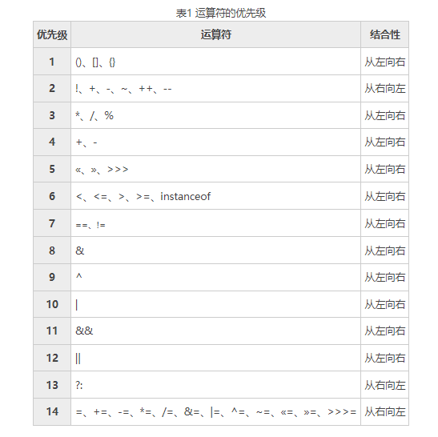

# 编程思想第三章

## 优先级




## 使用java操作符

* 有些操作符可能会改变操作数自身的值，这些操作符被称为”副作用“操作符
* 几乎所有的操作符都只能操作基本类型，例外的操作符是 =，==, !=, **这些操作符能操作所有对象**
* 此外String类支持 + 和 +=，表示对应的字符串拼接


## 赋值

* = 即赋值运算符，取右边的值，把它复制给左边，有值可以是任何常数、变量或表达式（只要能生成一个值就行），左值必须是一个明确的、已命名的变量。也就是必须**有一个物理空间可以存储等号右边的值。**
* 不能把任何东西赋给一个常数，常数不能作为左值
* 基本类型的赋值是直接将一个地方的内容复制到了另一个地方
* 对象的赋值是赋值对象的引用


## 算术操作符

* 算术操作符也称为运算符，对于包装器类型遇到运算符会自动拆箱

* 整数除法会**直接去掉结果的小数位**，而不是四舍五入地圆整结果

* 一元减号用于转变数据的符号，而**一元加号**只是为了与一元减号相对应，但是它**唯一的作用仅仅是将较小类型的操作数提升为int。**


## 关系操作符

* 关系操作符生成的是一个boolean值，计算的是操作数的值之间的关系

* **== 和 != 适用于所有的基本数据类型【比较的是值，对于Integer等包装类型只有遇到运算符才会自动拆箱所以比较的是引用】**，而其他比较符不适用于boolean类型，即不存在类似：
  true >= false
* == 和 != 操作对象时比较的是对象的引用（地址），要**比较两个对象的实际内容，一般用equals()方法，其默认行为是比较引用**，新建类时需要重写方法。还好大多数java类库都实现了equals()方法，以便用来比较对象的内容。
* **基本数据类型比较直接用== 和 != 即可**
* 对浮点数的比较是非常严格的，小数部分存在极微小的差异都会导致不同的结果


## 逻辑操作符

* 逻辑操作符与或非（&&、||、！)能根据参数【**只可用于布尔值**】的逻辑关系，生成一个布尔值

* 如果在应该适用String值的地方使用了布尔值，布尔值会自动转换成适当的文本形式

  ```java
  System.out.println("x>1&&y>1 : "+(x>1&&y>1));//打印 x&&y : true
  ```

* **短路现象**

  * 一旦能够明确无误地确定整个表达式的值，就**不再计算表达式余下部分了。【即使这部分有错误】**
  * 在使用逻辑操作符时，一定要记得，把优先级高的、更顶层的关系表达式放在前面，这样能够**避免不必要的运算，从而一定程度上提高程序性能。**


## 直接常量

* 直接常量相关的某些字符来额外给予编译器一些信息。

* **如果将一个变量初始化成超出自身表示范围的值，编译器会报告错误信息，并将值自动转换为int型。**

* 十六进制`0x/0X`前缀+`0-9`和`a-f`

* 八进制`0`前缀+`0-8`

* 后缀`l/L`表示`long`类型

* 后缀`f/F`表示`float`类型

* 后缀`d/D`表示`double`类型

* 指数记数法：`1.39E-43`表示$1.39*10^(-43)

  * **指数常作为双精度数处理**（double），需要作为单精度处理时需加后缀f/F

    ```java
    float f4 = 1e-43f;
    ```

* 通过使用Integer和Long类的静态方法toBinaryString()可以很容易以二进制形式显示结果。（如果将比较小的类型传递给Integer.toBinaryString()方法，则该类型会自动被转换为int


## 按位操作符

* **按位操作符用来操作基本数据类型中的单个二进制位，会对两个参数中对应的位执行布尔代数运算，并最终生成一个结果**
* 二元按位操作符: &与、|或、^异或，一元: ~取反
* 二元按位操作符可与等号 （=）联合使用，以便合并运算和赋值
* 对于**布尔值**，**按位操作符具有与逻辑操作符相同的效果**，**只是不会中途短路**，此外新增了一个异或运算


## 移位操作符

* 移位操作符的运算对象也是二进制中的位，**移位操作符只可用来处理整型数据**。
* 左移位操作符(<<)低位补0
* 有符号右移位操作符（>>）高位补符号 正1 负0 /
* 无符号右移位操作符（>>>）高位补0 /


### 对于【取待移动位数（二进制形式）右端的低5位作为实际移动位数】的理解

如果对char、byte或者short类型的数值进行移位处理，那么在**移位进行之前，它们会被转换成int类型**，并且得到的结果也是一个int类型的值，**只有移位数值右端的低5位才有用**，这样可防止我们移位超过int型值所具有的位数，2^5=32，long同理是6位。

x<<35 35值只会取低五位  因为移动到32位超出了int的表示范围，低5位的值一定小于32

**总结：设被移位的int型数值为x，要移动的位数为n，则x实际移动的位数为：n % 32**


### “无符号”右移位操作符结合赋值操作对byte、short类型数值的处理

在进行“无符号”右移位结合赋值操作时，可能会遇到一个问题：
如果对byte或short值进行这样的移位运算，得到的可能不是正确的结果。**它们会被先转换成int类型，**
**再进行右移操作，然后被截断，赋值给原来的类型**，在这种情况下可能得到-1的结果。

short a = (short) a>>>2; 这种特殊的现象为**强制类型转换时的精度缺失**。对于byte类型的也是如此。

https://blog.csdn.net/Pioneer_Java/article/details/78742267


## 字符串操作符 `+` 和`+=`

- 字符串中操作符 `+` 和`+=`表示“拼接”操作

- **如果一个表达式以字符串开头，那么其后续操作数都必须是字符串类型（不是则进行强制转换）**

- 有时会看到一个空的String后面跟随+和一个基本类型变量，以此作为不调用更加麻烦的显示方法

  ```java
  System.out.println(""+x);//Integer.toString();
  ```

- 在java中，“+” 和 “+=” 是经过重载的运算符，而java不允许程序员进行运算符的重载。如果 “+” 之前是String，那么此时，“+” 的作用就是连接两个字符串；若此时 “+” 后面是基本数据类型的话，可以直接进行连接，若是引用数据类型的话，则会调用该对象的toString()方法。【先出现字符串，后面的内容自动强制转换为string进行拼接 先出现数字，则进行加减运算 先算括号里面，数字】

### 例题：

1.定义：String s1 = “uml”; String s2 = “uml”; String s3= new String(“uml”); String s4= new String(“uml”);那么，s1==s2；s3 == s4；s1.equals(s3); 判断正确与否

该题考察的是**String类创建的对象在JVM中的内存分配**和"equals”与“==”的区别。

- “==”比较的是**地址和值**。
- “equals”比较的是**值**。
- 
- s1==s2，比较的是比较的是地址和值，由上图得知两个引用指向的是同一个地址，**所以返回true.**
- s3 == s4，比较的是两个new出来开辟的空间对象地址，所以值相同，但地址不同，**返回false.**
- s1.equals(s3)，比较的是内容,**返回true**。


## 类型转换：

* 可对数值进行类型转换，亦可对变量进行类型转换。

- 窄式转换，需要显式指定（如 long 转 int），能容纳更多信息的数据类型转换成无法容纳那么多信息的类型，可能面临丢失信息的危险【大类型转为小类型】
- 扩展转换，无需显式指定（如 int 转 long），新类型肯定能够容纳原来类型的信息，不会造成任何信息的丢失
- **Java允许任何基本类型之间的类型转换，除了布尔类型。**
- “类”数据类型不允许类型转换


### 截尾和舍入

- 当 float 或 double 转向整型时，总是对数字进行截尾（将小数部分去除）。
- 如果需要通过四舍五入得到整型数值，可以调用`java.lang.Math.round()`


### 提升

* **一个表达式中出现的最大的数据类型决定了该表达式最终结果的数据类型**，如 int 类型与 long 类型相加，得到一个 long 类型。
* 如果对基本数据类型执行算术运算或按位运算，只要类型比int小（即char、byte、short），那么在运算前，这些值都会自动转换成int，这样一来，最终生成的结果就是int类型。


## Java 没有 sizeof

由于Java中所有基本数据类型在所有机器中的大小是相同的，所以不需要sizeof。BTW，boolean 不是没有明确嘛。


## 面试相关

### 数据类型自动提升【二元操作符】

* 如果两个操作数其中有一个是double类型，另一个操作就会转换为double类型。

* 否则，如果其中一个操作数是float类型，另一个将会转换为float类型。

* 否则，如果其中一个操作数是long类型，另一个会转换为long类型。

* 否则，两个操作数都转换为int类型。

  ```java
  byte a = 127;
  byte b = 127;
  b = a + b; // error : cannot convert from int to byte
  b += a; // ok 隐式转换
  ```

  
