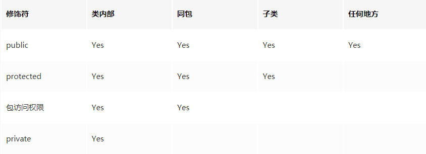

# 编程思想第六章


## Java 访问权限修饰词

* **每个访问权限修饰词(public、protected、private)仅控制它所修饰的特定定义的访问权**
* 如果不提供任何访问权限修饰词，则意味着它是"包访问权限"。


### 包访问权限

* 默认访问权限没有任何关键字，且意味着当前的包中的所有其他类对那个成员都有访问权限
* 包访问权限允许将包内所有相关的类组合在一起，以使得它们彼此之间可以相互访问作用。
* 如果没有给文件指定包，Java 将这些文件视为该目录的默认包中，于是给该目录中所有其他的文件提供包访问权限。


### public：接口访问权限

* public之后紧跟着的成员声明自己对每个人是可用的。


### private：你无法访问

* 关键字private的意思是，除了包含该成员的类之外，其他任何类都无法访问这个成员。
* 对于OOP而言，提供访问器和变异器（getter/setter），以读取或改变数值是最优雅的方法，而是 JavaBean 的基本原理。
* 不能因为在类中某个对象的引用是 private，就认为其他对象就不能拥有该对象。
* private 可以用来实现单例子模式：

```java
class Soup {
    private Soup() {}
    private static Soup soup = new Soup();
    public static Soup access() {
        return soup;
    }
}
```


### protecd：继承访问权限

* protected修饰的成员，会把它的访问权限赋予派生类而不是所有类，同时也提供包访问权限
* 继承而来的类可以访问`public`和`protected`，只有当两个类在同一个包中时才能访问包访问权限的成员。


### 总结




## 接口和实现

访问权限的控制常被称为具体实现的隐藏。把数据和方法包装进类中，以及具体的实现的隐藏，常共同被称为**封装**。其结果是一个同时带有特征和行为的数据类型。

访问权限控制将权限的边界划在数据类型的内部的原因：

- 不用担心客户端程序员偶然地将内部机制当作他们可以使用的接口的一部分。
- 接口【public相对高权限】和具体实现【private相对低权限】的分离


## 类的访问权限

为了控制类的访问权限，修饰词必须出现在关键词 class 之前，如`public class ClassName`。同时有一些额外的限制：

- 每个编译单元（文件）都只能有一个 public 类。每个编译单元都有单一的公共接口，同 public 类实现

- public 类的名称必须与文件名相同，包括大小写。

- 编译单元（文件）中可以完全不带 public 类，此时可以随意对文件命名。

  

**类的访问权限只有 public 和包访问权限**。如果希望其他任何人对该类有访问权限，可以将所有的构造器都指定为 private，但是该类中 static 成员仍然可以创建和访问。


## 面试题

* 如果子类的方法重写了父类的方法，那么子类中该方法的访问级别不允许低于父类的访问级别。这是为了**确保可以使用父类实例的地方都可以使用子类实例，也就是确保满足里氏替换原则。**

