# 数据结构

* 研究**数据的存储方式**。只有一个目的，即为了方便后期对数据的再利用。
* 选择一种好的方式来存储数据，而这也是数据结构的核心内容。
* 存储结构可以体现出数据之间的关系。

## 基本的数据结构

* 数组
* 链表
* 其他数据结构都是**在数组和链表的基础上封装提出的。**

## 数据结构的分类

* 数据存储空间的**物理地址是否相邻分类**：
  * 数组
  * 链表
  
* 结构层面分类：

  * 线性表：具有“一对一”关系的数据。

    * 顺序表【数组】、链表、栈和队列。
    
  * 树结构：具有“一对多”关系的数据。
	
	  * 二叉树
	    
      * 完全二叉树：一棵深度为k的有n个结点的[二叉树](https://baike.baidu.com/item/二叉树/1602879?fromModule=lemma_inlink)，对树中的结点按从上至下、从左到右的顺序进行编号，如果编号为i（1≤i≤n）的结点与[满二叉树](https://baike.baidu.com/item/满二叉树/7773283?fromModule=lemma_inlink)中编号为i的结点在二叉树中的位置相同，则这棵二叉树称为完全二叉树。
      
      * 二叉查找树【左子小、右子大】。
      
        其查询、新增、删除等动作的所花的时间与树的高度成比例。二叉查找树的中序遍历为升序。
      
        特殊情况下，二叉查找树会退化成单链表，查找性能过低，故为了**维持查找树的平衡【让树高维持在lgN左右】**，而设计出了平衡二叉查找树。
      
      * 自平衡二叉查找树
      
        * 几乎所有平衡树都是通过**旋转**操作维持树的平衡。
      
        * AVL树【**高度平衡树**】：
      
          * 在AVL树中，**任一节点对应的两棵子树的最大高度差为1**，因此它也被称为**高度平衡树**
      
          * 节点的**平衡因子**是它的**左子树的高度减去它的右子树的高度**（有时相反）。**带有平衡因子1、0或 -1的节点被认为是平衡的**。
      
          * 保证树的平衡**需要复杂的树的旋转操作**。
      
          *  维持平衡：https://blog.csdn.net/saasanken/article/details/80796178【通过检查某个节点的平衡因子判断其是否失衡】
      
            https://blog.csdn.net/xiaoming1999/article/details/120352125
      
            https://blog.csdn.net/zfliu96/article/details/88538645
      
            ```c
            //左旋
            //RR插入(左单旋) 
            AVLTree Right_Right_rotation(AVLTree root)
            {
            	AVLTree Right_Chlid;
            	
            	Right_Chlid=root->Rightchild;//先取出“发现者”的右孩 
            	root->Rightchild=Right_Chlid->Leftchild;//再让“发现者”的右儿子指向其原本右孩的左儿子 
            	Right_Chlid->Leftchild=root;//让其成为原本右孩的左儿子 
            	
            	root->Height=MaxHeight(GetHeight(root->Leftchild),GetHeight(root->Rightchild))+1;//更新原“发现者”的高度 
            	Right_Chlid->Height=MaxHeight(GetHeight(Right_Chlid->Leftchild),GetHeight(Right_Chlid->Rightchild))+1;//更新原“发现者”右孩的高度 
            	
            	return Right_Chlid;//返回右孩，使其代替原本发现者的位置 
            }
            
            // 右旋
            //LL插入（右单旋） 
            AVLTree Left_Left_rotation(AVLTree root)
            {
            	AVLTree Left_Chlid;
            	Left_Chlid=root->Leftchild;//先取出“发现者”的左孩
            	root->Leftchild=Left_Chlid->Rightchild;//再让“发现者”的左儿子指向其原本左孩的右儿子 
            	Left_Chlid->Rightchild=root;//让其成为原本左孩的右儿子 
            	
            	root->Height=MaxHeight(GetHeight(root->Leftchild),GetHeight(root->Rightchild))+1;//更新原“发现者”的高度 
            	Left_Chlid->Height=MaxHeight(GetHeight(Left_Chlid->Leftchild),GetHeight(Left_Chlid->Rightchild))+1;//更新原“发现者”左孩的高度 
            	
            	return Left_Chlid;//返回左孩，使其代替原本发现者的位置 
            }
            
            /*RL插入(右左双旋)*/ 
            AVLTree Right_Left_rotation(AVLTree root)
            {
            	root->Rightchild=Left_Left_rotation(root->Rightchild);//先对其右孩进行右单旋 
            	
            	return Right_Right_rotation(root);//再对发现者进行左单旋 
            }
            
            /*LR插入（左右双旋）*/ 
            AVLTree Left_Right_rotation(AVLTree root)
            {
            	root->Leftchild=Right_Right_rotation(root->Leftchild);//先对左儿子进行左单旋 
            	
            	return Left_Left_rotation(root);//在对发现者进行右单旋 
            }
            
            ```
      
            
      
            * LR：左子树的右子树新增节点，导致根节点对应的树不平衡
      
              LL：左子树的左子树新增节点。
      
              LR->LL->平衡
      
              先左旋再右旋 对**失衡根节点的左孩子**左旋，再对**失衡根节点**右旋
      
              
      
            * RL：右子树的左子树新增节点，导致根节点对应的树不平衡
      
              RR：右子树的右子树新增节点。
      
              RL->RR->平衡
      
              先右旋再左旋 对**失衡根节点的右孩子**右旋，再对**失衡根节点**左旋
      
              
      
            * 数据结构定义：
      
              ```c
              typedef struct AVLTREE
              {
              	int Data;//存放数据 
              	int Height;//高度 通过获取左右子树的高度差来获取平衡因子【左减右】
              	struct AVLTREE *Leftchild;//左子树 
              	struct AVLTREE *Rightchild;//右子树 
              }*AVLTree;
              ```
      
            * 插入节点操作：找到插入的位置进行插入，回溯过程中进行节点高度的更新并判断节点是否失衡，如果失衡则进行相应旋转操作。【旋转操作能够使子树的高度恢复到插入节点前的，故失衡节点的祖先节点的平衡因子也会恢复，即**局部的平衡能使得整棵树得到平衡**，失衡并不会传递。**插入结点需要 Ο(log n)时间，旋转需要 Ο(1)时间**】
      
              ```c
              /*插入数据*/
              AVLTree Insert(AVLTree root,int x)
              {
              	AVLTree Tree=root;//获取节点地址 
              	if(root==NULL) //当其传入的是零指针时说明找到了合适的位置 
              	{
              		Tree=(AVLTree)malloc(sizeof(struct AVLTREE));
              		Tree->Data=x;
              		Tree->Height=0;
              		Tree->Leftchild=Tree->Rightchild=NULL;
              	} 
              	else //还未找到合适的位置时 
              	{
              		if(x<Tree->Data)//当要插入的数据比当前节点的值要小，便将其插入到左子树 
              		{
              			Tree->Leftchild=Insert(Tree->Leftchild,x);//将其插入到左子树中 
              			if(GetHeight(Tree->Leftchild)-GetHeight(Tree->Rightchild)==2)//如果插入完成后此节点为“发现者”（左右子树相差刚好为2的节点） 
              			{
              				if(x<Tree->Leftchild->Data)//要插入的数据比其左儿子小的话说明“麻烦节点”（新插入的导致平衡被破坏的节点） 在其左儿子的左边 
              					Tree=Left_Left_rotation(Tree);//左左（LL）插入，对其进行右单旋 
              			    else
              			    	Tree=Left_Right_rotation(Tree);	//左右（LR）插入，对此节点进行左右双旋	
              			}	 	
              		}
              		else if(x==Tree->Data)//当要插入的数据和当前节点的值一样时 
              			printf("数值重复！！\n");
              		else if(x>Tree->Data)//当要插入的数据比当前节点的数据大时，将其插入到右子树中 
              		{
              			Tree->Rightchild=Insert(Tree->Rightchild,x);//将其插入到右子树中 
              			if(GetHeight(Tree->Rightchild)-GetHeight(Tree->Leftchild)==2)//若插入完成后该节点为“发现者” 
              			{
              				if(x>Tree->Rightchild->Data) //要插入数据比“发现者”右儿子大则“麻烦节点”在其右儿子右边 
              					Tree=Right_Right_rotation(Tree);//右右（RR）插入则对此节点进行左单旋 
              				else
              					Tree=Right_Left_rotation(Tree);//右左插入则进行左右双旋 
              			}
              		}	
              	}
              	Tree->Height=MaxHeight(GetHeight(Tree->Leftchild),GetHeight(Tree->Rightchild))+1;//插入完成或平衡完毕后更新途径节点们的高度 
              	    return Tree;
              }
              
              ```
      
            * 删除节点操作：
      
              * 先找到需要删除的节点
      
                分情况对目标节点进行操作【确保删除后顶替该位置的节点不会失衡】
      
                1. 被删除的点有两个孩子：为了避免删除前驱或者后继结点造成节点失衡，**谁高删谁** （即删除后不用在判断失衡问题）
                2. 被删除的点只有一个孩子：判断是左孩子还是右孩子，记录上它的孩子然后删除掉要删除的节点将记录的孩子返回
                3. 被删除的点没有孩子：直接返回空
      
              * 删除的节点的某个可能失衡，在回溯过程中可进行旋转调整。【可能发生失衡传播，即对局部的重新平衡而造成更上层祖先失衡，**删除结点需要 Ο(log n)时间，平衡调整也需要 Ο(log n)时间**】
      
                * 回溯过程中通过所在修改的子树和对应高度差判断是否失衡
      
              ```c
              /*删除数据*/
              AVLTree Remove(AVLTree Tree,int x)
              {
              	AVLTree Tree=root;//获取节点地址
              	if(Tree==NULL) //找不到带删除节点
              	{
              		return NULL;
              	} 
              	else //还未找到合适的位置时 
              	{
              		if(x<Tree->Data)// 待删除节点在左子树
              		{
              			Tree->Leftchild=Remove(Tree->Leftchild,x);//在左子树上删除节点
              			if(GetHeight(Tree->Rightchild)-GetHeight(Tree->Leftchild)==2)//如果删除完成后此节点为“发现者”（左右子树相差刚好为2的节点） 
              			{
              				if(GetHeight(Tree->Rightchild->Rightchild) > GetHeight(Tree->Rightchild->Leftchild)){
                                  //右孩子右子树太高 左旋
                                  Tree = Right_Right_rotation(Tree);
                              }else{
                                  //右孩子左子树太高
                                  Tree = Right_Left_rotation(Tree);
                              }
              			}	 	
              		}
              		else if(x>Tree->Data)//待删除节点在右子树
              		{
              			Tree->Rightchild=Remove(Tree->Rightchild,x);//在右子树上删除节点 
              			if(GetHeight(Tree->Leftchild)-GetHeight(Tree->Rightchild)==2)//如果删除完成后该节点为“发现者” 
              			{
              				if(GetHeight(Tree->Leftchild->Leftchild) > GetHeight(Tree->Leftchild->Rightchild)){
                                  //左孩子左子树太高 右旋
                                  Tree = Left_Left_rotation(Tree);
                              }else{
                                  //左孩子右子树太高
                                  Tree = Left_Right_rotation(Tree);
                              }
              			}
              		}else
                      {
                          //找到删除节点 先处理有两个孩子的删除情况
              			if (Tree->Leftchild != NULL && Tree->Rightchild != NULL)
              			{
              				//为了避免删除前驱或者后继结点造成节点失衡，谁高删谁 （即删除后不用在判断失衡问题）
              				if (GetHeight(Tree->Leftchild) > GetHeight(Tree->Rightchild))
              				{
              					//删前驱
              					AVLTree pre = Tree->Leftchild;
              					while (pre->Rightchild != NULL)
              					{
              						pre = pre->Rightchild;
              					}
              					Tree->Data = pre->Data;
              					Tree->Leftchild = Remove(Tree->Leftchild, pre->Data);//删前驱节点
              				}
              				else
              				{
              					//删后继
              					AVLTree post = Tree->Rightchild;
              					while (post->Leftchild != NULL)
              					{
              						post = post->Leftchild;
              					}
              					Tree->Data = post->Data;
              					Tree->Rightchild = remove(Tree->Rightchild, post->Data);//删后继节点
              				}
              			}
              			else //删除节点最多有一个孩子
              			{
              				if (Tree->Leftchild != NULL)
              				{
              					AVLTree left = Tree->Leftchild;
              					free(Tree);
              					return left;
              				}
              				else if (Tree->Rightchild != NULL)
              				{
              					AVLTree right = Tree->Rightchild;
              					free(Tree);
              					return right;
              				}
              				else
              				{   
                                  free(Tree);
              					return NULL;
              				}
              			}
                      }	
              	}
              	Tree->Height=MaxHeight(GetHeight(Tree->Leftchild),GetHeight(Tree->Rightchild))+1;//更新途径节点们的高度 
              	return Tree;
              }
              
              ```
      
        * 红黑树
      
          https://baike.baidu.com/item/%E7%BA%A2%E9%BB%91%E6%A0%91
      
          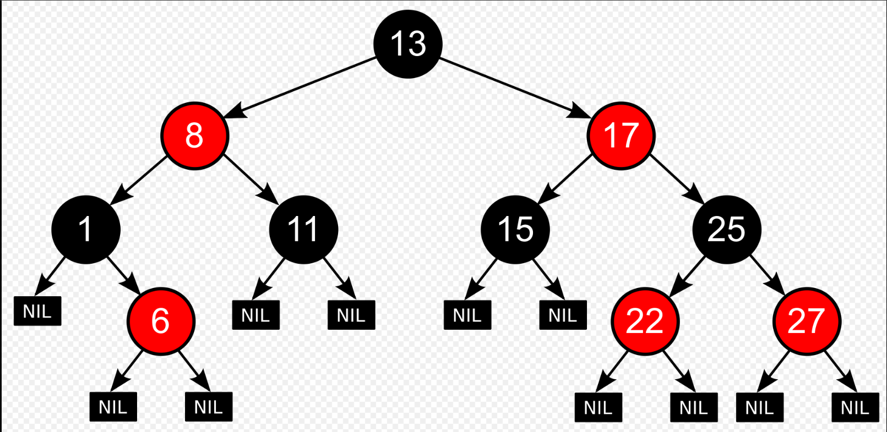
          
          * 二叉平衡树的一种，但不是严格的二叉平衡树，它的**左右子树高差有可能大于 1**，但对**其进行平衡的代价较低**， **其平均查找性能要强于 AVL** 。【红黑树**牺牲了部分平衡性**以**换取插入和删除操作时少量的旋转操作**，整体来说性能要优于AVL树。】
          * 性质：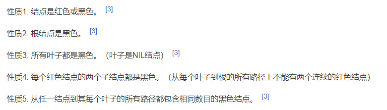
          * 为了保证算法不过于复杂使用nil叶子，其确保了非nil叶子节点均有两个子节点。
          * 这些约束强制了红黑树的关键性质: **从根到叶子的最长路径小于等于最短路径的两倍。**结果是这个树**大致上是平衡**的。这个性质保证了增删查操作时间复杂度与树的高度成比例，确保操作高效。【性质4、5保证，性质4保证了路径中不能有两个相连的红色节点，**从根到叶子的最短路径可能都是黑色节点，最长的可能有交替的红色和黑色节点**，根据性质5所有路径都有相同数目的黑色节点，这就表明了从根到叶子的最长路径小于等于最短路径的两倍。】
          * 对红黑树进行插入操作和删除操作时，可能破坏了约束，故修改时需要**一些复杂的操作如染色、旋转等来保持红黑树的约束**。**代价低但是操作复杂。**【少量颜色变更和不超过三次树旋转】
          * 插入：
          
            首先以**二叉查找树的方式增加节点**【此操作加入的节点的子都是nil叶子】，并标记为红色。【如果标为黑色，会导致多条路径上多一个黑色节点，调整较难，设为红色，则可能是两个连续红色节点的冲突，可通过颜色调换和树旋转来调整】
          
            下面分情况讨论后续操作
          
            1、新节点位于树根，无父节点，将其染为黑色即可满足性质2。
          
            2、新节点的父节点是黑色，性质4和性质5都不会失效，无需操作。
          
            3、父节点是红色，叔父节点是红色，此时祖父节点必为黑色，违反了性质4，我们可将父和叔父节点重绘为黑，祖父重绘为红，保证了性质5，但祖父节点为红后可能破坏性质2和4，我们可把祖父节点当作新加入的节点进行各种情形的检查。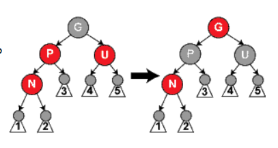
          
            4、父节点是红，叔父是黑色，且新节点是父节点的右子【左子】而父节点是祖父的左子【右子】，此种情况，对新节点进行左旋【右旋】调整新节点和父节点的角色，接着按情形5处理原来的父节点。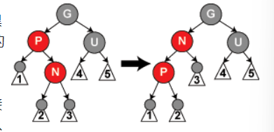
          
            5、父节点是红，叔父是黑，新节点是父节点的左子【右子】而父节点是祖父的左子【右子】，此种情况，对祖父节点进行右旋【左旋】，父节点染为黑，祖父节点染为红即可。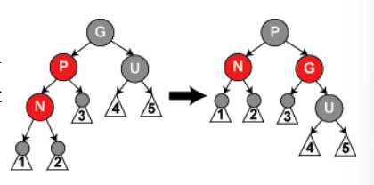
          * 红黑树也是非严格排序，且增删节点时需要调整堆结构，时间复杂度为对数级别。
          * 尽量不要使用红黑树排序，其排序结果不稳定，TreeSet
          * 用途：对于内存中少量数据的存储和查找十分有用。
      
      * 霍夫曼树
      
        * 定义：**WPL 最小的二叉树** 称为 **霍夫曼树（Huffman Tree）**。其中**只有度为0和度为2的结点**。
      
        * 用途：常用来构建**不等长编码**，**叶子节点存储编码字**。
        * 性质：n2+1=n0，n = n2+n0【n表示节点个数，n2表示出度为2的节点，2n2+n1+1=n2+n1+n0】
        * https://oi-wiki.org/ds/huffman-tree/
      
    * 多叉树
      * B树、B+树、2-3树、2-3-4树
    
        https://www.jianshu.com/p/ace3cd6526c4
    
      * 传统自平衡二叉查找树：AVL树、红黑树的缺陷：
    
        **数据过多时，主存放不下整个树，只有部分加载到内存中**，无法完成旋转操作维持平衡，其次平衡二叉树高度较高，需要多次磁盘I/O，且**逻辑上很近的节点实际可能非常远，无法很好的利用磁盘预读（局部性原理）**。
    
        为了**存储大量的数据而设计出的适合快速查找的数据结构**：B树。其让查找数据、**顺序访问**、插入数据及删除的动作，都在对数时间内完成。
    
      * B树：为**存取磁盘数据**而设计的**多路平衡搜索树**，类似于红黑树，但**降低磁盘I/O次数方面更好**，数据库一般使用B树或B树变种来存储数据。**树的高度也是对数级别**，**但底数更大，总体更矮。**
    
        结构：B树节点分为内部节点和叶子节点，每个节点内不仅存储关键字**还存储记录数据**，**内部节点还有指向子节点的指针**，且**节点内数据以关键字非降序的顺序存放**。
    
        B树的分支因子【指向子节点的指针最大个数】依赖于磁盘单元的特性，**磁盘的最小存取单位常为页**，故B树的节点大小**常为页的大小**，通常来说，页越大，分支因子越大，B树越矮，由于检查B树任意一个节点都需要一次磁盘访问，所以B树越矮，对应的磁盘访问次数越少。
    
        增删B树的节点时需要维护B树的结构，**维护的操作较复杂，其涉及回溯和分裂等操作。**
    
        具有以下性质：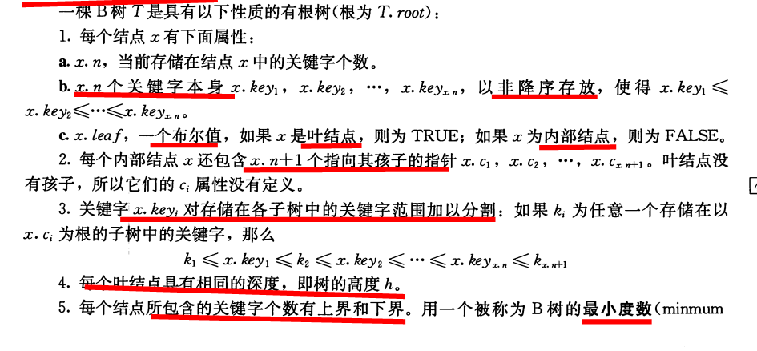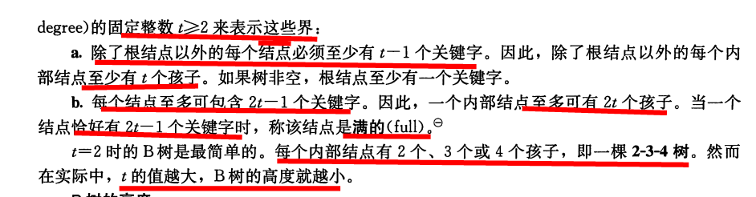
    
        B+树：B树的变种，相比于B树，其**内部节点不存储记录数据，只存储键值和孩子指针，记录数据在叶子节点存储，且叶子节点链接了起来。**
    
        B+树和B树的区别：
    
        1、B树**查询的时间复杂度不固定**，与键值在树中的位置有关，最好为O(1)，B+树内部接待不存储记录数据，所以时间复杂度固定为对数级别。
    
        2、B+树叶子节**点链接起来增加了区间访问性**，可使用在**范围查找**，而B树则不行。
    
        3、B+树内部节点无数据项，故相比B树，B+树内部节点能存储的**键值更多，即存储相同量数据，B+树更矮，相对来说，磁盘I/O次数更少**，更适合作为外部存储的数据结构。
    
    * 堆
      
      * 一种特殊的完全二叉树。
      * 大、小顶堆：非严格有序，即乱序时相等值在前的不一定能排序后不一定在前。。
      * PriorityQueue的缺陷，修改节点值时，不能动态调整堆结构，我们需要先取出原节点，然后再将修改值得节点插入。且增删节点时需要调整堆结构，时间复杂度为对数级别。
      
    
  * 图存储结构：具有“多对多”关系的数据。
    
    * 图模型：无向图、有向图、加权图和加权有向图。
    
    * 图的存储：
    
      * 邻接矩阵：**用矩阵表示某个点到某个点的直接距离**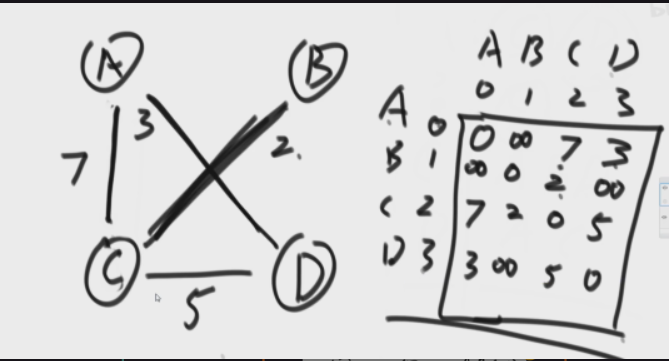
    
      * 邻接表：**表示某个点的直接邻居。【选择该方式，邻接矩阵占用空间过大】**
    
        ```java
        class Node {
            //节点值
            public int value;
            //节点 入度和出度个数
            public int in;
            public int out;
            public boolean isOdd;//是否奇数层
            //邻接节点【可达节点】
            public ArrayList<Node> nexts;
            //邻接边【以该节点为出度】
            public ArrayList<Edge> edges;
        
            public Node(int value) {
                this.value = value;
                in = 0;
                out = 0;
                nexts = new ArrayList<>();
                edges = new ArrayList<>();
            }
        }
        
        //有向边
        class Edge {
            //边权值
            public int weight;
            public Node from;
            public Node to;
        
            public Edge(int weight, Node from, Node to) {
                this.weight = weight;
                this.from = from;
                this.to = to;
            }
        }
        public class Graph {
            //图中节点 key为节点对应值
            public HashMap<Integer, Node> nodes;
            //图中的边
            public HashSet<Edge> edges;
        
            //初始化图
            public Graph() {
                nodes = new HashMap<>();
                edges = new HashSet<>();
            }
        }
        ```
    
        
    
    * 图的遍历方式：
    
      * 宽度优先：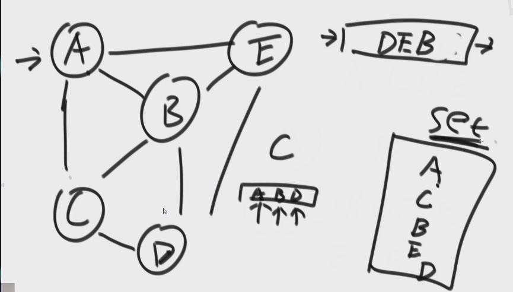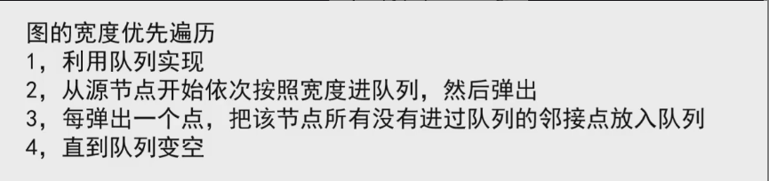
    
      * 深度优先：找到一条路未走过，对这条路往里走。
    
        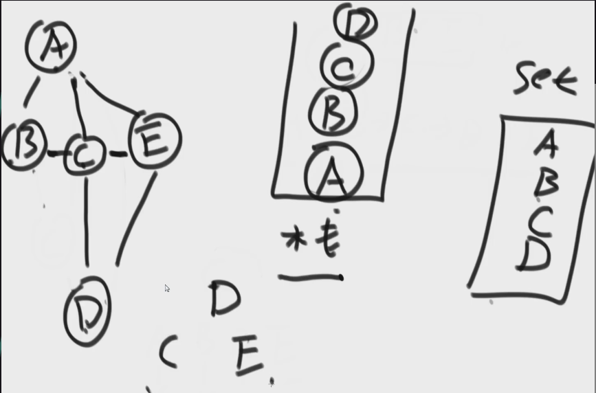
    
    * 图的常见问题：
    
      * 连通/可达问题：
    
        * 两个顶点是否连通？：可用DFS解决【dfs遍历某个顶点所能到达的所有顶点】，也可用union-find解决。
        * 图中有多少个连通子图？：DFS解决，**遍历树节点时一次完整的DFS为一个连通分量**，数组记录每个顶点所在的连通分量标识。【使用于图结构无需动态修改时，需动态修改时用union-find算法更好】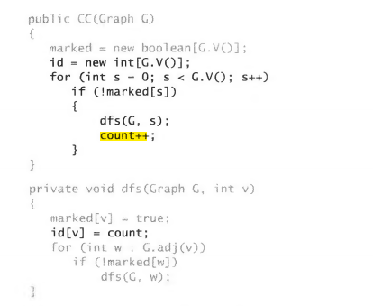
        * 某个点或某些点所能到达的节点集：DFS。
    
      * 路径问题：
    
        * 某个点到某个点的路径？：DFS+记录到该节点的最后一条边的数组，通过以栈的形式获取数组的值来获取完整路径。
    
          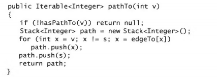
    
        * 某个点到某个点的**最短路径**【无权】？：BFS解决+记录到该节点的最后一条边的数组。
    
      * 优先级限制下的调度问题：
    
        * 此问题可用图的拓扑排序算法解决，
    
        * 拓扑排序：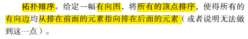
    
          如果此有向图有环则此问题无解。
    
          **先执行入度为0的点，然后再将该点擦掉，重复执行**。【代码看项目】
    
      * 图是否有环问题：
    
        * 判断是否有环：DFS过程中记录当前DFS的这条路径上节点【两个布尔数组，**一个记录当前栈路径，一个记录已经遍历过的节点**】，如果在后面发现该节点在栈路径出现过则表示该路径上存在环。
    
          有向图版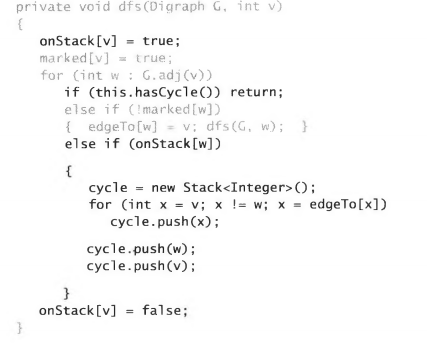
    
          无向图版dfs方法需加一个参数记录上一个节点，因为无向图中一条边的两个节点必定相连但不是环。
    
    * kruskal算法（针对无向图）
    
      * 找出**最小生成树**【保证连通（**从任一点出发能到达所有点），边的总权值最小**，树生成过程中**边不断增加**】
    
      *  **每次加最小权值边，判断图中是否有环，有就不加跳过该边直至所有的边都找完**【利用并查集也可完成】
    
        1、判断两个节点是否在同一集合中（用于判断是否将边加入是否构成环）【集合表示某个局部连通的图】
    
        2、将两个节点所在的集合合并（加入边）【将两个局部连通的图合并为一个图】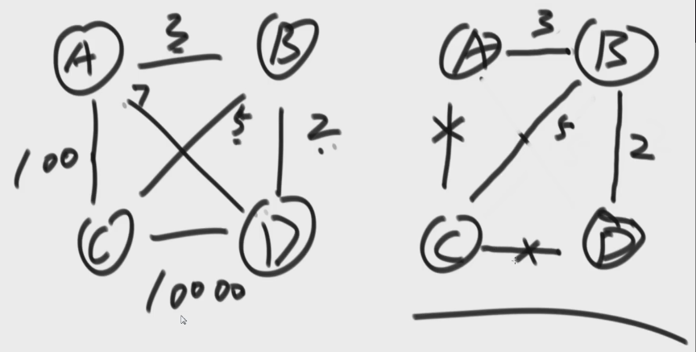
    
    * prim算法（要求无向图）
    
      * 同样是生成**最小生成树**，**从点的角度**，一个点一个点加进去只需要hashset即可。
    
        【树生成过程中节点个数不断增加，初始时边集为空且只有任选的一个节点。】
    
      * 每次**在所有直接边中选最小**且**不会构成环的**，直到**所有点都拽进来**。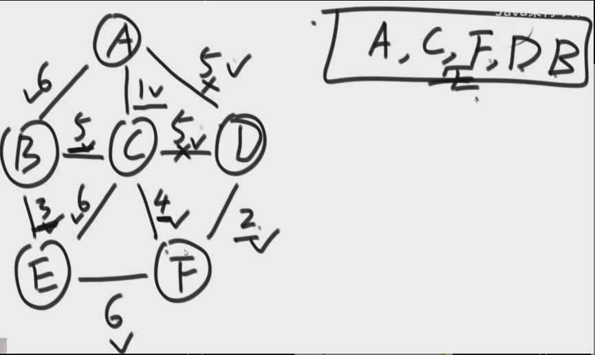
    
    * Dijkstra算法（常用于有权图）
    
      * 单元最短路径算法【**从一个点出发到所有能到达节点的最短路径**】，要求无累加和为负数的环。
      * 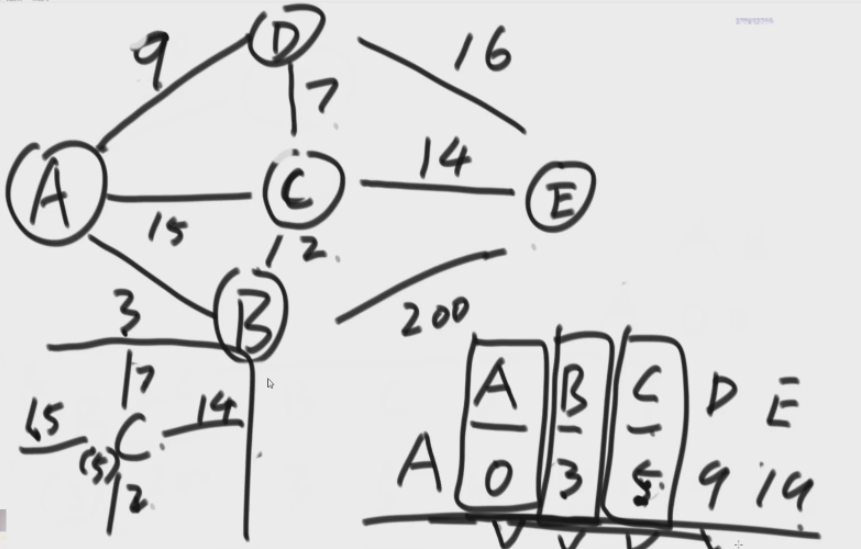**每一次在记录中选距离最短的点，依次看该点到其他点是否有更小的，有就更新。**
      * 需要记录head到其他节点的距离，初始时只有head到head的距离为0，然后加入head通过head所能到达的节点，如果map中没有或者距离更短则更新。

# 1.线性表

将具有“一对一”关系的数据“线性”地存储到物理空间中，这种存储结构就称为线性存储结构（简称线性表）。

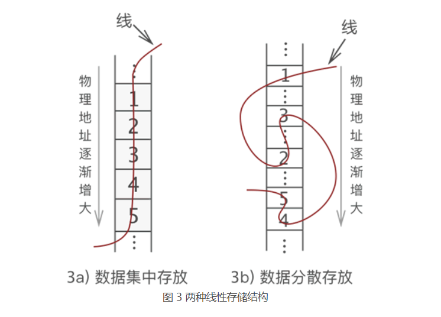

图 3 中我们可以看出，线性表存储数据可细分为以下 2 种：

1. 如图 3a) 所示，将**数据依次存储在连续的整块物理空间**中，这种存储结构称为**顺序存储结构**（简称[顺序表](http://c.biancheng.net/view/3334.html)）；
2. 如图 3b) 所示**，数据分散的存储在物理空间中，通过一根线保存着它们之间的逻辑关系**，这种存储结构称为**链式存储结构**（简称[链表](http://c.biancheng.net/view/3336.html)）；

# 2.栈

## 定义  

**栈是限制插入和删除只能在一个位置（表的末端即栈顶）上进行的表**

**栈也叫做后进先出表**


## 基本操作 

**push 入栈 pop 出栈   前者相当于插入 后者相当于删除最后插入的元素**

**top 输出栈顶元素**


## 栈的实现

**1.栈的链表实现**

使用单链表， 通过在表的顶端插入实现push， 通过删除表顶端元素实现pop

top操作只是考查表顶端元素并返回它的值。

**2.栈的数组实现**

此方法更加流行，利用theArray数组存储栈中元素，topOfStack指示 **栈顶元素位标** 空栈时其为-1

元素x入栈操作：先使topOfStack增1 然后置theArray[topOfStack]=x。

弹出栈元素：置返回值为theArray[topOfStack]然后使topOfStack减1。

## 应用

### 1.平衡括号

给定一个只包括 '('，')'，'{'，'}'，'['，']' 的字符串 s ，判断字符串是否有效。

有效字符串需满足：

左括号必须用相同类型的右括号闭合。
左括号必须以正确的顺序闭合。

利用栈后进先出的特点：从头开始将字符串先遇到的左括号先存入栈内，碰到右括号就去栈顶的左括号，若栈为空则返回false，若括号不匹配则返回false

若匹配则继续。直至读完这个字符串，此时还需判断栈内是否为空，为空则返回true 否则返回false

### 2.后缀表达式

#### 后缀表达式由来

**后缀表达式求值过程即为中缀表达式计算顺序描述过程**

如由中缀表达式 4 *2 + 4 + 5 *1

计算顺序可以是 将4和2相乘并存为A1，然后将4和A1相加，再将结果存入A1；再将5和1相乘并将结果存入A2，最后将A1和A2相加并将结果存入A1.

该操作顺序可书写为（即对应的后缀表达式为）：4 2 * 4 + 5 1 * +

#### 后缀表达式计算过程

当读到一个数时，将其推入栈中；在读到一个运算符时，该运算符就作用于从该栈弹出的两个数上，在将结果推入栈中。

不断重复上述过程直至读完后缀表达式。

### 3.中缀到后缀的转换

利用原理 优先级高的先运算，括号内的运算相比括号外的优先级更高，故遇到完整的括号时先将括号内的运算符输出完，括号内的运算也按照优先级输出

#### 中缀到后缀的转换规则：

1.中缀读到操作数直接输出

2.中缀读到开括号（即左括号）时，当作高优先级压入栈中，**而在栈内为低优先级**   （按运算的优先级）

3.中缀读到闭括号（即右括号）时，将直到开括号的栈内元素输出，**开括号弹出但不输出**

4.读到其他运算符时，**从栈中输出栈元素直到发现优先级更低的栈元素为止**，如栈中无优先级更低的元素则输出所有元素，输出工作完成后，再将当前运算符压入栈中

5.中缀表达式读完后，将栈中所有元素输出即可。

如 中缀表达式 : a + b * c + (d * e + f)*g

转换过程 1.输出数 a  

   2.将+号压入栈 

3. 输出 b  
4. 将*号压入栈，因栈内没优先级更低的元素故不输出 
5. 输出c 

   6.将栈内 * 、+ 输出，再将+压入栈（栈内的+ 与当前+同优先级也输出）

   7.读到（ 当成高优先级，压入栈中 

   8.输出d   

   9.将*压入栈

10. 输出e  

11. 将栈内 * 输出，再将 + 压入栈 

12. 输出f  

13. 读到 ），将栈内+输出 

14. 读到 * ，栈内只有 + 故将*压入栈 

15. 输出g 

16. 此时中缀表达式读完，将栈内元素*、+输出

    转化结果 a b c * + d e * f + g * +

### 4.方法调用

方法调用时，需要存储信息（寄存器的值和返回地址等），所存储的信息又称为**活动记录**，

活动记录存放在栈顶中，方法调用完要返回时，获取在栈顶的活动记录进行相关操作，返回到主调例程对应的位置。

# 3.并查集

## 概念：

* 主要用于**有向图**的构建，构建过程会根据节点的连接情况，划分连通分量。【算法4】
* 一般用于需要**某些性质具有传递性**的问题，同时判断某某间是否连通的问题。
* 一般有以下属性：
  * int[] parents：parents[i]表示i节点的父节点
  * int[] values：i节点指向的父节点的边的权值
* 一般有以下方法
  * int find(int x)：找到x节点的根节点，可通过迭代或递归实现，同时可以进行路径压缩，即向上查找根时将节点转为当前连通分量的根节点的叶子【带权时需考虑权值的转换】。
  * void union(int x, int y, int value)【value为权值】：合并x节点和y节点所在的连通分量，先找到两个节点的连通分量的根节点，如果根节点相同，表示两者在同一连通分量，否则不在，此时进行合并，
  * boolean isConntected(int x, int y)：判断两个节点是否在同一连通分量，通过find方法实现。 

并查集由一个整型数组pre[ ]和两个函数find( )、join( )构成
数组**pre[ ]记录了每个点的前导点是什么**，**函数find(x)用于查找，函数join(x,y)用于合并**

## 作用：

并查集的主要作用是求连通分支数（如果一个图中所有点都存在可达关系（直接或间接相连），则此图的连通分支数为1；如果此图有两大子图各自全部可达，则此图的连通分支数为2……）

问题引入
话说江湖上散落着各式各样的大侠，他们有的行侠仗义，有的打抱不平，有的为推翻当政者统治，有的则是为了做真实的自己。但是人与人之间，总有着不同的信仰和不同的目的，在碰到和自己不是一路人的，就免不了要打一架。但大侠们有一个优点就是讲义气，绝对不打自己的朋友。而且他们信奉“朋友的朋友就是我的朋友”，只要是能通过朋友关系串联起来的，不管拐了多少个弯，都认为是自己人。这样一来，江湖上就形成了一个个的门派，通过门派内两两之间的朋友关系也就串联起来。而不在同一个门派的人，无论如何都无法通过朋友关系连起来，于是就可以放心往死里打。于是乎，出现了“明教”、“峨嵋派”、“少林寺”、“华山派”、“全真教”……

但是两个原本互不相识的人，如何判断是否属于一个门派呢？我们可以在每个门派内推举出一个比较有名望的人作为该门派的代表人物，这样，每当两个人在狭路相逢准备恶斗时，就先报一下自己所在门派的教主（或者称之为掌门）的名字，如果相同则表示是一个门派的，那就不必自相残杀了。于是教主下令，重新编制。门派内所有人实行分等级制度，形成树状结构，教主就是根节点，下面分别是二级队员、三级队员。每个人只要记住自己的上级是谁就行了。遇到判断敌友的时候，只要一层层向上问，直到最高层，就可以在短时间内确定教主是谁了。由于我们关心的只是两个人之间是否连通，至于他们是如何连通的，以及每个圈子内部的结构是怎样的，甚至教主是谁，并不重要。所以我们可以放任教主随意编制，只要不搞错敌友关系就好了。


------


冷雨夜，胡青牛在骊山下快马加鞭送信，发现一头戴竹笠之人立于前方，正系拔剑之时，只听那厮大喝一声：“在下乃明教右使范遥，敢问阁下大名？”。胡青牛一听，抱拳回礼道：“在下胡青牛，乃杨左使近卫”。范遥反问道：“敢问兄台教主系谁，若非我们本教中人，在这明教之地肆意走动那可是死罪！”。青牛吓得赶紧打了个电话问他的上级杨左使：“杨左使，我们教主叫什么名字呀？”，杨逍回答道：“咋们教主是张无忌啊！”，青牛赶紧回答范遥道：“我的教主是张无忌！”。范遥听后，收下了已经蓄好了的内力，并抱拳放行

上面的情境中，胡青牛同志通过向上级查询得到了教主的名字，当然范遥也是
而在并查集中，用于查询各自的教主名字的函数就是我们的find函数

### 1. find函数的定义与实现（查找代表元）

find函数的作用是用于查找某个人所在门派的教主，换言之就是用于对某个给定的点x，返回其所属集合的代表。这需要我们首先定义一个数组：int pre[1000];
这个数组记录了每个大侠的上级是谁。大侠们从1或者0开始编号（依据题意而定），pre[15]=3就表示15号大侠的上级是3号大侠。如果一个人的上级就是他自己，那说明他就是教主了，查找到此为止。也有孤家寡人自成一派的，比如欧阳锋，那么他的上级就是他自己
每个人都只认自己的上级。比如胡青牛同学只知道自己的上级是杨左使。张无忌是谁？不认识！要想知道自己的教主是谁，只能一级级查上去。因此你可以视find这个函数就是找教主用的，意义再清楚不过了。下面给出这个函数的具体实现：

```cpp
int find(int x)					//查找x的教主
{
	while(pre[x] != x)			//如果x的上级不是x自己（也就是说找到的大侠不是教主）
		x = pre[x];				//x接着找他的上级，直到找到教主为止
	return x;					//教主驾到~~~
}
123456
```


现在有个新问题，怎么对给出的人员进行编制呢？答案是，通过join函数

### 2. join函数的定义与实现（将两个集合合并 且只有一个代表元）

我们知道，在两个点之间连一条线，原先它们所在的两个板块间的所有点就都可以互通了。这在图上很好办，画条线就行了，但在并查集里要怎么实现呢？还是举江湖的例子（如上图所示），虚竹小和尚与周芷若MM是我非常喜欢的两个人物，他们的终极boss分别是玄慈方丈和灭绝师太，那明显就是两个阵营了。我不希望他们互相打架，就对他俩说：“你们两位拉拉勾，做好朋友吧。”他们看在我的面子上，同意了。这一同意可非同小可，整个少林和峨眉派的人就不能打架了。这么重大的变化，可如何实现呀，要改动多少地方？其实非常简单，我对玄慈方丈说：“大师，麻烦你把你的上级改为灭绝师太吧。这样一来，两派原先的所有人员的终极boss都是师太，那还打个球啊！反正我们关心的只是连通性，门派内部的结构不要紧的。”玄慈一听肯定火大了：“我靠，凭什么是我变成她手下呀，怎么不反过来？我抗议！”抗议无效，上天安排的，最大。反正谁加入谁效果是一样的，我就随手指定了一个。这段函数的意思很明白了吧？
下面给出这个函数的实现：

```cpp
void join(int x,int y)                     //我想让虚竹和周芷若做朋友
{
    int fx=find(x), fy=find(y);            //虚竹的老大是玄慈，芷若MM的老大是灭绝
    if(fx != fy)                           //玄慈和灭绝显然不是同一个人
        pre[fx]=fy;                        //方丈只好委委屈屈地当了师太的手下啦
}
123456
```


### **3. 路径压缩算法的引入与实现**（查找代表员的过程将路径上的父节点的上级都置为根节点）

建立门派的过程是用join函数将两个人连接起来的，谁当谁的手下完全随机。最后的树状结构会变成什么样，我也完全无法预计，一字长蛇阵也有可能。这样查找的效率就会比较低下。最理想的情况就是所有人的直接上级都是掌门，一共就两级结构，只要找一次就找到掌门了。哪怕不能完全做到，也最好尽量接近。这样就产生了路径压缩算法。
设想这样一个场景：两个互不相识的大侠夏侯惇和许褚碰面了，想知道能不能揍。于是赶紧打电话问自己的上级：“你是不是掌门？” 上级说：“我不是呀，我的上级是谁谁谁，你问问他看看。” 两个人一路问下去，发现它们的最终boss都是曹操。具体结构如下：

“哎呀呀，原来是自己人，失礼失礼，在下军机处前将军夏侯惇!”
“幸会幸会，在下军卫队上将许褚！”
两人高高兴兴地手拉手喝酒去了
“等等等等，两位同学请留步，还有事情没完成呢！”我叫住他俩：“还要做路径压缩！”
两人醒悟，夏侯惇打电话给他的上级郭嘉：“军师啊，我查过了，我们的掌门都是曹丞相。不如我们直接拜在丞相手下吧，省得级别太低，以后查找掌门麻烦。”郭嘉答道：“嗯，有道理。”
许褚接着也打电话给刚才拜访过的典韦，做同样的事情。于是此时，整个曹操阵营的结构如下：

这样，在刚才查询过程中涉及到的人物都聚集在了曹操的直接领导下。由于每次查询都做了优化处理，所以整个门派树的层数都会维持在比较低的水平上。路径压缩算法所实现的功能就是这么个意思
下面给出具体的实现代码：

```cpp
int find_pre(int x)     				//查找结点x的根结点 
{
    if(pre[x] == x)         			//递归出口：x的上级为x本身，即x为根结点 
        return x;       
    return pre[x] = find_pre(pre[x]);  //此代码相当于先找到根结点rootx，然后pre[x]=rootx 
}
123456
```

该优化的主要思路是：将x到根节点路径上的所有点的pre（上级）都设为根节点
该算法的缺点是：只有在查找了上级的元素才能进行压缩，并且第一次执行时，是不能达到压缩效果的。只有在之后才能有效


其实掌握了1、2、3就能应对绝大多数的题，下面第4点供有兴趣的同学学习

### 4. 加权标记法的引入与实现（用rank数组记录每个结点所表示的数的深度，合并时将深度较低的树的根节点的上级置为深度较高的树的根节点）

除了路径压缩算法可以将并查集中的树状结构进行压缩外，还有一种方法——加权标记法
**主要思路：给每个结点加权以标记树的深度，使得在合并操作时能尽可能减小树的深度**
比如对于合并操作，假设需要合并的两个集合的代表元分别为x和y（用集合中的某个元素来代表这个集合，该元素称为集合的代表元），则只需要令parent[x] = y或者parent[y] = x即可
我们为了使合并后的树不产生退化（即：使树中左右子树的深度差尽可能小），**那么对于每一个元素x，维护一个rank[x]数组，用以表达子树x的深度。合并时，如果rank[x] < rank[y]，则令parent[x] = y,否则令parent[y] = x**。举个例子，我们对以A，F为代表元的集合进行合并操作，具体情况如下：

由于rank(A) > rank(F) ,因此令parent[F]= A。合并后的图形如下图所示：

当然，由于给每个节点加权意味着需要额外的数据结构来存放权重信息，所以这将导致额外的空间开销


------


总结
①用集合中的某个元素来代表这个集合，该元素称为集合的代表元；
②一个集合内的所有元素组织成以代表元为根的树形结构；
③对于每一个元素 pre[x]指向x在树形结构上的父亲节点。如果x是根节点，则令pre[x] = x；
④对于查找操作，假设需要确定x所在的的集合，也就是确定集合的代表元。可以沿着pre[x]不断在树形结构中向上移动，直到到达根节点。

**因此：判断两个元素是否属于同一集合，只需要看他们的代表元是否相同即可。**
基于这样的特性，并查集由以下用途：
1、维护无向图的连通性。支持判断两个点是否在同一连通块内，和判断增加一条边是否会产生环。
2、用在求解最小生成树的Kruskal算法里。

一般来说，一个并查集对应三个操作：初始化+查找根结点函数+合并集合函数

1. 初始化

```cpp
void Make_pre(int i)
{
    pre[i]=i; 				//初始时，某个元素的“上级”就是它自己
}
```


2. 查找函数

```cpp
int Find_pre(int i)
{ 
   if(pre[i]==i) return pre[i];		//如果元素i的父节点是自己，说明自己就是源头
   return  Find_pre(pre[i]);    	//否则递归查找元素i的源头
}
```


3. 合并集合函数

```cpp
void join(int x,int y)                    //试图合并元素x和元素y
{
    int fx=find(x), fy=find(y); 		  //找到x和y的源头
    if(fx != fy) pre[fx]=fy;  			  //合并两个源头
}
```


4. 通过rank机制，优化3中的合并集合函数

```cpp
void Union(int i,int j)
{
    i=Find_pre(i);
    j=Find_pre(j);
    if(i==j) return ;
    if(rank[i]>rank[j]) pre[j]=i;
    else
    {
        if(rank[i]==rank[j]) rank[j]++;   
        pre[i]=j;
    }
}
```


------


下面给出上述所以内容的代码汇总：

```java
const int  N=105
int pre[N];     						//存储每个结点的前驱结点 
int rank[N];    						//树的高度 
void init(int n)     					//初始化函数，对录入的n个结点进行初始化 
{
    for(int i = 0; i < n; i++){
        pre[i] = i;     				//每个结点的上级都是自己 
        rank[i] = 1;    				//每个结点构成的树的高度为1 
    } 
}
int find_pre(int x)     	 		    //查找结点x的根结点 
{
    if(pre[x] == x) return x;  			//递归出口：x的上级为x本身，则x为根结点 
    return find_pre(pre[x]); 			//递归查找 
} 
 
//改进查找算法：完成路径压缩，将x的上级直接变为根结点，那么树的高度就会大大降低 
int find_pre(int x)     				//查找结点x的根结点 
{
    if(pre[x] == x) return x;			//递归出口：x的上级为x本身，即x为根结点 
    return pre[x] = find_pre(pre[x]);   //此代码相当于先找到根结点rootx，然后pre[x]=rootx 
} 

bool is_same(int x, int y)      		//判断两个结点是否连通 
{
    return find_pre(x) == find_pre(y);  //判断两个结点的根结点（亦称代表元）是否相同 
}

bool unite(int x,int y)
{
    x = find_pre(x);
    y = find_pre(y);
    if(x == y) return false;
    if(rank[x] > rank[y]) pre[y]=x;		//令y的根结点的上级为x
    else
    {
        if(rank[x] == rank[y])  rank[y]++;
        pre[x] = y;
	}
	return true;
}
```

# 4.队列

队列也是表，使用队列时插入在一端进行而删除在另一端进行

## 队列模型

队列基本操作是enqueue(入队)，它是在表的末端（队尾rear）插入一个元素

和dequeue（出队），它是删除（并返回）在表的开头（队头front）的元素。

## 队列的数组实现

对于队列数据结构，保留一个数组theArray以及位置front和rear，他们代表队列的两端。同时还要记录存在队列中的元素个数currentSize。

元素x入队操作：让currentSize和rear增1，然后置theArray[rear]=x。

出队操作：置放回值为theArray[front]且currentSize减1然后使front增1。

### 解决rear是数组的最后一个下标时队列为满的问题

用循环数组实现，**即如果front和rear增1导致超越了数组，那么其值就要重置到数组的第一个位置。**

# 5.快速排序


## 树

### 树转二叉树

* *1. 将 节点的孩子 放在左子树；*

  *2. 将 节点的兄弟 放在右子树。*


## 哈希表

https://www.cnblogs.com/gongcheng-/p/10894205.html

* 哈希表的特点：关键字在表中位置和它自身存在一种映射的关系。
* **hash**：翻译为”散列表“，就是把任意长度的输入，通过散列算法，变成固定长度输出，该输出结果是散列值。
* hash冲突：通过hash函数映射到的位置已经被占用了。

### 解决哈希函数处理冲突的方法

* 开放地址法：当关键字key的哈希地址p=H（key）出现冲突时，**以p为基础，产生另一个哈希地址p1**，如果p1仍然冲突，再以p为基础，产生另一个哈希地址p2，…，直到找出一个不冲突的哈希地址pi 

  Hi=（H（key）+di）% m i=1，2，…，n，m 为表长，di称为**增量序列**。增量序列的取值方式不同，相应的再散列方式也不同。主要有以下三种：

  * 线性探测再散列：冲突发生时，查看下一个单元
  * 二次探测再散列：冲突发生时，在表的左右进行跳跃式探测，比较灵活。
  * 伪随机探测再散列：增量序列为伪随机序列

* 再哈希法：同时**构造多个不同的哈希函数**，当一个hash函数冲突时，再用下一个，计算时间增加了。

* 链地址法：将多个冲突节点在同一位置构造成链表，适用于经常插入和删除的情况。

* 建立公共溢出区：将哈希表分为基本表和溢出表两部分，凡是和基本表发生冲突的元素，一律填入溢出表。