# C#基础

* Start函数：
  * 脚本绑定的对象进入场景时，该方法将会被调用。
  
* Debug.log打印日志

* 脚本中public访问修饰符修饰的类变量可被Inspector中的组件上显示和编辑，且脚本中初始化的值仍会被Inspector中的值覆盖，如果在Start函数中被赋值，该动作发生在Inspector设置变量值之后。未指定访问修饰符的变量默认为private修饰，最后将变量设为private，除非特殊需要才设为public。

* Awake和Start是加载脚本时自动调用的两个函数，先Awake，适用于在脚本与初始化之间设置任何引用。Start函数之后运行，且需要启用脚本组件而Awake不需要，可用于延迟初始化。两个函数都只会执行一次。

* Update函数每帧调用一次，适用于状态进行变化和调整，其不是固定间隔时间调用的，具体按照帧处理时间来定，FixedUpdate函数按固定时间间隔调用【默认0.02s】，调用FixedUpdate后，会立即进行任何必要的物理计算【位置等】，因此任何影响物理对象的函数都应使用FixedUpdate执行。

* Vectors【向量】

  * 表示相对于空间原点的位置

  * 二维和三维向量的原理相同，三维延伸出z轴，z轴代表深度。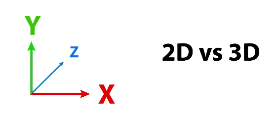

  * unity采用左手坐标系：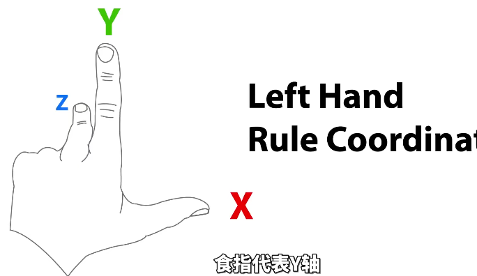

    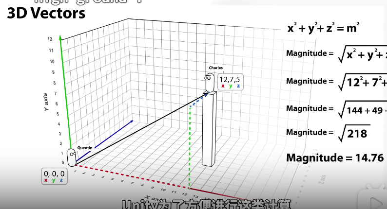

  * 为了简化三维向量的运算，引入了Vector3.magnitude，如获取两个向量的点积已判断是否垂直。Vector3.Dot(VectorA, VectorB)函数用于求点积。

    * 叉积：获取两个向量的叉积，叉积垂直于两个向量所在平面

    * 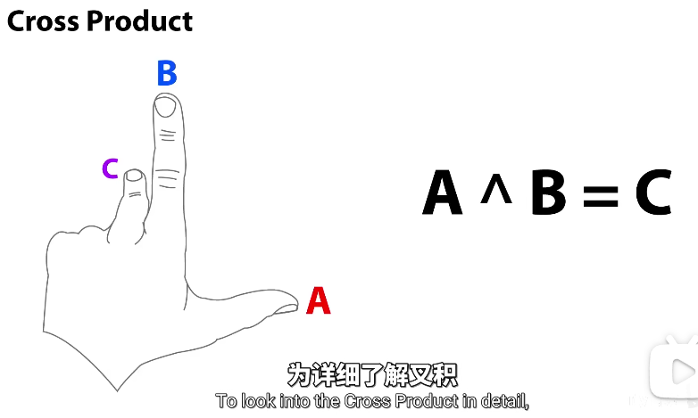

    * 具体运算过程：

      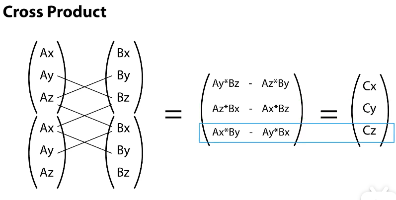

      对应函数：Vector3.Cross(Vector A, Vector B);

* 启用和禁用Unity中的组件：

  * component.enabled = true/false

* 通过脚本在场景中激活或停用对象

  * gameObject.setActive(true/false)，
  * 父对象停用对应子对象也会停用，但子对像在Inspector中保持着活跃状态。【要再次激活子对象，需先激活父对象】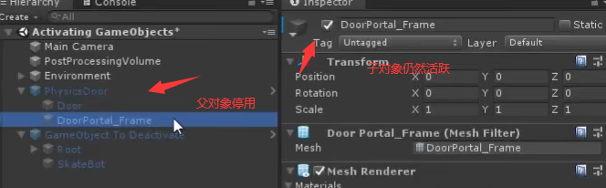
  * Inspector中对象的状态：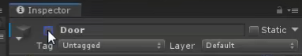
  * 要确认对象在场景和在Inspector中是否为活跃状态，可使用gameObject的activeSelf和activeInHierarchy属性查询

* Translate和Rotate

  * 两个用来更改游戏对象的位置和旋转的函数
  * Translate：
    * Translate函数接收一个Vector3类型的参数，表示
    * 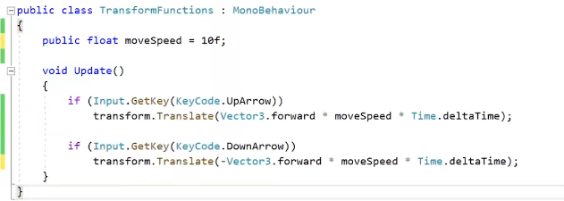
    * Vector3.forward即(0,0,1)，此处表示按每秒多少米移动。
  * Rotate：
    * 接收两个参数，一个表示围绕哪个轴旋转，另一个表示旋转量。
    * 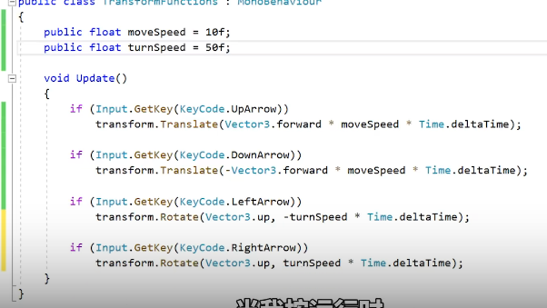
    * Vector3.up即(1,0,0)

  * 注意
    * 这些函数作用于局部轴即**相对游戏对象的轴**，而非世界轴。
    * 想用碰撞体移动对象，则不应使用Transate和Rotate函数，而是使用Physics函数

* LookAt

  * 该函数让游戏对象朝向另一个transform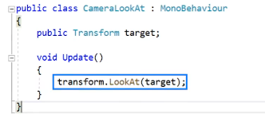
  * 在界面切换Global和Local，切换至Local可看到游戏对象的朝向位置【z轴正方向】。

* Destroy

  * 可用于在运行时移除游戏对象或从游戏对象移除组件，也可延时执行【只需提供第二个浮点类型的参数】
  * 

* GetButtion和GetKey

  * Input类中用于接收通过按键或操纵杆的输入

    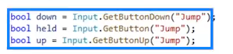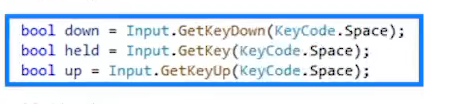

  * GetKey会使用KeyCode明确指定按键名称【KeyCode.Space等，Key至于特定键相关】，GetButton则需要指定所设定的输入名，Input management中即允许指定输入名称并指定按键或按钮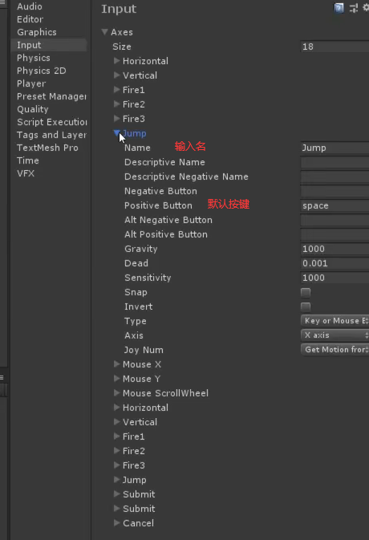

  * GetButton和GetKey都有三种状态函数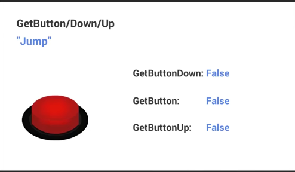

    getButtonDown：按下的那一帧返回true

    getButton：按住就返回true，松开就返回false

    getButtonUp：松开的那一阵返回true

* GetAxis

  * 类系GetButton和GetKey，但只返回-1到1之间的浮点值，设置Axis通用在Input管理器中设置
  * axis相当于一个方向上的滑尺，我们可让对象在这个方向上滑动
  * 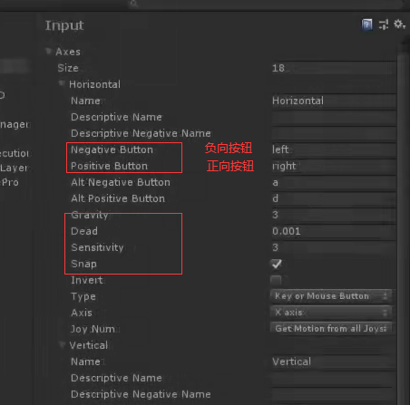
    * gravity：按钮松开后归零的速度，越高归零越快
    * sensivitity：与gravity相反，控制输入的返回值到达1或-1的速度有多块，越大越快，越小移动越流畅。
    * Dead：盲区，常用于避免收到摇杆轻微移动的作用。盲区越大，摇杆需要的摆动幅度越大，才能样GetAxis返回非0值
    * Snap：允许同时按下正负按钮时归零

  * 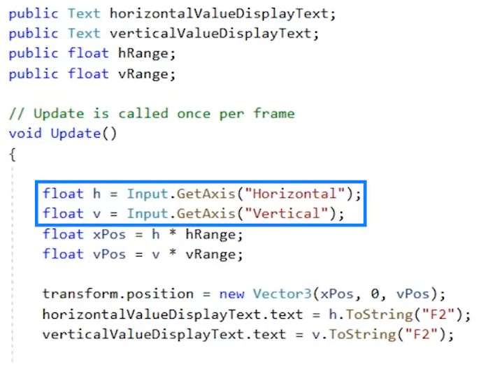
  * 也可使用Input.GetAxisRaw来获取1或-1;

* OnMouseDown：

  * 脚本绑定的对象被点击时，该函数将被回调。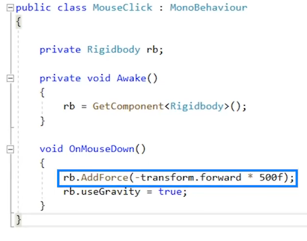

* GetComponent

  * 脚本中用于访问其他组件的函数，该函数会返回**对应游戏对象中指定类型组件的引用**。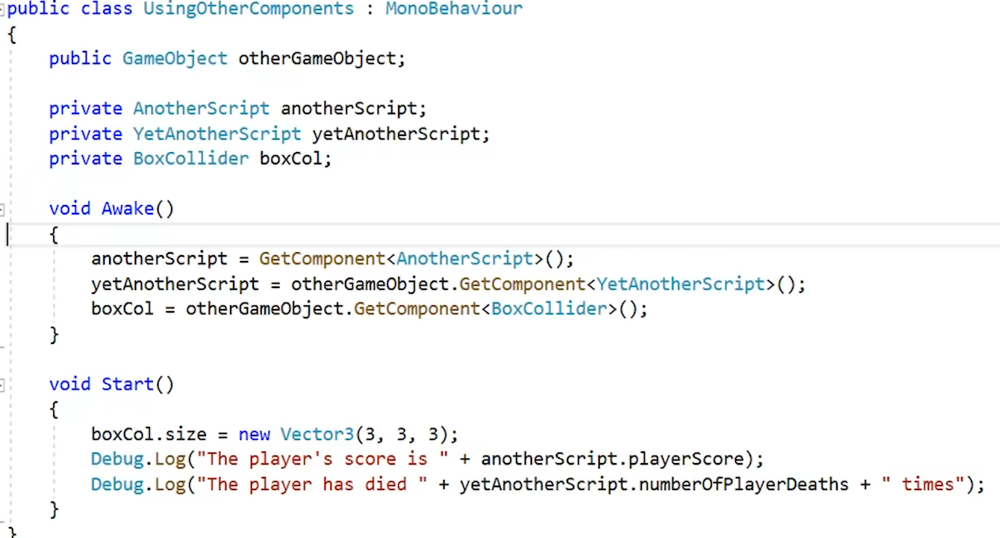
  * 可用于其他对象未公开的组件。
  * 该函数占用大量处理时间，应减少调用，一般在Awake和Start函数调用，或仅在首次需要时调用一次。
  
* Time.DeltaTime：

  * 增量时间（1帧所消耗的时间），60fps则Time.DeltaTime为1/60s。

  * **增量时间每一帧都在变动，与当前的fps有关**。

  * 因为不同fps情况下，每秒Update的执行次数不同，Update对变量的变化也会不同，故可与**Time.DeltaTime**配合，保持**1s间隔**的变化值一样，达到不同机器运行效果近似一样。【这1s内由于执行次数的不同，fps高的执行多，变量的变化更加紧**凑**，而fps低的变量变化较**分散**，但1s后两者的**最终值相同**】

    ```c++
    //【每帧执行】
    void Update() {    
         speed = speed * speedMul * Time.DeltaTime;     // 改变速度的值
    }
    ```

* 数据类型

  * 分为值类型和引用类型两大类

    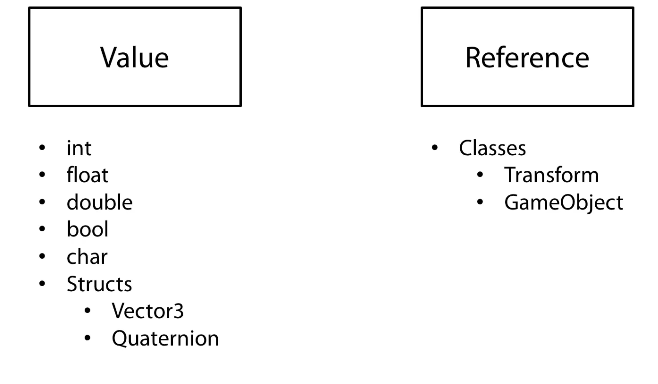


* 类：

  * 主要是面向对象编程，以及让某个类负责某个特定功能和构造函数相关知识。

* Instantiate：

  * 该函数用于克隆游戏对象，常用于克隆prefab【保存在项目素材中的预配置对象】
  * Instantiate(gameObject)：克隆游戏对象，初始位置为0，默认返回Object类型
  * Instantiate(gameObject, position, rotation)：指定初始位置和旋转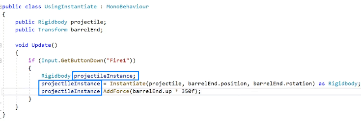

* 数组：

  * 脚本中公开的数组变量，可在Inspector中看到，并可为其分配值。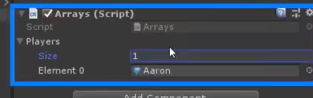

  * 

    FindGameObjectsWithTag(String tag)：返回相应标签的游戏对象数组。

* Invoke

  * 用于指定延时后进行函数调用。【只有不包含参数和返回类型为void的方法才能被调用】
  
  * Invoke(String methodName, int delay)：延时以秒为单位。
  
    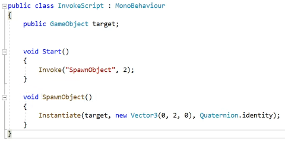
  
  * InvokeRepeating(String methodName, int delay, int schedule)：delay秒后执行方法，之后每隔schedule秒执行方法。
  
  * CancelInvoke("String methodName")：暂停对应方法重复执行。
  
  * 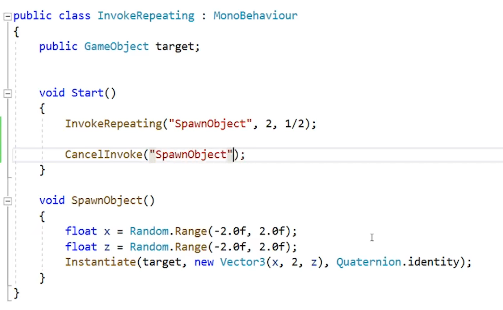
  
* 枚举：


  * 用于定义一组有特殊意义的常量，每个都有一个整数值，默认从0递增。

    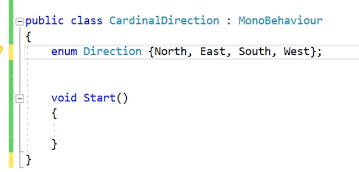

  * 常量可以更改为任意整数类型，如下，枚举类型为short，而非int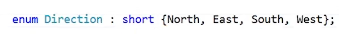

    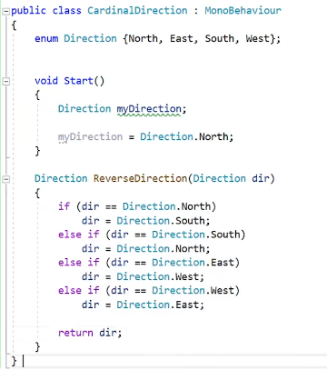


* 属性：

  * 类中成员变量包括字段和属性，属性就是封装了的字段。

  * ```c++
    public class Player{
        private int experience; // 字段
        public int Experience{ // 属性，最好取名为字段的名称且大写开头
            // 属性的访问器
            get{
                // some other code
                return experience;
            }
            
            set{
                experience = value;
            }
        }
    }
    ```

  * 后续可以通过访问属性代替字段的访问了：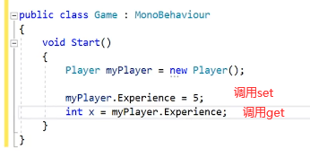

* 三元运算符

  * 使用的基本规则：代码需要简单的if-else结构且每种情况只需要一个短表达式。

* 静态【static】：

  * 静态变量
  * 静态方法
  * 静态变量、静态方法属于某个类，不属于实例，可通过类名直接调用。
  * 静态方法内不能使用非静态成员变量。
  * 静态类不能被创建实例，故静态类一般不含有非静态成员。

* 重载

  * 同一类下，方法名相同，方法签名不同【方法签名：方法名和参数列表组成】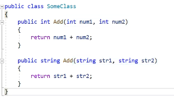
  * 系统尝试确定要运行的正确的重载方法时可能会出现三种情况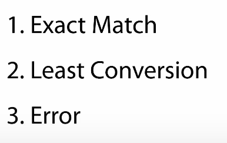
    * 传入参数完全匹配，直接调用
    * 非完全匹配，找出所有可能的匹配方法，选择一个需要最少转换量的方法
    * 没有匹配方法或多个方法的所需转换量相同，抛出错误。

* 泛型：把类型作为参数传递给类和方法等

  * 泛型方法

    * 例：

      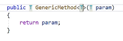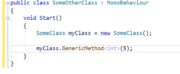

      通过对泛型参数施加限制来限制类型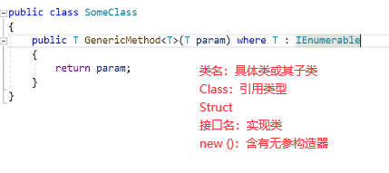

  * 泛型类：

    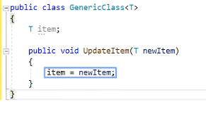

* 继承

  * 继承后，派生类获得基类的特征【成员变量、方法】。

  * 访问修饰符【public、protected、private】对继承的影响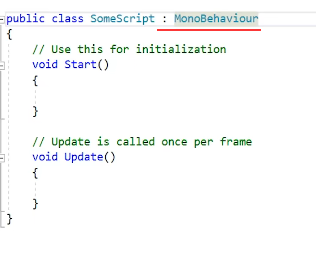

  * 子类构造函数显示调用父类构造函数

    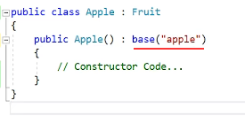

    base关键字也可用来访问父类成员

* 多态：

  * 父类引用指向子类对象【向上转型】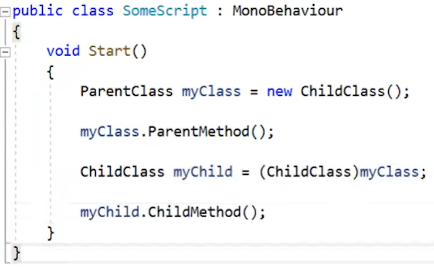

* 成员隐藏
  * **派生类从基类继承而来的成员在派生类中重新声明的过程**即成员隐藏。
  
  * 如下：
  
    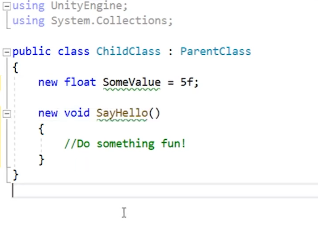
  
    **向上转型时**后续调用SomeValue和SayHello()将**调用的是父类的成员。**【作用与覆盖相反】
  
* 覆盖：


  * 子类覆盖了父类的方法，向上转型使用时将直接调用子类的方法。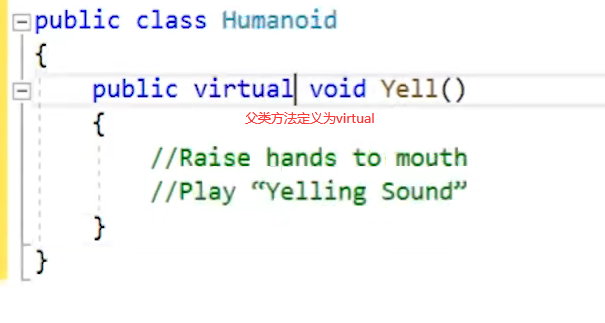

    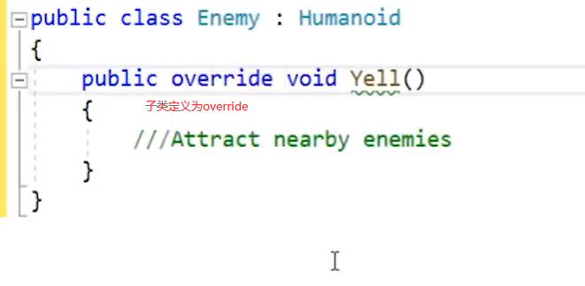

    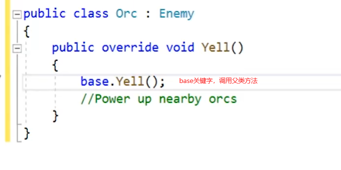

* 接口

  * 接口对外定义了一组功能，接口不能实例化 。

  * 接口声明：

  * 实现接口：

    

  * 既然有继承了，为啥需要接口

    * 可以实现多个接口，但不能继承多个类，因此接口能提供更广泛的功能。
    * 接口用于跨多个**互不相关的类**并定义**通用功能**。

* 扩展方法

  * 简单来说就是为一个修改不了的类添加更多自定义的方法

  * 扩展方法必须放在非泛型的静态类中，一般是创建一个静态类来包含多个扩展方法

  * 声明：this关键字后声明的参数即为对应调用对象

    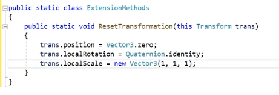

    使用：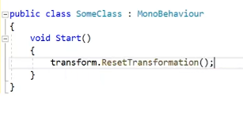

* 命名空间【Namespaces】

  * 像是类的容器，目的是帮助组织脚本，避免脚本之间发生冲突。

  * 使用命名空间：命名空间内的内容都可在当前脚本使用

    * using 命名空间名
    * 使用点运算符：命名空间名.Xxx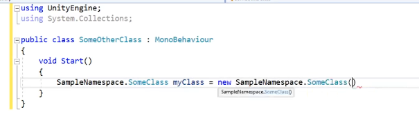
    * 将编写的类放入需要访问的命名空间中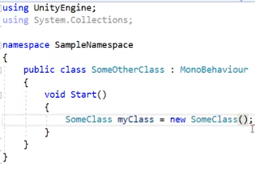

  * 声明命名空间【命名空间可嵌套】：

    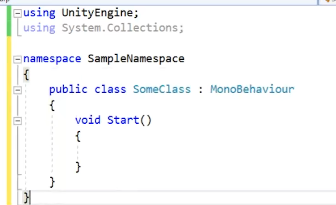

* 列表和字典

  * 两个泛型集合。

  * list：常用于替代需要更多灵活性或功能的数组。

    例：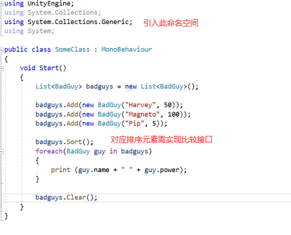

    

  * 字典：通过键访问值

    例：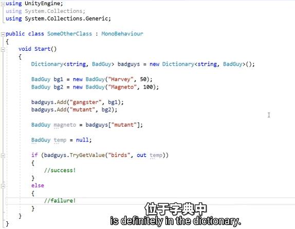

* 协程：

  * 即协同程序：按时间间隔执行的函数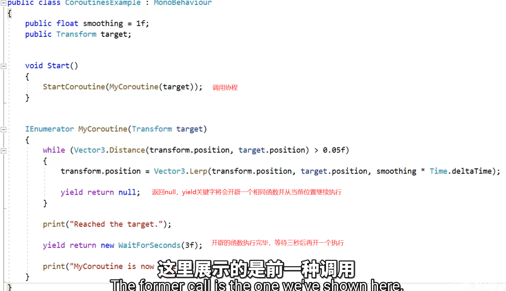

  * 优势：用来**与属性结合时**发挥作用

    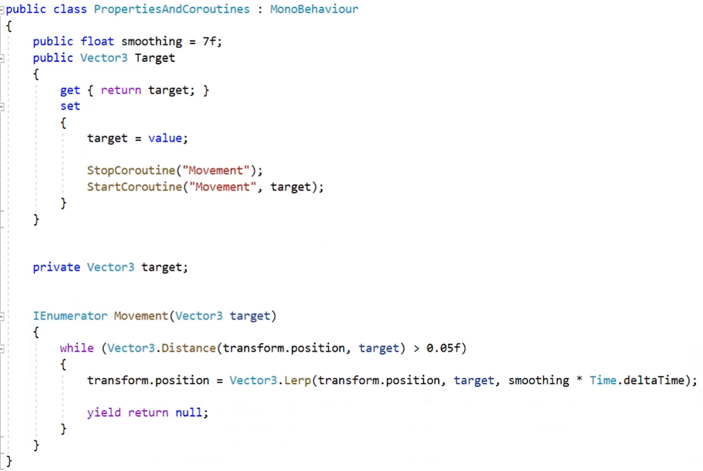

* Shader、屏幕后处理、SceneManager、Time.scaleTime

