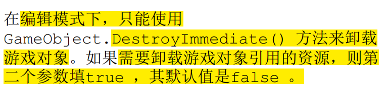
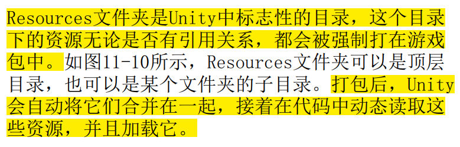

# Unity

* 脚本

  * fps【frame per second】：每秒执行的帧数。

  * Update()函数：**每一帧执行一次**。fps不同，1s内Update调用次数也不同。

  * Time.DeltaTime：

    * 增量时间（1帧所消耗的时间），60fps则Time.DeltaTime为1/60s。

    * **增量时间每一帧都在变动，与当前的fps有关**。

    * 因为不同fps情况下，每秒Update的执行次数不同，Update对变量的变化也会不同，故可与**Time.DeltaTime**配合，保持**1s间隔**的变化值一样，达到不同机器运行效果近似一样。【这1s内由于执行次数的不同，fps高的执行多，变量的变化更加紧**凑**，而fps低的变量变化较**分散**，但1s后两者的**最终值相同**】

      ```c#
      //【每帧执行】
      void Update() {    
           speed = speed * speedMul * Time.DeltaTime;     // 改变速度的值
      }
      ```

  * FixedUpdate()函数：**固定每0.02s执行一次**，**与fps无关**，所以不同机型运行起来没区别。

  * 生命周期：

    

  * 注意代码的编写逻辑，逻辑错误可能原本的动画替换掉

  * 协程：

* 面板

  * Inspector：显示当前选择的游戏对象、脚本或资产【图片和各种组件等】的属性。
    * 锁定Inspector
    * 图片Insepector

* 主相机

* 场景

* 贴图

* 组件
  * Collider 2D：碰撞体，为了**物理碰撞的目的**而出现。
    * Circle Collider 2D：圆形碰撞区
    * Box Collider 2D：正方形和矩形碰撞。
    * Polygon Collider 2D：自由形式的碰撞区。
    * Edge Collider 2D

* 音乐：

* 动画：
  * Animator：各Animation必须要能转换到其他状态，否则将一直维持同一状态，即使满足该状态的条件不再满足，因为其无法转到其他状态。
  * 可在每个动画后添加一个事件函数，该事件函数可用来进状态转换。

* 碰撞体 Collider
  * is Trigger：无需碰撞效果

* UI
  * dialog:
    * 内部加动画可有渐变效果
  * Slider:
    * 注意其他UI不要挡住进度条，否则无法拖动。

* 2D光效
  * Direnction Light：方向光
  * point Light：点光
    * Intensity：光强

  * 光效都是3d的，可调整光源位置


* 父子物体：
  * 子物体的位置随父物体的位置移动
  
* 移动端配置
  * 所有屏幕摇动杠都是UI
  
* 资源加载


  * 编辑模式

    * 资源
      * 引擎可识别的资源，如Prefab、声音、视频、动画和UI等。
      * 引擎不可识别的资源，需要将信息解析出来并组织成引擎内可识别资源。

    * 编辑模式下负责读取工程内资源的标志类：AssetsDatabase。【需要保证所有资源放在Assets目录下，否则无法读取。】

    * 卸载资源：

    * 游戏对象与资源的关系：

      游戏对象与资源是一种引用关系

  * 运行模式：

    * 引用资源：打包时只有被引用到的资源Unity才会打包，常见的是场景中的资源。

    * Resources：

      一般使用Resources.Load< T >来加载资源

      **`Resources`这种动态加载方式是只读的，在游戏打包后，就无法对文件夹的内容进行修改**

    * 删除对象
      * 运行时，需要使用GameObject.Destroy() 和GameObject.DestroyImmediate() 方法删除游戏对象。  
      * GameObject.Destroy() 会等一帧再彻底删除。因为有可能在这一帧的后面还有地方在操作这个对象，所以一般建议使用它来删除对象。GameObject.DestroyImmediate() 表示立即删除。  

    * 删除资源
      * **游戏对象删除了，它引用的资源其实并没有删除。**  
      * 使用Resources.UnloadAsset() 以及Resources.UnloadUnusedAssets() 方法强制
        卸载资源。由于**卸载资源是异步操作**，所以可以使用isDone 来判断是否完成。  

  * AssetBundle
  * Unity 如何识别和序列化数据
    * Asset 和 UnityEngine.Object 之间的区别


