# Unity

* 脚本

  * fps【frame per second】：每秒执行的帧数。

  * Update()函数：**每一帧执行一次**。fps不同，1s内Update调用次数也不同。

  * Time.DeltaTime：

    * 增量时间（1帧所消耗的时间），60fps则Time.DeltaTime为1/60s。

    * **增量时间每一帧都在变动，与当前的fps有关**。

    * 因为不同fps情况下，每秒Update的执行次数不同，Update对变量的变化也会不同，故可与**Time.DeltaTime**配合，保持**1s间隔**的变化值一样，达到不同机器运行效果近似一样。【这1s内由于执行次数的不同，fps高的执行多，变量的变化更加紧**凑**，而fps低的变量变化较**分散**，但1s后两者的**最终值相同**】

      ```c#
      //【每帧执行】
      void Update() {    
           speed = speed * speedMul * Time.DeltaTime;     // 改变速度的值
      }
      ```

  * FixedUpdate()函数：**固定每0.02s执行一次**，**与fps无关**，所以不同机型运行起来没区别。

  * 生命周期：

    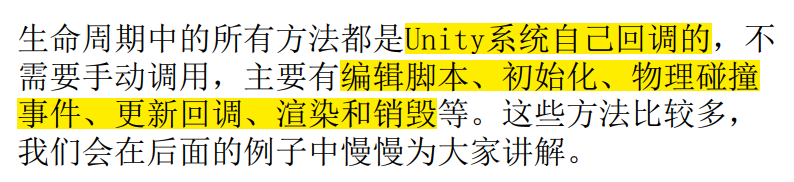

    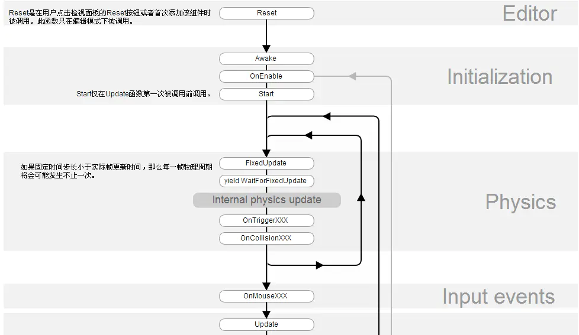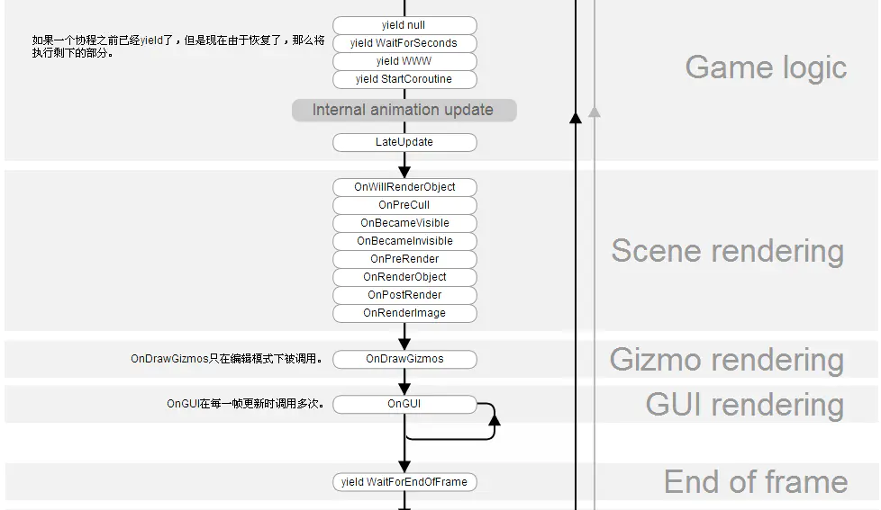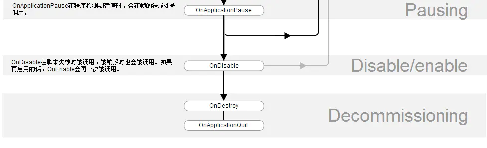

    Reset->Awake->OnEnable->Start->FixUpdate->Update->LateUpdate->OnGUI->OnDisable->OnDestroy

    Reset : 用户第一次添加组件时或用户点击见组件面板上的Reset按钮时调用

    Awake: 当脚本实例被载入时Awake被调用，一般可以在这个地方将当前脚本禁用:this.enable=false，如果这样做了，则会直接跳转到OnDisable方法执行一次，然后其它的任何方法，都将不再被执行。如果当前脚本处于可用状态，则正常的执行顺序是继续向下执行OnEnable，当然我们可以在另外一个脚本中实现这个脚本组件的启动：this.enab=true;

    OnEnable

    Start: Start仅在Update函数第一次被调用前调用。

    FixedUpdate: 这个函数在每个物理时间步被调用一次。这是处理基于物理游戏行为的地方。常用于移动模型等操作。不受帧率影响，默认0.02s，如果卡帧了Update就不会再执行，而FixedUpdate则继续执行。 

    Update：渲染一帧之前被调用。这里是大部分游戏行为代码被执行的地方，除了物理代码。

    LateUpdate: 是在所有Update函数调用后被调用。这可用于调整脚本执行顺序。例如:当物体在Update里移动时，跟随物体的相机可以在LateUpdate里实现。如果后面写了Reset，则会又回到Update

    OnGUI: 渲染和处理GUI事件时调用，当然，如果你使用了NGUI，这个生命周期的事情就不用考虑了。

    OnDisable: 当对象变为不可用或非激活状态时此函数被调用。这个时候，脚本并不会被销毁，在这个状态下，可以重新回到OnEnable状态（enable=true）。

    OnDestroy: 当MonoBehaviour将被销毁时，这个函数被调用。当前脚本的生命周期结束。

    建议一般在Awake中做一些初始化，在Start中获取游戏对象。

  * 注意代码的编写逻辑，逻辑错误可能原本的动画替换掉

  * 协程：

    参考：[Unity协程的原理与应用 - 知乎 (zhihu.com)](https://zhuanlan.zhihu.com/p/279383752)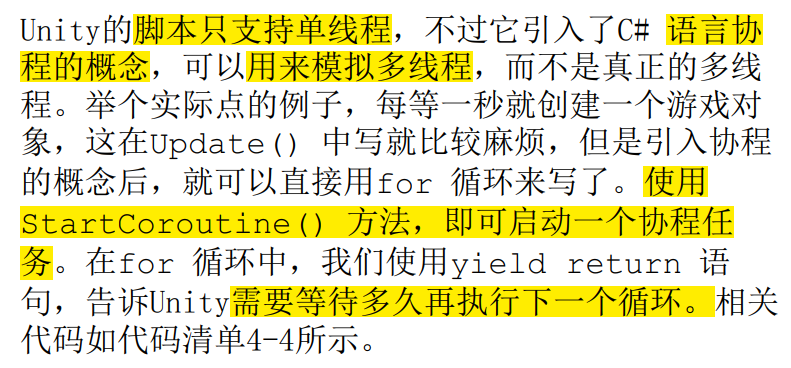

    定义：**协程就是一种特殊的函数，它可以主动的请求暂停自身并提交一个唤醒条件，Unity会在唤醒条件满足的时候去重新唤醒协程。**

    在`MonoBehaviour`生命周期的`Update`和`LateUpdate`之间，会检查这个`MonoBehaviour`下挂载的所有协程，并唤醒其中满足唤醒条件的协程。

    为什么需要协程：**使用协程，我们可以把一个跨越多帧的操作封装到一个方法内部，代码会更清晰。**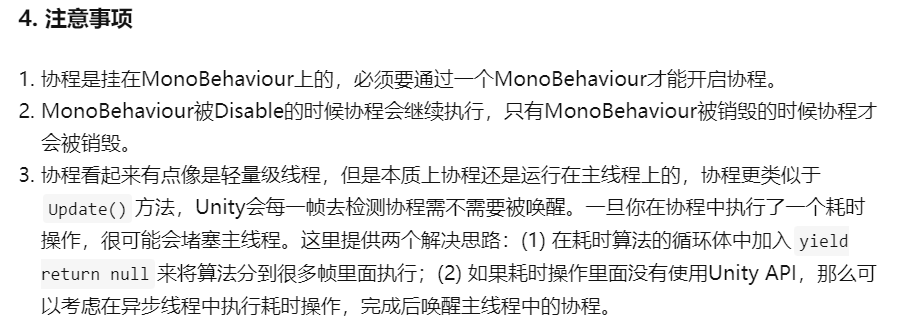

    原理：协程分为两部分，**协程**与**协程调度器**：协程仅仅是一个能够中间暂停返回的函数，而协程调度是在MonoBehaviour的生命周期中实现的。 准确的说，**Unity只实现了协程调度部分**，而协程本身其实就是用了C#原生的”迭代器方法“。

    **协程本体：**

    * C#中的迭代器方法其实就是一个协程，你可以使用`yield`来暂停，使用`MoveNext()`来继续执行。
    * 函数调用的本质是压栈，协程的唤醒也一样，调用`IEnumerator.MoveNext()`时会把**协程方法体压入当前的函数调用栈中执行**，运行到`yield return`后再弹栈。这点和有些语言中的协程不大一样，有些语言的协程会维护一个自己的函数调用栈，在唤醒的时候会把整个函数调用栈给替换，这类协程被称为**有栈协程**，而像C#中这样直接在当前函数调用栈中压入栈帧的协程我们称之为**无栈协程**。

    **协程调度：MonoBehaviour生命周期中实现**

    * 查看`MonoBehaviour`生命周期的部分，会发现有很多yield阶段，在这些阶段中，Unity会**检查`MonoBehaviour`中是否挂载了可以被唤醒的协程，如果有则唤醒它。**

    **Unity协程的架构**：

    * 基类：[YieldInstruction](https://link.zhihu.com/?target=https%3A//docs.unity3d.com/ScriptReference/YieldInstruction.html) **其它所有协程相关的类都继承自这个类。**Unity的协程只允许返回继承自`YieldInstruction`的对象或者`null`。如果返回了其他对象则会被当成null处理。
    * 协程类：[Coroutine](https://link.zhihu.com/?target=https%3A//docs.unity3d.com/ScriptReference/Coroutine.html) 你可以通过`yield return`一个协程来等待一个协程执行完毕，所以`Coroutine`也会继承自`YieldInstruction`。 `Coroutine`仅仅代表一个**协程实例**，不含任何成员方法，你可以将`Coroutine`对象传到`MonoBehaviour.StopCoroutine`方法中去关闭这个协程。

* 面板

  * Inspector：显示当前选择的游戏对象、脚本或资产【图片和各种组件等】的属性。
    * 锁定Inspector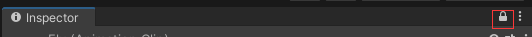
    * 图片Insepector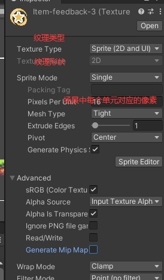

* 主相机

* 场景

* 贴图

* 组件
  * Collider 2D：碰撞体，为了**物理碰撞的目的**而出现。
    * Circle Collider 2D：圆形碰撞区
    * Box Collider 2D：正方形和矩形碰撞。
    * Polygon Collider 2D：自由形式的碰撞区。
    * Edge Collider 2D

* 音乐：

* 动画：
  * Animator：各Animation必须要能转换到其他状态，否则将一直维持同一状态，即使满足该状态的条件不再满足，因为其无法转到其他状态。
  * 可在每个动画后添加一个事件函数，该事件函数可用来进状态转换。

* 碰撞体 Collider
  * is Trigger：无需碰撞效果

* UI
  * dialog:
    * 内部加动画可有渐变效果
  * Slider:
    * 注意其他UI不要挡住进度条，否则无法拖动。

* 2D光效
  * Direnction Light：方向光
  * point Light：点光
    * Intensity：光强

  * 光效都是3d的，可调整光源位置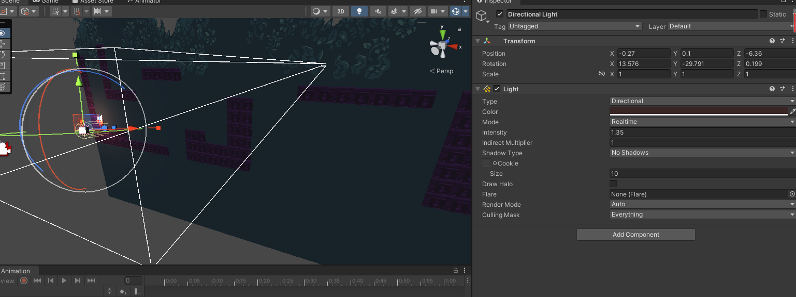


* 父子物体：
  * 子物体的位置随父物体的位置移动
  
* 移动端配置
  * 所有屏幕摇动杠都是UI
  
* 资源加载

  更详细的文章：[【Unity】Asset简介 - 知乎 (zhihu.com)](https://zhuanlan.zhihu.com/p/411946807)

* 编辑模式

  * 资源
    * 引擎可识别的资源，如Prefab、声音、视频、动画和UI等。
    * 引擎不可识别的资源，需要将信息解析出来并组织成引擎内可识别资源。

  * 编辑模式下**负责读取工程内资源的标志类**：**AssetsDatabase**。【需要保证所有资源放在Assets目录下，否则无法读取。】

  * 卸载资源：

  * 游戏对象与资源的关系：

    游戏对象与资源是一种引用关系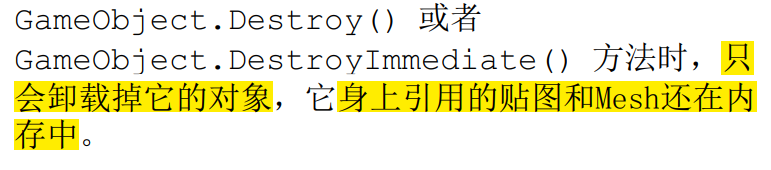

* 运行模式：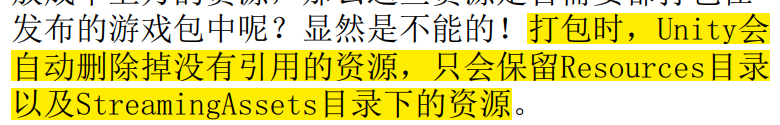

  * 引用资源：打包时只有被引用到的资源Unity才会打包，常见的是场景中的资源。

  * Resources：

    一般使用Resources.Load< T >来加载资源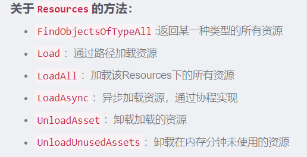

    **`Resources`这种动态加载方式是只读的，在游戏打包后，就无法对文件夹的内容进行修改**

    * 删除资源
      * **游戏对象删除了，它引用的资源其实并没有删除。**  
      * 使用Resources.UnloadAsset() 以及Resources.UnloadUnusedAssets() 方法强制
        卸载资源。由于**卸载资源是异步操作**，所以可以使用isDone 来判断是否完成。  

    尽量不要使用Resources来进行资源加载，因为打包后可能会包体过大，**构建的应用启动时间过长，内存管理也更困难**。对于移动平台或需要**热更新的场景下极不友好**（无法进行增量更新 incremental content upgrades ），同时这种**依赖资源名的调用方式**很容易在替换资源时出现问题。

* AssetBundle：与`Resources`不同，`AssetBundle`主要是用于**热更新**，要用AssetBundle 首先要**把资源打包成.assetbundle文件，再动态的去加载这个文件**，本地或者网络服务器都可以。

  * 组成：AssetBundle 由**头文件（ Header ）和数据段（ Data Segment ）组成**，数据段中**包含着所有资源对象**，而**头文件**中包含了 **AssetBundle 的信息**，此 AB 包的标识符（ Identifier ），压缩类型（ Compression Type，是否压缩，LZMA - 全包压缩，LZ4 - 单独压缩）以及数据清单（ Manifest，对象名作为 key 用来查找数据段位置）。
  * 工作流程：先将资源按照一定的方式**打包成多个 AssetBundle**（ BuildPipline.BuildAssetBundles 方法 ），然后将这些**二进制文件放到 StreamingAssets 目录**下（ 类似 Resources，但**构建时不会进行打包的处理** ），在**运行时加载需要的 AssetBundle**（ 4 个 API，最快最好的是 AsseBundle.LoadFromFile ），之后**使用 AssetBundle 中的资源对象**（ 3 种 6个 API，LoadAllAssets 最快，LoadAsset，LoadAssetsWithSubAssets ）。
  * 卸载：对于 AssetBundle 的卸载需要有一定的讲究，因为两种卸载方式各有各的好处（坑？），卸载 AssetBundle 使用 API AssetBundle.Unload(bool)，**参数表示是否卸载从此 AB 包中加载的资源对象实例**。true 时，会立即卸载实例化的所有对象，造成的问题是如果场景中依然有对象对这些卸载了的资源的对象进行访问会出现 missing 的情况（确保不会再使用，比如场景切换时）；false 时，会在下次加载同样的 AB 包时，造成同样的资源对象重复的情况，因为先前加载的对象没有被卸载，并与 AB 包切断了联系，在重复加载时并不会修复这种联系，所以内存中有了重复的对象（对这些资源对象进行清理，如引用计数）。
* 删除对象

    * 运行时，需要使用GameObject.Destroy() 和GameObject.DestroyImmediate() 方法删除游戏对象。
    * GameObject.Destroy() 会等一帧再彻底删除。因为有可能在这一帧的后面还有地方在操作这个对象，所以一般建议使用它来删除对象。GameObject.DestroyImmediate() 表示立即删除。
