# 算法知识

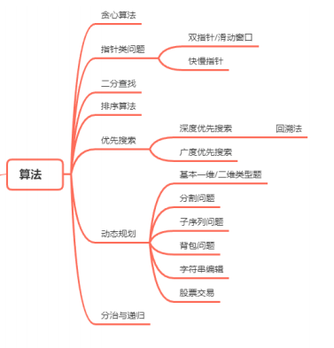

## 贪心算法

### 算法解释

* 贪心算法或贪心思想采用贪心的策略，保证每**次操作都是局部最优的**，从而使**最后得到的结果是全局最优的。**
* 于一个具体问题，要确定它是否具有**贪心选择性质，必须证明每一步所作的贪心选择最终导致问题的整体最优解。**
* 举一个最简单的例子：小明和小王喜欢吃苹果，小明可以吃五个，小王可以吃三个。已知苹 果园里有吃不完的苹果，求小明和小王一共最多吃多少个苹果。在这个例子中，我们可以选用的 贪心策略为，每个人吃自己能吃的最多数量的苹果，**这在每个人身上都是局部最优的**。**又因为全局结果是局部结果的简单求和，且局部结果互不相干，因此局部最优的策略也同样是全局最优的策略。**

###  分配问题

#### [455. 分发饼干](https://leetcode-cn.com/problems/assign-cookies/)

* 题解

  * 为了尽可能满足最多数量的孩子，从贪心的角度考虑，应该按照孩子的**胃口从小到大的顺序依次满足每个孩子**，**且对于每个孩子，应该选择可以满足这个孩子的胃口且尺寸最小的饼干**。

  * 简而言之，这里的贪心策略是，**给剩余孩子里最小饥饿度的孩子分配最小的能饱腹的饼干。**

    ```java
    //排序加贪心
    //因为两个数组都排序了，当前最小饥饿度的孩子不能满足，后面的孩子都不能满足，第二个数组的索引处的元素表示第几小的饼干
    public int findContentChildren(int[] g, int[] s) {
            int child = 0;
            int cookie = 0;
            Arrays.sort(g);
            Arrays.sort(s);
        //child：记录索引和记录满足的孩子个数
        //cookie：记录索引
            while(child<g.length&&cookie<s.length){
                 //对于每一个小孩，找到满足胃口的最小饼干
                if(g[child]<=s[cookie]) {
                    child++;
                }
                cookie++;
            }
            return child;
        }
    ```

#### [135. 分发糖果](https://leetcode-cn.com/problems/candy/)

* 定制规则：学生A和学生B左右相邻，A在B左边
  * **左规则**：当 ratingsB>ratingsA时，B的糖比 A 的糖数量多。即学生B对左边的学生A要满足左规则，左规则需从左往右遍历，这样左边的结果才可以先得到，避免结果出错。
  
  * **右规则：** 当 ratings_A>ratings_B时，A的糖比B的糖数量多。即学生A对右边的学生B要满足右规则，右规则需从右往左遍历，原因同上。
  
  * ```java
    学生分数序列：[1,2,87,87,87,2,1]
    左规则遍历后：[1,2,3, 1, 1, 1,1]
    右规则遍历后：[1,2,3, 1, 2, 2,1]（从左往右）
    右规则遍历结果出错，因为最右边的数未先进行操作，反而是最左边的数进行操作，操作次序出错，应该为从右往左遍历。
    右规则遍历后：[1,2,3, 1, 3, 2,1]（从右往左） 
    ```
  
  * 
  
* 相邻的学生中，评分高的学生必须获得更多的糖果 **等价于** 所有学生满足左规则且满足右规则
* 这里的贪心策略就是，在每次遍历中，只考虑并更新相邻一 侧的大小关系。

```java
  public int candy(int[] ratings) {
        int count = 0;
        int[] grades = new int[ratings.length];
        for(int i =0;i<grades.length;i++){
            grades[i]=1;
        }
        //确保每个学生满足左规则
        for(int i =1 ;i<ratings.length;i++){
            //只有当前学生评分高于左边的学生时，当前学生糖果数才为左边学生的糖果数+1 因为起始时糖果数都为1 所以不用比较糖果数
            if(ratings[i]>ratings[i-1]) grades[i]=grades[i-1]+1;
        }
        //确保每个学生满足右规则
        for(int i=ratings.length-2;i>=0;i--){
            //只有当前学生评分高于右边学生且当前学生糖果数低于右边学生的糖果数时，当前学生糖果数才为右边学生的糖果数+1
            if(ratings[i]>ratings[i+1] && grades[i]<=grades[i+1]) grades[i]=grades[i+1]+1;
        }
        for(int i =0 ;i<grades.length;i++) count=count+grades[i];
        return count;
    }
```

* 第二次做

* ```java
  class Solution {
      public int candy(int[] ratings) {
          int[] points = new int[ratings.length];
          int sum = 0;
          Arrays.fill(points, 1);
  
  
          // 局部最优
          // 先确定右边评分大于左边的情况
          // 从前往后 利用上前一次的比较结果
          for(int i = 1; i < ratings.length; i++){
              if(ratings[i] > ratings[i - 1]){
                  points[i] = points[i - 1] + 1;
              }
          }
          
          // 局部最优
          // 再确定左孩子大于右孩子的情况
          // 从后往前 利用上前一次的比较结果
          for(int i = ratings.length - 2; i >= 0; i--){
              if(points[i] <= points[i + 1] && ratings[i] > ratings[i + 1]){
                  points[i] = points[i + 1] + 1;
              }
          }
  
  
          // 全局最优 相邻的孩子中，评分高的孩子获得更多的糖果。
          for(int point : points){
              sum += point;
          }
  
          return sum;
      }
  }
  ```

```c++

class Solution {
public:
    /**
     * pick candy
     * @param arr int整型vector the array
     * @return int整型
     */
    int candy(vector<int>& arr) {
        // write code here
        // base case
        if(arr.size() <= 1) return arr.size();

        // 初始 每个人一颗
        vector<int> nums(arr.size(), 1);

        //比左边 1->4->2->7->9 依赖的是左边 需从左往右遍历
        for (int i = 1; i < arr.size(); i++) {
            // 该方向相邻且得分较多但糖果不多
            if(arr[i - 1] < arr[i] && nums[i - 1] >= nums[i]){
                nums[i] = nums[i - 1] + 1;
            }
        }

        // 比右边 1<-4<-2<-7<-9 从右往左遍历 依赖的是右边
        for(int i = arr.size() - 2; i >= 0; i--){
            if(arr[i + 1] < arr[i] && nums[i + 1] >= nums[i]){
                nums[i] = nums[i + 1] + 1;
            }
        }
        int total = 0;
        for(int i = 0; i < nums.size(); i++){
            total += nums[i];
        }
        return total;
    }
};
```


###  区间问题

#### [435. 无重叠区间](https://leetcode-cn.com/problems/non-overlapping-intervals/)

**题解**：问题转化：移除区间的最小数量即不重叠区间的最大个数

在选择要保留区间时，区间的结尾十分重要：**选择的区间结尾越小，余留给其它区间的空间 就越大，就越能保留更多的区间。**

具体实现方法为，先把区间按照结尾的大小进行增序排序，每次选择结尾最小且和前一个选择的区间不重叠的区间。**按照右边界排序，从左向右记录非交叉区间的个数。最后用区间总数减去非交叉区间的个数就是需要移除的区间个数了**。

右边界排序之后，局部最优：优先选右边界小的区间，所以从左向右遍历，留给下一个区间的空间大一些，从而尽量避免交叉。全局最优：选取最多的非交叉区间。

局部最优推出全局最优，试试贪心！

```java
 public int eraseOverlapIntervals(int[][] intervals) {
        //按右边界递增排序
        Arrays.sort(intervals, new Comparator<int[]>() {
            @Override
            public int compare(int[] o1, int[] o2) {
                return o1[1]>o2[1]?1:(o1[1]==o2[1]?0:-1);
            }
        });
        int n =intervals.length;
        //非交叉区间的个数
        int ans=1;
        //当前所找到非交叉区间的右边界
        int right = intervals[0][1];
        for(int i =1;i<intervals.length;i++){
            //此时不交叉
            if(intervals[i][0]>=right){
                ans++;
                //更新右边界
                right=intervals[i][1];
            }
        }
        return n-ans;
    }
```

#### 相同0/1个数的字符串区间

* 给定一个只含0和1字符的字符串

* 输出两个最长的区间，包含相同的0和1个数

* 贪心：找到最大的公共部分，其可以是左右两端1的中间部分，也可以是左右两端0的中间部分，取最大的部分，然后最大公共部分左闭左移一位和右闭右移一位，两区间是最长的符合条件的。

  


#### **BM96** **主持人调度（二）**

* 将任务按开始时间和结束时间升序排序，确保按时间线遍历

* 小顶堆存储任务结束时间，遍历每个任务，判断堆顶任务的主持人是否可以复用即可。

  ```c++
  
  // 左升右升顺序
  #include <functional>
  #include <queue>
  bool compareThis(vector<int>& a, vector<int>& b){
      if(a[0] != b[0]){
          return a[0] < b[0];
      }else{
          return a[1] < b[1];
      }
  }
  class Solution {
  public:
      
      /**
       * 代码中的类名、方法名、参数名已经指定，请勿修改，直接返回方法规定的值即可
       * 计算成功举办活动需要多少名主持人
       * @param n int整型 有n个活动
       * @param startEnd int整型vector<vector<>> startEnd[i][0]用于表示第i个活动的开始时间，startEnd[i][1]表示第i个活动的结束时间
       * @return int整型
       */
      int minmumNumberOfHost(int n, vector<vector<int> >& startEnd) {
          // write code here
          if(n == 1) return 1;
          sort(startEnd.begin(), startEnd.end(), compareThis);
          // 小顶堆 自定义比较函数 利用vector实现
          priority_queue<int, vector<int>, greater<int>> pq; // 装填进行中的任务的结束时间
          pq.push(startEnd[0][1]); // 第一个任务
          for(int i = 1; i < startEnd.size(); i++){
              if(pq.top() <= startEnd[i][0]){ // 判断下个新任务开始时是否有任务已经结束 如果结束则可共用一个主持人
                  pq.pop();
              }
              pq.push(startEnd[i][1]); // 加入新任务
          }
          return pq.size(); //剩余任务个数即主持人个数
      }
  };
  ```

  


### 例题

#### [605. 种花问题](https://leetcode-cn.com/problems/can-place-flowers/)

题解：

这里的贪心思想是：求每两个已种花的位置间可种花的最大数量，即每两个1之间0的位置可以根据规则最多放置多少个1（局部最优），这样就可以填入种入最多的花了（整体最优）。

可以由之间0的个数推出最大可种入花数。 1-0 2 -0

3 - 1

4 - 1

5 - 2

6 - 2

7 - 3

8 - 3 

易推出公式 最大可种入数量 = (0数-1)/2

边界处理 ：两边界都有一边不为1（即一边当作没花），故可将边界的0数加1 以便统一计算

```java
   public boolean canPlaceFlowers(int[] flowerbed, int n) {
        if(flowerbed==null || flowerbed.length==0) return n==0;
        //用于记录两个1之间0的个数 左右两边初始时为1
       int countZero =1;
       //记录最大可种花数
       int count = 0;
        for (int i : flowerbed) {
            if(i==0) countZero++;
            else{
                //求两个已种花位置间可种花的数量
                count+=(countZero-1)/2;
                if(count>=n) return true;
                //区间内0数量清零，开始统计下一个全0分区
                countZero=0;
            }
        }
        //右边界0的数量加1
        countZero++;
        //右边界可以种花的数量
        count+=(countZero-1)/2;
        return count>=n;
    }
```

#### [452. 用最少数量的箭引爆气球](https://leetcode-cn.com/problems/minimum-number-of-arrows-to-burst-balloons/)

和其他合并区间类的题目套路一样, 都是贪心思想, 先排序（让相邻的区间靠近便于处理重叠等问题）, 然后遍历检查是否满足合并区间的条件
这里判断是否有交叉区间, 所以其实是计算已知区间的交集数量.

**贪心思想：每次箭射爆尽量多的气球（局部最优），达到最少的箭射爆所有气球的目的（全局最优）。**

让每次箭射爆最多的气球，即每次找到重叠的区间，而判断相邻区间是否重叠可以通过已重叠区间的最小右部分判断。

因为区间重叠的极限为右部分，若下个区间的左部分 小于 上个重叠部分的最小右部分且下个区间的右部分 大于 上个重叠部分的最小左部分，则该区间仍然可以继续重叠，并跟新重叠区间的最小左右部分。

且射击顺序也会影响所射箭数，但我们从左往右或从右往左射，则可以规避这个问题。

这里我们对右部分排序，因为这样 下个区间的右部分 一定大于 上个重叠部分的最小左部分，只需比较下个区间的左部分与上个重叠部分的最小右部分的大小即可。

排序后，每次重叠区间的最小右部分很容易就得出了。

```java
    public int findMinArrowShots(int[][] points) {
        int count = 1;
        //升序排序
        Arrays.sort(points,(a,b)-> a[1] > b[1]?1:-1);
        //记录第一个重叠区间的最小右部分
        int right=points[0][1];
        for(int i =1 ;i<points.length;i++){
            //满足if条件即这个重叠区间没有与之重复的区间了，接着下一个重叠区间
            if(points[i][0]>right){
                //更新当前重叠区间的最小右部分
                right=points[i][1];
                count++;
            } 
        }
        return count;
    }
```

#### [122. 买卖股票的最佳时机 II](https://leetcode-cn.com/problems/best-time-to-buy-and-sell-stock-ii/)

- 这道题 「贪心」 的地方在于，对于 「今天的股价 - 昨天的股价」，得到的结果有 3 种可能：① 正数，② 00，③负数。贪心算法的决策是： **只加正数** 。**即把可能跨越多天的买卖都化解成相邻两天的买卖**
- 因为每隔一天，都可以知道与前一天相比是否赚了钱，我们只要把每隔一天都能赚钱的加进去，就能赚最多的钱了。即只要今天股价比昨天高，就交易。

解法一：//未当成相邻两天的买卖

```java
    public int maxProfit(int[] prices) {
        int count = 0;
        int in=-1;
        for(int i =0;i<prices.length-1;i++){
            if(prices[i+1]>prices[i]) {
                if(in==-1)
                in=prices[i];
                if(i+1==prices.length-1) {
                    count+=prices[i+1]-in;
                }                
            }else{
                if(in!=-1){
                    count+=prices[i]-in;
                    in=-1;
                }
            }
        }
        return count;
    }
```

解法2：//当成相邻两天的买卖

```java
    public int maxProfit(int[] prices) {
        int count = 0;
        int temp;
        for(int i =1;i<prices.length;i++){
            temp=prices[i]-prices[i-1];
            if(temp>0) count+=temp;
        }
        return count;
    }
```

#### [517. 超级洗衣机](https://leetcode-cn.com/problems/super-washing-machines/)

* TODO理解【复习贪心】

```java
class Solution {
    public int findMinMoves(int[] machines) {
        int n = machines.length;
        int sum = 0;
        for(int num : machines){
            sum += num;
        }

        // 不能整除
        if(sum % n != 0) return -1;

        int avg = sum/n;
        // 用于记录需要移动的最大次数
        int max = Integer.MIN_VALUE;

        for(int i = 0 ; i<n;i++){
            // 构建差值数组
            machines[i] = machines[i] - avg;
        }


        for(int i = 0; i < n-1; i++){
            max = Math.max(max, Math.abs(machines[i]));
            max = Math.max(max, machines[i + 1]);
            // 前一台洗衣机的差值转移到后一台洗衣机，即先满足前一台洗衣机；
            machines[i + 1] += machines[i];
        }
        
        return Math.max(max,machines[n-1]);
        
    }
}
```


## 字符串

### [482. 密钥格式化](https://leetcode-cn.com/problems/license-key-formatting/)

```java
class Solution {
    // 简单解法 ： 非常耗时 字符串很长时可能经常扩容
    public String licenseKeyFormatting(String s, int k) {
        // 记录某个部分字符个数
        int charNum = 0;
        // 变为大写
        s = s.toUpperCase();
        StringBuilder sb = new StringBuilder();
        // 从尾部向前遍历
        for(int i = s.length()-1 ;i >= 0;i--){
            char temp = s.charAt(i);
            if(temp != '-'){
                // 当前部分字符个数小于k
                if(charNum < k){
                    sb.append(temp);
                    charNum++;
                }else{
                    // 当前部分字符个数等于k，重新开一个部分加字符
                    charNum = 0;
                    sb.append('-');
                    sb.append(temp);
                    charNum++;
                }
            }
        }
		
        // 结果再翻转 而不是insert【需要移动位置可能非常耗时】
        return sb.reverse().toString();
    }
}
```

### **BM85** **验证IP地址**

* C++ stirng没有分割函数，需要自己实现。
* 先分割，再根据组数进行分别验证。

```c++

#include <vector>
class Solution {
public:
    /**
     * 验证IP地址
     * @param IP string字符串 一个IP地址字符串
     * @return string字符串
     */
    string solve(string IP) {
        // write code here
        vector<string> res = split(IP);
        if(res.size() != 4 && res.size() != 8) return "Neither";
        if(res.size() == 4) return checkIpv4(res);
        return checkIpv6(res);
    }

    // 验证IPV4
    string checkIpv4(vector<string>& data){
        for(auto s : data){
            if(s.size() == 0 ||(s.size() > 1 && s[0] == '0') || s.size() > 3) return "Neither";
            for(const char c : s){
                if(c < '0' || c > '9') return "Neither";
            }
            // 转为整数
            int cur = stoi(s);
            if(cur > 255) return "Neither";
        }
        return "IPv4";
    }

    // 验证IPV6
    string checkIpv6(vector<string>& data){
        for(auto s : data){
            if(s.size() == 0 || s.size() > 4) return "Neither";
            for(const char c : s){
                if(!(c >= '0' && c <= '9' || c >= 'a' && c <= 'f' || c >= 'A' && c <= 'F')){
                    return "Neither";
                }
            }
        }
        return "IPv6";
    }

    // 分割出字符串片段
    vector<string> split(string data){
        vector<string> res;
        string temp = "";
        if(data.find('.') != -1){ // IPV4
            for(const char c : data){
                if(c == '.'){
                    res.push_back(temp);
                    temp = "";
                }else{
                    temp += c;
                }
            }
            res.push_back(temp);
        }else{ // IPV6
            for(const char c : data){
                if(c == ':'){
                    res.push_back(temp);
                    temp = "";
                }else{
                    temp += c;
                }
            }
            res.push_back(temp);
        }
        return res;
    }
};
```


## 双指针算法

* 双指针主要用于遍历数组，两个指针指向不同的元素，从而协同完成任务。也可以延伸到多个数组的多个指针。
* 若两个指针指向同一数组，**遍历方向相同且不会相交**，则也称为**滑动窗口**（两个指针包围的区域即为当前的窗口），经常用于**区间搜索**。
* 若两个指针指向同一数组，但是**遍历方向相反**，则可以用来进行**搜索，待搜索的数组往往是排好序的。**
* 数组或字符串中，一般为左右指针，链表中为快慢指针。

### 例题

#### **BM88** **判断是否为回文字符串**

```java
import java.util.*;


public class Solution {
    /**
     * 代码中的类名、方法名、参数名已经指定，请勿修改，直接返回方法规定的值即可
     * 
     * @param str string字符串 待判断的字符串
     * @return bool布尔型
     */
    public boolean judge (String str) {
        // write code here
        int left = 0;
        int right = str.length() - 1;
        while(left < right){
            if(str.charAt(left) != str.charAt(right)) return false;
            left++;
            right--;
        }
        
        return true;
    }
}
```


#### [167. 两数之和 II - 输入有序数组](https://leetcode-cn.com/problems/two-sum-ii-input-array-is-sorted/)

题解

* 因为**数组已经排好序**，我们可以采用**方向相反的双指针来寻找**这两个数字，一个初始指向最 小的元素，即数组最左边，向右遍历；一个初始指向最大的元素，即数组最右边，向左遍历。
* 如果两个指针指向元素的和等于给定值，那么它们就是我们要的结果。如果两个指针指向元 素的和小于给定值，我们把左边的指针右移一位，使得当前的和增加一点。如果两个指针指向元 素的和大于给定值，我们把右边的指针左移一位，使得当前的和减少一点。

```java
    public int[] twoSum(int[] numbers, int target) {
        int[] answer = new int[2];
        int sum;
        //左指针
        int start = 0;
        //右指针
        int end = numbers.length-1;
        //终止条件 start==end 此时已经测试完所有可能的结果
      while(start<end){
          sum=numbers[start]+numbers[end];
          if(sum==target){
            answer[0]=start+1;
              answer[1]=end+1;
              break;
          }
          if(sum<target) start++;
          //==和>=都会走该句 但前面==后break 故只有>=会走
          else end--;
         
      }
        return answer;
    }
```

#### [88. 合并两个有序数组](https://leetcode-cn.com/problems/merge-sorted-array/)

题解

* 因为这两个数组已经排好序，我们可以**把两个指针分别放在两个数组的末尾，即 nums1 的 m − 1 位和 nums2 的 n − 1 位。每次将较大的那个数字复制到 nums1 的后边，然后向前移动一位。** **因为我们也要定位 nums1 的末尾，所以我们还需要第三个指针，以便复制。**

  ```java
   public void merge(int[] nums1, int m, int[] nums2, int n) {	
       //直接利用m和n指向两个数组已有元素的末尾 pos指向nums1末尾
          int pos = m-- +n-- -1;
          while(m>=0&&n>=0){
              //nums2的数较大时移向nums1末尾
              if(nums1[m]<=nums2[n]){
                  nums1[pos--]=nums2[n];
                  n--;
              }else {
                  nums1[pos--]=nums1[m];
                  m--;
              }
          }
       	//如果 nums1的数字已经复制完，不要忘记把 nums2 的数字继续复制
          while(n>=0){
              nums1[n]=nums2[n];
              n--;
          }
      }
  ```

#### [633. 平方数之和](https://leetcode-cn.com/problems/sum-of-square-numbers/)

题解

* 这是一道经典的双指针相向而行的题目，但是要注意剪枝，**就是right部分一定小于等于c的平方根**，所以首先要把right部分确定下来，左右双向而行就可，大了就right左移，小了就left右移，直到相遇或者平方和为c，代码如下：
* 起始条件：左指针 0  右指针 c的平方根  (如果能与两个数的平方和相等，两个数一定在该范围内，在这个范围内进行双指针搜索)，左右指针分别指示着较小和较大的数
* 终止条件：左指针大于右指针 或 c与两个数的平方和相等

```java
    public boolean judgeSquareSum(int c) {
        int middle = (int) Math.sqrt(c);
        int  left = 0;//左指针
        int  right = middle;//右指针 
        long  sum;//避免结果溢出
        while(right>=left){
            sum=left*left+right*right;
            if(sum==c) return true;
            if(sum>c) right--;
            else left++;
        }
        return false;
    }
```

#### [680. 验证回文字符串 Ⅱ](https://leetcode-cn.com/problems/valid-palindrome-ii/)

题解

* 利用双指针不断更新判断是否为回文字符串
  * 左指针和右指针对应的字符相同时，左指针右移，右指针左移，然后重新比较
  * 两指针所对应的字符不等时，进行字符删除，并记录删除个数
* 终止条件 左指针大于右指针或要删除的字符个数>1
* 删除条件 两指针所对应的字符不等
  * **重点就是判断删除左指针还是右指针的字符，要点是保证删除后字符串要为回文字符串。**

```java
public boolean validPalindrome(String s) {
        //左指针 起始为字符串的开始位置
        int left = 0;
        int right = s.length() - 1;
        char[] chars = s.toCharArray();
        int deleteCount = 0;
        char first;
        char end;
        //终止条件 左指针大于右指针
        while (left <= right) {
            //两指针所对应的字符不等 进行删除
            if (chars[left] != chars[right]) {
                if (deleteCount == 1) return false;
                //删除左指针处字符符合回文的条件
                if (chars[left + 1] == chars[right]) {
                    //验证左指针处字符删除后的下一个字符是否也相等  若相等则可以删除左指针处的字符 否则判断右指针处字符是否可以删除
                    //TODO 为什么只要下一组也符合就可以选了 因为字符串删错一个后下一个立即反映出来不再是回文字符串 若是字符串删除一个后为回文字符串 则删除错误的字符后 该字符串不再为回文字符串 只有删除正确才是回文
                    if (left + 2 < right) { //当左指针删除字符的下一个位置在 两个指针的包围区间内时 才要进行判断
                        if (chars[left + 2] == chars[right - 1]) {
                            left++;
                            deleteCount++;
                            continue;
                        }
                    } else {
                        left++;
                        deleteCount++;
                        continue;
                    }
                }
                //右指针左移符合的情况
                if (chars[left] == chars[right - 1]) {
                    if (right - 2 >left) {
                        if (chars[left + 1] == chars[right - 2]) {
                            right--;
                            deleteCount++;
                            continue;
                        }
                    } else {
                        right--;
                        deleteCount++;
                        continue;
                    }
                }
                //无法通过删除一个得到回文字符串
                return false;
            }
            //满足回文

            left++;
            right--;
        }
        return true;
    }
```

* 另一解法：此解法在判断删除左指针还是右指针时，直接通过判断删完后范围内的字符串是否为回文字符串来判断删除哪个指针。

```java
    //如果s[i]==s[j]继续i++,j--,判断是否回文
    //如果s[i]!=s[j]
    //1.判断s[i+1]到s[j]范围内字符串是否回文，如果是，去掉s[i]即可
    //2.或者判断s[i]到s[j-1]范围内是否回文，如果是，删除s[j]即可，
    public boolean validPalindrome(String s) {
        char[] ch=s.toCharArray();
        for(int i=0,j=ch.length-1;i<j;i++,j--){
            if(ch[i]!=ch[j]){
                return isPalindrome(ch,i+1,j)||isPalindrome(ch,i,j-1);//不相等直接return 符合只可删一个的条件
            }
        }
        return true;
    }
    //判断回文
    public boolean isPalindrome(char[] s,int i,int j){
        while(i<j){
            if(s[i]!=s[j]){
                return false;
            }
            i++;j--;
        }
        return true;
    }

```

#### [524. 通过删除字母匹配到字典里最长单词](https://leetcode-cn.com/problems/longest-word-in-dictionary-through-deleting/)

题解：

* 因为题目说字典中最长字符串可以通过删除外字符串中的某些字符得到，

  内字符串长度可以转化为外字符串所需删除字符的个数，因此我们只需**比较外字符串还原为字典中符合条件的字符串需删除字符的数量即可，所删数量最小的符合内字符串即为所求。这里用数组统计个数。**

* **利用双指针分别指示内字符和外字符串的尾部，逐个比较，不等时，外指针左移表示删除字符，并对对应内字符串删除字符个数加一，相等时，内外指针都左移。重复上述过程直到内外指针之一到尽头。**

  * **如果内字符串长度大于外字符串，该字符串不符合**，记录数组对应位置置最大值。
  * 这里还要判断内外字符串是否还有剩余
    * **若内字符串还有剩余，则该内字符串不符合要**求，将记录数组对应的值置为最大值
    * 若外字符串还有剩余，此时让记录数组加上对应剩余个数即表示还原为对应内字符串应删除字符个数

* 之后，遍历记录数组，找到对应删除字符个数最少的索引即可。

```java
    public String findLongestWord(String s, List<String> dictionary) {
        //遍历到内字符串的索引
        int index = 0;
        //内指针
        int inRight;
        //外指针
        int outRight = s.length() - 1;
        char[] temp;
        //记录数组
        int[] countDeleted = new int[dictionary.size()];
        char[] chars = s.toCharArray();
        //最小删除字符数
        int least = Integer.MAX_VALUE;
        //外字符串通过删除最少字符还原为内字符串的索引
        int leastIndex = 0;
        //对字典元素排序 按字典顺序拿结果
        Collections.sort(dictionary);
        //外循环终止条件
        while (index < dictionary.size()) {
            //获取当前内字符串
            temp = dictionary.get(index).toCharArray();
            //内指针
            inRight = temp.length - 1;
            //内字符串长度大于外字符串 直接跳过 该字符串不符合要求 不进行逐个字符的比较
            if (inRight > outRight) {
                outRight = s.length() - 1;
                //置记录数组对应位置为最大值
                countDeleted[index] = Integer.MAX_VALUE;
                //去下个内字符串
                index++;
                continue;
            }
            //对内外字符串进行逐个字符的比较
            //内循环终止条件
            while (inRight >= 0 && outRight >= 0) {
                if (chars[outRight] != temp[inRight]) {
                    //字符不等时 外指针左移
                    outRight--;
                    //记录数组对应数值加一
                    countDeleted[index]++;
                } else {
                    //字符不等时 内外指针左移
                    outRight--;
                    inRight--;
                }
            }
            //此时外字符串还有剩余
            if (outRight >= 0) countDeleted[index] += outRight + 1;
            //内部字符串还有剩余 该字符串不符合要求
            if (inRight >= 0) countDeleted[index] = Integer.MAX_VALUE;
            outRight = s.length() - 1;
            //去下个内字符串
            index++;
        }
        //外字符串删除最少的即为所求
        for (int i = 0; i < countDeleted.length; i++) {
            if (countDeleted[i] < least) {
                least = countDeleted[i];
                leastIndex = i;
            }
        }
        //所有内字符串都不符合要求时
        if (least == Integer.MAX_VALUE) return "";
        return dictionary.get(leastIndex);
    }
```

解法二：

* 我们也可以封装一个方法来判断内字符串是否为所符合的字符串

  然后通过比较不断更新长度最长且字典顺序最小的字符串来获取最优解。

```java
class Solution {

    public String findLongestWord(String s, List<String> d) {
        String result = "";
        for (String t : d) {
            if (isSubsequence(t, s)) {
                // 获取长度最长且字典顺序最小的字符串
                if (result.length() < t.length() || (result.length() == t.length() && result.compareTo(t) > 0)) {
                    result = t;
                }
            }
        }
        return result;
    }

    // 判断 t 是否为 s 的子序列
    public boolean isSubsequence(String t, String s) {
        int indext = 0, indexs = 0;
        while (indext < t.length() && indexs < s.length()) {
            if (t.charAt(indext) == s.charAt(indexs)) {
                indext++;
            }
            indexs++;
        }
        return indext == t.length();
    }
}
```


* 第二次做，，TODO 优化

```java
class Solution {
    // 得出 外字符串转换为字典内某个字符串所需删除字符个数最小的即可..
    // 通过双指针实现
    public String findLongestWord(String s, List<String> dictionary) {
        // 分别用于记录 外字符串 和 内字符串 操作的位置
        int outIndex = -1;
        int inIndex = -1;
        
        // 从字典中获取内字符串的索引
        int index = 0;

        // 用于记录 外字符串还原为内字符串所需删除字符的个数
        int[] deleteNum = new int [dictionary.size()];
        // 先对字典按字典序排序 这样后面先拿到的最大的就是字典序最小的
        Collections.sort(dictionary);

        while(index < dictionary.size()){
            String in = dictionary.get(index);

            // 记录删除字符的个数
            int counts = 0;

            // 修改指针所指位置 都为末尾
            inIndex = in.length()-1;
            outIndex = s.length()-1;

            // 指针从尾到前 对比
            while(inIndex >= 0 && outIndex >= 0){

                if(s.charAt(outIndex) == in.charAt(inIndex)){
                    // 两字符相等 双指针都往前移
                    inIndex--;
                    outIndex--;
                }else{
                    // 两字符不等 外字符串需删除字符 表现为 外指针前移 内指针不动
                    outIndex--;
                    counts++;
                }
            }
            // 外字符串还有剩余 都要删
            if(outIndex+1 > 0) counts += outIndex+1;
            // 内字符串还有剩余 表示无法得到
            if(inIndex+1 > 0) counts = Integer.MAX_VALUE;

            deleteNum[index] = counts;
            index++;
        }

        // 记录目标索引 和 最小删除字符个数
        int targetIndex = 0;
        int minCount = Integer.MAX_VALUE;

        for(int i = 0 ;i< deleteNum.length;i++){
            if(deleteNum[i]<minCount) {
                minCount = deleteNum[i];
                targetIndex = i;
            }
        }
        String target = dictionary.get(targetIndex);

        // 两字符串无相同字符时 答案不存在
        if(deleteNum[targetIndex]==Integer.MAX_VALUE ) return "";

        // 返回目标字符串
        return target;
    }
}
```


#### [5. 最长回文子串](https://leetcode-cn.com/problems/longest-palindromic-substring/)

* 解法一：利用双指针找出所有的子串，并一一验证是否回文。

```java
class Solution {
    // 暴力解法
    public String longestPalindrome(String s) {
        int n = s.length();
        if(n==1) return s;
        int max = 1;
        // 记录子串开始位置
        int start = 0;
        // 找出所有子串中是回文子串且长度最大的
        for(int left = 0;left<n-1;left++){
            for(int right = n-1;right>left;right--){
                // 优化：长度不够的跳过
                if((right-left+1) > max){
                    if(isPal(s,left,right)){
                        max = right-left+1;
                        start = left;
                    }
                }
            }
        }

        // 用下标代替字符串操作节省了时间复杂度
        return s.substring(start,start+max);
    }

    // 判断某个范围的子串是否为回文子串
    boolean isPal(String s,int i,int j){
        while(i<j){
            if(s.charAt(i++)!=s.charAt(j--)) return false;
        }
        return true;
    }
}                                                                                                                                                                                                                                                                                                                                                                                                      
```

// TODO dp解法


#### [11. 盛最多水的容器](https://leetcode-cn.com/problems/container-with-most-water/)

```java
class Solution {
    // 暴力解法 时间复杂度O(n^2) 超时
    public int maxArea(int[] height) {
        int max = 0;
        int n = height.length;
        // 从前往后取所有垂直线
        for(int i = 0;i<=n-2;i++){
            // 和后面的垂直线结合
            for(int j = i+1;j<=n-1;j++){
                int curHeight = Math.min(height[i],height[j]);
                int width = j-i;
                max = Math.max(curHeight*width,max);
            }
        }
        return max;
    }
}
```

* 对O(n)的算法写一下自己的理解，一开始两个指针一个指向开头一个指向结尾，此时容器的底是最大的，接下来随着指针向内移动，会造成容器的底变小，在这种情况下想要让容器盛水变多，就只有在容器的高上下功夫。 那我们该如何决策哪个指针移动呢？我们能够发现不管是左指针向右移动一位，还是右指针向左移动一位，容器的底都是一样的，都比原来减少了 1。这种情况下我们想要让指针移动后的容器面积增大，就要使移动后的容器的高尽量大，所以我们选择指针所指的高较小的那个指针进行移动，这样我们就保留了容器较高的那条边，放弃了较小的那条边，以获得有更高的边的机会。https://leetcode-cn.com/problems/container-with-most-water/solution/sheng-zui-duo-shui-de-rong-qi-by-leetcode-solution/

* ```java
  class Solution {
      // 双指针解法
      public int maxArea(int[] height) {
          int start = 0;
          int end = height.length-1;
          int res = 0;
          while(start < end){
              int curHeight = Math.min(height[start],height[end]);
              int width = end-start;
              res = Math.max(curHeight*width,res);
              // 将更小的排除 因为如果排除更大的 那么后续所有的容器面积都只会更小
              if(height[start]<height[end]) start++;
              else end--;
          }
          return res;
      }
  }
  ```


#### [15. 三数之和](https://leetcode-cn.com/problems/3sum/)

```java
class Solution {
    public List<List<Integer>> threeSum(int[] nums) {
        // 记录结果
        List<List<Integer>> res = new ArrayList<>();
        // 排序
        Arrays.sort(nums);
        
        // 第一重循环取第一个数
        for(int i = 0;i < nums.length;i++){
            // 第一个数大于0 后面的数跟第一个数的组合必定大于0 所以break
            if(nums[i]>0) break;

            // 去重：第一个数的组合已经有了 continue
            if(i>0 && nums[i]==nums[i-1]) continue;

            // 第二重循环取第二个数 和 第三重循环取第三个数 因两者的并列关系 可合并为双指针算法
            // 头指针指向小的数 尾指针指向大的数
            int left = i+1,right = nums.length-1;
            while(left < right){
                int temp = nums[i]+nums[left]+nums[right];
                if(temp==0){
                    // 符合要求的组合 先加入结果集 然后再让两个指针分别去重前移和去重后移
                    res.add(new ArrayList<Integer>(Arrays.asList(nums[i],nums[left], nums[right])));
                    while(left < right && nums[left] == nums[++left]);
                    while(left < right && nums[right] == nums[--right]);
                }else if(temp < 0){
                    while(left < right && nums[left] == nums[++left]);
                }else if(temp > 0){
                    while(left < right && nums[right] == nums[--right]);
                }
            }
        }
        return res;
    }
}
```


#### 4.20 微众银行第三题

* 题目：给定长度为n的只包含小写字母的字符串s，求s中包含k个x字符的子串的个数

* 双指针解法：

  * 划分左右指针，并记录该范围内x字符个数，一旦x字符个数符合且即将不符合【即right指针下一个字符为x，left指针上一个字符为x】统计该范围内目标子串的个数即可【左指针到第一个x字符的距离和右指针到最后一个x字符的距离相乘】。

  ```java
      public static void main(String[] args) {
          Scanner sc = new Scanner(System.in);
          int n = sc.nextInt();
          int k = sc.nextInt();
          char x = sc.next().charAt(0);
          String s = sc.next();
          // 双指针
          int left = 0;
          int right = 0;
  
          // 范围内 x的个数
          int times = 0;
          // k子串个数
          int total = 0;
          while(right < n && left <= right){
              if(s.charAt(right) == x){
                  times++;
              }
              if(times == k){
                  // 统计[left,right]范围内k子串的个数
                  if(right + 1 == n || s.charAt(right + 1) == x){
                      int curLeft = left;
                      int curRight = right;
                      // 向右走到最后一个x字符处
                      while(curRight >= 0 && s.charAt(curRight) != x){
                          curRight--;
                      }
                      // 向左走到第一个x字符处
                      while(curLeft < n && s.charAt(curLeft) != x){
                          curLeft++;
                      }
                      // 该范围能够排列的k子串的个数
                      total += (curLeft - left + 1) * (right - curRight + 1);
                      // 下个起始点即第一个x字符的下一位
                      right = curLeft + 1;
                      left = right;
                      times = 0;
                  }else{
                      right++;
                  }
              }else {
                  right++;
              }
  
          }
          System.out.println(total);
      }
  ```

  


### 快慢指针

* **快慢指针就是定义两根指针，移动的速度一快一慢，以此来制造出自己想要的差值。**
* 快慢指针常应用于**链表中的查找相应的节点**


#### 常见应用

##### 1.找中间值

* 一般的思路是：先遍历一次链表，记录住一共有多少个节点，然后，再次遍历找寻中点。

* 利用快慢指针，我们来看看这个问题会变成什么样。思路如下：**我们把一个链表看成一个跑道，假设a的速度是b的两倍，那么当a跑完全程后，b刚好跑一半，以此来达到找到中间节点的目的。**

* ```java
   // 慢指针走到 中点 【偶数个数节点时走到前半链表的尾,奇数个数走到中点】  快指针走到后半链表的尾【偶数个时走到尾节点的前一个，奇数时走到尾节点】
          // 此方法保证左半链表长度不小于右半链表
          while(fast.next != null && fast.next.next != null){
              slow = slow.next;
              fast = fast.next.next;
          }
  ```

* 另一个：

  ```java
   // 快慢指针 将链表分两段 两段的尾节点都为null【方便归并】 slow走到后半段尾节点【后半段更长】 fast走到后半段尾节点【偶数时为null】
          ListNode slow = head, fast = head;
          ListNode pre = null;
          // slow为分界点【右段子链表的头结点】
          while(fast != null && fast.next != null){
              pre = slow;
              slow = slow.next;
              fast = fast.next.next;
          }
  ```

  

##### 2 判断链表中的环

* 还是把链表比作一条跑道，链表中有环，那么这条跑道就是一条圆环跑道，在一条**圆环跑道中**，**两个人有速度差，那么迟早两个人会相遇，只要相遇那么就说明有环。**
* 快慢指针中，因为每一次移动后，**快指针都会比慢指针多走一个节点，所以他们之间在进入环状链表后，不论相隔多少个节点，慢指针总会被快指针赶上并且重合，此时就可以判断必定有环。**


##### 找到倒数第k个节点

* 同样使用快慢指针，快指针先走k步，然后快慢指针一起走，当快指针走到null时慢指针就到了倒数第k个节点。

  ```java
      public ListNode FindKthToTail (ListNode pHead, int k) {
          // write code here
          ListNode fast = pHead;
          while(k > 0 && fast != null){
              fast = fast.next;
              k--;
          }
          if(k != 0) return null;
          ListNode slow = pHead;
          while(fast != null){
              fast = fast.next;
              slow = slow.next;
          }
          return slow;
      }
  ```

* 递归，后序遍历实现，递归实现链表遍历，**函数退栈的过程即对应从尾节点向头节点前进的过程**，可以在外部记录一个变量，初始为0，每次函数退栈时变量加加，当变量小于等于k时还未找到目标节点故返回头节点，大于时返回子递归的结果即可。

  ```C++
  /**
   * Definition for singly-linked list.
   * struct ListNode {
   *     int val;
   *     ListNode *next;
   *     ListNode(int x) : val(x), next(NULL) {}
   * };
   */
  class Solution {
  
  public:
      int deep = 0;
      ListNode* getKthFromEnd(ListNode* head, int k) {
          if(head->next == nullptr || head == nullptr){
              deep++;
              return head;
          }
  
          ListNode* temp = getKthFromEnd(head->next, k);
          deep++;
          if(deep > k){
              return temp;
          }else{
              return head;
          }
      }
  };
  ```

  


##### 3 删除倒数第n个节点

* 删除倒数第n个节点，那就等于是要我们**先找出待删除元素前一个元素，也就是倒数第n+1个节点。**
* 那如何找倒数第(n+1)个元素呢？我们一开始就让fast指针比slow指针快n+1个元素，接下来，两个指针都是一步一步来往下走。那么当fast指针走完时，slow指针就刚刚好停留在倒数第(n+1)个元素上（slow比fast慢n+1）。

```c++
    /**
     * 
     * @param head ListNode类 
     * @param n int整型 
     * @return ListNode类
     */
    ListNode* removeNthFromEnd(ListNode* head, int n) {
        // write code here
        ListNode* dummyHead = new ListNode(-1);
        dummyHead->next = head;
        ListNode* slow = dummyHead;
        ListNode* fast = dummyHead;
        int k = n + 1;
        while(k > 0 && fast != nullptr){
            k--;
            fast = fast->next;
        }
        if(k > 0) return nullptr;
        while(fast != nullptr){
            fast = fast->next;
            slow = slow->next;
        }
        
        ListNode* removed = slow->next;
        if(removed != nullptr){
            slow->next = removed->next;
            removed->next = nullptr;
        }
        
        return dummyHead->next;
    }
```


##### 反转链表

* 迭代解法：最重要的是找到第一个待反转的节点的位置和前一个位置【如果有的话】，后续将剩余待反转的节点头插入进入即可【后续插入节点个数的限制可用题目条件限制也可置最后一个待反转的节点的next为空来限制】，部分反转的情况可能还需要考虑和剩余链表相连的情况。

  递归解法：通过函数定义进行，反转后的源头节点变为了尾节点。

* 头插法：【给一个单链表的头结点对该链表进行反转，并返回反转后链表的头结点】

  ```java
  private ListNode reverse(ListNode head){
      	// 指向已经反转的链表的头结点
          ListNode newHead = null;
          while(head != null){
              ListNode next = head.next;
              head.next = newHead;
              newHead = head;
              head = next;
          }
          return newHead;
      }
  ```

* 递归法：

  ```java
  // 递归实现 
      // 函数定义：反转以head节点开始的整个链表 并返回反转后的头结点
      public ListNode reverseList(ListNode head) {
          // base case 
          if(head == null) return null;
          if(head.next == null) return head;
  
          // 反转下一个节点开始的链表 并获取反转后的头结点
          ListNode last = reverseList(head.next);
  
          // 反转操作
          head.next.next = head;
          // 避免死循环
          head.next = null;
  
          // 返回反转后的头结点
          return last;
      }  
  ```

* 部分反转：【给定一个单链表，反转[left,right]的节点】

  先移动到第一个待反转节点的位置上，并记录前一个位置，然后依次将后续待反转节点头插入。

  ```java
  public ListNode reverseBetween(ListNode head, int left, int right) {
          // 定义虚拟头结点 便于边界处理
          ListNode dummyHead = new ListNode(0);
          dummyHead.next = head;
  
          // 定义两个指针 分别指示第一个待反转的节点的前一个位置，第一个待反转的节点
          ListNode g = dummyHead;
          ListNode p = dummyHead.next;
  
          // 移动指针到相应位置
          // 初始时 p指向left对应节点
          // g指向p的前一个节点
          for(int i = 0; i < left - 1; i++){
              g = g.next;
              p = p.next;
          }
  
          // 将后续待反转节点插入
          for(int i = 0; i < right - left; i++){
              // 指针修改
              ListNode removed = p.next;
              p.next = removed.next;
  
              removed.next = g.next;
              g.next = removed;
          }
  
          // 返回头结点
          return dummyHead.next;
      }
  ```

* k个一组进行反转：维护变量指向每次待反转的链表区间进行反转

  ```java
  /**
   * Definition for singly-linked list.
   * public class ListNode {
   *     int val;
   *     ListNode next;
   *     ListNode() {}
   *     ListNode(int val) { this.val = val; }
   *     ListNode(int val, ListNode next) { this.val = val; this.next = next; }
   * }
   */
  class Solution {
      // 每次将指定数量的节点反转，然后改变指针进行下轮翻转
      public ListNode reverseKGroup(ListNode head, int k) {
          ListNode dummyHead = new ListNode(0);
          dummyHead.next = head;
          // pre：待翻转链表的前驱
          ListNode pre = dummyHead;
          // end：两个状态：已翻转链表的头节点和待翻转链表的尾节点
          ListNode end = dummyHead;
  
          while(end.next != null){
              // 移动end到待翻转链表的尾节点
              for(int i = 0; i < k && end != null; i++){
                  end = end.next;
              }
              if(end == null) break;
  
              // start：两个状态：待翻转链表的首节点和已翻转链表的尾节点
              ListNode start = pre.next;
              // 翻转前处理 记录下个待翻转链表的首节点
              ListNode next = end.next;
              end.next = null;
              pre.next = reverseList(start);
  
              // 连接起来
              start.next = next;
              // 改变指针 进行下轮翻转
              pre = start;
              end = pre;
          }
  
          return dummyHead.next;
  
      }
      
      // 迭代法翻转链表
      private ListNode reverseList(ListNode head){
          ListNode pre = null;
          ListNode cur = head;
          while(cur != null){
              ListNode next =cur.next;
              cur.next = pre;
              pre = cur;
              cur = next;
          }
          return pre;
      }
  }
  ```


##### 相遇问题

* 两个链表的第一个公共节点

  * 法一：得出两链表长度并得出差，让长链表先走对应距离，然后一起走，第一个相遇节点即为所求

  * 法二：L1+L2+C保证双方都会走到同一位置【不相交时走到null】。

    ```java
     public ListNode getIntersectionNode(ListNode headA, ListNode headB) {
        ListNode p1 = headA;
        ListNode p2 = headB;
        while(p1!=p2){
            p1 = p1==null?headB:p1.next;
            p2 = p2==null?headA:p2.next;
        }
        //走到相交点或者null
        return p1;
    }
    ```

    

##### 回文链表

* 快慢指针划分左右链表，对右链表进行反转，然后比较。

* 用第一种找中间节点比较方便

  ```c++
      bool isPail(ListNode* head) {
          // write code here
          ListNode* mid = head;
          ListNode* right = head;
          
          while(right->next != nullptr && right->next->next != nullptr){
              mid = mid->next;
              right = right->next->next;
          }
          // 偶数节点 mid在第一段尾部 奇数在中间
          right = mid->next;
          ListNode* pre = nullptr;
          while(right){
              ListNode* temp = right->next;
              right->next = pre;
              pre = right;
              right = temp;
          }
          
          while(pre != nullptr){
              if(pre->val != head->val) return false;
              head = head->next;
              pre = pre->next;
          }
          
          return true;
      }
  ```

  


##### LRU数据结构

* 数据结构内部构建双向循环链表，且持有链表虚拟首尾节点，便于更新节点所在位置。


##### 合并有序链表

* 类似归并排序中的归并过程，即先将能合并的合并，然后再将剩余部分进行合并。

* 合并多个有序链表时
  * 采用分治解法：类似归并排序，可递归也可迭代【迭代时间非NlogK】
  
  * 采用优先队列：先将所有头结点加入队列中，然后每次取出队列首节点【最小节点】，将节点合并，且节点还有后续时将下一节点加入队列中。【小顶堆也一样】
  
  * ```c++
    /**
     * Definition for singly-linked list.
     * struct ListNode {
     *     int val;
     *     ListNode *next;
     *     ListNode(int x) : val(x), next(NULL) {}
     * };
     */
    class Solution {
    public:
        // 递归归并
        ListNode *mergeKLists(vector<ListNode *> &lists) {
            return mergeSort(lists, 0, lists.size() - 1);
        }
        
        ListNode* mergeSort(vector<ListNode *> &lists, int left, int right){
            if(left > right){
                return NULL;
            }
            if(left == right){
                return lists.at(left);
            }
            int middle = left + ((right - left) >> 1);
            ListNode* p = mergeSort(lists, left, middle);
            ListNode* q = mergeSort(lists, middle+1, right);
            return Merge(p, q);
        }
        ListNode *mergeKLists(vector<ListNode *> &lists) {
            if(lists.size() == 0) return nullptr;
            ListNode* pre = lists.at(0);
            for(int i = 1; i < lists.size(); i++){
                ListNode* cur = lists.at(i);
                pre = Merge(pre, cur);
            }
            return pre;
        }
        
        //迭代合并
        ListNode* Merge(ListNode* pHead1, ListNode* pHead2) {
            ListNode* dummyHead = new ListNode(-1);
            ListNode* cur = dummyHead;
            while(pHead1 != NULL && pHead2 != NULL){
                if(pHead1->val < pHead2->val){
                    cur->next = pHead1;
                    pHead1 = pHead1->next;
                }else{
                    cur->next = pHead2;
                    pHead2 = pHead2->next;
                }
                cur = cur->next;
            }
            
            if(pHead2 != NULL) pHead1 = pHead2;
            cur->next = pHead1;
            return dummyHead->next;
        }
    };
    ```
  
  * 优先队列
  
    ```c++
    /**
     * Definition for singly-linked list.
     * struct ListNode {
     *     int val;
     *     ListNode *next;
     *     ListNode(int x) : val(x), next(NULL) {}
     * };
     */
    class Solution {
    public:
        struct compare{
            // 从小到大排
            bool operator()(const ListNode* l, const ListNode* r){
                return l->val > r->val;
            }
        };
        ListNode *mergeKLists(vector<ListNode *> &lists) {
            // 元素类型，底层容器类型，比较仿函数类型
            priority_queue<ListNode *, vector<ListNode *>, compare> pq;
            // 添加元素
            for(auto l: lists){
                if(l) pq.push(l);
            }
            if(pq.empty()) return nullptr;
            ListNode* dummyHead = new ListNode(-1);
            ListNode* cur = dummyHead;
            while(!pq.empty()){
                cur->next = pq.top();
                pq.pop();
                cur = cur->next;
                // 后续节点作为新链表加入到队列中 相当于每次都加头节点而已
                if(cur->next){
                    pq.push(cur->next);
                }
            }
            
            return dummyHead->next;
        }
    };
    ```
  
    


#### 例题

##### [142. 环形链表 II](https://leetcode-cn.com/problems/linked-list-cycle-ii/)

题解

* 对于链表找环路的问题，有一个通用的解法——快慢指针（Floyd 判圈法）。给定两个指针， 分别命名为 slow 和 fast，起始位置在链表的开头。每次 fast 前进两步，slow 前进一步。如果 fast 可以走到尽头，那么说明没有环路；如果 fast 可以无限走下去，那么说明一定有环路，且一定存 在一个时刻 slow 和 fast 相遇。当 slow 和 fast 第一次相遇时，我们将 fast 重新移动到链表开头，并 让 slow 和 fast 每次都前进一步。当 slow 和 fast 第二次相遇时，相遇的节点即为环路的开始点。

原理

设第一次环内相遇时，slow慢指针走了s部，fast快指针走了f部

链表中链表头部到环入口结点(不计环入口节点)有a个节点，环有b个节点

* f=2s  （快指针每次2步，路程刚好2倍）
* f=s+nb (第一次相遇时，刚好多走了n圈）【**一定在slow未走完一圈的情况下相遇，且1<=n**】

推出 s=nb

从head结点走到入环点需要走 ： a + nb， 而slow已经走了nb，那么slow再走a步就是入环点了。

如何知道slow刚好走了a步？ 从head开始，fast指针和slow指针一起走，相遇时刚好就是a步。

```java
    //快慢指针解决
    public ListNode detectCycle(ListNode head) {
        //慢指针
        ListNode slow = head;
        //快指针
        ListNode fast = head;
        do{ 
            //链表中无环的条件
            if(fast==null||fast.next==null) return null;
            //第一次相遇前快指针走两步，慢指针走一步
            fast=fast.next.next;
            slow=slow.next;
        }while(fast!=slow);
        //第一次相遇后 快指针置首部 并改为走一步
        fast=head;
        //环的起始位置为快慢指针第二次相遇的位置
        while(fast!=slow){
            fast=fast.next;
            slow=slow.next;
        }
        return fast;
    }
```


```java
public class Solution {
    public ListNode detectCycle(ListNode head) {
        ListNode slow = head;
        ListNode fast = head;
        if(fast == null || fast.next == null) return null;
        do{
            slow = slow.next;
            fast = fast.next.next;
        }while(slow != fast && fast != null && fast.next != null);
        // 无循环情况
        if(fast == null || fast.next == null) return null;

        fast = head;
        while(slow != fast){
            fast = fast.next;
            slow = slow.next;
        }

        return slow;
    }
}
```


##### [141. 环形链表](https://leetcode-cn.com/problems/linked-list-cycle/)

* 经典链表双指针问题

* do，while解法

* 时间复杂度O(N)：环内每个节点最多被访问2次

* 空间复杂度O(1)

* ```java
  /**
   * Definition for singly-linked list.
   * class ListNode {
   *     int val;
   *     ListNode next;
   *     ListNode(int x) {
   *         val = x;
   *         next = null;
   *     }
   * }
   */
  public class Solution {
      public boolean hasCycle(ListNode head) {
          // base case
          if(head == null) return false;
  
          ListNode slow = head, fast = head;
          do{
              if(fast == null || fast.next == null) return false;
              slow = slow.next;
              fast = fast.next.next;
          }while(slow != fast);
          // 快慢指针未相遇则表示无环 相遇则表示有环
          return true;
  
          
          // if(fast != slow) return false; 
  
          // fast = head;
          // while(fast != slow){
          //     slow = slow.next;
          //     fast = fast.next;
          // }
  
  
      }
  }
  ```

* ```java
      bool hasCycle(ListNode *head) {
          ListNode* slow = head;
          ListNode* fast = head;
          do{
              if(fast == nullptr || fast->next == nullptr ){
                  return false;
              }
              slow = slow->next;
              fast = fast->next->next;
          }while(slow != fast);
          
          return true;
      }
  ```
  
* 


##### [160. 相交链表](https://leetcode-cn.com/problems/intersection-of-two-linked-lists/)

* 解法一：分别求出两链表长度，然后相减得出长多少步，让长链表走相应步数，然后一起走

* ```java
  /**
   * Definition for singly-linked list.
   * public class ListNode {
   *     int val;
   *     ListNode next;
   *     ListNode(int x) {
   *         val = x;
   *         next = null;
   *     }
   * }
   */
  public class Solution {
      
      public ListNode getIntersectionNode(ListNode headA, ListNode headB) {
          int lengthA = 0;
          int lengthB = 0;
  
          ListNode a = headA;
          while(a != null){
              lengthA++;
              a = a.next;
          }
  
          ListNode b = headB;
          while(b != null){
              lengthB++;
              b = b.next;
          }
  
          a = headA;
          b = headB;
          if(lengthA > lengthB){
              int distance = lengthA - lengthB;
              while(distance > 0){
                  a = a.next;
                  distance--;
              }
          }else{
              int distance = lengthB - lengthA;
              while(distance > 0){
                  b = b.next;
                  distance--;
              }
          }
  
          while(a != b && a != null){
              a = a.next;
              b = b.next;
          }
  
          return a;
      }
  
  }
  ```

* 解法二：将一个链表的所有节点加入哈希表中，然后从前往后遍历另一个链表所有节点，判断当前节点是否存在哈希表中。

  ```java
  /**
   * Definition for singly-linked list.
   * public class ListNode {
   *     int val;
   *     ListNode next;
   *     ListNode(int x) {
   *         val = x;
   *         next = null;
   *     }
   * }
   */
  public class Solution {
      Set<ListNode> set = new HashSet<>();
      public ListNode getIntersectionNode(ListNode headA, ListNode headB) {
          while(headA != null){
              set.add(headA);
              headA = headA.next;
          }
  
          while(headB != null){
              if(set.contains(headB)){
                  break;
              }else{
                  headB = headB.next;
              }
          }
  
          return headB;
      }
  }
  ```


##### [82. 删除排序链表中的重复元素 II](https://leetcode-cn.com/problems/remove-duplicates-from-sorted-list-ii/)

* 迭代法：遍历节点，记录前一节点，同时找出当前节点的最后一个相同节点的后一位，并判断是否存在相同节点，修改相应指针即可。

* ```java
  /**
   * Definition for singly-linked list.
   * public class ListNode {
   *     int val;
   *     ListNode next;
   *     ListNode() {}
   *     ListNode(int val) { this.val = val; }
   *     ListNode(int val, ListNode next) { this.val = val; this.next = next; }
   * }
   */
  class Solution {
      public ListNode deleteDuplicates(ListNode head) {
          // 虚拟头结点处理边界情况
          ListNode dummyHead = new ListNode(-1);
          dummyHead.next = head;
          ListNode pre = dummyHead;
          ListNode cur = head;
          while(cur != null){
              ListNode next = cur.next;
              while(next != null && next.val == cur.val){
                  next = next.next;
              }
  
              // 判断存在与cur相同的元素 
              // 1、next移到更后面的元素，存在相同元素
              if(next != cur.next){
                  // 前指针指向next
                  pre.next = next;
                  cur = next;
              }else{
                  // next不变，不存在相同元素
                  pre = cur;
                  cur = next;
              }
          }
  
          return dummyHead.next;
      }
  }
  ```

* 递归法：时间复杂度O(N)+空间O(N)

* ```java
  class Solution {
      // 函数定义：删除head为头的链表中重复节点 并返回头结点
      public ListNode deleteDuplicates(ListNode head) {
          // base case
          if(head == null || head.next == null) return head;
          ListNode next = head.next;
          while(next != null && next.val == head.val){
              next = next.next;
          }
  
          if(next != head.next){
              // 存在与head相同的节点  删掉head
              return deleteDuplicates(next);
          }else{
              // 不存在
              head.next = deleteDuplicates(next);
              return head;
          }
      }
  }
  ```

* 


### 链表问题总结

* https://leetcode-cn.com/problems/linked-list-cycle/solution/yi-wen-gao-ding-chang-jian-de-lian-biao-wen-ti-h-2/【比较全面】


###  对撞指针

对撞指针是双指针算法之一。
对撞指针从两端向中间迭代数组。一个指针从始端开始，另一个从末端开始。
对撞指针的终止条件是两个指针相遇。

##### 1 循环不变量

我们假设数组长度为`len`：

- `[0, left)`中不含值为`val`的元素；
- `(right, len - 1]`中均为值为`val`的元素；

##### 2设置变量初始值及循环终止条件

left = 0，保证[0,left)初始为空区间；
right = len - 1，保证(right, len - 1]初始为空区间；
当left > right时，上述两个区间完整覆盖数组所有元素，且得到left为去除后数组长度。

##### 3例题

###### [27. 移除元素](https://leetcode-cn.com/problems/remove-element/)

```java
class Solution {
    public int removeElement(int[] nums, int val) {
        //尾指针
        int right = nums.length-1;
        //头指针
        int left=0;
        int temp;
        //循环终止条件
        while(left<=right&&left<nums.length){
            //进行交换
            if(nums[left]==val){
                temp=nums[right];
                nums[right]=val;
                nums[left]=temp;
                //判断交换过来的数是否为val 是则继续交换
                left--;
                right--;
            }
            left++;
        }
        //返回新数组长度
        return left;
    }
}
```

### 滑动窗口

* 滑动窗口算法是在**给定特定窗口大小**的数组或字符串上执行要求的操作。
* 该技术可以将一部分问题中的嵌套循环转变为一个单循环，因此它可以减少时间复杂度。
* 简而言之，滑动窗口算法在一个**特定大小的字符串或数组上进行操作**，而不在整个字符串和数组上操作，这样就降低了问题的复杂度，从而也达到降低了循环的嵌套深度。**其实这里就可以看出来滑动窗口主要应用在数组和字符串上。**
* 可以用来解决一些**查找满足一定条件的连续区间的性质（长度等）的问题。**由于**区间连续**，因此当区间发生变化时，可**以通过旧有的计算结果对搜索空间进行剪枝，这样便减少了重复计算，降低了时间复杂度。**往往类似于“ **请找到满足 xx 的最 x 的区间（子串、子数组）的 xx ”这类问题**都可以使用该方法进行解决。
* **滑动：**说明这个窗口是移动的，也就是**移动是按照一定方向**来的。
* **窗口：**窗口大小并不是固定的，可以不断扩容直到满足一定的条件；也可以不断缩小，直到找到一个满足条件的最小窗口；当然也可以是固定大小。


#### [76. 最小覆盖子串](https://leetcode-cn.com/problems/minimum-window-substring/)

题解：

利用滑动窗口思想，通过扩展和收缩滑动窗口，可以想象成一个窗口在字符串上游走，当这个窗口包含的元素满足条件，即包含字符串T的所有元素，记录下这个滑动窗口的长度，这些长度中的最小值就是要求的结果。

1. 我们在字符串 S 中使用双指针中的左右指针技巧，初始化 left = right = 0，把索引闭区间 [left, right] 称为一个「窗口」。
2. 我们先不断地增加 right 指针**扩大窗口** [left, right]，直到窗口中的字符串符合要求（包含了 T 中的所有字符）。
3. 此时，我们停止增加 right，转而不断增加 left 指针**缩小窗口** [left, right]，直到窗口中的字符串不再符合要求（不包含 T 中的所有字符了）。同时，每次增加 left，我们都要更新一轮结果。
4. 重复第 2 和第 3 步，直到 right 到达字符串 S 的尽头。

这个思路其实也不难，**第 2 步相当于在寻找一个「可行解」并记录这个滑动窗口的长度，然后第 3 步在优化这个「可行解」，最终找到局部最优解并记录这个滑动窗口的长度。**左右指针轮流前进，窗口大小增增减减，窗口不断向右滑动。**最终找到最优解的滑动窗口的长度。**


**如何判断滑动窗口包含了T的所有元素？**

* 使用**数组记录窗口中所需各字符的数量。**

* 一开始滑动窗口为空，用T中各元素来初始化这个`need`，表示只需要t中对应的字符

* 当滑动窗口**扩展或者收缩的时候，去维护这个need字典**，例如当滑动窗口包含某个元素，我们就让need中这个元素的数量减1，代表所需元素减少了1个；当滑动窗口移除某个元素，就让need中这个元素的数量加1。

* 如果每次判断滑动窗口是否包含了T的所有元素？**结论就是当`need`中所有元素的数量都小于等于0时，表示当前滑动窗口不再需要任何元素。**

  * 利用变量count来记录所需元素的总数量，当我们碰到一个**所需元素**`c`，不仅need[c]的数量减少1，同时count也要减少1，这样我们通过count就可以知道是否满足条件，而无需遍历字典了。
  * 前面也提到过，`need`记录了遍历到的所有元素，而只有`need[c]>0`大于0时，代表`c`就是**所需元素**

  

```java
 public String minWindow(String s, String t) {
    int[] need = new int[128];
    //记录字符串t中每个字符的数量
    for (char ch : t.toCharArray())
        need[ch]++;
    //字符串t的数量
    int count = t.length();
    int left = 0;//窗口的左边界
    int right = 0;//窗口的右边界
    //覆盖t的最小长度
    int windowLength = Integer.MAX_VALUE;
    //覆盖字符串t开始的位置
    int strStart = 0;
    while (right < s.length()) {
        if (need[s.charAt(right++)]-- > 0)
            count--;
        //如果全部覆盖
        while (count == 0) {
            //如果有更小的窗口就记录更小的窗口
            if (right - left < windowLength) {
                windowLength = right - left;
                strStart = left;
            }
            if (need[s.charAt(left++)]++ == 0)
                count++;
        }
    }
    //如果找到合适的窗口就截取，否则就返回空
    if (windowLength != Integer.MAX_VALUE)
        return s.substring(strStart, strStart + windowLength);
    return "";
 }
```

* 使用Map

```java
class Solution {
    public String minWindow(String s, String t) {
        String result = "";
        int left = 0;
        int right = 0;
        int counts = 0;
        Map<Character, Integer> need = new HashMap<>();
        Map<Character, Integer> have = new HashMap<>();
        for(int i = 0; i < t.length(); i++){
            need.put(t.charAt(i), need.getOrDefault(t.charAt(i), 0) + 1);
        }

        while(right < s.length()){
            char cur = s.charAt(right);
            if(need.containsKey(cur) && need.get(cur) > have.getOrDefault(cur, 0)){
                counts++;
            }
            have.put(cur, have.getOrDefault(cur, 0) + 1);

            while(counts == t.length()){
                if(result == "" || result.length() > (right - left + 1)){
                    result = s.substring(left, right + 1);
                }
                char temp = s.charAt(left);
                if(need.containsKey(temp) && need.get(temp) >= have.get(temp)){
                    counts--;
                }
                have.put(temp, have.get(temp) - 1);
                left++;
            }
            right++;
        }

        return result;
    }
}
```


#### **BM90** **最小覆盖子串**

* 再次做

* ```java
  import java.util.*;
  
  
  public class Solution {
      /**
       * 
       * @param S string字符串 
       * @param T string字符串 
       * @return string字符串
       */
      public String minWindow (String S, String T) {
          // write code here
          String result = "";
          // 窗口范围
          int left = 0;
          int right = 0;
          // 窗口内已有T中字符的个数
          int count = 0;
          // 统计需要的各字符的个数
          int[] needs = new int[128];
          // 窗口内各字符的个数
          int[] window = new int[128];
          for(int i = 0; i < T.length(); i++){
              needs[T.charAt(i)]++;
          }
          
          while(right < S.length()){
              char cur = S.charAt(right);
              // 只有needs[cur] > window[cur]时才会加count
              if(needs[cur] > 0 && needs[cur] > window[cur]){
                  count++;
              }
              window[cur]++;
              while(count == T.length()){
                  // 左移到不包含目标字符串
                  if(result.length() == 0 || result.length() > (right - left + 1)){
                      result = S.substring(left, right + 1);
                  }
                  char temp = S.charAt(left);
                  // 相应字符个数减一
                  window[temp]--;
                  if(needs[temp] > 0 && needs[temp] > window[temp]){
                      // needs[temp] > window[temp]表示目标字符个数不满足时
                      count--;
                  }
                  // 接着左移
                  left++;
              }
              // 接着右移
              right++;
          }
          
          return result;
      }
  }
  ```

* 


#### [187. 重复的DNA序列](https://leetcode-cn.com/problems/repeated-dna-sequences/)

* 滑动窗口+哈希表
  * 从左到右处理字符串 ss，使用滑动窗口得到每个以 s[i]s[i] 为结尾且长度为 1010 的子串，同时使用哈希表记录每个子串的出现次数，如果该子串出现次数超过一次，则加入答案。

  * 当且仅当该子串在之前出现过一次（加上本次，当前出现次数为两次）时，将子串加入答案。
* 时间复杂度：每次检查以 s[i] 为结尾的子串，需要构造出新的且长度为 10 的字符串。令 C = 10，复杂度为 O(n∗C)
  空间复杂度：长度固定的子串数量不会超过 n 个。复杂度为O(n)

//todo 前缀树解法

```java
class Solution {
    public List<String> findRepeatedDnaSequences(String s) {
        List<String> res = new ArrayList<>();
        HashMap<String,Integer> map = new HashMap<>();
        
        for(int i = 10;i <= s.length();i++){
            String temp = s.substring(i-10,i);
            // 键不存在时用默认值代替
            int cur = map.getOrDefault(temp,0);
            if(cur == 1) res.add(temp);
            map.put(temp,cur+1);
        }
        return res;
    }
}
```

#### [3. 无重复字符的最长子串](https://leetcode-cn.com/problems/longest-substring-without-repeating-characters/)

```java
class Solution {
    public int lengthOfLongestSubstring(String s) {
        // 0-127确定了所有的ascii字符
        // 记录上次字符出现的位置
        int[] lastIndex = new int[128];
        Arrays.fill(lastIndex,-1);

        // 记录最大长度
        int res = 0;
        // 滑动窗口的起始位置
        int start = 0;
        int n =s.length();

        // 从前往后遍历以某个字符结尾的最大长度无重复字符子串，找出最长的。
        for(int i = 0;i < n;i++){
            int cha = s.charAt(i);
            // 当前窗口中有 与当前字符相同的 起始位置为相同字符位置前移一位 
            start = Math.max(start,lastIndex[cha]+1);
            res = Math.max(res,i-start+1);
            lastIndex[cha] = i;
        }

        return res;
    }
}
```

* 记录遍历过的字符的最近位置，维护一个保证不含重复字符的窗口，通过必要时更新左边界来维护

  ```java
  class Solution {
      public int lengthOfLongestSubstring(String s) {
          if(s == null || s.length() == 0) return 0; 
  
          // 记录遍历到当前字符为止 各字符最近的位置
          Map<Character, Integer> indexs = new HashMap<>();
          
          // 滑动窗口左边界
          int left = 0;
          // 统计结果
          int result = 0;
  
          // 右边界移动
          for(int right = 0; right < s.length(); right++){
  
              // 获取相同字符的最近索引 并试图更新左边界 确保窗口内没有相同字符
              // 每遍历到一个字符 如果窗口内有与之相同的字符都会将左边界移动到相同字符的下一个位置，保证了窗口了不会有重复字符
              char cur = s.charAt(right);
              int last = indexs.getOrDefault(cur, -1);
              left = Math.max(left, last + 1);
  
              result = Math.max(result, right - left + 1);
              indexs.put(cur, right);
          }
  
          return result;
      }
  }
  ```

  


## 二分查找算法

//TODO 二分终止和区间边界处理，死循环问题

### 算法解释

* 二分查找可用来在**已排序序列中查找满足特定条件(第一个>target等)的元素的位置**，我们需要依据特定的条件来决定新的左右区间和区间的开闭。
* 二分查找也常被称为二分法或者折半查找，**每次查找时通过将待查找区间分成两部分并只取 一部分继续查找**，将查找的复杂度大大减少。对于一个长度为 O(n) 的数组，二分查找的时间复 杂度为 O(log n)。
* 具体到代码上，二分查找时区间的**左右端取开区间还是闭区间在绝大多数时候都可以**，因此 有些初学者会容易搞不清楚如何定义区间开闭性。这里我提供两个小诀窍，第一是尝试熟练使用 一种写法，比如左闭右开（满足 C++、Python 等语言的习惯）或左闭右闭（便于处理边界条件）， 尽量只保持这一种写法；第二是在刷题时**思考如果最后区间只剩下一个数或者两个数，自己的写法是否会陷入死循环，如果某种写法无法跳出死循环，则考虑尝试另一种写法。**
* **「二分」的本质是两段性，并非单调性。只要一段满足某个性质，另外一段不满足某个性质，就可以用「二分」。**我们需要根据性质划分出不同的两段，通常一段含有目标元素（称为目的区间），一段不含有。

例题：

#### [704. 二分查找](https://leetcode-cn.com/problems/binary-search/)

```java
class Solution {
    public int search(int[] nums, int target) {
        // [l,r]的写法
        int l = 0;
        int r = nums.length-1; // 闭区间需为取得到的位置

        // 终止条件：[r+1,r] 该区间内没有元素  所以终止后无需判断
        while(l <= r){
            // 等价于 (r+l)/2 但避免了溢出
            int mid = l + (r-l)/2;
            if(nums[mid] == target){
                return mid;
            }else if(nums[mid] > target){
                // target在[l,mid-1]范围内
                r = mid - 1;
            }else if(nums[mid] < target){
                // target在[mid+1,r]范围内
                l = mid + 1;
            }
        }
        // 区间范围内没有元素直接返回
        return -1;
    }
}
```


#### [69. x 的平方根](https://leetcode-cn.com/problems/sqrtx/)

题解

* 利用二分查找找到x对应的平方根所在区间来降低查找时间的复杂度
* 二分查找并通过判断middle*middle==x 来找出中间值为所求的。
* 难点在于当x的平方根非整数时该如何选择
  * **当x的平方根非整数时，最后区间一定会只剩下两个数，此时一定要返回左边的数**，x的平方根在两数之间，我们的middle会在自动选择左边即向下取整的整数。此时需跳出循环，跳出条件为left+1=right
* **平方根为整数最后区间剩两个数**（如1），**此时需判断区间内较大的数是否为平方根，是则返回**，默认返回的middle即left
* 注意乘积越界 用long处理

```java
    public int mySqrt(int x) {
        //左边界 闭区间[
        int left = 0;
        //右边界 开区间)
        int right = x;
        //中位值
        long middle=(left+right)/2;
        //终止条件 中位值为所求 或 平方根所在区间只有两个数时
        while(middle*middle!=x&&left+1!=right){
            if(middle*middle<x) left= (int) middle;
            if(middle*middle>x) right= (int) middle;
            middle=(left+right)/2;
        }
        //平方根所在区间只有两个数时 若右边界数符合，则返回
        if(right*right==x) return right;
        return (int) middle;
    }
```

#### [34. 在排序数组中查找元素的第一个和最后一个位置](https://leetcode-cn.com/problems/find-first-and-last-position-of-element-in-sorted-array/)

* 题解
* 本题难点就是找到元素后，找到相同元素的第一个和最后一个位置，并注意细节问题。
* 因为已经排好序，故用二分查找找到元素的起始位和结束位 
  * 这里的二分查找的终止条件不是while循环中的条件，因为这里为**闭区间且有left或right=middle而不是middle-1**所以最后一定是left==right并不会终止循环，需自行添加终止条件
 * 查找思路：先找到对应元素，然后在元素所在区间找起始位和结束位（每次二分查找会缩小目标元素所在区间，左区间为小于，右区间为大于，**当找到目标元素时，起始位和结束位只可能出现在当时的区间内**）， 起始位置为从left开始第一个值为target的，结束位置为第一个值大于target的位置减一
 * 最后区间只剩小于等于两个元素时，若在左边的元素(middle)未找到target，则需判断右边的是否为target，然后退出循环。

```java
   public int[] searchRange(int[] nums, int target) {
        int left = 0;
        int right = nums.length - 1;
        int middle = (left + right) / 2;
        int first = -1;
        int flat = 0;
        int i;
        int[] result = {-1, -1};
        while (left <= right) {
            //找到目标元素即找到起始位和结束位 自动终止
            if (nums[middle] == target) {
                //从left开始找起始位
                for (i = left; i < nums.length && nums[i] <= target; i++) {
                    //起始位：第一个等于target的位置
                    if (nums[i] == target && flat == 0) {
                        flat = 1;
                        first = i;
                    }
                }
                result[0] = first;
                //结束位：第一个大于target的位置减一
                result[1] = i - 1;
                return result;
            }
            //终止二分查找条件 最后只剩少于等于两个元素 避免死循环
            if (left + 1 >= right) {
                //此时left非target 判断right是否target
                if (nums[right] == target) {
                    result[0] = result[1] = right;
                }
                break;
            }
            //闭区间的二分 [left,right(middle)]
            if (nums[middle] > target) {
                right = middle;
                middle = (left + right) / 2;
            } else {
                left = middle;
                middle = (left + right) / 2;
            }
        }
        return result;
    }
```

解法二：

* 此解法将问题转化为**查找满足特定条件的元素**。

* target开始和结束位置即数组中「第一个等于target的位置」（记为leftIdx）和「第一个大于 target的位置**减一**」（记为rightIdx）。
* 查找leftIdx即为**查找第一个大于等于target的下标**，查找rightIdx即为查**找第一个大于target的下标**，然后将下标减一。两者**判断条件不同**，我们可以封装一个二分查找方法进行代码的复用。
* binarySearch(nums, target, lower) 表示在 nums 数组中二分查找 target 的位置，如果 lower 为true，则查找第一个大于等于target 的下标，否则查找第一个大于 target 的下标。
* 最后，因为**target 可能不存在数组**中，因此我们需要**重新校验**我们得到的两个下标 leftIdx 和rightIdx，看是否符合条件，如果符合条件就返回 [ leftIdx,rightIdx ][leftIdx,rightIdx]，不符合就返回 [-1,-1][−1,−1]。
* 该方法为开区间查找，且有left或right=middle+-1。无需写终止条件。

```JAVA
    public int[] searchRange(int[] nums, int target) {
        int leftIdx = binarySearch(nums, target, true);
        int rightIdx = binarySearch(nums, target, false) - 1;
        if (leftIdx <= rightIdx && rightIdx < nums.length && nums[leftIdx] == target && nums[rightIdx] == target) {
            return new int[]{leftIdx, rightIdx};
        } 
        return new int[]{-1, -1};
    }

    public int binarySearch(int[] nums, int target, boolean lower) {
        int left = 0, right = nums.length - 1, ans = nums.length;
        //二分查找结束条件 这里会查找完整个数组，找完后可得出符合条件的位置
        while (left <= right) {
            int mid = (left + right) / 2;
            //待查找元素需符合的条件
            if (nums[mid] > target || (lower && nums[mid] >= target)) {
                //取左区间 找出是否还有大于或大于等于的(找更前的) 
                right = mid - 1;
                //记录满足条件的位置 每次更新的位置一定比上次前，因为在每次找到后都会取左区间，最终如果存在的话，一定会得到最前的位置
                ans = mid;
            } else {
                left = mid + 1;
            }
        }
        return ans;
    }
```

* 更容易理解的代码

```java
class Solution {
    public int[] searchRange(int[] nums, int target) {
        // 先取左边界
        int left1 = 0, right1 = nums.length-1;
        int[] res = new int[2];
        while(left1 <= right1){
            int middle1 = left1 + (right1-left1)/2;
            if(nums[middle1] == target){
                // 往左收缩
                right1 = middle1 - 1;
            }else if(nums[middle1] > target){
                right1 = middle1 - 1;
            }else if(nums[middle1] < target){
                left1 = middle1 + 1;
            }
        }
        // 此时 left1 == right1 + 1 如果存在target left1一定为左边界 不存在时left1 可能为nums.length
        if(left1 == nums.length || nums[left1] != target){
            // 不存在的情况 target大于所有数 或者 target在某个范围内 但还是不存在
            res[0] = res[1] = -1;
            return res;
        } 
        res[0] = left1;

        // target一定存在的情况
        // 取右边界
        int left2 = 0, right2 = nums.length-1;
        while(left2 <= right2){
            int middle2 = left2 + (right2-left2)/2;
            if(nums[middle2] == target){
                // 往右收缩  while 循环结束时，nums[left2] 一定不等于 target 了 而 nums[left-1]即nums[right] 可能是 target【target可能不存在】
                left2 = middle2 + 1;
            }else if(nums[middle2] < target){
                left2 = middle2 + 1;
            }else if(nums[middle2] > target){
                right2 = middle2 -1;
            }
        }
        // right2一定为右边界
        res[1] = right2;

        return res;
    }
}
```


#### [81. 搜索旋转排序数组 II](https://leetcode-cn.com/problems/search-in-rotated-sorted-array-ii/)

* 题解：

* 题目要求在非有序数组中搜索数值，但该数组可以分为两段有序数组，我们可以先分别找到两段数组再分别用二分查找在两段数组中查找目标值。

* 先找到两段数组的分界，易知此题分界为非有序数组中第一个小于前一个数的位置，这里通过遍历找到。

* 然后定义两段数组的边界(i为第一个降序的位置)：left1=0,right1=i-1.   left2=i,right2=nums.length-1;

  分别在两区间内查找并做或运算即可。

```java
  public boolean search(int[] nums, int target) {
        int i;
        for(i=1;i<nums.length;i++){
            if(nums[i]<nums[i-1])break;
        }
        int left1=0;
        int right1=i-1;
        int left2=i;
        int right2=nums.length-1;
        return isExist(nums,left1,right1,target)||isExist(nums,left2,right2,target);
    }
    public boolean isExist(int[] nums,int left,int right,int target){
        int middle=(left+right)/2;
        while(left<=right){
            if(nums[middle]==target) return true;
            if(nums[middle]>target){
                right=middle-1;
            }else{
                left=middle+1;
            }
            middle=(left+right)/2;
        }
        return false;
    }
```

解法二：

* 将数组截成两段，**一定至少有一段有序**，如果左区间[l,mid]有序，且target大于等于left且小于middle时，则将范围区间缩小到左区间，否则缩小到右区间。

  如果右区间[mid+1,r]有序，且target大于等于middle+1且小于right时，则将范围区间缩小到右区间，否则缩小到左区间。

* 需要注意的是，二分的写法有很多种，所以在判断 `target` 大小与有序部分的关系的时候可能会出现细节上的差别。

* 判断哪个区间有序  nums[mid] < nums[end] 即右区间有序

   nums[mid]> nums[start]  即左区间有序

  特殊情况考虑：nums[left]==nums[mid]或nums[mid]==nums[right] 时可能无法判断哪个区间有序：

  如10111时，左区间101无序，右区间11反而有序，此时 `left++` 即可。相当于**去掉一个重复的干扰项。**

* 这里二分的二段性为 1.一段有序且目标在范围内，一段无序且目标不在范围内 2.一段有序且目标不在范围内，一段无序且目标在范围内。根据对应二段划分不同区间。

```java
    public boolean search(int[] nums, int target) {
        int lo=0,hi=nums.length-1;
        while(lo<=hi){
            int mid=(lo+hi)/2;
            if(nums[mid]==target) return true;
            if(nums[mid]<nums[hi]){
                if(nums[hi]>=target&&nums[mid]<target) lo=mid+1;
                else hi=mid-1;
            }else if(nums[mid]>nums[lo]){
                if(nums[lo]<=target&&nums[mid]>target) hi=mid-1;
                else lo=mid+1;
            }else if(nums[mid]==nums[lo]) lo++;
            else hi--;
        }
        return false;
    }
```

#### [154. 寻找旋转排序数组中的最小值 II](https://leetcode-cn.com/problems/find-minimum-in-rotated-sorted-array-ii/)

* 题解

* 数组翻转后分为两段，**两段都是升序且前半段的值都大于等于后半段**，因为每次翻转都是将后半段的尾部数（最大数）翻转到前半段的头部（最小数）。但这不意味着后半段的头部一定是最小数，**因为数组多次翻转后可能变为原数组**，此时nums[0]最小。

* 数组整体无序但可分为两段有序数则最小数为后半段最小数（第一个降序的位置），数组翻转后为原数组时则最小数为前半段最小数（nums[0]），因此我们直接求出这两个数进行比较即可。

* 特殊值考虑：数组分两段找第一个降序的位置时，若后半段的最小值等于前半段的最大值，此时i走到尽头因为后半段所有值都相等，直接取后半段最后一个数来作为后半段最小数，

  若数组为原数组，此时i的位置即为最大值。

```java
    public int findMin(int[] nums) {
        //记录后半段最小数的索引
        int i;
        //寻找第一次降序的索引
        for( i =1;i<nums.length;i++){
            if(nums[i]<nums[i-1])break;
        }
        //数组可分段但最小数等于最大数时，直接取最后一位，数组不可分段时，直接取最后一位。
        if(i==nums.length)i--;
        //比较得出最小值，因为数组不可分段时 最小数为nums[0]
        return nums[0]<=nums[i]?nums[0]:nums[i];
    }
```

解法二（二分查找法）

* 考虑数组最后一个元素x，最小值右侧的元素一定小于等于x，最小值左侧的元素一定大于等于x（经过多次翻转后的数组，最小值的右侧元素一定为升序，左侧也为升序或无元素，且左侧元素最小值大于右侧元素最大值(x)）。根据这个二段性来进行二分查找并不断缩小最小值的区间范围直至找到最小值。
* 中间元素小于最后一个元素时，中间元素位于最小值右侧，故将区间缩小为左区间
* 中间元素大于最后一个元素时，中间元素位于最小值左侧，故将区间缩小为右区间。
* 中间元素等于最后一个元素时，无法判断中间元素位于最小值哪一侧，因为中间值等于最后值，所以无论最后位置的值是否最小，都为中间值替代，故直接将右端点后退即可。

```java
 public int findMin(int[] nums) {
        int low = 0;
        int high = nums.length - 1;
        while (low <= high) {
            int pivot = (high + low) / 2;
            //最小值位于左区间[left,middle]
            if (nums[pivot] < nums[high]) {
                high = pivot;
                //最小值位于右区间[middle+1,right]
            } else if (nums[pivot] > nums[high]) {
                low = pivot + 1;
                //无法判断位于哪个区间 右边界左移
            } else {
                high -= 1;
            }
        }
        return nums[low];
    }
```

#### [540. 有序数组中的单一元素](https://leetcode-cn.com/problems/single-element-in-a-sorted-array/)

* 在升序数组中找只出现一次的数，其他数出现两次

* 题解

* 因为数组升序，所以出现两次的数必定相邻，**在每两个相同数的左右区间必定有一个区间的数为奇数，目标数即在奇数区间内**，因此我们可以用二分法不断缩小目标数的区间直至找到，**这里的二分为middle的一侧为奇数（目的区间），另一侧为偶数，每次找到奇数的即可。**（因为目标元素在奇数区间）

* middle非目标数时有两种情况

  * 1.middle与前一个数相同，此时如果左区间元素个数为奇数，表示目标数在左区间，所以将目标区间跟新为左区间，否则跟新为右区间。

  * 2.middle与后一个数相同，区间更新相同（因为目的区间不包含middle和与其相同的数）。

    图例

* 区间边界问题：如果middle不是目标数，我们直接将与middle相同的数排除即可，避免出现死循环问题。**这样每次可以把区间里的出现两次的数以二分的方式去除，直至剩下一个目标或中途找到。**

```java
  public int singleNonDuplicate(int[] nums) {
        int left = 0;
        int right = nums.length-1;
        int middle=0;;
        while(left<=right){
            middle=(left+right)/2;
            if(middle+1<nums.length&&nums[middle+1]==nums[middle]){
                //左区间元素个数为奇数
                if((middle)%2==1){
                    right=middle-1;
                }else{
                    left=middle+2;
                }
                continue;
            }
            if(middle-1>=0&&nums[middle-1]==nums[middle]){
               //左区间元素个数为奇数
                if((middle-1)%2==1){
                    right=middle-2;
                }else{
                    left=middle+1;
                }
                 continue;
            }
            else{
                return nums[middle];
            }
        }
        return -1;
    }
```

解法二：

* 在单个数**前**的偶数索引上的数，其后面的数有同一数

  在单个数**后**的偶数索引上的数，其后面的数不是同一数

* 可利用上述性质，采用二分查找找出单个数，我们通过**偶数索引后面的数是否相同来判断这个偶数索引位于单个数的哪一侧**，来缩小目的区间。通过找middle的偶数索引来缩小目的区间。

  这里的二分为单个数位于middle左侧（包括middle），或右侧（不包括middle)即middle后的数相同或不同

*   步骤

  * middle为奇数，则将其减1

  * 比较middle与其之后的数，若相同则单个数位于middle之后，此时目的区间为右区间（不包含middle和与其相同的数）

    不相同，则单个数可能是middle，或在middle之前，目的区间为左区间（包含middle）。

  * 当区间只剩一个元素时，其为目标元素。

```java
    public int singleNonDuplicate(int[] nums) {
        int left = 0;
        int right = nums.length - 1;
        //只剩一个数时，即为目标元素
        while (left <right) {
            int middle = (left+right) / 2;
            //middle不会越界 最小偶数索引为0
            if (middle % 2 == 1) middle--;
            //二分选择区间
            if (nums[middle] == nums[middle + 1]) {
                left = middle + 2;
            } else {
                right = middle;
            }
        }
        return nums[left];
    }
```

#### [4. 寻找两个正序数组的中位数](https://leetcode-cn.com/problems/median-of-two-sorted-arrays/)

* 双指针解法：

```java
//先将两个有序数组归并到一个新有序数组，再在新数组中查找中位数
    //归并操作：双指针法，nums1的末尾索引，nums2的末尾索引，额外的指针：新数组的末尾索引，比较nums1和nums2的末尾谁较大，将谁放入新数组末尾，对应指针前移一位，直至指针为负数，注意，这里还需判断nums2是否还有遗漏为copy进新数组的，nums1在开始时就放入新数组了无需考虑
    public double findMedianSortedArrays(int[] nums1, int[] nums2) {
        int[] middle = new int[nums1.length+nums2.length];
        for(int i = 0 ;i<nums1.length;i++){
            middle[i]=nums1[i];
        }
        int m = nums1.length-1;
        int n = nums2.length-1;
        int flag = middle.length-1;
        while(m>=0&&n>=0){
            if(nums1[m]>nums2[n]){
                middle[flag]=nums1[m];
                flag--;
                m--;
            }else{
                middle[flag]=nums2[n];
                flag--;
                n--;
            }
        }
        while(n>=0){
            middle[flag]=nums2[n];
            n--;
            flag--;
        }
        double result = 0;
        double left;
        double right;
        if(middle.length%2==0){
            left=middle[(middle.length-1)/2];
            right=middle[(middle.length-1)/2+1];
            result=(left+right)/2;
        }else{
            result=middle[(middle.length-1)/2];
        }
        return result;
    }
```

* 解法二：二分查找 //TODO 这里二分的详细理解

* 这里的二分为一步步缩小k值直至为1，将第k小数所在的区间通过排除必定不是第k小的数一步步缩小，在这里k会随着排除元素的数量发生变化，最终变为1。

* 时间复杂度都达不到题目的要求 O(log(m+n))。看到 `log`，很明显，我们只有用到二分的方法才能达到。

* 求中位数是可以转换为**第k小数**问题的。求第k小数算法思路：每次循环排除到k/2个数。合并数组长度为偶数时，k有两个值。奇数时，只有一个。

* 我们可以比较两个数组中的第k/2个数字，k为奇数时会向下取整，不影响结果。

  比较A[k/2]和B[k/2]，找出**两者中较小的数**，如A[K/2]<B[K/2],此时有A[K/2]前有K/2-1个数比它小，B中最多有K/2-1个数比它小，即A、B中最多有K-1个数比A[K/2]小，其不是第K小的数，故A[K/2]和其前面的数都可以排除掉，每次排除完，需跟新k的值，因为删除的数都必定比第K小的数小。当k=1时，我们只需比较两数组得出两数组中最小的数即可了。

* 当数组长度小于K/2时，我们只需取数组中的最后一位即可，因为这种情况下，两者中较小的数更不可能是第K小的数了。

* 所以我们采用递归的思路，为了防止数组长度小于 k/2，所以每次比较 min(k/2，len(数组) 对应的数字，把小的那个对应的数组的数字排除，将两个新数组进入递归，并且 k 要减去排除的数字的个数。递归出口就是当 k=1 或者其中一个数字长度是 0 了。

//https://leetcode-cn.com/problems/median-of-two-sorted-arrays/solution/xiang-xi-tong-su-de-si-lu-fen-xi-duo-jie-fa-by-w-2/

```java
public double findMedianSortedArrays(int[] nums1, int[] nums2) {
    int n = nums1.length;
    int m = nums2.length;
    //第k小数 k>0
    int left = (n + m + 1) / 2;
    //m+n为偶数时 k为不同值，奇数时，k为同一值
    int right = (n + m + 2) / 2;
    //将偶数和奇数的情况合并，如果是奇数，会求两次同样的 k 。
    return (getKth(nums1, 0, n - 1, nums2, 0, m - 1, left) + getKth(nums1, 0, n - 1, nums2, 0, m - 1, right)) * 0.5;  
}
    
    private int getKth(int[] nums1, int start1, int end1, int[] nums2, int start2, int end2, int k) {
        //记录数组没被排除的元素个数
        int len1 = end1 - start1 + 1;
        int len2 = end2 - start2 + 1;
        //让 len1 的长度永远小于 len2，这样就能保证如果有数组空了，一定是 len1 
        //即把len2变成了len1
        if (len1 > len2) return getKth(nums2, start2, end2, nums1, start1, end1, k);
        //nums1为空，此时在nums2中返回第k小的数
        if (len1 == 0) return nums2[start2 + k - 1];
		//k为1时，找两个数组中最小数即可。
        if (k == 1) return Math.min(nums1[start1], nums2[start2]);
	//数组越界处理，取K/2和有效数组（排除元素后）的长度中的最小值
        int i = start1 + Math.min(len1, k / 2) - 1;
        int j = start2 + Math.min(len2, k / 2) - 1;
	
        if (nums1[i] > nums2[j]) {
            //此时nums2[j]为较小元素，将其与在其前面的元素都排除
            return getKth(nums1, start1, end1, nums2, j + 1, end2, k - (j - start2 + 1));
        }
        else {
            return getKth(nums1, i + 1, end1, nums2, start2, end2, k - (i - start1 + 1));
        }
    }
```

#### [162. 寻找峰值](https://leetcode-cn.com/problems/find-peak-element/)

* 首先要注意题目条件，在题目描述中出现了 nums[-1] = nums[n] = -∞，这就代表着 只要数组中存在一个元素比相邻元素大，那么沿着递增的方向一定可以找到一个峰值【即使该方向一直是递增的也没问题，因为边界为负无穷】

  

```java
class Solution {
    // logN 就像到二分 根据极大值与单调性的关系【极大值左侧递增，右侧递减】
    // 得出中点如果比下一点大 则极大值在左侧 否则在右侧
    public int findPeakElement(int[] nums) {
        // base case
        if(nums.length == 1) return 0;

        int left = 0;
        int right = nums.length-1;
        int mid = -1;

        while(left <= right){
            mid = (left+right)/2;
            
            if((mid-1>=0?nums[mid-1]:Integer.MIN_VALUE)< nums[mid] &&(mid+1<=nums.length-1?nums[mid+1]:Integer.MIN_VALUE) < nums[mid]){
                return mid;
            }

            if(nums[mid+1]>nums[mid]){
                left = mid+1;
            }else{
                right = mid-1;
            }
        }

        return mid;
    }
}
```

#### [剑指 Offer II 069. 山峰数组的顶部](https://leetcode-cn.com/problems/B1IidL/)

```java
class Solution {
    /**
     * 山峰数组的特征；【严格递增 顶部 严格递减】
     * 发现可以根据其特征不断缩小查找范围 因此用二分
     *  1、中间数大于左右两边的数 此时中间数即为山峰顶部
     *  2、中间数大于右边的数 此时中间数在严格递减区域  山峰顶部应为在左边 所以right = middle-1
     *  3、中间数小于右边的数 此时中间数在严格递增区域  山峰顶部应为在右边 所以left = middle+1
     */
    public int peakIndexInMountainArray(int[] arr) {
        // 山峰数组中山峰顶部起始查找范围【1,length-2】
        int left = 1,right = arr.length-2;
        
        while(left<=right){
            // 避免溢出
            int middle = left+(right-left)/2;
            if(arr[middle] > arr[middle-1] && arr[middle] > arr[middle+1]){
                return middle;
            }else if(arr[middle+1] > arr[middle]){
                left = middle + 1;
            }else if(arr[middle+1] < arr[middle]){
                right = middle - 1;
            }
        }

        // 题目给的一定是山峰数组 所以不会走到这【这里表示范围内的所有数都找过了，不存在顶部】
        return -1;
    }
}
```


## 常用排序算法

* 以下是一些最基本的排序算法。是熟习各种排序算法可以加深自己对算法的基本理解，以及解 出由这些排序算法引申出来的题目。

### 快速排序（Quicksort）

* 排序算法中快排和归并排序都属于**分治算法**，分治法的基本思想：**将一个难以直接解决的大问题，分割成一些规模较小的相同问题**，以便各个击破，分而治之。

  https://blog.csdn.net/nirendao/article/details/81045734

* **通过栈来实现递归消除**，递归函数的操作为**为待排序序列进行基准值定位**，所以**栈内节点应该也是待排序范围**，故可如下实现：
  
  * 初始栈内节点待排序范围为[0,size-1]
  * 遍历并取出栈顶节点，对节点表示的范围进行**基准值定位**，并将定位后的前半区间节点和后半区间节点加入栈内，重复这个过程直至栈为空。

#### 原理

* 快排**基本思想**是**每次在无序序列选择一个数作为基准数**（左端或右端，这里为左端），让小于基准数的放基准数的左边，大于基准数的放基准数的右边，**划分完成后序列被分为两个区域**，对两个区域分别进行上述操作，直至排序完成。

* 让数放到对应位置思路：分配两个哨兵(left,right)指向序列首端和末端，**若基准数为左端，则right先动，否则left先动(//TODOwhy)**，这里为right先动，right--直到找到小于基准值的数，交换两个哨兵所指向的元素,然后left++直至找到大于基准值的数，交换两个哨兵所指向的元素，两哨兵继续移动交换直至left==right，此时分配位置完成。

* 不稳定排序。

  注：**两次交换保证了left指向的数小于等于基准数，right指向的数大于等于基准数**。【**1**,1,1,-1 -> -1,1,1,**1**，对于left指针相等的数不会进行交换，此处是针对默认实现来说明的】

* 基准数为左端的处理过程：

* 快速排序之所比较快，因为相比冒泡排序，**每次交换是跳跃式的**。**每次排序的时候设置一个基准点，将小于基准点的数全部放到基准点的左边，将大于基准点的数全部放到基准点的右边。**这样在每次交换的时候就不会像冒泡排序一样每次只能在相邻的数之间进行交换，**交换的距离**就大的多了。因此**总的比较和交换次数**就少了，速度自然就提高了。**当然在最坏**的情况【有序】下，**仍可能是相邻的两个数**进行了交换。因此快速排序的**最差时间复杂度和冒泡排序是一样的都是O(N2)**，**它的平均时间复杂度为O(NlogN)**。其实快速排序是基于一种叫做“二分”的思想。

* **时间复杂度分析**：

  快速排序的每一次遍历，都**将基数摆到了最终位置上**。第一轮遍历排好 1 个基数，第二轮遍历排好 2 个基数（每个区域一个基数，但如果某个区域为空，则此轮只能排好一个基数），第三轮遍历排好 4 个基数（同理，**最差的情况下，只能排好一个基数**），以此类推**。总遍历次数为 logn～n 次**，**每轮遍历的时间复杂度为 O(n)**，所以很容易分析出快速排序的**时间复杂度为O(nlogn) ～O(n2)，最好和平均时间复杂度都为 O(nlogn)。**【每轮都需比较n-2^i次】

* 优化方式：

  对**寻找基准点的方式优化**：基本的快排是选取第一个或最后一个作为基准点，而快速排序的**运行时间与划分是否对称有关，且固定基准对升序数组的分割极其糟糕。**所以基准的选择对快排而言至关重要。

  * **随机选取基准点**
  
    ```c++
    srand(time(0));
    int pivot = rand()%(high - low) + low;
     Swap(a[pivot],a[low]); //把随机基准位置的元素和low位置元素互换
    return a[low];
    ```
  
    随机数算法随机选择一个元素作为划分基准，**算法的平均性能较好，从而避免了最坏情况的多次发生。**
  
  * 三数取中
  
    选取**数组开头，中间和结尾的元素**，通过比较，**选择中间的值**作为快排的基准。
  
    ```c++
    int NumberOfThree(int arr[],int low,int high)
    {
    	int mid = low + ((high - low) >> 1);//右移相当于除以2
    	if (arr[mid] > arr[high])
    	{
    		Swap(arr[mid],arr[high]);
    	}
    	if (arr[low] > arr[high])
    	{
    		Swap(arr[low],arr[high]);
    	}
    	if (arr[mid] > arr[low]) 
    	{
    		Swap(arr[mid],arr[low]);
    	}
    	//此时，arr[mid] <= arr[low] <= arr[high]
    	return arr[low];
    }
    ```
  
  快速排序的优化
  
  * **小数组使用插入排序**：在**划分到很小的区间**时，里面的元素已经**基本有序**了，再使用快排，效率就不高了，此时使用**插入排序**反而可以提高效率。
  
    ```c++
    template <class T>
    void QSort(T arr[],int low,int high)
    {
        int pivotPos;
        if (high - low + 1 < 10)
        {
            InsertSort(arr,low,high);
            return;
        }
        if(low < high)
        {
            pivotPos = Partition(arr,low,high);
            QSort(arr,low,pivotPos-1);
            QSort(arr,pivotPos+1,high);
        }
    }
    ```
  
  * 尾递归优化【主要是减少栈深度，最坏空间复杂度由原来的O(n)缩减为O(logn)，避免栈溢出】
  
    https://blog.csdn.net/qq_38289815/article/details/82718428 
  
    https://zhuanlan.zhihu.com/p/36587160todo尾递归原理
  
    尾递归：如果一个函数中递归形式的调用都出现在**函数的末尾**，当**递归调用是整个函数体中最后执行的语句且它的返回值不属于表达式的一部分时**，这个递归调用就是尾递归。
  
    原理：大多数现代的编译器会利用这种特点**自动生成优化的代码**。
  
    当[编译器](https://baike.baidu.com/item/编译器)检测到一个函数调用是尾递归的时候，它通过**覆盖当前的栈帧而不是在其之上重新添加一个**，这样**所使用的栈空间就大大缩减了**，这使得实际的运行效率会变得更高。【**尾递归调用没有保存栈帧的必要**】
  
    ```c++
    template <class T>
    void QSort(T arr[],int low,int high)
    {
        int pivotPos;
        if (high - low + 1 < 10)
        {
            InsertSort(arr,low,high);
            return;
        }
        // 纵向是递归，横向是迭代。
        while(low < high)
        {
            pivotPos = Partition(arr,low,high);
            QSort(arr,low,pivotPos-1);
            low = pivotPos + 1;
        }
    }
    ```
  
    

#### 代码

```java
    public void quickSort(int[] nums, int left, int right) {
        int middle;
        if (left < right) {
            middle = getMiddle(nums, left, right);//将序列一分为二 返回基准值的位置
            quickSort(nums, left, middle - 1);//对左侧序列递归快排
            quickSort(nums, middle + 1, right);//对右侧序列递归快排
        }
    }

    public int getMiddle(int[] nums, int left, int right) {
        //序列第一个值为基准值
        int pivot = nums[left];
        //划分完成的条件
        while (left < right) {
            //找到比基准值小的数
            while (left < right && nums[right] >= pivot) {
                right--;
            }
            //将小的数移到左侧
            nums[left] = nums[right];
            //找到比基准值大的数
            while (left < right && nums[left] <= pivot) {
                left++;
            }
            //将大的数移到右侧
            nums[right] = nums[left];
        }
        //基准值回归位置
        nums[left] = pivot;
        return left;
    }
```

#### 基于快速排序的快速选择

##### 原理

* **快速选择**是一种**从无序列表找到第k大或小元素的选择算法**。**原理基于快速排序**，每次以某个数字为中点分成的左右两段，左边都小于等于分割数，而右边都大于等于分割数，快速选择的求解速度要比全部排序后再取第k大快。
* 快速选择的总体思路与快速排序一致，选择一个元素作为基准来对元素进行分区，将小于和大于基准的元素分在基准左边和右边的两个区域。**不同的是，快速选择并不递归访问双边，而是只递归进入一边的元素中继续寻找**。这降低了平均时间复杂度，从O(nlogn)至O(n)，不过最坏情况仍然是O(n^2)
* **每次都将基准元素放到对应该放的位置上。**

##### 例题

###### [215. 数组中的第K个最大元素](https://leetcode-cn.com/problems/kth-largest-element-in-an-array/)

**思路**

* 将数组中第k个最大元素问题转换为升序数组中第length-k个位置的元素
* 在**快排基础上改进**来解决这个问题，对序列划分得到的middle是需要的下标，则返回nums[middle]；否则，如果middle比length-k小，则递归右侧序列，在右侧序列中寻找需要的下标，否则递归左侧序列。
* 这里用了引入**随机化**来加速这个过程，它的时间代价的期望是 O(n)。

```java
    Random random = new Random();
    public int findKthLargest(int[] nums, int k) {
       return quickSort(nums,0,nums.length-1,nums.length-k);
    }
    public int quickSort(int[] nums,int left,int right,int index){
        int middle = -1;
            middle=randomPartition(nums,left,right);
            if(middle<index){
                return quickSort(nums,middle+1,right,index);
            }
            else if(middle>index){
                return quickSort(nums,left,middle-1,index);
            }else{
                return nums[middle];
            }
    }
    //对数组中的随机一个数进行划分
    public int randomPartition(int[] nums, int left,int right){
        int i =random.nextInt(right-left+1)+left;
        swap(nums,i,left);
        return getMiddle(nums,left,right);
    }
    //交换数组两个位置的值
    public void swap(int[] nums,int i,int j){
        int temp = nums[i];
        nums[i]=nums[j];
        nums[j]=temp;
    }
    //获得划分完后数的下标
    public int getMiddle(int[] nums, int left, int right) {
        //序列第一个值为基准值
        int pivot = nums[left];
        //划分完成的条件
        while (left < right) {
            //找到比基准值小的数
            while (left < right && nums[right] >= pivot) {
                right--;
            }
            //将小的数移到左侧
            nums[left] = nums[right];
            //找到比基准值大的数
            while (left < right && nums[left] <= pivot) {
                left++;
            }
            //将大的数移到右侧
            nums[right] = nums[left];
        }
        //基准值回归位置
        nums[left] = pivot;
        return left;
    }
```

* 第二次：

* ```java
  class Solution {
      public int findKthLargest(int[] nums, int k) {
          int n = nums.length;
          if(n == 1) return nums[0];
  
          int index = -1;
          int left = 0;
          int right = n - 1;
          // 目标位置n-k
          while(index != n - k){
              // 获取随机某个数的排序后位置
              index = getMiddle(nums, left, right);
  
              // 根据所得位置 划分出下一个查找区间
              if(index > n -k){
                  right = index - 1;
              }else if(index < n - k){
                  left = index + 1;
              }
          }
  
          return nums[index];
      }
  
      // 让数nums[left]放到对应位置 并返回位置
      private int getMiddle(int[] nums, int left, int right){
          randomIndex(nums, left, right);
          int privot = nums[left];
          while(left < right){
              // 将小于的找出来
              while(left < right && nums[right] >= privot){
                  right--;
              }
              // 左边的数替换为右边的【初始为privot】
              nums[left] = nums[right];
  			
              // 将大于的找出来
              while(left < right && nums[left] <= privot){
                  left++;
              }
              nums[right] = nums[left];
          }
          // 回置
          nums[left] = privot;
          return left;
      }
  
      // 随机化来加速这个过程
      private void randomIndex(int[] nums, int left, int right){
          int start =new Random().nextInt(right - left + 1) + left;
          swap(nums, left, start);
      }
  
      // 交换数组两个位置的元素
      private void swap(int[] nums, int left, int right){
          int temp = nums[left];
          nums[left] = nums[right];
          nums[right] = temp;
      }
  }
  ```

* ```c++
  class Solution {
  public:
      int getMiddle(vector<int>& nums, int start, int end){
          int privot = nums[start];
          while(start < end){
              while(start < end && nums[end] >= privot){
                  end--;
              }
              nums[start] = nums[end];
              while(start < end && nums[start] <= privot){
                  start++;
              }
              nums[end] = nums[start];
          }
          nums[start] = privot;
          return start;
  
      }
  
      // 第k大 即第n+1-k小
      int findKth(vector<int> a, int n, int k) {
          // write code here
          if(n == 0) return -1;
          int start = 0;
          int end = n - 1;
          int mid = getMiddle(a, start, end);
          while(mid != (n - k)){
              if(mid < (n - k)){
                  start = mid + 1;
                  mid = getMiddle(a, start, end);
              }else{
                  end = mid - 1;
                  mid = getMiddle(a, start, end);
              }
          }
          return a[n - k];
      }
  };
  ```

* 


###### [414. 第三大的数](https://leetcode-cn.com/problems/third-maximum-number/)

* 排序时间复杂度 O(nlogn) 遍历O(c) 总体 O(nlogn)

```java
class Solution {
    // 先排序 然后从尾部往前遍历取到第三大的数
    public int thirdMax(int[] nums) {
        Arrays.sort(nums);
        // 记录当前数为第几大的数
        int i = 0;
        // 记录当前数的索引
        int index = nums.length;
        while(i!=3){
            i++;
            index--;
            // 第三大数不存在 返回最大数
            if(index<0) return nums[nums.length-1];
            // 前面的数与当前数相同 i--；
            if(index+1 < nums.length && nums[index] == nums[index+1]){
                i--;
            }
        }
        return nums[index];
    }
}
```

* 更简洁的代码：先使用 `Set` 对重复元素进行去重，然后对去重后的元素进行排序，并返回第三大的元素。
* 时间复杂度：使用 Set 去重的复杂度为 O(n)；排序复杂度为 O(nlogn)。整体复杂度为 O(nlogn)
  空间复杂度：O(n)

```java
class Solution {
    public int thirdMax(int[] nums) {
        // 去重
        HashSet<Integer> set = new HashSet<>();
        for(int num : nums){
            set.add(num);
        }
        List<Integer> list = new ArrayList<>(set);
        // 排序
        Collections.sort(list);

        // 判断是否有第三大的数并返回
        if(list.size()<3) return list.get(list.size()-1);
        return list.get(list.size()-3);
    }
}
```


###### [912. 排序数组](https://leetcode-cn.com/problems/sort-an-array/)

* ```java
  class Solution {
      public int[] sortArray(int[] nums) {
          if(nums.length == 1) return nums;
          quickSort(nums, 0, nums.length - 1);
          return nums;
      }
  
      private void quickSort(int[] nums, int left, int right){
          if(left < right){
              int middle = getMiddle(nums, left, right);
              quickSort(nums, left, middle - 1);
              quickSort(nums, middle + 1, right);
          }
      }
  
      private int getMiddle(int[] nums, int left, int right){
          randomHandle(nums, left, right);
          int privot = nums[left];
          while(left < right){
              while(left < right && nums[right] >= privot){
                  right--;
              }
              nums[left] = nums[right];
  
              while(left < right && nums[left] <= privot){
                  left++;
              }
              nums[right] = nums[left];
          }
          nums[left] = privot;
          return left;
      }
  
      private void randomHandle(int[] nums, int left, int right){
          int start = new Random().nextInt(right - left + 1) + left;
          swap(nums, start, left);
      }
  
      private void swap(int[] nums, int a, int b){
          int temp = nums[a];
          nums[a] = nums[b];
          nums[b] = temp;
      }
  }
  ```

* ```java
  class Solution {
      public int[] sortArray(int[] nums) {
          int n = nums.length;
          if(n <= 1) return nums;
          buildHeap(nums);
          heapSort(nums);
          return nums;
      }
  
      // 堆排序：不断将首位和最后一位交换
      private void heapSort(int[] nums){
          int last = nums.length - 1;
          while(last >= 0){
              swap(nums, 0, last);
              last--;
              sink(nums, 0, last);
          }
      }
  
      // 建大顶堆
      private void buildHeap(int[] nums){
          // 从最后一个父节点开始下沉
          int lastParent = nums.length/2 - 1;
          while(lastParent >= 0){
              sink(nums, lastParent, nums.length - 1);
              lastParent--;
          }
      }
  
      // 下沉
      private void sink(int[] nums, int i, int lastIndex){
          int left = i * 2 + 1;
          int right = i * 2 + 2;
          if(left > lastIndex) return;
          else{
              int max = nums[left] > nums[i] ? left : i;
              if(right <= lastIndex){
                  max = nums[right] > nums[max] ? right : max;
              }
              if(max == i) return;
              else{
                  swap(nums, max, i);
                  sink(nums, max, lastIndex);
              }
          }
      }
  
      private void swap(int[] nums, int i, int j){
          int temp = nums[i];
          nums[i] = nums[j];
          nums[j] = temp;
      }
  }
  ```

* 


### 归并排序

#### 1、原理

归并排序是一种概念上最简单的排序算法，与快速排序一样，**归并排序也是基于分治法的。** **归并排序将待排序的元素序列分成两个长度相等的子序列，为每一个子序列排序，然后再将他们合并成一个子序列。**合并两个子序列的过程也就是两路归并。

#### 2、复杂度

归并排序是一种**稳定**的排序算法，归并排序的主要问题在于它**需要一个与待排序数组一样大的辅助数组空间**。由于归并排序每次划分时两个子序列的长度基本一样，所以**归并排序最好、最差和平均时间复杂度都是nlog2n**。【证明看算法4】

我们可以通过下图非常容易看懂归并排序的过程：


要**将两个排好序的子序列合并为一个子序列的方法：每次都是从未比较的两个子序列的最小值中选出一个更小值。**

#### 3、java代码

* 形参有辅助数组时

```java
    /**
     * 递归进行归并排序
     *
     * @param nums  待排序数组序列
     * @param start 排序序列起始位
     * @param end   排序序列终止位
     * @param temp  辅助数组 存在中间排序结果，长度需于原数组相同
     */
    public void mergeSort(int nums[], int start, int end, int temp[]) {
        if (start >= end) return;//当前序列只有一个元素时结束递归
        int middle = (start + end) / 2;//划分子序列的边界
        mergeSort(nums, start, middle, temp);//对左侧子序列进行递归归并排序
        mergeSort(nums, middle + 1, end, temp);//对右侧子序列进行递归归并排序
        merge(nums, start, middle, end, temp);//合并两个子序列 这两个子序列一定为有序（序列中只有一个元素时当成有序）
    }

    /**
     * 两路归并算法 ，将两个排好序的子序列合并为一个子序列
     *
     * @param nums   待排序数组序列
     * @param start  左侧序列的起点
     * @param middle 左侧序列的终点
     * @param end    右侧序列的终点 右侧序列的起点默认为 middle+1
     * @param temp   辅助数组 存在中间排序结果，长度需于原数组相同
     */
    public void merge(int[] nums, int start, int middle, int end, int temp[]) {
        //辅助数组的存放指针
        int flag = start;
        //左侧序列的检测指针
        int start1 = start;
        //右侧序列的检测指针
        int start2 = middle + 1;

        //将两个序列依据最小值不断合并直至一个序列中的合并完
        while (start1 <= middle && start2 <= end) {
            if (nums[start1] <= nums[start2]) {
                temp[flag] = nums[start1];
                start1++;
            } else {
                temp[flag] = nums[start2];
                start2++;
            }
            flag++;
        }
        //如果左侧序列未合并完，将剩余的数直接加到合并序列尾部
        while (start1 <= middle) {
            temp[flag] = nums[start1];
            start1++;
            flag++;
        }
        //同上
        while (start2 <= end) {
            temp[flag] = nums[start2];
            start2++;
            flag++;
        }
        //复制合并完的序列到原数组
        for (int i = start; i <= end; i++) {
            nums[i] = temp[i];
        }
    }
```

* 形参无辅助数组时，合并时构建相应大小的辅助数组即可。

```java
   public void mergeSort(int nums[], int start, int end) {
        if (start >= end) return;//当前序列只有一个元素时结束递归
        int middle = (start + end) / 2;//划分子序列的边界
        mergeSort(nums, start, middle);//对左侧子序列进行递归归并排序
        mergeSort(nums, middle + 1, end);//对右侧子序列进行递归归并排序
        merge(nums, start, middle, end);//合并两个子序列
    }

    public void merge(int[] nums, int start, int middle, int end) {
        int[] temp = new int[end - start + 1];
        int flag = 0;
        int start1 = start;
        int start2 = middle + 1;
        while (start1 <= middle && start2 <= end) {
            if (nums[start1] < nums[start2]) {
                temp[flag] = nums[start1];
                start1++;
            } else {
                temp[flag] = nums[start2];
                start2++;
            }
            flag++;
        }
        while (start1 <= middle) {
            temp[flag] = nums[start1];
            start1++;
            flag++;
        }
        while (start2 <= end) {
            temp[flag] = nums[start2];
            start2++;
            flag++;
        }
        for(int i = 0;i<=temp.length;i++){
            nums[i+start]=temp[i];
        }
    }
```


* 可通过修改**步长方式**消除递归：

  https://blog.csdn.net/weixin_37888569/article/details/107140398

  * **归并排序为不断合并**的过程，我们可以通过**循环模拟合并过程**

    **外循环为当前合并组的步长，内循环为对当前步长的组每组两两进行合并**

    ```c++
     /** mergeSort
     * 非递归版：
     * 一步是一个组，两个组之间merge
     * 二步是一个组，两个组之间merge
     * 四步是一个组，两个组之间merge
     * 八步一个组，两个组之间merge
     * 以此类推
     * 
     **/
    void mergeSort(vector<int> p) {
    	// 如果这里的边界为 i <= p.size(),也可以，只是会对一次merge的过程
        for(int i=1;i<p.size();i*=2){
           // 这个循环跳出前，i的值肯定>= p.size() / 2
            // 循环的边界条件  j+i-1 < p.size() 是要合并的两个组，第一个组的最后一个元素可以取到
    		for(int j=0;j+i-1 < p.size();j+=i*2) {
    			int mid = j+i-1;
    			int right = j+2*i-1 < p.size() ? j+2*i-1:p.size() -1;
    			merge(p,j,mid,right);
    		}
    	}
    }
    
    ```

* 通过栈实现

  * 递归排序过程，**并不是以子过程结束而结束，子过程（左子过程，右子过程）结束，并且merge完成之后才结束。**因此手写的栈里面，**除了写入左边界和右边界信息外，还需要写 左子过程的状态和右子过程的状态**


### 冒泡排序

#### 思想

* 对比**相邻的元素值**，如果满足条件就交换元素值，**把较小的元素值移动到数组前面，把大的元素值移动到数组后面**（也就是交换两个元素的位置）,**每轮内循环都会把剩余序列中的最大数放到后面**，这样数组元素就像气泡一样从底部上升到顶部。

#### 算法

* 在**双层循环中实现**，其中**外层循环控制排序轮数**，**总循环次数为要排序数组的长度减 1**。而**内层循环主要用于对比相邻元素的大小**，以确定是否交换位置，对比和交换次数依排序轮数而减少。

#### 代码

```java
    public void bubbleSort(int nums[]) {
        int temp;
        for (int i = 0; i < nums.length; i++) {// 排序轮数
            for (int j = 1; j < nums.length-i; j++) {// 带比较元素个数
                if(nums[j]<nums[j-1]){
                    temp=nums[j-1];
                    nums[j-1]=nums[j];
                    nums[j]=temp;
                }
            }
        }
    }
```


#### 优化

* 使用**一个变量记录上一个轮次是否发生交换**，如果**没发生交换过，表示序列已经有序，不必再继续排序**。

```java
public static void bubbleSort(int[] arr) {
    // 初始时 swapped 为 true，否则排序过程无法启动
    boolean swapped = true;
    for (int i = 0; i < arr.length; i++) {
        // 如果没有发生过交换，说明剩余部分已经有序，排序完成
        if (!swapped) break;
        // 设置 swapped 为 false，如果发生交换，则将其置为 true
        swapped = false;
        for (int j = 1; j < arr.length - i; j++) {
            if (arr[j - 1] > arr[j]) {
                // 如果左边的数大于右边的数，则交换，保证右边的数字最大
                swap(arr, j - 1, j);
                // 表示发生了交换
                swapped = true;
            }
        }
    }
}
// 交换元素
private static void swap(int[] arr, int i, int j) {
    int temp = arr[i];
    arr[i] = arr[j];
    arr[j] = temp;
}
```

* 除了使用变量记录上轮是否发生交换以外，还用**一个变量记录上轮最后发生交换的位置**，下轮排序时到达上轮交换的位置即可提前停止。【序列相对有序时，可**减少轮次**，之前是固定n轮】

  ```java
  public static void bubbleSort(int[] arr) {
      boolean swapped = true;
      // 最后一个没有经过排序的元素的下标
      int indexOfLastUnsortedElement = arr.length - 1;
      // 上次发生交换的位置
      int swappedIndex = -1;
      while (swapped) {
          swapped = false;
          for (int i = 0; i < indexOfLastUnsortedElement; i++) {
              if (arr[i] > arr[i + 1]) {
                  // 如果左边的数大于右边的数，则交换，保证右边的数字最大
                  swap(arr, i, i + 1);
                  // 表示发生了交换
                  swapped = true;
                  // 更新交换的位置
                  swappedIndex = i;
              }
          }
          // 最后一个没有经过排序的元素的下标就是最后一次发生交换的位置
          indexOfLastUnsortedElement = swappedIndex;
      }
  }
  // 交换元素
  private static void swap(int[] arr, int i, int j) {
      int temp = arr[i];
      arr[i] = arr[j];
      arr[j] = temp;
  }
  ```
  
  
  
* 如何在不引入第三个中间变量的情况下，完成两个数字的交换。

  通过**位运算**完成数字交换

  ```java
  arr[i] = arr[i] ^ arr[j];
  arr[j] = arr[j] ^ arr[i];
  arr[i] = arr[i] ^ arr[j];
  ```


### 直接选择排序

#### 原理

* 每一趟**从无序序列中选出最小的一个元素，顺序放在有序序列的尾部**，**直到全部待排序的数据元素排完**。

#### 复杂度

* 时间复杂度为O(N^2)

#### 代码实现

```java
// 按升序排序    
public void selectSort(int[] nums) {
        int n = nums.length;
        for(int i = 0; i < n; i++){
          	// 每次将当前元素替换为后面最小的元素
            int min = i;
            for(int j = i+1; i < n; i++){
                if(nums[min] > nums[j]) min = j;
            }
              swap(nums, i, min);
        }
    }
```

* 相比于冒泡排序**减少了交换次数**，只是增加变量保存最大/最小值的下标，遍历完成后才进行交换。

#### 优化

* 二元选择排序：既然**每轮遍历时找出了最小值，何不把最大值也顺便找出来**呢？这就是**二元选择排序的思想**。

* 每轮选择时记录最小值和最大值，可以**把数组需要遍历的范围缩小一倍。**【最外层和最内层遍历的范围都减少了】

* 二元选择排序的时间复杂度仍然是 O(n^2)；只使用有限个变量，空间复杂度 O(1)。

  ```java
  public static void selectionSort2(int[] arr) {
      int minIndex, maxIndex;
      // i 只需要遍历一半
      for (int i = 0; i < arr.length / 2; i++) {
          minIndex = i;
          maxIndex = i;
          for (int j = i + 1; j < arr.length - i; j++) {
              if (arr[minIndex] > arr[j]) {
                  // 记录最小值的下标
                  minIndex = j;
              }
              if (arr[maxIndex] < arr[j]) {
                  // 记录最大值的下标
                  maxIndex = j;
              }
          }
          // 如果 minIndex 和 maxIndex 都相等，那么他们必定都等于 i，且后面的所有数字都与 arr[i] 相等，此时已经排序完成
          if (minIndex == maxIndex) break;
          // 将最小元素交换至首位
          int temp = arr[i];
          arr[i] = arr[minIndex];
          arr[minIndex] = temp;
          // 如果最大值的下标刚好是 i，由于 arr[i] 和 arr[minIndex] 已经交换了，所以这里要更新 maxIndex 的值。
          if (maxIndex == i) maxIndex = minIndex;
          // 将最大元素交换至末尾
          int lastIndex = arr.length - 1 - i;
          temp = arr[lastIndex];
          arr[lastIndex] = arr[maxIndex];
          arr[maxIndex] = temp;
      }
  }
  ```

  

### 插入排序

#### 1、原理

* 直接插入排序的基本操作是**将一个记录插入到已经排好的有序表中，从而得到一个新的、记录数增1的有序表。**对于给定的一组记录，**初始时假定第一个记录自成一个有序序列，其余记录为无序序列。**接着从第二个记录开始，按照记录的大小依次将当前处理的记录插入到其之前的有序序列中，直到最后一个记录插到有序序列中为止。

#### 2、时间复杂度

**时间复杂度，直接插入排序法比冒泡和简单选择排序的性能要好一些。**

最好是O(n)【**基本有序的情况下插入排序的速度非常快**】

最坏和平均是O(n^2)

#### 3、java代码

```java
// 每次将当前元素插入到前面已经排好序的元素中【前面是相对有序，最终位置还不确定，而选择排序和冒泡则是确定的】
public void insertSort(int[] nums) {
        int i, j;
        //待插入有序序列中的数据
        int insertNode;
        //依次遍历无序序列中的数据，使其插入到有序序列的恰当位置
        for (i = 1; i < nums.length; i++) {
            //设置待插入数
            insertNode = nums[i];
            //有序序列的末端
            j = i - 1;
            //从有序序列的末端 开始找适合插入的位置
            //如果基本有序，此操作的时间复杂度接近0 总体时间复杂度接近线性级别【在待排序元素有序的情况下，插入到前面有序序列中，无需比较】
            while (j >= 0 && insertNode < nums[j]){
                //有序序列中的元素大于待插入数，将其后移
                //前面比它大的数字不断向后移动
                nums[j+1]=nums[j];
                j--;
            }
            //有序序列的第j个元素小于待插入数，j+1位为插入位
            nums[j+1]=insertNode;
        }
```


### 希尔排序「缩小增量排序」

* 希尔排序为了**加快速度简单地改进了插入排序**，交换不相邻的元素以对数组进行局部排序，并最终用插入排序将局部有序的数组排序。

* 基本思想：

  * 将待排序数组**按照一定的间隔**分为多个子数组，**每组分别进行插入排序**。这里按照间隔分组指的不是取连续的一段数组，而是每跳跃一定间隔取一个值组成一组

  * 逐渐**缩小间隔进行下一轮排序**

  * 最后一轮时，取间隔为 1，也就相当于直接使用插入排序。但这时经过前面的「宏观调控」，数组已经基本有序了，所以此时的插入排序只需进行少量交换便可完成。

    

* 有一条非常重要的性质保证了希尔排序的效率：

  * 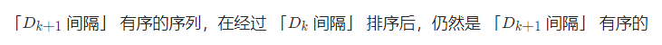

  **增量序列**的选择会极大地影响希尔排序的效率。本例中，我们采用的增量序列为 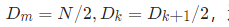这个序列正是当年希尔发表此算法的论文时选用的序列，所以也被称之为**希尔增量序列**。
  
* ```java
  public static void shellSort(int[] arr) {
      // 间隔序列，在希尔排序中我们称之为增量序列
      for (int gap = arr.length / 2; gap > 0; gap /= 2) {
          // 从 gap 开始，按照顺序将每个元素依次向前插入自己所在的组
          for (int i = gap; i < arr.length; i+=gap) {
              // currentNumber 站起来，开始找位置
              int currentNumber = arr[i];
              // 该组前一个数字的索引
              int preIndex = i - gap;
              while (preIndex >= 0 && currentNumber < arr[preIndex]) {
                  // 向后挪位置
                  arr[preIndex + gap] = arr[preIndex];
                  preIndex -= gap;
              }
              // currentNumber 找到了自己的位置，坐下
              arr[preIndex + gap] = currentNumber;
          }
      }
  }
  ```

  

### 堆排序

* 时间复杂度是O（nlogn）最好最坏平均都是。【n-1次向下调整过程】

* 大顶堆：父节点的值**大于等于**左右孩子节点的值

* 直接将数组映射为堆，数组下标映射完全二叉树的位置【从0开始】

  i位置的左孩子下标 2*i+1,右孩子2*i+2

  父(i-1)/2 （头结点的父还是自己）

  最后一个父节点的下标：n/2 - 1 

* 数组构建堆

  * 将数组从0位置上的数开始不断通过添加数构建大顶堆 O(N*logN)

  * 直接把整个数组构建成堆，然后再对堆进行调整时间复杂度O(N*logN)【从最后一个父节点开始调整】

    ```java
    // 直接将数组作为大顶堆 然后通过从最后一个父节点开始下沉进行调整
            for(int index = n / 2 - 1; index >= 0; index--){
                sink(nums, index, n);
            }
    ```

    

* 维持堆结构的两个操作：sink和swim

  ```java
    /**
       * 插入新结点进堆,并确保堆结构符合大顶堆 自低向上
       * 上浮
       * @param array 对应数组
       * @param index 插入位置 一般为堆中最后一位
       */
      public static void swim(int[] array, int index) {
          //与父节点比较当到达头位置时(index - 1) / 2为0  终止条件：到头位置或者不再比父节点大
          while (array[index] > array[(index - 1) / 2]) {
              //交换元素
              SelectionSort.swap(array, index, (index - 1) / 2);
              //跟新位置
              index = (index - 1) / 2;
          }
      }
  
      /**
       * 调整堆结构符合大顶堆 自顶向下
       * 下层
       * @param array 对应数组
       * @param index 待调整位置，排序时起始为根节点
       * @param size  堆大小
       */
      public static void sink(int[] array, int index, int size) {
          //左孩子坐标    
          int left = 2 * index + 1;
          //当前位置有孩子时
          while(left < size){ 
              //左右孩子中最大值的索引
              int maxChild = (left + 1) < size && nums[left + 1] > nums[left] ? left + 1 : left;
              //判断是否带交换节点是否已是三者中最大值
              if(nums[maxChild] <= nums[index]){
                  break;
              }else{
                  //进行调整到最大值的位置
              SelectionSort.swap(array, largest, index);
              //更新位置
              index = maxChild;
              //新位置的左孩子
              left = index * 2 + 1;
              }
          }
      }
  ```


#### [1046. 最后一块石头的重量](https://leetcode-cn.com/problems/last-stone-weight/)

* 使用优先队列【默认为小顶堆，需改造】

* ```java
  class Solution {
      public int lastStoneWeight(int[] stones) {
          if(stones.length == 1) return stones[0];
          // 默认小顶堆 改为大顶堆
          PriorityQueue<Integer> queue = new PriorityQueue<>((a, b) ->{return b - a;});
          
          for(int stone : stones){
              queue.offer(stone);
          }
  
          while(queue.size() >= 2){
              int a = queue.poll();
              int b = queue.poll();
              int cur = Math.abs(a - b);
              if(cur != 0) queue.offer(cur);
          }
  
          if(!queue.isEmpty()) return queue.poll();
          else return 0;
      }
  }
  ```


#### **BM46** **最小的K个数**

* 优先队列（C++默认大顶堆）

  ```c++
  class Solution {
  public:
      vector<int> GetLeastNumbers_Solution(vector<int> input, int k) {
          
          vector<int> res;
          if(input.size() < k) return res;
          // 元素类型、底层容器、比较器
          priority_queue<int,vector<int>, greater<int>> pq;
          for(auto num : input){
              pq.push(num);
          }
  
          for(int i = 0; i < k; i++){
              res.push_back(pq.top());
              pq.pop();
          }
          return res;
      }
  };
  ```

* 快速选择：

  ```c++
  class Solution {
  public:
      // 基准值定位【start左边数小于等于nums[start]，右边数大于等于nums[start]】
      int getMiddle(vector<int>& nums, int start, int end){
          int privot = nums[start];
          while(start < end){
              while(start < end && nums[end] >= privot){
                  end--;
              }
              nums[start] = nums[end];
              while(start < end && nums[start] <= privot){
                  start++;
              }
              nums[end] = nums[start];
          }
          nums[start] = privot;
          return start;
      }
      vector<int> GetLeastNumbers_Solution(vector<int> input, int k) {
          vector<int> res;
          if(input.size() < k || k <= 0) return res;
          // start、end约定了基准值定位的范围
          int start = 0;
          int end = input.size() - 1;
          int index = getMiddle(input, start, end);
          
          // 直到完成第k个数的基准值定位
          while(index != (k-1)){
              if(index < (k-1)){
                  // 右区间是新的基准定位范围
                  start = index + 1;
                  index = getMiddle(input, start, end);
              }else{
                  end = index - 1;
                  index = getMiddle(input, start, end);
              }
          }
  
          for(int i = 0; i < k; i++){
              res.push_back(input[i]);
          }
          return res;
      }
  };
  ```


#### **数据流中的中位数**

* **中位数可想到大小堆配合**取出

* 用两个推保存数据，保持两个堆的数据保持平衡（元素个数相差不超过1）大顶堆存放的数据要比小顶堆的数据小当两个推中元素为偶数个，将新加入元素加入到大顶堆，如果要加入的数据，比小顶堆的最小元素大，先将该元素插入小顶堆，然后将小顶堆的最小元素插入到大顶堆。当两个推中元素为奇数个，将新加入元素加入到小顶堆，如果要加入的数据，比大顶堆的最大元素小，先将该元素插入大顶堆，然后将大顶堆的最大元素插入到小顶堆。

* ```c++
  class Solution {
  public:
      priority_queue<int> left; // 左侧大顶堆
      priority_queue<int, vector<int>, greater<int>> right; // 右侧小顶堆
  
      // 插入时维持二者结构：数目相差不超过1，左侧不大于右侧
      void Insert(int num) {
          // 偶数加入大顶堆【保证数目相差】
          if(((left.size() + right.size()) & 1 )== 0){
              // 判断是否破坏结构
              if(!right.empty() && num > right.top()){
                  // 破坏结构则加入该加入的堆，再从堆中取出数加入本该加入的堆
                  right.push(num);
                  left.push(right.top());
                  right.pop();
              }else{
                  left.push(num);
              }
          }else{
              if(!left.empty() && num < left.top()){
                  left.push(num);
                  right.push(left.top());
                  left.pop();
              }else{
                  right.push(num);
              }
          }
      }
  
      double GetMedian() { 
          if(left.size() == right.size()){
              return (left.top() + right.top()) / 2.0;
          }else if(left.size() > right.size()){
              return left.top();
          }else{
              return right.top();
          }
      }
  
  };
  ```

* 


### 基数排序

* 根据**键值的每位数字来分配桶；**
* 

### 计数排序

https://zhuanlan.zhihu.com/p/137576551

* **每个桶只存储单一键值**

* 以空间换时间，**不基于比较**的排序算法。

* 对于待排序序列，获取元素的上限值和下限值，创建一个统计数组，数组长度为元素值的范围长度【即上限值-下限值+1】，然后遍历序列统计对应值的元素个数，最后取出统计数组中对应个数的值即可。

* 如： 给70亿人年龄[排序](https://www.nowcoder.com/jump/super-jump/word?word=排序)要用什么[算法](https://www.nowcoder.com/jump/super-jump/word?word=算法)啊

  创建int[120]，统计每个年龄的人数，然后再取出即可。


### 桶排序

#### 原理

* **每个桶存储一定范围的数值；**

* 桶排序是计数排序的扩展版本，计数排序可以看成**每个桶只存储相同元素**，而桶排序每个桶（桶的类型视情况而定）存储一定范围的元素，通过**映射函数(常实现了间接的桶间排序)**，将待排序数组中的元素映射到各个对应的桶中，对每个桶中的元素进行排序（有可能再使用别的排序算法或是以递回方式继续使用桶排序进行排序，也可能不需要排序，视情况而定），再通过一定的算法，将桶中的数据提出出来并转换成有序数组。
* **桶排序需要尽量保证元素分散均匀，否则当所有数据集中在同一个桶中时，桶排序失效。**

感觉桶排序最主要的是思想，即将各个元素映射到不同的桶中，通过映射规则和对桶内元素进行相关操作来间接完成某些问题。

#### 步骤

1. 假设待排序的一组数统一的分布在一个范围中，并将这一范围划分成几个子范围，也就是桶
2. 将待排序的一组数，分档规入这些子桶，并对桶中数据进行操作。
3. 将各个桶中的数据有序的合并起来

#### 代码实现

```java
    public void bucketSort(int[] nums){
        //数据放入的桶号
        int index;
        //用list创建桶
        List[] buckets = new ArrayList[10];
        //初始化
        for(int i =0;i<buckets.length;i++){
            buckets[i]=new ArrayList<Integer>();
        }
        //将待排序序列放入对应桶中
        for(int i = 0;i<nums.length;i++){
            //这里的映射函数为/10，这样就让在桶号小内元素必定小于桶号大内元素，实现桶间排序
            //为了将元素均匀分散和应对不同问题，不同情况选择不同的映射函数
            index=nums[i]/10;
            buckets[index].add(nums[i]);
        }
        //对桶内元素排序 这里用系统自带的默认快排
        for(int i = 0;i<buckets.length;i++){
            buckets[i].sort(null);
        }
```

* 另一种桶排序代码


```java
/**
 *
 * @param nums 待排序数组
 * @param max  数组nums中最大值+1
 */
public void bucketSort(int[] nums, int max) {
    int i, j;
    //建立桶
    int[] buckets = new int[max];
    //统计桶中元素的个数（类型将待排序列元素放入对应桶中）
    for (i = 0; i < nums.length; i++) {
        buckets[nums[i]]++;
    }
    //排序
    for (i = 0, j = 0; i < max; i++) {
        while (buckets[i] > 0) {
            nums[j] = i;
            j++;
            buckets[i]--;
        }
    }
}
```

#### 相关例题

##### [347. 前 K 个高频元素](https://leetcode-cn.com/problems/top-k-frequent-elements/)

* 首先用哈希表统计频率，key为元素值，value为频率。
* 然后创建list数组，将频率作为数组下标，这样频率高的就在数组的尾部，频率相同的在同一下标下的list中。
* 倒序遍历list数组，取出数组下标对应list中的数值到返回数组中。

```java
    public int[] topKFrequent(int[] nums, int k) {
        int[] result = new int [k];
        // 使用map，统计每个元素出现的次数，元素为键，元素出现的次数为值
        HashMap<Integer,Integer> map = new HashMap();
        for(int num : nums){
            //当前元素出现过时 频率加一
            if (map.containsKey(num)) {
                map.put(num, map.get(num) + 1);
            } else {
                map.put(num, 1);
            }
        }

        //桶排序
        //将频率作为数组下标，对于出现频率不同的数字集合，存入对应的数组下标
        List<Integer>[] list = new List[nums.length+1];
        for(int key : map.keySet()){
            // 获取出现的次数作为下标
            int i = map.get(key);
            if(list[i] == null){
                list[i] = new ArrayList();
            }
            //添加频率对应得数值
            list[i].add(key);
        }

        // 倒序遍历数组获取出现顺序从大到小的排列
        for(int i = list.length - 1;i >= 0 && k>0;i--){
            if(list[i] == null) continue;
            //将当前频率对应得数值添加进返回数组
            for(int j = 0;j<list[i].size();j++){
                result[k-1]=list[i].get(j);
                k--;
            }
            
        }
        return result;
    }
```

* C++

  ```c++
  class Solution {
  public:
      vector<int> topKFrequent(vector<int>& nums, int k) {
          // 桶数组 统计对应频率所持有的数字
          vector<vector<int>> buckets(nums.size() + 1, vector<int>()); // 临时对象进行初始化
          // key数字，value频率
          unordered_map<int,int> numTimes;
          // 统计数字出现频率
          for(auto num : nums){
              if(numTimes.find(num) != numTimes.end()){
                  numTimes[num]++;
              }else{
                  numTimes[num] = 1;
              }
          }
          // 将对应数字放入对应桶中
          for(auto entry : numTimes){
              buckets[entry.second].push_back(entry.first);
          }
  
          vector<int> res;
          // 从后往前遍历即高频率先加入 todo 迭代器实现
          for(auto i = buckets.crbegin(); i != buckets.crend() && k != 0; i++){
              for(auto num : (*i)){
                  res.push_back(num);
                  k--;
                  if(k == 0) break;
              }
          }
          return res;
      }
  };
  ```

* 小根堆解法：

  ```c++
  class Solution {
  public:
      // 类中的比较函数故需加static 避免无法获取 greater为小根堆
      static bool comp(pair<int,int>& a, pair<int,int>& b){
          return a.second > b.second;
      }
      vector<int> topKFrequent(vector<int>& nums, int k) {
          // 数字对应频率
          unordered_map<int, int> numTimes;
          for(auto& num : nums){
              numTimes[num]++;
          }
          // 使用decltype获取函数类型 
          priority_queue<pair<int,int>, vector<pair<int,int>>, decltype(&comp)> pq(comp);
          for(auto& entry : numTimes){
              // 保持小根堆内个数一定
              if(pq.size() == k){
                  if(pq.top().second < entry.second){ // 是否有频率更高的可以顶替
                      pq.pop();
                      pq.emplace(entry);
                  }
              }else{
                  pq.emplace(entry);
              }
          }
          vector<int> res;
      
          while(!pq.empty()){
              res.emplace_back(pq.top().first);
              pq.pop();
          }
          return res;
      }
  };
  
  ```

  

##### [451. 根据字符出现频率排序](https://leetcode-cn.com/problems/sort-characters-by-frequency/)

* 与347类似，使用桶排序思路，这里的桶为list集合

* 因为字符串无特殊字符，使用整型数组new int[128]统计各字符出现个数，数组下标表示哪个字符，对应元素表示出现个数。

  遍历字符串通过charAt()得到各个字符，将字符对应索引的元素值加1

* 根据字符出现个数将字符放入对应的桶中即放入对应的list中，

  list数组中的下标表示字符出现个数，list中的内容即对应字符。

* 这样倒序遍历list数组即可出现频率降序的字符序列。

```java
    public String frequencySort(String s) {
        int[] temp = new int[128];
        //使用整型数组统计各字符出现个数
        for (int i = 0; i < s.length(); i++) {
            temp[s.charAt(i)]+=1;
        }
        //最大频率为s.length 故数组长度为s.length+1，确保有s.length的下标
        List<Character>[] list = new List[s.length() + 1];
        //根据字符出现个数将字符放入对应的桶中
        for(int i = 0;i<temp.length;i++){
            if(temp[i]==0) continue;
            if(list[temp[i]]==null){
                list[temp[i]]=new ArrayList<>();
            }
            list[temp[i]].add((char)i);
            
        }
        StringBuffer stringBuffer = new StringBuffer();
        //倒序遍历list数组
        for (int i = list.length-1; i >= 0; i--) {
            if(list[i]!=null){
                //拼接集合中每个字符
                for (Character character : list[i]) {
                    //拼接重复字符 i为集合中对应的字符个数
                    for(int j =0;j<i;j++){
                        stringBuffer.append(character);
                    }
                }
            }
        }
        return stringBuffer.toString();
    }
```

##### [75. 颜色分类](https://leetcode-cn.com/problems/sort-colors/)

题解

* 题目数组内只有0、1、2三个元素，并要求对数组排序
* 我们可以用三个桶分别统计0、1、2的个数，并依次取出即可

```java
    public void sortColors(int[] nums) {
        //桶是数组形式 0号索引桶存放数值为0的元素个数
        int [] bucket = new int [3];
        //统计桶内对应元素的个数
        for(int i =0;i<nums.length;i++){
            //映射函数为 nums[i]%3
            bucket[nums[i]%3]+=1;
        }
        //输出桶内对应的元素
        for(int i = 0,j=0;i<nums.length;){
            //桶内元素个数大于0才输出
            if(bucket[j]>0){
                nums[i]=j;
                bucket[j]-=1;
                i++;
            }
            //此时桶内无元素，跳过当前桶
            if(bucket[j]==0){
                j++;
            }
            
        }
    }
}
```


### 排序算法的稳定性

* 定义：假定在待排序的记录序列中，存在多个具有**相同的关键字**的记录，若经过排序，这些记录的**相对次序保持不变**，则称**这种排序算法是稳定的；否则称为不稳定的。**

* **冒泡排序**中，只有左边的数字大于右边的数字时才会发生交换，**相等的数字之间不会发生交换**，所以它是**稳定的**。

  **选择排序**中，**最小值和首位交换的过程可能会破坏稳定性**。比如数列：[2, 2, 1]，在选择排序中第一次进行交换时，原数列中的两个 2 的相对顺序就被改变了。

  **插入排序**的过程**不会破坏原有数组中相同关键字的相对次序**，因为**只有比新插入的数字大的数字会后移**，所以插入排序是一种**稳定的排序算法**。

  虽然插入排序是稳定的排序算法，但**希尔排序是不稳定**的。在**增量较大时**，排序过程可能会**破坏原有数组中相同关键字的相对次序**。

  **快速排序不稳定、归并稳定**

  当然，**算法的稳定性与具体的实现有关。**在修改比较的条件后，**稳定性排序算法可能会变成不稳定的**。所以分析算法的稳定性时，需要**结合具体的实现逻辑才能得出结论**，我们通常所说的算法稳定性是**基于一般实现而言**的。

* 意义：当要**排序的内容**是一个对象的**多个属性**，且其**原本的顺序存在意义时**，如果我们需要**在二次排序后保持原有排序的意义**，就需要使用到稳定性的算法。

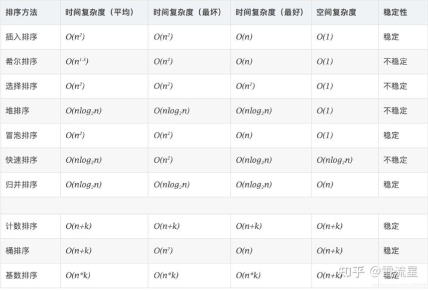


## 搜索算法

* 深度优先搜索和广度优先搜索是两种最常见的优先搜索方法，它们被广泛地运用在图和树等 结构中进行搜索。

### BFS和DFS的比较及使用场景

* 空间占用上：BFS因为**需保存搜索过程中的状态**，一般需要一个队列来记录而一般**DFS无需保存搜索过程中的状态**，所以在空间占用上DFS相比BFS更有优势。
* BFS搜索过程中天然地**带有根节点到达当前节点的最短路径**，故适合**查找最值相关的问题。**【最短路径问题】
* DFS则适合**搜索全部的解或者找到解即可**。【是否可达问题】

### 深度优先搜索

* 深度优先搜索（depth-first seach，DFS）在搜索到一个新的节点时，立即对该新节点进行遍历（搜索）；因此**遍历需要用先入后出的栈来实现，也可以通过与栈等价的递归来实现**。对于树结构而言， 由于总是对新节点调用遍历（搜索），因此看起来是向着**“深”**的方向前进。
* DFS从root节点开始，**尽可能深（对应的边界条件）的搜索每一个分支**（**把一个分支的结果搜索完，再会看下一个分支**）


**DFS主要应用于二叉树和图的搜索**

例子：走迷宫

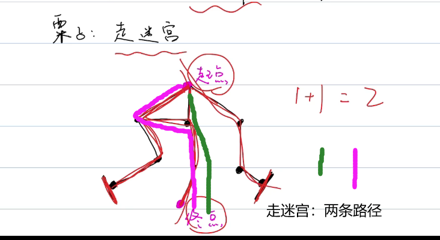

求子集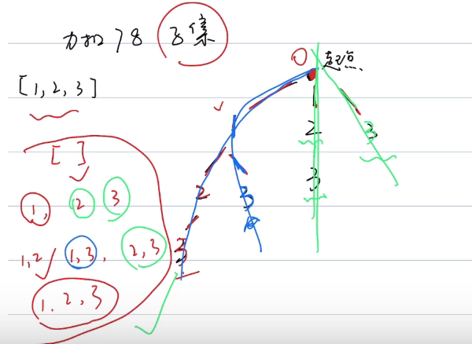

#### 例题

##### [695. 岛屿的最大面积](https://leetcode-cn.com/problems/max-area-of-island/)

* 此题是十分标准的搜索题，我们可以拿来练手深度优先搜索。一般来说，**深度优先搜索类型 的题可以分为主函数和辅函数**，**主函数用于遍历所有的搜索位置**，判断是否可以开始搜索，如果 可以即在辅函数进行搜索。辅**函数则负责深度优先搜索的递归调用。**
* 当然，我们**也可以使用栈 （stack）实现深度优先搜索**，但因为栈与递归的调用原理相同，而**递归相对便于实现**，因此刷题时笔者推荐使用递归式写法，同时也方便进行回溯（见下节）。不过在实际工程上，直接使用栈可 能才是最好的选择，一是因为便于理解，二是更不易出现递归栈满的情况。
* 在辅函数里，一个一定要注意的点是**辅函数内递归搜索时，边界条件的判定。**边界判定一般 有两种写法，**一种是先判定是否越界，只有在合法的情况下才进行下一步搜索（即判断放在调用 递归函数前）**；另一种是不管三七二十一先进行下一步搜索，待下一步搜索开始时再判断是否合 法（**即判断放在辅函数第一行**）。我们这里分别展示这两种写法。

**题解**

* 我们想知道二维数组每个连通形状的面积，然后取最大值。
* 如果我们在每一个元素上，以 4 个方向探索与之相连的每一个元素（以及与这些元素相连的元素），那么探索过的元素总数将是该连通形状的面积。
* 重要的沉岛思想：**为了确保每个元素访问不超过一次，我们每次经过一块元素时，将这块元素的值置为0。这样我们就不会多次访问同一元素。**
* **深度优先搜索：这里的遍历最大“深度”（抽象化）即遇到结果为0的元素。分支有四个，分别是上下左右四个。**

```java
    //主函数
    public int maxAreaOfIsland(int[][] grid) {
        if(grid.length==0||grid[0].length==0) return 0;
        int max = 0;
        for (int i = 0; i < grid.length; i++) {
            for (int j = 0; j < grid[i].length; j++) {

                if (grid[i][j] == 1) {
                    max = Math.max(max, dfs2(grid, i, j));
                }
            }
        }
        return max;
    }
    //第一种辅函数
    public int dfs1(int[][] grid, int index1, int index2) {
        if(grid[index1][index2] == 0) return 0;
        //沉岛 这里不会对其他岛屿产生影响 因为某个为1的元素只属于一个岛屿不会属于多个岛屿
        grid[index1][index2] = 0;
        int count = 1;
        //递归深度搜索
        if(index2-1>=0)
            count += dfs1(grid, index1, index2 - 1);
        if(index2+1<grid[0].length)
            count += dfs1(grid, index1, index2 + 1);
        if(index1-1>=0)
            count += dfs1(grid, index1 - 1, index2);
        if(index1+1<grid.length)
            count += dfs1(grid, index1 + 1, index2);
        return count;
    }
```


##### [638. 大礼包](https://leetcode-cn.com/problems/shopping-offers/)

* 将单件商品的售卖也当成礼包，然后dfs搜索所有可能的礼包组合【注意礼包个数的限制】
* todo 记忆化搜索

```java
class Solution {
    // 记录每个礼包所能购买的最大次数
    Map<Integer,Integer> maxTimes;
    // 礼包集
    List<List<Integer>> specials;
    // 记录所需购买物品数 和 礼包数
    int n,m;
    // 记录最低价格
    int res = Integer.MAX_VALUE;
    public int shoppingOffers(List<Integer> price, List<List<Integer>> special, List<Integer> needs) {
        // 初始化
        maxTimes = new HashMap<>();
        specials = special;
        List<Integer> temp = new ArrayList<>();
        n = price.size();

        // 将单件商品也当成礼包 
        for(int i = 0;i < n;i++) temp.add(0);
        for(int i = 0;i < n;i++){
            List<Integer> clone = new ArrayList<>(temp);
            clone.set(i,1);
            clone.add(price.get(i));
            specials.add(clone);
        }
        m =specials.size();

        // 获取每个礼包最大购买次数
        for(int i = 0;i < m;i++){
            int min = Integer.MAX_VALUE;
            for(int j = 0;j < n;j++){
                int need = needs.get(j);
                int have = specials.get(i).get(j);
                if(need == 0 || have == 0) continue;
                // Math.min(某个商品的需要个数/礼包中该商品的个数)即为礼包最大购买次数
                min = Math.min(min,need/have);
            }
            // 特殊情况考虑：礼包 或 需求 里全为0 
            if(min == Integer.MAX_VALUE) min = 0;
            maxTimes.put(i,min);
        }

        dfs(0,needs,0);
        return res;
    }

    // 暴力搜索 所有礼包组合和不同的礼包个数 取得总价最小值
    // index：当前待组合的礼包下标
    // needs：所需要的商品数
    // cur：当前礼包组合
    private void dfs(int index, List<Integer> needs, int cur){
        // 剪枝
        if(cur >= res) return;

        // base case 以取完最后一个礼包
        if(index == m){
            // 验证是否还有商品需要 如果还有则 该组合不行
            for(int i = 0; i < n;i++){
                if(needs.get(i)!=0) return;
            }
            res = Math.min(cur,res);
            return;
        }

        // 获取当前待组合礼包
        List<Integer> curSpecial = specials.get(index);

        // 尝试取当前待组合礼包的所有可能的个数 和 后面的礼包进行组合
    out:for(int times = 0;times <= maxTimes.get(index);times++){
            List<Integer> temp = new ArrayList<>(needs);

            // 更新需要的商品数量
            for(int i = 0;i < n;i++){
                int need = needs.get(i);
                int have = curSpecial.get(i)*times;
                // 买times个数礼包对应的商品个数大于需要的商品个数 直接break 即大于该个数的礼包都不能需要了 直接往最外层break
                if(have > need) break out;
                temp.set(i,need-have);
            }
            // 尝试 当前个数的礼包 与 下一个礼包进行组合 并更新总价
            dfs(index+1,temp,times*curSpecial.get(n)+cur);
        }


    }
}
```


##### [240. 搜索二维矩阵 II](https://leetcode-cn.com/problems/search-a-2d-matrix-ii/)

* 相当于遍历了所有元素，只是通过剪枝规避了遍历过的元素 时间复杂度O(mn)

```java
class Solution {
    // dfs加剪枝 
    public boolean searchMatrix(int[][] matrix, int target) {
        int m = matrix.length;
        int n = matrix[0].length;

        boolean[][] used = new boolean[m][n];
        return dfs(matrix,0,0,target,m,n,used);

    }

    public boolean dfs(int[][] matrix,int row,int column,int target,int m,int n,boolean[][] used){
        // 剪枝 根据记忆集和矩阵每行、每列元素递增的特性
        if(row == m || column == n || used[row][column] || matrix[row][column] > target){
            return false;
        }

        if(matrix[row][column] == target) return true;
        used[row][column] = true;

        // 当前元素不满足找以当前元素为左上角的矩阵中的其他元素
        return dfs(matrix,row,column+1,target,m,n,used) || dfs(matrix,row+1,column,target,m,n,used);
    }
}
```


* 每一行都升序，可对每一行进行二分查找，为避免查找完后再判断采用闭区间形式

* 时间复杂度：O(mlogn)。对一行使用二分查找的时间复杂度为 O(logn)，最多需要进行 m 次二分查找。

  空间复杂度：O(1)


```java
class Solution {
    public boolean searchMatrix(int[][] matrix, int target) {
        // 对每一行进行二分查找

        int m = matrix.length;
        int n = matrix[0].length;

        for(int i = 0; i < m; i++){
            int left = 0;
            int right = n-1;
            while(left <= right){
                int middle = left + ((right - left)>>1);
                if(matrix[i][middle] == target) return true;
                else if(matrix[i][middle] < target){
                    left = middle + 1;
                }else if(matrix[i][middle] > target){
                    right = middle - 1;
                }
            }
        }

        return false;
    }
}
```

* 利用行、列元素都递增的特性，可以使用Z字形查找【类似非严格二叉查找树的搜索，右上角为根节点，左子树为左边元素小于根节点，右子树为下边元素大于根节点】
* 时间复杂度O(m+n)，x最多移动m次，y最多移动n次
* 空间复杂度O(1)

```java
class Solution {
    public boolean searchMatrix(int[][] matrix, int target) {
        int m = matrix.length;
        int n = matrix[0].length;
        int x = 0, y = n-1;

        // 搜索范围为右上角和左下角构成的矩形  每次排除一行或一列 超出矩阵范围即表示没有目标数
        while(x < m && y >= 0){
            int cur = matrix[x][y];
            if(cur == target) return true;
            // 排除一行【当前位置前面的数都小于cur 即小于target】
            else if(cur < target) x++;
            // 排除一列【当前位置下面的数都大于cur 即大于target】
            else if(cur > target) y--;
        }

        return false;
    }
}
```


### 记忆化搜索

* 记忆化的考虑：可从**函数签名**考虑如何合理记忆化

#### [416. 分割等和子集](https://leetcode-cn.com/problems/partition-equal-subset-sum/)

* 重点在于如何记忆化，记忆集的定义

* 通过找出什么情况下会出现重复计算，对记忆集进行定义

* 时间复杂度O(n * sum /2)

* 空间复杂度O(n * (sum /2 + 1))

* ```java
  class Solution {
      public boolean canPartition(int[] nums) {
          if(nums.length == 1) return false;
  
          int sum = 0;
          for(int num : nums){
              sum += num;
          }
          // 奇数直接不可分
          if((sum & 1) == 1) return false;
  
          // 记忆集 used[i][j]: 到nums的索引i时 剩余值为j时 是否搜索过 
          // 搜索过 就不必再搜了，必定不能分割 直接返回false， 因为可以分割并不会记录到记忆集中
          boolean[][] used = new boolean[nums.length][(sum >> 1) + 1];
          return dfs(nums, sum >> 1, 0, used);
      }
  
      // 深搜数组 判断是否能分割等和子集
      // 表示是否存在：从nums数组的[index, nums.size()-1]区间找一些数，使其和为sum
      private boolean dfs(int[] nums, int sum, int i, boolean[][] used){
          if(sum == 0){
              return true;
          }
          if(sum > 0 && i < nums.length){
              // 剪枝 减少重复计算
              if(used[i][sum]) return false;
              // 深搜
              boolean use = dfs(nums, sum - nums[i], i + 1, used);
              boolean unuse = dfs(nums, sum, i + 1, used);
              used[i][sum] = true;
              return unuse || use;
          }
          return false;  
          
      }
  }
  ```

  

#### [63. 不同路径 II](https://leetcode-cn.com/problems/unique-paths-ii/)

* 经典记忆化深搜

* ```java
  class Solution {
      // 记忆集
      int[][] cache;
      public int uniquePathsWithObstacles(int[][] obstacleGrid) {
          int m = obstacleGrid.length;
          int n = obstacleGrid[0].length;
          cache = new int[m][n];
          return pathsWithStart(0, 0, m, n, obstacleGrid);
  
      }
  
      // 函数定义：从(x,y)走到右下角有多少条路劲
      private int pathsWithStart(int x, int y, int m , int n, int[][] obstacleGrid){
          // 越界或无法走通
          if(x >= m || y >= n || obstacleGrid[x][y] == 1){
              return 0;
          }
          // 已经走过
          if(obstacleGrid[x][y] == -1) return cache[x][y];
          /// 到达右小角
          if(x == m - 1 && y == n - 1){
              return 1;
          }
  
          int result = pathsWithStart(x, y + 1, m, n, obstacleGrid) + pathsWithStart(x + 1, y, m, n, obstacleGrid);
          // 原地修改原数组 表示该位置已经走过
          obstacleGrid[x][y] = -1;
          cache[x][y] = result;
          return result;
      }
  }
  ```

* 


### 回溯法

* 回溯法（backtracking）是**优先搜索**的一种特殊情况，又称为试探法，常用于**需要记录节点状态的深度优先搜索。**通常来说，**排列、组合、选择类**问题使用回溯法比较方便。
* 顾名思义，回溯法的核心是回溯。在搜索到某一节点的时候，如果我们发现**目前的节点（及其子节点）并不是需求目标时，我们回退到原来的节点继续搜索**，并且把在**目前节点修改的状态还原。**
* 在具体的写法上，它与普通的深度优先搜索一样，都有[修改当前节点状态]→[递归子节 点] 的步骤，只是多了回溯的步骤，变成了 [修改当前节点状态]→[递归子节点]→[回改当前节点状态]。
* 两个小诀窍，一是按引用传状态，二是所有的状态修改在递归完成后回改。
* 回溯法修改一般有两种情况，一种是**修改最后一位**输出，比如排列组合；一种是**修改访问标记**，比如矩阵里搜字符串

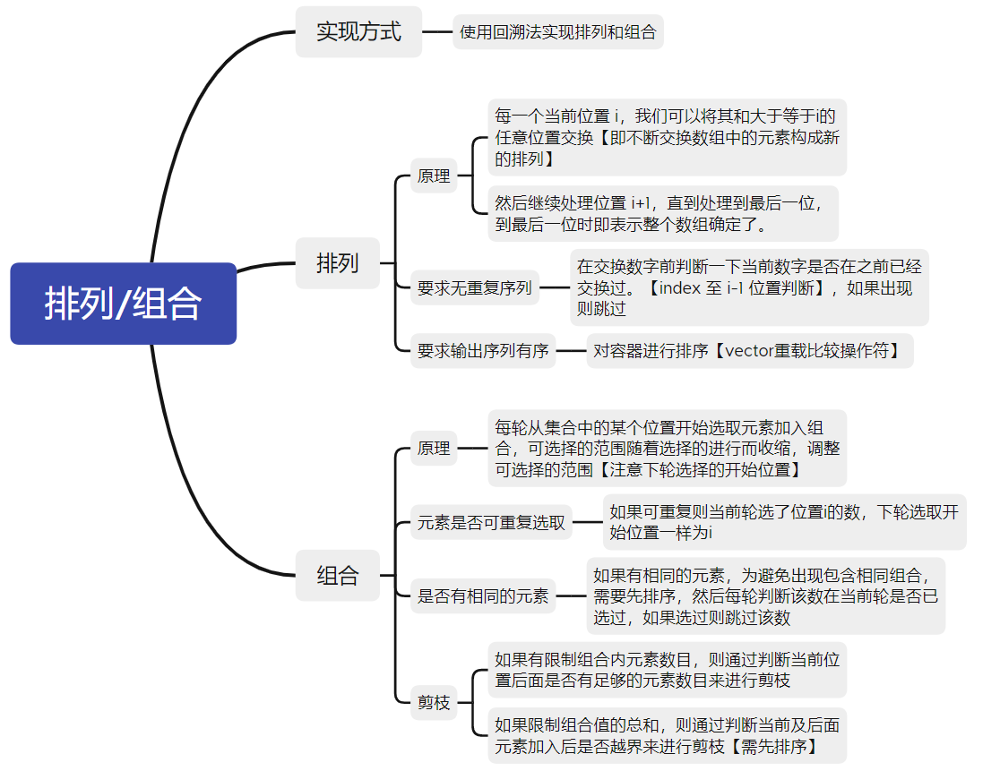

#### 例题

##### [46. 全排列](https://leetcode-cn.com/problems/permutations/)

* 怎样输出所有的排列方式呢？对于**每一个当前位置 i，我们可以将其于之后的任意位置交换**（即不断交换数组中的元素构成新的排列）， 然后继续处理位置 i+1，直到处理到最后一位。为了防止我们每此遍历时都要新建一个子数组储存位置 i 之前已经交换好的数字，我们可以利用**回溯法，只对原数组进行修改（这里的修改为交换元素），在递归完成后再修改回来。（将交换的元素复原，避免影响排列结果）**
* 从后往前改，改到不能改时就加入结果集中

```java
    public List<List<Integer>> permute(int[] nums) {
        List<List<Integer>> result = new ArrayList<>();
        backTracking(nums,0,result);
        return result;
    }
	// 从level处开始交换到末尾 并将所有交换结果加入结果集中
    public void backTracking(int[] nums,int level,List<List<Integer>> result){
        if(level == nums.length-1){
            List<Integer> array = new ArrayList<>();
            for(int i = 0;i<nums.length;i++){
                array.add(nums[i]);
            }
            //将当前排列结果添加集合中
            result.add(array);
            return ;
        }
        for(int i =level;i<nums.length;i++){
            //修改当前节点状态
            swap(nums,i,level);
            //递归子节点
            backTracking(nums,level+1,result);
            //恢复当前节点状态
            swap(nums,i,level);
        }
    }
    public void swap(int[] nums ,int a, int b){
        int temp=nums[b];
        nums[b]=nums[a];
        nums[a]=temp;
    }
```

c++版：

```c++
class Solution {
public:
    // 当前正在确定第index个数 前面的数已经确定了，第index个数可通过与后面的数交换确定
    void dfs(vector<vector<int>>& res, vector<int>& num, int index){
        if(index == num.size() - 1){
            // 数据发生拷贝
            res.push_back(num);
            return;
        }
        for(int i = index; i < num.size(); i++){
            // 通过引用传递进行交换
            swap(num[i], num[index]);
            dfs(res, num, index + 1);
            swap(num[i], num[index]);
        }
        
    }
    vector<vector<int> > permute(vector<int> &num) {
        vector<vector<int> > res;
        // 如果输出序列需按字典序
        sort(num.begin(), num.end())
        dfs(res, num, 0);
        return res;
    }
};
```


代码二：

```java
import java.util.ArrayList;
import java.util.List;


public class Solution {

    public List<List<Integer>> permute(int[] nums) {
        int len = nums.length;
        // 使用一个动态数组保存所有可能的全排列
        List<List<Integer>> res = new ArrayList<>();
        if (len == 0) {
            return res;
        }

        boolean[] used = new boolean[len];
        List<Integer> path = new ArrayList<>();

        dfs(nums, len, 0, path, used, res);
        return res;
    }

    private void dfs(int[] nums, int len, int depth,
                     List<Integer> path, boolean[] used,
                     List<List<Integer>> res) {
        if (depth == len) {
            res.add(new ArrayList(path));
            return;
        }

        // 在非叶子结点处，产生不同的分支，这一操作的语义是：在还未选择的数中依次选择一个元素作为下一个位置的元素，这显然得通过一个循环实现。
        for (int i = 0; i < len; i++) {
            if (!used[i]) {
                path.add(nums[i]);
                used[i] = true;

                dfs(nums, len, depth + 1, path, used, res);
                // 注意：下面这两行代码发生 「回溯」，回溯发生在从 深层结点 回到 浅层结点 的过程，代码在形式上和递归之前是对称的
                used[i] = false;
                path.remove(path.size() - 1);
            }
        }
    }

    public static void main(String[] args) {
        int[] nums = {1, 2, 3};
        Solution solution = new Solution();
        List<List<Integer>> lists = solution.permute(nums);
        System.out.println(lists);
    }
}
```

##### [77. 组合](https://leetcode-cn.com/problems/combinations/)

* **每次从集合中选取元素，可选择的范围随着选择的进行而收缩，调整可选择的范围**。

* 画图理解:

  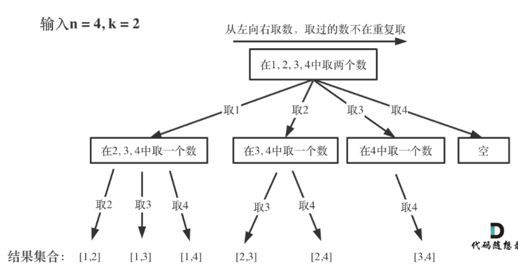

```java
class Solution {
public:
    // 每轮取某个位置的数加入组合中 为避免排列和同位置数出现多次 下轮时只能取后面位置的数
    void backStracking(vector<vector<int>>& res, vector<int>& temp, int n, int k, int curIndex){
        if(temp.size() == k){
            res.push_back(temp);
            return;
        }
        // for(int i = curIndex; i <= n; i++){
        //     temp.push_back(i);
        //     backStracking(res, temp, n, k, i + 1);
        //     temp.pop_back();
        // }
        // 剪枝 确保后面有足够数量的加入组合
        for(int i = curIndex; i <= n - (k - temp.size()) + 1; i++){
            temp.push_back(i);
            backStracking(res, temp, n, k, i + 1);
            temp.pop_back();
        }
    }
    vector<vector<int>> combine(int n, int k) {
        vector<vector<int>> res;
        vector<int> temp;
        backStracking(res, temp, n, k, 1);
        return res;
    }
};
```

##### [79. 单词搜索](https://leetcode-cn.com/problems/word-search/)

题解

* 因为找字符串中的下一个字符只能在当前字符的相邻字符中查找，而相邻的字符有四个方向：上下左右，因此我们可以分别对这四个方向递归查找下一个字符，直到找完所有字符为止。
* 对于当前找到的字符我们需修改状态，避免在后面的深层递归被重复使用，递归完成，我们需复原状态，并返回递归结果。

```java
public boolean exist(char[][] board, String word) {
    char[] words = word.toCharArray();
    for (int i = 0; i < board.length; i++) {
        for (int j = 0; j < board[0].length; j++) {
            if (backStracking(board, 0, words, i, j))
                return true;
        }
    }
    return false;
}

public boolean backStracking(char[][] board, int count, char[] words, int i, int j) {
    //判断是否越界 和 当前字符是否为所需的第count个字符
    if (i < 0 || i >= board.length || j < 0 || j >= board[0].length || board[i][j] != words[count]) {
        return false;
    }
    //当前字符为最后一个字符 表示找到字符串 返回true
    if (count == words.length - 1) return true;
    //避免重复访问 修改当前字符的 也可以二维布尔数组保存状态
    char temp = board[i][j];
    board[i][j] = '.';
    boolean res = backStracking(board, count + 1, words, i - 1, j) || backStracking(board, count + 1, words, i + 1, j) || backStracking(board, count + 1, words, i, j - 1) || backStracking(board, count + 1, words, i, j + 1);
    //递归之后，回溯复原字符
    board[i][j] = temp;
    return res;
}
```

##### [51. N 皇后](https://leetcode-cn.com/problems/n-queens/)

小技巧：记住已经摆放的皇后的位置
这里记住已经摆放的位置不能像 Flood Fill 一样，简单地使用 visited 布尔数组。放置的规则是：一行一行考虑皇后可以放置在哪一个位置上，某一行在考虑某一列是否可以放置皇后的时候，需要根据前面已经放置的皇后的位置。

由于是一行一行考虑放置皇后，摆放的这些皇后肯定不在同一行，为了避免它们在同一列，需要一个长度为 NN 的布尔数组 cols，已经放置的皇后占据的列，就需要在对应的列的位置标注为 True。

考虑对角线（找规律）
下面我们研究一下主对角线或者副对角线上的元素有什么特性。在每一个单元格里写下行和列的 下标。


为了保证至少两个皇后不同时出现在 同一主对角线方向 或者 同一副对角线方向。检查策略是，只要「检测」到新摆放的「皇后」与已经摆放好的「皇后」冲突，就尝试摆放同一行的下一个位置，到行尾还不能放置皇后，就退回到上一行。

```java
    private int n;
    /**
     * 记录某一列是否放置了皇后
     */
    private boolean[] col;
    /**
     * 记录主对角线上的单元格是否放置了皇后
     */
    private boolean[] main;
    /**
     * 记录了副对角线上的单元格是否放置了皇后
     */
    private boolean[] sub;
    private List<List<String>> res;

    public List<List<String>> solveNQueens(int n) {
        res = new ArrayList<>();
        if (n == 0) {
            return res;
        }

        // 设置成员变量，减少参数传递，具体作为方法参数还是作为成员变量，请参考团队开发规范
        this.n = n;
        this.col = new boolean[n];
        this.main = new boolean[2 * n - 1];//存在2*n-1条对角线
        this.sub = new boolean[2 * n - 1];
        //储存皇后放列号
        Deque<Integer> path = new ArrayDeque<>();
        //从第0行开始找
        dfs(0, path);
        return res;
    }

    private void dfs(int row, Deque<Integer> path) {
        //找到一个摆放方案
        if (row == n) {
            // 深度优先遍历到下标为 n，表示 [0.. n - 1] 已经填完，得到了一个结果
            List<String> board = convert2board(path);
            res.add(board);
            return;
        }

        // 针对行下标为 row 的每一列，尝试是否可以放置
        for (int j = 0; j < n; j++) {
            //判断所在行，所在对角线是否有皇后 剪枝
            if (!col[j] && !main[row - j + n - 1] && !sub[row + j]) {
                //添加到队列末尾
                path.addLast(j);
                col[j] = true;
                main[row - j + n - 1] = true;
                sub[row + j] = true;

                //在下一行 找位置放皇后
                dfs(row + 1, path);
                //回溯操作
                sub[row + j] = false;
                main[row - j + n - 1] = false;
                col[j] = false;
                //移出元素
                path.removeLast();
            }
        }
    }
    //将记录皇后所放列号的双端队列 转为 list
    private List<String> convert2board(Deque<Integer> path) {
        List<String> board = new ArrayList<>();
        for (Integer num : path) {
            StringBuilder row = new StringBuilder();
            //对当前行全置为.
            row.append(".".repeat(Math.max(0, n)));
            //替换列号为num的字符为Q
            row.replace(num, num + 1, "Q");
            //加入当前行
            board.add(row.toString());
        }
        return board;
    }
```

##### [494. 目标和](https://leetcode-cn.com/problems/target-sum/)

//TODO 记忆化搜索

```java
class Solution {

    // dfs 解法 2^n种组合 时间复杂度O(n^2) 画图即可理解
    private int sumValue = 0;
    private int totalValue = 0;
    public int findTargetSumWays(int[] nums, int target) {
        if(nums == null) return target;
        if(nums.length == 1) return nums[0]==target?1:(-nums[0]==target?1:0);

        dfs(nums,0,target);

        return totalValue;
    }


    public void dfs(int[] nums,int index,int target){
        // dfs终止条件 已到最深层
        if(index == nums.length){
           totalValue += (sumValue == target?1:0);
           return;
        }
        sumValue +=nums[index];
        dfs(nums,index+1,target);

        //回溯
        sumValue -=nums[index];

        sumValue -=nums[index];
        dfs(nums,index+1,target);

        //回溯
        sumValue += nums[index];
    }
}
```


##### [212. 单词搜索 II](https://leetcode-cn.com/problems/word-search-ii/)

* 普通dfs 超时....

```java
class Solution {
    private StringBuilder sb = new StringBuilder();
    private List<String> res = new ArrayList<>();
    int maxLength = -1;
    boolean interupt = false;
    // 访问标记 避免重复访问
    boolean[][] visited;
    public List<String> findWords(char[][] board, String[] words) {
        List<String> temp = new ArrayList<>(Arrays.asList(words));
        visited = new boolean[board.length][board[0].length];

        for(String str : temp){
            if(str.length()>maxLength) maxLength = str.length();
        }

        for(int i=0;i<board.length;i++){
            for(int j=0;j<board[0].length;j++){
                dfsWithBack(board,i,j,temp);
                // 这里还要回溯
                sb.deleteCharAt(sb.length()-1);
            }
        }

        return res;
    }
    
    private void dfsWithBack(char[][] board, int i, int j, List<String> temp){
        // base case 
        if(sb.length()>maxLength || visited[i][j]){
            interupt = true;
            return;
        }
        // 添加当前字符
        sb.append(board[i][j]);
        
        // 判断当前字符串是否与单词列表有相符的
        if(temp.contains(sb.toString())){
            // 存在相符的
            // 加入结果集
            res.add(sb.toString());
            temp.remove(sb.toString());
        }

        visited[i][j] = true;

        // 往更深层次递归
        // 上下左右四个方向.. 且需要加上回溯操作【便于回归状态】
        
        if(i-1>=0){
            dfsWithBack(board,i-1,j,temp);
            if(!interupt){
                sb.deleteCharAt(sb.length()-1);
            }
            interupt = false;
        } 

       
        if(j-1>=0){
            dfsWithBack(board,i,j-1,temp);
            if(!interupt){
                sb.deleteCharAt(sb.length()-1);
            }
            interupt = false;
        } 

        
        if(i+1<board.length){
            dfsWithBack(board,i+1,j,temp);
            if(!interupt){
                sb.deleteCharAt(sb.length()-1);
            }
            interupt = false;
        } 

        
        if(j+1<board[0].length){
            dfsWithBack(board,i,j+1,temp);
            if(!interupt){
                sb.deleteCharAt(sb.length()-1);
            }
            interupt = false;
        } 

        // 回溯访问标记 以便不同分支使用这个字母
        visited[i][j] = false;
    }
}
```


* 字典树+dfs解法
  * 字典树可以帮助我们更快的判断某个路径对应的字符串前缀是否在字典中存在，如果是则接着尝试走直到叶子节点，不是则放弃该路径。

```java
class Solution {
    int row;
    int line;

    // LinkedList便于插入 不会因扩容而耗费过多时间
    List<String> res = new LinkedList<>();

    boolean[][] visited;

    public List<String> findWords(char[][] board, String[] words) {
        // 定义矩阵 行列
        row = board.length;
        line = board[0].length;

        // 构造字典树 并插入数据
        WordTrie tree = new WordTrie();
        for(String s : words){
            tree.insert(s);
        }
        TrieNode root = tree.root;

        // 节点的访问标记
        visited = new boolean[row][line];
        
        //遍历整个二维字符数组
        for(int i = 0 ;i<row;i++){
            for(int j = 0; j<line;j++){
                dfsFind(board,i,j,root);
            }
        }

        return res;
    }
    
    private void dfsFind(char[][] board, int i, int j, TrieNode cur){
        // base case 边界判断以及是否已经访问判断
        if(i<0||i>=row||j<0||j>=line || visited[i][j]){
            return ;
        }

        // 走到对应深度对应的字符节点
        cur = cur.child[board[i][j]-'a'];

        // 节点为空表示 该路径对应的字符串不存在字典中 
        if(cur==null){
            return;
        }
        
        // 修改访问标志位 防止重复使用
        visited[i][j] = true;

        // 找到对应的字符串
        if(cur.isEnd){
            res.add(cur.val);
            // 避免出现结果集出现重复字符串
            cur.isEnd = false;
        }
        
        // 往四个方向遍历
        dfsFind(board,i-1,j,cur);
        dfsFind(board,i,j-1,cur);
        dfsFind(board,i,j+1,cur);
        dfsFind(board,i+1,j,cur);

        // 回溯
        visited[i][j] = false;
    }
      /**
     * 字典树
     */
    class WordTrie {
        //创建根节点
        TrieNode root = new TrieNode();

        void insert(String s) {
            TrieNode cur = root;
            for (char c : s.toCharArray()) {
                //判断是否存在该字符的节点，不存在则创建
                if (cur.child[c - 'a'] == null) {
                    cur.child[c - 'a'] = new TrieNode();
                    cur = cur.child[c - 'a'];
                } else
                    cur = cur.child[c - 'a'];
            }
            //遍历结束后，修改叶子节点的状态，并存储字符串
            cur.isEnd = true;
            cur.val = s;
        }
    }

    /**
     * 字典树节点
     */
    class TrieNode {
        /**
         * 存储最后节点的字符串
         */
        String val;
        /**
         * 根据字符排序，[a,b,c,……,z]
         */
        TrieNode[] child = new TrieNode[26];
        /**
         * 是否是最后叶子节点
         */
        boolean isEnd = false;
    }
}
```


##### [282. 给表达式添加运算符](https://leetcode-cn.com/problems/expression-add-operators/)

```java
class Solution {
    List<String> res = new LinkedList<>();
    int n ;
    StringBuilder temp = new StringBuilder();

    // dfs搜索出所有结果 将符合结果的加入结果集中
    // 难点：但当存在 * 时，由于存在运算优先级的问题，我们需要记录形如 a + b * c 中的乘法部分。可通过用sum记录已经求得的总和，同时记录上一个处理的数lastnum来解决
    // //举构造乘法时的三个例子。我们用sum记录已经求得的总和，同时记录上一个处理的数lastnum
    //假设已经构造了2+3，sum=5，lastnum=3，该处理4，这时该添加乘号了，对于已经求得
    //的sum，这时应该减去 3，用这个3去乘4，sum=sum-3+3*4=14，lastnum=12；
    //
    //假设已经构造了2-3，sum=-1，lastnum=-3，该处理4，这时该添加乘号了，对于已经求得
    //的sum，这时应该减去-3，用这个-3去乘4，sum=sum-(-3)+(-3)*4=-10，lastnum=-12；
    //
    //假设已经构造了2*3，sum=6，lastnum=6，该处理4，这时该添加乘号了，对于已经求得
    //的sum，这时应该减去 6，用这个6去乘4，sum=sum-6+6*4=24，lastnum=24；
    //
    // 前导为0时 应该直接放弃
    // 存在大量的字符串拼接操作 使用StringBuilder加快操作
    public List<String> addOperators(String num, int target) {
        n = num.length();
        dfs(num,0,0,0,target);
        return res;
    }

    private void dfs(String num,int index,long sum,long lastNum,long target){
        // base case
        if(index == n) {
            // StringBuilder的toString会创建一个新的字符串对象
            if(sum == target) res.add(temp.toString());
            return;
        }

        // 遍历当前字符开始往后可组成的数字，并根据情况对数字进行四个操作【不插入符号、+、- 和 *】
        for(int i = index;i<n;i++){
            if(i!=index && num.charAt(index)=='0') break;
            long curNum = Long.parseLong(num.substring(index,i+1));
            if(index ==0){
                // 第一个数字不插入符号
                temp.append(curNum);
                dfs(num,i+1,curNum,curNum,target);
                // 回溯
                temp.replace(0,temp.length(),"");
            }else{
                // 非第一个数字需插入符号
                // 去除数字的长度 便于回溯
                int numLength = (i-index+1);
                // +操作
                temp.append("+").append(curNum);
                // 进入递归 取下一个数字
                dfs(num,i+1,sum+curNum,curNum,target);
                // 回溯
                temp.replace(temp.length()-1-numLength,temp.length()-numLength,"-");
                dfs(num,i+1,sum-curNum,-curNum,target);
                temp.replace(temp.length()-1-numLength,temp.length()-numLength,"*");
                dfs(num,i+1,sum-lastNum+lastNum*curNum,lastNum*curNum,target);
                temp.replace(temp.length()-1-numLength,temp.length(),"");
            }
        }
    }
}
```


##### [17. 电话号码的字母组合](https://leetcode-cn.com/problems/letter-combinations-of-a-phone-number/)

```java
class Solution {
    /**
     * 暴力解法：获取出数字对应的字母字符串，然后复制结果集到临时结果集中，同时清空结果集，遍历每个字母 将字母和临时结果集中每个元素组合 然后加入结果集中，注意第一个数字时 直接加数字对应的字母即可
     */
    public List<String> letterCombinations(String digits) {
        Map<Character,String> map = new HashMap<>();
        map.put('2',"abc");
        map.put('3',"def");
        map.put('4',"ghi");
        map.put('5',"jkl");
        map.put('6',"mno");
        map.put('7',"pqrs");
        map.put('8',"tuv");
        map.put('9',"wxyz");

        List<String> res = new ArrayList<>();
        if(digits == null|| digits.length()==0) return res;
        int n = digits.length();

        for(int i = 0 ;i < n;i++){
            if(res.size() == 0){
                String temp =map.get(digits.charAt(i));
                char start = temp.charAt(0);
                char end = temp.charAt(temp.length()-1);
                while(start<=end){
                    res.add(start+"");
                    start++;
                }
            }else{
                List<String> tempRes = new ArrayList<>(res);
                res.clear();
                String temp =map.get(digits.charAt(i));
                char start = temp.charAt(0);
                char end = temp.charAt(temp.length()-1);
                while(start<=end){
                    for(int j = 0;j<tempRes.size();j++){
                        res.add(tempRes.get(j)+start);
                    }
                    start++;
                }
            }
        }
        return res;
    }
}
```


```java
class Solution {
    /**
     * 回溯解法：回溯过程中维护一个字符串，表示已有的字母排列（如果未遍历完电话号码的所有数字，则已有的字母排列是不完整的）。该字符串初始为空。每次取电话号码的一位数字，从哈希表中获得该数字对应的所有可能的字母，并将其中的一个字母插入到已有的字母排列后面，然后继续处理电话号码的后一位数字，直到处理完电话号码中的所有数字，即得到一个完整的字母排列。然后进行回退操作，遍历其余的字母排列。

     */
    List<String> res = new LinkedList<>();
    static final Map<Character, String> map = Map.of(
        '2', "abc", '3', "def", '4', "ghi", '5', "jkl",
        '6', "mno", '7', "pqrs", '8', "tuv", '9', "wxyz"
    );
    public List<String> letterCombinations(String digits) {
        if(digits == null || digits.length() == 0) return res;
        backStracking(new StringBuilder(),digits,0);
        return res;
    }

    private void backStracking(StringBuilder temp,String digits,int index){
        // 临时字符串长度 等于 数字个数 表示此字符串是一个组合结果
        if(index == digits.length()){
            res.add(temp.toString());
            return ;
        }
        char num = digits.charAt(index);
        String words = map.get(num);

        // 拼接该数字对应的每一个字母
        for(int i = 0; i<words.length();i++){
            temp.append(words.charAt(i));
            // 取下一个数字对应的字母
            backStracking(temp,digits,index+1);
            // 回溯
            temp.deleteCharAt(temp.length()-1);
        }
    }
}
```


##### [22. 括号生成](https://leetcode-cn.com/problems/generate-parentheses/)

```java
class Solution {
    // 暴力解法：dfs找出所有可能的括号组合【中间剪枝】，中间判断括号组合是否合法
    public List<String> generateParenthesis(int n) {
        StringBuilder temp = new StringBuilder();
        temp.append('(');
        List<String> res = new ArrayList<>();
        dfs(n,res,1,temp);
        return res;
    }
    // leftNum记录左括号的个数 便于剪枝
    private void dfs(int n,List<String> res,int leftNum, StringBuilder temp){
        // n 个括号对数 对于有效括号组合左括号个数不可能大于n
        if(leftNum > n) return;

        // 递归终止条件
        if(temp.length() == 2*n){
            String bracket = temp.toString();
            // 合法的括号组合直接添加进结果集
            if(isValid(bracket))
                res.add(bracket);
            return ;
        }

        // dfs + 回溯
        temp.append('(');
        dfs(n,res,leftNum+1,temp);
        temp.deleteCharAt(temp.length()-1);
        temp.append(')');
        dfs(n,res,leftNum,temp);
        temp.deleteCharAt(temp.length()-1);
    }

    private boolean isValid(String bracket){
        // 记录括号组合
        Stack<Character> a = new Stack<>();
        // 记录左括号的栈
        Stack<Character> b = new Stack<>();

        // 将括号组合逆序放入栈中，从栈中取出即正序
        int n = bracket.length()-1;
        while(n >= 0){
            a.push(bracket.charAt(n));
            n--;
        }

        // 遍历所有括号
        while(a.size() != 0){
            Character cur = a.pop();
            if(cur == '('){
                b.push(cur);
            }else if(cur == ')'){
                // 无效括号组合情况1：右括号前面找不到匹配的左括号
                if(b.size() == 0) return false;
                else{
                    b.pop();
                }
            }
        }

        // 无效括号组合情况2：左括号后面找不到匹配的右括号
        return b.size() == 0;
    }
}
```

* dfs过程中即可验证括号组合是否有效【从头部构造到尾部都需保证**左括号数不大于n且右括号数小于左括号数**】

  https://leetcode-cn.com/problems/generate-parentheses/solution/sui-ran-bu-shi-zui-xiu-de-dan-zhi-shao-n-0yt3/

```java
class Solution {
    List<String> res;
    public List<String> generateParenthesis(int n) {
        res = new ArrayList<>();
        dfs(n,0,0,new StringBuilder());
        return res;
    }
    
    // left:当前组合前缀中左括号数量【有效的括号组合性质推断每层递归都需保证left >= right 和 left <= n】
    private void dfs(int n,int left,int right,StringBuilder temp){
        if(left > n || left < right) return ;
        if(temp.length() == n*2){
            res.add(temp.toString());
            return;
        }

        temp.append('(');
        dfs(n,left+1,right,temp);
        temp.deleteCharAt(temp.length()-1);
        temp.append(')');
        dfs(n,left,right+1,temp);
        temp.deleteCharAt(temp.length()-1);
    }
}
```

* 再次做：

  ```java
  import java.util.*;
  
  
  public class Solution {
      /**
       * 
       * @param n int整型 
       * @return string字符串ArrayList
       */
      ArrayList<String> result = new ArrayList<>();
      public ArrayList<String> generateParenthesis (int n) {
          // write code here
          backStracking(0, n, new StringBuilder());
          return result;
      }
      
      // 函数定义：已经存储的组合为sb，已有左括号数位leftNums，将目标括号数为nums的合法组合加入结果集，
      private void backStracking(int leftNums, int nums, StringBuilder sb){
          if(sb.length() == nums * 2){ // 边界条件
              if(leftNums == 0) result.add(sb.toString());
              return;
          }
          if(leftNums > 0){ // 存在左括号 左右括号都可以加
              sb.append("(");
              backStracking(leftNums + 1, nums, sb);
              sb.deleteCharAt(sb.length() - 1);
              sb.append(")");
              backStracking(leftNums - 1, nums, sb);
              sb.deleteCharAt(sb.length() - 1);
          }else{ // 无左括号，只能加左括号
              sb.append("(");
              backStracking(leftNums + 1, nums, sb);
              sb.deleteCharAt(sb.length() - 1);
          }
      }
          
  }
  ```

* 更容易理解：

  ```java
  class Solution {
      List<String> result = new ArrayList<>();
      public List<String> generateParenthesis(int n) {
          dfs(n, 0, new StringBuilder(""));
          return result;
      }
  
      private void dfs(int n, int leftNums, StringBuilder sb){
          if(sb.length() == 2 * n){ // base case
              result.add(sb.toString());
              return;
          }
          // 当前右括号数
          int rightNums = sb.length() - leftNums;
  
         if(leftNums < n){ // 可添加左括号的情况
              sb.append('(');
              dfs(n, leftNums + 1, sb);
              sb.deleteCharAt(sb.length() - 1);
         }
  
         if(leftNums > rightNums){ // 可添加右括号的情况
              sb.append(')');
              dfs(n, leftNums, sb);
              sb.deleteCharAt(sb.length() - 1);
         }
  
      }
  }
  ```

  


##### [剑指 Offer 12. 矩阵中的路径](https://leetcode-cn.com/problems/ju-zhen-zhong-de-lu-jing-lcof/)

* dfs解法
* 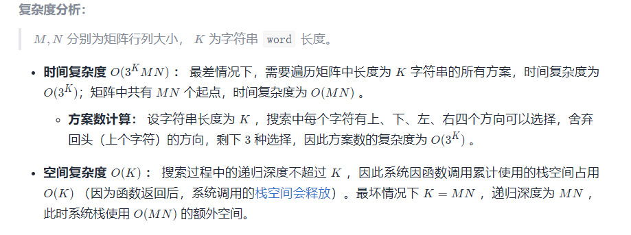

```java
class Solution {
    // boolean[][] used;
    int n,m;
    public boolean exist(char[][] board, String word) {
        if(board.length == 0 || board[0].length == 0) return false;
        n = board.length;
        m = board[0].length;
        // 修改原数组的方案 来 替代使用记忆集
        // used = new boolean[n][m];

        // 对每一个字符进行深搜
        for(int i = 0; i < board.length; i++){
            for(int j = 0; j < board[0].length; j++){
                if(withTotalStart(board,word,0,i,j)) return true;
            }
        }
        return false;
    }

    private boolean withTotalStart(char[][] board, String word, int index, int row, int column){
        
        // 剪枝 越界、当前字符已使用过、当前字符不匹配
        if(row < 0 || column < 0 || row >= n || column >= m || word.charAt(index) != board[row][column]){
            return false;
        }

        // 字符匹配的情况

        // 字符串全部字符匹配
        if(index == word.length() - 1) return true;
        
        // 更改原数组 表示其已使用过
        board[row][column] = '\0';

        // 四个方向深搜
        boolean result = withTotalStart(board,word,index+1,row-1,column) || 
        withTotalStart(board,word,index+1,row+1,column) ||
        withTotalStart(board,word,index+1,row,column-1) ||
        withTotalStart(board,word,index+1,row,column+1);

        // 回溯
        board[row][column] = word.charAt(index);
        return result;
    
    }
}
```


##### [剑指 Offer 13. 机器人的运动范围](https://leetcode-cn.com/problems/ji-qi-ren-de-yun-dong-fan-wei-lcof/)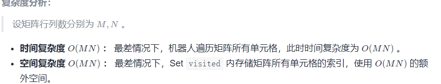

```java
class Solution {
    public int movingCount(int rows, int cols, int threshold){
        boolean[][] used = new boolean[rows][cols];
        return dfs(threshold, rows, cols, 0, 0, used);
    }
    
    // dfs找到符合条件的个数 如果某个数不符合则其下面和右边的那两个数也不符合
    private int dfs(int threshold, int rows, int cols, int x, int y, boolean[][] used){
        // 剪枝：越界、已搜索过、不符合
        if(x >= rows || y >= cols || used[x][y] || bitSum(x) + bitSum(y) > threshold) return 0;
        
        // 标记该数已搜索过
        used[x][y] = true;
        // 从0,o开始只需向右向下查找 即可找完全部结点
        return 1 + dfs(threshold, rows, cols, x+1, y, used) + dfs(threshold, rows, cols, x, y+1, used);
    }
    
    // 求某个数的数位和
    private int bitSum(int num){
        int sum = 0;
        while(num != 0){
            sum += num % 10;
            num = num / 10;
        }
        return sum;
    }
}


class Solution {
public:
    int bitSum(int num){
        int sum = 0;
        while(num > 0){
            sum += (num % 10);
            num /= 10;
        }
        return sum;
    }
    
    int movingCount(int m, int n, int k) {
        vector<vector<bool>> used(m, vector<bool>(n,false));
        return dfs(m, n, 0, 0, used, k);
    }

    int dfs(int rows, int columns, int i, int j, vector<vector<bool>>& used, int k){
        if(i < 0 || i >= rows || j < 0 || j >= columns || used[i][j]){
            return 0;
        }
        used[i][j] = true;
        int result = bitSum(i) + bitSum(j);
        if(result <= k){
            return 1 + dfs(rows, columns, i+1, j, used, k) + dfs(rows, columns, i, j+1, used, k);
        }
        return 0;
        
    }

    

};
```


##### [698. 划分为k个相等的子集](https://leetcode-cn.com/problems/partition-to-k-equal-sum-subsets/)

* 回溯法，明确**函数定义**。

* 剪枝：预排序，提前停止深搜。

  ```java
  class Solution {
      public boolean canPartitionKSubsets(int[] nums, int k) {
          if(k == 1) return true;
          int sum = 0;
          for(int num : nums){
              sum += num;
          }
  
          if(sum % k != 0) return false;
          sum = sum / k;
          int[] backet = new int[k];
          Arrays.fill(backet, sum);
          // 排序 便于剪枝优化时间
          Arrays.sort(nums);
  
          return backStracking(nums, nums.length - 1, backet, k);
      }
  
      // 函数定义：从nums的cur位置向前尝试取数放到backet的每个桶中，返回每个桶是否能填满
      private boolean backStracking(int[] nums, int cur, int[] backet, int k){
          // base case 此时nums中所有的数已放入桶中
          if(cur == -1){
              return true;
          }
  
          // 将当前待加入的数从第一个桶开始加入，判断当前数加入桶后是否能找到填满每个桶的组合，如果不能则加入后面的桶继续尝试
          for(int i = 0; i < k; i++){
              // 剪枝 确保桶中有足够空间存放
              if(backet[i] == nums[cur] || (cur > 0 && backet[i] - nums[cur] >= nums[0])){
                  backet[i] -= nums[cur];
                  // 尝试当前数加入i号桶中
                  if(backStracking(nums, cur - 1, backet, k)){
                      return true;
                  }
                  // 无法填满每个桶 表示该数不能填到桶i，尝试给下个桶填
                  backet[i] += nums[cur];
              }
          }
  
          return false;
      }
  }
  ```

  


### 广度优先搜索

* 广度优先搜索（breadth-first search，BFS）不同与深度优先搜索，它是一层层进行遍历的，因 此需要用先入先出的队列而非先入后出的栈进行遍历。由于是按层次进行遍历，广度优先搜索时 按照“广”的方向进行遍历的，也常常用来处理**最短路径等问题**。

* 这个算法经常被用在树上和图上，我们来思考一下这个问题，**如果给你一个连通图上的一个节点，如何才能得到图上所有的节点呢？** 这个思路其实很简单，首先我们知道，我们可以把给定节点和其邻居加入到答案中，但是邻居还有邻居，因此我们还是得继续这个过程，直到把所有的点都找到，这之中我们可能会遇到一种情况就是，我们访问到了之前找到过的点，因此，这里我们还需要一个判重的机制。这里有一点是，每个点只可能找到其邻居，也就是说只会往其周围的点找，一次只向外扩散一格，**解决广度优先搜索问题，我们会使用队列这么一个 FIFO 的数据结构**，这不难理解，先找到的点我们先考虑其邻居。

* 注意：BFS天然地带有路径长度

* **BFS的正确性**

  - 具有两段性：最多有两种状态，即当前状态和下一步的状态。
  - 单调性：值单调递增，所以最先更新的值是最小值、最短路。

  https://www.cnblogs.com/ddja/p/15935470.html

#### 最短路模型

* 计算到达**某个位置需要的最短步数**、最短路径
* 使用BFS**第一次搜到目标的结果就是最短的**，只要遍历**从该点出发的所有情况**，且进行**标记判重**，减少多余的重复计算


##### 2022.4.15网易笔试第三题

* 题目简介：给n个弹簧所能弹的距离jump[]，n个弹簧位于0-n-1上，球起始在0号弹簧上，球在i号弹簧时，其被弹簧弹到的位置为jump[i]+i或者为0-i-1，求球弹出该区域所需弹的最少次数。

* 最短路模型，使用队列记录当前步数所能弹到的位置，然后最先出现目标位置的步数即为最小步数。

* ```java
      public static void main(String[] args) {
          Scanner sc = new Scanner(System.in);
          int n = sc.nextInt();
          int[] jump = new int[n];
          for (int i = 0; i < n; i++) {
              jump[i] = sc.nextInt();
          }
  
          System.out.println(min(jump));
  
      }
  
      private static int min(int[] jump){
          // 记录当前步数所能到达的位置
          LinkedList<Integer> queue = new LinkedList<>();
          // 记录已经到过的位置避免重复走，先走到该位置的必定是更少步数
          boolean[] used = new boolean[jump.length];
          used[0] = true;
          int result = 0;
          // 初始位置为0
          queue.offer(0);
          while(!queue.isEmpty()){
              int size = queue.size();
              for (int i = 0; i < size; i++) {
                  int cur = queue.poll();
                  if(cur >= jump.length) return result;
                  // 向左能走到的位置
                  for(int j = 0; j < cur; j++){
                      if(!used[j]){
                          queue.offer(j);
                          used[j] = true;
                      }
                  }
  
                  queue.offer(cur + jump[cur]);
                  if(cur + jump[cur] < jump.length)
                      used[cur + jump[cur]] = true;
              }
              result++;
          }
  
          return result;
      }
  }
  ```


##### \188. 武士风度的牛

* 经典最短路径模型，使用记忆集去重+数组提前存储下一步能够到达的位置。

* ```java
  import java.util.*;
  public class Main{
      
      static class Node{
          int curC;
          int curR;
          public Node(int curR, int curC){
              this.curR = curR;
              this.curC = curC;
          }
      }
      static Node knight;
      // 能走的八个位置
      static int[][] src = {{-2,-1}, {-2, 1}, {-1, 2}, {1, 2}, {2, 1}, {2, -1}, {1, -2}, {-1, -2}};
      public static void main(String[] args){
          Scanner sc = new Scanner(System.in);
          int c = sc.nextInt();
          int r = sc.nextInt();
          char[][] martix = new char[r][c];
          
          int curR = 0;
          int curC = 0;
          for(int i = 0; i < r; i++){
              // 以回车和空格分割
              String cur = sc.next();
              martix[i] = cur.toCharArray();
              for(int j = 0; j < c; j++){
                  if(martix[i][j] == 'K'){
                      curR = i;
                      curC = j;
                  }
              }
          }
          
          knight = new Node(curR, curC);
          
          System.out.println(getMin(martix, r, c));
      }
      
      
      // 最短路径模型问题+去重
      private static int getMin(char[][] martix, int r, int c){
          boolean[][] used = new boolean[martix.length][martix[0].length];
          LinkedList<Node> queue = new LinkedList<>();
          queue.offer(knight);
          used[knight.curR][knight.curC] = true;
          int result = 0;
          while(!queue.isEmpty()){
              int size = queue.size();
              for(int i = 0; i < size; i++){
                  Node cur = queue.poll();
                  if(martix[cur.curR][cur.curC] == 'H') return result;
                  for(int j = 0; j < src.length; j++){
                      int newR = cur.curR + src[j][0];
                      int newC = cur.curC + src[j][1];
                      // 越界
                      if(newR >= r || newR < 0 || newC >= c || newC < 0) continue;
                      if(martix[newR][newC] != '*' && !used[newR][newC]){
                          queue.offer(new Node(newR, newC));
                          used[newR][newC] = true;
                      }
                  }
              }
              result++;
          }
          
          return result;
          
      }
  }
  ```

  


#### 例题

##### [103. 二叉树的锯齿形层序遍历](https://leetcode-cn.com/problems/binary-tree-zigzag-level-order-traversal/)

* 考察上面提到的第一点，**层级遍历**。这道题其实是树的层级遍历的变形，我们需要记录每一层的信息，但是记录的顺序有区分，第一层从左向右记录，第二层反过来，从右向左记录，第三层从左向右记录，。。。，你可以看到每一层的记录方向和上下层都不一样，是一种交错的形式，当然我们可以都从左向右记录，然后到特定的层就把记录的结果给反转一下，但是这里有一个小技巧就是，**我们都是从左向右记录，但是记录方式不一样，一种记录方式是从列表的尾部加入，另一种是从链表的头部加入**。在树上的遍历相对来说比较简单，因为树的遍历是有方向性的，这个方向性确保了我们不会访问到我们之前访问过的节点，因此，这里我们不需要使用 Set 或者 boolean 数组去帮助去重。

```java
public List<List<Integer>> zigzagLevelOrder(TreeNode root) {
    //结果链表
    List<List<Integer>> result = new ArrayList<>();
    if(root==null) return result;
    //存放节点的队列
    Queue<TreeNode> queue = new LinkedList<>();
    TreeNode temp;
    //当前层的记录是否需要反转
    boolean isReversed = false;
    //将根节点放入队列中
    queue.offer(root);
    //队列为空表示遍历完所有节点
    while(!queue.isEmpty()){
        //存放当前层的遍历记录
        List<Integer> list = new ArrayList<>();
        //当前层节点个数
        int size = queue.size();
        //遍历当前层 并将下一层节点加入到队列中
        for(int i =0;i<size;i++){
            temp = queue.poll();
            if(isReversed){
                //当前层记录需反转 从链表头部加入
                list.add(0,temp.val);
            }else{
                list.add(temp.val);
            }
            //加入左右子节点
            if(temp.left!=null){
                queue.offer(temp.left);
            }
            if(temp.right!=null){
                queue.offer(temp.right);
            }
        }
        //更新反转判断
        isReversed=!isReversed;
        //加入当前层遍历结果
        result.add(list);
    }
    return result;
}
```

* bfs+先加入再翻转

* ```java
  /**
   * Definition for a binary tree node.
   * public class TreeNode {
   *     int val;
   *     TreeNode left;
   *     TreeNode right;
   *     TreeNode() {}
   *     TreeNode(int val) { this.val = val; }
   *     TreeNode(int val, TreeNode left, TreeNode right) {
   *         this.val = val;
   *         this.left = left;
   *         this.right = right;
   *     }
   * }
   */
  class Solution {
      public List<List<Integer>> zigzagLevelOrder(TreeNode root) {
          List<List<Integer>> list = new ArrayList<>();
          // 奇数翻转
          if(root == null) return list;
          LinkedList<TreeNode> queue = new LinkedList<>();
          queue.offer(root);
          int index = 0;
          while(!queue.isEmpty()){
              int size = queue.size();
              List<Integer> temp = new ArrayList<>();
              for(int i = 0; i < size; i++){
                  TreeNode node = queue.poll();
                  temp.add(node.val);
                  if(node.left != null){
                      queue.offer(node.left);
                  }
                  if(node.right != null){
                      queue.offer(node.right);
                  }
              }
              if(index % 2 == 1){
                  Collections.reverse(temp);
              }
              list.add(temp);
              index++;
          }
  
          return list;
      }
  }
  ```

* 前序遍历+奇数层头插

* ```java
  /**
   * Definition for a binary tree node.
   * public class TreeNode {
   *     int val;
   *     TreeNode left;
   *     TreeNode right;
   *     TreeNode() {}
   *     TreeNode(int val) { this.val = val; }
   *     TreeNode(int val, TreeNode left, TreeNode right) {
   *         this.val = val;
   *         this.left = left;
   *         this.right = right;
   *     }
   * }
   */
  class Solution {
      public List<List<Integer>> zigzagLevelOrder(TreeNode root) {
          List<List<Integer>> result = new ArrayList<>();
          if(root == null) return result;
          dfs(root, 0, result);
          return result;
      }
  
      private void dfs(TreeNode root, int level, List<List<Integer>> result){
          // 层和索引对应
          // 相应层没有集合时才添加
          if(result.size() <= level){
              result.add(new ArrayList<>());
          }
          List<Integer> list = result.get(level);
          if(level % 2 == 1){ // 奇数层翻转添加
              list.add(0, root.val);
          }else{
              list.add(root.val);
          }
  
          if(root.left != null){
              dfs(root.left, level+1, result);
          }
          if(root.right != null){
              dfs(root.right, level+1, result);
          }
      }
  }
  ```

* 


##### [934. 最短的桥](https://leetcode-cn.com/problems/shortest-bridge/)

* 先用深搜添加其中一个岛，然后对这个岛进行广搜，看多少层能够搜到下一个岛

```java
        public int shortestBridge(int[][] A) {
            int [][] direction = new int [][]{{1,0},{-1,0},{0,1},{0,-1}};
            Deque<int []> queue = new ArrayDeque<>();
            int ans = -1;
            boolean [][] visited = new boolean[A.length][A[0].length];
            boolean flag = true;
            for(int i=0;i<A.length&&flag;i++){
                for(int j=0;j<A[0].length;j++) {
                    //该位置为1 找到其对应的岛
                    if (A[i][j] == 1) {
                        dfs(  A, i, j, queue, visited);
                        //只找一个为1的位置
                        flag = false;
                        break;
                    }
                }
            }
            //bfs算法找相邻的哪个岛
            while (!queue.isEmpty()){
                int size = queue.size();
                //记录层次
                ans++;
                for(int i=0;i<size;i++){
                    int []node = queue.poll();
                    for(int j=0;j<4;j++){
                        int  nx = node[0]+direction[j][0];
                        int ny = node[1]+direction[j][1];
                        //判断是否为原岛
                        if(nx<0||nx>=A.length||ny<0||ny>=A[0].length||visited[nx][ny])    continue;
                        //不是原岛 当前位置为1返回层次
                        if(A[nx][ny]==1)    return ans;
                        //当前位置非1 下一层遍历
                        visited[nx][ny] = true;
                        //将非0当前位作为下一层
                        queue.add(new int []{nx,ny});
                    }
                }
            }
            return ans;
        }
        //dfs算法找到一座岛
        private void dfs(int [][]A, int i, int j, Deque queue, boolean[][]visited){
            if(i<0||i>=A.length||j<0||j>=A[0].length||visited[i][j]||A[i][j]!=1)    return;
            visited[i][j] = true;
            //相邻位为1则为同一岛
            queue.add(new int []{i,j});
            //上下左右四个方位找相邻的1
            dfs( A, i-1, j, queue, visited);
            dfs( A, i+1, j, queue, visited);
            dfs( A, i, j-1, queue, visited);
            dfs( A, i, j+1, queue, visited);

        }
```

##### [126. 单词接龙 II](https://leetcode-cn.com/problems/word-ladder-ii/)

* 利用dfs搜索路径+bfs得到目标单词所在最小层次和每个节点的邻接节点
* 这里未用直接遍历得到邻接节点而是将要找的节点单词的每个位置换一个字符，然后看更改后的单词在不在 `wordList` 中，降低了时间复杂度。
* dfs中通过判断当前邻接节点是否在更低层来剪枝减小递归次数
* 

```java
public List<List<String>> findLadders(String beginWord, String endWord, List<String> wordList) {
    List<List<String>> ans = new ArrayList<>();
    // 如果不含有结束单词，直接结束，不然后边会造成死循环
    if (!wordList.contains(endWord)) {
        return ans;
    }
    // 利用 BFS 得到所有的邻居节点,以及每个节点的所在层数
    HashMap<String, Integer> distance = new HashMap<>();
    HashMap<String, ArrayList<String>> map = new HashMap<>();
    bfs(beginWord, endWord, wordList, map, distance);
    ArrayList<String> temp = new ArrayList<String>();
    // temp 用来保存当前的路径
    temp.add(beginWord);
    findLaddersHelper(beginWord, endWord, map, distance, temp, ans);
    return ans;
}
//dfs找到结尾单词的路径
private void findLaddersHelper(String beginWord, String endWord, HashMap<String, ArrayList<String>> map,
                               HashMap<String, Integer> distance, ArrayList<String> temp, List<List<String>> ans) {
    //到了结尾单词 且为最小层次
    if (beginWord.equals(endWord)) {
        ans.add(new ArrayList<String>(temp));
        return;
    }
    // 得到所有的下一个的节点 最底层的节点无下一个节点 递归结束
    /*
      "a"
      "c"
      ["a","b","c"]*/
    //之所以是 map.getOrDefault 而不是 get，就是上边的情况 get 会出错
    ArrayList<String> neighbors = map.getOrDefault(beginWord, new ArrayList<String>());
    for (String neighbor : neighbors) {
        //判断层数是否符合 不符合表示前面层次出现过当前邻接节点 无需对该节点递归
        if (distance.get(beginWord) + 1 == distance.get(neighbor)) {
            temp.add(neighbor);
            //对邻接节点递归dfs
            findLaddersHelper(neighbor, endWord, map, distance, temp, ans);
            //回溯
            temp.remove(temp.size() - 1);
        }
    }
}
// 利用 BFS 得到所有的邻居节点,以及每个节点的所在层数
public void bfs(String beginWord, String endWord, List<String> wordList, HashMap<String, ArrayList<String>> map,
                HashMap<String, Integer> distance) {
    Queue<String> queue = new LinkedList<>();
    queue.offer(beginWord);
    distance.put(beginWord, 0);
    boolean isFound = false;
    int depth = 0;
    Set<String> dict = new HashSet<>(wordList);
    while (!queue.isEmpty()) {
        int size = queue.size();
        depth++;
        for (int j = 0; j < size; j++) {
            String temp = queue.poll();
            // 一次性得到所有的下一个的节点
            ArrayList<String> neighbors = getNeighbors(temp, dict);
            map.put(temp, neighbors);
            for (String neighbor : neighbors) {
                //判断distance中是否已记录当前邻接节点
                if (!distance.containsKey(neighbor)) {
                    //第一次出现即代表记录了该节点的最低层次
                    distance.put(neighbor, depth);
                    //判断是否到最低层次
                    if (neighbor.equals(endWord)) {
                        isFound = true;
                    }
                    queue.offer(neighbor);
                }

            }
        }
        if (isFound) {
            break;
        }
    }
}
//找邻接节点 将要找的节点单词的每个位置换一个字符 然后看更改后的单词在不在 wordList 中。
//dict 就是 wordList，为了提高速度，从 List 转为 HashSet
//node 是我们要考虑的单词
private ArrayList<String> getNeighbors(String node, Set<String> dict) {
    ArrayList<String> res = new ArrayList<String>();
    char chs[] = node.toCharArray();
	//考虑变成其他所有的字母
    for (char ch = 'a'; ch <= 'z'; ch++) {
        //考虑每一位
        for (int i = 0; i < chs.length; i++) {
            if (chs[i] == ch)
                continue;
            char old_ch = chs[i];
            chs[i] = ch;
            //判断 wordList 是否包含修改后的单词
             if (dict.contains(String.valueOf(chs))) {
                res.add(String.valueOf(chs));
            }
            chs[i] = old_ch;
        }

    }
    return res;
}
```

##### [257. 二叉树的所有路径](https://leetcode-cn.com/problems/binary-tree-paths/)

方法一：深度优先搜索

最直观的方法是使用深度优先搜索。在深度优先搜索遍历二叉树时，我们需要考虑当前的节点以及它的孩子节点。

* 如果当前节点不是叶子节点，则在当前的路径末尾添加该节点，并继续递归遍历该节点的每一个孩子节点。
* 如果当前节点是叶子节点，则在当前路径末尾添加该节点后我们就得到了一条从根节点到叶子节点的路径，将该路径加入到答案即可。

```java
 List<String> result = new ArrayList<>();

    public List<String> binaryTreePaths(TreeNode root) {
        if (root == null) return result;
        dfs(root, new StringBuilder());
        return result;
    }

    public void dfs(TreeNode treeNode, StringBuilder stringBuilder) {
        //判断当前节点是否为null
        if (treeNode == null) return;
        stringBuilder.append(treeNode.val);
        //叶子节点的判断
        if (treeNode.left == null && treeNode.right == null) {
            result.add(stringBuilder.toString());
            return;
        }
        stringBuilder.append("->");
        //通过创建新的StringBuilder来避免回溯操作
        dfs(treeNode.left, new StringBuilder(stringBuilder));
        dfs(treeNode.right, new StringBuilder(stringBuilder));
    }

```

* 我们也可以用广度优先搜索来实现。为了**记录层次遍历时到当前节点的路径**，我们维护**一个队列，存储成对的节点和路径。**
* 一开始这个队列里只有根节点。在每一步迭代中，我们取出队列中的首节点，如果它是叶子节点，则将它对应的路径加入到答案中。如果它不是叶子节点，则将它的所有孩子节点和对应孩子节点的路径加入队列。当队列为空时广度优先搜索结束，我们即能得到答案。

```java
class Solution {
    public List<String> binaryTreePaths(TreeNode root) {
        List<String> res = new ArrayList<>();
        if (root == null)
            return res;
        //队列，节点和路径成对出现，路径就是从根节点到当前节点的路径
        Queue<Object> queue = new LinkedList<>();
        queue.add(root);
        queue.add(root.val + "");
        while (!queue.isEmpty()) {
            TreeNode node = (TreeNode) queue.poll();
            String path = (String) queue.poll();
            //如果到叶子节点，说明找到了一条完整路径
            if (node.left == null && node.right == null) {
                res.add(path);
            }

            //右子节点不为空就把右子节点和路径存放到队列中
            if (node.right != null) {
                queue.add(node.right);
                queue.add(new StringBuffer(path).append("->").append(node.right.val).toString());
            }

            //左子节点不为空就把左子节点和路径存放到队列中
            if (node.left != null) {
                queue.add(node.left);
                queue.add(new StringBuffer(path).append("->").append(node.left.val).toString());
            }
        }
        return res;
    }
}
```

* 用两个队列分别记录节点和路径，避免类型转换可降低运行时间

```java
    public List<String> binaryTreePaths(TreeNode root) {
        List<String> paths = new ArrayList<String>();
        if (root == null) {
            return paths;
        }
        Queue<TreeNode> nodeQueue = new LinkedList<TreeNode>();
        Queue<String> pathQueue = new LinkedList<String>();

        nodeQueue.offer(root);
        pathQueue.offer(Integer.toString(root.val));

        while (!nodeQueue.isEmpty()) {
            TreeNode node = nodeQueue.poll(); 
            String path = pathQueue.poll();

            if (node.left == null && node.right == null) {
                paths.add(path);
            } else {
                if (node.left != null) {
                    nodeQueue.offer(node.left);
                    pathQueue.offer(new StringBuffer(path).append("->").append(node.left.val).toString());
                }

                if (node.right != null) {
                    nodeQueue.offer(node.right);
                    pathQueue.offer(new StringBuffer(path).append("->").append(node.right.val).toString());
                }
            }
        }
        return paths;
    }
```

##### [130. 被围绕的区域](https://leetcode-cn.com/problems/surrounded-regions/)

解法一：

* 题解：
* dfs找出非边界连通区域，将非边界连通区域内中的节点内容更改即可
* 此解法从内部开始遍历，并用map记录连通的节点，然后再遍历map只将非边界连通区域的节点修改，存在大量重复遍历的问题，效率不高。

```java
//全局变量记录 连通区域个数
int count = 0;
//记录某个连通区域是否含有边界节点
boolean[] isBoundaryRegin;

public void solve(char[][] board) {
    //map记录连通区域对应的节点 key第几个连通区域 value 连通区域内的节点  （value中的key即line value即rows）
    Map<Integer, Map<Integer, List<Integer>>> map = new HashMap<>();
    //boolean数组判断节点是否已记录在连通区域内
    boolean[][] used = new boolean[board.length][board[0].length];
    isBoundaryRegin = new boolean[board.length * board[0].length + 1];
    //遍历每个节点 如果为目标节点 则对其进行递归求连通区域
    for (int i = 0; i < board.length; i++) {
        for (int r = 0; r < board[0].length; r++) {
            if (isTarget(board, i, r, used)) {
                //连通区域个数+1
                count++;
                dfs(map, board, i, r, used);
            }
        }
    }
    //将非边界连通区域更改为X
    for (int i = 1; i <= count; i++) {
        if (isBoundaryRegin[i]) continue;
        Map<Integer, List<Integer>> integerListMap = map.get(i);
        Set<Map.Entry<Integer, List<Integer>>> entries = integerListMap.entrySet();
        for (Map.Entry<Integer, List<Integer>> entry : entries) {
            int line = entry.getKey();
            List<Integer> value = entry.getValue();
            for (Integer row : value) {
                board[line][row] = 'X';
            }
        }
    }
}

//dfs递归求连通区域
private void dfs(Map<Integer, Map<Integer, List<Integer>>> map, char[][] board, int line, int row, boolean[][] used) {
    //当前节点是否为目标节点
    if (isTarget(board, line, row, used)) {
        //更改当前节点使用状态
        used[line][row] = true;
        //如果当前节点在边界上，将其所在连通区域记为边界区域
        if (isBoundary(board, line, row)) isBoundaryRegin[count] = true;
        //将节点存入对应连通区域内
        Map<Integer, List<Integer>> temp = map.get(count) == null ? new HashMap<>() : map.get(count);
        List<Integer> list = temp.get(line) == null ? new ArrayList<>() : temp.get(line);
        list.add(row);
        temp.put(line, list);
        map.put(count, temp);
        //将符合条件的相邻节点加入当前连通区域中
        if (line - 1 >= 0) dfs(map, board, line - 1, row, used);
        if (line + 1 < board.length) dfs(map, board, line + 1, row, used);
        if (row - 1 >= 0) dfs(map, board, line, row - 1, used);
        if (row + 1 < board[0].length) dfs(map, board, line, row + 1, used);
    }

}
//判断节点是否为目标节点 条件：记录的字符为O且未使用时 为true
private boolean isTarget(char[][] board, int line, int row, boolean[][] used) {
    if (board[line][row] == 'O' && used[line][row] == false) return true;
    return false;
}

//判断当前节点是否为边界节点
private boolean isBoundary(char[][] board, int line, int row) {
    if (line == board.length - 1 || line == 0 || row == board[0].length - 1 || row == 0) return true;
    return false;
}
```

dfs解法二：

* 其实只需要找到边界连通区域即可，对边界连通区域内的节点进行标记，然后遍历整个矩阵，如碰到标记节点改为'O'即可，碰到非边界连通区域内的节点（即'O'但未标记）改为'X'。
  * 从边界开始搜索，可以避免从内部搜索时，需跳出递归后并进行嵌套遍历才能将状态改变，极大地降低了时间复杂度。
* 本题要求将所有被字母 X 包围的字母 O都变为字母 X ，但**很难判断哪些 O 是被包围的，哪些 O 不是被包围的。**
* 注意到题目解释中提到：任何边界上的 O 都不会被填充为 X。 我们可以想到，**所有的不被包围的 O 都直接或间接与边界上的 O 相连。我们可以利用这个性质判断 O 是否在边界上，具体地说：**
  * 对于每一个边界上的 O，我们以它为起点，标记所有与它直接或间接相连的字母 O；
  * 最后我们遍历这个矩阵，对于每一个字母：
    * 如果该字母被标记过，则该字母为没有被字母 X 包围的字母 O，我们将其还原为字母 O；
    * 如果该字母没有被标记过，则该字母为被字母 X 包围的字母 O，我们将其修改为字母 X。

```java
class Solution {
    //分别记录二维数组 行长度和列长度
    int n, m;

    public void solve(char[][] board) {
        n = board.length;
        if (n == 0) {
            return;
        }
        m = board[0].length;
        //标记列边界的连通区域 将其内部节点标记
        for (int i = 0; i < n; i++) {
            dfs(board, i, 0);
            dfs(board, i, m - 1);
        }
        //标记行边界的连通区域
        for (int i = 1; i < m - 1; i++) {
            dfs(board, 0, i);
            dfs(board, n - 1, i);
        }
        //遍历矩阵，将标记节点还原 内部O节点改变
        for (int i = 0; i < n; i++) {
            for (int j = 0; j < m; j++) {
                if (board[i][j] == 'A') {
                    board[i][j] = 'O';
                } else if (board[i][j] == 'O') {
                    board[i][j] = 'X';
                }
            }
        }
    }

    public void dfs(char[][] board, int x, int y) {
        if (x < 0 || x >= n || y < 0 || y >= m || board[x][y] != 'O') {
            return;
        }
        //标记当前节点
        board[x][y] = 'A';
        //对相邻节点进行递归搜索
        dfs(board, x + 1, y);
        dfs(board, x - 1, y);
        dfs(board, x, y + 1);
        dfs(board, x, y - 1);
    }
}
```

* 可以使用**广度优先搜索实现标记操作**。在下面的代码中，我们把标记过的字母 `O` 修改为字母 `A`。

```java
class Solution {
    //利用数组+遍历取相邻节点
    int[] dx = {1, -1, 0, 0};
    int[] dy = {0, 0, 1, -1};

    public void solve(char[][] board) {
        int n = board.length;
        if (n == 0) {
            return;
        }
        int m = board[0].length;
        Queue<int[]> queue = new LinkedList<int[]>();
        //将列边界节点加入队列末尾
        for (int i = 0; i < n; i++) {
            if (board[i][0] == 'O') {
                queue.offer(new int[]{i, 0});
            }
            if (board[i][m - 1] == 'O') {
                queue.offer(new int[]{i, m - 1});
            }
        }
        //将行边界节点加入队列末尾
        for (int i = 1; i < m - 1; i++) {
            if (board[0][i] == 'O') {
                queue.offer(new int[]{0, i});
            }
            if (board[n - 1][i] == 'O') {
                queue.offer(new int[]{n - 1, i});
            }
        }
        //从队列取出边界节点 对每个节点所连通的区域内的节点进行标记
        while (!queue.isEmpty()) {
            int[] cell = queue.poll();
            int x = cell[0], y = cell[1];
            //对非连通区域内的节点进行标记
            board[x][y] = 'A';
            //判断当前层的相邻节点（下一层）是否为所连通节点 如果是，加入队列 后续继续取出 进行当前操作直到队列为空
            for (int i = 0; i < 4; i++) {
                int mx = x + dx[i], my = y + dy[i];
                if (mx < 0 || my < 0 || mx >= n || my >= m || board[mx][my] != 'O') {
                    continue;
                }
                //将符合条件的相邻节点加入队列
                queue.offer(new int[]{mx, my});
            }
        }
        //复原以及修改
        for (int i = 0; i < n; i++) {
            for (int j = 0; j < m; j++) {
                if (board[i][j] == 'A') {
                    board[i][j] = 'O';
                } else if (board[i][j] == 'O') {
                    board[i][j] = 'X';
                }
            }
        }
    }
}
```

##### [47. 全排列 II](https://leetcode-cn.com/problems/permutations-ii/)

* 题解
* 该题与全排列 I 的差别就是这道题包含重复数字，我们在dfs搜索时，需找出合适的剪枝方法去除重复的排列序列。
* 我们可以在交换数字前判断一下当前数字是否在之前已经交换过。
*  DFS的特点是每一轮都在本轮可选的范围（Level至Length-1）中按顺序选一个数字与level对应的数交换，然后再进入下一轮（递归）。如果当前准备选的下标是curr，而在（Level至curr-1）中出现过相同的数字，说明该数字肯定已经选过了，再选一次铁定后续会重复。

```java
class Solution {
    public List<List<Integer>> permuteUnique(int[] nums) {
        List<List<Integer>> result = new ArrayList<>();
        dfs(0, nums, result);
        return result;
    }
	
    // 
    public void dfs(int level, int[] nums, List<List<Integer>> result) {
        if (level == nums.length) {
            List<Integer> list = new ArrayList<>();
            for (int num : nums) {
                list.add(num);
            }
            result.add(list);
        }
        //交换i与level对应的数 
        for (int i = level; i < nums.length; i++) {
            //判断i是否可交换
            if(canSwap(nums,level,i)) {
                //进行交换
            swap(nums, level, i);
            dfs(level + 1, nums, result);
             //回溯状态
            swap(nums, level, i);
            }
        }
    }
    //判断是否可交换 如不可交换表示此数在之前与level对应的数交换过，此数在level位置对应的排列已存在了。
    private boolean canSwap(int[] nums,int begin,int end){
        for(int i =begin;i<end;i++){
            //从level到i中存在与i相同的数 表示该数在之前已交换过
            if(nums[i]==nums[end]) return false;
        }
        return true;
    }
    public void swap(int[] nums, int i, int j) {
        int temp = nums[i];
        nums[i] = nums[j];
        nums[j] = temp;
    }
}


class Solution {
public:
    // 通过前面index - i-1位置上是否出现重复数字来判断是否可交换
    bool canSwap(int index, int i, vector<int>& num){
        for(int j = index; j < i; j++){
            if(num[j] == num[i]) return false;
        }
        return true;
    }
    // 当前正在确定第index位的数，如果待交换到index位置的数之前已经交换过了 则该数跳过，否则重复
    void dfs(vector<vector<int>>& res, vector<int> &num, int index){
        if(index == num.size() - 1){
            res.push_back(num);
            return;
        }
        
        for(int i = index; i < num.size(); i++){
            if(canSwap(index, i, num)){
                swap(num[index], num[i]);
                dfs(res, num, index + 1);
                swap(num[index], num[i]);
            }
        }
    }
    vector<vector<int> > permuteUnique(vector<int> &num) {
        vector<vector<int>> res;
        dfs(res, num, 0);
        return res;
    }
};
```

* 要求输出序列有序：对vector作为元素的容器进行排序【时间复杂度较高】

```c++
class Solution {
public:
    // 通过前面index - i-1位置上是否出现重复数字来判断是否可交换
    bool canSwap(int index, int i, vector<int>& num){
        for(int j = index; j < i; j++){
            if(num[j] == num[i]) return false;
        }
        return true;
    }
    // 当前正在确定第index位的数，如果待交换到index位置的数之前已经交换过了 则该数跳过，否则重复
    void dfs(vector<vector<int>>& res, vector<int> &num, int index){
        if(index == num.size() - 1){
            res.push_back(num);
            return;
        }
        
        for(int i = index; i < num.size(); i++){
            if(canSwap(index, i, num)){
                swap(num[index], num[i]);
                dfs(res, num, index + 1);
                swap(num[index], num[i]);
            }
        }
    }
    vector<vector<int> > permuteUnique(vector<int> &num) {
        vector<vector<int>> res;
        dfs(res, num, 0);
        // 只支持对随机访问迭代器的排序
            // vector作为元素，其有重载<操作符，对容器内的序列逐个比较【即类似字典序列的顺序】
        sort(res.begin(), res.end());
        return res;
    }
};
```


##### [40. 组合总和 II](https://leetcode-cn.com/problems/combination-sum-ii/)

* 题解
* 每个组合中的数字个数不定，故组合数字最多有candidates.length个
* 求组合即每次取一个数，然后在剩余序列中取下一个数（进入下层递归），直至最外层递归取到最后一个数。
* 为避免出现重复问题，我们可以先对数组排序(**排序后使构建组合时，组合内数字的顺序是从数字从小到大的，这样便于判断当前层数字位置上的数字是否已出现过，便于去重**)，然后在递归时判断当前层递归的前面是否有相同数，如有表示该位置为该数的组合已出现过直接continue。
* 不重复就需要按 **顺序** 搜索， **在搜索的过程中检测分支是否会出现重复结果** 。注意：这里的顺序不仅仅指数组 `candidates` 有序，还指按照一定顺序搜索结果。
* **数组 candidates 有序，也是 深度优先遍历 过程中实现「剪枝」的前提。**
  将数组先排序的思路来自于这个问题：去掉一个数组中重复的元素。很容易想到的方案是：先对数组 升序 排序，重复的元素一定不是排好序以后相同的连续数组区域的第 1 个元素。也就是说，剪枝发生在：同一层数值相同的结点第 2、3 ... 个结点，因为数值相同的第 1 个结点已经搜索出了包含了这个数值的全部结果，同一层的其它结点，候选数的个数更少，搜索出的结果一定不会比第 1 个结点更多，并且是第 1 个结点的子集。

```java
class Solution {
    public List<List<Integer>> combinationSum2(int[] candidates, int target) {
        List<List<Integer>> result = new ArrayList<>();
        Arrays.sort(candidates);
        backTracking(result,candidates,0,target,new ArrayList<>(),0);
        return result;
    }
    //dfs+回溯实现求组合
    //index：当前取数序列中的起始位置
    //count：当前组合中的每个数字的和
    public void backTracking(List<List<Integer>> result,int[] candidates,int index,int target,List<Integer> temp, int count){
        //当前组合符合条件 不用再取数 直接加入结果集 并返回
        if(count==target){
            result.add(new ArrayList<>(temp));
            return ;
        }
        //从索引为index到candidates.length-1的序列中取数
        for(int i =index;i<candidates.length;i++){
            //剪枝：当前数加入组合后数字和大于target 或者 当前层已经出现过相同的数 都不取该数
            if(count+candidates[i]>target||(i>index&&candidates[i]==candidates[i-1])){
                continue;
            }else{
                //符合条件 加入组合中
                temp.add(candidates[i]);
                count=count+candidates[i];
                //递归取下个数 下个数的索引为当前数索引加1
                backTracking(result,candidates,i+1,target,temp,count);
                //回溯操作，还原为当前深度的操作
                temp.remove(temp.size()-1);
                count=count-candidates[i];
            }
        }
    }
    //判断在序列first到right-1的位置上是否出现过与right处相同的数 因为排序后如果当前层前面有相同的数 必定是前一位 故可用(i>index&&candidates[i]==candidates[i-1])代替
    private boolean isAppear(int[] candidates,int first ,int right){
        for(int i =first;i<right;i++){
            if(candidates[i]==candidates[right]) return true;
        }
        return false;
    }
}
```

* c++

  ```c++
  class Solution {
  public:
      void backStracking(vector<vector<int>>& res, vector<int>& temp, vector<int>& candidates, int target, int curIndex){
          if(target == 0){
              res.push_back(temp);
              return;
          }
  
          // 确保当前及后面的数加入后不越界
          for(int i = curIndex; i < candidates.size() && candidates[i] <= target; i++){
              // 该数不能是当前轮已选的数  
              if((curIndex < i && candidates[i - 1] == candidates[i])){
                  continue;
              }else{
                  temp.push_back(candidates[i]);
                  backStracking(res, temp, candidates, target - candidates[i], i + 1);
                  temp.pop_back();
              }
          }
  
      }
      vector<vector<int>> combinationSum2(vector<int>& candidates, int target) {
          vector<vector<int>> res;
          vector<int> temp;
          sort(candidates.begin(), candidates.end());
          backStracking(res, temp, candidates, target, 0);
          return res;
      }
  };
  ```

  


##### [37. 解数独](https://leetcode-cn.com/problems/sudoku-solver/)

* 用三个数组分别记录该数字是否在当前行、当前列、当前块中出现过，line和row数组的digit-1列表示digit这个数字，块为三维数组，前两位的索引决定第几行第几块，从0开始
* 先找出所有的空位，并记录空位个数。
* 接着递归起始空位，并对空位的每一个可填的数字进行判断并对下一个空位进行递归。
* 当递归到最后一个空白格后，如果仍然没有冲突，说明我们找到了答案；在递归的过程中，如果当前的空白格不能填下任何一个数字(即数独无解)，那么就进行回溯。

```java
boolean[][] lineExist = new boolean[9][9];
boolean[][] rowExist = new  boolean[9][9];
boolean[][][] blockExist = new boolean[3][3][9];
List<int[]> spaces = new ArrayList<>();
boolean flag = false;
public void solveSudoku(char[][] board) {
    for(int i = 0;i<9;i++){
        for(int j=0;j<9;j++){
            if(board[i][j]=='.'){
                temp.add(new int[]{i,j});
            }else{
                int digit = board[i][j]-'0'-1;
                lineExist[i][digit]=rowExist[j][digit]=blockExist[i/3][j/3][digit]=true;
            }
        }
    }
    dfs(board,0);
}
public void dfs(char[][] board,int pos){
    if(pos==spaces.size()){
        flag=true;
        return ;
    }
    int[] space = spaces.get(pos);
    int i = space[0];
    int j = space[1];
    for(int digit=0;digit<9&&!flag;digit++){
        if(!lineExist[i][digit]&&!rowExist[j][digit]&&!blockExist[i/3][j/3][digit]){
            lineExist[i][digit]=rowExist[j][digit]=blockExist[i/3][j/3][digit]=true;
            board[i][j]=(char) (digit + '0' + 1);
            dfs(board,pos+1);
            // 数独无解时的回溯操作 表示当前填入该空位置的数不符合需换一个数 
            lineExist[i][digit]=rowExist[j][digit]=blockExist[i/3][j/3][digit]=false;
        }
    }
}
```

法二：

```java
class Solution {
    public void solveSudoku(char[][] board) {
        /**
         * 记录某行，某位数字是否已经被摆放
         */
        boolean[][] row = new boolean[9][9];
        /**
         * 记录某列，某位数字是否已经被摆放
         */
        boolean[][] col = new boolean[9][9];
        /**
         * 记录某 3x3 宫格内，某位数字是否已经被摆放
         */
        boolean[][] block = new boolean[9][9];

        for (int i = 0; i < 9; i++) {
            for (int j = 0; j < 9; j++) {
                if (board[i][j] != '.') {
                    int num = board[i][j] - '1';
                    row[i][num] = true;
                    col[j][num] = true;
                    // blockIndex = i / 3 * 3 + j / 3，取整
                    block[i / 3 * 3 + j / 3][num] = true;
                }
            }
        }
        dfs(board, row, col, block, 0, 0);
    }

    private boolean dfs(char[][] board, boolean[][] row, boolean[][] col, boolean[][] block, int i, int j) {
        // 找寻空位置
        while (board[i][j] != '.') {
            if (++j >= 9) {
                i++;
                j = 0;
            }
            if (i >= 9) {
                return true;
            }
        }
        for (int num = 0; num < 9; num++) {
            int blockIndex = i / 3 * 3 + j / 3;
            if (!row[i][num] && !col[j][num] && !block[blockIndex][num]) {
                // 递归
                board[i][j] = (char) ('1' + num);
                row[i][num] = true;
                col[j][num] = true;
                block[blockIndex][num] = true;
                //对下一个空位进行置数
                if (dfs(board, row, col, block, i, j)) {
                    return true;
                } else {
                    // 回溯
                    row[i][num] = false;
                    col[j][num] = false;
                    block[blockIndex][num] = false;
                    board[i][j] = '.';
                }
            }
        }
        //找不到数放 数独无解 返回false
        return false;
    }

```

##### [310. 最小高度树](https://leetcode-cn.com/problems/minimum-height-trees/)

* 超时题解
* 挨个将节点作为根，统计每个节点的高度，然后用map存储起来，并不断更新最小高度，最后直接取最小值对应的value即可

```java
class Solution {
     public List<Integer> findMinHeightTrees(int n, int[][] edges) {
        int min = Integer.MAX_VALUE;
        int temp ;
         //map 统计每个节点 作为根时对应的高度
        Map<Integer,List<Integer>> result = new HashMap<>();
        List<Integer> list=null;
         //用于存储每个层的节点
        Queue<Integer> queue = new LinkedList<>();
         //遍历每个节点作为根
        for(int i = 0;i<n;i++){
            queue.offer(i);
            //bfs求树的高度
            temp=bfs(queue,edges,new boolean[n-1],0);
            if(temp<=min){
                min=temp;
                if(result.get(min)==null){
                    list = new ArrayList<>();
                    list.add(i);
                    result.put(min,list);
                }else{
                    list = result.get(min);
                    list.add(i);
                    result.put(min,list);
                }
            }
        }
        return result.get(min);
    }
	//count 已放置的节点数量 降低运行时间 used记录边是否被取 避免取到重复节点
    public int bfs(Queue<Integer> queue,int[][] edges,boolean[] used,int count){
        int depth =0;
        while(!queue.isEmpty()){
            int size = queue.size();
            count+=size;
            //对当前层的每个节点取下一层的节点
            for(int j =0;j<size&&count!=edges.length+1;j++){
                int treeNode = queue.poll();
                //根据边关系取下一层节点
                for(int i =0;i<edges.length;i++){
                    if((edges[i][0]==treeNode||edges[i][1]==treeNode)&&used[i]==false){
                        if(edges[i][0]!=treeNode){
                            queue.offer(edges[i][0]);
                        }else{
                            queue.offer(edges[i][1]);
                        }
                        used[i]=true;
                    }
                }
            }
            depth++;
        }
        return depth;
    }

}
```

题解二：

​	最小树高度根节点的选择可参考https://www.cnblogs.com/aloe-n/p/13053363.html

* 为了使生成的树的高度最小,**root 节点必须是尽可能接近中心的.**

* 如何理解中心?

  - 将只有一条边连接的节点定义为叶子节点,**中心节点可以理解为离所有叶子节点都相对较近的点.**

  如何找出中心节点?

  - 如果将最外层叶子节点砍掉,就会有新的一层叶子节点出现,这样一直砍下去直到**最后一层就是中心节点.**

* 所以，我们可以不断记录叶子节点并从树中去除叶子节点，直到最后一层叶子节点时，其即为中心节点。

* 我们从边缘开始，先找到所有度为1的节点，然后把所有度为1的节点进队列，然后不断地bfs，最后找到的就是两边同时向中间靠近的节点，那么这个中间节点就相当于把整个距离二分了，那么它当然就是到两边距离最小的点啦，也就是到其他叶子节点最近的节点了。

* 这里的bfs为反向bfs，即从叶子节点向根节点进行，我们可以通过邻接表和度表 记录和更新叶子节点

```java
class Solution {
     public List<Integer> findMinHeightTrees(int n, int[][] edges) {
         List<Integer> res = new ArrayList<>();
         //只有一个节点时需特殊处理 度为0 直接返回
         if(n==1){
             res.add(0);
             return res;
         }
         //记录每个节点的度数 无向图不区分出入
        int[] degree = new int[n];
        //邻接表 记录每个节点的邻居
        List<List<Integer>> map = new ArrayList<>();
        //初始化邻接表
        for(int i = 0;i<n;i++){
            map.add(new ArrayList<>());
        }
        //根据边关系 更新邻接表 和 每个节点的度数
        for(int[] edge:edges){
            degree[edge[0]]++;
            degree[edge[1]]++;
             map.get(edge[0]).add(edge[1]);/*添加相邻节点*/
            map.get(edge[1]).add(edge[0]);
        }
        Queue<Integer> queue = new LinkedList<>();
        //将叶子节点加入队列 叶子节点即读数为1 只有一个节点与其相邻
        for(int i = 0;i<n;i++){
            if(degree[i]==1){
                queue.offer(i);
            }
        }
        //bfs 找到中心节点作为根节点
        //找到最后一层的叶子结点时，队列为空 res装填着最后一轮的叶子结点 即中心结点
        while(!queue.isEmpty()){
            //装填当前层的叶子节点 
            res = new ArrayList<>();
            int size = queue.size();
            //从树中去除叶子节点 并将新的叶子节点加入队列中
            for(int i = 0;i<size;i++){
                int temp = queue.poll();
                res.add(temp);
                //取得叶子节点的邻居节点
                List<Integer> neighbors = map.get(temp);
                //更新邻居节点的度数 如果邻居节点度数小于等于1 则其为下一轮的叶子节点
                for(Integer neighbor: neighbors){
                    //邻居节点度数减一
                    degree[neighbor]--;
                    if(degree[neighbor]==1){
                        queue.offer(neighbor);
                    }
                }
            }
        }
        return res;
    }

}
```

## 动态规划

动态规划的的四个解题步骤是：

- 定义子问题
- 写出子问题的递推关系
- 确定 DP 数组的计算顺序
- 空间优化（可选）

下面我们一步一步地进行讲解。

步骤一：定义子问题【dp数组的定义】

* 稍微接触过一点动态规划的朋友都知道动态规划有一个“子问题”的定义。什么是子问题？子问题是和原问题相似，但规模较小的问题。
* 这要求子问题需要具备两个性质：【即符合最优子结构】
  * 原问题要能由子问题表示。
  * 一个子问题的解要能通过其他子问题的解求出。【子问题相互独立】
* 可从归纳法推导出，这样定义了，知道子问题的结果，怎么推出当前问题的值。

步骤二：写出子问题的递推关系（状态转移方程）

* 这一步是求解动态规划问题最关键的一步。然而，这一步也是最无法在代码中体现出来的一步。在做题的时候，最好把这一步的思路用注释的形式写下来。做动态规划题目不要求快，而要确保无误。

  

步骤三：初始化

* 根据状态转移方程和题目定义进行初始化
* 状态转移需要依赖的初始项等

步骤四：确定 DP 数组的计算顺序

* 在确定了子问题的递推关系之后，下一步就是依次计算出这些子问题了。在很多教程中都会写，动态规划有两种计算顺序，一种是自顶向下的、使用备忘录的递归方法，一种是自底向上的、使用 dp 数组的循环方法。不过在普通的动态规划题目中，**99% 的情况我们都不需要用到备忘录方法，所以我们最好坚持用自底向上的 dp 数组。**
* 一般搞清楚了子问题的计算顺序，就可以确定DP数组的计算顺序。
* 通过递推方程和dp定义判断遍历顺序

步骤五：空间优化

* 空间优化的基本原理是，很多时候我们**并不需要始终持有全部的 DP 数组。**
* 有时候我们只用少数变量保存子问题的结果，就可以依次计算出所有的子问题。

题解

* 十分经典的斐波那契数列题

* 因为我们每次可以走一步或者两步，所以**第 i 阶可以从第 i-1 或 i-2 阶到达**。
* 换句话说，**走到第 i 阶的 方法数即为走到第 i-1 阶的方法数加上走到第 i-2 阶的方法数。**

```java
    public int climbStairs(int n) {
        if(n<=2) return n;
        //初始时pre2走到1阶的方法数 pre1走到2阶的方法数
        //pre2即走到i阶还需两步 pre1表示走到i阶还需一步 i>=3
        int pre2 =1,pre1 = 2, cur=0;
        for(int i =2;i<n;i++){
            //走到i阶的方法数
            cur=pre1+pre2;
            pre2=pre1;
            pre1=cur;
        }
        return cur;
    }
```

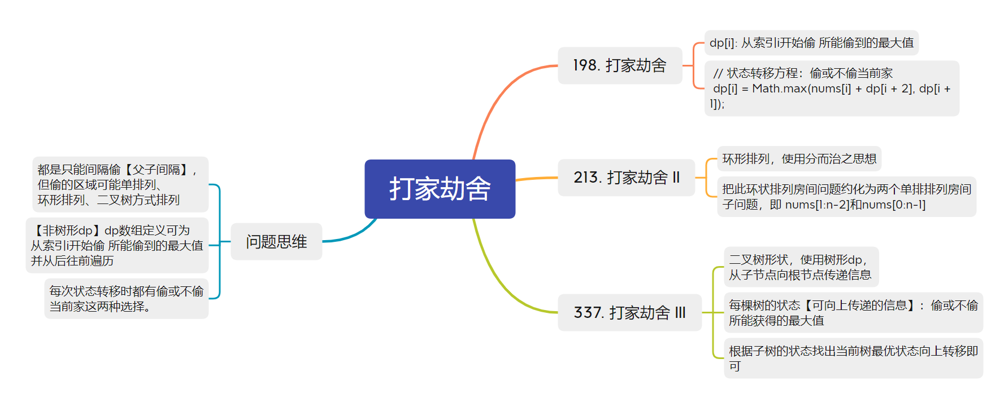

### [198. 打家劫舍](https://leetcode-cn.com/problems/house-robber/)

* 这次行窃地区只是一条街道

* 定义子问题 f(k):从k个房子中能偷到的最大金额（满足原问题能由子问题描述，且一个子问题的解能通过其他子问题的解求出）

* 这里的子问题递推关系为*f*(*k*)=max{f(k−1),Hk−1+f(k−2)}

* DP数组存在子问题的解，所以dp[k]依赖dp[k-1]和dp[k-2]，其计算顺序即为从左往右，这样保证计算子问题的时候，它所依赖的那些子问题已经计算出来了。

* dp[i] = Math.max(dp[i-1],dp[i-2]+nums[i-1]); 来说 第i-1间不一定被偷

  如果i-1间没被偷 其等价于i-2 【dp[i-1]==dp[i-2]】所以我们直接用i-2来表示偷第i间的情况

```java
class Solution {
    public int rob(int[] nums) {
        int length = nums.length;
        // // dp[i]:偷完第i个屋子后所能获得的最大收益
        // int [] dp = new int[length+1];

        // // 避免判断i是否大于2
        // dp[1] = nums[0];

        // for(int i =2;i<=length;i++){
        //     // 动态转移方程 不偷或者偷所能获得最大利益
        //     dp[i] = Math.max(dp[i-1],dp[i-2]+nums[i-1]);
        // }

        // return dp[length];

        // 因为收益只与前一天和前两天有关 所以可用局部变量来优化空间

        int cur = nums[0];
        int pre1 = cur;
        int pre2 = 0;

        for(int i = 2;i<= length;i++){
            cur = Math.max(pre1,pre2+nums[i-1]);
            
            // 更新变量
            pre2 = pre1;
            pre1 = cur;
        }

        return cur;
    }
}
```

* 进行空间优化
  * 对于小偷问题，我们发现，最后一步计算 f(n) 的时候，实际上只用到了 f(n-1) 和f(n−2) 的结果。n-3 之前的子问题，实际上早就已经用不到了。那么，我们可以只用两个变量保存两个子问题的结果，就可以依次计算出所有的子问题


```java
class Solution {
    public int rob(int[] nums) {
        //进行边界处理
        if(nums.length==0) return 0;
        if(nums.length==1) return nums[0];
        int pre2 = 0 ,pre1 = 0;//pre2:f(k-2)子问题的解 f(k-1)子问题的解
        int cur;
        for(int i = 0;i<nums.length;i++){
            cur=Math.max(pre1,pre2+nums[i]);//求出f(k)的解
            pre2=pre1;
            pre1=cur;
        }
        return cur;
    }
}
```

* 记忆化递归方式，状态转移：每次有偷或不偷两种情况，偷的话，下次只能隔一家偷，不偷的话，下次直接在下一家偷

* 时间复杂度O(N)：数组每个begin一次操作

* 空间复杂度O(N)：距离为2开辟新栈空间 即N/2

* ```java
  class Solution {
      // 记忆集：从key开始偷 所能偷到的最大值value
      Map<Integer, Integer> cache = new HashMap<>();
  
      public int rob(int[] nums) {
          if(nums.length == 1) return nums[0];
          return maxProfit(nums, 0);
      }
  	
      // 函数定义和记忆集相同
      private int maxProfit(int[] nums, int begin){
          // base case
          if(begin >= nums.length) return 0;
          // 剪枝
          if(cache.containsKey(begin)) return cache.get(begin);
  
          // 有当前家有偷和不偷两种情况
          int steal = nums[begin];
          steal += maxProfit(nums, begin + 2);
          int unSteal = 0;
          unSteal += maxProfit(nums, begin + 1);
  
          // 转移方程
          int result = Math.max(steal, unSteal);
          cache.put(begin, result);
          return result;
      }
  }
  ```

* 动态规划方式：自低向上

* ```java
  class Solution {
  
      public int rob(int[] nums) {
          if(nums.length == 1) return nums[0];
          // dp[i]: 从索引i开始偷 所能偷到的最大值
          int[] dp = new int[nums.length];
  
          // 初始化
          dp[nums.length - 1] = nums[nums.length - 1];
          dp[nums.length - 2] = Math.max(nums[nums.length - 1], nums[nums.length - 2]);
  
          // 倒序遍历
          for(int i = nums.length - 3; i >= 0; i--){
              // 状态转移方程：偷或不偷当前家
              dp[i] = Math.max(nums[i] + dp[i + 2], dp[i + 1]);
          }
  
          return dp[0];
      }
  }
  ```

  


### [213. 打家劫舍 II](https://leetcode-cn.com/problems/house-robber-ii/)

*  算法题有两大核心简化复杂问题的思路：**减而治之和分而治之**，这题把环形分为单排就是分而治之，即把一个问题分成多个规模更小的子问题。

* **环状排列**意味着第一个房子和最后一个房子中**只能选择一个偷窃**，因此可以把此**环状排列房间**问题约化为**两个单排排列房间**子问题：

  在不偷窃第一个房子的情况下（即 nums[1:]），最大金额是 p1 
  在不偷窃最后一个房子的情况下（即 nums[:n-1]），最大金额是 p2

  综合偷窃最大金额： 为以上两种情况的较大值，即 max(p1,p2)

  

```java
class Solution {
    public int rob(int[] nums) {
        // base case
        if(nums.length==1) return nums[0];
        // 题目要求首尾不能同时偷窃 我们可以分别将首排除和尾排除 分别求最大收益 然后比较两者取最大值即可 
        return Math.max(myRob(Arrays.copyOfRange(nums,0,nums.length-1)),myRob(Arrays.copyOfRange(nums,1,nums.length)));
    }
    public int myRob(int[] nums) {
        int length = nums.length;
        // // dp[i]:偷完第i个屋子后所能获得的最大收益
        // int [] dp = new int[length+1];

        // // 避免判断i是否大于2
        // dp[1] = nums[0];

        // for(int i =2;i<=length;i++){
        //     // 动态转移方程 不偷或者偷所能获得最大利益
        //     dp[i] = Math.max(dp[i-1],dp[i-2]+nums[i-1]);
        // }

        // return dp[length];

        // 因为收益只与前一天和前两天有关 所以可用局部变量来优化空间

        int cur = nums[0];
        int pre1 = cur;
        int pre2 = 0;

        for(int i = 2;i<= length;i++){
            cur = Math.max(pre1,pre2+nums[i-1]);
            
            // 更新变量
            pre2 = pre1;
            pre1 = cur;
        }
        return cur;
    }    
}
```

* 再次做

* ```java
  class Solution {
      public int rob(int[] nums) {
          if(nums.length == 1) return nums[0];
  
          // 首尾房间只能偷一间，故可考虑分有头无尾、无头有尾两种情况偷，再取最大值
          return Math.max(maxProfit(nums, 0, nums.length - 2), maxProfit(nums, 1, nums.length - 1));
      }
  
      private int maxProfit(int[] nums, int begin, int end){
          if(begin == end) return nums[begin];
          // do[i]: 从i开始偷 偷到尾 所能获得的最高金额
          int[] dp = new int[nums.length];
          dp[end] = nums[end];
          dp[end - 1] = Math.max(nums[end - 1], nums[end]);
  
          // 倒序遍历
          for(int i = end - 2; i >= begin; i--){
              // 状态转移
              dp[i] = Math.max(dp[i + 2] + nums[i], dp[i + 1]);
          }
  
          return dp[begin];
      }
  }
  ```

### [337. 打家劫舍 III](https://leetcode-cn.com/problems/house-robber-iii/)

* 这次行窃地区是二叉树了且父子节点不能同时偷

* 考虑后序遍历实现，并用记忆集加以剪枝

* ```java
  /**
   * Definition for a binary tree node.
   * public class TreeNode {
   *     int val;
   *     TreeNode left;
   *     TreeNode right;
   *     TreeNode() {}
   *     TreeNode(int val) { this.val = val; }
   *     TreeNode(int val, TreeNode left, TreeNode right) {
   *         this.val = val;
   *         this.left = left;
   *         this.right = right;
   *     }
   * }
   */
  class Solution {
      // 记忆集：根为key的二叉树所能偷的最高金额
      private Map<TreeNode, Integer> cache = new HashMap<>();
  
      // 父子节点不能同时偷
      public int rob(TreeNode root) {
          if(root == null) return 0;
          return maxProfit(root);
      }
  
      // 从以root为根的二叉树开始偷 所能获得的最大收益
      private int maxProfit(TreeNode root){
          if(root == null){
              return 0;
          }
          if(cache.containsKey(root)) return cache.get(root);
  
          // 不偷
          // 下层开始偷
          int profit1 = maxProfit(root.left) + maxProfit(root.right);
  
          // 偷
          int profit2 = root.val;
          // 下下层开始偷
          if(root.left != null) profit2 += maxProfit(root.left.left) + maxProfit(root.left.right);
          if(root.right != null) profit2 += maxProfit(root.right.left) + maxProfit(root.right.right);
  
          int profit = Math.max(profit1, profit2);
          cache.put(root, profit);
          return profit;
      }
  }
  ```

#### 树形dp解法

* 树形DP，顾名思义是在「树」这种数据结构上进行的DP，往往给定一棵树，通过指定操作求最小代价或最大收益等。 
* 一般方向主要分①从子节点向根节点传递信息【通过给树定义状态，在树上(通过递归)进行状态转移，**后续遍历根据子树状态来获取当前状态**】，②根节点向子节点传递 树操作一般利用递归和搜索，如树的遍历等，用dfs编程会比较简单，但往往状态转移方程不好设计，常常比较难(~~主要是我太菜了~~ )，令人头秃。做题步骤一般是：建树、树的遍历、DP。


```java
/**
 * Definition for a binary tree node.
 * public class TreeNode {
 *     int val;
 *     TreeNode left;
 *     TreeNode right;
 *     TreeNode() {}
 *     TreeNode(int val) { this.val = val; }
 *     TreeNode(int val, TreeNode left, TreeNode right) {
 *         this.val = val;
 *         this.left = left;
 *         this.right = right;
 *     }
 * }
 */
class Solution {
    public int rob(TreeNode root) {
        int[] result = profit(root);
        return Math.max(result[0], result[1]);
    }

    // 每棵树的状态【可向上传递的信息】：返回偷或不偷所能获得的最大值 索引0表不偷 索引1表偷
    private int[] profit(TreeNode root){
        int[] result = new int[2];
        if(root == null) return result;
        
        // 后序遍历 获得左右子树的结果
        int[] left = profit(root.left);
        int[] right = profit(root.right);

        // 不偷当前节点 左右孩子都可偷可不偷
        result[0] = Math.max(left[0], left[1]) + Math.max(right[0], right[1]);
        // 偷当前节点 左右孩子都不可偷
        result[1] = left[0] + right[0] + root.val;
        return result;
    }
}
```


### [413. 等差数列划分](https://leetcode-cn.com/problems/arithmetic-slices/)

1。其他解法

* 题解
* 可知，如果等差数列的起始索引为start，末位索引+1为end，其以start开头的子等差数组的个数即为end-(start+2)，所以我们可以求出每个公差对应的最长等差数列，并对此最长等差数列不断更新其start范围为从start到end，计算每次start对应的子等差数组个数并相加，这样就能求得每个公差对应的等差数组个数。
* 某个公差对应的最长等差数列即为第一次出现该公差的所能找到的最大长度数组。
* 所以我们可以从头开始遍历，计算出所有不同的公差，对同一公差的子数组个数计数。

```
例:
 0 1 2 3 4 5 6 7
[1,3,5,6,7,8,9,10]
从索引0开始，start记录开始索引，先找到start=0对应的第一个等差数列的公差，找到[0,1,2]子数组为等差数列，其公差为2，并记录不满足的第一个位置end=3。
接着从temp∈[start,end)中找以temp开头的等差数列个数，对应的个数即为(end-(temp+2))（值大于0的情况)。
找完该公差对应的等差数列后，寻找下一个公差对应的等差数列,我们从start=end-1开始找起，因为nums[end]-nums[end-1]!=nums[end-1]-nums[end-2](公差),我们以nums[end]-nums[end-1]为下一个公差。
```


```java
class Solution {
    public int numberOfArithmeticSlices(int[] nums) {
        int start,end;
        int count = 0;
        for(start = 0;start<nums.length-2;start++){
            //更换公差
            end = publicDistance(start,nums);
            int temp = start;
            //求同一公差的等差数列个数
            while(temp<end){//同一公差等差数列范围[start,end)
                //当end-(temp+2)>0时 end-(temp+2)即为当前公差以temp开头的等差数列个数.
                if(end-(temp+2)>0){
                    count+=end-(temp+2);
                }
                temp++;
            }
            //下一个公差的起始索引
            start=temp-2;
        }
        return count;
    }
    //更换公差 返回该公差最长等差数列的末位的下一位
    public int publicDistance(int start,int[] nums){
        int end = nums.length;
        int distance = nums[start+1]-nums[start];
            for(int i = start+2;i<nums.length;i++){
                if(nums[i]-nums[i-1]!=distance){
                    end=i;
                    break;
                }
            }
            return end;
    }
}
```

2.动态规划解法

* 易知，同公差的情况下，当前位置对应的等差数列个数与前一个位置的等差数列个数有关

  f(n)=f(n-1)+1//当前位置的等差数列个数等于前一个位置的等差数列个数有关+1，因为多加了一个数除了构成f(n-1)个以n结尾的等差数列外，还多了[n-2,n-1,n]这个最短等差数列。

  若不同公差则为默认值0

  同一公差判断nums[i]-nums[i-1] == nums[i-1]-nums[i-2];

* 可以用一个dp数组记录每个位置对应的等差数列个数,dp[i]表示以nums[i]结尾的等差数列个数。

```java
    public int numberOfArithmeticSlices(int[] nums) {
        //初始化dp
        int [] dp = new int[nums.length];
        //记录个数
        int count=0;
        for(int i = 2 ;i<nums.length;i++){
            //判断是否与前面构成等差数列
            if(nums[i]-nums[i-1]==nums[i-1]-nums[i-2]){
                //状态转移方程
                dp[i]=dp[i-1]+1;
                count+=dp[i];
            }
        }
        return count;
    }
```

* 空间优化
* 因为当前位的等差数列个数只由前一位的等差数列个数得出，所以只需要一个变量记录当前位的前一位的等差数列个数就行了。

```java
class Solution {
    public int numberOfArithmeticSlices(int[] nums) {
        //初始化dp
        int dp = 0;
        //记录个数
        int count=0;
        for(int i = 2 ;i<nums.length;i++){
            //判断是否与前面构成等差数列
            if(nums[i]-nums[i-1]==nums[i-1]-nums[i-2]){
                //状态转移方程
                dp = dp + 1;
                count+=dp;
            }else{
                //构不成 表示以nums[i]结尾的等差数列个数为0
                dp = 0;
            }
        }
        return count;
    }
}
```

### [64. 最小路径和](https://leetcode-cn.com/problems/minimum-path-sum/)

* 题解 
* 找到问题：找出左上角到右下角的最短路径=》到(grid.length-1,grid[0].length-1)的最短路径。
* 试着定义子问题：左上角到(i,j)的最短路径，其可表示问题。且一个子问题的解可由其他子问题的解推出，因为到(i,j)只能从(i-1,j)或(i,j-1)到，我们只需要从(i-1,j)和(i,j-1)的最短路径中得出最小值再加上grid(i,j)即可得出到(i,j)的最短路径。即f(i,j)=min(f(i-1,j),f(i,j-1))+grid(i,j)；
* 还需处理边界情况 i-1<0且j-1<0时 表示(i,j)为(0,0)，该子问题为起始子问题，解为grid(i,j)；i-1<0或者j-1<0时 只能从左边或者上边到达，我们选取相应解的加上grid(i,j)即可。

```java
class Solution {
    public int minPathSum(int[][] grid) {
        //记录子问题的数组
     int[][] dp = new int[grid.length][grid[0].length];
     for(int i = 0;i<dp.length;i++){
         for(int j = 0 ;j<dp[0].length;j++){
             if(j-1>=0&&i-1>=0){
                 //到达i,j有两个方法
                 dp[i][j]=Math.min(dp[i][j-1],dp[i-1][j])+grid[i][j];
             }else{
                 if(j-1>=0){
                     //只能从左边到达
                     dp[i][j]=dp[i][j-1]+grid[i][j];
                 }else{
                     if(i-1>=0){
                         //只能从上边到达
                      dp[i][j]=dp[i-1][j]+grid[i][j];
                     }else{
                         //起始子问题。
                         dp[i][j]=grid[i][j];
                     }
                 }
             }
         }
     }
     return dp[grid.length-1][grid[0].length-1];   
    }
}
```

* 空间压缩

* 因为 dp 矩阵的每一个值只和左边和上面的值相关，我们可以使用空间压缩将 dp 数组压缩为 一维。

* 对于第 i 行，在遍历到第 j 列的时候，因为第 j-1 列已经更新过了，所以 dp[j-1] 代表 dp[i][j-1] 的值；而 dp[j] 待更新，当前存储的值是在第 i-1 行的时候计算的，所以代表 dp[i-1][j] 的值。

  即一维dp数组不断更新着到某一行所有列的最短路径

  更新到(i,j)的最短路径时,dp[j-1]记录着(i,j-1)的最短路径,dp[j]记录着(i-1,j)的最短路径,dp[j]=min(dp[j-1],dp[j])+grid(i,j)，完成了当前行第j列的最短数据。

```java
class Solution {
    public int minPathSum(int[][] grid) {
     int[] dp = new int[grid[0].length];
     for(int i = 0;i<grid.length;i++){
         for(int j = 0 ;j<grid[0].length;j++){
             if(i == 0&&j==0){
                 dp[j]=grid[i][j];
             }else{
                 //从上边或左边到
                 if(j-1>=0&&i-1>=0){
                     dp[j]=Math.min(dp[j],dp[j-1])+grid[i][j];
                 }
                 //从上边到
                 if(j-1<0){
                     dp[j]=dp[j]+grid[i][j];
                 }
                //从左边到
                 if(i-1<0){
                     dp[j]=dp[j-1]+grid[i][j];
                 }
             }
         }
     }
     return dp[grid[0].length-1];   
    }
}
```

### [542. 01 矩阵](https://leetcode-cn.com/problems/01-matrix/)

* 解法一(超时)

* 先找到所有的1，并记录位置和个数。

* 之后对每个1进行遍历，如果其四周存在一个0则其距离为1

  如果四周都为1且四周的1都已记录距离则选取最小的距离加1即为结果

  ​			如果四周的1存在没记录距离的跳过该1，对后面的1进行遍历。

  遍历过程中记录已有距离的1的个数，当个数未达要求时，重新对所有1遍历，直到个数达到要求为止。

```java
public int[][] updateMatrix(int[][] mat) {
        //记录1的个数
        int n = 0;
        int[][] oneNumber = new int[mat.length * mat[0].length][2];
        for (int i = 0; i < mat.length; i++) {
            for (int j = 0; j < mat.length; j++) {
                if (mat[i][j] == 1) {
                    oneNumber[n][0] = i;
                    oneNumber[n][1] = j;
                    n++;
                }
            }
        }
        //记录元素1是否已有距离
        int[][] distance = new int[mat.length][mat[0].length];
        int count = 0;//记录已有距离个数
        while (count < n) {
            for (int i = 0; i < n; i++) {
                //已有距离跳过判断
                if (distance[oneNumber[i][0]][oneNumber[i][1]] != 0) continue;
                //四个方位有1个为0则距离为1
                if (oneNumber[i][0] - 1 >= 0) {
                    if (mat[oneNumber[i][0] - 1][oneNumber[i][1]] == 0) {
                        distance[oneNumber[i][0]][oneNumber[i][1]] = 1;
                        count++;
                        continue;
                    }
                }
                if (oneNumber[i][0] + 1 < mat.length) {
                    if (mat[oneNumber[i][0] + 1][oneNumber[i][1]] == 0) {
                        distance[oneNumber[i][0]][oneNumber[i][1]] = 1;
                        count++;
                        continue;
                    }
                }
                if (oneNumber[i][1] - 1 >= 0) {
                    if (mat[oneNumber[i][0]][oneNumber[i][1] - 1] == 0) {
                        distance[oneNumber[i][0]][oneNumber[i][1]] = 1;
                        count++;
                        continue;
                    }
                }
                if (oneNumber[i][1] + 1 < mat[0].length) {
                    if (mat[oneNumber[i][0]][oneNumber[i][1] + 1] == 0) {
                        distance[oneNumber[i][0]][oneNumber[i][1]] = 1;
                        count++;
                        continue;
                    }
                }
                //四个方位全为1,最短的距离加一即可
                int result = distanceAround(oneNumber[i][0], oneNumber[i][1], distance);
                //判断四周1是否都已记录距离
                if (result != -1) {
                    distance[oneNumber[i][0]][oneNumber[i][1]] = result;
                    count++;
                }

            }
        }
        return distance;

    }

    //求四周1的最短距离 如果四周存在一个1的距离为记录 则返回-1
    private int distanceAround(int i, int j, int[][] distance) {
        int min = Integer.MAX_VALUE;
        if (i - 1 >= 0) {
            if (distance[i - 1][j] == 0) return -1;
            else {
                if (distance[i - 1][j] < min) min = distance[i - 1][j];
            }

        }
        if (i + 1 < distance.length) {
            if (distance[i + 1][j] == 0) return -1;
            else {
                if (distance[i + 1][j] < min) min = distance[i + 1][j];
            }
        }
        if (j - 1 >= 0) {
            if (distance[i][j - 1] == 0) return -1;
            else {
                if (distance[i][j - 1] < min) min = distance[i][j - 1];
            }
        }
        if (j + 1 < distance[0].length) {
            if (distance[i][j + 1] == 0) return -1;
            else {
                if (distance[i][j + 1] < min) min = distance[i][j + 1];
            }
        }
        return min + 1;
    }
```

* 题解(动态规划)
* 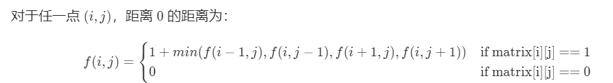
* 每个1到最近0的距离可以从4个邻位已记录的距离得出，因此我们可以通过比较四个方位得出最小距离来得所求。(dp数组保存最小距离，因为有四个方位所以我们需要进行两次遍历分别得出 左位、上位中的最小值 和  上述最小值、右位、下位中的最小值)
* 由于有四个方位需要记录，所以我们每次比较两个方位得出小值，最终得出四个方位的最小值。
* 这里要注意遍历顺序 我们需要先得出位于某个方位上的点到0的最短距离，才能求出走这个方位到0的最短距离。
* 也可以这样理解，从最近的0走到1，肯定只能从1周围上下左右4个点走到1，第一次从左上角到右下角遍历整个表，到表中任意位置i的时候，i上方和左方的位置已经遍历过了，所以可以判断从上方进入这个1和左方进入这个1的状况哪个最近，并在dp数组保存。同理，第二次从右下角到左上角遍历整个表到i位置时，i右方和下方的位置状态已经更新过了，所以能判断从右边进入合算还是从下边进入合算，再加上第一次遍历保存的左方和上方的最优解就能判断出上下左右四个方向的最优解了

```java
class Solution {
    static int[][] dirs = {{-1, 0}, {1, 0}, {0, -1}, {0, 1}};

    public int[][] updateMatrix(int[][] matrix) {
        int m = matrix.length, n = matrix[0].length;
        // 初始化动态规划的数组，所有的距离值都设置为一个很大的数
        int[][] dist = new int[m][n];
        for (int i = 0; i < m; ++i) {
            Arrays.fill(dist[i], Integer.MAX_VALUE / 2);
        }
        // 如果 (i, j) 的元素为 0，那么距离为 0
        for (int i = 0; i < m; ++i) {
            for (int j = 0; j < n; ++j) {
                if (matrix[i][j] == 0) {
                    dist[i][j] = 0;
                }
            }
        }
        // 只有 水平向左移动 和 竖直向上移动，注意动态规划的计算顺序
        //得出 到左方位和上方位得最小值+1
        //左边和上边得数要先存在 故从左上到右下遍历
        for (int i = 0; i < m; ++i) {
            for (int j = 0; j < n; ++j) {
                if (i - 1 >= 0) {
                    dist[i][j] = Math.min(dist[i][j], dist[i - 1][j] + 1);
                }
                if (j - 1 >= 0) {
                    dist[i][j] = Math.min(dist[i][j], dist[i][j - 1] + 1);
                }
            }
        }
        // 只有 水平向右移动 和 竖直向下移动，注意动态规划的计算顺序
        for (int i = m - 1; i >= 0; --i) {
            for (int j = n - 1; j >= 0; --j) {
                if (i + 1 < m) {
                    dist[i][j] = Math.min(dist[i][j], dist[i + 1][j] + 1);
                }
                if (j + 1 < n) {
                    dist[i][j] = Math.min(dist[i][j], dist[i][j + 1] + 1);
                }
            }
        }
        return dist;
    }
}
```

### [221. 最大正方形](https://leetcode-cn.com/problems/maximal-square/)

题解

https://leetcode-cn.com/problems/maximal-square/solution/li-jie-san-zhe-qu-zui-xiao-1-by-lzhlyle/

//TODO 重复练习

当我们判断以某个点为正方形右下角时最大的正方形时，那它的上方，左方和左上方三个点也一定是某个正方形的右下角，否则该点为右下角的正方形最大就是它自己了。这是定性的判断，那具体的最大正方形边长呢？我们知道，该点为右下角的正方形的最大边长，最多比它的上方，左方和左上方为右下角的正方形的边长多1，最好的情况是是它的上方，左方和左上方为右下角的正方形的大小都一样的，这样加上该点就可以构成一个更大的正方形。 但如果它的上方，左方和左上方为右下角的正方形的大小不一样，合起来就会缺了某个角落，这时候只能取那三个正方形中最小的正方形的边长加1了。假设dpi表示以i,j为右下角的正方形的最大边长，则有 `dp[i][j] = min(dp[i-1][j-1], dp[i-1][j], dp[i][j-1]) + 1` 当然，如果这个点在原矩阵中本身就是0的话，那dp[i]肯定就是0了。

```java
class Solution {
    public int maximalSquare(char[][] matrix) {
        // dp[i][j]：以matrix[i-1][j-1]为右下角的最大正方形边长。
        int[][] dp = new int[matrix.length + 1][matrix[0].length + 1];
        int max = 0;
        for(int i = 1; i <= matrix.length; i++){
            for(int j = 1; j <= matrix[0].length; j++){
                if(matrix[i - 1][j - 1] == '1'){
                    // 递推方程
                    dp[i][j] = Math.min(Math.min(dp[i - 1][j - 1], dp[i - 1][j]), dp[i][j - 1]) + 1;
                }else{
                    dp[i][j] = 0;
                }
                max = Math.max(max, dp[i][j]);
            }
        }

        return max * max;
    }
}
```

### 分割类型题

* 对于分割类型题，**动态规划的状态转移方程通常并不依赖相邻的位置，而是依赖于满足分割条件的位置。**

### [279. 完全平方数](https://leetcode-cn.com/problems/perfect-squares/)

题解

* 我们定义一个以数组dp，dp[i]表示数字i最少可以由几个完全平方数相加构成。易知位置i依赖i-k*k的位置。因此dp[i]可以取的最小值即为1+min(dp[i-1],dp[i-4],dp[i-9]..)。

```java
  public int numSquares(int n) {
        //dp数组
        int[] dp = new int [n+1];
        //用于记录每个位置的最小值
        int min =Integer.MAX_VALUE;
        //遍历每个位置
        for(int i = 1;i<=n;i++){
            //遍历每个n-k*k找出最小值 临界值判断 i-K*k>=0
            for(int k =1;i-k*k>=0;k++){
                if(min>=dp[i-k*k]+1){
                    min=dp[i-k*k]+1;
                }
            }
            dp[i]=min;
            min = Integer.MAX_VALUE;
        }
        //第n个位置即为所求
        return dp[n];
    }
```

* 进行优化

```java
    public int numSquares(int n) {
        //dp数组
        int[] dp = new int [n+1];
        //遍历每个位置
        for(int i = 1;i<=n;i++){
            //最坏的情况为每次加1
            dp[i] = i;
            //遍历每个n-k*k找出最小值 临界值判断 i-K*k>=0
            for(int k =1;i-k*k>=0;k++){
                dp[i] = Math.min(dp[i],dp[i-k*k]+1);
            }
        }
        //第n个位置即为所求
        return dp[n];
    }
```

### [91. 解码方法](https://leetcode-cn.com/problems/decode-ways/)

* 题解
* https://leetcode-cn.com/problems/decode-ways/solution/jie-ma-fang-fa-by-leetcode-solution-p8np/

```java
 //动态规划求解码个数
    public int numDecodings(String s) {
        int n = s.length();
        int [] fn = new int [n+1];
        fn[0] = 1;
        for(int i = 1 ;i<=n;i++){
            //前置判断
            //当前位置数不为0才可将该数单独解码
            if(s.charAt(i-1)!='0'){
                fn[i]+=fn[i-1];
            }
            //前一位置数不为0且前一位数和当前位数组合的数值小于等于26才可合并解码
            if(i>1&&s.charAt(i-2)!='0'&&((s.charAt(i-2)-'0')*10+s.charAt(i-1)-'0'<=26)){
                //将两种情况结果累加
                fn[i]+=fn[i-2];
            }
        }
        return fn[n];
    }
```

### [639. 解码方法 II](https://leetcode-cn.com/problems/decode-ways-ii/)

https://leetcode-cn.com/problems/decode-ways-ii/solution/gong-shui-san-xie-fen-qing-kuang-tao-lun-902h/

* 动态规划 时间和空间复杂度都是0(N) 

```java
class Solution {
    public int numDecodings(String s) {
        int mod = (int)1e9+7;
        int n = s.length();
        char[] array = s.toCharArray();

        // dp[i] : s[0..i-1]子串能够解码的数目 long类型：
        // 长度为n+1 可用于规避 i-2的判断
        long[] dp = new long[n+1];
        // 空串只能解码为一个空串
        dp[0] = 1;
        // 初始值
        dp[1] = array[0]=='*'?9:(array[0]!='0'?1:0);

        for(int i = 2;i<=n;i++){
            // 动态转移方程
            // s[i-1] 非数字
                // dp[i] = dp[i-1]*9; 基本项有9种
                // 判断能否和前一项字符构成重复数字 来额外加几项
            // s[i-1] 为数字
                // 前一项非数字
                    // 当前项为0 只有在前一项为1或2时能成功解码【前一项为* 故一定有两种情况】
                    // 当前项非0 分为基本项 和判断是否有重复项
                // 前一项为数字
                    // 当前项为0 只有在前一项为1或2时能成功解码
                    // 当前项非0 分为基本项 和判断是否有重复项 
            if(array[i-1]=='*'){
                dp[i] = dp[i-1]*9;

                if(array[i-2]=='1'){
                    dp[i] += dp[i-2]*9;
                }
                if(array[i-2]=='2'){
                    dp[i] += dp[i-2]*6;
                }
                if(array[i-2]=='*'){
                    dp[i] += dp[i-2]*15;
                }
            }else{
                if(array[i-2]=='*'){
                    if(array[i-1]=='0'){
                        dp[i] = dp[i-2]*2;
                    }else{
                        dp[i] = dp[i-1];
                        if(array[i-1]>='1'&&array[i-1]<='6'){
                            dp[i] += dp[i-2]*2;
                        }else{
                            dp[i] += dp[i-2];
                        }
                    } 
                }else{
                    if(array[i-1]=='0'){
                        if(array[i-2]=='1' || array[i-2]=='2') dp[i] = dp[i-2];
                    }else{
                        dp[i] = dp[i-1];
                        if(array[i-2]=='1') dp[i] +=dp[i-2];
                        if(array[i-2]=='2'&&(array[i-1]>='1'&&array[i-1]<='6')) dp[i] +=dp[i-2];
                    }
                }
            }
            // 最后再取模 中间过程结果可能会溢出造成最后结果出错 所以每次计算后取模
            dp[i] = dp[i] % mod;
        }

        return (int)dp[n];
    }
}
```

* 优化空间 时间为O(n) 空间为O(1)

```java
class Solution {
    public int numDecodings(String s) {
        int mod = (int)1e9+7;
        int n = s.length();
        char[] array = s.toCharArray();

        // dp[i] : s[0..i-1]子串能够解码的数目 long类型：
        // long[] dp = new long[n+1];

        // 因为 dp[i] 只取决于 dp[i-1] 和 dp[i-2]
        // 所以进行空间优化 f1 表示dp[i-1] f2 表示dp[i-2]
        long f1,f0;

        // 中间变量 用于进行f2的更新
        long temp;

        // 空串只能解码为一个空串
        // dp[0] = 1;
        f0 = 1;
        // 初始值
        // dp[1] = array[0]=='*'?9:(array[0]!='0'?1:0);
        f1 = array[0]=='*'?9:(array[0]!='0'?1:0);

        for(int i = 2;i<=n;i++){
            temp = f1;
            // 动态转移方程
            // s[i-1] 非数字
                // dp[i] = dp[i-1]*9; 基本项有9种
                // 判断能否和前一项字符构成重复数字 来额外加几项
            // s[i-1] 为数字
                // 前一项非数字
                    // 当前项为0 只有在前一项为1或2时能成功解码【前一项为* 故一定有两种情况】
                    // 当前项非0 分为基本项 和判断是否有重复项
                // 前一项为数字
                    // 当前项为0 只有在前一项为1或2时能成功解码
                    // 当前项非0 分为基本项 和判断是否有重复项 
            if(array[i-1]=='*'){
                f1 = f1*9;

                if(array[i-2]=='1'){
                    f1 += f0*9;
                }
                if(array[i-2]=='2'){
                    f1 += f0*6;
                }
                if(array[i-2]=='*'){
                    f1 += f0*15;
                }
            }else{
                if(array[i-2]=='*'){
                    if(array[i-1]=='0'){
                        f1 = f0*2;
                    }else{
                        f1 = f1;
                        if(array[i-1]>='1'&&array[i-1]<='6'){
                            f1 += f0*2;
                        }else{
                            f1 += f0;
                        }
                    } 
                }else{
                    if(array[i-1]=='0'){
                        if(array[i-2]=='1' || array[i-2]=='2') f1 = f0;
                        else f1 = 0; // 不满足解码情况
                    }else{
                        f1 = f1;
                        if(array[i-2]=='1') f1 += f0;
                        if(array[i-2]=='2'&&(array[i-1]>='1'&&array[i-1]<='6'))  f1 += f0;
                    }
                }
            }
            // 最后再取模 中间过程结果可能会溢出造成最后结果出错 所以每次计算后取模
            f1 = f1 % mod;
            // 更新f0;
            f0 = temp;
        }

        return (int)f1;
    }
}
```


### [剑指 Offer 53 - I. 在排序数组中查找数字 I](https://leetcode-cn.com/problems/zai-pai-xu-shu-zu-zhong-cha-zhao-shu-zi-lcof/)

```java
class Solution {
    public int search(int[] nums, int target) {

        // // dp 解法：
        // // dp[i] : nums[0-i-1]中target数目
        // int[] dp = new int[nums.length+1];
        // // base case dp[0] = 0 nums.length+1不用判断i是否大于1

        // for(int i = 1;i<=nums.length;i++){
        //     // if(dp[i]==target) dp[i] = dp[i-1]+1; 
        //     // else dp[i] = dp[i-1];
        //     // 状态转移方程 如果当前的数是目标数 则比dp[i-1]大1
        //     dp[i] = (nums[i-1]==target?1:0)+dp[i-1];
        // }

        // return dp[nums.length];

        // 优化空间 因为只需要前一天的值 所以可以使用局部变量来优化

        int cur = 0;

        for(int i = 1;i<=nums.length;i++){
            cur = (nums[i-1]==target?1:0)+cur;
        }
        return cur;
    }
}
```


### [139. 单词拆分](https://leetcode-cn.com/problems/word-break/)

* s 串能否分解为单词表的单词，即：前 s.length 个字符的 s 串能否分解为单词表单词。
* 将大问题分解为规模小一点的子问题，问题分解成：
  * 前 i 个字符的子串，能否分解成单词
  * 剩余子串，是否为单个单词。
* dp[i]：长度为i的s[0:i-1]子串是否能拆分成单词。题目求:dp[s.length]


**状态转移方程**

* 类似的，我们用指针 j 去划分s[0:i] 子串，如下图：
* s[0:i] 子串对应 dp[i+1] ，它是否为 true（s[0:i]能否 break），取决于两点**(分割条件)**：
  * 它的前缀子串 s[0:j-1] 的 dp[j] ，是否为 true。
  * 剩余子串 s[j:i]，是否是单词表的单词。
  * (**即依赖于满足分割条件的位置**)

**base case**

* base case 为dp[0] = true。即，长度为 0 的s[0:-1]能拆分成单词表单词。
* 这看似荒谬，但这只是为了让边界情况也能套用状态转移方程，仅此而已。
* 当 j = 0 时（上图黄色前缀串为空串），s[0:i]的dp[i+1]，取决于s[0:-1]的dp[0]，和，剩余子串s[0:i]是否是单个单词。
* 只有让dp[0]为真，dp[i+1]才会只取决于s[0:i]是否为单个单词，才能用上这个状态转移方程。

```java
class Solution {
    public boolean wordBreak(String s, List<String> wordDict) {
        //拿到字符串长度
        int n =s.length();
        //dp数组 dp[i]表示 s[0:i-1]字符串是否可拆分为单词表中单词
        boolean[] dp = new boolean[n+1];
        //首位为true 便于边界条件的状态转移
        dp[0] = true;
        for(int i =1 ;i<=n;i++){
            //对当前位置前的每一个位置进行遍历，判断其是否满足条件 即 s[0:j-1]可拆分且s[j:i-1]为单词表中单词
            for(int j =0;j<i;j++){
               //状态转移方程
                //判断当前子串S[0:i-1]是否可被拆分 1、s[0:j-1]可拆分 2、s[j:i-1]是单词表中单词
                if(dp[j]&&wordDict.contains(s.substring(j,i))){
                    dp[i]=true;
                    break;
                }
            }
        }
        return dp[n];
    }
}
```

### [343. 整数拆分](https://leetcode-cn.com/problems/integer-break/)

```java
class Solution {
    public int integerBreak(int n) {
        // dp[i]: i拆分为至少两个正整数的和，且使这些整数的乘积最大化的最大乘积值 
        int[] dp = new int[n+1];
        
        // 基准情况
        // dp[0] = 0 dp[1] = 0 //两者都不符合要求

        for(int i=2;i<=n;i++){
            // 对i而言 从 1..i-1中取两个数的和构成i 由于对称性只需取一般即可 【1+2 等价于 2+1】 
            for(int j=1;j<=(i/2);j++){
                // 动态转移方程 分为基础的两数相加 c= a+b  a=d+e+f.. 等价于 c = d+e+f+..+b 所以可以直接用两数表示即可
                // c = a+b 为保证 a*b最大 遍历整个范围取出最大的  a和b都要取最大的【如b b的最大组合乘积和b 中的最大值】
                // max(index,dp[index])
                int bigIndex = i-j;
                int bigValue = Math.max(bigIndex,dp[bigIndex]);
                int smallValue = Math.max(j,dp[j]);
                dp[i] = Math.max(dp[i],bigValue*smallValue);
            }
        }

        return dp[n];
    }
}
```


### 子序列问题

#### [300. 最长递增子序列](https://leetcode-cn.com/problems/longest-increasing-subsequence/)

https://leetcode-cn.com/problems/longest-increasing-subsequence/solution/dong-tai-gui-hua-er-fen-cha-zhao-tan-xin-suan-fa-p/

```java
    public int lengthOfLIS(int[] nums) {
        if(nums.length<2) return 1;//base case 只有一个元素时 
        int[] dp = new int[nums.length];//dp数组 dp[i] 表示以 nums[i] 结尾 的「上升子序列」的长度。注意：这个定义中 nums[i] 必须被选取，且必须是这个子序列的最后一个元素；
        Arrays.fill(dp,1);//填充dp数组初始值1
        for(int i =1;i<nums.length;i++){
            for(int j = 0;j<i;j++){
                //前面序列中找到比当前值小的位置 即可以构成递增子序列的位置
                if(nums[j]<nums[i]){
                    //判断是否需要更新递增子序列的长度
                    dp[i] = Math.max(dp[j]+1,dp[i]);
                }
            }
        }
        //找出以哪个元素结尾的子序列长度最长
        int res = 0;
        for(int i =0;i<dp.length;i++){
            res = Math.max(res,dp[i]);
        }
        return res;
    }
```

「动态规划」的方法在计算一个新的状态的时候，需要考虑到之前所有小于 `nums[i]` 的那些位置的状态。事实上还有改进的空间：首先修改「状态」的定义。//TODO

* ```c++
  #include <vector>
  class Solution {
  public:
      /**
       * 代码中的类名、方法名、参数名已经指定，请勿修改，直接返回方法规定的值即可
       *
       * 给定数组的最长严格上升子序列的长度。
       * @param arr int整型vector 给定的数组
       * @return int整型
       */
      int LIS(vector<int>& arr) {
          // write code here
          if(arr.size() <= 1) return arr.size();
  
          // dp[i]：arr中以i结尾的最长上升子序列长度
          vector<int> dp(arr.size(), 1);
          int res = 1;
          for(int i = 1; i < arr.size(); i++){
              for(int j = i - 1; j >= 0; j--){
                  if(arr[j] < arr[i]){ // 状态转移方程
                      dp[i] = max(dp[j] + 1, dp[i]);
                  }
              }
              res = max(res, dp[i]);
          }
          return res;
      }
  };
  ```

* 


#### [673. 最长递增子序列的个数](https://leetcode-cn.com/problems/number-of-longest-increasing-subsequence/)

https://leetcode-cn.com/problems/number-of-longest-increasing-subsequence/solution/gong-shui-san-xie-lis-de-fang-an-shu-wen-obuz/

```java
class Solution {
    // 在朴素 LIS 问题的基础上通过「记录额外信息」来进行求解即可
    public int findNumberOfLIS(int[] nums) {
        if(nums.length == 0) return 0;

        // dp[i] : 以i-1结尾的最长递增子序列的长度
        int[] dp = new int[nums.length];
        // combination[i]: 以i-1结尾的最长递增子序列的方案数
        int[] combination = new int[nums.length];

        // 初始最长和方案数都为1 
        Arrays.fill(dp,1);
        Arrays.fill(combination,1);

        // 用于记录最大长度 和 结果值
        int max = 1;
        int res = 0;

        for(int i = 1;i<dp.length;i++){

            // 往前遍历
            for(int j = 0; j<i;j++){

                if(nums[i]>nums[j]){
                    // 当前数可以接在后面
                    if(dp[j]+1>dp[i]){
                        // 长度可以更新 
                        dp[i] = dp[j]+1;
                        combination[i] = combination[j];
                    }else if(dp[j]+1==dp[i]){
                        // 找到了一个新的符合条件的前驱，此时将值继续累加到方案数当中
                        combination[i] +=combination[j];
                    }
                }
            }
            // 记录全局最长上升子序列的最大长度 max
            max = Math.max(max,dp[i]);
        }

        // 满足最大长度 的所有方案数的和
        for(int i = 0;i<dp.length;i++){
            if(dp[i]==max){
                res += combination[i];
            }
        }

        return res;
    }
}
```


#### [646. 最长数对链](https://leetcode-cn.com/problems/maximum-length-of-pair-chain/)

```java
class Solution {
    public int findLongestChain(int[][] pairs) {
            
        // 先对 数对第一个数字升序排序 
        Arrays.sort(pairs, new Comparator<int[]>(){
            @Override
            public int compare(int[] a, int[] b){
                return a[0]>b[0]?1:(a[0]==b[0]?0:-1);
            }
        });

        // dp[i]: 以i-1 数对结尾链长度
        int[] dp = new int[pairs.length+1];
        // 初始值 以0数对结尾的链长度一定为1  因为其最小  其他最小链长度为1
        Arrays.fill(dp,1);
        for(int i = 2;i <= pairs.length; i++){
            // 往前移一直移到到第一个数对 
            for(int j = i-1;j >= 1;j--){
                if(pairs[i-1][0] > pairs[j-1][1]){
                    // 能与当前遍历到的数对构成链 取最大值 以当前遍历到的数对结尾的链长度+1 和 当前值
                    dp[i] = Math.max(dp[i],dp[j]+1);
                }
            }
        }

        // 因为最后一个数对最大 故以其结尾的链必定长度最长
        return dp[pairs.length];
    }
}
```


#### [1143. 最长公共子序列](https://leetcode-cn.com/problems/longest-common-subsequence/)

求两个数组或者字符串的最长公共子序列问题，肯定是要用动态规划的。下面的题解并不难，你肯定能看懂。

* 首先，区分两个概念：子序列可以是不连续的；子数组（子字符串）需要是连续的；
* 另外，动态规划也是有套路的：单个数组或者字符串要用动态规划时，可以把动态规划 dp[i] 定义为 nums[0:i] 中想要求的结果；当两个数组或者字符串要用动态规划时，可以把动态规划定义成两维的 dp[i][j] ，其含义是在 A[0:i] 与 B[0:j] 之间匹配得到的想要的结果。

https://leetcode-cn.com/problems/longest-common-subsequence/solution/fu-xue-ming-zhu-er-wei-dong-tai-gui-hua-r5ez6/

```java
    public int longestCommonSubsequence(String text1, String text2) {
        int m = text1.length();
        int n = text2.length();
        //dp数组 dp[i][j]表示 text1[0:i-1]和text2[0:j-1]的最长公共子序列的长度
        //dp[0][j]和dp[i][0]为0 可通过初始化直接得到表示空子串与某个字符串的最长公共子序列长度任为0
        int[][] dp = new int[m+1][n+1];
        //遍历方向从小到大
        for(int i =1;i<m+1;i++){
            for(int j =1;j<n+1;j++){
                //情况一 text1[i-1]==text2[j-1] 两个位置的字符相同 
                //表示text1[0:i-1]和text2[0:j-1]最长公共子序列的长度相比text1[0:i-2]和text2[0:j-2]的长度加一
                if(text1.charAt(i-1)==text2.charAt(j-1)){
                    dp[i][j]=dp[i-1][j-1]+1;
                }else{
                    //情况二 两个位置的字符不相等
                    //此时只能是text1[0:i-1]和text2[0:j] 与 text1[0:i]和text2[0:j-1] 两组某个字符串少了一个字符与另一完全字符串中的较大长度
                    dp[i][j]=Math.max(dp[i-1][j],dp[i][j-1]);
                }
            }
        }
        return dp[m][n];
    }
```

#### [583. 两个字符串的删除操作](https://leetcode-cn.com/problems/delete-operation-for-two-strings/)

```java
class Solution {
    public int minDistance(String word1, String word2) {
        // base case
        if(word1.equals("")) return word2.length();
        if(word2.equals("")) return word1.length();

        // 将两个字符串转为字符数组，便于操作
        char[] string1 = word1.toCharArray();
        char[] string2 = word2.toCharArray();

        // dp[i][j]: 字符串0..i-1的子串 变化到 与 字符串 0..j-1的子串相同 所需的最小步数
        int[][] dp = new int[word1.length()+1][word2.length()+1];

        // "" 变化到与 任意字符串相同的最小步数 都为字符串的长度  
        for(int i=1;i<=word1.length();i++){
            dp[i][0] = i;
        }
        for(int j=1;j<=word2.length();j++){
            dp[0][j] = j;
        }

        //TODO 证明动态转移方程
        for(int i=1;i<=word1.length();i++){
            for(int j=1;j<=word2.length();j++){

                if(string1[i-1]==string2[j-1]){
                    // 此时新增的字符相等 等价于 两个子串都少一个字符的情况
                    dp[i][j] = dp[i-1][j-1];
                }else{
                    // 新增到的字符不等 
                    // 找出两个子串各自少一个字符变化到与另一完整字符相等的最小步数 两者中的最小值 + 1即为所求
                    dp[i][j] = Math.min(dp[i-1][j],dp[i][j-1])+1;
                }
            }
        }

        return dp[word1.length()][word2.length()];
    }
}
```

#### [376. 摆动序列](https://leetcode-cn.com/problems/wiggle-subsequence/)

https://leetcode-cn.com/problems/wiggle-subsequence/solution/tan-xin-si-lu-qing-xi-er-zheng-que-de-ti-jie-by-lg/

```java
class Solution {
    public int wiggleMaxLength(int[] nums) {
        // base case 
        if(nums.length == 1) return 1;
        if(nums.length == 2){
            return (nums[0] != nums[1]) ? 2 : 1;
        }

        // dp[i][0] : 从nums[0]到nums[i]的最长摆动序列长度 且最后两个数字递减
        // dp[i][1] : 从nums[0]到nums[i]的最长摆动序列长度 且最后两个数字递增
        int[][] dp = new int[nums.length][2];
        // 只有一个数字 其长度是1
        dp[0][0] = 1;
        dp[0][1] = 1;

        for(int i = 1;i<nums.length;i++){
            if(nums[i]>nums[i-1]){
                // 出现递增 对最后两个数字递减的最长摆动序列长度无影响
                dp[i][0] = dp[i-1][0];

                // 设最后两个元素递增的最长摆动序列 最远元素下标为 j
                // j == i-1 时 遇到新的上升元素后 dp[i][1] = dp[i-1][0]+1
                // j != i-1 时 那么 nums[j:i-1] 一定是递增的，因为若完全递减，最远元素下标等于 i，
                // 若波动，那么 dp[i-1][0] > dp[j][0] 【后面有摆动即长度更长】
                // 由于 nums[j:i-1] 递增，dp[j:i-1][0] 一直等于 dp[j][0] ，依然满足 dp[i][1] = dp[i-1][0]+1
                dp[i][1] = dp[i-1][0]+1;
            }else if(nums[i]<nums[i-1]){
                dp[i][0] = dp[i-1][1]+1;
                dp[i][1] = dp[i-1][1];
            }else{
                // 新的元素不能用于任何序列，保持不变
                dp[i][0] = dp[i-1][0];
                dp[i][1] = dp[i-1][1];
            }
        }

        return Math.max(dp[nums.length-1][0],dp[nums.length-1][1]);
    }
}
```


#### 回文

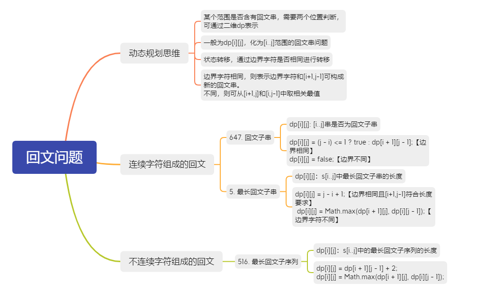

##### [647. 回文子串](https://leetcode-cn.com/problems/palindromic-substrings/)

* 回文问题常采用**双指针**做法，但也可使用动态规划解法

* 时间复杂度O(n^2)

* 空间复杂度O(n^2)

* ```java
  class Solution {
      public int countSubstrings(String s) {
          int n = s.length();
          // 具有不同开始位置或结束位置的子串，即使是由相同的字符组成，也会被视作不同的子串。
          // 从上面的描述推出以下dp定义【通过判断每个不同开始结束位置子串的是否回文来获取结果】
          // dp[i][j]: [i..j]是否为回文子串
          boolean[][] dp = new boolean[n][n];
          int res = 0;
  
          // 根据状态转移方程 得出当前状态依赖于左下方的状态 故需要从左往右 从下往上遍历
          for(int i = n - 1; i >= 0; i--){
              for(int j = i; j < n; j++){
                  char first = s.charAt(i);
                  char end = s.charAt(j);
  
                  // 状态转移方程：根据首尾字符是否相同、首尾距离以及中间子串是否回文 推出当前子串是否回文
                  if(first != end){
                      dp[i][j] = false;
                  }else{
                      dp[i][j] = (j - i) <= 1 ? true : dp[i + 1][j - 1];
                      // 记录个数
                      if(dp[i][j]) res++;
                  }
              }
          }
  
          return res;
  
      }
  }
  ```


##### [5. 最长回文子串](https://leetcode-cn.com/problems/longest-palindromic-substring/)

* 动态规划解法

  ```java
  class Solution {
      public String longestPalindrome(String s) {
          String res = "";
          if(s == null || s.length() == 0) return res;
          int n = s.length();
          // dp[i][j]：s[i..j]中最长回文子串的长度
          int[][] dp = new int[n][n];
  
          // 初始化
          res = s.substring(0, 1);
          for(int i = 0; i < n; i++){
              dp[i][i] = 1;
          }
  
          for(int i = n - 1; i >=0; i--){
              for(int j = i + 1; j < n; j++){
                  if(s.charAt(i) == s.charAt(j) && dp[i + 1][j - 1] == j - i - 1){
                      // s[i..j]可构成回文的情况
                      dp[i][j] = j - i + 1;
                      if(dp[i][j] > res.length()){
                          res = s.substring(i, j + 1);
                      }
                  }else{
                      // 不可构成回文，则取最大的回文子串长度
                      dp[i][j] = Math.max(dp[i + 1][j], dp[i][j - 1]);
                  }
              }
          }
  
          return res;
      }
  }
  ```

* 解法二：中心扩散法

* 遍历**每个字符作为中心点所能够得到的最长回文串**。

* 缺点：含有大量重复计算，可用动态规划解决【空间换时间】

* ```java
  class Solution {
      public String longestPalindrome(String s) {
          if(s == null || s.length() == 0) return "";
          int max = 0;
          int maxLeft = 0;
          int maxRight = 0;
          int len = -1;
          for(int i = 0; i < s.length(); i++){
              // (left, right)内为回文串
              int left = i - 1;
              int right = i + 1;
              
              // 首先往左寻找与当期位置相同的字符，直到遇到不相等为止。
  			// 然后往右寻找与当期位置相同的字符，直到遇到不相等为止。
              // cbaa[a]aabc
              while(left >= 0 && s.charAt(left) == s.charAt(i)){
                  left--;
              }
              while(right < s.length() && s.charAt(right) == s.charAt(i)){
                  right++;
              }
  			// cb[aaaaa]bc
              // 最后左右双向扩散，直到左和右不相等。
              while(left >= 0 && right < s.length() && s.charAt(right) == s.charAt(left)){
                  left--;
                  right++;
              }
              
              // [cbaaaaabc]
              if(right - left - 1 > len){
                  len = right - left - 1;
                  maxLeft = left;
                  maxRight = right;
              }
          }
  
          return s.substring(maxLeft+1, maxRight);
      }
  }
  ```
  
* 类似的dp

* ```java
  class Solution {
      public String longestPalindrome(String s) {
          if(s == null || s.length() == 0) return "";
          int n = s.length();
          int[][] dp = new int[n][n];
          for(int i = 0; i < n; i++){
              dp[i][i] = 1;
          }
          int maxLeft = 0;
          int maxRight = 0;
          for(int i = n - 1; i >= 0; i--){
              for(int j = i + 1; j < n; j++){
                  if(s.charAt(i) == s.charAt(j) && dp[i + 1][j - 1] == j - i -1){
                      dp[i][j] = j - i + 1;
                      if(dp[i][j] > maxRight - maxLeft + 1){ // 区间构成完全回文情况，记录位置
                          maxRight = j;
                          maxLeft = i;
                      }
                  }else{
                      dp[i][j] = Math.max(dp[i + 1][j], dp[i][j - 1]);
                  }
              }
          }
  
          return s.substring(maxLeft, maxRight + 1);
      }
  }
  ```

* 


##### [516. 最长回文子序列](https://leetcode-cn.com/problems/longest-palindromic-subsequence/)

* 经典子序列回文问题

* ```java
  class Solution {
      public int longestPalindromeSubseq(String s) {
          if(s == null || s.length() == 0) return 0;
          int n = s.length();
  
          // dp[i][j]：s[i..j]中的最长回文子序列的长度
          int[][] dp = new int[n][n];
  
          // 初始化 只含有一个字符时
          for(int i = 0; i < n; i++){
              dp[i][i] = 1;
          }
  
          // 根据状态转移方程推出遍历顺序
          for(int i = n - 1; i >= 0; i--){
              for(int j = i + 1; j < n; j++){
                  // 状态转移
                  if(s.charAt(i) == s.charAt(j)){
                      // 两个边界字符相同
                      dp[i][j] = dp[i + 1][j - 1] + 2;
                  }else{
                      // 两个边界字符不同，把它俩分别加入s[i+1..j-1]中，看看哪个子串产生的回文子序列更长即可：
                      dp[i][j] = Math.max(dp[i + 1][j], dp[i][j - 1]);
                  }
              }
          }
  
          return dp[0][n - 1];
      }
  }
  ```

  


### 子序列和子数组问题

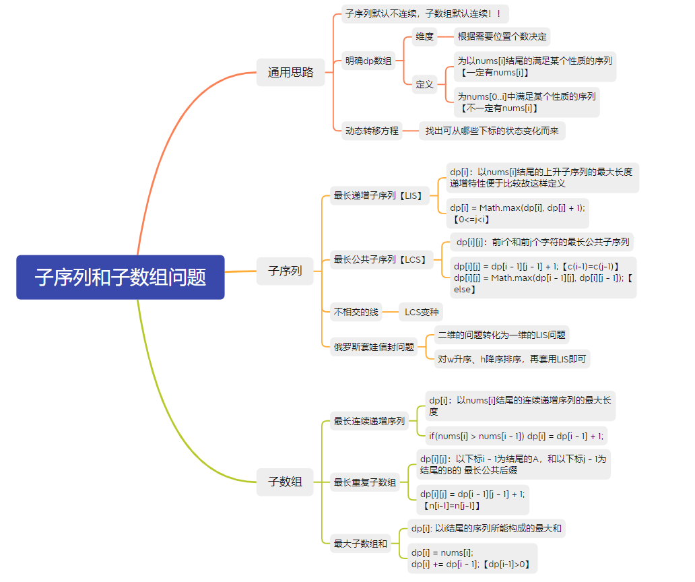


* 子序列默认不连续，子数组默认连续！！

* 子序列dp数组【重要】：

  * 区分一维还是二维：

    需要数组或者字符串中的位置个数来定

    【最长递增子序列、最长连续递增序列、最大子数组和】的状态都是**求某个位置结尾**能有的最值【最长序列长度、最大和】，只需要一个位置，故为一维。

    【最长公共子序列、最长重复子数组、不相交的线】的状态都是**需要两个位置**，分别指向两个数组或字符串的某个位置，故为二维

    ```java
    // 序列 一维模板
    int n = array.length;
    int[] dp = new int[n];
    
    for (int i = 1; i < n; i++) {
        for (int j = 0; j < i; j++) {
            dp[i] = 最值(dp[i], dp[j] + ...)
        }
    }
    
    // 序列 二维模板
    int n = arr.length;
    int[][] dp = new dp[n][n];
    
    for (int i = 0; i < n; i++) {
        for (int j = 1; j < n; j++) {
            if (arr[i] == arr[j]) 
                dp[i][j] = dp[i][j] + ...
            else
                dp[i][j] = 最值(...)
        }
    }
    ```

    

  * dp数组的定义：

    为**以nums[i]结尾**的满足某个性质的序列【一定有nums[i]】

    **为nums[0..i]中**满足某个性质的序列【不一定有nums[i]】

    最长递增子序列、最长连续递增序列、最大子数组和、最长重复子数组都为第一种情况

    最长公共子序列、不相交的线都为第二种。

* 动态转移方程：

  * 一般dp定义好后，找出可从哪些下标的状态变化而来

* 初始化：

* 遍历顺序：

  * 动态转移方程推出

  


#### [300. 最长递增子序列](https://leetcode-cn.com/problems/longest-increasing-subsequence/)


* ```java
  class Solution {
      public int lengthOfLIS(int[] nums) {
          if(nums == null || nums.length == 0) return 0;
  
          // dp[i]：以nums[i]结尾的上升子序列的最大长度 递增特性便于比较故这样定义
          int[] dp = new int[nums.length];
  
          // 初始化
          // 填充元素
          Arrays.fill(dp, 1);
          // 记录最大值
          int max = 1;
  
          for(int i = 1; i < nums.length; i++){
              // 状态转移 往前遍历找出可构成以nums[i]结尾的递增子序列
              for(int j = i - 1; j >= 0; j--){
                  if(nums[j] < nums[i]){
                      dp[i] = Math.max(dp[i], dp[j] + 1);
                  }
              }
  
              max = Math.max(dp[i], max);
          }
  
          return max;
      }
  }
  ```

  

#### [674. 最长连续递增序列](https://leetcode-cn.com/problems/longest-continuous-increasing-subsequence/)

* ```java
  class Solution {
      public int findLengthOfLCIS(int[] nums) {
          if(nums == null || nums.length == 0) return 0;
  
          // dp[i]：以nums[i]结尾的连续递增序列的最大长度
          int[] dp = new int[nums.length];
          // 初始化 默认长度为1
          Arrays.fill(dp, 1);
  
          int max = 1;
          for(int i = 1; i < nums.length; i++){
              if(nums[i] > nums[i - 1]) dp[i] = dp[i - 1] + 1;
              max = Math.max(dp[i], max);
          }
  
          return max;
      }
  }
  ```

* 

#### [718. 最长重复子数组](https://leetcode-cn.com/problems/maximum-length-of-repeated-subarray/)

* ```java
  class Solution {
      public int findLength(int[] nums1, int[] nums2) {
          if(nums1 == null || nums2 == null) return 0;
  
          // dp[i][j]：以下标i - 1为结尾的A的子数组，和以下标j - 1为结尾的B的子数组 最长公共后缀
          // 就是两个序列尾端为i - 1和j - 1所能有的最大公共长度
          int[][] dp = new int[nums1.length + 1][nums2.length + 1];
    ss
          // 初始化 下标为-1时 没有公共的
          // dp[0][j] = 0;
          // dp[i][0] = 0;
  
          int max = 0;
  
          for(int i = 1; i <= nums1.length; i++){
              for(int j = 1; j <= nums2.length; j++){
                  if(nums1[i - 1] == nums2[j - 1]){
                      // 依赖左上方
                      dp[i][j] = dp[i - 1][j - 1] + 1;
                  }
                  if(dp[i][j] > max) max = dp[i][j];
              }
          }
  
          return max;
      }
  }
  ```

* 

#### [1143. 最长公共子序列](https://leetcode-cn.com/problems/longest-common-subsequence/)

* ```java
  class Solution {
      public int longestCommonSubsequence(String text1, String text2) {
          if(text1 == null || text2 == null) return 0;
  
          // dp[i][j]：前i个和前j个字符的最长公共子序列
          int[][] dp = new int[text1.length() + 1][text2.length() + 1];
  
          for(int i = 1; i <= text1.length(); i++){
              for(int j = 1; j <= text2.length(); j++){
                  // 状态转移
                  if(text1.charAt(i - 1) == text2.charAt(j - 1)){
                      // dp[i - 1][j - 1] + 1 >= dp[i - 1][j] 和 dp[i][j - 1]
                      dp[i][j] = dp[i - 1][j - 1] + 1;
                  }else{
  
                      // dp[i - 1][j] 和 dp[i][j - 1] >= dp[i - 1][j - 1]【毕竟多了一个字符】
                      dp[i][j] = Math.max(dp[i - 1][j], dp[i][j - 1]);
                  }
              }
          }
  
          return dp[text1.length()][text2.length()];
      }
  }
  ```

* 

#### [1035. 不相交的线](https://leetcode-cn.com/problems/uncrossed-lines/)

* ```java
  class Solution {
      public int maxUncrossedLines(int[] nums1, int[] nums2) {
          if(nums1 == null || nums2 == null) return 0;
  
          // dp[i][j]：前i个和前j个数字的最长公共子序列
          int[][] dp = new int[nums1.length + 1][nums2.length + 1];
          
          for(int i = 1; i <= nums1.length; i++){
              for(int j = 1; j <= nums2.length; j++){
                  if(nums1[i - 1] == nums2[j - 1]){
                      dp[i][j] = dp[i - 1][j - 1] + 1;
                  }else{
                      dp[i][j] = Math.max(dp[i - 1][j], dp[i][j - 1]);
                  }
              }
          }
  
          return dp[nums1.length][nums2.length];
      }
  }
  ```

* 

#### [53. 最大子数组和](https://leetcode-cn.com/problems/maximum-subarray/)

* ```java
  class Solution {
      public int maxSubArray(int[] nums) {
          if(nums == null || nums.length == 0) return 0;
          // dp[i]: 以i结尾的序列所能构成的最大和
          int[] dp = new int[nums.length];
          dp[0] = nums[0];
          int max = dp[0];
  
          for(int i = 1; i < nums.length; i++){
              // 状态转移 一定有i位置
              dp[i] = nums[i];
  
              // 前一位置结尾的最大和大于0，可以和其拼接
              if(dp[i - 1] > 0){
                  dp[i] += dp[i - 1];
              }
              if(max < dp[i]) max = dp[i];
          }
  
          return max;
      }
  }
  ```


#### 对应最大和子数组

* 输出具有最大和的子数组

* 记录遍历过程中每个子数组对应的左右边界，当该子数组的和更大时，保存其边界

* 难点在于**如何更新每个子数组的左边界**【右边界固定为i】

* ```java
  class Solution {
      public int maxSubArray(int[] nums) {
          if(nums == null || nums.length == 0) return 0;
          
          int[] dp = new int[nums.length];
          dp[0] = nums[0];
          int max = dp[0];
  
          // 某个子数组所具有单调最大和的左边界 右边界统一为i
          int tempLeft = 0;
          // 具有最大和的子数组 的边界
          int left = 0;
          int right = 0;
          for(int i = 1; i < dp.length; i++){
              if(dp[i-1] > 0){ // 以i结尾的子数组无需更新其左边界
                  dp[i] = dp[i - 1] + nums[i];
              }else{ // 以i结尾的子数组需更新左边界
                  tempLeft = i;
                  dp[i] = nums[i];
              }
              if(dp[i] > max){ //出现更大值进行记录
                  right = i;
                  left = tempLeft;
                  max = dp[i];
              }
          }
          System.out.println(Arrays.toString(Arrays.copyOfRange(nums, left, right + 1)));
      }
  }
  ```

  


#### [354. 俄罗斯套娃信封问题](https://leetcode-cn.com/problems/russian-doll-envelopes/)

* 最长递增子序列LIS问题的变种【标准的 LIS 算法只能在数组中寻找最长子序列，而我们的信封是由 `(w, h)` 这样的二维数对形式表示的，如何把 LIS 算法运用过来呢？】

* 解法1：先对w、h都为升序排序，然后套用LIS框架

  ```java
  class Solution {
      public int maxEnvelopes(int[][] envelopes) {
          if(envelopes == null || envelopes.length == 0) return 0;
  
          // 排序 w优先 h其次
          Arrays.sort(envelopes, (int[] a, int[] b)->{
              return a[0] > b[0] ? 1 : (a[0] == b[0] ? (a[1] > b[1] ? 1 : (a[1] == b[1] ? 0 : -1)) : -1);
          });
  
          // dp[i]: i结尾的信封最多能套娃的个数
          int[] dp = new int[envelopes.length];
          // 初始化 每个信封套自己
          Arrays.fill(dp, 1);
          int max = 1;
  
          for(int i = 1; i < envelopes.length; i++){
              // 状态转移 遍历前面所有信封
              for(int j = i - 1; j >= 0; j--){
                  // 可以套
                  if(envelopes[i][0] > envelopes[j][0] && envelopes[i][1] > envelopes[j][1]){
                      dp[i] = Math.max(dp[i],dp[j] + 1);
                  }
                  if(max < dp[i]) max = dp[i];
              }
          }
  
          return max;
      }
  }
  ```

* 解法二：对w升序排序，h降序排序，这样只需在h上进行LIS即可，因为两个宽度相同的信封不能相互包含的，**逆序排序保证在 `w` 相同的数对中最多只选取一个。**

  ```java
  class Solution {
      public int maxEnvelopes(int[][] envelopes) {
          if(envelopes == null || envelopes.length == 0) return 0;
  
          // 排序 w升序 h降序
          Arrays.sort(envelopes, (int[] a, int[] b)->{
              return a[0] == b[0] ? b[1] - a[1] : a[0] - b[0];
          });
  
          // dp[i]: i结尾的信封最多能套娃的个数
          int[] dp = new int[envelopes.length];
          // 初始化 每个信封套自己
          Arrays.fill(dp, 1);
          int max = 1;
  
          for(int i = 1; i < envelopes.length; i++){
              // 状态转移 遍历前面所有信封 宽度一定小于等于当前 等于时必定没有envelopes[i][1] > envelopes[j][1]
              for(int j = i - 1; j >= 0; j--){
                  // 可以套
                  if(envelopes[i][1] > envelopes[j][1]){
                      dp[i] = Math.max(dp[i],dp[j] + 1);
                  }
                  if(max < dp[i]) max = dp[i];
              }
          }
  
          return max;
      }
  }
  ```

  


### 背包问题

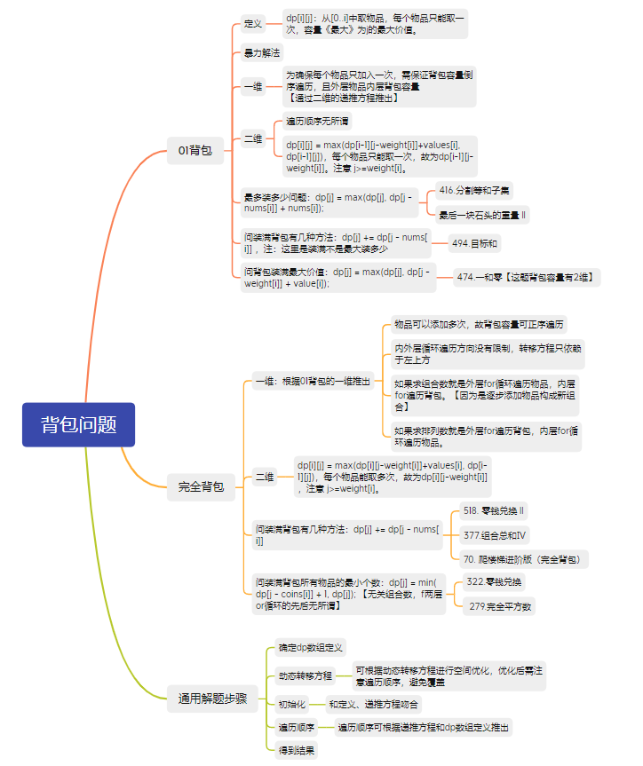

0-1背包是有n种物品，每种物品有一个，完全背包是有n种物品，每种物品有无限个，多重背包是有n种物品，每种物品的个数各不相同

解题模板：https://leetcode-cn.com/problems/partition-equal-subset-sum/solution/yi-pian-wen-zhang-chi-tou-bei-bao-wen-ti-a7dd/

具体问题转换为背包问题的思路：https://leetcode-cn.com/problems/partition-equal-subset-sum/solution/0-1-bei-bao-wen-ti-xiang-jie-zhen-dui-ben-ti-de-yo/ //待看

#### 0-1背包问题

##### [416. 分割等和子集](https://leetcode-cn.com/problems/partition-equal-subset-sum/)

```java
class Solution {
    public boolean canPartition(int[] nums) {
        int sum = 0;
        for (int i : nums) {
            sum += i;
        }
        if ((sum & 1) == 1) {
            return false;
        }
        int length = nums.length;
        int target = sum >> 1;
        //dp[j]表示前i个元素可以找到相加等于j情况
        boolean[] dp = new boolean[target + 1];
        //对于第一个元素，只有当j=nums[0]时，才恰好填充满
        if (nums[0] <= target) {
            dp[nums[0]] = true;
        }

        for (int i = 1; i < length; i++) {
            //j由右往左直到nums[i]
            for (int j = target; j >= nums[i]; j--) {
                //只有两种情况，要么放，要么不放
                //取其中的TRUE值
                dp[j] = dp[j] || dp[j - nums[i]];
            }
            //一旦满足，结束，因为只需要找到一组值即可
            if (dp[target]) {
                return dp[target];
            }
        }
        return dp[target];
    }
}
```

*  第二遍再次做【从二维到一维】

* 时间复杂度O(nm)

* 空间复杂度O(m)

* ```java
  class Solution {
      public boolean canPartition(int[] nums) {
          if(nums.length <= 1) return false;
          int sum = 0;
          for(int num : nums){
              sum += num;
          }
          if((sum & 1) == 1) return false;
          sum = sum >> 1;
  
          // dp[i][j]：0到i索引的物品中 每种只能选一次，重量为j的背包，的最大价值
          // 这里重量数组和价值数组都为nums 背包最大重量为sum
          // int[][] dp = new int[nums.length][sum + 1];
         
          // 优化空间复杂度 
          // dp[j]：重量为j的背包的最大价值
          int[] dp = new int[sum + 1];
          
          // 初始化 只能选索引0物品时，如果背包重量足够 则最大价值为nums[0]
          // for(int j = 1; j <= sum; j++){
          //     dp[0][j] = j < nums[0] ? 0 : nums[0];
          // }
  
          // 初始化
          for(int j = 1; j <= sum; j++){
              dp[j] = j < nums[0] ? 0 : nums[0];
          }
  
          // 注意遍历顺序：依赖于左上方，未避免覆盖 故需要从右往左
          for(int i = 1; i < nums.length; i++){
              for(int j = sum; j >= 1; j--){
                  if(j >= nums[i])
                      dp[j] = Math.max(dp[j], dp[j - nums[i]] + nums[i]);
              }
          }
  
          // 当前状态依赖于左上方 
          // 遍历顺序：左到右、上到下
          // for(int i = 1; i < nums.length; i++){
          //     for(int j = 1; j <= sum; j++){
          //         // 状态转移：dp[i][j] = max(dp[i - 1][j], dp[i - 1][j - weight[i]] + value[i]);
          //         dp[i][j] = dp[i - 1][j];
          //         if(j - nums[i] >= 0) dp[i][j] = Math.max(dp[i][j], dp[i -1][j - nums[i]] + nums[i]);
          //     }
          // }
  
          // 重量为sum的背包的最大价值为sum 此时表示可以分割
          // return dp[nums.length - 1][sum] == sum;
          return dp[sum] == sum;
      }
  }
  ```

* 参考链接https://www.programmercarl.com/0416.%E5%88%86%E5%89%B2%E7%AD%89%E5%92%8C%E5%AD%90%E9%9B%86.html#%E5%85%B6%E4%BB%96%E8%AF%AD%E8%A8%80%E7%89%88%E6%9C%AC

* ```c++
  class Solution {
  public:
      bool canPartition(vector<int>& nums) {
          if(nums.size() <= 1) return false;
          int sum = 0;
          for(auto num : nums){
              sum += num;
          }
          if((sum % 2) == 1) return false;
          // vector<vector<int>> dp(nums.size(), vector<int>(sum / 2 + 1, 0));
          // if(nums[0] <= sum / 2){
          //     for(int j = nums[0]; j <= sum / 2; j++){
          //         dp[0][j] = nums[0];
          //     }
          // }
  
          // for(int i = 1; i < nums.size(); i++){
          //     for(int j = 1; j <= sum / 2; j++){
          //         if(nums[i] <= j){
          //             dp[i][j] = max(dp[i-1][j], dp[i-1][j-nums[i]] + nums[i]);
          //         }else{
          //             dp[i][j] = dp[i-1][j];
          //         }
          //     }
          // }
  
          // return dp[nums.size() - 1][sum / 2] == sum / 2;
  
          // 空间优化
          sum /= 2;
          vector<int> dp(sum + 1, 0);
          for(int j = 1; j <= sum; j++){
              if(j >= nums[0]) dp[j] = nums[0];
          }
          
          for(int i = 1; i < nums.size(); i++){
              for(int j = sum; j >= nums[i]; j--){ // 遍历顺序 避免覆盖
                  dp[j] = max(dp[j], dp[j - nums[i]] + nums[i]);
              }
          }
  
          return dp[sum] == sum;
      }
  };
  ```

* 


##### [1049. 最后一块石头的重量 II](https://leetcode-cn.com/problems/last-stone-weight-ii/)

* 重点在于理解题目转换为背包问题。。https://leetcode-cn.com/problems/last-stone-weight-ii/solution/gong-shui-san-xie-xiang-jie-wei-he-neng-jgxik/

* ```java
  class Solution {
      // 转换为背包问题：提目抽象为将n块石头分为两堆，而后求两堆石头重量总和的最小差值
      // 因此便可看为01背包问题，背包最大容量为这n块石头总重量的一半
      // 那么理想情况下，如果可以刚好装满背包，两堆石头重量总和的最小差值便可为零
      // 中间粉碎后重放的操作 只是将两个石子所在堆不变或交换而已 最终达到整体两个堆的差值最小
      public int lastStoneWeightII(int[] stones) {
          if(stones.length == 1) return stones[0];
          int n = stones.length;
          int sum = 0;
  
          for(int stone : stones){
              sum += stone;
          }
  
          // 背包容量上限为石头总重量的一半 <= sum / 2
          // dp[i][j]：0-i - 1的石子中选择 容量为j的背包的实际最大价值
          // int[][] dp = new int[n + 1][sum / 2 + 1];
          int[] dp = new int[sum / 2 + 1];
  
          // for(int i = 1; i <= n; i++){
          //     for(int j = 1; j <= sum / 2; j++){
          
          //         if(j >= stones[i - 1]){
          //             // 容量够放入新物品，则判断放入后是否能得到更大价值
          //             dp[i][j] = Math.max(dp[i - 1][j], dp[i - 1][j - stones[i - 1]] + stones[i - 1]);
          //         }else{
          //             // 容量不够放入新物品 则沿用上一次的最大值
          //             dp[i][j] = dp[i - 1][j];
          //         }
          //     }
          // }
  
          for(int i = 1; i <= n; i++){
              for(int j = sum  / 2 ; j >= stones[i - 1]; j--){
                  dp[j] = Math.max(dp[j], dp[j - stones[i - 1]] + stones[i - 1]);
              }
          }
  
          //dp[n][sum/2]的最大值为sum/2，因此最理想的结果为0 subB - subA =sum-subA-subA =sum -subA*2
          // subA为小的堆 确保如果总和为奇数 结果仍大于零
          // return sum - dp[n][sum / 2] * 2;
  
          return sum - dp[sum / 2] * 2;
          }
  }
  ```
  
* 


##### [474. 一和零](https://leetcode-cn.com/problems/ones-and-zeroes/)

https://leetcode-cn.com/problems/partition-equal-subset-sum/solution/0-1-bei-bao-wen-ti-xiang-jie-zhen-dui-ben-ti-de-yo/

```java
    public int findMaxForm(String[] strs, int m, int n) {
       int[][] dp = new int[m+1][n+1];
       for(String str: strs){
           int zeroNum = 0;
           int oneNum = 0;
           for(int i =0;i<str.length();i++){
               if(str.charAt(i)=='0') zeroNum++;
               else if(str.charAt(i)=='1') oneNum++;
           }

           for(int i =m;i>=zeroNum;i--){
               for(int j=n;j>=oneNum;j--){
                   dp[i][j] = Math.max(dp[i][j],dp[i-zeroNum][j-oneNum]+1);
               }
           }
       }
       return dp[m][n];
    }
```

* 再次做：

* 01背包问题：字符串即物品，背包重量有两种维度【0个数和1个数】，背包价值即子集长度

* ```java
  class Solution {
      public int findMaxForm(String[] strs, int m, int n) {
          // 转化为01背包问题，只是背包重量有两个维度，价值即子集的长度
          // dp[i][j][k]: 从0-i-1中选或不选元素最多有j个0和k个1的最大子集长度
          int[][][] dp = new int[strs.length + 1][m + 1][n + 1];
         // 根据定义和状态转移方程初始化都为0
          
          // 根据状态转移方程推出遍历顺序
          for(int i = 1; i <= strs.length; i++){
              // 记录当前字符串0和1的个数
              char[] temp = strs[i - 1].toCharArray();
              int zeroNum = 0;
              int oneNum = 0;
              for(char chr : temp){
                  if(chr == '0') zeroNum++;
                  else oneNum++;
              }
  
              // 对二维重量的背包进行遍历
              for(int j = 0; j <= m; j++){
                  for(int k = 0; k <= n; k++){
                      dp[i][j][k] = dp[i - 1][j][k];
                      if(j >= zeroNum && k >= oneNum){
                          dp[i][j][k] = Math.max(dp[i][j][k], dp[i - 1][j - zeroNum][k - oneNum] + 1);
                      }
                  }
              }
          } 
  
          return dp[strs.length][m][n];
      }
  }
  ```

* 降低空间复杂度

* ```java
  class Solution {
      public int findMaxForm(String[] strs, int m, int n) {
          // 转化为01背包问题，只是背包重量有两个维度，价值即子集的长度
          // dp[i][j][k]: 从0-i-1中选或不选元素最多有j个0和k个1的最大子集长度
          // int[][][] dp = new int[strs.length + 1][m + 1][n + 1];
  
          // 降低空间复杂度
          int[][] dp = new int[m + 1][n + 1];
  
          // 根据状态转移方程推出遍历顺序
          for(int i = 1; i <= strs.length; i++){
              // 记录当前字符串0和1的个数
              char[] temp = strs[i - 1].toCharArray();
              int zeroNum = 0;
              int oneNum = 0;
              for(char chr : temp){
                  if(chr == '0') zeroNum++;
                  else oneNum++;
              }
  
              // // 对二维重量的背包进行遍历
              // for(int j = 0; j <= m; j++){
              //     for(int k = 0; k <= n; k++){
              //         dp[i][j][k] = dp[i - 1][j][k];
              //         if(j >= zeroNum && k >= oneNum){
              //             dp[i][j][k] = Math.max(dp[i][j][k], dp[i - 1][j - zeroNum][k - oneNum] + 1);
              //         }
              //     }
              // }
  
              // 避免引用状态被覆盖，从后往前遍历
              for(int j = m; j >= zeroNum; j--){
                  for(int k = n; k >= oneNum; k--){
                      dp[j][k] = Math.max(dp[j][k], dp[j - zeroNum][k - oneNum] + 1);
                  }
              }
          }
  
          return dp[m][n];
      }
  }
  ```

* 


##### [494. 目标和](https://leetcode-cn.com/problems/target-sum/)


```java
class Solution {
      /**
     * 494
     * 输入: nums: [1, 1, 1, 1, 1], S: 3
     * 输出: 5
     * 解释:
     * -1+1+1+1+1 = 3
     * +1-1+1+1+1 = 3
     * +1+1-1+1+1 = 3
     * +1+1+1-1+1 = 3
     * +1+1+1+1-1 = 3
     * 
     * sum(P) 前面符号为+的集合；sum(N) 前面符号为减号的集合
     * 所以题目可以转化为
     * sum(P) - sum(N) = target 
     * => sum(nums) + sum(P) - sum(N) = target + sum(nums)
     * => 2 * sum(P) = target + sum(nums) 即 target+sum(nums)一定为偶数
     * => sum(P) = (target + sum(nums)) / 2     (target + sum(nums)) / 2可能为负，我们将其转为绝对值即可 target越界时该式为负数
     * 因此题目转化为01背包，也就是能组合成容量为sum(P)的方式有多少种
     */
    public int findTargetSumWays(int[] nums,int target){
        int sum = 0;
        for(int num : nums){
            sum += num;
        }

        // base case 所有数的和小于目标数 或 target+sum非偶数 则一定不存在
        if(sum < target || (target + sum)%2 == 1){
            return 0;
        }

        // 求出0-1背包容量 转为绝对值
        int capacity = Math.abs((target+sum)/2);
        // // dp[i][j] : 0..i-1数序列中取或不取 能组成容量j有多少种方式
        // int[][] dp = new int[nums.length+1][capacity+1];

        // // nums[..-1]组成容量0只有一种方式 不取
        // dp[0][0] = 1;

        // for(int i=1;i<=nums.length;i++){
        //     for(int j=capacity;j>=0;j--){
        //         //不取【0..i-1中容量相同的】 加 取【0..i-1中容量少待取数的 (需当且所需容量大于待取数才可取)】
        //         dp[i][j] = dp[i-1][j] + (j>=nums[i-1]?dp[i-1][j-nums[i-1]]:0);
        //     }
        // }

        // return dp[nums.length][capacity];

        // 由于只需前一位置序列的数值 所以可以优化空间 将数组降低一个维度
        int[] dp = new int[capacity+1];

        dp[0] = 1;

        for(int num : nums){
            for(int j =capacity;j>=num;j--){
                // 如果j<num 则dp[j]保存的是前一位置序列的数值【即不取num】
                // 如果j>num 则dp[j]表示是前一位置序列组成容量j的方式个数【即不取num】 + 前一位置序列组成容量j-num的方式个数【即取num】 
                dp[j] += dp[j-num];
            }
        }

        return dp[capacity];
    }

	// 
    // // dfs 解法 2^n种组合 时间复杂度O(n^2) 画图即可理解
    // private int sumValue = 0;
    // private int totalValue = 0;
    // public int findTargetSumWays(int[] nums, int target) {
    //     if(nums == null) return target;
    //     if(nums.length == 1) return nums[0]==target?1:(-nums[0]==target?1:0);

    //     dfs(nums,0,target);

    //     return totalValue;
    // }


    // public void dfs(int[] nums,int index,int target){
    //     // dfs终止条件 已到最深层
    //     if(index == nums.length){
    //        totalValue += (sumValue == target?1:0);
    //        return;
    //     }
    //     sumValue +=nums[index];
    //     dfs(nums,index+1,target);

    //     //回溯
    //     sumValue -=nums[index];

    //     sumValue -=nums[index];
    //     dfs(nums,index+1,target);

    //     //回溯
    //     sumValue += nums[index];
    // }
}
```

* 再次做：

* 每个数只有+，-两种结果，不同值对应的表达式数目可看成不同重量的背包的价值大小，故可看成01背包问题。由于数组的下标约束，故将表达式的值的范围映射到相应的数值下标范围

* 定义出dp数组，推出状态转移方程，考虑初始化，考虑遍历顺序，考虑获取结果。

* 时间复杂度O(n*sum)

* 空间复杂度O(N*sum)

* ```java
  class Solution {
      public int findTargetSumWays(int[] nums, int target) {
          // base case
          if(nums.length == 1) return (nums[0] == target || nums[0] * -1 == target) ? 1 : 0;
  
          // 计算数组数组和
          int sum = 0;
          for(int num : nums){
              sum += num;
          }  
  
          // 越界情况 并不可能存在相应的表达式
          if(sum < target || sum < -1 * target) return 0 ;
  		
         	// sum = 1, j- sum : -1 0 1 , j : 0 1 2
          //dp[i][j]: 从0..i-1索引的数中选作为表达式 每个数只能+或-，表达式结果为j-sum的数目
          int[][] dp = new int[nums.length + 1][sum * 2 + 1];
  
  
          // dp数组初始化
          dp[0][sum] = 1;
          
          // 依赖于上一行的数据 故需要从上往下
          for(int i = 1; i <= nums.length; i++){
              for(int j = 0; j <= sum * 2; j++){
                  // 状态转移方程：依赖于前一行的结果 故先初始化第1行
                  // 也是分两种情况，可加可减
                  if(j >= nums[i - 1]) dp[i][j] += dp[i - 1][j - nums[i - 1]];
                  if(j + nums[i - 1] <= sum * 2) dp[i][j] += dp[i - 1][j + nums[i - 1]];
              }
          }
  
          // 返回目标值的表达式数目
          return dp[nums.length][sum + target];
      }
  }
  ```

* **上述解法计算了许多额外的状态【如果target << sum，就额外计算了[target+1,sum]状态】，故我们可以尝试着减少状态，只要算出target对应状态即可【通过数学计算推出对应的状态】**

* ```java
  class Solution {
      public int findTargetSumWays(int[] nums, int target) {
  
          // 计算数组数组和
          int sum = 0;
          for(int num : nums){
              sum += num;
          }  
  
          // 越界情况 并不可能存在相应的表达式
          if(sum < target || sum < -1 * target || ((sum + target) & 1) == 1) return 0 ;
  
          //dp[i][j]: 从0..i-1索引的数中选作为表达式 每个数只能+或-，表达式结果为j-sum的数目
          // int[][] dp = new int[nums.length + 1][sum * 2 + 1];
  
  
          int capacity = (target + sum) / 2;
          // dp[i][j]：从0..i-1索引的数中选作为加法表达式 即每个数只有+或不+两种状态，表达式结果为j的数目
          // sum(p)-sum(n) = target -> sum+sum(p)-sum(n) = target+sum -> sum(p) = (sum+target) / 2
          // 转换为能组合成容量为sum(P)的方式有多少种
          int[][] dp = new int[nums.length + 1][capacity + 1];
  
          // dp数组初始化
          dp[0][0] = 1;
          
          // 依赖于上一行 
          for(int i = 1; i <= nums.length; i++){
              for(int j = 0; j <= capacity; j++){
                  // 状态转移方程：依赖于前一行的结果 故先初始化第0行
                  dp[i][j] += dp[i - 1][j];
                  // 可加
                  if(j >= nums[i - 1]) dp[i][j] += dp[i - 1][j - nums[i - 1]];
              }
          }
  
          // 返回目标值的表达式数目
          return dp[nums.length][capacity];
      }
  }
  ```

* 滚动数组形式：

* ```java
  class Solution {
      public int findTargetSumWays(int[] nums, int target) {
  
          // 计算数组数组和
          int sum = 0;
          for(int num : nums){
              sum += num;
          }  
  
          // 越界情况 并不可能存在相应的表达式
          if(sum < target || sum < -1 * target || ((sum + target) & 1) == 1) return 0 ;
  
          //dp[i][j]: 从0..i-1索引的数中选作为表达式 每个数只能+或-，表达式结果为j-sum的数目
          // int[][] dp = new int[nums.length + 1][sum * 2 + 1];
  
  
          int capacity = (target + sum) / 2;
          // dp[i][j]：从0..i-1索引的数中选作为加法表达式 即每个数只有+或不+两种状态，表达式结果为j的数目
          // sum(p)-sum(n) = target -> sum+sum(p)-sum(n) = target+sum -> sum(p) = (sum+target) / 2
          // 转换为能组合成容量为sum(P)的方式有多少种
          // int[][] dp = new int[nums.length + 1][capacity + 1];
  
          // 滚动数组 dp[j]: 和为j的加法表达式有多少种。
          int[] dp =new int[capacity + 1];
  
          // dp数组初始化
          // dp[0][0] = 1;
          dp[0] = 1;
          
          // 依赖于上一行 
          // for(int i = 1; i <= nums.length; i++){
          //     for(int j = 0; j <= capacity; j++){
          //         // 状态转移方程：依赖于前一行的结果 故先初始化第0行
          //         dp[i][j] += dp[i - 1][j];
          //         // 可加
          //         if(j >= nums[i - 1]) dp[i][j] += dp[i - 1][j - nums[i - 1]];
          //     }
          // }
  
          for(int i = 1; i <= nums.length; i++){
              for(int j = capacity; j >= 0; j--){
                  // 状态转移方程：依赖于前一行的结果 故先初始化第0行
                  // 可加
                  if(j >= nums[i - 1]) dp[j] += dp[j - nums[i - 1]];
              }
          }
  
          // 返回目标值的表达式数目
          return dp[capacity];
      }
  }
  ```

* 


#### 完全背包问题

##### [322. 零钱兑换](https://leetcode-cn.com/problems/coin-change/)

答案

```java
    public int coinChange(int[] coins, int amount) {
        //dp[i][j]:第0至i种容量为j所需硬币的最少组合数
        int[] dp = new int[amount+1];
        //初始化时 要求装满背包 且避免结果为0 初始值都为最大值即组成每个金额的个数为无限个
        for(int i =1;i<=amount;i++){
            dp[i] = Integer.MAX_VALUE;
        }

        for(int i =0;i<coins.length;i++){
            for(int j =coins[i];j<=amount;j++){
                //如果dp[j-coins[i]]是无穷大，说明无法凑出j-coins[i]价值的钱包，
                if(dp[j-coins[i]]!=Integer.MAX_VALUE){
                    //状态转移方程 从第0..i-1种价值为j的硬币个数和0...i种容量为j-coins[j]的硬币个数+1选最小的
                    dp[j] = Math.min(dp[j],dp[j-coins[i]]+1);
                }
            }
        }

        if(dp[amount] == Integer.MAX_VALUE) return -1;
        else return dp[amount];
    }
```


* 题解

  这道题类似于完全背包问题，每个物品都可以无限使用，但是要求背包必须装满，而且要求背包中的物品数目最少， 归纳为数学问题就是，

  - v[i]:代表每种硬币的价值
  - x[i]:代表每种硬币拿的个数，0<=x[i]<=amount/v[i]
  - 所求问题可以归纳为：
  - 在满足：amount=v1x1+v2x2+v3x3+...+vnxn 的条件下
  - 求： target=min{x1+x2+x3+....xn}
  - 最简单的一种思路就是把所有{xi}的组合全部拿出来，然后让target最小即可，利用递归就可以解决问题，但是时间复杂度会很高，但是如果有好的剪枝策略，也可以使用
  - 另外一种方法就是常规的动态规划，利用一个amout+1长度的dp数组，记录每一个状态的最优解，过程见程序和注释

  ```java
  public int coinChange(int[] coins, int amount) {
      	if(coins.length == 0)
              return -1;
      	
      	//声明一个amount+1长度的数组dp，代表各个价值的钱包，第0个钱包可以容纳的总价值为0，其它全部初始化为无穷大
      	//dp[j]代表当钱包的总价值为j时，所需要的最少硬币的个数
      	int[] dp = new int[amount+1];
      	Arrays.fill(dp,1,dp.length,Integer.MAX_VALUE);
      	
      	//i代表可以使用的硬币索引，i=2代表只在第0个，第1个，第2个这三个硬币中选择硬币
      	for (int i = 0; i < coins.length; i++) {
      		/**
      		 * 	当外层循环执行一次以后，说明在只使用前i-1个硬币的情况下，各个钱包的最少硬币个数已经得到，
      		 * 		有些钱包的值还是无穷大，说明在仅使用前i-1个硬币的情况下，不能凑出钱包的价值
      		 * 	现在开始再放入第i个硬币，要想放如w[i]，钱包的价值必须满足j>=w[i]，所以在开始放入第i个硬币时，j从w[i]开始
      		 */
  		for (int j = coins[i]; j <= amount; j++) {
  			/**
  			 * 	如果钱包当前的价值j仅能允许放入一个w[i]，那么就要进行权衡，以获得更少的硬币数
  			 * 		如果放入0个：此时钱包里面硬币的个数保持不变： v0=dp[j]
  			 * 		如果放入1个：此时钱包里面硬币的个数为：		v1=dp[j-coins[i]]+1
  			 * 		 【前提是dp[j-coins[i]]必须有值，如果dp[j-coins[i]]是无穷大，说明无法凑出j-coins[i]价值的钱包，
  			 * 	              那么把w[i]放进去以后，自然也凑不出dp[j]的钱包】
  			 * 	所以，此时当钱包价值为j时，里面的硬币数目为 dp[j]=min{v0,v1}
  			 * 	如果钱包当前价值j能够放入2个w[i]，就要再进行一次权衡
  			 * 		如果不放人第2个w[i]，此时钱包里面硬币数目为，v1=dp[j]=min{v0,v1}
  			 * 		如果放入第2个w[i],  此时钱包里面硬币数目为，v2=dp[j-coins[i]]+1
  			 * 	所以，当钱包的价值为j时，里面的硬币数目为dp[j]=min{v1,v2}=min{v0,v1,v2}
  			 * 	钱包价值j能允许放入3个，4个.........w[i]，不断更新dp[j]，最后得到在仅使用前i个硬币的时候，每个钱包里的最少硬币数目
  			 */
  			if(dp[j-coins[i]] != Integer.MAX_VALUE) {
  				dp[j] = Math.min(dp[j], dp[j-coins[i]]+1);
  			}
  		}
  	}
      	if(dp[amount] != Integer.MAX_VALUE)
      		return dp[amount];
      	return -1;
      }
  ```

* 二维解法：

  ```java
      /**
       * 最少货币数
       * @param arr int整型一维数组 the array
       * @param aim int整型 the target
       * @return int整型
       */
      public int minMoney (int[] arr, int aim) {
          // write code here
          int n = arr.length;
          if(n == 0 && aim != 0) return -1;
          if(aim == 0) return 0;
          int[][] dp = new int[n][aim+1];
          for(int i = 1; i <= aim; i++){
              // 6000表示取不到找不到货币的组合
              dp[0][i] = (i % arr[0] == 0) ? i / arr[0] : 6000;
          }
          
          for(int i = 1; i < n; i++){
              for(int j = 0; j <= aim; j++){
                  if(j >= arr[i]){
                      // 对应取或不取物品所能得到的最小货币数
                      // dp[i][j-arr[i]]：因为同一物品可以无限取，故其比dp[i-1][j-arr[i]]更小
                      dp[i][j] = Math.min(dp[i][j - arr[i]] + 1, dp[i-1][j]);
                  }else{
                      // 背包容量不够 当前物品无法取
                      dp[i][j] = dp[i-1][j];
                  }
              }
          }
          
          return (dp[n-1][aim] == 6000) ? -1 : dp[n-1][aim];
      }
  ```

  


##### [279. 完全平方数](https://leetcode-cn.com/problems/perfect-squares/)

* 经典完全背包最值问题

* ```java
  class Solution {
      public int numSquares(int n) {
          if(n == 1) return 1;
          // dp[j]：容量为j的背包所需的完全平方数的最少数量
          int[] dp = new int[n + 1];
          int end = (int)Math.sqrt(n);
  
          // 初始化 根据递推公式 非0下标的dp[i]一定要初始为最大值 避免递推时被初始值覆盖
          for(int i = 0; i <= n; i++){
              dp[i] = i;
          }
  
          // 求的不是组合数量 只是求某个组合里面数字的个数最少 故排列和组合都行
      
          for(int i = 1; i <= end; i++){
              for(int j = 0; j <= n; j++){
                  if(j >= i * i){
                      dp[j] = Math.min(dp[j], dp[j - i * i] + 1);
                  }
              }
          }
  
          return dp[n];
      }
  }
  ```


##### [139. 单词拆分](https://leetcode-cn.com/problems/word-break/)

* 感觉并不是真正的完全背包问题，虽然可以多次取、

* 理解动态转移方程为主吧

* 时间复杂度O(n^3)

* 空间复杂度O(n)

* ```java
  class Solution {
      public boolean wordBreak(String s, List<String> wordDict) {
          // dp[j]: 字典中的单词是否可组成0..j-1的子串
          boolean[] dp = new boolean[s.length() + 1];
          // 初始化 为了递推公式
          dp[0] = true;
  
          // 求的是结果并不是个数 故遍历顺序不重要
          for(int i = 1; i <= s.length(); i++){ // 遍历背包
              for(int j = 0; j < i; j++){  // 遍历物品【遍历所有分割情况，确保得到最终结果】
                  String temp = s.substring(j, i);
                  // 状态转移方程
                  if(wordDict.contains(temp) && dp[j]){
                      dp[i] = true;
                  }
              }
          }
  
          return dp[s.length()];
      }
  }
  ```

  

##### 装满背包问题

* **求装满背包有几种方法，递归公式都是一样的，没有什么差别，但关键在于遍历顺序！**

* 可能一个是求排列，一个是求组合，遍历顺序完全不同。

  **如果求组合数就是外层for循环遍历物品，内层for遍历背包**。

  **如果求排列数就是外层for遍历背包，内层for循环遍历物品**。


###### [518. 零钱兑换 II](https://leetcode-cn.com/problems/coin-change-2/)

* 根据遍历顺序和状态转移从二维转移到一维，主要还是二维的状态转移方程

* 同时注意遍历顺序，求的是组合数，故**外层for循环遍历物品，内层for遍历背包**。【求组合时按物品数组的顺序，逐步添加物品构成新组合，故不会是排列】

* ```java
  class Solution {
      public int change(int amount, int[] coins) {
          // dp[i][j]： 从0-i-1中选出容量为j的硬币组合数
          // int[][] dp = new int[coins.length + 1][amount + 1];
  
          // 降低维度
          // dp[j]：容量为j的硬币组合数
          int[] dp = new int[amount + 1];
          // 初始化 其他状态的基础
          // dp[0][0] = 1;
  
          dp[0] = 1;
  
          // 根据状态转移方程 推出遍历顺序
          // for(int i = 1; i <= coins.length; i++){
          //     for(int j = 0; j <= amount; j++){
          //         if(j < coins[i - 1]){
          //             // 背包容量不够装填新物品时 直接等于上一行的结果
          //             dp[i][j] = dp[i - 1][j];
          //         }else{
          //             // 足够装填新物品时 从当前行选 【同一物品可以多次选择】
          //             dp[i][j] = dp[i - 1][j] + dp[i][j - coins[i - 1]];
          //         }
          //     }
          // }
  
          // 根据状态转移方程 推出遍历顺序
          for(int i = 1; i <= coins.length; i++){
              for(int j = coins[i - 1]; j <= amount; j++){
                  dp[j] += dp[j - coins[i - 1]]; 
              }
          }
  
          return dp[amount];
      }
  }
  ```

* **求排列数就是外层for遍历背包，内层for循环遍历物品**。【看代码例子。。】

* ```java
  class Solution {
      public int change(int amount, int[] coins) {
          // dp[i][j]： 从0-i-1中选出容量为j的硬币组合数
          // int[][] dp = new int[coins.length + 1][amount + 1];
  
          // 降低维度
          // dp[j]：容量为j的硬币组合数
          // int[] dp = new int[amount + 1];
          // 初始化 其他状态的基础
          // dp[0][0] = 1;
  
          // dp[0] = 1;
  	
          int[] dp2 = new int[amount + 1];
          dp2[0] = 1;
  
          // 根据状态转移方程 推出遍历顺序
          // for(int i = 1; i <= coins.length; i++){
          //     for(int j = 0; j <= amount; j++){
          //         if(j < coins[i - 1]){
          //             // 背包容量不够装填新物品时 直接等于上一行的结果
          //             dp[i][j] = dp[i - 1][j];
          //         }else{
          //             // 足够装填新物品时 从当前行选 【同一物品可以多次选择】
          //             dp[i][j] = dp[i - 1][j] + dp[i][j - coins[i - 1]];
          //         }
          //     }
          // }
  
          // 根据状态转移方程 推出遍历顺序
          // for(int i = 1; i <= coins.length; i++){
             // for(int j = coins[i - 1]; j <= amount; j++){
               //   dp[j] += dp[j - coins[i - 1]]; 
              // }
          // }
          
          // System.out.println(Arrays.toString(dp));
  		
          
  		// 外层重量，内层物品的方式进行遍历，为求排列个数，
          // 因为从上到下和从左往右的遍历顺序，使得同一重量的背包【即j固定】，对于同种组合，可以有不同的排列 
          // 如物品数组为{2, 3}时 遍历到物品2时 dp[5] += dp[3]组合{3,2}
          // 遍历到物品3时 dp[5] += dp[2] 组合{2,3}
          for(int j = 0; j <= amount; j++){
              for(int i = 1; i <= coins.length; i++){
                  if(j >= coins[i - 1])
                  dp2[j] += dp2[j - coins[i - 1]];
              }
          }
          System.out.println(Arrays.toString(dp2));
  
          return dp[amount];
      }
  }
  ```

###### [377. 组合总和 Ⅳ](https://leetcode-cn.com/problems/combination-sum-iv/)

* 求组合个数，从二维数组进行了深刻理解

* 【todo还未完全理解，总之就是**如果求组合数就是外层for循环遍历物品，内层for遍历背包**。**如果求排列数就是外层for遍历背包，内层for循环遍历物品**。使用一维dp形式,dp[j]：容量为j的背包能有的组合或排列数。】

* ```java
  class Solution {
      public int combinationSum4(int[] nums, int target) {
          // dp[i][j]：结尾数的索引小于等于i-1且组成容量为j的元素的排列个数【i用于进行每个数字的选择，判断是否能有nums[i-1]结尾的新组合加入】
          // int[][] dp = new int[nums.length + 1][target + 1];
          // // 初始化
          // dp[0][0] = 1;
  
          // dp[j]: 组合容量为j的元素的排列个数
          int[] dp = new int[target + 1];
          dp[0] = 1;	
  		
          // 保证的是排列
          // 先遍历容量 在遍历物品 都为从小到大 保证了取得是排列个数
          // for(int j = 0; j <= target; j++){
          //     for(int i = 1; i <= nums.length; i++){
          //         // 先加入 不是以nums[i-1]结尾但容量为j的组合个数
          //         dp[i][j] += dp[i - 1][j];
          //         if(j >= nums[i - 1]){
          //             // 加入 可以以nums[i-1]结尾的组合 【选择dp[nums.length][j - nums[i - 1]] 确保有了重量为j - nums[i - 1]的所有组合】
          //             dp[i][j] += dp[nums.length][j - nums[i - 1]];
          //         }
          //     }
          // }
  
          for(int j = 0; j <= target; j++){
              for(int i = 1; i <= nums.length; i++){
                  // 判断构成当前容量的组合的最后一个数是否能为nums[i-1]
                  if(j >= nums[i - 1]){
                      dp[j] += dp[j - nums[i - 1]];
                  }
              }
          }
          // System.out.println(Arrays.toString(array));
  
          // for(int[] array : dp){
          //     System.out.println(Arrays.toString(array));
          // }
  
          // return dp[nums.length][target];
          return dp[target];
      }
  }
  ```

* 求排列组合这些的还是使用深搜方式把【或者带点记忆化】，因为比较好理解记忆

* ```java
  class Solution {
      // 值为key的组合个数为value
      Map<Integer, Integer> map = new HashMap<>();
      public int combinationSum4(int[] nums, int target) {
          return dfs(nums, target);
      }
  
      // 函数定义：从nums数组中选出满足值为value的组合个数
      private int dfs(int[] nums, int value){
          // base case nums数组中满足值为0的组合个数必为1【都不选】
          if(value == 0) return 1;
  
          // 记忆集中已有 直接获取
          if(map.get(value) != null) return map.get(value);
  
          // 递归获取
          int res = 0;
          for(int num : nums){
              // 以某个数结尾能够获取得到的满足value的数目
              if(num <= value){
                  res += dfs(nums, value - num);
              }
          }
  
          map.put(value, res);
  
          return res;
      }
  }
  ```

* 通过排序剪枝：

  ```java
  class Solution {
      // 记忆化集合：key剩余数，value为组合数
      Map<Integer, Integer> map = new HashMap<>();
      public int combinationSum4(int[] nums, int target) {
          if(nums == null || nums.length == 0) return 0;
          Arrays.sort(nums);
          return dfs(nums, target);
      }
  
      private int dfs(int[] nums, int target){
          if(map.containsKey(target)) return map.get(target);
          // base case
          if(0 == target){
              return 1;
          }else{
              int res = 0;
              for(int i = 0; i < nums.length; i++){
                  if(nums[i] > target) break;
                  else{
                      res += dfs(nums, target - nums[i]);
                  }
              }
              map.put(target, res);
              return res;
          }
      }
  }
  ```

  


###### [70. 爬楼梯](https://leetcode-cn.com/problems/climbing-stairs/)

* 其实可以转换为完全背包问题，可选物品即每次可走阶数，楼顶阶数即背包容量

* ```java
  class Solution {
      // 转换为完全背包问题：楼顶即容量 可以爬1或2个台阶即物品 
      public int climbStairs(int n) {
          // 同样求的是排列
          // dp[j]: 到j阶的方法数
          int[] dp = new int[n + 1];
  
          // 初始化
          dp[0] = 1;
  
          // 排列：外循环容量 内循环物品
          for(int j = 0; j <= n; j++){
              for(int i = 1; i<= 2; i++){
                  if(j >= i)
                      dp[j] += dp[j - i];
              }
          }
  
          return dp[n];
      }
  }
  ```


### 字符串编辑

2-18todo

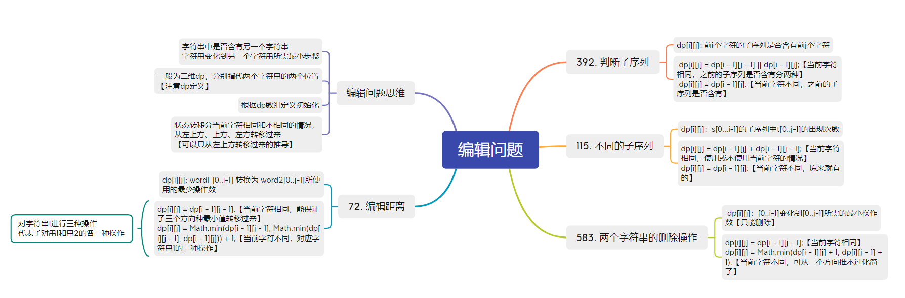

#### [650. 只有两个键的键盘](https://leetcode-cn.com/problems/2-keys-keyboard/)

https://leetcode-cn.com/problems/2-keys-keyboard/solution/c-dong-tai-gui-hua-kan-zhe-ge-jiu-gou-li-ptt9/

```java
    public int minSteps(int n) {
        if(n==1) return 0;//base case
        //dp[i] 表示 i个字符最少需要的操作次数
        int[] dp = new int[n+1];
        for(int i=2;i<=n;i++){
            //质数只能为i次
            dp[i] = i;
            //对非质数判断其是否有公因子
            int sqrt = (int)Math.sqrt(i);
            for(int j=2;j<=sqrt;j++){
                if(i%j==0){
                    //有公因子 先得到j个数然后j到i
                    // j到i等效于 1到i/j
                    dp[i]=dp[j]+dp[i/j];
                    //公因子任何组合的结果都一样
                    //因为任何公因子组合都可以表达成某个多项式质子 如 dp[16] = 4*dp[2]
                    //且非质数来说 dp[j]+dp[i/j]<=dp[i]
                    break;
                }
            }
        }
        return dp[n];
    }
```

#### [10. 正则表达式匹配](https://leetcode-cn.com/problems/regular-expression-matching/)

https://leetcode-cn.com/problems/regular-expression-matching/solution/dong-tai-gui-hua-zen-yao-cong-0kai-shi-si-kao-da-b/

第三种情况的分析 ：https://leetcode-cn.com/problems/regular-expression-matching/solution/shou-hui-tu-jie-wo-tai-nan-liao-by-hyj8/

```java
class Solution {
    public boolean isMatch(String s, String p) {
        int m = s.length();
        int n = p.length();
        //dp[i][j]表示s中到i-1的子串是否匹配p中到j-1的子串
        boolean[][] dp = new boolean[m+1][n+1];

        dp[0][0] = true; //空串一定可以匹配空串
        //[1..m][0] 一定为false

        //[0][1..n] 空串与非空正则匹配 正则当前位置为字符则一定为false
        for(int j =1;j<=n;j++){
            //正则表达式当前位置为* 则向前移动到第一个非*的位置
            if(p.charAt(j-1)=='*') dp[0][j]=dp[0][j-2];
        }

        //其他区域初始化
        for(int i =1;i<=m;i++){
            for(int j=1;j<=n;j++){
                //此时匹配任意单个新增的字符
                if(p.charAt(j-1)=='.'){
                    dp[i][j]=dp[i-1][j-1];

                    //正则新增的字符为a-z 判断两个新增字符是否匹配
                }else if(p.charAt(j-1)!='*'){
                    dp[i][j] = dp[i-1][j-1] && (p.charAt(j-1)==s.charAt(i-1));

					//后两种情况 正则新增的字符为*  * 的含义是 匹配零个或多个前面的那一个元素，所以要考虑他前面的元素 p[j-2]。* 跟着他前一个字符走，前一个能匹配上 s[i-1]，* 才能有用，前一个都不能匹配上 s[i-1]，* 也无能为力，只能让前一个字符消失，也就是匹配 0 次前一个字符。所以按照 p[j-2] 和 s[i-1] 是否相等，我们分为两种情况：

                    //第一种 p[j-2] != s[i-1] : dp[i][j] = dp[i][j-2]
                }else if(p.charAt(j-2)!=s.charAt(i-1)&&(p.charAt(j-2)!='.')){
                    dp[i][j] = dp[i][j-2];
					
                    //第二种 p[j-2] == s[i-1] or p[j-2] == "."：
                }else{
                    //* 前面那个字符，能匹配 s[i-1]，或者 * 前面那个字符是万能的 .
					//因为 . * 就相当于 . .，那就只要看前面可不可以匹配就行。
                    
                    //dp[i-1][j]:s[i-1]已经有匹配的了【*】，所以s[i-1]去掉【字符去掉前后正则的匹配结果都不影响】也可能匹配 重复个数>=2的情况
                    //dp[i][j-1]:去掉正则的最后一个字符*  重复个数为1的情况
                    //dp[i][j-2] 就是 去掉多余的 b * 重复个数为0的情况
                    //三种满足一种就能匹配上。
                    dp[i][j] = dp[i][j-1] || dp[i-1][j] || dp[i][j-2];
                }
            }
        }
        return dp[m][n];
    }
}
```

#### [392. 判断子序列](https://leetcode-cn.com/problems/is-subsequence/)

* 判断字符串t是否为字符串s的子序列

* 动态规划解法

* ```java
  class Solution {
      public boolean isSubsequence(String t, String s) {
          
          // dp[i][j]: 前i个字符的子序列是否含有前j个字符
          boolean[][] dp = new boolean[s.length() + 1][t.length() + 1];
  
          // 初始化
          dp[0][0] = true;
          // 必定都含有空串
          for(int i = 1; i <= s.length(); i++){
              dp[i][0] = true;
          }
          // 空串不含非空串
          for(int j = 1; j <= t.length(); j++){
              dp[0][j] = false;
          }
  
  
          for(int i = 1; i <= s.length(); i++){
              for(int j = 1; j <= t.length(); j++){
                  // 状态转移
                  if(s.charAt(i - 1) == t.charAt(j - 1)){
                      // 之前是否含有t[0..j-1] 或 之前是否含有t[0..j-2]
                      dp[i][j] = dp[i - 1][j - 1] || dp[i - 1][j];
                  }else{
                      // 之前是否含有t[0..j-1]
                      dp[i][j] = dp[i - 1][j];
                  }
              }
              
          }
  
  
  
          return dp[s.length()][t.length()];
      }
  }
  ```

* 双指针解法：初始化两个指针

  ```java
  class Solution {
      public boolean isSubsequence(String t, String s) {
          int m = s.length();
          int n = t.length();
          int i = 0, j = 0;
          while(i < m && j < n){
              // 两指针对应字符相同则共同右移
              if(s.charAt(i) == t.charAt(j)){
                  i++;
                  j++;
              }else{
                  // 不同 则s指针右移
                  i++;
              }
          }
          return j == n;
      }
  }
  ```

  


#### [115. 不同的子序列](https://leetcode-cn.com/problems/distinct-subsequences/)

* 类似字符串编辑问题，只不过只有删除操作

* 难点在于状态转移方程：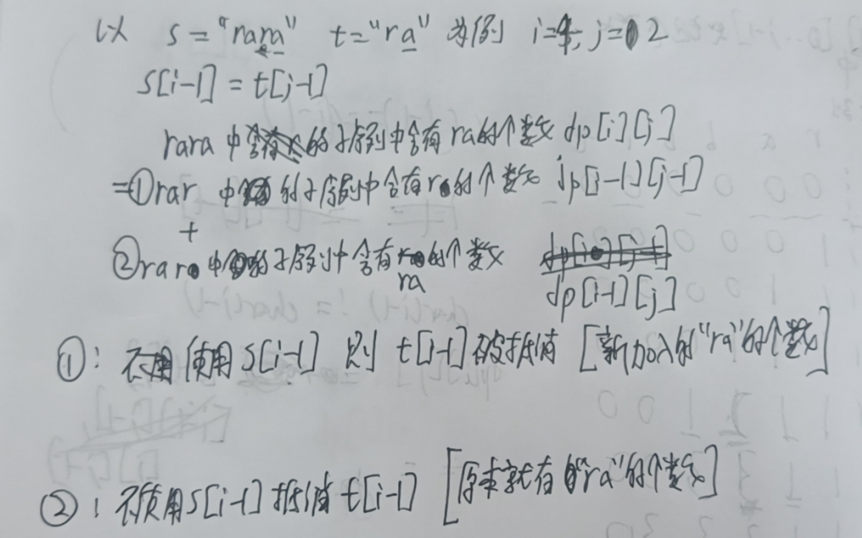

* ```java
  class Solution {
      public int numDistinct(String s, String t) {
          if(s == null || t == null) return 0;
          // 两个字符串 通用的dp模板...
          // dp[i][j]：s[0...i-1]的子序列中t[0..j-1]的出现次数
          int[][] dp = new int[s.length() + 1][t.length() + 1];
  
          // 初始化：任何串都含有一个空串
          for(int i = 0; i <= s.length(); i++){
              dp[i][0] = 1;
          }
  
          for(int i = 1; i <= s.length(); i++){
              for(int j = 1; j <= t.length(); j++){
                  // 难点：状态转移方程
                  if(s.charAt(i - 1) == t.charAt(j - 1)){
                      // 等于原本就有t[0..j-1]的个数【不使用当前字符i-1【dp[i - 1][j]】 + 新加入的t[0..j-1]的个数【使用当前字符】【dp[i - 1][j - 1]】
                      dp[i][j] = dp[i - 1][j] + dp[i - 1][j - 1];
                  }else{
                      // 等于原本就有t[0..j-1]的个数【dp[i - 1][j]】
                      dp[i][j] = dp[i - 1][j];
                  }
              }
          }
  
          return dp[s.length()][t.length()];
      }
  }
  ```

* 

#### [583. 两个字符串的删除操作](https://leetcode-cn.com/problems/delete-operation-for-two-strings/)

* 字符串编辑问题，只有删除操作

* 注意状态转移方程

* ```java
  class Solution {
      public int minDistance(String word1, String word2) {
          // dp[i][j]：[0..i-1]变化到[0..j-1]所需的最小操作数【只能删除】
          int[][] dp = new int[word1.length() + 1][word2.length() + 1];
          
          // 初始化
          dp[0][0] = 0;
          // 空串变化到非空都需删除非空串的字符个数
          for(int i = 1; i <= word1.length(); i++){
              dp[i][0] = i;
          }
          for(int j = 1; j <= word2.length(); j++){
              dp[0][j] = j;
          }
  
  
          for(int i = 1; i <= word1.length(); i++){
              for(int j = 1; j <= word2.length(); j++){
                  // 状态转移
                  if(word1.charAt(i - 1) == word2.charAt(j - 1)){
                      // i-1与j-1相同 此时最小操作数即[0..i-2]变化到[0..j-2]所需的最小操作数
                      dp[i][j] = dp[i - 1][j - 1];
                  }else{
                      // i-1和j-1不同 此时可从三个方向变化而来
                      // dp[i - 1][j] + 1、dp[i][j - 1] + 1 ：分别删除一个数
                      // dp[i - 1][j - 1] + 2 ：删除两个数【dp[i-1][j-1] +1 >= dp[i][j - 1] 和 dp[i - 1][j] 故可去掉该项】
                      dp[i][j] = Math.min(dp[i - 1][j] + 1, dp[i][j - 1] + 1);
                  }
              }
          }
  
          return dp[word1.length()][word2.length()];
      }
  }
  ```

* 


#### [72. 编辑距离](https://leetcode-cn.com/problems/edit-distance/)

* `dp[i][j]` 代表 `word1` 到 `i` 位置转换成 `word2` 到 `j` 位置需要最少步数

* 所以，

  当 word1[i] == word2[j]，dp[i] [j] = dp[i-1] [j-1]；( 因为相邻格子的值最多相差1，所以最小值最多比dp[i-1]dp[j-1]小1，所以dp[i-1]dp[j-1]-1肯定是最小的 )

  当 word1[i] != word2[j]，dp[i] [j] = min(dp[i-1] [j-1], dp[i-1] [j], dp[i] [j-1]) + 1

  四种中 dp[i-1] [j-1]

* 其中，dp[i-1] [j-1] 表示替换操作，dp[i-1] [j] 表示删除操作，dp[i] [j-1] 表示插入操作。

  * 对“dp[i-1] [j-1] 表示替换操作，dp[i-1] [j] 表示删除操作，dp[i] [j-1] 表示插入操作。”的补充理解：

    以 word1 为 "horse"，word2 为 "ros"，且 dp[5][3] 为例，即要将 word1的前 5 个字符转换为 word2的前 3 个字符，也就是将 horse 转换为 ros，因此有：

    (1) dp[i-1] [j-1]，即先将 word1 的前 4 个字符 hors 转换为 word2 的前 2 个字符 ro，然后将第五个字符 word1[4]（因为下标基数以 0 开始） 由 e 替换为 s（即替换为 word2 的第三个字符，word2[2]）

    (2) dp[i] [j-1]，即先将 word1 的前 5 个字符 horse 转换为 word2 的前 2 个字符 ro，然后在末尾补充一个 s，即插入操作

    (3) dp[i-1] [j]，即先将 word1 的前 4 个字符 hors 转换为 word2 的前 3 个字符 ros，然后删除 word1 的第 5 个字符

  注意，针对第一行，第一列要单独考虑，我们引入 '' 下图所示：

  

  第一行，是 word1 为空变成 word2 最少步数，就是插入操作

  第一列，是 word2 为空，需要的最少步数，就是删除操作

  

```java
    public int minDistance(String word1, String word2) {
        int m =word1.length();
        int n =word2.length();
        int[][] dp = new int[m+1][n+1]; //dp[i][j]表示字符串1位置i的子串变换到字符串2位置j的子串所需要的最小变换步骤
        for(int i =0;i<=m;i++){
            for(int j =0;j<=n;j++){
                if(i==0) dp[i][j]=j;
                else if(j==0){
                    dp[i][j] =i; //空串变化到任意非空字符串都需要非空字符串的长度步
                }else {
                    dp[i][j] = Math.min(dp[i-1][j-1]+(word1.charAt(i-1)==word2.charAt(j-1)?0:1),Math.min(dp[i-1][j]+1,dp[i][j-1]+1));
                }
            }
        }
        return dp[m][n];
    }
```

```java
class Solution {

    public int minDistance(String word1, String word2) {
        // dp[i][j]: word1 [0..i-1]转换为 word2[0..j-1]所使用的最少操作数
        int[][] dp = new int[word1.length() + 1][word2.length() + 1];
        
        // 初始化
        // ""转换为对应非空字符时 需要的步数
        for(int i = 0; i <= word1.length(); i++) dp[i][0] = i;
        for(int j = 0; j <= word2.length(); j++) dp[0][j] = j;

        // 根据状态转移方程推导出 遍历顺序 [i][j]依赖于左上方、左方和上方
        for(int i = 1; i < dp.length; i++){
            for(int j = 1; j< dp[i].length; j++){
                char char1 = word1.charAt(i - 1);
                char char2 = word2.charAt(j - 1);
                // 根据字符情况的不同 推出对应的状态转移方程
                if(char1 == char2){
                    // 字符相同
                    dp[i][j] = dp[i - 1][j - 1];
                    //todo 不用判断Math.min(dp[i - 1][j], dp[i][j - 1])) + 1
                    // 因为dp[i-1][j-1] 与 dp[i-1][j] 以及 dp[i-1][j-1] 与 dp[i][j-1] 的绝对值之差为 1【只有一个字符不同】
                    // dp[i][j]变化到dp[i-1][j-1]需k步
                    // 那么dp[i][j]变化到dp[i-1][j]或dp[i][j-1]只可能为k+1步或k-1步，这样[Math.min(dp[i - 1][j], dp[i][j - 1])) + 1] >=k 故只取dp[i-1][j-1]即可
                }else{
                    // 字符不同 可从三个方向的不同状态变化而来【word1中替换todo、插入、删除】
                    dp[i][j] = Math.min(dp[i - 1][j - 1], Math.min(dp[i][j - 1], dp[i - 1][j])) + 1;
                }
            }
        }

        return dp[word1.length()][word2.length()];
        
    }
}
```

对“dp[i-1] [j-1] 表示替换操作，dp[i-1] [j] 表示删除操作，dp[i][j-1] 表示插入操作。”的补充理解：

以 word1 为 "horse"，word2 为 "ros"，且 dp[5][3] 为例，即要将 word1的前 5 个字符转换为 word2的前 3 个字符，也就是将 horse 转换为 ros，因此有：

(1) dp[i-1] [j-1]，即先将 word1 的前 4 个字符 hors 转换为 word2 的前 2 个字符 ro，然后将第五个字符 word1[4]（因为下标基数以 0 开始） 由 e 替换为 s（即替换为 word2 的第三个字符，word2[2]）

(2) dp[i] [j-1]，即先将 word1 的前 5 个字符 horse 转换为 word2 的前 2 个字符 ro，然后在末尾补充一个 s，即插入操作

(3) dp[i-1] [j]，即先将 word1 的前 4 个字符 hors 转换为 word2 的前 3 个字符 ros，然后删除 word1 的第 5 个字符


### 7.8 股票交易

https://leetcode-cn.com/circle/article/qiAgHn/【通解解析】


* 笔试简易递归框架解法：https://mp.weixin.qq.com/s/TrN7mMdLEPCmT5mOXzgP5A

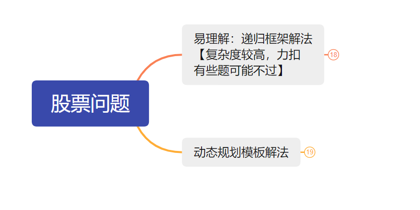

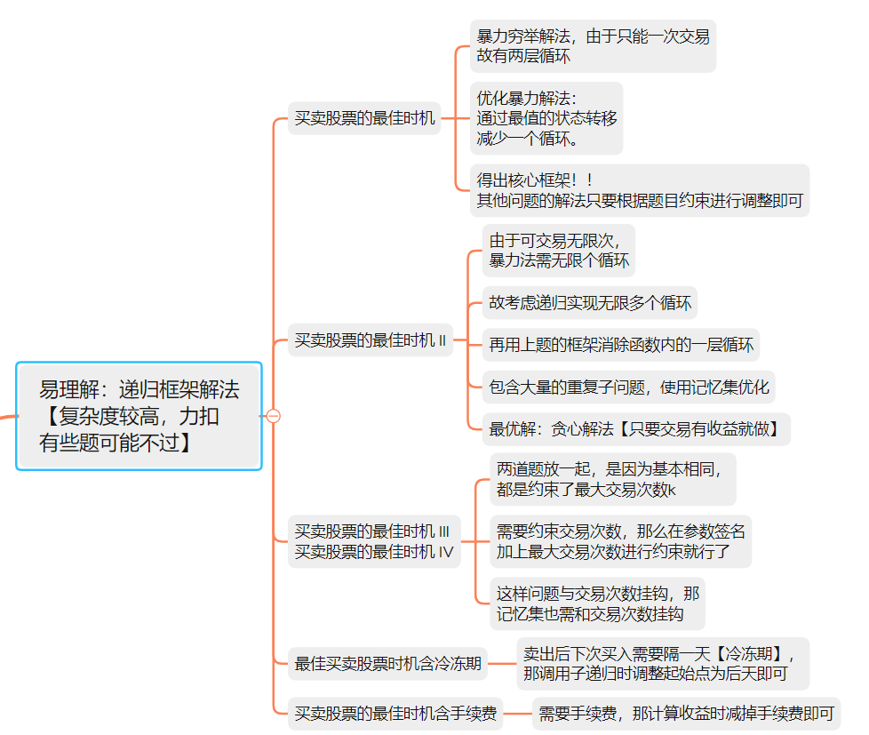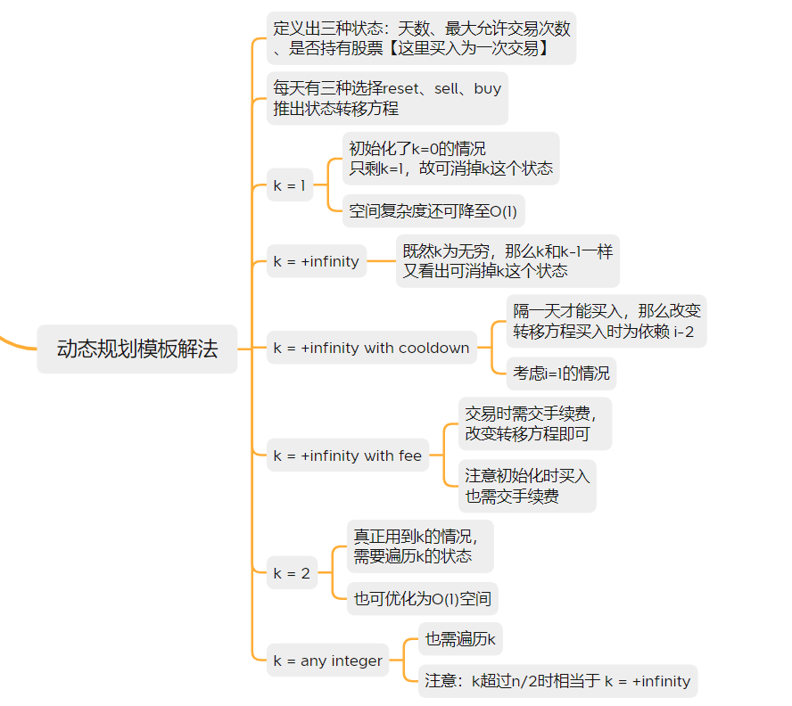

#### [121. 买卖股票的最佳时机](https://leetcode-cn.com/problems/best-time-to-buy-and-sell-stock/)

* 暴力超时解法：

* ```java
  class Solution {
      public int maxProfit(int[] prices) {
          if(prices.length <= 1) return 0;
          int res = -0;
          // 暴力超时解法 尝试所有组合。。
          // 相当于固定了买入时间 buy，然后将 buy 后面的每一天作为 sell 进行穷举
          for(int i = 0; i < prices.length; i++){
              for(int j = i + 1; j < prices.length; j++){
                  res = Math.max(prices[j] - prices[i], res);
              }
          }
  
          return res;
      }
  }
  ```

* 改进暴力解法：动态规划解法，**后面所有的题目都可以基于此框架扩展出来。**

* ```java
  class Solution {
      public int maxProfit(int[] prices) {
          if(prices.length <= 1) return 0;
          int res = 0;
          int min = prices[0];
  
          // 固定卖出时间 向前穷举最小价格 单次交易的所有情况基本覆盖了
          for(int i = 1; i < prices.length; i++){
              // 添加新数时，可以根据已有最值，推导出新的最值；
              min = Math.min(prices[i], min);
              res = Math.max(res, prices[i] - min);
          }
  
          return res;
      }
  }
  ```

* 

* 贪心思想：【更好】，也可以说是动态规划吧，毕竟有最值状态的转移

* ```java
  class Solution {
      // 贪心思想，局部最优解：每次取到某个区间的最大收益 通过不断更新历史最小值得到整体最优解：获取到整个区间的最大收益
      public int maxProfit(int[] prices) {
          // base case
          if(prices.length <= 1) return 0;
  
          // 区间[0..i]的最小值
          int min = prices[0];
          // 区间[0..i]的最大收益
          int profit = 0;
  
          for(int i = 1; i < prices.length; i++){
              if(prices[i] > min){
                  // 更新当前区间最大收益
                  profit = Math.max(prices[i] - min, profit);
              }else{
                  // 更新最小值
                  min = prices[i];
              }
          }
  
          return profit;
      }
  }
  
  
  class Solution {
      public int maxProfit(int[] prices) {
          int n = prices.length;
          if(n == 1) return 0;
          int min = prices[0];
          int profit = 0;
  
          for(int i = 1; i < n; i++){
              min = Math.min(min, prices[i]);
              profit = Math.max(profit, prices[i] - min);
          }
  
          return profit;
      }
  }
  ```
  
* dp解法【有点强行套用模板感觉，不建议用】

* ```java
  class Solution {
      public int maxProfit(int[] prices) {
          if(prices.length <= 1) return 0;
  
          // dp[i][0]: 到第i天不持有股票所能获得的最大收益
          // dp[i][1]: 到第i天持有股票所能获得的最大收益
          int[][] dp = new int[prices.length][2];
          dp[0][0] = 0;
          dp[0][1] = -prices[0];
  
          for(int i = 1; i < prices.length; i++){
              // 注意只能买入卖出一次
              dp[i][0] = Math.max(dp[i - 1][0], dp[i - 1][1] + prices[i]);
              dp[i][1] = Math.max(dp[i - 1][1], -prices[i]);
          }
  
          // 不持有的收益肯定更高
          return dp[prices.length - 1][0];
      }
  }
  ```

* 动态规划模板解法【状态转移】：

* 有三种状态：天数、最大允许交易次数、是否持有股票

* 规定买入就算交易一次，并根据状态转移方程初始化即可

* 模板框架：【其他问题在该框架上修改即可】

* ```java
  class Solution {
      public int maxProfit(int[] prices) {
          // dp[i][k][0]: 第i天结束最大交易次数为k没持有股票时所具有的最大收益
          // dp[i][k][1]: 第i天结束最大交易次数为k持有股票时所具有的最大收益
          int[][][] dp = new int[prices.length][2][2];
  
          // 初始化
          for(int i = 0; i < prices.length; i++){
              // 最大允许交易次数为0
              dp[i][0][0] = 0;
              // 不允许交易 故不存在持有股票的情况
              dp[i][0][1] = 0;
          }
          for(int k = 1; k < 2; k++){
              // 第0天结束后的情况
              dp[0][k][0] = 0;
              dp[0][k][1] = -prices[0];
          }
  
          // 后面的情况
          for(int i = 1; i < prices.length; i++){
              for(int k = 1; k < 2; k++){
                  // 状态转移
                  dp[i][k][0] = Math.max(dp[i - 1][k][0], dp[i - 1][k][1] + prices[i]);
                  // 买入算一次交易
                  dp[i][k][1] = Math.max(dp[i - 1][k][1], dp[i - 1][k - 1][0] - prices[i]);
              }
          }
  		
          // 必定是没持有股票有最大收益
          return dp[prices.length - 1][1][0];
      }
  }
  ```

* 最大交易次数k为1，即dp[i] [ k-1] [0]必定为dp[i] [ 0] [0]也就是0，那么dp数组的状态可以与k无关，去掉k状态

  ```java
  class Solution {
      public int maxProfit(int[] prices) {
  
          // dp[i][0]：第i天结束后没持有股票所能有的最大价值
          // dp[i][1]：第i天结束后持有股票所能有的最大价值
          int[][] dp = new int[prices.length][2];
  
          // 初始化
          dp[0][0] = 0;
          dp[0][1] = -prices[0];
  
          // 后面的情况
          for(int i = 1; i < prices.length; i++){
              // 状态转移
              dp[i][0] = Math.max(dp[i - 1][0], dp[i - 1][1] + prices[i]);
              // 买入算一次交易
              dp[i][1] = Math.max(dp[i - 1][1], -sprices[i]);
          }
  
          return dp[prices.length - 1][0];
      }
  }
  ```

* 上面解法的第 `i` 天的最大收益只和第 `i - 1` 天的最大收益相关，空间复杂度可以降到 O(1)

  ```java
  class Solution {
      public int maxProfit(int[] prices) {
          if(prices == null || prices.length <= 1) return 0;
  
          // dp[i][0]：第i天结束后没持有股票所能有的最大价值
          // dp[i][1]：第i天结束后持有股票所能有的最大价值
          // int[][] dp = new int[prices.length][2];
  
          // 初始化
          // dp[0][0] = 0;
          // dp[0][1] = -prices[0];
  
          int unHave = 0;
          int have = -prices[0];
  
          // 后面的情况
          for(int i = 1; i < prices.length; i++){
              // 状态转移
              // dp[i][0] = Math.max(dp[i - 1][0], dp[i - 1][1] + prices[i]);
              unHave = Math.max(unHave, have + prices[i]);
              // 买入算一次交易
              // dp[i][1] = Math.max(dp[i - 1][1], -prices[i]);
              have = Math.max(have, -prices[i]);
          }
  
          // return dp[prices.length - 1][0];
          return unHave;
      }
  }
  ```

  


题解

* 动态规划 前i天的最大收益 = max{前i-1天的最大收益，第i天的价格-前i-1天中的最小价格}
* 记录【今天之前买入的最小值】
* 计算【今天之前最小值买入，今天卖出的获利】，也即【今天卖出的最大获利】
* 比较【每天的最大获利】，取最大值即可

```java
public int maxProfit(int[] prices) {
        if(prices.length<=1) return 0;
    	//记录 今天之前买入的最小值
        int min = prices[0];
    	//计算 到今天为止的最大收益
        int sell = 0;
       // int[] dp = new int[prices.length+1];
        for(int i = 1; i < prices.length; i++){
            //今天卖出能够拿到的收益和之前的最大收益作对比。
            sell = Math.max(sell,prices[i]-min);
            //更新最小价格
            min = Math.min(min,prices[i]);
            //dp[i] = sell;
        }
       // return dp[prices.length];
       return sell;
    }
```

#### [122. 买卖股票的最佳时机 II](https://leetcode-cn.com/problems/best-time-to-buy-and-sell-stock-ii/)

* 超时解法，递归框架解法，可考虑使用

* 可以交易多次，暴力解法可能有无限多个循环，因为每次都是进行交易一次后接着在后面继续交易，故使用递归实现【包含重复操作】，又因为有大量重复子问题，故使用记忆集进行优化

* 时间复杂度O(N^2)：每个范围求一次交易的最大值

* 空间复杂度O(N)

* ```java
  class Solution {
      // 从key开始交易且交易次数无限的最大价值
      Map<Integer, Integer> map = new HashMap<>();
  
      public int maxProfit(int[] prices) {
          // 可以交易多次，暴力解法可能需要无穷多个for循环，可考虑使用递归实现
          return profit(prices, 0);
      }
  
      // 在prices中从start开始交易所能获得的最大收益
      // 包含大量重复子问题 进行优化
      private int profit(int[] prices, int start){
          // base case
          if(start >= prices.length - 1) return 0;
          // 剪枝
          if(map.containsKey(start)) return map.get(start);
          
          int min = prices[start];
          int res = 0;
  
          // 单次交易所能获得的最大收益的框架用上 交易最大收益等于所有交易的总体收益最大!
          for(int i = start + 1; i < prices.length; i++){
              min = Math.min(min, prices[i]);
              // 进行下次交易
              res = Math.max(res, profit(prices, i + 1) + prices[i] - min);
          }
          map.put(start, res);
          return res;
      }
  }
  ```

* 最优解法：贪心思想：只要有收益的交易就做，这样总体的收益就最高了

* 时间复杂度O(N)

* ```java
  class Solution {
  
      public int maxProfit(int[] prices) {
          int res = 0;
          if(prices.length <= 1) return res;
  
          for(int i = 1; i < prices.length; i++){
              // 有收益的交易尽可能多做
              if(prices[i] > prices[i - 1]) res += prices[i] - prices[i - 1];
          }
  
          return res;
      }
  }
  ```

* 动态规划模板框架解法：

  如果 k 为正无穷，那么就可以认为 k 和 k - 1 是一样的。可以这样改写框架：

  

  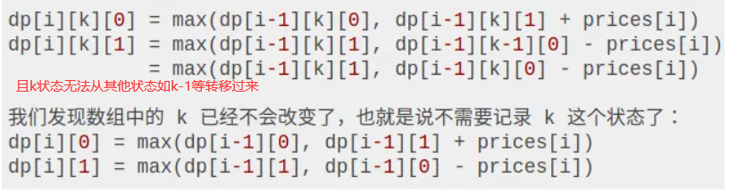

  这里的**不需要记录k这个状态可以理解成k固定为最大的**，初始化dp[0] [k] [0]、dp[0] [k] [1]即可进行状态转移

  以后**某个维度的状态无法从该维度的其他状态转移则可以消掉该维度。【做好相应初始化】**

  ```java
  class Solution {
      public int maxProfit(int[] prices) {
          if(prices == null || prices.length <= 1) return 0;
          // dp[i][k][0]: 第i天结束最大交易次数为k没持有股票时所具有的最大收益
          // dp[i][k][1]: 第i天结束最大交易次数为k持有股票时所具有的最大收益
          int[][] dp = new int[prices.length][2];
  
         dp[0][0] = 0;
         dp[0][1] = -prices[0];
          // 后面的情况
          for(int i = 1; i < prices.length; i++){
              // 状态转移
              dp[i][0] = Math.max(dp[i - 1][0], dp[i - 1][1] + prices[i]);
              // 买入算一次交易
              dp[i][1] = Math.max(dp[i - 1][1], dp[i - 1][0] - prices[i]);
          
          }
  		
          // 必定是没持有股票有最大收益
          return dp[prices.length - 1][0];
      }
  }
  ```

  


#### [123. 买卖股票的最佳时机 III](https://leetcode-cn.com/problems/best-time-to-buy-and-sell-stock-iii/)

* 递归框架解法：

  ```java
  class Solution {
      // key=start-k 存储从开start始交易且最大交易次数为k最大价值
      Map<String, Integer> map = new HashMap<>();
  
      public int maxProfit(int k, int[] prices) {
          return profit(prices, 0, 2);
      }
  
      // 在prices中从start开始交易所能获得的最大收益，且最多能交易k次
      // 包含大量重复子问题 进行优化
      private int profit(int[] prices, int start, int k){
          // base case
          if(start >= prices.length - 1 || k <= 0) return 0;
          // 剪枝
          if(map.containsKey(start + "-" + k)) return map.get(start + "-" + k);
          
          int min = prices[start];
          int res = 0;
  
          // 单次交易所能获得的最大收益的框架用上 交易最大收益等于所有交易的总体收益最大!
          for(int i = start + 1; i < prices.length; i++){
              min = Math.min(min, prices[i]);
              // 进行下次交易
              res = Math.max(res, profit(prices, i + 1, k - 1) + prices[i] - min);
          }
          map.put(start + "-" + k, res);
          return res;
      }
  }
  ```

* 动态规划框架解法：

* ```java
  class Solution {
      public int maxProfit(int[] prices) {
          if(prices == null || prices.length <= 1) return 0;
          // dp[i][k][0]: 第i天结束最大交易次数为k没持有股票时所具有的最大收益
          // dp[i][k][1]: 第i天结束最大交易次数为k持有股票时所具有的最大收益
          int[][][] dp = new int[prices.length][3][2];
  
          // 初始化
          for(int i = 0; i < prices.length; i++){
              // 最大允许交易次数为0
              dp[i][0][0] = 0;
              // 不允许交易 故不存在持有股票的情况
              dp[i][0][1] = 0;
          }
          for(int k = 1; k < 3; k++){
              // 第0天结束后的情况
              dp[0][k][0] = 0;
              dp[0][k][1] = -prices[0];
          }
  
          // 后面的情况
          for(int i = 1; i < prices.length; i++){
              for(int k = 1; k < 3; k++){
                  // 状态转移
                  dp[i][k][0] = Math.max(dp[i - 1][k][0], dp[i - 1][k][1] + prices[i]);
                  // 买入算一次交易
                  dp[i][k][1] = Math.max(dp[i - 1][k][1], dp[i - 1][k - 1][0] - prices[i]);
              }
          }
  		
          // 必定是没持有股票有最大收益
          return dp[prices.length - 1][2][0];
      }
  }
  ```

* 

```java
class Solution {
    public int maxProfit(int[] prices) {
        if(prices == null || prices.length<2){
            return 0;
        }
        // // dp[i][j][0]:第i+1天结束后最多交易j次持有股票数为0 所能有的最大收益
        // // dp[i][j][1]:第i+1天结束后最多交易j次持有股票数为1 所能有的最大收益
        // int [][][] dp = new int [prices.length][3][2];

        // // 第1天 最多交易次数为0时 不管股票数是1还是0 最大收益都是0
        // // 第1天 交易次数>0时 股票数为0时 最大收益为0 股票数为1 则只能是买入第一天的股票
        // for(int j=1;j<3;j++){
        //     dp[0][j][0] = 0;
        //     dp[0][j][1] = -prices[0];
        // }

        // for(int i=1;i<prices.length;i++){
        //     for(int j=1;j<3;j++){
        //         // 休息或卖出
        //         dp[i][j][0] = Math.max(dp[i-1][j][0],dp[i-1][j][1]+prices[i]);
        //         // 休息或买入
        //         dp[i][j][1] = Math.max(dp[i-1][j][1],dp[i-1][j-1][0]-prices[i]);
        //     }
        // }

        // // 最后一天持有股票数为0即为最大收益
        // return dp[prices.length-1][2][0];

        // // 优化 【当天最大收益只与前一天的最大收益有关 可以降低一个维度,用到j-1所以需要后续遍历】
        // int [][]dp = new int[3][2];
        // for(int j=1;j<3;j++){
        //     dp[j][0] = 0;
        //     dp[j][1] = -prices[0];
        // }


        // for(int i=1;i<prices.length;i++){
        //     for(int j=2;j>0;j--){
        //         // 休息或卖出
        //         dp[j][0] = Math.max(dp[j][0],dp[j][1]+prices[i]);
        //         // 休息或买入
        //         dp[j][1] = Math.max(dp[j][1],dp[j-1][0]-prices[i]);
        //     }
        // }  

        // return dp[2][0];

        // // 优化 【交易次数只有0 1 2次(且0收益一定为0可忽略) 可以通过空间换时间优化 记录多几个变量来减少一层循环】
        // int [][]dp = new int[3][2];
        // dp[1][0] = 0;
        // dp[1][1] = -prices[0];
        // dp[2][0] = 0;
        // dp[2][1] = -prices[0];

        // for(int i=1;i<prices.length;i++){
        //     // 注意赋值次序 保证用的是上一天的记录 相当于后序遍历
        //     dp[2][0] = Math.max(dp[2][0],dp[2][1]+prices[i]);
        //     dp[2][1] = Math.max(dp[2][1],dp[1][0]-prices[i]);

        //     dp[1][0] = Math.max(dp[1][0],dp[1][1]+prices[i]);
        //     // dp[1][1] = Math.max(dp[1][1],dp[0][0]-prices[i]);
        //     // 最多交易0次不管第几天其最大收益都为0
        //     dp[1][1] = Math.max(dp[1][1],-prices[i]);
        // }
        // return dp[2][0];

        // 优化 不使用数组 使用4个变量记录即可
        int profitOne0 = 0;
        int profitOne1 = -prices[0];
        int profitTwo0 = 0;
        int profitTwo1 = -prices[0];

        for(int i=1;i<prices.length;i++){
            profitTwo0 = Math.max(profitTwo0,profitTwo1+prices[i]);
            profitTwo1 = Math.max(profitTwo1,profitOne0-prices[i]);
            
            profitOne0 = Math.max(profitOne0,profitOne1+prices[i]);
            profitOne1 = Math.max(profitOne1,-prices[i]);
        }
        return profitTwo0;
    }
}
```


#### [188. 买卖股票的最佳时机 IV](https://leetcode-cn.com/problems/best-time-to-buy-and-sell-stock-iv/)

* 框架解法：

  ```java
  class Solution {
      // key=start-k 存储从开start始交易且最大交易次数为k最大价值
      Map<String, Integer> map = new HashMap<>();
  
      public int maxProfit(int k, int[] prices) {
          return profit(prices, 0, k);
      }
  
      // 在prices中从start开始交易所能获得的最大收益，且最多能交易k次
      // 包含大量重复子问题 进行优化
      private int profit(int[] prices, int start, int k){
          // base case
          if(start >= prices.length - 1 || k <= 0) return 0;
          // 剪枝
          if(map.containsKey(start + "-" + k)) return map.get(start + "-" + k);
          
          int min = prices[start];
          int res = 0;
  
          // 单次交易所能获得的最大收益的框架用上 交易最大收益等于所有交易的总体收益最大!
          for(int i = start + 1; i < prices.length; i++){
              min = Math.min(min, prices[i]);
              // 进行下次交易
              res = Math.max(res, profit(prices, i + 1, k - 1) + prices[i] - min);
          }
          map.put(start + "-" + k, res);
          return res;
      }
  }
  ```

* 动态规划模板解法

* ```java
  class Solution {
      public int maxProfit(int m, int[] prices) {
          if(prices == null || m == 0 || prices.length <= 1) return 0;
          // dp[i][k][0]: 第i天结束最大交易次数为k没持有股票时所具有的最大收益
          // dp[i][k][1]: 第i天结束最大交易次数为k持有股票时所具有的最大收益
          int[][][] dp = new int[prices.length][m + 1][2];
  
          // 初始化
          for(int i = 0; i < prices.length; i++){
              // 最大允许交易次数为0
              dp[i][0][0] = 0;
              // 不允许交易 故不存在持有股票的情况
              dp[i][0][1] = 0;
          }
          for(int k = 1; k <= m; k++){
              // 第0天结束后的情况
              dp[0][k][0] = 0;
              dp[0][k][1] = -prices[0];
          }
  
          // 后面的情况
          for(int i = 1; i < prices.length; i++){
              for(int k = 1; k <= m; k++){
                  // 状态转移
                  dp[i][k][0] = Math.max(dp[i - 1][k][0], dp[i - 1][k][1] + prices[i]);
                  // 买入算一次交易
                  dp[i][k][1] = Math.max(dp[i - 1][k][1], dp[i - 1][k - 1][0] - prices[i]);
              }
          }
  		
          // 必定是没持有股票有最大收益
          return dp[prices.length - 1][m][0];
      }
  }
  ```

* 

```java
class Solution {
    public int maxProfit(int k, int[] prices) {
        if(k == 0||prices.length<=1 || prices == null){
            return 0;
        }

        // 考虑优化情况 股票价格序列长度为n 每次交易需要买入和卖出 则最多有收益交易次数为n/2 
        // 如果k>=n/2 则最大收益就不再取决于允许的最大交易次数，而是取决于股票价格数组的长度
        // 此时可以把k看成无穷
        if(k>=(prices.length/2)){
            return maxProfitKNoLimit(prices);
        }

        // dp[i][j][0]:第i+1天结束后 持有股票数为0 且最多允许交易k次所能获得的最大收益
        // dp[i][j][1]:第i+1天结束后 持有股票数为1 且最多允许交易k次所能获得的最大收益
        // int[][][] dp = new int[prices.length][k+1][2];

        // // base case 第一天结束后 持有股票数为0则最大收益为0 为1则最大收益为-prices[1]
        // for(int j=1;j<=k;j++){
        //     dp[0][j][0] = 0;
        //     dp[0][j][1] = -prices[0];
        // }

        // for(int i = 1;i<prices.length;i++){
        //     for(int j=k;j>0;j--){
        //         // 结束后持有股票数为0 则只能进行休息或卖出操作 以当天股票价格卖出
        //         dp[i][j][0] = Math.max(dp[i-1][j][0],dp[i-1][j][1]+prices[i]);
        //         // 结束后持有股票数为1 则只能进行休息或买入操作 以当天股票价格买入【买入操作为当成一次交易】
        //         dp[i][j][1] = Math.max(dp[i-1][j][1],dp[i-1][j-1][0]-prices[i]);
        //     }
        // }
        // // 最后一天结束后 持有股票数为0 最后交易k次必定为最大收益
        // return dp[prices.length-1][k][0];

        // 因为当天收益只与前一天收益有关 所以我们可以将 空间从O(nk)缩小为O(k) 注意遍历次序！！
        int[][] dp = new int[k+1][2];
        for(int j = 1 ;j<=k;j++){
            dp[j][0] = 0;
            dp[j][1] = -prices[0];
        }

        for(int i=1;i<prices.length;i++){
            // 遍历次序从后往前 保证j-1使用前一天的数据
            for(int j=k;j>0;j--){
                dp[j][0] = Math.max(dp[j][0],dp[j][1]+prices[i]);
                dp[j][1] = Math.max(dp[j][1],dp[j-1][0]-prices[i]);
            }
        }
        return dp[k][0];
    }
    
    // 最多允许操作次数k为无穷次时 所能获取的最大利益 此时无需考虑k
    private int maxProfitKNoLimit(int[] prices){
        // int[][] dp = new int[prices.length][2];
        // // base case
        // dp[0][0] = 0;
        // dp[0][1] = -prices[0];
        // for(int i=1;i<prices.length;i++){
        //     dp[i][0] = Math.max(dp[i-1][0],dp[i-1][1]+prices[i]);
        //     dp[i][1] = Math.max(dp[i-1][1],dp[i-1][0]-prices[i]);
        // }
        // return dp[prices.length-1][0];

        //优化空间复杂度 O(n) 到 O(1)

        int profit0 = 0;
        int profit1 = -prices[0];

        for(int i = 1;i<prices.length;i++){
            // for语句作用域定义的局部变量会在下一循环清除 所以有效的空间为O(1)
            int newprofit0 = Math.max(profit0,profit1+prices[i]);
            // 不可重复使用变量profit0和profit1 因为要保证得出 profit1时profit0是上一天的
            int newprofit1 = Math.max(profit1,profit0-prices[i]);

            profit0 = newprofit0;
            profit1 = newprofit1;
        }

        return profit0;
    }
}
```


#### [309. 最佳买卖股票时机含冷冻期](https://leetcode-cn.com/problems/best-time-to-buy-and-sell-stock-with-cooldown/)

* 递归框架解法

* ```java
  class Solution {
      // 从key开始交易且交易次数无限的最大价值
      Map<Integer, Integer> map = new HashMap<>();
  
      public int maxProfit(int[] prices) {
          // 可以交易多次，暴力解法可能需要无穷多个for循环，可考虑使用递归实现
          return profit(prices, 0);
      }
  
      // 在prices中从start开始交易所能获得的最大收益
      // 包含大量重复子问题 进行优化
      private int profit(int[] prices, int start){
          // base case
          if(start >= prices.length - 1) return 0;
          // 剪枝
          if(map.containsKey(start)) return map.get(start);
          
          int min = prices[start];
          int res = 0;
  
          // 单次交易所能获得的最大收益的框架用上 交易最大收益等于所有交易的总体收益最大!
          for(int i = start + 1; i < prices.length; i++){
              min = Math.min(min, prices[i]);
              // 进行下次交易【需间隔一天】
              res = Math.max(res, profit(prices, i + 2) + prices[i] - min);
          }
          map.put(start, res);
          return res;
      }
  }
  ```

* 动态规划框架解法：

* 考虑**i=1的特殊情况** dp[1] [1]: 第1天结束后持股所能获得的最大收益 max(-prices[0],-prices[1])

  即持有第一天还是第二天股的收益大

* ```java
  class Solution {
      public int maxProfit(int[] prices) {
          if(prices == null || prices.length <= 1) return 0;
          // dp[i][k][0]: 第i天结束最大交易次数为k没持有股票时所具有的最大收益
          // dp[i][k][1]: 第i天结束最大交易次数为k持有股票时所具有的最大收益
          int[][] dp = new int[prices.length][2];
  
         dp[0][0] = 0;
         dp[0][1] = -prices[0];
          // 后面的情况
          for(int i = 1; i < prices.length; i++){
              // 状态转移
              dp[i][0] = Math.max(dp[i - 1][0], dp[i - 1][1] + prices[i]);
              // i==1 时不能从前天得出结果 因为如果前一天不可能卖出 所以此时只能是前一天买入或今天买入中选择收益最大的
              dp[i][1] = Math.max(dp[i - 1][1], (i >= 2 ? dp[i - 2][0] : 0) - prices[i]);
          
          }
  		
          // 必定是没持有股票有最大收益
          return dp[prices.length - 1][0];
      }
  }
  ```

* 

```java
class Solution {
    public int maxProfit(int[] prices) {
        if(prices == null||prices.length<2){
            return 0;
        }

        // // 第i+1天结束后 持有股票数为0或1所能获得的最大收益 【题目默认可交易次数为无限次】
        // int[][] dp = new int[prices.length][2];

        // // 第1天结束后 两种情况的最大收益
        // dp[0][0] = 0;
        // dp[0][1] = -prices[0];
        
        // for(int i = 1;i<prices.length;i++){
        //     // 休息或卖出
        //     dp[i][0] = Math.max(dp[i-1][0],dp[i-1][1]+prices[i]);
        //     // 休息或买入【卖出股票后无法第二天买入所以不能用[i-1][0]{即使[i-1]是休息没有卖出，因为还是由[i-2]得出}只能用[i-2][0]】
        //     // i==1 时不能从前天得出结果 因为如果前一天不可能卖出 所以此时只能是前一天买入或今天买入中选择收益最大的
        //     dp[i][1] = Math.max(dp[i-1][1],(i>=2?dp[i-2][0]:0)-prices[i]);
        // }
        // return dp[prices.length-1][0];


        // 优化空间复杂度 O(n) --> O(1)
        // 当天结束后持有股票数为0的最大收益
        int profit0 = 0;
        // 当天结束后持有股票数为1的最大收益
        int profit1 = -prices[0];
        // 前天持有股票数为0的最大收益
        int preProfit0 = 0;

        for(int i = 1; i<prices.length;i++){
            int newProfit0 = Math.max(profit0,profit1+prices[i]);
            int newProfit1 = Math.max(profit1,(i>=2?preProfit0:0)-prices[i]);
            
            //记录昨天持股数为0的最大收益 这样在下一层遍历时 其就是前天持有股票数为0的最大收益
            preProfit0 = profit0;
            profit0 = newProfit0;
            profit1 = newProfit1;
        }
        return profit0;
    }
}
```

#### [714. 买卖股票的最佳时机含手续费](https://leetcode-cn.com/problems/best-time-to-buy-and-sell-stock-with-transaction-fee/)

* 递归框架解法：

* ```java
  class Solution {
      // 从key开始交易且交易次数无限的最大价值
      Map<Integer, Integer> map = new HashMap<>();
  
      public int maxProfit(int[] prices, int fee) {
          // 可以交易多次，暴力解法可能需要无穷多个for循环，可考虑使用递归实现
          return profit(prices, 0, fee);
      }
  
      // 在prices中从start开始交易所能获得的最大收益
      // 包含大量重复子问题 进行优化
      private int profit(int[] prices, int start, int fee){
          // base case
          if(start >= prices.length - 1) return 0;
          // 剪枝
          if(map.containsKey(start)) return map.get(start);
          
          int min = prices[start];
          int res = 0;
  
          // 单次交易所能获得的最大收益的框架用上 交易最大收益等于所有交易的总体收益最大!
          for(int i = start + 1; i < prices.length; i++){
              min = Math.min(min, prices[i]);
              // 进行下次交易 每次交易时减掉手续费即可
              res = Math.max(res, profit(prices, i + 1, fee) + prices[i] - min - fee);
          }
          map.put(start, res);
          return res;
      }
  }
  ```

* 动态规划框架解法：

* ```java
  class Solution {
      public int maxProfit(int[] prices, int fee) {
          if(prices == null || prices.length <= 1) return 0;
          // dp[i][k][0]: 第i天结束最大交易次数为k没持有股票时所具有的最大收益
          // dp[i][k][1]: 第i天结束最大交易次数为k持有股票时所具有的最大收益
          int[][] dp = new int[prices.length][2];
  
         dp[0][0] = 0;
          // 注意初始化：买入就收费
         dp[0][1] = -prices[0] - fee;
          // 后面的情况
          for(int i = 1; i < prices.length; i++){
              // 状态转移
              dp[i][0] = Math.max(dp[i - 1][0], dp[i - 1][1] + prices[i]);
  
              // 买入算一次交易
              dp[i][1] = Math.max(dp[i - 1][1], dp[i - 1][0] - prices[i] - fee);
  
          }
  		
          // 必定是没持有股票有最大收益
          return dp[prices.length - 1][0];
      }
  }
  ```

* 

```java
class Solution {
    public int maxProfit(int[] prices, int fee) {
        // base case
        if(prices==null||prices.length<2) return 0; 

        // // 买卖股票通用解法
        // // 无限次交易 不考虑k
        // // dp[i][0]: 第i+1天结束后 持有股票数为0的最大收益
        // // dp[i][1]: ........................1.......
        // int[][] dp = new int[prices.length][2];

        // // 第一天结束后 持股数为0和1 的最大收益
        // dp[0][0] = 0;
        // dp[0][1] = -prices[0]-fee;

        // for(int i = 1;i<prices.length;i++){
        //     // 动态转移方程 

        //     // 休息或者卖出
        //     dp[i][0] = Math.max(dp[i-1][0],dp[i-1][1]+prices[i]);

        //     // 休息或者买入 【买入为一次交易，买入还要付手续费】
        //     dp[i][1] = Math.max(dp[i-1][1],dp[i-1][0]-prices[i]-fee);
        // }

        // // 最后一天持股数为0一定是最大收益
        // return dp[prices.length-1][0];

        //空间优化 当前收益只与前一天有关 可减低一个维度
        int profit0 = 0;
        int profit1 = -prices[0]-fee;

        for(int i=1;i<prices.length;i++){
            // 避免覆盖旧值 定义局部变量
            int newProfit0 = Math.max(profit0,profit1+prices[i]);
            int newProfit1 = Math.max(profit1,profit0-prices[i]-fee);

            profit0 = newProfit0;
            profit1 = newProfit1;
        }

        return profit0;
    }
}
```

## 分治法

### [241. 为运算表达式设计优先级](https://leetcode-cn.com/problems/different-ways-to-add-parentheses/)

* 对于一个形如 x op y（op 为运算符，x 和 y 为数） 的算式而言，它的结果组合取决于 x 和 y 的结果组合数，而 x 和 y 又可以写成形如 x op y 的算式。

  因此，该问题的子问题就是 x op y 中的 x 和 y：以运算符分隔的左右两侧算式解。

  然后我们来进行 分治算法三步走：

  分解：按运算符分成左右两部分，分别求解
  解决：实现一个递归函数，输入算式，返回算式解
  合并：根据运算符合并左右两部分的解，得出最终解

* 此解法分治时可能出现重复子问题【相同的表达式重复计算】，可用记忆化递归优化

```java
class Solution {
    // 自顶向下分治解法
    public List<Integer> diffWaysToCompute(String expression) {
        char[] array = expression.toCharArray();
        List<Integer> list = new ArrayList<Integer>();

        // base case 分治终止条件
        if(isNumber(array)) {
            list.add(Integer.valueOf(expression));
            return list;
        }
    
        for(int i = 0;i<array.length;i++){
            if(array[i] == '*'||array[i]=='+'||array[i]=='-'){
            // 当前字符为运算符 表示可以将其分治 x op y 

                // 分治 截取子串并获取结果 x op y  x和y都可分为 x op y

                // 获取 x 所有可能的结果值
              List<Integer> left = diffWaysToCompute(expression.substring(0,i));

              // 获取 y 所有可能的结果值
              List<Integer> right = diffWaysToCompute(expression.substring(i+1,array.length));

                // 将左表达式 和 右表达式 的运算结果添加进结果集
                for(int leftNum : left){
                    for(int rightNum : right){
                        if(array[i]=='*'){
                            list.add(leftNum*rightNum);
                        }
                        if(array[i]=='+'){
                            list.add(leftNum+rightNum);
                        }
                        if(array[i]=='-'){
                            list.add(leftNum-rightNum);
                        }
                    }
                }
              
            }
        }
        return list;
    }

    // 判断字符数组是否为纯数字 如果是则已到分治终点
    public boolean isNumber(char[] array){
        for(char c : array){
            if(c == '*' || c == '+' || c=='-'){
                return false;
            }
        }

        return true;
    }
}
```

* 记忆化递归实现【通过哈希表记录表达式对应的结果集】

```java
class Solution {
    // 记忆化递归实现 key 为对应表达式 value 为 表达式可能的结果值
    private Map<String,List<Integer>> tempResult = new HashMap<>();
    public List<Integer> diffWaysToCompute(String expression) {
        char[] array = expression.toCharArray();
        List<Integer> list = new ArrayList<Integer>();

        // 如果该表达式已有结果集 直接返回即可
        if(tempResult.get(expression)!=null) return tempResult.get(expression);

        // base case 分治终止条件
        if(isNumber(array)) {
            list.add(Integer.valueOf(expression));
            return list;
        }
    
        for(int i = 0;i<array.length;i++){
            if(array[i] == '*'||array[i]=='+'||array[i]=='-'){
            // 当前字符为运算符 表示可以将其分治 x op y 

                // 分治 截取子串并获取结果 x op y  x和y都可分为 x op y

                // 获取 x 所有可能的结果值
              List<Integer> left = diffWaysToCompute(expression.substring(0,i));

              // 获取 y 所有可能的结果值
              List<Integer> right = diffWaysToCompute(expression.substring(i+1,array.length));

                // 将左表达式 和 右表达式 的运算结果添加进结果集
                for(int leftNum : left){
                    for(int rightNum : right){
                        if(array[i]=='*'){
                            list.add(leftNum*rightNum);
                        }
                        if(array[i]=='+'){
                            list.add(leftNum+rightNum);
                        }
                        if(array[i]=='-'){
                            list.add(leftNum-rightNum);
                        }
                    }
                }
              
            }
        }

        // 存储表达式的结果集
        tempResult.put(expression,list);
        return list;
    }

    // 判断字符数组是否为纯数字 如果是则已到分治终点
    public boolean isNumber(char[] array){
        for(char c : array){
            if(c == '*' || c == '+' || c=='-'){
                return false;
            }
        }

        return true;
    }
}
```

//TODO 从下到上动态规划解法


### [932. 漂亮数组](https://leetcode-cn.com/problems/beautiful-array/)

* 这道题主要是映射、和数学证明..

```java
class Solution {
    // 记忆化分治  key为N value表示 1..N所对应的漂亮数组
    Map<Integer,int[]> cache = new HashMap<>();

    // base case 递归终止条件
    {
        cache.put(1,new int[]{1});
    }
    // 每一层递归都要满足前奇后偶才能得到总体的漂亮数组
    public int[] beautifulArray(int n) {
        if(cache.get(n)==null){
            int index = 0;
            int[] result =new int[n]; 

            // 将1..(n+1)/2 的数映射成1...n中的奇数 // 奇数部分也需改成漂亮数组 分治
            for(int left:beautifulArray((n+1)/2)){
                result[index++] = left*2-1;
            }

            // 将1..(n/2) 的数映射成1..n中的偶数 // 偶数部分也许改成漂亮数组 分治
            for(int right:beautifulArray(n/2)){
                result[index++] = right*2;
            }

            // 结果放入记忆集中
            cache.put(n,result);
        }
        return cache.get(n);
    }
}
```

#### [312. 戳气球](https://leetcode-cn.com/problems/burst-balloons/)

* 分治

```java
class Solution {
    public int maxCoins(int[] nums) {
        if(nums.length == 1) return nums[0];
        if(nums.length == 2){
            int max = Integer.MIN_VALUE;
            for(int num:nums){
                max = Math.max(num,max);
            }
            return nums[0]*nums[1]+max;

        }else if(nums.length == 3){
            return nums[0]*nums[1]*nums[2] + maxCoins(new int[]{nums[0],nums[2]});
        }else{
            int min = Integer.MAX_VALUE;
            int minIndex = -1;
            // 获取最小值 和 最小索引
            for(int i = 0;i <nums.length;i++){
                if(min>nums[i]){
                    min = nums[i];
                    minIndex = i;
                }
            }

            int[] copyArray = new int[nums.length-1];

            System.arraycopy(nums,0,copyArray,0,minIndex);
            if(minIndex+1<nums.length)
            System.arraycopy(nums,minIndex+1,copyArray,minIndex,nums.length-minIndex-1);

            int tempResult = (minIndex-1 >= 0 ? nums[minIndex-1]:1)*nums[minIndex]*(minIndex+1<nums.length?nums[minIndex+1]:1);

            return tempResult+maxCoins(copyArray);
        }
    }
}
```


## 博弈论问题

* 对于博弈论问题，一般通过dp解决，定义一般为先手下，在某个范围下比赛的净胜分。

#### [292. Nim 游戏](https://leetcode-cn.com/problems/nim-game/)

* 递归解法，超时...

  ```java
  class Solution {
      // 定义：某人先手拿n块石头是否能赢
      public boolean canWinNim(int n) {
          // base case 只剩1-3块石头时能赢
          if(n <= 3) return true;
  
          // 分别取1，2，3块石头 确保另一人不会获胜
          return !canWinNim(n-1) || !canWinNim(n-2) || !canWinNim(n-3); 
      }
  }
  
  class Solution {
  public:
      bool canWinNim(int n) {
          if(n <= 3) return true;
          // dp[i]：在给定i快的情况下，先手是否能赢。
          vector<bool> dp(n+1, false);
          for(int i = 1; i <= 3; i++){
              dp[i] = true;
          }
  
          for(int i = 4; i <= n; i++){
              // 下一轮就是对手了，赢得情况为选择能赢的情况进行取
              dp[i] = !dp[i-1] || !dp[i-2] || !dp[i-3];
          }
          return dp[n];
      }
  }; 
  ```

* 数学推理，https://leetcode-cn.com/problems/nim-game/solution/gong-shui-san-xie-noxiang-xin-ke-xue-xi-wmz2t/ **当起始局面石子数量为 44 的倍数，则先手必败，否则先手必胜（即 `n % 4 != 0` 时，先手必胜）。**

* 博弈论要么是特定情况下先手必赢，要么是分先手,后手进行状态转移。

  ```java
  class Solution {
      // 定义：某人先手拿n块石头是否能赢
      public boolean canWinNim(int n) {
         // 只要n是4的倍数 则先手必输
         return n%4 != 0;
      }
  }
  ```

#### [877. 石子游戏](https://leetcode-cn.com/problems/stone-game/)

* 动态规划解法

```java
class Solution {
    // 设计状态转换的博弈论【大区间的状态依赖于小区间的状态】 利用动态规划求解
    public boolean stoneGame(int[] piles) {
        int n = piles.length;
        // dp[i][j]:某个先手玩家与后手玩家在区间 [i, j] 之间互相拿，先手玩家比后手玩家多的最大石子个数。这是个差值，而且是个最大差值。
        int[][] dp = new int[n][n];

        // 初始化 dp[i][i]:只有一堆石子时 某个先手玩家一定要拿 不必知道先手是谁 只用知道其当前最大收益就是拿取
        for(int i = 0;i<n;i++){
            dp[i][i] = piles[i];
        }

        // 遍历方向 小区间推出大区间
        // 对于区间 dp 来说，将 i 从n−1 往前遍历到 0，而 j 从 i 位置往后遍历到n−1，这样能够方便 i < j，将大区间划分成小区间。从小区间开始判断，不断的扩大我们的判断范围看会不会赢
        for(int i = n-1;i>=0;i--){
            for(int j = i+1;j<n;j++){
                // 动态转移方程：因此本次先手从左端点取石子减去原先的后手作为先手所作的最优决策 和 从右端点取石子减去原先的后手作为先手所作的最优决策 取最大值 
                dp[i][j] = Math.max(piles[i]-dp[i+1][j],piles[j]-dp[i][j-1]);
            }
        }

        // 题目要求亚历克斯为整体的先手
        return dp[0][n-1]>0;
    }
}


class Solution {
public:
    bool stoneGame(vector<int>& piles) {
        if(piles.size() <= 1) return true;
        // dp[i][j]
        vector<vector<int>> dp(piles.size(), vector<int>(piles.size(), INT_MIN));
        for(int i = 0; i < piles.size(); i++){
            dp[i][i] = piles[i];
        }

        for(int i = piles.size() - 1; i >= 0; i--){
            for(int j = i + 1; j < piles.size(); j++){
                dp[i][j] = max(piles[i] - dp[i+1][j], piles[j] - dp[i][j-1]);
            }
        }

        return dp[0][piles.size() - 1] > 0;
    }
};
```

* 博弈论，数学推理解法https://leetcode-cn.com/problems/stone-game/solution/shi-zi-you-xi-by-leetcode-solution/

  **先手的人可以控制自己拿到全部奇数组或者偶数组，又因为不可能平局，所以必然能够选择较大的一组，那么就是必胜的**
  
  ```java
  class Solution {
      public boolean stoneGame(int[] piles) {
          // 可将石堆 分为奇数索引组 和偶数索引组
          // 先手玩家  可以一直选择某一组 后手玩家 只能一直选另一组 这样先手玩家只要把石子总数最多的那一组选完就能赢了
          return true;
      }
  }
  ```

#### [810. 黑板异或游戏](https://leetcode-cn.com/problems/chalkboard-xor-game/)

* https://leetcode-cn.com/problems/chalkboard-xor-game/solution/gong-shui-san-xie-noxiang-xin-ke-xue-xi-ges7k/ 状态分析解法

* https://leetcode-cn.com/problems/chalkboard-xor-game/solution/hei-ban-yi-huo-you-xi-by-leetcode-soluti-eb0c/经验分析解法

* 对于博弈论的题目，通常有两类的思考方式：

  经验分析：见过类似的题目，猜一个性质，然后去证明该性质是否可推广。
  状态分析：根据题目给定的规则是判断「胜利」还是「失败」来决定优先分析「必胜态」还是「必败态」时具有何种性质，然后证明性质是否可推广。


```java
class Solution {
    // 当前序列的异或和 为 0 先手赢
    // 当前序列元素个数为 偶数 先手赢
    public boolean xorGame(int[] nums) {
        int sum = 0; // 用于记录当前序列的异或和

        for(int num : nums){
            sum ^= num; // 0于任何数异或还是任何数
        }

        return sum == 0 || nums.length%2 == 0;
    }  
}
```

#### [486. 预测赢家](https://leetcode.cn/problems/predict-the-winner/)

* https://leetcode.cn/problems/predict-the-winner/solution/shou-hua-tu-jie-san-chong-xie-fa-di-gui-ji-yi-hua-/

* 记忆化递归：

  ```c++
  class Solution {
  public:
      // 定义：当前轮玩家从nums的[i,j]范围内进行游戏所能得到的最大净胜分
      int maxValueInRange(vector<int>& nums, vector<vector<int>>& used, int i, int j){
          if(i == j){
              return nums[i];
          }
          if(used[i][j] != INT_MIN){
              return used[i][j];
          }
  
          // 分别从两端取  下一轮为别的玩家 故需要减
          int leftChoice = nums[i] - maxValueInRange(nums, used, i+1, j);
          int rightChoice = nums[j] - maxValueInRange(nums, used, i, j-1);
  
          int res = max(leftChoice, rightChoice);
          used[i][j] = res;
          return res;
      }
      bool PredictTheWinner(vector<int>& nums) {
          if(nums.size() == 0) return true;
          vector<vector<int>> used(nums.size(), vector<int>(nums.size(), INT_MIN));
          return maxValueInRange(nums, used, 0, nums.size() - 1) >= 0;
      }
  };
  ```

  * 记忆化递归-》动态规划

    ```c++
    class Solution {
    public:
        bool PredictTheWinner(vector<int>& nums) {
            if(nums.size() == 0) return true;
            // dp[i][j]：当前玩家在数组[i:j]中先手，所赢过对方的分数
            vector<vector<int>> dp(nums.size(), vector<int>(nums.size(), INT_MIN));
            // 初始化
            for(int i = 0; i < nums.size(); i++){
                dp[i][i] = nums[i];
            }
    
            // 从状态转移推出遍历顺序
            for(int i = nums.size() - 1; i >= 0; i--){
                for(int j = i + 1; j < nums.size(); j++){
                    // 状态转移
                    dp[i][j] = max(nums[i] - dp[i+1][j], nums[j] - dp[i][j-1]);
                }
            }
    
            return dp[0][nums.size() - 1] >= 0;
        }
    };
    ```

    


## 数学问题

### 求最大公约数

* 辗转相除法

* ```java
  // 辗转相除法求最大公约数
      private static int maxPrivot1(int a, int b){
          if(a > b){
              int temp = b;
              b = a;
              a = b;
          }
          // 不断取余相除
          while((b % a) != 0){
              int temp = a;
              a = (b % a);
              b = temp;
          }
          
          return a;
      }
  ```

  


### 质数

#### [204. 计数质数](https://leetcode-cn.com/problems/count-primes/)

* 解法一：优化的暴力法

  ```java
  class Solution {
      // 暴力解法 超时...
      public int countPrimes(int n) {
          // base case
          if(n<3) return 0;
          
          // 优化： n从3开始算
          int sum = 1;
          for(int i=3;i<n;i++){
              // i%2  等价于 i&(2-1) 非2的偶数一定不是质数 即规避掉所有偶数
              if((i&1) == 0){
                  continue;
              }
              if(isPrime(i)) sum++;
          }
  
          return sum;
      }
  
      public boolean isPrime(int num){
          // 已经规避掉偶数 故从3开始 且每次进两步
          for(int i=3;i<=Math.sqrt(num);i+=2){
              if(num%i==0) return false;
          }
          return true;
      }
  }
  ```

* 厄拉多塞筛法，简称埃氏筛。【合数可以由质数与某个数的乘积表示】

* https://leetcode-cn.com/problems/count-primes/solution/ji-shu-zhi-shu-bao-li-fa-ji-you-hua-shai-fa-ji-you/

  ```java
  class Solution {
      // 如果我们在进行顺序遍历时，每取得一个数（排除0、1），如果将它所有的倍数（排除0、1、本身）都清除，那么，剩下的数是不是必为素数？
      public int countPrimes(int n) {
          // base case
          if(n<3) return 0;
  
          // 记录某个数的是否为合数 初始情况下都当成是质数【0、1除外】
          boolean[] isPrimesTuren = new boolean[n];
          int sum = 0;
  
          // 从2开始能够保证去掉所有非质数 因为任意数都由1的某个倍数表示
          for(int i=2;i<n;i++){
              if(!isPrimesTuren[i]){
                  // 当前数是质数
                  sum++;
  
                  // 其倍数为合数
                  // for(int j=i+i;j<n;j+=i){
                  //     isPrimesTuren[j] = true;
                  // }
  
                  // 优化：从 2x 开始标记其实是冗余的，应该直接从 x*x 开始标记，因为 2x,3x,… 这些数一定在 x 之前就被其他数的倍数标记过了，例如2 的所有倍数，3 的所有倍数等。
                  if((long)i*i<n)
                  for(int j = i*i;j<n;j+=i){
                      isPrimesTuren[j] = true;
                  }
              }
          }
  
          return sum;
      }
  }
  ```


### 数学处理

#### [326. 3的幂](https://leetcode-cn.com/problems/power-of-three/)

```java
class Solution {
    // 3的某个次幂 即 3进制数表示时 为 10000.. 最高位只能为1 其余位都为0
    public boolean isPowerOfThree(int n) {
        if(n == 0 ) return false;
        // 记录余数
        int temp;

        // 10进制转为3进制数 如果转换过程出现余数非0情况 则表示其余位出现非0 该数不是3的幂
        // 满足3的幂的终止条件 最后的商为1
        while(n!=1){
            temp = n%3;
            n = n/3;
            if(temp != 0) return false;
        }

        return true;
    }
}
```


#### [504. 七进制数](https://leetcode-cn.com/problems/base-7/)

```java
class Solution {
    public String convertToBase7(int num) {
        // base case
        if(num == 0) return "0";

        boolean isNega = num<0;
        if(isNega) num = -num;

        // 利用StringBuilder添加字符更加高效
        StringBuilder sb = new StringBuilder();

        while(num!=0){
            // 经典利用除法和取模 来将10进制转换为其他进制...
            sb.append(num%7); // 直接追加，后面需反转..
            num /= 7;
        }

        return (isNega?"-"+(sb.reverse().toString()):sb.reverse().toString());
    }
}
```


#### [453. 最小操作次数使数组元素相等](https://leetcode-cn.com/problems/minimum-moves-to-equal-array-elements/)

```java
class Solution {
    // n-1个数同时加1，相当于每次有一个数减1，因为只能做减法，所以数组最后的数只能是最小值。这样的话每个元素减去最小值求其和就是答案。
    public int minMoves(int[] nums) {
        int min = Integer.MAX_VALUE;
        for(int i:nums){
            if(min>i) min = i;
        }

        int sum = 0;
        for(int i:nums){
            sum += (i-min);
        }

        return sum;
    }
}
```


#### [229. 求众数 II](https://leetcode-cn.com/problems/majority-element-ii/)

```java
class Solution {
    // 暴力解法：遍历过程中顺便记录出现个数,然后遍历记录判断哪个数的出现超过阈值即可

    Map<Integer,Integer> times = new HashMap<>();

    public List<Integer> majorityElement(int[] nums) {
        List<Integer> res = new ArrayList<>();
        int threshold = nums.length/3;

        for(int num : nums){
            int total = times.getOrDefault(num,0);
            times.put(num,++total);

            // if(total > threshold && !res.contains(num)){
            //     res.add(num);
            // }
        }

        for (Map.Entry<Integer, Integer> entry : times.entrySet()) {
                int num = entry.getKey();
                int total = entry.getValue();
                if(total > threshold){
                    res.add(num);
                }
        }
        return res;
    }
}
```

* 摩尔投票法实现时间复杂度O(n),空间复杂度O(1)

如果至多选一个代表，那他的票数至少要超过一半（⌊ 1/2 ⌋）的票数；

如果至多选两个代表，那他们的票数至少要超过 ⌊ 1/3 ⌋ 的票数；

如果至多选m个代表，那他们的票数至少要超过 ⌊ 1/(m+1) ⌋ 的票数。

https://leetcode-cn.com/problems/majority-element-ii/solution/liang-fu-dong-hua-yan-shi-mo-er-tou-piao-fa-zui-zh/

```java
class Solution {
    public List<Integer> majorityElement(int[] nums) {
        List<Integer> res = new ArrayList<>();
        if(nums == null || nums.length == 0) return res;
        // 出现次数超过n/3的的元素 至多有两个，故有两个候选人
        // 初始化两个候选人和它们的计票
        int cand1 = nums[0],count1 = 0;
        int cand2 = nums[0],count2 = 0;

        // 抵消阶段 只是找出可能的候选人
        for(int num : nums){
            if(num == cand1){
                // 候选人1加票
                count1++;
            }else if(num == cand2){
                // 候选人2加票
                count2++;
            }else if(count1 == 0){
                // 替换候选人1
                cand1 = num;
                count1 = 1;
            }else if(count2 == 0){
                // 替换候选人2
                cand2 = num;
                count2 = 1;
            }else{
                // 两个候选人的票数--
                count1--;
                count2--;
            }
        }


        // 计数阶段验证候选人的出现次数是否符合要求【可能存在不符合要求的候选人】
        int total1 = 0;
        int total2 = 0;
        for(int num : nums){
            if(num == cand1) total1++;
            else if(num == cand2) total2++;
        }

        if(total1 > nums.length/3) res.add(cand1);
        if(total2 > nums.length/3) res.add(cand2);

        return res;
    }
}
```

#### [面试题 17.10. 主要元素](https://leetcode-cn.com/problems/find-majority-element-lcci/)

https://leetcode-cn.com/problems/find-majority-element-lcci/solution/zhu-yao-yuan-su-by-leetcode-solution-xr1p/

```java
class Solution {
    // 摩尔投票：数组中出现次数超过n/k的元素，最多只有k-1个
    // 分为抵消阶段、计数阶段，抵消阶段：遍历过程中通过计票判断是否抵消候选人 计数阶段：用于验证候选人出现次数是否符合要求
    public int majorityElement(int[] nums) {
        if(nums == null || nums.length == 0) return -1;

        int cand = nums[0],count = 0;

        // 抵消阶段
        for(int num : nums){
            if(num == cand) count++;
            else if(count == 0) {
                cand = num;
                count = 1;
            }else{
                count--;
            }
        }

        // 计数阶段【候选人不一定符合要求】
        int total = 0;
        for(int num : nums){
            if(num == cand) total++;
        }
        if(total > nums.length / 2) return cand;

        return -1;
    }
}
```


### 容斥原理

#### [223. 矩形面积](https://leetcode-cn.com/problems/rectangle-area/)

* 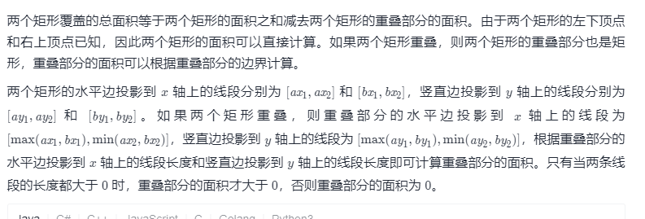

```java
class Solution {
    // 矩形面积 = 面积1 + 面积2 - 重叠面积
    public int computeArea(int ax1, int ay1, int ax2, int ay2, int bx1, int by1, int bx2, int by2) {
        int area1 = (ax2-ax1)*(ay2-ay1);
        int area2 = (bx2-bx1)*(by2-by1);

        int res = area1+area2;
        // base case 无重叠面积
        if(bx1 >= ax2 || ax1 >= bx2 || by1 >= ay2 || by2 <= ay1){
            return res;
        }

        // 计算重叠部分
        int topy = Math.min(ay2,by2);
        int topx = Math.min(ax2,bx2);
        int bottomy = Math.max(ay1,by1);
        int bottomx = Math.max(ax1,bx1);

        
        return res - (topy-bottomy)*(topx-bottomx);

    }
}
```


### 位运算

* 格雷码规则：

  * n位元的格雷碼可以從n-1位元的格雷碼以上下鏡射後加上新位元的方式快速的得到，如右圖所示一般。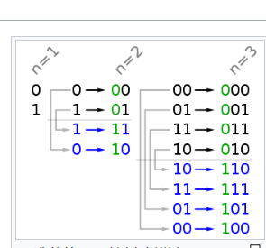

  * 快速生成n位格雷码：

    ```c++
    class Solution {
    public:
        vector<int> grayCode(int n) {
            vector<int> res;   
            int size = pow(2, n);  // 格雷码总数
            for(int i=0; i!=size; ++i) res.push_back(i^(i>>1));  // i与i右移一位后的结果相异或
            return res;
        }
    };
    ```

    

#### [371. 两整数之和](https://leetcode-cn.com/problems/sum-of-two-integers/)

```java
    public int getSum(int a, int b) {
        // 异或运算看做是相加但是不显现进位
        // 与运算左移一位即进位
        // 当进位为0时 此时结果为a即为递归终止的条件 否则继续递归加法【异或结果和 与运算结果相加】 
        return b==0?a:getSum(a^b,(a&b)<<1);
    }
```


#### [405. 数字转换为十六进制数](https://leetcode-cn.com/problems/convert-a-number-to-hexadecimal/)

* 【笔记】核心思想，使用位运算，**每4位对应1位16进制数字。**【长度为 32 的二进制本身就是使用补码规则来表示的，因此我们无须额外处理「补码」问题。】
  - 使用`0xf`(00...01111b)获取`num`的低4位。
  - `>>`算数位移，其中正数右移左边补0，负数右移左边补1。
  - 位移运算并不能保证`num==0`，需要使用32位int保证（对应16进制小于等于8位）。

```java
class Solution {
    public String toHex(int num) {
        // base case
        if(num==0) return "0";
        String hx = "0123456789abcdef";
        // 使用0xf(00...01111b)获取num的低4位
        int f = 0xf;
        StringBuilder sb = new StringBuilder();
        while(num!=0 && sb.length()<8){
            // 前面添加字符
            sb.insert(0,hx.charAt(num&f));
            // 有符号右移四位 位移运算不能保证num==0【num起始<0时】 需要使用32位int保证（对应16进制小于等于8位）。
            num = num>>4;
        }
        return sb.toString();

    }
}
```

#### [476. 数字的补数](https://leetcode-cn.com/problems/number-complement/)

```java
class Solution {
    // 暴力解法：直接求得正整数所代表的二进制数补数的逆序，然后根据该逆序二进制数求出对应十进制数
    public int findComplement(int num) {
        StringBuilder sb = new StringBuilder();
        while(num != 0){
            // 二进制位
            int temp = num % 2;
            // 取补数
            sb.append(temp==1?"0":"1");
            num = num/2;
        }

        String res = sb.toString();
        // 记录二进制位对应的大小
        int bit = 1;
        // 记录结果
        int sum = 0;
        
        for(int i = 0; i < res.length();i++){
           int curNum = res.charAt(i)-'0';
            sum += bit*curNum;
            bit = bit*2;
        }
        return sum;

    }
}
```

* 返回对 num 的二进制表示取反的数，注意 num 的二进制表示是不包含前导零的。

  因此主要问题求得 num 最高位 1 的位置。

  一个简单的做法是：先对 num 进行「从高到低」的检查，找到最高位 1 的位置 s，然后再对 num 进行遍历，将低位到 s 位的位置执行逐位取反操作。

```java
class Solution {
    public int findComplement(int num) {
        int s = -1;

        // 取得最高位为1的位置
        for(int i = 31; i>=0;i--){
            if(((num >> i) & 1) == 1) {
                s = i;
                break;
            }
        }

        int sum = 0;
        for(int i = 0; i<s;i++){
            if(((num >> i)&1) == 0){
                // sum += (1<<i);
                // 异或为无进位加法 (1<<i)最高位为1 其余为0 且最高位一定为比sum最高位高 故可以直接使用异或运算代替+
                sum |= (1<<i);
            }
        }
        return sum;
    }
}
```

#### **BM52** **数组中只出现一次的两个数字**

```c++
class Solution {
public:
    /**
     * 代码中的类名、方法名、参数名已经指定，请勿修改，直接返回方法规定的值即可
     *
     * 
     * @param array int整型vector 
     * @return int整型vector
     */
    vector<int> FindNumsAppearOnce(vector<int>& array) {
        // write code here
        int res = 0;
        for(auto num : array){
            res ^= num;
        }
        
        int mask = 1;
        while((res & mask) == 0){
            mask <<= 1;
        }
        
        int num1 = 0;
        int num2 = 0;
        for(auto i : array){
            if((i & mask) == 0){
                num1 ^= i;
            }else{
                num2 ^= i;
            }
        }
        
        if(num1 > num2){
            int temp = num2;
            num2 = num1;
            num1 = temp;
        }
        // 一致性初始化
        vector<int> result{num1, num2};
        return result;
    }
};
```


### 模拟

#### [166. 分数到小数](https://leetcode-cn.com/problems/fraction-to-recurring-decimal/)

* 这是一道**模拟 竖式计算**（除法）的题目。

  首先可以明确，两个数相除要么是「有限位小数」，要么是「无限循环小数」，而不可能是「无限不循环小数」。

  然后考虑人工计算两数相除是如何进行：

  

  这引导我们可以在模拟竖式计算（除法）过程中，使用「哈希表」记录某个余数最早在什么位置出现过，一旦出现相同余数，则将「出现位置」到「当前结尾」之间的字符串抠出来，即是「循环小数」部分。


```java
class Solution {
    public String fractionToDecimal(int numerator, int denominator) {
        StringBuilder sb = new StringBuilder();
        // 转long 计算 避免溢出
        long a = numerator, b = denominator;
        // 结果为负数的情况
        if((a<0 && b>0) || (a>0 && b<0)) sb.append('-');

        // 都取正
        a = Math.abs(a);
        b = Math.abs(b);
        sb.append(a/b);

        // 没有小数的情况
        if(a%b==0) return sb.toString();
        // 小数
        sb.append('.');

        // 哈希表 key 为被除数 value为此被除数被除后所得的数所放的位置 用于后续小数有循环节时插入括号【有循环节时此位置表示循环节的前一位】
        Map<Long,Integer> map = new HashMap<>();

        // 递归终止条件 找到循环节 或 找到被除数为0的结果 即退出条件要么是整除了，要么是循环了
        while((a=(a%b)*10)>0 && !map.containsKey(a)){  //模拟除法运算的添0过程
            map.put(a,sb.length());
            sb.append(a/b);
        }

        // 小数没有循环节
        if(a == 0) return sb.toString();

        // 在循环节前后插入括号
        return sb.insert(map.get(a).intValue(),'(').append(')').toString();
    }
}
```

#### [434. 字符串中的单词数](https://leetcode-cn.com/problems/number-of-segments-in-a-string/)

* 题目对于「单词」的定义为「连续的不是空格的字符」。

  因此，我们可以从前往后处理字符串 s 并进行计数，对于是空格的字符进行跳过（不计数），而对于非空格字符，则在遍历完一个完整单词（连续一段）后进行一次计数。


```java
    public int countSegments(String s) {
        int res = 0;
        for(int i = 0; i<s.length();){
            // 当前是空格字符则跳过
            if(s.charAt(i)==' ') {
                i++;
                continue;
            }
            
            // 遍历完一个完整单词后进行计数
            while(i < s.length() && s.charAt(i) != ' '){
                i++;
            }
            res++;
        }
        return res;
    }
```

#### [2. 两数相加](https://leetcode-cn.com/problems/add-two-numbers/)

* 模拟进位加法，先从低位开始加一直到高位，当前位做加法的同时记录下一位是否有进位

```java
/**
 * Definition for singly-linked list.
 * public class ListNode {
 *     int val;
 *     ListNode next;
 *     ListNode() {}
 *     ListNode(int val) { this.val = val; }
 *     ListNode(int val, ListNode next) { this.val = val; this.next = next; }
 * }
 */
class Solution {
    public ListNode addTwoNumbers(ListNode l1, ListNode l2) {
        // 记录当前位是否还有进位
        boolean isMore = false;

        ListNode root = null,temp = null;

        while(l1!=null && l2!=null){
            int num1 = l1.val;
            int num2 = l2.val;
            // 构造出的结点应放的值
            int curNodeVal = isMore ? (num1+num2+1)%10:(num1+num2)%10;
            // 当期位的总值 用于判断下一节点是否有进位
            int curVal = isMore ? num1+num2+1:num1+num2;

            // 判断下一位是否有进位
            isMore = curVal>=10;
            
            if(temp == null){
                // 根节点未构造的情况
                temp = new ListNode(curNodeVal);
                if(root == null)
                    root = temp;
            }else{
                // 根节点以构造的情况
                temp.next = new ListNode(curNodeVal);
                temp = temp.next;
            }
            l1 = l1.next;
            l2 = l2.next;
        }

        // 剩余结点转移到l1
        l1 = l2==null?l1:l2;
        
        while(l1 != null){
            int curNodeVal = isMore ? (l1.val+1)%10 : l1.val;
            int curVal = isMore ? (l1.val+1):l1.val;
            isMore = curVal>=10;
            temp.next = new ListNode(curNodeVal);
            temp = temp.next;
            l1 = l1.next;
        }

        // 最后可能还有进位
        temp.next = isMore ? new ListNode(1):null;
        return root;

    }
}
```

* 更简洁的代码

```java
    public ListNode addTwoNumbers(ListNode l1, ListNode l2) {
        ListNode root = new ListNode(0);
        ListNode cursor = root;
        int carry = 0;
        while(l1 != null || l2 != null || carry != 0) {
            int l1Val = l1 != null ? l1.val : 0;
            int l2Val = l2 != null ? l2.val : 0;
            int sumVal = l1Val + l2Val + carry;
            carry = sumVal / 10;
            
            ListNode sumNode = new ListNode(sumVal % 10);
            cursor.next = sumNode;
            cursor = sumNode;
            
            if(l1 != null) l1 = l1.next;
            if(l2 != null) l2 = l2.next;
        }
        
        return root.next;
    }
```

#### [441. 排列硬币](https://leetcode-cn.com/problems/arranging-coins/)

```java
class Solution {
    // 暴力解法 模拟求差值为1的递增数列的和，一直到和大于等于n时停止，如果结果为大于表示最后一行不完整 否则最后一行完整。
    public int arrangeCoins(int n) {
        long total = 0;
        int num = 0;
        while(total < n){
            num++;
            total += num;
        }
        if(total > n) return num-1;
        return num; 
    }
}
```


```java
class Solution {
    // 数学方法：根据差值为1的等差数列求和公式：(1+k)*k/2 <= n   k为第几项
    // 推出 k <= (-1+sqrt(1+8n))/2  k为整数 所以可以直接向下转型取整
    public int arrangeCoins(int n) {
        return (int)((Math.sqrt(1+8*n)-1)/2);
    }
}
```


```java
class Solution {
    // 二分查找方法：总行数k必定在1..n范围内 且根据等差数列公式可知总行数k的总硬币数
    // 每次查找时进行总硬币数和n的比较，根据条件划分接下来的查找范围即可.
    public int arrangeCoins(int n) {
        // 起始查找范围【1，n】
        int left = 1, right = n;

        // 查找终止条件 right < left 即【right+1，right】
        while(left <= right){
            // 总数(middle+1)*middle/2【整个表达式的变量都是int】可能溢出int范围 【所以middle需改为long类型】
            // 但middle并不会溢出
            long middle = ((right - left) >>> 1) + left;
            long tempRes = (middle+1)*middle/2;

            if(tempRes == n){
                return (int)middle;
            }else if(tempRes < n){
                // 小于情况 在右区间查找
                left = (int)middle + 1;
            }else if(tempRes > n){
                // 大于情况，在左区间查找
                right = (int)middle - 1;
            }
        }

        // 终止查找时此时没有总硬币数切好等于n的情况， left在right右侧一位且为偏大的数【最后一步left = middle + 1】其脱离了范围，所以right才为符合条件的数
        return right;

    }  
}
```


#### [273. 整数转换英文表示](https://leetcode-cn.com/problems/integer-to-english-words/)

```java
class Solution {
    String[] smallNum = {"Zero","One", "Two", "Three", "Four", "Five", "Six", "Seven", "Eight", "Nine", "Ten", "Eleven", "Twelve", "Thirteen", "Fourteen", "Fifteen", "Sixteen", "Seventeen", "Eighteen", "Nineteen"};
    String[] mediumNum = { "", "", "Twenty", "Thirty", "Forty", "Fifty", "Sixty", "Seventy", "Eighty", "Ninety"};
    String[] largeNum = {"Billion", "Million", "Thousand", ""};

    // 数字用英文表示是三位一组，我们将十进制长度小于等于 3 位的数字表示出来，然后在后面配合 Billion、Million 和 Thousand 即可表示出范围不超过 2^32-1 的任意数字。
    private String threeNumToStr(int num){
        StringBuilder sb = new StringBuilder();

        if(num >= 100){
            sb.append(smallNum[num/100]);
            sb.append(" ");
            sb.append("Hundred ");
            num = num%100;
        }
        if(num >= 20){
            sb.append(mediumNum[num/10]);
            sb.append(" ");
            num = num%10;
        }
        if(num != 0){
            sb.append(smallNum[num]);
            sb.append(" ");
        }
        // 0情况特殊处理 Zero Billion 并不是一个合法的描述，因此我们需要将 0 抠出来特判 让函数只对[1，999]的数值进行转换
        return sb.toString();
    }

    public String numberToWords(int num) {
        // 唯一用到Zero的情况
        if(num == 0) return smallNum[0];
        StringBuilder sb = new StringBuilder();

        for(int i = (int)1e9,j=0 ; i>=1 ; i /= (int)1e3,j++){
            if(num < i) continue;
            // 分出当前的三位数字进行处理 
            sb.append(threeNumToStr(num/i)+largeNum[j]+" ");
            num = num % i;
        }

        // 去掉尾部多余的空格
        while (sb.charAt(sb.length() - 1) == ' ') sb.deleteCharAt(sb.length() - 1);
        return sb.toString();
    }
}
```

#### [29. 两数相除](https://leetcode-cn.com/problems/divide-two-integers/)

```java
class Solution {
    // 暴力解法 利用求和来求商
    static final long intMax = Integer.MAX_VALUE;
    public int divide(int dividend, int divisor) {
        // base case 
        if(divisor == 1|| dividend == 0) return dividend;
        // 注意 被除数是否为−2^31，若是其绝对值会越界所以需手动给绝对值
        if(divisor == -1) return dividend == Integer.MIN_VALUE ? Integer.MAX_VALUE:-dividend;;

        // 结果是否为负数
        boolean isNega = (divisor > 0 && dividend < 0) ||(divisor < 0 && dividend > 0);

        // 存储两数的绝对值 可能越界所以用int类型
        long a,b;
        a = dividend == Integer.MIN_VALUE ? intMax+1:Math.abs(dividend);
        b = divisor == Integer.MIN_VALUE ? intMax+1:Math.abs(divisor);

        long sum = 0;
        // 存储商
        long res = 0;
        while(sum <= a){
            res++;
            sum += b;
        }
        res--;
        res = isNega?-res:res;
        // 判断结果是否越界
        if(res < Integer.MIN_VALUE || res > Integer.MAX_VALUE) res = Integer.MAX_VALUE;
        return (int)res;
    }
}
```

* 类二分解法

https://leetcode-cn.com/problems/divide-two-integers/solution/tong-ge-lai-shua-ti-la-bei-zeng-cheng-fa-6qbg/

```java
class Solution {
    static final int MAX = Integer.MAX_VALUE;
    static final int MIN = Integer.MIN_VALUE;

    public int divide(int dividend, int divisor) {
        // 溢出情况
        if (dividend == MIN && divisor == -1) {
            return MAX;
        }

        // 记录结果的符号
        int sign = -1;
        if ((dividend > 0 && divisor > 0) || (dividend < 0 && divisor < 0)) {
            sign = 1;
        }

        // 全部转换成负数，防止溢出
        dividend = dividend > 0 ? -dividend : dividend;
        divisor = divisor > 0 ? -divisor : divisor;

        int ans = 0;

        // 倍乘法，注意都是负数了，比较的时候与正数相反
        // 简单点理解，就是每次减去除数的 2^x 倍数，剩下的部分继续按这样的规则继续
        while (dividend <= divisor) {
            int tmp = divisor, count = 1;
            // 这里注意不要写成 tmp + tmp >= dividend，这样写加法有可能会溢出导致死循环
            while (tmp >= dividend - tmp) {
                // tmp 和 count 每次增加一倍，所以叫倍增
                tmp += tmp;
                count += count;
            }
            // 被除数减去除数的 2^x 倍数做为新的被除数
            dividend -= tmp;
            // count 即 2^x
            ans += count;
        }

        return sign < 0 ? -ans : ans;
    }
}


```

#### [412. Fizz Buzz](https://leetcode-cn.com/problems/fizz-buzz/)

```java
class Solution {
    // 暴力解法：模拟+字符串拼接
    // 如果 i 是 3 的倍数，则将 “Fizz" 拼接到 answer[i]
    // 如果 i 是 5 的倍数，则将“Buzz" 拼接到answer[i]
    // 如果answer[i] 为空，则 i 既不是 3 的倍数也不是 5 的倍数，将 i 拼接到 answer[i]。
    public List<String> fizzBuzz(int n) {
        List<String> res = new LinkedList<>();
        for(int i = 1;i<=n;i++){
            StringBuilder sb = new StringBuilder();
            if(i%3==0) sb.append("Fizz");
            if(i%5==0) sb.append("Buzz");
            if(sb.length()==0)sb.append(i);
            res.add(sb.toString());
        }
        return res;
    }
}
```

#### [6. Z 字形变换](https://leetcode-cn.com/problems/zigzag-conversion/)

https://leetcode-cn.com/problems/zigzag-conversion/solution/zzi-xing-bian-huan-by-jyd/

```java
class Solution {
    // 关键：模拟出字符在行索引的变化，字符在Z字形对应的行索引先增大再减小，如此往复
    // 主要还是画图找出对应行索引变化的规律
    public String convert(String s, int numRows) {
        if(numRows < 2) return s;
        List<StringBuilder> list = new ArrayList<>();

        for(int i=0;i<numRows;i++){
            list.add(new StringBuilder());
        }
        // 关键变量 当走到Z字形转折点时，执行反向
        int flag = -1;
        int i = 0;
        for(char c : s.toCharArray()){
            list.get(i).append(c);
            if(i==0 || i==numRows-1) flag = -flag;
            i += flag;
        }

        StringBuilder res = new StringBuilder();
        for(StringBuilder sb : list) res.append(sb);

        return res.toString();
    }
}
```

#### [7. 整数反转](https://leetcode-cn.com/problems/reverse-integer/)

* 模拟整数反转
* 溢出问题： 解决溢出问题一般有两个思路，第一个思路是通过字符串转换加try catch的方式来解决，第二个思路就是通过数学计算来解决。【这里通过数学计算来解决】

```java
class Solution {
    
    public int reverse(int x) {
        int res = 0;
        // 反向拼接得到反转的效果
        while(x != 0){
            int tmp = x % 10;
            // 溢出判断  到【最大数的1/10】时，就要开始判断 并结合下一位进行判断
            // if(res > Integer.MAX_VALUE/10 || (res == Integer.MAX_VALUE/10 && tmp > 7)){
            //     return 0;
            // }
            // if(res < Integer.MIN_VALUE/10 || (res == Integer.MIN_VALUE/10 && tmp < -8)){
            //     return 0;
            // }

            // 优化：因为x本身会被int限制，当x为正数并且位数和Integer.MAX_VALUE的位数相等时首位最大只能为2，所以逆转后不会出现res = Integer.MAX_VALUE / 10 && tmp > 2的情况，自然也不需要判断res==214748364 && tmp>7了，反之负数情况也一样
            if (res > Integer.MAX_VALUE / 10 || res < Integer.MIN_VALUE / 10)  {
               return 0;
            }
            res = res*10 + tmp;
            x = x / 10;
        }
        return res;
    }
}
```

#### [38. 外观数列](https://leetcode-cn.com/problems/count-and-say/)

* 模拟实现：

一个朴素的想法是：根据题意进行模拟，从起始条件 k=1 时 ans = "1" 出发，逐步递推到 k=n 的情况，对于第 k 项而言，其实就是对第 k−1 项的「连续段」的描述，而求「连续段」长度，可以使用双指针实现。

```java
class Solution {
    public String countAndSay(int n) {
        String ans = "1";
        for (int i = 2; i <= n; i++) {
            String cur = "";
            int m = ans.length();
            for (int j = 0; j < m; ) {
                int k = j + 1;
                while (k < m && ans.charAt(j) == ans.charAt(k)) k++;
                int cnt = k - j;
                cur += cnt + "" + ans.charAt(j);
                j = k;
            }
            ans = cur;
        }
        return ans;
    }
}
```


* 递归解法：

```java
class Solution {
    // 函数定义：输出外观数列的第n项
    public String countAndSay(int n) {
        // n项需要n-1项实现所以可通过递归实现
        // base case
        if(n == 1){
            return "1";
        }
        // 获取第n-1项对应的字符串
        String lastResult = countAndSay(n-1);
        // 记录当前第n项的结果
        StringBuilder sb = new StringBuilder();
    
        for(int j = 0;j<lastResult.length();j++){
            // 记录每段相同字符的个数
            int count = 1;
            // 判断下一个字符和当前字符相同 不相同表示换段
            while(j+1 < lastResult.length() && lastResult.charAt(j+1) == lastResult.charAt(j)){
                count++;
                j++;
            }
            sb.append(count).append(lastResult.charAt(j));
        }

        return sb.toString();
    }
}
```


#### [66. 加一](https://leetcode-cn.com/problems/plus-one/)

```java
class Solution {
    // 基本加一操作的模拟：难点在于进位时的复制和进位的记录
    public int[] plusOne(int[] digits) {
        // 进位的标志 【初始为1，因为默认为1】
        int flag = 1;
        int n = digits.length-1;
        while(n>=0){
            int num = digits[n];
            digits[n] = (num+flag)%10;
            if(num+flag < 10){
                // 后面不再有进位了故无需复制，直接返回
                return digits;
            }else{
                // 记录新的进位，只可能为1
                // flag = (num+flag)/10;
                flag = 1;
            }
            n--;
        }

        if(flag == 1){
            int[] result = new int[digits.length+1];
            result[0] = flag;
            // for(int i = 1;i<result.length;i++){
            //     result[i] = digits[i-1]; 
            // }
            // 直接使用api复制数组
            System.arraycopy(digits,0,result,1,digits.length);
            return result;
        }else{
            return digits;
        }
    }
}
```

#### [492. 构造矩形](https://leetcode-cn.com/problems/construct-the-rectangle/)

```java
class Solution {
    // 最接近开跟的因子即为长度 整除该因子即为宽度，这样能确保长度和宽度的差距尽可能地小。
    public int[] constructRectangle(int area) {
        int length = -1;
        int width = -1;

        for(int i = 1;i<=Math.sqrt(area);i++){
            if(area % i == 0){
                width = i;
                length = area / width;
            }
        }

        return new int[]{length,width};
    }
}

```


#### [496. 下一个更大元素 I](https://leetcode-cn.com/problems/next-greater-element-i/)

* 模拟法

```java
class Solution {
    // 暴力解法：用map记录nums1每个元素在nums2出现的位置
    // key 为 nums1元素值 value 为位置
    // 最后遍历nums1中元素 再取出其在nums2的位置 判断往后有无更大的数即可。
    public int[] nextGreaterElement(int[] nums1, int[] nums2) {
        Map<Integer,Integer> map = new HashMap<>();
        for(int num : nums1){
            for(int index = 0 ; index < nums2.length; index++){
                if(nums2[index] == num){
                    map.put(num,index);
                    break;
                }
            }
        }

        int[] result = new int[nums1.length];
        for(int i = 0; i < result.length; i++){
            int index = map.get(nums1[i]);
            result[i] = -1;
            for(int j = index+1; j < nums2.length; j++){
                if(nums2[j] > nums1[i]){
                    result[i] = nums2[j];
                    break;
                }
            }
        }

        return result;
    }
}
```

* 更简洁的模拟法
* 时间复杂度O(nm) 【找到相同的位置+找到比其大的数最多用m次】
* 空间复杂度O(n)

```java
class Solution {
    public int[] nextGreaterElement(int[] nums1, int[] nums2) {
        // 循环中完成查找位置和查找比其大的数
        int n = nums1.length, m = nums2.length;
        int[] result = new int[n];

        for(int i = 0 ; i < n; i++){
            int j = 0;
            // 找到相同值的位置
            while(j < m && nums1[i] != nums2[j]) j++;
            // 试着找到比其大的数
            while(j < m && nums1[i] >= nums2[j]) j++;

            // 取出结果
            result[i] = j == m ? -1 : nums2[j];
        }

        return result;
    }
}
```

* 单调栈实现 **当题目出现「找到最近一个比其大/小的元素」的字眼时，自然会想到「单调栈」。**
* 单调栈：https://leetcode-cn.com/problems/next-greater-element-i/solution/dan-diao-zhan-jie-jue-next-greater-number-yi-lei-w/
* https://leetcode-cn.com/problems/largest-rectangle-in-histogram/solution/84-by-ikaruga/
* 单调递增栈：栈内元素从底到顶是递增的，当元素出栈时，说明这个**新元素**是出栈元素**向后**找第一个比其小的元素，当元素出栈后，说明新**栈顶元素**是出栈元素**向前**找第一个比其小的元素。
* 单调递减栈：栈内元素从底到顶是递减的，当元素出栈时，说明这个**新元素**是出栈元素**向后**找第一个比其大的元素，当元素出栈后，说明新**栈顶元素**是出栈元素**向前**找第一个比其大的元素。
* 单调栈中维护当前位置右边的更大的元素列表，且从栈底到栈顶的元素是单调递减的。
* 时间复杂度：维护单调栈，**每个元素最多入栈出栈一次**，复杂度为O(m)；构造答案复杂度为O(n)。整体复杂度为 O(n + m)
  空间复杂度：O(m)

```java
class Solution {
    public int[] nextGreaterElement(int[] nums1, int[] nums2) {
        // 存储nums2中每个元素 下一个更大的元素
        Map<Integer,Integer> map = new HashMap<>();
        // 双端队列来实现栈
        Deque<Integer> stack = new ArrayDeque<>();

        // 单调栈方式来统计nums2中每个元素对应下一个更大的元素值
        for(int i = nums2.length-1; i >= 0; i--){
            int num = nums2[i];
            
            // 取出栈中 小于当前元素的元素
            while(!stack.isEmpty() && num >= stack.peek()) stack.pop();

            //如果栈中还有元素 表示该元素右边有更大的元素 越接近栈顶 其与该元素越近
            map.put(num,stack.isEmpty()?-1:stack.peek());

            // 当前元素加入栈中
            stack.push(num);
        }


        // 遍历nums1中的元素 取得其在nums2中的位置上右边第一个大于它的元素
        int[] result = new int[nums1.length];
        for(int i = 0; i < result.length; i++){
            result[i] = map.get(nums1[i]);
        }

        return result;
    }
}
```


#### [415. 字符串相加](https://leetcode-cn.com/problems/add-strings/)

* 模拟相加过程，并记录进位，最后别忘了加进位，同时需要反转

* ```java
  class Solution {
      public String addStrings(String num1, String num2) {
          int flag = 0;
          int start1 = num1.length() - 1;
          int start2 = num2.length() - 1;
          StringBuilder sb = new StringBuilder();
          while(start1 >=0 && start2 >= 0){
              int one = num1.charAt(start1) - '0';
              int two = num2.charAt(start2) - '0';
              int num = (one + two + flag) % 10;
              flag = (one + two + flag) / 10;
              sb.append(num);
              start1--;
              start2--;
          }
  
          while(start1 >= 0){
              int one = num1.charAt(start1) - '0';
              int num = (one + flag) % 10;
              flag = (one + flag) / 10;
              sb.append(num);
              start1--;
          }
  
          while(start2 >= 0){
              int two = num2.charAt(start2) - '0';
              int num = (two + flag) % 10;
              flag = (two + flag) / 10;
              sb.append(num);
              start2--;
          }
  
          if(flag == 1) sb.append(flag);
          return sb.reverse().toString();
      }
  }
  ```


#### 字节数组序列化

* 将字节序列序列化为字符串

* c++中字节常用unsigned char类型表示，其长度为一个字节，首位不表示正负，范围为[0,255]。

* 字节表示的十进制数最长为3位，故可将字节对应的三位十进制数存储下来进行序列化.

  ```c++
  string trans(vector<unsigned char>& arr){
      // fill
      string res(arr.size() * 3, '*');
      if (arr.size() == 0) return res;
      for (int i = 0; i < arr.size(); i++) {
          int temp = arr[i];
          int index = (i+1)*3 - 1;
          while (temp > 0) {
              res[index] = (temp % 10) + '0';
              temp /= 10;
              index--;
          }
      }
      return res;
  }
  ```

  


### 相加问题

* 一般都是转为10进制，然后将两个十进制数和进位相加，并记录新的进位，然后将相加结果对相应进制取余，取余结果转为对应进制数再加入结果集。相加完后还要判断进位是否还剩，剩就相加，最后对结果反转即可。

* 如下36进制相加

  ```c++
  #include <iostream>
  #include <algorithm>
  using namespace std;
  
  char getChar(int n)
  {
      if (n <= 9)
          return n + '0';
      else
          return n - 10 + 'a';
  }
  int getInt(char ch)
  {
      if ('0' <= ch && ch <= '9')
          return ch - '0';
      else
          return ch - 'a' + 10;
  }
  string add36Strings(string num1, string num2)
  {
      int carry = 0;
      int i = num1.size() - 1, j = num2.size() - 1;
      int x, y;
      string res;
      while (i >= 0 || j >= 0 || carry)
      {
          x = i >= 0 ? getInt(num1[i]) : 0;
          y = j >= 0 ? getInt(num2[j]) : 0;
          int temp = x + y + carry;
          res += getChar(temp % 36);
          carry = temp / 36;
          i--, j--;
      }
      reverse(res.begin(), res.end());
      return res;
  }
  
  int main()
  {
      string a = "1b", b = "2x", c;
      c = add36Strings(a, b);
      cout << c << endl;
  }
  ```

  

#### **BM89** **合并区间**

* 先根据左端点排序，然后模拟合并

```java
public class Solution {
    public ArrayList<Interval> merge(ArrayList<Interval> intervals) {
        if(intervals.isEmpty()) return intervals;
        Collections.sort(intervals, (a, b) -> {return a.start - b.start;});
        ArrayList<Interval> result = new ArrayList<>();
        result.add(intervals.get(0));
        for(int i = 1; i < intervals.size(); i++){
            Interval last = result.get(result.size() - 1);
            Interval cur = intervals.get(i);
            if(last.end >= cur.start && last.end <= cur.end){ // 合并
                last.end = cur.end;
            }else{
                // 跳过不能合并 且无需加入
                if(last.end > cur.end) continue;
                // 无需合并 直接加入
                result.add(cur);
            }
        }
        return result;
    }
}
```


### 遍历

#### [414. 第三大的数](https://leetcode-cn.com/problems/third-maximum-number/)

* **经典的找数组次大值的做法是使用两个变量 `a` 和 `b` 分别存储遍历过程中的最大值和次大值。**

* 回到本题，同理我们可以使用 a、b 和 c 三个变量来代指「最大值」、「**严格**次大值」和「**严格**第三大值」。

  从前往后遍历 nums，假设当前元素为 x，对是否更新三者进行分情况讨论（判断优先级从上往下）：

  x > a，说明最大值被更新，将原本的「最大值」和「次大值」往后顺延为「次大值」和「第三大值」，并用 x 更新 a；
  x < a 且 x > b，说明次大值被更新，将原本的「次大值」往后顺延为「第三大值」，并用 x 更新 b；
  x < b 且 x > c，说明第三大值被更新，使用 x 更新 c。

  

```java
class Solution {
    long INF = (long)-1e18;
    public int thirdMax(int[] nums) {
        // 避免第三大的数就是Integer.MIN_VALUE 却误认为没有第三大的数 因为有-2^31 <= nums[i] <= 2*31 - 1
        // int firstMax = Integer.MIN_VALUE, secondMax = Integer.MIN_VALUE, thirdMax = Integer.MIN_VALUE;

        long firstMax = INF, secondMax = INF, thirdMax = INF;

        for(int num : nums){
            if(num > firstMax){
                thirdMax = secondMax;
                secondMax = firstMax;
                firstMax = num;
            }else if(num < firstMax && num > secondMax){
                thirdMax = secondMax;
                secondMax = num;
            }else if(num < secondMax && num > thirdMax){
                thirdMax = num;
            }
        }

        return thirdMax == INF? (int)firstMax : (int)thirdMax;
    }
}
```


## 链表

### [剑指 Offer 52. 两个链表的第一个公共节点](https://leetcode-cn.com/problems/liang-ge-lian-biao-de-di-yi-ge-gong-gong-jie-dian-lcof/)

* 法一

```java
/**
 * Definition for singly-linked list.
 * public class ListNode {
 *     int val;
 *     ListNode next;
 *     ListNode(int x) {
 *         val = x;
 *         next = null;
 *     }
 * }
 */
public class Solution {
    /** 先找出两个链表的长度 得出两个链表的长度差距distance  将较长的链表的头结点向前移distance 两个头结点开始遍历 若遍历到的节点地址相同则返回
     * 因为两链表有相交部分 则两链表的首个相交节点只可能从某个相同长度的子链表开始
     */
    public ListNode getIntersectionNode(ListNode headA, ListNode headB) {
        ListNode p1 = headA;
        ListNode p2 = headB;
        int distance;
        int num1 = 0;
        int num2 = 0;
        while(p1!=null){
            p1 = p1.next;
            num1++;
        }
        while(p2!=null){
            p2 = p2.next;
            num2++;
        }
       if(num2>num1){
           distance = num2-num1;
           while(distance>0){
               headB=headB.next;
               distance--;
           }
       }else{
           distance = num1-num2;
           while(distance>0){
               headA = headA.next;
               distance--;

           }
       }
       while(headA!=null&&headB!=null){
           if(headA == headB) return headB;
           else {
               headA = headA.next;
               headB = headB.next;
           }
       }
       return null;
    }
}
```

* 法二
*  两个链表长度分别为L1+C、L2+C， C为公共部分的长度，按照楼主的做法： 第一个人走了L1+C步后，回到第二个人起点走L2步；第2个人走了L2+C步后，回到第一个人起点走L1步。 当两个人走的步数都为L1+L2+C时就两个家伙就相爱了
* 不相交时最后两人同时走到末尾，都是 None，就结束循环了

```java
 public ListNode getIntersectionNode(ListNode headA, ListNode headB) {
    ListNode p1 = headA;
    ListNode p2 = headB;
    while(p1!=p2){
        p1 = p1==null?headB:p1.next;
        p2 = p2==null?headA:p2.next;
    }
    //走到相交点或者null
    return p1;
}
```

### [234. 回文链表](https://leetcode-cn.com/problems/palindrome-linked-list/)

```java
class Solution {
    //法一 O(n)空间 利用栈先进后出
    // public boolean isPalindrome(ListNode head) {
    //     Stack<ListNode> stack = new Stack();
    //     ListNode p =head;
    //     ListNode temp;
    //     while(p!=null){
    //         stack.push(p);
    //         p = p.next;
    //     }
    //     while(head!=null){
    //         temp = stack.pop();
    //         if(temp.val != head.val) return false;
    //         head = head.next;
    //     }
    //     return true;
    // }

    //法二 O(n/2)空间 栈只装填回文链表的另一半节点
    // public boolean isPalindrome(ListNode head) {
    //     Stack<ListNode> stack = new Stack();
    //     ListNode cur = head;
    //     ListNode right = cur.next;
    //     while(cur.next!=null&&cur.next.next!=null){
    //         cur = cur.next.next;
    //         right=right.next;
    //     }
    //     while(right!=null){
    //         stack.push(right);
    //         right = right.next;
    //     }
    //     while(stack.size()!=0){
    //         if(stack.pop().val !=head.val) return false;
    //         head=head.next;
    //     }
    //     return true;
    // }
    //法三 空间复杂度O(1)
    public boolean isPalindrome(ListNode head) {
        if (head == null || head.next == null) {
			return true;
		}
		ListNode n1 = head;
		ListNode n2 = head;
        while(n2.next!=null&&n2.next.next!=null){
            n1 = n1.next;
            n2 = n2.next.next;
        }
        //n2为链表右半部分第一个节点 即使链表节点个数为奇数其也不是中间公共节点，偶数时为右侧第一个节点
        n2 = n1.next;
        //链表节点为偶数时 n1为左侧最后一个节点 奇数时为中间公共节点
        //反转后的最后一个节点的下一节点置为null
        n1.next = null;
        //对n1节点到尾节点的链表进行反转
        ListNode n3 = null;
        while(n2!=null){
            //n3记录下一个反转的节点
            n3 = n2.next;
            //n2置为反转链表的头结点
            n2.next = n1;
            //更改反转链表的头结点
            n1 = n2;
            //下一个操作的节点
            n2 = n3;
        }
        //反转完成 n1为反转链表的头结点 即原先链表的尾节点
        n3 = n1; //记录尾节点 便于后续复原
        n2 = head;
        //链表节点个数为偶数时 反转链表的尾节点为左侧链表的尾节点 为奇数时 反转链表的尾节点为左右两侧链表的公共节点 即偶数时左链表少了一个节点
        //进行比较
        boolean res = true;
        while(n1!= null && n2!= null){
            if(n1.val != n2.val) {
                //先记录结果 复原链表后在返回
                res = false;
                break;
            }
            n1 = n1.next;
            n2 = n2.next;
        }
        //复原链表
        n1 = n3.next;
        n3.next = null;
        while(n1!=null){
            n2 = n1.next;
            n1.next = n3;
            n3 = n1;
            n1 = n2;
        }
        return res;
    }
}

// 类似的代码 快慢指针有些许不同
 public boolean isPalindrome(ListNode head) {
        // 快慢指针 慢指针将走到回文链表中简单节点
        ListNode slow = head , fast = head;

        while(fast!=null&&fast.next!=null){
            slow = slow.next;
            fast = fast.next.next;
        }

        // 链表节点个数是奇数时 slow要跳到下一节点
        if(fast!=null){
            slow = slow.next;
        }

        // 反转slow开始的节点，便于比较
        ListNode pre = null, cur = slow,next;
        while(cur!=null){
            next = cur.next;
            cur.next = pre;
            pre =cur;
            cur = next;
        }

        // 此时这里pre即为反转后的链表头结点
        // 开始比较
        while(pre!=null){
            if(head.val!=pre.val) return false;
            head = head.next;
            pre = pre.next;
        }

        // 如果想维持原链表次序 只需将对应反转链表反转回来即可
        return true;
    }

// 递归方法 ..
   // 时间空间复杂度 都是O(n)..
    ListNode left;
    // 链表其实也可以分为前序遍历和后续遍历【根据访问节点代码位置的不同】
    public boolean isPalindrome(ListNode head) {
        if(head == null) return true;
        left = head;
        return traverse(head);
    }

    // 实际上就是把链表节点放入一个栈，然后再拿出来，这时候元素顺序就是反的，只不过我们利用的是递归函数的堆栈而已。
    public boolean traverse(ListNode right){
        if(right == null) return true;
        // 前序遍历代码
        boolean res = traverse(right.next);
        // 后序遍历代码
        res = res && (left.val == right.val);
        left = left.next;
        return res;
    }
```

* 法二中间指针和尾指针受节点个数影响的终点位置

  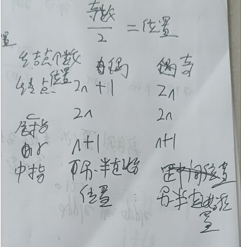

* 法三过程

  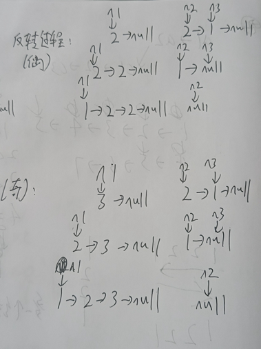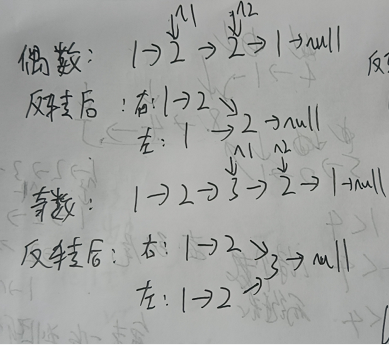

### [LRU 缓存机制](https://leetcode-cn.com/problems/lru-cache/)

```java
class LRUCache {
    // 通过双向链表加哈希表实现LRU缓存机制
    // 双向链表按照被使用的顺序存储了这些键值对，靠近头部的键值对是最近使用的，而靠近尾部的键值对是最久未使用的。
    // 哈希表即为普通的哈希映射（HashMap），通过缓存数据的键映射到其在双向链表中的位置。
    class Node{
        int key;
        int value;
        Node next;
        Node pre;
        public Node(){
        }
        public Node(int key,int value){
            this.key = key;
            this.value = value;
        }
    }
    //在双向链表的实现中，使用一个伪头部（dummy head）和伪尾部（dummy tail）标记界限，这样在添加节点和删除节点的时候就不需要检查相邻的节点是否存在。
    private Node head;
    private Node tail;
    private int capacity;
    private int size;
    private Map<Integer,Node> keyNodeMap = new HashMap<>();
    public LRUCache(int capacity) {
        this.capacity = capacity;
        this.size = 0;
        this.head = new Node();
        this.tail = new Node();
        head.next = tail;
        tail.pre = head;
    }
    
    // get操作 判断有无key对应的节点 无则返回-1 有则将节点移链表的头部
    public int get(int key) {
        Node node = keyNodeMap.get(key);
        if(node==null) return -1;
        moveToHead(node);
        return node.value;
    }
    
    // put操作 判断有无key对应的节点 无则添加节点进哈希表和链表头部 并判断是否溢出 溢出则将尾节点移除
    //          有则替换节点对应的值 且将节点移动到链表头部
    public void put(int key, int value) {
        Node node = keyNodeMap.get(key);
        if(node==null){
           node = new Node(key,value);
           keyNodeMap.put(key,node);
            addToHead(node);
            size++;
            if(size > capacity){
               Node removeNode = removeTail();
               keyNodeMap.remove(removeNode.key);
               size--;
           }
        }else{
            node.value =value;
            moveToHead(node);
        }
    }
    
    // 对链表节点的操作

    // 添加到头结点
    public void addToHead(Node node){
        node.pre = head;
        node.next = head.next;
        head.next.pre = node;
        head.next = node;
    }

    // 移除节点
    public void removeNode(Node node){
        node.pre.next = node.next;
        node.next.pre = node.pre;
    }

    // 移动节点到头部
    public void moveToHead(Node node){
        removeNode(node);
        addToHead(node);
    }

    // 删除实际尾节点
    public Node removeTail(){
        Node res = tail.pre;
        removeNode(res);
        return res;
    }

}

/**
 * Your LRUCache object will be instantiated and called as such:
 * LRUCache obj = new LRUCache(capacity);
 * int param_1 = obj.get(key);
 * obj.put(key,value);
 */
```

* 第二次写：

* ```java
  class LRUCache {
      // 使用哈希表+双向链表构建LRU缓存机制
  class Node{
      int key;
      int val;
      Node prev;
      Node next;
      public Node(int key, int val){
          this.key = key;
          this.val = val;
      }
  }     
      // 使用HashMap存储节点来加快查找速度
      Map<Integer, Node> map = new HashMap<>();
      int capacity;
      // 虚拟头尾节点 减少代码复杂度
      Node dummyHead;
      Node dummyTail;
  
      public LRUCache(int capacity) {
          this.capacity = capacity;
          dummyHead = new Node(-1, -1);
          dummyTail = new Node(-1, -1);
          dummyHead.next = dummyTail;
          dummyTail.prev = dummyHead;
      }
      
      public int get(int key) {
          if(!map.containsKey(key)){
              return -1;
          }else{
              Node result = map.get(key);
              updateList(result);
              return result.val;
          }
      }
      
      public void put(int key, int value) {
          // 旧节点 直接更新值 并将节点移动到链首
          if(map.containsKey(key)){
              Node result = map.get(key);
              updateList(result);
              result.val = value;
              return;
          }
          // 新结点 且容量足够 直接添加 并将新结点移动到链首
          if(map.size() < capacity){
              Node result = new Node(key, value);
              map.put(key, result);
              updateList(result);
              return; 
          }
  
          // 新节点 容量不够 将最近最少使用的移除并改变前后节点相关指针，然后构建新节点移动到链首
          if(map.size() >= capacity){
              map.remove(dummyTail.prev.key);
              dummyTail.prev.prev.next = dummyTail;
              dummyTail.prev = dummyTail.prev.prev;
              Node result = new Node(key, value);
              map.put(key, result);
              updateList(result);
              return ;
          }
      }
  
      /**
       * 将节点移到链表头部
       */
      private void updateList(Node result){
          // 非新加入的节点的前后节点需变为相连
          if(result.prev != null && result.next != null){
              result.prev.next = result.next;
              result.next.prev = result.prev;
          }
          Node temp = dummyHead.next;
          dummyHead.next = result;
          result.prev = dummyHead;
          result.next = temp;
          temp.prev = result;
      }
  
     
  }
  
  /**
   * Your LRUCache object will be instantiated and called as such:
   * LRUCache obj = new LRUCache(capacity);
   * int param_1 = obj.get(key);
   * obj.put(key,value);
   */
  ```
  
  * LinkedList作为LRU结构时，如何加快速度：**只取链表两端元素**，需要更新位置时，直接在链表头部加新值，然后记录已删除的元素到deleted中【实际未删除】，后续从尾部取出时，如果尾部元素在deleted表示已删除，需要多次从尾部取出元素。
  
    ```java
        /**
         * 代码中的类名、方法名、参数名已经指定，请勿修改，直接返回方法规定的值即可
         *
         * 统计缓存命中次数
         * @param R int整型一维数组 缓存访问记录
         * @param N int整型 缓存大小
         * @return int整型
         */
        public int stat_hit_count (int[] R, int N) {
            // write code here
            int times = 0;
            HashMap<Integer, Integer> deleted = new HashMap<>();
            HashSet<Integer> set = new HashSet<>();
            LinkedList<Integer> list = new LinkedList<>();
            for (int i = 0; i < R.length; i++) {
                int num = R[i];
                if(set.contains(num)){
                    times++;
                    if(list.getLast() == num) list.pollLast();
                    else{
                        deleted.put(num,deleted.getOrDefault(num, 0) + 1);
                    }
                    list.addFirst(num);
                }else{
                    if(set.size() < N){
                        set.add(num);
                        list.addFirst(num);
                    }else{
                        while(deleted.containsKey(list.getLast())){
                            if(deleted.get(list.getLast()) == 1){
                                deleted.remove(list.getLast());
                            }else{
                                deleted.put(list.getLast(),deleted.get(list.getLast()) - 1);
                            }
                        }
                        Integer pollLast = list.pollLast();
                        set.remove(pollLast);
                        set.add(num);
                        list.addFirst(num);
                    }
                }
    
            }
            return times;
        }
    ```
  
* C++

  ```c++
  class Node {
    public:
      Node(int key, int val) {
          this->key = key;
          this->val = val;
          this->pre = nullptr;
          this->next = nullptr;
      }
      int key;
      int val;
      Node* pre;
      Node* next;
  };
  class Solution {
    public:
      Solution(int capacity) {
          // write code here
          this->capacity = capacity;
          dummyHead = new Node(-1, -1);
          dummyTail = new Node(-1, -1);
          dummyHead->next = dummyTail;
          dummyTail->pre = dummyHead;
      }
      // 修改节点为头节点【最近使用】
      void changePosi(Node* res) {
          res->pre = dummyHead;
          res->next = dummyHead->next;
          dummyHead->next->pre = res;
          dummyHead->next = res;
      }
      // 删除节点
      void removeNode(Node* res) {
          if (res->next != nullptr && res->pre != nullptr) {
              res->pre->next = res->next;
              res->next->pre = res->pre;
              res->pre = nullptr;
              res->next = nullptr;
          }
      }
  
      int get(int key) {
          // write code here
          if (cache.find(key) != cache.end()) {
              Node* res = cache.find(key)->second;
              removeNode(res);
              changePosi(res);
              return res->val;
          }
          return -1;
      }
  
      void set(int key, int value) {
          // write code here
          if (cache.find(key) != cache.end()) {
              cache[key]->val = value;
              removeNode(cache[key]);
              changePosi(cache[key]);
          } else {
              // 头插
              if (cache.size() == capacity) {
                  // 哈希表中删除指定键对应元素
                  cache.erase(dummyTail->pre->key);
                  // 从双向链表中删除
                  removeNode(dummyTail->pre);
              }
  
              Node* node = new Node(key, value);
              changePosi(node);
              cache[key] = node;
          }
      }
      Node* dummyHead;
      Node* dummyTail;
      int capacity;
      unordered_map<int, Node*> cache;
  };
  
  /**
   * Your Solution object will be instantiated and called as such:
   * Solution* solution = new Solution(capacity);
   * int output = solution->get(key);
   * solution->set(key,value);
   */
  ```

* 使用API版

  ```c++
  #include <list>
  #include <unordered_map>
  #include <utility>
  class Solution {
    private:
      // 记录迭代器
      unordered_map<int, std::list<pair<int, int>>::iterator> cache;
      // 双向链表
      list<pair<int, int>> list;
      int cap;
    public:
      Solution(int capacity): cap(capacity) {
          // write code here
      }
  
      int get(int key) {
          // write code here
          if (cache.find(key) != cache.end()) {
              // auto 为pair 迭代器解引用返回引用 node使用引用进行构造
              auto node = *cache[key];
              // 去除对应位置的节点 常数时间复杂度
              list.erase(cache[key]);
              // 加入队头
              list.push_front(node);
              cache[key] = list.begin();
              return node.second;
          }
          return -1;
      }
  
      void set(int key, int value) {
          // write code here
          if (cache.find(key) != cache.end()) {
              auto& node = *cache[key];
              // todo erase不是析构了元素吗，为啥引用还可以用 
              // todo 插入元素是插入引用还是新拷贝了？
              node.second = value;
              // 去除对应位置的节点 常数时间复杂度
              list.erase(cache[key]);
              // 加入队头
              list.push_front(node);
              cache[key] = list.begin();
          } else {
              if (cache.size() == cap) {
                  auto toRemoNode = list.back();
                  cache.erase(toRemoNode.first);
                  list.pop_back();
              }
              auto node = make_pair(key, value);
              list.push_front(node);
              cache[key] = list.begin();
          }
      }
  };
  
  /**
   * Your Solution object will be instantiated and called as such:
   * Solution* solution = new Solution(capacity);
   * int output = solution->get(key);
   * solution->set(key,value);
   */
  ```

  


### [206. 反转链表](https://leetcode-cn.com/problems/reverse-linked-list/)

```java
/**
 * Definition for singly-linked list.
 * public class ListNode {
 *     int val;
 *     ListNode next;
 *     ListNode() {}
 *     ListNode(int val) { this.val = val; }
 *     ListNode(int val, ListNode next) { this.val = val; this.next = next; }
 * }
 */
class Solution {
    // 迭代实现...
        // 插入过程
    // 1->2->3->4->5->null
    // null
    // 1->null
    // 2->1->null
    // ..
    // 5->4->3->2->1->null
    public ListNode reverseList(ListNode head) {
        // 反转链表的头结点
        ListNode newHead = null;
        // 待插入反转链表的节点
        ListNode cur = head;

        while(cur != null){
            // 临时存储下一个插入的节点
            ListNode nextNode = cur.next;
            // 插入节点到反转链表的头部
            cur.next = newHead;
            // 跟新反转链表的头结点
            newHead = cur;
            // 更新下个待插入节点
            cur = nextNode;
        }

        return newHead;
    }

    // 递归实现 
    // 函数定义：反转以head节点开始的整个链表 并返回反转后的头结点
    public ListNode reverseList(ListNode head) {
        // base case 
        if(head == null) return null;
        if(head.next == null) return head;

        // 反转下一个节点开始的链表 并获取反转后的头结点
        ListNode last = reverseList(head.next);

        // 反转操作
        head.next.next = head;
        // 避免死循环
        head.next = null;

        // 返回反转后的头结点
        return last;
    }    
}
```


### [92. 反转链表 II](https://leetcode-cn.com/problems/reverse-linked-list-ii/)

* 递归实现【时间复杂度O(n) 空间复杂度O(n)【堆栈实现】】

```java
/**
 * Definition for singly-linked list.
 * public class ListNode {
 *     int val;
 *     ListNode next;
 *     ListNode() {}
 *     ListNode(int val) { this.val = val; }
 *     ListNode(int val, ListNode next) { this.val = val; this.next = next; }
 * }
 */
class Solution {
    private ListNode successor = null;
    // 定义：对head为头指针的链表 把索引从left到right的部分反转 返回头节点
    public ListNode reverseBetween(ListNode head, int left, int right) {

        // base case 反转前n个节点
        if(left == 1) return reverseN(head,right);

        // 头指针移动 索引相对移动
        head.next = reverseBetween(head.next,left-1,right-1);
        return head;
    }

    // 定义：对head为头指针的链表 反转前n个节点 返回头节点
    public ListNode reverseN(ListNode head,int n){
        // base case 反转一个节点
        if(n == 1){
            // 记录后续节点
            successor = head.next;
            return head;
        }

        // 反转 后续n-1个节点
        ListNode last = reverseN(head.next,n-1);

        // 反转之后的节点连接
        head.next.next = head;
        head.next = successor;
        
        return last; 
    }
}
```

* 双指针，头插法解法：https://leetcode-cn.com/problems/reverse-linked-list-ii/solution/java-shuang-zhi-zhen-tou-cha-fa-by-mu-yi-cheng-zho/

* ```java
  /**
   * Definition for singly-linked list.
   * public class ListNode {
   *     int val;
   *     ListNode next;
   *     ListNode() {}
   *     ListNode(int val) { this.val = val; }
   *     ListNode(int val, ListNode next) { this.val = val; this.next = next; }
   * }
   */
  class Solution {
      public ListNode reverseBetween(ListNode head, int left, int right) {
          // 定义虚拟头结点 便于边界处理
          ListNode dummyHead = new ListNode(0);
          dummyHead.next = head;
  
          // 定义两个指针 分别指示第一个待反转的节点的前一个位置，第一个待反转的节点
          ListNode g = dummyHead;
          ListNode p = dummyHead.next;
  
          // 移动指针到相应位置
          // 初始时 p指向left对应节点
          // g指向p的前一个节点
          for(int i = 0; i < left - 1; i++){
              g = g.next;
              p = p.next;
          }
  
          // 将后续待反转节点插入
          for(int i = 0; i < right - left; i++){
              // 指针修改
              ListNode removed = p.next;
              p.next = removed.next;
  
              removed.next = g.next;
              g.next = removed;
          }
  
          // 返回头结点
          return dummyHead.next;
      }
  }
  ```

* 


### [25. K 个一组翻转链表](https://leetcode-cn.com/problems/reverse-nodes-in-k-group/)

* 递归解法：

```java
/**
 * Definition for singly-linked list.
 * public class ListNode {
 *     int val;
 *     ListNode next;
 *     ListNode() {}
 *     ListNode(int val) { this.val = val; }
 *     ListNode(int val, ListNode next) { this.val = val; this.next = next; }
 * }
 */
class Solution {

    // 函数定义反转head为头结点的链表中head开始的k个节点 迭代形式
    public ListNode reverseKGroup(ListNode head, int k) {
        ListNode a = head, b = head;

        for(int i = 1;i<=k;i++){
            // base case 节点个数不够 不反转 返回头结点
            if(b==null) return head;
            b = b.next;
        }

        // 反转[a,b)链表后的头结点
        ListNode headReverse = reverse(a,b);

        // 反转[b,b+k)链表的节点并拼接起来
        head.next = reverseKGroup(b,k);
        return headReverse;
    }


    // 反转[a,b)链表 并返回反转链表后的头结点 
    public ListNode reverse(ListNode a , ListNode b){
        ListNode pre = null, cur = a, next = a;

        // 终止条件 
        while(cur!=b){
            // 记录下一个操作节点
            next = cur.next;
            // 反转
            cur.next = pre;
            pre =  cur;
            cur = next;
        }

        return pre;
    }
}
```

* 第二次写：

  迭代解法：每次将指定数量的节点反转，然后改变相关指针进行下轮翻转。https://leetcode-cn.com/problems/reverse-nodes-in-k-group/solution/tu-jie-kge-yi-zu-fan-zhuan-lian-biao-by-user7208t/

* ```java
  /**
   * Definition for singly-linked list.
   * public class ListNode {
   *     int val;
   *     ListNode next;
   *     ListNode() {}
   *     ListNode(int val) { this.val = val; }
   *     ListNode(int val, ListNode next) { this.val = val; this.next = next; }
   * }
   */
  class Solution {
      // 每次将指定数量的节点反转，然后改变指针进行下轮翻转
      public ListNode reverseKGroup(ListNode head, int k) {
          ListNode dummyHead = new ListNode(0);
          dummyHead.next = head;
          // pre：待翻转链表的前驱
          ListNode pre = dummyHead;
          // end：两个状态：已翻转链表的头节点和待翻转链表的尾节点
          ListNode end = dummyHead;
  
          while(end.next != null){
              // 移动end到待翻转链表的尾节点
              for(int i = 0; i < k && end != null; i++){
                  end = end.next;
              }
              if(end == null) break;
  
              // start：两个状态：待翻转链表的首节点和已翻转链表的尾节点
              ListNode start = pre.next;
              // 翻转前处理 记录下个待翻转链表的首节点
              ListNode next = end.next;
              end.next = null;
              pre.next = reverseList(start);
  
              // 连接起来
              start.next = next;
              // 改变指针 进行下轮翻转
              pre = start;
              end = pre;
          }
  
          return dummyHead.next;
  
      }
      
      // 迭代法翻转链表
      private ListNode reverseList(ListNode head){
          ListNode pre = null;
          ListNode cur = head;
          while(cur != null){
              ListNode next =cur.next;
              cur.next = pre;
              pre = cur;
              cur = next;
          }
          return pre;
      }
  }
  ```

* 小于k个的也要翻转的处理：改了一行代码

* ```java
  /**
   * Definition for singly-linked list.
   * public class ListNode {
   *     int val;
   *     ListNode next;
   *     ListNode() {}
   *     ListNode(int val) { this.val = val; }
   *     ListNode(int val, ListNode next) { this.val = val; this.next = next; }
   * }
   */
  class Solution {
      // 每次将指定数量的节点反转，然后改变指针进行下轮翻转
      public ListNode reverseKGroup(ListNode head, int k) {
          ListNode dummyHead = new ListNode(0);
          dummyHead.next = head;
          // pre：待翻转链表的前驱
          ListNode pre = dummyHead;
          // end：两个状态：已翻转链表的尾节点和待翻转链表的尾节点
          ListNode end = dummyHead;
  
          while(end.next != null){
              // 移动end到待翻转链表的尾节点
              // 小于k也要翻转的处理：end.next != null 保证end尽可能都移动到next非空的节点
              for(int i = 0; i < k && end.next != null; i++){
                  end = end.next;
              }
  
              // start：两个状态：待翻转链表的首节点和已翻转链表的尾节点
              ListNode start = pre.next;
              // 翻转前处理 记录下个待翻转链表的首节点
              ListNode next = end.next;
              end.next = null;
              pre.next = reverseList(start);
  
              // 连接起来
              start.next = next;
              // 改变指针 进行下轮翻转
              pre = start;
              end = pre;
          }
  
          return dummyHead.next;
  
      }
      
      // 迭代法翻转链表
      private ListNode reverseList(ListNode head){
          ListNode pre = null;
          ListNode cur = head;
          while(cur != null){
              ListNode next =cur.next;
              cur.next = pre;
              pre = cur;
              cur = next;
          }
          return pre;
      }
  }
  ```

* 递归解法：和上面思想类似

* ```java
  /**
   * Definition for singly-linked list.
   * public class ListNode {
   *     int val;
   *     ListNode next;
   *     ListNode() {}
   *     ListNode(int val) { this.val = val; }
   *     ListNode(int val, ListNode next) { this.val = val; this.next = next; }
   * }
   */
  class Solution {
      // 函数定义：翻转head开头的链表，以k个为一组进行翻转
      public ListNode reverseKGroup(ListNode head, int k) {
          if(head == null) return null;
  
          // 将end移动到当前组待翻转链表的尾节点
          ListNode end = head;
          for(int i = 1; i < k && end != null; i++){
              end = end.next;
          }
          if(end == null) return head;
  
          // 切断链表 便于翻转
          ListNode next = end.next;
          end.next = null;
          ListNode newHead = reverse(head);
  
          // 此时的head变为尾部 进行下一组的翻转
          head.next = reverseKGroup(next, k);
          return newHead;
      }
  
      // 迭代方式：翻转head为头结点的单链表
      private ListNode reverse(ListNode head){
          ListNode pre = null, cur = head;
          while(cur != null){
              ListNode next = cur.next;
              cur.next = pre;
              pre = cur;
              cur = next;
          }
          return pre;
      }
  }
  ```

* 小于k个也要翻转的处理

* ```java
  /**
   * Definition for singly-linked list.
   * public class ListNode {
   *     int val;
   *     ListNode next;
   *     ListNode() {}
   *     ListNode(int val) { this.val = val; }
   *     ListNode(int val, ListNode next) { this.val = val; this.next = next; }
   * }
   */
  class Solution {
      // 函数定义：翻转head开头的链表，以k个为一组进行翻转
      public ListNode reverseKGroup(ListNode head, int k) {
          if(head == null) return null;
  
          // 将end移动到当前组待翻转链表的尾节点 然end走到当前组的末尾即使不够k个
          ListNode end = head;
          for(int i = 1; i < k && end.next != null; i++){
              end = end.next;
          }
  
          // 切断链表 便于翻转
          ListNode next = end.next;
          end.next = null;
          ListNode newHead = reverse(head);
  
          // 此时的head变为尾部 进行下一组的翻转
          head.next = reverseKGroup(next, k);
          return newHead;
      }
  
      // 迭代方式：翻转head为头结点的单链表
      private ListNode reverse(ListNode head){
          ListNode pre = null, cur = head;
          while(cur != null){
              ListNode next = cur.next;
              cur.next = pre;
              pre = cur;
              cur = next;
          }
          return pre;
      }
  }
  ```

* 


### [725. 分隔链表](https://leetcode-cn.com/problems/split-linked-list-in-parts/)

```java
  /** 先找出每个部分一个最少需要节点个数，然后再求出额外的节点个数 ，让前面的每个部分添加一个额外的节点直到额外节点用完 
     */
    public ListNode[] splitListToParts(ListNode head, int k) {
        int totalNum = 0;
        ListNode cur = head;
        ListNode[] res = new ListNode[k];

        // base case
        if(head == null) return res;

        // 记录某个部分的头结点
        ListNode lastHead = head;
        // 某个部分头结点的前一节点
        ListNode pre = null;

        while(cur!=null){
            totalNum++;
            cur = cur.next;
        }
        cur = head;

        // 每部分的最小长度
        int m = totalNum/k;
        // 多余出来的长度
        int n = totalNum%k;


        for(int i = 1;i<=k;i++){
            // 该部分的基本长度
            int j = m;
            // 还有多余出来的长度 该部分的长度加一
            if(n>0){
                j++;
                n--;
            }

            // 取相应链表部分区间
            while(j>0){
                pre = cur;
                cur = cur.next;
                j--;
            }

            //截断链表 并 添加进结果集
            pre.next = null;
            res[i-1] = lastHead;
            lastHead = cur;
        }

        return res;
    }
```

### [430. 扁平化多级双向链表](https://leetcode-cn.com/problems/flatten-a-multilevel-doubly-linked-list/)

```java
/*
// Definition for a Node.
class Node {
    public int val;
    public Node prev;
    public Node next;
    public Node child;
};
*/

class Solution {
    // 定义压缩多级双向链表并返回头结点
    public Node flatten(Node head) {
        // base case
        if(head == null) return null;
        // cur用于记录当前递归层次有孩子节点的父节点
        Node cur =head;
        // next用于记录cur的下一个节点
        Node next;

        // 找到有孩子的父节点 或者 走到尽头
        while(cur != null && cur.child == null){
            next = cur.next;
            cur = next;
        }

        // 当前层没有一个节点有孩子 直接返回
        if(cur == null) return head;
        next = cur.next;

        // 找到孩子链表的头结点 和 尾节点
        Node child = cur.child;
        Node lastChild = child;
        
        // 找到孩子链表的尾节点
        while(lastChild.next != null){
            lastChild = lastChild.next;
        }
        
        // 将孩子链表与父链表拼接
        cur.next = child;
        child.prev = cur;
        lastChild.next = next;
        // 注意空指针异常
        if(next != null)
        next.prev = lastChild;
        cur.child = null;

        // 压缩孩子多级双向链表
        flatten(child);

        return head;
    }
}
```


### [19. 删除链表的倒数第 N 个结点](https://leetcode-cn.com/problems/remove-nth-node-from-end-of-list/)

* 快慢指针算法主要是搞清楚指针的变化、指针之间、指针和步数以及结点之间的关系。

```java
/**
 * Definition for singly-linked list.
 * public class ListNode {
 *     int val;
 *     ListNode next;
 *     ListNode() {}
 *     ListNode(int val) { this.val = val; }
 *     ListNode(int val, ListNode next) { this.val = val; this.next = next; }
 * }
 */
class Solution {
    // 通过快慢指针 删除倒数第k个结点
    public ListNode removeNthFromEnd(ListNode head, int k) {
        // 创建虚拟头结点 避免倒数第k个结点为首结点时找不到倒数第k+1个结点
        ListNode weakHead = new ListNode(-1);
        weakHead.next = head;
        
        // 删除倒数第k个结点 需先找到倒数第k+1个结点
        ListNode lastNode = findNthFromEnd(weakHead,k+1);
        // 删除结点
        lastNode.next = lastNode.next.next;
        // 返回真实头结点
        return weakHead.next;

    }

    // 快慢指针 找到倒数第k个结点
    // 倒数第k个结点 即正数 第n-k+1个结点 【n为结点总数】表示从头开始需走n-k步【从头开始走到整数第i个结点 就需要n-1步】
    // 我们先让快指针走k步
    // 此时快指针距离尾部null还有n-k步 所以让慢指针一起走 当快指针走到null时慢指针即为第n-k+1个结点
    private ListNode findNthFromEnd(ListNode head, int k){
        ListNode fast = head;
        ListNode slow = head;
        
        // 快指针走k步
        for(int i = 0 ; i < k;i++){
            fast = fast.next;
        }

        // 快慢指针走n-k步
        while(fast != null){
            fast = fast.next;
            slow = slow.next;
        }

        return slow;
    }
}
```


### [21. 合并两个有序链表](https://leetcode-cn.com/problems/merge-two-sorted-lists/)

* 时间复杂度 O(n+m)【最坏情况：找完两个链表的所有结点 n、m分别为两个链表的长度】 空间复杂度O(1)

```java
/**
 * Definition for singly-linked list.
 * public class ListNode {
 *     int val;
 *     ListNode next;
 *     ListNode() {}
 *     ListNode(int val) { this.val = val; }
 *     ListNode(int val, ListNode next) { this.val = val; this.next = next; }
 * }
 */
class Solution {
    // 类似归并排序中的合并过程
    public ListNode mergeTwoLists(ListNode l1, ListNode l2) {
        // 虚拟头结点 保留对链表头部的引用
        ListNode root = new ListNode();
        ListNode cur = root;
        while(l1 != null && l2 != null){
            if(l1.val > l2.val){
                // 直接指向原本结点，降低空间复杂度
                // cur.next = new ListNode(l2.val);
                cur.next = l2;
                l2 = l2.next; 
                cur = cur.next;
            }else{
                // cur.next = new ListNode(l1.val);
                cur.next = l1;
                l1 = l1.next;
                cur = cur.next;
            }
        }

        // 连接任一非空链表
        cur.next = l1==null?l2:l1;

        return root.next;
    }
}
```


### [23. 合并K个升序链表](https://leetcode-cn.com/problems/merge-k-sorted-lists/)

* 暴力解法：两两合并
* 时间复杂度O(k^2*n) 【k为链表个数，n为链表的最长长度，每次合并耗时O(in)，】 空间复杂度O(1)

```java
/**
 * Definition for singly-linked list.
 * public class ListNode {
 *     int val;
 *     ListNode next;
 *     ListNode() {}
 *     ListNode(int val) { this.val = val; }
 *     ListNode(int val, ListNode next) { this.val = val; this.next = next; }
 * }
 */
class Solution {
    // 暴力解法：两个两个合并
    public ListNode mergeKLists(ListNode[] lists) {
        // base case
        if(lists == null || lists.length == 0) return null;
        if(lists.length == 1) return lists[0];

        // 记录上个合并结果 初始为第0个结点
        ListNode lastListNode = lists[0];

        // 从前往后遍历 不断合并
        for(int i = 1;i<lists.length;i++){
            lastListNode = mergeTwoLists(lastListNode,lists[i]);
        }

        // 最终的合并结果
        return lastListNode;

    }

    // 类似归并排序中的合并过程
    public ListNode mergeTwoLists(ListNode l1, ListNode l2) {
        // 虚拟头结点 保留对链表头部的引用
        ListNode root = new ListNode();
        ListNode cur = root;
        while(l1 != null && l2 != null){
            if(l1.val > l2.val){
                // 直接指向原本结点，降低空间复杂度
                // cur.next = new ListNode(l2.val);
                cur.next = l2;
                l2 = l2.next; 
                cur = cur.next;
            }else{
                // cur.next = new ListNode(l1.val);
                cur.next = l1;
                l1 = l1.next;
                cur = cur.next;
            }
        }

        // 连接任一非空链表
        cur.next = l1==null?l2:l1;

        return root.next;
    }
}
```

* 暴力法的优化：分而治之【类似归并排序】
* 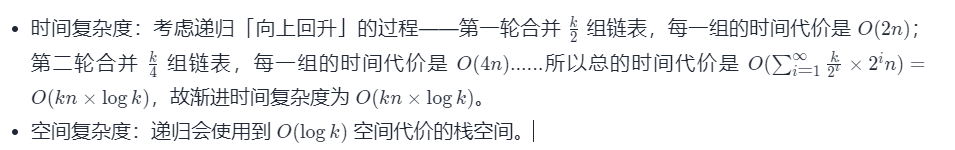
* https://leetcode-cn.com/problems/merge-k-sorted-lists/solution/he-bing-kge-pai-xu-lian-biao-by-leetcode-solutio-2/

```java
/**
 * Definition for singly-linked list.
 * public class ListNode {
 *     int val;
 *     ListNode next;
 *     ListNode() {}
 *     ListNode(int val) { this.val = val; }
 *     ListNode(int val, ListNode next) { this.val = val; this.next = next; }
 * }
 */
class Solution {
    // 将顺序合并优化：高度为k的合并深度 优化为logk的合并深度
    // 通过分治法【类似归并】：先找到最底层的单个链表，然后两两合并，再往上一层继续这个操作直至最顶层
    public ListNode mergeKLists(ListNode[] lists) {
        return merge(lists,0,lists.length-1);
    }

    private ListNode merge(ListNode[] lists,int l,int r){
        // base case 最深层
        if(l == r){
            return lists[l];
        }
        if(l > r){
            return null;
        }

        // 分组
        int middle = l + ((r-l)>>1);
        // 分组进行操作并合并
        return mergeTwoLists(merge(lists,l,middle),merge(lists,middle+1,r));
    }

    // 类似归并排序中的合并过程
    private ListNode mergeTwoLists(ListNode l1, ListNode l2) {
        if(l1 == null || l2 == null){
            return l1 == null ? l2:l1;
        }
        // 虚拟头结点 保留对链表头部的引用
        ListNode root = new ListNode();
        ListNode cur = root;
        while(l1 != null && l2 != null){
            if(l1.val > l2.val){
                // 直接指向原本结点，降低空间复杂度
                // cur.next = new ListNode(l2.val);
                cur.next = l2;
                l2 = l2.next; 
                cur = cur.next;
            }else{
                // cur.next = new ListNode(l1.val);
                cur.next = l1;
                l1 = l1.next;
                cur = cur.next;
            }
        }

        // 连接任一非空链表
        cur.next = l1==null?l2:l1;

        return root.next;
    }
}
```

* 小顶堆解法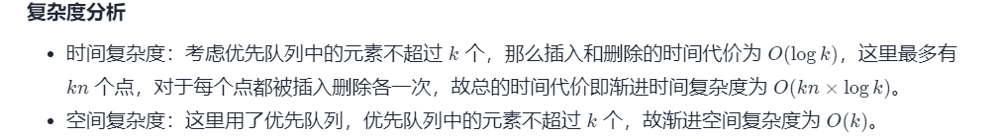

```java
/**
 * Definition for singly-linked list.
 * public class ListNode {
 *     int val;
 *     ListNode next;
 *     ListNode() {}
 *     ListNode(int val) { this.val = val; }
 *     ListNode(int val, ListNode next) { this.val = val; this.next = next; }
 * }
 */
class Solution {
    // 小顶堆解法：堆中维护这每个链表待取的首元素，堆首为下一个待取的元素,每次取堆首出来构建一个新结点且加入新结点进堆中即可
    class Status implements Comparable<Status>{
        int val;
        ListNode node;
        public Status(int val,ListNode node){
            this.val = val;
            this.node = node;
        }

        public int compareTo(Status status2){
            return this.val>status2.val ? 1 : (this.val == status2.val ? 0 : -1);
        }
    }

    public ListNode mergeKLists(ListNode[] lists) {
        // java优先级队列即小顶堆 
        PriorityQueue<Status> queue = new PriorityQueue<>();

        // 加入每个链表的待取元素
        for(ListNode node : lists){
            if(node!=null){
                queue.offer(new Status(node.val,node));
            }
        }
        
        // 虚拟头结点 便于取出真正头结点
        ListNode weakHead = new ListNode(0);
        ListNode cur = weakHead;
        while(!queue.isEmpty()){
            Status temp = queue.poll();
            cur.next = temp.node;
            cur = cur.next;
            // 加入下一结点
            if(temp.node.next != null) queue.offer(new Status(temp.node.next.val,temp.node.next));
        }

        return weakHead.next;
    }
}
```

* 第二次

  先将所有节点加入小顶堆中，然后再处理，注意避免死循环问题

  时间复杂度 O(nlogn) 类似堆排序

* ```java
  /**
   * Definition for singly-linked list.
   * public class ListNode {
   *     int val;
   *     ListNode next;
   *     ListNode() {}
   *     ListNode(int val) { this.val = val; }
   *     ListNode(int val, ListNode next) { this.val = val; this.next = next; }
   * }
   */
  class Solution { 
  
      public ListNode mergeKLists(ListNode[] lists) {
          // 小顶堆
          PriorityQueue<ListNode> queue = new PriorityQueue<>((a, b)->{
              return Integer.compare(a.val, b.val);
          });
  
          for(ListNode node : lists){
              while(node != null){
                  queue.offer(node);
                  node = node.next;
              }
          }
  
          ListNode dummyHead = new ListNode();
          ListNode tail = dummyHead;
          while(!queue.isEmpty()){
              // 取出时会将尾节点【最大的】置换到首节点，向下沉时如果堆中全是相等节点 这样排序完后的链表的尾节点将不是最大的，就会有循环问题。。【最后取出的节点不是某个单链表的尾节点】
              // 2->-1->-1->-1  构建的小顶堆    0 [-2]
              // 0   1   2   3              1[-1]  2[-1]
              //                          3[-1]
              //                    取出堆顶后
              //                             3[-1]  #最大节点先被取出
              //                           1[-1]  2[-1]
              // 排序完的链表【下标表示】: 0->3->2->1->2 【出现循环】
              tail.next = queue.poll();
              tail = tail.next;
          }
          // 避免循环问题，将尾节点置空
          tail.next = null;
  
          return dummyHead.next;
      }
  
  
  }
  ```

  法二：

  时间复杂度O(nlogk)，n为节点总数，k为链表个数

  ```java
  /**
   * Definition for singly-linked list.
   * public class ListNode {
   *     int val;
   *     ListNode next;
   *     ListNode() {}
   *     ListNode(int val) { this.val = val; }
   *     ListNode(int val, ListNode next) { this.val = val; this.next = next; }
   * }
   */
  class Solution {
      // 先将所有头节点加进去，头结点加进去后再加后续节点
      // 每次取出节点后再加入后续节点 这样最后一个取出的节点一定是某个单链表的尾节点 不会有死循环问题
      public ListNode mergeKLists(ListNode[] lists) {
          PriorityQueue<ListNode> queue = new PriorityQueue<>(
              (a, b)->{
                  return Integer.compare(a.val, b.val);
              }
          );
          
          for(ListNode head : lists){
              if(head != null){
                  queue.offer(head);
              }
          }
  
          ListNode dummyHead = new ListNode();
          ListNode tail = dummyHead;
          while(!queue.isEmpty()){
              ListNode head = queue.poll();
              tail.next = head;
              if(head.next != null){
                  queue.offer(head.next);
              }
              tail = tail.next;
          }
          return dummyHead.next;
      }
  
  
  }
  ```

  归并解法：时间复杂度O(N*KlogK)【k为链表个数，N为链表的平均节点个数，每层合格的代价是KN，一共logK层】
  
  ```java
  /**
   * Definition for singly-linked list.
   * public class ListNode {
   *     int val;
   *     ListNode next;
   *     ListNode() {}
   *     ListNode(int val) { this.val = val; }
   *     ListNode(int val, ListNode next) { this.val = val; this.next = next; }
   * }
   */
  class Solution {
      public ListNode mergeKLists(ListNode[] lists) {
          return merge(lists, 0, lists.length - 1);
      }
  
      // 合并[left,right]范围内的链表
      private ListNode merge(ListNode[] lists, int left, int right){
          if(left == right){
              return lists[left];
          }
  
          if(left > right){
              return null;
          }
          int middle = left + ((right - left) >>> 1);
          return mergeTwoLists(merge(lists, left, middle), merge(lists, middle+1, right));
      }
  
      private ListNode mergeTwoLists(ListNode head1, ListNode head2){
          if(head1 == null || head2 == null){
              return head1 == null ? head2 : head1;
          }
          ListNode dummyHead = new ListNode();
          ListNode tail = dummyHead;
          while(head1 != null && head2 != null){
              if(head1.val < head2.val){
                  tail.next = head1;
                  head1 = head1.next;
              }else{
                  tail.next = head2;
                  head2 = head2.next;
              }
              tail = tail.next;
          }
  
          if(head1 != null || head2 != null){
              tail.next = (head1 != null ? head1 : head2);
          }
  
          return dummyHead.next;
      }
  }
  ```
  
  

### [143. 重排链表](https://leetcode-cn.com/problems/reorder-list/)

* 找到链表中点【快慢指针】，对后半段链表反转【头插法】，合并链表

* ```java
  /**
   * Definition for singly-linked list.
   * public class ListNode {
   *     int val;
   *     ListNode next;
   *     ListNode() {}
   *     ListNode(int val) { this.val = val; }
   *     ListNode(int val, ListNode next) { this.val = val; this.next = next; }
   * }
   */
  class Solution {
      public void reorderList(ListNode head) {
          ListNode slow = head;
          ListNode fast = head;
  
          // 慢指针走到 中点 【偶数个数节点时走到前半链表的尾,奇数个数走到中点】  快指针走到后半链表的尾【偶数个时走到尾节点的前一个，奇数时走到尾节点】
          // 此方法保证左半链表长度不小于右半链表
          while(fast.next != null && fast.next.next != null){
              slow = slow.next;
              fast = fast.next.next;
          }
  
          // 头插法反转链表 提供待反转链表的头节点
          ListNode reverseHead = reverse(slow.next);
          slow.next = null;
  
          // 合并链表
          while(head != null && reverseHead != null){
              ListNode nextHead = head.next;
              ListNode nextReverseHead = reverseHead.next;
              head.next = reverseHead;
              reverseHead.next = nextHead;
              head = nextHead;
              reverseHead = nextReverseHead;
          }
  
          
      }
  
      private ListNode reverse(ListNode head){
          ListNode newHead = null;
          while(head != null){
              ListNode next = head.next;
              head.next = newHead;
              newHead = head;
              head = next;
          }
          return newHead;
      }
  }
  ```

* 


### **BM11** **链表相加(二)**

```c++
/**
 * Definition for singly-linked list.
 * struct ListNode {
 *     int val;
 *     ListNode *next;
 *     ListNode(int x) : val(x), next(NULL) {}
 * };
 */

class Solution {
public:
    /**
     * 
     * @param head1 ListNode类 
     * @param head2 ListNode类 
     * @return ListNode类
     */
    ListNode* addInList(ListNode* head1, ListNode* head2) {
        // write code here
        // 利用栈 从后往前获取节点 
        stack<ListNode*> left;
        stack<ListNode*> right;
        while(head1){
            left.push(head1);
            head1 = head1->next;
        }
        while(head2){
            right.push(head2);
            head2 = head2->next;
        }
        
        // 记录进位
        int subsum = 0;
        // 头插法进行新链表创建
        ListNode* pre = nullptr;
        while((!left.empty())||(!right.empty())){
            int sum = subsum;
            if(!left.empty()){
                sum += left.top()->val;
                left.pop();
            }
            if(!right.empty()){
                sum += right.top()->val;
                right.pop();
            }
            ListNode* cur = new ListNode(sum%10);
            cur->next = pre;
            pre = cur;
            subsum = sum / 10;
        }
        
        if(subsum != 0){
            ListNode* cur = new ListNode(subsum);
            cur->next = pre;
            pre = cur;
        }

        return pre;
    }
};
```


### **BM12** **单链表的排序**

* 1、使用优先队列排序，然后取出节点

  ```c++
  /**
   * struct ListNode {
   *	int val;
   *	struct ListNode *next;
   * };
   */
  
  class Solution {
  public:
      struct compare{
         bool operator()(const ListNode* l, const ListNode* r){
             return l->val > r->val;
         }
      };
      /**
       * 
       * @param head ListNode类 the head node
       * @return ListNode类
       */
      ListNode* sortInList(ListNode* head) {
          // write code here
          priority_queue<ListNode*, vector<ListNode*>, compare> pq;
          while(head){
              pq.push(head);
              head = head->next;
          }
          
          ListNode* dummyHead = new ListNode(-1);
          ListNode* tail = dummyHead;
          while(!pq.empty()){
              tail->next = pq.top();
              tail = tail->next;
              pq.pop();
          }
          
          // 避免重排链表循环
          tail->next = nullptr;
          return dummyHead->next;
      }
  };
  ```

* 利用找中点法划分出左右链表并进行归并排序

  ```c++
  /**
   * struct ListNode {
   *	int val;
   *	struct ListNode *next;
   * };
   */
  
  class Solution {
  public:
      /**
       * 
       * @param head ListNode类 the head node
       * @return ListNode类
       */
      ListNode* merge(ListNode* l, ListNode* r){
          ListNode* dummyHead = new ListNode(-1);
          ListNode* cur = dummyHead;
          
          while(l && r){
              if(l->val < r->val){
                  cur->next = l;
                  cur = cur->next;
                  l = l->next;
              }else{
                  cur->next = r;
                  cur = cur->next;
                  r = r->next;
              }
              
          }
          if(r != nullptr) l = r;
          cur->next = l;
          return dummyHead->next;
      }
      
      
      ListNode* sortInList(ListNode* head) {
          // write code here
          if(head->next == nullptr) return head;
          ListNode* mid = head;
          ListNode* right = head;
          while(right->next != nullptr && right->next->next != nullptr){
              mid = mid->next;
              right = right->next->next;
          }
          right = mid->next;
          mid->next = nullptr;
          return merge(sortInList(head),sortInList(right));
      }
  };
  ```


### **BM16** **删除有序链表中重复的元素-II**

```c++
    /**
     * 
     * @param head ListNode类 
     * @return ListNode类
     */
    ListNode* deleteDuplicates(ListNode* head) {
        // write code here
        if(head == nullptr) return nullptr;
        ListNode* dummyHead = new ListNode(head->val-1);
        // tail：已处理好的链表尾部，其后第一个节点为待检查是否重复的节点
        ListNode* tail = dummyHead;
        dummyHead->next = head;
        
        while(tail->next && tail->next->next){
            // 后面第一个节点
            ListNode* p = tail->next;
            // 后面第二个节点
            ListNode* pNext = p->next;
            
            if(p->val != pNext->val){
                // p不存在重复节点
                tail->next = p;
                tail = p;
            }else{
                //找到第一个与p不同的节点
                while(pNext && pNext->val == p->val){
                    pNext = pNext->next;
                }
                // 用于进行下次检查
                tail->next = pNext;
            }
        }
        return dummyHead->next;
        
    }
```


## 二叉树

* 二叉树算法问题，**简单说就是，先搞清楚当前 `root` 节点「该做什么」以及「什么时候做」，然后根据函数定义递归调用子节点**【前序、后序或中序】
* **如果当前节点要做的事情需要通过左右子树的计算结果推导出来，就要用到后序遍历**。


### 三大遍历

* 递归：前序遍历

  ```java
  import java.util.*;
  
  /*
   * public class TreeNode {
   *   int val = 0;
   *   TreeNode left = null;
   *   TreeNode right = null;
   *   public TreeNode(int val) {
   *     this.val = val;
   *   }
   * }
   */
  
  public class Solution {
      /**
       * 代码中的类名、方法名、参数名已经指定，请勿修改，直接返回方法规定的值即可
       *
       * 
       * @param root TreeNode类 
       * @return int整型一维数组
       */
      public int[] preorderTraversal (TreeNode root) {       
          // write code here
          List<Integer> result = new ArrayList<>();
          dfs(root, result);
          // 转为int数组 可用intStream
          return result.stream().mapToInt(value -> value).toArray();
      }
      
      private void dfs(TreeNode root, List<Integer> result){
          if(root == null) return;
          result.add(root.val);
          dfs(root.left, result);
          dfs(root.right, result);
      }
  }
  ```

* 中序遍历：

  ```java
  import java.util.*;
  
  /*
   * public class TreeNode {
   *   int val = 0;
   *   TreeNode left = null;
   *   TreeNode right = null;
   *   public TreeNode(int val) {
   *     this.val = val;
   *   }
   * }
   */
  
  public class Solution {
      /**
       * 代码中的类名、方法名、参数名已经指定，请勿修改，直接返回方法规定的值即可
       *
       * 
       * @param root TreeNode类 
       * @return int整型一维数组
       */
      public int[] inorderTraversal (TreeNode root) {
          // write code here
          List<Integer> result = new ArrayList<>();
          dfs(root, result);
          return result.stream().mapToInt(value -> value).toArray();
      }
      
      private void dfs(TreeNode root, List<Integer> result){
          if(root == null) return;
          dfs(root.left, result);
          result.add(root.val);
          dfs(root.right, result);
      }
  }
  ```

* 后序遍历

  ```java
  import java.util.*;
  
  /*
   * public class TreeNode {
   *   int val = 0;
   *   TreeNode left = null;
   *   TreeNode right = null;
   *   public TreeNode(int val) {
   *     this.val = val;
   *   }
   * }
   */
  
  public class Solution {
      /**
       * 代码中的类名、方法名、参数名已经指定，请勿修改，直接返回方法规定的值即可
       *
       * 
       * @param root TreeNode类 
       * @return int整型一维数组
       */
      public int[] postorderTraversal (TreeNode root) {
          // write code here
          List<Integer> result = new ArrayList<>();
          dfs(root, result);
          return result.stream().mapToInt(val -> val).toArray();
      }
      
      private void dfs(TreeNode root, List<Integer> result){
          if(root == null) return;
          dfs(root.left, result);
          dfs(root.right, result);
          result.add(root.val);
      }
  }
  ```

  

* 递归的实质是栈调用，我们可以通过栈【先入后出】来模拟实现递归https://www.cnblogs.com/greyzeng/p/15941957.html

  * 前序遍历：

    第一步，申请一个栈，并把头节点压入。

    第二步，弹出就收集答案。

    第三步，第二步中弹出的节点，如果右孩子不为空，则右孩子入栈。

    第四步，第二步中弹出的节点，如果左孩子不为空，则左孩子入栈。

    第五步，循环执行第二步到第四步，直到栈为空。

    ```java
    import java.util.*;
    
    /*
     * public class TreeNode {
     *   int val = 0;
     *   TreeNode left = null;
     *   TreeNode right = null;
     *   public TreeNode(int val) {
     *     this.val = val;
     *   }
     * }
     */
    
    public class Solution {
        /**
         * 代码中的类名、方法名、参数名已经指定，请勿修改，直接返回方法规定的值即可
         *
         * 
         * @param root TreeNode类 
         * @return int整型一维数组
         */
        public int[] preorderTraversal (TreeNode root) {
            if(root == null) return new int[0];
            // write code here
            Stack<TreeNode> stack = new Stack<>();
            stack.push(root);
            List<Integer> result = new ArrayList<>();
            while(!stack.isEmpty()){
                TreeNode node = stack.pop();
                result.add(node.val);
                if(node.right != null){
                    stack.push(node.right);
                }
                if(node.left != null){
                    stack.push(node.left);
                }
            }
            
            return result.stream().mapToInt(val -> val).toArray();
        }
    }
    ```

  * 中序遍历：

    第一步，整条左边界入栈。

    第二步，弹出就收集答案。

    第三步，来到右树上执行同第一步的操作。

    第四步，直到栈为空。

    ```java
    import java.util.*;
    
    /*
     * public class TreeNode {
     *   int val = 0;
     *   TreeNode left = null;
     *   TreeNode right = null;
     *   public TreeNode(int val) {
     *     this.val = val;
     *   }
     * }
     */
    
    public class Solution {
        /**
         * 代码中的类名、方法名、参数名已经指定，请勿修改，直接返回方法规定的值即可
         *
         * 
         * @param root TreeNode类 
         * @return int整型一维数组
         */
        public int[] inorderTraversal (TreeNode root) {
            if(root == null) return new int[0];
            // write code here
            Stack<TreeNode> stack  = new Stack<>();
            List<Integer> result = new ArrayList<>();
            while(!stack.isEmpty() || root != null){
                if(root != null){
                    stack.push(root);
                    root = root.left;
                }else{
                    root = stack.pop();
                    result.add(root.val);
                    root = root.right;
                }
            }
            
            return result.stream().mapToInt(val -> val).toArray();
        }
    }
    ```

  * 后序遍历：改动先序遍历为右左根，然后将遍历结果逆序即可。

    ```java
    import java.util.*;
    
    /*
     * public class TreeNode {
     *   int val = 0;
     *   TreeNode left = null;
     *   TreeNode right = null;
     *   public TreeNode(int val) {
     *     this.val = val;
     *   }
     * }
     */
    
    public class Solution {
        /**
         * 代码中的类名、方法名、参数名已经指定，请勿修改，直接返回方法规定的值即可
         *
         * 
         * @param root TreeNode类 
         * @return int整型一维数组
         */
        public int[] postorderTraversal (TreeNode root) {
           if(root == null) return new int[0];
            // write code here
            Stack<TreeNode> stack  = new Stack<>();
            stack.push(root);
            List<Integer> result = new ArrayList<>();
            // 辅助栈存储改动版先序遍历结果
            Stack<TreeNode> helper = new Stack<>();
            while(!stack.isEmpty()){
                TreeNode cur = stack.pop();
                helper.push(cur);
                if(cur.left != null){
                    stack.push(cur.left);
                }
                if(cur.right != null){
                    stack.push(cur.right);
                }
            }
            
            // 将改动版先序遍历结果逆序加入结果集即后序遍历结果
            while(!helper.isEmpty()){
                result.add(helper.pop().val);
            }
            return result.stream().mapToInt(val -> val).toArray();
        }
    }
    ```

    


### [662. 二叉树最大宽度](https://leetcode-cn.com/problems/maximum-width-of-binary-tree/)

```java
   //创建一个类封装树节点和节点所在位置
    class ConsumeTreeNode{
        TreeNode node;
        int position;
        public ConsumeTreeNode(TreeNode node,int position){
            this.node = node;
            this.position =position;
        }
    }
	//层次遍历 获取最大宽度
    public int widthOfBinaryTree(TreeNode root) {
    Queue<ConsumeTreeNode> queue = new LinkedList<>();
        int max = Integer.MIN_VALUE;
        queue.add(new ConsumeTreeNode(root,1));
        while(!queue.isEmpty()){
            //list用于装填当前层节点的位置
            List<Integer> list = new ArrayList<>();
            //对当前层节点进行遍历
            for(int i =queue.size();i>0;i--){
                ConsumeTreeNode a = queue.poll();
                TreeNode treeNode = a.node;
                int position = a.position;
                //添加当前层节点的位置
                list.add(position);
                //将当前层节点的孩子添加进队列 
                if(treeNode.left!=null){
                    queue.add(new ConsumeTreeNode(treeNode.left,2*position));
                }
                if(treeNode.right!=null){
                    queue.add(new ConsumeTreeNode(treeNode.right,2*position+1));
                }
            }
            //当前层尾节点位置减去首节点位置即当前层宽度
            max = Math.max(max,list.get(list.size()-1)-list.get(0)+1);
        }
        return max;
    }
```

### [104. 二叉树的最大深度](https://leetcode-cn.com/problems/maximum-depth-of-binary-tree/)

* 法一：递归求解

```java
 //递归求最大深度 一个树的深度==左子树深度和右子树中的最大值+1  树为空时深度为0
    public int maxDepth(TreeNode root) {
        return root==null?0:Math.max(maxDepth(root.left),maxDepth(root.right))+1;
    }   

```

* 法二：层次遍历过程中求解

```java
    //  层次遍历方式求最大深度
    public int maxDepth(TreeNode root) {
        if (root == null) return 0;
        int depth = 0;
        Queue<TreeNode> queue = new LinkedList<>();
        queue.add(root);
        while (!queue.isEmpty()) {
            int length = queue.size();
            for (int i = 0; i < length; i++) {
                TreeNode node = queue.poll();
                if (node.left != null) queue.add(node.left);
                if (node.right != null) queue.add(node.right);
            }
            depth++;
        }
        return depth;
    }
```

### [110. 平衡二叉树](https://leetcode-cn.com/problems/balanced-binary-tree/)

* 法一：更具封装条件信息解决

* 树型dp问题（问题的解可有子树的某些信息得出）

  ```java
  //封装 判断一个树是否为平衡二叉树所需要的左右子树的信息
      public static class ReturnType{
          boolean isBalanced;
          int height;
          public ReturnType(boolean isBalanced,int height){
              this.isBalanced = isBalanced;
              this.height = height;
          }
      }
      public boolean isBalanced(TreeNode root) {
          if(root == null) return true;//base case
         return process(root).isBalanced;
      }
      public ReturnType process(TreeNode root){
          //最里层递归情况 
          if(root == null) return new ReturnType(true,0);
          //获取左右子树的结果信息
          ReturnType leftData = process(root.left);
          ReturnType rightData = process(root.right);
          //构建该树的结果信息
          return new ReturnType(leftData.isBalanced&&rightData.isBalanced&&(Math.abs(leftData.height-rightData.height)<2),Math.max(leftData.height,rightData.height)+1);
      }
  ```

  

* 法二：递归求树的高度【非平衡树返回-1，避免多余的判断】解决

* ```java
      public boolean isBalanced(TreeNode root) {
         return process(root) !=-1;
      }
      //递归求树的高度 高度为-1表示此树非平衡二叉树
      public int process(TreeNode root){
          //最里层递归情况
          if(root == null) return 0;
          //分别求左右子树的高度
          int left = process(root.left);
          int right = process(root.right);
          //左右子树有一个非平衡 该树非平衡
          if(left == -1 || right == -1) return -1;
          //根据左右子树的高度差判断该树是否平衡
          if(Math.abs(left-right)<2){
              return Math.max(left,right)+1;
          }else{
              return -1;
          }
      }
  ```


### [116. 填充每个节点的下一个右侧节点指针](https://leetcode-cn.com/problems/populating-next-right-pointers-in-each-node/)

```java
/*
// Definition for a Node.
class Node {
    public int val;
    public Node left;
    public Node right;
    public Node next;

    public Node() {}
    
    public Node(int _val) {
        val = _val;
    }

    public Node(int _val, Node _left, Node _right, Node _next) {
        val = _val;
        left = _left;
        right = _right;
        next = _next;
    }
};
*/

class Solution {
    // 定义：将root为根的树中每一层节点连接起来 因为参数只有一个节点 无法连接非兄弟节点 所以构建辅助函数
    public Node connect(Node root) {
        // base case
        if(root == null) return null;
        connectTwoNode(root.left,root.right);
        return root;
    }
    
    // 定义：将a、b层以及往下的每层节点相连
    public void connectTwoNode(Node a, Node b){
        // base case
        if(a == null || b == null) return ;
        
        // 连接节点 前序遍历
        a.next = b;

        // 连接兄弟节点
        connectTwoNode(a.left,a.right);
        connectTwoNode(b.left,b.right);

        // 连接非兄弟节点
        connectTwoNode(a.right,b.left);
    }
}
```

### [114. 二叉树展开为链表](https://leetcode-cn.com/problems/flatten-binary-tree-to-linked-list/)

```java
class Solution {
    // 定义：将root为根节点的树展开为单链表
    public void flatten(TreeNode root) {
        // base case
        if(root == null) return ;

        // 先把左右子树展开 才能操作 所以是后序遍历
        flatten(root.left);
        flatten(root.right);

        // 将左右子树单链表和根节点 根据规则 连接为单链表
    
        TreeNode right = root.right;
        root.right = root.left;
        root.left = null;

        // 走到原左子树对应链表的尾节点
        while(root.right!=null){
            root = root.right;
        }

        // 将原右子树连接为原左子树的右孩子
        root.right = right;
    }
}
```

### [654. 最大二叉树](https://leetcode-cn.com/problems/maximum-binary-tree/)

```java
/**
 * Definition for a binary tree node.
 * public class TreeNode {
 *     int val;
 *     TreeNode left;
 *     TreeNode right;
 *     TreeNode() {}
 *     TreeNode(int val) { this.val = val; }
 *     TreeNode(int val, TreeNode left, TreeNode right) {
 *         this.val = val;
 *         this.left = left;
 *         this.right = right;
 *     }
 * }
 */
class Solution {
    // 定义 根据数组构造最大二叉树 返回头结点 构造子树时只需要数组的一部分 所以可以创建一个辅助函数
    public TreeNode constructMaximumBinaryTree(int[] nums) {
        if(nums == null || nums.length == 0) return null;

        return constructMaxBinaryTreeWithRange(nums,0,nums.length-1);
    }

    // 定义：根据nums 【start，end】范围构造一个最大二叉树 返回头结点 因为需要左右子树对应的二叉树才能构造完整的最大二叉树 所以为后序遍历
    public TreeNode constructMaxBinaryTreeWithRange(int[] nums, int start, int end){
        // base case  右区间时可能出现此越界情况 此时 maxIndex == end
        if(start > end) return null;
        // 先找出最大值 和 其索引
        int max = Integer.MIN_VALUE;
        int maxIndex = -1;

        for(int i = start;i<=end;i++){
            if(max<nums[i]){
                max = nums[i];
                maxIndex = i;
            }
        }

        TreeNode root = new TreeNode(max);
        // 得到左右子树对应的最大二叉树
        TreeNode left = constructMaxBinaryTreeWithRange(nums,start,maxIndex-1);
        TreeNode right = constructMaxBinaryTreeWithRange(nums,maxIndex+1,end);

        // 对于每个根节点，只需要找到当前 nums 中的最大值和对应的索引，然后递归调用左右数组构造左右子树即可。
        root.left = left;
        root.right = right;

        return root;
    }
}
```


### [105. 从前序与中序遍历序列构造二叉树](https://leetcode-cn.com/problems/construct-binary-tree-from-preorder-and-inorder-traversal/)

* 前序和中序可以唯一确定一颗二叉树。

  后序和中序可以唯一确定一颗二叉树。

  那么前序和后序可不可以唯一确定一颗二叉树呢？

  **前序和后序不能唯一确定一颗二叉树！**，因为没有中序遍历无法确定左右部分，也就是无法分割。

```java
/**
 * Definition for a binary tree node.
 * public class TreeNode {
 *     int val;
 *     TreeNode left;
 *     TreeNode right;
 *     TreeNode() {}
 *     TreeNode(int val) { this.val = val; }
 *     TreeNode(int val, TreeNode left, TreeNode right) {
 *         this.val = val;
 *         this.left = left;
 *         this.right = right;
 *     }
 * }
 */

 // 前序遍历得出 根节点值
 // 根据根节点值得出 根节点在中序遍历中的位置
 // 根据该位置划分出左右子树 分别构造左右子树
class Solution {
    // 使用哈希表来帮助我们快速地定位根节点在中序遍历中的位置 key为元素值 value为中序遍历中的位置
    private Map<Integer,Integer> indexMap = new HashMap<>();

    // 定义：根据树的前序和中序遍历数组构造出二叉树并返回 根节点
    public TreeNode buildTree(int[] preorder, int[] inorder) {
        for(int i = 0; i < inorder.length;i++){
            indexMap.put(inorder[i],i);
        }
        return buildTreeByPreAndIn(preorder,0,preorder.length-1,inorder,0,inorder.length-1);
    }

    // 定义：根据前序和中序遍历数组的一部分构造二叉树并返回根节点
    public TreeNode buildTreeByPreAndIn(int[] preorder,int preStart,int preEnd,int[] inorder,int inStart,int inEnd){

        // base case 越界时 即范围内无对应的树
        if(preStart > preEnd){
            return null;
        }
        int rootValue = preorder[preStart];
        TreeNode root = new TreeNode(rootValue);
        // // base case 所给数组只有一个值时 表示只有一个节点无左右子树，直接构造返回
        // if(preStart == preEnd){
        //     return root;
        // }
        // 记录当前树根节点所在后序遍历数组中的位置
        int rootIndex = -1;

        // 每次都要遍历时间复杂度较高
        // for(int i = inStart;i<=inEnd;i++){
        //     if(inorder[i]==rootValue){
        //         rootIndex = i;
        //         break;
        //     }
        // }

        // 从哈希表中获取根节点在中序遍历中的位置
        rootIndex = indexMap.get(rootValue);
        
        // 当前待构造的树的左子树节点个数
        int leftNum = rootIndex - inStart;

        // 构造左子树
        root.left = buildTreeByPreAndIn(preorder,preStart+1,preStart+leftNum,inorder,inStart,rootIndex-1);
        root.right = buildTreeByPreAndIn(preorder,preStart+leftNum+1,preEnd,inorder,rootIndex+1,inEnd);

        return root;
    }
}
```

* 第二次

* ```java
  /**
   * Definition for a binary tree node.
   * public class TreeNode {
   *     int val;
   *     TreeNode left;
   *     TreeNode right;
   *     TreeNode() {}
   *     TreeNode(int val) { this.val = val; }
   *     TreeNode(int val, TreeNode left, TreeNode right) {
   *         this.val = val;
   *         this.left = left;
   *         this.right = right;
   *     }
   * }
   */
  class Solution {
      public TreeNode buildTree(int[] preorder, int[] inorder) {
          return buildTreeByPreAndIn(preorder, 0, preorder.length - 1, inorder, 0, inorder.length - 1);
      }
  
      // 根据前序遍历序列和中序遍历序列构造二叉树
      private TreeNode buildTreeByPreAndIn(int[] preorder, int pre1, int pre2, int[] inorder, int in1, int in2){
          // base case
          if(pre1 > pre2) return null;
          if(pre1 == pre2){
              return new TreeNode(preorder[pre1]);
          }
  
          int rootVal = preorder[pre1];
          TreeNode root = new TreeNode(rootVal);
  
          // 每次都要遍历，考虑使用哈希表降低时间复杂度
          int index = in1;
          while(inorder[index] != rootVal){
              index++;
          }
          int leftPre1 = pre1 + 1;
          int leftPre2 = pre1 + index - in1;
          int leftIn1 = in1;
          int leftIn2 = index - 1;
          root.left = buildTreeByPreAndIn(preorder, leftPre1, leftPre2, inorder, leftIn1, leftIn2);
  
          int rightPre1 = leftPre2 + 1;
          int rightPre2 = pre2;
          int rightIn1 = index + 1;
          int rightIn2 = in2;
          root.right = buildTreeByPreAndIn(preorder, rightPre1, rightPre2, inorder, rightIn1, rightIn2);
  
          return root;/**
   * Definition for binary tree
   * struct TreeNode {
   *     int val;
   *     TreeNode *left;
   *     TreeNode *right;
   *     TreeNode(int x) : val(x), left(NULL), right(NULL) {}
   * };
   */
  class Solution {
  public:
      unordered_map<int, int> indexs; // 记录节点对应的在中序序列的位置
      TreeNode* helper(vector<int> pre,vector<int> vin, int preS, int preE, int inS, int inE){
          if(preS > preE){
              return nullptr;
          }
          int rootVal = pre[preS];
          int rootIndex = indexs[rootVal];
          // 得出左子树和右子树在序列中的位置
          int preLeftS = preS + 1;
          int preLeftE = rootIndex - inS + preS;
          int preRightS = preLeftE + 1;
          int preRightE = preE;
          int inLeftS = inS;
          int inLeftE = rootIndex - 1;
          int inRightS = rootIndex + 1;
          int inRightE = inE;
          
          TreeNode* root = new TreeNode(rootVal);
          // 构建左右子树
          root->left = helper(pre, vin, preLeftS, preLeftE, inLeftS, inLeftE);
          root->right = helper(pre, vin, preRightS, preRightE, inRightS, inRightE);
          return root;
      }
      TreeNode* reConstructBinaryTree(vector<int> pre,vector<int> vin) {
          for(int i = 0; i < vin.size(); i++){
              indexs[vin[i]] = i;
          }
          return helper(pre, vin, 0, pre.size() - 1, 0, vin.size() - 1);
      }
  };
      }
  }
  ```
  
* 


### [106. 从中序与后序遍历序列构造二叉树](https://leetcode-cn.com/problems/construct-binary-tree-from-inorder-and-postorder-traversal/)

```java
/**
 * Definition for a binary tree node.
 * public class TreeNode {
 *     int val;
 *     TreeNode left;
 *     TreeNode right;
 *     TreeNode() {}
 *     TreeNode(int val) { this.val = val; }
 *     TreeNode(int val, TreeNode left, TreeNode right) {
 *         this.val = val;
 *         this.left = left;
 *         this.right = right;
 *     }
 * }
 */

 // 跟前一题类似 只是前序变为后序而已 只需更改相应范围和取根节点值的位置
 // 做二叉树的问题，关键是把题目的要求细化，搞清楚根节点应该做什么，然后剩下的事情抛给前/中/后序的遍历框架就行了。
class Solution {
    // key 为 元素值 value 为 中序遍历的位置
    private Map<Integer,Integer> nodeIndex = new HashMap<>();

    public TreeNode buildTree(int[] inorder, int[] postorder) {
        for(int i = 0; i < inorder.length;i++){
            nodeIndex.put(inorder[i],i);
        }
        
        return buildTreeByAndInAndPost(inorder,0,inorder.length-1,postorder,0,postorder.length-1);
    }

    public TreeNode buildTreeByAndInAndPost(int[] inorder,int inStart,int inEnd,int[] postorder,int postStart,int postEnd){
        // base case
        if(inStart > inEnd){
            return null;
        }

        int rootValue = postorder[postEnd];

        TreeNode root = new TreeNode(rootValue);

        int rootIndex = -1;
        rootIndex = nodeIndex.get(rootValue);
        
        // 当前树的左子树节点个数
        int leftNum = rootIndex - inStart;

        // 构造左右子树
        root.left = buildTreeByAndInAndPost(inorder,inStart,rootIndex-1,postorder,postStart,postStart+leftNum-1);
        root.right = buildTreeByAndInAndPost(inorder,rootIndex+1,inEnd,postorder,postStart+leftNum,postEnd-1);

        return root;
    }
}
```

* 第二次做：

  ```java
  /**
   * Definition for a binary tree node.
   * public class TreeNode {
   *     int val;
   *     TreeNode left;
   *     TreeNode right;
   *     TreeNode() {}
   *     TreeNode(int val) { this.val = val; }
   *     TreeNode(int val, TreeNode left, TreeNode right) {
   *         this.val = val;
   *         this.left = left;
   *         this.right = right;
   *     }
   * }
   */
  class Solution {
      public TreeNode buildTree(int[] inorder, int[] postorder) {
          return buildTreeByInAndPost(inorder, 0, inorder.length - 1, postorder, 0, postorder.length - 1);
      }
  
      private TreeNode buildTreeByInAndPost(int[] inorder, int in1, int in2, int[] postorder, int post1, int post2){
          if(in1 > in2) return null;
          if(in1 == in2){
              return new TreeNode(inorder[in1]);
          }else{
              int rootVal = postorder[post2];
              int index = in1;
              while(inorder[index] != rootVal){
                  index++;
              }
              TreeNode root = new TreeNode(rootVal);
              int leftIn1 = in1;
              int leftIn2 = index - 1;
              int leftPost1 = post1;
              int leftPost2 = post1 + index - in1 - 1;
              root.left = buildTreeByInAndPost(inorder, leftIn1, leftIn2, postorder, leftPost1, leftPost2);
  
              int rightIn1 = index + 1;
              int rightIn2 = in2;
              int rightPost1 = leftPost2 + 1;
              int rightPost2 = post2 - 1;
              root.right = buildTreeByInAndPost(inorder, rightIn1, rightIn2, postorder, rightPost1, rightPost2);
              return root;
          }
  
      }
  }
  ```

  


### [652. 寻找重复的子树](https://leetcode-cn.com/problems/find-duplicate-subtrees/)

```java
/**
 * Definition for a binary tree node.
 * public class TreeNode {
 *     int val;
 *     TreeNode left;
 *     TreeNode right;
 *     TreeNode() {}
 *     TreeNode(int val) { this.val = val; }
 *     TreeNode(int val, TreeNode left, TreeNode right) {
 *         this.val = val;
 *         this.left = left;
 *         this.right = right;
 *     }
 * }
 */
class Solution {
    // map存储字符串对应的树的个数
    private Map<String,Integer> treesMap = new HashMap<>();

    // 记录重复的子树
    private List<TreeNode> duplicateSubtreesList = new ArrayList<>(); 

    // 定义：找出以root为根的树中所有重复的子树 并返回重复的子树
    public List<TreeNode> findDuplicateSubtrees(TreeNode root) {
       findDuplicateSubtreesBySerialize(root);
       return duplicateSubtreesList;
    }

     // 找出树的唯一表示方式 ： 序列化为字符串且为后序遍历 中序遍历不能保证唯一性 必须加逗号 否则不能保证唯一性
     // 对于当前节点 需要知道：1、以我为根的这棵二叉树（子树）长啥样？ 2、以其他节点为根的子树都长啥样？
     // 对于1 需要用到后序遍历才能知道以我为根的二叉树的结构  2则需要使用相关容器在递归过程中记录
    public String findDuplicateSubtreesBySerialize(TreeNode root){
        if(root == null){
            return "#";
        }

        StringBuilder sb = new StringBuilder();

        // 递归获取左右子树序列化的结果
        sb.append(findDuplicateSubtreesBySerialize(root.left)).append(",");
        sb.append(findDuplicateSubtreesBySerialize(root.right)).append(",");
        sb.append(root.val);

        String treeResult = sb.toString();

        // 如果键不存在则返回defaulValue这里为0 否则返回键对应的值
        int value = treesMap.getOrDefault(treeResult,0);

        if(value == 1){
            // value即原来已有值 所以重复了 加入结果集
            duplicateSubtreesList.add(root);
        }

        // 记录出现的次数
        treesMap.put(treeResult,value+1);

        return treeResult;
    }
}
```

### [208. 实现 Trie (前缀树)](https://leetcode-cn.com/problems/implement-trie-prefix-tree/)

* 感觉前缀树有点类似dfs

```java
// 前缀树【字典树】 树的形式存储字符串，节点代表某个字符 深度代表长度
// 存储的字符串具有唯一性
class Trie {
    // 创建根节点
    TrieNode root = new TrieNode();

    /** Initialize your data structure here. */
    public Trie() {

    }
    
    /** Inserts a word into the trie. */
    public void insert(String word) {
        TrieNode cur = root;
        for(char c : word.toCharArray()){
            // 判断是否存在该字符的子节点 不存在则创建
            if(cur.child[c-'a'] == null){
               cur.child[c-'a'] = new TrieNode();
               // 到下一字符节点
               cur = cur.child[c-'a'];
            }else{
                cur = cur.child[c-'a'];
            }
        }
        // 字符串最后一个字符节点
        cur.val = word;
        cur.isEnd = true;
    }
    
    /** Returns if the word is in the trie. */
    public boolean search(String word) {
        TrieNode cur = root;
        for(char c : word.toCharArray()){
            if(cur.child[c-'a']==null){
                return false;
            }else{
                cur = cur.child[c-'a'];
            }
        }

        // 判断最后一个字符节点是否为叶子节点 即可
        if(cur.isEnd) return true;
        return false;
    }
    
    /** Returns if there is any word in the trie that starts with the given prefix. */
    public boolean startsWith(String prefix) {
        TrieNode cur = root;
        for(char c : prefix.toCharArray()){
            if(cur.child[c-'a']==null){
                return false;
            }else{
                cur = cur.child[c-'a'];
            }
        }
        return true;
    }

    static class TrieNode{
        // 叶子节点所存储的字符串值
        String val;

        // 子字符节点 根据字符排序 
        TrieNode[] child = new TrieNode[26];

        // 是否为叶子节点
        boolean isEnd = false;
    }
}

/**
 * Your Trie object will be instantiated and called as such:
 * Trie obj = new Trie();
 * obj.insert(word);
 * boolean param_2 = obj.search(word);
 * boolean param_3 = obj.startsWith(prefix);
 */
```

### [297. 二叉树的序列化与反序列化](https://leetcode-cn.com/problems/serialize-and-deserialize-binary-tree/)

* 前序遍历

```java
/**
 * Definition for a binary tree node.
 * public class TreeNode {
 *     int val;
 *     TreeNode left;
 *     TreeNode right;
 *     TreeNode(int x) { val = x; }
 * }
 */

 // 所谓的序列化不过就是把结构化的数据「打平」，其实就是在考察二叉树的遍历方式。
public class Codec {
    private static String SEP = ",";
    private static String NULL = "#"; 

    // Encodes a tree to a single string.
    public String serialize(TreeNode root) {
        StringBuilder sb = new StringBuilder();
        serialize(root,sb);
        return sb.toString();
    }

    private void serialize(TreeNode root, StringBuilder sb){
        // base case 
        if(root == null){
            sb.append(NULL).append(SEP);
            return;
        }

        // 前序遍历位置
        sb.append(root.val).append(SEP);

        serialize(root.left,sb);
        serialize(root.right,sb);
    }

    // 一般语境下，单单前序遍历结果是不能还原二叉树结构的，因为缺少空指针的信息，至少要得到前、中、后序遍历中的两种才能还原二叉树。但是这里的 node 列表包含空指针的信息，所以只使用 node 列表就可以还原二叉树。
    // Decodes your encoded data to tree.
    public TreeNode deserialize(String data) {
        String[] dataArray = data.split(SEP);
        LinkedList<String> nodes = new LinkedList<>(Arrays.asList(dataArray));
        return deserialize(nodes);
    }
    
    // nodes即表示某个子树序列 
    // 反序列化过程也是一样，先确定根节点 root，然后遵循前序遍历的规则，递归生成左右子树即可：
    private TreeNode deserialize(LinkedList<String> nodes){
        if(nodes.isEmpty()) return null;

        // 链表首节点 即根节点
        String val = nodes.removeFirst();

        // 根节点为空则直接返回 null
        if(val.equals(NULL)) return null;
        
        // 构建根节点
        TreeNode root = new TreeNode(Integer.valueOf(val));

        // 构建左右子树
        root.left = deserialize(nodes);
        root.right = deserialize(nodes);

        return root;
    }
}

// Your Codec object will be instantiated and called as such:
// Codec ser = new Codec();
// Codec deser = new Codec();
// TreeNode ans = deser.deserialize(ser.serialize(root));
```

* 中序遍历时，反序列化无法确定根节点的位置，故反序列化不能成功
* 后序遍历

```java
/**
 * Definition for a binary tree node.
 * public class TreeNode {
 *     int val;
 *     TreeNode left;
 *     TreeNode right;
 *     TreeNode(int x) { val = x; }
 * }
 */
public class Codec {
    private static String SEP = ",";
    private static String NULL = "#"; 

    // Encodes a tree to a single string.
    // 后序遍历
    public String serialize(TreeNode root) {
        StringBuilder sb = new StringBuilder();
        serialize(root,sb);
        return sb.toString();
    }

    private void serialize(TreeNode root, StringBuilder sb){
        // base case
        if(root == null){
            sb.append(NULL).append(SEP);
            return;
        }

        serialize(root.left,sb);
        serialize(root.right,sb);
        // 后序遍历位置
        sb.append(root.val).append(SEP);
    }

    // Decodes your encoded data to tree.
    public TreeNode deserialize(String data) {
        String[] dataArray = data.split(SEP);
        LinkedList<String> nodes = new LinkedList<>(Arrays.asList(dataArray));
        return deserialize(nodes);
    }

    // 先确定根节点root，再根据遍历规则递归生产左右子树即可
    private TreeNode deserialize(LinkedList<String> nodes){
        if(nodes.isEmpty()){
            return null;
        }
        // 获取根节点的值
        String val = nodes.removeLast();
        if(val.equals(NULL)) return null;

        // 首先寻找 root 节点的值，然后递归计算左右子节点
        TreeNode root = new TreeNode(Integer.valueOf(val));

        // root 的值是列表的最后一个元素。我们应该从后往前取出列表元素，先用最后一个元素构造 root，然后递归调用生成 root 的左右子树。   从后往前在 nodes 列表中取元素，一定要先构造 root.right 子树，后构造 root.left 子树。
        root.right = deserialize(nodes);
        root.left = deserialize(nodes);

        return root;
    }
}

// Your Codec object will be instantiated and called as such:
// Codec ser = new Codec();
// Codec deser = new Codec();
// TreeNode ans = deser.deserialize(ser.serialize(root));
```

* 层次遍历【较难理解】

  ```java
  /**
   * Definition for a binary tree node.
   * public class TreeNode {
   *     int val;
   *     TreeNode left;
   *     TreeNode right;
   *     TreeNode(int x) { val = x; }
   * }
   */
  public class Codec {
      private static String SEP = ",";
      private static String NULL = "#";
  
      // Encodes a tree to a single string.
      public String serialize(TreeNode root) {
          if(root == null) return "";
          // 利用队列实现层次遍历 每次遍历队列中装填的都是某一层节点
          StringBuilder sb = new StringBuilder();
          Queue<TreeNode> q = new LinkedList<>();
          q.offer(root);
  
          while(!q.isEmpty()){
              TreeNode cur = q.poll();
  
              if(cur == null){
                  sb.append(NULL).append(SEP);
                  // 空节点无需添加其左右子树 确保空节点不能再延申
                  continue;
              }
  
              sb.append(cur.val).append(SEP);
  
              q.offer(cur.left);
              q.offer(cur.right);
          }
  
          return sb.toString();
      }
  
      // Decodes your encoded data to tree.
      public TreeNode deserialize(String data) {
          if(data.isEmpty()) return null;
          // 利用层次遍历结果、队列进行反序列化
          String[] dataArray = data.split(SEP);
  
          // 队列 存储的都是父节点
          Queue<TreeNode> q = new LinkedList<>();
          TreeNode root = new TreeNode(Integer.parseInt(dataArray[0]));
          q.offer(root);
  
          for(int i = 1; i<dataArray.length;){
              // 每次遍历 i都表示是 某个父节点对应的左右孩子
              // 取出父节点
              TreeNode cur = q.poll();
  
              // 左孩子节点值
              String left = dataArray[i++];
  
              if(!left.equals(NULL)){
                  TreeNode leftNode = new TreeNode(Integer.parseInt(left));
                  cur.left = leftNode;
                  // 加入队列 便于后面作为父节点
                  q.offer(leftNode);
              }else{
                  // 空节点将不会加入队列 因为层次遍历序列 空节点不会再往下延申了 这里也就不用加入队列
                  cur.left = null;
              }
  
              // 右孩子节点值
              String right = dataArray[i++];
  
              if(!right.equals(NULL)){
                  TreeNode rightNode = new TreeNode(Integer.parseInt(right));
                  cur.right = rightNode;
                  // 加入队列 便于后面作为父节点
                  q.offer(rightNode);
              }else{
                  cur.right = null;
              }
          }
  
          return root;
      }
  }
  
  // Your Codec object will be instantiated and called as such:
  // Codec ser = new Codec();
  // Codec deser = new Codec();
  // TreeNode ans = deser.deserialize(ser.serialize(root));
  ```

* 层次遍历方式，如何序列化就如何反序列化，反序列化时按照层次遍历方式并按顺序取节点构造即可

  ```c++
  /*
  struct TreeNode {
      int val;
      struct TreeNode *left;
      struct TreeNode *right;
      TreeNode(int x) :
              val(x), left(NULL), right(NULL) {
      }
  };
  */
  class Solution {
  public:
      char* Serialize(TreeNode *root) {    
          queue<TreeNode*> queue;
          queue.push(root);
          string str;
          while(!queue.empty()){
              int size = queue.size();
              for(int i = 0; i < size; i++){
                  TreeNode* node = queue.front();
                  queue.pop();
                  if(node){
                      str += to_string(node->val) + " ";
                      queue.push(node->left);
                      queue.push(node->right);
                  }else{
                      str += "# ";
                  }
              }
          }
          char* res = new char[str.length() + 1];
          strcpy(res, str.c_str());
          res[str.length()] = '\0';
          return res;
      }
      TreeNode* Deserialize(char *str) {
          string cur(str);
          if(cur[0] == '#'){
              return NULL;
          }
          
          // 以空格分割读取节点
          istringstream input(str);
          string temp;
          input >> temp;
          // atoi string to int
          TreeNode* root = new TreeNode(atoi(temp.c_str()));
         
          // 一定保证queue中的是某一层的节点 输入流中是对应层的子节点
          queue<TreeNode*> queue;
          queue.push(root);
          while(!queue.empty()){
              TreeNode* temp = queue.front();
              queue.pop();
              string left;
              input >> left;
              if( left != "#"){
                  temp->left = new TreeNode(atoi(left.c_str()));
                  queue.push(temp->left);
              }
              string right;
              input >> right;
              if(right != "#"){
                  temp->right = new TreeNode(atoi(right.c_str()));
                  queue.push(temp->right);
              }
          }
          return root;
      }
  };
  ```

* 先序方式进行遍历

  ```c++
  /*
  struct TreeNode {
      int val;
      struct TreeNode *left;
      struct TreeNode *right;
      TreeNode(int x) :
              val(x), left(NULL), right(NULL) {
      }
  };
  */
  class Solution {
  public:
      const string NULLNODE = "#";
      const string SPLIT = " ";
      
      void HelperSerialize(TreeNode* root, string& str){
          if(root == nullptr){
              str += NULLNODE + SPLIT;
              return;
          }
          // 先序遍历
          str += to_string(root->val) + SPLIT;
          HelperSerialize(root->left, str);
          HelperSerialize(root->right, str);
      }
      
          // 根据前序遍历序列构造二叉树
      TreeNode* HelperDeserialize(list<string>& list){
          // base case
          if(list.empty()){
              return nullptr;
          }
          if(list.front() == NULLNODE){
              // 确保遍历到的节点要清除
              list.pop_front();
              return nullptr;
          }
          // 取出首元素构造根节点
          TreeNode* root = new TreeNode(stoi(list.front().c_str()));
          list.pop_front();
          
          root->left = HelperDeserialize(list);
          root->right = HelperDeserialize(list);
          return root;
      }
      
      char* Serialize(TreeNode *root) {
          string str;
          HelperSerialize(root, str);
          char* res = new char[str.length() + 1];
          strcpy(res, str.c_str());
          res[str.length()] = '\0';
          return res;
      }
      
      TreeNode* Deserialize(char *str) {
          string cur(str);
          istringstream input(cur);
          string node;
          // 链表便于修改
          list<string> list;
          while(input >> node){
              list.push_back(node);
          }
          return HelperDeserialize(list);
      }
      
  
  };
  ```

  


### [236. 二叉树的最近公共祖先](https://leetcode-cn.com/problems/lowest-common-ancestor-of-a-binary-tree/)

//TODO 深刻理解

```java
/**
 * Definition for a binary tree node.
 * public class TreeNode {
 *     int val;
 *     TreeNode left;
 *     TreeNode right;
 *     TreeNode(int x) { val = x; }
 * }
 */
class Solution {
    // 函数定义：在以root为根的树上找 节点p和节点q的最近公共祖先节点
    // 1、root不含p和q 返回null
    // 2、root含p不含q或者含q不含p 返回p或q
    // 3、root含p和q 返回节点p和节点q的最近公共祖先节点
    public TreeNode lowestCommonAncestor(TreeNode root, TreeNode p, TreeNode q) {
        // base case  
        if(root == null) return null;
        if(root == q || root == p) return root;

        // 递归子树 缩小问题规模
        TreeNode left = lowestCommonAncestor(root.left,p,q);
        TreeNode right = lowestCommonAncestor(root.right,p,q);

        // 第三种情况 后序遍历从下往上 此时left，right 为 p，q那么root一定是公共祖先 后面就一定是情况二了
        if(left!=null && right!=null){
            return root;
        }

        // 情况一
        if(left == null && right == null) return null;

        // 情况二
        return left!=null? left:right;
    }
}
```

* 优化：

* ```java
  /**
   * struct TreeNode {
   *	int val;
   *	struct TreeNode *left;
   *	struct TreeNode *right;
   * };
   */
  
  class Solution {
  public:
      /**
       * 
       * @param root TreeNode类 
       * @param o1 int整型 
       * @param o2 int整型 
       * @return int整型
       */
      int lowestCommonAncestor(TreeNode* root, int o1, int o2) {
          // write code here
          TreeNode* res = helper(root, o1, o2);
          return res->val;
      }
      
      // 在root为根的树上找祖先
      TreeNode* helper(TreeNode* root, int o1, int o2){
          if(root == nullptr || root->val == o1 || root->val == o2){
              return root;
          }
          TreeNode* left = helper(root->left, o1, o2);
          TreeNode* right = helper(root->right, o1, o2);
          
          // 左子树找祖先为空 则祖先在右子树上
          if(left == nullptr){
              return right;
          }
          if(right == nullptr){
              return left;
          }
          
          // 左子树找的和右子树找的都不为空 故root必为祖先
          return root;
      }
  };s
  ```
  
* 基于队列遍历+基于哈希表记录父节点：

  ```c++
  /**
   * struct TreeNode {
   *	int val;
   *	struct TreeNode *left;
   *	struct TreeNode *right;
   * };
   */
  
  class Solution {
  public:
      /**
       * 
       * @param root TreeNode类 
       * @param o1 int整型 
       * @param o2 int整型 
       * @return int整型
       */
      int lowestCommonAncestor(TreeNode* root, int o1, int o2) {
          // bfs遍历每个节点 并记录其父节点
          queue<TreeNode*> queue;
          // value为key的父节点
          unordered_map<int, int> parent;
          parent[root->val] = -1;
          queue.push(root);
          
          while(parent[o1] == NULL || parent[o2] == NULL){
              int size = queue.size();
              for(int i = 0; i < size; i++){
                  TreeNode* cur = queue.front();
                  queue.pop();
                  if(cur->left){
                      queue.push(cur->left);
                      //[]返回引用【如果没有则default构造】
                      parent[cur->left->val] = cur->val; 
                  }
                  if(cur->right){
                      queue.push(cur->right);
                      parent[cur->right->val] = cur->val; 
                  }
              }
          }
          
          // set会自动排序
          // set<int> set;
          unordered_set<int> set;
          int cur = o1;
          
          // 哈希表中是否存在该键
          // 获取o1到root的路径
          while(parent.find(cur) != parent.end()){
              set.insert(cur);
              cur = parent[cur];
          }
          
          cur = o2;
          // 红黑树中是否存在该节点
          // 最近公共祖先节点 即从o2到root节点上一个一个找
          while(set.find(cur) == set.end()){
              cur = parent[cur];
          }
          
          return cur;
      }
  };
  ```

  


### [437. 路径总和 III](https://leetcode-cn.com/problems/path-sum-iii/)

* 树的遍历+dfs
* 时间复杂度：O(n^2)
* 空间复杂度：忽略递归带来的额外空间开销，复杂度为 O(1)

```java
 // 层次遍历每个结点 然后让每个结点作为起始点 判断从该起始点出发走到叶子结点的过程中路径上的结点值和有多少为目标即可
class Solution {
    // 记录结果数
    private int total = 0;
    // 全局变量 记录某个根节点到某个结点路径上的节点值之和
    private int sum = 0;

    // 定义：在根节点为root的树上 找到节点值之和等于targetSum的路径数目
    public int pathSum(TreeNode root, int targetSum) {
        if(root == null) return 0;
        // 层次遍历每一个结点 在每个子树上查找对应路径【root到某个结点路径上的节点值之和】
        Queue<TreeNode> queue = new LinkedList<>();
        queue.offer(root);

        while(!queue.isEmpty()){
            TreeNode temp = queue.poll();
            // 在起始结点为temp 的树上找对应的路径 
            dfs(temp,targetSum);
            // 回溯
            sum = 0;
            if(temp.left!=null) queue.offer(temp.left);
            if(temp.right!=null) queue.offer(temp.right);
        }
        return total;
    }

    private void dfs(TreeNode root, int targetSum){
        // 实质为前序遍历
        if(root == null) return;
        sum += root.val;
        // 记录当前操作 便于回溯
        int last = root.val;
        if(sum == targetSum){
            total++;
        }
        dfs(root.left,targetSum);
        dfs(root.right,targetSum);
        // 回溯
        sum -= last;
    } 
}
```

* 更加简洁的代码

```java
// 首先先序递归遍历每个节点，再以每个节点作为起始点递归寻找满足条件的路径。
class Solution {
    int pathnumber = 0;
    public int pathSum(TreeNode root, int targetSum) {
        if(root == null) return 0;
        sum(root,targetSum);
        pathSum(root.left,targetSum);
        pathSum(root.right,targetSum);
        return pathnumber;
    }

    // sum 作为参数传递避免了回溯操作
    public void sum(TreeNode root, int sum){
        if(root == null) return;
        sum -= root.val;
        if(sum == 0) pathnumber++;

        sum(root.left,sum);
        sum(root.right,sum);
    }
}
```

* 前缀和 TODO 理解
* 时间复杂度：O(n)
* 空间复杂度：O(n)

```java
// 前缀和 
class Solution {
    Map<Integer, Integer> map = new HashMap<>();
    int ans, t;
    public int pathSum(TreeNode root, int _t) {
        if (root == null) return 0;
        t = _t;
        map.put(0, 1);
        dfs(root, root.val);
        return ans;
    }
    void dfs(TreeNode root, int val) {
        if (map.containsKey(val - t)) ans += map.get(val - t);
        map.put(val, map.getOrDefault(val, 0) + 1);
        if (root.left != null) dfs(root.left, val + root.left.val);
        if (root.right != null) dfs(root.right, val + root.right.val);
        map.put(val, map.getOrDefault(val, 0) - 1);
    }
}
```


### [199. 二叉树的右视图](https://leetcode-cn.com/problems/binary-tree-right-side-view/)

* bfs：层次遍历，每层节点都是逆序存储，指加入首节点到目标集中即可。

  ```java
  /**
   * Definition for a binary tree node.
   * public class TreeNode {
   *     int val;
   *     TreeNode left;
   *     TreeNode right;
   *     TreeNode() {}
   *     TreeNode(int val) { this.val = val; }
   *     TreeNode(int val, TreeNode left, TreeNode right) {
   *         this.val = val;
   *         this.left = left;
   *         this.right = right;
   *     }
   * }
   */
  class Solution {
      public List<Integer> rightSideView(TreeNode root) {
          List<Integer> result = new ArrayList<>();
          if(root == null) return result;
          LinkedList<TreeNode> queue = new LinkedList<>();
          queue.offer(root);
          
          while(!queue.isEmpty()){
              int size = queue.size();
              for(int i = 0; i < size; i++){
                  TreeNode cur = queue.poll();
                  if(i == 0){
                      result.add(cur.val);
                  }
                  if(cur.right != null) queue.offer(cur.right);
                  if(cur.left != null) queue.offer(cur.left);
              }
          }
  
          return result;
      }
  }
  ```

* dfs：先序遍历方式进行，不过是根右左，保证首次访问到同一深度的节点都为当前深度的最右侧节点

  ```java
  /**
   * Definition for a binary tree node.
   * public class TreeNode {
   *     int val;
   *     TreeNode left;
   *     TreeNode right;
   *     TreeNode() {}
   *     TreeNode(int val) { this.val = val; }
   *     TreeNode(int val, TreeNode left, TreeNode right) {
   *         this.val = val;
   *         this.left = left;
   *         this.right = right;
   *     }
   * }
   */
  class Solution {
      List<Integer> result;
      public List<Integer> rightSideView(TreeNode root) {
          result = new ArrayList<>();
          if(root == null) return result;
          dfs(root,0);
          return result;
      }
  
      private void dfs(TreeNode root, int depth){
          if(root == null) return;
          // 确保每一层只有一个节点加入结果集
          if(depth >= result.size()){
              result.add(root.val);
          }
          dfs(root.right, depth+1);
          dfs(root.left, depth+1);
      }
  }
  ```

  \


### [124. 二叉树中的最大路径和](https://leetcode-cn.com/problems/binary-tree-maximum-path-sum/)

* 递归实现：在递归求解的过程中，获取题目所求的最大值。

* ```java
  /**
   * Definition for a binary tree node.
   * public class TreeNode {
   *     int val;
   *     TreeNode left;
   *     TreeNode right;
   *     TreeNode() {}
   *     TreeNode(int val) { this.val = val; }
   *     TreeNode(int val, TreeNode left, TreeNode right) {
   *         this.val = val;
   *         this.left = left;
   *         this.right = right;
   *     }
   * }
   */
  class Solution {
      int max = -1000;
      public int maxPathSum(TreeNode root) {
          maxGain(root);
          return max;
      }
      
      // 函数定义：以root为起点的最大路径
      private int maxGain(TreeNode root){
          if(root == null) return 0;
          // 从左孩子走、右孩子走，如果为负数则不走表示停留
          int maxLeft = Math.max(maxGain(root.left), 0);
          int maxRight = Math.max(maxGain(root.right), 0);
          
          // 构成了一个题目路径 当前节点的路径是否为更大
          max = Math.max((root.val + maxLeft + maxRight), max);
          return root.val + Math.max(maxLeft, maxRight);
      }
  }
  ```

* 

### [129. 求根节点到叶节点数字之和](https://leetcode-cn.com/problems/sum-root-to-leaf-numbers/)

* 先序遍历完成，注意数字和是拼接起来 故求和时前面的数字需乘十

* ```java
  /**
   * Definition for a binary tree node.
   * public class TreeNode {
   *     int val;
   *     TreeNode left;
   *     TreeNode right;
   *     TreeNode() {}
   *     TreeNode(int val) { this.val = val; }
   *     TreeNode(int val, TreeNode left, TreeNode right) {
   *         this.val = val;
   *         this.left = left;
   *         this.right = right;
   *     }
   * }
   */
  class Solution {
      int result = 0;
      public int sumNumbers(TreeNode root) {
          if(root == null) return 0;
          dfs(root, root.val);
          return result;
      }
  
      // 先序遍历 当前节点为root 和为sum
      private void dfs(TreeNode root, int sum){
          if(root.left == null && root.right == null){
              result += sum;
              return;
          }
          if(root.left != null){
              dfs(root.left, sum * 10 + root.left.val);
          }
          if(root.right != null){
              dfs(root.right, sum * 10 + root.right.val);
          }
      }
  }
  ```

* bfs完成，遍历过程中根据父节点动态修改节点值，到叶子节点时直接将其值加入结果即可。

* ```java
  /**
   * Definition for a binary tree node.
   * public class TreeNode {
   *     int val;
   *     TreeNode left;
   *     TreeNode right;
   *     TreeNode() {}
   *     TreeNode(int val) { this.val = val; }
   *     TreeNode(int val, TreeNode left, TreeNode right) {
   *         this.val = val;
   *         this.left = left;
   *         this.right = right;
   *     }
   * }
   */
  class Solution {
      public int sumNumbers(TreeNode root) {
          if(root == null) return 0;
          LinkedList<TreeNode> queue = new LinkedList<>();
          int result = 0;
          queue.offer(root);
          while(!queue.isEmpty()){
              int size = queue.size();
              for(int i = 0; i < size; i++){
                  TreeNode node = queue.poll();
                  if(node.left == null && node.right == null){
                      result += node.val;
                  }
                  if(node.left != null){
                      node.left.val = node.val * 10 + node.left.val;
                      queue.offer(node.left);
                  }
                  if(node.right != null){
                      node.right.val = node.val * 10 + node.right.val;
                      queue.offer(node.right);
                  }
              }
          }
  
          return result;
      }
  }
  ```

* 

### [113. 路径总和 II](https://leetcode-cn.com/problems/path-sum-ii/)

* 先序遍历方式求解：注意递归函数定义

* ```java
  /**
   * Definition for a binary tree node.
   * public class TreeNode {
   *     int val;
   *     TreeNode left;
   *     TreeNode right;
   *     TreeNode() {}
   *     TreeNode(int val) { this.val = val; }
   *     TreeNode(int val, TreeNode left, TreeNode right) {
   *         this.val = val;
   *         this.left = left;
   *         this.right = right;
   *     }
   * }
   */
  class Solution {
      List<List<Integer>> result = new ArrayList<>();
      public List<List<Integer>> pathSum(TreeNode root, int targetSum) {
          
          if(root == null) return result;
          List<Integer> cur = new ArrayList<>();
          cur.add(root.val);
          dfs(root, root.val, targetSum, cur);
          return result;
      }
  
      // 当前记录到root节点的路径总和
      private void dfs(TreeNode root, int curSum, int targetSum, List<Integer> cur){
          if(root.left == null && root.right == null){
              if(targetSum == curSum){
                  result.add(new ArrayList<>(cur));
              }
          }else{
              if(root.left != null){
                  cur.add(root.left.val);
                  dfs(root.left, curSum + root.left.val, targetSum, cur);
                  cur.remove(cur.size() - 1);
              }
              if(root.right != null){
                  cur.add(root.right.val);
                  dfs(root.right, curSum + root.right.val, targetSum, cur);
                  cur.remove(cur.size() - 1);
              }
          }
          
      }
  }
  ```

* bfs解法：三个队列分别记录当前层节点，根到当前层节点路径，根到当前层节点的路径和

  ```java
  /**
   * Definition for a binary tree node.
   * public class TreeNode {
   *     int val;
   *     TreeNode left;
   *     TreeNode right;
   *     TreeNode() {}
   *     TreeNode(int val) { this.val = val; }
   *     TreeNode(int val, TreeNode left, TreeNode right) {
   *         this.val = val;
   *         this.left = left;
   *         this.right = right;
   *     }
   * }
   */
  class Solution {
      public List<List<Integer>> pathSum(TreeNode root, int targetSum) {
          List<List<Integer>> result = new ArrayList<>();
          if(root == null) return result;
          // 存储当前层的节点
          LinkedList<TreeNode> nodeQueue = new LinkedList<>();
          // 存储到当前层节点的路径
          LinkedList<List<Integer>> pathQueue = new LinkedList<>();
          // 路径和
          LinkedList<Integer> valQueue = new LinkedList<>();
  
          // 初始化
          nodeQueue.offer(root);
          List<Integer> cur = new ArrayList<>();
          cur.add(root.val);
          pathQueue.offer(cur);
          valQueue.offer(root.val);
  
          while(!nodeQueue.isEmpty()){
              int size = nodeQueue.size();
              for(int i = 0; i < size; i++){
                  TreeNode node = nodeQueue.poll(); // 当前节点
                  int val = valQueue.poll(); // 到当前节点的路径和
                  cur = pathQueue.poll(); // 到相应节点的路径
                  if(node.left == null && node.right == null){ // 根节点到叶子节点的路径
                      if(val == targetSum){ // 路径和符合
                          result.add(new ArrayList<>(cur));
                      }
                  }
                  if(node.left != null){ // 到左节点的新路径
                      nodeQueue.offer(node.left);
                      valQueue.offer(val + node.left.val);
                      cur.add(node.left.val);
                      pathQueue.offer(new ArrayList<>(cur));
                      cur.remove(cur.size() - 1);
                  }
                  if(node.right != null){ // 到右节点的新路径
                      nodeQueue.offer(node.right);
                      valQueue.offer(val + node.right.val);
                      cur.add(node.right.val);
                      pathQueue.offer(new ArrayList<>(cur));
                      cur.remove(cur.size() - 1);
                  }
              }
          }
  
          return result;
      }
  }
  ```


### N叉树

#### [341. 扁平化嵌套列表迭代器](https://leetcode-cn.com/problems/flatten-nested-list-iterator/)

* 法一：看成n叉树，先利用n叉树的递归遍历将所有叶子节点加入集合，然后获取集合内部封装的迭代器即可。

```java
 // 整数列表结构类似N叉树 叶子节点是整数 非叶子节点是整数列表 
public class NestedIterator implements Iterator<Integer> {
    Iterator<Integer> iterator;

    public NestedIterator(List<NestedInteger> nestedList) {

        // 存放整数列表打平的结果
        List<Integer> list = new LinkedList<Integer>();

        for(NestedInteger node : nestedList){
            // 以每个节点作为根进行递归遍历
            traverse(node,list);
        }
        iterator = list.iterator();
    }

    // 递归遍历某个整数列表【n叉树】，找到整数【叶子节点】加入结果集
    private void traverse(NestedInteger root,List<Integer> list){
        if(root.isInteger()){
            // 当前节点为叶子节点
            list.add(root.getInteger());
        }else{
            // 当前节点为非叶子节点
            // 递归遍历所有子节点
            for(NestedInteger node : root.getList()){
                traverse(node,list);
            }
        }
    }

    @Override
    public Integer next() {
        return iterator.next();
    }

    @Override
    public boolean hasNext() {
        return iterator.hasNext();
    }
}
```

* 解法二：上面的方法，一次性遍历了所有节点，如果输入的规模非常大，构造函数中的计算就会很慢，而且很占用内存。一般的迭代器求值应该是「惰性的」，也就是说，如果你要一个结果，我就算一个（或是一小部分）结果出来，而不是一次把所有结果都算出来。
* 实现思路：**调用`hasNext`时，如果`nestedList`的第一个元素是列表类型，则不断展开这个元素，直到第一个元素是整数类型**。
* 由于调用`next`方法之前一定会调用`hasNext`方法，这就可以保证每次调用`next`方法的时候第一个元素是整数型，直接返回并删除第一个元素即可。

```java
// 懒加载 不是一次全部算出来 需要时才计算
public class NestedIterator implements Iterator<Integer> {
        LinkedList<NestedInteger> list;

    public NestedIterator(List<NestedInteger> nestedList) {
        list = new LinkedList<>(nestedList); // 实例类型为链表方便插入
    }

    @Override
    public Integer next() {
        // 移除 ：避免下次获取到同样元素
        // hasNext()确保了首元素一定是整数
        return list.remove(0).getInteger();
    }

    // 确保首元素一定是整数，如果首元素是整数列表，则打平首元素直到首元素为整数
    @Override
    public boolean hasNext() {
        // 确保链表非空 且 链表首元素为整数
        while(!list.isEmpty() && !list.get(0).isInteger()){

            // 获取整数列表 
            List<NestedInteger> nestedList = list.remove(0).getList();
            // 将整数列表打平,并按原顺序加入到链表头部
            for(int i = nestedList.size()-1;i>=0;i--){
                list.addFirst(nestedList.get(i));
            }
        }

        // 只要保证链表非空则下个元素一定是整数
        return !list.isEmpty();
    }
}
```


### 二叉搜索树

#### [538. 把二叉搜索树转换为累加树](https://leetcode-cn.com/problems/convert-bst-to-greater-tree/)

```java
/**
 * Definition for a binary tree node.
 * public class TreeNode {
 *     int val;
 *     TreeNode left;
 *     TreeNode right;
 *     TreeNode() {}
 *     TreeNode(int val) { this.val = val; }
 *     TreeNode(int val, TreeNode left, TreeNode right) {
 *         this.val = val;
 *         this.left = left;
 *         this.right = right;
 *     }
 * }
 */
class Solution {
    // 每个节点的任务即将自己的值 改为 大于等于自己值的节点值的和
    public TreeNode convertBST(TreeNode root) {
        traverse(root);
        return root; // 源树结构不变 只是节点值变了而已
    }

    private int sum = 0;

    public void traverse(TreeNode root){
        // base case
        if(root == null) return;

        // 先遍历右子树 能获取降序序列
        traverse(root.right);

        // 中序遍历位置
        sum += root.val;
        // 转换为对应累加树的节点 【此时sum为所有大于等于当前节点值的节点值的和】
        root.val = sum;

        traverse(root.left);
    }
}
```


#### [230. 二叉搜索树中第K小的元素](https://leetcode-cn.com/problems/kth-smallest-element-in-a-bst/)

其他解法：https://leetcode-cn.com/problems/kth-smallest-element-in-a-bst/solution/gong-shui-san-xie-yi-ti-san-jie-pai-xu-y-8uah/

```java
/**
 * Definition for a binary tree node.
 * public class TreeNode {
 *     int val;
 *     TreeNode left;
 *     TreeNode right;
 *     TreeNode() {}
 *     TreeNode(int val) { this.val = val; }
 *     TreeNode(int val, TreeNode left, TreeNode right) {
 *         this.val = val;
 *         this.left = left;
 *         this.right = right;
 *     }
 * }
 */
class Solution {
    // 时间复杂度 O(n) 
    // 二叉搜索树的中序遍历结果 即为节点升序结果
    public int kthSmallest(TreeNode root, int k) {
        traverse(root,k);
        return res;
    }

    private int res; // 记录第k小的数
    private int number = 0; // 记录第几小 

    // 递归找出第k小的数
    public void traverse(TreeNode root, int k){
        // base case
        if(root == null) return ;
        
        traverse(root.left,k);
        // 中序遍历代码
        number++;
        if(k == number){
            res = root.val;
            return ;
        }
        traverse(root.right,k);
    }
}
```


#### [98. 验证二叉搜索树](https://leetcode-cn.com/problems/validate-binary-search-tree/)

```java
/**
 * Definition for a binary tree node.
 * public class TreeNode {
 *     int val;
 *     TreeNode left;
 *     TreeNode right;
 *     TreeNode() {}
 *     TreeNode(int val) { this.val = val; }
 *     TreeNode(int val, TreeNode left, TreeNode right) {
 *         this.val = val;
 *         this.left = left;
 *         this.right = right;
 *     }
 * }
 */
class Solution {
    // 某一个节点root，他只能管得了自己的左右子节点，怎么把root的约束传递给左右子树呢？
    // 使用辅助函数，增加函数参数列表，在参数中携带额外信息，将这种约束传递给子树的所有节点，这也是二叉树算法的一个小技巧吧。
    // 定义：验证以root为根的二叉树 是否为 二叉搜索树
    public boolean isValidBST(TreeNode root) {
        // 根节点无父节点 故没有限制
        return isValidBSTReally(root,null,null);
    }

    // 从上到下验证每颗子树是否满足 每个节点先判断自己是否符合条件 所以为先序遍历
    // 定义：限定以 root 为根的子树节点必须满足 max.val > root.val > min.val
    public boolean isValidBSTReally(TreeNode root,TreeNode min,TreeNode max){
        // base case 
        if(root == null) return true;

        // 若 root.val 不符合 max 和 min 的限制，说明不是合法 BS
        if(max != null && max.val <= root.val) return false;
        if(min != null && min.val >= root.val) return false;

        // 左子树都小于root  右子树都大于root
        return isValidBSTReally(root.left,min,root)&&isValidBSTReally(root.right,root,max);
    }
}


/**
 * struct TreeNode {
 *	int val;
 *	struct TreeNode *left;
 *	struct TreeNode *right;
 *	TreeNode(int x) : val(x), left(nullptr), right(nullptr) {}
 * };
 */
class Solution {
public:
    /**
     * 代码中的类名、方法名、参数名已经指定，请勿修改，直接返回方法规定的值即可
     *
     * 
     * @param root TreeNode类 
     * @return bool布尔型
     */
    bool isValidBST(TreeNode* root) {
        // 根节点没有约束
        return isValidBSTTree(root, nullptr, nullptr);
        
    }
    
    // 从上到下验证每个节点是否符合该二叉搜索树的约束【min < root < max】
    bool isValidBSTTree(TreeNode* root, TreeNode* min, TreeNode* max){
        if(root == nullptr) return true;
        
        // 验证当前节点
        if(min != nullptr && min->val >= root->val) return false;
        if(max != nullptr && max->val <= root->val) return false;
        
        // 验证左右子树【约束也需要更新】
        return isValidBSTTree(root->left, min, root) && isValidBSTTree(root->right, root, max);
    }
};
```

#### [700. 二叉搜索树中的搜索](https://leetcode-cn.com/problems/search-in-a-binary-search-tree/)

```java
/**
 * Definition for a binary tree node.
 * public class TreeNode {
 *     int val;
 *     TreeNode left;
 *     TreeNode right;
 *     TreeNode() {}
 *     TreeNode(int val) { this.val = val; }
 *     TreeNode(int val, TreeNode left, TreeNode right) {
 *         this.val = val;
 *         this.left = left;
 *         this.right = right;
 *     }
 * }
 */
class Solution {

    // // 枚举所有节点 超时...
    // // 定义：在以root为根的子树上找值为val的节点
    // public TreeNode searchBST(TreeNode root, int val) {
    //     // base case
    //     if(root == null) return null;
    //     // 前序遍历 先判断当前节点是否为目标节点
    //     if(root.val == val) return root;

    //     // 递归子节点并返回
    //     return searchBST(root.left,val)==null?searchBST(root.right,val):searchBST(root.left,val);
    // }

    // 利用 BST 的性质进行查找 类似折半 O(logn)
     public TreeNode searchBST(TreeNode root, int val) {
         if(root == null) return null;
         if(root.val == val) return root;

         // 根据目标值与当前值比较结果 选择左子树或右子树递归
         if(root.val > val) return searchBST(root.left,val);
         else return searchBST(root.right,val);
    }
}
```

#### [701. 二叉搜索树中的插入操作](https://leetcode-cn.com/problems/insert-into-a-binary-search-tree/)

```java
/**
 * Definition for a binary tree node.
 * public class TreeNode {
 *     int val;
 *     TreeNode left;
 *     TreeNode right;
 *     TreeNode() {}
 *     TreeNode(int val) { this.val = val; }
 *     TreeNode(int val, TreeNode left, TreeNode right) {
 *         this.val = val;
 *         this.left = left;
 *         this.right = right;
 *     }
 * }
 */
class Solution {
    // 定义 在root为根的二叉搜索树中的合适位置插入 值为val的节点 返回根节点
    public TreeNode insertIntoBST(TreeNode root, int val) {
        // 先找到对应插入位置

        // 当前节点为空 即该节点位置为插入位置
        if(root == null) return new TreeNode(val);

        // 根据BST 性质 查找位置 【子递归在终止时会构造节点,即左右子树可能改变 需将左右子树连接起来】

        if(root.val > val) {
            root.left = insertIntoBST(root.left,val);
            return root;
        } else{
            root.right = insertIntoBST(root.right,val);
            return root;
        }
    }
}
```

#### [450. 删除二叉搜索树中的节点](https://leetcode-cn.com/problems/delete-node-in-a-bst/)

```java
/**
 * Definition for a binary tree node.
 * public class TreeNode {
 *     int val;
 *     TreeNode left;
 *     TreeNode right;
 *     TreeNode() {}
 *     TreeNode(int val) { this.val = val; }
 *     TreeNode(int val, TreeNode left, TreeNode right) {
 *         this.val = val;
 *         this.left = left;
 *         this.right = right;
 *     }
 * }
 */
class Solution {
    // 在以root为根的BST中找到值为key的节点 并删除 且需维持BST结构  返回根节点
    public TreeNode deleteNode(TreeNode root, int key) {
        // 先找到待删除的节点,再根据其结构进行操作

        // 不存在值为key的节点值为key的节点
        if(root == null) return null;

        if(root.val == key){
            // 找到待删除的节点

            // 1、待删除节点没有左右子树 ， 直接删
            if(root.left == null && root.right == null) {
                return null;
            }

            // 2、 待删除节点两个子树都不为空
            if(root.left != null && root.right != null){
                // 先找到替换的节点  这里找右子树中最小的节点
                TreeNode rightMinNode = findMinNode(root.right);

                // 这里以替换节点值来表示删除节点
                root.val = rightMinNode.val;

                // 删除右树中最小的节点
                root.right = deleteNode(root.right,rightMinNode.val);
                return root;
            }

            // 3、待删除节点有一个子树非空
            if(root.left != null) return root.left;
            if(root.right != null) return root.right;
        }

        if(root.val > key) root.left = deleteNode(root.left,key);
        if(root.val < key) root.right = deleteNode(root.right,key);
        return root;

    }

    // 定义：在以root为根的BST中找最小的节点
    public TreeNode findMinNode(TreeNode root){
        while(root.left!=null){
            root = root.left;
        }
        return root;
    }
}
```


#### [96. 不同的二叉搜索树](https://leetcode-cn.com/problems/unique-binary-search-trees/)

```java
class Solution {
    // 定义：节点值从1...n能构成的二叉搜索树有多少种
    // 对某个范围求BST种树 应该遍历所有节点 遍历到某个节点时 应该固定该节点 然后分别求出左右子树的种数 相乘即为该节点为根的树的种树
    // 优化：存在重叠子问题【范围相同的问题出现多次】 加备忘录进行优化
    
    // 范围备忘录 记录出现过的子问题
    private int[][] range;

    public int numTrees(int n) {
        // base case
        if(n == 1) return 1;
        range = new int[n+1][n+1];
        return numTreesInRange(1,n);
    }

    // 定义:left...right范围内能构成的BST的种数
    private int numTreesInRange(int left, int right){
        // base case 表示为只能构成空节点 也是一种情况
        if(left > right){
            return 1;
        }

        // 备忘录有记录该范围的BST种树
        if(range[left][right] != 0){
            return range[left][right];
        }

        // 用于记录当前范围能构成多少种BST
        int total = 0;

        // 不断换取某个数作为根
        for(int i = left; i <= right; i++){
            // 后序遍历 需先得到左右子树的种数 i为根
            total += numTreesInRange(left,i-1)*numTreesInRange(i+1,right);
        }

        // 存储子问题
        range[left][right] = total;
        return total;
    }
}
```


#### [95. 不同的二叉搜索树 II](https://leetcode-cn.com/problems/unique-binary-search-trees-ii/)

```java
/**
 * Definition for a binary tree node.
 * public class TreeNode {
 *     int val;
 *     TreeNode left;
 *     TreeNode right;
 *     TreeNode() {}
 *     TreeNode(int val) { this.val = val; }
 *     TreeNode(int val, TreeNode left, TreeNode right) {
 *         this.val = val;
 *         this.left = left;
 *         this.right = right;
 *     }
 * }
 */
class Solution {
    public List<TreeNode> generateTrees(int n) {
        List<TreeNode> res = new ArrayList<>();

        if(n == 1){
            res.add(new TreeNode(1));
            return res;
        }

        return generateTreesInRange(1,n);

    }

    // 定义：left..right范围内的数能构成的BST列表
    public List<TreeNode> generateTreesInRange(int left, int right){

        List<TreeNode> res = new ArrayList<>();

           // base case 空节点
        if(left > right) {
            res.add(null);
            return res;
        }
        for(int i = left; i <= right;i++){

            // 左右子树列表
            List<TreeNode> lefts = generateTreesInRange(left,i-1);
            List<TreeNode> rights = generateTreesInRange(i+1,right);

            // 遍历左右子树 构造出每一种树加到结果集中
            for(TreeNode leftNode : lefts ){
                for(TreeNode rightNode : rights){
                    // 构造BST
                    // 构造根节点 【确保每颗树的节点对象都不同】
                    TreeNode root = new TreeNode(i);
                    root.left =leftNode;
                    root.right = rightNode;
                    res.add(root);
                }
            }
        }

        return res;
    }
}
```

#### [1373. 二叉搜索子树的最大键值和](https://leetcode-cn.com/problems/maximum-sum-bst-in-binary-tree/)

```java
/**
 * Definition for a binary tree node.
 * public class TreeNode {
 *     int val;
 *     TreeNode left;
 *     TreeNode right;
 *     TreeNode() {}
 *     TreeNode(int val) { this.val = val; }
 *     TreeNode(int val, TreeNode left, TreeNode right) {
 *         this.val = val;
 *         this.left = left;
 *         this.right = right;
 *     }
 * }
 */
class Solution {
    // 返回 以root为根的二叉树的 最大BST
    // 我们可以找出每一个BST 计算它的键值和 并与全局变量比较得出最大值 
    // 判断某个节点为根的二叉树 是否为 BST 且得出其键值和
    // 需要 1、左右子树是否为BST 2、左子树最大值、右子树最小值 3、左右子树键值和
    // 需要的条件 需先 遍历完左右子树 才能得到 所以我们可以采用后序遍历 并在每一层递归返回对应需要的信息

    private int globalMax = Integer.MIN_VALUE;
    public int maxSumBST(TreeNode root) {
        maxSumBSTBackTraverse(root);
        return globalMax;
    }

    // 定义：后序遍历以root为根的二叉树 返回 其是否为BST【1是 0不是】 其最小值 其最大值 其键值和
    private int[] maxSumBSTBackTraverse(TreeNode root){
        // base case
        if(root == null){
            // 空节点 也是 BST 其他节点利用它判断是否为BST的那部分结果一定是BST
            return new int[]{1,Integer.MAX_VALUE,Integer.MIN_VALUE,0};
        }

        // 左右子树的结果信息
        int[] left = maxSumBSTBackTraverse(root.left);
        int[] right = maxSumBSTBackTraverse(root.right);

        int[] res = new int[4];

        // 后序遍历位置
        // 利用左右子树的结果信息 得出当前层递归的结果信息
        if((left[0]==1&&right[0]==1)&&(left[2]<root.val&&right[1]>root.val)){
            // root 为BST
            res[0] = 1;
            // 理论上 left[1]为最小值 但考虑base case 还是需比较下
            res[1] = Math.min(left[1],root.val);
            // 同上
            res[2] = Math.max(right[2],root.val);
            // 键值和
            res[3] = left[3]+right[3]+root.val;
        }else{
            // root 非BST
            res[0] = 0; //非BST的树 其他信息无用..
        }
        globalMax = Math.max(globalMax,res[3]);
        return res;
    } 
}
```


#### **BM41** **输出二叉树的右视图**

* 根右左的先序遍历方式构造二叉树的过程中记录每一层的最右节点即可。

  ```c++
  class Solution {
  public:
      unordered_map<int, int> indexs; // 记录节点对应的在中序序列的位置
      unordered_map<int, int> level_tail; // 构造过程中记录树中某一层对应的最尾节点
      TreeNode* helper(vector<int> pre,vector<int> vin, int preS, int preE, int inS, int inE, int level){
          if(preS > preE){
              return nullptr;
          }
          int rootVal = pre[preS];
          int rootIndex = indexs[rootVal];
          // 得出左子树和右子树在序列中的位置
          int preLeftS = preS + 1;
          int preLeftE = rootIndex - inS + preS;
          int preRightS = preLeftE + 1;
          int preRightE = preE;
          
          int inLeftS = inS;
          int inLeftE = rootIndex - 1;
          int inRightS = rootIndex + 1;
          int inRightE = inE;
          
          
          // 先序遍历方式构建树
          TreeNode* root = new TreeNode(rootVal);
          // 判断该层次是否第一次进入
          if(level_tail.find(level) == level_tail.end()){
              level_tail[level] = root->val;
          }
          // 先构建的是右子树 这样确保第一次到相应层次时必定是在该层的最右节点【右视图】
          root->right = helper(pre, vin, preRightS, preRightE, inRightS, inRightE, level + 1);
          root->left = helper(pre, vin, preLeftS, preLeftE, inLeftS, inLeftE, level + 1);
          
          return root;
      }
      /**
       * 代码中的类名、方法名、参数名已经指定，请勿修改，直接返回方法规定的值即可
       * 求二叉树的右视图
       * @param xianxu int整型vector 先序遍历
       * @param zhongxu int整型vector 中序遍历
       * @return int整型vector
       */
      vector<int> solve(vector<int>& xianxu, vector<int>& zhongxu) {
          for(int i = 0; i < zhongxu.size(); i++){
              indexs[zhongxu[i]] = i;
          }
          helper(xianxu,zhongxu,0,xianxu.size()-1,0,zhongxu.size()-1, 0);
          int level = 0;
          vector<int> res;
          // 按顺序获取对应层对应的尾节点 哈希表不保证遍历顺序和插入顺序一致 故需要指定key访问
          while(level_tail.find(level) != level_tail.end()){
              res.push_back(level_tail[level]);
              level++;
          }
          return res;
      }
  };
  ```

  


### 完全二叉树

#### [222. 完全二叉树的节点个数](https://leetcode-cn.com/problems/count-complete-tree-nodes/)

* 法一：递归实现【当成普通二叉树进行遍历，遍历过程中统计结点个数】

```java
class Solution {
    // 定义在以root结点为根的树上的结点个数
    public int countNodes(TreeNode root) {
        if(root == null) return 0;
        return 1+countNodes(root.left)+countNodes(root.right);
    }
}
```

* 法二：利用完全二叉树性质：**一棵完全二叉树的两棵子树，至少有一棵是满二叉树**：

```java
class Solution {
    // 定义：返回以root为根的树上结点个数
    public int countNodes(TreeNode root) {
        TreeNode l = root, r = root;

        // 记录左右子树的高度
        int lh = 0 , rh = 0;

        while(l!=null){
            lh++;
            l = l.left;
        }
        while(r!=null){
            rh++;
            r = r.right;
        }

        // 左右子树高度相等，表明以root为根的树为满二叉树 此时树的结点个数为2^lh-1
        if(lh == rh){
            return (int)Math.pow(2,lh)-1;
        }

        // 以root为根的树非满二叉树 此时用普通二叉树方式记录结点个数
        // 实际只有一个递归会进入深层递归，另一个递归一定是满二叉树
        // 所以递归层次为logN 每层递归用时logN
        // 总时间复杂度O(logN*logN)
        return 1+countNodes(root.left)+countNodes(root.right);
    }
}
```

#### **BM35** **判断是不是完全二叉树**

```c++
/**
 * struct TreeNode {
 *	int val;
 *	struct TreeNode *left;
 *	struct TreeNode *right;
 *	TreeNode(int x) : val(x), left(nullptr), right(nullptr) {}
 * };
 */
class Solution {
public:
    /**
     * 代码中的类名、方法名、参数名已经指定，请勿修改，直接返回方法规定的值即可
     *
     * 
     * @param root TreeNode类 
     * @return bool布尔型
     */
    bool isCompleteTree(TreeNode* root) {
        if(root == nullptr) return true;
        queue<TreeNode*> queue;
        queue.push(root);
        bool flag = false;
        while(!queue.empty()){
            int total = queue.size();
            for(int i = 0; i < total; i++){
                TreeNode* node = queue.front();
                queue.pop();
                if(node == NULL){
                    // 记录叶子节点出现
                    flag = true;
                }else{
                    // 表示该二叉树的叶子节点提前出现
                    if(flag) return false;
                    queue.push(node->left);
                    queue.push(node->right);
                }
            }
        }
        return true;
    }
};
```


## 图

* 构造节点数据结构时，注意避免**循环引用**

### 二分图

* 若无向图 G=(V,E)的顶点集 *V* 可以分割为两个互不相交的子集，且图中每条边的两个顶点分别属于不同的子集，则称图 G** 为一个二分图。

* 二分图算法也称为染色法，是一种广度优先搜索。如果可以用两种颜色对图中的节点进行着 色，并且保证相邻的节点颜色不同，那么图为二分。

#### [785. 判断二分图](https://leetcode-cn.com/problems/is-graph-bipartite/)

* 先转换为熟悉的结构，再利用熟悉的结构进行判断是否为二分，时间复杂度过高
* 宽度优先遍历的过程中 用isOdd代替标记节点颜色 ，false true各为一种，遍历并标记完整个图中的节点，且确保每个节点只会标记一次
* 标记完后，通过判断每个节点的颜色是否与邻接节点的颜色都不同，如果是表示可以二分返回true，否则返回false

```java
class Solution {
    class Graph {
    //图中节点 key为节点对应值
    public HashMap<Integer, Node> nodes;
    //图中的边
    public HashSet<Edge> edges;

    //初始化图
    public Graph() {
        nodes = new HashMap<>();
        edges = new HashSet<>();
    }
    }
    class Node {
    //节点值
    public int value;
    //节点 入度和出度个数
    public int in;
    public int out;
    public boolean isOdd;//是否奇数层
    //邻接节点【可达节点】
    public ArrayList<Node> nexts;
    //邻接边[以该节点为出度]
    public ArrayList<Edge> edges;

    public Node(int value) {
        this.value = value;
        in = 0;
        out = 0;
        nexts = new ArrayList<>();
        edges = new ArrayList<>();
    }
}

//有向边
class Edge {
    //边权值
    public int weight;
    public Node from;
    public Node to;

    public Edge(int weight, Node from, Node to) {
        this.weight = weight;
        this.from = from;
        this.to = to;
    }
}
     public boolean isBipartite(int[][] graph) {
        return isBipartite2(createGraph2(graph));
    }
    public  boolean isBipartite2(Graph graph){
        //记录已经访问过的节点
        HashSet<Node> set = new HashSet<>();
        for (Node value : graph.nodes.values()) {
            bfs(value,set);
        }
        for (Node value : graph.nodes.values()) {
            boolean cur = value.isOdd;
            for (Node next : value.nexts) {
                if(next.isOdd == cur) return false;
            }
        }
        return true;
    }
    //宽度优先遍历 标记层次
    public void bfs(Node node,HashSet<Node> set){
        Queue<Node> queue = new LinkedList<>();
        if(!set.contains(node)){
            //首节点标记为1
            node.isOdd = true;
            set.add(node);
            queue.add(node);
        }
        while(!queue.isEmpty()){
            //取出当前节点
            Node cur = queue.poll();
            //标记下一层节点
            for (Node next : cur.nexts) {
                //未访问过的节点 进行标记 与上层标记相反
                if(!set.contains(next)){
                    next.isOdd = !cur.isOdd;
                    set.add(next);
                    queue.add(next);
                }
            }
        }
    }
    public  Graph createGraph2(int[][] matrix){
        Graph graph = new Graph();
        for(int i = 0;i<matrix.length;i++){
            Integer from = i;
            //添加节点进图
            if(!graph.nodes.containsKey(from)){
                graph.nodes.put(from,new Node(from));
            }
            for(int j = 0;j<matrix[i].length;j++){
                Integer to = matrix[i][j];
                if(!graph.nodes.containsKey(to)){
                    graph.nodes.put(to,new Node(to));
                }
                //修改节点数据
                Node fromNode = graph.nodes.get(from);
                Node toNode = graph.nodes.get(to);
                Edge edge = new Edge(0, fromNode, toNode);
                //邻接节点和邻接边添加
                fromNode.nexts.add(toNode);
                fromNode.edges.add(edge);
                //节点入度和出度
                fromNode.out++;
                toNode.in++;
                //将边添加进图中
                graph.edges.add(edge);
            }
        }
        return graph;
    }
}
```

**不转换解法**(dfs、bfs)

* 我们使用图搜索算法从各个连通域的任一顶点开始遍历整个连通域，遍历的过程中用两种不同的颜色对顶点进行染色，相邻顶点染成相反的颜色。
* 这个过程中倘若发现相邻的顶点被染成了相同的颜色，说明它不是二分图；反之，如果所有的连通域都染色成功，说明它是二分图。

```java
class Solution {
     public boolean isBipartite(int[][] graph) {
        //节点染色数组 0表示未染色表示未被访问过 -1和1代表两种不同的颜色
        int[] visited = new int[graph.length];
        //存放节点的对列
        Queue<Integer> queue = new LinkedList<>();
         // 因为图中可能含有多个连通域，所以我们需要判断是否存在顶点未被访问，若存在则从它开始再进行一轮 bfs 染色
        for(int i = 0 ;i<graph.length;i++){
            //该节点所在的连通域已经染色过 跳过
            if(visited[i]!=0){
                continue;
            }
            //加入该连通区域的首节点
            queue.offer(i);
            //对首节点进行染色
            visited[i] = 1;
            // 每出队一个顶点，将其所有邻接点染成相反的颜色并入队。
            while(!queue.isEmpty()){
                //取出当前层节点
               int v = queue.poll();
               //操作下一层节点
               for(int w:graph[v]){
                   //如果该邻接节点已被染色且与上一层节点的颜色相同 表示该图不是二分图 返回false
                   if(visited[w]==visited[v]){
                       return false;
                   }
                   //未被染色则进行染色 且加入队列进行访问
                   if(visited[w]==0) {
                        visited[w] = -visited[v];
                        queue.offer(w);
                   }
               }
            }
        }
        return true;
    }
}
```

```java
     public boolean isBipartite(int[][] graph) {
         // 0 未染色
         int[] visited = new int[graph.length];
         //考虑全部的连通区域
         for(int i=0;i<graph.length;i++){
             //先判断是否未染色 如果该连通区域未染色且对该连通区域染色未成功 则返回false
             if(visited[i]==0&&!dfs(graph,i,1,visited)) return false;
         }
         return true;
    }
    //返回对第i个节点染c色能否成功 
    public boolean dfs(int[][] graph,int i ,int c,int[] visited){
        //i点已染色 判断染色是否合理
        if(visited[i]!=0) return visited[i]==c;
        //对i点染色
        visited[i] = c;
        //dfs递归对深层节点染色
        for(int j:graph[i]) {
            //子递归染色失败返回false
            if(!dfs(graph,j,-c,visited)) return false;
        }
        return true;
    }
```


### 图的遍历

#### [797. 所有可能的路径](https://leetcode-cn.com/problems/all-paths-from-source-to-target/)

* dfs 我们从 0 开始出发，记录下来沿途经过的所有节点，往下深搜即可。

```java
class Solution {
    List<List<Integer>> res = new LinkedList<>();
    LinkedList<Integer> path = new LinkedList<>();

    public List<List<Integer>> allPathsSourceTarget(int[][] graph) {
        traverse(graph,0);
        return res;
    }

    // 定义：遍历图中的s结点所有可达n-1的路径
    private void traverse(int[][] graph,int s){
        path.addLast(s);
        int n = graph.length;

        // 找到符合条件的路径 递归终止条件一 因为不存在循环问题 所以在没有子结点时 也会停止递归 递归终止条件二
        if(s == n-1){
            res.add(new LinkedList<>(path));
            path.removeLast();
            return;
        }

        for(int next : graph[s]){
            // 遍历所有子节点
            traverse(graph,next);
        }

         path.removeLast();

    }
}
```

### 最多连通节点

#### **BL2** **小A最多会新认识的多少人**

* dfs查找

```c++
#include <iostream>
#include <string>
#include <unordered_map>
#include <list>
#include <set>
using namespace std;
// 从当前位置能找到认识的人数 包括自己
int getNumFromCur(int cur, set<int> &used, unordered_map<int, list<int>> &relat){
    // 当前位置已经被记录了
    if(used.find(cur) != used.end()) return 0;
    int sum = 0;
    used.insert(cur);
    for(int num : relat[cur]){
        sum += getNumFromCur(num, used, relat);
    }
    return sum + 1;
}

int main(){
    int n = 0, index = 0, m = 0;
    cin >> n >> index >> m;
    unordered_map<int, list<int>> relat;
    for(int i = 0; i < n; i++){
        relat[i] = list<int>();
    }
    
    for(int i = 0; i < m; i++){
        int start = 0, end = 0;
        char chs = '\0';
        cin >> start >> chs >> end;
        relat[start].push_back(end);
        relat[end].push_back(start);
    }
    set<int> used;
    int total = getNumFromCur(index, used, relat) - 1;
    // 总人数减去原本认识的人数
    cout << total - relat[index].size() << endl;
    return 0;
}
```


## 枚举

### [447. 回旋镖的数量](https://leetcode-cn.com/problems/number-of-boomerangs/)

* JAVA 实现： 这道题思路其实也比较简单，计算一点和其他点之间的距离，使用哈希表存储，若同一距离出现多次，则可以形成回旋镖。假设同一距离出现 n 次，由数字规律可推出回旋镖的数量 sum = n*(n-1) 。本人开始只能做到存储到哈希表，然后按该公式累加得到最后结果。参考了速度第一的答案，优化如下：假设当前同一距离的数量为 n, 回旋镖数量为 n*(n-1), 当再出现一个同一距离时，回旋镖的数量应为 (n+1)*n，与之前相差 (n+1)*n - n*(n-1) = 2*n， 所以只需要把最后答案加上 2*n, 最后 n+1 再存储到哈希表中。

```java
class Solution {
    // // 暴力解法：超时。。
    // private int total = 0;
    // public int numberOfBoomerangs(int[][] points) {
    //     // base case 
    //     if(points.length < 3) return 0;

    //     // n个中取3个 对3个数进行全排列 每个排列判断是否为回旋镖
    //     for(int i = 0; i<=points.length-3;i++){
    //         for(int j = i+1; j<=points.length-2;j++){
    //             for(int k = j+1; k<=points.length-1;k++){
    //                 isBoomerangs(points[i],points[j],points[k]);
    //                 isBoomerangs(points[i],points[k],points[j]);
    //                 isBoomerangs(points[j],points[i],points[k]);
    //                 isBoomerangs(points[j],points[k],points[i]);
    //                 isBoomerangs(points[k],points[j],points[i]);
    //                 isBoomerangs(points[k],points[i],points[j]);
    //             }
    //         }
    //     }

    //     return total;
    // }

    // // 3个点是否为回旋镖 如果是 则加入结果集
    // public void isBoomerangs(int[]a,int[] b,int[] c){
    //     long x1 = (long)(a[0]-b[0]);
    //     long x2 = (long)(c[0]-b[0]);
    //     long y1 = (long)(a[1]-b[1]);
    //     long y2 = (long)(c[1]-b[1]);

    //     // 比较距离
    //     if(((x1*x1)+(y1*y1))==((x2*x2)+(y2*y2))){
    //         total++;
    //     }
    // }

    // 记忆化：给每个点 记录它到某个距离出现的次数n 以当前距离构成的回旋镖数即为 n*(n-1) 
     public int numberOfBoomerangs(int[][] points) {
         int len = points.length;
         int res = 0;
         // 记录对应相同距离个数
         HashMap<Double,Integer> map = new HashMap<>();

        // 遍历每个节点 找出以它为中心点的回旋镖个数
         for(int i = 0;i < len;i++){
             // 遍历其他节点 记录距离
             for(int j  = 0;j<len;j++){
                 if(i!=j){
                     double dis = Math.pow(points[i][0]-points[j][0],2)+Math.pow(points[i][1]-points[j][1],2);

                     // 已存在对应距离 则相加 否则置1
                     if(!map.containsKey(dis)){
                         map.put(dis,1);
                     }else{
                        //  map.put(dis,map.get(dis)+1);

                        // 优化：每次都要记录回旋镖个数 可通过差值优化 如果出现同一距离 回旋镖数量比之前多 2n 【n为之前的同一距离的个数】 利用排列组合中C(2,n+1)-C(2,n)=2n

                        // 获取之前相同距离个数
                        int n = map.get(dis);
                        // 该点为中心的回旋镖个数加2n
                        res += 2*n;
                        // 跟新n
                        map.put(dis,1+n);
                     }
                 }
             }

            //  // 记录回旋镖个数 排列数 n*(n-1)
            //  for(int value : map.values()){
            //      res += value*(value-1);
            //  }

             // 清空map 
             map.clear();
         }

         return res;
    }
}
```


## 数组

### [36. 有效的数独](https://leetcode-cn.com/problems/valid-sudoku/)

* 题目不要求数独有效，只要求填入的数字有效
* 暴力解法：分别求三个规则进行判断

```java
class Solution {
    public boolean isValidSudoku(char[][] board) {

        
        for(int i = 0;i<board.length;i++){
            List<Integer> line = new LinkedList<>();
            for(int j=0;j<board[0].length;j++){
                if(board[i][j]=='.') continue;
                else{
                    if(line.contains(board[i][j]-'0')) return false;
                    else{
                        line.add(board[i][j]-'0');
                    }
                }
            }
        }

        for(int i = 0;i <board[0].length;i++){
            List<Integer> row = new LinkedList<>();
            for(int j=0;j<board.length;j++){
               if(board[j][i]=='.') continue;
                else{
                    if(row.contains(board[j][i]-'0')) return false;
                    else{
                        row.add(board[j][i]-'0');
                    }
                } 
            }
        }

        for(int i =0;i<=6;i+=3){
            for(int j=0;j<=6;j+=3){
                List<Integer> doubleThree = new LinkedList<>();
                for(int k=0;k<=2;k++){
                    for(int l=0;l<=2;l++){
                        if(board[i+k][j+l]=='.') continue;
                    else{
                        if(doubleThree.contains(board[i+k][j+l]-'0')) return false;
                        else {
                            doubleThree.add(board[i+k][j+l]-'0');
                        }
                    }
                    }
                }
            }
        }

        return true;
    }
}
```


* 一次遍历搞定方法：利用数组记录当前数字对应行、对应列、对应九宫格是否出现相同数字。
* i，j 对应九宫格的位置为 i/3 , j/3

```java
class Solution {
    public boolean isValidSudoku(char[][] board) {
        // 记录某行，某位数字是否已经被摆放
        boolean[][] row = new boolean[9][9];
        // 记录某列，某位数字是否已经被摆放
        boolean[][] col = new boolean[9][9];

        // 记录3*3宫格内，某个数字是否已经被摆放
        boolean[][][] block = new boolean[3][3][9];

        for(int i=0;i<9;i++){
            for(int j=0;j<9;j++){
                if(board[i][j]!='.'){
                    int num = board[i][j]-'1';

                    // 判断对应行、列、九宫格内对应数字是否出现过
                    if(row[i][num] || col[j][num] || block[i/3][j/3][num]){
                        return false;
                    }else{
                        row[i][num] = true;
                        col[j][num] = true;
                        block[i/3][j/3][num] = true;
                    }
                }
            }
        }
       
        return true;
    }
}
```

 

## 反向遍历

### [58. 最后一个单词的长度](https://leetcode-cn.com/problems/length-of-last-word/)

```java
class Solution {
    public int lengthOfLastWord(String s) {
        // 暴力解法 先找到最后一个单词最后一个字符的索引 然后往前遍历直到遇到空格...
        char[] array = s.toCharArray();

        int n = array.length;
        int lastLength = 0;

        int i;

        for(i = n-1;i>=0;i--){
            if(array[i] != ' ') break;
        }

        while(i>=0 && array[i]!=' '){
            lastLength++;
            i--;
        }

        return lastLength;
    }
}
```


## 哈希表

### [1436. 旅行终点站](https://leetcode-cn.com/problems/destination-city/)

```java
class Solution {

    // 终点站不会出现在cityA中 只会出现在cityB中
    public String destCity(List<List<String>> paths) {
        HashSet<String> set = new HashSet<>();

        // 先将所有cityA存于一哈希表中
        for(List<String> temp : paths){
            set.add(temp.get(0));
        }
        
        // 遍历cityB并查询cityB是否在哈希表中
        for(List<String> temp : paths){
            if(!set.contains(temp.get(1))) return temp.get(1);
        }

        return "";
    }
}
```


### [1. 两数之和](https://leetcode-cn.com/problems/two-sum/)

```java
class Solution {
    // 创建一个哈希表，对于每一个 x，我们首先查询哈希表中是否存在 target - x，然后将 x 插入到哈希表中，即可保证不会让 x 和自己匹配。
    public int[] twoSum(int[] nums, int target) {
        HashMap<Integer,Integer> map = new HashMap<>();
        int[] res = new int[2];

        for(int i = 0; i < nums.length; i++){
            if(map.containsKey(target-nums[i])){
                res[0] = i;
                res[1] = map.get(target-nums[i]);
            }
            map.put(nums[i],i);
        }
        return res;
    }
}
```


## 剑指offer

### [剑指 Offer 03. 数组中重复的数字](https://leetcode-cn.com/problems/shu-zu-zhong-zhong-fu-de-shu-zi-lcof/)

* 这道题在原书上绝对不是简单级别啊！
  它考察的是程序员的沟通能力，**先问面试官要时间/空间需求！！！**
  只是时间优先就用字典，
  还有空间要求，就用指针+原地排序数组【更进一步用原地交换】，
  如果面试官要求空间O(1)并且不能修改原数组，还得写成二分法！！！

```java
    // 指针+原地排序数组 修改原数组 空间O(1) 时间O(nlogn)【主要是排序..】
    public int findRepeatNumber(int[] nums) {
        Arrays.sort(nums);
        int i = 0;
        while(i+1<nums.length){
            if(nums[i] == nums[i+1]) return nums[i];
            i++;
        }
        return -1;
    }
```

```java
    // 字典法 时间复杂度O(n) 空间(n)
    // 可用辅助数组 或 hash表作为字典
    public int findRepeatNumber(int[] nums) {
        // 两者都可以表示某个数是否存在
        HashSet<Integer> set = new HashSet<>();

        // boolean[] isExist = new boolean[nums.length];

        for(int num:nums){
            if(set.contains(num)) return num;
            set.add(num);
        }

        return -1;
    }
```

```java
    //鸽巢原理 原地交换 时间复杂度 O(n) 空间复杂度 O(1)
// 原地置换的大体思路就是将我们指针对应的元素放到属于他的位置（索引对应的地方）
    public int findRepeatNumber(int[] nums) {
        int i = 0;
        while(i < nums.length) {
            if(nums[i] == i) {
                // 此数字已在对应索引位置，无需交换，因此跳过；
                i++;
                continue;
            }
            // 代表索引nums[i]处和索引i处的元素值都为nums[i]，即找到一组重复值，返回此值 nums[i]
            if(nums[nums[i]] == nums[i]) return nums[i];
            
            // 即nums[i]这个数 应该放到 nums[i]这个位置上  nums[i]这个位置上的数 则先放到 i位置上
            // 交换索引为i 和nums[i] 的元素值，将此数字交换至对应索引位置。
            int tmp = nums[i];
            nums[i] = nums[tmp];
            nums[tmp] = tmp;
        }
        return -1;
    }
```


### 14. 不修改数组找出重复的数字

* n+1长度的数组中的数字范围为1-n，故可用n+1长度的记忆集来保存哪个数字出现过，出现过为true，否则为false

```java
class Solution {
    public int duplicateInArray(int[] nums) {
        int n = nums.length;
        boolean[] used = new boolean[nums.length];
        
        for(int num : nums){
            if(used[num]) return num;
            else used[num] = true;
        }
        
        return -1;
    }
}
```

* 利用分治思想和抽屉原理

```java
class Solution {
    public int duplicateInArray(int[] nums) {
        // 抽屉原理 + 分治法解决
        // 一共有n+1个数 数范围都在[1,n]中，故至少有2个相同的数
        // 即数的取值区间[1,n]中，有至少有一个位置需存放两个数
        // 该位置所在区间范围[a,b]上的数的个数大于 b-a+1，我们可将范围缩小到该区间，然后再在这个区间进行同样操作
        
        int n = nums.length;
        // 初始重复元素可能存在的取值区间范围
        int l = 1;
        int r = n - 1;
        
        while(l <= r){
            int middle = l + ((r - l) >> 1);
            
            // 统计元素值在左区间范围内的个数
            int leftSum = 0;
            for(int num : nums) {
                if(num >= l && num <= middle) leftSum++;
            }
            
            if(leftSum > middle - l + 1){
                // 重复元素在左区间
                r = middle - 1;
            }else{
                // 重复元素在右区间
                l = middle + 1;
            }
        }
        
        // 最后的取值区间为[l,l-1] 且r变为l-1是从[l,l]变化而来的,即从最后一个范围变化而来
        return l;
    }
}
```

复杂度分析
时间复杂度：每次会将区间长度缩小一半，一共会缩小 O(logn)O(logn) 次。每次统计两个子区间中的数时需要遍历整个数组，时间复杂度是 O(n)O(n)。所以总时间复杂度是 O(nlogn)O(nlogn)。
空间复杂度：代码中没有用到额外的数组，所以额外的空间复杂度是 O(1)O(1)。


### [剑指 Offer 04. 二维数组中的查找](https://leetcode-cn.com/problems/er-wei-shu-zu-zhong-de-cha-zhao-lcof/)

* 核心在于发现每个子矩阵右上角的数的性质：

  如下图所示，x左边的数都小于等于x，x下边的数都大于等于x。

  

  这样就可以每次排除一行或一列

  https://leetcode-cn.com/problems/er-wei-shu-zu-zhong-de-cha-zhao-lcof/solution/mian-shi-ti-04-er-wei-shu-zu-zhong-de-cha-zhao-zuo/

```java
class Solution {
    // 提一个不太有人讲的观点，站在右上角看。这个矩阵其实就像是一个Binary Search Tree。然后，聪明的大家应该知道怎么做了。
    public boolean findNumberIn2DArray(int[][] array, int target) {
        if(array == null || array.length == 0) return false;
        int n = array.length;
        int m = array[0].length;
        int row = 0;
        int column = m-1;
        
        while(row < n && column >= 0){
            int num = array[row][column];
            if(num == target) return true;
            else if(num > target) column--;
            else if(num < target) row++;
        }
        
        return false;
    }
}
```

### [剑指 Offer 05. 替换空格](https://leetcode-cn.com/problems/ti-huan-kong-ge-lcof/)

```java
class Solution {
    // 暴力法：从头遍历到尾遍历每一个字符 遇到空格就替换，非空格就添加
    public String replaceSpace(String s) {
        // return s.replace(" ","%20");
        StringBuilder result = new StringBuilder();
        
        for(int i = 0; i < s.length(); i++){
            char cur = s.charAt(i);
            
            if(cur == ' ') result.append("%20");
            else result.append(cur);
        }
        
        return result.toString();        
    }
}
```


```c++
class Solution {
public:
    string replaceSpace(string s) {
        if(s.length() == 0){
            return "";
        }
        int count = 0;
        for(int i = 0; i < s.size(); i++){
            if(s[i] == ' '){
                count++;
            }
        }
        int oldSize = s.size();
        // 扩充字符串s的大小，也就是每个空格替换成"%20"之后的大小
        s.resize(s.length() + count * 2);
        int newSize = s.size();
        // 从后向前操作的优点：
        // 不用申请新数组。
        // 从后向前填充元素，避免了从前先后填充元素要来的 每次添加元素都要将添加元素之后的所有元素向后移动。
        // 使用两个指针 一个指示旧字符串待移动字符的位置，一个指示新字符串待放入字符的位置
        for(int i = oldSize - 1, j = newSize - 1; i >= 0 && j >= 0; i--, j--){
            if(s[i] != ' '){
                s[j] = s[i];
            }else{
                // 空格
                s[j] = '0';
                s[j - 1] = '2';
                s[j - 2] = '%';
                j = j - 2;
            }
        }
        return s;
    }
};
```


### [剑指 Offer 06. 从尾到头打印链表](https://leetcode-cn.com/problems/cong-wei-dao-tou-da-yin-lian-biao-lcof/)


```java
/**
 * Definition for singly-linked list.
 * public class ListNode {
 *     int val;
 *     ListNode next;
 *     ListNode(int x) { val = x; }
 * }
 */
class Solution {
    // 暴力解法：先计数，再对数组从后往前赋值
    public int[] reversePrint(ListNode head) {
        if(head == null) return new int[0];
        int total = 0;
        ListNode cur = head;
        while(cur != null) {
            cur = cur.next;
            total++;
        }
        int[] result = new int[total];
        
        while(--total >= 0){
            result[total] = head.val;
            head = head.next;
        }
        
        return result;
    }
}
```

* 递归解法
* **时间复杂度 O(N)：** 遍历链表，递归 *N* 次。
* **空间复杂度 O(N)：** 系统递归需要使用 O(N) 的栈空间。

```java
/**
 * Definition for singly-linked list.
 * public class ListNode {
 *     int val;
 *     ListNode next;
 *     ListNode(int x) { val = x; }
 * }
 */
class Solution {
    private List<Integer> result;
    // 递归法：类似树的后序遍历的思想，我们可以在递归完链表后才开始加入值【即先加入后面的节点值】 达到逆序获取值的目的
    public int[] reversePrint(ListNode head) {
        // base case
        if(head == null) return new int[0];

        result = new ArrayList<>();
        reverseAdd(head);

        // 拷贝结果
        int[] array = new int[result.size()];
        for(int i = 0; i < array.length; i++){
            array[i] = result.get(i);
        }
        return array;

    }

    // 函数定义：逆序加入cur链表的所有结点
    private void reverseAdd(ListNode cur){
        // 递归终止条件
        if(cur == null)return ;

        // 先加入后面的结点
        reverseAdd(cur.next);
        result.add(cur.val);
    }
}
```


* 暴力解法

  * 时间复杂度O(n^2)

  * 空间复杂度O(1)

    ```c++
    class Solution {
    public:
        vector<int> reversePrint(ListNode* head) {
            vector<int> result;
            while(head != NULL){
                // 后面元素位置需要移动
                result.insert(result.begin(), head->val);
                head = head->next;
            }
            return result;
        }
    };
    ```

* 递归解法：

  ```c++
  class Solution {
  public:
      vector<int> reversePrint(ListNode* head) {
          vector<int> result;
          reverseAdd(result, head);
          return result;
      }
      void reverseAdd(vector<int> &result, ListNode* head){
          if(head){ // 递归到尾节点再进行添加
              reverseAdd(result, head->next);
              result.push_back(head->val);
          }
      }
  };
  ```

  


### [剑指 Offer 07. 重建二叉树](https://leetcode-cn.com/problems/zhong-jian-er-cha-shu-lcof/)

* 时间复杂度O(n)，空间复杂度O(n)

```java
/**
 * Definition for a binary tree node.
 * public class TreeNode {
 *     int val;
 *     TreeNode left;
 *     TreeNode right;
 *     TreeNode(int x) { val = x; }
 * }
 */
class Solution {
    // 每次构造的操作都相同【构造根节点，赋值左右子树】，所以考虑使用递归实现
    // 记录结点在中序遍历中的位置 避免划分左右子树时每次都要查找根节点的位置
    Map<Integer,Integer> map;
    public TreeNode buildTree(int[] preorder, int[] inorder) {
        map = new HashMap<>();
        // 记录每个结点在中序遍历的位置
        for(int i = 0; i < inorder.length; i++){
            map.put(inorder[i], i);
        }
        
        TreeNode root = buildTreeNode(preorder,inorder,0,preorder.length-1,0,inorder.length-1);
        return root;
    }
    
    // 定义：根据前序和中序遍历数组的一部分构造二叉树并返回根节点
    private TreeNode buildTreeNode(int[] preorder, int[] inorder, int preStart, int preEnd, int inStart, int inEnd){
        // base case 无可构造的树时
        if(inEnd < inStart) return null;
        int rootValue = preorder[preStart];
        TreeNode root = new TreeNode(rootValue);
        
        // 当前结点在中序遍历中的位置
        int rootIndex = map.get(rootValue);
        // 获取当前结点左子树结点个数
        int leftNum = rootIndex - inStart + 1;
        
        // 分别构造左右子树
        root.left = buildTreeNode(preorder, inorder, preStart+1, preStart+leftNum-1, inStart, rootIndex-1);
        root.right = buildTreeNode(preorder, inorder, preStart+leftNum, preEnd, rootIndex+1, inEnd);
        
        return root;
    }
}
```


```c++
/**
 * Definition for a binary tree node.
 * struct TreeNode {
 *     int val;
 *     TreeNode *left;
 *     TreeNode *right;
 *     TreeNode(int x) : val(x), left(NULL), right(NULL) {}
 * };
 */
class Solution {
public:
    //不含有重复数字，构建哈希表，存放中序遍历结果 key为节点值 value为中序索引
    unordered_map<int, int> inIndexs;
    TreeNode* buildTree(vector<int>& preorder, vector<int>& inorder) {
        if(preorder.size() == 0 || inorder.size() == 0 || inorder.size() != preorder.size()){
            return NULL;
        }
        for(int i = 0; i < inorder.size(); i++){
            inIndexs[inorder[i]] = i;
        }

        return buildTreeByInAndPre(preorder, inorder, 0, preorder.size() - 1, 0, inorder.size() - 1);
    }

    TreeNode* buildTreeByInAndPre(vector<int>& preorder, vector<int>& inorder, int preS, int preE, int inS, int inE){
        if(preS > preE) return NULL;
        int rootVal = preorder[preS];
        int rootIndex = inIndexs[rootVal];
        TreeNode *head = new TreeNode(rootVal);
        int leftPreS = preS + 1;
        int leftPreE = preS + (rootIndex - inS);
        int rightPreS = leftPreE + 1;
        int rightPreE = preE;

        int leftInS = inS;
        int leftInE = rootIndex - 1;
        int rightInS = rootIndex + 1;
        int rightInE = inE;
        head->left = buildTreeByInAndPre(preorder, inorder, leftPreS, leftPreE, leftInS, leftInE);
        head->right = buildTreeByInAndPre(preorder, inorder, rightPreS, rightPreE, rightInS, rightInE);
        return head;
    }
};
```


### AcWing 19. 二叉树的下一个节点

* (模拟) O(h)
  这道题目就是让我们求二叉树中给定节点的后继。

  分情况讨论即可，如下图所示：

  如果当前节点有右儿子，则右子树中最左侧的节点就是当前节点的后继。比如F的后继是H；
  如果当前节点没有右儿子，则需要沿着father域一直向上找，找到第一个是其father左儿子的节点，该节点的father就是当前节点的后继。比如当前节点是D，则第一个满足是其father左儿子的节点是F，则C的father就是D的后继，即F是D的后继。

  

  时间复杂度分析
  不论往上找还是往下找，总共遍历的节点数都不大于树的高度。所以时间复杂度是 O(h)，其中 hh 是树的高度。

```java
class Solution {
    public TreeNode inorderSuccessor(TreeNode p) {
        TreeNode rightSon = p.right;
       if(rightSon != null){
            // 右孩子非空 即下一个中序遍历结点为右孩子的最左结点
            return getMaxLeft(rightSon);
        }else{
            // 右孩子为空 下一个中序遍历结点为第一个右父节点
            return getMaxRightFather(p);
        }
    }
    
    // 获取某个树的最底层左结点
    private TreeNode getMaxLeft(TreeNode node){
        TreeNode maxLeft = node;
        while(maxLeft.left != null){
            maxLeft = maxLeft.left;
        }
        return maxLeft;
    }
    
    // 获取结点的第一个右父结点 【即为父节点的左孩子，这样左孩子遍历完 就到父节点了】
    private TreeNode getMaxRightFather(TreeNode node){
        while(node.father != null && node.father.left != node) node = node.father;
        return node.father;
    }
    
 
}
```


### [剑指 Offer 09. 用两个栈实现队列](https://leetcode-cn.com/problems/yong-liang-ge-zhan-shi-xian-dui-lie-lcof/)

```java
class CQueue {
    // 暴力法：两个栈 a，b  a用于逆序装填队列元素   b用于从a中逆序回填元素达到正序的队列元素的效果
    Stack<Integer> a = new Stack<>();
    Stack<Integer> b = new Stack<>();
    public CQueue() {

    }
    
    public void appendTail(int x) {
        a.push(x);
    }
    
    public int deleteHead() {
        if(a.size() == 0) return -1;
        fillB();
        int result = b.pop();
        fillA();
        return result;
    }
    private void fillB(){
        while(a.size() != 0){
            int ele = a.pop();
            b.push(ele);
        }
    }
    
    private void fillA(){
        while(b.size() != 0){
            int ele = b.pop();
            a.push(ele);
        }
    }
}

/**
 * Your CQueue object will be instantiated and called as such:
 * CQueue obj = new CQueue();
 * obj.appendTail(value);
 * int param_2 = obj.deleteHead();
 */
```

```java
class CQueue {
    // 优化：不必每次都从a移到b，再从b移到a，因为a移到b后，b中元素的顺序仍然为队列顺序，取完b中元素后再重新移动即可
    // java Stack继承了Vector接口，而Vector底层是一个Object[]数组，那么就要考虑空间扩容和移位的问题，速度较慢、
    // 使用LinkedList【本质是双端队列】来实现栈

    // 用于实现元素加入队列尾部
    LinkedList<Integer> a = new LinkedList<>();
    // 用于实现将栈中元素倒序，从而实现删除队首元素
    LinkedList<Integer> b = new LinkedList<>();

    public CQueue() {

    }
    
    public void appendTail(int x) {
        a.addLast(x);
    }
    
    // 倒序后，B 执行出栈则相当于删除了 A 的栈底元素，即对应队首元素。
    public int deleteHead() {
        // B中仍有已完成倒序的元素，因此直接返回 B 的栈顶元素。
        if(!b.isEmpty()) return b.removeLast();
        // 即两个栈都为空，无元素，因此返回 -1−1 。
        else if(a.isEmpty()) return -1;
        // 将栈 A 元素全部转移至栈 B 中，实现元素倒序，并返回栈 B 的栈顶元素。
        else fillB();
        return b.removeLast();
    }
    private void fillB(){
        while(a.size() != 0){
            int ele = a.removeLast();
            b.addLast(ele);
        }
    }
    
}

/**
 * Your CQueue object will be instantiated and called as such:
 * CQueue obj = new CQueue();
 * obj.appendTail(value);
 * int param_2 = obj.deleteHead();
 */

class CQueue {
public:
    stack<int> a, b;
    CQueue() {

    }
    
    void appendTail(int value) {
        a.push(value);
    }
    
    int deleteHead() {
        if(a.empty() && b.empty()) return -1;
        if(b.empty()){
            while(!a.empty()){
                int ele = a.top();
                b.push(ele);
                a.pop();
            }
        }
        int result = b.top();
        b.pop();
        return result;
    }
};
```


### [剑指 Offer 10- I. 斐波那契数列](https://leetcode-cn.com/problems/fei-bo-na-qi-shu-lie-lcof/)

* 记忆化搜索解法

* 时间复杂度：O(n)，每个状态只计算一次，一共有 n 个状态，所以，时间复杂度为 O(n)。
  空间复杂度：O(n)，递归栈和 map都是占用O(n) 的额外空间。

```java
class Solution {
    // 取模数
    final int MOD = 1000000007;
    // 记忆集 减少重复计算
    Map<Integer,Integer> map = new HashMap<>();

    // 函数定义：求斐波那契数列的第n项，求n项需先求n-1项再求n-2项，且每次都包含重复操作 故可用递归实现
    public int fib(int n) {
        // 记忆集已有结果 直接取出 避免重复jisuan 
        if(map.get(n) != null) return map.get(n);

        // base case
        if(n == 0) return 0;
        else if(n == 1) return 1;
        // 递归运算 并将结果存入结果集
        else {
            int result = (fib(n-1) + fib(n-2)) % MOD;
            map.put(n, result);
            return result;
        } 
    }
}


class Solution {
    unordered_map<int, int> cache;
public:
    int fib(int n) {
        if(n == 0 || n == 1) return n;
        if(cache[n]) return cache[n];
        else{
            int result =  (fib(n - 1) + fib(n - 2)) % 1000000007;
            cache[n] = result;
            return result;
        }
    }
};
```


* 动态规划解法【记忆化搜索可推出动态规划】

```java
class Solution {
    // 动态规划解法
    public int fib(int n) {
        // 特殊情况
        if(n == 0) return 0;

        // a表示第n项的值 b表示第n-1项
        int a = 1, b = 0;
        // i表示第n项
        int i = 1;

        // 找出第n项的值
        while(i < n){
            i++;
            int temp = a;
            a = (a + b) % 1000000007;
            b = temp;
        }

        return a;
    }
}

class Solution {
public:
    int fib(int n) {
        if(n == 0) return 0;
        int a = 0, b = 1;
        int i = 1;
        while(i < n){
            int temp = (a + b) % 1000000007;
            a = b;
            b = temp;
            i++;
        }

        return b;
    }
};
```

todo 快速幂


### [剑指 Offer 11. 旋转数组的最小数字](https://leetcode-cn.com/problems/xuan-zhuan-shu-zu-de-zui-xiao-shu-zi-lcof/)

* 时间复杂度 O(n) 最坏需要比较n次
* 空间复杂度 O(1)

```java
class Solution {
    public int minArray(int[] nums) {
    // 暴力解法 直接从后往前遍历找到第一个升序的数字
        if(nums == null || nums.length == 0) return -1;
        
        for(int i = nums.length-1; i > 0; i--){
            if(nums[i-1] > nums[i] ) return nums[i];
        }
        
        // 特殊情况：数组中的元素都相同 或者 整个数组为升序 0号位即为最小数
        return nums[0];
    }
}


class Solution {
public:
    int minArray(vector<int>& numbers) {
        for(int i = numbers.size() - 1; i > 0; i--){
            if(numbers[i - 1] > numbers[i]){
                return numbers[i];
            }
        }
        return numbers[0];
    }
};
```


```c++
class Solution {
public:
    int minArray(vector<int>& numbers) {
        int left = 0, right =numbers.size() - 1;
        while(left < right){
            int mid = left + (right - left) / 2;
            if(numbers[mid] < numbers[right]){
                // mid 在右排序序列
                right = mid;
            }else if(numbers[mid] > numbers[right]){
                // mid 在左排序序列
                left = mid + 1;
            }else{
                // 无法区分在哪  因为left<=mid<right 所以最小元素值也在[left,right-1]区间内
                right = right - 1;
            }
        }

        return numbers[left];
    }
};
```


### [剑指 Offer 14- I. 剪绳子](https://leetcode-cn.com/problems/jian-sheng-zi-lcof/)

```java
class Solution {
    // dfs深搜解法：寻找每一种可能
    public int cuttingRope(int length){
        return maxSum(length, 0, 1, 0);
    }
    
    // dfs函数
    // sum : 当前取得的所有段的和，result：当前所有段的积 curSegment：当前段的值
    private int maxSum(int length, int sum, int result, int curSegment){
        // base case
        if(sum == length) return result;
        
        // 获取所有可能的下一段
        int curSegmentMax = length - sum;
        int curMax = 1;
        for(int i = 1; i <= curSegmentMax; i++){
            // 剪枝 第一次递归时为避免出现只有一个段的情况跳过 i== length 的情况
            // i < curSegment 表示 该组合前面已经出现过 跳过避免重复计算【每层都为顺序遍历，画个图就明白了】
            if(i == length || i < curSegment) continue;
            // 不断比较获取最大值
            curMax = Math.max(curMax, maxSum(length, sum + i, result * i, i));
        }
        
        // 返回当前段下的所有可能组合的最大值
        return curMax;
    }
}
```

* 上面的剪枝其实还未完全剪掉所有重复的计算，考虑到当剩余绳子长度相同的时候，剩下的段组合必定相同【都是对从1到剩余长度进行深搜】，即剩余长度相同时当前段下的所有可能组合的最大值总是相同，可以使用记忆集来存储剩余绳子长度和对应的最大值，下次遇到相同的剩余绳子长度直接从记忆集获取即可。
* 时间复杂度O(N) 剩余长度有n种可能
* 空间复杂度O(N) 最深层递归在n层 所有段都是1

```java
class Solution {
    Map<Integer, Integer> map = new HashMap<>();
    // dfs深搜解法：寻找每一种可能
    public int cuttingRope(int length){
        return maxSum(length, 0);
    }
    
    // dfs函数
    // sum : 当前取得的所有段的和
    // 返回剩余绳子长度下所有可能组合的最大值
    private int maxSum(int length, int sum){
        // base case
        if(sum == length) return 1;
        
        // 获取剩余值
        int curSegmentMax = length - sum;
        // 如果记忆集中有当前绳子剩余长度能组合成的最大值 直接取出即可
        if(map.containsKey(curSegmentMax)) return map.get(curSegmentMax);

        int curMax = 1;
        for(int i = 1; i <= curSegmentMax; i++){
            // 剪枝 第一次递归时为避免出现只有一个段的情况跳过 i == length 的情况
            if(i == length) continue;
            // 不断比较获取最大值
            curMax = Math.max(curMax, i * maxSum(length, sum + i));
        }
        
        // 加入记忆集
        map.put(curSegmentMax, curMax);
        // 返回剩余绳子长度为curSegmentMax下的所有可能组合的最大值
        return curMax;
    }
}
```

* dp解法 ：【规律：n长绳子的最大乘积 可以由比n短绳子的最大乘积得出】

```java
class Solution {
    // dp解法：求长度为n的绳子剪掉后的最大乘积，可以从前面比n小的绳子转移而来
    //【n == 某段 + 比n小的绳子，比n小的绳子 == 至少两段，所以需增加分两段的情况】
    public int cuttingRope(int n) {
        int[] dp = new int[n+1]; //dp[i]表示长度为i的绳子至少分成两段的最大乘积

        for(int i = 2; i <= n; i++){
            // 分段 固定住一段的长度 该段长度最大为i-1 否则就只有一段了
            for(int j = 1; j < i; j++){
                // 选择固定住该段的情况下分两段、分三段以上、固定住其他段的情况下的最大值
                dp[i] = Math.max(Math.max(j * (i - j), j * dp[i - j]), dp[i]);
            }
        }

        return dp[n];
    }
}
```

* ```c++
  class Solution {
  public:
      unordered_map<int, int> cache; // 记忆集
      int cuttingRope(int n) {
          int maxVal = 1;
          for(int i = 1; i < n; i++){ // 第一段 段长从1到n-1
              maxVal = max(dfs(n - i) * i, maxVal);
          }
          return maxVal;
      }
  
      // 函数定义：剩余绳长为last时能分割出的多段最大乘积
      int dfs(int last){
          if(last == 1 || last == 0){
              return 1;
          }
          if(cache[last]){
              return cache[last];
          }
          int maxVal = 1;
          for(int i = 1; i <= last; i++){ // 下一段长度从i到last选则
              maxVal = max(dfs(last - i) * i, maxVal);
          }
          cache[last] = maxVal;
          return maxVal;
      }
  };
  
  class Solution {
  public:
      int cuttingRope(int n) {
          // base case
          if(n == 2) return 1;
          // dp[i]：绳长为i的最大乘积
          vector<int> dp(n+1);
          // 初始化
          dp[0] = 1;
          dp[1] = 1;
          dp[2] = 2;
          for(int i = 3; i <= n; i++){
              int maxVal = 1;
              for(int j = 1; j <= i; j++){
                  // 避免只有一段
                  if(i == n && j == i) continue;
                  // 状态转移方程
                  maxVal = max(maxVal, j * dp[i - j]);
              }
              dp[i] = maxVal;
          }
          
          return dp[n];
      }
  };
  ```

* 


### [剑指 Offer 15. 二进制中1的个数](https://leetcode-cn.com/problems/er-jin-zhi-zhong-1de-ge-shu-lcof/)

* 法一：逐位判断
* 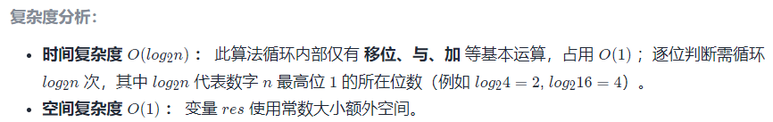

```java
class Solution {
    // you need to treat n as an unsigned value
    // 每次右移一位直至为0，并判断记录最低位为1 的个数
    public int NumberOf1(int n) {
        int total = 0;
        while(n != 0){
            // 位运算操作符优先级 较判断符 更高
            if((n & 1) != 0) total++;
            n = n >>> 1;
        }
        return total;
    }
}

class Solution {
public:
    int hammingWeight(uint32_t n) {
        int total = 0;
        while(n != 0){
            if((n&1) == 1){
                total++;
            }
            n >>= 1;
        }
        return total;
    }
};
```

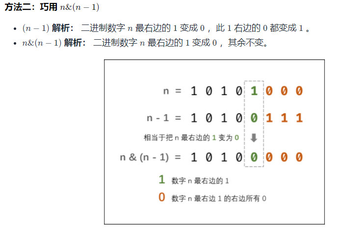

```java
public class Solution {
    // you need to treat n as an unsigned value
    public int hammingWeight(int n) {
        int total = 0;

        // 每次消除掉最右边的1
        while(n != 0){
            total++;
            n = n & (n-1);
        }

        return total;
    }
}

class Solution {
public:
    int hammingWeight(uint32_t n) {
        int total = 0;
        while(n != 0){
            total++;
            n = n & (n-1);
        }
        return total;
    }
};
```

### [剑指 Offer 16. 数值的整数次方](https://leetcode-cn.com/problems/shu-zhi-de-zheng-shu-ci-fang-lcof/)

```java
class Solution {
    // 暴力解法：直接循环模拟运算即可 超时...
    public double myPow(double x, int n) {
        if(x == 1 || x == 0) return x;
        boolean negative = x < 0;
        boolean negativePow = n < 0;
        
        x = Math.abs(x);
        n = Math.abs(n);

        double result = 1;
        int times = n;
        while(times-- > 0){
            result *= x;
        }

        if(negativePow){
            result = 1 / result;
        }
        if(negative && (n % 2 != 0)) result = -1 * result;

        return result;
    }
}
```

* 快速幂解法 https://leetcode-cn.com/problems/shu-zhi-de-zheng-shu-ci-fang-lcof/solution/mian-shi-ti-16-shu-zhi-de-zheng-shu-ci-fang-kuai-s/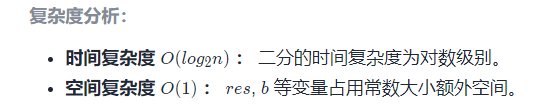

```java
class Solution {
    // 快速幂解法:实际是二分 x^n = (x^2)^(n//2)  // : 向下整除  这样将n/2化为0即可达到快速计算的效果
    // n为奇数时： x^n =  x(x^2)^(n//2) 可将多余的x单独放入一个变量
    public double myPow(double x, int n) {
        if(x == 0) return 0;
        double res = 1.0;
        long pow = n;
        if(pow < 0){
            x = 1 / x;
            pow = -pow;
        }

        while(pow != 0){
            // n奇数
            if((pow & 1) == 1) res *= x;
            // x^2
            x *= x;
            pow >>= 1;
        }

        return res;
    }
}
```


### [剑指 Offer 18. 删除链表的节点](https://leetcode-cn.com/problems/shan-chu-lian-biao-de-jie-dian-lcof/)

```java
/**
 * Definition for singly-linked list.
 * public class ListNode {
 *     int val;
 *     ListNode next;
 *     ListNode(int x) { val = x; }
 * }
 */
class Solution {
    public ListNode deleteNode(ListNode head, int val) {
        // 头结点为待删除结点的情况
        if(head.val == val) return head.next;
        // 只有链表头指针 故只能遍历查找
        ListNode cur = head.next, pre = head;

        while(cur != null){
            // 找到待删除结点
            if(cur.val == val){
                pre.next = cur.next;
                break;
            }
            // 记录前驱结点
            pre = cur;
            cur = cur.next;
        }

        return head;
    }
}
```

**原题：28. 在O(1)时间删除链表结点**

```java
/**
 * Definition for singly-linked list.
 * public class ListNode {
 *     int val;
 *     ListNode next;
 *     ListNode(int x) { val = x; }
 * }
 */
class Solution {
    // 没有前驱节点，无法用常规的删除操作
    // 将待删除结点替换成后续结点 再把后续结点删除即可
    public void deleteNode(ListNode node) {
        // 替换为后继结点的值
        node.val = node.next.val;
        // 删除后续结点
        node.next = node.next.next;
    }
}
```

### \29. 删除链表中重复的节点

* 麻烦的是指针移动的推演。。

```java
/**
 * Definition for singly-linked list.
 * public class ListNode {
 *     int val;
 *     ListNode next;
 *     ListNode(int x) { val = x; }
 * }
 */
class Solution {
    public ListNode deleteDuplication(ListNode head) {
        // 虚拟头结点 用于处理边界情况
        ListNode weakNode = new ListNode(-1);
        weakNode.next = head;
        // 前驱结点 便于进行删除
        ListNode pre = weakNode;

        while(pre.next != null){
            // 当前检查结点 用于判断是否有重复的结点 其会走到下一个检查结点
            ListNode check = pre.next;
            while(check != null && pre.next.val == check.val) check = check.next;
            
            // 当前检查结点未出现重复
            if(pre.next.next == check) pre = pre.next;
            // 出现重复 
            else pre.next = check;
        }
        
        return weakNode.next;
    }
}
```

### [剑指 Offer 10- II. 青蛙跳台阶问题](https://leetcode-cn.com/problems/qing-wa-tiao-tai-jie-wen-ti-lcof/)

* 类似斐波那契数列
* https://leetcode-cn.com/problems/qing-wa-tiao-tai-jie-wen-ti-lcof/solution/mian-shi-ti-10-ii-qing-wa-tiao-tai-jie-wen-ti-dong/

```java
class Solution {
    // 记忆集 避免耗时过长
    HashMap<Integer,Integer> map = new HashMap<>();
    // 函数定义：跳到台阶n 
    // 最后一步只有两种情况，跳1阶、跳2阶，每次只能从n-1阶 或 n-2阶跳上来 故可用递归实现
    public int numWays(int n) {
        if(map.containsKey(n)) return map.get(n);
        // base case
        if(n == 0 || n == 1) return 1;
        if(n == 2) return 2;
        int result = (numWays(n-1) + numWays(n-2))%1000000007;
        map.put(n, result);
        return result;
    }
}

class Solution {
public:
    int numWays(int n) {
        if(n == 1 || n == 0) return 1;
        int a = 1, b = 2;
        int i = 2;
        while(i < n){
            int temp = (a + b) % 1000000007;
            a = b;
            b = temp;
            i++;
        }
        return b;
    }
};
```

### [剑指 Offer 17. 打印从1到最大的n位数](https://leetcode.cn/problems/da-yin-cong-1dao-zui-da-de-nwei-shu-lcof/)

* 使用字符串表示大数，并使用递归生成对应位数的全排列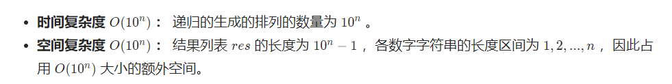

```c++
class Solution {
public:
    vector<string> result;
    char num[10] = {'0', '1', '2','3','4','5','6','7','8','9'};
    string cur;

    // 生成长度为 len 的数字，正在确定第x位（从左往右）len位0-9的全排列【首位不能为0】
    void dfs(int x, int len){
        if(x == len){
            result.push_back(cur);
            return;
        }
        int start = (x == 0) ? 1: 0;
        for(int i = start; i < 10; i++){
            cur.push_back(num[i]);
            dfs(x + 1, len);
            // 回溯
            cur.pop_back();
        }
    }
    vector<int> printNumbers(int n) {
        vector<int> int_result;
        for(int i = 1; i <= n; i++){ // 数字长度：1~n
            dfs(0, i);
        }
        
        for(int i = 0; i < result.size(); i++){
            int_result.push_back(stoi(result[i]));
        }
        return int_result;
    }
};
```


### [剑指 Offer 19. 正则表达式匹配](https://leetcode-cn.com/problems/zheng-ze-biao-da-shi-pi-pei-lcof/)

* 原题为10题

```java
class Solution {
    public boolean isMatch(String s, String p) {
        int n = s.length();
        int m = p.length();
        boolean[][] dp = new boolean[n+1][m+1];
        dp[0][0] = true;
        
        for(int j = 1; j <= m; j++){
            if(p.charAt(j-1) == '*') dp[0][j] = dp[0][j-2];
        }
        
        for(int i = 1; i <= n; i++){
            for(int j = 1; j <= m; j++){
                if(p.charAt(j-1) == '.'){
                    // .情况
                    dp[i][j] = dp[i-1][j-1];
                }else if(p.charAt(j-1) != '*'){
                    // 字母情况
                    dp[i][j] = p.charAt(j-1) == s.charAt(i-1) && dp[i-1][j-1];
                }else if(p.charAt(j-2) != '.' && p.charAt(j-2) != s.charAt(i-1)){
                    // 字母* 且前面字符需0重复情况【即p[j-2] != s[i-1] 字符匹配不上，只能0重复】
                    dp[i][j] = dp[i][j-2];
                }else{
                    // 0重复、1重复、多重复的并
                    dp[i][j] = dp[i][j-1] || dp[i-1][j] || dp[i][j-2];
                }
            }
        }
        return dp[n][m];
    }
}
```


### [剑指 Offer 20. 表示数值的字符串](https://leetcode-cn.com/problems/biao-shi-shu-zhi-de-zi-fu-chuan-lcof/)

* 模拟字符串判断解法【分治思想】
* 时间复杂度O(n)【每个字符判断一次，但常数项特别大】

```java
class Solution {
    // 暴力解法：逐步拆分进行判断 并将拆分进行判的结果进行合并 【分治】
    public boolean isNumber(String s) {
        // 转为大写 便于处理E
        s = s.toUpperCase();
        // 去掉首尾空格
        s = s.trim();
        int index = s.indexOf('E');
        if(index != -1){
            // 有e的情况
            // 分e前数和e后数
            String first = s.substring(0, index);
            String second = s.substring(index+1, s.length());
            // e前数可以是小数或者整数  e后数只能是整数
            return (isDecimal(first) || isInteger(first)) && isInteger(second);
        }else{
            // 没有e的情况
            return isDecimal(s) || isInteger(s);
        }
    }

    // 判断字符串是否为小数
    private boolean isDecimal(String s){
        // 只含有一个字符或为含有. 必定不是小数
        if(s.length() <= 1 || s.indexOf('.') == -1) return false;
        // 去掉第一个+/-
        if(s.charAt(0) == '+' || s.charAt(0) == '-'){
            s = s.substring(1, s.length());
        }

        // 去掉+/-后可能只有.  规避了小数前后都没有字符的但结果为true的情况
        if(s.length() == 1) return false;

        int index = s.indexOf('.');
        // 小数前如果有字符 则判断前面的数是否为数字 否则为默认为true
        boolean preResult = (index - 0) > 0 ? isDigit(s.substring(0, index)) : true;
         // 小数后如果有字符 则判断后面的数是否为数字 否则为默认为true
        boolean nextResult = (s.length() - index -1) > 0 ? isDigit(s.substring(index+1, s.length())) : true;

        return preResult && nextResult;

    }

    // 判断字符串是否为整数
    private boolean isInteger(String s){
        if(s.length() == 0) return false;
        // 去掉第一个+/-
        if(s.charAt(0) == '+' || s.charAt(0) == '-'){
            s = s.substring(1, s.length());
        }
        return isDigit(s);
    }

    // 判断字符串是否为至少一位数字
    private boolean isDigit(String s){
        if(s.length() == 0) return false;
        for(char cur : s.toCharArray()){
            if(cur < '0' || cur > '9') return false;
        }
        return true;
    }
}
```

### [剑指 Offer 21. 调整数组顺序使奇数位于偶数前面](https://leetcode-cn.com/problems/diao-zheng-shu-zu-shun-xu-shi-qi-shu-wei-yu-ou-shu-qian-mian-lcof/)

* 时间复制度O(N) 空间复杂度O(n) 的双指针解法
* 原数组未改变

```java
class Solution {
    // 暴力解法：开辟一个新数组 遍历旧数组 偶数从后往前放 奇数从前往后放 【双指针】
    public int[] exchange(int[] nums) {
        if(nums == null || nums.length == 0) return nums;
        int[] result = new int[nums.length];
        int oddIndex = 0;
        int evenIndex = result.length - 1;

        for(int num : nums){
            // 偶数情况
            if((num & 1) == 0) result[evenIndex--] = num;
            // 奇数情况
            else result[oddIndex++] = num;
        }

        return result;
    }
}
```

* 时间复制度O(N) 空间复杂度O(1) 的双指针解法
* 原数组改变

```java
class Solution {
    public int[] exchange(int[] nums) {
        if(nums == null || nums.length ==0) return nums;
        int oddIndex = 0;
        int evenIndex = nums.length - 1;

        // 循环终止条件  两指针相等
        while(oddIndex < evenIndex){
            // 偶数指针 前移到 奇数的位置上
            while((oddIndex < evenIndex) && ((nums[evenIndex] & 1) == 0)) evenIndex--;
            // 奇数指针 后移到 偶数的位置上
            while((oddIndex < evenIndex) && ((nums[oddIndex] & 1) != 0)) oddIndex++;

            // 进行交换
            int temp = nums[oddIndex];
            nums[oddIndex] = nums[evenIndex];
            nums[evenIndex] = temp;
        }

        return nums;
    }
}
```


### [剑指 Offer 22. 链表中倒数第k个节点](https://leetcode-cn.com/problems/lian-biao-zhong-dao-shu-di-kge-jie-dian-lcof/)

* 快慢指针解法

```java
/**
 * Definition for singly-linked list.
 * public class ListNode {
 *     int val;
 *     ListNode next;
 *     ListNode(int x) { val = x; }
 * }
 */
class Solution {
    public ListNode findKthToTail(ListNode pListHead, int k) {
        if(pListHead == null) return null;
        
        ListNode fastIndex = pListHead, slowIndex = pListHead;
        // 从头开始走 k-1步 走到第k个结点
        for(int i = 1; i < k && fastIndex != null; i++){
            fastIndex = fastIndex.next;
        }
        // k大于链表长度
        if(fastIndex == null) return null;
        
        // 快指针走n-k步 走到最后一个结点 慢指针也走n-k步不过是从头结点开始 走到第n-k+1个结点
        while(fastIndex.next != null){
            slowIndex = slowIndex.next;
            fastIndex = fastIndex.next;
        }
        
        return slowIndex;
    }
}
```


### [剑指 Offer II 022. 链表中环的入口节点](https://leetcode-cn.com/problems/c32eOV/)

* 快慢指针解法，由数学推理得来。
* https://leetcode-cn.com/problems/c32eOV/solution/shua-chuan-jian-zhi-offer-day12-lian-bia-lv78/
* 时间复杂度O(n) 慢指针走了 2X+Y步
* 空间复杂度O(1)

```java
/**
 * Definition for singly-linked list.
 * class ListNode {
 *     int val;
 *     ListNode next;
 *     ListNode(int x) {
 *         val = x;
 *         next = null;
 *     }
 * }
 */
public class Solution {
    public ListNode detectCycle(ListNode head) {
        // base case
        if(head == null) return null;
        // 快慢指针
        ListNode fastIndex = head, slowIndex = head;

        // 每次快指针走两步 慢指针走一步 直到快指针走到null 或 两指针相遇
        while(fastIndex != null && fastIndex.next != null){
            fastIndex = fastIndex.next.next;
            slowIndex = slowIndex.next;
            // 走完再判断 避免起始时相等
            if(fastIndex == slowIndex) break;
        }
        // 无环情况
        if(fastIndex == null || fastIndex.next == null) return null;

        // 慢指针从头结点开始走 快指针从相遇点开始走 两指针相遇时即位于环的入口结点
        slowIndex = head;
        while(slowIndex != fastIndex) {
            slowIndex = slowIndex.next;
            fastIndex = fastIndex.next;
        }
        return fastIndex;
    }       
}
```

### [剑指 Offer 24. 反转链表](https://leetcode-cn.com/problems/fan-zhuan-lian-biao-lcof/)

* 迭代法：思考每次反转时需要的信息是什么即可。
* 空间复杂度分析：遍历时只有3个额外变量，所以额外的空间复杂度是 O(1)。
  时间复杂度分析：只遍历一次链表，时间复杂度是O(n)。

```java
/**
 * Definition for singly-linked list.
 * public class ListNode {
 *     int val;
 *     ListNode next;
 *     ListNode(int x) { val = x; }
 * }
 */
class Solution {
    // 迭代法 记录反转表的头结点 每次将新的头结点插入反转表 并更新下个插入的结点
    public ListNode reverseList(ListNode head) {
        // base case
        if(head == null) return null;
        ListNode newListHead = null, cur = head, next;
        
        while(cur != null){
            next = cur.next;
            // 插入新的头结点
            cur.next = newListHead;
            newListHead = cur;
            // 更新下个插入的结点
            cur = next;
        }
        
        return newListHead;
    }
}
```

* 递归：由函数定义入手，注意死循环问题和反转链表为空的情况
* 空间复杂度分析：总共递归 n 层，系统栈的空间复杂度是 O(n)，所以总共需要额外 O(n) 的空间。
  时间复杂度分析：链表中每个节点只被遍历一次，所以时间复杂度是 O(n)。

```java
 // 递归
    // 函数定义：将以head为头的链表反转 并返回头结点
    public ListNode reverseList(ListNode head) {
        // base case
        if(head == null) return null;
        
        // 获取剩余结点链表反转后的头结点
        ListNode newListHead = reverseList(head.next);
        
        if(newListHead != null){
            // 当前结点非尾结点的情况
            // 拼接到反转链表的尾部
            head.next.next = head;
            // 当前节点的下一节点置为空 避免出现死循环 a <-> b
            head.next = null;
            return newListHead;
        }else{
            // 当前节点为尾节点直接返回
            return head;
        }
        
    }
```

### [剑指 Offer 25. 合并两个排序的链表](https://leetcode-cn.com/problems/he-bing-liang-ge-pai-xu-de-lian-biao-lcof/)


```java
/**
 * Definition for singly-linked list.
 * public class ListNode {
 *     int val;
 *     ListNode next;
 *     ListNode(int x) { val = x; }
 * }
 */
class Solution {
    public ListNode mergeTwoLists(ListNode l1, ListNode l2) {
        // 构建虚拟头结点 来规避 第一轮循环时因合并链表无结点而无法将节点加入的情况
        ListNode weakHead = new ListNode(-1);
        ListNode cur = weakHead;
        while(l1 != null && l2 != null){
            if(l1.val < l2.val){
                cur.next = l1;
                l1 = l1.next;
            }else{
                cur.next = l2;
                l2 = l2.next;
            }
            cur = cur.next;
        }
        
        // 将剩余节点移到l1中
        l1 = l1 == null ? l2 : l1;
        // 将剩余节点加入到合并的链表的尾部 因为是升序的 直接加入即可
        cur.next = l1;
        
        // 返回真正头结点
        return weakHead.next;
    }
}
```


### [剑指 Offer 26. 树的子结构](https://leetcode-cn.com/problems/shu-de-zi-jie-gou-lcof/)

* 两层树的先序遍历
* 时间复杂度O(mn) m为a树节点个数 n为b树节点个数，对每个a树节点都可能比较n次
* 空间复杂度O(m) 树a和树b都退化为链表时深度即为节点个数，递归最大深度总由树a的深度决定。

```java
/**
 * Definition for a binary tree node.
 * public class TreeNode {
 *     int val;
 *     TreeNode left;
 *     TreeNode right;
 *     TreeNode(int x) { val = x; }
 * }
 */
class Solution {
    // 对A中每个节点都进行判断 以该节点为根的树结构是否与B相同
    // 先序遍历取A中的每个节点 并以B为基准进行基于先序遍历的比较
    public boolean isSubStructure(TreeNode A, TreeNode B) {
        if(B == null) return false;
        return preTra(A, B);
    }

    private boolean preTra(TreeNode head, TreeNode B){
        if(head == null) return false;
        // 先序遍历比较节点
        boolean curResult = isSame(head, B);
        return curResult || preTra(head.left, B) || preTra(head.right, B);
    }

    private boolean isSame(TreeNode head, TreeNode B){
        // B一定不为null 如果head为null 则一定不相同
        if(head == null) return false;

        boolean result = true;
        if(B.val == head.val){
            // 以B为基准 往子层移动
            if(B.left != null)  result = result && isSame(head.left, B.left);
            if(B.right != null) result = result && isSame(head.right, B.right);

            return result;
        }else{
            return false;
        }
    }
}
```


### [剑指 Offer 27. 二叉树的镜像](https://leetcode-cn.com/problems/er-cha-shu-de-jing-xiang-lcof/)

* 后序遍历实现
* 时间复杂度O(N)：需要遍历所有节点
* 空间复杂度O(N)：最差时二叉树退化为链表，栈空间深度为N

```java
/**
 * Definition for a binary tree node.
 * public class TreeNode {
 *     int val;
 *     TreeNode left;
 *     TreeNode right;
 *     TreeNode(int x) { val = x; }
 * }
 */
class Solution {
    // 因为镜像操作每次就是把左子树的镜像和右子树的镜像调换为右子树和左子树，包含重复动作，考虑用递归实现，后序遍历实现
    // 函数定义：输出以root为根的二叉树的镜像
    public TreeNode mirrorTree(TreeNode root) {
        // base case
        if(root == null) return null;

        // 取得左、右子树的镜像
        TreeNode leftMirror = mirrorTree(root.left);
        TreeNode rightMirror = mirrorTree(root.right);

        // 调换左右子树
        root.right = leftMirror;
        root.left = rightMirror;

        // 返回根节点
        return root;
    }
}
```


### [剑指 Offer 28. 对称的二叉树](https://leetcode-cn.com/problems/dui-cheng-de-er-cha-shu-lcof/)

* 时间复杂度O(N)，得到镜像时依据每个节点构造一次，比较时每个节点比较一次。
* 空间复杂度O(N)，得到镜像时可能最深层递归为N，镜像树空间N，比较时可能最深层递归为N。

```java
/**
 * Definition for a binary tree node.
 * public class TreeNode {
 *     int val;
 *     TreeNode left;
 *     TreeNode right;
 *     TreeNode(int x) { val = x; }
 * }
 */
class Solution {
    // 暴力解法：先得到镜像 再进行基于先序遍历的比较
    public boolean isSymmetric(TreeNode root) {
        if(root == null) return true;
        TreeNode mirror = mirrorTree(root);
        return isSame(root, mirror);
    }

    private TreeNode mirrorTree(TreeNode root) {
        // base case
        if(root == null) return null;
        TreeNode newRoot = new TreeNode(root.val);

        // 取得左、右子树的镜像
        TreeNode leftMirror = mirrorTree(root.left);
        TreeNode rightMirror = mirrorTree(root.right);

        // 调换左右子树
        newRoot.right = leftMirror;
        newRoot.left = rightMirror;

        // 返回根节点
        return newRoot;
    }

    private boolean isSame(TreeNode root, TreeNode mirror){
        // 基于镜像的先序遍历 故mirror不可能为null
        if(root == null) return false;
        boolean result = true;
        if(root.val == mirror.val){
            if(mirror.left != null) result = result && isSame(root.left, mirror.left);
            if(mirror.right != null) result = result && isSame(root.right, mirror.right);

            return result;
        }else{
            return false;
        }
    }
}
```

* 一次递归实现，重点是找出重复动作，还有对称的判断肯定是需要对两颗树进行比较的，同样树的对称判断依赖于子树的对称判断。
* 时间复杂度O(N)，每次比较2个节点，一共有N个节点，比较N/2次
* 空间复杂度O(N)，最差情况下（见下图），二叉树退化为链表，系统使用 O(N)大小的栈空间。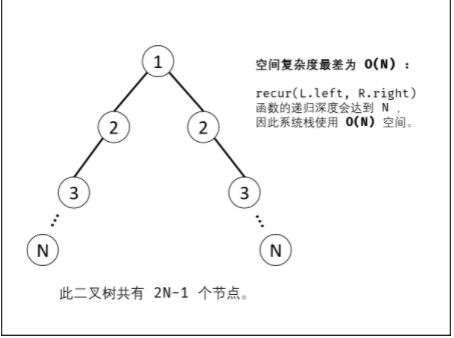

```java
/**
 * Definition for a binary tree node.
 * public class TreeNode {
 *     int val;
 *     TreeNode left;
 *     TreeNode right;
 *     TreeNode(int x) { val = x; }
 * }
 */
class Solution {
    public boolean isSymmetric(TreeNode root) {
        if(root == null) return true;
        return isSymmetricInTwoNode(root.left, root.right);
    }

    // 函数定义：判断以一对节点为根的两颗树 是否对称
    // 树的对称判断依赖于子树的对称判断 故考虑用递归实现
    private boolean isSymmetricInTwoNode(TreeNode a, TreeNode b){
        if(a == null && b == null) return true;

        // 只有一颗树为空时 不对称
        if(a == null || b == null) return false;

        if(a.val == b.val){
            // 需子树也为对称 结构 两颗树才对称 注意是哪些子树进行比较的
            return isSymmetricInTwoNode(a.left, b.right) && isSymmetricInTwoNode(a.right, b.left);
        }else {
            return false;
        }
    }
}
```


### [剑指 Offer 29. 顺时针打印矩阵](https://leetcode-cn.com/problems/shun-shi-zhen-da-yin-ju-zhen-lcof/)

* https://leetcode-cn.com/problems/shun-shi-zhen-da-yin-ju-zhen-lcof/solution/mian-shi-ti-29-shun-shi-zhen-da-yin-ju-zhen-she-di/
* 时间复杂度O(mn)：每个元素都遍历一次
* 空间复杂度O(1)：只用了四个边界变量，返回数组空间不算。

```java
class Solution {
    public int[] spiralOrder(int[][] matrix) {
        // base case 
        if(matrix.length == 0 || matrix[0].length == 0) return new int[0];

        // 四个边界 上边界：left -> right 待取的元素集 如果上边界在下边界下边 表示元素都取完了直接break
        int l = 0, r = matrix[0].length - 1, t = 0, b = matrix.length - 1;
        // 结果集
        int[] result = new int[(r+1) * (b+1)];
        // 结果集元素个数
        int total = 0;

        // 终止条件 上边界在下边界下边 或 左边界在右边界右边时
        while(true){

            //left -> right 上边界元素取完并更新上边界
            for(int i = l; i <= r; i++){
                result[total++] = matrix[t][i];
            }
            if(++t > b) break;

            // top -> bottom 右边界取完并更新
            for(int i = t; i <= b; i++){
                result[total++] = matrix[i][r];
            }
            if(l > --r) break;

            // right -> left 下边界取完并更新
            for(int i = r; i >= l; i--){
                result[total++] = matrix[b][i];
            }
            if(t > --b) break;

            // bottom -> top 左边界取完并更新
            for(int i = b; i >= t; i--){
                result[total++] = matrix[i][l];
            }
            if(++l > r) break;
        }

        return result;
    }
}
```


### [剑指 Offer 30. 包含min函数的栈](https://leetcode-cn.com/problems/bao-han-minhan-shu-de-zhan-lcof/)

* 利用链表实现包含min函数的栈，空间换时间，且每次新节点加入链表时记录此刻链表的最小值
* 各函数时间复制度都是O(1)，空间复杂度O(n)
* todo 复制栈写法

```java
class MinStack {
    // 链表节点的连接顺序即栈元素的顺序
    Node head;
    /** initialize your data structure here. */
    public MinStack() {
    }
    
    public void push(int x) {
        if(head == null){
            head = new Node(x, x);
        }else{
            // 每次更新栈中最小值
            head = new Node(x, Math.min(x, head.min), head);
        }
    }
    
    public void pop() {
        head = head.next;
    }
    
    public int top() {
        return head.val;
    }
    
    public int min() {
        return head.min;
    }

    class Node{
        int val;
        Node next;
        // 当前链表对应栈中的最小值
        int min;
        
        public Node(int val, int min){
            this(val, min, null);
        }

        public Node(int val, int min, Node next){
            this.val = val;
            this.min = min;
            this.next = next;
        }
    }
}

/**
 * Your MinStack object will be instantiated and called as such:
 * MinStack obj = new MinStack();
 * obj.push(x);
 * obj.pop();
 * int param_3 = obj.top();
 * int param_4 = obj.min();
 */
```


### [剑指 Offer 31. 栈的压入、弹出序列](https://leetcode-cn.com/problems/zhan-de-ya-ru-dan-chu-xu-lie-lcof/)

入栈顺序能得出的出栈顺序：https://blog.csdn.net/Bazingalqq/article/details/82849514

固定的入栈序列能够得出的出栈序列个数：C(2n,n)-C(2n,n+1)，https://blog.csdn.net/qq_26286193/article/details/80216479【通过位置分析】

* todo笔试常考。。压入元素后可以先弹出，再压入下一个元素

* 根据栈的弹出序列，尝试着模拟出元素的压入、弹出过程。
* 时间复杂度O(n)：每个元素压入、弹出一次。
* 空间复杂度O(N)：开辟空间为n的栈。

```java
class Solution {
    // 模拟栈的压入、弹出
    public boolean validateStackSequences(int[] pushed, int[] popped) {
        LinkedList<Integer> stack = new LinkedList<>();
        int n = pushed.length;
        // 压栈索引
        int num = 0;

        // 遍历弹出序列
        for(int i = 0; i < popped.length; i++){
            // 当前栈为空 或者 栈中下个弹出元素 不是 弹出序列中待弹出元素
            // 将后面元素加入栈中 一直到遇到带弹出元素
            if(stack.isEmpty() || stack.peek() != popped[i]){
                
                while(num < n && popped[i] != pushed[num]){
                    stack.push(pushed[num]);
                    num++;
                }
                // 还未找到 待弹出元素 返回false
                if(num == n){
                    return false;
                }else{
                    // 找到 则模拟压入、弹出 直接用压栈索引后移实现
                    num++;   
                }
            }else{
                // 栈顶元素 匹配 弹出序列 中 待弹出元素
                stack.pop();
            }
        }

        return true;
    }
}
```

* 更简洁的写法：

```java
class Solution {
    public boolean validateStackSequences(int[] pushed, int[] popped) {
        int popIndex = 0;
        int n = pushed.length;
        LinkedList<Integer> stack = new LinkedList<>();

        for(int num : pushed){
            stack.push(num);

            // 栈顶元素 等于 待弹出元素 则 一直出栈
            while(!stack.isEmpty() && stack.peek() == popped[popIndex]){
                stack.pop();
                popIndex++;
            }
        }

        return stack.isEmpty();        
    }
}
```


### [剑指 Offer 32 - I. 从上到下打印二叉树](https://leetcode-cn.com/problems/cong-shang-dao-xia-da-yin-er-cha-shu-lcof/)

* 时间复杂度O(N)：每个节点出入队列各一次
* 空间复杂度O(N)：额外开辟了一个集合存储n个元素

```java
/**
 * Definition for a binary tree node.
 * public class TreeNode {
 *     int val;
 *     TreeNode left;
 *     TreeNode right;
 *     TreeNode(int x) { val = x; }
 * }
 */
class Solution {
    public int[] levelOrder(TreeNode root) {
        // base case
        if(root == null) return new int[]{};
        ArrayList<Integer> result = new ArrayList<>();

        LinkedList<TreeNode> queue = new LinkedList<>();
        queue.offer(root);

        while(!queue.isEmpty()){
            TreeNode cur = queue.poll();
            result.add(cur.val);
            if(cur.left != null) queue.offer(cur.left);
            if(cur.right != null) queue.offer(cur.right);
        }
        int[] res = new int[result.size()];
        for(int i = 0; i < result.size(); i++)
            res[i] = result.get(i);

        return res;
    }
}
```

### [剑指 Offer 32 - II. 从上到下打印二叉树 II](https://leetcode-cn.com/problems/cong-shang-dao-xia-da-yin-er-cha-shu-ii-lcof/)

* 时间复杂度 O(N)： N 为二叉树的节点数量，即 BFS 需循环 N 次。
  空间复杂度 O(N)： 最差情况下，即当树为平衡二叉树时，最多有 N/2 个树节点同时在 queue 中，使用 O(N) 大小的额外空间。

* 比上题多的操作就是**加了个循环将当前层的节点取出。**

  

```java
/**
 * Definition for a binary tree node.
 * public class TreeNode {
 *     int val;
 *     TreeNode left;
 *     TreeNode right;
 *     TreeNode(int x) { val = x; }
 * }
 */
class Solution {
    public List<List<Integer>> levelOrder(TreeNode root) {
        List<List<Integer>> result = new ArrayList<>();
         // base case
        if(root == null) return result;

        LinkedList<TreeNode> queue = new LinkedList<>();
        queue.offer(root);

        while(!queue.isEmpty()){

            // 将当前层节点 加入当前层集合
            int curLevleNum = queue.size();
            List<Integer> curLevelResult = new ArrayList<>();
            while(curLevleNum-- > 0){
                TreeNode cur = queue.poll();
                curLevelResult.add(cur.val);
                if(cur.left != null) queue.offer(cur.left);
                if(cur.right != null) queue.offer(cur.right);
            }

            result.add(curLevelResult);
            
        }

        return result;        
    }
}
```

### [剑指 Offer 32 - III. 从上到下打印二叉树 III](https://leetcode-cn.com/problems/cong-shang-dao-xia-da-yin-er-cha-shu-iii-lcof/)

* 每次将子结果集加入到结果集前，根据层次判断是否需要对子结果集进行反转，再加入结果集。
* 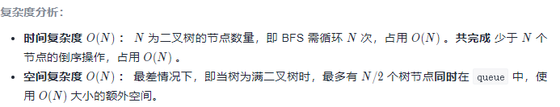

```java
/**
 * Definition for a binary tree node.
 * public class TreeNode {
 *     int val;
 *     TreeNode left;
 *     TreeNode right;
 *     TreeNode(int x) { val = x; }
 * }
 */
class Solution {
    public List<List<Integer>> levelOrder(TreeNode root) {
        List<List<Integer>> result = new ArrayList<>();
         // base case
        if(root == null) return result;

        LinkedList<TreeNode> queue = new LinkedList<>();
        
        queue.offer(root);

        // 用于记录放入队列的顺序 偶数：顺序放 奇数：倒序放 可用结果集的大小代替判断
        // int times = 0;

        while(!queue.isEmpty()){

            // 将当前层节点 加入当前层集合
            int curLevleNum = queue.size();
            List<Integer> curLevelResult = new ArrayList<>();
            while(curLevleNum-- > 0){
                TreeNode cur = queue.poll();
                curLevelResult.add(cur.val);
                if(cur.left != null) queue.offer(cur.left);
                if(cur.right != null) queue.offer(cur.right);
            }
            // 奇数层次 对当前层结果进行反转
            // if(times++ % 2 == 1) Collections.reverse(curLevelResult);
            if(result.size() % 2 == 1) Collections.reverse(curLevelResult);

            result.add(curLevelResult);
            
        }

        return result;     
    }
}
```


### [剑指 Offer 33. 二叉搜索树的后序遍历序列](https://leetcode-cn.com/problems/er-cha-sou-suo-shu-de-hou-xu-bian-li-xu-lie-lcof/)

* 明确每个节点都需要做的事。
* 时间复杂度O(N)：退化成链表时有O(N)次递归，每次递归需扫描N个元素
* 空间复杂度O(N)：退化成链表时栈开辟N层。

```java
class Solution {
  
    public boolean verifyPostorder(int[] postorder) {
        // base case
        if(postorder == null || postorder.length <= 1) return true;
       

        return verifyPostorderWithRange(postorder, 0, postorder.length - 1);
    }

    // 函数定义：判断后序遍历数组的某个范围是否能构成二叉搜索树
    // 二叉搜索树的条件判断：
    // 1、左子树节点 < 根节点 < 右子树节点
    // 2、左右子树都为 二叉搜索树
    // 可以看出每次都需划分出 右子树 和 左子树 并进行判断
    // 每次递归都包含重复操作 故考虑用递归实现 这里先判断条件1 再判断条件2 即先判断自己 再判断子节点 类似先序遍历实现
    public boolean verifyPostorderWithRange(int[] postorder, int start, int end){
        // base case 考虑边界越界情况
        if(start >= end) return true;

        // 条件1判断
        // 节点指针
        int index = start;
        // 划分出左子树
        while(postorder[index] < postorder[end]) index++;

        // 划分出右子树
        int rightStart = index;
        while(postorder[index] > postorder[end]) index++;


        // 条件2判断
        return index == end && verifyPostorderWithRange(postorder, start, rightStart - 1) && verifyPostorderWithRange(postorder, rightStart, end - 1);
    }
}
```


### [剑指 Offer 34. 二叉树中和为某一值的路径](https://leetcode-cn.com/problems/er-cha-shu-zhong-he-wei-mou-yi-zhi-de-lu-jing-lcof/)

* 时间复杂度O(n)：先序遍历取完所有节点
* 空间复杂度O(N)：退化成链表时

```java
/**
 * Definition for a binary tree node.
 * public class TreeNode {
 *     int val;
 *     TreeNode left;
 *     TreeNode right;
 *     TreeNode() {}
 *     TreeNode(int val) { this.val = val; }
 *     TreeNode(int val, TreeNode left, TreeNode right) {
 *         this.val = val;
 *         this.left = left;
 *         this.right = right;
 *     }
 * }
 */
class Solution {
    LinkedList<List<Integer>> result;
    // dfs深搜加回溯 深搜过程记录路径上节点的和 到叶子时再判断路径和是否为目标值
    public List<List<Integer>> pathSum(TreeNode root, int target) {
        result = new LinkedList<>();
        // base case
        if(root == null) return result;
        LinkedList<Integer> temp = new LinkedList<>();
        // 必定要走根节点
        temp.add(root.val);
        dfs(root, target, root.val, temp);

        return result;
    }

    private void dfs(TreeNode root, int target, int curSum, LinkedList<Integer> temp){
        // base case 已到叶子节点
        if(root.left == null && root.right ==null){
            if(curSum == target){
                // 重新创建一个集合对象添加
                result.add(new LinkedList(temp));
            }
            return;
        }

        // 分别对左右子树进行深搜
        if(root.left != null){
            curSum += root.left.val;
            temp.add(root.left.val);
            dfs(root.left, target, curSum, temp);
            // 回溯
            curSum -= root.left.val;
            temp.removeLast();
        }

        if(root.right != null){
            curSum += root.right.val;
            temp.add(root.right.val);
            dfs(root.right, target, curSum, temp);
            curSum -= root.right.val;
            temp.removeLast();
        }
    }
}
```


### [剑指 Offer 35. 复杂链表的复制](https://leetcode-cn.com/problems/fu-za-lian-biao-de-fu-zhi-lcof/)

* 时间复杂度O(N)：遍历两次链表
* 空间复杂度O(N)：记录链表每个旧节点和新节点的映射。
* https://leetcode-cn.com/problems/fu-za-lian-biao-de-fu-zhi-lcof/solution/jian-zhi-offer-35-fu-za-lian-biao-de-fu-zhi-ha-xi-/

```java
/*
// Definition for a Node.
class Node {
    int val;
    Node next;
    Node random;

    public Node(int val) {
        this.val = val;
        this.next = null;
        this.random = null;
    }
}
*/
class Solution {
    // 主要难点在于想出 用map构建旧新节点的关系来构建random指针
    public Node copyRandomList(Node head) {
        if(head == null) return null;
        Map<Node,Node> map = new HashMap<>();

        Node cur = head.next;
        Node newNode = new Node(head.val), newCur = newNode;
        map.put(head, newNode);

        // 先构建单链表 并构建key为源节点，value为新节点的map 便于后续构建 random指针
        while(cur != null){
            newCur.next = new Node(cur.val);

            newCur = newCur.next;
            map.put(cur, newCur);
            cur = cur.next;
        }

        // 构建random指针
        while(head != null){
            // 取出新结点和新结点对应的random指针
            Node curNew = map.get(head);
            Node random = map.get(head.random);
            curNew.random = random;
            head = head.next;
        }

        return newNode;
    }
}
```

### [剑指 Offer 36. 二叉搜索树与双向链表](https://leetcode-cn.com/problems/er-cha-sou-suo-shu-yu-shuang-xiang-lian-biao-lcof/)

* 时间复杂度(N)：中序遍历每个节点
* 空间复杂度O(N)：每个节点构建长度为2的数组，当树退化成链表时需递归到n层。

```java
/*
// Definition for a Node.
class Node {
    public int val;
    public Node left;
    public Node right;

    public Node() {}

    public Node(int _val) {
        val = _val;
    }

    public Node(int _val,Node _left,Node _right) {
        val = _val;
        left = _left;
        right = _right;
    }
};
*/
class Solution {
    public Node treeToDoublyList(Node root) {
        if(root == null) return null;

        Node[] result = middleTracking(root);

        // 构建循环关系
        result[0].left = result[1];
        result[1].right = result[0];

        return result[0];
    }

    // 函数定义：以root为根的树构建双向无循环链表
    // 返回链表头节点和尾节点
    // 根树依赖子树才能实现且子树和根树做的事相同 故用递归实现
    private Node[] middleTracking(Node root){
        // base case 
        if(root.left == null && root.right == null) return new Node[]{root, root};

        // 构建出结果节点 
        Node[] result = new Node[2];

        // 左右子树至少有一个不为空
        // 非严格中序遍历 因为需要依赖左右子树的结果才能 构建出当前树的链表 
        Node[] leftResult = null;
        if(root.left != null){
            leftResult = middleTracking(root.left);
            root.left = leftResult[1];
            root.left.right = root;
            result[0] = leftResult[0];
        }else{
            result[0] = root;
        }
        

        Node[] rightResult = null;
        if(root.right != null){
            rightResult = middleTracking(root.right);
            root.right = rightResult[0];
            root.right.left = root;
            result[1] = rightResult[1];
        }else{
            result[1] = root;
        }

        return result;


    }
}
```


* 法二：记录当前节点在中序序列的前一个节点，该指针链接起来即可

* ```c++
  /*
  struct TreeNode {
  	int val;
  	struct TreeNode *left;
  	struct TreeNode *right;
  	TreeNode(int x) :
  			val(x), left(NULL), right(NULL) {
  	}
  };*/
  class Solution {
  public:
      TreeNode* Convert(TreeNode* pRootOfTree) {
          if(pRootOfTree == nullptr){
              return nullptr;
          }
          
          // 记录中序遍历上一个节点
          TreeNode* pre = nullptr;
          inorder(pRootOfTree, pre);
          while(pRootOfTree->left){
              pRootOfTree = pRootOfTree->left;
          }
          return pRootOfTree;
      }
      
      // 中序遍历root节点并将二叉搜索树连接成双向链表 pre记录中序序列的上一个节点
      void inorder(TreeNode* root, TreeNode*& pre){
          if(root){
              // 和中序序列前面节点连接成双向链表
              inorder(root->left, pre);
              root->left = pre;
              if(pre) pre->right = root;
              // 注意 必须传引用 因为 pre的值变化后需让外层函数感知
              pre = root;
              inorder(root->right, pre);
          }
      }
  };
  ```

* 


### [46. 全排列](https://leetcode-cn.com/problems/permutations/)

* 时间复杂度O(N*N ! )：https://leetcode-cn.com/problems/permutations/solution/hui-su-suan-fa-python-dai-ma-java-dai-ma-by-liweiw/
* 空间复杂度O(N*N !)

```java
class Solution {
    List<List<Integer>> result;
    public List<List<Integer>> permute(int[] nums) {
        result = new ArrayList<>();
        dfs(nums, new boolean[nums.length], new LinkedList<>());
        return result;
    }
    
    // 深搜+回溯 获取所有全排列结果 
    // used ： 使用记忆集来记录当前排列已使用过的数字 
    private void dfs(int[] nums, boolean[] used, LinkedList<Integer> temp){
        // base case
        if(temp.size() == nums.length){
            result.add(new ArrayList<>(temp));
            return;
        }
        
        // // 记录当前层已使用过的数字 用于处理出现相同数字的情况
        // List<Integer> usedNum = new ArrayList();
        
        
        for(int i = 0; i < nums.length; i++){
            // if(!used[i] && !usedNum.contains(nums[i])){
            //     usedNum.add(nums[i]);
            //     temp.add(nums[i]);
            //     used[i] = true;
            //     dfs(nums, used, temp);
            //     temp.removeLast();
            //     used[i] = false;
            // }
            // 找到可以使用的数字
            if(!used[i]){
                temp.add(nums[i]);
                used[i] = true;
                dfs(nums, used, temp);
                // 回溯
                temp.removeLast();
                used[i] = false;
            }
        }
    }
}
```

### \51. 数字排列

* 包含重复数字的全排列，为去除重复的排列结果，对每一层记录已使用过数字，避免相同数字再次使用，出现重复的排列结果。

```java
class Solution {
    List<List<Integer>> result;
    public List<List<Integer>> permutation(int[] nums) {
        result = new ArrayList<>();
        dfs(nums, new boolean[nums.length], new LinkedList<>());
        return result;
    }
    
    // used记忆集：记录当前排列已使用过的数字 避免再次使用
    private void dfs(int[] nums, boolean[] used, LinkedList<Integer> temp){
        // base case
        if(temp.size() == nums.length){
            result.add(new ArrayList<>(temp));
            return;
        }
        
        // 记录当前层已使用过的数字 避免相同数字再次使用，出现相同的排列
        List<Integer> usedNum = new ArrayList();
        

        for(int i = 0; i < nums.length; i++){
            // 剪枝
            if(!used[i] && !usedNum.contains(nums[i])){
                usedNum.add(nums[i]);
                temp.add(nums[i]);
                used[i] = true;
                dfs(nums, used, temp);
                temp.removeLast();
                used[i] = false;
            }
        }
    }
}
```

### [剑指 Offer 37. 序列化二叉树](https://leetcode-cn.com/problems/xu-lie-hua-er-cha-shu-lcof/)

* 层次遍历进行序列化和反序列化

* 时间复杂度都为O(N)：序列化时层次遍历需取到每个节点，反序列化也需取到每个节点

  ，这里都为取到最底层的NULL，即2N+1个节点

* 空间复杂度都为O(N)：序列化时栈最差需存储(N+1)/2个节点，满二叉树时，装填的都是非空叶子节点，反序列化时也是如此推出。

* https://leetcode-cn.com/problems/xu-lie-hua-er-cha-shu-lcof/solution/mian-shi-ti-37-xu-lie-hua-er-cha-shu-ceng-xu-bian-/

```java
/**
 * Definition for a binary tree node.
 * public class TreeNode {
 *     int val;
 *     TreeNode left;
 *     TreeNode right;
 *     TreeNode(int x) { val = x; }
 * }
 */
public class Codec {
    private static String SEP = ",";
    private static String NULL = "#";

    // Encodes a tree to a single string.
    public String serialize(TreeNode root) {
        if(root == null) return "";
        // 利用队列实现层次遍历 每次遍历队列中装填的都是某一层节点
        StringBuilder sb = new StringBuilder();
        Queue<TreeNode> q = new LinkedList<>();
        q.offer(root);

        while(!q.isEmpty()){
            TreeNode cur = q.poll();

            if(cur == null){
                sb.append(NULL).append(SEP);
                // 空节点无需添加其左右子树 确保空节点不能再延申
                continue;
            }

            sb.append(cur.val).append(SEP);

            q.offer(cur.left);
            q.offer(cur.right);
        }

        return sb.toString();
    }

    // Decodes your encoded data to tree.
    public TreeNode deserialize(String data) {
        if(data.isEmpty()) return null;
        // 利用层次遍历结果、队列进行反序列化
        String[] dataArray = data.split(SEP);

        // 队列 存储的都是父节点
        Queue<TreeNode> q = new LinkedList<>();
        TreeNode root = new TreeNode(Integer.parseInt(dataArray[0]));
        q.offer(root);

        for(int i = 1; i<dataArray.length;){
            // 每次遍历 i都表示是 某个父节点对应的左右孩子
            // 取出父节点
            TreeNode cur = q.poll();

            // 左孩子节点值
            String left = dataArray[i++];

            if(!left.equals(NULL)){
                TreeNode leftNode = new TreeNode(Integer.parseInt(left));
                cur.left = leftNode;
                // 加入队列 便于后面作为父节点
                q.offer(leftNode);
            }else{
                // 空节点将不会加入队列 因为层次遍历序列 空节点不会再往下延申了 这里也就不用加入队列
                cur.left = null;
            }

            // 右孩子节点值
            String right = dataArray[i++];

            if(!right.equals(NULL)){
                TreeNode rightNode = new TreeNode(Integer.parseInt(right));
                cur.right = rightNode;
                // 加入队列 便于后面作为父节点
                q.offer(rightNode);
            }else{
                cur.right = null;
            }
        }

        return root;
    }
}

// Your Codec object will be instantiated and called as such:
// Codec ser = new Codec();
// Codec deser = new Codec();
// TreeNode ans = deser.deserialize(ser.serialize(root));
```

### [剑指 Offer 39. 数组中出现次数超过一半的数字](https://leetcode-cn.com/problems/shu-zu-zhong-chu-xian-ci-shu-chao-guo-yi-ban-de-shu-zi-lcof/)

* 解法1
* 时间复杂度O(N)：遍历每个数字
* 空间复杂度O(N)：统计每个数字的出现次数

```java
class Solution {
    // 暴力解法：使用map记录每个数字的出现次数，当出现次数大于n/2时[题目说明一定存在这样的数] 直接break
    public int majorityElement(int[] nums) {
        if(nums.length == 1) return nums[0];
        Map<Integer,Integer> map = new HashMap<>();
        int resultKey = nums[0];

        for(int num : nums){
            int times = map.getOrDefault(num, 0) + 1;
            map.put(num, times);
            if(times > nums.length / 2){
                resultKey = num;
                break;
            }
        }

        return resultKey;

    }
}
```

* 解法2：排序将相同数字相邻便于使用一个变量统计相同数字出现个数
* 时间复杂度O(N)：排序nlogn，遍历n
* 空间复杂度O(1)

```java
class Solution {
    public int majorityElement(int[] nums) {
        if(nums.length == 1) return nums[0];

        // 记录结果
        int result = -1;

        // 先排序 nlogn
        Arrays.sort(nums);

        // 记录每个数字出现的次数 初始第一个数出现了一次
        int times = 1;
        // 便于比较是否相同
        // int pre = nums[0];

        // 遍历每个数字 O(n)
        for(int i = 1; i < nums.length; i++){
            
            // if(nums[i] == pre){
            //     times++;
            //     if(times > nums.length / 2){
            //         result = nums[i];
            //         break;
            //     }
            // }else{
            //     // 新数出现
            //     times = 1;
            //     pre = nums[i];
            // }
            if(nums[i] == nums[i - 1]){
                times++;
                if(times > nums.length / 2){
                    result = nums[i];
                    break;
                }
            }else{
                // 新数出现
                times = 1;
            }
        }

        return result;
    }
}
```

* 解法3：摩尔投票法，常用于**选举出数组中出现次数超过1/k的数字。**

  之前有推到直接crtl+f

* 时间复杂度O(N)

* 空间复杂度O(1)

```java
class Solution {
    public int majorityElement(int[] nums) {
        // 初始状态 votes为0 表示需要换选举人
        // x表示选举人 votes表示选举人的投票数 
        int x = -1, votes = 0;

        for(int num : nums){
            // 是否需要换选举人
            if(votes == 0) x = num;
            // 加票或减票
            votes += num == x ? 1 : -1; 
        }

        return x;
    }
}
```


### [剑指 Offer 40. 最小的k个数](https://leetcode-cn.com/problems/zui-xiao-de-kge-shu-lcof/)

* 先排序，再取数

* 时间复杂度O(NlogN)：快排
* 空间复杂度O(logN)：使用random递归深度为logN

```java
class Solution {
    public int[] getLeastNumbers(int[] nums, int k) {
        if(nums == null || nums.length == 0 || k == 0) return new int[0];

        int[] result = new int[k];
        // 快排 nlogn
        quickSort(nums, 0, nums.length - 1);

        // 赋值
        for(int j = 0; j < k; j++){
            result[j] = nums[j];
        }

        return result;

    }

    private void quickSort(int[] nums, int left, int right){
        int middle;
        if(left < right){
            middle = getMiddleIndex(nums, left, right);
            // 子区间继续划分 直至区间只有一个数
            quickSort(nums, left, middle - 1);
            quickSort(nums, middle + 1, right);
        }
    }

    private int getMiddleIndex(int[] nums, int left, int right){
        // 随机取一个数作为基准值 若无该方法 则空间复杂度为O(n)：即数组完全倒序。。
        // 该方法时间复杂度O(1)
        swap(nums, left, new Random().nextInt(right - left + 1) + left);
        int pivot = nums[left];

        // 划分出小于、大于基准值的两个区间
        while(left < right){
        
            while(left < right && nums[right] >= pivot){
                right--;
            }
            nums[left] = nums[right];

            while(left < right && nums[left] <= pivot){
                left++;
            }
            nums[right] = nums[left];
        }

        nums[left] = pivot;
        return left;
    }

    private void swap(int[] nums, int i, int j){
        int temp = nums[i];
        nums[i] = nums[j];
        nums[j] = temp;
    }
}
```


* 根据快排每次都是将第middle+1小的数放在对应位置上，所以可以不断向这个方向前进，直到将第k+1小的数放到对应位置上，这样前面则为最小的k个数

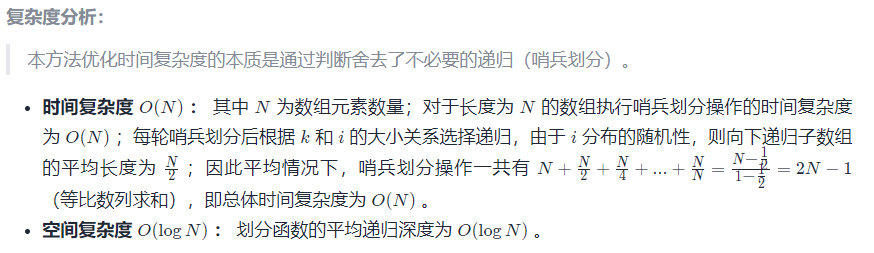

```java
class Solution {
    public int[] getLeastNumbers(int[] nums, int k) {
        if(nums == null || nums.length == 0 || k == 0) return new int[0];

        int[] result = new int[k];
        // 最小的k个数无需排序 故可 将第k+1小的数放到第k个位置上 则其前面的数 为最小的k个数 
        quickSort(nums, 0, nums.length - 1, k);

        // 赋值
        for(int j = 0; j < k; j++){
            result[j] = nums[j];
        }

        return result;

    }

    private void quickSort(int[] nums, int left, int right, int k){
        int middle;
        if(left < right){
            middle = getMiddleIndex(nums, left, right);
            // 选择划分区间 
            if(middle > k)
                quickSort(nums, left, middle - 1, k);
            if(middle < k)
                quickSort(nums, middle + 1, right, k);
        }
    }

    private int getMiddleIndex(int[] nums, int left, int right){
        // 随机取一个数作为基准值 若无该方法 则空间复杂度为O(n)：即数组完全倒序。。
        // 该方法时间复杂度O(1)
        swap(nums, left, new Random().nextInt(right - left + 1) + left);
        int pivot = nums[left];

        // 划分出小于、大于基准值的两个区间
        while(left < right){
        
            while(left < right && nums[right] >= pivot){
                right--;
            }
            nums[left] = nums[right];

            while(left < right && nums[left] <= pivot){
                left++;
            }
            nums[right] = nums[left];
        }

        nums[left] = pivot;
        return left;
    }

    private void swap(int[] nums, int i, int j){
        int temp = nums[i];
        nums[i] = nums[j];
        nums[j] = temp;
    }
}
```

### [剑指 Offer 42. 连续子数组的最大和](https://leetcode-cn.com/problems/lian-xu-zi-shu-zu-de-zui-da-he-lcof/)

* 暴力解法：超时

```java
class Solution {
    // 暴力解法：两层循环完成 外层循环为起点 内层循环为终点 超时...
    public int maxSubArray(int[] nums) {
        if(nums.length == 1) return nums[0];
        int maxSum = nums[0];
        for(int i = 0; i < nums.length; i++){
            int curSum = nums[i];
            if(maxSum < curSum) maxSum = curSum;
            for(int j = i + 1; j < nums.length; j++){
                curSum += nums[j];
                if(maxSum < curSum) maxSum = curSum;
            }
        }

        return maxSum;
    }
}
```

### [剑指 Offer 42. 连续子数组的最大和](https://leetcode-cn.com/problems/lian-xu-zi-shu-zu-de-zui-da-he-lcof/)

* 使用dp解决，问题的解依赖于子问题的解
* 时间复杂度O(N)
* 空间复杂度O(N)

```java
class Solution {
    public int maxSubArray(int[] nums) {
        if(nums.length == 1) return nums[0];

        // dp[i]: 以索引i结尾的子数组的和的最大值
        int[] dp = new int[nums.length];
        dp[0] = nums[0];

        // 记录所有子数组的和的最大值
        int max = dp[0];

        for(int i = 1; i < dp.length; i++){
            // 状态转移
            if(dp[i - 1] < 0){
                // 前一个数结尾的子数组的最大值为负数
                // 以当前数结尾的子数组的最大值只能为当前值了
                dp[i] = nums[i];
            }else{
                // 可以接上前一个数结尾的子数组
                dp[i] = dp[i - 1] + nums[i];
            }

            // 记录最大值
            max = Math.max(max, dp[i]);
        }

        return max;
    }
}
```

* 优化空间复杂度为O(1)

```java
class Solution {
    public int maxSubArray(int[] nums) {
        if(nums.length == 1) return nums[0];

        // dp[i]: 以索引i结尾的子数组的和的最大值
        // int[] dp = new int[nums.length];
        // dp[0] = nums[0];

        // 优化空间复杂度 dp[i] 只与dp[i-1]有关 用一个变量记录状态即可 其即可当作dp[i-1]又可当作dp[i]
        int cur = nums[0];

        // 记录所有子数组的和的最大值
        int max = cur;

        for(int i = 1; i < nums.length; i++){
            // 状态转移
            if(cur < 0){
                // 前一个数结尾的子数组的最大值为负数
                // 以当前数结尾的子数组的最大值只能为当前值了
                cur = nums[i];
            }else{
                // 可以接上前一个数结尾的子数组
                cur = cur + nums[i];
            }

            // 记录最大值
            max = Math.max(max,cur);
        }

        return max;
    }
}
```


### [剑指 Offer 41. 数据流中的中位数](https://leetcode-cn.com/problems/shu-ju-liu-zhong-de-zhong-wei-shu-lcof/)

* 暴力解法

```java
class MedianFinder {
    // 暴力解法：加时不排序，取时再排序，且元素都为double 超时...
    List<Double> list;
    /** initialize your data structure here. */
    public MedianFinder() {
        list = new LinkedList<>();
    }
    
    public void addNum(int num) {
        list.add((double)num);
    }
    
    public double findMedian() {
        Collections.sort(list);
        int size = list.size();
        double leftMiddle = list.get((size - 1) / 2);
        double rightMiddle = list.get((size) / 2);
        return (leftMiddle + rightMiddle) / 2;
    }
}

/**
 * Your MedianFinder object will be instantiated and called as such:
 * MedianFinder obj = new MedianFinder();
 * obj.addNum(num);
 * double param_2 = obj.findMedian();
 */
```

* 使用大小顶堆维持整体有序结构，并有两个堆顶记录中位数

  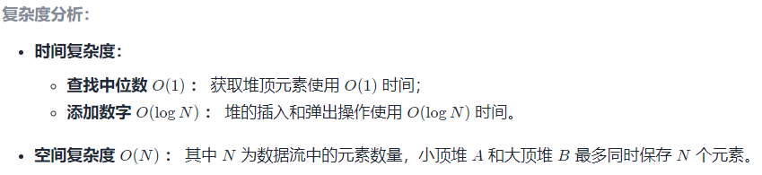

```java
class MedianFinder {
    PriorityQueue<Integer> left; // 大顶堆 降序方式存储 一半较小的数
    PriorityQueue<Integer> right; // 小顶堆 升序方式存储 一半较大的数
    // 这样大顶堆堆首 和 小顶堆堆首 即可组合为中位数

    /** initialize your data structure here. */
    public MedianFinder() {
        // 默认为升序即小顶堆 构造器中提供反序比较器实现大顶堆
        left = new PriorityQueue<>(Comparator.reverseOrder());
        right = new PriorityQueue<>();
    }
    
    public void addNum(int num) {
        // 元素个数为奇数时 大顶堆元素个数是小顶堆元素个数加一
        // 元素个数为偶数时 两者相等

        if(left.size() != right.size()){
            // 加入到大顶堆中
            left.add(num);
            right.add(left.poll());
        }else{
            // 新元素进来 需要取出恰当的元素放到对应的位置，因为需要将新元素按顺序存入 且维持两个堆的整体结构
            // 先将新元素加入到大顶堆中调整次序 取出大顶堆堆首元素 将其加入小顶堆
            right.add(num);
            left.add(right.poll());
        }
    }
    
    public double findMedian() {
        if(left.size() != right.size()) return (double)left.peek();
        return ((double) left.peek() + right.peek()) / 2;
    }
}

/**
 * Your MedianFinder object will be instantiated and called as such:
 * MedianFinder obj = new MedianFinder();
 * obj.addNum(num);
 * double param_2 = obj.findMedian();
 */
```


### [剑指 Offer 43. 1～n 整数中 1 出现的次数](https://leetcode-cn.com/problems/1nzheng-shu-zhong-1chu-xian-de-ci-shu-lcof/)

* 解法1：找规律解法，找出n中对应位在不同数值的情况下1出现情况的规律

* 详细题解：https://leetcode-cn.com/problems/1nzheng-shu-zhong-1chu-xian-de-ci-shu-lcof/solution/mian-shi-ti-43-1n-zheng-shu-zhong-1-chu-xian-de-2/

* 判断某位上1的个数：类比生活中的密码锁，就是那种几个滚轮的密码锁，固定其中的一位密码，拨动其他位置的密码。

  固定的就是1，其余位置能滚动的数量即该位为1的个数。

* 时间复杂度O(logN)：数值n，一共有log10N位

* 空间复杂度O(1)

* ```java
  class Solution {
      public int countDigitOne(int n) {
          if(n <= 0) return -1;
          // 当前位数值初始值
          int cur = n % 10;
  
          // 高位初始值
          int high = n / 10;
  
          // 低位初始值
          int low = 0;
  
          // 数位
          int digit = 1;
  
          // 1出现次数
          int sum = 0;
  
          // 循环终止条件：高位和当前位数值都为0
          while(high != 0 || cur != 0){
              
              // 根据当前位值得不同，使用不同策略统计当前位1的出现次数
              if(cur == 0){
                  sum += high * digit;
              }else if(cur == 1){
                  sum += high * digit + low + 1;
              }else{
                  sum += (high + 1) * digit;
              }
  
              // 变量状态转移
              low += digit*cur;
              cur = high % 10;
              high = high / 10;
              digit *= 10;
          }
  
          return sum;
      }                        
  }
  ```

* 


### [剑指 Offer 44. 数字序列中某一位的数字](https://leetcode-cn.com/problems/shu-zi-xu-lie-zhong-mou-yi-wei-de-shu-zi-lcof/)

* 解法一：超时暴力解法

```java
class Solution {
    // 暴力超时解法：将从0到n的数合并构成字符串，然后再取
    // 对于超过一位的数采用先加再反转方式加入字符串中
    public int digitAtIndex(int n) {
        StringBuilder result = new StringBuilder();
        for(int i = 0; i <= n; i++){
            int cur = i;
            StringBuilder temp = new StringBuilder();
            while(cur >= 10){
                temp.append(cur % 10);
                cur = cur / 10;
            }
            temp.append(cur);
            
            result.append(temp.reverse());
            // System.out.println(result.toString());
        }
        
        return result.charAt(n) - '0';
    }
}
```

* 解法二：找出规律。。。

https://leetcode-cn.com/problems/shu-zi-xu-lie-zhong-mou-yi-wei-de-shu-zi-lcof/solution/mian-shi-ti-44-shu-zi-xu-lie-zhong-mou-yi-wei-de-6/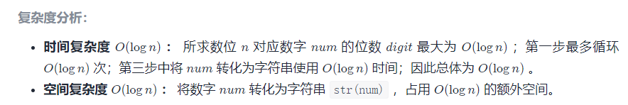

```java
class Solution {
    public int findNthDigit(int n) {
        // digit：数位 start：当前数位对应的开始数 count：当前数位的总位数
        int digit = 1;
        long start = 1;
        long count = 9;

        // 获取出 n位置所在数的 对应的start、digit、count
        while (n > count) { // 1.
            n -= count;
            digit += 1;
            start *= 10;
            count = digit * start * 9;
        }

        // 获取 n位置所对应的数
        long num = start + (n - 1) / digit; // 2.

        // 获取n位置在num的对应数位
        return Long.toString(num).charAt((n - 1) % digit) - '0'; // 3.
    }
}

```

### [剑指 Offer 45. 把数组排成最小的数](https://leetcode-cn.com/problems/ba-shu-zu-pai-cheng-zui-xiao-de-shu-lcof/)

* **关键就在于如何比较两个数`i`和`j`前后拼在一起的情况下哪个更大，最秀的方法就是直接比较`i+j`和`j+i`谁大就可以了**
* **求拼接起来的最小数字，本质上是一个排序问题。**

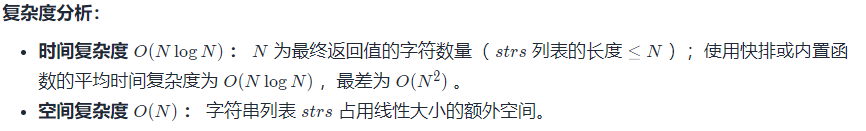

```java
class Solution {
    // 转化为排序问题 x+y < y+x 则x放前面 根据该规则排序的整体结果必定最小  排序规则需确保有传递性以保证传递后不会失真 达到总体的有序
    public String minNumber(int[] nums) {
        String[] strings = new String[nums.length];

        for(int i = 0; i < nums.length; i++){
            strings[i] = String.valueOf(nums[i]);
        }

        // 排序 利用string的compareTo方法。。
        Arrays.sort(strings, (a, b) -> {
            return (a + b).compareTo(b + a);
        });

        StringBuilder res = new StringBuilder();
        for(String temp : strings){
            res.append(temp);
        }

        return res.toString();
    }
}
```


### [剑指 Offer 46. 把数字翻译成字符串](https://leetcode-cn.com/problems/ba-shu-zi-fan-yi-cheng-zi-fu-chuan-lcof/)

* 动态规划解法，与跳台阶问题类似，关键是分析出动态转移方程。
* 时间复杂度O(N)
* 空间复杂度O(N)

```java
class Solution {
    // 问题的解可由同样但规模较小的子问题推出 使用dp
    public int translateNum(int num) {
        StringBuilder sb = new StringBuilder(String.valueOf(num));
        // base case
        if(sb.length() == 1) return 1;

        // dp[i]：索引0-i-1的子串一共有多少种不同的翻译方法
        int[] dp = new int[sb.length() + 1];
        // 规避边界处理
        dp[0] = 1;
        dp[1] = 1;

        for(int i = 2; i < dp.length; i++){
            // 截取出相邻两个数字组成的数字 并根据其组合范围 进行动态转移
            String temp = sb.substring(i - 2, i);

            // 动态转移
            if(Integer.valueOf(temp) >= 10 && Integer.valueOf(temp) <= 25){
                // 最后两个数字能和dp[i-2]构成组合 且 当前数字也能和dp[i-1]构成组合
                dp[i] = dp[i-1] + dp[i-2];
            }else{
                // 只能和dp[i-1]组合
                dp[i] = dp[i-1];
            }
        }

        return dp[sb.length()];

    }
}
```

* 优化dp数组的空间

```java
class Solution {
    // 问题的解可由同样但规模较小的子问题推出 使用dp
    public int translateNum(int num) {
        StringBuilder sb = new StringBuilder(String.valueOf(num));
        // base case
        if(sb.length() == 1) return 1;

        // // dp[i]：索引0-i-1的子串一共有多少种不同的翻译方法 
        // int[] dp = new int[sb.length() + 1];
        // // 规避边界处理
        // dp[0] = 1;
        // dp[1] = 1;

        // dp[i]只由dp[i-1]和dp[i-2]决定 故优化空间
        int pre = 1;
        int cur = 1;


        for(int i = 2; i < sb.length() + 1; i++){
            // 截取出相邻两个数字组成的数字 并根据其组合范围 进行动态转移
            String temp = sb.substring(i - 2, i);
            int tempNum = cur;
            // 动态转移
            if(Integer.valueOf(temp) >= 10 && Integer.valueOf(temp) <= 25){
                // 最后两个数字能和dp[i-2]构成组合 且 当前数字也能和dp[i-1]构成组合
                // dp[i] = dp[i-1] + dp[i-2];           
                cur = cur + pre;
             } //else{
            //     // 只能和dp[i-1]组合
            //     // dp[i] = dp[i-1];
                    // cur = cur;
            // }
            pre = tempNum;
        }

        // return dp[sb.length()];
        return cur;

    }
}
```

### [剑指 Offer 47. 礼物的最大价值](https://leetcode-cn.com/problems/li-wu-de-zui-da-jie-zhi-lcof/)

```java
class Solution {
    // 暴力dfs超时解法：返回到右下角所有路径的最大值 ， 需先获取子路径的最大价值，即依赖于子问题的解
    public int maxValue(int[][] grid) {
        if(grid == null || grid.length == 0 || grid[0].length == 0) return 0;

        return dfsMaxPath(grid, 0, 0);
    }
    
    // 函数定义：返回当前点到右下角的所有路径的最大价值
    private int dfsMaxPath(int[][] grid, int row, int column){
        // System.out.println(grid[row][column] + "："+row + " "+column);
        if(row == grid.length -1 && column == grid[0].length -1){
            return grid[row][column];
        }

        // 获取所有子路径的价值
        int rightValue = 0;
        if(column + 1 < grid[0].length){
            rightValue += dfsMaxPath(grid, row, column + 1);
        }

        int downValue = 0;
        if(row + 1 < grid.length){
            downValue += dfsMaxPath(grid, row + 1, column);
        }

        return grid[row][column] + Math.max(rightValue, downValue);
    }
}
```

* 加入记忆集优化去除重复搜索
* 时间复杂度O(mn)：每个点将会被计算一次【从右下角开始往左上角走】
* 空间复杂度O(mn)：记忆集O(mn)，递归栈最多O(m+n)到达右下角都是要向右走m步向下走n步。。

```java
class Solution {
    int[][] used;
    // 优化后的 dfs解法：返回到右下角所有路径的最大值 ， 需先获取子路径的最大价值，即依赖于子问题的解
    public int getMaxValue(int[][] grid) {
        if(grid == null || grid.length == 0 || grid[0].length == 0) return 0;
        used = new int[grid.length][grid[0].length];
        return dfsMaxPath(grid, 0, 0);
    }
    
    // 函数定义：返回当前点到右下角的所有路径的最大价值 因为必定有重复走到相同点的情况故使用记忆集进行优化 
    private int dfsMaxPath(int[][] grid, int row, int column){
        // 记忆集中有该位置到右下角的最大价值路径直接返回 【题目有价值都>0】
        if(used[row][column] != 0) return used[row][column];

        if(row == grid.length -1 && column == grid[0].length -1){
            return grid[row][column];
        }

        // 获取所有子路径的价值
        int rightValue = 0;
        if(column + 1 < grid[0].length){
            rightValue += dfsMaxPath(grid, row, column + 1);
        }

        int downValue = 0;
        if(row + 1 < grid.length){
            downValue += dfsMaxPath(grid, row + 1, column);
        }

        used[row][column] = grid[row][column] + Math.max(rightValue, downValue);
        return used[row][column];
    }
}
```

* 转化思路：只能向右、向下走的怎么走问题转为只能从上、从左来的怎么来的问题。该问题就依赖于前面的问题的解，故可用动态规划实现
* 时间复杂度O(mn)：遍历每个节点，求到该节点的最大价值
* 空间复杂度O(mn)

```java
class Solution {
    // dp解法：每个点只能从左边或上边到达，故每次记录到达该点的最大路径 然后将状态转移至右下角即可
    public int maxValue(int[][] grid) {
        if(grid == null || grid.length == 0 || grid[0].length == 0) return 0;
        int[][] dp = new int[grid.length][grid[0].length];

        for(int i = 0; i < dp.length; i++){
            for(int j = 0; j < dp[0].length; j++){
                // 状态转移方程
                if(i == 0 && j == 0){
                    dp[i][j] = grid[0][0];
                }else if(i == 0){
                    dp[i][j] = dp[i][j - 1] + grid[i][j];
                }else if(j == 0){
                    dp[i][j] = dp[i - 1][j] + grid[i][j];
                }else{
                    dp[i][j] = Math.max(dp[i - 1][j], dp[i][j - 1]) + grid[i][j];
                }
            }
        }

        return dp[grid.length - 1][grid[0].length - 1];

    }
}
```

* 原地修改时空间复杂度为O(1)

```java
class Solution {
    // dp解法：每个点只能从左边或上边到达，故每次记录到达该点的最大路径 然后将状态转移至右下角即可
    public int maxValue(int[][] grid) {
        if(grid == null || grid.length == 0 || grid[0].length == 0) return 0;
        // int[][] dp = new int[grid.length][grid[0].length];

        for(int i = 0; i < grid.length; i++){
            for(int j = 0; j < grid[0].length; j++){
                // 状态转移方程
                if(i == 0 && j == 0){
                    grid[i][j] = grid[0][0];
                }else if(i == 0){
                    grid[i][j] = grid[i][j - 1] + grid[i][j];
                }else if(j == 0){
                    grid[i][j] = grid[i - 1][j] + grid[i][j];
                }else{
                    grid[i][j] = Math.max(grid[i - 1][j], grid[i][j - 1]) + grid[i][j];
                }
            }
        }

        return grid[grid.length - 1][grid[0].length - 1];

    }
}
```

* 二维dp数组优化为一维dp数组时，空间复杂度为O(m)
* 二维dp数组优化时，常需根据动态转移方程调整遍历顺序，这里只依赖于上边和左边，因从左往右遍历时依赖项都已经修改了，故采用从左往右遍历。

```java
class Solution {
    // dp解法：每个点只能从左边或上边到达，故每次记录到达该点的最大路径 然后将状态转移至右下角即可
    public int maxValue(int[][] grid) {
        if(grid == null || grid.length == 0 || grid[0].length == 0) return 0;
        // int[][] dp = new int[grid.length][grid[0].length];
        // 空间优化：二维dp数组转为一维
        int[] dp = new int[grid[0].length];

        for(int i = 0; i < grid.length; i++){
            for(int j = 0; j < grid[0].length; j++){
                // 状态转移方程
                if(i == 0 && j == 0){
                    dp[j] = grid[0][0];
                }else if(i == 0){
                    dp[j] = dp[j - 1] + grid[i][j];
                }else if(j == 0){
                    dp[j] = dp[j] + grid[i][j];
                }else{
                    dp[j] = Math.max(dp[j - 1], dp[j]) + grid[i][j];
                }
            }
        }

        return dp[grid[0].length - 1];

    }
}
```


### [剑指 Offer 48. 最长不含重复字符的子字符串](https://leetcode-cn.com/problems/zui-chang-bu-han-zhong-fu-zi-fu-de-zi-zi-fu-chuan-lcof/)

* 经典滑动窗口解法
* 时间复杂度O(N)：每次找以某个字符结尾的最长子串
* 空间复杂度O(128)：使用数组记录当前字符上次出现的位置，便于更新滑动窗口的起始位置

```java
class Solution {
    // 滑动窗口法
    // 每次查找以某个字符结尾的最长子串
    // 主要是在查找过程中判断出 窗口的起始位置 起始位置由最近的重复字符的位置决定 
    public int lengthOfLongestSubstring(String s) {
        if(s == null || s.length() == 0) return 0;
        if(s.length() == 1) return 1;
        int max = 0;
        // Map<Character, Integer> lastIndex = new HashMap<>();
        // 用数组实现提高搜索速度 ascii码 字符一共128个
        int[] lastIndex = new int[128];
        Arrays.fill(lastIndex, -1);

        // 初始时最近的重复字符的位置为-1
        int closestIndex = -1;

        for(int i = 0; i < s.length(); i++){
            char cur = s.charAt(i);
            // 该字符上次出现的位置 用于判断窗口的起始位置
            int lastAppear = lastIndex[cur];

            if(lastAppear != -1 && closestIndex < lastAppear){
                // 字符非第一次出现 且 该重复字符的位置更加接近
                closestIndex = lastAppear;
            }
            int length = i - closestIndex;
            if(max < length) max = length;

            lastIndex[cur] = i;
        }

        return max;
    }
}
```

### [剑指 Offer 49. 丑数](https://leetcode-cn.com/problems/chou-shu-lcof/)

* 三个指针记录待乘以2、3、5的数来获取新的丑数的位置，【动态转移】我们每次用这三个指针构造出一个最小的新丑数，同时使用dp数组记录之前的丑数。
* 时间复杂度O(N)：遍历N次
* 空间复杂度O(N)：dp数组大小为N

```java
class Solution {
    public int nthUglyNumber(int n) {
        if(n <= 0) return -1;

        // dp[i] ： 第 i 小的丑数
        int[] dp = new int[n + 1];
        // 三指针法 用于获取当前最小的丑数
        int id2 = 1, id3 = 1, id5 = 1;
        dp[1] = 1;

        for(int i = 2; i < dp.length; i++){
            int n2 = dp[id2] * 2, n3 = dp[id3] * 3, n5 = dp[id5] * 5;
            // 状态转移 当前丑数 可从前面的丑数乘以2、3、5中最小的数
            dp[i] = Math.min(n2, Math.min(n3, n5));

            // 相等结果 前移 避免出现相同的数
            if(n2 == dp[i]){
                id2++;
            }

            if(n3 == dp[i]){
                id3++;
            }

            if(n5 == dp[i]){
                id5++;
            }
        }

        return dp[n];
    }
}
```


### [剑指 Offer 50. 第一个只出现一次的字符](https://leetcode-cn.com/problems/di-yi-ge-zhi-chu-xian-yi-ci-de-zi-fu-lcof/)

* 解法一：暴力解法，先统计每个字符出现次数，然后再遍历获取第一个出现次数为1的字符
* 时间复杂度O(N)：遍历两次字符串
* 空间复杂度O(1)：字符串只包含小写字母，记录字符出现次数的记忆集【数组、哈希表】只需要开辟26个单元。

```java
class Solution {
    public char firstUniqChar(String s) {
        // base case
        if(s == null || s.length() == 0) return ' ';

        // 记录每个字符在字符串中的出现次数
        int[] times = new int[26];
        for(char cur : s.toCharArray()){
            times[cur - 'a']++;
        }

        // 获取出现次数为1的首个字符
        for(char cur : s.toCharArray()){
            if(times[cur - 'a'] == 1){
                return cur;
            }
        }

        return ' ';
    }
}
```

* 解法二：有序哈希表【元素为插入顺序，这样可直接从头遍历哈希表来找出第一个只出现一次的字符，避免了遍历字符串，有序哈希表内部的Entry类持有前驱和后续指针，同时有序哈希表持有链表头尾节点，即通过一个链表维护插入顺序，存取复杂度都为O(1)】
* 有序哈希表相关知识：https://blog.csdn.net/ThinkWon/article/details/102574293
* 时间复杂度、空间复杂度与上一解法相同，只是相比于上一解法，该解法只需遍历一次字符串，当字符串特别长时，该解法速度较快。

```java
class Solution {
    public char firstUniqChar(String s) {
        if(s == null || s.equals("")) return ' ';

        Map<Character, Boolean> sortedMap = new LinkedHashMap<>();

        for(char cur : s.toCharArray()){
            sortedMap.put(cur, !sortedMap.containsKey(cur));
        }

        for(Map.Entry<Character, Boolean> entry : sortedMap.entrySet()){
            if(entry.getValue()) return entry.getKey();
        }

        return ' ';
    }
}
```


### \64. 字符流中第一个只出现一次的字符

```java
class Solution {  
    // 重点是记录读入字符的顺序，这样我们才能根据该顺序找出第一个只出现一次的字符
    // 排序哈希表就记录了读入的顺序
    // 在读入过程中判断是否为第一次读入，是则为true，否则为false
    // 输出过程 则从前往后遍历排序哈希表 输出第一个为true的字符即可
    Map<Character, Boolean> sortedMap = new LinkedHashMap<>();
    
    //Insert one char from stringstream   
    public void insert(char ch){ // 时间复杂度O(1) 直接接在当前链表尾节点后面
        sortedMap.put(ch, !sortedMap.containsKey(ch));
    }
    //return the first appearence once char in current stringstream
    public char firstAppearingOnce(){ // 时间复杂度O(n) 有序哈希表内部通过Entry组成的链表维护插入顺序
        if(sortedMap.isEmpty()) return '#';
        
        for(Map.Entry<Character, Boolean> entry : sortedMap.entrySet()){
            if(entry.getValue()) return entry.getKey();
        }
        return '#';
    }
}

```

### [剑指 Offer 52. 两个链表的第一个公共节点](https://leetcode-cn.com/problems/liang-ge-lian-biao-de-di-yi-ge-gong-gong-jie-dian-lcof/)

* 双指针法
* 时间复杂度O(a+b)：a、b为两链表长度，无公共节点时，短链表和长链表各走一次
* 空间复杂度O(1)

```java
/**
 * Definition for singly-linked list.
 * public class ListNode {
 *     int val;
 *     ListNode next;
 *     ListNode(int x) {
 *         val = x;
 *         next = null;
 *     }
 * }
 */
public class Solution {
    // 双指针法 短链表长度:a，长链表长度:b，这样我们只需让长链表起始节点为b-a 短链表起始长度为原首节点 两者同时往后移 第一个相同节点即为公共节点
    public ListNode getIntersectionNode(ListNode headA, ListNode headB) {
        // base case
        if(headA == headB) return headA;
        if(headA == null || headB == null) return null;
        
        ListNode index1 = headA;
        ListNode index2 = headB;
        ListNode temp = null;

        // 让短链表走完 这样就找到b-a长度了
        while(index1 != null && index2 != null){
            index1 = index1.next;
            index2 = index2.next;
        }
        
        // 根据哪个链表走完 index1为对应的短链表 index2为对应长链表
        if(index2 != null){
            temp = index2;
            index1 = headA;
            index2 = headB;
        }else{
            temp = index1;
            index1 = headB;
            index2 = headA;
        }
        
        // 长链表起始节点前移
        while(temp != null){
            index2 = index2.next;
            temp = temp.next;
        }
        
        // 开始往后比较
        while(index2 != index1){
            index1 = index1.next;
            index2 = index2.next;
        }
        
        return index2;
    }
}
```

```java
    /**
     *  更简洁的写法：同样可以用数学公式证明 最终一定会走到两个相同的节点【null或非null】
     */
    public ListNode getIntersectionNode(ListNode headA, ListNode headB) {
        ListNode index1 = headA, index2 = headB;
        while(index1 != index2){
            // 谁先为null 谁为短链表 然后换到长链表头部接着走
            index1 = index1 != null ? index1.next : headB;
            index2 = index2 != null ? index2.next : headA;
        }

        // null：无公共节点 非null：有
        return index1;
    }
}
```


### [剑指 Offer 53 - I. 在排序数组中查找数字 I](https://leetcode-cn.com/problems/zai-pai-xu-shu-zu-zhong-cha-zhao-shu-zi-lcof/)

* 分治解法
* 时间复杂度O(N)：最坏情况数组中全为target时，每个元素都需比较一次
* 空间复杂度O(logN)：同一时刻最多只能由logN层递归

```java
class Solution {
    // 分治法：将问题划分为子问题 ， 即在大区间找target 化为 在小区间找的结果的和
    public int search(int[] nums, int target) {
        if(nums == null || nums.length == 0) return 0;

        return divide(nums, 0, nums.length - 1, target);
    }

    // 函数定义：在nums数组的[left,right]找出元素为target的个数
    private int divide(int[] nums, int left, int right, int target){
        // 递归终止情况 越界 且剪枝掉不能存在target的区间 
        if(left > right) return 0;

        // 划分区间点
        int middle = ((right - left) >> 1) + left;
        // 记录当前区间个数
        int result = 0;

        if(nums[middle] == target){
            // 中间点为target时 左右两边都可能含有 所以分治为左右两边查找
            result++;
            result += divide(nums, left, middle - 1, target) + divide(nums, middle + 1, right, target);
        }else if(nums[middle] < target){
            // 右半区间查找的情况
            result += divide(nums, middle + 1, right, target);
        }else{
            // 左半区间查找的情况
            result += divide(nums, left, middle - 1, target);
        }

        return result;
    }

}
```


* 二分解法
* 时间复杂度O(logN)
* 空间复杂度O(1)

```java
class Solution {
    // 两次二分查找 找出target的左右边界
    public int search(int[] nums, int target) {
        // 搜索右边界 right
        int i = 0, j = nums.length - 1;
        while(i <= j) {
            int m = (i + j) / 2;
            if(nums[m] <= target) i = m + 1;
            else j = m - 1;
        }
        int right = i;
        // 若数组中无 target ，则提前返回
        if(j >= 0 && nums[j] != target) return 0;
        // 搜索左边界 right
        i = 0; j = nums.length - 1;
        while(i <= j) {
            int m = (i + j) / 2;
            if(nums[m] < target) i = m + 1;
            else j = m - 1;
        }
        int left = j;
        return right - left - 1;
    }
}
```

* 二分边界+二分模板


### [剑指 Offer 51. 数组中的逆序对](https://leetcode-cn.com/problems/shu-zu-zhong-de-ni-xu-dui-lcof/)

* 归并排序过程统计逆序对个数，因为合并两个有序数组的涉及比较左右两边元素的过程，可以用来统计这两个数组间的逆序对

* **「归并排序」与「逆序对」是息息相关的。归并排序体现了 “分而治之” 的算法思想，具体为：**

  **分： 不断将数组从中点位置划分开（即二分法），将整个数组的排序问题转化为子数组的排序问题；**
  **治： 划分到子数组长度为 1 时，开始向上合并，不断将 较短排序数组 合并为 较长排序数组，直至合并至原数组时完成排序；**

* 时间复杂度O(nlogn)

* 空间复杂度O(n)

```java
class Solution {
    /**
     * 暴力解法 O(N^2):超时
     */
    // public int reversePairs(int[] nums) {
    //     if(nums == null || nums.length == 0){
    //         return 0;
    //     }
    //     int sum = 0;
    //     for(int i = 0; i < nums.length - 1; i++){
    //         for(int j = i + 1; j < nums.length; j++){
    //             if(nums[i] > nums[j]) sum++;
    //         }
    //     }

    //     return sum;
    // }
    
    // 记录逆序对总个数
    private int sum = 0;

    // 因为归并排序的”合并两个有序数组“的过程实际上就统计了这两个数组间的所有逆序对。
    // 利用归并排序 左区间和右区间的合并过程 来进行比较统计逆序对个数
    public int reversePairs(int[] nums){
        if(nums == null || nums.length == 0){
            return 0;
        }
        mergeSort(nums, 0, nums.length - 1, new int[nums.length]);
        return sum;
    }

    // 归并排序
    private void mergeSort(int[] nums, int start, int end, int[] temp){
        if(start >= end) return;
        int middle = ((end - start) >> 1) + start;
        mergeSort(nums, start, middle, temp);
        mergeSort(nums, middle + 1, end, temp);
        merge(nums,start, middle, end, temp);
    }

    // 合并
    private void merge(int[] nums, int start, int middle, int end, int[] temp){
        int index = start;
        int start1 = start;
        int start2 = middle + 1;

        while(start1 <= middle && start2 <= end){
            if(nums[start1] > nums[start2]){
                // 统计当前左半区间对于nums[start2]的逆序对数量
                sum += (middle - start1 + 1);
                temp[index++] = nums[start2++];
            }else{
                temp[index++] = nums[start1++];
            }
        }

        while(start1 <= middle){
            temp[index++] = nums[start1++];
        }

        while(start2 <= end){
            temp[index++] = nums[start2++];
        }

        for(int i = start; i <= end; i++){
            nums[i] = temp[i];
        }
    }
}
```

### [剑指 Offer 53 - II. 0～n-1中缺失的数字](https://leetcode-cn.com/problems/que-shi-de-shu-zi-lcof/)

* 二分法解决
* 时间O(logn)
* 空间O(1)

```java
class Solution {
    // 暴力解法 时间复杂度O(n)
    // public int getMissingNumber(int[] nums) {
        // base case
        // if(nums == null) return -1;
        // if(nums.length == 0) return 0;
    //     // max = n-1 
    //     int max = nums.length;
        
    //     // 0..n-2中找未出现的
    //     for(int i = 0; i < max; i++){
    //         if(nums[i] != i){
    //             return i;
    //         }
    //     }

    //     // 0..n-2中都出现了 则是n-1未出现
    //     return max;
    // }

    //二分法：主要是边界处理和二分性的判断
    public int getMissingNumber(int[] nums){
        // base case
        if(nums == null) return -1;
        if(nums.length == 0) return 0;
        
        // [left,right]: 缺失数字的值 在区间的下标范围
        int left = 0;
        int right = nums.length -1 ;
        while(left <= right){
            int middle = ((right - left) >> 1) + left;
            // 二分性：下标等于值 缺失数字的值在右区间的下标范围内
            //          下标不等于值 缺失数字的值在左区间的下标范围内
            // 特殊情况 数组下标全等于值 这时left会走到nums.length 即对应的缺失数字
            if(nums[middle] != middle){
                right = middle - 1;
            }else{
                left = middle + 1;
            }
        }

        return left;
    }
}
```


### \69. 数组中数值和下标相等的元素

* 题目给了递增条件，找出了二分条件：数值与下标是否相等。
* 时间复杂度O(logN)
* 空间复杂度O(1)

```java
class Solution {
    public int getNumberSameAsIndex(int[] nums) {
        // base case
        if(nums == null || nums.length == 0){
            return -1;
        }
        
        int left = 0;
        int right = nums.length - 1;
        
        // 闭区间方式查找
        while(left <= right){
            int middle = ((right - left) >> 1) + left;
            if(nums[middle] == middle) return middle;
            else if(nums[middle] < middle){
                left = middle + 1;
            }else if(nums[middle] > middle){
                right = middle - 1;
            }
        }
        
        //[0,nums.length-1]区间都找完了，还没有匹配的
        return -1;
    }
}
```


### [剑指 Offer 54. 二叉搜索树的第k大节点](https://leetcode-cn.com/problems/er-cha-sou-suo-shu-de-di-kda-jie-dian-lcof/)

* 解法1：

* 常规二叉树搜素树中序遍历解法，开辟一个集合存储遍历过程中的数值，遍历完后在取第k大的数

* 时间复杂度O(N)

* 空间复杂度O(N)：退化成链表。

* ```java
  class Solution {
      public int kthLargest(TreeNode root, int k) {
          List<Integer> list = new ArrayList<>();
          ldr(root,list);
          return list.get(list.size() - k);
      }
  
      // 常规中序遍历解法【左中右】 得到的遍历结果为节点的递增有序序列
      private void ldr(TreeNode root, List<Integer> result){
          if(root == null){
              return ;
          }
          ldr(root.left,result);
          result.add(root.val);
          ldr(root.right,result);
      }
  }
  ```

* 解法二：

* 因为题目要求的是第k大，而不是第k小，所以我们不得不开辟一个集合来记录整个递增的遍历序列，那如果能拿到递增的遍历序列，我们不是就不用开辟集合了吗。

* **对传统中序遍历修改，改为先对右子树遍历，再取根节点，最后再遍历左子树，这样就能拿到递减的遍历序列**，然后记录一个全局变量来判断是否与k相同即可，相同则直接停止遍历，返回对应数值

* 时间复杂度O(N)：退化成链表时，节点都在右子树，无论 *k* 的值大小，递归深度都为 N，占用 O(N)时间。

* 空间复杂度O(N)：退化成链表时，节点都在右子树的情况。


```java
class Solution {
    private int result;
    private int count;
    public int kthLargest(TreeNode root, int k) {
        ldr(root, k);
        return result;
    }

    private void ldr(TreeNode root, int k){
        if(root == null){
            return ;
        }
        ldr(root.right, k);
        // 注意不能--k == 0 k为局部变量，每个递归都有一个自己的k，应改为全局变量来记录
        if(++count == k) result = root.val;
        else ldr(root.left, k);
    }
}
```


### [剑指 Offer 55 - I. 二叉树的深度](https://leetcode-cn.com/problems/er-cha-shu-de-shen-du-lcof/)

* dfs解法

* **关键点：** 此树的深度和其左（右）子树的深度之间的关系。显然，**此树的深度** 等于 **左子树的深度** 与 **右子树的深度** 中的 **最大值** +1 。

* 时间复杂度O(N)：需要遍历所有结点

* 空间复杂度O(N)：二叉树退化成链表时栈的最大深度为O(N)

* ```java
      // 函数定义：求根为root的二叉树的深度
      // 因为树的深度依赖于子树的深度 包含重复问题，故考虑用递归实现
      // 实际为后序遍历，需要计算出左右子树的深度 才能算出当前树的深度
      public int maxDepth(TreeNode root) {
          if(root == null) return 0;
          return Math.max(maxDepth(root.left), maxDepth(root.right)) + 1;
      }
  ```

* bfs解法：

* 树的层序遍历 / 广度优先搜索往往利用 **队列** 实现。

* **关键点：** 每遍历一层，则计数器+1 ，直到遍历完成，则可得到树的深度。

* 时间复杂度 O(N) ： N 为树的节点数量，计算树的深度需要遍历所有节点。
  空间复杂度 O(N)： 最差情况下（当树平衡时），队列 queue 同时存储 N/2 个节点。

  ```java
  /**
   * Definition for a binary tree node.
   * public class TreeNode {
   *     int val;
   *     TreeNode left;
   *     TreeNode right;
   *     TreeNode(int x) { val = x; }
   * }
   */
  class Solution {
      // bfs解法：使用队列存储结点，在每层递归中存储的是某一深度的结点
      public int maxDepth(TreeNode root) {
          int depth = 0;
          if(root == null) return depth;
          Queue<TreeNode> queue = new LinkedList<>();
          queue.offer(root);
  
          while(!queue.isEmpty()){
              depth++;
  
              int size = queue.size();
              while(size-- > 0){
                  TreeNode node = queue.poll();
                  if(node.left != null) queue.offer(node.left);
                  if(node.right != null) queue.offer(node.right);
              }
          }
          
          return depth;
      }
  }
  ```


### [剑指 Offer 55 - II. 平衡二叉树](https://leetcode-cn.com/problems/ping-heng-er-cha-shu-lcof/)

* 解法一：后序遍历

* 关键点：判断平衡二叉树，先判断左右子树是否为平衡二叉树，然后判断左右子树的深度差是否不超过1

* 时间复杂度O(NlogN)： 最差情况下（为 “满二叉树” 时，遍历所有结点，

  每层判断结点所需时间复杂度为O(N)，一共有logN层

* 空间复杂度O(N)：退化成链表时。

* ```java
      // 朴素的dfs后序遍历解法：包含大量重复计算，【计算深度的时候，走过多次相同的路径】，可考虑剪枝
      public boolean isBalanced(TreeNode root) {
          return root == null ? true : isBalanced(root.left) && isBalanced(root.right) && (Math.abs(maxDepth(root.left) - maxDepth(root.right)) <= 1);
      }
  
      private int maxDepth(TreeNode root){
          return root == null ? 0 : Math.max(maxDepth(root.left), maxDepth(root.right)) + 1;
      }
  }
  ```

* 后序遍历+剪枝

* 思路是对二叉树做后序遍历，从底至顶返回子树深度，若判定某子树不是平衡树则 “剪枝” ，直接向上返回。

* 时间复杂度 O(N)： N 为树的节点数；最差情况下，需要递归遍历树的所有节点。
  空间复杂度 O(N)： 最差情况下（树退化为链表时），系统递归需要使用 O(N)的栈空间。

* ```java
      public boolean isBalanced(TreeNode root) {
          return isBalancedByDepth(root) != -1;
      }
  
      // 优化剪枝：因为题目平衡二叉树的判断条件其实就只与二叉树的深度有关，故可直接在求根结点的深度过程中进行判断
      // 可以在求深度时避免走过相同的路径，同时一旦某个子树不是平衡二叉树，直接返回
      // 函数定义：判断root为根的二叉树 是否为AVL 是则返回对应深度，否则返回-1
      private int isBalancedByDepth(TreeNode root){
          if(root == null) return 0;
  
          int left = isBalancedByDepth(root.left);
          if(left == -1) return -1;
          int right = isBalancedByDepth(root.right);
          if(right == -1) return -1;
  
          return Math.abs(left - right) <= 1 ? Math.max(left, right) + 1 : -1;
      }
  ```


### [剑指 Offer 56 - I. 数组中数字出现的次数](https://leetcode-cn.com/problems/shu-zu-zhong-shu-zi-chu-xian-de-ci-shu-lcof/)

* 主要是**异或性质： 相同的数异或为0，不同的异或为1。0和任何数异或等于这个数本身。**
* 时间复杂度O(N)
* 空间复杂度O(1)

```java
class Solution {
    // 主要是使用异或运算的性质：0与任何数异或还是任何数 任何两个相同的数异或结果都是0
    // 先将所有数异或，该结果就是两个出现一次的数字的异或结果，
    // 然后根据该结果找出为1的最低位 划分出 两组在该位值不同的数，两组数的异或结果分别为两个出现一次的数
    public int[] singleNumbers(int[] nums) {
        // base case
        if(nums == null || nums.length < 2){
            return null;
        }


        int res = 0, index = 0;
        // 先将所有数异或，该结果就是两个出现一次的数字的异或结果，
        for(int num : nums){
            res ^= num;
        }

        // 根据该结果找出为1的最低位
        while((res & 1) == 0){
            index++;
            res >>= 1;
        }

        // 划分出 两组在该位值不同的数，两组数的异或结果分别为两个出现一次的数
        int r1 = 0, r2 = 0;
        for(int num : nums){
            if(((num >> index) & 1) == 1){
                r1 ^= num;
            }else{
                r2 ^= num;
            }
        }

        return new int[]{r1, r2};
    }
}
```


### [剑指 Offer 56 - II. 数组中数字出现的次数 II](https://leetcode-cn.com/problems/shu-zu-zhong-shu-zi-chu-xian-de-ci-shu-ii-lcof/)

* 解法一：使用位运算统计每个位数值1的出现个数，若当前位数值1的个数为3的倍数，则结果数在该位上的数为0，否则为1

* 时间复杂度O(N)：实际为O(32N)，因为需要一个外循环统计32位每个位数值1的个数

* 空间复杂度O(1)

* ```java
  class Solution {
      // 记录每个位数值1出现的个数 如果其为3的倍数 则结果数在该位为0 否则为1
      public int singleNumber(int[] nums) {
          if(nums.length == 1) return nums[0];
          int res = 0;
          for(int i = 0; i < 32; i++){
              // 当前位 
              int index = 1 << i;
  
              // 统计当前位为1的个数
              int count = 0;
              for(int num : nums){
                  if((num & index) != 0){
                      count++;
                  }
              }
  
              // 当前位为1的个数 不是3 的倍数 即结果数在该位为1
              if(count % 3 != 0){
                  res ^= index;
              }
          }
  
          return res;
      }
  }
  ```


* 解法二：有限状态机解法

* 详解：https://leetcode-cn.com/problems/shu-zu-zhong-shu-zi-chu-xian-de-ci-shu-ii-lcof/solution/wei-shu-tong-ji-dfa-zu-he-luo-ji-dian-lu-nxsc/

* 数字电路相关知识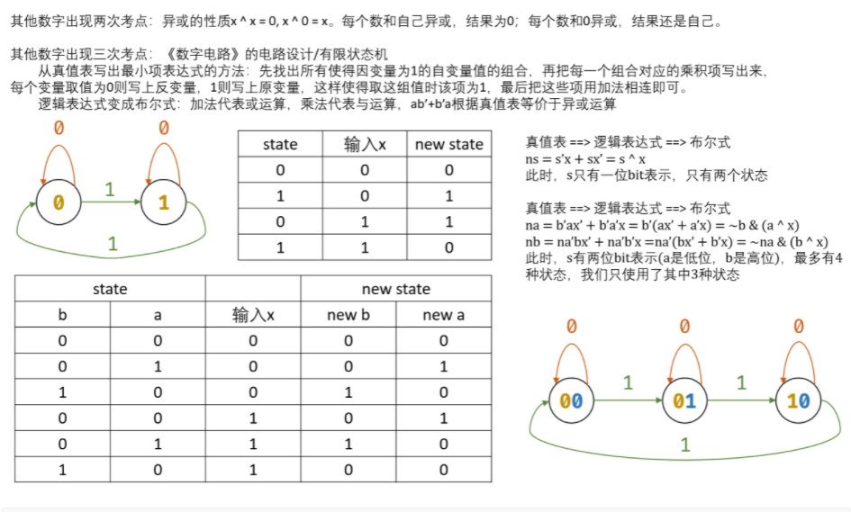

* 时间复杂度O(N)

* 空间复杂度O(1)

* ```java
  class Solution {
      public int singleNumber(int[] nums) {
          // if(nums.length == 1) return nums[0];
  
          // a=a31a30..a0, b=b31b30..b0  c=c31c30..c0【位运算结果只与单个位有关，故可直接使用一个变量来代替32个位实现状态压缩】
          // aibi表示某位的状态 有[00,01,10]三种分别表示当前位1的个数为0,1,2  ci表示当前位的数值
          // 根据输入的ci aibi进行状态转移 00->01->10->00 即当前位1的个数进行变化
          // 因为某一位最后状态一定是00或01 即出现0次或1次，其与b的对应位的表示相同 故可用最终的b来表示结果
          int a = 0, b = 0;
          for(int c : nums){
              // 状态转移方程：通过真值表 利用最小项求逻辑表达式得来
              // int temp = a;
              // a = (a & (~b) & (~c)) | (b & c & (~a));
              // b = ~temp & (b ^ c);
  
              // 对状态转移方程进行优化【主要是使用b的新结果来得到a的新结果，因为没有冲突项即每一项都能符合表达式{表上验证}】
              b = ~a & (b ^ c);
              a = ~b & (a ^ c);
          }
  
          return b;
      }
  }
  ```


### [剑指 Offer 57. 和为s的两个数字](https://leetcode-cn.com/problems/he-wei-sde-liang-ge-shu-zi-lcof/)

* 解法一：排序数组中查找想到了二分法
* 时间复杂度O(NlogN)：对每个元素找与其和为target的目标元素
* 空间复杂度O(1)

```java
class Solution {
    public int[] twoSum(int[] nums, int target) {
        if(nums == null || nums.length <= 1) return null;
        int[] result = new int[2];

        for(int i = 0; i < nums.length - 1; i++){
            int num2 = target - nums[i];
            if(num2 < 0) return new int[]{};

            result[0] = nums[i];
            // 二分查找
            int left = i + 1;
            int right = nums.length - 1;
            while(left <= right){
                int middle = ((right - left) >> 1) + left;
                if(nums[middle] == num2){
                    result[1] = num2;
                    return result;
                }else if(nums[middle] < num2){
                    left = middle + 1;
                }else{
                    right = middle - 1;
                }
            }
        }

        return  new int[]{};
    }
}
```

* 解法二：双指针法

* **若前后指针指向的值和为指定值则返回这对数，若小于指定值则前指针后移反之后指针前移。**

* 时间复杂度O(N)

* 空间复杂度O(1)

* ```java
  class Solution {
      public int[] twoSum(int[] nums, int target) {
          if(nums == null || nums.length < 2) return new int[]{};
  
          int left = 0, right = nums.length - 1;
          while(left < right){
              int sum = nums[right] + nums[left];
  
              if(sum == target){
                  return new int[]{nums[left], nums[right]};
              }else if(sum > target){
                  right--;
              }else{
                  left++;
              }
          }
          return new int[]{};
      }
  }
  ```


### [剑指 Offer 57 - II. 和为s的连续正数序列](https://leetcode-cn.com/problems/he-wei-sde-lian-xu-zheng-shu-xu-lie-lcof/)

* 暴力解法：对每个数字开始的连续序列判断是否符合

* 时间复杂度O(N^2)

* 空间复杂度O(N)

* ```java
  class Solution {
      // 暴力解法：对每个数字开始的连续序列判断是否符合 时间复杂度O(N^2)
      public int[][] findContinuousSequence(int target) {
          if(target <= 1) return new int[][]{};
          List<List<Integer>> result = new ArrayList<>();
          for(int i = 1; i <= target / 2; i++){
              List<Integer> temp = new ArrayList<>();
              int sum = i;
              temp.add(i);
  
              for(int j = i + 1; j <= target / 2 + 1; j++){
                  sum += j;
                  temp.add(j);
                  if(sum == target){
                      result.add(temp);
                      break;
                  }else if(sum > target){
                      break;
                  }
              }
          }
          
          int[][] array = new int[result.size()][];
          for(int i = 0; i < array.length; i++){
              List<Integer> temp = result.get(i);
              int[] tempArray = new int[temp.size()];
              for(int j = 0; j < tempArray.length; j++){
                  tempArray[j] = temp.get(j);
              }
              array[i] = tempArray;
          }
          return array;
      }
  }
  ```

* 滑动窗口解法

* 滑动窗口左右边界只能向右移动，且为左闭右开结构，终止条件为左右边界相等。


```java
class Solution {
    public int[][] findContinuousSequence(int target) {
        List<int[]> list = new ArrayList<>();
        int left = 1, right = 2, sum = 3;

        // 每次根据窗口内的值的和来移动左右边界
        while(left < right){
            if(sum == target){
                int[] temp = new int[right - left + 1];
                for(int i = left; i <= right; i++){
                    temp[i - left] = i;
                }
                list.add(temp);
            }

            // 左边界右移：相等即以左边界开头的连续正整数序列有了，需找下一个开头的，大于则需要减小
            if(sum >= target){
                sum -= left;
                left++;
            }else{
                // 右边界右移：增大
                right++;
                sum += right;
            }
        }

        return list.toArray(new int[0][]);
    }
}
```


### [剑指 Offer 58 - I. 翻转单词顺序](https://leetcode-cn.com/problems/fan-zhuan-dan-ci-shun-xu-lcof/)

* 解法一：双指针解法，主要是这里需要倒序遍历判断空格字符，使用两个指针记录要加入的单词的左右边界
* 时间复杂度O(N)：非严格，遍历每个字符，但是还要截取
* 空间复杂度O(N)

```java
class Solution {
    // 双指针解法：从尾部开始遍历，加入单词到中间集中，然后再将中间集加入结果集中
    public String reverseWords(String s) {
        if(s == null || s.length() == 0) return "";
        // 去除首尾空格
        s = s.trim();

        StringBuilder result = new StringBuilder();

        int index = s.length() - 1;
        while(index >= 0){
            while(index >= 0 && s.charAt(index) == ' ') index--;
            // 右边界 开
            int right = index + 1;
            while(index >= 0 && s.charAt(index) != ' '){
                index--;
            }
            // 左边界 闭
            int left = index + 1;

            // sb.reverse(); 时间复杂度太高
            result.append(s.substring(left, right) + " "); // 截取包含复制操作 时间复杂度也高

        }

        return result.toString().trim();
    }
}
```

* 解法二：api解法

* 总体时间复杂度O(N)：常数项复杂度太高 因为正则表达式较复杂

* 

* ```java
  class Solution {
      // api解法：使用分割符分割避免了空格字符的判断
      public String reverseWords(String s) {
          // 按正则表达式分割出 字符串数组
          String[] array = s.split("\\s+");
          StringBuilder result = new StringBuilder();
          for(int i = array.length - 1; i >= 0; i--){
              result.append(array[i] + " ");
          }
          return result.toString().trim();
      }
  }
  ```


* 类似解法：

* 时间复杂度O(N)：正则表达式简单

* 空间复杂度O(N)

* ```java
  class Solution {
      public String reverseWords(String s) {
          if(s == null || s.length() == 0) return "";
          String[] array = s.trim().split(" "); // 去除首尾空格后 以单个空格字符分割 如果有连续两个空格 则会分割出空字符串
  
          StringBuilder cache = new StringBuilder();
          // 从尾部开始遍历
          for(int i = array.length - 1; i > 0; i--){
              if(array[i].equals("")) continue;
              cache.append(array[i]).append(' ');
          }
          // 最后的字符串只能是空串或单词
          return cache.append(array[0]).toString();
      }
  }
  ```


### [剑指 Offer 58 - II. 左旋转字符串](https://leetcode-cn.com/problems/zuo-xuan-zhuan-zi-fu-chuan-lcof/)

* 解法一：切片法

* 时间复杂度O(N)：subString时间复杂度为O(n)【底层拷贝字符数组构建字符串对象】

* 空间复杂度O(N)：两片字符串的长度和为n

* ```java
  class Solution {
      // 切片法：将字符串分为两段
      public String reverseLeftWords(String s, int n) {
          int bits = n % s.length();
          if(bits == 0){
              return s;
          }else{
              String s1 = s.substring(0, n);
              String s2 = s.substring(n, s.length());
              return s2 + s1;
          }
      }
  }
  ```

* 解法二：遍历字符法【主要是分析出**转移前后字符的位置变换**】

* 时间复杂度O(N)

* 空间复杂度O(N)

* ```java
  class Solution {
      // 遍历字符法
      public String reverseLeftWords(String s, int n) {
          StringBuilder sb = new StringBuilder();
  
          for(int i = n; i < n + s.length(); i++){
              sb.append(s.charAt(i % s.length()));
          }
  
          return sb.toString();
      }
  }
  ```


### [剑指 Offer 59 - I. 滑动窗口的最大值](https://leetcode-cn.com/problems/hua-dong-chuang-kou-de-zui-da-zhi-lcof/)

* 单调队列实现滑动窗口

* 单调队列又由双端队列实现。。

* **单调队列易于弹出、添加元素和维护顺序的特性，使得在窗口滑动的过程便于维护最值。**

* 时间复杂度O(N)

* 空间复杂度O(K)

* ```java
  class Solution {
      // 单调队列求滑动窗口的最大值  
      // 难点在于：如何在每次窗口滑动后，将 “获取窗口内最大值” 的时间复杂度从 O(k) 降低至 O(1) 。
      public int[] maxSlidingWindow(int[] nums, int k) {
          // base
          if(nums == null || nums.length == 0 || k > nums.length) return new int[0];
          
          // 结果集
          int[] res = new int[nums.length - k + 1];
          // 使用双端队列实现单调队列【内部严格单调，队首、队尾出入队】
          Deque<Integer> queue = new LinkedList<>();
  
          // 每个元素最多出队入队一次
          for(int i = 1 - k, j = 0; j < nums.length; i++, j++){
              // 窗口后移 判断是否需要移除队首元素【i-1对应的元素只可能被移出了或是为队列首元素】
              if(i > 0 && queue.peekFirst() == nums[i - 1]) queue.removeFirst();
  
              // 一定要保证严格的递减 这样才能让 队首元素和i-1对应的元素进行关联 
              // 窗口[7,5,7,1] 若是非严格递减 则 队列：[7,1] 此时右移到[5,7,1,6] 队列变为[6] 因为7和i-1对应的7相同 被移除了
              // 而严格递减：[7,5,7,1] -[7,7]  [5,7,1,6] - [7,6]
              while(!queue.isEmpty() && queue.peekLast() < nums[j]){
                  queue.removeLast();
              }
              queue.addLast(nums[j]);
  
              if(i >= 0) res[i] = queue.peekFirst();
          }
          return res;
      }
  }
  ```

* 


### [剑指 Offer 60. n个骰子的点数](https://leetcode-cn.com/problems/nge-tou-zi-de-dian-shu-lcof/)

* 暴力超时搜索解法

* 时间复杂度O(6^n * 6)

* 空间复杂度O(n)

* ```java
  class Solution {
      private double probability;
      private Map<Integer, Double> result;
      public double[] dicesProbability(int n) {
          probability = Math.pow(1.0/6, n);
          result = new HashMap<>();
          dfs(n, 0);
          double[] array = new double[result.size()];
          int i = 0;
          for(Map.Entry<Integer,Double> entry : result.entrySet()){
              array[i++] = entry.getValue();
          }
          return array;
      }
  	
      // 深搜
      private void dfs(int n, int goal){
          if(n == 0){
              double p = result.getOrDefault(goal, 0.0);
              p += probability;
              result.put(goal, p);
              return;
          }
          for(int i = 1; i <= 6; i++){
              dfs(n-1, goal + i);
          }
      }
  }
  ```

* 动态规划解法：难点在于二维dp数组的定义，和动态转移方程边界的划分。。

* 时间复杂度O(n ^2)

* 空间复杂度O(n^2)

* ```java
  class Solution {
      // 问题可由子问题得出【n个筛子的点数之和的概率 能由 n-1个筛子的点数之和的概率得出】  
      public double[] dicesProbability(int n) {
          // 初始化dp数组 dp[i][j]: i个筛子点数之和为j的概率 f(i, j)
          double[][] dp = new double[n + 1][6 * n + 1];
  
          // 初始化
          for(int i = 1; i <= 6; i++){
              dp[1][i] = 1.0/6;
          }
  
          // 自低向上
          for(int i = 2; i <= n; i++){
              // i个筛子最小点数为i
              for(int j = i; j <= i * 6; j++){
                  int index = j;
                  // 动态转移方程  f(i, j) = 1/6f(i-1, j-1)+1/6f(i-1, j-2)+..+1/6f(i-1, j-t)    j-6<=j-t< j && j-t>=1 
                  // 主要是注意边界处理...
                  while(index > 1 && index > j - 6){
                      dp[i][j] += dp[i - 1][--index] * 1.0 / 6; 
                  }
              }
          }
  
          // 复制数组 因为最小点数为n
         return Arrays.copyOfRange(dp[n], n, dp[n].length);
      }
  }
  ```

* 


### [剑指 Offer 61. 扑克牌中的顺子](https://leetcode-cn.com/problems/bu-ke-pai-zhong-de-shun-zi-lcof/)

* 解法一：集合Set判重+遍历获取最大、最小值判断是否连续

* 主要是找出 非0最大值-非0最小值 < 5 的条件可得出牌连续

* **因为 只有5张牌，只有【非0】最小值和最大值相差小于5时且没有相同数值的情况下，才能构成连续。相差的数值可由0或非0补，5张牌中小于最小值的可有0补**

* 时间复杂度O(N)：

* 空间复杂度O(N)：集合装填元素

* ```java
  class Solution {
      // Set判重，验证最大最小值间隔个数来判断
      public boolean isStraight(int[] nums) {
          Set<Integer> repeat = new HashSet<>();
  
          // 记录最小值、最大值
          int min = 14, max = -1;
  
          for(int num : nums){
              // 0可做任何数 直接跳过
              if(num == 0) continue;
              // 含有相等的非0数 必定不连续
              if(repeat.contains(num)) return false;
              else{
                  min = Math.min(num, min);
                  max = Math.max(num, max);
                  repeat.add(num);
              }
          }
  
          return max - min < 5;
      }
  }
  ```

* 


### [剑指 Offer 62. 圆圈中最后剩下的数字](https://leetcode-cn.com/problems/yuan-quan-zhong-zui-hou-sheng-xia-de-shu-zi-lcof/)

* 超时解法

* 时间复杂度O(n^2)

* 空间复杂度O(n)

* ```java
  class Solution {
      // 暴力模拟解法：超时，主要难点在于模拟出 下一个删除元素的位置或数值
      public int lastRemaining(int n, int m) {
          if(n == 1) return 0;
  
          Set<Integer> exists = new HashSet<>();
          
          // 记录下一个删除的数
          int value = 0;
          // 终止条件 删除了n-1个数，最后的value即为剩下的数
          while(exists.size() != n - 1){
              // 移动的步数 为m-1
              int total = m - 1;
              // 移动 m-1步 【注意取模】
              while(total > 0){
                  int temp = (value + 1) % n;
                  while(exists.contains(temp)){
                      temp = (temp + 1) % n;
                  }
                  value = temp;
                  total--;
              }
              // 删除该数 o(1)
              exists.add(value);
  
              // 前移1步 这样后续只需移动 m-1步
              int temp = (value + 1) % n;
              while(exists.contains(temp)){
                  temp = (temp + 1) % n;
              }
              value = temp;
          }
  
          return value;
      }
  }
  ```

* 同样的暴力解法：时间复杂度相对低点

* ```java
  class Solution {
      public int lastRemaining(int n, int m) {
          List<Integer> list = new ArrayList<>();
  
          for(int i = 0; i < n; i++){
              list.add(i);
          }
  
          
          int idx = 0;
          while(n > 1){
              // 下一个待删除元素的位置 同时规避了边界处理【重点：删除后元素会前移，故-1】
              idx = (idx + m - 1) % n;
              list.remove(idx); // O(N)
              n--; // 剩余元素数量减1
          }
  
          return list.get(0);
      }
  }
  ```

* 其实是个经典约瑟夫环问题

* 时间复杂度O(N)

* 空间复杂度O(1)

* ```java
  class Solution {
      // 约瑟夫环问题：自低向上转移胜利者位置 得出其实胜利者的位置 【重点在于推出位置的转移】只关心最终活着那个人的序号变化
      // 约瑟夫环递归式：
      // f(n, m): n个人每次间隔m个人排除，最终胜利者的下标
      // f(n, m) = (f(n-1,m)+m)%n // 下标右移
      public int lastRemaining(int n, int m) {
          if(n < 2) return 0;
          int pos = 0; // 最后胜利者的坐标
  
          for(int i = 2; i <= n; i++){
              // 状态转移方程：坐标右移即可
              pos = (pos + m) % i;
          }
          return pos;
      }
  }
  ```

* todo 完全理解https://leetcode-cn.com/problems/yuan-quan-zhong-zui-hou-sheng-xia-de-shu-zi-lcof/


### [剑指 Offer 63. 股票的最大利润](https://leetcode-cn.com/problems/gu-piao-de-zui-da-li-run-lcof/)

* 经典动态规划题目。。

* 时间复杂度O(N)

* 空间复杂度O(1)

* ```java
  class Solution {
      // 动态规划解法，包含重复子问题：第i天能获得的最大利润 
      public int maxProfit(int[] prices) {
          if(prices == null || prices.length <= 1) return 0;
  
          // dp[i]: 到第i+1天能获得的最大利润
          // int[] dp = new int[prices.length];
          // 记录最低股票价格 【当前第i+1天，该数为前i天中的最低价格】
          int min = prices[0];
          // dp[0] = 0;
  
          // 当前状态只与前一天状态有关 故可进行空间优化
          int profit = 0;
  
          for(int i = 1; i < prices.length; i++){
              // 状态转移方程
              // dp[i] = (prices[i] - min) > dp[i - 1] ? (prices[i] - min) : dp[i - 1];
              profit = (prices[i] - min) > profit ? (prices[i] - min) : profit;
              min = Math.min(prices[i], min);
          }
  
          return profit;
      }
  }
  ```


### [剑指 Offer 64. 求1+2+…+n](https://leetcode-cn.com/problems/qiu-12n-lcof/)

* 条件判断语句 可通过逻辑运算符的**短路**特性来实现

* ```java
  class Solution {
      int res = 0;
  
      //F(n)
      public int sumNums(int n) {
          // if(n == 1) return 1; // 不能用if进行条件判断 则考虑使用逻辑运算符的短路特性来判断
  
          // 判断是否需要执行 子递归 如果执行了 res将为F(n-1)
          boolean temp = n > 1 && sumNums(n - 1) > 0;
  
          res += n;
  
          return res;
  
      }
  }
  ```

* 时间复杂度O(N)

* 空间复杂度O(N)


### [剑指 Offer 65. 不用加减乘除做加法](https://leetcode-cn.com/problems/bu-yong-jia-jian-cheng-chu-zuo-jia-fa-lcof/)

* 位运算模拟加法

* 这题位运算还是背下来吧，毕竟位运算这种模拟加法用法基本就这题，很容易就忘掉。。。。。

  ^ 亦或 ----相当于 无进位的求和， 想象10进制下的模拟情况：（如:19+1=20；无进位求和就是10，而非20；因为它不管进位情况）

  & 与 ----相当于求每位的进位数， 先看定义：1&1=1；1&0=0；0&0=0；即都为1的时候才为1，正好可以模拟进位数的情况,还是想象10进制下模拟情况：（9+1=10，如果是用&的思路来处理，则9+1得到的进位数为1，而不是10，所以要用<<1向左再移动一位，这样就变为10了）；

  这样公式就是：（a^b) ^ ((a&b)<<1) 即：每次无进位求 + 每次得到的进位数--------我们需要不断重复这个过程，直到进位数为0为止；

* 时间复杂度O(1)：最多32层递归，位数只有32位，且左移低位补零

* 空间复杂度O(1)：最多32层递归

* ```java
  class Solution {
      public int add(int a, int b) {
          // 无进位加法：异或
          int temp1 = a ^ b;
          // 加法的进位：与
          int temp2 = (a & b) << 1;
  
          // base case 无进位直接返回
          if(temp2 == 0) return temp1;
  
          // 可能还有进位情况 继续递归
          return add(temp1, temp2);
      }
  }
  ```

* 

### [剑指 Offer 66. 构建乘积数组](https://leetcode-cn.com/problems/gou-jian-cheng-ji-shu-zu-lcof/)

* 动态规划解法：重点在于发现出具有问题的解可由子问题的解推出，并找到动态转移方程

* 时间复杂度O(N)

* 空间复杂度O(N)

* ```java
  class Solution {
      // 动态规划解法：左dp数组和右dp数组分别统计 下标i两边的元素的积 然后再相乘
      public int[] constructArr(int[] a) {
          if(a == null || a.length <= 1) return new int[]{};
  
          int len = a.length;
          int[] left = new int[len];
          int[] right = new int[len];
  
          left[0] = right[len - 1] = 1;
  		
          // 统计左数组
          for(int i = 1; i < len; i++){
              left[i] = left[i - 1] * a[i - 1];
          }
  		
          // 统计右数组
          for(int i = len - 2; i >= 0; i--){
              right[i] = right[i + 1] * a[i + 1];
          }
  
          int[] result = new int[len];
          for(int i = 0; i < len; i++){
              result[i] = left[i] * right[i];
          }
  
          return result;
      }
  }
  ```


### [剑指 Offer 67. 把字符串转换成整数](https://leetcode-cn.com/problems/ba-zi-fu-chuan-zhuan-huan-cheng-zheng-shu-lcof/)

* 模拟字符串转换。。重点在于根据题目描述模拟对应操作和考虑到可种case

* 时间复杂度O(n)

* 空间复杂度O(1)

* ```java
  class Solution {
      // 模拟：需根据题目进行相应模拟，并考虑各种情况
      public int strToInt(String s) {
          s = s.trim();
          if(s.equals("")) return 0;
  
          // 得出数字正负 并判断是否有必要截取出正负号 
          boolean plus = true;
          if(s.charAt(0) == '-' || s.charAt(0) == '+'){
              plus = (s.charAt(0) != '-');
              s = s.substring(1, s.length());
          }
          
          // 存储数字结果 为了便于判断中间结果是否溢出 选择long类型
          long sum = 0;
          // 遍历每个数字
          for(char chr : s.toCharArray()){
              if(chr >= '0' && chr <= '9'){
                  sum *= 10;
                  sum += chr - '0';
              }else{
                  break;
              }
  
              // 溢出判断 不是通过最终结果判断的原因：最终结果可能溢出long类型，故选择判断中间结果
              if(sum >= Integer.MAX_VALUE){
                  // 正负数 对应不同处理【边界不同】
                  if(plus) return Integer.MAX_VALUE;
                  else{
                      if(sum > Integer.MAX_VALUE) return Integer.MIN_VALUE;
                      else return -1 * Integer.MAX_VALUE;
                  }
              }
          }
          
          // 无溢出 直接向下转型
          return plus ? (int)sum : (int)(-1 * sum);
      }
  }
  ```

  

### [剑指 Offer 68 - I. 二叉搜索树的最近公共祖先](https://leetcode-cn.com/problems/er-cha-sou-suo-shu-de-zui-jin-gong-gong-zu-xian-lcof/)

* 根据二叉搜索树的性质和最近公共祖先的定义推导出递归路径

* 时间复杂度O(N)

* 空间复杂度O(N)

* ```java
  /**
   * Definition for a binary tree node.
   * public class TreeNode {
   *     int val;
   *     TreeNode left;
   *     TreeNode right;
   *     TreeNode(int x) { val = x; }
   * }
   */
  class Solution {
      // 函数定义：在以root为根的树中，找出结点p和结点q的最近公共祖先
      // 最近公共祖先：p、q分别位于该祖先结点的左右子树结点集中
      // 递归实现：
      public TreeNode lowestCommonAncestor(TreeNode root, TreeNode p, TreeNode q) {
          // 最近祖先在左子树
          if(p.val < root.val && q.val < root.val) return lowestCommonAncestor(root.left, p, q);
  
          // 最近祖先在右子树
          if(p.val > root.val && q.val > root.val) return lowestCommonAncestor(root.right, p, q);
  
          // 当前祖先即最近祖先 两节点分散开来了
          return root;
      }
  }
  ```


### [剑指 Offer 68 - II. 二叉树的最近公共祖先](https://leetcode-cn.com/problems/er-cha-shu-de-zui-jin-gong-gong-zu-xian-lcof/)

* 递归实现：dfs且从底部往上层传递祖先

* 时间复杂度O(N)：p和q分别位于左右两端，这时需要遍历所有结点

* 空间复杂度O(N)：树为链表时

* ```java
  /**
   * Definition for a binary tree node.
   * public class TreeNode {
   *     int val;
   *     TreeNode left;
   *     TreeNode right;
   *     TreeNode(int x) { val = x; }
   * }
   */
  class Solution {
      // 函数定义：返回在root为根节点的左右子树上 p和q的最近公共祖先
      // dfs：从底部往上层传递祖先
      // 规定：1. 若树里面存在p，也存在q，则返回他们的公共祖先。
      // 2. 若树里面只存在p，或只存在q，则返回存在的那一个。
      // 3. 若树里面既不存在p，也不存在q，则返回null。
      public TreeNode lowestCommonAncestor(TreeNode root, TreeNode p, TreeNode q) {
          if(root == null || root == p || root == q) return root;
  
          TreeNode left = lowestCommonAncestor(root.left, p, q);
          TreeNode right = lowestCommonAncestor(root.right, p, q);
  
          if(left == null && right == null) return null;
          if(left != null && right != null) return root;
          return left == null ? right : left;
      }
  }
  ```


### **BM45** **滑动窗口的最大值**

* 解法一：优先队列解法，题目要求找出窗口内的最大值，故想到大顶堆，窗口移动时需排除左侧元素且元素值可能相同，故堆中元素需包含下标索引进行比较。

  ```c++
  class Solution {
  public:
      vector<int> maxInWindows(const vector<int>& num, unsigned int size) {
          vector<int> res;
          if(size == 0 || num.size() < size) return res;
          // 默认大顶堆【记录索引是为了后续找出在新的左边界左侧的数】
          priority_queue<pair<int,int>> pq;
          for(int i = 0; i < size; i++){
              // 传参给pair的构造函数进行构造
              pq.emplace(num[i], i);
          }
          res.push_back(pq.top().first);
  
          for(int i = size; i < num.size(); i++){
              pq.emplace(num[i], i);
              // 新的左边界
              int start = i - size + 1;
              // 排除掉位于新的左边界左侧的数的最大值【只能保证最大值在窗口内】
              while(pq.top().second < start){
                  pq.pop();
              }
              // 当前窗口的最大值
              res.push_back(pq.top().first);
          }
          return res;
      }
  };
  ```

  * 时间复杂度O(nlogN)：每个元素被放入一次，最多被弹出一次，放入和弹出优先队列一个元素的时间复杂度都为O(logN)，一共N个元素
  * 空间复杂度O(n)：最坏情况是数组单调递增时，优先队列一共有n个元素

* 解法二：维护一个元素值单调递减，元素下标递增的队列，队列内元素为对应窗口中的元素，队列大小不大于窗口大小。

  * ```c++
    class Solution {
    public:
        vector<int> maxInWindows(const vector<int>& num, unsigned int size) {
            vector<int> res;
            if(size == 0 || num.size() < size) return res;
            deque<int> dq;
            // 数据初始化
            for(int i = 0; i < size; i++){
                // 保证队列元素递减【加入顺序保证了后面的下标更大】
                while(!dq.empty() && num[dq.back()] < num[i]){
                    dq.pop_back();
                }
                dq.push_back(i);
            }
    
            res.push_back(num[dq.front()]);
    
            for(int i = size; i < num.size(); i++){
                 while(!dq.empty() && num[dq.back()] < num[i]){
                    dq.pop_back();
                }
                dq.push_back(i);
    
                // 移除新窗口左侧元素
                int start = i - size + 1;
                while(!dq.empty() && dq.front() < start){
                    dq.pop_front();
                }
                res.push_back(num[dq.front()]);
            }
            return res;
        }
    };
    ```

    * 时间复杂度O(n)：每个元素被放入一次，至多被弹出一次，每次操作为O(1)
    * 空间复杂度O(k)：左侧元素弹出保证了队列大小不大于k


## 二分法

* 一般的边界分析死循环问题：区间只有两个元素时【由区间变换不是middle+-1引起】
* 返回值的选择：通过模拟区间只剩一个元素时进行
* 重复数问题：分是否完全有序进行处理
  * 完全有序：合并搜索区间
  * 不完全有序：为了能够判断左区间是否有序，left前移。
* https://leetcode-cn.com/problems/find-minimum-in-rotated-sorted-array/solution/yi-wen-dai-ni-gao-ding-er-fen-cha-zhao-j-00kj/

### 完全有序

* 题目常给出一个有序数组，根据是否有重复数字来查找某个目标数的某种位置

* 存在重复数问题：合并区间进行将找数上下边界转为找【最后一个小于和第一个大于】

  * 上边界：等于target时左区间可能还有，故找左区间。最终的right为上边界的前一位，left为上边界，left也相当于不存在时的插入位置，而right相当于最后一个小于target的数的位置，但right可能越界。【终止时left = right+1】

    查找的最后区间一定是在target的左边。

  * 下边界：等于target时右区间可能还有，故找右区间。最终的left为下边界的下一位，right为下边界，left相当于第一个大于target的数的位置，其也可能越界，也相当于插入位置。

    查找的最后区间一定是在target的右边。

#### **NC160** **二分查找-I**

* **有序不重复**的数组中查找target的出现位置

* 直接二分模板套上

* ```java
  import java.util.*;
  
  
  public class Solution {
      /**
       * 代码中的类名、方法名、参数名已经指定，请勿修改，直接返回方法规定的值即可
       *
       * 
       * @param nums int整型一维数组 
       * @param target int整型 
       * @return int整型
       */
      public int search (int[] nums, int target) {
          // write code here
          if(nums == null || nums.length == 0) return -1;
          int left = 0;
          int right = nums.length - 1;
          
          while(left <= right){
              int middle = left + ((right - left) >> 1);
              if(nums[middle] == target){
                  return middle;
              }else if(nums[middle] > target){
                  right = middle - 1;
              }else{
                  left = middle + 1;
              }
          }
          
          return -1;
      }
  }
  ```


#### [35. 搜索插入位置](https://leetcode-cn.com/problems/search-insert-position/)

* **有序无重复**的数查找目标数，目标数不存在时返回插入位置

* 不存在时第一个大于目标数的位置即为插入位置

* ```java
  class Solution {
      public int searchInsert(int[] nums, int target) {
          if(nums == null || nums.length == 0) return -1;
          int left = 0;
          int right = nums.length - 1;
          
          while(left <= right){
              int middle = left + ((right - left) >> 1);
              if(nums[middle] == target){
                  return middle;
              }else if(nums[middle] > target){
                  // 找不到的情况：此时left=middle=right right-1位置的数小于target 所以left为第一个比target大的元素的位置
                  right = middle - 1;
              }else{
                  // 找不到的情况：此时left=middle=right left+1位置的数大于target 所以left+1为第一个比target大的元素的位置
                  left = middle + 1;
              }
          }
          
          // 如果找不到目标数 时left即指向第一个比target大的元素位置
          return left;
      }
  }
  ```

* 


#### **NC105** **二分查找-II**【数的上边界】

* 有序**含有重复元素**的数组中查找target的第一个出现位置

* 将中间数大于等于target的情况进行合并，都移动到左区间【因为等于target时前面可能还有数】

* ```java
  import java.util.*;
  
  
  public class Solution {
      /**
       * 代码中的类名、方法名、参数名已经指定，请勿修改，直接返回方法规定的值即可
       *
       * 如果目标值存在返回下标，否则返回 -1
       * @param nums int整型一维数组 
       * @param target int整型 
       * @return int整型
       */
      public int search (int[] nums, int target) {
          // write code here
          if(nums == null || nums.length == 0) return -1;
          int left = 0;
          int right = nums.length - 1;
          
          while(left <= right){
              int middle = left + ((right - left) >> 1);
              if(nums[middle] >= target){ // 将大于等于合并处理 
                  right = middle - 1;
              }else{
                  left = middle + 1;
              }
              
              // 最后 left = middle = right 后无论怎样移动，right都会指向最后一个小于target的数的位置【可能越界】 而left=right+1其可能为目标数也可能越界
          }
          if(left >= nums.length) return -1;
          return nums[left] == target ? left : -1;
      }
  }
  ```

#### 数的下边界

* 将中间数小于等于target的情况进行合并，都移动到右区间【因为等于target时后面可能还有数】

* ```java
  import java.util.*;
  
  
  public class Solution {
      /**
       * 代码中的类名、方法名、参数名已经指定，请勿修改，直接返回方法规定的值即可
       *
       * 如果目标值存在返回下标，否则返回 -1
       * @param nums int整型一维数组 
       * @param target int整型 
       * @return int整型
       */
      public int search (int[] nums, int target) {
          // write code here
          if(nums == null || nums.length == 0) return -1;
          int left = 0;
          int right = nums.length - 1;
          
          while(left <= right){
              int middle = left + ((right - left) >> 1);
              if(nums[middle] > target){ 
                  right = middle - 1;
              }else{ // 将小于等于合并处理 
                  left = middle + 1;
              }
              
              // 最后 left = middle = right 后无论怎样移动，left都会指向第一个大于target的数的位置【可能越界，因为不存在该数】 而right=left-1其可能为目标数也可能越界
             
          }
          if(right < 0) return -1;
          return nums[right] == target ? right : -1;
      }
  }
  ```

  

#### **NC74** **数字在升序数组中出现的次数**

* 找到目标数的上下界即可。

* ```java
  public class Solution {
      public int GetNumberOfK(int [] array , int k) {
          if(array == null || array.length == 0) return 0;
         // 统计数字在数组中的上边界和下边界
          int left = getLeft(array, k);
          int right = getRight(array, k);
          if(left == -1 || right == -1) return 0;
          else{
              return right - left + 1;
          }
      }
      
      private int getLeft(int[] nums, int target){
          int left = 0;
          int right = nums.length - 1;
          while(left <= right){
              int middle = left + ((right - left) >> 1);
              if(nums[middle] >= target){
                  right = middle - 1;
              }else{
                  left = middle + 1;
              }
          }
          if(left >= nums.length) return -1;
          return nums[left] == target ? left : -1;
      }
      
      private int getRight(int[] nums, int target){
          int left = 0;
          int right = nums.length - 1;
          while(left <= right){
              int middle = left + ((right - left) >> 1);
              if(nums[middle] > target){
                  right = middle - 1;
              }else{
                  left = middle + 1;
              }
          }
          
          if(right < 0) return -1;
          return nums[right] == target ? right : -1;
      }
  }
  ```

* 

#### 找出第一个大于目标元素的索引

* 相当于寻找下边界

* 因为left指向了第一个大于目标元素的索引，故需对最后的left进行判断

* ```java
      public int search (int[] nums, int target) {
          // write code here
          if(nums == null || nums.length == 0) return -1;
          int left = 0;
          int right = nums.length - 1;
          
          while(left <= right){
              int middle = left + ((right - left) >> 1);
              if(nums[middle] > target){ 
                  right = middle - 1;
              }else{ // 将小于等于合并处理 
                  left = middle + 1;
              }
          }
          // 这里right+1即left指向第一个大于target的数的位置
          // 所有数都小于等于target
          if(right + 1 >= nums.length) return -1;
          // 存在大于target的数
          return right + 1;
      }
  ```


#### **找出最后一个小于目标元素的索引**

* 类似上题，用目标数的上边界解决

* ```java
      public int search (int[] nums, int target) {
          // write code here
          if(nums == null || nums.length == 0) return -1;
          int left = 0;
          int right = nums.length - 1;
          
          while(left <= right){
              int middle = left + ((right - left) >> 1);
              if(nums[middle] >= target){ // 大于等于合并处理
                  right = middle - 1;
              }else{ 
                  left = middle + 1;
              }
          }
          // 这里left-1即right指向最后一个小于target的数的位置
          // 所有数都大于等于target
          if(left - 1 < 0) return -1;
          // 存在小于target的数
          return left - 1;
      }
  ```


### 不完全有序

* 一般为有序数组翻转k次后，在翻转完的数组对目标数的某种位置进行查找
* 翻转后的数组可以理解成两个有序数组，且第二个数组的最大值小于第一的最小值，故middle对区间切分出的左右区间一定至少有一个是有序的。
* 对翻转数组的二分一般是先设法找到左右哪个半间是有序的，先判断左半间是否有序，左半间有序则根据有序的性质进行判断目标数是否在左半间并调整对应搜索区间，如果含有重复数则需要判断nums[left]是否等于nums[middle]【和先判断左区间挂钩】，因为==的情况不能判断左右半间哪个有序，需要让left++。
  * 最大最小的处理：判断总体区间是否有序来获取最值。
  * 最大最小含重复的处理：还是类似的【同样划分出单调区间根据情况判断最值能在哪个区间即可，需要注意区间的选择是middle 还是middle+-1】。
  * 对于最大最小值的查找：最小值时由于有总体区间是否升序的判断故不会有死循环的问题。而最大值时则可能出现死循环问题，故当right=left+1时需要进行判断如[2,1]


#### [33. 搜索旋转排序数组](https://leetcode-cn.com/problems/search-in-rotated-sorted-array/)

* 在不含重复值情况下，搜索翻转数组中数值为target的位置

* 每次判断左右半区间哪个属于有序的，再对有序部分进行判断目标数是否在这个有序半段即可。

* ```java
      public int search (int[] nums, int target) {
          // write code here
          if(nums == null || nums.length == 0) return -1;
          int left = 0;
          int right = nums.length - 1;
          
          while(left <= right){
              int middle = left + ((right - left) >> 1);
              if(nums[middle] == target){
                  return middle;
              }else if(nums[middle] > nums[left] || left == middle){ // 左半区间有序 [left,middle)
                  if(target >= nums[left] && target < nums[middle]){ // 目标在左半区间的情况
                      right = middle - 1;
                  }else{
                      left = middle + 1;
                  }
              }else{ // 右半区间有序(middle,right]
                  if(target > nums[middle] && target <= nums[right]){ // 目标在右半区间的情况
                      left = middle + 1;
                  }else{
                      right = middle - 1;
                  }
              }
          }
          
          return -1;
      }
  ```

  

#### [81. 搜索旋转排序数组 II](https://leetcode-cn.com/problems/search-in-rotated-sorted-array-ii/)

* 在含有重复数字的翻转数组中寻找目标数

* 时间复杂度O(n)：翻转数组中的数都相同时

* ```java
  class Solution {
      public boolean search(int[] nums, int target) {
          if(nums == null || nums.length == 0) return false;
  
          int left = 0;
          int right = nums.length - 1;
  
          while(left <= right){
              int middle = left + ((right - left) >> 1);
              if(nums[middle] == target){
                  return true;
              }else if(nums[middle] == nums[left] && left != middle){ // 为了区分左右半区间哪个有序，而引入 【因为middle总是可以分出一个有序的区间，且相等时无法判断哪个半区间有序】
                  left++;
              }else if(nums[middle] > nums[left] || left == middle){ //左半部分有序
                  if(target >= nums[left] && target < nums[middle]){
                      right = middle - 1;
                  }else{
                      left = middle + 1;
                  }
              }else{ // 右半部分有序
                  if(target > nums[middle] && target <= nums[right]){
                      left = middle + 1;
                  }else{
                      right = middle - 1;
                  }
              }
          }
  
          return false;
      }
  }
  ```

* 

#### [153. 寻找旋转排序数组中的最小值](https://leetcode-cn.com/problems/find-minimum-in-rotated-sorted-array/)

* 无重复数字翻转数组中寻找：最主要还是区分左右半区间哪个有序，然后判断最小数在左右哪个半区

* ```java
  class Solution {
      public int findMin(int[] nums) {
          if(nums == null || nums.length == 0) return -1;
          int left = 0; 
          int right = nums.length - 1;
          
          while(left <= right){
              if(nums[left] < nums[right] || left == right){ // 目标数所在区间有序或只剩一个元素
                  return nums[left];
              }
              int middle = left + ((right - left) >> 1);
              
              if(nums[left] < nums[middle] || left == middle){ // 左半区间有序【一个元素时也算】 但总体区间无序
                  // 右半区间可能有序 也可能无序 但最小值一定在右半区间
                  left = middle + 1;
              }else{ // 右半区间有序  (middle, right]不可能为最小值范围
                  right = middle;
              }
          }
          
          return -1;
      }
  }
  ```


#### 寻找旋转排序数组中的最小值 II

* 数组中可能含有重复元素，为了区分左右半区哪个有序，还是要left++

* ```java
  import java.util.ArrayList;
  public class Solution {
      public int minNumberInRotateArray(int [] nums) {
          if(nums == null || nums.length == 0) return -1;
          int left = 0; 
          int right = nums.length - 1;
          
          while(left <= right){
              if(nums[left] < nums[right] || left == right){ // 目标数所在区间有序或只剩一个元素
                  return nums[left];
              }
              int middle = left + ((right - left) >> 1);
              if(nums[left] == nums[middle]){ // 便于区分左右区间哪个有序
                  left++;
                  continue;
              }
              if(nums[left] < nums[middle] || left == middle){ // 左半区间有序【一个元素时也算】 但总体区间无序
                  // 右半区间可能有序 也可能无序 但最小值一定在右半区间
                  left = middle + 1;
              }else{ // 右半区间有序  (middle, right]不可能为最小值范围
                  right = middle;
              }
          }
          
          return -1;
      }
  }
  ```


#### 寻找旋转排序数组中的最大值

* 在不含重复值的翻转数组中寻找最大值

* ```java
  import java.util.ArrayList;
  public class Solution {
      public int minNumberInRotateArray(int [] nums) {
          if(nums == null || nums.length == 0) return -1;
          int left = 0; 
          int right = nums.length - 1;
          
          while(left <= right){
              if(nums[left] < nums[right] || left == right){ // 目标数所在区间整体有序或只剩一个元素
                  return nums[right];
              }
              int middle = left + ((right - left) >> 1);
              if(nums[left] < nums[middle] || left == middle){ // 左半区间有序【一个元素时也算】 但总体区间无序
                  // 右半区间可能有序 也可能无序 但最大值一定在右半区间[middle, right)
                  left = middle;
                  if(right == left + 1){
                      return Math.max(nums[right],nums[left]);
                  }
              }else{ // 右半区间有序  最大值一定在左半区间
                  right = middle - 1;
              }
          }
          
          return -1;
      }
  }
  ```

  


#### 寻找旋转排序数组中的最大值 II

* 在含有重复值的翻转数组中寻找最大值

* ```java
  import java.util.ArrayList;
  public class Solution {
      public int minNumberInRotateArray(int [] nums) {
          if(nums == null || nums.length == 0) return -1;
          int left = 0; 
          int right = nums.length - 1;
          
          while(left <= right){
              if(nums[left] < nums[right] || left == right){ // 目标数所在区间有序或只剩一个元素
                  return nums[right];
              }
              int middle = left + ((right - left) >> 1);
              if(nums[left] == nums[middle] && left != middle){ // 便于区分左右区间哪个有序
                  left++;
                  continue;
              }
              if(nums[left] < nums[middle] || left == middle){ // 左半区间有序【一个元素时也算】 但总体区间无序
                  // 右半区间可能有序 也可能无序 但最大值一定在右半区间[middle, right)
                  left = middle;
                  // 避免死循环情况
                  if(right == left + 1){
                      return Math.max(nums[right],nums[left]);
                  }
              }else{ // 右半区间有序  最大值一定在左半区间
                  right = middle - 1;
              }
          }
          
          return -1;
      }
  }
  ```

* 


## 设计

#### **BM101** **设计LFU缓存结构**

- 设计含key、value、times【频次】的节点，并重载<操作符用于后续对节点使用频次排序
- 基于红黑树的multiset存储节点，其允许频次相同，其能保证频次相同的早插入的排前面
- 基于哈希表的unordered_map存储key和对应节点在multiset中的位置，便于后续查找以及删除

```c++
#include <functional>
#include <queue>
#include <unordered_map>
#include <vector>
class Node{
    public:
    int key;
    int value;
    int times;
    Node(int k, int v, int t):key(k), value(v), times(t){}
    // operator<必须被重载为const类型
    bool operator<(const Node& b) const{
        return this->times < b.times;
    }
};

multiset<Node> s; // 允许关键值相同的红黑树
unordered_map<int, set<Node>::iterator> cache; // 记录key和对象迭代器位置 方便删除

void setKey(int key, int value, int k){
    if(cache.find(key) != cache.end()){ // 存在key
        auto iter = cache[key];
        Node node(key, value, iter->times + 1);
        s.erase(iter);
        auto posi = s.insert(node);
        cache[key] = posi; /// 记录迭代器
    }else{ // 不存在key
        if(cache.size() == k){ // 空间已满
            auto posi = s.begin();
            cache.erase(posi->key);
            s.erase(posi);
            Node node(key, value, 1);
            auto newPosi = s.insert(node);
            cache[key] = newPosi;
        }else{
            // 空间未满
            Node node(key, value, 1);
            auto posi = s.insert(node);
            cache[key] = posi;
        }
    }
    
}

int getKey(int key){
    if(cache.find(key) != cache.end()){
        auto iter = cache[key];
        Node node(key, iter->value, iter->times + 1);
        s.erase(iter);
        auto posi = s.insert(node);
        cache[key] = posi; /// 记录迭代器
        return node.value;
    }else{
        return -1;
    }
}

class Solution {
public:
    /**
     * lfu design
     * @param operators int整型vector<vector<>> ops
     * @param k int整型 the k
     * @return int整型vector
     */
    vector<int> LFU(vector<vector<int> >& operators, int k) {
        // write code here
        vector<int> res;
        for(auto& v : operators){
            if(v[0] == 1){ // set
                setKey(v[1], v[2], k);
            }else{ // get
                res.emplace_back(getKey(v[1]));
            }
        }

        return res;
    }
};
```


#### [284. 顶端迭代器](https://leetcode-cn.com/problems/peeking-iterator/)

* 直接利用容器存储元素，在利用索引进行访问。该做法没有利用到迭代器的性质

```java
// Java Iterator interface reference:
// https://docs.oracle.com/javase/8/docs/api/java/util/Iterator.html

class PeekingIterator implements Iterator<Integer> {
    // 下一个元素的位置
    int index;
    // 存储元素的容器
    List<Integer> list;
	public PeekingIterator(Iterator<Integer> iterator) {
	    // initialize any member here.
        list = new ArrayList<>();
	    while(iterator.hasNext()){
            list.add(iterator.next());
        }
	}
	
    // Returns the next element in the iteration without advancing the iterator.
	public Integer peek() {
        return list.get(index);
	}
	
	// hasNext() and next() should behave the same as in the Iterator interface.
	// Override them if needed.
	@Override
	public Integer next() {
	    return list.get(index++);
	}
	
	@Override
	public boolean hasNext() {
	    return index<list.size()?true:false;
	}
}
```

* 利用迭代器的性质实现顶端迭代器的操作。

```java

// 可以让操作提前一步进行，事先调用一次 next() 并使用该变量 next 存起该元素，通过外部调用 peek() 还是 next() 来决定是否要更新 next；同时由于我们事先存起了下一访问位置的元素，我们可以通过判断 next 是否为 null 来得知是否到达迭代器结尾（hasNext() 实现）。
class PeekingIterator implements Iterator<Integer> {
    // 内部的迭代器
    private Iterator<Integer> iterator;
    // 存储下一访问位置的元素
    private Integer next;
    
	public PeekingIterator(Iterator<Integer> iterator) {
	    // initialize any member here.
        this.iterator = iterator;
	    this.next = iterator.next();
	}
	
    // Returns the next element in the iteration without advancing the iterator.
	public Integer peek() {
        return next;
	}
	
	// hasNext() and next() should behave the same as in the Iterator interface.
	// Override them if needed.
	@Override
	public Integer next() {
	    Integer temp = next;
        next = iterator.hasNext()?iterator.next():null;
        return temp;
	}
	
	@Override
	public boolean hasNext() {
	    return next == null ? false : true;
	}
}
```


#### [352. 将数据流变为多个不相交区间](https://leetcode-cn.com/problems/data-stream-as-disjoint-intervals/)

```java
// 暴力解法：HashSet维持数字序列中数字的不可重复性
// 获取不相交区间时 先对数字序列进行排序，然后分别根据不同条件构建出区间对
// 因为不知道区间的总数 所以构建过程中先将区间对放到哈希表中，这个过程同时记录区间个数，构建完区间对后再将哈希表中的区间对存储到数组中
class SummaryRanges {
    Set<Integer> set;
    public SummaryRanges() {
        set = new HashSet<>();
    }
    
    public void addNum(int val) {
        set.add(val);
    }
    
    public int[][] getIntervals() {
        List<Integer> list = new ArrayList<>(set);
        Collections.sort(list);
        // 记录区间的第一个数
        int firstNum = -1;
        // 记录区间的第二个数
        int secondNum = -1;
        // 记录区间的总数
        int total = 0;
        Map<Integer,int[]> map = new HashMap<>();

        for(int i=0;i<list.size();i++){
            // 区间对第一个数可以确定地条件
            if(firstNum == -1){
                firstNum = list.get(i);
            }
            // 区间对第二个数可以确定的条件
            if(i+1>=list.size() || list.get(i)+1 != list.get(i+1)){
                secondNum = list.get(i);
                map.put(total,new int[]{firstNum,secondNum});
                firstNum = -1; 
                total++;
            }
        }
        int[][] res = new int[total][2];
        for(int i = 0; i<total;i++){
            res[i] = map.get(i);
        }
        return res;
    }
}

/**
 * Your SummaryRanges object will be instantiated and called as such:
 * SummaryRanges obj = new SummaryRanges();
 * obj.addNum(val);
 * int[][] param_2 = obj.getIntervals();
 */
```

* 解法二：二分查找 + 朴素维护区间
  一个朴素的做法是直接使用 ArrayList（数组）来维护所有的不相交区间，然后调用 addNum 时先通过二分找到当前值相邻的区间，然后根据题意进行模拟即可。

  同时为了简化复杂的分情况讨论，起始时我们可以先往 ArrayList 添加两个哨兵分别代表正无穷和负无穷。

* 时间复杂度：令 m 为不交区间个数，addNum 操作中查询相邻区间的复杂度为O(logm)，维护不相交区间时，由于需要针对 list 的索引位置进行元素插入和删除，复杂度为 O(m)，整体复杂度为 O(m)；getIntervals 操作需要遍历所有的 list 元素，复杂度为 O(m)
  空间复杂度：O(m)

* //TODO 使用插入/删除操作同样复杂度为O(log m) 的红黑树来维护区间

```java
// 每次加数字时二分查找找到相应的位置 维持 区间对的有序
// 找到相应位置后根据情况选择合并区间、直接插入区间 或者 直接pass
class SummaryRanges {
    List<int[]> list;
    public SummaryRanges() {
        list = new ArrayList<>();
        // 添加两个哨兵 避免二分查找时多余的情况判断【题目给出了数值的范围】
        list.add(new int[]{-10,-10});
        list.add(new int[]{10010,10010});
    }
    
    public void addNum(int val) {
        int n = list.size();
        if(n-2 == 0){
            // 初始情况直接在中间加区间对
            list.add(1,new int[]{val,val});
            return;
        }
        int l = 0 , r = n-1;
        // 二分查找 找到待插入的位置
        while(l<r){
            int mid = (l+r+1)>>1;
            if(list.get(mid)[0] <= val) l = mid;
            else r = mid-1;
        }
        // r为前一个位置 r+1为后一个位置
        int[] pre = list.get(r);
        int[] next = list.get(r+1);
        int[] cur = new int[]{val,val};

        // 分情况看是否合并 或者 只是多一个区间 或者 属于某个区间内部
        if(pre[1]+1 == cur[0] && cur[1]+1 == next[0]){
            // 合并三个区间
            pre[1] = next[1];
            list.remove(next);
        }else if(pre[1] + 1 == cur[0]){
            // 和左区间合并
            pre[1] = cur[0];
        }else if(cur[1] + 1 == next[0]){
            // 和右区间合并
            next[0] = cur[1];
        }else if((pre[0]<=val && val<=pre[1]) || (next[0]<=val && val<=next[1])){
            // 该区间属于左区间 或 右区间
            // pass
        }else{
            // 无法合并 也不属于某个区间
            list.add(r+1,cur);
        }
    }
    
    public int[][] getIntervals() {
        int n = list.size();
        int[][] res = new int[n-2][2];
        // 因为集合内部包含了两个哨兵 所以不能直接转换为数组
        for(int index = 1;index<n-1;){
            res[index-1] = list.get(index++);
        }
        return res;
    }
}

/**
 * Your SummaryRanges object will be instantiated and called as such:
 * SummaryRanges obj = new SummaryRanges();
 * obj.addNum(val);
 * int[][] param_2 = obj.getIntervals();
 */
```


#### [211. 添加与搜索单词 - 数据结构设计](https://leetcode-cn.com/problems/design-add-and-search-words-data-structure/)

* 时间复杂度：addWord 操作的复杂度为 O(L)；search 操作的复杂度为 O(C * L)，其中 C 为字符集大小，固定为 26
  空间复杂度：令 n 为插入字符串数量，L 为字符串的最大长度，复杂度为 O(n * L)
  链接：https://leetcode-cn.com/problems/design-add-and-search-words-data-structure/solution/gong-shui-san-xie-yi-ti-shuang-jie-er-we-un94/

```java
// 前缀树+dfs查找实现
// 添加单词用前缀树
// 查找单词主要难点在于 '.'需匹配任意字符，这里通过dfs从当前结点中的每一个子节点出发匹配
class WordDictionary {
    private TrieNode root = new TrieNode();

    public WordDictionary() {
    }
    
    public void addWord(String word) {
        TrieNode cur = root;
        for(char temp : word.toCharArray()){
            // 判断是否存在该字符的子节点 不存在则创建
            if(cur.child[temp-'a'] == null){
                cur.child[temp-'a'] = new TrieNode();
            }

            // 到下一字符结点
            cur = cur.child[temp-'a'];
        }
        cur.isEnd = true;
    }
    
    public boolean search(String word) {
        return dfsSearch(word,root,0);
    }

    // last:上个字符结点 index：当前待匹配的字符在字符串中的索引
    private boolean dfsSearch(String word,TrieNode last,int index){
        // base case 
        if(index == word.length()){
            return last.isEnd;
        } 
        char curChar = word.charAt(index);
        if(curChar=='.'){
            // 匹配通配符的情况
            for(TrieNode temp:last.child){
                // 取非空子字符结点作为下一字符
                if(temp != null && dfsSearch(word,temp,index+1)){
                   return true;
                }
            }
            return false;
        }else{
            // 取对应的子字符结点
            TrieNode temp = last.child[curChar-'a'];
            if(temp == null) return false;
            return dfsSearch(word,temp,index+1);
        }
    }

static class TrieNode{
    
    // 子字符结点
     TrieNode[] child = new TrieNode[26];

     // 是否为叶子结点
     boolean isEnd = false;
 }    
}

/**
 * Your WordDictionary object will be instantiated and called as such:
 * WordDictionary obj = new WordDictionary();
 * obj.addWord(word);
 * boolean param_2 = obj.search(word);
 */

```


## 栈

### [503. 下一个更大元素 II](https://leetcode-cn.com/problems/next-greater-element-ii/)

* 循环数组处理：

  * 一个朴素的思想是，我们可以把这个循环数组「拉直」，即复制该序列的前 n-1个元素拼接在原序列的后面。这样我们就可以将这个新序列当作普通序列，用上文的方法来处理。

    而在本题中，我们不需要显性地将该循环数组「拉直」，而只需要在处理时对下标取模即可。

* **下一个更大/小的元素可用单调栈处理**

  * 逆序遍历数组，每次移动到数组中的一个新位置i，该位置对应值为num，我们将当前单调栈中所有值小于等于num弹出，则num的下一个更大元素即为栈顶元素【如果有的话】，并将num加入栈中，【从后往前遍历保证了栈中第一个大于num的元素一定为num的下一个更大元素】。

```java
class Solution {
    // 单调栈实现 在循环数组中取得下一个更大的数
    // 细节：循环数组 通过原数组尾部方式拼接实现 即 [0...length-1 + 0...length-2]
    public int[] nextGreaterElements(int[] nums) {
        // int[] array = new int[nums.length *2 - 1]; //优化：直接用取模代替复制了
        // 结果集 只取原数组对应的结果 【循环部分只是为了原数组服务的，无需取它们的结果】
        int[] result = new int[nums.length];
        int n = nums.length;

        Deque<Integer> stack = new ArrayDeque<>();

        // 通过下标取模来复制数组
        // for(int i = 0 ; i < array.length; i++){
        //     array[i] = nums[i%n];
        // }

        // 从后往前遍历 找到当前元素后第一个更大的数 
        for(int i = nums.length *2 - 2 ; i >= 0; i--){
            int num = nums[i%n];
            while(!stack.isEmpty() && num >= stack.peek()) stack.pop();
            if(i < nums.length){
                result[i] = stack.isEmpty()?-1:stack.peek();
            }

            stack.push(num);
        }

        return result;
    }
}
```


### [32. 最长有效括号](https://leetcode-cn.com/problems/longest-valid-parentheses/)

* 利用栈先进后出的特点记录有效括号的索引【通过boolean数组】

* 只将左括号加入栈中，如果遇到右括号，则将右括号取出，并置两个位置都为true，表示这两个位置上的括号为有效的。

  最后需遍历数组，取到最长的连续有效括号

* ```java
  class Solution {
      public int longestValidParentheses(String s) {
        if(s == null || s.length() == 0) return 0;
        LinkedList<Integer> stack = new LinkedList<>();
        int cur = 0;
        boolean[] used = new boolean[s.length()];
        while(cur < s.length()){
            if(s.charAt(cur) == '('){
                stack.push(cur);
            }else{
                if(!stack.isEmpty()){
                  int last = stack.pop();
                  used[last] = true;
                  used[cur] = true;
                }
            }
            cur++;
        }
  
        int max = 0;
        int have = 0;
        for(int i = 0; i < s.length(); i++){
            if(used[i]){
                have++;
                max = Math.max(max, have);
            }else{
                have = 0;
            }
        }
  
        return max;
      }
  }
  ```

* 同样使用栈，但无需记录括号是否使用，而是获取**每个有效的右括号的最长长度。**【取出左括号后，当前右括号位置减去栈顶位置即当前右括号对应的最长长度。】

  ```java
  class Solution {
      public int longestValidParentheses(String s) {
        if(s == null || s.length() == 0) return 0;
        Stack<Integer> stack = new Stack<>();
        // 原始栈顶元素
        stack.push(-1);
        int max = 0;
        int cur = 0;
        while(cur < s.length()){
            if(s.charAt(cur) == '('){
                stack.push(cur);
            }else{
                stack.pop();
                if(stack.isEmpty()){// 只有栈为空时才加入右括号，且此对应右括号不合法
                    stack.push(cur); 
                }else{
                    // 右括号合法，获取其最大长度。
                    max = Math.max(max, cur - stack.peek());
                }
            }
            cur++;
        }
  
        return max;
      }
  }
  ```

  

### [20. 有效的括号](https://leetcode-cn.com/problems/valid-parentheses/)

* 使用栈判断是否有效，栈内只存左括号

* ```java
  
  class Solution {
  public:
      /**
       * 
       * @param s string字符串 
       * @return bool布尔型
       */
      bool isValid(string s) {
          // write code here
          stack<char> container;
          for(auto i = s.begin(); i != s.end(); i++){
              char c = (*i);
              // 左括号入栈
              if(c == '(' || c == '[' || c == '{'){
                  container.push(c);
              }else{
                  // 右括号验证
                  if(container.empty()) return false;
                  char temp = container.top();
                  container.pop();
                  if((c == ')' && temp == '(') || (c == ']' && temp == '[') || (c == '}' && temp == '{')) continue;
                  else return false;
              }
          }
  
          // 是否有多余左括号
          return container.empty();
      }
  };
  ```
  
* 

### [232. 用栈实现队列](https://leetcode-cn.com/problems/implement-queue-using-stacks/)

* 利用栈的特点实现队列，一个栈必定不能实现队列，故使用两个栈实现，一个栈缓存元素，另一个栈按顺序存储队列元素。

* ```java
  class MyQueue {
      Stack<Integer> stack = new Stack<>(); // 输入栈  栈低到栈顶为暂未加入队列的元素【相当于缓存】
      Stack<Integer> helper = new Stack<>(); // 输出栈 栈顶到栈低为按队列顺序的元素
      public MyQueue() {
  
      }
      
      public void push(int x) {
          stack.push(x);
      }
      
      public int pop() {
          // 如果队列中没有元素则将缓存加入队列中否则直接返回
          if(!helper.isEmpty()){
              return helper.pop();
          }else{
              while(!stack.isEmpty()){
                  helper.push(stack.pop());
              }
              return helper.pop();
          }
      }
      
      public int peek() {
          if(!helper.isEmpty()){
              return helper.peek();
          }else{
              while(!stack.isEmpty()){
                  helper.push(stack.pop());
              }
              return helper.peek();
          }
      }
      
      public boolean empty() {
          return stack.isEmpty() && helper.isEmpty();
      }
  }
  
  /**
   * Your MyQueue object will be instantiated and called as such:
   * MyQueue obj = new MyQueue();
   * obj.push(x);
   * int param_2 = obj.pop();
   * int param_3 = obj.peek();
   * boolean param_4 = obj.empty();
   */
  ```

* 

### **BM43** **包含min函数的栈**

* 解法一：双端队列实现，元素为包含值和值在当前位置的最小值的节点

  ```c++
  class Node {
      public:
          int val;
          int minNum;
          Node(int val, int minNum):val(val), minNum(minNum){
  
          }
  };
  class Solution {
  public:
      deque<Node> dq;
      void push(int value) {
          int curMin = min();
          if(curMin > value) curMin = value;
          Node n(value, curMin);
          dq.push_back(n);
      }
      void pop() {
          dq.pop_back();
      }
      int top() {
          return dq.back().val;
      }
      int min() {
          if(dq.empty()) return 10001;
          return dq.back().minNum;
      }
  };
  ```

* 解法二：双栈实现，一个栈存值，第二个栈存第一个栈对应位置的最小值。

  ```c++
  class Solution {
  public:
      // 存储值
      stack<int> s1;
      // s1对应位置的最小值
      stack<int> s2;
  
      void push(int value) {
          s1.push(value);
          if(s2.empty() || value < s2.top()){
              // 新值加入后最小值更新
              s2.push(value);
          }else{
              // 新值加入后最小值不变
              s2.push(s2.top());
          }    
      }
      void pop() {
          s1.pop();
          s2.pop();
      }
      int top() {
          return s1.top();
      }
      int min() {
          return s2.top();    
      }
  };
  ```

  


## hot 100

### [9. 回文数](https://leetcode-cn.com/problems/palindrome-number/)

* 双指针解法，先存储所有位，然后再用双指针判断。

* ```java
  class Solution {
      public boolean isPalindrome(int x) {
          if(x < 0) return false;
          if(x >= 0 && x < 10) return true;
          List<Integer> result = new ArrayList<>();
  
          int temp = x;
          while(temp > 0){
              result.add(temp % 10);
              temp = temp / 10;
          }
          
          int left = 0 ;
          int right = result.size() - 1;
          while(left < right){
              if(!result.get(left).equals(result.get(right))) return false;
              left++;
              right--;
          }
          return true;
      }
  }
  ```

* 数学解法：

  ```java
  class Solution {
      public boolean isPalindrome(int x) {
          if(x < 0) return false;
          if(x >= 0 && x < 10) return true;
  
          int left = 10;
          while((x / left) >= 10){
              left *= 10;
          }
          
          while(x > 0){
              // 判断左右两边是否相等
              if((x / left) != (x % 10)) return false;
              // 取数的中间【最主要】
              x = (x % left) / 10;
              left /= 100;
          }
  
          return true;
      }
  }
  ```

  

  
  
  

### [31. 下一个排列](https://leetcode-cn.com/problems/next-permutation/)

* 根据当前数字排列查找下一个排列的算法：

  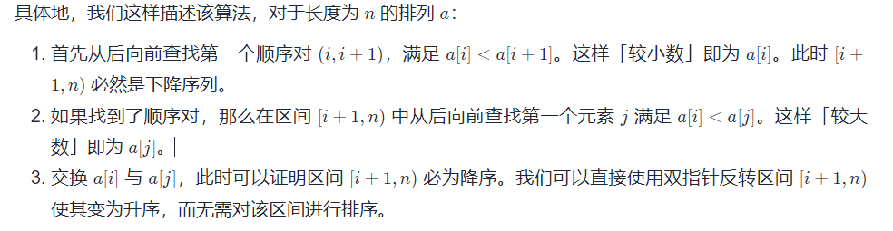

* 原理：因为“【最大的】索引 k 满足 nums[k] < nums[k+1]”，所以k位是需要变得大一点点的地方。 k之后一定是递减的，因为“【最大的】索引 k 满足 nums[k] < nums[k+1]” 又因为“【最大索引】 l 满足 nums[l] > nums[k]”， 所以l一定是k之后所有数里面最小大于k的（最贴近k的）。 所以l和k换位置就可以让这个数组在k的位置上刚好大最小的一点。 然后，l和k换完位置后，现在l（原来k）所在位置后的所有数，依然递减。 所以只要把现在l（原来k）所在位置后的所有数reverse，就可以得到答案～～～

```java
class Solution {
    public void nextPermutation(int[] nums) {
        // base case 无需操作情况
        if(nums == null || nums.length <= 1) return;

        // 从数组倒着查找，找到nums[i] 比nums[i+1]小的
        int exChange = nums.length - 2;
        while(exChange >= 0 && nums[exChange] >= nums[exChange + 1]){
            exChange--;
        }
        
        if(exChange >= 0){
            int min = nums.length - 1;
            // nums[i+1]到nums[nums.length - 1]当中找到一个最小的比nums[i]大的元素
            while(nums[min] <= nums[exChange]) min--;
            // nums[i]跟其交换
            swap(nums, min, exChange);
        }

        // 再把nums[i+1]到nums[nums.length-1]排序 原本为倒序所以反转即可
        reverse(nums, exChange + 1);

        return ;
    }

    private void swap(int[] nums, int left, int right){
        int temp = nums[right];
        nums[right] = nums[left];
        nums[left] = temp;
    }

    private void reverse(int[] nums, int left){
        int right = nums.length - 1;
        while(left < right){
            swap(nums, left, right);
            left++;
            right--;
        }
    }
}
```

* 数字组合的知识点：

  * 某个数字的下一个排列：

    * 先找到末尾递减序列前一个数，即第一个逆序的数
    * 将其后面递减序列中第一个比其大的数交换，然后将递减序列反转，即可得到下一个排列  
    * 如果找不到第一个逆序的数，则直接反转整个数组即可

    ```java
    class Solution {
        public void nextPermutation(int[] nums) {
            if(nums == null || nums.length == 0) return;
            int index = nums.length - 2;
            // 找到第一个逆序的数 表示该数后面的数都为递减、排列好的
            while(index >= 0 && nums[index] >= nums[index+1]){
                index--;
            }
    
            if(index >= 0){
                // 找到了 将其后面递减序列中第一个比其大的数交换，然后将递减序列反转，即可得到下一个排列
                int begin = index + 1;
                int end = nums.length - 1;
                while(end > begin){
                    if(nums[end] > nums[index]) break;
                    end--;
                }
                swap(nums, index, end);
                reverse(nums, begin, nums.length - 1);
            }else{
                // 找不到表示其是最小排列，直接反转即可
                reverse(nums, 0, nums.length - 1);
            }
        }
    
        private void swap(int[] nums, int a, int b){
            int temp = nums[a];
            nums[a] = nums[b];
            nums[b] = temp;
        }
    
        private void reverse(int[] nums, int left, int right){
            while(left < right){
                swap(nums, left, right);
                left++;
                right--;
            }
        }
    }
    ```

  * 上一个排列：

    * 先找到末尾递增序列的前一个数
    * 将该数和后续递增序列的第一个大于它的数交换，然后将该递增序列反转，就得到上一个排列
    * 找不到数，直接逆转即可

    ```jaava
    class Solution {
        public void nextPermutation(int[] nums) {
            if(nums == null || nums.length == 0) return;
            int index = nums.length - 2;
            // 找到第一个逆序的数 表示该数后面的数都为递增、排列好的
            while(index >= 0 && nums[index] <= nums[index+1]){
                index--;
            }
    
            if(index >= 0){
                // 找到了 将其后面递增序列中第一个比其大的数交换，并将递增序列反转，即可得到上一个排列
                int begin = index + 1;
                int end = nums.length - 1;
                while(end > begin){
                    if(nums[begin] > nums[index]) break;
                    begin++;
                }
                swap(nums, index, begin);
                reverse(nums, index+1, nums.length - 1);
            }else{
                // 找不到表示其是最小排列，直接反转即可
                reverse(nums, 0, nums.length - 1);
            }
        }
    
        private void swap(int[] nums, int a, int b){
            int temp = nums[a];
            nums[a] = nums[b];
            nums[b] = temp;
        }
    
        private void reverse(int[] nums, int left, int right){
            while(left < right){
                swap(nums, left, right);
                left++;
                right--;
            }
        }
    }
    ```

    


### [101. 对称二叉树](https://leetcode-cn.com/problems/symmetric-tree/)

* 对称二叉树递归比较规律：需左右树对称

* 对于左右树来说，需左树的左孩子和右树的右孩子、左树的右孩子和右树的左孩子都为对称

* 包含相同动作，故可用递归实现【在尝试判断左树与右树对称的条件时，发现其跟两树的孩子的对称情况有关系。】

* 时间复杂度O(N)：遍历所有的节点

* ```java
  /**
   * Definition for a binary tree node.
   * public class TreeNode {
   *     int val;
   *     TreeNode left;
   *     TreeNode right;
   *     TreeNode() {}
   *     TreeNode(int val) { this.val = val; }
   *     TreeNode(int val, TreeNode left, TreeNode right) {
   *         this.val = val;
   *         this.left = left;
   *         this.right = right;
   *     }
   * }
   */
  class Solution {
      // 对称二叉树递归比较规律：需左右子树对称
      //        1、左子节点的左孩子和右子节点的右孩子、左子节点的右孩子和右子节点的左孩子都为对称
      public boolean isSymmetric(TreeNode root) {
          // base case
          if(root == null) return true;
          if(root.left == null && root.right == null) return true;
          return isSame(root.left, root.right);
      }
  
      // 两颗树是否对称
      private boolean isSame(TreeNode left, TreeNode right){
          // base case 
          if(left == null && right == null) return true;
          if((left != null && right == null) || (left == null && right != null)) return false;
          if(left.val != right.val) return false;
  
          return isSame(left.left, right.right) && isSame(left.right, right.left);
      }
  }
  ```

* 迭代解法：

* 队列实现，每次将需要比较的两个节点相邻加入队列中，每次连续从队列中连续取出两节点，然后比较是否相等。

* ```java
  /**
   * Definition for a binary tree node.
   * public class TreeNode {
   *     int val;
   *     TreeNode left;
   *     TreeNode right;
   *     TreeNode() {}
   *     TreeNode(int val) { this.val = val; }
   *     TreeNode(int val, TreeNode left, TreeNode right) {
   *         this.val = val;
   *         this.left = left;
   *         this.right = right;
   *     }
   * }
   */
  class Solution {
      public boolean isSymmetric(TreeNode root) {
          if(root == null) return true;
          Queue<TreeNode> queue = new LinkedList<>();
          // 边界处理：根节点加入两次 
          queue.offer(root);
          queue.offer(root);
  
          while(!queue.isEmpty()){
              TreeNode node1 = queue.poll();
              TreeNode node2 = queue.poll();
              if(node1 == null && node2 == null) continue;
  
              if((node1 == null || node2 == null) || node1.val != node2.val) return false;
  
              queue.offer(node1.left);
              queue.offer(node2.right);
              if(node1 != node2){
                  queue.offer(node1.right);
                  queue.offer(node2.left);
              }
          }
  
          return true;
      }
  }
  ```

* 第二次做：

  * 迭代

    ```java
    class Solution {
        public boolean isSymmetric(TreeNode root) {
            return symmertric(root.left, root.right);
        }
    
        private boolean symmertric(TreeNode root1, TreeNode root2){
            if(root1 == null && root2 == null) return true;
            if((root1 == null && root2 != null) || (root1 != null && root2 == null) || root1.val != root2.val){
                return false;
            }
            return symmertric(root1.left, root2.right) && symmertric(root1.right, root2.left);
        }
    }
    ```

  * 迭代：

    ```java
    class Solution {
        public boolean isSymmetric(TreeNode root) {
            LinkedList<TreeNode> queue = new LinkedList<>();
            queue.offer(root);
            queue.offer(root);
    
            while(!queue.isEmpty()){
                // 左节点和右结点
                TreeNode node1 = queue.poll();
                TreeNode node2 = queue.poll();
                if(node1 == null && node2 == null) continue;
                if((node1 == null && node2 != null) || (node1 != null && node2 == null) || node1.val != node2.val) return false;
                queue.offer(node1.left);
                queue.offer(node2.right);
                if(node1 != node2){
                    queue.offer(node1.right);
                    queue.offer(node2.left);
                }
            }
    
            return true;
        }
    }
    ```

    


### [102. 二叉树的层序遍历](https://leetcode-cn.com/problems/binary-tree-level-order-traversal/)

* 经典二叉树层次遍历，队列实现即可

* 时间复杂度O(N)：每个节点进出队列一次

* 空间复杂度O(N)：最多有N个节点在队列中

* ```java
  /**
   * Definition for a binary tree node.
   * public class TreeNode {
   *     int val;
   *     TreeNode left;
   *     TreeNode right;
   *     TreeNode() {}
   *     TreeNode(int val) { this.val = val; }
   *     TreeNode(int val, TreeNode left, TreeNode right) {
   *         this.val = val;
   *         this.left = left;
   *         this.right = right;
   *     }
   * }
   */
  class Solution {
      public List<List<Integer>> levelOrder(TreeNode root) {
          List<List<Integer>> result = new ArrayList<>();
          if(root == null) return result;
  
          Queue<TreeNode> queue = new LinkedList<>();
          queue.offer(root);
  
          while(!queue.isEmpty()){
              List<Integer> temp = new ArrayList<>();
  
              int size = queue.size();
              for(int i = 0; i < size; i++){
                  TreeNode node = queue.poll();
                  temp.add(node.val);
                  if(node.left != null) queue.offer(node.left);
                  if(node.right != null) queue.offer(node.right);
              }
  
              result.add(temp);
          }
  
          return result;
      }
  }
  ```


* dfs【前序遍历实现】

* ```java
  class Solution {
      // dfs解法：使用结果集的索引映射层次，每遍历到一个新节点，就获取对应层次的集合，将节点加入进去
      // 记录遍历到的层次，然后将节点加入到对应层次集合
      // 前序遍历保证同层次节点的加入顺序。
      public List<List<Integer>> levelOrder(TreeNode root) {
          List<List<Integer>> result = new ArrayList<>();
          if(root != null){
              dfs(root, 0, result);
          }
          return result;
      }
  
      private void dfs(TreeNode root, int level, List<List<Integer>> result){
          if(result.size() - 1 < level){
              result.add(new ArrayList<Integer>());
          }
          result.get(level).add(root.val);
          if(root.left != null){
              dfs(root.left, level+1, result);
          }
          if(root.right != null){
              dfs(root.right, level+1, result);
          }   
      }
  }
  ```
  
* 


### [136. 只出现一次的数字](https://leetcode-cn.com/problems/single-number/)

* 解法一：哈希表做记忆集，统计每个数出现的次数

* ```java
  class Solution {
      private HashMap<Integer, Integer> numTimes = new HashMap<>();
      public int singleNumber(int[] nums){
          if(nums.length == 1) return nums[0];
          for(int num : nums){
              numTimes.put(num, numTimes.getOrDefault(num, 0) + 1);
          }
          
          for(Map.Entry<Integer, Integer> entry : numTimes.entrySet()){
              if(entry.getValue() == 1) return entry.getKey();
          }
  
          return -1;
  
      }
  }
  ```

* 异或运算：两个相同的数做按位异或运算结果为0 0与任意数做按位异或 结果还是该数

* ```java
  class Solution {
      public int singleNumber(int[] nums) {
          // 两个相同的数做按位异或运算结果为0 0与任意数做按位异或 结果还是该数
          int result = 0;
          for(int num : nums){
              result ^= num;
          }
          return result;
      }
  }
  ```


### [169. 多数元素](https://leetcode-cn.com/problems/majority-element/)

* 摩尔投票法：从第一个数开始times=1，遇到相同的就加1，遇到不同的就减1，减到0就重新换个数开始计数，总能找到最多的那个

* ```java
  class Solution {
      public int majorityElement(int[] nums) {
          if(nums.length == 1) return nums[0];
          int cur = nums[0];
          int times = 1;
          for(int i = 1; i < nums.length; i++){
              if(cur == nums[i]) times++;
              else {
                  times--;
                  if(times == 0){
                      cur = nums[i];
                      times = 1;
                  }
              }
          }
  
          return cur;
      }
  }
  ```


### [283. 移动零](https://leetcode-cn.com/problems/move-zeroes/)

* 二次遍历解法【较容易理解】：先将所有非零数填到相应的位置，然后将后面的所有位置置0

  ```java
  class Solution {
      public void moveZeroes(int[] nums) {
          // base case
          if(nums == null || nums.length == 1) return;
          // 待填充位置
          int index = 0;
          for(int i = 0; i < nums.length; i++){
              if(nums[i] != 0){
                  nums[index] = nums[i];
                  index++;
              }
          }
  
          while(index < nums.length){
              nums[index] = 0;
              index++;
          }
      }
  }
  ```

  

* 一次遍历解法：

  使用两个指针`i`和`j`，只要`nums[i]!=0`，我们就交换`nums[i]`和`nums[j]`
  请对照动态图来理解：
  

* ```java
  class Solution {
      // 参考快速排序的思想：左边都为不等于0 右边都为等于0
      public void moveZeroes(int[] nums) {
          if(nums.length == 1) return;
          // 该指针左边均为非0元素 其指向最左0元素【若存在】
          int index = 0;
  
          for(int cur = 0; cur < nums.length; cur++){
              if(nums[cur] != 0){
                  if(cur != index)
                      swap(nums, cur, index);
                  index++;
              }
          }
      }
  
      private void swap(int[] nums, int i, int j){
          int temp = nums[i];
          nums[i] = nums[j];
          nums[j] = temp; 
      }
  }
  ```


### [338. 比特位计数](https://leetcode-cn.com/problems/counting-bits/)

* 记录0-N各自二进制表示对应的1的个数

* ```java
  class Solution {
      // 思路：想到通过之前计算的数的比特位数【之前状态】得出当前比特位数【当前状态】
      public int[] countBits(int n) {
          // dp[i]：数i的二进制的1的个数
          int[] dp = new int[n + 1];
  
          // 初始化 dp[0] = 0;
  
          for(int i = 1; i <= n; i++){
              // 动态转移方程：i = i/2 + i为奇数？1：0;【/运算符为向下取整，奇数少的1需要额外补充】
              dp[i] = dp[i >> 1] +  ((i & 1) == 1 ? 1 : 0);
          }
  
          return dp;
      }
  }
  ```

  

### [448. 找到所有数组中消失的数字](https://leetcode-cn.com/problems/find-all-numbers-disappeared-in-an-array/)

* 鸽笼定理：由题意可得，1~n的位置表示1~n个笼子，如果出现过，相应的“鸽笼”就会被占掉，我们将数字置为负数表示被占掉了。 最后再遍历一遍，如果“鸽笼”为正数就是没出现的数字。

* ```java
  class Solution {
      public List<Integer> findDisappearedNumbers(int[] nums) {
          List<Integer> result = new ArrayList<>();
          if(nums == null || nums.length == 0) return result;
  		
          // 映射规则: [0,n - 1]位置映射[1,n]的数【题目给出的数都为[1,n]】
          for(int i = 0; i < nums.length; i++){
              // 当前数还未出现过即对应位置上的数还是正数
              if(nums[Math.abs(nums[i]) - 1] > 0){
                  nums[Math.abs(nums[i]) - 1] = - nums[Math.abs(nums[i]) - 1];
              }
          }
  		
          // 统计未出现过的数
          for(int i = 0; i < nums.length; i++){
              if(nums[i] > 0) result.add(i + 1);  
          }
          return result;
      }
  
  
  }
  ```


### [461. 汉明距离](https://leetcode-cn.com/problems/hamming-distance/)

* 按位异或后记录异或结果的二进制表示有多少个1即可。【通过右移遍历每个位】

* ```java
  class Solution {
      public int hammingDistance(int x, int y) {
          // 按位异或 
          int result = x ^ y;
          int num = 0;
          while(result != 0){
              // 异或结果最低位为1 记录个数
              if((result & 1) == 1){
                  num++;
              }
              // 无符号右移1位
              result >>>= 1;
          }
  
          return num;
      }
  }
  ```


### [543. 二叉树的直径](https://leetcode-cn.com/problems/diameter-of-binary-tree/)

* 二叉树直径问题：一条路径的长度为该路径经过的节点数减一，所以求直径（即求路径长度的最大值）等效于求路径经过节点数的最大值减一。

* 而路径经过的节点数减一又可以用左右子树最大深度之和进行表示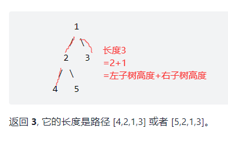

* ```java
  /**
   * Definition for a binary tree node.
   * public class TreeNode {
   *     int val;
   *     TreeNode left;
   *     TreeNode right;
   *     TreeNode() {}
   *     TreeNode(int val) { this.val = val; }
   *     TreeNode(int val, TreeNode left, TreeNode right) {
   *         this.val = val;
   *         this.left = left;
   *         this.right = right;
   *     }
   * }
   */
  class Solution {
      // 记录最大两个结点路径长度
      private int max = 0;
      public int diameterOfBinaryTree(TreeNode root) {
          if(root == null) return 0;
          dfs(root);
          return max;
      }
  	
     // 求每个节点的深度
      private int dfs(TreeNode root){
          if(root == null) return 0;
          int leftHeight = dfs(root.left);
          int rightHeight = dfs(root.right);
          max = Math.max(leftHeight + rightHeight, max);
          return Math.max(leftHeight, rightHeight) + 1;
      }
  }
  ```


### [617. 合并二叉树](https://leetcode-cn.com/problems/merge-two-binary-trees/)

* 思路：先序遍历对每个位置的节点进行合并，每次对每个位置的节点分三种情况进行处理

* ```java
  /**
   * Definition for a binary tree node.
   * public class TreeNode {
   *     int val;
   *     TreeNode left;
   *     TreeNode right;
   *     TreeNode() {}
   *     TreeNode(int val) { this.val = val; }
   *     TreeNode(int val, TreeNode left, TreeNode right) {
   *         this.val = val;
   *         this.left = left;
   *         this.right = right;
   *     }
   * }
   */
  class Solution {
      // 函数定义：合并以root1为根和以root2为根的二叉树，存在重叠节点时以root1树上的为基准
      // 并对两个相同位置的节点 分三种情况进行处理
      public TreeNode mergeTrees(TreeNode root1, TreeNode root2) {
          if(root1 == null && root2 == null) return null;
          if(root1 != null && root2 != null){
              root1.val = root1.val + root2.val;
              root1.left = mergeTrees(root1.left, root2.left);
              root1.right = mergeTrees(root1.right, root2.right);
              return root1;
          }else{
              return root1 == null ? root2 : root1;
          }
  
      }
  }
  ```

* 

### [33. 搜索旋转排序数组](https://leetcode-cn.com/problems/search-in-rotated-sorted-array/)

* 解法一：两次二分+一次遍历

* 严格升序的数组旋转后，分为两段严格升序的子数组，可先找出分界点，然后分别在两个子数组中进行二分查找

* ```java
  class Solution {
      public int search(int[] nums, int target) {
          // base case 
          if(nums == null) return -1;
          if(nums.length == 1) return nums[0] == target ? 0 : -1;
      
          int index = nums.length - 1;
          for(int i = 0; i < nums.length - 1; i++){
              if(nums[i] > nums[i + 1]){
                  index = i;
                  break;
              }
          }
  
          int result1 = binarySearch(nums, 0, index, target);
          int result2 = binarySearch(nums, index + 1, nums.length - 1, target);
          return result1 != -1 ? result1 : result2;
      }
  
      private int binarySearch(int[] nums, int left, int right, int target){
          while(left <= right){
              // 注意运算符优先级
              int middle = ((right - left) >>> 1) + left;
              if(nums[middle] == target){
                  return middle;
              }else if(nums[middle] > target){
                  right = middle - 1;
              }else{
                  left = middle + 1;
              }
          }
  
          return -1;
      }
  }
  ```

* 解法二：一次二分

  数组无论旋转几次，数组都可以划分出两段有序部分。

* 思想：**对旋转数组的中点进行分割，其中一定有一个是有序的，另一个可能是有序，也能是部分有序。**此时有序部分用二分法查找。无序部分再一分为二，其中一个一定有序，另一个可能有序，可能无序。就这样循环.

  **重点在于先判断哪半段是有序的，然后判断目标是否在有序的那半里面，找到所在的那一半，去除掉另一半。**

* 中间数大于等于左边界，则左半段有序，否则右半段有序，分别对有序半段判断target是否存在，否则则在另一半段。

* ```java
      public int search(int[] nums, int target) {
          if(nums == null || nums.length == 0) return -1;
          if(nums.length == 1) return nums[0] == target ? 0 : -1;
  
          int left = 0;
          int right = nums.length - 1;
          
          while(left <= right){
              int middle = left + ((right - left) >>> 1);
              if(nums[middle] == target){
                  return middle;
              }else if(nums[middle] >= nums[left]){ // 前半段有序 【=是考虑到middle==target的情况】
                  // 看target在前半段还是后半段
                  if(nums[left] <= target && target < nums[middle]) right = middle - 1;
                  else left = middle + 1;
              }else{
                  // 前半段无序 后半段必定有序
                  // 判断目标数在前半段还是后半段
                  if(nums[middle] < target && target <= nums[right]) left = middle + 1;
                  else right = middle - 1;
              } 
          }
  
          return -1;
      }
  ```


### [39. 组合总和](https://leetcode-cn.com/problems/combination-sum/)

* 求组合为目标数的个数，且同一个数字可以重复选取。

* ```java
  class Solution {
      private List<List<Integer>> result = new ArrayList<>();
      public List<List<Integer>> combinationSum(int[] candidates, int target) {
          if(candidates == null || candidates.length == 0) return result;
          // 先进行排序，方便后续剪枝
          Arrays.sort(candidates);
          dfs(candidates, target, 0, 0, new ArrayList<>());
          return result;
      }
  
      // list: 记录当前组合，组合中所有的数和为sum，index：起始遍历点，因为同一个数可以无限取故下层递归也取同一个起始遍历点
      private void dfs(int[] candidates, int target, int index, int sum, List<Integer> list){
          if(sum == target){
              result.add(new ArrayList<>(list));
          }else{
              for(int i = index; i < candidates.length; i++){
                  // 剪枝 后面的数构成的和一定更大【因为排序】 故无需往深层次递归
                  if(sum + candidates[i] > target) break;
                  list.add(candidates[i]);
                  dfs(candidates, target, i, sum + candidates[i], list);
                  list.remove(list.size() - 1);
              }
          }
      }
  }
  ```

* 


### [48. 旋转图像](https://leetcode-cn.com/problems/rotate-image/)

* 图像旋转技巧：**顺时针90度就是先转置再左右镜像，顺时针180度很简单【上下镜像再左右镜像】，顺时针270就是先左右镜像再转置**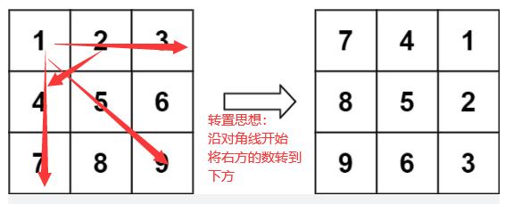

* 这题是顺时针90度

* 时间复杂度O(N^2)

* ```java
  class Solution {
      public void rotate(int[][] matrix) {
          int n = matrix.length;
  
          // 转置
          for(int i = 0; i < n; i++){
              for(int j = i; j < n; j++){
                  int temp = matrix[i][j];
                  matrix[i][j] = matrix[j][i];
                  matrix[j][i] = temp;
              }
          }
  
          // 左右镜像
          // 从第一行遍历到最后一行，每一行两两对称交换
          for(int i = 0; i < n; i++){
              int left = 0;
              int right = n - 1;
              while(left < right){
                  int temp = matrix[i][left];
                  matrix[i][left] = matrix[i][right];
                  matrix[i][right] = temp;
                  left++;
                  right--;
              }
          }
  
      }
  
  }
  ```

* 


### [49. 字母异位词分组](https://leetcode-cn.com/problems/group-anagrams/)

* 关键是想到哈希表怎么设计。**异位词排序后是相同的，可以作为键**，把原序词作为值存储在列表中。这样遍历一遍strs就能把含有相同字母的单词放到一个List内。

* ````java
  class Solution {
      public List<List<String>> groupAnagrams(String[] strs) {
          Map<String, ArrayList<String>> map = new HashMap<>();
          for(String str : strs){
              // 排序后构造键
              char[] array = str.toCharArray();
              Arrays.sort(array);
              String curFirst = String.valueOf(array);
              if(!map.containsKey(curFirst)) map.put(curFirst, new ArrayList<>());
              ArrayList<String> list = map.get(curFirst);
              list.add(str);
          }
  
          return new ArrayList<>(map.values());
      }
  }
  ````

* 


### [55. 跳跃游戏](https://leetcode-cn.com/problems/jump-game/)

* 解法一：贪心思想：遍历到每个能到达的位置，都尝试判断所能到达的最远距离是否可更新，这样必定能获取到第一个下标所能到达的最远距离。

* **这道题目关键点在于：不用拘泥于每次究竟跳跳几步，而是看覆盖范围，覆盖范围内一定是可以跳过来的，不用管是怎么跳的。**

* ```java
  class Solution {
      public boolean canJump(int[] nums) {
          if(nums == null || nums.length == 0) return false;
  
          // 记录当前第一个下标所能到达的最远下标，在从前往后遍历的过程中更新【nums[i]+i，通过到达i这个下标是否能到达更远的下标】
          int maxPoint = nums[0];
          int n = nums.length - 1;
  
          for(int i = 1; i < n; i++){
              // 是否能够到达该下标
              if(i <= maxPoint){
                  // 是否能到达更远的下标
                  maxPoint = Math.max(maxPoint, nums[i] + i);
              }
          }
  
          return maxPoint >= n;
      }
  }
  ```


### [56. 合并区间](https://leetcode-cn.com/problems/merge-intervals/)

* 给出多个区间，合并重叠的区间，并返回一个不重叠的区间数组。

* 思路：根据左边界排序，然后通过比较相邻两个区间的边界，考虑是否可以合并，可以合并就合并，否则直接加入。

* 编码难点：

  * 对二维数组的排序：lanbda表达式
  * 将元素为一维数组的集合转为二维数组：集合定义为ArrayList<int[]>()，list.toArray(new int[0] [])；

* 时间复杂度O(NLogN)

* ```java
  class Solution {
      public int[][] merge(int[][] intervals) {
          List<int[]> list = new ArrayList<>();
          if(intervals == null || intervals.length == 0) return list.toArray(new int[0][]);
          Arrays.sort(intervals, (int[] a, int[] b) -> {
              return a[0] - b[0];
          });
          list.add(intervals[0]);
  
          for(int i = 1; i < intervals.length; i++){
              int[] last = list.get(list.size() - 1);
              // 可以合并的情况：最近的一个合并区间的右边界大于待合并区间的左边界且合并区间的右边界小于待合并区间的右边界
              if(last[1] >= intervals[i][0] && last[1] < intervals[i][1]){
                  last[1] = intervals[i][1];
              }else{
                  // 不可以合并的情况
                  // 完全包含 跳过
                  if(last[1] >= intervals[i][1]) continue;
                  list.add(new int[]{intervals[i][0], intervals[i][1]});
              }
  
          }
  
          return list.toArray(new int[0][]);
      }
  }
  ```

* 

### [62. 不同路径](https://leetcode-cn.com/problems/unique-paths/)

* 解法一：经典记忆化搜索：通过函数签名定义记忆集

* 时间复杂度O(m+n)：一共有m+n个节点需要取

* 空间复杂度O(m+n-1)：根据数组和移动规则推出栈的最大深度

* ```java
  class Solution {
      public int uniquePaths(int m, int n) {
          // 记忆集，便于深搜时剪枝
          int[][] dist = new int[m + 1][n + 1];
          // 初始状态 从[m, n]到达[m, n]一共有1条路径
          dist[m][n] = 1;
          return dfs(1, 1, dist, m , n);
      }
  
      // 从[row, column]位置每次移动一步到达右下角[m, n]，一共有多少条路径
      private int dfs(int row, int column, int[][] dist, int m, int n){
          if(row > m || column > n) return 0;
          if(dist[row][column] != 0) return dist[row][column];
          // 分别走到右边和下边，看到达[m,n]需要多少条路径 
          int result = dfs(row + 1, column, dist, m, n) + dfs(row, column + 1, dist, m, n);
          // 记录结果
          dist[row][column] = result;
          return result;
      }
  }
  ```

* 解法二：动态规划

* 二维dp形式：

* ```java
  class Solution {
      public int uniquePaths(int m, int n) {
          // dp数组 dp[i][j]: 从[i,j]到达[m,n]所需要的路径数
          int[][] dist = new int[m + 1][n + 1];
          // 初始状态 从[m, n]到达[m, n]一共有1条路径
          dist[m][n] = 1;
  
          for(int i = m; i >= 1; i--){
              for(int j = n; j >= 1; j--){
                  if(i == m && j == n) continue;
                  // 状态转移方程
                  if(i + 1 <= m) dist[i][j] += dist[i + 1][j];
                  if(j + 1 <= n) dist[i][j] += dist[i][j + 1];
              }
          }
          return dist[1][1];
      }
  
  }
  ```

* 滚动dp形式

* ```java
  class Solution {
      public int uniquePaths(int m, int n) {
          // dp数组 dp[i][j]: 从[i,j]到达[m,n]所需要的路径数
          // int[][] dist = new int[m + 1][n + 1];
  
          // 优化空间
          int[] dist = new int[n + 1];
          // 初始状态 从[m, n]到达[m, n]一共有1条路径
          // dist[m][n] = 1;
          dist[n] = 1;
  
          for(int i = m; i >= 1; i--){
              for(int j = n; j >= 1; j--){
                  if(i == m && j == n) continue;
                  // 状态转移方程
                  if(j + 1 <= n) dist[j] += dist[j + 1];
              }
          }
          return dist[1];
      }
  
  }
  ```

* 


### [128. 最长连续序列](https://leetcode-cn.com/problems/longest-consecutive-sequence/)

* 解法一：哈希+遍历比较的出最大长度

* 难点：**只对连续序列的头元素的后续元素进行搜索来减少比较次数。【1，2，3】只对1的后续元素搜索**

* 时间复杂度O(N)：每个元素被遍历两次【if一次、作为连续序列的非头元素在while中被遍历】

* ```java
  class Solution {
      public int longestConsecutive(int[] nums) {
          if(nums == null || nums.length == 0) return 0;
          // Hash去重
          Set<Integer> oddSet = new HashSet<>();
          int maxLength = 0;
          for(int num : nums){
              oddSet.add(num);
          }
  		
          // 遍历元素
          for(int i = 0; i < nums.length; i++){
              // 判断元素是否为连续序列的头元素，是才能通过判断，通过内循环记录，不是则留待头元素进行判断
              if(!oddSet.contains(nums[i] - 1)){
                  int curLength = 1;
                  int needNum = nums[i] + 1;
                  // 判断连续序列的后续元素是否存在
                  while(oddSet.contains(needNum)){
                      needNum++;
                      curLength++;
                  }
                  maxLength = Math.max(maxLength, curLength);
              }
          }
  
          return maxLength;
      }
  }
  ```

* 


### [78. 子集](https://leetcode-cn.com/problems/subsets/)

* 子集、组合、排列等都可以用回溯算法，主要是自顶向下模拟出对应答案的过程[可以直接从后遍历，遇到一个数就把所有子集加上该数组成新的子集，遍历完毕即是所有子集]
* 

* ```java
  class Solution {
      List<List<Integer>> result;
      public List<List<Integer>> subsets(int[] nums) {
          result = new ArrayList<>();
          if(nums == null ||nums.length == 0) return result;
          dfs(nums, 0, new ArrayList<>());
          return result;
      }
  
      // 函数定义：将从index索引开始所能得到的子集【类似于求组合】
      private void dfs(int[] nums, int index, List<Integer> list){
          // 添加目前构造的子集
          result.add(new ArrayList<>(list));
  
          // 终止条件：还能得到子集时 即index不能越界
          if(index <= nums.length - 1){
              // 从index开始取，保证取过的元素不会重复取
              for(int i = index; i < nums.length; i++){
                  // 添加元素
                  list.add(nums[i]);
                  dfs(nums, i + 1, list);
                  // 回溯
                  list.remove(list.size() - 1);
              }
          }
      }
  }
  ```

* 


### [148. 排序链表](https://leetcode-cn.com/problems/sort-list/)

* 题目要求对乱序单链表进行排序，且要求时间复杂度O(NlogN)

* 故考虑用归并排序实现

* 与在传统数组上的归并排序不同，在链表上归并排序需进行以下操作

* 1、数组可通过长度分割子序列，链表需要通过**快慢指针分割子链表。**【归并排序需要分割出一半，故可以快慢指针进行分割】

* 2、归并时数组需要开辟一个新数组，**链表只需直接在链表上原地修改指针即可。**

* 3、数组需要通过下标约束子序列的边界，链表可通过置子链表的尾节点的next为null来进行边界约束。

* ```java
  /**
   * Definition for singly-linked list.
   * public class ListNode {
   *     int val;
   *     ListNode next;
   *     ListNode() {}
   *     ListNode(int val) { this.val = val; }
   *     ListNode(int val, ListNode next) { this.val = val; this.next = next; }
   * }
   */
  class Solution {
      public ListNode sortList(ListNode head) {
          return head == null ? null : mergeSort(head);
      }
  	// 归并排序单链表 head
      private ListNode mergeSort(ListNode head){
          // base case 子链表的长度为1时无需排序
          if(head.next == null) return head;
  
          // 快慢指针 将链表分两段 两段的尾节点都为null【方便归并】
          ListNode slow = head, fast = head;
          ListNode pre = null;
          // slow为分界点【右段子链表的头结点】
          while(fast != null && fast.next != null){
              pre = slow;
              slow = slow.next;
              fast = fast.next.next;
          }
          // pre 走到前半段尾节点
          pre.next = null;
  
          // 合并已经排完序的两段链表
          ListNode left = mergeSort(head);
          ListNode right = mergeSort(slow);
  
          // 归并
          return merge(left, right);
      }
      
      // 归并两个链表
      private ListNode merge(ListNode headLeft, ListNode headRight){
          // 虚拟头结点 规避了头结点的复杂选择
          ListNode dummyHead = new ListNode(-1);
          ListNode cur = dummyHead;
  
          while(headLeft != null && headRight != null){
              if(headLeft.val > headRight.val){
                  cur.next = headRight;
                  headRight = headRight.next;
              }else{
                  cur.next = headLeft;
                  headLeft = headLeft.next;
              }
              cur = cur.next;
          }
          cur.next = (headRight == null ? headLeft : headRight);
          return dummyHead.next;
      }
  }
  ```
  
* 题目要求常数级空间复杂度，故不能采用递归方式实现【递归栈】，采用自底向上方式实现：

  * 思想：**记录每次需要拆分的最大子链表长度，并按长度每次拆分出两个对应的子序列进行合并，直至拆分完当前最大长度的所有子链表，然后最大子链表长度翻倍，直至最大链表长度>=链表长度。**

* ```java
  /**
   * Definition for singly-linked list.
   * public class ListNode {
   *     int val;
   *     ListNode next;
   *     ListNode() {}
   *     ListNode(int val) { this.val = val; }
   *     ListNode(int val, ListNode next) { this.val = val; this.next = next; }
   * }
   */
  class Solution {
      public ListNode sortList(ListNode head) {
          if(head == null) return head;
          int maxLength = 0;
          ListNode node = head;
  
          // 记录链表长度
          while(node != null) {
              node = node.next;
              maxLength++;
          }
  
          ListNode dummyHead = new ListNode(-1, head);
          // 3. 每次将链表拆分成若干个长度为subLength的子链表 , 并按照每两个子链表一组进行合并 
          for(int subLength = 1; subLength < maxLength; subLength <<= 1){
              // prev记录subLength下当前已处理完的链表的尾节点
              // curr记录下一个待处理的链表首节点
              ListNode prev = dummyHead, curr = dummyHead.next;
  
              // 是否还可拆出最大长度为subLength的子链表 
              while(curr != null){
                  // 链表1的头结点
                  ListNode headOne = curr;
                  // curr走到链表1的尾节点
                  for(int i = 1; i < subLength && curr != null && curr.next != null; i++){
                      curr = curr.next;
                  }
  
                  // 链表2的头结点
                  ListNode headTwo = curr.next;
                  // 断开链表1和链表2的连接【便于归并时进行边界判断】
                  curr.next = null;
                  curr = headTwo;
                  // curr走到链表2的尾节点
                  for(int i = 1; i < subLength && curr != null && curr.next != null; i++){
                      curr = curr.next;
                  }
              
                  // 记录链表2的下一个节点
                  ListNode next = null;
                  if(curr != null){
                      next = curr.next;
                      // 断开链表2与下一节点的连接
                      curr.next = null;
                  }
  
                  // 合并两个链表
                  ListNode merged = merge(headOne, headTwo);
                  // 拼接
                  prev.next = merged;
  
                  // 移动到合并完的链表的尾部
                  while(prev.next != null){
                      prev = prev.next;
                  }
                  // 下一个待处理的链表首节点
                  curr = next;
              }
          }
  
          return dummyHead.next;
      }
      
      // 归并两个链表
      private ListNode merge(ListNode headLeft, ListNode headRight){
          // 虚拟头结点 规避了头结点的复杂选择
          ListNode dummyHead = new ListNode(-1);
          ListNode cur = dummyHead;
  
          while(headLeft != null && headRight != null){
              if(headLeft.val > headRight.val){
                  cur.next = headRight;
                  headRight = headRight.next;
              }else{
                  cur.next = headLeft;
                  headLeft = headLeft.next;
              }
              cur = cur.next;
          }
          cur.next = (headRight == null ? headLeft : headRight);
          return dummyHead.next;
      }
  }
  ```

* 快排版本：因为是链表，故需要使用哈希表记录每个位置对应的节点，通过修改节点值来达到交换的目的，通过操作对应位置的节点即可。

  ```java
  /**
   * Definition for singly-linked list.
   * public class ListNode {
   *     int val;
   *     ListNode next;
   *     ListNode() {}
   *     ListNode(int val) { this.val = val; }
   *     ListNode(int val, ListNode next) { this.val = val; this.next = next; }
   * }
   */
  class Solution {
      public ListNode sortList(ListNode head) {
          if(head == null || head.next == null) return head;
          Map<Integer, ListNode> map = new HashMap<>();
          int index = 0;
          ListNode cur = head;
          while(cur != null){
              map.put(index, cur);
              cur = cur.next;
              index++;
          }
  
          quickSort(map, 0, index - 1);
          return head;
      }
  
      private void quickSort(Map<Integer, ListNode> map, int left, int right){
          if(left < right){
              int middle = getMiddle(map, left, right);
              quickSort(map, left, middle - 1);
              quickSort(map, middle + 1, right);
          }
      }
  
      private int getMiddle(Map<Integer, ListNode> map, int left, int right){
          int index = new Random().nextInt(right - left + 1) + left;
          swap(map, index, left);
          int privot = map.get(left).val;
          while(left < right){
              while(left < right && (map.get(right).val >= privot)){
                  right--;
              }
              map.get(left).val = map.get(right).val;
              while(left < right && map.get(left).val <= privot){
                  left++;
              }
              map.get(right).val = map.get(left).val;
          }
          // 回置
          map.get(left).val = privot;
          return left;
      }
  
      private void swap(Map<Integer, ListNode> map, int a, int b){
          ListNode node1 = map.get(a);
          ListNode node2 = map.get(b);
          int temp = node1.val;
          node1.val = node2.val;
          node2.val = temp;
      }
  
  }
  ```

* 优先队列api，注意比较器需自己实现和死循环问题

  ```java
  /**
   * Definition for singly-linked list.
   * public class ListNode {
   *     int val;
   *     ListNode next;
   *     ListNode() {}
   *     ListNode(int val) { this.val = val; }
   *     ListNode(int val, ListNode next) { this.val = val; this.next = next; }
   * }
   */
  class Solution {
      public ListNode sortList(ListNode head) {
          if(head == null || head.next == null) return head;
          PriorityQueue<ListNode> queue = new PriorityQueue<>((a, b) -> a.val - b.val);
          while(head != null){
              queue.offer(head);
              head = head.next;
          }
  
          ListNode newHead = queue.poll();
          ListNode cur = newHead;
          while(!queue.isEmpty()){
              cur.next = queue.poll();
              cur = cur.next;
          }
          // 避免死循环
          cur.next = null;
          return newHead;
      }
  }
  ```

* 手写堆

  


### [152. 乘积最大子数组](https://leetcode-cn.com/problems/maximum-product-subarray/)

* 子数组问题-》重复子问题-》动态规划解法

* 连续的子数组故考虑dp[i]包含i位置

* 得出dp定义：以nums[i]结尾的乘积最大的连续子数组

* 又因最大的不仅能由最大的得出，也可能由最小的得出，故定义额外的dp：以nums[i]结尾的乘积最小的连续子数组

* 同时得出状态转移方程：

  ```java
   dpLarge[i] = Math.max(Math.max(dpLarge[i - 1] * nums[i], nums[i]), dpSmall[i - 1] * nums[i]);
             dpSmall[i] = Math.min(Math.min(dpSmall[i - 1] * nums[i], nums[i]), dpLarge[i - 1] * nums[i]);
  ```

* ```java
  class Solution {
      public int maxProduct(int[] nums) {
          if(nums == null || nums.length == 0) return 0;
          int max = nums[0];
          // dpLarge[i]：以nums[i]结尾的乘积最大的连续子数组
          int[] dpLarge = new int[nums.length];
          // dpSmall[i]：以nums[i]结尾的乘积最小的连续子数组
          int[] dpSmall = new int[nums.length];
  
          // 初始化
          dpLarge[0] = nums[0];
          dpSmall[0] = nums[0];
  
          for(int i = 1; i < nums.length; i++){
             dpLarge[i] = Math.max(Math.max(dpLarge[i - 1] * nums[i], nums[i]), dpSmall[i - 1] * nums[i]);
             dpSmall[i] = Math.min(Math.min(dpSmall[i - 1] * nums[i], nums[i]), dpLarge[i - 1] * nums[i]);
             max = Math.max(dpLarge[i], max);
          }  
  
          return max;
      }
  }
  ```

* 优化空间：【一个dp的状态转移方程只涉及前一个状态，故可优化为一个变量】

* ```java
  class Solution {
      public int maxProduct(int[] nums) {
          if(nums == null || nums.length == 0) return 0;
          int max = nums[0];
          // dpLarge[i]：以nums[i]结尾的乘积最大的连续子数组
          // int[] dpLarge = new int[nums.length];
          int dpLarge = nums[0];
          // dpSmall[i]：以nums[i]结尾的乘积最小的连续子数组
          // int[] dpSmall = new int[nums.length];
          int dpSmall = nums[0];
  
          // 初始化
          // dpLarge[0] = nums[0];
          // dpSmall[0] = nums[0];
  
          for(int i = 1; i < nums.length; i++){
             // 临时变量存储旧值，避免更改，无法使用
             int temp = dpLarge;
             dpLarge = Math.max(Math.max(dpLarge * nums[i], nums[i]), dpSmall * nums[i]);
             dpSmall = Math.min(Math.min(dpSmall * nums[i], nums[i]), temp * nums[i]);
             max = Math.max(dpLarge, max);
          }  
          return max;
      }
  }
  ```

  

  

### [200. 岛屿数量](https://leetcode-cn.com/problems/number-of-islands/)

* 经典岛屿dfs问题，往四个方向搜索即可

* 记忆集避免重复判断

* ```java
  class Solution {
      public int numIslands(char[][] grid) {
          int num = 0;
          boolean[][] used = new boolean[grid.length][grid[0].length];
          for(int i = 0; i < grid.length; i++){
              for(int j = 0; j < grid[0].length; j++){	
                  if(!used[i][j] && grid[i][j] == '1'){
                      // 新的岛屿
                      dfs(grid, i, j, used);
                      num++;
                  }
              }
          }
          return num;
      }
  
      private void dfs(char[][] grid, int row, int column, boolean[][] used){
          // 是否越界
          if(row >= grid.length || column >= grid[0].length || row < 0 || column < 0) return;
          // 是否已处理过
          if(used[row][column] || grid[row][column] == '0') return ;
          used[row][column] = true;
          dfs(grid, row, column + 1, used);
          dfs(grid, row + 1, column, used);
          dfs(grid, row, column - 1, used);
          dfs(grid, row - 1, column, used);
      }
  }
  ```

* 原地修改避免重复判断

  ```java
  class Solution {
      public int numIslands(char[][] grid) {
          int num = 0;
          for(int i = 0; i < grid.length; i++){
              for(int j = 0; j < grid[0].length; j++){
                  if(grid[i][j] == '1'){
                      // 新的岛屿
                      dfs(grid, i, j, used);
                      num++;
                  }
              }
          }
          return num;
      }
  
      private void dfs(char[][] grid, int row, int column){
          if(row >= grid.length || column >= grid[0].length || row < 0 || column < 0) return;
          if(grid[row][column] == '0') return ;
          // 修改原数组 避免对已记录岛屿重复计算
          grid[row][column] = 0;
          dfs(grid, row, column + 1, used);
          dfs(grid, row + 1, column, used);
          dfs(grid, row, column - 1, used);
          dfs(grid, row - 1, column, used);
      }
  }
  ```

  

### [207. 课程表](https://leetcode-cn.com/problems/course-schedule/)

* 拓扑排序【类似bfs】解法：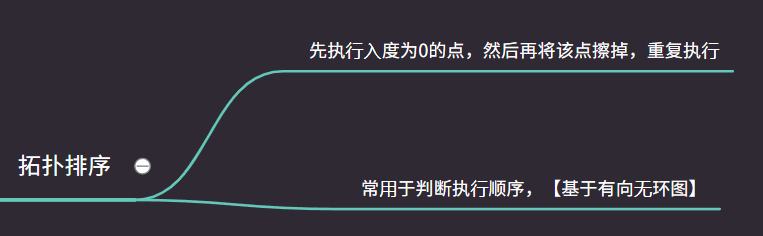

* 时间复杂度O(n+m)：每个节点和边各遍历一次

* 本题难点：理解题目“在选修某些课程之前需要一些先修课程。 先修课程按数组 `prerequisites` 给出”，我们可以用变量total记录有向无环连通分量的个数，确保total >= numCourses || total >= nodes.keySet().size()即可.

* ```java
  class Solution {
      public boolean canFinish(int numCourses, int[][] prerequisites) {
          if(prerequisites.length == 0) return true;	
          // key为值，value为节点
          Map<Integer, Node> nodes = transform(prerequisites);
  
          // key: 节点，value：入度数
          Map<Node, Integer> map = new HashMap<>();
          // 入度为0的队列
          Queue<Node> queue = new LinkedList<>();
          
          // 记录节点以及对应的入度数
          for(Node node : nodes.values()){
              map.put(node, node.in);
              if(node.in == 0) queue.offer(node);
          }
          int total = 0;
          
          // 将入度为0的节点出队并更新入度为0的节点，同时将新的入度为0的节点入队
          while(!queue.isEmpty()){
              Node node = queue.poll();
              total++;
              for(Node next : node.nexts){
                  map.put(next, map.get(next) - 1);
                  if(map.get(next) == 0) queue.offer(next);
              }
          }
  
          return total >= numCourses || total >= nodes.keySet().size();
      }
  	
      // 将题目数据转化为相应的数据结构
      private Map<Integer, Node> transform(int[][] prerequisites){
          Map<Integer, Node> nodes = new HashMap<>();
          for(int[] nums : prerequisites){
              int from = nums[1];
              int to = nums[0];
              if(!nodes.containsKey(from)){
                  nodes.put(from, new Node(from));
              }
              if(!nodes.containsKey(to)){
                  nodes.put(to, new Node(to));
              }
              Node fromNode = nodes.get(from);
              Node toNode = nodes.get(to); 
              fromNode.nexts.add(toNode); 
              toNode.in++;
          }
  
          return nodes;
      }
  }
  
  class Node{
      // 节点值
      public int value;
      // 节点入度个数
      public int in;
      // 邻接节点
      public List<Node> nexts;
  
      public Node(int value){
          this.value = value;
          this.in = 0;
          nexts = new ArrayList<>();
      }
  }
  ```

  

### [238. 除自身以外数组的乘积](https://leetcode-cn.com/problems/product-of-array-except-self/)

* 前缀积解法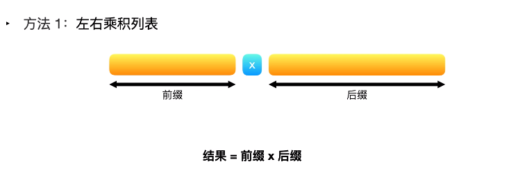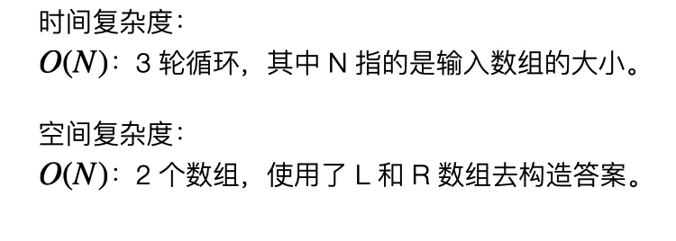

* ```java
  class Solution {
      public int[] productExceptSelf(int[] nums) {
          int n = nums.length;
          int[] result = new int[n];
  
          // left、right分别表示左右乘积列表
          // left[i]：nums[0]*..*nums[i-1]
          // right[i]：nums[i+1]*..*nums[n-1]
          int[] left = new int[n];
          int[] right = new int[n];
  
          // 初始化
          left[0] = 1;
          right[n - 1] = 1;
  
          for(int i = 1; i < n; i++){
              left[i] = left[i - 1] * nums[i - 1];
          }
          for(int i = n - 2; i >= 0; i--){
              right[i] = right[i + 1] * nums[i + 1];
          }
  
          // 对于索引 i，除 nums[i] 之外其余各元素的乘积就是左侧所有元素的乘积乘以右侧所有元素的乘积
          for(int i = 0; i < n; i++){
              result[i] = left[i] * right[i];
          }
          return result;
      }
  }
  ```

* 优化空间解法：

  由于输出数组不算在空间复杂度内，那么我们可以将 `L` 或 `R` 数组用输出数组来计算。先把输出数组当作 `L` 数组来计算，然后再动态构造 `R` 数组得到结果。

  ```java
  class Solution {
      public int[] productExceptSelf(int[] nums) {
          int n = nums.length;
  
          // 先用结果数组存储左侧积
          int[] result = new int[n];
          result[0] = 1;
          for(int i = 1; i < n; i++){
              result[i] = result[i - 1] * nums[i - 1];
          }
  
          // 右侧积
          int right = 1;
          // 对于索引 i，除 nums[i] 之外其余各元素的乘积就是左侧所有元素的乘积乘以右侧所有元素的乘积
          // 动态构建右侧积
          for(int i = n - 1; i >= 0; i--){
              result[i] = result[i] * right;
              right *= nums[i];
          }
          return result;
      }
  }
  ```


### [287. 寻找重复数](https://leetcode-cn.com/problems/find-the-duplicate-number/)

* 快慢指针解法：

* **使用数组配合下标，抽象成链表问题**。但是难点是要定位环的入口位置。

* 举个例子：`nums = [2,5, 9 ,6,9,3,8, 9 ,7,1]`，构造成链表就是：`2->[9]->1->5->3->6->8->7->[9]`，也就是在`[9]`处循环。

* 相关证明看链表题

* ```java
  class Solution {
      public int findDuplicate(int[] nums) {
          // 抽象成链表问题：下标为节点，对应值为下一节点
          int slow = 0;
          int fast = 0;
  
          // 快慢指针分别走
          for(; slow != fast || fast == 0;){
              slow = nums[slow];
              fast = nums[nums[fast]];
          }
  
          // 快指针回起点和慢指针一起开始走
          fast = 0;
          for(; slow != fast;){
              slow = nums[slow];
              fast = nums[fast];
          }
  
          return slow;
      }
  }
  ```

* 二分法：

  二分性：[1,n]范围中的值中，对于数k，在数组nums中小于等于k的数的个数 有两种情况，**1、可能小于等于k【1个重复数出现多次所以要小于】，2、也可能大于k**，

  对于1，重复数的范围为[mid+1，right] 

  对于2，重复数的范围为[left，mid] 【抽屉满了，放了多个】

* 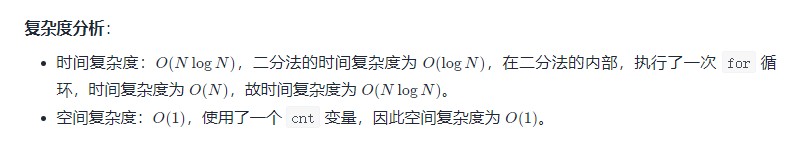

* ```java
  public class Solution {
  
      public int findDuplicate(int[] nums) {
          int len = nums.length;
          // 在数为[left,right]的范围内查找重复的数
          int left = 1;
          int right = len - 1;
          int res = -1;
          while (left <= right) {
              // mid可理解为抽屉的大小
              int mid = left + (right - left) / 2;
              // 记录小于等于值为mid的数的个数
              int cnt = 0;
              for (int num : nums) {
                  if (num <= mid) {
                      cnt += 1;
                  }
              }
              
              if(cnt <= mid){
                  // 根据抽屉原理，此时重复数的范围在右区间 【完全排除mid，只有大于mid才表示该区间中有重复数】
                  left = mid + 1;
              }else{
                  // 重复数的范围在左区间
                  right = mid - 1;
                  // 重复数可能为mid，故需要记录【左闭右开时需要考虑】
                  res = mid;
              }
          }
          return res;
      }
  }
  
  ```


### [394. 字符串解码](https://leetcode-cn.com/problems/decode-string/)

* 此题类似逆波兰表达式问题，使用栈解决

* 遍历每个字符，将非']'的字符入栈，碰到']'时将先将对应[]的字符拿出，然后再拿去取出对应倍数，再然后将对应倍数的字符入栈。最后将栈中字符逆序取出即可。

  【为保证拿出字符和倍数数字的正确顺序，用到了StringBuilder.insert(0, chr)】

* ```java
  class Solution {
      public String decodeString(String s) {
          LinkedList<Character> stack = new LinkedList<>();
          
          for(char c : s.toCharArray()){
              if(c != ']'){
                  // 把所有的字母push进去，除了]
                  stack.push(c);
              }else{
                   //step 1: 取出[] 内的字符串
                  StringBuilder words = new StringBuilder();
                  // 取出字母
                  while(!stack.isEmpty() && Character.isLetter(stack.peek())){
                      words.insert(0, stack.pop());
                  }
                  
                  // 去除[
                  stack.pop();
  
                  //step 2: 获取倍数数字
                  StringBuilder digits = new StringBuilder();
                  int count = 0;
                  while(!stack.isEmpty() && Character.isDigit(stack.peek())){
                      // 保证顺序
                      digits.insert(0, stack.pop());
                  }
                  count = Integer.valueOf(digits.toString());
                  
                  //step 3: 根据倍数把字母再push回去
                  while(count > 0){
                      for(char chr : words.toString().toCharArray()){
                          stack.push(chr);
                      }
                      count--;
                  }
              }
          }
  
          //把栈里面所有的字母取出来
          StringBuilder res = new StringBuilder();
          while(!stack.isEmpty()){
              res.insert(0, stack.pop());
          }
  
          return res.toString();
      }
  
  }
  ```

  

### [399. 除法求值](https://leetcode-cn.com/problems/evaluate-division/)

* 并查集解法：

* 由于 **变量之间的倍数关系具有传递性**，处理有传递性关系的问题，可以使用「并查集」，我们需要在并查集的「合并」与「查询」操作中 **维护这些变量之间的倍数关系**。

* 构建图时，将具有倍数关系的变量连接起来，并将倍数关系通过边的权值表示，同时通过路劲压缩，转为对应对根节点的倍数关系，这样就能方便计算了。【x/y：x的父为y】

* 难点：

  * 查询、合并操作维护权值的变化

    

* ```java
  class Solution {
      public double[] calcEquation(List<List<String>> equations, double[] values, List<List<String>> queries) {
          int n = equations.size();
          UF uf = new UF(n * 2);
          // 将字符串映射为整型节点 便于处理
          Map<String, Integer> map = new HashMap<>();
          int id = 0;
  
          // 构建图
          for(int i = 0; i < n; i++){
              List<String> list = equations.get(i);
              String x = list.get(0);
              String y = list.get(1);
  
              if(!map.containsKey(x)){
                  map.put(x, id);
                  id++;
              }
              if(!map.containsKey(y)){
                  map.put(y, id);
                  id++;
              }
  
              uf.union(map.get(x), map.get(y), values[i]);
          }
  
          // 查询
          double[] result = new double[queries.size()];
          for(int i = 0; i < result.length; i++){
              String varx = queries.get(i).get(0);
              String vary = queries.get(i).get(1);
  
              Integer idx = map.get(varx);
              Integer idy = map.get(vary);
  
              if(idx == null || idy == null){
                  result[i] = -1.0d;
              }else{
                  result[i] = uf.isConnected(idx, idy);
              }
          }
          return result;
          
      }
  
   class UF{
       int[] parents; // 父节点id
       double[] weights; // 指向父节点的权重 
  
       // 初始化
       public UF(int n){
          parents = new int[n];
          weights = new double[n];
          for(int i = 0; i < n; i++){
              parents[i] = i;
              weights[i] = 1.0d;
          }
       }
      
       /**
        * 判断两个节点是否在同一连通分量 
        * 并 返回x/y的值 
        */
       public double isConnected(int x, int y){
           int rootX = find(x);
           int rootY = find(y);
           if(rootX == rootY){
               return weights[x] / weights[y];
           }else{
               return -1.0d;
           }
       }
  
       /**
        * 路径压缩
        * 找对应节点的根节点，同时将沿途向上的节点置为根节点的叶子
        */
       public int find(int id){
           if(id != parents[id]){
               int temp = parents[id];
               parents[id] = find(parents[id]);
               // 维护权值的变化
               weights[id] *= weights[temp];
           }
  
           return parents[id];
       }
       
       /**
        * 合并节点，同时更新被合并的节点到跟节点的权重
        */
       public void union(int x, int y, double value){
           int rootX = find(x);
           int rootY = find(y);
  
           // 根节点相同无需合并
           if(rootX == rootY){
               return;
           }
  
           parents[rootX] = rootY;
           // 维护权值的变化
           weights[rootX] = value * weights[y] / weights[x];
       }
   }   
  }
  ```

* todo 学了图论后用dfs和bfs解


### [406. 根据身高重建队列](https://leetcode-cn.com/problems/queue-reconstruction-by-height/)

https://leetcode-cn.com/problems/queue-reconstruction-by-height/solution/406-gen-ju-shen-gao-zhong-jian-dui-lie-x-a4w7/

* 排序+贪心解法：

* 本题有两个维度，h和k，看到这种题目一定要想如何确定一个维度，然后在按照另一个维度重新排列。

* 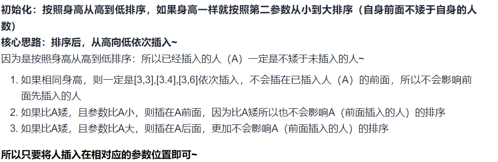

* **局部最优：优先按身高高的people的k来插入。插入操作过后的people满足队列属性**

  **全局最优：最后都做完插入操作，整个队列满足题目队列属性**

* ```java
  // base case
  class Solution {
      public int[][] reconstructQueue(int[][] people) {
          if(people == null || people.length == 0) return null;
          // 使用链表减小复制的开销
          LinkedList<int[]> queue = new LinkedList<>();
          // hi从大到小、ki从小到大
          Arrays.sort(people, (a, b) ->{
              if(a[0] != b[0]){
                  return Integer.compare(b[0], a[0]);
              }else{
                  return Integer.compare(a[1], b[1]);
              }
          });
  
  
          // 放入到对应的位置上 后续的节点不会影响前面的。
          for(int[] cur : people){
              queue.add(cur[1], cur);
          }
  
          // 转为对应数组
          return queue.toArray(new int[queue.size()][]);
      }
  }
  ```

* 


### [438. 找到字符串中所有字母异位词](https://leetcode-cn.com/problems/find-all-anagrams-in-a-string/)

* 暴力1：找到p的全排列，遍历s的每个p长子串判断是否符合。
* 暴力2：遍历s的每个p长子串，记录子串内各字符个数和p的各字符个数，然后比较即可。
* 滑动窗口，维护p长的窗口，统计窗口内p的目标字符个数。


### [42. 接雨水](https://leetcode-cn.com/problems/trapping-rain-water/)

* 解法一：暴力遍历每一列能接的雨水

* ```java
  class Solution {
      public int trap(int[] height) {
          int n = height.length;
          if(n == 1) return 0;
          int sum = 0;
          for(int i = 1; i < n; i++){
              int leftMax = 0;
              for(int j = i - 1; j >= 0; j--){
                  leftMax = Math.max(leftMax, height[j]);
              }
              int rightMax = 0;
              for(int j = i + 1; j < n; j++){
                  rightMax = Math.max(rightMax, height[j]);
              }
  
              int min = Math.min(leftMax, rightMax);
              // 只有左右两侧最大列的较小列 比当前列大 才能接到雨水
              if(min > height[i]){
                  sum += (min - height[i]);
              }
          }
  
          return sum;
      }
  }
  ```

* 解法二：根据上题优化出来的dp解法

* ```java
  class Solution {
      public int trap(int[] height) {
          int n = height.length;
          if(n == 1) return 0;
          int sum = 0;
          // 先记录每列左右两侧的最大值
          int[] leftMax = new int[n];
          int[] rightMax = new int[n];
          for(int i = 1; i < n; i++){
              leftMax[i] = Math.max(leftMax[i-1], height[i-1]);
          }
          for(int i = n - 2; i >= 0; i--){
              rightMax[i] = Math.max(rightMax[i+1], height[i+1]);
          }
  
          for(int i = 1; i < n; i++){
              int min = Math.min(leftMax[i], rightMax[i]);
              if(min > height[i]){
                  sum += (min - height[i]);
              }
          }
  
          return sum;
      }
  }
  ```

* 进一步优化：

* ```java
  class Solution {
      public int trap(int[] height) {
          int n = height.length;
          if(n == 1) return 0;
          int sum = 0;
          int leftMax = 0;
          int[] rightMax = new int[n];
          
          for(int i = n - 2; i >= 0; i--){
              rightMax[i] = Math.max(rightMax[i+1], height[i+1]);
          }
  
          for(int i = 1; i < n; i++){
              leftMax = Math.max(leftMax, height[i-1]);
              int min = Math.min(leftMax, rightMax[i]);
              if(min > height[i]){
                  sum += (min - height[i]);
              }
          }
  
          return sum;
      }
  }
  ```

* 解法三：双指针解法

* 通俗理解：https://leetcode-cn.com/problems/trapping-rain-water/solution/jie-yu-shui-by-leetcode/327718/

* ```java
  class Solution {
      public int trap(int[] height) {
          int n = height.length;
          if(n == 1) return 0;
          int sum = 0;
          // left的左边最大值 right不能确定的左边最大值
          int leftMax = 0;
          // right的右边最大值 left不能确定的右边最大值
          int rightMax = 0;
  
          // 双指针
          int left = 0;
          int right = n - 1;
          
          while(left <= right){
              if(leftMax < rightMax){ // 左边的最大值小于右边的最大值 处理左指针即可 因为两侧最大值的较小值在left左边
                  if(leftMax > height[left]){
                      sum += leftMax - height[left];
                  }
                  leftMax = Math.max(height[left], leftMax);
                  left++;
              }else{
                  if(rightMax > height[right]){   // 两侧最大值的较小值在right右边
                      sum += rightMax - height[right];
                  }
                  rightMax = Math.max(height[right], rightMax);
                  right--;
              }
          }
  
          return sum;
      }
  }
  ```

* 解法四：单调栈解法，只有左右两边都有列比当前列高的区域才有可能有积水，我们可以尝试找出所有这样的区域，因为需要记录当前列前一个更高的列和后一个更高的列，故用单调递减栈实现，区域面积等于(左右高列的较小值-当前列高)*左右高列的距离。

  ```java
  class Solution {
      // 单调栈的解法
      public int trap(int[] height) {
          if(height.length == 0) return 0;
          // 存储下标
          Stack<Integer> stack = new Stack<>();
          int index = 0;
          int sum = 0;
          while(index < height.length){
              // 单调递减栈 待入栈元素比栈顶元素更大 表示待入栈元素是栈顶元素下一个更大的列，而栈顶元素前一个更大的元素则在其底下一个位置
              while(!stack.isEmpty() && height[stack.peek()] < height[index]){
                  int cur = height[stack.pop()];
                  // 当前可能有积水的区域
                  if(stack.isEmpty()) break; // 没有左边界 此时不能积水
                  int left = height[stack.peek()];
                  int right = height[index];
                  int min = Math.min(left, right);
                  // 高*宽
                  sum += (min - cur) * (index - stack.peek() - 1);
              }
              stack.push(index);
              index++;
          }
  
          return sum;
      }
  
      
  }
  ```

  

### [54. 螺旋矩阵](https://leetcode-cn.com/problems/spiral-matrix/)

* 题解：记录遍历的边界进行模拟

* 时间复杂度O(nm)

* 空间复杂度O(1)

* ```java
  class Solution {
      public List<Integer> spiralOrder(int[][] matrix) {
          List<Integer> result = new ArrayList<>();
          if(matrix == null || matrix.length == 0 ||matrix[0].length == 0) return result;
          // 定义四个边界：即该轮顺时针遍历的边界
          int rowStart = 0;
          int columnStart = 0;
          int rowEnd = matrix.length - 1;
          int columnEnd = matrix[0].length - 1;
          
          // 越界就停止
          while(rowStart <= rowEnd && columnStart <= columnEnd){
              //根据实例图示： 1->2->3
              for(int i = columnStart; i <= columnEnd; i++){
                  result.add(matrix[rowStart][i]);
              }
  
              // 6->9
              for(int i = rowStart + 1; i <= rowEnd; i++){
                  result.add(matrix[i][columnEnd]);
              }
  
              // 四个边界构成构成一条线的情况下上面两排已经找完所有情况了
              if(rowStart == rowEnd || columnStart == columnEnd) break;
  
              // 8->7
              for(int i = columnEnd - 1; i >= columnStart; i--){
                  result.add(matrix[rowEnd][i]);
              }
  
              // 4
              for(int i = rowEnd - 1; i > rowStart; i--){
                  result.add(matrix[i][columnStart]);
              }
  
              // 改变边界
              rowStart++;
              rowEnd--;
              columnStart++;
              columnEnd--;
          }
  
          return result;
      }
  }
  ```

  

### [93. 复原 IP 地址](https://leetcode-cn.com/problems/restore-ip-addresses/)

* 经典回溯法

* ```java
  class Solution {
      List<String> result = new ArrayList<>();
      public List<String> restoreIpAddresses(String s) {
          dfs(s, 0, 0, new StringBuilder());
          return result;
      }
      // 函数定义：目前段长度为length，将从s的start位置开始取新的段，取到4段
      private void dfs(String s, int start, int length, StringBuilder sb){
          if(length == 4){
              if(start == s.length()){
                  result.add(sb.toString());
              }
              return;
          }
          for(int i = start; i < s.length(); i++){
              String cur = s.substring(start, i + 1);
              if(cur.length()>=2 && cur.charAt(0) == '0') break;
              int value = Integer.valueOf(cur);
              if(value > 255) break;
              if(length == 0){
                  sb.append(cur);
              }else{
                  cur = "." + cur;
                  sb.append(cur);
              }
              // 下一段的起始位置
              dfs(s, i + 1, length + 1, sb);
              sb.delete(sb.length() - cur.length(), sb.length());
          }
  
      }
  }
  ```


### [41. 缺失的第一个正数](https://leetcode-cn.com/problems/first-missing-positive/)

* 法一：先排序，然后找目标

* 时间复杂度O(NlogN)

* ```java
  class Solution {
      public int firstMissingPositive(int[] nums) {
          if(nums == null || nums.length == 0) return 1; 
          Arrays.sort(nums);
          int target = 1;
          for(int num : nums){
              if(target < num){
                  break;
              }else if(target == num){
                  target++;
              }
          }
  
          return target;
      }
  }
  ```

* 法二：原地置换【利用数组下标和正整数的关系】

  遍历一次数组把大于等于1的和小于数组大小的值放到原数组对应位置，然后再遍历一次数组查当前下标是否和值对应，如果不对应那这个下标就是答案，否则遍历完都没出现那么答案就是数组长度加1。

* ```java
  class Solution {
      public int firstMissingPositive(int[] nums) {
          if(nums == null || nums.length == 0) return 1;
          int n = nums.length;
          for(int i = 0; i < n;){
              // [0,n-1]位置映射[1,n]的数
              // 对应位置上的数不符合时进行置换
              if(nums[i] >= 1 && nums[i] < n && nums[i] != nums[nums[i] - 1]){
                  swap(nums, nums[i] - 1, i);
              }else{
                  i++;
              }
          }
  
          // 再次遍历 将首个不符的数返回
          for(int i = 0; i < n; i++){
              if(nums[i] != i+1) return i+1;
          }
          
          return n+1;
      }
  
      private void swap(int[] nums, int a, int b){
          int temp = nums[a];
          nums[a] = nums[b];
          nums[b] = temp;
      }
  }
  ```

* 


## 笔试题

### 迷宫寻宝-研发

* 题目改为每获取一次曼哈顿就沿着最短路径走去获取箱子..

```c++
#include <iostream>
#include <vector>
#include <map>
#include <cmath>
#include <queue>
#include <utility>
using namespace std;
char getMinManHaDist(map<char, pair<int, int>>& posi, int posX, int posY,
    int max) {
    char res = 'a';
    int dis = max;
    for (auto i = posi.begin(); i != posi.end(); i++) {
        int temp = abs((i->second.first) - (posX)) + abs((i->second.second) - (posY));
        if (dis > temp) {
            res = (i->first);
            dis = temp;
        }

    }
    return res;
}

int getMinBfs(vector<vector<char>>& data, int posX, int posY, char tar,
    map<char, pair<int, int>>& posi) {
    queue<pair<int, int>> q;
    vector<vector<bool>> used(data.size(), vector<bool>(data[0].size(), false));
    used[posX][posY] = true;
    int res = -1;
    q.push(make_pair(posX, posY));
    int depth = 0;
    while (depth < (data[0].size() * data.size()) && !q.empty()) {
        int num = q.size();
        for (int i = 0; i < num; i++) {
            pair<int, int> temp = q.front();
            q.pop();
            if (data[temp.first][temp.second] == tar) return depth;
            if (temp.first + 1 < data.size() && !used[temp.first + 1][temp.second] &&
                data[temp.first + 1][temp.second] != '#') {
                q.push(make_pair(temp.first + 1, temp.second));
                used[temp.first + 1][temp.second] = true;
            }
            if (temp.first - 1 >= 0 && !used[temp.first - 1][temp.second] &&
                data[temp.first - 1][temp.second] != '#') {
                q.push(make_pair(temp.first - 1, temp.second));
                used[temp.first - 1][temp.second] = true;
            }
            if (temp.second + 1 < data[0].size() && !used[temp.first][temp.second + 1] &&
                data[temp.first][temp.second + 1] != '#') {
                q.push(make_pair(temp.first, temp.second + 1));
                used[temp.first][temp.second + 1] = true;
            }
            if (temp.second - 1 >= 0 && !used[temp.first][temp.second - 1] &&
                data[temp.first][temp.second - 1] != '#') {
                q.push(make_pair(temp.first, temp.second - 1));
                used[temp.first][temp.second - 1] = true;
            }
        }
        depth++;
    }
    return res;
}

int main() {
    int t, m, n;
    cin >> t;
    for (int i = 0; i < t; i++) {
        cin >> m >> n;
        vector<vector<char>> data(m, vector<char>(n, ' '));
        // 记录箱子位置 key升序排序
        map<char, pair<int, int>> posi;
        int posX;
        int posY;
        // 读取数据
        for (int k = 0; k < m; k++) {
            for (int j = 0; j < n; j++) {
                cin >> data[k][j];
                if (data[k][j] >= '0' && data[k][j] <= '9') {
                    posi[data[k][j]] = make_pair(k, j);
                }
                else if (data[k][j] == '*') {
                    posX = k;
                    posY = j;
                }
            }
        }

        int total = 0;
        // 找到所有箱子为止
        while (!posi.empty()) {
            // 获取曼哈顿距离最短的为目标箱子
            char tar = getMinManHaDist(posi, posX, posY, data.size() * data[0].size());
            // 到达目标箱子的距离
            int res = getMinBfs(data, posX, posY, tar, posi);
            posX = posi[tar].first;
            posY = posi[tar].second;
            // 去除箱子
            posi.erase(tar);
            if (res == -1) break;
            else  total += res;
        }
        if (!posi.empty()) cout << -1 << endl;
        else cout << total << endl;
    }
}

```

