# 图解系统

## 内存管理

https://juejin.cn/post/6844903507594575886 todo CSAPP读书笔记

* 虚拟内存的提出：**多进程**环境下，为了**隔离**不同程序的内存空间并且**逻辑上使用比物理更多的内存**，提出了虚拟内存的概念。操作系统会为每个进程独⽴分配⼀套虚拟地址空间**，每个程序**只关⼼⾃⼰的虚拟地址就可以，操作系统会自动将虚拟地址转换为对应物理地址。【理论上虚拟内存的大小为硬盘大小】

* 具体实现：把**主存**看作为一个**存储在硬盘上的虚拟地址空间**的**高速缓存**，并且只在主存中缓存活动区域（按需缓存）。

* 两种地址的概念：

  * 

* 虚拟地址如何转换为物理地址：

  * 
  * CPU将虚拟地址传给MMU，MMU进行转换，MMU会先查TLB，如果没有，才会查页表。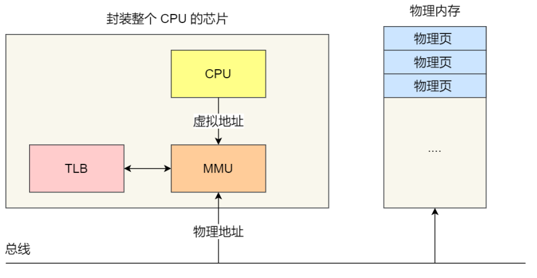

* 操作系统如何管理虚拟地址与物理地址之间的关系？

  * 内存分段：将程序按逻辑分段，如可由代码分段、数据分段、栈段、堆段组成。

    * 分段下，虚拟地址和物理地址如何映射？
      * 虚拟地址通过**段表**与物理地址进行映射，虚拟地址由段号与段内偏移量组成，通过段号在段表找到段的物理基地址，再加上段内偏移量，就找到对应的物理地址了。
    * 存在问题：
      * 内存碎片
        * 小程序内存释放时，会产生不连续的小的空闲物理内存，新程序可能无法装载。
      * 内存交换效率低
        * 内存交换：从磁盘读取数据到内存或从内存写入数据到磁盘
        * 内存碎片问题需要通过内存交换来解决，即先将不相邻的程序换出内存，再换进内存达到相邻的目的，而这样的内存交换需要换入换出一大段连续的内存数据，磁盘读写速度又很慢，所以效率非常低。

  * 内存分页：为了解决内存分段存在的问题而引出，其把**整个虚拟和物理内存空间划分成一段段固定尺⼨的⼤⼩**  ，这样的一段内存空间叫做页，Linux下，每页大小为4KB。

    * 如何解决分段的问题？

      * 采⽤了分⻚，那么**释放的内存都是以⻚为单位释放的**，也就**不会产⽣⽆法给进程使⽤的小的连续内存空间。**读写磁盘也只有少数几个页，内存交换效率相对比较高。  

    * 虚拟地址与物理地址如何映射？

      * 通过**页表**映射，虚拟地址由页号和页内偏移量组成，页表项由有效位和地址栏，地址栏表现为物理页号或者硬盘地址或者空，有效位为1时表示此虚拟页已经缓存到物理内存中了，为0则表示还不再物理内存。映射过程中如果页表项为0需要从硬盘读取虚拟页到物理内存中【缺页】，地址栏为空表示该虚拟页还未被分配。

    * 简单分页的缺陷？

      * 空间上的缺陷：页表需要记录物理内存每一页，每个进程需要一个页表，故存储页表需要很大空间。

    * 为解决上面的缺陷，提出了多级页表。

      * 多级页表：为页表分级，相当于**为页表建立页表**，最高级页表的页表项才有物理页的基地址，其他级页表的页表项指向了下一级页表的基地址。

      * 如何解决缺陷？

        根据局部性原理，一段时间内，程序执行需要访问的地址局限在某个范围，故无需一次将所有页表载入内存中，需要时才加载，但内存中的页表一定要覆盖到程序的虚拟地址，故一级页表一定要加载，其他页表需要时再加载。

      * 多级页表的缺陷？

        虚拟地址到物理地址的转换多了几道工序，带来了时间上的开销。

    * TLB：快表，基于**局部性原理**，为了加快地址转换，CPU会把最常访问的几个页表项放入内部的一个缓存硬件中，其就是TLB。

  * 段⻚式内存管理：将内存分段和内存分页**组合**起来使用。

    * 实现方式：
      * 先将程序划分为多个有逻辑意义的段。
      * 把每个段划分为多个页。
    * 虚拟地址结构：由段号、段内⻚号和⻚内位移三部分组成  。
    * 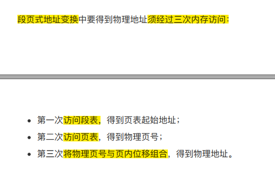

* Linux 内存管理：

  * Linux 内存主要采⽤的是**⻚式内存管理**，但同时**也不可避免地涉及了段机制**。  

  * Linux中，所有段的起始地址都相同且占据整个内存大小，即段只被用于访问控制和内存保护。

  * Linux的虚拟地址空间如何分布？

    * 虚拟地址空间的内部⼜被分为**内核空间和⽤户空间**两部 分

    * 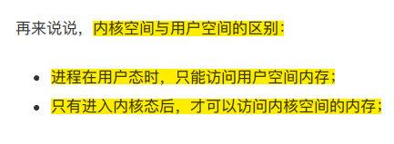

    * 

    * 用户空间的划分：划分为不同的内存段

      

## 进程与线程

* 进程：
  * 定义：**程序文件从硬盘加载到内存中**，然后**CPU执行程序中的每条指令**，这个**运行中的程序**就被称为进程。【程序是静态概念，进程是动态概念】
  * 并发和并行
  * 进程具有运行-暂停-运行的活动规律，由CPU调度完成。
  * 进程状态：
    * 处于阻塞态的进程会占用物理空间，所以在虚拟内存管理的OS中，会把阻塞态的进程占据的物理内存换出到磁盘，等需要时再换入。描述**进程没有占⽤实际的物理内存空间**的情况，这个状态就是**挂起状态**。  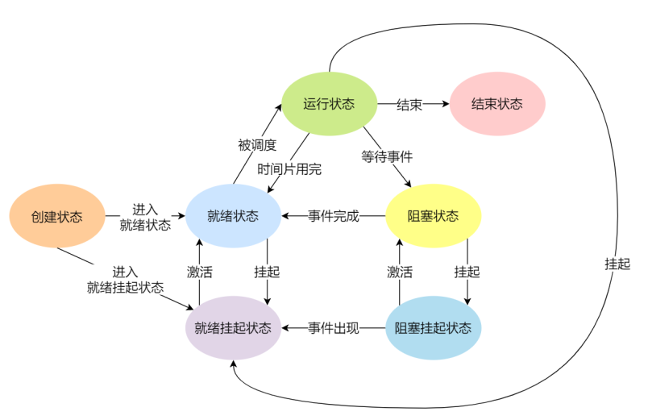
  * 进程的控制结构：
    * 进程控制块（process control block， PCB）是用来**描述进程的数据结构。**  **进程存在的唯一标识。**
    * 含有信息：
      * 进程描述信息：  
        * 进程标识符
        * 用户标识符
      * 进程控制和管理信息  
        * 进程当前状态
        * 进程优先级
      * 资源分配清单：有关内存地址空间或**虚拟地址空间的信息**，所打开⽂件的列表和所使⽤的 I/O 设备信息  
      * CPU 相关信息： CPU 中**各个寄存器的值**，当进程被切换时， **CPU 的状态信息都会被保存在相应的 PCB 中**，以便进程重新执⾏时，能从**断点处继续执⾏。**  
    * 如何组织：
      * 通常是**通过链表的⽅式**进⾏组织，把具有**相同状态的进程链在⼀起**，组成**各种队列**。
      * 还有索引方式：将**同⼀状态的进程**组织在**⼀个索引表**中，索引表项
        指向相应的 PCB，**不同状态对应不同的索引表。**
      * 选择链表的原因：插入、删除更灵活。  
  * 进程的控制：
    * 创建进程：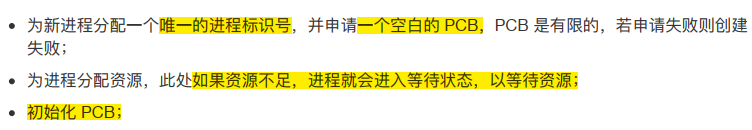
    * 终止进程：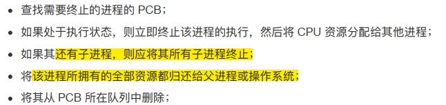
    * 阻塞进程：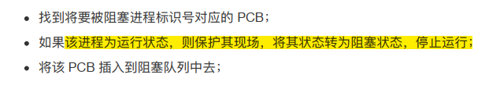
    * 唤醒进程：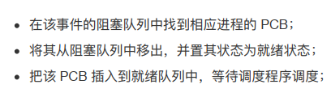
  * 进程的上下文切换：
    * 定义：进程共享CPU资源，**CPU从一个进程切换到另一个进程**，**称为进程的上下文切换。**
    * CPU上下文：CPU寄存器和程序计数器，CPU寄存器会缓存任务数据，程序计数器记录CPU执行指令的位置。
    * CPU上下文切换：先把**前⼀个任务的 CPU 上下⽂**（CPU 寄存器和程序计数器）**保存起来**，然后**加载新任务的上下⽂到这些寄存器和程序计数器，最后再跳转到程序计数器所指的新位置，运⾏新任务。**  
    * 任务包含进程、线程和中断。根据**任务的不同**，把 CPU 上下⽂切换
      分成： **进程上下⽂切换、线程上下⽂切换和中断上下⽂切换。**  
    * **进程的上下⽂切换**不仅包含了虚拟内存、栈、全局变量等**⽤户空间的资源**，还包括了内核堆栈、寄存器等**内核空间的资源**。  
    * 通常，会把**交换的信息保存在进程的 PCB**，当要运⾏另外⼀个进程的时候，我们需要从这个进程的 PCB取出上下⽂，然后恢复到 CPU 中，这使得这个进程可以继续执⾏。  
  * 多进程的问题？
    * 进程之间的通信问题。
    * 维护进程的系统开销较⼤。
  
* 线程：
  * 定义：线程是**进程当中的⼀条执⾏流程**，也是操作系统中的**能独立运行的基本单位。**
  * **同⼀个进程内多个线程**之间可以**共享代码段、数据段、打开的⽂件等资**源，但每个线程各⾃都有⼀套**独⽴的寄存器和栈**，这样可以**确保线程的控制流是相对独⽴的。**  
  * 线程优点：
    * ⼀个进程中可以**同时存在多个线程；**
    * 各个线程之间可以**并发执⾏**；
    * 各个线程之间可以**共享地址空间和⽂件等资源**；  
  * 线程的缺点：  
    * 当进程中的**⼀个线程崩溃**时，可能会导致**其所属进程的所有线程崩溃**。  
  
* 线程与进程的⽐较：

  * 
  * 开销减少的体现：
    * 线程创建时需要的资源更少
    * 线程终止时需要释放的资源相比进程更少
    * 同一进程内线程切换比进程快
    * 同一进程内线程共享内存和文件资源，线程间数据交互效率更高

* 线程的上下⽂切换：

  * 进程给线程提供了虚拟内存、全局变量等资源。
  * 线程有自己的私有数据，如栈和寄存器等，这些在上下文切换时是需要保存的。
  * 如果切换的两个进程不属于同一进程，该切换就根进程上下文切换一样。
  * 如果属于同一进程，切换时，虚拟内存等共享资源无需切换，只需切换栈、寄存器等不共享的数据。

* 线程的实现：

  * 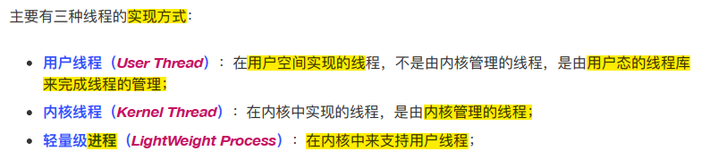

  * 用户线程和内核线程的对应关系：

    * 多对一、一对一、多对多。

  * 用户线程：基于用户态的线程管理库实现，线程控制块(Thread Control Block，TCB)也是在库里面实现的。用户线程的线程管理由用户来管理。

    其线程模型是多对一模型，**即多个⽤户线程对应同⼀个内核线程**。

    优点：

    用户线程切换可在用户态完成，无需内核态与内核态的转换，速度快。

    缺点：

    由于操作系统不参与线程调度，一个用户线程阻塞，整个进程都阻塞。

    每个用户线程得到的时间片较少，因为时间片分配是以内核线程为单位的。

  * 内核线程：内核线程是由操作系统管理的，线程对应的 TCB ⾃然是放在操作系统⾥的，这样线程管理都是**由操作系统负责。**  

    其线程模型是一对一模型。

    优点：一条内核线程阻塞，不会影响其他内核线程运行

    缺点：

    进行线程的管理，需转为内核态，开销大。

  * 轻量级进程：轻量级进程（Light-weight process， LWP）是**内核⽀持的⽤户线程**，**⼀个进程可有⼀个或多个 LWP**， **每个 LWP 是跟内核线程⼀对⼀映射**的，也就是 LWP 都是由⼀个内核线程⽀持，**且LWP 只能由内核管理并像普通进程⼀样被调度** 。  

    LWP与用户线程的对应关系：

    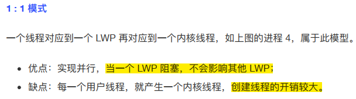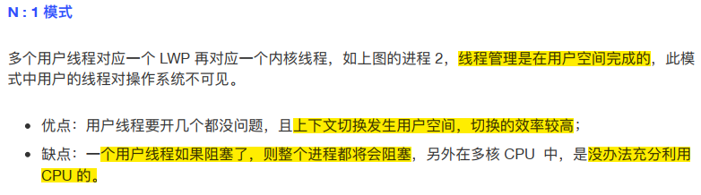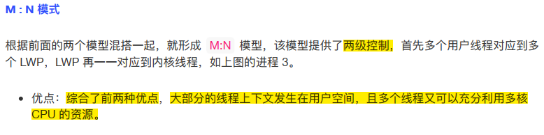

* 调度：

