# 图解系统

* 现代计算机系统由**一个或多个处理器、主存、打印机、键盘、鼠标、显示器、网络接口以及各种输入/输出设备构成的系统**。这些都属于`硬件`的范畴。

* 在硬件的基础之上，安装了一层软件，**这层软件能够根据用户输入的指令达到控制硬件的效果，从而满足用户的需求**，这样的软件称为 `**操作系统**`，它的任务就是为用户程序提供一个**更好、更简单、更清晰的计算机模型**。也就是说，操作系统相当于是一个**中间层**，为用户层和硬件提供各自的接口，屏蔽了不同应用和硬件之间的差异，达到统一标准的作用。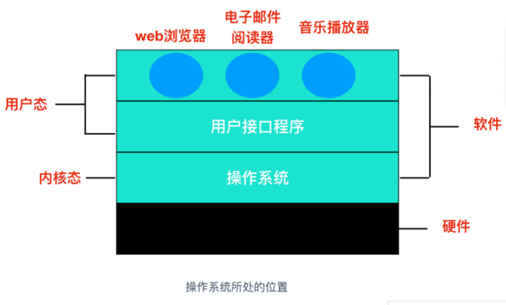

* 大部分计算机有**两种运行模式：`内核态` 和 `用户态**`，软件中最基础的部分是`操作系统`，它运行在 `内核态` 中。**操作系统具有硬件的访问权，可以执行机器能够运行的任何指令**。软件的其余部分运行在 `用户态` 下。

* 计算机硬件：

  * 包含了 5 个重要的组成部分：**运算器、控制器、存储器、输入设备、输出设备**。

  * **运算器**：用于对**数据和信息进行加工和运算**，在计算机中执行**算术和各种逻辑运算**，而运算器主要由**算数逻辑单元和寄存器**构成。

  * **控制器**：指**按照指定顺序改变主电路或控制电路的部件**，它主要起到了**控制命令执行的作用**，**完成协调和指挥整个计算机系统的操作**。控制器是由**程序计数器、指令寄存器、解码译码器**等构成。

    **运算器和控制器共同组成了 CPU**

  * **存储器**：存储器就是计算机的`记忆设备`，顾名思义，**存储器可以保存信息**。存储器分为两种，一种是**主存，也就是内存**，它是 CPU 主要交互对象，还有一种是**外存，比如硬盘软盘**等。

  * **输入设备**：输入设备是给计算机**获取外部信息的**设备，它主要包括**键盘和鼠标**。

  * **输出设备**：输出设备是给用户呈现**根据输入设备获取的信息经过一系列的计算后进行输出显示的设备**，它主要包括**显示器、打印机**等。

* 上面五部分【**运算器、控制器、存储器、输入设备和输出设备**】是冯诺伊曼的体系结构，它认为计算机必须具有如下功能：

  把需要的程序和数据**送至计算机中**。必须具有**长期存储**程序、数据、中间结果及最终运算结果的能力。能够完成各种算术、逻辑运算和数据传送等**数据加工处理**的能力。能够根据需要**控制程序走向**，并能根据指令控制机器的各部件协调操作。能够按照要求将**处理结果输出**给用户。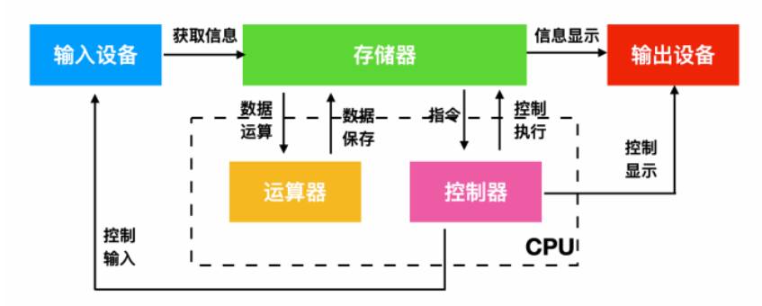

* 其余硬件：

  * 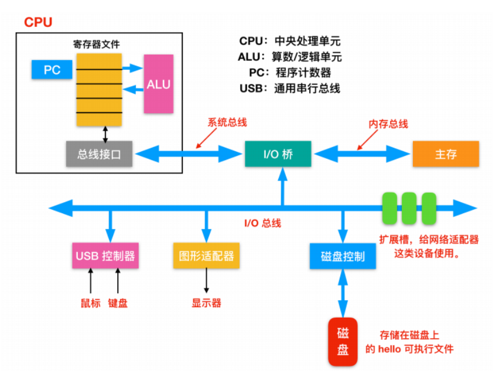
  * **总线(Buses)**：在整个系统中运行的是称为总线的电气管道的集合，这些总线**在组件之间来回传输字节信息**。通常总线被设计成**传送定长的字节块**，也就是 `字(word)`。**字中的字节数（字长）**是一个基本的系统参数，各个系统中都不尽相同。**现在大部分的字都是 4 个字节（32 位）或者 8 个字节（64 位）。**
  * **I/O 设备(I/O Devices)**：I/O 设备是**系统和外部世界的连接**。上图中有四类 I/O 设备：用于用户输入的键盘和鼠标，用于用户输出的显示器，一个磁盘驱动用来长时间的保存数据和程序。刚开始的时候，可执行程序就保存在磁盘上
    * 每个I/O 设备都**通过`控制器(controller)` 或者是 `适配器(Adapter)`连接 I/O 总线**。控制器和适配器之间的主要区别在于**封装方式**。控制器是 **I/O 设备本身或者系统的主印制板电路**（通常称作主板）上的**芯片组**。而**适配器**则是一块插在**主板插槽上的卡**。无论组织形式如何，它们的**最终目的都是彼此交换信息**。
  * **主存(Main Memory)**：主存是一个**`临时存储设备`**，而不是永久性存储，磁盘是 **`永久性存储`** 的设备。**主存既保存程序，又保存处理器执行流程所处理的数据**。从**物理组成**上说，主存是由一系列 **`DRAM(dynamic random access memory)` 动态随机存储构成的集合**。**逻辑**上说，内存就是一个**线性的字节数组**，有它唯一的地址编号，从 0 开始。一般来说，**组成程序的每条机器指令都由不同数量的字节构成**，一般程序变量相对应的**数据项的大小根据类型进行变化**。比如，在 Linux 的 x86-64 机器上，short 类型的数据需要 2 个字节，int 和 float 需要 4 个字节，而 long 和 double 需要 8 个字节。
  * **处理器(Processor)**，`CPU(central processing unit)` 或者简单的处理器，是解释（并执行）存储在主存储器中的指令的引擎。处理器的主要核心为**一个字的存储设备**（或寄存器），称为**`程序计数器(PC)`**。在任何时刻，PC 都**指向主存中的某条机器语言指令**（即**含有该条指令的地址**）。
    * **处理器的运行流程**：从系统通电开始，直到系统断电，处理器一直在**不断地执行程序计数器指向的指令**，再**更新程序计数器，使其指向下一条指令**。处理器根据其**指令集体系结构定义的指令模型进行操作**。在这个模型中，指令按照严格的顺序执行，**执行一条指令涉及执行一系列的步骤**。处理器会根据指令模型**解释指令中的位**，执行该指令指示的一些简单操作，然后更新程序计数器以指向下一条指令。指令与指令之间可能连续，可能不连续（比如 jmp 指令就不会顺序读取）
    * CPU所能够执行的简单操作：
      * **加载**：从主存拷贝一个字节或一个字到相应寄存器中。
      * **存储**：将寄存器中的内容复制到主存中的某个位置。
      * **操作**：把两个寄存器中的内容拷贝到ALU中。ALU进行算术运算，并把结果存储到寄存器中。
    * **算术逻辑单元（ALU）**是对数字二进制数执行算术和按位运算的组合数字电子电路。

## 内存管理

https://juejin.cn/post/6844903507594575886 todo CSAPP读书笔记

* 虚拟内存的提出：**多进程**环境下，为了**隔离**不同程序的内存空间并且**逻辑上使用比物理更多的内存**，提出了虚拟内存的概念。操作系统会为**每个进程独⽴分配⼀套虚拟地址空间，每个程序**只关⼼⾃⼰的虚拟地址就可以，操作系统会**自动将虚拟地址转换为对应物理地址。**【理论上虚拟内存的大小为硬盘大小】

* 具体实现：把**主存**看作为一个**存储在硬盘上的虚拟地址空间**的**高速缓存**，并且**只在主存中缓存活动区域（按需缓存）**。

* 两种地址的概念：

  * 

* 虚拟地址如何转换为物理地址：

  * 
  * CPU**将虚拟地址传给MMU，MMU进行转换，MMU会先查TLB**，如果没有，才会查页表。

* 操作系统如何**管理虚拟地址与物理地址之间的关系**？

  * **内存分段**：将**程序按逻辑分段**，如可由代码分段、数据分段、栈段、堆段组成。

    * 分段下，虚拟地址和物理地址如何映射？
      * 虚拟地址通过**段表**与物理地址进行映射，**虚拟地址由段号与段内偏移量组成**，通过**段号在段表找到段的物理基地址**，再加上**段内偏移量，就找到对应的物理地址**了。
    * 存在问题：
      * **内存碎片**
        * 小程序内存释放时，会产生不连续的小的空闲物理内存，新程序可能无法装载。
      * **内存交换效率**低
        * 内存交换：从磁盘读取数据到内存或从内存写入数据到磁盘
        * 内存碎片问题需要通过内存交换来解决，即先将不相邻的程序换出内存，再换进内存达到相邻的目的，而这样的内存交换需要换入换出一大段连续的内存数据，磁盘读写速度又很慢，所以效率非常低。

  * **内存分页**：为了解决内存分段存在的问题而引出，其把**整个虚拟和物理内存空间划分成一段段固定尺⼨的⼤⼩**  ，这样的一段内存空间叫做页，Linux下，每页大小为4KB。

    * 如何解决分段的问题？

      * 采⽤了分⻚，那么**释放的内存都是以⻚为单位释放的**，也就**不会产⽣⽆法给进程使⽤的小的连续内存空间。**读写磁盘也只有少数几个页，内存交换效率相对比较高。  

    * 虚拟地址与物理地址如何映射？

      * 通过**页表**映射，**虚拟地址由页号和页内偏移量组成**，页表项由有效位和地址栏组成，地址栏表现为物理页号或者硬盘地址或者空，有效位为1时表示此虚拟页已经缓存到物理内存中了，为0则表示还不在物理内存。映射过程中**如果页表项为0需要从硬盘读取虚拟页到物理内存中【缺页】**，地址栏为空表示该虚拟页还未被分配。

    * 简单分页的缺陷？

      * **空间上的缺陷**：页表需要记录物理内存每一页，每个进程需要一个页表，故存储**页表需要很大空间**。

    * 为解决上面的缺陷，提出了多级页表。

      * **多级页表**：为页表分级，相当于**为页表建立页表**，**最高级页表的页表项才有物理页的基地址**，**其他级页表的页表项指向了下一级页表的基地址。**

      * 如何解决缺陷？

        根据**局部性原理**，一段时间内，程序执行需要**访问的地址局限在某个范围**，故**无需一次将所有页表载入内存中**，需要时才加载，但内存中的页表**一定要覆盖到程序的虚拟地址**，故一级页表一定要加载，其他页表需要时再加载。

      * 多级页表的缺陷？

        **虚拟地址到物理地址的转换多了几道工序**，带来了**时间上的开销**。

    * TLB：快表，基于**局部性原理**，为了加快地址转换，CPU会把**最常访问的几个页表项放入内部的一个缓存硬件**中，其就是TLB。

  * **段⻚式内存管理**：将内存分段和内存分页**组合**起来使用。

    * 实现方式：
      * 先将**程序划分为多个有逻辑意义的段**。
      * 把**每个段划分为多个页**。
    * 虚拟地址结构：**由段号、段内⻚号和⻚内位移三部分组成**  。
    * 

* Linux 内存管理：

  * Linux 内存主要采⽤的是**⻚式内存管理**，但同时**也不可避免地涉及了段机制**。  

  * Linux中，**所有段的起始地址都相同且占据整个内存大小**，即段**只被用于访问控制和内存保护**。

  * Linux的**虚拟地址空间如何分布**

    * 虚拟地址空间的内部⼜被分为**内核空间和⽤户空间**两部 分

    * 

    * 

    * 用户空间的划分：划分为不同的内存段

      

## 进程管理

* 进程：
  * 定义：**程序文件从硬盘加载到内存中**，然后**CPU执行程序中的每条指令**，这个**运行中的程序**就被称为进程。【程序是静态概念，进程是动态概念】
  
  * 并发和并行
  
  * 进程具有运行-暂停-运行的活动规律，由CPU调度完成。
  
  * 进程状态：
    * 处于阻塞态的进程会占用物理空间，所以在虚拟内存管理的OS中，会把阻塞态的进程占据的物理内存换出到磁盘，等需要时再换入。描述**进程没有占⽤实际的物理内存空间**的情况，这个状态就是**挂起状态**。  
    
  * 进程的控制结构：
    * 进程控制块（process control block， PCB）是用来**描述进程的数据结构。**  **进程存在的唯一标识。**
    * 含有信息：
      * 进程**描述信息**：  
        * **进程标识符**
        * **用户标识符**
      * 进程**控制和管理信息**  
        * 进程**当前状态**
        * 进程**优先级**
      * **资源分配清单**：有关内存地址空间或**虚拟地址空间的信息**，所**打开⽂件的列表**和**所使⽤的 I/O 设备信息**  
      * **CPU 相关信息**： CPU 中**各个寄存器的值**，当进程被切换时， **CPU 的状态信息都会被保存在相应的 PCB 中**，以便进程重新执⾏时，能从**断点处继续执⾏。**  
    * 如何组织：
      * 通常是**通过链表的⽅式**进⾏组织，把具有**相同状态的进程链在⼀起**，组成**各种队列**。
      * 还有索引方式：将**同⼀状态的进程**组织在**⼀个索引表**中，索引表项指向相应的 PCB，**不同状态对应不同的索引表。**
      * 选择链表的原因：**插入、删除更灵活。**  
    
  * 进程的控制：
    * 创建进程：
    
      
    
      * 创建进程的方式：
    
        * **正在运行的程序**执行了**创建进程的系统调用**（比如 fork，UNIX中**唯一创建新进程的系统调用**，其会创建**与调用进程相关的副本**。）
          * Win32 功能调用 `CreateProcess`，会处理进程创建并将正确的程序加载到新的进程中，其通过参数指定需要执行的程序。
        * **用户请求创建一个新进程**：在许多**交互式系统**中，**输入一个命令或者双击图标就可以启动程序**，以上任意一种操作都可以选择开启一个新的进程，在基本的 UNIX 系统中运行 X，新进程将接管启动它的窗口。
        * **系统初始化（init）**：**启动操作系统时，通常会创建若干个进程。**
    
        本质都是**通过系统调用告诉操作系统创建一个新进程**，并直接或间接**指示在其中运行哪个程序**。
    
    * 终止进程：
    
      * 终止进程的方式：
        * **正常退出(自愿的)** ： 多数进程是由于完成了工作而终止。当编译器**完成了所给定程序的编译**之后，编译器**添加一个系统调用指令**告诉操作系统它**完成了工作**。这个调用在 UNIX 中是 `exit` ，在 Windows 中是 `ExitProcess`。
        * **错误退出(自愿的)**：比如执行一条**不符合编译器规范的命令**，于是就会提醒并退出。
        * **严重错误(非自愿的)**：比如存储空间不足等**硬件问题**。
        * **被其他进程杀死(非自愿的)** ： **某个进程执行系统调用告诉操作系统杀死某个进程。**在 UNIX 中，这个系统调用是 kill。在 Win32 中对应的函数是 `TerminateProcess`（注意不是系统调用）
    
    * 阻塞进程：
    
    * 唤醒进程：
    
  * 进程的上下文切换：
    * 定义：进程共享CPU资源，**CPU从一个进程切换到另一个进程**，**称为进程的上下文切换。**
    * CPU上下文：CPU寄存器和程序计数器，CPU寄存器会缓存任务数据，程序计数器记录CPU执行指令的位置。
    * CPU上下文切换：先把**前⼀个任务的 CPU 上下⽂**（CPU 寄存器和程序计数器）**保存起来**，然后**加载新任务的上下⽂到这些寄存器和程序计数器，最后再跳转到程序计数器所指的新位置，运⾏新任务。**  
    * 任务包含进程、线程和中断。根据**任务的不同**，把 CPU 上下⽂切换
      分成： **进程上下⽂切换、线程上下⽂切换和中断上下⽂切换。**  
    * **进程的上下⽂切换**不仅包含了虚拟内存、栈、全局变量等**⽤户空间的资源**，还包括了内核堆栈、寄存器等**内核空间的资源**。  
    * 通常，会把**交换的信息保存在进程的 PCB**，当要运⾏另外⼀个进程的时候，我们需要从这个进程的 PCB取出上下⽂，然后恢复到 CPU 中，这使得这个进程可以继续执⾏。  
    
  * 进程的层次结构：
    
    * 定义：在一些系统中，当一个进程创建了其他进程后，**父进程和子进程就会以某种方式进行关联**。子进程它自己就会创建更多进程，从而形成一个**进程层次结构**。
    
    * **UNIX 进程体系**：
    
      * 在 UNIX 中，**进程和它的所有子进程以及子进程的子进程共同组成一个进程组。**当用户从键盘中**发出一个信号**后，**该信号被发送给当前与键盘相关的进程组中的所有成员**（它们通常是在当前窗口创建的所有活动进程）。**每个进程可以分别捕获该信号、忽略该信号或采取默认的动作**，即被信号 kill 掉。整个操作系统中所有的进程都**隶属于一个单个以 init 为根的进程树。**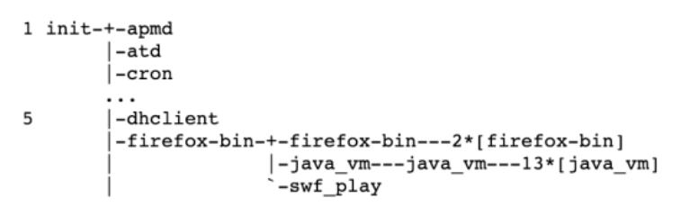
    
    * #### Windows 进程体系：
    
      * 相反，Windows 中没有进程层次的概念，**Windows 中所有进程都是平等的**，唯一**类似于层次结构**的是在创建进程的时候，**父进程得到一个特别的令牌（称为句柄）**，该句柄可以用来**控制子进程**。然而，这个令牌可能也会移交给别的操作系统，这样就不存在层次结构了。而在 UNIX 中，进程不能剥夺其子进程的 `进程权`。（这样看来，还是 Windows 比较`渣`）。
    
  * 多进程的问题？
  
    * 进程之间的通信问题。
    * 维护进程的系统开销较⼤。
  
  * 中断与调度
  
    * 电脑上有个硬件设备叫**中断控制器**，**中断控制器的输出引脚和CPU的输入引脚链接了起来**，如果发生中断，CPU的对应引脚会收到信号，CPU**每执行完一个指令后就会去检查引脚是否收到中断信号**，如果收到则**跳转到操作系统设置**的**中断处理程序**依据**中断类型进行中断处理**【CPU一样是读取指令然后执行，一般是**保存当前进程状态，执行调度程序**。】
    * 调度程序：个人理解不属于某个进程，因为它拥有最高的运行权限故无需PCB对其进行描述。
    * 中断分类：
      * 软中断：
      * 硬中断：
  
* 线程：
  * 定义：线程是**进程当中的⼀条执⾏流程**，也是操作系统中的**能独立运行的基本单位。**【线程会**有程序计数器**，用来记录接着要执行哪一条指令；线程**实际上 CPU 上调度执行的实体**。】
  * **同⼀个进程内多个线程**之间可以**共享代码段、数据段、打开的⽂件等资**源，但每个线程各⾃都有⼀套**独⽴的寄存器和栈**，这样可以**确保线程的控制流是相对独⽴的。**  
  * 线程优点：
    * ⼀个进程中可以**同时存在多个线程；**
    * 各个线程之间可以**并发执⾏**；
    * 各个线程之间可以**共享地址空间和⽂件等资源**；  
    * 线程要比进程**`更轻量级`**，由于线程更轻，所以它**比进程更容易创建，也更容易撤销**。在许多系统中，创建一个线程要比创建一个进程快 10 - 100 倍。
  * 线程的缺点：  
    * 当进程中的**⼀个线程崩溃**时，可能会导致**其所属进程的所有线程崩溃**。  
    * 由于每个线程都**可以访问进程地址空间内每个内存地址**，**因此不同线程可以读取、写入甚至擦除同一个全局变量的值**。【**线程安全问题由此发生**】
  
* 线程与进程的⽐较：

  * 
  * 开销减少的体现：
    * 线程**创建时需要的资源更少**
    * 线程**终止时需要释放的资源相比进程更少**
    * 同一进程内**线程切换比进程快**
    * 同一进程内**线程共享内存和文件资源**，**线程间数据交互效率更高**

* 线程的上下⽂切换：

  * 进程给线程提供了虚拟内存、全局变量等资源。
  * 线程**有自己的私有数据，如栈和寄存器等**，这些在**上下文切换时是需要保存的**。
  * 如果**切换的两个进程不属于同一进程**，该切换**就根进程上下文切换一样**。
  * 如果**属于同一进程**，切换时，**虚拟内存等共享资源无需切换**，只需**切换栈、寄存器等不共享的数据**。

* 线程的实现：

  * 

  * **用户线程和内核线程的对应**关系：

    * 多对一、一对一、多对多。

  * 用户线程：**基于用户态的线程管理库实现**，线程控制块(Thread Control Block，TCB)也是在库里面实现的。**用户线程的线程管理由用户来管理。**

    其线程模型是多对一模型，**即多个⽤户线程对应同⼀个内核线程**。

    优点：

    用户线程切换可在用户态完成，**无需用户态与内核态的转换，速度快。**

    缺点：

    由于操作系统不参与线程调度，**一个用户线程阻塞，整个进程都阻塞。**

    每个用户线程得到的时间片较少，因为**时间片分配是以内核线程为单位的**。

  * 内核线程：内核线程是由操作系统管理的，**线程对应的 TCB ⾃然是放在操作系统⾥的**，这样线程管理都是**由操作系统负责。**  

    其线程模型是一对一模型。

    优点：**一条内核线程阻塞，不会影响其他内核线程运行**

    缺点：

    进行**线程的管理，需转为内核态，开销大**。

  * 轻量级进程：轻量级进程（Light-weight process， LWP）是**内核⽀持的⽤户线程**，**⼀个进程可有⼀个或多个 LWP**， **每个 LWP 是跟内核线程⼀对⼀映射**的，也就是 LWP 都是由⼀个内核线程⽀持，**且LWP 只能由内核管理并像普通进程⼀样被调度** 。  

    LWP与用户线程的对应关系：

    

* 调度：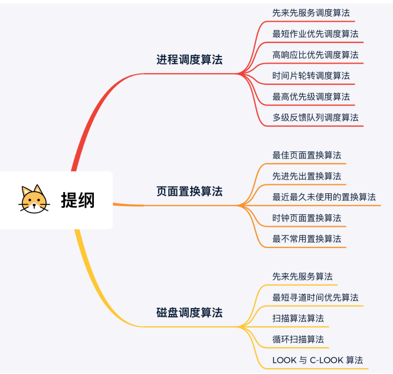

  * 何时**发生CPU调度**：

    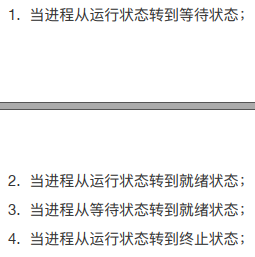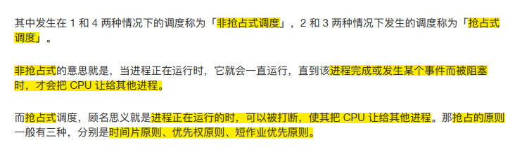

  * **先来先服务调度**算法【FCFS]

    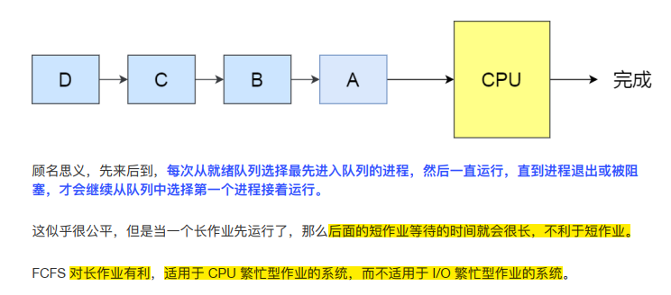

  * **最短作业优先调度**算法【SJF】

    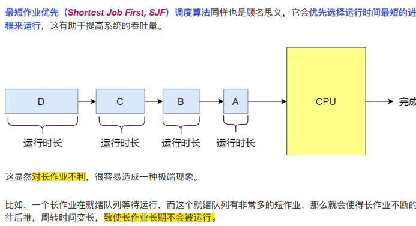

  * **高响应比优先调度**算法【HRRN】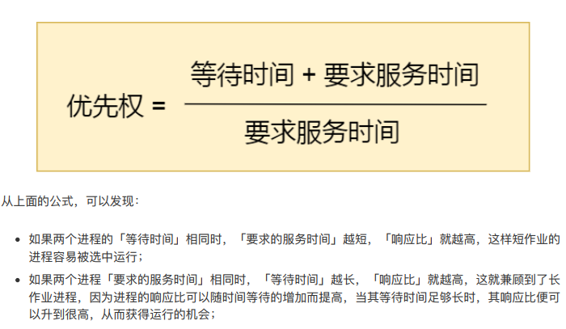

  * 时间片轮转调度算法【RR】

    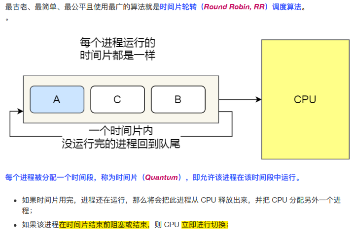

  * 最高优先级调度算法【HPF】

    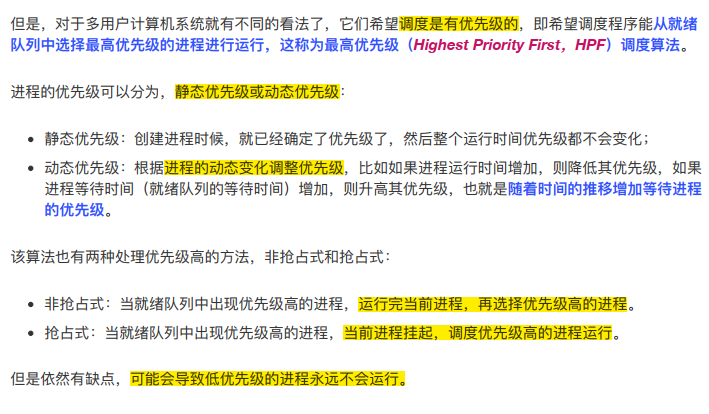

  * 多级反馈队列调度算法【MFQ】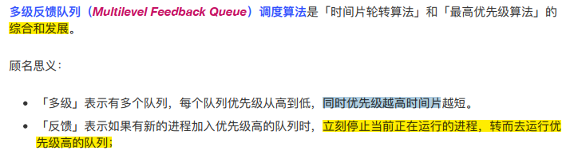

    

## 文件管理

## 设备管理
