# 操作系统

## 操作系统概述

### 操作系统的概念、特征、功能和结构

#### 计算机系统层次结构

* 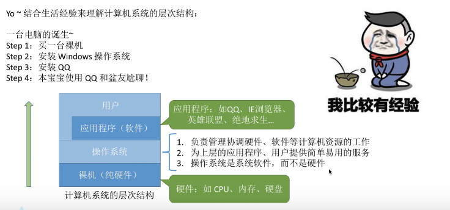

* 操作系统管理各种计算机硬件，为应用程序提供基础，并充当计算机硬件和用户的中介。
* 用户和操作系统相接，无需软件也可直接使用操作系统。

#### os概念

* **操作系统**是指控制和管理整个计算机系统的硬件和软件资源，并合理的组织调度计算机的工作和资源的分配，以提供给用户和其他软件方便的接口和环境集合。计算机操作系统是随着计算机研究和应用的发展逐步形成并发展起来的，它是计算机系统中最基本的**系统软件。**

#### os的功能和目标

* 为了给多道程序提供良好的运行环境

  操作系统应具有几方面的功能：

  处理器管理、存储器管理、设备管理和文件管理。

  为了方便用户使用操作系统，还必须向用户提供接口。

  同时操作系统可用来扩充机器，以提供更方便的服务、更高的资源利用率。

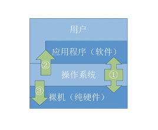

##### 作为系统资源的管理者（软件、硬件、文件等）

1） 处理器管理

在多道程序环境下，处理器的分配和运行都是以进程为基本单位，因而对处理器的管理可归结为对进程的管理。进程管理的主要功能有：进程控制，进程同步，进程通信，死锁处理，处理器调度等。

2） 存储器管理

存储器管理的主要任务是为多通道程序的运行提供良好的环境，方便用户使用以及提高内存的利用率。因此，存储器管理应具备：内存分配、地址映射、内存保护与共享和内存扩充等。

3） 文件管理

文件管理主要包括文件的存储空间管理、目录管理及文件读写管理及保护等。

4） 设备管理

设备管理的主要任务就是完成用户的IO请求，方便用户使用各种设备，并提高设备的利用率，主要包括混充管理、设备分配、设备处理和虚拟设备等功能。

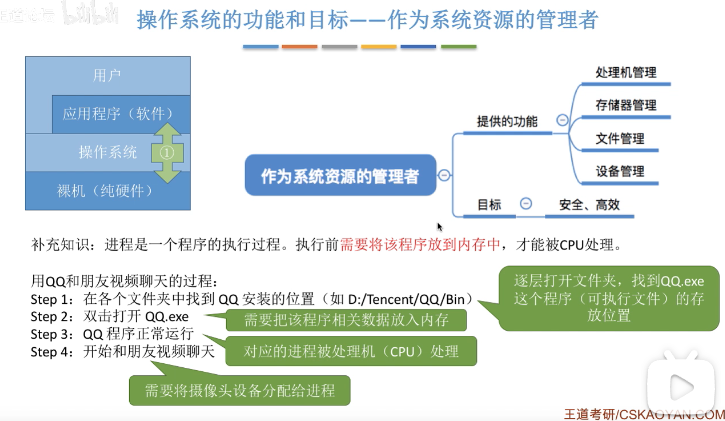

##### 作为用户与计算机硬件之间的接口

* 要为其上层用户、应用程序提供简单易用的服务，需要实现的功能。
* 为方便用户使用操作系统，操作系统还提供了用户接口。操作系统提供的接口主要分为两类：
  * 一类是命令接口，用户利用这些操作命令来组织和控制作业的执行；
  * 另一类是程序接口，编程人员可以使用它们来请求操作系统服务。

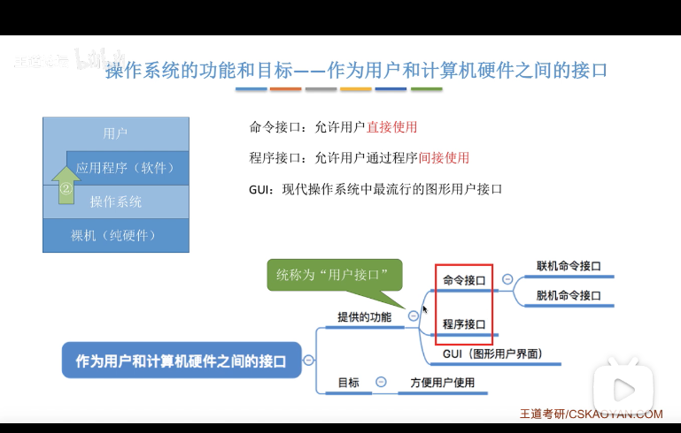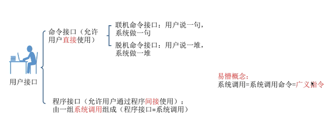

###### 命令接口

* 联机命令接口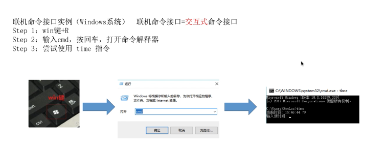
* 脱机命令接口【将多个指令合并为指令清单】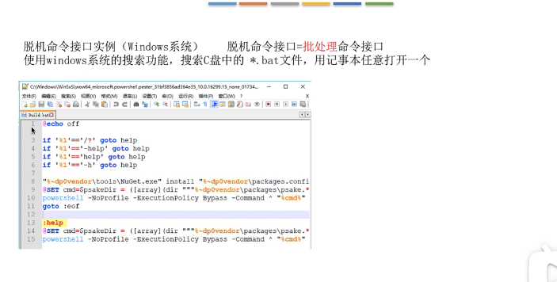

###### 程序接口

* 

###### GUI

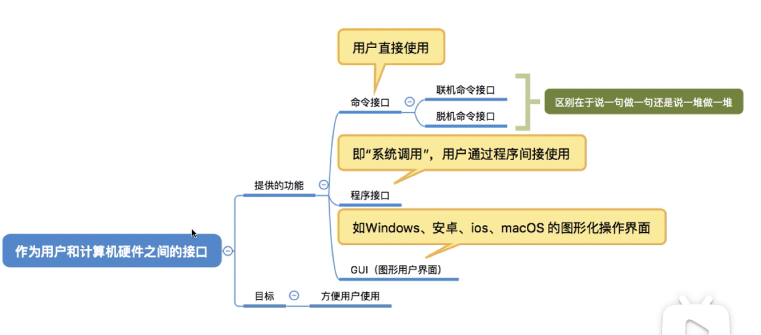

##### 作为最接近硬件的层次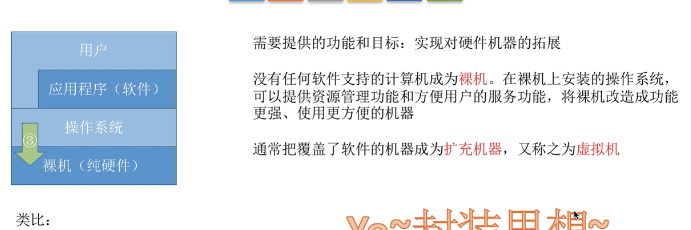

### os的特征

* 

#### **并发、并行**

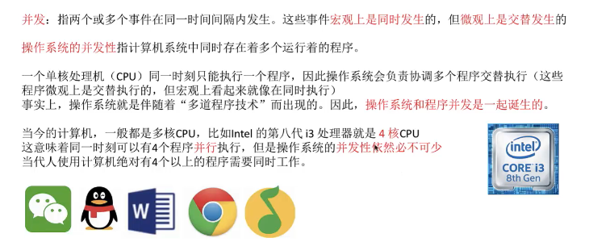

#### **共享**

* 资源共享即共享，是指**系统中的资源可供内存中多个并发执行的进程共同使用。**

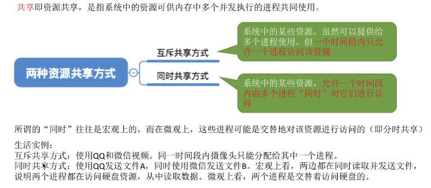

##### **并发和共享的关系**

* 并发和共享是操作系统两个最基本的特征，这两者之间又是互为存在条件的：1资源共享是以程序的并发为条件的，若系统不允许程序并发执行，则自然不存在资源共享的问题；2若系统不能对资源共享实施有效地管理，也必将影响到程序的并发执行，甚至根本无法并发执行。

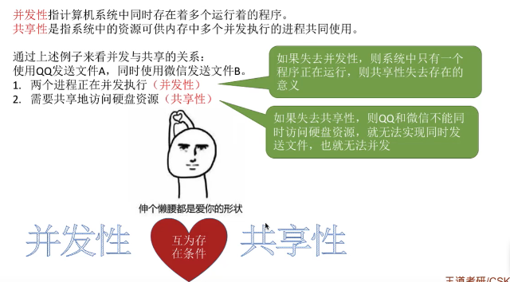

#### **虚拟**

* 在操作系统中利用了多种虚拟技术，分别用来实现**虚拟处理器、虚拟内存和虚拟外部设备**。

* **时分复用**技术：

  * 在虚拟处理器技术中，是通过多道程序设计技术，让多道程序并发执行的方法，来**分时使用**一台处理器的。

* **空分复用**技术：
  
  * 通过虚拟存储器技术，将一台机器的**物理**存储器变为虚拟存储器，一边从**逻辑上**来扩充存储器的容量。
  * 通过虚拟设备技术，将一台**物理**IO设备**虚拟为多台逻辑**上的IO设备，并允许每个用户占用一台逻辑上的IO设备，这样便可使原来仅允许在一段时间内有一个用户访问的设备，变为在一段时间内允许多个用户同时访问的共享设备。
  
  
  

##### **虚拟技术**

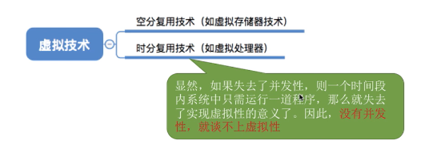

#### **异步**

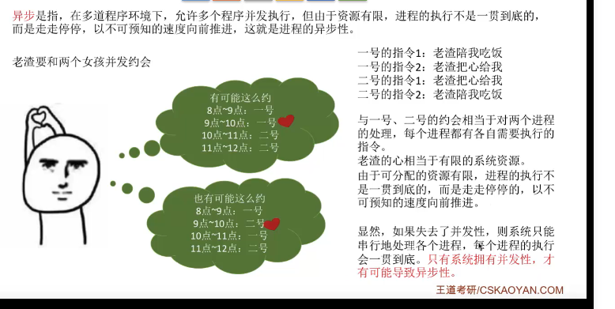

* 异步性使得操作系统运行在一种随机的环境下，可能导致进程产生于时间有关的错误。但是只要运行环境相同，操作系统必须保证多次运行进程，都获得相同的结果。

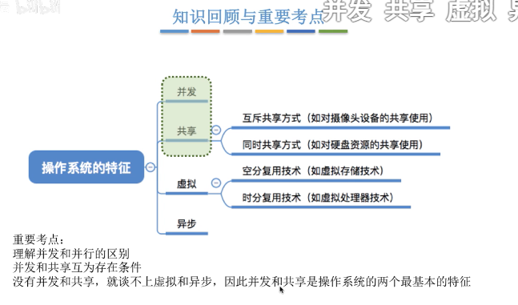

### os的发展和分类

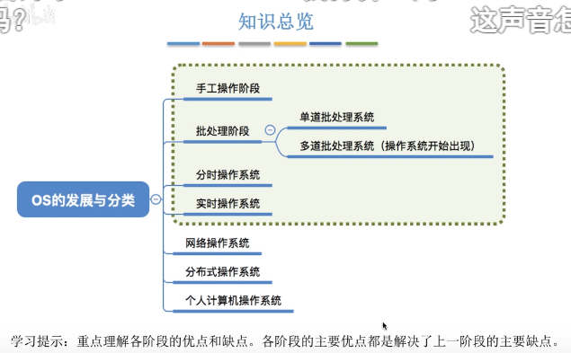

#### 手工操作阶段

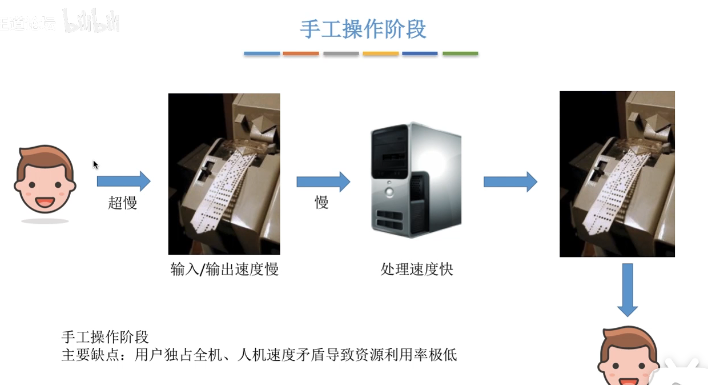

#### 批处理阶段

* 批处理技术是指计算机系统**对一批作业自动进行处理**的一种技术。批处理阶段的特点是：用户不用与计算机直接打交道，而是通过专门的操作员来完成作业的输入输出。随着外围设备的迅速发展，后来又出现了脱机批处理系统，即主机直接与磁盘通信。

##### 单道批处理系统

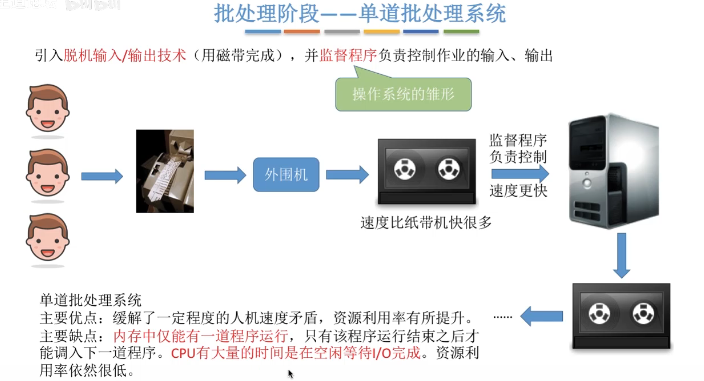

##### 多道批处理系统

##### 资源利用率提升

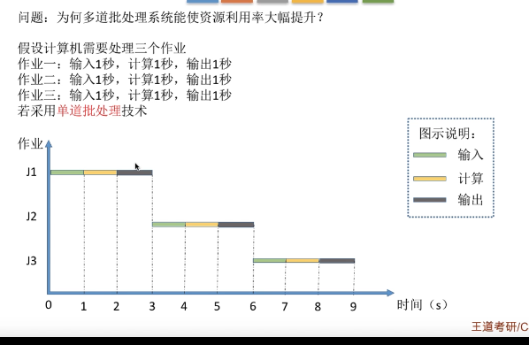

* 类似流水线

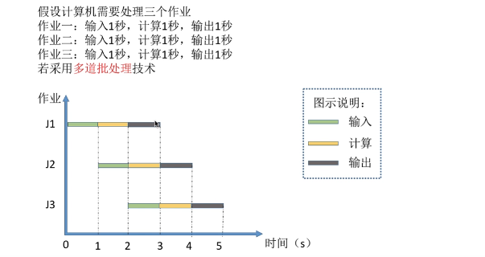

#### 分时操作系统

* 所谓分时系统就是**把处理器的运行时间分成很短的时间片，按时间片轮流把处理器分配给各联机作业使用。**若某个作业再分配给他的时间片内不能完成其计算，则改作业暂时停止运行，把处理器让给其他作业使用，等待下一轮再继续运行，由于计算机速度很快，作业运行轮转的很快，给每个用户的感觉好像是自己独占一台计算机。

#### 实时操作系统

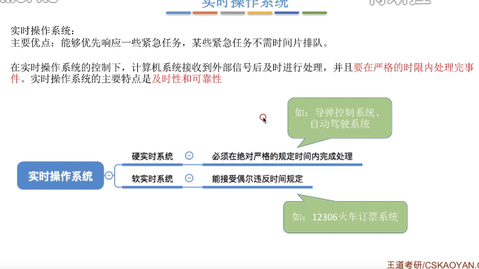

#### 其他几种操作系统

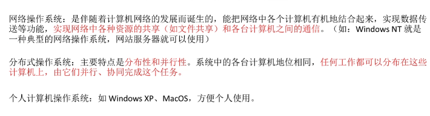

#### 总结

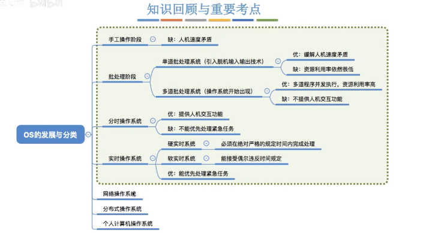

### os的运行机制与体系结构

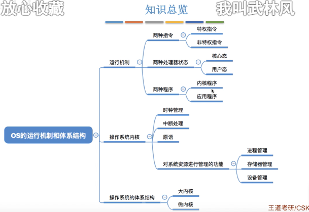

#### 运行机制

* 计算机系统中，通常CPU执行两种不同性质的程序，一种是操作系统内核程序；另一种是用户自编程序或系统外城的应用程序。对操作系统而言，这两种程序的作用不同，前者是后者的管理者和控制者，因此“管理程序”要执行一些**特权指令**，而“被管理程序”出于安全性考虑，不能执行这些指令。**所谓特权指令，是指计算机中不允许用户直接使用的指令，如IO指令、置中断指令。**
* 操作系统在具体实现上划分了用户态和核心态，以严格**区分两种类程序。**
* 一些**与硬件关联较紧密的模块**，诸如时钟管理程序、中断处理程序、设备驱动程序等处于最底层。其次是**运行频率较高的程序**，诸如进程管理、存储器管理和设备管理等。这两部分内容**构成了操作系统的内核。这部分内容的指令操作工作在核心态。**

##### 两种指令

###### 指令的定义

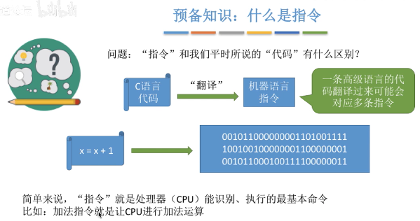

###### 特权与非特权指令

##### 两种处理器状态

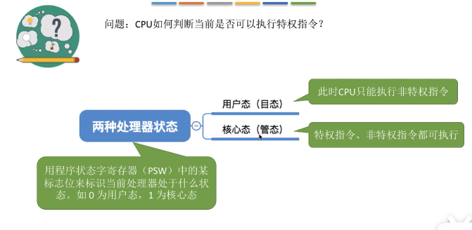

* 为了防止用户系统中使用特权指令，**用户态下只能使用除特权指令以外的指令，核心态下可以使用全部指令。**所以**把用户程序放在用户态下进行，而操作系统中必须使用特权指令的那部分程序在核心态下运行，保证了计算机系统的安全可靠。**从**用户态转换为核心态**的唯一途径就是**中断或异常**。

##### 两种程序

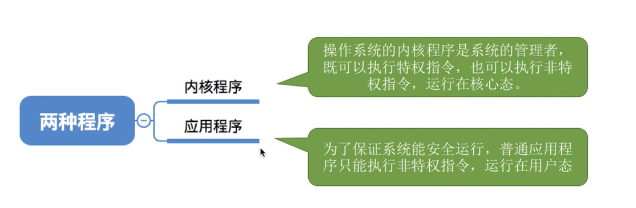

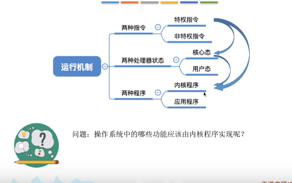

#### 操作系统内核

* 作用：帮助**管理和调度计算机资源**。

* 内核是计算机上配置的最底层软件，是计算机功能的延申。不同系统对内核的定义稍有区别，**大多数操作系统内核包括四个方面的内容。**

  （1）**时钟管理**

  * 在计算机外部设备中，时钟是最关键的设备。时钟的第一功能是计时，操作系统需要通过时钟管理，向用户提供标准的系统时间。另外，通过**时钟中断的管理**，可以实现进程的切换。诸如：在分时操作系统中，采用时间片轮转调度的实现；在实时系统中，按截止时间控制运行的实现；在批处理系统中，通过时钟管理来衡量一个作业的运行程度等。因此，系统管理的方方面面无不依赖于它。

  （2）**中断机制**

  * 引入中断技术的初衷是提高多道程序运行环境中CPU的利用率，而且主要是针对外部设备的。后来的到发展，形成了多种类等，成为操作系统各项操作的基础。例如键盘或鼠标信息的输入、进程的管理和调度、系统功能的调用、设备驱动、文件访问等，无不依赖于中断机制。可以说，**现代计算机系统是靠中断驱动的软件。**

    **即对正在运行的某个动作进行中断**

  （3）原语

  * 按层次结构涉及的操作系统，**底层必然是一些可被调用的公用小程序**，他们各自完成一个规定的操作。其特点是：1.他们处于操作系统的最底层，是最接近硬件的部分。2.这些程序的运行具有原子性——其操作只能一起合成。3.这些程序的运行时间都较短，而且调用频繁。

    通常把具有这些特点的程序成为原语。**定义原语的直接方法是关闭中断，让她的所有动作不可分割的进行完再打开中断。**

    系统中的设备驱动、CPU切换、进程通信等功能中的部分操作都可以定义为原语，是他们成为内核的组成部分。

  （4）**系统控制的数据结构及处理【对系统资源进行管理】**

  * 为了管理各种系统资源，需要记录资源的状态信息，系统中用来**登记状态信息的数据结构很多**。比如作业控制块、进程控制块、设备控制块、各类链表、消息队列、缓冲区、空闲区登记表、内存分配表等。为了实现有效地管理 ，系统需要一些基本的操作，常见的操作有以下三种：

    1） 进程管理：进程状态管理、进程调度和分配、创建与撤掉进程控制块的队列维护操作等。

    2）存储器管理：存储器的空间分配和回收管理、内存信息保护程序、代码对换程序等。

    3） 设备管理：缓冲区管理、设备分配和回收等。

    从上述内容可以了解，核心态指令实际上包括系统调用类指令和一些针对时钟、中断和原语的操作指令。

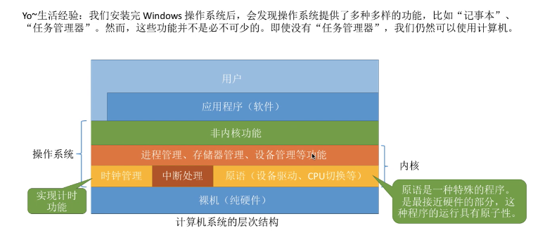

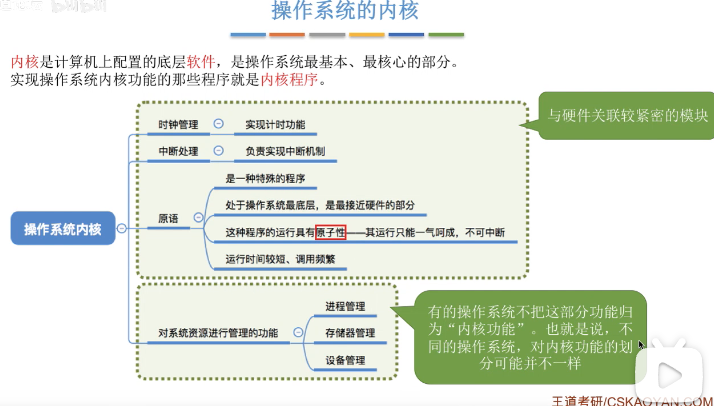

#### 操作系统的体系结构

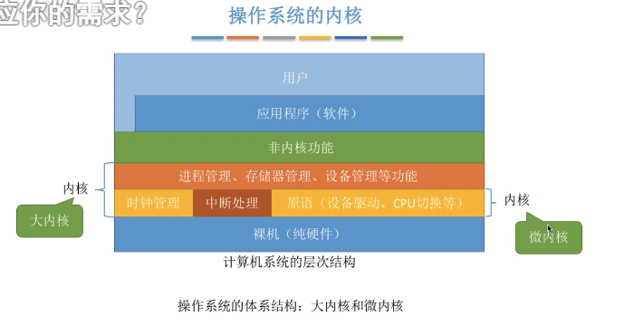

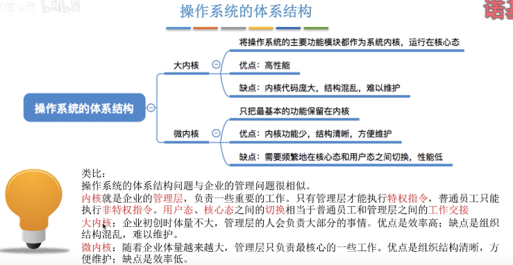

#### 总结

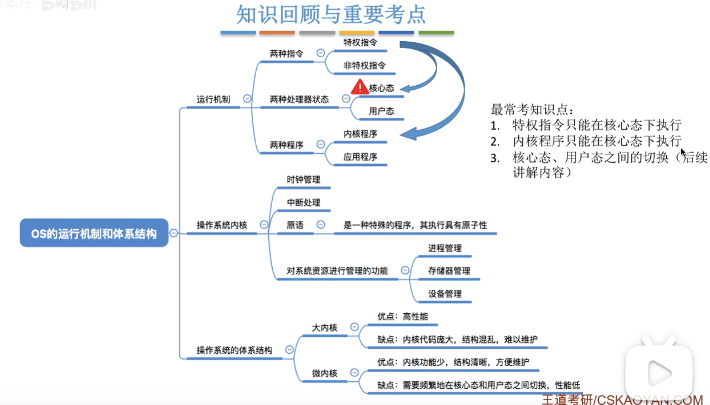

### 中断和异常

#### 中断机制的诞生

#### 中断的概念和作用

* CPU分配给程序的时间片用完、程序需等待设备工作完成或设备完成工作，都会发送中断信号，内核处理中断信号，调度程序运行。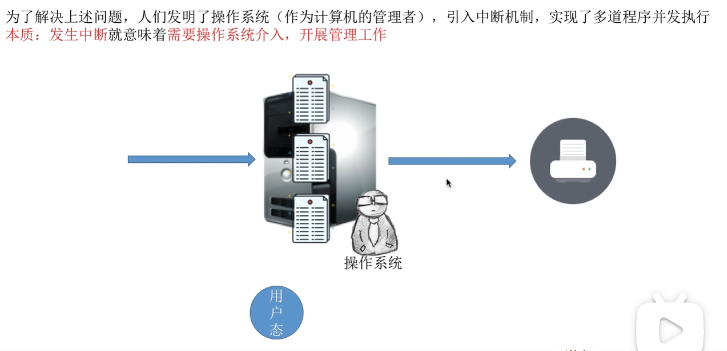

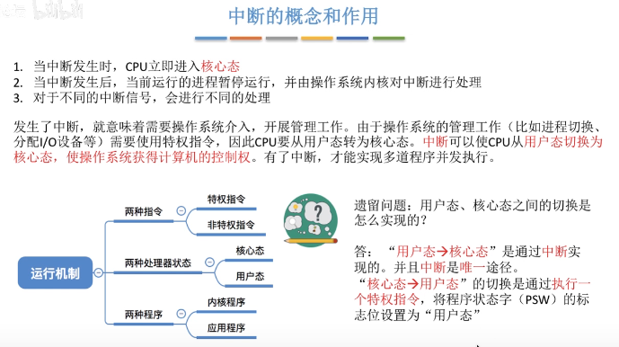

#### 中断的分类

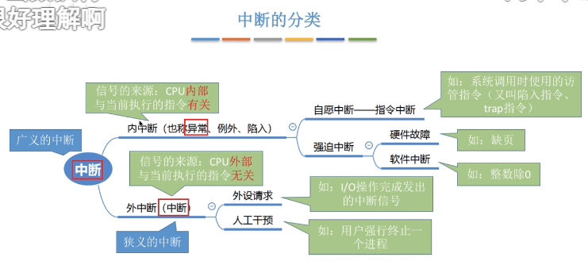

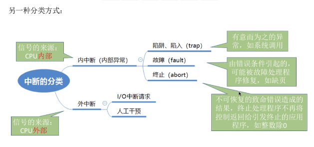

#### 外中断处理过程

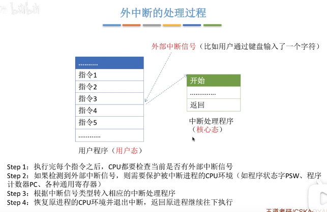

#### 总结

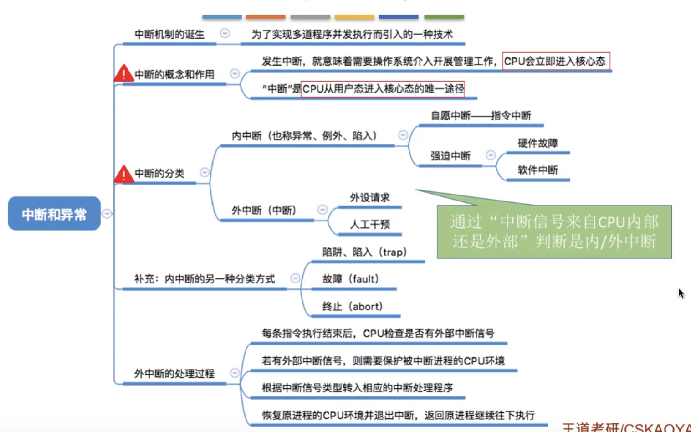

### 系统调用

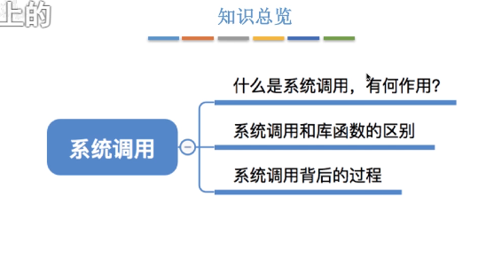

#### 什么是系统调用，有何作用

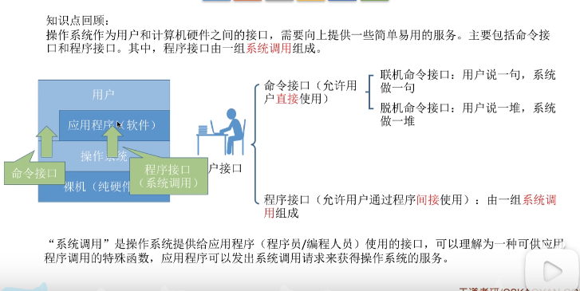

#### 系统调用和库函数的区别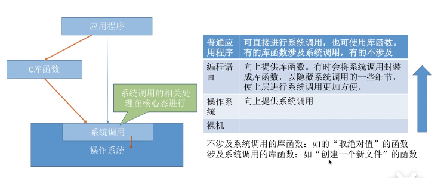

#### 系统调用背后的过程

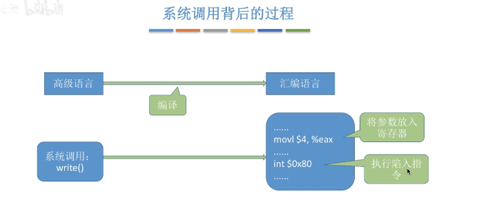

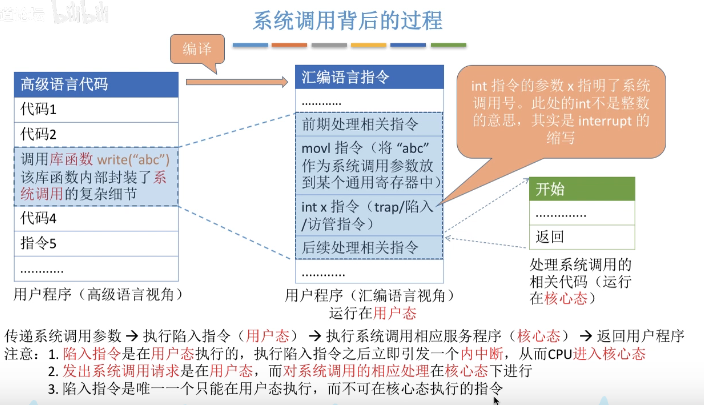

#### 系统调用产生的访管中断

* 

#### 总结

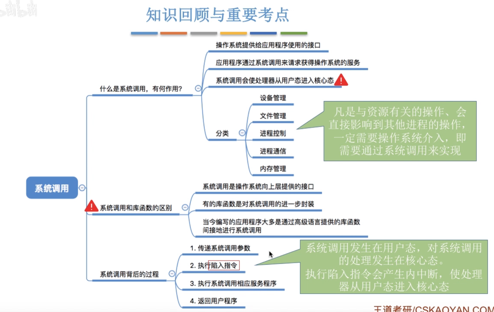

## 进程管理

### 进程的定义、组成、组织方式

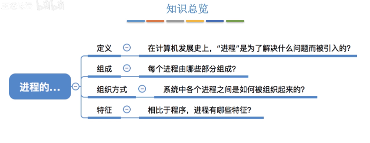

#### 进程的定义

* 背景：

  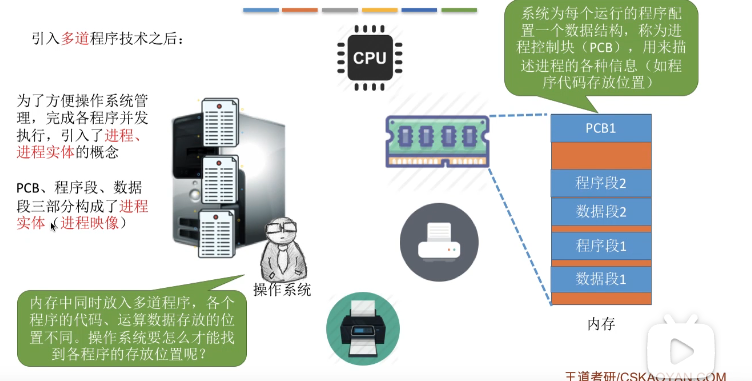

* 

#### 进程的组成

* 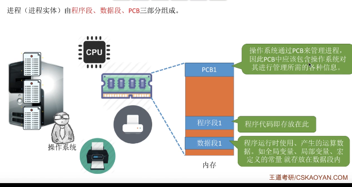

* PCB： 存放**进程管理所需的数据**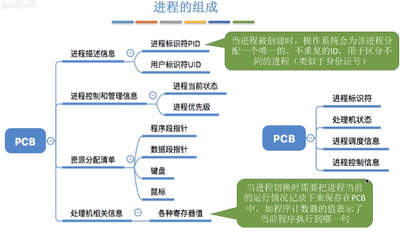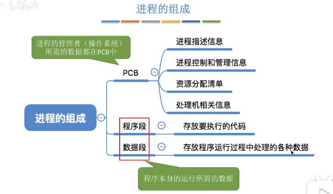

#### 进程的组织

* 为了对PCB进行有效的管理，需要使用适当的方式把PCB组织起来
* 不同的组织方式对应不同的存储结构。

##### 链接方式


##### 索引方式


#### 进程的特征


#### 总结

### 进程的状态与转换


#### 进程的状态

**三种基本状态**


**另外两种状态**


#### 进程状态的转换

 

#### 总结


### 进程控制


#### 定义


#### 如何实现进程控制


#### 进程控制相关的原语

 


#### 总结


### 进程通信


* 三大类方式实现
* 体会各种实现方式背后的流程

#### 什么是进程通信

* 每个进程的**⽤户地址空间都是独⽴**的，⼀般⽽⾔是**不能互相访问的**，但**内核空间是每个进程都共享**的，所以**进程之间要通信必须通过内核。**  

* 

#### 管道通信

* 所谓管道，就是**内核中的一串缓存**，**管道内数据单向传输，数据形式为字节流**
* 优点：使用简单。
* 缺点：写进程的数据在写入管道内的数据**被读取前会被阻塞**，故**通信效率较低**，**不适合进程间频繁地交换数据**。

##### 匿名管道通信

* 匿名管道没有对应的实体文件，读端和写端的位置信息存在于内存中，其读端和写端的位置信息只能在共享内存的情况下传递，所以常用于父子进程间的通信。

##### 命令管道通信

* 会创建对应的实体文件保存读写端的位置，故进程只要使用这个文件，就可以相互通信。

* 

#### 消息传递

* 

#### 消息队列 【同消息传递】 

* 优势：适合进程间频繁地交换数据
* 通信过程：通信前双方需要先定义好消息的数据结构，A进程把数据放在对应的消息队列后，B进程**需要时再从队列中读取就行了**。【可以延迟读取】
* 实现：通过**内核中的消息链表**实现，进程读取消息后，内核会将这个消息删除。
* 缺点：
  * 不适合大数据的传输，每个消息都有长度限制。
  * 存在用户态与内核态之间的**数据拷贝开销**【写入读取过程】即需要系统调用，需要消耗更多时间。

#### 共享存储

*  

#### 共享内存【同共享存储】

* 优势：**无需发生内核态到用户态的转换。**
* 实现：从进程A和进程B的**虚拟内存空间中取一部分映射到物理内存中**达到通信的目的。
* 适合实时性要求高的。
* 劣势：多个进程修改同一个共享内存，**可能会有冲突。**

#### 信号量

* 主要用于**实现进程间的互斥与同步**，保证**进程使用共享内存方式进行通信时不会出现冲突。**

#### 信号

* 用于**通知进程响应某个事件**。

#### Socket  

* 主要用于不同主机进程间的通信。
* 其相当传输层服务的接口。

#### 总结

* 

### 线程概念和多线程模型 

* 

#### 引入线程后带来的变化

* 

#### 线程属性


#### 线程实现方式


#### 多线程模型

* 多对一模型：
* 一对一模型：

* 多对多模型：

### 线程与进程的区别

* 

#### 总结

* 

### 处理机调度的概念、层次


#### 调度的基本概念

* 

#### 三个层次

##### 高级调度


##### 中级调度


##### 低级调度


#### 进程的挂起态与七状态模型

#### 三层调度的联系、对比


#### 总结


### 进程调度的时机、切换与过程

* 

#### 时机


 

* 根据当前进程**是否可以被强行剥夺处理机资源**引出了进程调度的方式

#### 进程调度的方式


#### 进程的切换与过程


#### 总结


### 调度算法的评价指标


#### CPU利用率

* 

#### 系统吞吐量

* 

#### 周转时间

* 即等待时间+完成时间

* 

#### 带权周转时间


#### 等待时间

* 

#### 响应时间

* 

#### 总结


### 调度算法


#### FCFS


* 只要等待下去就会得到服务，故不会饥饿

**例题**

#### SJF


**例题**

* 非抢占式

* 抢占式

* 细节：

  

#### 对FCFS和SJF的思考

* 

#### HRRN


**例题**

* 

#### 总结


2024-01-08 16:09 todo


#### 时间片轮转(RR)

**例题**


* 不同时间片大小的影响：

#### 优先级调度


**例题**

* 非抢占式
* 抢占式


#### 多级反馈队列

**例题**


#### 总结


### 进程同步、进程互斥

#### 什么是进程同步


#### 什么是进程互斥


#### 总结


### 进程互斥的软件实现方法


#### 单标志法


#### 双标志先检查


#### 双标志后检查


* 出现问题的原因都主要是异步性引起的。。

#### Peterson算法

* 可谦让其他进程

#### 总结


### 进程互斥的硬件实现方法


#### 中断屏蔽


* 多处理机时存在进程并行访问临界区的情况

#### TestAndSet指令


#### Swap指令


#### 总结


### 信号量机制


#### 整型信号量

#### 记录型信号量


**例子**


**细节**


#### 总结


### 用信号量机制实现进程互斥、同步、前驱关系


#### 进程互斥


#### 进程同步 


**例题**


#### 前驱关系


#### 总结


### 生产者消费者问题

#### 分析

 


#### 实现


#### 改变相邻P、V操作的顺序的影响


* 实现互斥操作一定要在实现同步操作之后，避免死锁现象。
* 使用产品操作不能放到PV之间，否则访问临界区需要耗费更长时间，使得进程并发度降低

#### 总结


### 多生产者、多消费者问题

#### 问题描述

#### 分析


#### 如何实现


#### 去掉互斥信号量可以实现互斥

#### 缓冲区大小有2个时


#### 总结


#### 细节


### 抽烟者问题

#### 问题描述


#### 分析

 


#### 实现


#### 总结


### 读者、写者问题

#### 问题描述


#### 分析 


#### 实现

* 读进程优先


* 写进程优先【写进程到达优先让写进程处理】

#### 总结


### 哲学家进餐问题

#### 问题描述


#### 问题分析


* 死锁避免：主要是避免资源同时都被占有

  法一、二

  

​		法三：

#### 总结


### 管程

#### 导图


#### 为什么要引入管程

* 互斥和同步使用信号量机制存在问题
* 管程也是用来实现进程的互斥和同步的【进程需要访问临界资源】

#### 管程的定义和基本特征

* 类似Java中的类

#### 用管程解决生产者消费者问题


#### Java中类似于管程的机制

#### 总结

* 管程就是运用了封装思想，把进程同步、互斥复杂的细节隐藏在函数内。


### 死锁的概念

#### 导图


#### 什么是死锁

* 各进程因**互相等待对方持有的资源**，导致**各进程都阻塞**，无法推进的现象。

例1：


例2：

#### 死锁、饥饿、死循环的区别


#### 死锁产生的必要条件


#### 什么时候会发生死锁


#### 死锁的处理策略


#### 总结


### 死锁的处理策略：预防死锁

#### 导图


#### 破坏互斥条件


#### 破坏不剥夺条件


#### 破坏持有并等待条件


#### 破坏循环等待条件

* 避免“环”的出现

#### 总结

* 预防死锁的方法或多或少都有缺点

### 避免死锁

#### 导图


#### 什么是安全序列

**概念**


#### 银行家算法


* 手算方法：

* 找不到安全序列的例子：

* 代码实现：

#### 总结


### 死锁的检测和解除

#### 导图

* 预防死锁是在各进程执行前破坏死锁的四个必要条件来完成的
* 避免死锁则是在各进程执行过程中通过一定算法如银行家算法检查某个请求是否可能让系统处于不安全状态来完成的。

#### 死锁的检测

* 定义一个**资源分配图**，两种节点、两种边，并判断是否可以消掉所有边。

* 数据结构


* 思想：

* 算法：

#### 死锁的解除


#### 总结


## 内存管理

### 内存的基础知识

#### 导图


#### 什么是内存，有何作用

* 不同计算机字长不同。
* 内存速度相比外存更快。

#### 进程的运行原理

##### 指令工作原理

* 代码编译后生成机器指令【二进制】，其可被cpu识别，用于指定操作
* 每个指令会有操作码【告诉cpu干什么】，指令后半部分会有对应参数

##### 逻辑地址vs物理地址


##### 从写程序到程序运行


##### 装入模块装入内存

* 装入模块从起始物理地址开始：
* 不从起始物理地址开始：

###### 绝对装入

* 编译程序负责


###### 静态重定位

* 装入程序负责


###### 动态重定位

* 现代计算机所使用
* 重定位寄存器的支持
* 和分页、分段分配一起理解
* 

##### 链接的三种方式

* 静态链接：

  

* 装入时动态链接：

* 运行时动态链接：

  

#### 总结


### 内存管理的概念

#### 导图


#### 内存空间的分配与回收


#### 内存空间的扩展

#### 地址转换


#### 内存保护

* 法一：设置上下限寄存器

  

* 法二：采用重定位寄存器和界地址寄存器

  

#### 总结


### 覆盖与交换

#### 导图


#### 覆盖技术

* 概念和思想：

  

* 例子与缺点：

#### 交换技术

* 处理机中期调度是实现交换技术的一种策略

  

* 细节：

  

#### 总结


### 连续分配管理方式

#### 导图


#### 单一连续分配

* 内存中同一时刻只能有一个进程
* 

#### 固定分区分配

* 分为分区大小相等和不等
* 

* 如何记录各个分区的分配与回收情况：

#### 动态分区分配

* 

* 问题1：空闲分区表和空闲分区链

  

* 问题2：

* 问题3：

  假设某种算法这样分配：

  

  假设某种算法这样分配：

  回收：

##### 内部、外部碎片问题

* 

#### 总结


### 动态分区分配算法

#### 导图


#### 首次适应算法【最先适应】


#### 最佳适应算法


#### 最坏适应算法


#### 邻近适应算法


#### 总结


### 基本分页存储管理的基本概念

* 非连续分配方式的提出：

#### 导图


#### 基本分页存储管理

* 基于“固定分区分配方式”进行改造【主要是减少分区大小】

  

#### 分页存储管理的基本概念


#### 如何实现地址转换

* 对应页号地址+在对应页的偏移量【类似动态重定位思想】


* 简易计算【页号、页内偏移量都为2的整数幂】【内存按字节编址】

  

#### 逻辑地址结构

* 页大小为4字节

#### 页表

* 
* 页号隐含的概念：

#### 总结


### 基本地址变换机构【分页存储管理】

#### 导图


#### 基本地址变换机构

* 计算过程：


* 例子：

#### 对页表项大小的进一步探讨

* 内存中存放页表时，一个页框可能不能存放所有的页表项，可能存在页内碎片。

#### 总结

### 具有快表的地址变换机构

#### 导图


#### 局部性原理

* 减少访问页表【内存】的次数


#### 什么是快表（TLB)

* 基于快表的地址变换流程：

  

#### 引入快表后，地址的变换机构


#### 总结


### 两级页表

#### 导图


#### 单级页表存在的问题

* 第一个问题【页表占用了太多内存块】

  

* 第二个问题

*  再次利用分页思想第一个问题

#### 两级页表的原理、地址结构

* 变化过程：

* 

#### 如何实现地址变换

* 

#### 如何解决单级页表的问题

* 使用虚拟存储技术解决第二个问题

#### 需要注意的几个细节

* 多级页表下，各级页表的大小不能超过一个页面

#### 总结


### 基本分段存储管理方式

#### 导图


#### 分段

