# 趣谈网络

## 01 为什么学习网络协议

* 协议三要素
  * 语法
  * 语义
  * 顺序
* 通过协议让人类和计算机沟通，让计算机知道人类让它做什么。只让一台计算机工作意义不大，而**网络协议能让多个计算机根据某种规则互相协作，共同工作。**
* 网络协议是分层的：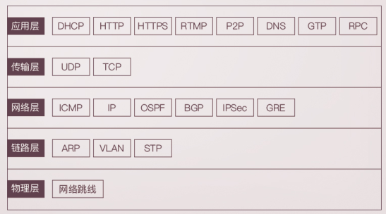

* ip地址**通过DHCP协议配置**，其和**子网掩码使用用于区分某个局域网**，MAC地址则用于**当前局域网内的通信**。

* **OSI网络7层模型**：https://www.cnblogs.com/yinrw/p/10694322.html

## 02 网络分层的真实含义是什么

* 重点在于**理清不同层协议之间的关系**。
* 问题1：网络为什么要分层？
  * 网络包格式复杂，处理网络包时需要进行分层处理。
* 问题2：对网络包分层处理的程序如何工作的？
  * **接收**：
  * 物理层、链路层：将包拿进来，取出二层头，拿出mac地址和自己的相比，相符则往上层传送处理。
  * 网络层：同样取出头，比较处理。相同往上、不相同则转发出去。
  * 传输层：如果是tcp的，查看第四层的头，如果数据包是发起或者应答，则发送一个回复包；如果是正常数据包，则根据四层的头中的端口号交给对应应用处理。
  * 应用层：根据目的端口号交给对应的应用处理，无需关心如何处理。
  * **发出**：
  * 应用层：提供目的端口号和请求数据给下一层。
  * 传输层：将端口号加入tcp头传给下层。
  * 网络层：将记录源ip地址和目地ip地址的ip头加入传给下层。
  * 链路层、物理层：将记录源MAC地址和目标MAC地址的MAC头加入，并从对应网口发送出去。
* 问题3：层与层之间的关系？
  * 上层的功能依赖于下层的功能
  * **网络上的包，都是完整的，可以有下层没上层，但不能有上层没下层。**

### OSI七层模型

OSI（Open System Interconnect），即**开放式系统互联**。 一般都叫OSI参考模型，是ISO（国际标准化组织）组织在1985年研究的**网络互连模型**。

* 应用层
  * 为**应用程序间提供通信和交互的服务**。 
  * 常见应用层的网络服务协议有：HTTP，HTTPS，FTP，POP3、SMTP等。

* 表示层
  * 提供各种**用于应用层数据**的**编码和转换功能**。
  * 确保一个系统的应用层发送的数据**能被另一个系统的应用层识别**。
* 会话层
  * 负责**建立、管理和终止**表示层实体之间的**通信会话**。

* 传输层
  * 为两台主机中的**进程间**提供**通用的数据传输服务**。 
  * 为上层提供服务：把**应用层的报文**封装成 **TCP 的报文段或 UDP 的用户数据报**进行传送。 
  * TCP、UDP 。

* 网络层
  * 为**两台主机**提供通信服务。 
  * 为上层提供服务：把运输层产生的**报文段或用户数据报**封装成 IP 数据报进行传送。
  * ICMP、IP 

* 数据链路层
  * 为主机之间的**链路传输**提供服务。
  * 为上层提供服务：把 **IP 数据报**封装成**帧**，在链路上进行传递。
  * ARP 
  
* 物理层
  * 用于在**传输媒体**上进行**传输比特流**。 
  * 为上层提供服务：尽可能为数据链路**层屏蔽传输媒体和通信手段的差异**，把**帧拆分成比特流**在**传输媒介上进行传输**。 
  * 时分复用、频分、码分多址、波分复用等！

### 计算机网络体系结构

> 横向看（为哪两个平行的东西提供服务）
> 纵向看（为上层提供什么服务）
> 协议举例

- 应用层：
  - 为应用程序间提供通信和交互的服务。 
  - DNS、HTTP、SMTP 等。 
- 传输层：
  - 为**两台主机中的进程**提供**通用的数据传输服务**。 
  - 为上层提供服务：把应用层的报文封装成 **TCP 的报文段或 UDP 的用户数据报**进行传送。 
  - TCP、UDP 
- 网络层
  - 为两台主机提供通信服务。 
  - 为上层提供服务：把运输层产生的报文段或用户数据报封装成 **IP 数据报**进行传送。 
  - ARP、ICMP 
- 数据链路层
  - 还是为两台主机之间的数据传输提供服务，两台主机之间的传输，总是在一段一段的链路上传送的，就需要链路层的协议。 
  - 为上层提供服务：把 IP 数据报封装成**帧**，在链路上进行传递。 
  - CSMA PPP 
- 物理层：
  - 用于在传输媒体上进行传输**比特流**。 
  - 为上层提供服务：尽可能为数据链路层屏蔽传输媒体和通信手段的差异，把帧拆分成比特流在传输媒介上进行传输。 
  - 时分复用、频分、码分多址、波分复用等！

## 03 ifconfig 最熟悉又陌生的命令行

* 怎么查看IP地址

  * Windows 上是 ipconfig，在 Linux 上是 ifconfig 、ip addr

  * ipaddr命令执行结果：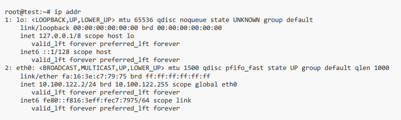

    

* ip地址：标识一个**网卡在网络世界的通讯地址**

  * ipv4：32位，且被分为5类，a、b、c类由网络号+主机号两部分组成。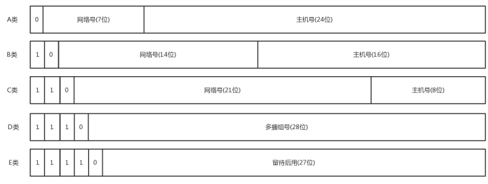

    a、b、c三类地址范围和最大主机数

    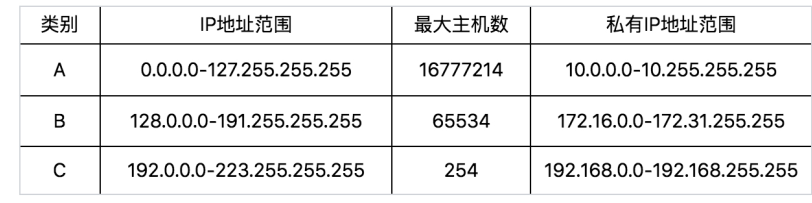

  * ipv6：128位

  * **无类型域间选路(CIDR)**

    由于c类主机太少、b类太多，可能造成浪费，故出现CIDR，其将32位的ip分两部分网络号+主机号

    形式：10.100.122.2/24，前24位为网络号，后8位为主机号  【路由器**根据网络号来转发分组**】

    **同时产生广播地址、子网掩码概念。**

    广播地址：网络号+【主机号全为1】，向该地址发送，源主机所在网络的所有主机都可以收到。

    子网掩码：网络号全为1+主机号全为0，**用于和ip地址做与运算得出该ip地址的网络号。**

  * 公有ip地址和私有ip地址：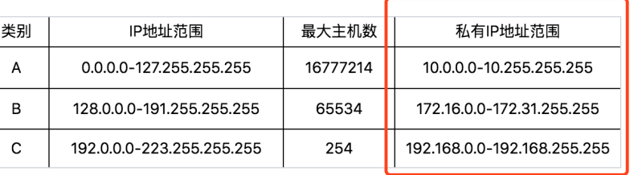

    私有ip地址一般是**组织内部使用的，自己管理、分配，**

    其在**不同组织间可以重复**，**同一组织内不可重复**。

    公有ip地址是全局唯一的，可和外网通信。

    组织通常有多个私有ip地址、1个公有ip地址，这样才能访问外网。

    例子：私有ip地址：192.168.0.10/24，表示192.168.0为某个组织下的某个子网，10为该子网下的某个主机号，该子网的网络的出口地址为192.168.0.1，而192.168.0.255为该网络的广播地址。

  * D类地址是**组播地址**，使用这一类地址，**属于某个组的机器都能收到**。

  * 环回地址：127.0.0.1，**用于本机通信，对应包不会在任何网络中出现。**

* MAC 地址：**网卡的物理地址**，**16进制表示，6字节大小**

  * **全局唯一**，网卡自生产出来，就带该地址
  * 既然MAC地址已经全局唯一了，那**为什么不直接使用MAC地址通信？**
    * 其**通信范围比较小**，**局限在一个网络里面**，而**跨网络的通信需要ip地址**。即需**先通过ip地址找到某个网络**，然后再在该子网内通过MAC地址通信。**IP地址起到的是远程定位的功能，MAC地址起到的是标识功能。**

  
  

## 04 DHCP与PXE IP怎么产生，怎么消失

* 发送数据包时，主机会先判断目的ip地址**是否与主机在同一网络**，如果在，则**会发送ARP请求**，获取对应的主机的MAC地址，否则则会**获取网关的MAC地址**，然后将包发出去。
* 接收数据包时，则会先判断MAC地址是不是它，是则向上判断ip是否相同再进一步操作，否则拒收。
* 配置ip地址时，必须确保ip地址对应的网关和当前网络至少一个网卡是一个网段的。
* 动态主机配置协议(DHCP)：**用于自动帮主机配置IP，分为DHCP客户和DHCP服务器，客户为需要配置ip的主机，端口为68，服务器为提供临时ip的主机，端口为67，且DHCP基于UDP实现的。**工作流程如下：
  * 客户机广播发送**发现报文**【DHCP Discover】，源ip全为0，目的ip全为1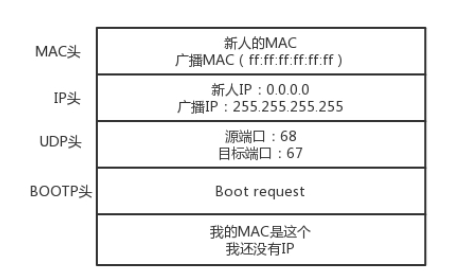
  * 服务机接收包，通过源MAC地址知道其还未配置ip，故提供一个临时ip给它，同样广播【DHCP OFFER】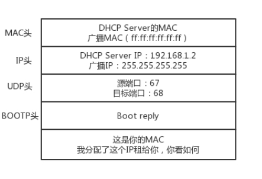
  * 收到多个服务器发送来的DHCP OFFER，客户机会选择一个，并向网络广播发送【DHCP Request】数据包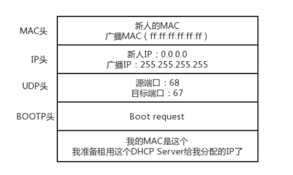
  * DHCP Server 收到客户机的DHCP Request后，会广播返回客户机一个【DHCP ACK】消息包，表示接收客户机的选择。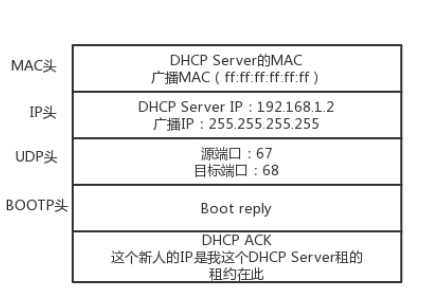
* IP地址的收回和续约
  * 客户机收到的ip**临时有效的，需要在过期前续约**
  * 客户机会在租用期过了一半时间时，向对应的DHCP Server发送【DHCP Request】
  * 服务器收到则会回应【DHCP ACK】，客户机收到后会根据提供的新续期等配置进行更新。
* 预启动执行环境（PXE)：用于帮助主机**自动安装操作系统**，**通过和DHCP协作能自动配置ip和自动安装操作系统。**
  * PXE也分为客户机和服务器，服务器存储初始启动文件用于安装操作系统，PXE客户端安装在客户机的bios中，DHCP服务器分配ip地址时会提供PXE服务器的地址和初始启动文件名，这样PXE客户机只需到对应地址请求初始启动文件进行系统安装就行了。

## 05 从物理层到MAC层

* 第一层（物理层）：
  * **集线器**：将多台主机连接起来，**完全工作在物理层，会将收到的每个字节**，**都复制到其他端口上去，即广播。**
  * 引发出几个问题？这些问题都在第**二层，数据链路层解决。**
    * 包发给谁？谁接收？
    * 发送规则怎样，谁先，谁后
    * 发送错误，怎么办
  
* 第二层（数据链路层）【MAC层即媒体访问控制】
  * 通过MAC地址解决**发给谁**的问题
    * 通过ARP协议【**已知IP求MAC，路由器**，不能是普通交换机】得到MAC地址
    
    * ARP协议主要通过**广播**ARP请求来实现，同时机器本地也会进行**ARP缓存**【避免每次使用ARP请求，当然缓存会在一段时间后过期】。ARP请求是**广播发送，但ARP响应是单播。**目标机器收到ARP请求时，同样会**记录源主机的地址映射到缓存中。**
    
      ARR是解决**同一局域网**上的**主机IP和硬件地址的映射问题**，无法解析另一局域网上主机的硬件地址，和其他局域网主机通信时，需**先解析出网关的硬件地址**。【通过**子网掩码和ip判断是否处于同一局域网**】
    
    * ARP询问和回答的报文格式：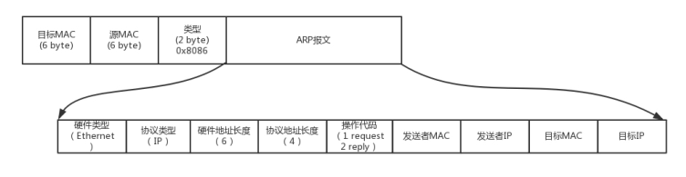
    
  * 通过信道划分、轮流协议、随机接入协议等**多路访问规则来解决第二个问题**
  
  * 通过在第二层包装CRC【**循环冗余检测**】来计算**包在发送过程是否出现错误，来解决第三个问题**。
  
  * 该层的网络包格式：
  
* 集线器是广播的，发生的冲突概率较高，同时会把不需要的包转发出去，纯属浪费。故我们需要能够**根据MAC地址将包转发到相应口**，即**根据策略转发**的设备-**交换机**

* 二层设备交换机：根据**目标MAC地址，根据策略转发到相应口**【同一局域网可通过交换机连接起来】
  * 交换机有一个**转发表**记录每个MAC地址对应的口，且会自动更新维护该表【自学习】
  * 对于未知的MAC地址则会**广播**，已知的进行转发。
  * 其路由表记录了该子网下各MAC地址对应的口
  * **交换机只是有转发功能，并没有MAC地址。**
  
* 通过交换机或者集线器直接相连，两个主机就能在同一网络下通过MAC地址通信了。即通过交换机或集线器连接成一个局域网。

## 06 交换机与VLAN

* VLAN和子网的关系？
  * 局域网：通俗的说就是**局部的网络**，小范围的网络。对比同类概念如城域网、广域网，局域网可以简单理解为一间办公室、一栋办公楼等区域的网络。即地区性的小范围。局域网和**地区**有直接关系。
  * 子网：**一个IP网络分成几个小IP网络即子网**，就是范围**相对**较小的IP网络。子网和**IP地址范围**有直接关系。

* 多个的局域网通过多个交换机连接起来，形成更大的局域网，更加复杂的拓扑结构。

* 复杂的**拓扑结构**可能会出现**环路问题**【**数据包不断在这个网络传输，始终到达不了目的地**】

  * 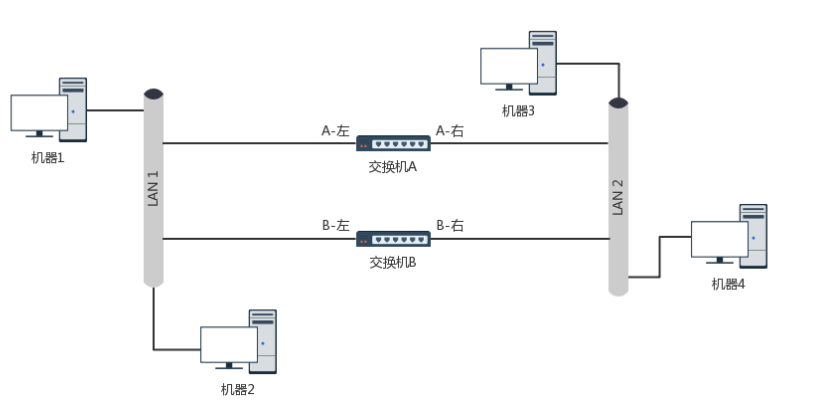
  * 因为机器1的初始的广播包**可能将沿A左-A右-B右-B左-A左这样的路径转来转去**，始终到达不了目的地。
  * 同时交换机A和B也无法学会该拓扑结构：

* 如何解决常见的环路问题？STP【生成树算法实现】

  STP协议解决，将环消除生成最小生成树。

  工作流程：

  * 两两交换机比较，得出两者中的根交换机和指定交换机，并将两者连接起来

  * 和其他交换机进行比较

    todo 详情看文档。。

  不论交换机之间采用怎样的物理连接。交换机都能**根据STP协议**自动计算并构建**一个逻辑上没有环路的网络**，其逻辑拓扑结构必须是树型的(无逻辑环路);

  当首次连接交换机或网络物理拓扑发生变化时（有可能是人为改变或故障)，交换机都将进行生成树的重新计算。

* 如何解决交换机**广播问题和安全问题**？

  * 物理隔离：每个交换机**配置单独的子网**。这样交换机就只能**广播包到同一子网下的机器了**。【这里需要的是路由器，因为需要配置子网，不能再是普通交换机了，**普通交换机只能用于转发同一网络的包**】

  * 虚拟隔离：通过虚拟局域网【VLAN】隔离，**同一局域网下划分不同的虚拟局域网**，为交换机设置每个口所属的VLAN,交换机会将来自**某个虚拟局域网的包转发给相应的虚拟局域网**，这样就实现了隔离。

    对应包格式：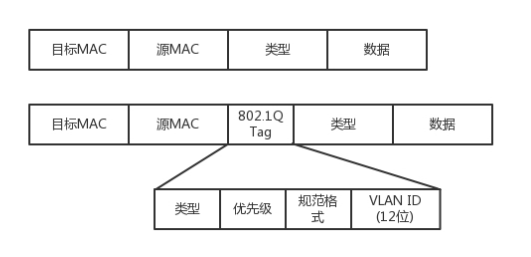
    
    支持VLAN的交换机可通过一种**叫Trunk的口进行连接。**

## 07 ICMP与ping

* ICMP协议（Internet Control Message Protocol）：**ping基于ICMP协议工作**，是ip层的协议，ICMP报文组成为**ip报文**的数据部分。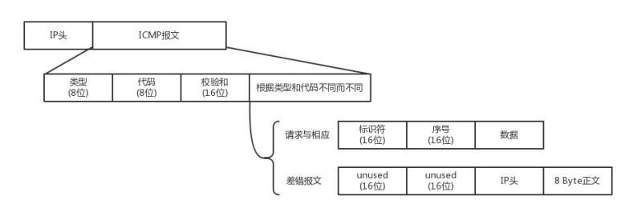

  ICMP报文种类有两种：**查询报文**和**差错报告报文。**

  不同类型有不同的值，**代码字段是进一步区分某种类型的几种不同情况**。主动请求为8，主动请求的应答为0。

  查询报文类型：

  **ping就是查询报文**，是一种**主动请求，并且获得主动应答**的ICMP协议。ping的主动请求称为ICMP ECHO REQUEST，ping的主动应答称为ICMP ECHO REPLY。增加了**标识符字段和序号字段。**

  差错报文类型：终点不可达为3，源抑制为4，超时为11，重定向为5，差错报文通过对收到的**需要进行差错报告的IP数据报**进行**数据提取封装而成**，形成**新的IP数据报**。【报文结构前8字节和查询报文相同，后面跟着出错的IP包的IP头和IP正文前8字节，一般是**接收方向源站发送**】

  终点不可达：具体的原因在代码中表示就是，网络不可达代码为 0，主机不可达代码为 1，协议不可达代码为 2，端口不可达代码为 3，需要进行分片但设置了不分片位代码为4。  

  源站抑制：让发送源放慢发送速度

  时间超时：超过网络包的生存时间还未送到。

  路由重定向：让下次发给另一个路由器。  

* ping 的发送和接收过程  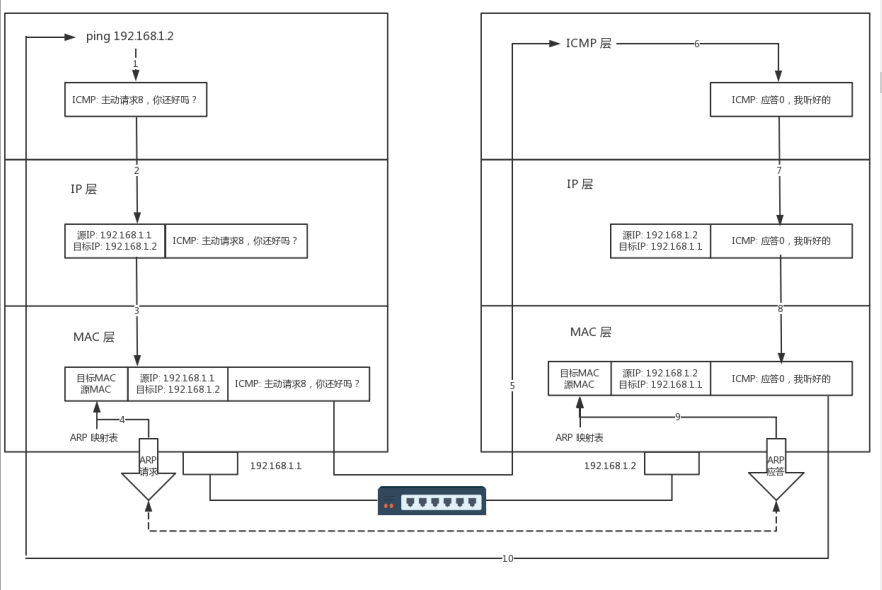

  * ping执行时，源主机构建一个ICMP请求数据包【ECHO REQUEST】，其中含有**类型字段**和**序号字段**，对于请求数据包而言类型字段为8，**序号字段用于区分**ping的时候发出的**多个数据包**，其呈**递增形式**。
  * 然后这个**ICMP数据包会连同目的地址交给IP层**，IP层**加上必要信息构建一个IP数据包**，传给MAC层。
  * MAC层，先查出对应目的IP的MAC地址，如果没有则发送ARP请求查询MAC地址，获取MAC地址后再加上一些必要信息构建MAC帧，然后传给物理层发送出去。
  * 目的主机网卡收到该数据帧后，先检查其目的MAC地址，如果和本机MAC地址不符，则丢弃，否则，将往上层交付，IP层同样检查后提取出IP数据报的数据部分交给ICMP协议。
  * 目的主机这时会构建一个ICMP应答包【ECHO REPLY】，类型字段为0，序号与请求包的序号相同，表示对该请求包的应答，然后再发送给主机A。
  * 如果源主机如果没有接到 ICMP 的应答包，则说明目标主机不可达；如果接收到了ICMP 应答包，则说明目标主机可达。  

  

* Traceroute：**差错报文**类型的**使用**，用于**分析其他类型的错误。**

  * Traceroute：使用ICMP的规则，故意制造一些产生错误的场景。
  * 故意设置特殊的TTL，来追踪去往目的地时沿途经过的路由器。  
  * 选择一个不可能的值作为 UDP 端口号来知道UDP是否到达主机，当该数据报到达时，将使目的主机的 UDP 模块
    产生一份“端口不可达”错误 ICMP 报文。如果数据报没有到达，则可能是超时。  
  * 故意设置不分片，从而确定路径的 MTU 。

## 08 通过网关访问外网

* MAC头和IP头的细节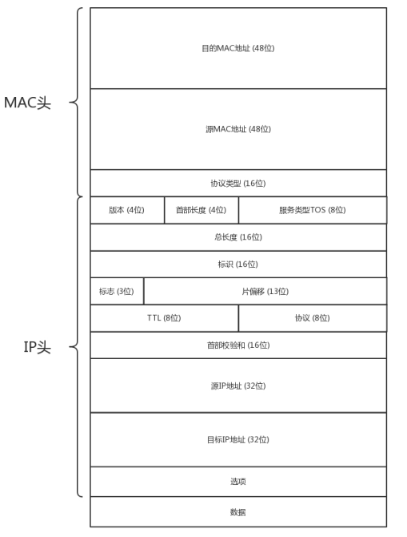

  MAC头协议类型：说明IP层的协议类型。

  IP头的版本号：IPv4等，服务类型TOS：表示包的优先级，TTL：包的剩余存活时间，协议：指明下一层的协议类型

  当要访问另一地址时，都先判断目的IP地址和当前机器的IP地址**是否在同一网段**，通过CIDR和子网掩码判断。

  如果在同一网段，通过ARP获取目的IP的MAC地址，然后封装包发送出去即可

  如果不同网段，需要**先将包发送到默认网关Gateway**，网关一定和源IP地址是同一网络，那么就需要通过ARP获取**网关的MAC地址**，然后发送出去。

  MTU：链路层协议规定的**帧的数据部分长度上限**---**最大传送单元**，**IP数据报的长度上限**。

  帧尾部应该还有FCS，用于**差错检测**。

* 网关是三层转发的设备【把MAC头和IP头都取下，**根据里面内容决定往哪转发**】，往往是一个**路由器**。

* 静态路由是什么？

  即路由表上一条条规则：网段：转发口号

  每当包到路由器上时，会在**路由表上一条条匹配**，符合的，则**从对应口进行转发**。

* 包传输过程中IP头和MAC头哪些变、哪些不变？

  MAC 地址是**一个局域网内才有效**的地址。因而，**MAC 地址只要过网关，就必定会改变**，因为已经**换了局域网**。两者主要的区别在于 IP 地址是否改变。**不改变 IP 地址**的网关，我们称为**转发网关**；**改变 IP 地址**的网关，我们称为**NAT 网关**  。

  转发网关：包每到一个新的局域网，MAC 都是要变的，但是 IP 地址都不变。在 IP 头里面，不会保存任何网关的 IP 地址。所谓的下一跳是，某个 IP 要**将这个 IP 地址转换为 MAC 放入 MAC 头**。  【在整个过程中，IP 头里面的地址都是不变的。**IP 地址在**
  **三个局域网都可见，在三个局域网之间的网段都不会冲突**。在三个网段之间传输包，IP 头不改变。这就像在欧洲各国之间旅游，一个签证就能搞定。  】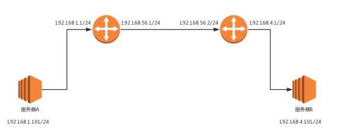

  NAT网关：局域网之间没有商量过，各定各的网段，因而 **IP 段冲突**了。 那么就需要使用另外公网IP代替，目标服务器 B 在国际上要有一个国际的身份，我们给它一个 192.168.56.2。在网关 B 上，我们记下来，国际身份 192.168.56.2 对应国内身份 192.168.1.101。凡是要访问 192.168.56.2，都转192.168.1.101。  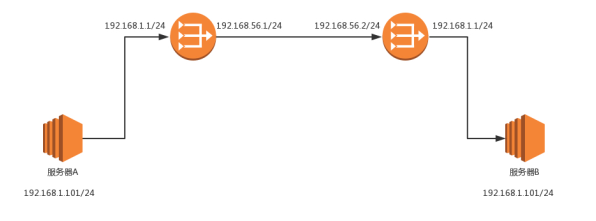

* 很多办公室**访问外网的时候，也是被 NAT 过的**，因为不可能办公室里面的 IP 也是公网可见的，公网地址实在是太贵了，所以一般就是整个办公室**共用一个到两个出口 IP 地址。**  【一般是在**网关将私有IP转为公有IP**，发送时源ip对应网关收到包时会转换为公有ip，接收时对应网关会将目的ip转为私有ip】

​		

## 09 路由协议

* 包出网关后，可能有多个路由器，有多条道路可以选，该选择哪条道路呢？

* 如何配置路由？

  路由表：路由器的转发信息表，至少包含三项：**目的网络、出口设备或下一跳网关地址、子网掩码**【和目的ip做与判断是否和目的网络匹配】。

  网关上的路由策略就是按照这三项配置信息进行配置的。这种配置方式的一个核心思想是：**根据目的 IP 地址来配置路由。**  

* 如何配置策略路由？

  除了可以根据目的 ip 地址配置路由外，还可以**根据多个参数来配置路由**，这就称为**策略路由**。  

  可以配置多个路由表，可以**根据源 IP 地址、入口设备、TOS 等选择路由表，然后在路由表中查找路由**。这样可以使得**来自不同来源的包走不同的路由。**  
  
* 静态路由：手工创建修改的路由。

* 动态路由算法：可以根据**路由协议算法**生成**动态路由表**，随网络运行状况的变化而变化。  

  【看作最短路径问题（不同网络之间、同一网络之间），这里说的是**同一网络间**的】

  * **距离矢量**路由算法：每个路由器都保存一个路由表，包含多行，每行对应网络中的一个路由器，每一行包含两部分信息，一个是要到目标路由器，从那条线出去，另一个是到目标路由器的距离。

    维护建立该表过程：每个路由器根据新收集的信息，计算和其他路由器的距离，比如自己的一个邻居距离目标路由器的距离是 M，而自己距离邻居是 x，则自己距离目标路由器是 x+M。  

    缺陷：

    ​	好消息传得快、坏消息传得慢。【一旦一个路由器挂了，挂的消息是没有广播的。当每个路由器发现原来的道路到不了这个路由器的时候，感觉不到它已经挂了，而是试图通过其他的路径访问，直到试过了所有的路径，才发现这个路由器是真的挂了。 】 

    ​	每次发送的时候，要发送整个当前网络的全局路由表。  

    **最早的路由协议 RIP 就是这个算法。它适用于小型网络（小于 15 跳）。**  

  * **链路状态**路由算法：不像距离距离矢量路由协议那样，更新时发送整个路由表。链路状态路由协议只广播更新的或改变的网
    络拓扑，这使得更新信息更小，节省了带宽和 CPU 利用率。而且一旦一个路由器挂了，它的邻居都会广播这个消息，可以使得坏消息迅速收敛。  

* 动态路由协议 

  * 基于链路状态路由算法的 OSPF：

    OSPF（Open Shortest Path First，开放式最短路径优先）就是这样一个基于链路状态路由协议，广泛应用在数据中心中的协议。主要用在数据中心内部，**用于路由决策**，因而称为**内部网关协议**。内部网关协议的重点就是找到最短的路径 。有时候 OSPF 可以发现多个最短的路径，可以在这多个路径中进行负载均衡，这常常被称为等价路由。  
    
  * 基于距离矢量路由算法的 BGP：外网的路由协议，**即不同网络间的**。对于网络包同样，每个数据中心都设置自己的 Policy。例如，哪些外部的 IP 可以让内部知晓，哪些内部的 IP 可以让外部知晓，哪些可以通过，哪些不能通过。
  
* 自治系统AS：

  * Stub AS：对外只有一个连接。这类 AS 不会传输其他 AS 的包。例如，个人或者小公司的网络。
  * Multihomed AS：可能有多个连接连到其他的 AS，但是大多拒绝帮其他的 AS 传输包。例如一些大
    公司的网络。
  * Transit AS：有多个连接连到其他的 AS，并且可以帮助其他的 AS 传输包。例如主干网  

  每个自治系统都有边界路由器，通过它和外面的世界建立联系。

   

* TCP与UDP的区别：https://www.cnblogs.com/fundebug/p/differences-of-tcp-and-udp.html
* TCP握手次数的原因：https://baijiahao.baidu.com/s?id=1698371111813018757&wfr=spider&for=pc

* 建立连接【面向连接】：是为了在客户端和服务端维护连接，而建立一定的**数据结构**来**维护双方交互的状态**，用这样的数据结构来保证所谓的**面向连接的特性**。  

  

## 10 UDP协议  

* UDP 的全称是 **用户数据报协议**(UDP，User Datagram Protocol)，UDP 为应用程序提供了一种**`无需建立连接`**就可以**发送封装的 IP 数据包的方法。**

* TCP 和 UDP 有哪些区别？  

  **TCP 是面向连接的，UDP 是无连接的** 。

  **TCP是可靠的，UDP不可靠。** 

  **TCP只支持点对点通信，UDP支持一对一、一对多、多对一、多对多；**

  **TCP是面向字节流的，UDP是面向报文的；**

  **TCP有拥塞控制机制，UDP没有。网络出现的拥塞不会使源主机的发送速率降低，这对某些实时应用是很重要的，比如媒体通信，游戏；**

  **TCP首部开销（20字节）比UDP首部开销（8字节）要大。**

  **UDP 的主机不需要维持复杂的连接状态表。**

  * 在互通之前，面向连接的协议会先建立连接 

  * 建立连接【面向连接】：是为了在客户端和服务端维护连接，而建立一定的数据结构来**维护双方交互的状态**，**用这样的数据结构来保证所谓的面向连接的特性。**  

    该数据结构**保证了TCP 提供可靠交付**【TCP 连接传输的数据，**无差错、不丢失、不重复、并且按序到达**】、面向字节流的，并且是**有状态的服务且存在拥塞控制**。

    UDP则**没有任何可靠性保证**的，**且是基于数据报的**，一个一个地发，一个一个地收 ，并且没有拥塞控制功能以及是无状态服务。
    
  * 无连接：**UDP发送数据前无需建立连接**。

  * 不可靠：UDP接收方收到报文后，**不需要给出任何确认。**

  * 面向字节流：指**发送数据时以字节为单位**，一个数据包可以拆分成若干组进行发送，而UDP一个报文只能一次发完。

*  **传输层**什么时候选择TCP，什么时候选UDP？

  * 对某些**实时性要求比较高**的情况，选择**UDP**，比如游戏，媒体通信，实时视频流（直播），即使**出现传输错误也可以容忍**【DNS协议就是基于UDP】；其它**大部分情况下**，都是用TCP，因为要求**传输的内容可靠，不出现丢失**。

* TCP如何保证**传输的可靠性**？ -------------------------------------------------------

  * **数据包校验**，校验和字段。
  * **对收到的失序数据包重新排序**（TCP报文具有序列号）
  * **丢弃重复数据**
  * **应答机制**：接收方收到数据之后，会发送一个确认（通常延迟几分之一秒）；
  * **超时重发**：发送方发出数据之后，启动一个定时器，超时未收到接收方的确认，则重新发送这个数据；
  * **流量控制**：确保接收端能够接收发送方的数据而不会缓冲区溢出。

* UDP 包头 ：
  * **IP 头**里面有个 **8 位协议字段**，会存放，数据里面到底是 TCP 还是 UDP。 
  
  * 处理完传输层的事后，根据**目标端口号**交给**对应的应用程序**处理。无论是TCP 还是 UDP 包头里面应该有端口号 。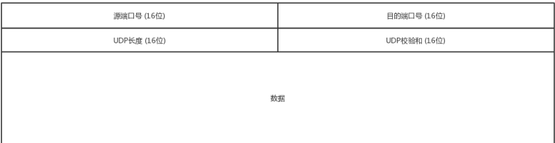
  
  * 校验和字段用来保证**数据安全性**，校验和字段提供了**差错检测**功能。
  
    **差错检测过程**：发送前会将首部其他3个16位数据相加【忽略溢出位】然后**取反填入校验和字段**，接收方收到后会首部四个字段相加，如果值不是16位1则表示包数据出错了，此时接收方会将包丢掉。
  
* UDP 的特点 ：

  * **速度快**，采用 UDP 协议时，只要应用进程将数据传给 UDP，**UDP 就会将此数据打包进 UDP 报文段并立刻传递给网络层**，不像TCP需要**通过拥塞控制抑制发送速度**。使用 UDP 的目的就是希望**实时性**。
  * **无须建立连接**，TCP 在数据传输之前需要经过三次握手的操作，而 UDP 则**无须任何准备**即可进行数据传输。
  * **无连接状态**，TCP 需要在端系统中维护**连接状态**，连接状态包括**接收和发送缓存、拥塞控制参数以及序号和确认号的参数**，在 **UDP 中没有这些参数**，也没有发送缓存和接受缓存。因此，当应用程序运行在 UDP 上，一般**能支持更多的活跃用户。**
  * **报文段首部开销小**，每个 TCP 报文段都有 20 字节的首部开销，而 UDP 仅仅只有 8 字节的开销。

* UDP 的三大使用场景 ：

  * 需要资源少，**在网络情况比较好的内网**，或者对于**丢包不敏感的应用。**  

    **DHCP 就是基于 UDP 协议的**。一般的获取 IP 地址都是内网请求，而且一次获取不到IP 又没事，过一会儿还有机会。我们讲过 PXE 可以在启动的时候自动安装操作系统，操作系统镜像的下载使用的 TFTP，这个也是基于 UDP 协议的。在还没有操作系统的时候，客户端拥有的资源很少，不适合维护一个复杂的状态机，而是因为是内网，一般也没啥问题 。

  * **不需要一对一沟通**，建立连接，而是**可以广播的应用**。

  * 需要**处理速度快**，**时延低**，可以**容忍少数丢包** 。

  同理如果你实现的应用需要有**自己的连接策略**，可靠保证，时延要求，**使用 UDP**，然后**再应用层实现这些**是再好不过了。  

* 基于UDP在应用层**实现自己的连接策略**的例子
  * QUIC（全称Quick UDP Internet Connections，快速 UDP 互联网连接）是 Google 提出的一种基于 UDP 改进的通信协议，其目的是降低网络通信的延迟，提供更好的用户互动体验。 QUIC **在应用层上，会自己实现快速连接建立、减少重传时延，自适应拥塞控制。**
  * 很多直播应用，都基于 UDP 实现了自己的视频传输协议。
  *  游戏对实时要求较为严格的情况下，采用自定义的可靠 UDP 协议，自定义重传策略，能够把丢包产生的延迟降到最低，尽量减少网络问题对游戏性造成的影响。  
  * Google 旗下的Nest 建立 Thread Group，推出了物联网通信协议 Thread，就是基于 UDP 协议的。
  * 移动流量上网的数据面对的协议 GTP-U 是基于 UDP 的。  

## 11 TCP协议（上）  

* 传输控制协议（TCP，Transmission Control Protocol）,其为**两台主机中的进程**提供**可靠的数据传输服务**。 

* TCP协议它天然认为网络环境是恶劣的，**丢包、乱序、重传，拥塞**都是常有的事情，一言不合就可能送达不了，因而要从**算法层面**来保证可靠性。

* TCP 包头格式 ：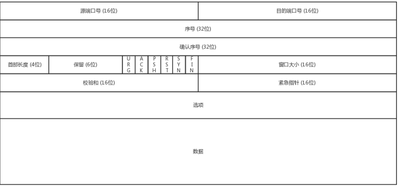

  源端口号和目标端口号是不可少的。

  包的序号【seq】：解决**乱序的问题**，确认哪个应该先来、哪个应该后到。

  确认序号【ack】。发出去的包应该有确认，对当前主机收到的包的确认【**累计确认**】。

  TCP 是靠谱的协议，从 IP 层面来讲，如果网络状况的确那么差，是没有任何可靠性保证的【IP层不保证可靠传输】，而作为 IP 的上一层 TCP 也无能为力，唯一能做的就是更加努力，不断重传，通过**各种算法保证**。也就是说，对于 TCP 来讲，IP 层你丢不丢包，我管不着，但是我**在我的层面上，会努力保证可靠性。【该层通过一定算法调用下层服务保证了可靠】**。

  **状态位**：记录一些状态位。例如 SYN 是**发起一个连接**，ACK 是**回复确认**，RST 是**重新连接**，FIN 是**结束连接**等。TCP 是面向连接的，因而双方要维护**连接的状态**，这些带状态位的包的发送，会引起双方的状态变更。【TCP协议对称层交互过程会切换不同的状态】

  窗口大小：TCP 要做流量控制，**通信双方各声明一个窗口**，**标识自己当前的处理能力**，别发送的太快，撑死我，也别发的太慢，饿死我。**除了做流量控制以外，TCP 还会做拥塞控制**，对于真正的通路堵车不堵车，它无能为力，唯一能做的就是控制自己，也即**控制发送的速度**。不能改变世界，就改变自己嘛。

* TCP连接就是一个数据流，不同序号的包组成了流。

* 掌握 TCP 协议，重点应该关注以下几个问题：  

  * 顺序问题 ，稳重不乱；
  * 丢包问题，承诺靠谱；
  * 连接维护，有始有终；
  * 流量控制，把握分寸；
  * 拥塞控制，知进知退。  

* TCP 的三次握手  

  * 定义：TCP建立连接过程的**交互动作**。

  * 作用：确认**双方**的**接收与发送能力**是否正常，可以**正常传输数据**，和**确定双方TCP包的序号**，为后续可靠传输做准备。

  * 为什么要三次，而不是两次或者四次？

    从第一个角度。通信是双方的行为，**双方都需要确认四件事**，自身的接收发送是否正常以及对方的接收发送是否正常。**如果仅两次的话，服务端是没有办法确认自己发送和对方接收【少了收到客户端的ACK】是否正常的，不是可靠的连接。**
     从第二个角度。也可以**防止失效连接请求到达服务器后重新打开连接**。客户端发送的连接请求如果阻塞。那么客户端等待一个超时重传时间以后，会重发一个连接请求。假设这个来迟**滞留的请求最终到达了服务器**，如果不三次握手的话，服务器就会**打开两个连接，浪费资源**。如果有第三次握手，客户端就会忽略掉服务器之后的连接确认请求。

    可以**采用四次握手**，但**会降低传输效率。**

  * 为避免序列号冲突，每个连接都要有不同的序号。连接的**起始序号是随着时间变化**的，可以看成一个 32 位的计数器，每 4ms 加一。

  * 为了维护这个连接，双方都要维护一个状态机，在连接建立的过程中，双方的状态变化时序图就像这样 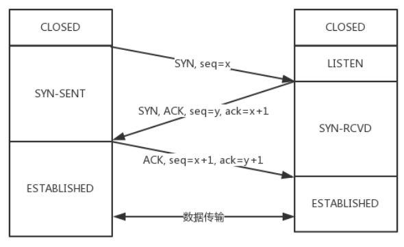

    一开始，客户端和服务端都处于 CLOSED 状态。先是**服务端主动监听某个端口**，处于 LISTEN 状态。
    
    客户端的**连接请求**：客户端发送一个带 SYN 标志位的连接请求，之后处于 SYN-SENT 状态。
    
    服务端的**连接确认请求**：服务端收到发起的连接，回复一个 SYN 和 ACK 的确认报文到客户端，此时服务端进入 SYN-RECV 状态，等待第三次握手。
    
    客户端的**连接确认请求**：客户端接收到确认报文后，向服务端再次发出带 ACK 的确认报文，后客户端这边连接建立，服务端收到客户端的第三次确认报文后，连接建立。
    
    【第三次握手可以携带数据，此时客户端已经处于established状态】

* TCP 握手的异常情况

  * 客户端发出的SYN包丢了：此时服务端根本就不知道客户端曾经发过包，客户端一定时间内**未收到回复**，认为包丢，故触发**超时重传机制**。
  * 服务端发出的SYN，ACK包丢了：客户端超时重传，服务端也会超时重传。
  * 客户端的最后一次发出的ACK包丢了：服务端会触发超时重传，之后**客户端会往服务端发数据包**，该包会带上ACK，所以客户端响应的 ACK 包丢了，服务器也能够**通过之后的包来建立连接。**
  * 客户端故意不发送第三次ACK：**洪水攻击**，服务器在等待第三次握手时是处于**半连接状态【SYN_RCVD】**，也是**需要耗费资源**的，如果有攻击者故意不发送第三次 ACK，让大量连接处于半连接状态，那么会把服务器资源耗尽，洪水攻击的目的就达到了。【但再重传到了指定的**SYN-ACK 重传次数**后，系统将该连接信息从半连接队列中删除】

* 心跳机制：
  * **建立连接后**，服务器每收到一次客户端的请求后都会**重新复位一个计时器**，时间通常是设置为2小时，若两小时还没有收到客户端的任何数据，服务器就会发送一个**心跳检测报文段**，以后**每隔75秒钟发送一次**。若一连发送10个检测报文仍然没反应，**服务器就认为客户端出了故障，接着就关闭连接。**

* TCP 四次挥手：
  * 定义：**TCP连接断开过程中的交互动作**就是四次挥手。

  * 作用：保证两端**合理的断开连接**并**回收各自的资源**。
  
  * 过程：
  
    1、客户端发送一个带 FIN 标志位的**关闭连接请求**，此时客户端进入 **FIN - WAIT - 1** 阶段。
    2、服务器收到该请求后，返回一个 ACK【**关闭确认请求**】，表明已经收到客户端的报文了，此时服务端处于 **CLOSE_WAIT**状态。
    客户端收到 ACK 之后，进入 **FIN - WAIT - 2** 阶段，此时处于半关闭状态，**服务器能给客户端发消息，但客户端不能给服务器发消息。**【不能将服务端的FIN和ACK合并起来的原因：**服务端可能还有数据未发送完毕**】
    3、当服务器把剩下的消息发完之后，会发送一个带 FIN 标志位的关闭连接请求给客户端，此时服务端处于 **LAST_ACK** 的状态。
    4、客户端收到该请求后，发出 ACK 确认，并进入最后的 **TIME - WAIT** 状态，等待 **2MSL**（**最大报文存活时间**） 后释放连接。
    B 收到确认后，释放连接。
  
* 四次挥手的原因：
  
  服务端在收到客户端的 FIN 报文后，仅**表示客户端不在发送数据了**，但客户端还可以接，而**服务端也不是说数据都发完了**，所以服务端可以立即关闭，也可以再发送一段时间的数据后再发送 FIN 报文给客户端表示同意关闭。因此**服务端的 ACK 和 FIN 标志位会分开发送**，在 ACK 和 FIN 之间可能还会给客户端传数据，导致多了一次。【这里的ACK说的是对客户端的FIN报文的ACK】
  
* 为什么客户端要等待 2MSL后再释放连接【最长报文段存活时间，2MSL就是一个报文的来回时间】 ：
  
  第一个角度：**确保最后一个确认报文能到达**，如果服务器没收到来自客户端的 ACK 报文，就会重新发送 FIN 报文到客户端，客户端等待一段时间就是**为了处理这种延迟的情况。**
   第二个角度：等待一段时间是为了**让本连接持续的时间内所有报文从网络中消失**，使得下一个新连接里不会出现旧的报文。
  
* TCP 状态机：
  * 将连接建立和连接断开的两个时序状态图综合起来，就是这个著名的 TCP 的状态机。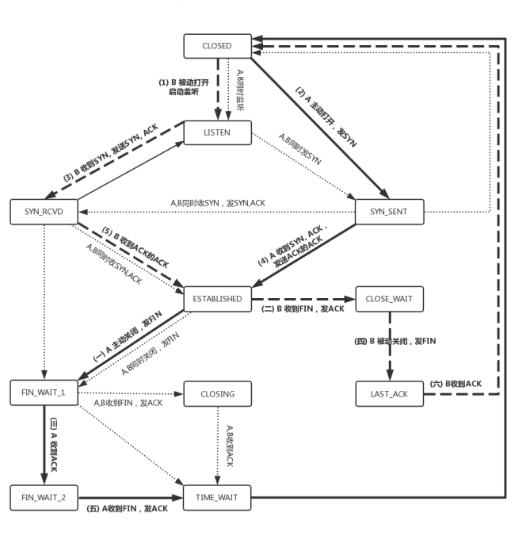  

* 序列号作用：用于**对数据包的编号**，对发送端来说指明下一个待发送的数据包，接受端指明下一个待接收的数据包。

## 12 TCP协议（下）  

* TCP如何保证**可靠传输**：

  就是客户端每发送的一个包，服务器端都应该有个回复，如果服务器端超过一定的时间没有回复，客户端就会重新发送这个包，直到有回复，同时每个包都需要编号，并且包不必按顺序处理，可以先处理后序的包。

  **为发送的每个包编号并提供累计确认机制，同时对丢失的包会有重传机制，并提供流量控制保证接收端来得及处理包。**

* 如何实现一个靠谱的协议：

  TCP协议采取上述模式，且每个包都有一个ID。建立连接的时候，会商定起始的 ID 是什么，然后按照 ID 一个个发送。为了保证不丢包，对于发送的包都要进行应答，但是这个应答也不是一个一个来的，而是**会应答某个之前的 ID，表示都收到了**，这种模式称为**累计确认或者累计应答（cumulative acknowledgment）。**

  为了记录所有发送的包和接收的包，TCP 也需要发送端和接收端分别都有**缓存来保存这些记录**。

  * 发送端的缓存里是按照包的 ID 一个个排列，根据处理的情况分成四个部分。【发送端发送seq，接收ack】

    发送了并且已经确认的。

    发送了并且尚未确认的。

    没有发送，但是已经等待发送的。  

    没有发送，并且暂时还不会发送的。

    在 TCP 里，接收端会给发送端报一个窗口的大小，叫Advertised window。【窗口大小：指明可发送或接收的大小】这个窗口的大小应该等于上面的**第二部分加上第三部分**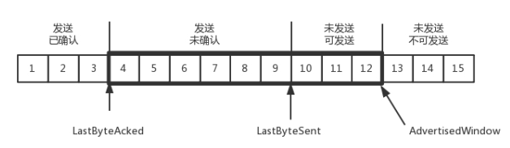  

  * 接收端来讲，它的缓存里记录的内容要简单一些  【接收端接收seq包，发送ack包】

    接受并且确认过的。 

    还没接收，但是马上就能接收的 。

    还没接收，也没法接收的。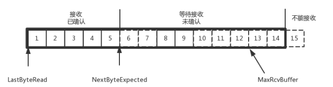

    第二部分窗口的大小：

    AdvertisedWindow=MaxRcvBuffer-((NextByteExpected-1)-LastByteRead)。【收到接收缓存的限制】

    第二部分里面，由于**收到的包可能不是顺序的，会出现空挡，只有和第一部分连续的，可以马上进行回复，中间空着的部分需要等待，哪怕后面的已经来了。**    

* 顺序问题与丢包问题：

  序列号大的包先到时可能是出现**顺序问题或丢包问题**，如上图接收方8、9先到，6、7可能是丢失了、也可能是还没到。

  解决丢包问题的方法：

  * **超时重传**：即发送端对每一个发送了，但是没有 ACK 的包，都有设一个**定时器**，超过了一定的时间，就重新尝试。  

    **超时重传时间的设置**：这个时间不宜过短，时间必须大于**往返时间RTT**，否则会引起不必要的重传。也不宜过长，这样超时时间变长，访问就变慢了。

    【估计往返时间，需要 TCP 通过**采样** RTT 的时间，然后进行**加权平均**，算出一个值，而且这个值还是要不断变化的，因为网络状况不断的变化。除了采样 RTT，还要采样 RTT 的波动范围，**计算出一个估计的超时时间**。由于重传时间是不断变化的，我们称为**自适应重传算法**（Adaptive RetransmissionAlgorithm）。】 

    **超时重传时间呈指数方式增长**，如上图7超时了，重发7，然后再次超时，此时会将超时间隔加倍，即**每当遇到一次超时重传的时候，都会将下一次超时时间间隔设为先前值的两倍。两** **次超时，就说明网络环境差，不宜频繁反复发送。**  
    
    超时重传存在的问题：**超时周期可能相对较长**，丢失的报文段需要**较长时间才能重传**。
    
    解决方法【快速重传算法】：
    
    * 当接收方收到一个序号大于下一个所期望的报文段时，就**检测到了数据流中的一个间格**，于是**发送三个冗余的 ACK**，客户端收到后，就**在定时器过期之前，重传丢失的报文段**。
    * Selective Acknowledgment （SACK）：这种方式需要在 TCP 头里加一个 SACK 的东西，可以将缓存的地图发送给发送方。  【例如可以发送 ACK6、SACK8、SACK9，有了地图，发送方一下子就能看出来是 7 丢了。  】
  
* 流量控制问题：【能发送多少包】

  * 目的：**防止发送方发送速率太快**，接收方**缓存区不够导致溢出。**
  * 实现：使用**滑动窗口协议**实现。
  * 工作流程【机制】：接收端在发送对于包的**确认**中，同时会**携带一个接收窗口的大小**，如果接收方处理的太慢，导致缓存中没空间了，可以修改接收端窗口的大小，甚至可以设置为0，并通过ACK包返回，从而控制**发送端**这边窗口的大小。修改窗口的大小通过**移动边界**即滑动窗口完成。
  * **零窗口**问题：发送端的窗口为0后，发送方会定时发送**窗口探测数据包**到接收端查看接收窗口大小，看是否有机会调整窗口的大小。  

* 拥塞控制问题：【每次发送多少包】

  * 目的：TCP 的拥塞控制就是**在不堵塞，不丢包的情况下，尽量发挥带宽。**

  * 也是通过窗口大小来控制的，前面的滑动窗口 rwnd 是**怕发送方把接收方缓存塞满**，而拥塞窗口 cwnd，是**怕把网络塞满。**

  * 有一个公式 LastByteSent - LastByteAcked <= min {cwnd, rwnd} ，是**拥塞窗口和滑动窗口共同控制发送的速度**。TCP 发送包常被比喻为往一个水管里面灌水，而

  * 设置发送窗口，使得**发送但未确认的包为通道的容量**，就能够撑满整个管道。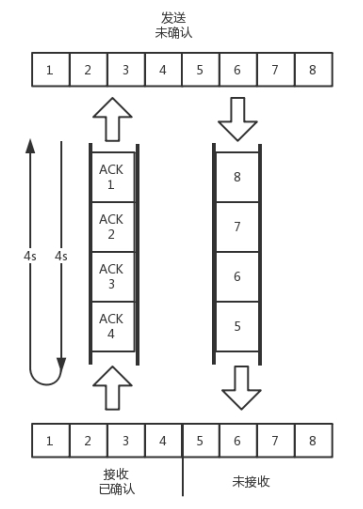  

    主要用来解决**发送速度过快**引起的包丢失和超时重传问题。

    包丢失：**发送速度过快**，设备来不及处理，**多出来的包会被丢弃。**

    超时重传：中间设备加上缓存后，包超过了定义的超时重传时间未被及时处理，触发超时重传。

  * 需要一种**自动发送速度的机制**来控制发送速度

  * **拥塞控制算法**：主要机制是**根据丢包情况动态调整拥塞窗口的大小**，流程如下：

    * **慢启动**【TCP连接刚建立时】：拥塞窗口大小为1，每经过一个传输轮次，窗口大小加倍。

    * **拥塞避免**：达到慢开始门限ssthresh后，变成线性增长。

    * 出现拥塞现象（丢包或超时重传）

      传统算法【慢开始算法】：这时ssthresh设为cwnd/2，将cwnd设为1，重新慢启动。【太激进，一下停下来，会造成网络卡顿】

      **快速恢复算法**：基于前面的**快速重传算法**，接收端发送三个对丢失包的前一个包的ACK，发送端就会重传该包，此时TCP发送端认为这种情况不严重，因为大部分没丢，只丢了一小部分，**门限减半，开始执行拥塞避免算法**，也就是没有一夜回到解放前，而是还在比较高的值，呈**线性增长。**  

    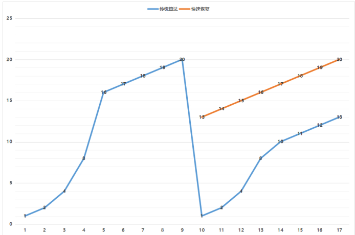

    **这种知进退，使得时延很重要的情况下，反而降低了速度  **

  * 拥塞控制存在的问题：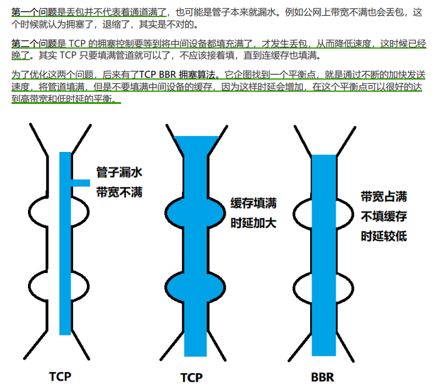

TCP速率受到三个因素影响

- 窗口：即滑动窗口大小。
- 带宽：这里带宽是指**单位时间内从发送端到接收端所能通过的“最高数据率”**，是一种**硬件限制**。TCP发送端和接收端的数据传输数**不可能超过两点间的带宽限制**。发送端和接收端之间带宽取所通过线路的带宽最小值（如通过互联网连接）。
- RTT：即Round Trip Time，表示从**发送端到接收端的一去一回需要的时间**，TCP在数据传输过程中会对RTT进行采样（即对发送的数据包及其ACK的时间差进行测量，并根据测量值更新RTT值），TCP根据得到的RTT值更新RTO值，即Retransmission TimeOut，就是**重传间隔**，发送端对每个发出的数据包进行计时，如果在RTO时间内没有收到所发出的数据包的对应ACK，则任务数据包丢失，将重传数据。一般RTO值都比采样得到的RTT值要大。【即RTT影响RTO】

## 13  套接字Socket

* Socket 编程基于TCP和UDP协议。  
* 讲 TCP 和 UDP 协议的时候，我们分客户端和服务端，在写程序的时候，我们也同样这样分。
* Socket 函数需要指定到底是 IPv4 还是 IPv6，分别对应设置为 AF_INET 和 AF_INET6。另外，还要指定到底是 TCP 还是 UDP。还记得咱们前面讲过的，TCP 协议是基于数据流的，所以设置为SOCK_STREAM，而 UDP 是基于数据报的，因而设置为 SOCK_DGRAM。  

## 14 HTTP协议 

* http://www.163.com 是个 URL，叫作**统一资源定位符**。之所以叫统一，是因为它是有格式的。

  有的 URL 会有更详细的位置标识，例如 http://www.163.com/index.html 。正是因为这个东西是统一的，所以当你把这样一个字符串输入到浏览器的框里的时候，浏览器才知道如何进行统一处理。

  HTTP称为协议，www.163.com 是一个域名，表示互联网上的一个位置。

* HTTP 请求的准备

  浏览器会将 www.163.com 这个域名发送给 DNS 服务器，让它解析为 IP 地址。 

   HTTP 是基于 TCP 协议的，需要先通过三次握手建立 TCP 连接。

  目前使用的 HTTP 协议大部分都是 1.1。在 1.1 的协议里面，默认是开启了 **Keep-Alive 的**，这样建立的**TCP 连接**，就可以在**多次请求中复用**。 【避免每次请求都要建立新连接（三次握手和四次挥手）】 

* HTTP 请求的构建  

  HTTP 的请求的格式：

  第一部分：请求行  

  * URL 就是 http://www.163.com  

  * 版本为 HTTP 1.1  

  * 方法有几种类型。  

    * GET 就是去服务器获取一些资源。  

    * POST，需要主动告诉服务端一些信息，而非获取。 信息一般放在实体中。

    * PUT，就是向指定资源位置上传最新内容。但是，**HTTP 的服务器往往是不允许上传文件的**，所以 PUT 和 POST 就都变成了要传给服务器东西的方法。  

      在实际使用过程中，这两者还会有稍许的区别。POST 往往是用来创建一个资源的，而 PUT 往往是用来修改一个资源的。  

    * DELETE。这个顾名思义就是用来删除资源的。  

  第二部分：首部字段  

  * 首部是 key value，通过冒号分隔。这里面，往往**保存了一些非常重要的字段。**  
    * Accept-Charset，表示客户端可以接受的字符集。  
    * Content-Type是指正文的格式。  

  

* HTTP 请求的发送  

  从输入网址到获得页面的过程 (越详细越好)？

  1. 浏览器查询 DNS，获取域名对应的IP地址:具体过程包括浏览器搜索**自身的DNS缓存、搜索操作系统的DNS缓存、读取本地的Host文件和向本地DNS服务器进行查询等。**对于向本地DNS服务器进行查询，如果要**查询的域名包含在本地配置区域资源中**，则**返回解析结果给客户机**，完成域名解析(此解析具有权威性)；如果要查询的域名不由本地DNS服务器区域解析，但该服务器已缓存了此网址映射关系，则调用这个IP地址映射，完成**域名解析**（此解析不具有权威性）。如果本地域名服务器并未缓存该网址映射关系，那么将根据其设置发起递归查询或者迭代查询；

  2. 浏览器获得域名对应的IP地址以后，**浏览器向服务器请求建立链接，发起三次握手；**

  3. TCP/IP链接建立起来后，浏览器向服务器发送HTTP请求；

     TCP建立连接整个流程：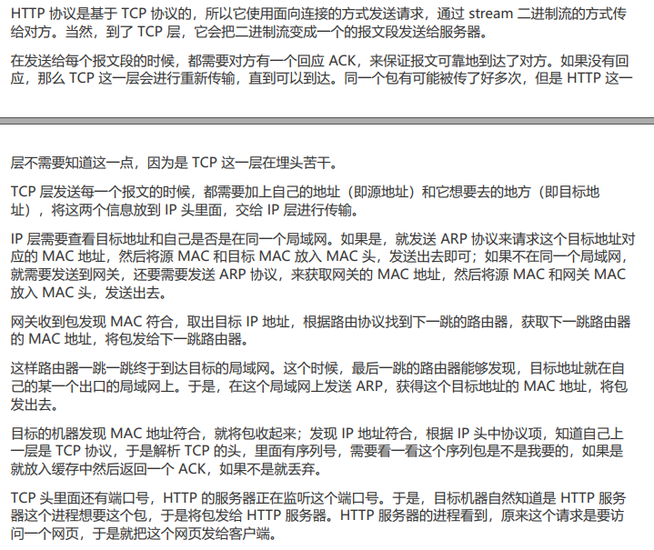

  4. 服务器接收到这个请求，并根据**路径参数映射到特定的请求处理器**进行处理，并将**处理结果及相应的视图返回给浏览器**；

  5. **浏览器解析并渲染视图**，若遇到对js文件、css文件及图片等静态资源的引用，则重复上述步骤并向服务器请求这些资源；

  6. 浏览器**根据其请求到的资源、数据渲染页面，最终向用户呈现一个完整的页面。**

  

* HTTP 返回的构建  

  HTTP 的返回报文也是有一定格式的。这也是基于 HTTP 1.1 的。  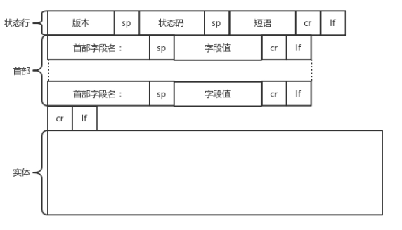

  * 状态行：

    * 状态码会反应 HTTP 请求的结果。  

      “200”意味着大吉大利；而我们最不想见的，就是“404”，也就是“服务端无法响应这个请求”。  503 错误”是说“服务暂时不再和这个值配合使用”。  

    * 短语：该状态码的原因

  * 首部【key-value形式】：

    * Retry-After表示，告诉客户端应该在多长时间以后再次尝试一下。  
    * Content-Type，表示返回的是 HTML，还是 JSON。

      

* HTTP响应的发送：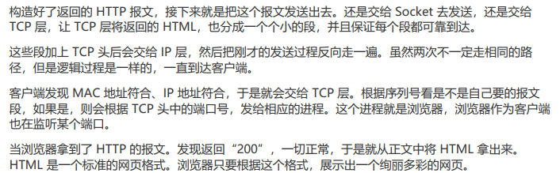

* HTTP 2.0：【细节理清】

  * HTTP 协议也在不断地进化过程中 ，HTTP1.1 基础上便有了 HTTP 2.0。  

  * HTTP 1.1存在的问题：

    * HTTP 1.1 在应用层以**纯文本的形式进行通信**。每次通信都要带**完整的 HTTP 的头**，而且不考虑 pipeline
      模式的话，每次的过程总是像上面描述的那样一去一回。这样在**实时性、并发性上**都存在问题。  

  * 为了解决这些问题，HTTP 2.0 会对 **HTTP 的头进行一定的压缩**，将原来每次都要携带的大量 key value在两端建立一个索引表，对**相同的头只发送索引表中的索引**。【**头压缩**】  

    另外，HTTP 2.0 协议**将一个 TCP 的连接中，切分成多个流**，每个流都有自己的 ID，而且流可以是客户端发往服务端，也可以是服务端发往客户端。它其实只是一个虚拟的通道。流是有优先级的。【**多路复用**】

    HTTP 2.0 还将所有的传输信息分割为更小的消息和帧，并对它们采用**二进制格式编码。**常见的帧有Header 帧，用于传输 Header 内容，并且会开启一个新的流。再就是Data 帧，用来传输正文实体。**多个 Data 帧属于同一个流**。  【二进制编码、分帧】

  * 通过这两种机制，HTTP 2.0 的客户端可以将**多个请求分到不同的流中，然后将请求内容拆成帧，进行二进制传输**。这些帧可以打散乱序发送， 然后根据每个帧首部的流标识符重新组装，并且可以根据优先级，决定优先处理哪个流的数据。

  * 举个例子：我们的一个页面要发送三个独立的请求，一个获取 css，一个获取 js，一个获取图片 jpg。如果使用HTTP 1.1 就是串行的，但是如果使用 HTTP 2.0，就可以**在一个连接里，客户端和服务端都可以同时发送多个请求或回应，而且不用按照顺序一对一对应。**  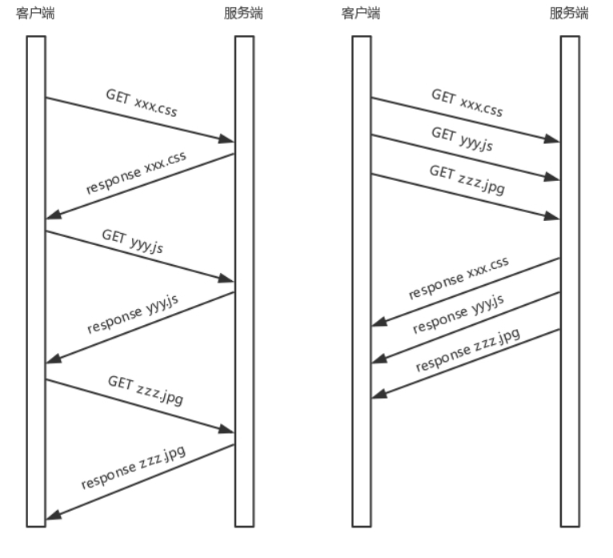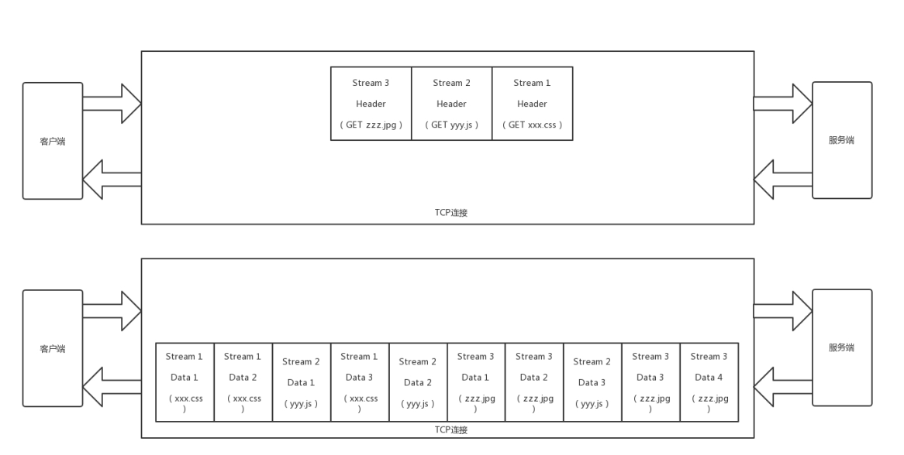

    HTTP 2.0 其实是将**三个请求变成三个流，并将数据分成帧，乱序发送到一个 TCP 连接中**。  

    HTTP 2.0 成功解决了 HTTP 1.1 的**队首阻塞**【一个请求未响应后面请求阻塞】问题，同时，也不需要通过 HTTP 1.x 的 pipeline 机制用多条 TCP 连接来实现并行请求与响应；**减少了 TCP 连接数对服务器性能的影响**，同时将页面的多个数据css、js、 jpg 等通过一个数据链接进行传输，能够加快页面组件的传输速度。

  * 存在问题：

    因为 HTTP 2.0 也是基于 TCP 协议的，**TCP 协议在处理包时是有严格顺序的。**  

    当其中一个数据包遇到问题，TCP 连接需要等待这个包完成重传之后才能继续进行。虽然 HTTP 2.0 通过多个 stream，使得逻辑上一个 TCP 连接上的并行内容，进行多路数据的传输，然而这中间并没有关联的数据。一前一后，前面 stream 2 的帧没有收到，后面 stream 1 的帧也会因此**阻塞**。  

* 基于UDP的QUIC 协议：

  * 自定义连接机制：

    TCP断开重连时，需要再次三次握手，导致一定时延。

    这在 TCP 是没有办法的，但是基于 UDP，就可以**在 QUIC 自己的逻辑里面维护连接的机制**，不再以四元组标识，而是以一个 64 位的随机数作为 ID 来标识，而且 UDP 是无连接的，所以当 IP 或者端口变化的时候，**只要 ID 不变，就不需要重新建立连接。**  

  * 自定义重传机制：

    在 TCP 里面**超时的采样存在不准确的问题**。  

    QUIC 也有个序列号，是递增的。任何一个序列号的包只发送一次，下次就要加一了。RTT 计算相对准确。

    QUIC 定义了一个 offset概念。QUIC 既然是面向连接的，也就像 TCP 一样，是一个数据流，**发送的数据在这个数据流里面有个偏移量 offset，可以通过 offset 查看数据发送到了哪里**，这样只要这个 offset 的包没有来，就要重发；如果来了，按照 offset 拼接，还是能够拼成一个流。  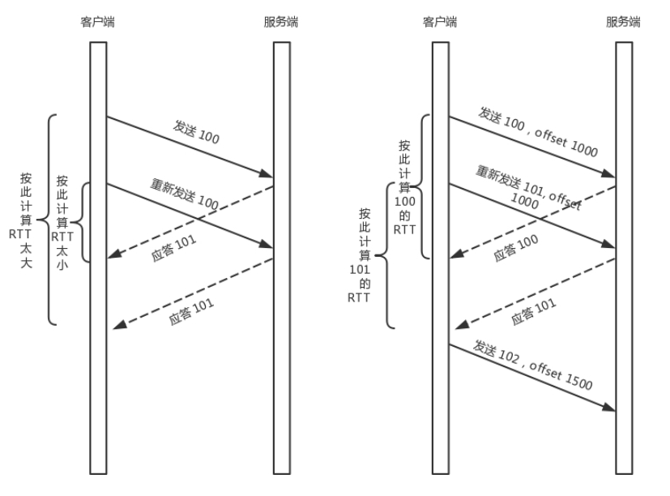

  * 无阻塞的多路复用 ：

    有了自定义的连接和重传机制，我们就可以解决上面 HTTP 2.0 的多路复用问题。  

    QUIC是基于 UDP 的，一个连接上的多个 stream 之间没有依赖。这样，假如 stream2 丢了一个 UDP 包，后面跟着stream3 的一个 UDP 包，虽然 stream2 的那个包需要重传，但是 stream3 的包无需等待，就可以发给用户。  

  * 自定义流量控制：

    TCP 的流量控制是通过滑动窗口协议。QUIC 的流量控制也是通过 window_update，来告诉对端它可以接受的字节数。但是 QUIC 的窗口是**适应自己的多路复用机制的**，不但在一个连接上控制窗口，还在一个连接中的每个 steam 控制窗口。  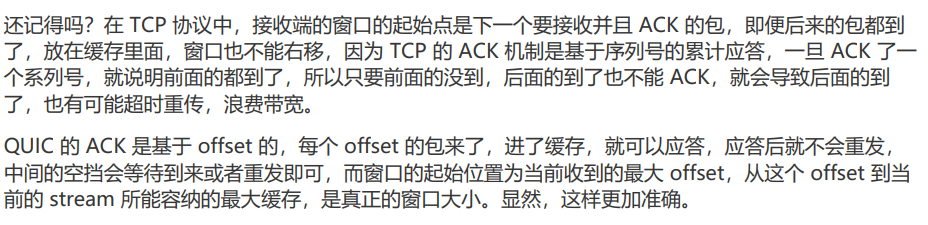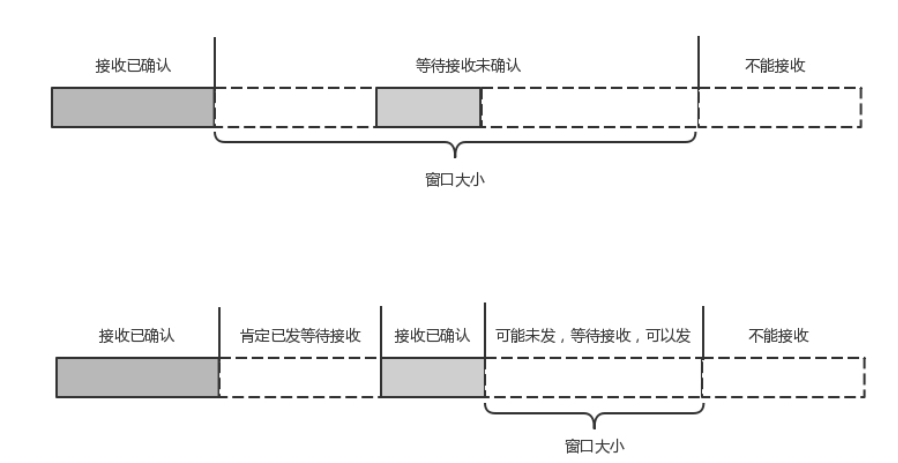

    另外，还有整个连接的窗口，需要对于所有的 stream 的窗口做一个统计。  

* 总结：
  * HTTP 协议虽然很常用，也很复杂，重点记住 GET、POST、 PUT、DELETE 这几个方法，以及重要的首部字段；
  * HTTP 2.0 通过**头压缩、分帧、二进制编码、多路复用**等技术提升性能；
  * QUIC 协议通过基于 UDP 自定义的类似 TCP 的连接、重试、多路复用、流量控制技术，进一步提升性能。  

### HTTP是什么

* HTTP 是**超⽂本传输协议**，也就是HyperText Transfer Protocol。  
* HTTP 是⼀个在计算机世界⾥专⻔在「两点」之间「传输」⽂字、图⽚、⾳频、视频等「超⽂本」数据的「约定和
  规范」。 
* HTTP：**两台主机的应用程序**传输**超文本数据**所用的协议。

### TTP常见的状态码有哪些

* 5大类HTTP状态码

### HTTP常见字段有哪些

* Host 字段 ：
* Content-Length 字段 ：
* Connection 字段 ：
* Content-Type 字段  ：
* Accept 字段  ：
* Content-Encoding 字段  ：
* Accept-Encoding  字段：

### GET和POST

#### GET和POST有哪些区别

* Get ⽅法的含义是**请求从服务器获取资源**，这个资源可以是静态的⽂本、⻚⾯、图⽚视频等。  
* POST ⽅法则是相反操作，**它向 URI 指定的资源提交数据，数据就放在报⽂的 body ⾥**。

#### GET和POST方法都是安全和幂等的吗

* GET是**幂等的**，即读取同一个资源，总是得到相同的数据，POST不是幂等的；
* GET一般用于从服务器**获取资源**，而POST有可能**改变服务器上的资源**；
* 请求形式上：GET请求的**数据附在URL之后**，在HTTP请求头中；POST请求的**数据在请求体中；**
* 安全性：GET请求可被**缓存**、收藏、保留到历史记录，且其请求数据明文出现在URL中。POST的参数不会被保存，安全性相对较高；
* GET只允许ASCII字符，POST对数据类型没有要求，也允许二进制数据；
* GET的**长度有限制**（操作系统或者浏览器），而POST**数据大小无限制**

###  Session与Cookie的区别？

* 背景：**HTTP协议是无状态协议，为了避免请求重复的数据，引入Session和Cookie存储状态。**

* Session是**服务器端保持状态**的方案，Cookie是**客户端保持状态**的方案
* Cookie保存在客户端本地，客户端请求服务器时会将Cookie一起提交；Session保存在服务端，通过**检索Sessionid**查看状态。保存Sessionid的方式可以采用Cookie，如果禁用了Cookie，可以使用URL重写机制（把会话ID保存在URL中）。

## 15 HTTPS协议  

* 出现背景：**HTTP协议明文传输存在安全风险，HTTPS保证了传输数据时的安全。**

* 在 HTTPS 中，使用`传输层安全性(TLS)`或`安全套接字层(SSL)`对通信协议进行**加密**。也就是 HTTP + SSL(TLS) = HTTPS。

* 加密分为两种方式一种是对称加密，一种是非对称加密。  

  * 在对称加密算法中，加密和解密使用的密钥是相同的。也就是说，加密和解密使用的是同一个密钥。因此，对称加密算法要保证安全性的话，密钥要做好保密。只能让使用的人知道，不能对外公开。  
  * 在非对称加密算法中，加密使用的密钥和解密使用的密钥是不相同的。一把是作为公开的公钥，另一把是作为谁都不能给的私钥。公钥加密的信息，只有私钥才能解密。私钥加密的信息，只有公钥才能解密。  
  * 因为对称加密算法相比非对称加密算法来说，**效率要高得多，性能也好，所以交互的场景下多用对称加密。**  

* 对称加密：

  * 假设你和外卖网站约定了一个密钥，你发送请求的时候用这个密钥进行加密，外卖网站用同样的密钥进行解密。这样就算中间的黑客截获了你的请求，但是它没有密钥，还是破解不了。  
  * 问题：**约定密钥需要保证安全。**

* 非对称加密：

  * 非对称加密的私钥放在外卖网站这里，不会在互联网上传输，这样就能保证这个秘钥的私密性。但是，对应私钥的公钥，是可以在互联网上随意传播的，只要外卖网站把这个公钥给你，你们就可以愉快地互通了。

  * 只有一对公钥私钥的问题：

    你拿公钥加密，外卖网站私钥解密，但回复时外卖网站不能拿私钥加密【公钥不能解密，公钥公开】，外卖网站也不能拿公钥加密【私钥只在外卖网站有】，黑客也可以模拟发送“我要定外卖”这个过程的，因为它也有外卖网站的公钥。

  * 解决方法：

    为了解决这个问题，看来**一对公钥私钥是不够的**，客户端也需要有自己的公钥和私钥，并且客户端要把自己的公钥，给外卖网站。这样，客户端给外卖网站发送的时候，用外卖网站的公钥加密。而外卖网站给客户端发送消息的时候，使用客户端的公钥。这样就算有黑客企图模拟客户端获取一些信息，或者半路截获回复信息，但是由于它没有私钥，这些信息它还是打不开。    

    存在的问题：**如何将不对称加密的公钥给对方且怎么鉴别别人给你的公钥是对的。**

    解决方法：对密钥进行签名认证【数字证书】

* 数字证书：

  * 目的：**确保客户端收到的公钥是正确的**。

  * 有什么？

    公钥、证书的所有者、证书的发布机构和证书的有效期。

    由权威部门【CA】颁发。

  * 如何**保证证书不是假冒的**：

    **客户端将证书请求发送给权威机构**时，权威机构会给这个证书卡一个章，我们称为签名算法。【CA会对证书**签名**】

    签名算法大概是这样工作的：一般是CA对明文信息做一个 Hash 计算，得到一个 Hash 值，这个过程是**不可逆的**，也就是说无法通过 Hash 值得出原来的信息内容。在把信息发送出去时，把这个 **Hash 值用CA私钥加密后**，作为一个签名和信息一起发出去。  【CA私钥对明文信息的Hash值加密形成签名，签名+明文信息形成数字证书，**客户端获取到数字证书后**就获取**CA的公钥进行解密出Hash值，然后再对信息做重复Hash计算，**比较**两个Hash值是否相等**，不相等则该证书不可信】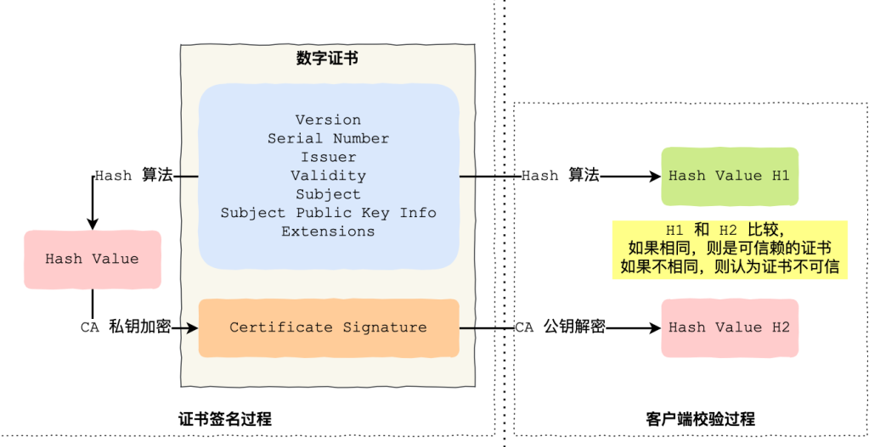

    客户端收到证书后，通过去证书上的CA获取CA公钥，然后解密证书的签名，如果解密成功，且Hash也对上，则**服务端公钥没问题。**

  * 如何**保证CA 的公钥就是对**的呢？【CA是私钥加密，公钥解密】

    **证书链保证**：CA 的公钥也需要更牛的 CA 给它签名，然后形成 CA 的证书。要想知道某个 CA 的证书是否可靠，要看 CA 的上级证书的公钥，能不能解开这个 CA 的签名。这样层层上去，直到全球皆知的几个著名大 CA，称为root CA，做最后的背书。通过这种层层授信背书的方式，从而保证了非对称加密模式的正常运转。   

* HTTPS 的工作模式：【**服务端和客户端协商对称加密密钥时使用了非对称加密算法**，CA{私钥加密，公钥解密}，**服务端将非对称加密的公钥放在证书中**，客户端拿到证书后，**使用公钥加密第三个随机数**，**服务端使用私钥解密**{公钥加密，私钥解密}，**服务端和客户端就有了三个随机数，然后生成对称加密的密钥**。】

  其将两种加密方式结合起来，**非对称加密主要用于传输对称加密的秘钥，而真正的双方大数据量的通信都是通过对称加密进行的。**

  * 在客户端和服务端通过TCP三次握手建立连接后
  * 客户端会向服务器发送请求，其会**携带客户端支持的多组加密规则（包括对称加密、非对称加密、摘要算法等）以及生成的一个随机数**，在协商对称密钥的时候使用  。
  * 服务端**从中选出一组加密规则**，另外，还会生成一个随机数，发送给客户端，随机数在协商对称密钥的时候使用。  
  * 服务端将**非对称加密的公钥**等信息封装起来发给CA，CA会对信息进行签名，并返回一个数字证书。
    * 客户端**获取证书后对证书进行校验证书是否有效**。
  * 证书校验无误后，客户端计算产生随机数字 Pre-master，发送 ClientKey Exchange，**用证书中的公钥加密，再发送给服务器，服务器可以通过私钥解密出来。**  
    * 到目前为止，无论是客户端还是服务器，都有了三个随机数，分别是：自己的、对端的，以及刚生成的Pre-Master 随机数。通过这三个随机数，可以在客户端和服务器产生相同的对称密钥。  
  * 生成对称密钥后，客户端发⼀个「Change Cipher Spec」，告诉服务端开始使⽤加密⽅式发送消息。然后，客户端再发⼀个「Encrypted Handshake Message（Finishd） 」消息，把**之前所有发送的数据做个摘要计算**，再⽤会话密钥（master secret）加密⼀下，让服务器做个验证，验证加密通信是否可⽤和之前握⼿信息是否有被中途篡改过。  
  * 浏览器**解密并验证摘要**，若一致，则握手结束。之后的数据传送都使用对称加密的密钥进行加密

* 总结：

  * 加密分对称加密和非对称加密。对称加密效率高，但是解决不了密钥传输问题；非对称加密可以解决这个问题，但是效率不高。
  * 非对称加密需要通过证书和权威机构来验证**公钥的合法性**  
  * **HTTPS 是综合了对称加密和非对称加密算法的 HTTP 协议。既保证传输安全，也保证传输效率。**   
  * 非对称加密算法用于在握手过程中加密生成的加密密钥；对称加密算法用于对真正传输的数据进行加密；**摘要算法用于验证数据的完整性。**

### 什么是SSL

* SSL代表安全套接字层。它是一种用于加密和验证应用程序（如浏览器）和Web服务器之间发送的数据的协议。 用于提供身份验证 ，HTTPS 的 S 其实指就是 SSL 协议。

### SSL的过程

* 首先客户端向服务器发起 SSL 连接请求。
* 服务器把自己的证书发给客户端的浏览器。
* 客户端浏览器检查服务器过来的证书是不是 CA 签发的，如果是，就继续执行协议，如果不是，就发出一个警告，询问是否继续。
* 继续协议：从证书中把服务器的公钥拿下来，用公钥加密通信用的对称密钥，发给服务器。服务器用自己的私钥对其解密，拿到对称密钥。
* 接下来就可以进行数据传输，服务器和客户端双方用相同的对称密钥对数据加密，可以保证安全。

**怎么保证服务器公钥不会被篡改**

* 服务端先对信息进行hash计算，然后CA用私钥对hash值进行加密即签名，然后将信息和签名作为证书发送出去，这样客户端拿到证书后可以进行验证，验证通过后，就表示未被篡改。

### HTTP和HTTPS的区别

* 端口来讲：HTTP 的**端⼝号**是 80， HTTPS 的端⼝号是 443。
* 安全性来讲：HTTP（超文本传输协议）信息是明文传输，HTTPS运行在SSL(Secure Socket Layer)之上，添加了加密和认证机制，更加安全；
* HTTPS由于加密解密会带来**更大的CPU和内存开销**；
* HTTPS通信**需要证书**，一般需要向证书颁发机构（CA）购买。
* **HTTP 连接建⽴相对简单**， TCP 三次握⼿之后便可进⾏ HTTP 的报⽂传输。⽽ **HTTPS 在 TCP 三次握⼿之后，还需进⾏ SSL/TLS 的握⼿过程**，才可进⼊加密报⽂传输。

 输入 [www.baidu.com，怎么变成](https://gitee.com/link?target=http%3A%2F%2Fwww.baidu.com%EF%BC%8C%E6%80%8E%E4%B9%88%E5%8F%98%E6%88%90) [https://www.baidu.com](https://gitee.com/link?target=https%3A%2F%2Fwww.baidu.com) 的

* 一种是原始的**302跳转**，服务器把所有的HTTp流量跳转到HTTPS。但这样有一个漏洞，就是**中间人可能在第一次访问站点的时候就劫持**。 解决方法是引入HSTS机制，用户浏览器在访问站点的时候强制使用HTTPS。

 什么是对称加密、非对称加密？区别是什么？

* 对称加密：加密和解密采用相同的密钥。如：**DES**、RC2、RC4
* 非对称加密：需要两个密钥：公钥和私钥。如果用公钥加密，需要用私钥才能解密。如：**RSA**
* 区别：**对称加密速度更快**，通常用于大量数据的加密；非对称加密**安全性更高**（不需要传送私钥）

## DNS协议

* DNS服务器：

  * 定义：DNS 即域名系统，全称是 **D**omain **N**ame **S**ystem。

    DNS 是：

    1. 一个由**分层的 DNS 服务器**实现的**分布式数据库**
    2. 一个**使得主机能够查询分布式数据库**的**应用层协议**

  * 作用：通过域名查找IP地址，基于域名做负载均衡。

  * 架构：高可用、高并发和分布式的。

  * DNS服务器层次结构：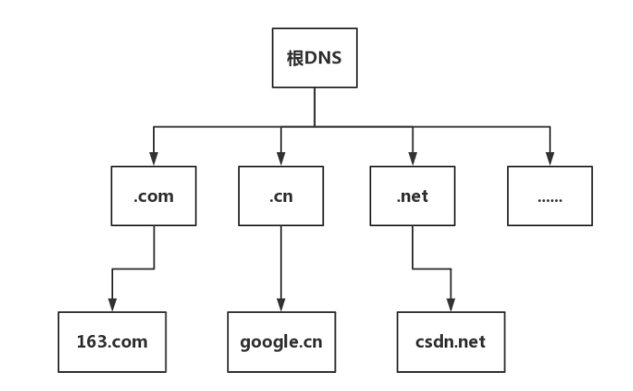

    * 根DNS服务器：返回顶级域DNS服务器的IP地址。
    * 顶级域（Top-Level Domain, TLD）DNS服务器：返回权威DNS服务器的IP地址。
    * 权威DNS服务器：返回相应主机的IP地址。

  * 本地DNS服务器：

    * **严格来说，本地 DNS 服务器并不属于 DNS 的层次结构**，但它对 DNS 层次结构是至关重要的。
    * 一般来说每个区域都有一台本地DNS服务器。
    * 作用：当主机发出 DNS 请求时，该请求被发往本地 DNS 服务器，**本地 DNS 服务器起着代理的作用**，并负责将该请求**转发**到 DNS 服务器层次结构中。

  * DNS解析流程：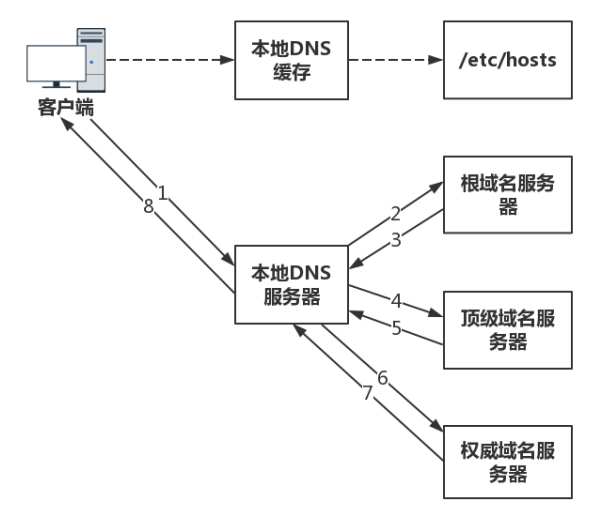

    * 客户端发送DNS请求到本地DNS服务器。【本地DNS服务器地址通常由网络服务商自动分配】

    * 本地DNS服务器查找缓存，没有，则转发报文到根DNS服务器。【根域名服务器不做域名解析但可给出顶级域名DNS服务器地址】

    * 根DNS服务器收到请求后，根据顶级域名返回相应顶级域服务器地址列表。

    * 本地 DNS 服务器则向其中一台 TLD 服务器发送查询报文；【顶级域服务器负责管理二级域名】

    * 顶级域服务器收到请求后，根据二级域名返回相应的权

      威DNS服务器的IP地址。

    * 本地DNS接着发送查询报文到权威DNS服务器，权威DNS服务器解析出域名，并返回。【权威DNS服务器是域名解析结果的原出处】

    * 本地DNS再将IP地址返回给客户端，DNS请求完成。

  * 通常来说，解析过程需要进行递归查询和迭代查询：

    * 递归查询：主机项本地DNS服务器发出的查询。
    * 迭代查询：本地 DNS 服务器向根 DNS 服务器发送查询请求、本地 DNS 服务器向 TLD 服务器发送查询请求、本地 DNS 服务器向权威 DNS 服务器发送查询请求，**所有的请求都是由本地 DNS 服务器发出，所有的响应都是直接返回给本地 DNS 服务器**。

  * 从理论上讲，**任何 DNS 查询既可以是递归的，也可以是迭代的**。

    下图的所有查询就都是递归的，不包含迭代。

  * DNS做负载均衡：

    * DNS基于域名做负载均衡，将外部请求负载均衡到不同IP的服务器上。
    * 内部负载均衡：
      * DNS服务器内完成外部流量负载均衡到各服务器。
    * 全局负载均衡：
      * DNS服务器会根据数据中心所在地方IP进行区分，客户端访问DNS服务器时，DNS会根据客户端所在的地方IP获取对应多个数据中心，然后再对这多个数据中心做负载均衡。

## HTTPDNS  

* 传统DNS存在的问题：
  * **解析速度和更新速度的平衡**问题：
    * DNS为加快解析速度会引入缓存，但引入缓存后，域名更新后，缓存就会失效，而缓存的更新需要递归遍历多个DNS服务器，更新速度较慢。
  * **调度**问题：
    * DNS可能将解析请求转发给其他地区的DNS，而此时返回的IP可能访问速度会非常慢。
* HTTPDNS
  * 定义：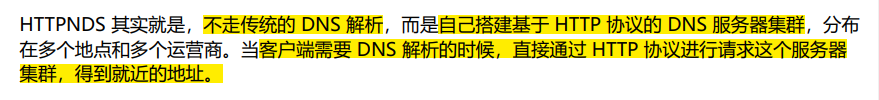
  * 往往使用在手机引用上。
  * 工作模式：
    * 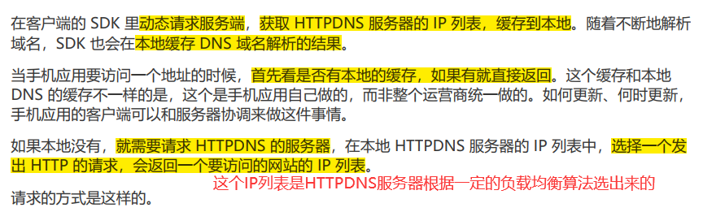
  * 如何解决传统DNS存在的问题：
    * HTTPDNS的缓存设计：客户端自己维护缓存。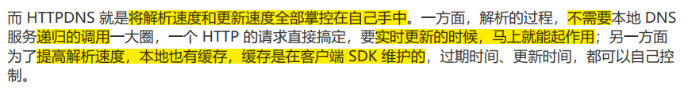
      * 如何解决缓存的过期、更新、不一致问题。
        * 客户端设置缓存过期时间，如果缓存不命中或者缓存过期且客户端不允许使用过期记录，则发其一次解析。
        * 缓存更新方式：
          * 同步更新：只要需要解析就马上发请求进行解析。
            * 优点：实时性好。
            * 缺点：请求多次，资源浪费。
          * 异步更新：多个解析请求合并再发送。
            * 优点：减少HTTPDNS压力。
            * 缺点：实时性不好。
    * HTTPDNS的调度设计：
      * 具体流程：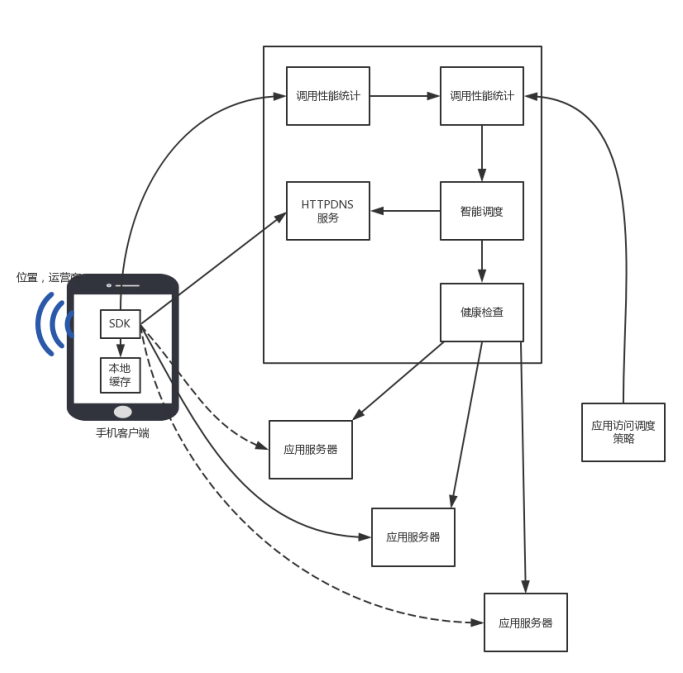
      * 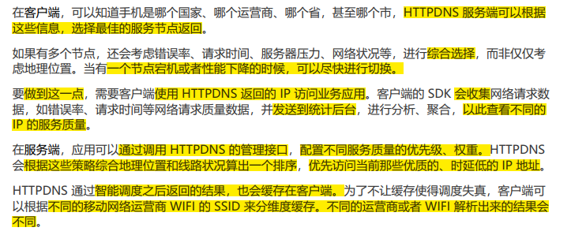
      * HTTPDNS服务器会通过客户端收集的数据查看不同IP的质量，客户端发送请求到HTTPDNS服务端时，HTTPDNS会根据IP质量和客户端的位置、具体运营商等信息做负载均衡选出一个IP列表返回给客户端，客户端会以运营商作为维度进行缓存。

